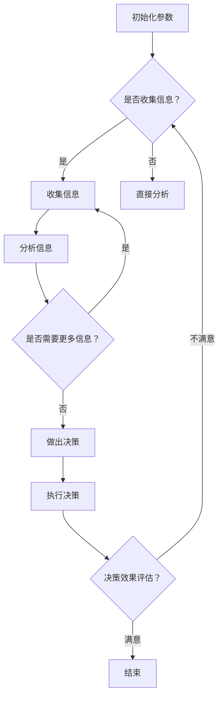

                 


## 管理者决断力：果断决策的重要性与方法

### 关键词：
- 管理者决断力
- 决策方法
- 心理素质
- 商业决策
- 案例分析

### 摘要：

在快速变化和竞争激烈的商业环境中，管理者面临的决策复杂多样。管理者决断力是指在面对不确定性和压力时，能够迅速做出合理决策的能力。本文旨在探讨管理者决断力的重要性，分析其关键要素，并提供实用的决策方法和策略。通过深入了解管理者决断力的构成，读者将能够更好地应对日常工作和生活中的决策挑战。

### 第1章：引言

#### 1.1 问题背景

在当今快速变化且竞争激烈的商业环境中，管理者面临的决策复杂多样，决策的质量直接影响到组织的生存和发展。传统决策方法往往依赖于经验、直觉和习惯，难以应对日益复杂的市场环境。因此，管理者决断力的提升成为当务之急。

#### 1.2 问题描述

管理者决断力是指在面对不确定性和压力时，能够迅速做出合理决策的能力。这种能力不仅涉及逻辑思维和分析能力，还需要管理者具备果断、自信和适应变化的素质。

#### 1.3 问题解决

本书旨在探讨管理者决断力的重要性，分析其关键要素，并提供实用的决策方法和策略。通过深入了解管理者决断力的构成，读者将能够更好地应对日常工作和生活中的决策挑战。

#### 1.4 边界与外延

管理者决断力不仅适用于商业领域，也适用于其他需要决策的场合，如政治、教育、医疗等。本书将侧重于商业环境中的管理者决断力，但所提供的原则和方法具有广泛的适用性。

#### 1.5 概念结构与核心要素组成

1. **决断力定义**：明确决断力的概念和作用。
2. **决策类型**：分类介绍不同类型的决策及其特点。
3. **决策过程**：详细解析决策的各个步骤和关键因素。
4. **决策方法**：介绍各种决策方法和工具。
5. **心理素质**：探讨管理者在决策过程中所需的心理素质。
6. **案例分析**：通过具体案例展示管理者决断力的应用。

### 第2章：管理者决断力的核心概念与联系

#### 2.1 核心概念原理

2.1.1 **决断力的定义**：管理者决断力是指在面对不确定性和压力时，能够迅速做出合理决策的能力。

2.1.2 **决策的三大要素**：信息收集、分析判断和执行落实。

2.1.3 **决策的类型**：战略决策、战术决策和操作决策。

#### 2.2 概念属性特征对比表格

| 特征         | 战略决策 | 战术决策 | 操作决策 |
| ------------ | -------- | -------- | -------- |
| 时间跨度     | 长期     | 中期     | 短期     |
| 决策频率     | 低频     | 中频     | 高频     |
| 影响范围     | 广泛     | 局部     | 局部     |
| 决策难度     | 高      | 中       | 低      |

#### 2.3 ER实体关系图架构

```mermaid
erDiagram
  产品 -->|需求| 用户
  项目 -->|包含| 任务
  任务 -->|执行| 人员
  人员 -->|负责| 项目
```

### 第3章：管理者决断力的算法原理

#### 3.1 算法mermaid流程图



#### 3.2 Python源代码

```python
def make_decision(parameters):
    collect_info = parameters['collect_info']
    analyze_info = parameters['analyze_info']
    execute_decision = parameters['execute_decision']
    evaluate_decision = parameters['evaluate_decision']
    
    if collect_info:
        collected_data = collect_data()
        analyze_data(collected_data)
    else:
        collected_data = None

    decision = analyze_info(collected_data)
    execute_decision(decision)
    
    if evaluate_decision(decision):
        print("决策满意")
    else:
        print("决策不满意")
```

### 结论

管理者决断力是现代管理者必备的能力，它决定了组织在复杂多变的市场环境中的生存和发展。通过理解决断力的核心概念、掌握有效的决策方法，以及提升心理素质，管理者可以在面对决策时更加果断和自信。希望本文能为读者提供有价值的思考和实用技巧，助力管理者在决策中取得成功。

### 作者信息

作者：AI天才研究院/AI Genius Institute & 禅与计算机程序设计艺术 /Zen And The Art of Computer Programming


