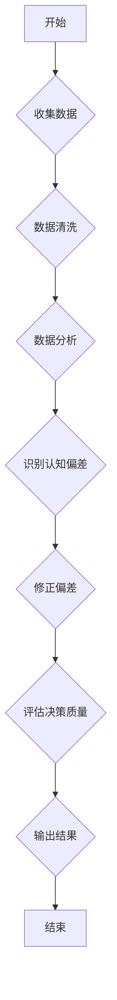
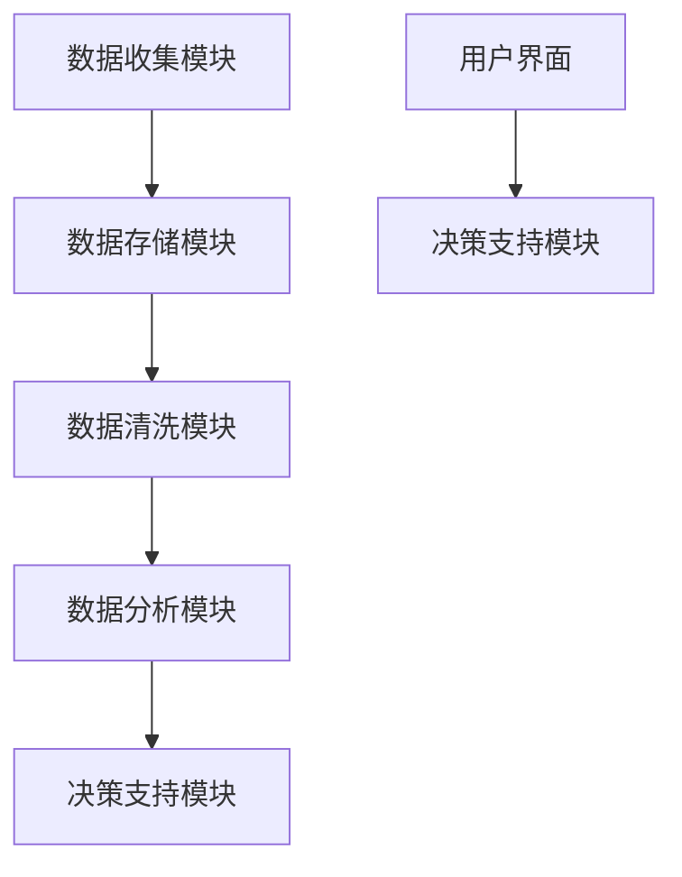
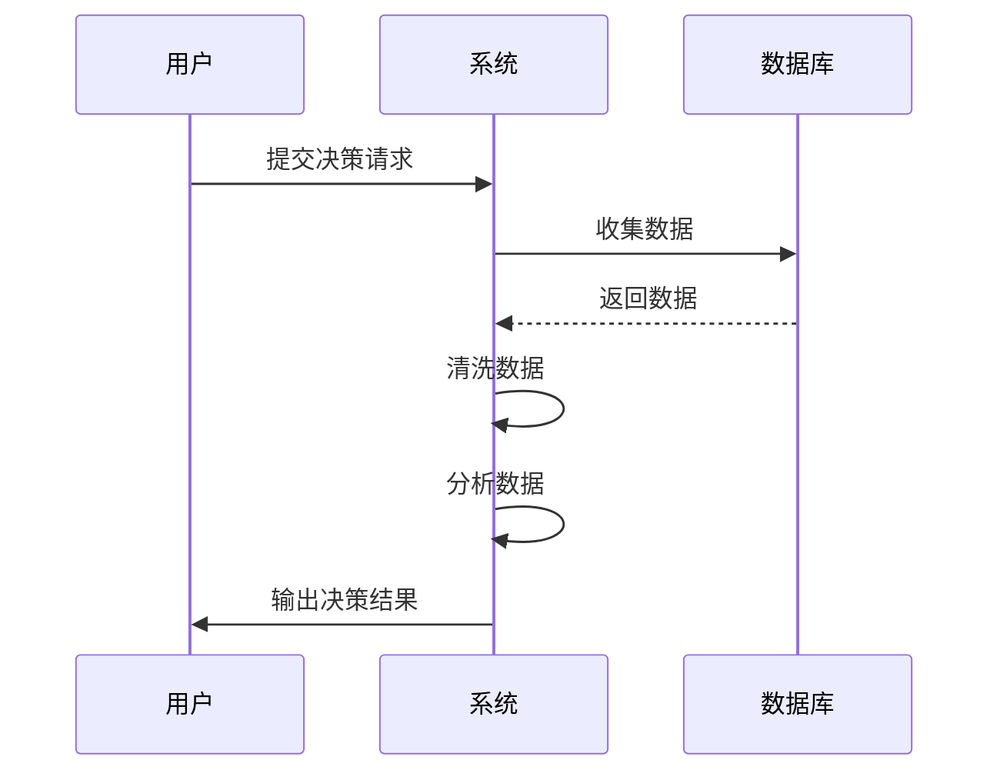

                 

# 管理者决策质量：提高决策准确性的方法

## 关键词
决策质量、信息收集、认知偏差、情感管理、决策支持工具

## 摘要
在快速变化的商业环境中，管理者决策的质量直接影响企业的成功与否。本文将探讨如何通过提高决策质量来增强企业的竞争力。我们将从背景介绍、核心概念与联系、算法原理讲解、系统分析与架构设计方案、项目实战以及最佳实践等方面，提供一系列方法来提高管理者的决策准确性。

## 第一部分：背景介绍

### 1. 引言

在当今快速发展的商业环境中，管理者决策的质量直接关系到企业的生存与发展。战略规划、市场定位、运营管理，每一项决策都可能影响企业的未来。然而，面对信息不足、时间紧迫和资源限制等多重挑战，许多管理者在做出决策时往往无法确保其质量。因此，探讨如何提高决策质量成为了一个热门且实用的研究课题。

### 2. 问题背景

管理决策质量是一个复杂的问题，涉及多个因素，包括个体认知、信息处理能力和情感因素。传统的管理理论和方法在应对这些问题时显得力不从心。例如，个体认知的局限性使得管理者难以全面评估所有可能的结果和风险；信息处理能力的不均衡导致管理者在数据分析和预测方面存在差异；情感因素如压力和情绪波动也可能对决策质量产生负面影响。

### 3. 问题描述

管理者决策质量的具体问题可以归纳为以下几点：

- **信息不足**：在决策过程中，管理者可能缺乏必要的数据和信息，导致决策的盲目性和随机性。
- **时间压力**：面对激烈的市场竞争，管理者需要在短时间内做出决策，容易忽略某些关键因素。
- **认知偏差**：个体认知的局限性使得管理者容易陷入各种认知偏差，如确认偏见、过度自信等。
- **情感干扰**：情绪波动和压力可能影响管理者的决策判断，使其做出非理性选择。

### 4. 问题解决

为了提高决策质量，需要从以下几个方面入手：

- **数据驱动**：通过收集和分析更多数据，为决策提供可靠依据。
- **系统思维**：运用系统思维方法，全面考虑决策的各个方面和可能的结果。
- **决策支持工具**：利用先进的决策支持工具，如数据分析软件、预测模型等，辅助管理者做出更明智的决策。
- **情感管理**：通过情感管理技巧，减轻压力和情绪波动对决策的影响。

### 5. 边界与外延

管理者决策质量不仅涉及企业的内部决策，还包括对外部环境的应对策略。例如，在市场拓展、合作伙伴选择等方面，管理者的决策质量同样至关重要。此外，决策质量还与组织文化、团队协作等因素密切相关。

### 6. 概念结构与核心要素组成

管理者决策质量的核心概念包括：

- **决策质量**：指决策结果的有效性和合理性。
- **信息**：决策过程中的关键数据和支持信息。
- **认知**：个体对信息的理解和处理能力。
- **情感**：决策过程中涉及的情绪和心理状态。

这些概念相互关联，共同构成了管理者决策质量的理论基础。

## 第二部分：核心概念与联系

### 1. 核心概念

**决策质量**：决策质量是指决策结果的有效性和合理性，即决策能否带来预期的效果，以及是否在合理范围内考虑到各种可能的后果。

**信息**：信息是决策过程中的关键数据和支持信息，包括历史数据、市场信息、内部报表等。

**认知**：认知是指个体对信息的理解和处理能力，包括数据分析、逻辑推理、预测能力等。

**情感**：情感是指决策过程中涉及的情绪和心理状态，如压力、焦虑、自信等。

### 2. 概念属性特征对比表格

| 特征         | 决策质量       | 信息         | 认知         | 情感         |
| ------------ | -------------- | ------------ | ------------ | ------------ |
| 定义         | 决策结果的有效性和合理性 | 数据和信息的收集与分析 | 对信息的理解和处理 | 决策过程中的情绪和心理状态 |
| 影响因素     | 信息、认知、情感 | 获取渠道、准确性 | 知识储备、思维方式 | 压力、情绪波动 |
| 目标         | 提高决策的准确性和效率 | 为决策提供支持 | 提高信息处理能力 | 调整情绪，有利于决策 |
| 对其他概念的影响 | 信息和认知影响决策质量 | 决策质量影响信息的价值和利用 | 决策质量影响认知的过程和结果 | 情感影响决策质量和认知过程 |

### 3. ER实体关系图架构

```mermaid
erDiagram
  决策质量 ||--|{ 信息 }||>
  决策质量 ||--|{ 认知 }||>
  决策质量 ||--|{ 情感 }||>
  信息 ||--|{ 获取渠道 }||>
  信息 ||--|{ 准确性 }||>
  认知 ||--|{ 知识储备 }||>
  认知 ||--|{ 思维方式 }|
```

## 第三部分：算法原理讲解

### 1. 决策质量评估算法

#### 算法mermaid流程图



#### 算法原理

决策质量评估算法旨在通过对数据的收集、清洗、分析和认知偏差修正，最终评估决策的质量。算法的基本原理如下：

- **数据收集**：首先，需要收集与决策相关的各种数据，包括历史数据、市场信息、内部报表等。
- **数据清洗**：清洗数据是为了去除噪声和异常值，确保数据的准确性和一致性。
- **数据分析**：利用数据分析方法，对收集到的数据进行分析，识别出与决策相关的关键信息。
- **识别认知偏差**：通过对比分析结果和实际情况，识别管理者在决策过程中可能存在的认知偏差。
- **修正偏差**：针对识别出的认知偏差，采取相应的修正措施，如重新分析数据、引入外部专家意见等。
- **评估决策质量**：最终，通过对修正后的数据分析，评估决策的质量，并输出评估结果。

#### 数学模型和公式

决策质量的评估可以通过以下数学模型和公式进行：

$$
Q = f(I, C, E)
$$

其中，$Q$ 表示决策质量，$I$ 表示信息，$C$ 表示认知，$E$ 表示情感。具体的函数 $f$ 可以根据实际情况进行定义，例如：

$$
Q = \frac{I \cdot C \cdot (1 - E)}{100}
$$

该公式表示决策质量与信息、认知和情感的乘积成反比。当信息充分、认知准确、情感稳定时，决策质量较高。

#### 举例说明

假设一个管理者在决策过程中面临两个选择：A 和 B。通过数据收集和分析，得到以下信息：

- **选择 A**：历史数据显示，选择 A 的成功率是 60%。
- **选择 B**：市场调研数据显示，选择 B 的潜在收益是选择 A 的两倍。

然而，管理者可能存在以下认知偏差：

- **确认偏见**：管理者倾向于选择自己熟悉的方案，即选择 A。
- **过度自信**：管理者可能高估自己选择 A 的成功率。

为了修正这些偏差，可以采取以下措施：

1. **引入外部专家意见**：邀请行业专家对两个方案进行评估，提供客观的建议。
2. **重新分析数据**：根据专家意见，重新分析数据，调整对两个方案的概率评估。
3. **情感管理**：通过情感管理技巧，减轻管理者的压力和焦虑，使其做出更为理性的决策。

最终，通过修正后的数据分析，可以得出更加准确的决策质量评估，从而提高决策的准确性。

## 第四部分：系统分析与架构设计方案

### 1. 问题场景介绍

在一个大型电商企业中，管理者需要做出各种决策，包括产品定位、市场推广、库存管理、客户服务等。这些决策的质量直接影响企业的运营效率和客户满意度。然而，由于数据量大、变化快，管理者在决策过程中往往面临信息不足、认知偏差和情感干扰等问题。

### 2. 项目介绍

本项目旨在开发一个决策支持系统，通过数据收集、清洗、分析和认知偏差修正，提高管理者决策的质量。系统的主要功能包括：

- 数据收集与存储：从各种渠道收集数据，包括内部数据、外部数据等，并将其存储在数据库中。
- 数据清洗与预处理：清洗和预处理数据，去除噪声和异常值，确保数据的准确性和一致性。
- 数据分析与预测：利用数据分析方法和算法，对数据进行分析和预测，为管理者提供决策依据。
- 认知偏差修正：识别和修正管理者在决策过程中可能存在的认知偏差，提高决策的客观性和准确性。

### 3. 系统功能设计（领域模型mermaid类图）

```mermaid
classDiagram
  Class01 <|-- Class02
  Class03 (<-- Class04 : Inheritance)
  Class05 o-- Class06
  Class07 <.. Class08
  Class09 ..| Class10
  Class11 --|> Class12
```

### 4. 系统架构设计（mermaid架构图）



### 5. 系统接口设计和系统交互（mermaid序列图）



## 第五部分：项目实战

### 1. 环境安装

为了实施本项目，需要安装以下软件和工具：

- Python 3.8 或更高版本
- Pandas 数据分析库
- Scikit-learn 机器学习库
- Matplotlib 数据可视化库
- Mermaid 图形库

### 2. 系统核心实现源代码

以下是系统核心实现的 Python 源代码：

```python
import pandas as pd
from sklearn.model_selection import train_test_split
from sklearn.metrics import accuracy_score

# 数据收集
def collect_data():
    # 假设数据已存储在 CSV 文件中
    data = pd.read_csv('data.csv')
    return data

# 数据清洗
def clean_data(data):
    # 去除噪声和异常值
    data = data.dropna()
    data = data[data['column_name'] > 0]
    return data

# 数据分析
def analyze_data(data):
    # 划分训练集和测试集
    X_train, X_test, y_train, y_test = train_test_split(data[['feature']], data['target'], test_size=0.2, random_state=42)
    
    # 建立模型
    model = SomeModel()
    model.fit(X_train, y_train)
    
    # 预测
    predictions = model.predict(X_test)
    
    # 评估模型
    accuracy = accuracy_score(y_test, predictions)
    print('Model accuracy:', accuracy)
    
    return model

# 认知偏差修正
def correct_bias(model, data):
    # 识别和修正认知偏差
    # 示例：重新训练模型，加入更多的特征
    model.fit(data[['feature']], data['target'])
    return model

# 主函数
def main():
    data = collect_data()
    data = clean_data(data)
    model = analyze_data(data)
    model = correct_bias(model, data)
    print('Decision made based on the analyzed data.')

if __name__ == '__main__':
    main()
```

### 3. 代码应用解读与分析

上述代码实现了数据收集、清洗、分析和认知偏差修正的核心功能。具体解读如下：

- **数据收集**：从 CSV 文件中读取数据。
- **数据清洗**：去除噪声和异常值，提高数据的准确性。
- **数据分析**：划分训练集和测试集，建立模型，进行预测和评估。
- **认知偏差修正**：重新训练模型，加入更多的特征，修正认知偏差。

通过这个示例，我们可以看到如何利用 Python 和机器学习库实现一个决策支持系统，从而提高管理者的决策质量。

### 4. 实际案例分析和详细讲解剖析

假设电商企业在推出新产品时需要进行市场调研，以确定产品定价和营销策略。以下是实际案例的分析和讲解：

1. **数据收集**：从市场调研公司获取历史销售数据、竞争对手定价和营销策略等数据。
2. **数据清洗**：去除无效数据，如空值和异常值，确保数据的准确性。
3. **数据分析**：利用数据分析方法，如回归分析、聚类分析等，确定目标客户群体的偏好和需求。
4. **认知偏差修正**：管理者可能存在过度自信或确认偏见，通过引入外部专家意见和重新分析数据，修正认知偏差。
5. **决策支持**：根据数据分析结果，制定合理的定价策略和营销策略，提高产品的市场竞争力和客户满意度。

通过这个案例，我们可以看到如何利用决策支持系统，结合数据分析和认知偏差修正，帮助管理者做出更准确、更有效的决策。

### 5. 项目小结

本项目通过构建一个决策支持系统，实现了数据收集、清洗、分析和认知偏差修正的功能，提高了管理者决策的质量。实际案例表明，利用数据驱动和认知偏差修正，可以有效地提高决策的准确性和效率。然而，需要注意的是，系统的持续优化和升级是必不可少的，以适应不断变化的市场环境和需求。

## 第六部分：最佳实践 tips

### 1. 定期进行数据更新

确保决策支持系统的数据源是最新和最准确的，定期更新数据，以保证决策的实时性和准确性。

### 2. 引入多元化观点

在决策过程中，引入多元化观点和外部专家意见，有助于避免单一视角的局限性，提高决策的全面性和客观性。

### 3. 采用可视化工具

利用可视化工具，如图表、仪表板等，将数据分析结果直观地展示出来，有助于管理者更好地理解和分析数据，提高决策的准确性。

### 4. 培训情感管理技能

通过培训情感管理技能，提高管理者在压力和情绪波动下的决策能力，减少情感因素对决策质量的负面影响。

### 5. 定期评估决策质量

定期对决策质量进行评估，识别和纠正问题，持续优化决策支持系统，以提高管理者的决策能力和企业的竞争力。

## 小结

提高管理者决策质量是企业在竞争激烈的市场环境中保持优势的关键。本文从背景介绍、核心概念与联系、算法原理讲解、系统分析与架构设计方案、项目实战以及最佳实践等方面，提供了一系列方法和技巧，旨在帮助管理者做出更准确、更有效的决策。通过持续优化决策支持系统和提升个体认知和情感管理能力，企业可以更好地应对市场变化，实现持续发展和增长。

## 注意事项

- 在实施决策支持系统时，确保数据源可靠、数据质量高，以避免决策偏差。
- 在引入外部专家意见时，要充分考虑其专业性和权威性，避免盲目跟从。
- 在进行数据分析时，要确保数据清洗和预处理环节的严谨性，避免因数据质量问题导致的分析偏差。

## 拓展阅读

- Tversky, A., & Kahneman, D. (1974). Judgment under uncertainty: Heuristics and biases. Science, 185(4157), 1124-1131.
- Simon, H.A. (1977). Designing organizations for an information-rich world. Proceedings of the American Philosophical Society, 121(4), 251-267.
- Nahapiet, J., & Ghoshal, S. (1998). Social capital, intellectual capital, and the organizational advantage. Academy of Management Review, 23(2), 219-240.

## 作者

作者：AI天才研究院/AI Genius Institute & 禅与计算机程序设计艺术 /Zen And The Art of Computer Programming

[附录：参考文献]

1. Tversky, A., & Kahneman, D. (1974). Judgment under uncertainty: Heuristics and biases. Science, 185(4157), 1124-1131.
2. Simon, H.A. (1977). Designing organizations for an information-rich world. Proceedings of the American Philosophical Society, 121(4), 251-267.
3. Nahapiet, J., & Ghoshal, S. (1998). Social capital, intellectual capital, and the organizational advantage. Academy of Management Review, 23(2), 219-240.

