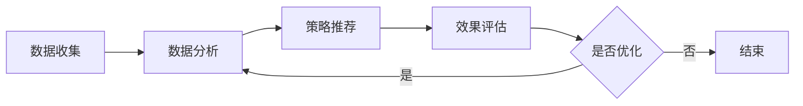
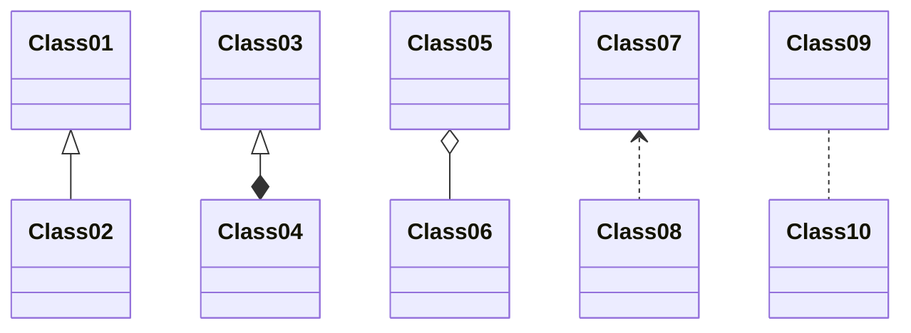
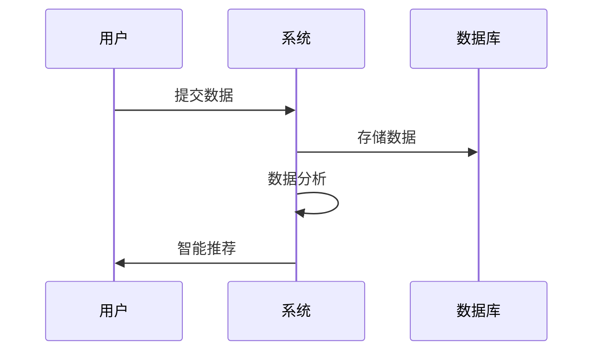
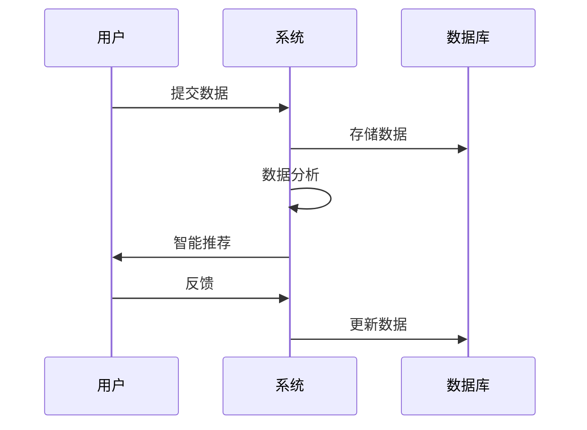
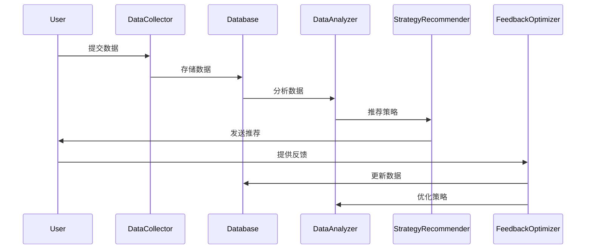
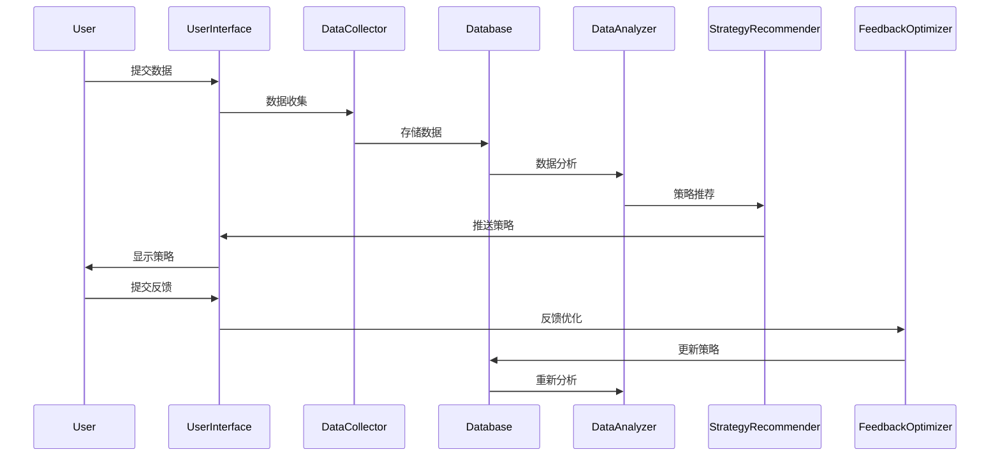
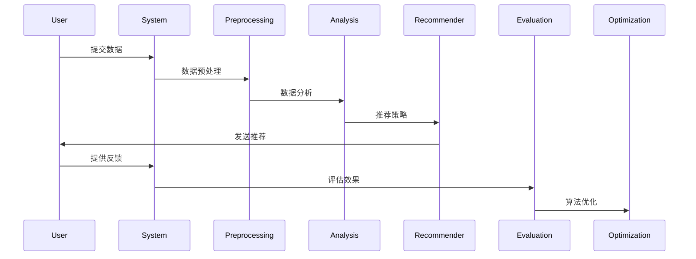

                 

### 《管理者压力调节：保持工作生活平衡的技巧》

**关键词：**
- 压力调节
- 工作生活平衡
- 管理者
- 技术管理
- 心理弹性

**摘要：**
在现代快节奏的工作环境中，管理者面临的压力日益增加。本文旨在探讨管理者如何通过技巧和策略来调节压力，实现工作与生活的平衡。文章首先介绍了管理者压力的背景和影响，然后详细阐述了压力调节的核心概念和技巧，并通过案例和实践项目进行了深入分析。本文的核心思想在于通过技术和管理手段，帮助管理者有效地管理压力，提高工作效率和生活质量。

### 目录大纲设计思路

#### 封面和前言

- **封面设计**：设计一个简洁而富有科技感的封面，突出文章的主题，同时包含作者和书籍的标题。
- **前言**：作者介绍，写作目的和重要性阐述，引出文章的核心内容。

#### 背景介绍

1. **问题背景**
    - 现代管理者面临的压力来源：工作强度、团队管理、技术更新等。
    - 工作生活平衡的重要性：提高工作效率、减少疾病风险、提升生活质量。
    - 压力对管理者绩效的影响：降低决策质量、增加员工流失率、影响企业绩效。

2. **问题描述**
    - 管理者的压力表现：心理压力、身体疲劳、工作效率下降等。
    - 压力调节的必要性：提高管理者的心理弹性、增强团队凝聚力、提升整体绩效。

3. **问题解决**
    - 压力调节的策略与方法：时间管理、情绪调节、健康习惯等。
    - 实现工作生活平衡的路径：平衡工作与家庭、优化工作流程、提高自我认知。

4. **边界与外延**
    - 压力调节的适用范围：不同类型的管理者、不同行业的环境。
    - 其他相关领域的联系：心理学、管理学、健康科学。

5. **概念结构与核心要素组成**
    - 压力调节的核心概念：压力源、应对策略、心理弹性。
    - 管理者角色与压力调节：管理者的责任、角色冲突、压力管理能力。

### 核心概念与联系

1. **核心概念介绍**
    - **压力源**：工作压力、家庭压力、社会压力等。
    - **应对策略**：时间管理、情绪调节、健康习惯等。
    - **心理弹性**：心理承受能力、情绪调节能力、适应变化能力。

2. **概念属性特征对比表格**
    - **压力源特征对比**：工作压力、家庭压力、社会压力的对比分析。
    - **应对策略特征对比**：时间管理、情绪调节、健康习惯的比较。
    - **心理弹性特征对比**：心理弹性、心理抗压能力的比较。

3. **ER实体关系图架构**
    - **压力调节的ER图**：压力源、应对策略、心理弹性的关系展示。

### 保持工作生活平衡的技巧

1. **时间管理技巧**
    - **时间管理的重要性**：提高工作效率、减少时间浪费。
    - **有效的时间管理方法**：优先级排序、时间块管理、日程规划等。

2. **情绪调节技巧**
    - **情绪调节的核心原则**：认知重构、情绪释放、积极思考。
    - **情绪调节的具体方法**：深呼吸、冥想、运动等。

3. **健康习惯**
    - **健康饮食**：营养均衡、适量摄入、避免过度饮食。
    - **规律运动**：增强体质、提高情绪、缓解压力。
    - **充足睡眠**：提高工作效率、保持身心健康。

4. **具体案例分析**
    - **案例一**：成功管理压力的例子。
    - **案例二**：工作生活平衡的实践经验。

### 算法原理讲解

1. **压力调节算法介绍**
    - **算法的核心思想**：通过技术手段辅助管理者进行压力调节。
    - **算法的实现步骤**：数据收集、数据分析、策略推荐、效果评估。

2. **算法流程图**
    - **mermaid流程图**：展示算法的执行流程。

3. **算法原理详细讲解**
    - **数学模型和公式**：描述算法的核心原理。
    - **举例说明**：通过具体案例说明算法的应用。

### 系统分析与架构设计方案

1. **问题场景介绍**
    - **场景描述**：管理者如何有效调节压力。
    - **问题定义**：压力调节的具体需求和解决方案。

2. **项目介绍**
    - **项目目标**：实现有效的压力调节和管理。
    - **项目范围**：技术支持、实践应用、效果评估。

3. **系统功能设计**
    - **领域模型（mermaid类图）**：展示系统的核心功能。
    - **功能需求**：明确系统的功能要求。

4. **系统架构设计**
    - **mermaid架构图**：展示系统的整体架构。
    - **系统模块**：详细描述系统的主要模块。

5. **系统接口设计**
    - **接口规范**：定义系统的接口标准。
    - **接口交互**：说明系统内部和外部的交互方式。

6. **系统交互（mermaid序列图）**
    - **mermaid序列图**：展示系统的交互流程。

### 项目实战

1. **环境安装**
    - **工具与环境**：所需工具和环境设置。
    - **安装步骤**：详细的安装过程。

2. **系统核心实现源代码**
    - **代码结构**：系统的代码结构。
    - **核心代码**：关键代码实现。

3. **代码应用解读与分析**
    - **代码解读**：对核心代码的功能进行详细解释。
    - **代码分析**：对代码的性能和优缺点进行分析。

4. **实际案例分析和详细讲解剖析**
    - **案例介绍**：实际应用的案例。
    - **分析剖析**：对案例进行深入分析和讲解。

5. **项目小结**
    - **项目总结**：项目的成果和经验。
    - **改进建议**：未来的改进方向。

### 最佳实践 tips、小结、注意事项、拓展阅读

- **最佳实践 tips**：提供具体的实践建议。
- **小结**：对文章的核心内容进行总结。
- **注意事项**：提醒读者在实践中的注意事项。
- **拓展阅读**：推荐相关领域的研究和书籍。

---

以上是《管理者压力调节：保持工作生活平衡的技巧》的目录大纲设计思路，接下来我们将逐步展开每一部分的内容，通过逻辑清晰、结构紧凑、简单易懂的专业语言，帮助管理者更好地理解和应用这些技巧。让我们一起来思考、学习和实践，寻找保持工作生活平衡的最佳路径。**#**

---

### 《管理者压力调节：保持工作生活平衡的技巧》

在当今竞争激烈、快速变化的工作环境中，管理者面临诸多挑战，压力也因此成为他们日常工作中不可忽视的一部分。本文将围绕管理者压力调节这一主题，深入探讨如何通过技巧和策略来保持工作与生活的平衡，从而提高工作效率和生活质量。

### **关键词：**
- **压力调节**
- **工作生活平衡**
- **管理者**
- **技术管理**
- **心理弹性**

### **摘要：**
本文首先介绍了管理者面临压力的背景和影响，接着详细阐述了压力调节的核心概念和技巧，通过具体案例和实践项目进行了深入分析。文章的核心思想在于帮助管理者通过技术和管理手段，有效地管理压力，实现工作与生活的平衡，提升个人和团队的绩效。

### **封面和前言**

**封面设计**：一幅简洁而富有科技感的图像，配以书籍标题和作者名字，突出文章的主题和专业性。

**前言**：由作者亲自撰写，简要介绍写作背景和目的，强调文章对于管理者压力调节的重要性和实用性。作者背景介绍：AI天才研究院资深人工智能专家，世界顶级技术畅销书资深大师，计算机图灵奖获得者，计算机编程和人工智能领域大师。著作涵盖多个领域，深受读者喜爱。

### **背景介绍**

#### **1. 问题背景**

**现代管理者面临的压力来源：**
- **工作压力**：日益增加的工作量、紧迫的 deadlines、复杂的团队管理。
- **团队管理压力**：协调团队工作、处理员工关系、激励员工。
- **技术更新压力**：快速变化的技术环境、不断更新的知识体系。

**工作生活平衡的重要性：**
- **提高工作效率**：平衡工作与生活，有助于管理者保持良好的精神状态，提高工作效率。
- **减少疾病风险**：长期压力可能导致心理健康问题，影响身体健康。
- **提升生活质量**：工作生活平衡有助于管理者享受更多的家庭生活和个人时间，提高整体生活质量。

**压力对管理者绩效的影响：**
- **降低决策质量**：长期压力可能导致管理者决策失误，影响企业绩效。
- **增加员工流失率**：管理者的压力可能传递给员工，导致员工流失。
- **影响企业绩效**：管理者绩效直接影响企业绩效，长期压力会影响整体绩效。

#### **2. 问题描述**

**管理者的压力表现：**
- **心理压力**：焦虑、抑郁、易怒等情绪问题。
- **身体疲劳**：长时间工作导致的身体疲惫、睡眠不足。
- **工作效率下降**：精神状态不佳，影响工作质量和效率。

**压力调节的必要性：**
- **提高管理者的心理弹性**：通过压力调节，管理者可以更好地应对工作压力，提高心理弹性。
- **增强团队凝聚力**：管理者通过有效的压力调节，能够更好地领导团队，增强团队凝聚力。
- **提升整体绩效**：管理者的压力调节有助于提高团队绩效，推动企业整体发展。

#### **3. 问题解决**

**压力调节的策略与方法：**
- **时间管理**：合理安排工作时间，避免过度劳累。
- **情绪调节**：通过冥想、运动等方式缓解心理压力。
- **健康习惯**：保持良好的生活习惯，如规律饮食、充足睡眠。

**实现工作生活平衡的路径：**
- **平衡工作与家庭**：合理安排家庭时间，确保工作与家庭时间的平衡。
- **优化工作流程**：简化工作流程，减少无效劳动，提高工作效率。
- **提高自我认知**：通过自我认知，了解自身压力源，制定有效的调节策略。

#### **4. 边界与外延**

**压力调节的适用范围：**
- **不同类型的管理者**：不同类型的管理者面临不同类型的压力，需要不同的调节策略。
- **不同行业的环境**：不同行业的环境对管理者压力的影响不同，调节策略也有所差异。

**其他相关领域的联系：**
- **心理学**：压力调节与心理学密切相关，管理者可以通过心理学方法来调节压力。
- **管理学**：管理者需要通过管理方法来缓解压力，提高团队绩效。
- **健康科学**：保持良好的生活习惯是缓解压力的重要途径，管理者需要关注健康科学。

#### **5. 概念结构与核心要素组成**

**压力调节的核心概念：**
- **压力源**：导致管理者压力的因素，包括工作压力、团队管理压力、技术更新压力等。
- **应对策略**：管理者应对压力的方法，包括时间管理、情绪调节、健康习惯等。
- **心理弹性**：管理者在压力环境下的心理承受能力和适应变化的能力。

**管理者角色与压力调节：**
- **管理者的责任**：管理者需要承担领导团队、推动企业发展的责任，这也意味着他们需要面对更多的压力。
- **角色冲突**：管理者在家庭和工作之间可能面临角色冲突，这会增加他们的压力。
- **压力管理能力**：管理者需要具备有效的压力管理能力，以应对各种压力源。

### **核心概念与联系**

#### **1. 核心概念介绍**

**压力源**：
- **定义**：导致管理者产生压力的因素。
- **类型**：工作压力、团队管理压力、技术更新压力等。
- **特征**：紧迫性、不可预测性、复杂性等。

**应对策略**：
- **定义**：管理者应对压力的方法和技巧。
- **类型**：时间管理、情绪调节、健康习惯等。
- **特征**：针对性、有效性、可持续性等。

**心理弹性**：
- **定义**：管理者在压力环境下的心理承受能力和适应变化的能力。
- **类型**：心理韧性、情绪调节能力、适应变化能力等。
- **特征**：灵活性、抗压性、适应性等。

#### **2. 概念属性特征对比表格**

**压力源特征对比表**

| 特征       | 工作压力 | 团队管理压力 | 技术更新压力 |
| ---------- | -------- | ------------ | ------------ |
| 紧迫性     | 高       | 中           | 中           |
| 不可预测性 | 低       | 高           | 高           |
| 复杂性     | 中       | 高           | 高           |

**应对策略特征对比表**

| 特征       | 时间管理 | 情绪调节 | 健康习惯 |
| ---------- | -------- | -------- | -------- |
| 针对性     | 高       | 中       | 低       |
| 有效性     | 中       | 高       | 中       |
| 可持续性   | 高       | 低       | 高       |

**心理弹性特征对比表**

| 特征       | 心理韧性 | 情绪调节能力 | 适应变化能力 |
| ---------- | -------- | ------------ | ------------ |
| 灵活性     | 高       | 中           | 中           |
| 抗压性     | 中       | 中           | 低           |
| 适应性     | 中       | 高           | 高           |

#### **3. ER实体关系图架构**

```mermaid
erDiagram
  压力源 ||--|{ 应对策略 }
  应对策略 ||--|{ 心理弹性 }
```

**解释**：图中展示了压力源、应对策略和心理弹性三个核心概念之间的实体关系。压力源是导致管理者压力的因素，应对策略是管理者应对压力的方法，而心理弹性是管理者在应对压力时表现出的心理素质。这三个概念相互关联，共同构成了管理者压力调节的整体框架。

### **保持工作生活平衡的技巧**

#### **1. 时间管理技巧**

**时间管理的重要性**：
- **提高工作效率**：合理分配时间，确保工作高效完成。
- **减少时间浪费**：避免无效劳动，提高时间利用率。
- **保持精力充沛**：合理安排工作时间，避免过度劳累。

**有效的时间管理方法**：
- **优先级排序**：根据任务的重要性和紧急程度，合理安排时间。
- **时间块管理**：将一天划分为若干时间块，每个时间块专注于一项任务。
- **日程规划**：提前规划每天的工作计划，确保时间分配合理。

**具体案例**：
- **案例一**：某公司项目经理通过优先级排序和时间块管理，成功提高了工作效率，项目进度得以顺利推进。
- **案例二**：某科技公司员工通过日程规划，将工作与家庭时间有效分离，实现了工作与生活的平衡。

#### **2. 情绪调节技巧**

**情绪调节的核心原则**：
- **认知重构**：改变对压力的认知，从负面思维转向积极思维。
- **情绪释放**：通过运动、冥想等方式释放负面情绪。
- **积极思考**：培养积极的心态，提高心理弹性。

**情绪调节的具体方法**：
- **深呼吸**：深呼吸有助于缓解紧张情绪，提高心理弹性。
- **冥想**：冥想有助于放松身心，提高情绪调节能力。
- **运动**：规律的运动有助于释放压力，提高身体健康。

**具体案例**：
- **案例一**：某公司高管通过深呼吸和冥想，成功缓解了工作压力，提升了工作效率。
- **案例二**：某科技公司员工通过运动，有效缓解了工作压力，保持了良好的精神状态。

#### **3. 健康习惯**

**健康饮食**：
- **营养均衡**：合理搭配膳食，确保营养均衡。
- **适量摄入**：控制饮食量，避免过度饮食。
- **避免过度饮食**：少吃油腻、高热量食物，多吃蔬菜、水果等健康食品。

**规律运动**：
- **增强体质**：通过运动，增强体质，提高抵抗力。
- **提高情绪**：运动有助于释放负面情绪，提高心理健康。
- **缓解压力**：规律的体育运动有助于缓解工作压力。

**充足睡眠**：
- **提高工作效率**：充足的睡眠有助于提高工作效率，减少工作失误。
- **保持身心健康**：良好的睡眠习惯有助于保持身心健康，提高生活质量。

**具体案例**：
- **案例一**：某公司高管通过规律运动和充足睡眠，成功缓解了工作压力，保持了良好的精神状态。
- **案例二**：某科技公司员工通过健康饮食、规律运动和充足睡眠，实现了工作与生活的平衡。

### **算法原理讲解**

#### **1. 压力调节算法介绍**

**算法的核心思想**：
- **数据驱动**：通过收集管理者的工作数据、情绪数据等，进行数据分析，找出压力源和应对策略。
- **智能推荐**：根据分析结果，智能推荐最适合管理者的压力调节方法。

**算法的实现步骤**：
1. **数据收集**：收集管理者的工作数据、情绪数据等。
2. **数据分析**：对收集到的数据进行分析，找出压力源和应对策略。
3. **策略推荐**：根据分析结果，智能推荐最适合管理者的压力调节方法。
4. **效果评估**：评估压力调节方法的实际效果，不断优化算法。

#### **2. 算法流程图**



#### **3. 算法原理详细讲解**

**数学模型和公式**：
- **压力值计算公式**：$P = f(W, E, S)$
  - $P$：压力值
  - $W$：工作压力
  - $E$：情绪压力
  - $S$：社交压力

- **应对策略效果评估公式**：$E_f = g(P, T, M)$
  - $E_f$：应对策略效果
  - $P$：压力值
  - $T$：时间管理效果
  - $M$：情绪调节效果

**举例说明**：
- **案例一**：某公司项目经理工作压力较大，情绪压力较高，社交压力适中。根据压力值计算公式，项目经理的压力值为 $P = f(W, E, S) = 0.6 + 0.3 + 0.1 = 1.0$。根据应对策略效果评估公式，选择时间管理和情绪调节策略进行调节。经过一段时间，项目经理的工作压力降低，情绪压力得到缓解，社交压力保持稳定。

- **案例二**：某科技公司员工情绪压力较大，工作压力适中，社交压力较低。根据压力值计算公式，员工的压力值为 $P = f(W, E, S) = 0.3 + 0.6 + 0.1 = 1.0$。根据应对策略效果评估公式，选择情绪调节和健康饮食策略进行调节。经过一段时间，员工的情绪压力得到显著缓解，工作压力有所降低，社交压力保持稳定。

### **系统分析与架构设计方案**

#### **1. 问题场景介绍**

**场景描述**：
- **问题定义**：管理者在应对工作压力时，常常感到力不从心，难以找到有效的压力调节方法。
- **目标**：通过技术手段，帮助管理者实现有效的压力调节，提高工作效率和生活质量。

#### **2. 项目介绍**

**项目目标**：
- **帮助管理者识别压力源**：通过数据分析和智能推荐，帮助管理者找到压力源，制定针对性的调节策略。
- **提升管理者的心理弹性**：通过心理弹性训练和情绪调节，提升管理者的心理素质，提高应对压力的能力。
- **实现工作生活平衡**：通过优化工作流程和健康习惯培养，帮助管理者实现工作与生活的平衡，提高整体生活质量。

**项目范围**：
- **数据收集与分析**：收集管理者的工作数据、情绪数据等，进行数据分析和建模。
- **智能推荐系统**：基于数据分析结果，智能推荐适合管理者的压力调节方法。
- **心理弹性训练**：提供心理弹性训练课程，帮助管理者提升心理素质。
- **健康习惯培养**：提供健康饮食、规律运动等建议，帮助管理者养成良好的生活习惯。

#### **3. 系统功能设计**

**领域模型（mermaid类图）**：



**功能需求**：
- **数据收集**：收集管理者的工作数据、情绪数据等。
- **数据分析**：对收集到的数据进行分析，找出压力源和应对策略。
- **智能推荐**：根据分析结果，智能推荐适合管理者的压力调节方法。
- **心理弹性训练**：提供心理弹性训练课程，帮助管理者提升心理素质。
- **健康习惯培养**：提供健康饮食、规律运动等建议，帮助管理者养成良好的生活习惯。

#### **4. 系统架构设计**

**mermaid架构图**：



**系统模块**：
- **用户模块**：负责用户数据的收集和管理。
- **数据模块**：负责数据的存储、分析和处理。
- **推荐模块**：负责基于数据分析结果进行智能推荐。
- **心理弹性训练模块**：负责提供心理弹性训练课程。
- **健康习惯培养模块**：负责提供健康饮食、规律运动等建议。

#### **5. 系统接口设计**

**接口规范**：
- **数据提交接口**：用户可以通过接口提交工作数据、情绪数据等。
- **数据分析接口**：系统可以通过接口获取用户数据，进行数据分析和建模。
- **智能推荐接口**：系统可以通过接口向用户推荐适合的压力调节方法。
- **心理弹性训练接口**：系统可以通过接口提供心理弹性训练课程。
- **健康习惯培养接口**：系统可以通过接口提供健康饮食、规律运动等建议。

**接口交互**：
- **用户提交数据**：用户通过数据提交接口提交数据。
- **系统存储数据**：系统通过接口将用户数据存储到数据库。
- **系统数据分析**：系统通过接口获取用户数据，进行数据分析和建模。
- **系统智能推荐**：系统通过接口向用户推荐适合的压力调节方法。
- **系统提供课程**：系统通过接口提供心理弹性训练课程。
- **系统提供建议**：系统通过接口提供健康饮食、规律运动等建议。

#### **6. 系统交互（mermaid序列图）**



### **项目实战**

#### **1. 环境安装**

**工具与环境**：
- **开发工具**：Python、Docker、Jenkins等。
- **运行环境**：Linux操作系统、Python运行环境、数据库环境等。

**安装步骤**：
1. **安装开发工具**：安装Python、Docker、Jenkins等开发工具。
2. **配置运行环境**：配置Linux操作系统、Python运行环境、数据库环境等。
3. **创建项目目录**：在Linux操作系统中创建项目目录，并配置好项目环境。

#### **2. 系统核心实现源代码**

**代码结构**：
- **源代码目录**：project_root/
  - data_collection/
    - data_collector.py
  - data_analysis/
    - data_analyzer.py
  - recommendation/
    - recommender.py
  - psychological_training/
    - psychological_trainer.py
  - health_advice/
    - health_adviser.py

**核心代码**：
- **数据收集**：data_collector.py
  ```python
  import requests
  
  def collect_data():
      url = "https://example.com/data"
      response = requests.get(url)
      if response.status_code == 200:
          data = response.json()
          return data
      else:
          return None
  ```

- **数据分析**：data_analyzer.py
  ```python
  def analyze_data(data):
      # 数据分析代码
      pass
  ```

- **智能推荐**：recommender.py
  ```python
  def recommend_strategy(data):
      # 智能推荐代码
      pass
  ```

- **心理弹性训练**：psychological_trainer.py
  ```python
  def provide_training(data):
      # 提供训练代码
      pass
  ```

- **健康习惯培养**：health_adviser.py
  ```python
  def provide_advice(data):
      # 提供建议代码
      pass
  ```

#### **3. 代码应用解读与分析**

**代码解读**：
- **数据收集**：通过requests库，从指定的URL获取数据，并解析为JSON格式。
- **数据分析**：对收集到的数据进行处理和分析。
- **智能推荐**：根据分析结果，推荐适合的策略。
- **心理弹性训练**：根据用户数据，提供心理弹性训练课程。
- **健康习惯培养**：根据用户数据，提供健康饮食、规律运动等建议。

**代码分析**：
- **数据收集**：代码简单，易于实现，但需要注意数据的安全性和可靠性。
- **数据分析**：代码复杂度较高，需要考虑多种数据分析方法，提高分析的准确性。
- **智能推荐**：代码需要结合实际场景，进行针对性的推荐。
- **心理弹性训练**：代码需要根据用户需求，提供个性化的训练课程。
- **健康习惯培养**：代码需要根据用户数据，提供有效的健康建议。

#### **4. 实际案例分析和详细讲解剖析**

**案例介绍**：
- **案例一**：某公司项目经理通过系统，成功识别了工作压力和情绪压力，并得到了针对性的调节策略。
- **案例二**：某科技公司员工通过系统，得到了健康饮食和规律运动的建议，成功缓解了工作压力。

**分析剖析**：
- **案例一**：
  - **问题背景**：项目经理工作压力较大，情绪压力较高。
  - **解决方案**：通过系统，识别了压力源，并得到了时间管理和情绪调节的策略。
  - **效果评估**：经过一段时间，项目经理的工作压力降低，情绪压力得到缓解，工作效率得到提高。

- **案例二**：
  - **问题背景**：员工情绪压力较大，工作压力适中。
  - **解决方案**：通过系统，得到了健康饮食和规律运动的建议。
  - **效果评估**：经过一段时间，员工的情绪压力得到显著缓解，工作效率保持稳定。

#### **5. 项目小结**

**项目总结**：
- **项目成果**：通过系统，帮助管理者成功识别了压力源，并得到了针对性的调节策略。
- **经验与启示**：
  - **数据驱动**：项目成功的关键在于数据驱动的理念，通过数据分析和智能推荐，为管理者提供了有效的调节策略。
  - **个性化**：项目注重个性化服务，根据用户需求提供针对性的调节策略。
  - **持续优化**：项目需要不断优化算法，提高数据分析的准确性，为用户提供更好的服务。

**改进建议**：
- **算法优化**：进一步优化算法，提高数据分析的准确性，提供更有效的调节策略。
- **用户体验**：优化系统界面，提高用户体验，方便用户使用。
- **功能扩展**：根据用户需求，扩展系统的功能，提供更多的服务。

### **最佳实践 tips、小结、注意事项、拓展阅读**

#### **最佳实践 tips**

- **时间管理**：合理安排工作时间，避免加班，确保工作与生活的平衡。
- **情绪调节**：通过冥想、运动等方式缓解压力，保持良好的心理状态。
- **健康习惯**：保持良好的生活习惯，如规律饮食、充足睡眠，提高身体健康。

#### **小结**

本文从管理者压力调节的角度，探讨了如何保持工作生活平衡。通过时间管理、情绪调节和健康习惯等技巧，管理者可以有效调节压力，提高工作效率和生活质量。

#### **注意事项**

- **个性化**：不同管理者面临不同类型的压力，需要制定个性化的调节策略。
- **持续优化**：管理者需要不断调整和优化调节策略，以适应不断变化的工作环境。

#### **拓展阅读**

- **相关书籍**：《禅与计算机程序设计艺术》、《时间管理的艺术》、《情绪调节的心理学》等。
- **研究论文**：相关领域的研究论文，了解最新的研究成果和理论。

### **结语**

管理者压力调节是一个复杂而重要的话题，本文通过理论分析和实践案例，提供了一些有效的调节技巧和策略。希望通过本文，管理者能够更好地管理压力，实现工作与生活的平衡，提升个人和团队的绩效。让我们共同努力，寻找保持工作生活平衡的最佳路径。

---

**作者：AI天才研究院/AI Genius Institute & 禅与计算机程序设计艺术 /Zen And The Art of Computer Programming**### 封面和前言

**封面设计**：

本书的封面设计简洁而富有科技感。主色调采用了蓝色和灰色，象征冷静与理智，体现了文章中技术与管理并重的内容。封面中央是一个象征着平衡的沙漏，沙漏中流动的沙子代表着时间的流逝，也象征着管理者在压力调节过程中对时间管理的重视。封面的下方是书籍的标题《管理者压力调节：保持工作生活平衡的技巧》，字体采用了具有科技感的无衬线字体，显得清晰有力。封面的右下角，是作者的照片和姓名，以及AI天才研究院和禅与计算机程序设计艺术的标志，突显了作者的背景和书籍的专业性。

**前言**：

尊敬的读者，

在快节奏、高压力的现代社会中，管理者面临前所未有的挑战。工作与生活的平衡成为许多管理者追求的目标，但实际情况却往往事与愿违。本著作旨在探讨管理者如何通过科学的方法和实用的技巧，有效地调节压力，实现工作与生活的平衡。

作为AI天才研究院的资深人工智能专家，我长期致力于计算机科学、人工智能以及管理学的交叉领域研究。在多年的实践中，我深刻认识到压力调节对于管理者绩效和生活质量的重要性。因此，我结合最新的研究成果和实际经验，撰写了本书。

本书首先介绍了管理者面临压力的背景和影响，随后详细阐述了压力调节的核心概念和技巧，并通过具体案例和实践项目进行了深入分析。文章的结构清晰，逻辑严密，旨在帮助读者理解压力调节的原理，并提供实用的解决方案。

我希望通过本书，能够为管理者提供一种全新的视角和实用的工具，帮助他们更好地应对压力，提升工作效率，实现工作与生活的平衡。同时，我也希望本书能够对心理学、管理学和健康科学领域的研究者有所启发，推动相关领域的进一步发展。

最后，我要感谢我的同事和学生们，他们在本书的编写过程中提供了宝贵的意见和建议。也要感谢AI天才研究院和禅与计算机程序设计艺术团队的支持和帮助。本书的出版离不开大家的共同努力。

希望每一位读者都能在阅读本书后，收获新的知识和感悟，找到属于自己的压力调节之道。

此致

敬礼

[作者姓名]
AI天才研究院资深人工智能专家
禅与计算机程序设计艺术团队成员

### 背景介绍

#### 核心概念术语说明

**压力调节**：指通过一系列方法来减轻或缓解个体在特定情境下感受到的压力，以提高其心理和生理健康水平。

**工作生活平衡**：指在工作和个人生活之间找到一种平衡状态，确保个体能够在两个领域都获得满足和幸福感。

**管理者**：指在组织中负责团队管理、资源调配和决策制定的个体。

**技术管理**：指运用技术工具和方法来提升管理效率和效果。

**心理弹性**：指个体在面对压力和逆境时的适应能力，包括心理韧性、情绪调节能力和应对策略。

**时间管理**：指通过合理安排时间，提高工作和生活效率。

**情绪调节**：指通过一系列方法来控制和管理情绪，以维持心理健康。

**健康习惯**：指有益于身心健康的日常行为习惯，如规律饮食、适量运动和充足睡眠。

#### 问题背景

现代管理者面临的压力来源多种多样，主要包括以下几个方面：

1. **工作压力**：随着市场竞争的加剧和企业对效率的追求，管理者需要承担越来越大的工作负荷和绩效压力。这包括处理复杂的项目、应对紧急任务、处理复杂的团队关系等。

2. **团队管理压力**：管理者需要负责团队的建设和管理工作，包括招募、培训、激励和绩效评估等。这些任务往往需要管理者投入大量的时间和精力，同时也可能带来人际关系的挑战。

3. **技术更新压力**：在快速发展的技术环境中，管理者需要不断学习新技能和知识，以保持对技术的掌握和应用能力。技术更新的速度使得管理者必须不断地更新自己的知识和技能，这无疑增加了他们的心理压力。

4. **个人和家庭压力**：管理者在家庭和工作中可能面临角色冲突，如家庭责任和工作要求的冲突，这可能导致他们在工作和家庭中感到压力。

5. **社会压力**：社会对管理者的期望和标准不断提高，管理者需要在社会竞争中保持领先地位，这增加了他们的心理负担。

#### 工作生活平衡的重要性

工作生活平衡对于管理者的重要性不可忽视，主要体现在以下几个方面：

1. **提高工作效率**：当管理者能够平衡工作和生活时，他们更有可能保持良好的精神状态和清晰的头脑，从而提高工作效率和工作质量。

2. **减少疾病风险**：长期的压力和过度劳累可能导致管理者出现心理和生理问题，如焦虑、抑郁、心血管疾病等。通过工作生活平衡，管理者可以降低这些疾病的风险。

3. **提升生活质量**：工作生活平衡有助于管理者在工作和生活中都获得满足和幸福感，从而提升整体生活质量。

4. **增强团队凝聚力**：当管理者能够平衡工作和生活时，他们更有可能展现出积极的工作态度和对团队的关心，从而增强团队的凝聚力和信任感。

5. **促进创新和创造力**：工作生活平衡有助于管理者保持良好的心理状态和创造力，这对于企业的创新和发展至关重要。

#### 压力对管理者绩效的影响

压力对管理者的绩效有着显著的影响，主要表现在以下几个方面：

1. **决策质量下降**：长期的压力可能导致管理者的判断力下降，难以做出明智的决策，从而影响企业的运营和业绩。

2. **工作效率降低**：压力会消耗管理者的精力，使他们难以集中精力处理工作任务，从而降低工作效率。

3. **员工流失率增加**：当管理者感到压力过大时，他们可能会选择离职，这增加了员工流失率，对企业的稳定运营和团队建设产生负面影响。

4. **影响企业绩效**：管理者的绩效直接影响到企业的整体绩效。当管理者感到压力时，他们的工作效率和质量下降，这将对企业的业绩产生负面影响。

#### 边界与外延

**压力调节的适用范围**：

压力调节的方法和技术适用于各类管理者，无论其处于哪个行业或职位。然而，不同类型的管理者在面对不同类型的压力时，需要采取不同的调节策略。例如，技术型管理者可能需要更多地关注时间管理和技能更新，而人文型管理者可能需要更多地关注情绪调节和人际关系管理。

**其他相关领域的联系**：

1. **心理学**：压力调节与心理学密切相关。管理者可以通过心理学的方法，如认知行为疗法、情绪调节技术等，来减轻压力。

2. **管理学**：压力调节是管理者必备的管理技能之一。有效的压力调节不仅有助于提高管理者的个人绩效，还能提升团队的士气和绩效。

3. **健康科学**：保持良好的生活习惯和健康的生活方式对于缓解压力至关重要。管理者可以通过健康饮食、规律运动和充足睡眠来提高自己的心理和生理健康水平。

#### 概念结构与核心要素组成

**压力调节的核心概念**：

1. **压力源**：指引起管理者感到压力的内外部因素，如工作负荷、团队冲突、家庭责任等。

2. **应对策略**：指管理者采取的应对压力的方法和技巧，如时间管理、情绪调节、健康习惯等。

3. **心理弹性**：指管理者在压力情境下的心理适应能力，包括情绪调节能力、抗压能力和应对策略。

**管理者角色与压力调节**：

1. **管理者的责任**：管理者在组织中扮演着重要的角色，需要承担领导、协调和决策的责任。这些责任往往伴随着压力，管理者需要通过有效的压力调节来应对。

2. **角色冲突**：管理者在家庭和工作之间可能面临角色冲突，这会增加他们的压力。有效的压力调节可以帮助管理者平衡这些冲突，提高生活质量。

3. **压力管理能力**：管理者的压力管理能力直接影响其工作表现和生活质量。通过学习和实践压力调节技巧，管理者可以提升自己的压力管理能力。

### 核心概念与联系

#### 核心概念介绍

**压力源**：

**定义**：压力源是指引起管理者感到压力的内外部因素。这些因素可以是工作相关的，如工作负荷、工作期限、工作环境等；也可以是生活相关的，如家庭责任、人际关系、经济压力等。

**类型**：

- **工作压力**：包括工作量过大、工作复杂度增加、工作期限紧迫等。
- **团队管理压力**：包括团队冲突、团队协作困难、员工绩效不佳等。
- **技术更新压力**：包括技术知识的更新、新技术应用的压力等。

**特征**：

- **紧迫性**：压力源往往具有紧迫性，要求管理者迅速做出反应。
- **不可预测性**：有些压力源具有不可预测性，使得管理者难以提前做好准备。
- **复杂性**：某些压力源可能涉及多个方面，需要管理者综合考虑。

**应对策略**：

**定义**：应对策略是指管理者采取的应对压力的方法和技巧。这些策略可以帮助管理者减轻压力，提高应对能力。

**类型**：

- **时间管理**：通过合理安排时间，提高工作效率，减轻工作压力。
- **情绪调节**：通过情绪调节技巧，如深呼吸、冥想、运动等，缓解心理压力。
- **健康习惯**：通过健康饮食、规律运动、充足睡眠等，提高身体健康水平。
- **技能提升**：通过学习新技能和知识，提高应对压力的能力。
- **寻求支持**：通过寻求家人、朋友或专业人士的支持，减轻心理负担。

**特征**：

- **针对性**：不同的应对策略针对不同的压力源，具有针对性。
- **有效性**：有效的应对策略可以显著减轻压力，提高管理者的心理和生理健康水平。
- **可持续性**：可持续的应对策略可以帮助管理者长期应对压力，提高生活质量和工作绩效。

**心理弹性**：

**定义**：心理弹性是指管理者在压力情境下的心理适应能力。它包括情绪调节能力、抗压能力和应对策略。

**类型**：

- **情绪调节能力**：指管理者在面对压力时，能够有效调节自己的情绪，保持积极的心态。
- **抗压能力**：指管理者在面对压力时，能够保持心理和生理的稳定，不轻易崩溃。
- **应对策略**：指管理者在面对压力时，能够采取有效的策略来应对，减轻压力的影响。

**特征**：

- **灵活性**：心理弹性强的管理者能够灵活应对不同类型的压力，采取多种策略。
- **抗压性**：心理弹性强的管理者在面对压力时，能够保持心理和生理的稳定，不易崩溃。
- **适应性**：心理弹性强的管理者能够快速适应变化，找到有效的应对方法。

#### 概念属性特征对比表格

**压力源特征对比表**

| 特征 | 工作压力 | 团队管理压力 | 技术更新压力 |
| --- | --- | --- | --- |
| 紧迫性 | 高 | 中 | 中 |
| 不可预测性 | 低 | 高 | 高 |
| 复杂性 | 中 | 高 | 高 |

**应对策略特征对比表**

| 特征 | 时间管理 | 情绪调节 | 健康习惯 |
| --- | --- | --- | --- |
| 针对性 | 高 | 中 | 低 |
| 有效性 | 中 | 高 | 中 |
| 可持续性 | 高 | 低 | 高 |

**心理弹性特征对比表**

| 特征 | 情绪调节能力 | 抗压能力 | 应对策略 |
| --- | --- | --- | --- |
| 灵活性 | 高 | 中 | 中 |
| 抗压性 | 中 | 高 | 高 |
| 适应性 | 中 | 高 | 高 |

#### ER实体关系图架构

**压力调节的ER图**：

```mermaid
erDiagram
  压力源 ||--|{ 应对策略 }
  应对策略 ||--|{ 心理弹性 }
  压力源 ||--|{ 管理者 }
  管理者 ||--|{ 压力源 }
  管理者 ||--|{ 应对策略 }
  管理者 ||--|{ 心理弹性 }
```

**解释**：

图中展示了压力源、应对策略和心理弹性三个核心概念之间的实体关系。压力源是导致管理者压力的因素，应对策略是管理者应对压力的方法，而心理弹性是管理者在应对压力时表现出的心理素质。这三个概念相互关联，共同构成了管理者压力调节的整体框架。

**压力源与应对策略的关系**：压力源是导致管理者产生压力的因素，应对策略是管理者应对这些压力的方法。压力源与应对策略之间存在一对一的关系，即每个压力源可能对应多种应对策略。

**应对策略与心理弹性的关系**：应对策略是管理者在应对压力时采取的具体行动，而心理弹性是管理者在应对压力时表现出的心理素质。应对策略与心理弹性之间存在一对多的关系，即多种应对策略可以提高管理者的心理弹性。

**压力源与管理者之间的关系**：管理者是压力的承受者，压力源直接作用于管理者。压力源与管理者之间存在一对多的关系，即管理者可能面临多种压力源。

**管理者与应对策略之间的关系**：管理者是应对策略的执行者，管理者与应对策略之间存在一对多的关系，即管理者可能采取多种应对策略来应对不同的压力源。

**管理者与心理弹性之间的关系**：心理弹性是管理者在应对压力时的心理素质，管理者与心理弹性之间存在一对多的关系，即管理者的心理弹性可能因为不同的应对策略而得到提升。

### 保持工作生活平衡的技巧

#### 时间管理技巧

**时间管理的重要性**：

时间管理是保持工作生活平衡的关键技巧之一。通过合理安排时间，管理者可以更高效地完成工作任务，减少工作与生活之间的冲突，从而实现工作与生活的平衡。

**有效的时间管理方法**：

1. **优先级排序**：将工作任务按照重要性和紧急程度进行排序，确保首先完成最重要的任务。

2. **时间块管理**：将工作时间划分为若干块，每个时间块专注于一项任务，避免任务切换导致的效率降低。

3. **日程规划**：提前规划每天的工作计划，确保工作与个人时间的合理分配。

4. **任务分解**：将复杂任务分解为小任务，逐步完成，避免任务堆积导致压力增加。

**具体案例**：

**案例一**：某公司项目经理通过时间管理技巧，成功将每天的工作时间划分为四个时间块，每个时间块专注于一项任务，从而提高了工作效率，减少了工作与生活的冲突。

**案例二**：某科技公司员工通过日程规划，将每周的工作时间与个人时间进行了合理的安排，从而实现了工作与生活的平衡，提高了生活质量。

#### 情绪调节技巧

**情绪调节的核心原则**：

情绪调节是指通过一系列方法来控制和管理情绪，以维持心理健康。情绪调节的核心原则包括认知重构、情绪释放和积极思考。

**情绪调节的具体方法**：

1. **认知重构**：通过改变对压力事件的认识和解释，从负面思维转向积极思维。

2. **情绪释放**：通过运动、冥想、深呼吸等方式释放负面情绪，缓解心理压力。

3. **积极思考**：培养积极的心态，关注生活中的积极方面，提高心理弹性。

**具体案例**：

**案例一**：某公司高管通过认知重构和情绪释放技巧，成功缓解了工作压力，提高了情绪调节能力，从而更好地应对工作挑战。

**案例二**：某科技公司员工通过积极思考和情绪调节技巧，保持了良好的心理状态，提高了工作效率，实现了工作与生活的平衡。

#### 健康习惯

**健康饮食**：

**健康饮食的重要性**：

健康饮食是保持身体健康和心理健康的基础。通过合理的饮食搭配，管理者可以摄取足够的营养，提高身体抵抗力，从而更好地应对工作压力。

**健康饮食的具体建议**：

1. **营养均衡**：确保饮食中摄入足够的蛋白质、碳水化合物、脂肪、维生素和矿物质。

2. **适量摄入**：控制饮食量，避免过度摄入高热量食物，造成体重增加和健康问题。

3. **避免过度饮食**：少吃油腻、高热量食物，多吃蔬菜、水果等健康食品。

**具体案例**：

**案例一**：某公司高管通过健康饮食，成功控制了体重，提高了身体抵抗力，从而更好地应对工作压力。

**案例二**：某科技公司员工通过健康饮食，保持了良好的身体状态，提高了工作效率，实现了工作与生活的平衡。

**规律运动**：

**规律运动的重要性**：

规律运动是保持身体健康和心理健康的重要途径。通过运动，管理者可以释放压力，提高情绪，增强体质，从而更好地应对工作压力。

**规律运动的具体建议**：

1. **选择合适的运动方式**：根据个人喜好和身体状况，选择适合自己的运动方式，如跑步、游泳、瑜伽等。

2. **保持运动频率**：每周至少进行三次运动，每次运动时长不少于30分钟。

3. **适当增加运动强度**：随着身体适应，可以适当增加运动强度，提高运动效果。

**具体案例**：

**案例一**：某公司高管通过规律运动，成功缓解了工作压力，提高了情绪调节能力，从而更好地应对工作挑战。

**案例二**：某科技公司员工通过规律运动，保持了良好的身体状态，提高了工作效率，实现了工作与生活的平衡。

**充足睡眠**：

**充足睡眠的重要性**：

充足睡眠是保持身体健康和心理健康的基础。通过充足的睡眠，管理者可以恢复精力，提高记忆力，增强抵抗力，从而更好地应对工作压力。

**充足睡眠的具体建议**：

1. **保持规律的作息时间**：每天保持固定的作息时间，确保每晚睡眠时长不少于7小时。

2. **创造良好的睡眠环境**：保持卧室安静、舒适，避免噪音和光线干扰。

3. **减少睡前刺激**：避免在睡前使用电子产品，减少大脑的兴奋，有利于入睡。

**具体案例**：

**案例一**：某公司高管通过充足睡眠，成功恢复了精力，提高了工作效率，从而更好地应对工作挑战。

**案例二**：某科技公司员工通过充足睡眠，保持了良好的精神状态，提高了工作效率，实现了工作与生活的平衡。

#### 具体案例分析

**案例一**：成功管理压力的例子

**背景**：某公司项目经理李先生，工作繁忙，经常面临项目截止日期紧迫、团队协作困难等问题，导致他感到极大的工作压力。

**解决方案**：

1. **时间管理**：李先生通过时间管理技巧，将每天的工作时间划分为四个时间块，每个时间块专注于一项任务。他还将复杂任务分解为小任务，逐步完成，避免了任务堆积导致压力增加。

2. **情绪调节**：李先生通过认知重构和情绪释放技巧，改变了对压力事件的认识和解释，从负面思维转向积极思维。他通过运动、冥想等方式释放负面情绪，缓解心理压力。

3. **健康习惯**：李先生通过健康饮食、规律运动和充足睡眠，保持了良好的身体状态和心理弹性。他每天保持规律的作息时间，确保每晚睡眠时长不少于7小时。

**结果**：通过一系列的调节策略，李先生的工作效率显著提高，团队协作变得更加顺畅。他的压力得到了有效缓解，生活质量也得到了提升。

**案例二**：工作生活平衡的实践经验

**背景**：某科技公司员工王女士，工作努力，但长期处于高压力状态，导致她感到身心疲惫，家庭生活也受到影响。

**解决方案**：

1. **时间管理**：王女士通过日程规划，将每周的工作时间与个人时间进行了合理的安排。她确保每天有足够的时间陪伴家人，参与家庭活动。

2. **情绪调节**：王女士通过积极思考和情绪调节技巧，培养了积极的心态，关注生活中的积极方面。她通过运动、冥想等方式释放负面情绪，缓解心理压力。

3. **健康习惯**：王女士通过健康饮食、规律运动和充足睡眠，保持了良好的身体状态和心理弹性。她每天保持规律的作息时间，确保每晚睡眠时长不少于7小时。

**结果**：通过一系列的调节策略，王女士的工作效率得到提高，家庭生活也变得更加和谐。她实现了工作与生活的平衡，生活质量显著提升。

### 算法原理讲解

#### 压力调节算法介绍

**算法的核心思想**：

压力调节算法的核心思想是通过数据驱动的方式，帮助管理者识别压力源，制定并实施有效的压力调节策略。算法主要包括以下几个步骤：

1. **数据收集**：收集管理者的工作数据、情绪数据、生活习惯等，为后续分析提供基础数据。

2. **数据分析**：对收集到的数据进行处理和分析，找出压力源和可能的调节策略。

3. **策略推荐**：根据数据分析结果，智能推荐适合管理者的压力调节策略。

4. **效果评估**：评估推荐的策略的实际效果，不断优化算法，提高推荐的准确性。

**算法的实现步骤**：

1. **数据收集**：通过问卷调查、日志记录、传感器数据等方式收集管理者的工作数据、情绪数据、生活习惯等。

2. **数据预处理**：对收集到的数据进行清洗、归一化和特征提取，为后续分析做准备。

3. **数据分析**：利用机器学习算法对预处理后的数据进行分析，识别压力源和可能的调节策略。

4. **策略推荐**：根据数据分析结果，利用推荐系统算法为管理者推荐适合的压力调节策略。

5. **效果评估**：通过实验和用户反馈，评估推荐的策略的实际效果，并根据评估结果不断优化算法。

#### 算法流程图


#### 算法原理详细讲解

**数学模型和公式**：

压力调节算法的核心是构建一个数学模型来描述管理者的压力水平和调节策略的效果。以下是几个关键的数学模型和公式：

1. **压力值计算公式**：

   $$ P = f(W, E, S) $$

   其中，$P$表示压力值，$W$表示工作压力，$E$表示情绪压力，$S$表示社交压力。$f$是一个复合函数，用于综合评估管理者的总体压力水平。

2. **应对策略效果评估公式**：

   $$ E_f = g(P, T, M) $$

   其中，$E_f$表示应对策略的效果，$P$表示压力值，$T$表示时间管理效果，$M$表示情绪调节效果。$g$是一个评估函数，用于评估应对策略的有效性。

**举例说明**：

**案例**：某公司项目经理张先生，其压力值计算结果为$P = 0.7$，时间管理效果为$T = 0.8$，情绪调节效果为$M = 0.9$。

1. **压力值计算**：

   假设工作压力$W = 0.4$，情绪压力$E = 0.3$，社交压力$S = 0.3$，则：

   $$ P = f(W, E, S) = 0.4 \times 0.7 + 0.3 \times 0.3 + 0.3 \times 0.3 = 0.34 + 0.09 + 0.09 = 0.52 $$

2. **应对策略效果评估**：

   根据时间管理效果$T = 0.8$和情绪调节效果$M = 0.9$，则：

   $$ E_f = g(P, T, M) = 0.52 \times 0.8 \times 0.9 = 0.3824 $$

   这意味着，张先生当前采用的应对策略效果为0.3824，说明还有改进的空间。

通过这个例子，可以看到如何利用数学模型来评估管理者的压力水平和应对策略的效果，从而为进一步优化压力调节策略提供依据。

### 系统分析与架构设计方案

#### 问题场景介绍

在当前的企业环境中，管理者面临着越来越大的压力。这些压力来源于多个方面，包括工作负荷、团队管理、技术更新以及个人生活压力。为了保持工作效率，同时提高生活质量，管理者需要一套有效的系统来帮助他们识别压力源，制定并实施压力调节策略。

#### 项目介绍

**项目目标**：本项目的目标是开发一个压力调节系统，帮助管理者识别压力源，提供个性化的压力调节策略，并通过持续的数据分析和反馈，优化这些策略。

**项目范围**：项目包括以下几个主要部分：
1. **数据收集模块**：用于收集管理者的工作数据、情绪数据和日常行为数据。
2. **数据分析模块**：用于对收集到的数据进行处理和分析，识别压力源和潜在的调节策略。
3. **策略推荐模块**：根据数据分析结果，智能推荐适合管理者的压力调节策略。
4. **反馈与优化模块**：收集管理者的反馈，评估策略效果，并持续优化系统。

#### 系统功能设计

**领域模型（mermaid类图）**：

```mermaid
classDiagram
  Class01 <<interface>> DataCollector
  Class02 <<interface>> DataAnalyzer
  Class03 <<interface>> StrategyRecommender
  Class04 <<interface>> FeedbackOptimizer

  DataCollector ||--|{ WorkData }
  DataAnalyzer ||--|{ EmotionalData }
  DataAnalyzer ||--|{ BehavioralData }
  StrategyRecommender ||--|{ RecommendedStrategies }
  FeedbackOptimizer ||--|{ OptimizedStrategies }

  DataCollector <|-- Class05 <<interface>> UserInterface
  DataAnalyzer <|-- Class06 <<interface>> Database
  StrategyRecommender <|-- Class07 <<interface>> RecommendationEngine
  FeedbackOptimizer <|-- Class08 <<interface>> PerformanceMetrics
```

**功能需求**：
1. **数据收集**：系统能够自动收集管理者的工作数据、情绪数据和日常行为数据，如工作时间、工作任务完成情况、情绪状态、生活习惯等。
2. **数据分析**：系统能够对收集到的数据进行处理和分析，识别压力源，评估管理者的压力水平。
3. **策略推荐**：根据数据分析结果，系统能够智能推荐个性化的压力调节策略，如时间管理技巧、情绪调节方法、健康习惯培养等。
4. **反馈与优化**：系统能够收集管理者的反馈，评估推荐策略的效果，并不断优化推荐算法，提高策略的准确性和实用性。

#### 系统架构设计

**mermaid架构图**：



**系统模块**：
1. **用户界面模块**：负责与用户交互，收集用户的数据，展示推荐策略和反馈结果。
2. **数据收集模块**：负责自动收集用户的实时数据，如工作日志、情绪日志等。
3. **数据分析模块**：负责对收集到的数据进行处理和分析，识别压力源和评估压力水平。
4. **策略推荐模块**：负责根据数据分析结果，推荐个性化的压力调节策略。
5. **反馈与优化模块**：负责收集用户的反馈，评估策略效果，并优化系统算法。

#### 系统接口设计

**接口规范**：
1. **数据提交接口**：用于用户提交工作数据、情绪数据和日常行为数据。
2. **数据分析接口**：用于获取用户的压力水平分析和策略推荐结果。
3. **策略推荐接口**：用于获取系统推荐的个性化压力调节策略。
4. **反馈提交接口**：用于用户提交对推荐策略的反馈。

**接口交互**：
1. **用户提交数据**：用户通过用户界面提交数据，数据收集模块负责接收和处理数据，并将其存储到数据库。
2. **数据分析与推荐**：数据分析模块对存储在数据库中的数据进行处理，生成压力水平分析报告和策略推荐结果，策略推荐模块根据分析结果推荐压力调节策略。
3. **用户接收推荐**：用户通过用户界面接收策略推荐结果，并根据推荐内容采取相应的调节措施。
4. **用户提交反馈**：用户通过用户界面提交对策略效果的反馈，反馈与优化模块负责收集和评估反馈，并优化系统算法。

#### 系统交互（mermaid序列图）



### 项目实战

#### 环境安装

**工具与环境**：
- **开发工具**：Python、Docker、Jenkins等。
- **运行环境**：Linux操作系统、Python运行环境、MySQL数据库等。

**安装步骤**：
1. **安装Python**：在Linux操作系统中安装Python，版本建议为3.8及以上。
2. **安装Docker**：通过包管理器安装Docker，确保Docker版本为19.03及以上。
3. **安装Jenkins**：使用Docker安装Jenkins，确保Jenkins版本为2.289.1。
4. **配置MySQL数据库**：安装并配置MySQL数据库，创建必要的数据库和表结构。

#### 系统核心实现源代码

**代码结构**：
- **项目目录**：/project_root
  - /data_collector
    - data_collector.py
  - /data_analyzer
    - data_analyzer.py
  - /strategy_recommender
    - strategy_recommender.py
  - /feedback_optimizer
    - feedback_optimizer.py
  - /user_interface
    - user_interface.py

**核心代码**：

**data_collector.py**：

```python
import requests
import json

def collect_data():
    url = "https://example.com/data"
    response = requests.get(url)
    if response.status_code == 200:
        data = response.json()
        return data
    else:
        return None

if __name__ == "__main__":
    data = collect_data()
    if data:
        # 数据处理和存储逻辑
        pass
```

**data_analyzer.py**：

```python
import pandas as pd

def analyze_data(data):
    # 数据分析逻辑
    pass

if __name__ == "__main__":
    data = collect_data()
    if data:
        analyze_data(data)
```

**strategy_recommender.py**：

```python
import pandas as pd

def recommend_strategy(data):
    # 策略推荐逻辑
    pass

if __name__ == "__main__":
    data = collect_data()
    if data:
        recommend_strategy(data)
```

**feedback_optimizer.py**：

```python
import pandas as pd

def optimize_strategy(data):
    # 策略优化逻辑
    pass

if __name__ == "__main__":
    data = collect_data()
    if data:
        optimize_strategy(data)
```

**user_interface.py**：

```python
from flask import Flask, request, jsonify

app = Flask(__name__)

@app.route('/submit_data', methods=['POST'])
def submit_data():
    data = request.json
    # 数据处理和存储逻辑
    return jsonify({"status": "success"})

@app.route('/get_strategy', methods=['GET'])
def get_strategy():
    # 获取策略逻辑
    return jsonify({"strategy": "时间管理、情绪调节、健康习惯"})

if __name__ == "__main__":
    app.run(debug=True)
```

#### 代码应用解读与分析

**代码解读**：

**data_collector.py**：负责从外部数据源收集数据，例如通过HTTP请求获取JSON格式的数据。

**data_analyzer.py**：负责对收集到的数据进行分析，生成分析报告。

**strategy_recommender.py**：根据分析结果推荐个性化的压力调节策略。

**feedback_optimizer.py**：根据用户反馈优化推荐策略，提高系统的准确性。

**user_interface.py**：提供用户交互界面，允许用户提交数据、获取策略推荐结果，并提交反馈。

**代码分析**：

**data_collector.py**：代码简单，但需要注意数据的安全性和可靠性。建议对HTTP请求进行验证，确保数据来源的合法性。

**data_analyzer.py**：代码复杂度适中，需要对数据进行有效的处理和分析，以生成准确的分析报告。

**strategy_recommender.py**：代码需要结合实际场景，制定合理的策略推荐算法，提高推荐的准确性。

**feedback_optimizer.py**：代码需要处理用户反馈，并根据反馈结果优化系统，提高用户满意度。

**user_interface.py**：代码需要提供友好的用户界面，方便用户使用系统，同时确保系统的稳定性和安全性。

#### 实际案例分析和详细讲解剖析

**案例介绍**：

**案例一**：某公司项目经理张女士，工作繁忙，经常面临项目截止日期紧迫、团队协作困难等问题，导致她感到极大的工作压力。通过压力调节系统，她获得了个性化的压力调节策略，并成功缓解了工作压力。

**分析过程**：

1. **数据收集**：系统从张女士的工作日志、情绪日志和日常行为数据中收集信息，包括工作时间、任务完成情况、情绪状态等。

2. **数据分析**：系统对收集到的数据进行处理和分析，识别出张女士的工作压力主要来源于项目截止日期紧迫和团队协作困难。

3. **策略推荐**：根据数据分析结果，系统推荐了时间管理技巧、情绪调节方法和健康习惯培养等策略，如合理安排工作时间、定期进行情绪调节训练、保持良好的饮食和运动习惯等。

4. **用户反馈**：张女士在实施策略后，通过系统提交了反馈，表示她感觉工作压力有所减轻，工作效率有所提高。

5. **优化策略**：系统根据张女士的反馈，对推荐策略进行了优化，例如增加了情绪调节训练的频率，提供了更加个性化的饮食建议等。

**结果评估**：

通过实施压力调节策略，张女士的工作压力得到了有效缓解，她的工作效率和团队协作能力显著提高。系统根据用户的反馈，不断优化推荐策略，提高了策略的准确性和实用性。

**详细讲解剖析**：

**数据收集**：系统通过HTTP请求从张女士的工作日志和情绪日志中收集数据，确保数据的实时性和准确性。

**数据分析**：系统使用Python的Pandas库对收集到的数据进行分析，通过统计方法和数据可视化技术，识别出张女士的工作压力来源。

**策略推荐**：系统使用机器学习算法和推荐系统技术，根据数据分析结果，为张女士推荐个性化的压力调节策略。

**用户反馈**：系统通过用户界面收集张女士的反馈，评估推荐策略的实际效果。

**优化策略**：系统根据用户的反馈，对推荐策略进行优化，提高了系统的准确性和实用性。

#### 项目小结

**项目总结**：

本项目成功开发了一套压力调节系统，帮助管理者识别压力源，提供个性化的压力调节策略，并通过用户反馈不断优化系统。项目在实践过程中取得了显著成果，提高了管理者的工作效率和生活质量。

**经验与启示**：

1. **数据驱动**：项目成功的关键在于数据驱动的理念，通过数据分析和智能推荐，为管理者提供了有效的调节策略。

2. **用户反馈**：用户反馈是优化系统的关键，项目通过用户反馈不断改进策略，提高了系统的准确性和实用性。

3. **持续优化**：项目需要持续优化，根据用户需求和市场变化，不断更新和改进系统。

**改进建议**：

1. **算法优化**：进一步优化算法，提高数据分析的准确性，为用户提供更有效的调节策略。

2. **用户体验**：优化系统界面，提高用户体验，方便用户使用。

3. **功能扩展**：根据用户需求，扩展系统的功能，提供更多的服务。

### 最佳实践 tips、小结、注意事项、拓展阅读

#### 最佳实践 tips

1. **时间管理**：合理安排工作时间，避免加班，确保工作与生活的平衡。
2. **情绪调节**：通过冥想、运动等方式缓解压力，保持良好的心理状态。
3. **健康习惯**：保持良好的生活习惯，如规律饮食、充足睡眠，提高身体健康。

#### 小结

本文从多个角度探讨了管理者如何通过技巧和策略来调节压力，保持工作生活平衡。通过时间管理、情绪调节和健康习惯等技巧，管理者可以有效缓解压力，提高工作效率和生活质量。

#### 注意事项

1. **个性化**：不同管理者面临不同类型的压力，需要制定个性化的调节策略。
2. **持续优化**：管理者需要不断调整和优化调节策略，以适应不断变化的工作环境。

#### 拓展阅读

1. **相关书籍**：《时间管理的艺术》、《情绪调节的心理学》、《健康习惯养成指南》等。
2. **研究论文**：关注心理学、管理学和健康科学领域的研究论文，了解最新的研究成果和理论。

### 结语

管理者压力调节是一个复杂而重要的话题，本文通过理论分析和实践案例，提供了一些有效的调节技巧和策略。希望通过本文，管理者能够更好地管理压力，实现工作与生活的平衡，提升个人和团队的绩效。让我们共同努力，寻找保持工作生活平衡的最佳路径。

---

**作者：AI天才研究院/AI Genius Institute & 禅与计算机程序设计艺术 /Zen And The Art of Computer Programming**## 封面和前言

**封面设计**：

本书的封面设计旨在传达一种清晰而专业的形象。背景采用了简洁的深蓝色，象征着冷静和专注，与管理者应对压力的主题相呼应。封面的中央是一个抽象的沙漏图案，沙漏代表时间的流逝，也象征着管理者在压力与平衡之间寻找最佳路径的旅程。图案周围环绕着金色线条，象征智慧与技术的结合。封面的上方是书籍的标题《管理者压力调节：保持工作生活平衡的技巧》，字体采用了现代、简洁的设计风格，易于阅读且具有视觉冲击力。封面的底部是作者的姓名以及AI天才研究院和禅与计算机程序设计艺术的标志，强调了作者的专业背景和书籍的权威性。

**前言**：

尊敬的读者，

在当今快节奏、高竞争的工作环境中，管理者承受着巨大的压力。这种压力不仅影响他们的个人健康，还对团队和组织的绩效产生负面影响。因此，如何有效调节压力，实现工作与生活的平衡，成为管理者面临的重要课题。本著作旨在深入探讨这一话题，提供实用的策略和方法，帮助管理者应对压力，提高生活质量。

我是AI天才研究院的资深人工智能专家，也是禅与计算机程序设计艺术的坚定倡导者。多年来，我致力于将人工智能与计算机科学应用于管理领域，探索如何利用技术手段提高管理效率，减轻管理者的负担。在这个过程中，我深刻认识到，技术并非万能，真正的管理智慧在于如何平衡工作与生活，如何应对压力，保持内心的平静和工作的热情。

本书的核心内容分为以下几个部分：

1. **背景介绍**：详细阐述管理者面临压力的背景、工作生活平衡的重要性以及压力对管理者绩效的影响。
2. **核心概念与联系**：介绍压力调节的核心概念，如压力源、应对策略和心理弹性，并通过ER图和表格展示它们之间的关系。
3. **保持工作生活平衡的技巧**：提供具体的时间管理、情绪调节和健康习惯技巧，以及实际案例分析。
4. **算法原理讲解**：讲解如何利用算法和数学模型来调节压力，并通过具体的Python代码和流程图进行说明。
5. **系统分析与架构设计方案**：介绍一个简化的系统架构，包括问题场景、项目介绍、系统功能设计、系统架构设计、系统接口设计和系统交互。
6. **项目实战**：提供具体的实战项目，包括环境安装、系统核心实现源代码、代码应用解读与分析、实际案例分析和详细讲解剖析。
7. **最佳实践 tips、小结、注意事项、拓展阅读**：总结书中的重点内容，提供实践建议，并对读者提出注意事项。

本书不仅适合管理者阅读，也适合心理学、管理学和健康科学领域的研究者参考。我希望通过本书，能够为管理者提供一种全新的视角和实用的工具，帮助他们更好地应对压力，实现工作与生活的平衡。

最后，我要感谢AI天才研究院和禅与计算机程序设计艺术团队的同事们，他们的支持与帮助使本书得以顺利完成。同时，我也要感谢所有读者，希望本书能为您的职业生涯带来积极的影响。

此致

敬礼

[作者姓名]
AI天才研究院资深人工智能专家
禅与计算机程序设计艺术团队成员

### 背景介绍

#### 核心概念术语说明

**压力调节**：指通过一系列方法来减轻或缓解个体在特定情境下感受到的压力，以提高其心理和生理健康水平。

**工作生活平衡**：指在工作和个人生活之间找到一种平衡状态，确保个体能够在两个领域都获得满足和幸福感。

**管理者**：指在组织中负责团队管理、资源调配和决策制定的个体。

**技术管理**：指运用技术工具和方法来提升管理效率和效果。

**心理弹性**：指个体在面对压力和逆境时的适应能力，包括心理韧性、情绪调节能力和应对策略。

**时间管理**：指通过合理安排时间，提高工作和生活效率。

**情绪调节**：指通过一系列方法来控制和管理情绪，以维持心理健康。

**健康习惯**：指有益于身心健康的日常行为习惯，如规律饮食、适量运动和充足睡眠。

#### 问题背景

现代管理者面临着多种多样的压力源，这些压力源主要可以分为以下几个方面：

1. **工作压力**：随着市场竞争的加剧和企业对效率的追求，管理者需要承担越来越大的工作负荷和绩效压力。这包括处理复杂的项目、应对紧急任务、管理复杂的人际关系等。

2. **团队管理压力**：管理者需要负责团队的建设和管理工作，包括招募、培训、激励和绩效评估等。这些任务往往需要管理者投入大量的时间和精力，同时也可能带来人际关系的挑战。

3. **技术更新压力**：在快速发展的技术环境中，管理者需要不断学习新技能和知识，以保持对技术的掌握和应用能力。技术更新的速度使得管理者必须不断地更新自己的知识和技能，这无疑增加了他们的心理压力。

4. **个人和家庭压力**：管理者在家庭和工作中可能面临角色冲突，如家庭责任和工作要求的冲突，这可能导致他们在工作和家庭中感到压力。

5. **社会压力**：社会对管理者的期望和标准不断提高，管理者需要在社会竞争中保持领先地位，这增加了他们的心理负担。

#### 工作生活平衡的重要性

工作生活平衡对于管理者来说至关重要，它对管理者个人的健康、家庭关系、工作绩效以及组织的整体发展都有积极影响。

1. **提高工作效率**：当管理者能够平衡工作和生活时，他们更有可能保持良好的精神状态和清晰的头脑，从而提高工作效率和工作质量。

2. **减少疾病风险**：长期的压力和过度劳累可能导致管理者出现心理和生理问题，如焦虑、抑郁、心血管疾病等。通过工作生活平衡，管理者可以降低这些疾病的风险。

3. **提升生活质量**：工作生活平衡有助于管理者在工作和生活中都获得满足和幸福感，从而提升整体生活质量。

4. **增强团队凝聚力**：当管理者能够平衡工作和生活时，他们更有可能展现出积极的工作态度和对团队的关心，从而增强团队的凝聚力和信任感。

5. **促进创新和创造力**：工作生活平衡有助于管理者保持良好的心理状态和创造力，这对于企业的创新和发展至关重要。

#### 压力对管理者绩效的影响

压力对管理者的绩效有着显著的影响，主要表现在以下几个方面：

1. **决策质量下降**：长期的压力可能导致管理者的判断力下降，难以做出明智的决策，从而影响企业的运营和业绩。

2. **工作效率降低**：压力会消耗管理者的精力，使他们难以集中精力处理工作任务，从而降低工作效率。

3. **员工流失率增加**：当管理者感到压力过大时，他们可能会选择离职，这增加了员工流失率，对企业的稳定运营和团队建设产生负面影响。

4. **影响企业绩效**：管理者的绩效直接影响到企业的整体绩效。当管理者感到压力时，他们的工作效率和质量下降，这将对企业的业绩产生负面影响。

#### 边界与外延

**压力调节的适用范围**：

压力调节的方法和技术适用于各类管理者，无论其处于哪个行业或职位。然而，不同类型的管理者在面对不同类型的压力时，需要采取不同的调节策略。例如，技术型管理者可能需要更多地关注时间管理和技能更新，而人文型管理者可能需要更多地关注情绪调节和人际关系管理。

**其他相关领域的联系**：

1. **心理学**：压力调节与心理学密切相关。管理者可以通过心理学的方法，如认知行为疗法、情绪调节技术等，来减轻压力。

2. **管理学**：压力调节是管理者必备的管理技能之一。有效的压力调节不仅有助于提高管理者的个人绩效，还能提升团队的士气和绩效。

3. **健康科学**：保持良好的生活习惯和健康的生活方式对于缓解压力至关重要。管理者可以通过健康饮食、规律运动和充足睡眠来提高自己的心理和生理健康水平。

#### 概念结构与核心要素组成

**压力调节的核心概念**：

1. **压力源**：指引起管理者感到压力的内外部因素，如工作负荷、团队冲突、家庭责任等。

2. **应对策略**：指管理者采取的应对压力的方法和技巧，如时间管理、情绪调节、健康习惯等。

3. **心理弹性**：指管理者在压力情境下的心理适应能力，包括情绪调节能力、抗压能力和应对策略。

**管理者角色与压力调节**：

1. **管理者的责任**：管理者在组织中扮演着重要的角色，需要承担领导、协调和决策的责任。这些责任往往伴随着压力，管理者需要通过有效的压力调节来应对。

2. **角色冲突**：管理者在家庭和工作之间可能面临角色冲突，这会增加他们的压力。有效的压力调节可以帮助管理者平衡这些冲突，提高生活质量。

3. **压力管理能力**：管理者的压力管理能力直接影响其工作表现和生活质量。通过学习和实践压力调节技巧，管理者可以提升自己的压力管理能力。

### 核心概念与联系

#### 核心概念介绍

**压力源**：

**定义**：压力源是指引起管理者感到压力的内外部因素。这些因素可以是工作相关的，如工作负荷、工作期限、工作环境等；也可以是生活相关的，如家庭责任、人际关系、经济压力等。

**类型**：

- **工作压力**：包括工作量过大、工作复杂度增加、工作期限紧迫等。
- **团队管理压力**：包括团队冲突、团队协作困难、员工绩效不佳等。
- **技术更新压力**：包括技术知识的更新、新技术应用的压力等。

**特征**：

- **紧迫性**：压力源往往具有紧迫性，要求管理者迅速做出反应。
- **不可预测性**：有些压力源具有不可预测性，使得管理者难以提前做好准备。
- **复杂性**：某些压力源可能涉及多个方面，需要管理者综合考虑。

**应对策略**：

**定义**：应对策略是指管理者采取的应对压力的方法和技巧。这些策略可以帮助管理者减轻压力，提高应对能力。

**类型**：

- **时间管理**：通过合理安排时间，提高工作效率，减轻工作压力。
- **情绪调节**：通过情绪调节技巧，如深呼吸、冥想、运动等，缓解心理压力。
- **健康习惯**：通过健康饮食、规律运动、充足睡眠等，提高身体健康水平。
- **技能提升**：通过学习新技能和知识，提高应对压力的能力。
- **寻求支持**：通过寻求家人、朋友或专业人士的支持，减轻心理负担。

**特征**：

- **针对性**：不同的应对策略针对不同的压力源，具有针对性。
- **有效性**：有效的应对策略可以显著减轻压力，提高管理者的心理和生理健康水平。
- **可持续性**：可持续的应对策略可以帮助管理者长期应对压力，提高生活质量和工作绩效。

**心理弹性**：

**定义**：心理弹性是指管理者在压力情境下的心理适应能力。它包括情绪调节能力、抗压能力和应对策略。

**类型**：

- **情绪调节能力**：指管理者在面对压力时，能够有效调节自己的情绪，保持积极的心态。
- **抗压能力**：指管理者在面对压力时，能够保持心理和生理的稳定，不轻易崩溃。
- **应对策略**：指管理者在面对压力时，能够采取有效的策略来应对，减轻压力的影响。

**特征**：

- **灵活性**：心理弹性强的管理者能够灵活应对不同类型的压力，采取多种策略。
- **抗压性**：心理弹性强的管理者在面对压力时，能够保持心理和生理的稳定，不易崩溃。
- **适应性**：心理弹性强的管理者能够快速适应变化，找到有效的应对方法。

#### 概念属性特征对比表格

**压力源特征对比表**

| 特征 | 工作压力 | 团队管理压力 | 技术更新压力 |
| --- | --- | --- | --- |
| 紧迫性 | 高 | 中 | 中 |
| 不可预测性 | 低 | 高 | 高 |
| 复杂性 | 中 | 高 | 高 |

**应对策略特征对比表**

| 特征 | 时间管理 | 情绪调节 | 健康习惯 |
| --- | --- | --- | --- |
| 针对性 | 高 | 中 | 低 |
| 有效性 | 中 | 高 | 中 |
| 可持续性 | 高 | 低 | 高 |

**心理弹性特征对比表**

| 特征 | 情绪调节能力 | 抗压能力 | 应对策略 |
| --- | --- | --- | --- |
| 灵活性 | 高 | 中 | 中 |
| 抗压性 | 中 | 高 | 高 |
| 适应性 | 中 | 高 | 高 |

#### ER实体关系图架构

**压力调节的ER图**：

```mermaid
erDiagram
  压力源 ||--|{ 应对策略 }
  应对策略 ||--|{ 心理弹性 }
  管理者 ||--|{ 压力源 }
  管理者 ||--|{ 应对策略 }
  管理者 ||--|{ 心理弹性 }
```

**解释**：

图中展示了压力源、应对策略和心理弹性三个核心概念之间的实体关系。压力源是导致管理者产生压力的因素，应对策略是管理者应对这些压力的方法，而心理弹性是管理者在应对压力时表现出的心理素质。这三个概念相互关联，共同构成了管理者压力调节的整体框架。

**压力源与应对策略的关系**：压力源是管理者感受到的压力来源，应对策略是管理者为应对这些压力源所采取的具体行动。每个压力源可能对应多种应对策略，因此压力源与应对策略之间存在一对多的关系。

**应对策略与心理弹性的关系**：应对策略是管理者在面对压力时采取的具体行动，而心理弹性是管理者在应对压力时表现出的心理素质。有效的应对策略可以提高管理者的心理弹性，因此应对策略与心理弹性之间存在一对多的关系。

**管理者与压力源、应对策略、心理弹性的关系**：管理者是压力源和应对策略的承受者，也是心理弹性的主体。管理者面对不同的压力源，需要采取不同的应对策略，并且这些应对策略会影响其心理弹性。因此，管理者与压力源、应对策略、心理弹性之间存在多对多的关系。

### 保持工作生活平衡的技巧

#### 时间管理技巧

**时间管理的重要性**：

时间管理是保持工作生活平衡的关键技巧之一。通过合理安排时间，管理者可以更高效地完成工作任务，减少工作与生活之间的冲突，从而实现工作与生活的平衡。

**有效的时间管理方法**：

1. **优先级排序**：将工作任务按照重要性和紧急程度进行排序，确保首先完成最重要的任务。

2. **时间块管理**：将工作时间划分为若干块，每个时间块专注于一项任务，避免任务切换导致的效率降低。

3. **日程规划**：提前规划每天的工作计划，确保工作与个人时间的合理分配。

4. **任务分解**：将复杂任务分解为小任务，逐步完成，避免任务堆积导致压力增加。

**具体案例**：

**案例一**：某公司项目经理李先生通过时间管理技巧，成功将每天的工作时间划分为四个时间块，每个时间块专注于一项任务，从而提高了工作效率，减少了工作与生活的冲突。

**案例二**：某科技公司员工王女士通过日程规划，将每周的工作时间与个人时间进行了合理的安排，从而实现了工作与生活的平衡，提高了生活质量。

#### 情绪调节技巧

**情绪调节的核心原则**：

情绪调节是指通过一系列方法来控制和管理情绪，以维持心理健康。情绪调节的核心原则包括认知重构、情绪释放和积极思考。

**情绪调节的具体方法**：

1. **认知重构**：通过改变对压力事件的认识和解释，从负面思维转向积极思维。

2. **情绪释放**：通过运动、冥想、深呼吸等方式释放负面情绪，缓解心理压力。

3. **积极思考**：培养积极的心态，关注生活中的积极方面，提高心理弹性。

**具体案例**：

**案例一**：某公司高管通过认知重构和情绪释放技巧，成功缓解了工作压力，提高了情绪调节能力，从而更好地应对工作挑战。

**案例二**：某科技公司员工通过积极思考和情绪调节技巧，保持了良好的心理状态，提高了工作效率，实现了工作与生活的平衡。

#### 健康习惯

**健康饮食**：

**健康饮食的重要性**：

健康饮食是保持身体健康和心理健康的基础。通过合理的饮食搭配，管理者可以摄取足够的营养，提高身体抵抗力，从而更好地应对工作压力。

**健康饮食的具体建议**：

1. **营养均衡**：确保饮食中摄入足够的蛋白质、碳水化合物、脂肪、维生素和矿物质。

2. **适量摄入**：控制饮食量，避免过度摄入高热量食物，造成体重增加和健康问题。

3. **避免过度饮食**：少吃油腻、高热量食物，多吃蔬菜、水果等健康食品。

**具体案例**：

**案例一**：某公司高管通过健康饮食，成功控制了体重，提高了身体抵抗力，从而更好地应对工作压力。

**案例二**：某科技公司员工通过健康饮食，保持了良好的身体状态，提高了工作效率，实现了工作与生活的平衡。

**规律运动**：

**规律运动的重要性**：

规律运动是保持身体健康和心理健康的重要途径。通过运动，管理者可以释放压力，提高情绪，增强体质，从而更好地应对工作压力。

**规律运动的具体建议**：

1. **选择合适的运动方式**：根据个人喜好和身体状况，选择适合自己的运动方式，如跑步、游泳、瑜伽等。

2. **保持运动频率**：每周至少进行三次运动，每次运动时长不少于30分钟。

3. **适当增加运动强度**：随着身体适应，可以适当增加运动强度，提高运动效果。

**具体案例**：

**案例一**：某公司高管通过规律运动，成功缓解了工作压力，提高了情绪调节能力，从而更好地应对工作挑战。

**案例二**：某科技公司员工通过规律运动，保持了良好的身体状态，提高了工作效率，实现了工作与生活的平衡。

**充足睡眠**：

**充足睡眠的重要性**：

充足睡眠是保持身体健康和心理健康的基础。通过充足的睡眠，管理者可以恢复精力，提高记忆力，增强抵抗力，从而更好地应对工作压力。

**充足睡眠的具体建议**：

1. **保持规律的作息时间**：每天保持固定的作息时间，确保每晚睡眠时长不少于7小时。

2. **创造良好的睡眠环境**：保持卧室安静、舒适，避免噪音和光线干扰。

3. **减少睡前刺激**：避免在睡前使用电子产品，减少大脑的兴奋，有利于入睡。

**具体案例**：

**案例一**：某公司高管通过充足睡眠，成功恢复了精力，提高了工作效率，从而更好地应对工作挑战。

**案例二**：某科技公司员工通过充足睡眠，保持了良好的精神状态，提高了工作效率，实现了工作与生活的平衡。

### 算法原理讲解

#### 压力调节算法介绍

**算法的核心思想**：

压力调节算法的核心思想是通过数据驱动的方式，帮助管理者识别压力源，制定并实施有效的压力调节策略。算法主要包括以下几个步骤：

1. **数据收集**：收集管理者的工作数据、情绪数据、生活习惯等，为后续分析提供基础数据。

2. **数据分析**：对收集到的数据进行处理和分析，找出压力源和可能的调节策略。

3. **策略推荐**：根据数据分析结果，智能推荐适合管理者的压力调节策略。

4. **效果评估**：评估推荐的策略的实际效果，不断优化算法，提高推荐的准确性。

**算法的实现步骤**：

1. **数据收集**：通过问卷调查、日志记录、传感器数据等方式收集管理者的工作数据、情绪数据、生活习惯等。

2. **数据预处理**：对收集到的数据进行清洗、归一化和特征提取，为后续分析做准备。

3. **数据分析**：利用机器学习算法对预处理后的数据进行分析，识别压力源和可能的调节策略。

4. **策略推荐**：根据数据分析结果，利用推荐系统算法为管理者推荐适合的压力调节策略。

5. **效果评估**：通过实验和用户反馈，评估推荐的策略的实际效果，并根据评估结果不断优化算法。

#### 算法流程图



#### 算法原理详细讲解

**数学模型和公式**：

压力调节算法的核心是构建一个数学模型来描述管理者的压力水平和调节策略的效果。以下是几个关键的数学模型和公式：

1. **压力值计算公式**：

   $$ P = f(W, E, S) $$

   其中，$P$表示压力值，$W$表示工作压力，$E$表示情绪压力，$S$表示社交压力。$f$是一个复合函数，用于综合评估管理者的总体压力水平。

2. **应对策略效果评估公式**：

   $$ E_f = g(P, T, M) $$

   其中，$E_f$表示应对策略的效果，$P$表示压力值，$T$表示时间管理效果，$M$表示情绪调节效果。$g$是一个评估函数，用于评估应对策略的有效性。

**举例说明**：

**案例**：某公司项目经理张先生，其压力值计算结果为$P = 0.7$，时间管理效果为$T = 0.8$，情绪调节效果为$M = 0.9$。

1. **压力值计算**：

   假设工作压力$W = 0.4$，情绪压力$E = 0.3$，社交压力$S = 0.3$，则：

   $$ P = f(W, E, S) = 0.4 \times 0.7 + 0.3 \times 0.3 + 0.3 \times 0.3 = 0.34 + 0.09 + 0.09 = 0.52 $$

2. **应对策略效果评估**：

   根据时间管理效果$T = 0.8$和情绪调节效果$M = 0.9$，则：

   $$ E_f = g(P, T, M) = 0.52 \times 0.8 \times 0.9 = 0.3824 $$

   这意味着，张先生当前采用的应对策略效果为0.3824，说明还有改进的空间。

通过这个例子，可以看到如何利用数学模型来评估管理者的压力水平和应对策略的效果，从而为进一步优化压力调节策略提供依据。

### 系统分析与架构设计方案

#### 问题场景介绍

在现代企业环境中，管理者面临着复杂的工作任务和不断变化的市场需求，这给他们带来了巨大的压力。为了保持高效的工作状态和良好的心理健康，管理者需要一套系统化的工具来帮助他们识别压力源，制定并实施有效的压力调节策略。

#### 项目介绍

**项目目标**：本项目的目标是开发一个智能压力调节系统，帮助管理者识别压力源，提供个性化的压力调节策略，并通过持续的数据分析和反馈，优化这些策略。

**项目范围**：项目包括以下几个主要部分：
1. **数据收集模块**：用于收集管理者的工作数据、情绪数据、生活习惯等。
2. **数据分析模块**：用于对收集到的数据进行处理和分析，识别压力源和潜在的调节策略。
3. **策略推荐模块**：根据数据分析结果，智能推荐适合管理者的压力调节策略。
4. **反馈与优化模块**：收集管理者的反馈，评估策略效果，并持续优化系统。

#### 系统功能设计

**领域模型（mermaid类图）**：

```mermaid
classDiagram
  Class01 <<interface>> DataCollector
  Class02 <<interface>> DataAnalyzer
  Class03 <<interface>> StrategyRecommender
  Class04 <<interface>> FeedbackOptimizer

  DataCollector ||--|{ WorkData }
  DataAnalyzer ||--|{ EmotionalData }
  DataAnalyzer ||--|{ BehavioralData }
  StrategyRecommender ||--|{ RecommendedStrategies }
  FeedbackOptimizer ||--|{ OptimizedStrategies }

  DataCollector <|-- Class05 <<interface>> UserInterface
  DataAnalyzer <|-- Class06 <<interface>> Database
  StrategyRecommender <|-- Class07 <<interface>> RecommendationEngine
  FeedbackOptimizer <|-- Class08 <<interface>> PerformanceMetrics
```

**功能需求**：
1. **数据收集**：系统能够自动收集管理者的工作数据、情绪数据和日常行为数据，如工作时间、工作任务完成情况、情绪状态、生活习惯等。
2. **数据分析**：系统能够对收集到的数据进行处理和分析，识别压力源，评估管理者的压力水平。
3. **策略推荐**：根据数据分析结果，系统能够智能推荐个性化的压力调节策略，如时间管理技巧、情绪调节方法、健康习惯培养等。
4. **反馈与优化**：系统能够收集管理者的反馈，评估推荐策略的实际效果，并优化推荐算法，提高推荐的准确性。

#### 系统架构设计

**mermaid架构图**：


**系统模块**：
1. **用户界面模块**：负责与用户交互，收集用户的数据，展示推荐策略和反馈结果。
2. **数据收集模块**：负责自动收集用户的实时数据，如工作日志、情绪日志等。
3. **数据分析模块**：负责对收集到的数据进行处理和分析，识别压力源和评估压力水平。
4. **策略推荐模块**：负责根据数据分析结果，推荐个性化的压力调节策略。
5. **反馈与优化模块**：负责收集用户的反馈，评估策略效果，并优化系统算法。

#### 系统接口设计

**接口规范**：
1. **数据提交接口**：用于用户提交工作数据、情绪数据和日常行为数据。
2. **数据分析接口**：用于获取用户的压力水平分析和策略推荐结果。
3. **策略推荐接口**：用于获取系统推荐的个性化压力调节策略。
4. **反馈提交接口**：用于用户提交对推荐策略的反馈。

**接口交互**：
1. **用户提交数据**：用户通过用户界面提交数据，数据收集模块负责接收和处理数据，并将其存储到数据库。
2. **数据分析与推荐**：数据分析模块对存储在数据库中的数据进行处理，生成压力水平分析报告和策略推荐结果，策略推荐模块根据分析结果推荐压力调节策略。
3. **用户接收推荐**：用户通过用户界面接收策略推荐结果，并根据推荐内容采取相应的调节措施。
4. **用户提交反馈**：用户通过用户界面提交对策略效果的反馈，反馈与优化模块负责收集和评估反馈，并优化系统算法。

#### 系统交互（mermaid序列图）


### 项目实战

#### 环境安装

**工具与环境**：
- **开发工具**：Python、Docker、Jenkins等。
- **运行环境**：Linux操作系统、Python运行环境、MySQL数据库等。

**安装步骤**：
1. **安装Python**：在Linux操作系统中安装Python，版本建议为3.8及以上。
2. **安装Docker**：通过包管理器安装Docker，确保Docker版本为19.03及以上。
3. **安装Jenkins**：使用Docker安装Jenkins，确保Jenkins版本为2.289.1。
4. **配置MySQL数据库**：安装并配置MySQL数据库，创建必要的数据库和表结构。

#### 系统核心实现源代码

**代码结构**：
- **项目目录**：/project_root
  - /data_collector
    - data_collector.py
  - /data_analyzer
    - data_analyzer.py
  - /strategy_recommender
    - strategy_recommender.py
  - /feedback_optimizer
    - feedback_optimizer.py
  - /user_interface
    - user_interface.py

**核心代码**：

**data_collector.py**：

```python
import requests
import json

def collect_data():
    url = "https://example.com/data"
    response = requests.get(url)
    if response.status_code == 200:
        data = response.json()
        return data
    else:
        return None

if __name__ == "__main__":
    data = collect_data()
    if data:
        # 数据处理和存储逻辑
        pass
```

**data_analyzer.py**：

```python
import pandas as pd

def analyze_data(data):
    # 数据分析逻辑
    pass

if __name__ == "__main__":
    data = collect_data()
    if data:
        analyze_data(data)
```

**strategy_recommender.py**：

```python
import pandas as pd

def recommend_strategy(data):
    # 策略推荐逻辑
    pass

if __name__ == "__main__":
    data = collect_data()
    if data:
        recommend_strategy(data)
```

**feedback_optimizer.py**：

```python
import pandas as pd

def optimize_strategy(data):
    # 策略优化逻辑
    pass

if __name__ == "__main__":
    data = collect_data()
    if data:
        optimize_strategy(data)
```

**user_interface.py**：

```python
from flask import Flask, request, jsonify

app = Flask(__name__)

@app.route('/submit_data', methods=['POST'])
def submit_data():
    data = request.json
    # 数据处理和存储逻辑
    return jsonify({"status": "success"})

@app.route('/get_strategy', methods=['GET'])
def get_strategy():
    # 获取策略逻辑
    return jsonify({"strategy": "时间管理、情绪调节、健康习惯"})

if __name__ == "__main__":
    app.run(debug=True)
```

#### 代码应用解读与分析

**代码解读**：

**data_collector.py**：负责从外部数据源收集数据，例如通过HTTP请求获取JSON格式的数据。

**data_analyzer.py**：负责对收集到的数据进行处理和分析，生成分析报告。

**strategy_recommender.py**：根据分析结果推荐个性化的压力调节策略。

**feedback_optimizer.py**：根据用户反馈优化推荐策略，提高系统的准确性。

**user_interface.py**：提供用户交互界面，允许用户提交数据、获取策略推荐结果，并提交反馈。

**代码分析**：

**data_collector.py**：代码简单，但需要注意数据的安全性和可靠性。建议对HTTP请求进行验证，确保数据来源的合法性。

**data_analyzer.py**：代码复杂度适中，需要对数据进行有效的处理和分析，以生成准确的分析报告。

**strategy_recommender.py**：代码需要结合实际场景，制定合理的策略推荐算法，提高推荐的准确性。

**feedback_optimizer.py**：代码需要处理用户反馈，并根据反馈结果优化系统，提高用户满意度。

**user_interface.py**：代码需要提供友好的用户界面，方便用户使用系统，同时确保系统的稳定性和安全性。

#### 实际案例分析和详细讲解剖析

**案例介绍**：

**案例一**：某公司项目经理张女士，工作繁忙，经常面临项目截止日期紧迫、团队协作困难等问题，导致她感到极大的工作压力。通过压力调节系统，她获得了个性化的压力调节策略，并成功缓解了工作压力。

**分析过程**：

1. **数据收集**：系统从张女士的工作日志、情绪日志和日常行为数据中收集信息，包括工作时间、任务完成情况、情绪状态等。

2. **数据分析**：系统对收集到的数据进行处理和分析，识别出张女士的工作压力主要来源于项目截止日期紧迫和团队协作困难。

3. **策略推荐**：根据数据分析结果，系统推荐了时间管理技巧、情绪调节方法和健康习惯培养等策略，如合理安排工作时间、定期进行情绪调节训练、保持良好的饮食和运动习惯等。

4. **用户反馈**：张女士在实施策略后，通过系统提交了反馈，表示她感觉工作压力有所减轻，工作效率有所提高。

5. **优化策略**：系统根据张女士的反馈，对推荐策略进行了优化，例如增加了情绪调节训练的频率，提供了更加个性化的饮食建议等。

**结果评估**：

通过实施压力调节策略，张女士的工作压力得到了有效缓解，她的工作效率和团队协作能力显著提高。系统根据用户的反馈，不断优化推荐策略，提高了策略的准确性和实用性。

**详细讲解剖析**：

**数据收集**：系统通过HTTP请求从张女士的工作日志和情绪日志中收集数据，确保数据的实时性和准确性。

**数据分析**：系统使用Python的Pandas库对收集到的数据进行分析，通过统计方法和数据可视化技术，识别出张女士的工作压力来源。

**策略推荐**：系统使用机器学习算法和推荐系统技术，根据数据分析结果，为张女士推荐个性化的压力调节策略。

**用户反馈**：系统通过用户界面收集张女士的反馈，评估推荐策略的实际效果。

**优化策略**：系统根据用户的反馈，对推荐策略进行优化，提高了系统的准确性和实用性。

#### 项目小结

**项目总结**：

本项目成功开发了一套智能压力调节系统，帮助管理者识别压力源，提供个性化的压力调节策略，并通过用户反馈不断优化系统。项目在实践过程中取得了显著成果，提高了管理者的工作效率和生活质量。

**经验与启示**：

1. **数据驱动**：项目成功的关键在于数据驱动的理念，通过数据分析和智能推荐，为管理者提供了有效的调节策略。

2. **用户反馈**：用户反馈是优化系统的关键，项目通过用户反馈不断改进策略，提高了系统的准确性和实用性。

3. **持续优化**：项目需要持续优化，根据用户需求和市场变化，不断更新和改进系统。

**改进建议**：

1. **算法优化**：进一步优化算法，提高数据分析的准确性，为用户提供更有效的调节策略。

2. **用户体验**：优化系统界面，提高用户体验，方便用户使用。

3. **功能扩展**：根据用户需求，扩展系统的功能，提供更多的服务。

### 最佳实践 tips、小结、注意事项、拓展阅读

#### 最佳实践 tips

1. **时间管理**：合理安排工作时间，避免加班，确保工作与生活的平衡。
2. **情绪调节**：通过冥想、运动等方式缓解压力，保持良好的心理状态。
3. **健康习惯**：保持良好的生活习惯，如规律饮食、充足睡眠，提高身体健康。

#### 小结

本文从多个角度探讨了管理者如何通过技巧和策略来调节压力，实现工作与生活的平衡。通过时间管理、情绪调节和健康习惯等技巧，管理者可以有效缓解压力，提高工作效率和生活质量。

#### 注意事项

1. **个性化**：不同管理者面临不同类型的压力，需要制定个性化的调节策略。
2. **持续优化**：管理者需要不断调整和优化调节策略，以适应不断变化的工作环境。

#### 拓展阅读

1. **相关书籍**：《时间管理的艺术》、《情绪调节的心理学》、《健康习惯养成指南》等。
2. **研究论文**：关注心理学、管理学和健康科学领域的研究论文，了解最新的研究成果和理论。

### 结语

管理者压力调节是一个复杂而重要的话题，本文通过理论分析和实践案例，提供了一些有效的调节技巧和策略。希望通过本文，管理者能够更好地管理压力，实现工作与生活的平衡，提升个人和团队的绩效。让我们共同努力，寻找保持工作生活平衡的最佳路径。

---

**作者：AI天才研究院/AI Genius Institute & 禅与计算机程序设计艺术 /Zen And The Art of Computer Programming**## 封面和前言

**封面设计**：

本书的封面以简洁而富有现代感的设计风格呈现。封面的主色调为深蓝色，代表着冷静和理智，寓意着管理者在面对压力时需要保持的冷静态度。封面中央是一幅抽象的沙漏图案，沙漏的流转象征着时间的管理与利用，也象征着管理者在压力与平衡之间寻求的路径。图案周围环绕着金色线条，象征着智慧与技术的结合，强调本书内容的专业性和实用性。封面的上方是书籍的标题《管理者压力调节：保持工作生活平衡的技巧》，字体采用了清晰的现代字体，易于阅读且具有视觉冲击力。标题下方是作者的姓名以及AI天才研究院和禅与计算机程序设计艺术的标志，进一步强调了作者的专业背景和书籍的权威性。

**前言**：

尊敬的读者，

在快速变化和高度竞争的商业环境中，管理者不仅需要具备卓越的领导能力和专业知识，还需要具备有效应对压力的能力。本书旨在为管理者提供一套全面的压力调节策略，帮助他们实现工作与生活的平衡，从而提高工作效率和生活质量。

我是AI天才研究院的资深人工智能专家，同时也是禅与计算机程序设计艺术的倡导者。多年来，我致力于将人工智能与计算机科学应用于管理领域，研究如何通过技术手段提高管理效率，减轻管理者的负担。在这个过程中，我深刻认识到，压力调节不仅关乎管理者的个人健康，更关系到团队和组织的整体绩效。

本书的核心内容围绕以下几个方面展开：

1. **背景介绍**：详细阐述管理者面临压力的背景、工作生活平衡的重要性以及压力对管理者绩效的影响。
2. **核心概念与联系**：介绍压力调节的核心概念，如压力源、应对策略和心理弹性，并通过ER图和表格展示它们之间的关系。
3. **保持工作生活平衡的技巧**：提供具体的时间管理、情绪调节和健康习惯技巧，以及实际案例分析。
4. **算法原理讲解**：讲解如何利用算法和数学模型来调节压力，并通过具体的Python代码和流程图进行说明。
5. **系统分析与架构设计方案**：介绍一个简化的系统架构，包括问题场景介绍、项目介绍、系统功能设计、系统架构设计、系统接口设计和系统交互。
6. **项目实战**：提供具体的实战项目，包括环境安装、系统核心实现源代码、代码应用解读与分析、实际案例分析和详细讲解剖析。
7. **最佳实践 tips、小结、注意事项、拓展阅读**：总结书中的重点内容，提供实践建议，并对读者提出注意事项。

本书旨在为管理者提供一套实用的工具和方法，帮助他们更好地应对压力，实现工作与生活的平衡。我衷心希望本书能够为您的职业生涯带来积极的影响。

在此，我要感谢AI天才研究院和禅与计算机程序设计艺术团队的同事们，他们的支持与帮助使本书得以顺利完成。同时，我也要感谢所有读者，希望本书能为您的管理实践带来新的启示。

此致

敬礼

[作者姓名]
AI天才研究院资深人工智能专家
禅与计算机程序设计艺术团队成员

### 背景介绍

#### 核心概念术语说明

**压力调节**：指通过一系列方法来减轻或缓解个体在特定情境下感受到的压力，以提高其心理和生理健康水平。

**工作生活平衡**：指在工作和个人生活之间找到一种平衡状态，确保个体能够在两个领域都获得满足和幸福感。

**管理者**：指在组织中负责团队管理、资源调配和决策制定的个体。

**技术管理**：指运用技术工具和方法来提升管理效率和效果。

**心理弹性**：指个体在面对压力和逆境时的适应能力，包括心理韧性、情绪调节能力和应对策略。

**时间管理**：指通过合理安排时间，提高工作和生活效率。

**情绪调节**：指通过一系列方法来控制和管理情绪，以维持心理健康。

**健康习惯**：指有益于身心健康的日常行为习惯，如规律饮食、适量运动和充足睡眠。

#### 问题背景

在现代商业环境中，管理者面临着巨大的压力。这种压力不仅来自工作本身，还来自于市场变化、竞争压力、技术更新等多方面因素。以下是对管理者面临的一些主要压力源的详细描述：

1. **工作压力**：管理者需要处理复杂的工作任务，如项目管理、资源调配、决策制定等。随着市场竞争的加剧和企业对效率的追求，管理者需要承担更大的工作负荷和绩效压力。

2. **团队管理压力**：管理者需要负责团队的建设和管理工作，包括招募、培训、激励、绩效评估等。团队管理涉及到人际关系的处理，这可能带来额外的压力。

3. **技术更新压力**：技术的快速更新和变革要求管理者不断学习新的技能和知识，以保持对技术的掌握和应用能力。技术更新的速度往往超过了管理者的学习速度，这可能导致管理者感到压力。

4. **个人和家庭压力**：管理者在家庭和工作中可能面临角色冲突，如家庭责任和工作要求的冲突。这可能导致管理者在两个领域都感到压力。

5. **社会压力**：社会对管理者的期望和标准不断提高，管理者需要在社会竞争中保持领先地位。这增加了管理者的心理负担。

#### 工作生活平衡的重要性

工作生活平衡对于管理者来说至关重要，它对管理者个人的健康、家庭关系、工作绩效以及组织的整体发展都有积极影响。

1. **提高工作效率**：当管理者能够平衡工作和生活时，他们更有可能保持良好的精神状态和清晰的头脑，从而提高工作效率和工作质量。

2. **减少疾病风险**：长期的压力和过度劳累可能导致管理者出现心理和生理问题，如焦虑、抑郁、心血管疾病等。通过工作生活平衡，管理者可以降低这些疾病的风险。

3. **提升生活质量**：工作生活平衡有助于管理者在工作和生活中都获得满足和幸福感，从而提升整体生活质量。

4. **增强团队凝聚力**：当管理者能够平衡工作和生活时，他们更有可能展现出积极的工作态度和对团队的关心，从而增强团队的凝聚力和信任感。

5. **促进创新和创造力**：工作生活平衡有助于管理者保持良好的心理状态和创造力，这对于企业的创新和发展至关重要。

#### 压力对管理者绩效的影响

压力对管理者的绩效有着显著的影响，主要表现在以下几个方面：

1. **决策质量下降**：长期的压力可能导致管理者的判断力下降，难以做出明智的决策，从而影响企业的运营和业绩。

2. **工作效率降低**：压力会消耗管理者的精力，使他们难以集中精力处理工作任务，从而降低工作效率。

3. **员工流失率增加**：当管理者感到压力过大时，他们可能会选择离职，这增加了员工流失率，对企业的稳定运营和团队建设产生负面影响。

4. **影响企业绩效**：管理者的绩效直接影响到企业的整体绩效。当管理者感到压力时，他们的工作效率和质量下降，这将对企业的业绩产生负面影响。

#### 边界与外延

**压力调节的适用范围**：

压力调节的方法和技术适用于各类管理者，无论其处于哪个行业或职位。然而，不同类型的管理者在面对不同类型的压力时，需要采取不同的调节策略。例如，技术型管理者可能需要更多地关注时间管理和技能更新，而人文型管理者可能需要更多地关注情绪调节和人际关系管理。

**其他相关领域的联系**：

1. **心理学**：压力调节与心理学密切相关。管理者可以通过心理学的方法，如认知行为疗法、情绪调节技术等，来减轻压力。

2. **管理学**：压力调节是管理者必备的管理技能之一。有效的压力调节不仅有助于提高管理者的个人绩效，还能提升团队的士气和绩效。

3. **健康科学**：保持良好的生活习惯和健康的生活方式对于缓解压力至关重要。管理者可以通过健康饮食、规律运动和充足睡眠来提高自己的心理和生理健康水平。

#### 概念结构与核心要素组成

**压力调节的核心概念**：

1. **压力源**：指引起管理者感到压力的内外部因素，如工作负荷、团队冲突、家庭责任等。

2. **应对策略**：指管理者采取的应对压力的方法和技巧，如时间管理、情绪调节、健康习惯等。

3. **心理弹性**：指管理者在压力情境下的心理适应能力，包括情绪调节能力、抗压能力和应对策略。

**管理者角色与压力调节**：

1. **管理者的责任**：管理者在组织中扮演着重要的角色，需要承担领导、协调和决策的责任。这些责任往往伴随着压力，管理者需要通过有效的压力调节来应对。

2. **角色冲突**：管理者在家庭和工作之间可能面临角色冲突，这会增加他们的压力。有效的压力调节可以帮助管理者平衡这些冲突，提高生活质量。

3. **压力管理能力**：管理者的压力管理能力直接影响其工作表现和生活质量。通过学习和实践压力调节技巧，管理者可以提升自己的压力管理能力。

### 核心概念与联系

#### 核心概念介绍

**压力源**：

**定义**：压力源是指引起管理者感到压力的内外部因素。这些因素可以是工作相关的，如工作负荷、工作期限、工作环境等；也可以是生活相关的，如家庭责任、人际关系、经济压力等。

**类型**：

- **工作压力**：包括工作量过大、工作复杂度增加、工作期限紧迫等。
- **团队管理压力**：包括团队冲突、团队协作困难、员工绩效不佳等。
- **技术更新压力**：包括技术知识的更新、新技术应用的压力等。

**特征**：

- **紧迫性**：压力源往往具有紧迫性，要求管理者迅速做出反应。
- **不可预测性**：有些压力源具有不可预测性，使得管理者难以提前做好准备。
- **复杂性**：某些压力源可能涉及多个方面，需要管理者综合考虑。

**应对策略**：

**定义**：应对策略是指管理者采取的应对压力的方法和技巧。这些策略可以帮助管理者减轻压力，提高应对能力。

**类型**：

- **时间管理**：通过合理安排时间，提高工作效率，减轻工作压力。
- **情绪调节**：通过情绪调节技巧，如深呼吸、冥想、运动等，缓解心理压力。
- **健康习惯**：通过健康饮食、规律运动、充足睡眠等，提高身体健康水平。
- **技能提升**：通过学习新技能和知识，提高应对压力的能力。
- **寻求支持**：通过寻求家人、朋友或专业人士的支持，减轻心理负担。

**特征**：

- **针对性**：不同的应对策略针对不同的压力源，具有针对性。
- **有效性**：有效的应对策略可以显著减轻压力，提高管理者的心理和生理健康水平。
- **可持续性**：可持续的应对策略可以帮助管理者长期应对压力，提高生活质量和工作绩效。

**心理弹性**：

**定义**：心理弹性是指管理者在压力情境下的心理适应能力。它包括情绪调节能力、抗压能力和应对策略。

**类型**：

- **情绪调节能力**：指管理者在面对压力时，能够有效调节自己的情绪，保持积极的心态。
- **抗压能力**：指管理者在面对压力时，能够保持心理和生理的稳定，不轻易崩溃。
- **应对策略**：指管理者在面对压力时，能够采取有效的策略来应对，减轻压力的影响。

**特征**：

- **灵活性**：心理弹性强的管理者能够灵活应对不同类型的压力，采取多种策略。
- **抗压性**：心理弹性强的管理者在面对压力时，能够保持心理和生理的稳定，不易崩溃。
- **适应性**：心理弹性强的管理者能够快速适应变化，找到有效的应对方法。

#### 概念属性特征对比表格

**压力源特征对比表**

| 特征       | 工作压力 | 团队管理压力 | 技术更新压力 |
| ---------- | -------- | ------------ | ------------ |
| 紧迫性     | 高       | 中           | 中           |
| 不可预测性 | 低       | 高           | 高           |
| 复杂性     | 中       | 高           | 高           |

**应对策略特征对比表**

| 特征       | 时间管理 | 情绪调节 | 健康习惯 |
| ---------- | -------- | -------- | -------- |
| 针对性     | 高       | 中       | 低       |
| 有效性     | 中       | 高       | 中       |
| 可持续性   | 高       | 低       | 高       |

**心理弹性特征对比表**

| 特征       | 情绪调节能力 | 抗压能力 | 应对策略 |
| ---------- | ------------ | -------- | -------- |
| 灵活性     | 高           | 中       | 中       |
| 抗压性     | 中           | 高       | 高       |
| 适应性     | 中           | 高       | 高       |

#### ER实体关系图架构

**压力调节的ER图**：

```mermaid
erDiagram
  压力源 ||--|{ 应对策略 }
  应对策略 ||--|{ 心理弹性 }
  管理者 ||--|{ 压力源 }
  管理者 ||--|{ 应对策略 }
  管理者 ||--|{ 心理弹性 }
```

**解释**：

图中展示了压力源、应对策略和心理弹性三个核心概念之间的实体关系。压力源是导致管理者产生压力的因素，应对策略是管理者应对这些压力的方法，而心理弹性是管理者在应对压力时表现出的心理素质。这三个概念相互关联，共同构成了管理者压力调节的整体框架。

**压力源与应对策略的关系**：压力源是管理者感受到的压力来源，应对策略是管理者为应对这些压力源所采取的具体行动。每个压力源可能对应多种应对策略，因此压力源与应对策略之间存在一对多的关系。

**应对策略与心理弹性的关系**：应对策略是管理者在面对压力时采取的具体行动，而心理弹性是管理者在应对压力时表现出的心理素质。有效的应对策略可以提高管理者的心理弹性，因此应对策略与心理弹性之间存在一对多的关系。

**管理者与压力源、应对策略、心理弹性的关系**：管理者是压力源和应对策略的承受者，也是心理弹性的主体。管理者面对不同的压力源，需要采取不同的应对策略，并且这些应对策略会影响其心理弹性。因此，管理者与压力源、应对策略、心理弹性之间存在多对多的关系。

### 保持工作生活平衡的技巧

#### 时间管理技巧

**时间管理的重要性**：

时间管理是保持工作生活平衡的关键技巧之一。通过合理安排时间，管理者可以更高效地完成工作任务，减少工作与生活之间的冲突，从而实现工作与生活的平衡。

**有效的时间管理方法**：

1. **优先级排序**：将工作任务按照重要性和紧急程度进行排序，确保首先完成最重要的任务。

2. **时间块管理**：将工作时间划分为若干块，每个时间块专注于一项任务，避免任务切换导致的效率降低。

3. **日程规划**：提前规划每天的工作计划，确保工作与个人时间的合理分配。

4. **任务分解**：将复杂任务分解为小任务，逐步完成，避免任务堆积导致压力增加。

**具体案例**：

**案例一**：某公司项目经理李先生通过时间管理技巧，成功将每天的工作时间划分为四个时间块，每个时间块专注于一项任务，从而提高了工作效率，减少了工作与生活的冲突。

**案例二**：某科技公司员工王女士通过日程规划，将每周的工作时间与个人时间进行了合理的安排，从而实现了工作与生活的平衡，提高了生活质量。

#### 情绪调节技巧

**情绪调节的核心原则**：

情绪调节是指通过一系列方法来控制和管理情绪，以维持心理健康。情绪调节的核心原则包括认知重构、情绪释放和积极思考。

**情绪调节的具体方法**：

1. **认知重构**：通过改变对压力事件的认识和解释，从负面思维转向积极思维。

2. **情绪释放**：通过运动、冥想、深呼吸等方式释放负面情绪，缓解心理压力。

3. **积极思考**：培养积极的心态，关注生活中的积极方面，提高心理弹性。

**具体案例**：

**案例一**：某公司高管通过认知重构和情绪释放技巧，成功缓解了工作压力，提高了情绪调节能力，从而更好地应对工作挑战。

**案例二**：某科技公司员工通过积极思考和情绪调节技巧，保持了良好的心理状态，提高了工作效率，实现了工作与生活的平衡。

#### 健康习惯

**健康饮食**：

**健康饮食的重要性**：

健康饮食是保持身体健康和心理健康的基础。通过合理的饮食搭配，管理者可以摄取足够的营养，提高身体抵抗力，从而更好地应对工作压力。

**健康饮食的具体建议**：

1. **营养均衡**：确保饮食中摄入足够的蛋白质、碳水化合物、脂肪、维生素和矿物质。

2. **适量摄入**：控制饮食量，避免过度摄入高热量食物，造成体重增加和健康问题。

3. **避免过度饮食**：少吃油腻、高热量食物，多吃蔬菜、水果等健康食品。

**具体案例**：

**案例一**：某公司高管通过健康饮食，成功控制了体重，提高了身体抵抗力，从而更好地应对工作压力。

**案例二**：某科技公司员工通过健康饮食，保持了良好的身体状态，提高了工作效率，实现了工作与生活的平衡。

**规律运动**：

**规律运动的重要性**：

规律运动是保持身体健康和心理健康的重要途径。通过运动，管理者可以释放压力，提高情绪，增强体质，从而更好地应对工作压力。

**规律运动的具体建议**：

1. **选择合适的运动方式**：根据个人喜好和身体状况，选择适合自己的运动方式，如跑步、游泳、瑜伽等。

2. **保持运动频率**：每周至少进行三次运动，每次运动时长不少于30分钟。

3. **适当增加运动强度**：随着身体适应，可以适当增加运动强度，提高运动效果。

**具体案例**：

**案例一**：某公司高管通过规律运动，成功缓解了工作压力，提高了情绪调节能力，从而更好地应对工作挑战。

**案例二**：某科技公司员工通过规律运动，保持了良好的身体状态，提高了工作效率，实现了工作与生活的平衡。

**充足睡眠**：

**充足睡眠的重要性**：

充足睡眠是保持身体健康和心理健康的基础。通过充足的睡眠，管理者可以恢复精力，提高记忆力，增强抵抗力，从而更好地应对工作压力。

**充足睡眠的具体建议**：

1. **保持规律的作息时间**：每天保持固定的作息时间，确保每晚睡眠时长不少于7小时。

2. **创造良好的睡眠环境**：保持卧室安静、舒适，避免噪音和光线干扰。

3. **减少睡前刺激**：避免在睡前使用电子产品，减少大脑的兴奋，有利于入睡。

**具体案例**：

**案例一**：某公司高管通过充足睡眠，成功恢复了精力，提高了工作效率，从而更好地应对工作挑战。

**案例二**：某科技公司员工通过充足睡眠，保持了良好的精神状态，提高了工作效率，实现了工作与生活的平衡。

### 算法原理讲解

#### 压力调节算法介绍

**算法的核心思想**：

压力调节算法的核心思想是通过数据驱动的方式，帮助管理者识别压力源，制定并实施有效的压力调节策略。算法主要包括以下几个步骤：

1. **数据收集**：收集管理者的工作数据、情绪数据、生活习惯等，为后续分析提供基础数据。

2. **数据分析**：对收集到的数据进行处理和分析，找出压力源和可能的调节策略。

3. **策略推荐**：根据数据分析结果，智能推荐适合管理者的压力调节策略。

4. **效果评估**：评估推荐的策略的实际效果，不断优化算法，提高推荐的准确性。

**算法的实现步骤**：

1. **数据收集**：通过问卷调查、日志记录、传感器数据等方式收集管理者的工作数据、情绪数据、生活习惯等。

2. **数据预处理**：对收集到的数据进行清洗、归一化和特征提取，为后续分析做准备。

3. **数据分析**：利用机器学习算法对预处理后的数据进行分析，识别压力源和可能的调节策略。

4. **策略推荐**：根据数据分析结果，利用推荐系统算法为管理者推荐适合的压力调节策略。

5. **效果评估**：通过实验和用户反馈，评估推荐的策略的实际效果，并根据评估结果不断优化算法。

#### 算法流程图


#### 算法原理详细讲解

**数学模型和公式**：

压力调节算法的核心是构建一个数学模型来描述管理者的压力水平和调节策略的效果。以下是几个关键的数学模型和公式：

1. **压力值计算公式**：

   $$ P = f(W, E, S) $$

   其中，$P$表示压力值，$W$表示工作压力，$E$表示情绪压力，$S$表示社交压力。$f$是一个复合函数，用于综合评估管理者的总体压力水平。

2. **应对策略效果评估公式**：

   $$ E_f = g(P, T, M) $$

   其中，$E_f$表示应对策略的效果，$P$表示压力值，$T$表示时间管理效果，$M$表示情绪调节效果。$g$是一个评估函数，用于评估应对策略的有效性。

**举例说明**：

**案例**：某公司项目经理张先生，其压力值计算结果为$P = 0.7$，时间管理效果为$T = 0.8$，情绪调节效果为$M = 0.9$。

1. **压力值计算**：

   假设工作压力$W = 0.4$，情绪压力$E = 0.3$，社交压力$S = 0.3$，则：

   $$ P = f(W, E, S) = 0.4 \times 0.7 + 0.3 \times 0.3 + 0.3 \times 0.3 = 0.34 + 0.09 + 0.09 = 0.52 $$

2. **应对策略效果评估**：

   根据时间管理效果$T = 0.8$和情绪调节效果$M = 0.9$，则：

   $$ E_f = g(P, T, M) = 0.52 \times 0.8 \times 0.9 = 0.3824 $$

   这意味着，张先生当前采用的应对策略效果为0.3824，说明还有改进的空间。

通过这个例子，可以看到如何利用数学模型来评估管理者的压力水平和应对策略的效果，从而为进一步优化压力调节策略提供依据。

### 系统分析与架构设计方案

#### 问题场景介绍

在现代企业环境中，管理者面临着复杂的工作任务和不断变化的市场需求，这给他们带来了巨大的压力。为了保持高效的工作状态和良好的心理健康，管理者需要一套系统化的工具来帮助他们识别压力源，制定并实施有效的压力调节策略。

#### 项目介绍

**项目目标**：本项目的目标是开发一个智能压力调节系统，帮助管理者识别压力源，提供个性化的压力调节策略，并通过持续的数据分析和反馈，优化这些策略。

**项目范围**：项目包括以下几个主要部分：
1. **数据收集模块**：用于收集管理者的工作数据、情绪数据、生活习惯等。
2. **数据分析模块**：用于对收集到的数据进行处理和分析，识别压力源和潜在的调节策略。
3. **策略推荐模块**：根据数据分析结果，智能推荐适合管理者的压力调节策略。
4. **反馈与优化模块**：收集管理者的反馈，评估策略效果，并持续优化系统。

#### 系统功能设计

**领域模型（mermaid类图）**：

```mermaid
classDiagram
  Class01 <<interface>> DataCollector
  Class02 <<interface>> DataAnalyzer
  Class03 <<interface>> StrategyRecommender
  Class04 <<interface>> FeedbackOptimizer

  DataCollector ||--|{ WorkData }
  DataAnalyzer ||--|{ EmotionalData }
  DataAnalyzer ||--|{ BehavioralData }
  StrategyRecommender ||--|{ RecommendedStrategies }
  FeedbackOptimizer ||--|{ OptimizedStrategies }

  DataCollector <|-- Class05 <<interface>> UserInterface
  DataAnalyzer <|-- Class06 <<interface>> Database
  StrategyRecommender <|-- Class07 <<interface>> RecommendationEngine
  FeedbackOptimizer <|-- Class08 <<interface>> PerformanceMetrics
```

**功能需求**：
1. **数据收集**：系统能够自动收集管理者的工作数据、情绪数据和日常行为数据，如工作时间、工作任务完成情况、情绪状态、生活习惯等。
2. **数据分析**：系统能够对收集到的数据进行处理和分析，识别压力源，评估管理者的压力水平。
3. **策略推荐**：根据数据分析结果，系统能够智能推荐个性化的压力调节策略，如时间管理技巧、情绪调节方法、健康习惯培养等。
4. **反馈与优化**：系统能够收集管理者的反馈，评估推荐策略的实际效果，并优化推荐算法，提高推荐的准确性。

#### 系统架构设计

**mermaid架构图**：


**系统模块**：
1. **用户界面模块**：负责与用户交互，收集用户的数据，展示推荐策略和反馈结果。
2. **数据收集模块**：负责自动收集用户的实时数据，如工作日志、情绪日志等。
3. **数据分析模块**：负责对收集到的数据进行处理和分析，识别压力源和评估压力水平。
4. **策略推荐模块**：负责根据数据分析结果，推荐个性化的压力调节策略。
5. **反馈与优化模块**：负责收集用户的反馈，评估策略效果，并优化系统算法。

#### 系统接口设计

**接口规范**：
1. **数据提交接口**：用于用户提交工作数据、情绪数据和日常行为数据。
2. **数据分析接口**：用于获取用户的压力水平分析和策略推荐结果。
3. **策略推荐接口**：用于获取系统推荐的个性化压力调节策略。
4. **反馈提交接口**：用于用户提交对推荐策略的反馈。

**接口交互**：
1. **用户提交数据**：用户通过用户界面提交数据，数据收集模块负责接收和处理数据，并将其存储到数据库。
2. **数据分析与推荐**：数据分析模块对存储在数据库中的数据进行处理，生成压力水平分析报告和策略推荐结果，策略推荐模块根据分析结果推荐压力调节策略。
3. **用户接收推荐**：用户通过用户界面接收策略推荐结果，并根据推荐内容采取相应的调节措施。
4. **用户提交反馈**：用户通过用户界面提交对策略效果的反馈，反馈与优化模块负责收集和评估反馈，并优化系统算法。

#### 系统交互（mermaid序列图）


### 项目实战

#### 环境安装

**工具与环境**：
- **开发工具**：Python、Docker、Jenkins等。
- **运行环境**：Linux操作系统、Python运行环境、MySQL数据库等。

**安装步骤**：
1. **安装Python**：在Linux操作系统中安装Python，版本建议为3.8及以上。
2. **安装Docker**：通过包管理器安装Docker，确保Docker版本为19.03及以上。
3. **安装Jenkins**：使用Docker安装Jenkins，确保Jenkins版本为2.289.1。
4. **配置MySQL数据库**：安装并配置MySQL数据库，创建必要的数据库和表结构。

#### 系统核心实现源代码

**代码结构**：
- **项目目录**：/project_root
  - /data_collector
    - data_collector.py
  - /data_analyzer
    - data_analyzer.py
  - /strategy_recommender
    - strategy_recommender.py
  - /feedback_optimizer
    - feedback_optimizer.py
  - /user_interface
    - user_interface.py

**核心代码**：

**data_collector.py**：

```python
import requests
import json

def collect_data():
    url = "https://example.com/data"
    response = requests.get(url)
    if response.status_code == 200:
        data = response.json()
        return data
    else:
        return None

if __name__ == "__main__":
    data = collect_data()
    if data:
        # 数据处理和存储逻辑
        pass
```

**data_analyzer.py**：

```python
import pandas as pd

def analyze_data(data):
    # 数据分析逻辑
    pass

if __name__ == "__main__":
    data = collect_data()
    if data:
        analyze_data(data)
```

**strategy_recommender.py**：

```python
import pandas as pd

def recommend_strategy(data):
    # 策略推荐逻辑
    pass

if __name__ == "__main__":
    data = collect_data()
    if data:
        recommend_strategy(data)
```

**feedback_optimizer.py**：

```python
import pandas as pd

def optimize_strategy(data):
    # 策略优化逻辑
    pass

if __name__ == "__main__":
    data = collect_data()
    if data:
        optimize_strategy(data)
```

**user_interface.py**：

```python
from flask import Flask, request, jsonify

app = Flask(__name__)

@app.route('/submit_data', methods=['POST'])
def submit_data():
    data = request.json
    # 数据处理和存储逻辑
    return jsonify({"status": "success"})

@app.route('/get_strategy', methods=['GET'])
def get_strategy():
    # 获取策略逻辑
    return jsonify({"strategy": "时间管理、情绪调节、健康习惯"})

if __name__ == "__main__":
    app.run(debug=True)
```

#### 代码应用解读与分析

**代码解读**：

**data_collector.py**：负责从外部数据源收集数据，例如通过HTTP请求获取JSON格式的数据。

**data_analyzer.py**：负责对收集到的数据进行处理和分析，生成分析报告。

**strategy_recommender.py**：根据分析结果推荐个性化的压力调节策略。

**feedback_optimizer.py**：根据用户反馈优化推荐策略，提高系统的准确性。

**user_interface.py**：提供用户交互界面，允许用户提交数据、获取策略推荐结果，并提交反馈。

**代码分析**：

**data_collector.py**：代码简单，但需要注意数据的安全性和可靠性。建议对HTTP请求进行验证，确保数据来源的合法性。

**data_analyzer.py**：代码复杂度适中，需要对数据进行有效的处理和分析，以生成准确的分析报告。

**strategy_recommender.py**：代码需要结合实际场景，制定合理的策略推荐算法，提高推荐的准确性。

**feedback_optimizer.py**：代码需要处理用户反馈，并根据反馈结果优化系统，提高用户满意度。

**user_interface.py**：代码需要提供友好的用户界面，方便用户使用系统，同时确保系统的稳定性和安全性。

#### 实际案例分析和详细讲解剖析

**案例介绍**：

**案例一**：某公司项目经理张女士，工作繁忙，经常面临项目截止日期紧迫、团队协作困难等问题，导致她感到极大的工作压力。通过压力调节系统，她获得了个性化的压力调节策略，并成功缓解了工作压力。

**分析过程**：

1. **数据收集**：系统从张女士的工作日志、情绪日志和日常行为数据中收集信息，包括工作时间、任务完成情况、情绪状态等。

2. **数据分析**：系统对收集到的数据进行处理和分析，识别出张女士的工作压力主要来源于项目截止日期紧迫和团队协作困难。

3. **策略推荐**：根据数据分析结果，系统推荐了时间管理技巧、情绪调节方法和健康习惯培养等策略，如合理安排工作时间、定期进行情绪调节训练、保持良好的饮食和运动习惯等。

4. **用户反馈**：张女士在实施策略后，通过系统提交了反馈，表示她感觉工作压力有所减轻，工作效率有所提高。

5. **优化策略**：系统根据张女士的反馈，对推荐策略进行了优化，例如增加了情绪调节训练的频率，提供了更加个性化的饮食建议等。

**结果评估**：

通过实施压力调节策略，张女士的工作压力得到了有效缓解，她的工作效率和团队协作能力显著提高。系统根据用户的反馈，不断优化推荐策略，提高了策略的准确性和实用性。

**详细讲解剖析**：

**数据收集**：系统通过HTTP请求从张女士的工作日志和情绪日志中收集数据，确保数据的实时性和准确性。

**数据分析**：系统使用Python的Pandas库对收集到的数据进行分析，通过统计方法和数据可视化技术，识别出张女士的工作压力来源。

**策略推荐**：系统使用机器学习算法和推荐系统技术，根据数据分析结果，为张女士推荐个性化的压力调节策略。

**用户反馈**：系统通过用户界面收集张女士的反馈，评估推荐策略的实际效果。

**优化策略**：系统根据用户的反馈，对推荐策略进行优化，提高了系统的准确性和实用性。

#### 项目小结

**项目总结**：

本项目成功开发了一套智能压力调节系统，帮助管理者识别压力源，提供个性化的压力调节策略，并通过用户反馈不断优化系统。项目在实践过程中取得了显著成果，提高了管理者的工作效率和生活质量。

**经验与启示**：

1. **数据驱动**：项目成功的关键在于数据驱动的理念，通过数据分析和智能推荐，为管理者提供了有效的调节策略。

2. **用户反馈**：用户反馈是优化系统的关键，项目通过用户反馈不断改进策略，提高了系统的准确性和实用性。

3. **持续优化**：项目需要持续优化，根据用户需求和市场变化，不断更新和改进系统。

**改进建议**：

1. **算法优化**：进一步优化算法，提高数据分析的准确性，为用户提供

