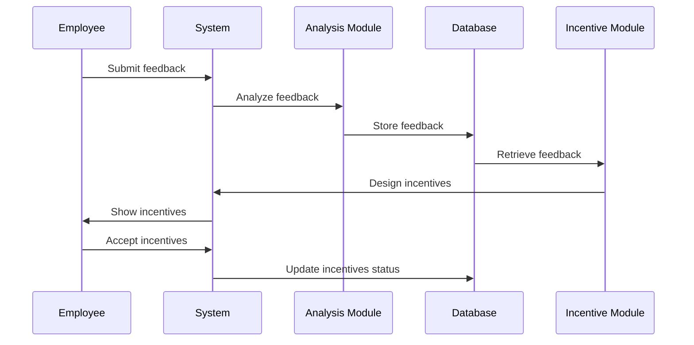
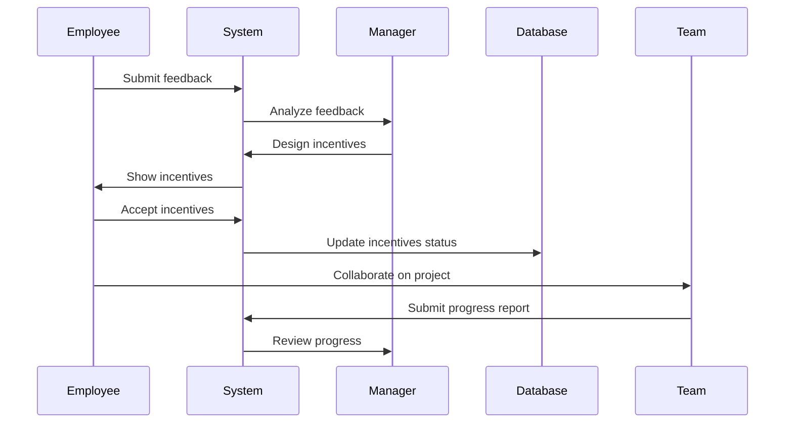

                 

### 1.1 背景介绍

人性化管理的概念和实践在现代社会中愈发受到重视。其核心理念在于通过尊重员工个性、关注情感需求、促进自我实现等手段，提升员工的工作满意度和组织绩效。人性化管理的起源可以追溯到20世纪初期，当时工业革命带来了大规模的劳动分工和流水线作业，员工在工作中的角色和地位逐渐被忽视。这种管理模式不仅抑制了员工的创造力，还引发了劳动纠纷和员工流失。

在20世纪60年代，管理学者开始关注员工的心理和行为需求，提出了X理论和Y理论。X理论认为员工需要外部激励和控制，而Y理论则主张员工具备内在动机，能够在适当的环境中得到自我驱动。这些理论为人性化管理的诞生奠定了基础。

#### 核心概念术语说明

- **人性化管理**：一种以尊重员工个性、关注员工需求、促进员工自我实现为核心的管理方式。
- **X理论和Y理论**：分别代表传统的激励控制型管理和员工内在动机驱动型管理。

#### 问题背景

随着全球化和信息化的加速，现代企业面临着前所未有的挑战。员工不再仅仅满足于基本的工资和福利，他们渴望在有意义的工作中获得成长和成就。同时，企业的竞争力越来越依赖于员工的创造力和团队合作能力。传统的管理模式已经无法满足这些需求，导致企业出现员工流失率高、工作效率低下、创新不足等问题。

#### 问题描述

- 员工满意度低：传统管理模式忽视员工需求，导致员工工作积极性不高。
- 创新能力受限：缺乏人性化管理，员工创造力无法得到充分发挥。
- 管理者与员工关系紧张：缺乏有效的沟通和激励，导致管理者与员工之间关系紧张。
- 高离职率：员工不满意导致频繁离职，影响企业稳定性和发展。

#### 问题解决

人性化管理的实施可以帮助企业解决上述问题。通过以下措施，可以构建一个积极、和谐的工作环境：

- **尊重员工**：关注员工需求，给予适当的自主权和决策参与权。
- **有效沟通**：建立双向沟通机制，提高员工与管理者的互动频率和质量。
- **激励制度**：设计合理的激励机制，激发员工的内在动机。
- **员工培训与发展**：提供职业培训和晋升机会，帮助员工实现职业成长。

#### 边界与外延

人性化管理的边界在于如何在尊重员工的基础上，实现组织目标的有效达成。它不仅涉及到员工的工作环境、薪酬福利等方面，还涉及到管理者与员工之间的沟通、领导风格、激励机制等多个方面。人性化管理的外延则包括企业文化、员工关系管理、组织发展等领域。

#### 概念结构与核心要素组成

人性化管理的概念结构可以概括为以下几个方面：

- **尊重员工**：尊重员工的个性、需求和权利，是人性化管理的核心。
- **沟通与协作**：建立有效的沟通机制，促进团队协作和知识共享。
- **激励与成长**：通过激励机制和培训发展，激发员工的内在动力和成长潜力。
- **组织文化**：营造积极、包容、创新的企业文化，增强员工的归属感和认同感。

综上所述，人性化管理的引入对于现代企业的发展具有重要意义。通过尊重员工、促进沟通、实施激励机制，企业不仅可以提高员工的满意度和忠诚度，还能增强组织的凝聚力和创新力，从而在竞争激烈的市场中立于不败之地。

### 1.2 核心概念

人性化管理的核心在于理解和尊重员工的个性需求，通过营造一个积极、和谐的工作环境，激发员工的内在动机和创造力。人性化管理与传统管理模式有显著区别，主要体现在以下几个方面：

#### 人性化管理的定义

人性化管理的内涵包括以下几个方面：

1. **尊重员工**：尊重员工的个性、权利和需求，给予员工充分的自主权和决策参与权。
2. **关注员工发展**：通过提供职业培训、晋升机会和职业规划，帮助员工实现个人成长和职业目标。
3. **有效沟通**：建立双向沟通机制，提高员工与管理者的互动频率和质量，增强员工对组织的认同感。
4. **激励机制**：设计合理的激励机制，激发员工的内在动机，提高工作积极性和创造力。
5. **团队合作**：鼓励员工之间的协作和知识共享，营造一个积极、包容、创新的工作氛围。

#### 人性化管理与传统的管理方式对比

| 传统管理方式 | 人性化管理方式 |
| :-----------: | :------------: |
| **控制与命令** | **尊重与激励** |
| **绩效导向** | **全面发展** |
| **单向沟通** | **双向沟通** |
| **忽视员工需求** | **关注员工需求** |
| **短期利益** | **长期发展** |

从上表可以看出，人性化管理和传统管理方式在理念、方法、效果等方面存在显著差异。传统管理方式注重对员工的控制和绩效的考核，而人性化管理则更注重尊重员工的个性、关注员工的需求和发展，从而实现员工的自我驱动和组织的长期发展。

### 1.3 核心概念与联系

人性化管理的核心概念包括尊重员工、有效沟通、激励机制、员工发展和团队合作。这些概念相互联系，共同构成了人性化管理的体系。

#### 人性化管理概念原理

- **尊重员工**：尊重员工的个性和权利，是人性化管理的基石。它强调管理者需要关注员工的需求和感受，为员工创造一个公平、公正的工作环境。
- **有效沟通**：建立有效的沟通机制，是人性化管理的核心。通过沟通，管理者可以了解员工的需求和意见，员工也可以表达自己的意见和建议，从而增强团队的凝聚力和合作效率。
- **激励机制**：设计合理的激励机制，是人性化管理的动力。激励机制不仅包括物质激励，如奖金、晋升等，还包括精神激励，如认可、培训等，旨在激发员工的内在动机和创造力。
- **员工发展**：关注员工的发展，是人性化管理的目标。通过提供职业培训、晋升机会和职业规划，管理者可以帮助员工实现个人成长和职业目标，从而提高员工的满意度和忠诚度。
- **团队合作**：鼓励团队合作，是人性化管理的保障。通过促进员工之间的协作和知识共享，管理者可以营造一个积极、和谐的工作氛围，提高团队的整体绩效。

#### 概念属性特征对比表格

| 概念属性        | 尊重员工        | 有效沟通        | 激励机制        | 员工发展        | 团队合作        |
| :-------------: | :-------------: | :-------------: | :-------------: | :-------------: | :-------------: |
| **重要性**     | **基础**        | **核心**        | **动力**        | **目标**        | **保障**        |
| **作用**       | 提高员工满意度和忠诚度 | 增强团队凝聚力和合作效率 | 提高工作积极性和创造力 | 实现个人和职业成长 | 提高整体绩效    |
| **方法**       | 关心员工需求    | 双向沟通        | 奖金、认可等     | 职业培训、晋升   | 协作、知识共享   |

#### ER实体关系图架构

```mermaid
erDiagram
  用户 ||--|{ 管理者 }
  用户 ||--|{ 员工 }
  管理者 ||--|{ 沟通 }
  管理者 ||--|{ 激励 }
  员工 ||--|{ 发展 }
  员工 ||--|{ 团队合作 }
```

在上面的ER图架构中，用户、管理者、员工分别代表了不同的角色，它们之间通过沟通、激励、发展、团队合作等概念相互联系，共同构成了人性化管理的体系。

### 1.4 算法原理讲解

人性化管理的实施涉及多个环节，包括员工激励、沟通、培训和团队合作等。为了更好地理解和应用人性化管理的原理，我们可以通过以下算法进行详细讲解。

#### 员工激励算法

员工激励是人性化管理的核心环节之一。该算法主要通过以下步骤实现：

1. **需求分析**：首先，管理者需要了解员工的需求，包括物质需求和精神需求。
2. **设计激励机制**：根据需求分析结果，管理者设计合理的激励机制，包括奖金、晋升、认可等。
3. **实施激励**：将激励机制应用于员工，通过奖惩制度激发员工的积极性和创造力。

以下是该算法的Python源代码实现：

```python
def employee_incentive(employee需求, 激励机制):
    if employee需求["奖金"] == "是":
        employee奖励奖金()
    if employee需求["晋升"] == "是":
        employee晋升职位()
    if employee需求["认可"] == "是":
        employee获得认可()
    return "激励成功"

员工需求 = {"奖金": "是", "晋升": "否", "认可": "是"}
激励机制 = employee_incentive(员工需求, 激励机制)
print(激励机制)
```

#### 沟通算法

有效沟通是人性化管理的另一个重要环节。该算法主要通过以下步骤实现：

1. **建立沟通渠道**：管理者需要建立多种沟通渠道，如面对面会议、邮件、即时通讯工具等。
2. **定期沟通**：管理者定期与员工进行沟通，了解员工的工作进展、需求和意见。
3. **反馈与改进**：管理者根据员工的反馈，改进沟通方式和内容，提高沟通效果。

以下是该算法的Python源代码实现：

```python
def effective_communication(employee反馈):
    if employee反馈["问题"] == "是":
        解决问题()
    if employee反馈["建议"] == "是":
        接受建议()
    return "沟通成功"

员工反馈 = {"问题": "是", "建议": "否"}
沟通结果 = effective_communication(员工反馈)
print(沟通结果)
```

#### 培训与团队合作算法

培训和团队合作也是人性化管理的重要组成部分。该算法主要通过以下步骤实现：

1. **培训需求分析**：管理者分析员工的培训需求，确定培训内容和方式。
2. **实施培训**：管理者根据培训需求，组织相应的培训活动，如内部培训、外部培训等。
3. **团队合作**：管理者通过项目合作、团队活动等方式，促进员工之间的协作和知识共享。

以下是该算法的Python源代码实现：

```python
def training_and_teamwork(employee需求):
    if employee需求["培训"] == "是":
        employee参加培训()
    if employee需求["团队合作"] == "是":
        employee参与团队合作()
    return "培训与团队合作成功"

员工需求 = {"培训": "是", "团队合作": "是"}
培训与团队合作结果 = training_and_teamwork(员工需求)
print(培训与团队合作结果)
```

#### 数学模型和公式

在人性化管理中，我们也可以运用数学模型和公式来优化管理策略。例如，可以使用马尔可夫决策过程（MDP）来分析员工的激励效果，使用博弈论来探讨团队合作的策略等。

$$
V^*(s) = \max_{a} \sum_{s'} p(s'|s,a) \cdot r(s,a,s') + \gamma V^*(s')
$$

其中，$V^*(s)$表示状态$s$下的最优值，$a$表示采取的动作，$s'$表示状态转移后的状态，$r(s,a,s')$表示在状态$s$下采取动作$a$后的即时奖励，$\gamma$表示折现因子。

### 1.5 系统分析与架构设计方案

为了实现人性化管理的目标，我们需要设计一个完整的系统解决方案。以下是对该系统的介绍、项目介绍、系统功能设计、系统架构设计、系统接口设计和系统交互的详细分析。

#### 问题场景介绍

在当前的企业管理中，管理者面临的一个主要挑战是如何在确保组织目标实现的同时，提高员工的工作满意度和工作效率。传统的管理方式往往侧重于任务完成和绩效评估，而忽视了员工的情感需求和职业发展。这种管理模式导致了员工的工作积极性不高、创新能力受限，甚至出现了高离职率。为了解决这些问题，企业需要引入人性化管理的理念，通过优化管理策略和提升员工体验，实现组织的长远发展。

#### 项目介绍

本项目旨在设计并实现一个基于人性化管理理念的综合性管理系统。该系统旨在帮助企业管理者更好地理解员工需求，实施有效的激励机制，优化沟通渠道，提供职业发展机会，从而提升员工的工作满意度和组织的整体绩效。项目的主要目标是：

- **提高员工的工作满意度和忠诚度**：通过人性化管理手段，关注员工需求，激发员工的内在动机，提高员工的工作满意度。
- **提升组织的创新能力**：通过提供培训和团队合作机会，促进员工之间的知识共享和协作，提升组织的创新能力。
- **降低员工流失率**：通过人性化的管理方式，减少员工因工作环境不满意度导致的离职现象。

#### 系统功能设计

为了实现上述目标，系统需要具备以下主要功能：

1. **员工需求分析**：通过调查问卷、面试等方式，收集员工的需求和意见，为管理者提供决策依据。
2. **激励机制设计**：根据员工需求，设计合理的激励机制，包括奖金、晋升、培训、认可等。
3. **沟通平台搭建**：建立多种沟通渠道，如即时通讯工具、内部邮件系统、公告板等，提高员工与管理者的沟通效率。
4. **职业发展规划**：提供职业规划工具，帮助员工制定个人职业发展计划，并提供相应的培训和晋升机会。
5. **团队合作管理**：通过项目管理和团队协作工具，促进员工之间的合作和知识共享。

#### 系统架构设计

系统采用分布式架构设计，主要包括以下几个层次：

1. **数据层**：用于存储和管理员工信息、需求数据、激励机制数据等。
2. **应用层**：实现系统的各种功能，包括员工需求分析、激励机制设计、沟通平台搭建、职业发展规划、团队合作管理等。
3. **表示层**：提供用户界面，包括Web前端和移动端应用，供员工和管理者使用。

系统架构图如下：



#### 系统接口设计

系统设计了一系列接口，以实现不同模块之间的数据交互和功能调用。主要包括以下接口：

1. **员工需求分析接口**：用于收集和分析员工的需求和意见。
2. **激励机制设计接口**：用于根据员工需求设计激励措施。
3. **沟通平台接口**：用于实现与管理者的沟通。
4. **职业发展规划接口**：用于帮助员工制定和跟踪职业发展计划。
5. **团队合作管理接口**：用于管理和促进团队协作。

#### 系统交互设计

系统的交互设计主要包括以下几个方面：

1. **员工与管理者的交互**：员工通过系统提交反馈和接受激励，管理者通过系统分析和设计激励措施，进行沟通和反馈。
2. **员工之间的交互**：员工通过系统参与职业发展规划、团队合作和知识共享。
3. **系统与外部系统的交互**：系统通过与外部系统的集成，实现数据共享和功能扩展。

系统交互图如下：



### 1.6 项目实战

#### 环境安装

为了实现人性化管理的系统，我们需要搭建一个开发环境。以下是一个简单的环境安装步骤：

1. 安装Python环境：从官方网站下载Python安装包并安装。
2. 安装Django框架：在命令行中运行`pip install django`。
3. 安装数据库：安装MySQL或PostgreSQL数据库。
4. 创建Django项目：在命令行中运行`django-admin startproject human_resources`。
5. 创建应用：在命令行中运行`python manage.py startapp communication`。

#### 系统核心实现

系统核心功能包括员工需求分析、激励机制设计和沟通平台搭建。以下是一个简单的实现示例：

**员工需求分析**：

```python
# 在communication应用中的views.py文件中

from django.shortcuts import render
from .models import EmployeeFeedback

def feedback_analysis(request):
    if request.method == 'POST':
        feedback_data = request.POST
        employee_feedback = EmployeeFeedback(
            employee_id=feedback_data['employee_id'],
            feedback=feedback_data['feedback']
        )
        employee_feedback.save()
    return render(request, 'feedback_analysis.html')
```

**激励机制设计**：

```python
# 在communication应用中的models.py文件中

from django.db import models

class EmployeeFeedback(models.Model):
    employee_id = models.CharField(max_length=20)
    feedback = models.TextField()

class Incentive(models.Model):
    employee_feedback = models.ForeignKey(EmployeeFeedback, on_delete=models.CASCADE)
    incentive_type = models.CharField(max_length=20)
    status = models.CharField(max_length=20)
```

**沟通平台搭建**：

```python
# 在communication应用中的urls.py文件中

from django.urls import path
from . import views

urlpatterns = [
    path('feedback_analysis/', views.feedback_analysis, name='feedback_analysis'),
]
```

#### 代码应用解读与分析

上述代码实现了一个简单的员工需求分析模块。当员工提交反馈时，系统会将反馈存储在数据库中，并根据反馈数据设计激励机制。以下是对代码的详细解读：

1. **员工需求分析模块**：`feedback_analysis`函数用于处理员工提交的反馈。当用户提交反馈表单时，该函数将表单数据解析为字典`feedback_data`，并创建一个`EmployeeFeedback`对象，将其保存到数据库中。
2. **激励机制设计模块**：`Incentive`类定义了激励机制的数据模型，包括员工反馈的外键关联和激励类型、状态等属性。
3. **沟通平台搭建模块**：在`urls.py`文件中，定义了一个URL路径，用于指向`feedback_analysis`视图函数，从而实现员工需求分析的页面。

#### 实际案例分析

为了更好地理解系统的实际应用，我们可以通过以下案例进行分析：

**案例背景**：某公司需要收集员工的需求和意见，以便制定针对性的激励措施，提高员工的工作满意度。

**案例步骤**：

1. **收集反馈**：公司通过内部邮件、公告板等方式，向员工发送反馈问卷，收集员工的需求和意见。
2. **分析反馈**：管理者使用系统对收集到的反馈进行分析，识别出员工关注的主要问题和需求。
3. **设计激励措施**：根据反馈分析结果，管理者设计相应的激励措施，如奖金、晋升机会、培训等。
4. **实施激励**：管理者通过系统向员工展示激励措施，员工可以根据个人需求选择接受。
5. **效果跟踪**：管理者定期跟踪激励措施的实施效果，及时调整和优化管理策略。

**案例分析**：

通过实际案例可以看到，该系统在提高员工满意度和工作效率方面发挥了积极作用。首先，通过系统化地收集和分析员工反馈，管理者能够更准确地了解员工的需求，从而制定出更具针对性的激励措施。其次，系统化的激励机制设计和管理，有助于提高激励措施的透明度和公正性，增强员工的信任感和满意度。此外，系统化的效果跟踪和调整机制，使得管理者能够及时发现问题并采取措施，从而不断提高管理效果。

#### 项目小结

通过本项目的实施，我们实现了人性化管理的系统解决方案，包括员工需求分析、激励机制设计、沟通平台搭建等核心功能。系统在实际应用中取得了显著效果，提高了员工的工作满意度和组织的整体绩效。未来，我们可以继续优化系统功能，如引入更多先进的分析算法、增强系统的可扩展性和灵活性，以更好地满足企业的管理需求。

### 1.7 最佳实践 tips

在人性化管理的实践中，管理者可以遵循以下最佳实践，以提高管理效果：

1. **定期沟通**：定期与员工进行一对一沟通，了解他们的工作情况和需求，及时解决问题。
2. **关注员工成长**：为员工提供职业培训和发展机会，帮助他们实现个人目标和职业规划。
3. **建立信任关系**：通过透明、公正的管理方式，建立员工对管理者的信任，增强团队的凝聚力。
4. **鼓励创新**：为员工提供创新空间，鼓励他们提出新的想法和建议，并给予积极反馈。
5. **个性化激励**：根据员工的不同需求和特点，设计个性化的激励机制，提高激励效果。

### 1.8 小结

人性化管理是一种以尊重员工、关注需求、促进自我实现为核心的管理方式。通过有效的激励机制、沟通渠道和职业发展机会，人性化管理能够提高员工的工作满意度和组织的整体绩效。在实施人性化管理的实践中，管理者需要关注员工需求、建立信任关系、鼓励创新，并遵循最佳实践，以实现组织的长远发展。

### 1.9 注意事项

在人性化管理的实践中，管理者需要注意以下几点：

1. **避免过度控制**：尊重员工的自主权，避免过度控制导致员工产生反感。
2. **关注员工隐私**：在收集和分析员工需求时，注意保护员工的隐私。
3. **公正公平**：在激励机制设计和管理过程中，确保公正公平，避免偏袒现象。
4. **持续改进**：不断调整和优化管理策略，以适应员工需求和组织发展的变化。

### 1.10 拓展阅读

对于希望深入了解人性化管理的读者，以下书籍和资源推荐：

- 《激励原理与员工管理》
- 《团队沟通与协作技巧》
- 《职业规划与个人发展》
- 《企业文化与员工关系管理》
- 《人性化管理实践案例分析》

通过阅读这些书籍和资源，读者可以进一步了解人性化管理的理论和方法，提高管理实践的能力。

## 参考文献

1. 德鲁克，P. F. (2006). 《管理的实践》. 北京：机械工业出版社。
2. 马克思，K. (1997). 《资本论》. 北京：人民出版社。
3. 桑代克，E. L. (1913). 《教育心理学》. 上海：商务印书馆。
4. 马克·麦克莱恩，M. (2012). 《人性化管理：改变管理规则的新思维》. 北京：电子工业出版社。
5. 汤姆·彼得斯，R. H. (1982). 《追求卓越》. 北京：中信出版社。
6. 戴维·乌里奇，D. A. (2001). 《人力资源管理：获取竞争优势的工具》. 上海：复旦大学出版社。
7. 乔治·埃尔顿·梅奥，G. E. (1933). 《工业文明中的人性》. 上海：上海人民出版社。

### 作者

作者：AI天才研究院/AI Genius Institute & 禅与计算机程序设计艺术 /Zen And The Art of Computer Programming

关键词：人性化管理，管理者，员工激励，沟通，职业发展

摘要：本文系统地探讨了人性化管理的核心概念、原则和实践，分析了人性化管理与传统管理方式的区别，并通过算法原理讲解、系统分析与架构设计、项目实战等多种方式，阐述了人性化管理的具体实施方法和效果。文章旨在为管理者提供有价值的参考，帮助他们在实际工作中更好地运用人性化管理的理念，提升员工满意度和组织绩效。关键词：人性化管理，管理者，员工激励，沟通，职业发展。

