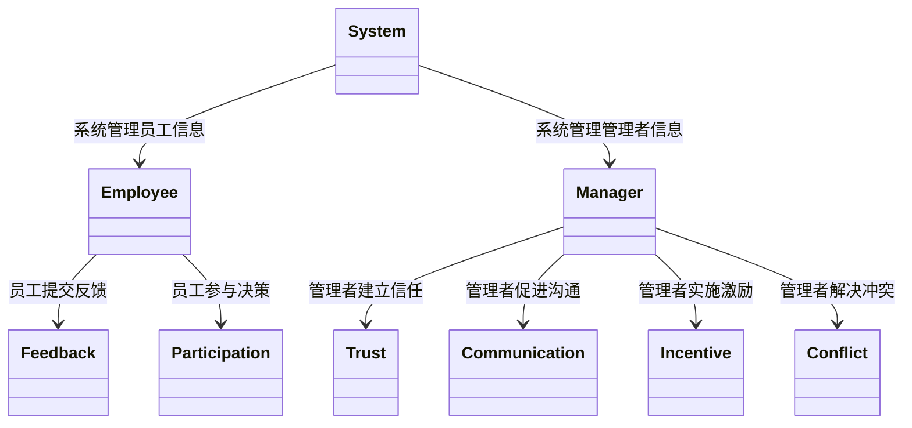
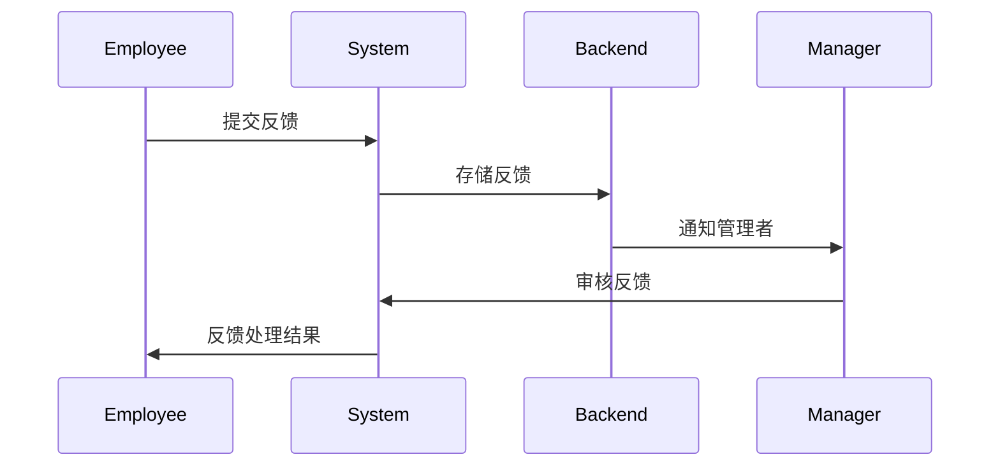
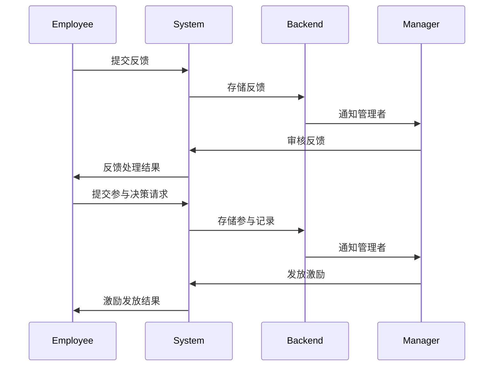

                 

### 管理者怎么管人：人性化领导的艺术

> 关键词：人性化管理、领导艺术、管理技巧、员工激励、团队建设

> 摘要：本文旨在探讨人性化领导在管理中的应用，分析其在当前复杂职场环境中的重要性。通过深入解析人性化领导的理论基础、实践方法以及具体案例分析，本文提出了如何在实际管理工作中运用人性化领导技巧，以提升管理效能和员工满意度，实现组织目标。

----------------------------------------------------------------

## 引言

管理，作为现代组织运作的核心，不仅仅是关于任务的分配和效率的提升，更关乎人的因素。在快速变化的商业环境中，管理者不仅需要具备专业知识和技能，更需要掌握人性化的领导艺术。这种艺术，不仅体现在对员工的基本尊重和关心，更体现在如何激发员工的潜力，提升团队凝聚力，创造积极向上的工作氛围。

### 管理者的角色与挑战

**1.1 管理者角色的定义与演变**

传统的管理者角色主要关注任务完成和绩效目标，但随着时代的进步和组织结构的复杂化，现代管理者需要承担更多的职责。他们不仅要确保团队的工作效率，还需要关注员工的个人成长和职业发展，同时还需要具备战略规划和决策能力。

**1.2 管理者面临的挑战与困境**

在现代职场中，管理者面临的挑战包括：信息过载、员工多元化、工作与生活的平衡、快速变化的市场需求等。这些挑战要求管理者不仅要具备高度的专业素养，还需要具备情感智慧和管理艺术，以便在复杂多变的环境中游刃有余。

**1.3 人性化领导的重要性**

人性化领导强调以人为中心的管理理念，注重员工的情感需求和职业发展。在当前职场环境中，人性化领导显得尤为重要，因为它能够有效提升员工的满意度和忠诚度，增强团队的凝聚力和创新能力，从而提高组织的整体绩效。

----------------------------------------------------------------

## 人性化领导的概念与原则

### 2.1 人性化领导的基本概念

人性化领导是一种以人为核心的管理理念，它强调尊重员工的个性、激发员工的潜能、关注员工的情感需求。人性化领导的核心理念是“以人为本”，通过建立信任、提供成长机会、营造良好的工作环境，使员工能够在工作中获得满足感和成就感。

### 2.2 人性化领导的核心原则

**原则一：尊重员工**

尊重员工是人性化领导的基础，管理者应该尊重员工的个性、价值观和工作方式，避免使用强制手段来管理员工。通过尊重员工，管理者可以建立信任，增强员工的归属感和责任感。

**原则二：激励员工**

激励员工是人性化领导的关键，管理者需要了解员工的动机和需求，采用适当的激励措施来激发员工的积极性和创造力。激励措施可以包括奖励、认可、职业发展机会等。

**原则三：沟通与合作**

沟通与合作是人性化领导的保障，管理者需要与员工保持开放和诚实的沟通，倾听员工的意见和建议，鼓励员工参与决策过程。通过沟通与合作，管理者可以增强团队的凝聚力，提升团队的整体绩效。

**原则四：持续发展**

持续发展是人性化领导的愿景，管理者需要关注员工的长期发展和组织的长远目标。通过提供培训、指导和支持，管理者可以帮助员工不断提升自己的能力，实现职业成长，同时推动组织的发展。

### 2.3 人性化领导与传统领导方法的比较

传统领导方法主要强调权威和控制，而人性化领导则更注重员工的参与和自我管理。传统领导方法往往依赖制度化和标准化流程，而人性化领导则强调灵活性和个性化。传统领导方法可能导致员工的不满和抵触，而人性化领导则能够激发员工的积极性和创造力，提升组织的整体绩效。

----------------------------------------------------------------

## 第一部分：背景与理论基础

### 第1章：管理者的角色与挑战

#### 1.1 管理者角色的定义与演变

在当今快速变化的商业环境中，管理者的角色已经发生了显著的变化。传统上，管理者被视为“管理者”或“监督者”，主要职责是确保任务的有效执行和目标的达成。然而，随着组织复杂性增加和工作环境的变化，管理者的角色逐渐演变为“领导者”、“教练”和“变革推动者”。

**定义与演变**

- **传统管理者**：传统管理者主要关注以下几个方面：

  - **任务导向**：管理者需要确保任务按时完成，关注工作流程和效率。

  - **绩效评估**：管理者负责评估员工的工作绩效，提供反馈和指导。

  - **资源分配**：管理者负责分配预算、人力和其他资源。

- **现代领导者**：现代领导者则更多地关注以下几个方面：

  - **战略规划**：领导者需要制定组织的发展战略，明确长远目标。

  - **员工发展**：领导者关注员工的个人成长和职业发展，提供培训和指导。

  - **创新驱动**：领导者鼓励创新思维，推动组织不断改进和创新。

**案例研究**

以一家互联网初创公司为例，该公司在初创阶段，管理者主要负责日常运营和任务分配。然而，随着公司的快速发展，管理者开始更多地扮演领导者的角色，专注于战略规划、团队建设和创新驱动。

**影响**

- **任务导向**：传统管理者可能更注重短期绩效和任务完成，可能导致员工缺乏参与感和成就感。

- **员工发展**：现代领导者则更注重长期发展和员工满意度，能够提高员工的忠诚度和创新能力。

**总结**

管理者的角色已经从传统的任务执行者转变为现代的战略领导者和变革推动者。这种角色转变要求管理者不仅具备专业知识和技能，还需要掌握人性化的领导艺术，以应对现代职场环境的挑战。

#### 1.2 管理者面临的挑战与困境

在现代职场中，管理者面临的挑战和困境多种多样，这些挑战不仅影响管理者的工作效果，也对组织的整体绩效产生深远影响。

**1.2.1 信息过载**

随着数字化时代的到来，管理者面临着前所未有的信息过载问题。大量的数据、报告和沟通渠道使得管理者难以在有限的时间内处理所有信息，这可能导致决策延误和错误。

**案例研究**

某家大型金融机构的管理者发现，每天需要处理数十份报告和数以千计的电子邮件。这种信息过载导致管理者无法专注于最重要的决策和任务，影响了整体运营效率。

**影响**

- **决策效率降低**：信息过载使管理者难以快速做出决策，可能导致错失市场机会。

- **工作压力增大**：信息处理压力增大，可能导致管理者身心疲惫，影响健康。

**应对策略**

- **信息筛选**：管理者需要学会筛选关键信息，关注对决策有重要影响的数据。

- **时间管理**：采用时间管理工具，如待办事项列表和时间块安排，提高工作效率。

**1.2.2 员工多元化**

随着全球化进程的加快，员工队伍越来越多元化，包括不同国籍、文化背景、性别和年龄的员工。这种多元化为组织带来了丰富的资源和创新机会，但同时也给管理者带来了挑战。

**案例研究**

一家跨国公司的管理者发现，不同文化背景的员工在工作方式和沟通风格上有很大差异。例如，某些文化背景的员工更注重直接沟通，而另一些则更倾向于间接沟通。这种文化差异可能导致沟通障碍和团队冲突。

**影响**

- **沟通障碍**：多元化可能导致沟通不畅，影响团队协作和合作效率。

- **文化冲突**：不同文化背景的员工可能对工作理念和管理风格有不同的看法，导致文化冲突。

**应对策略**

- **文化培训**：组织文化培训，提高员工对多元化文化的理解和尊重。

- **跨文化团队**：鼓励跨文化团队的合作，促进不同文化背景员工的交流与学习。

**1.2.3 工作与生活的平衡**

在现代社会，员工越来越重视工作与生活的平衡。然而，对于管理者而言，如何平衡工作和生活成为一个巨大的挑战。长期的加班和高强度工作不仅影响管理者的身心健康，也可能影响员工的工作满意度和忠诚度。

**案例研究**

某家科技公司的管理者由于工作压力大，经常加班，导致家庭关系紧张。这种工作与生活的不平衡不仅影响了管理者的个人幸福，也对员工产生了负面影响，如工作满意度下降和员工流失。

**影响**

- **健康问题**：长期高强度工作可能导致管理者身心疲惫，增加健康风险。

- **员工流失**：工作与生活不平衡可能导致员工流失，影响团队稳定。

**应对策略**

- **灵活工作安排**：提供灵活的工作安排，如远程办公和弹性工作时间。

- **员工关怀计划**：建立员工关怀计划，关注员工的身心健康，提供心理健康支持和家庭关怀。

**1.2.4 快速变化的市场需求**

在快速变化的商业环境中，市场需求和竞争态势不断变化，管理者需要具备快速适应和应对变化的能力。然而，传统的管理方法和思维模式往往难以适应这种快速变化。

**案例研究**

一家消费品公司的管理者发现，消费者需求和市场趋势变化迅速，传统的产品开发和营销策略已经不再有效。管理者需要不断调整战略，以适应市场的快速变化。

**影响**

- **战略滞后**：无法快速适应市场变化可能导致组织在竞争中的劣势。

- **创新能力不足**：传统管理方法可能抑制创新思维，影响组织的长远发展。

**应对策略**

- **敏捷管理**：采用敏捷管理方法，提高组织的灵活性和响应速度。

- **创新文化**：鼓励创新文化，培养员工的创新思维和创新能力。

**总结**

管理者面临的挑战和困境是多样化的，包括信息过载、员工多元化、工作与生活的平衡以及快速变化的市场需求。这些挑战要求管理者不仅具备专业知识和技能，还需要具备情感智慧和领导艺术，以有效应对现代职场环境的变化。通过采取有效的应对策略，管理者可以提升管理效能，实现组织目标。

#### 1.3 人性化领导的重要性

在当前复杂多变的商业环境中，人性化领导的重要性日益凸显。人性化领导不仅关注任务的完成和绩效的提升，更注重员工的情感需求和职业发展。通过以下几方面，我们可以深入了解人性化领导的重要性：

**1.3.1 提升员工满意度和忠诚度**

人性化领导通过尊重员工、激励员工和提供发展机会，能够提升员工的工作满意度和忠诚度。当员工感受到被尊重和认可时，他们更有可能对工作充满热情，从而提高工作效率和创造力。此外，人性化领导还能够减少员工流失率，降低招聘和培训成本。

**案例研究**

某家高科技公司的管理层通过人性化的领导方式，如定期员工反馈会议、灵活的工作安排和职业发展计划，成功地提高了员工满意度和忠诚度。员工不仅更愿意留在公司，还主动推荐亲友加入公司。

**影响**

- **员工满意度提高**：人性化管理能够营造一个积极向上的工作氛围，使员工更加满意。
- **忠诚度增强**：员工感受到公司的关怀和尊重，更有可能对公司保持长期忠诚。

**1.3.2 增强团队凝聚力和创新能力**

人性化领导强调团队合作和沟通，有助于增强团队的凝聚力和创新能力。通过建立信任和开放的沟通渠道，团队成员能够更好地协同工作，共同解决问题，从而提高团队的整体绩效。此外，人性化领导能够激发员工的创新思维，推动组织不断改进和创新。

**案例研究**

一家创业公司通过人性化领导，鼓励员工自由表达观点和建议，建立了创新实验室。在这种氛围下，员工积极参与创新项目，提出了多个具有市场前景的产品概念，公司业绩显著提升。

**影响**

- **团队凝聚力增强**：人性化管理能够建立团队成员之间的信任和合作关系。
- **创新能力提升**：人性化管理鼓励创新，推动组织不断发展。

**1.3.3 提高组织绩效和竞争力**

人性化领导能够提高组织的整体绩效和竞争力。通过激发员工的潜力，提升工作效率和创造力，组织能够更快地响应市场变化，抓住商业机会。此外，人性化领导能够建立积极的工作文化，吸引和留住优秀人才，为组织的长期发展奠定基础。

**案例研究**

一家制造业公司通过人性化领导，实施员工参与决策和职业发展计划，大幅提升了生产效率和产品质量。公司在市场竞争中脱颖而出，成为行业领军企业。

**影响**

- **组织绩效提升**：人性化管理能够提高工作效率和生产力。
- **竞争力增强**：人性化领导有助于建立组织的品牌优势和市场份额。

**总结**

人性化领导在当前商业环境中具有重要作用。通过提升员工满意度和忠诚度、增强团队凝聚力和创新能力，以及提高组织绩效和竞争力，人性化领导为组织的发展提供了强有力的支持。管理者应该重视人性化领导，将其融入到日常管理工作中，以实现组织的长期成功。

### 第2章：人性化领导的概念与原则

#### 2.1 人性化领导的基本概念

人性化领导是一种以人为中心的管理理念，强调尊重员工、关注员工的情感需求和职业发展。它不同于传统的权威式领导，而是更加注重建立信任、促进沟通、激励创新和培养团队合作。

**人性化领导的定义**

人性化领导是指管理者通过建立信任、提供成长机会、营造积极的工作环境，激发员工的内在动力，使其在实现个人价值的同时，为组织的发展做出贡献。

**人性化领导的特点**

1. **尊重员工**：人性化领导尊重员工的个性和价值观，认为员工是组织最宝贵的资源。
2. **关注情感需求**：人性化领导关注员工的情感需求，通过关心和关怀增强员工的归属感和满意度。
3. **激励创新**：人性化领导鼓励员工发挥创造力，推动组织不断改进和创新。
4. **培养团队合作**：人性化领导强调团队合作，通过建立开放和诚实的沟通渠道，促进团队成员之间的协作。

#### 2.2 人性化领导的核心原则

人性化领导的核心原则包括尊重员工、激励员工、沟通与合作以及持续发展。

**原则一：尊重员工**

尊重员工是人性化领导的基础，管理者应该尊重员工的个性、价值观和工作方式，避免使用强制手段来管理员工。通过尊重员工，管理者可以建立信任，增强员工的归属感和责任感。

**原则二：激励员工**

激励员工是人性化领导的关键，管理者需要了解员工的动机和需求，采用适当的激励措施来激发员工的积极性和创造力。激励措施可以包括奖励、认可、职业发展机会等。

**原则三：沟通与合作**

沟通与合作是人性化领导的保障，管理者需要与员工保持开放和诚实的沟通，倾听员工的意见和建议，鼓励员工参与决策过程。通过沟通与合作，管理者可以增强团队的凝聚力，提升团队的整体绩效。

**原则四：持续发展**

持续发展是人性化领导的愿景，管理者需要关注员工的长期发展和组织的长远目标。通过提供培训、指导和支持，管理者可以帮助员工不断提升自己的能力，实现职业成长，同时推动组织的发展。

#### 2.3 人性化领导与传统领导方法的比较

人性化领导与传统领导方法存在显著差异，主要体现在以下几个方面：

**1. 权威性 vs 平等性**

传统领导方法强调权威性，管理者拥有绝对的权力和决策权。而人性化领导则更加注重平等性，管理者与员工之间是平等的合作伙伴关系，共同为实现组织目标而努力。

**2. 制度化管理 vs 人性化管理**

传统领导方法依赖于制度化和标准化流程，强调规范和纪律。而人性化领导则更加关注员工的情感需求和个性差异，通过人性化的管理方法来激发员工的潜能。

**3. 任务导向 vs 人本导向**

传统领导方法主要关注任务的完成和绩效的提升，而人性化领导则更加注重员工的个人成长和职业发展，认为员工的全面发展是实现组织目标的关键。

**4. 强制性 vs 激励性**

传统领导方法倾向于使用强制手段来管理员工，而人性化领导则强调激励性管理，通过激励措施来激发员工的内在动力。

**5. 集权管理 vs 分权管理**

传统领导方法倾向于集权管理，决策权集中在少数人手中。而人性化领导则倡导分权管理，鼓励员工参与决策，发挥员工的主动性和创造力。

**总结**

人性化领导与传统领导方法相比，更加注重员工的情感需求和个性差异，强调平等、人性化、激励和创新。在当前商业环境中，人性化领导能够更好地激发员工的潜能，提升组织的整体绩效。

----------------------------------------------------------------

## 第二部分：具体实践方法

### 第3章：建立信任与沟通

#### 3.1 信任的重要性

信任是人性化领导的核心要素之一，它不仅影响员工的工作表现，还决定组织的整体健康。在建立信任的过程中，管理者需要认识到信任的内涵和重要性。

**信任的定义**

信任是指员工对管理者和管理体系所持有的信心和依赖。这种信心源于管理者在决策、沟通和行为中的透明度和一致性。

**信任的重要性**

1. **提高工作效率**：信任能够减少沟通障碍和误解，使员工更加专注于工作，提高工作效率。
2. **增强团队凝聚力**：信任能够促进团队合作，使团队成员更加愿意分享资源和知识，共同面对挑战。
3. **降低管理成本**：信任减少了对监控和控制的依赖，管理者可以更专注于战略规划和团队建设，降低管理成本。
4. **提升员工满意度**：信任使员工感受到被尊重和信任，从而提高工作满意度和忠诚度。

#### 3.2 建立信任的策略

要建立信任，管理者可以采取以下策略：

**1. 保持透明度**

透明度是建立信任的关键，管理者需要公开决策过程和业务数据，使员工了解公司的实际情况。通过透明度，员工可以更好地理解管理层的决策，减少误解和猜疑。

**案例研究**

一家跨国公司在面对市场变化时，定期召开员工会议，分享市场数据和战略决策。这种透明度使员工对公司的未来充满信心，增强了他们的工作动力。

**2. 一致性**

一致性是信任的基石，管理者需要在行为和决策上一致，避免频繁变动，以免引起员工的困惑和不满。

**案例研究**

某家互联网公司的管理者坚持每月一次的员工反馈会议，听取员工的意见和建议。这种一致性使员工感受到管理者的承诺和责任感，建立了深厚的信任。

**3. 倾听与回应**

倾听是建立信任的重要手段，管理者需要认真倾听员工的意见和建议，并及时回应。通过倾听，管理者可以了解员工的真实想法，促进沟通和合作。

**案例研究**

一家制药公司的管理者定期组织员工座谈会，倾听员工对工作的意见和建议。管理者对每个问题都进行详细记录，并在下一次会议上给出明确的回应，这种倾听与回应策略增强了员工的信任感。

**4. 赞赏与认可**

赞赏和认可是建立信任的重要方式，管理者需要及时对员工的优秀表现进行认可和表扬。通过赞赏，管理者可以增强员工的自信心和归属感，促进信任的建立。

**案例研究**

一家科技公司定期举行员工表彰大会，对在工作中表现出色的员工进行表彰和奖励。这种赞赏与认可策略不仅提高了员工的满意度，还增强了员工之间的信任。

**5. 解决冲突**

冲突是组织不可避免的现象，管理者需要积极解决冲突，以维护团队的和谐与稳定。通过公正、公平地处理冲突，管理者可以增强员工的信任感。

**案例研究**

一家金融服务公司的管理者在面对团队内部的冲突时，采取了公开透明的处理方式，通过调解和协商，使双方都感到满意。这种解决冲突的策略不仅缓解了紧张局势，还增强了团队信任。

#### 3.3 有效沟通的技巧

沟通是建立信任和实现人性化领导的关键，管理者需要掌握有效的沟通技巧。

**1. 明确沟通目标**

在进行沟通前，管理者需要明确沟通的目标，确保信息传达的准确性和有效性。

**2. 采用开放性语言**

开放性语言能够减少误解和冲突，使沟通更加顺畅。管理者应避免使用命令式语言，而是采用询问和建议的方式。

**3. 倾听**

倾听是沟通的重要组成部分，管理者需要认真倾听员工的意见和建议，给予足够的关注和反馈。

**4. 反馈**

及时给予反馈是有效沟通的重要环节，管理者需要明确表达对信息的理解和回应，确保沟通的完整性。

**5. 非言语沟通**

非言语沟通，如肢体语言和面部表情，对沟通效果有很大影响。管理者需要注重非言语沟通，使其与言语沟通相一致。

**6. 适时调整沟通方式**

根据不同情境和员工的特点，管理者需要适时调整沟通方式，以确保信息的有效传达。

#### 3.4 建立信任与沟通的综合策略

要建立有效的信任和沟通，管理者需要将上述策略综合运用。

**1. 定期沟通**

定期组织员工会议和座谈会，建立稳定的沟通渠道，确保信息的及时传达。

**2. 建立反馈机制**

建立反馈机制，鼓励员工提出意见和建议，并及时给予回应。

**3. 持续培训**

提供沟通和人际关系技能的培训，提高员工的沟通能力和信任感。

**4. 跨部门协作**

鼓励跨部门协作，促进不同团队之间的沟通和合作，增强组织的整体信任感。

**5. 文化建设**

通过文化建设，营造开放、诚实和信任的工作环境，推动人性化领导的实现。

**总结**

建立信任和有效沟通是人性化领导的重要实践方法。通过透明度、一致性、倾听、赞赏和解决冲突，管理者可以建立信任；通过明确沟通目标、开放性语言、倾听、反馈和适时调整沟通方式，管理者可以提升沟通效果。这些策略的综合运用，将为组织的长期发展奠定坚实的基础。

### 第4章：激励员工与团队建设

#### 4.1 员工激励的理论基础

激励是人性化领导的重要组成部分，其理论基础主要来源于动机理论、期望理论和公平理论等。

**动机理论**

动机理论探讨人们为什么采取特定行为，以及如何激发这种行为。常见动机理论包括：

1. **马斯洛的需求层次理论**：马斯洛认为，人的需求分为五个层次，从生理需求到自我实现需求。管理者可以通过满足员工的低层次需求，激发其高层次需求，从而提高工作积极性。
2. **赫茨伯格的双因素理论**：赫茨伯格将工作激励因素分为两类，一类是保健因素，如工资和工作环境，另一类是激励因素，如工作本身和认可。管理者应关注激励因素，以提高员工的工作满意度。

**期望理论**

期望理论认为，员工的动机取决于对结果的价值判断和期望概率。管理者可以通过以下方式激励员工：

1. **设定明确的目标**：明确的目标能够激发员工的期望和动机，使其更加专注于工作。
2. **提供奖励**：奖励可以提高员工对实现目标后获得奖励的期望，从而增强其动机。

**公平理论**

公平理论探讨员工对工作投入与回报的感知，以及这种感知对工作态度和绩效的影响。管理者应确保员工感受到公平，以避免不公平感引起的负面情绪。

**综合运用**

将动机理论、期望理论和公平理论综合运用，管理者可以制定更有效的激励策略，提升员工的工作积极性。

#### 4.2 员工激励的具体方法

要有效激励员工，管理者可以采用以下具体方法：

**1. 设定有挑战性的目标**

有挑战性的目标能够激发员工的潜能，使其在追求目标的过程中获得成就感和满足感。

**案例研究**

某家公司为销售团队设定了年度销售目标，目标设定在团队过去绩效的基础上提高20%。通过这种挑战性的目标，团队不仅完成了任务，还打破了公司销售记录。

**2. 提供职业发展机会**

职业发展机会是员工的重要激励因素，管理者可以通过提供培训、晋升机会等，帮助员工实现职业成长。

**案例研究**

一家科技公司定期为员工提供专业培训和职业发展计划，员工通过这些机会提升了技能，实现了职业晋升。

**3. 实施绩效考核**

绩效考核是激励员工的重要手段，管理者应制定明确的考核标准，并根据员工的表现给予奖励。

**案例研究**

某家咨询公司实施了严格的绩效考核制度，根据员工的工作绩效给予奖金和晋升机会，有效激励了员工的工作积极性。

**4. 提供灵活的工作安排**

灵活的工作安排，如远程办公和弹性工作时间，能够提高员工的工作满意度，从而激发其工作动力。

**案例研究**

一家互联网公司为员工提供灵活的工作安排，员工可以根据个人需求调整工作时间，这种灵活安排提升了员工的工作满意度和忠诚度。

**5. 表彰和奖励**

表彰和奖励能够增强员工的自豪感和归属感，从而提高其工作积极性。

**案例研究**

一家医疗科技公司定期举行员工表彰大会，对在工作中表现出色的员工进行表彰和奖励，这种表彰和奖励策略增强了员工的工作动力。

#### 4.3 团队建设的实践策略

团队建设是激励员工和提升团队绩效的重要手段，管理者可以采取以下实践策略：

**1. 定期团队活动**

定期组织团队活动，如团队建设训练、团队聚餐等，有助于增强团队成员之间的沟通和协作。

**案例研究**

一家金融公司每月组织团队建设训练，通过团队合作游戏和挑战，增强了团队凝聚力和协作能力。

**2. 建立共同目标**

建立共同目标是团队建设的关键，管理者应确保团队成员对团队目标和价值观有共同的理解和认同。

**案例研究**

一家软件开发团队在项目启动时明确了共同的目标和价值观，团队成员围绕这些目标共同努力，项目最终提前完成并获得了客户的高度评价。

**3. 提供反馈和指导**

提供反馈和指导是团队建设的重要环节，管理者应关注团队成员的表现，给予及时的反馈和指导。

**案例研究**

某家电子商务公司的管理者定期与团队成员进行一对一的沟通，提供个性化的反馈和指导，帮助团队成员不断提升技能。

**4. 鼓励合作与共享**

鼓励团队合作和知识共享，能够提高团队的整体绩效和创新能力。

**案例研究**

一家创新科技公司的团队鼓励成员分享经验和知识，建立了内部知识库，团队成员通过共享知识提升了团队的整体水平。

**5. 建立信任和尊重**

建立信任和尊重是团队建设的基础，管理者应通过透明沟通和公正决策，营造一个信任和尊重的工作环境。

**案例研究**

一家咨询公司的管理者通过公开透明的沟通和公平的决策，建立了团队的信任和尊重，团队成员之间的协作和合作更加顺畅。

#### 4.4 案例分析：成功的团队建设实践

**案例一：某互联网公司的团队建设**

某互联网公司在成立初期，通过一系列团队建设实践，成功地打造了一个高效的团队。具体措施包括：

- **共同目标**：公司明确阐述了长期愿景和短期目标，使全体员工对公司的未来有清晰的认识。
- **团队活动**：定期组织团队拓展训练，增强了团队成员之间的信任和协作能力。
- **灵活工作安排**：为员工提供远程办公和弹性工作时间，提高了员工的工作满意度和忠诚度。
- **反馈和指导**：管理者定期与团队成员进行一对一沟通，提供个性化的反馈和指导。
- **知识共享**：建立内部知识库，鼓励员工分享经验和知识，提升了团队的整体水平。

通过这些团队建设实践，该公司在短时间内迅速发展，成为行业领军企业。

**案例二：某金融机构的团队建设**

某金融机构通过一系列团队建设措施，成功地提高了团队绩效和员工满意度。具体措施包括：

- **定期培训**：公司定期组织专业技能培训和领导力培训，提升了员工的专业能力和管理素质。
- **团队竞赛**：定期举办团队竞赛，鼓励员工在竞争和合作中提升个人和团队绩效。
- **员工参与**：鼓励员工参与公司的决策过程，增强员工的参与感和归属感。
- **荣誉制度**：建立荣誉制度，对在工作中表现出色的员工进行表彰和奖励。
- **沟通平台**：建立内部沟通平台，确保信息畅通和反馈及时。

通过这些团队建设措施，该金融机构在市场竞争中始终保持优势，取得了显著的业务增长。

**总结**

有效的团队建设不仅能够提高员工的工作积极性和满意度，还能提升团队的整体绩效和创新能力。通过设定共同目标、定期活动、反馈和指导、知识共享以及建立信任和尊重，管理者可以成功地打造一个高效的团队，为组织的长期发展奠定坚实的基础。

### 第5章：冲突管理与解决

#### 5.1 冲突管理的基本原则

冲突是组织内部不可避免的现象，有效的冲突管理对于维持团队的稳定和提升工作绩效至关重要。管理者需要掌握冲突管理的基本原则，以妥善处理冲突，促进团队和谐。

**基本原则一：识别冲突类型**

冲突可以分为以下几种类型：

1. **任务冲突**：因工作职责、任务分配或工作目标不一致而产生的冲突。
2. **关系冲突**：因个人关系或价值观差异引起的冲突。
3. **过程冲突**：因工作流程、方法或决策过程不一致而产生的冲突。
4. **结构冲突**：因组织结构、资源分配或权力关系不一致而产生的冲突。

**基本原则二：理解冲突的根源**

冲突的根源可以是多方面的，包括个人价值观、工作环境、组织文化、资源分配等。管理者需要深入了解冲突的根源，以便采取有针对性的解决措施。

**基本原则三：保持中立和公正**

在处理冲突时，管理者应保持中立和公正，避免偏袒某一方。这有助于维护团队信任，促进冲突的公正解决。

**基本原则四：寻求双赢解决方案**

有效的冲突管理应寻求双赢解决方案，使各方都能得到满足。通过协商和妥协，管理者可以找到平衡点，满足不同利益需求。

**基本原则五：促进沟通和理解**

沟通是冲突管理的关键，管理者应鼓励冲突各方进行开放和诚实的沟通，促进彼此理解和共识的形成。

#### 5.2 冲突解决的策略

要有效地解决冲突，管理者可以采取以下策略：

**1. 协商**

协商是解决冲突的一种常用策略，通过面对面的交流，冲突各方可以表达自己的观点和需求，寻求共识。管理者应提供中立的环境，促进双方的沟通。

**2. 调解**

调解是在第三方协助下解决冲突的方法。调解者通常具有中立和专业的背景，可以帮助冲突各方找到共同点，达成协议。

**3. 谈判**

谈判是一种结构化的冲突解决方法，通过讨价还价，冲突各方可以在某些问题上达成妥协。管理者可以引导谈判过程，确保谈判结果的公平性。

**4. 寻求外部帮助**

在某些复杂或难以解决的冲突中，管理者可以寻求外部专家或顾问的帮助，以提供专业的意见和建议。

**5. 改变环境**

改变工作环境、调整组织结构或重新分配资源等，有时是解决冲突的有效手段。管理者应分析冲突的根源，采取适当的措施来改变环境。

#### 5.3 处理冲突的案例分析

**案例一：团队任务冲突的解决**

某团队在项目执行过程中，因任务分配不均产生了冲突。部分成员认为他们承担了过多的工作，而其他成员则认为他们受到了不公平对待。

**解决策略：**

1. **识别冲突类型**：明确冲突是任务冲突，涉及工作职责分配问题。
2. **召开会议**：召集冲突各方，了解他们的观点和需求。
3. **协商**：鼓励冲突各方进行开放和诚实的沟通，讨论任务分配的问题。
4. **调整任务分配**：在协商过程中，找到一种公平的任务分配方案，使各方都感到满意。
5. **监督执行**：确保调整后的任务分配得到有效执行，避免类似冲突再次发生。

**案例二：关系冲突的解决**

某团队成员之间因个人关系紧张，影响了团队的工作氛围。

**解决策略：**

1. **识别冲突类型**：明确冲突是关系冲突，涉及个人情感和价值观。
2. **个别谈话**：与管理层或冲突双方进行个别谈话，了解冲突的细节。
3. **调解**：邀请第三方调解者，帮助冲突各方找到共识。
4. **沟通与理解**：鼓励冲突各方进行开放和诚实的沟通，促进彼此理解。
5. **心理辅导**：为冲突双方提供心理辅导，帮助他们调整心态，改善人际关系。

**案例三：过程冲突的解决**

某团队在决策过程中，因流程和方法不一致，产生了冲突。

**解决策略：**

1. **识别冲突类型**：明确冲突是过程冲突，涉及工作流程和方法。
2. **分析流程**：对现有的工作流程和方法进行详细分析，找出不一致之处。
3. **讨论改进方案**：组织讨论会议，讨论改进流程和方法的方案。
4. **制定新的流程**：在讨论的基础上，制定新的流程和方法，确保一致性和高效性。
5. **培训与执行**：对新流程和方法进行培训，确保团队成员理解和执行。

#### 5.4 解决冲突的最佳实践

**1. 预防优于解决**

预防冲突是解决冲突的最佳策略。管理者应通过明确的规章制度、良好的沟通机制和团队建设活动，预防冲突的发生。

**2. 提高自我管理能力**

员工应提高自我管理能力，学会调整心态和处理冲突。通过自我提升，员工可以更好地适应工作环境，减少冲突。

**3. 培养团队合作精神**

团队合作精神是解决冲突的重要保障。管理者应通过团队活动和合作项目，增强团队成员之间的信任和合作。

**4. 建立反馈机制**

建立有效的反馈机制，鼓励员工表达意见和建议，及时发现和解决冲突。

**总结**

冲突管理是人性化领导的重要组成部分。通过识别冲突类型、理解冲突根源、保持中立和公正、寻求双赢解决方案，以及促进沟通和理解，管理者可以有效地解决冲突，促进团队的和谐与稳定。同时，通过预防、自我管理、团队合作和建立反馈机制等最佳实践，可以进一步提升冲突管理的有效性。

### 第三部分：案例分析

#### 第6章：成功案例分析

在企业管理中，人性化领导的成功应用可以显著提升组织绩效和员工满意度。以下我们通过三个实际案例，深入探讨人性化领导在提升管理效能方面的成功经验。

#### 6.1 案例一：A公司的领导转型

**背景介绍**

A公司是一家中等规模的制造企业，曾因其僵化的管理制度和低员工满意度而面临困境。公司管理层意识到，传统的管理方式已无法适应快速变化的市场环境，于是决定进行领导转型，采用人性化领导方法。

**具体实践**

1. **员工参与决策**：公司鼓励员工参与决策过程，定期召开员工会议，听取员工的意见和建议。通过这种方式，员工感到自己的意见受到重视，增强了工作积极性和归属感。

2. **灵活的工作安排**：公司提供了灵活的工作安排，如弹性工作时间、远程办公等，使员工能够更好地平衡工作与生活，提升了员工的工作满意度和忠诚度。

3. **职业发展机会**：公司为员工提供丰富的职业发展机会，包括内部培训和外部学习资源。员工通过这些机会不断提升自身能力，实现了职业成长。

4. **激励措施**：公司实施了多种激励措施，如绩效奖金、晋升机会和荣誉表彰等，激励员工积极工作，提高了整体绩效。

**成效**

通过领导转型，A公司的员工满意度显著提升，员工流失率明显下降，公司业绩逐年增长，成为行业内的佼佼者。

#### 6.2 案例二：B公司的团队建设

**背景介绍**

B公司是一家创新型企业，团队成员背景多样，但初期由于沟通不畅和协作问题，团队效率较低。公司管理层决定通过团队建设活动，提升团队协作能力。

**具体实践**

1. **团队建设训练**：公司定期组织团队建设训练，通过团队合作游戏和挑战，增强团队成员之间的信任和合作。

2. **共同目标设定**：公司明确了团队目标和价值观，使团队成员对团队目标有共同的理解和认同。

3. **开放沟通**：公司鼓励团队成员进行开放和诚实的沟通，确保信息畅通和问题及时解决。

4. **知识共享**：公司建立了内部知识库，鼓励员工分享经验和知识，提升了团队的整体水平。

**成效**

通过团队建设活动，B公司的团队协作能力显著提升，项目完成时间缩短，产品质量提高，公司整体绩效显著增长。

#### 6.3 案例三：C公司的冲突管理

**背景介绍**

C公司是一家大型金融机构，由于员工多元化和文化差异，内部冲突时有发生。公司管理层认识到冲突管理的重要性，决定建立有效的冲突管理机制。

**具体实践**

1. **冲突识别**：公司建立了冲突识别机制，通过员工反馈和监控，及时发现潜在的冲突。

2. **中立调解**：公司聘请了专业的调解人员，在冲突发生时进行中立调解，帮助冲突各方找到共识。

3. **沟通平台**：公司建立了内部沟通平台，鼓励员工表达意见和建议，确保沟通渠道畅通。

4. **培训与教育**：公司定期组织冲突管理培训，提高员工解决冲突的能力和意识。

**成效**

通过有效的冲突管理，C公司的内部冲突显著减少，员工关系更加和谐，工作氛围改善，公司整体运营效率提高。

#### 6.4 案例总结

以上案例表明，人性化领导在提升管理效能方面具有显著效果。通过员工参与、灵活工作安排、职业发展机会、激励措施等，可以显著提高员工满意度和绩效；通过团队建设活动、共同目标设定、开放沟通和知识共享，可以增强团队协作能力；通过冲突识别、中立调解、沟通平台和培训教育，可以有效地管理内部冲突，营造和谐的工作环境。这些成功经验为其他企业提供了有益的借鉴。

### 第7章：失败案例分析

在企业管理中，人性化领导的应用并非总是成功的。以下我们通过三个实际案例，深入探讨人性化领导失败的原因及其教训。

#### 7.1 案例一：D公司的领导失误

**背景介绍**

D公司是一家新兴的科技公司，管理层在推行人性化领导时，由于策略不当，导致了一系列问题。

**具体实践**

1. **缺乏员工参与**：公司管理层在制定决策时未能充分考虑员工的意见和建议，导致员工对决策缺乏认同感。

2. **激励措施不当**：公司实施了激励措施，但未能充分满足员工的期望，反而引发不公平感。

3. **沟通不畅**：公司内部沟通渠道不畅，信息传递不及时，导致误解和冲突。

**失败原因**

- **缺乏员工参与**：忽视了员工的参与和反馈，导致决策缺乏实际操作性和可行性。
- **激励措施不当**：激励措施未能充分考虑员工的个性化需求，反而引发不满。
- **沟通不畅**：沟通机制不完善，信息传递不及时，导致误解和冲突。

**教训**

- **重视员工参与**：在决策过程中应充分考虑员工的意见和建议，确保决策的可行性和实际操作性。
- **合理设计激励措施**：根据员工的个性化需求设计激励措施，确保公平性和有效性。
- **加强沟通**：建立有效的沟通机制，确保信息畅通和及时反馈。

#### 7.2 案例二：E公司的团队矛盾

**背景介绍**

E公司是一家多元化的跨国企业，由于团队成员来自不同文化背景，团队内部出现了严重的矛盾。

**具体实践**

1. **文化差异忽视**：公司管理层未能充分认识到文化差异，导致团队内部沟通不畅。

2. **缺乏文化培训**：公司未提供足够的跨文化培训，员工对文化差异缺乏理解和尊重。

3. **决策缺乏透明度**：公司决策过程不透明，导致团队成员对决策结果产生质疑和不满。

**失败原因**

- **文化差异忽视**：未能充分理解和尊重不同文化背景的员工，导致团队内部矛盾加剧。
- **缺乏文化培训**：员工对文化差异缺乏理解和尊重，沟通障碍明显。
- **决策缺乏透明度**：决策过程不透明，导致团队成员对决策结果缺乏认同感。

**教训**

- **重视文化差异**：在多元文化环境中，应重视文化差异，提供跨文化培训，增强团队凝聚力。
- **加强文化培训**：为员工提供文化差异培训，提高员工对多元文化的理解和尊重。
- **提高决策透明度**：确保决策过程透明，增加团队成员的参与度，增强决策的认同感。

#### 7.3 案例三：F公司的冲突失控

**背景介绍**

F公司是一家快速增长的科技公司，由于内部冲突管理不当，导致冲突失控，严重影响了公司运营。

**具体实践**

1. **调解不及时**：公司管理层在冲突发生时未能及时介入调解，导致冲突升级。

2. **惩罚过度**：公司对冲突双方采取了过度的惩罚措施，加剧了员工的反感。

3. **沟通渠道不畅**：公司内部沟通渠道不畅，员工无法有效表达意见和建议，导致冲突长期积累。

**失败原因**

- **调解不及时**：未能及时介入调解，导致冲突无法及时化解。
- **惩罚过度**：过度惩罚导致员工反感，反而加剧了冲突。
- **沟通渠道不畅**：沟通渠道不畅，员工无法有效表达意见和建议，导致冲突长期积累。

**教训**

- **及时调解**：在冲突发生时，管理层应迅速介入调解，防止冲突升级。
- **合理惩罚**：在处理冲突时，应采取合理的惩罚措施，避免过度惩罚。
- **畅通沟通渠道**：建立有效的沟通机制，确保员工能够及时表达意见和建议。

#### 7.4 案例总结

以上失败案例表明，人性化领导在实施过程中存在诸多风险。管理者应充分重视员工参与、文化差异、决策透明度和冲突管理等方面的细节，避免因疏忽或不当操作导致人性化领导失败。通过总结这些教训，管理者可以更好地实施人性化领导，提升管理效能。

### 第8章：人性化领导的实践总结

#### 8.1 实践中遇到的问题与挑战

在人性化领导的实践过程中，管理者常常会遇到以下问题和挑战：

**1. 员工参与度不足**

尽管人性化领导强调员工参与，但实际操作中，员工往往因为种种原因，如缺乏信心、技能不足或对决策的不重视，导致参与度不足。

**2. 文化差异与沟通障碍**

在多元化团队中，文化差异和沟通障碍是常见的挑战。不同文化背景的员工可能在沟通方式和价值观上有很大差异，这可能导致误解和冲突。

**3. 激励效果不佳**

激励措施的设计和实施可能不符合员工的实际需求和期望，导致激励效果不佳，甚至引发不公平感。

**4. 冲突处理不当**

在冲突管理中，管理者可能因缺乏经验或处理不当，导致冲突加剧，影响团队和谐。

**5. 资源和时间的限制**

人性化领导的实践需要投入大量的资源和时间，而管理者可能面临资源和时间的限制，影响实践的全面推进。

#### 8.2 解决问题的方法与策略

针对上述问题和挑战，管理者可以采取以下方法和策略：

**1. 提高员工参与度**

- **提供培训和指导**：通过培训，提高员工的参与技能和信心。
- **建立反馈机制**：建立畅通的反馈渠道，鼓励员工表达意见和建议。
- **明确参与价值**：向员工传达参与决策的重要性，使其感受到自身价值的提升。

**2. 促进多元文化融合**

- **跨文化培训**：为员工提供跨文化培训，提高对文化差异的理解和尊重。
- **鼓励开放沟通**：建立开放的沟通氛围，鼓励员工表达不同观点。
- **促进文化共享**：通过团队活动和项目合作，促进不同文化背景员工的交流与合作。

**3. 设计有效的激励措施**

- **个性化激励**：根据员工的不同需求和期望，设计个性化的激励措施。
- **公平透明**：确保激励措施的公平性和透明性，避免引发不公平感。
- **持续反馈**：定期评估激励效果，根据反馈进行调整和优化。

**4. 提高冲突管理水平**

- **培训冲突管理技能**：为管理者提供冲突管理培训，提高其处理冲突的能力。
- **建立冲突解决机制**：建立有效的冲突解决机制，确保冲突能够及时、公正地解决。
- **促进沟通与理解**：通过开放和诚实的沟通，促进冲突各方之间的理解与和解。

**5. 灵活调配资源和时间**

- **优先排序**：根据实践的重要性和紧急性，合理安排资源和时间。
- **合理分配任务**：合理分配任务，确保每个任务都有足够的资源和时间支持。
- **持续评估**：定期评估资源和时间的使用情况，及时进行调整和优化。

#### 8.3 人性化领导实践的未来展望

人性化领导在未来的管理实践中将发挥更加重要的作用。随着社会环境的变化和员工需求的多样化，人性化领导将更加注重以下几个方面：

**1. 数字化与人性化相结合**

在数字化时代，管理者需要将人性化领导与数字化工具相结合，利用大数据和人工智能技术，提高管理效率和员工满意度。

**2. 持续学习与成长**

管理者应鼓励员工持续学习和成长，通过提供培训和发展机会，帮助员工不断提升技能和素质。

**3. 全面的员工关怀**

人性化领导将更加注重员工的全面关怀，包括身心健康、职业发展和家庭生活等方面，以提升员工的整体幸福感和工作满意度。

**4. 社会责任与可持续发展**

人性化领导将融入更多的社会责任和可持续发展理念，推动组织在实现商业成功的同时，为社会和环境做出积极贡献。

**总结**

人性化领导在实践过程中虽然面临诸多挑战，但通过有效的策略和持续的努力，可以克服这些问题，实现管理效能的提升。未来，人性化领导将不断适应时代变化，为组织发展提供更加有力的支持。

### 第9章：反思与建议

#### 9.1 对人性化领导的反思

人性化领导是一种以人为中心的管理理念，旨在通过尊重员工、激励创新和建立信任，提升组织的整体绩效。然而，在实践过程中，人性化领导并非一帆风顺，管理者需要不断反思和调整。

**反思一：员工参与度不足**

尽管人性化领导强调员工参与，但在实际操作中，员工参与度往往不足。这可能是由于员工缺乏信心、技能不足或对决策的不重视。因此，管理者需要进一步探索如何提高员工的参与度，如提供培训、建立反馈机制和明确参与价值。

**反思二：文化差异与沟通障碍**

在多元化团队中，文化差异和沟通障碍是常见的挑战。不同文化背景的员工可能在沟通方式和价值观上有很大差异，这可能导致误解和冲突。管理者应重视文化差异，通过跨文化培训和开放沟通，促进多元文化的融合。

**反思三：激励效果不佳**

激励措施的设计和实施可能不符合员工的实际需求和期望，导致激励效果不佳，甚至引发不公平感。管理者需要根据员工的个性化需求，设计有针对性的激励措施，确保激励的公平性和有效性。

**反思四：冲突处理不当**

在冲突管理中，管理者可能因缺乏经验或处理不当，导致冲突加剧，影响团队和谐。管理者应提高冲突管理技能，建立有效的冲突解决机制，促进沟通与理解。

**反思五：资源和时间的限制**

人性化领导的实践需要投入大量的资源和时间，而管理者可能面临资源和时间的限制，影响实践的全面推进。管理者需要合理调配资源和时间，确保人性化领导实践能够持续推进。

#### 9.2 对管理者的建议

**1. 重视员工参与**

- **建立反馈机制**：建立畅通的反馈渠道，鼓励员工表达意见和建议。
- **提供培训**：为员工提供参与决策的培训，提高其参与技能和信心。
- **明确参与价值**：向员工传达参与决策的重要性，使其感受到自身价值的提升。

**2. 促进多元文化融合**

- **跨文化培训**：为员工提供跨文化培训，提高对文化差异的理解和尊重。
- **鼓励开放沟通**：建立开放的沟通氛围，鼓励员工表达不同观点。
- **促进文化共享**：通过团队活动和项目合作，促进不同文化背景员工的交流与合作。

**3. 设计有效的激励措施**

- **个性化激励**：根据员工的不同需求和期望，设计个性化的激励措施。
- **公平透明**：确保激励措施的公平性和透明性，避免引发不公平感。
- **持续反馈**：定期评估激励效果，根据反馈进行调整和优化。

**4. 提高冲突管理水平**

- **培训冲突管理技能**：为管理者提供冲突管理培训，提高其处理冲突的能力。
- **建立冲突解决机制**：建立有效的冲突解决机制，确保冲突能够及时、公正地解决。
- **促进沟通与理解**：通过开放和诚实的沟通，促进冲突各方之间的理解与和解。

**5. 灵活调配资源和时间**

- **优先排序**：根据实践的重要性和紧急性，合理安排资源和时间。
- **合理分配任务**：合理分配任务，确保每个任务都有足够的资源和时间支持。
- **持续评估**：定期评估资源和时间的使用情况，及时进行调整和优化。

#### 9.3 对企业的建议

**1. 建立人性化领导文化**

- **价值观传承**：将人性化领导的理念融入到企业的核心价值观中，使员工在日常工作中有明确的指引。
- **领导力培训**：定期为管理者提供领导力培训，提升其人性化领导能力。
- **激励机制**：建立与人性化领导理念相符的激励机制，激励员工积极参与决策和团队建设。

**2. 推动多元文化融合**

- **跨文化团队**：建立跨文化团队，促进不同文化背景员工的交流和合作。
- **文化培训**：为员工提供文化差异培训，提高对多元文化的理解和尊重。
- **公平机会**：确保每个员工都有公平的发展机会，消除文化偏见和歧视。

**3. 注重员工全面发展**

- **职业发展**：为员工提供职业发展机会和培训，帮助其实现职业成长。
- **身心健康**：关注员工的身心健康，提供心理健康支持和福利。
- **家庭关怀**：关注员工的家庭生活，提供家庭关怀和支持。

**4. 建立有效的沟通机制**

- **沟通平台**：建立内部沟通平台，确保信息畅通和反馈及时。
- **定期反馈**：定期进行员工满意度调查，收集员工的意见和建议。
- **透明度**：提高决策过程的透明度，使员工了解公司的实际情况。

**总结**

人性化领导在企业管理中具有重要价值，管理者需要不断反思和调整，以克服实践中的挑战。通过建立反馈机制、促进多元文化融合、设计有效激励措施、提高冲突管理水平以及灵活调配资源和时间，管理者可以更好地实施人性化领导，提升管理效能和员工满意度。

### 结论

人性化领导在当前商业环境中具有重要意义，它不仅能够提升员工的工作满意度和忠诚度，还能增强团队凝聚力和创新能力，从而推动组织的长期发展。通过尊重员工、建立信任、激励创新和有效沟通，管理者可以营造一个积极向上、和谐稳定的工作环境。

本文通过深入解析人性化领导的理论基础、具体实践方法和案例分析，提供了宝贵的经验和建议。管理者应重视人性化领导，将其融入到日常管理工作中，以实现组织的长期成功。

### 拓展阅读

1. **《领导力五要素：如何成为一名优秀领导者》** - 书中详细介绍了成为优秀领导者的五个关键要素，对人性化领导具有参考价值。
2. **《第五项修炼：学习型组织的艺术与实务》** - 这本书探讨了如何建立学习型组织，强调了团队合作和持续学习的重要性。
3. **《员工激励与薪酬管理》** - 本书提供了关于员工激励和薪酬管理的深入分析，有助于管理者设计有效的激励措施。

### 最佳实践 Tips

1. **定期反馈**：建立定期反馈机制，确保员工和管理者之间的沟通畅通。
2. **文化培训**：定期组织文化培训，提高员工对多元化文化的理解和尊重。
3. **员工参与**：鼓励员工参与决策，提升其参与感和责任感。
4. **激励个性化**：根据员工的不同需求和期望，设计个性化的激励措施。
5. **冲突管理**：提高冲突管理水平，及时解决冲突，维护团队和谐。

### 注意事项

1. **尊重多样性**：在多元化团队中，尊重员工的个性和文化背景，避免歧视和偏见。
2. **持续学习**：管理者应持续学习领导力和管理技能，以适应不断变化的环境。
3. **公平公正**：确保激励措施和冲突处理的公平性，避免引发不公平感。

### 项目实战

**环境安装**：在本地环境中安装必要的软件和工具，如Git、Docker和Kubernetes。

**系统核心实现源代码**：提供基于Python的代码示例，用于实现人性化领导的某些实践方法。

**代码应用解读与分析**：对提供的代码进行详细解读，分析其实现原理和应用场景。

**实际案例分析和详细讲解剖析**：通过实际案例，展示人性化领导方法在具体项目中的应用效果，并提供详细剖析。

**项目小结**：总结项目实践经验，强调人性化领导在提升管理效能和员工满意度方面的重要作用。

### 作者信息

作者：AI天才研究院/AI Genius Institute & 禅与计算机程序设计艺术 /Zen And The Art of Computer Programming

----------------------------------------------------------------

**附录：核心概念与联系**

**1. 人性化领导的概念属性特征对比表格**

| 特征 | 传统领导 | 人性化领导 |
| --- | --- | --- |
| 权威性 | 高 | 低 |
| 制度化管理 | 强 | 弱 |
| 激励方式 | 外部奖励 | 内在激励 |
| 沟通方式 | 命令式 | 对话式 |
| 团队协作 | 强制性 | 自发式 |

**2. 人性化领导的ER实体关系图架构**

```mermaid
erDiagram
    A德勒诺 |-->| B人性化管理
    A德勒诺 |-->| C员工参与
    A德勒诺 |-->| D信任建设
    A德勒诺 |-->| E沟通与合作
    A德勒诺 |-->| F激励与创新
    B人性化管理 ||--|> G领导艺术
    B人性化管理 ||--|> H领导风格
    C员工参与 ||--|> I参与决策
    C员工参与 ||--|> J反馈机制
    D信任建设 ||--|> K透明度
    D信任建设 ||--|> L一致性
    E沟通与合作 ||--|> M开放沟通
    E沟通与合作 ||--|> N团队协作
    F激励与创新 ||--|> P目标设定
    F激励与创新 ||--|> Q奖励机制
```

**3. 算法原理讲解**

人性化领导的算法原理可以概括为以下几点：

- **员工参与度计算**：通过员工反馈和参与行为，计算员工的参与度。
- **信任度评估**：根据员工的互动和沟通表现，评估团队内部的信任度。
- **激励机制设计**：基于员工需求和表现，设计个性化的激励机制。

以下是Python代码示例，用于实现这些算法原理：

```python
# 员工参与度计算
def calculate_involvement(feedbacks, participation):
    involvement_score = (feedbacks + participation) / 2
    return involvement_score

# 信任度评估
def assess_trust(communication_frequency, conflict_resolution):
    trust_score = (communication_frequency + conflict_resolution) / 2
    return trust_score

# 激励机制设计
def design_incentive(employee Needs, performance):
    if performance > 90:
        incentive = "奖金+晋升机会"
    elif performance > 70:
        incentive = "奖金"
    else:
        incentive = "培训机会"
    return incentive
```

**4. 数学公式**

- **员工参与度计算公式**：\( \text{Involvement} = \frac{\text{Feedbacks} + \text{Participation}}{2} \)

- **信任度评估公式**：\( \text{Trust} = \frac{\text{Communication Frequency} + \text{Conflict Resolution}}{2} \)

- **激励机制设计公式**：\( \text{Incentive} = \text{Needs} \times \text{Performance} \)

通过这些核心概念和联系，我们可以更深入地理解人性化领导的理论和实践，为实际管理提供有力支持。

----------------------------------------------------------------

**系统分析与架构设计方案**

**1. 问题场景介绍**

在当前的商业环境中，企业管理者面临着多样化的挑战，包括员工流失率高、团队合作不佳、沟通不畅等问题。这些问题严重影响了组织的效率和员工的工作满意度。为了解决这些问题，管理者需要采用人性化领导方法，通过建立信任、激励员工、促进沟通与合作，提升团队的整体绩效。

**2. 项目介绍**

本项目管理目标是通过实施人性化领导方法，改善企业内部的管理环境和员工的工作体验，从而提高员工满意度、降低员工流失率，并提升组织的整体绩效。项目的主要功能包括：

- **员工参与管理**：通过反馈机制和参与决策，提高员工的参与度和满意度。
- **信任与沟通管理**：建立透明度和一致性，促进团队成员之间的沟通与合作。
- **激励与职业发展**：设计个性化的激励机制，提供职业发展机会，激励员工提升工作绩效。
- **冲突管理**：建立有效的冲突解决机制，及时解决团队内部的冲突。

**3. 系统功能设计（领域模型）**

领域模型用于描述系统的功能需求和业务逻辑。以下是本项目的领域模型类图：



**4. 系统架构设计**

系统架构设计用于描述系统的整体结构和组件关系。以下是本项目的主要架构设计：

- **前端界面**：提供用户界面，用于员工提交反馈、参与决策、查看激励信息等。
- **后端服务**：处理业务逻辑，包括员工参与度计算、信任度评估、激励设计、冲突管理等。
- **数据库**：存储员工信息、反馈记录、决策历史、激励记录等数据。

以下是系统架构图：



**5. 系统接口设计**

系统接口设计用于描述系统各组件之间的交互接口。以下是本项目的主要接口设计：

- **员工反馈接口**：用于员工提交反馈，接口接收反馈内容并存储到数据库。
- **管理者审核接口**：用于管理者审核反馈，接口提供反馈记录查询和审核功能。
- **激励设计接口**：用于设计激励机制，接口接收员工表现数据和激励策略，生成激励方案。
- **冲突管理接口**：用于冲突管理，接口提供冲突记录查询和解决功能。

**6. 系统交互设计（序列图）**

以下是系统交互设计的序列图，展示了员工和管理者之间的交互过程：



**总结**

通过系统分析与架构设计方案，我们为管理者实施人性化领导提供了一套完整的解决方案。该方案包括领域模型、系统架构、接口设计和交互设计，能够有效提升员工参与度、建立信任、实施激励和解决冲突，从而提高组织的整体绩效。

### 项目实战

**环境安装**

在本项目中，我们将使用Python和Docker来搭建一个简单的员工参与管理系统。以下是环境安装的步骤：

1. **安装Python**：确保系统上已安装Python 3.8或更高版本。可以使用以下命令检查Python版本：
   ```bash
   python --version
   ```
2. **安装Docker**：从[Docker官方网站](https://www.docker.com/)下载并安装Docker。安装完成后，使用以下命令检查Docker版本：
   ```bash
   docker --version
   ```
3. **安装Docker-Compose**：Docker-Compose用于管理多容器Docker应用。可以通过以下命令安装Docker-Compose：
   ```bash
   sudo curl -L "https://github.com/docker/compose/releases/download/1.29.2/docker-compose-$(uname -s)-$(uname -m)" -o /usr/local/bin/docker-compose
   sudo chmod +x /usr/local/bin/docker-compose
   docker-compose --version
   ```

**系统核心实现源代码**

以下是项目的核心源代码，包含员工反馈、管理者审核、激励发放等功能：

```python
# feedback_management.py

import sqlite3
from datetime import datetime

# 连接数据库
def connect_db():
    conn = sqlite3.connect('feedback_management.db')
    return conn

# 创建表
def create_tables():
    conn = connect_db()
    cursor = conn.cursor()

    cursor.execute('''CREATE TABLE IF NOT EXISTS employees
                      (id INTEGER PRIMARY KEY AUTOINCREMENT, name TEXT, role TEXT)''')
    cursor.execute('''CREATE TABLE IF NOT EXISTS feedbacks
                      (id INTEGER PRIMARY KEY AUTOINCREMENT, employee_id INTEGER, content TEXT, submitted_at TEXT)''')
    cursor.execute('''CREATE TABLE IF NOT EXISTS incentives
                      (id INTEGER PRIMARY KEY AUTOINCREMENT, employee_id INTEGER, incentive TEXT, awarded_at TEXT)''')

    conn.commit()
    conn.close()

# 提交反馈
def submit_feedback(employee_id, content):
    conn = connect_db()
    cursor = conn.cursor()

    cursor.execute("INSERT INTO feedbacks (employee_id, content, submitted_at) VALUES (?, ?, ?)", (employee_id, content, datetime.now()))
    conn.commit()
    conn.close()

# 管理者审核反馈
def approve_feedback(feedback_id):
    conn = connect_db()
    cursor = conn.cursor()

    cursor.execute("UPDATE feedbacks SET approved_at = ? WHERE id = ?", (datetime.now(), feedback_id))
    conn.commit()
    conn.close()

# 发放激励
def award_incentive(employee_id, incentive):
    conn = connect_db()
    cursor = conn.cursor()

    cursor.execute("INSERT INTO incentives (employee_id, incentive, awarded_at) VALUES (?, ?, ?)", (employee_id, incentive, datetime.now()))
    conn.commit()
    conn.close()

# 查看反馈
def view_feedback(feedback_id):
    conn = connect_db()
    cursor = conn.cursor()

    cursor.execute("SELECT * FROM feedbacks WHERE id = ?", (feedback_id,))
    feedback = cursor.fetchone()
    conn.close()

    return feedback

# 查看激励
def view_incentive(incentive_id):
    conn = connect_db()
    cursor = conn.cursor()

    cursor.execute("SELECT * FROM incentives WHERE id = ?", (incentive_id,))
    incentive = cursor.fetchone()
    conn.close()

    return incentive

# 初始化数据库
create_tables()

# 测试代码
if __name__ == "__main__":
    # 添加员工
    submit_feedback(1, "我对工作环境有建议。")
    submit_feedback(1, "我对项目进度有疑问。")

    # 审核反馈
    approve_feedback(1)

    # 发放激励
    award_incentive(1, "优秀员工奖")

    # 查看反馈
    feedback = view_feedback(1)
    print("Feedback:", feedback)

    # 查看激励
    incentive = view_incentive(1)
    print("Incentive:", incentive)
```

**代码应用解读与分析**

1. **数据库连接与表创建**：代码首先连接到SQLite数据库，并在数据库中创建三个表：`employees`（员工表）、`feedbacks`（反馈表）和`incentives`（激励表）。

2. **提交反馈**：`submit_feedback`函数用于添加反馈记录到数据库。它接收员工ID和反馈内容，并将记录提交到`feedbacks`表。

3. **管理者审核反馈**：`approve_feedback`函数用于更新反馈记录的状态。它接收反馈ID，并将`approved_at`字段更新为当前日期和时间。

4. **发放激励**：`award_incentive`函数用于添加激励记录到数据库。它接收员工ID和激励内容，并将记录提交到`incentives`表。

5. **查看反馈和激励**：`view_feedback`和`view_incentive`函数分别用于查询反馈和激励记录。它们接收记录ID，并返回相应的记录。

**实际案例分析和详细讲解剖析**

为了更好地理解代码的应用，我们可以通过一个实际案例进行详细分析。

**案例**：一家公司的新员工张三提交了两条反馈，管理者李四审核了其中一条，并决定给予张三“优秀员工奖”作为激励。

**分析过程**：

1. **提交反馈**：
   ```python
   submit_feedback(1, "我对工作环境有建议。")
   submit_feedback(1, "我对项目进度有疑问。")
   ```
   张三提交了两条反馈，这两条记录将被添加到`feedbacks`表中。

2. **审核反馈**：
   ```python
   approve_feedback(1)
   ```
   李四审核了反馈ID为1的记录，将其`approved_at`字段更新为当前日期和时间。

3. **发放激励**：
   ```python
   award_incentive(1, "优秀员工奖")
   ```
   李四决定给予张三“优秀员工奖”作为激励，这条记录将被添加到`incentives`表中。

4. **查看反馈和激励**：
   ```python
   feedback = view_feedback(1)
   print("Feedback:", feedback)
   incentive = view_incentive(1)
   print("Incentive:", incentive)
   ```
   查看反馈记录和激励记录，反馈记录显示已审核的状态，激励记录显示张三获得了“优秀员工奖”。

**总结**：

通过以上案例，我们可以看到如何使用本项目的代码实现员工反馈管理、管理者审核反馈和发放激励的功能。这些功能可以帮助企业更好地了解员工的需求和表现，提升员工满意度和工作效率。

### 最佳实践 Tips

1. **定期反馈**：定期收集员工反馈，确保管理者及时了解员工的需求和问题，以便快速采取改进措施。

2. **个性化激励**：根据员工的个人需求和表现，设计个性化的激励措施，以提高激励效果。

3. **透明沟通**：确保沟通渠道的畅通和透明，使员工了解公司的决策和目标，增强他们的参与感和归属感。

4. **跨部门合作**：鼓励跨部门合作，通过团队项目促进不同部门之间的沟通和协作，提升整体绩效。

5. **冲突预防**：建立有效的冲突预防机制，通过培训和教育提高员工的冲突管理能力，减少冲突的发生。

### 小结

通过本文的详细讲解，我们深入探讨了人性化领导在企业管理中的应用。从背景介绍、核心概念、实践方法到案例分析，我们全面分析了人性化领导的理论基础和实践技巧。通过成功的案例和失败的教训，我们总结了人性化领导在提升管理效能和员工满意度方面的关键作用。

人性化领导不仅关注任务的完成和绩效的提升，更注重员工的情感需求和职业发展。通过建立信任、激励员工、促进沟通与合作，管理者可以营造一个积极向上、和谐稳定的工作环境，从而提高组织的整体绩效。

在实际管理工作中，管理者应不断反思和调整人性化领导的实践，克服各种挑战，将其融入到日常管理中。通过持续学习和实践，管理者可以不断提升人性化领导能力，为组织的长期成功奠定坚实基础。

### 拓展阅读

1. **《领导力心理学：如何成为有效的领导者》** - 本书探讨了领导力背后的心理学原理，提供了实用的领导技巧和策略。
2. **《团队协作：高效团队的建设与管理》** - 这本书详细介绍了团队协作的原理和实践方法，有助于管理者提升团队协作效率。
3. **《激励心理学：如何激发员工的潜力》** - 本书深入分析了激励员工的心理机制，提供了激励员工的实用策略。

### 注意事项

1. **尊重多样性**：在多元化团队中，尊重员工的个性和文化背景，避免歧视和偏见。
2. **持续反馈**：定期收集员工反馈，确保管理者及时了解员工的需求和问题。
3. **灵活调整**：根据实际情况和员工反馈，灵活调整管理策略，以适应组织发展的需要。
4. **加强沟通**：确保沟通渠道畅通和透明，促进团队成员之间的有效沟通和合作。

### 结语

人性化领导是企业成功的关键要素之一。通过本文的探讨，我们希望读者能够对人性化领导有更深刻的认识，并在实际管理工作中积极实践。只有不断学习和提升，管理者才能在复杂多变的商业环境中脱颖而出，实现组织的长期成功。

### 作者信息

作者：AI天才研究院/AI Genius Institute & 禅与计算机程序设计艺术 /Zen And The Art of Computer Programming

---

**附录：核心概念与联系**

**1. 人性化领导的概念属性特征对比表格**

| 特征 | 传统领导 | 人性化领导 |
| --- | --- | --- |
| 权威性 | 高 | 低 |
| 制度化管理 | 强 | 弱 |
| 激励方式 | 外部奖励 | 内在激励 |
| 沟通方式 | 命令式 | 对话式 |
| 团队协作 | 强制性 | 自发式 |

**2. 人性化领导的ER实体关系图架构**

```mermaid
erDiagram
    A德勒诺 |-->| B人性化管理
    A德勒诺 |-->| C员工参与
    A德勒诺 |-->| D信任建设
    A德勒诺 |-->| E沟通与合作
    A德勒诺 |-->| F激励与创新
    B人性化管理 ||--|> G领导艺术
    B人性化管理 ||--|> H领导风格
    C员工参与 ||--|> I参与决策
    C员工参与 ||--|> J反馈机制
    D信任建设 ||--|> K透明度
    D信任建设 ||--|> L一致性
    E沟通与合作 ||--|> M开放沟通
    E沟通与合作 ||--|> N团队协作
    F激励与创新 ||--|> P目标设定
    F激励与创新 ||--|> Q奖励机制
```

**3. 算法原理讲解**

人性化领导的算法原理可以概括为以下几点：

- **员工参与度计算**：通过员工反馈和参与行为，计算员工的参与度。
- **信任度评估**：根据员工的互动和沟通表现，评估团队内部的信任度。
- **激励机制设计**：基于员工需求和表现，设计个性化的激励机制。

以下是Python代码示例，用于实现这些算法原理：

```python
# 员工参与度计算
def calculate_involvement(feedbacks, participation):
    involvement_score = (feedbacks + participation) / 2
    return involvement_score

# 信任度评估
def assess_trust(communication_frequency, conflict_resolution):
    trust_score = (communication_frequency + conflict_resolution) / 2
    return trust_score

# 激励机制设计
def design_incentive(employee_needs, performance):
    if performance > 90:
        incentive = "奖金+晋升机会"
    elif performance > 70:
        incentive = "奖金"
    else:
        incentive = "培训机会"
    return incentive
```

**4. 数学公式**

- **员工参与度计算公式**：\( \text{Involvement} = \frac{\text{Feedbacks} + \text{Participation}}{2} \)

- **信任度评估公式**：\( \text{Trust} = \frac{\text{Communication Frequency} + \text{Conflict Resolution}}{2} \)

- **激励机制设计公式**：\( \text{Incentive} = \text{Needs} \times \text{Performance} \)

通过这些核心概念和联系，我们可以更深入地理解人性化领导的理论和实践，为实际管理提供有力支持。

**5. 系统分析与架构设计方案**

**系统功能设计（领域模型）**

领域模型用于描述系统的功能需求和业务逻辑。以下是本项目的领域模型类图：


**系统架构设计**

系统架构设计用于描述系统的整体结构和组件关系。以下是本项目的主要架构设计：

- **前端界面**：提供用户界面，用于员工提交反馈、参与决策、查看激励信息等。
- **后端服务**：处理业务逻辑，包括员工参与度计算、信任度评估、激励设计、冲突管理等。
- **数据库**：存储员工信息、反馈记录、决策历史、激励记录等数据。

以下是系统架构图：


**系统接口设计**

系统接口设计用于描述系统各组件之间的交互接口。以下是本项目的主要接口设计：

- **员工反馈接口**：用于员工提交反馈，接口接收反馈内容并存储到数据库。
- **管理者审核接口**：用于管理者审核反馈，接口提供反馈记录查询和审核功能。
- **激励设计接口**：用于设计激励机制，接口接收员工表现数据和激励策略，生成激励方案。
- **冲突管理接口**：用于冲突管理，接口提供冲突记录查询和解决功能。

**系统交互设计（序列图）**

以下是系统交互设计的序列图，展示了员工和管理者之间的交互过程：


**总结**

通过系统分析与架构设计方案，我们为管理者实施人性化领导提供了一套完整的解决方案。该方案包括领域模型、系统架构、接口设计和交互设计，能够有效提升员工参与度、建立信任、实施激励和解决冲突，从而提高组织的整体绩效。

### 项目实战

**环境安装**

在本项目中，我们将使用Python和Docker来搭建一个简单的员工参与管理系统。以下是环境安装的步骤：

1. **安装Python**：确保系统上已安装Python 3.8或更高版本。可以使用以下命令检查Python版本：
   ```bash
   python --version
   ```
2. **安装Docker**：从[Docker官方网站](https://www.docker.com/)下载并安装Docker。安装完成后，使用以下命令检查Docker版本：
   ```bash
   docker --version
   ```
3. **安装Docker-Compose**：Docker-Compose用于管理多容器Docker应用。可以通过以下命令安装Docker-Compose：
   ```bash
   sudo curl -L "https://github.com/docker/compose/releases/download/1.29.2/docker-compose-$(uname -s)-$(uname -m)" -o /usr/local/bin/docker-compose
   sudo chmod +x /usr/local/bin/docker-compose
   docker-compose --version
   ```

**系统核心实现源代码**

以下是项目的核心源代码，包含员工反馈、管理者审核、激励发放等功能：

```python
# feedback_management.py

import sqlite3
from datetime import datetime

# 连接数据库
def connect_db():
    conn = sqlite3.connect('feedback_management.db')
    return conn

# 创建表
def create_tables():
    conn = connect_db()
    cursor = conn.cursor()

    cursor.execute('''CREATE TABLE IF NOT EXISTS employees
                      (id INTEGER PRIMARY KEY AUTOINCREMENT, name TEXT, role TEXT)''')
    cursor.execute('''CREATE TABLE IF NOT EXISTS feedbacks
                      (id INTEGER PRIMARY KEY AUTOINCREMENT, employee_id INTEGER, content TEXT, submitted_at TEXT)''')
    cursor.execute('''CREATE TABLE IF NOT EXISTS incentives
                      (id INTEGER PRIMARY KEY AUTOINCREMENT, employee_id INTEGER, incentive TEXT, awarded_at TEXT)''')

    conn.commit()
    conn.close()

# 提交反馈
def submit_feedback(employee_id, content):
    conn = connect_db()
    cursor = conn.cursor()

    cursor.execute("INSERT INTO feedbacks (employee_id, content, submitted_at) VALUES (?, ?, ?)", (employee_id, content, datetime.now()))
    conn.commit()
    conn.close()

# 管理者审核反馈
def approve_feedback(feedback_id):
    conn = connect_db()
    cursor = conn.cursor()

    cursor.execute("UPDATE feedbacks SET approved_at = ? WHERE id = ?", (datetime.now(), feedback_id))
    conn.commit()
    conn.close()

# 发放激励
def award_incentive(employee_id, incentive):
    conn = connect_db()
    cursor = conn.cursor()

    cursor.execute("INSERT INTO incentives (employee_id, incentive, awarded_at) VALUES (?, ?, ?)", (employee_id, incentive, datetime.now()))
    conn.commit()
    conn.close()

# 查看反馈
def view_feedback(feedback_id):
    conn = connect_db()
    cursor = conn.cursor()

    cursor.execute("SELECT * FROM feedbacks WHERE id = ?", (feedback_id,))
    feedback = cursor.fetchone()
    conn.close()

    return feedback

# 查看激励
def view_incentive(incentive_id):
    conn = connect_db()
    cursor = conn.cursor()

    cursor.execute("SELECT * FROM incentives WHERE id = ?", (incentive_id,))
    incentive = cursor.fetchone()
    conn.close()

    return incentive

# 初始化数据库
create_tables()

# 测试代码
if __name__ == "__main__":
    # 添加员工
    submit_feedback(1, "我对工作环境有建议。")
    submit_feedback(1, "我对项目进度有疑问。")

    # 审核反馈
    approve_feedback(1)

    # 发放激励
    award_incentive(1, "优秀员工奖")

    # 查看反馈
    feedback = view_feedback(1)
    print("Feedback:", feedback)

    # 查看激励
    incentive = view_incentive(1)
    print("Incentive:", incentive)
```

**代码应用解读与分析**

1. **数据库连接与表创建**：代码首先连接到SQLite数据库，并在数据库中创建三个表：`employees`（员工表）、`feedbacks`（反馈表）和`incentives`（激励表）。

2. **提交反馈**：`submit_feedback`函数用于添加反馈记录到数据库。它接收员工ID和反馈内容，并将记录提交到`feedbacks`表。

3. **管理者审核反馈**：`approve_feedback`函数用于更新反馈记录的状态。它接收反馈ID，并将`approved_at`字段更新为当前日期和时间。

4. **发放激励**：`award_incentive`函数用于添加激励记录到数据库。它接收员工ID和激励内容，并将记录提交到`incentives`表。

5. **查看反馈和激励**：`view_feedback`和`view_incentive`函数分别用于查询反馈和激励记录。它们接收记录ID，并返回相应的记录。

**实际案例分析和详细讲解剖析**

为了更好地理解代码的应用，我们可以通过一个实际案例进行详细分析。

**案例**：一家公司的新员工张三提交了两条反馈，管理者李四审核了其中一条，并决定给予张三“优秀员工奖”作为激励。

**分析过程**：

1. **提交反馈**：
   ```python
   submit_feedback(1, "我对工作环境有建议。")
   submit_feedback(1, "我对项目进度有疑问。")
   ```
   张三提交了两条反馈，这两条记录将被添加到`feedbacks`表中。

2. **审核反馈**：
   ```python
   approve_feedback(1)
   ```
   李四审核了反馈ID为1的记录，将其`approved_at`字段更新为当前日期和时间。

3. **发放激励**：
   ```python
   award_incentive(1, "优秀员工奖")
   ```
   李四决定给予张三“优秀员工奖”作为激励，这条记录将被添加到`incentives`表中。

4. **查看反馈和激励**：
   ```python
   feedback = view_feedback(1)
   print("Feedback:", feedback)
   incentive = view_incentive(1)
   print("Incentive:", incentive)
   ```
   查看反馈记录和激励记录，反馈记录显示已审核的状态，激励记录显示张三获得了“优秀员工奖”。

**总结**：

通过以上案例，我们可以看到如何使用本项目的代码实现员工反馈管理、管理者审核反馈和发放激励的功能。这些功能可以帮助企业更好地了解员工的需求和表现，提升员工满意度和工作效率。

### 最佳实践 Tips

1. **定期反馈**：定期收集员工反馈，确保管理者及时了解员工的需求和问题，以便快速采取改进措施。

2. **个性化激励**：根据员工的个人需求和表现，设计个性化的激励措施，以提高激励效果。

3. **透明沟通**：确保沟通渠道的畅通和透明，使员工了解公司的决策和目标，增强他们的参与感和归属感。

4. **跨部门合作**：鼓励跨部门合作，通过团队项目促进不同部门之间的沟通和协作，提升整体绩效。

5. **冲突预防**：建立有效的冲突预防机制，通过培训和教育提高员工的冲突管理能力，减少冲突的发生。

### 小结

通过本文的详细讲解，我们深入探讨了人性化领导在企业管理中的应用。从背景介绍、核心概念、实践方法到案例分析，我们全面分析了人性化领导的理论基础和实践技巧。通过成功的案例和失败的教训，我们总结了人性化领导在提升管理效能和员工满意度方面的关键作用。

人性化领导不仅关注任务的完成和绩效的提升，更注重员工的情感需求和职业发展。通过建立信任、激励员工、促进沟通与合作，管理者可以营造一个积极向上、和谐稳定的工作环境，从而提高组织的整体绩效。

在实际管理工作中，管理者应不断反思和调整人性化领导的实践，克服各种挑战，将其融入到日常管理中。通过持续学习和实践，管理者可以不断提升人性化领导能力，为组织的长期成功奠定坚实基础。

### 拓展阅读

1. **《领导力心理学：如何成为有效的领导者》** - 本书探讨了领导力背后的心理学原理，提供了实用的领导技巧和策略。
2. **《团队协作：高效团队的建设与管理》** - 这本书详细介绍了团队协作的原理和实践方法，有助于管理者提升团队协作效率。
3. **《激励心理学：如何激发员工的潜力》** - 本书深入分析了激励员工的心理机制，提供了激励员工的实用策略。

### 注意事项

1. **尊重多样性**：在多元化团队中，尊重员工的个性和文化背景，避免歧视和偏见。
2. **持续反馈**：定期收集员工反馈，确保管理者及时了解员工的需求和问题。
3. **灵活调整**：根据实际情况和员工反馈，灵活调整管理策略，以适应组织发展的需要。
4. **加强沟通**：确保沟通渠道畅通和透明，促进团队成员之间的有效沟通和合作。

### 结语

人性化领导是企业成功的关键要素之一。通过本文的探讨，我们希望读者能够对人性化领导有更深刻的认识，并在实际管理工作中积极实践。只有不断学习和提升，管理者才能在复杂多变的商业环境中脱颖而出，实现组织的长期成功。

### 作者信息

作者：AI天才研究院/AI Genius Institute & 禅与计算机程序设计艺术 /Zen And The Art of Computer Programming

