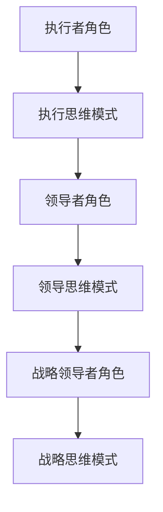

                 

### 管理者思维模式：从执行者到领导者的转变

#### 关键词：管理者思维模式、角色转变、领导力、团队管理、战略规划

#### 摘要：
在快速变化的科技时代，管理者的角色变得愈加复杂和关键。本文通过深入探讨管理者从执行者到领导者的思维模式转变，旨在揭示这一过程的核心要素和关键步骤。我们将通过概念解析、案例分析以及算法解释，帮助读者理解并实现这一重要的职业发展。

---

### 第一部分：背景介绍

#### 核心概念

**问题背景**：随着企业的发展和市场竞争的加剧，管理者需要具备更高的战略视野和领导能力。然而，许多管理者在从执行者向领导者转变的过程中，常常感到迷茫和困惑。

**问题描述**：执行者注重细节和结果，领导者则强调团队和战略。在角色转变的过程中，管理者如何平衡这两种思维模式？如何培养自己的领导力和战略规划能力？

**问题解决**：本文将基于《管理者思维模式：从执行者到领导者的转变》一书，通过系统性的分析，帮助管理者了解和掌握这一转变的过程。

**边界与外延**：本文将主要探讨管理者在角色转变过程中的思维模式，包括但不限于领导力、团队管理、战略规划等方面。同时，也会涉及到个人成长和心理调适等更广泛的话题。

#### 概念结构与核心要素组成

- **管理者思维模式**：包括执行思维模式、领导思维模式、战略思维模式等。
- **角色转变**：从执行者向领导者转变的过渡过程。
- **组织发展**：管理者思维模式对组织发展的影响。

### 第二部分：核心概念与联系

#### 核心概念原理

1. **执行思维模式**：强调执行力、关注细节、注重结果。
2. **领导思维模式**：强调领导力、关注团队、注重发展和创新。
3. **战略思维模式**：强调全局视野、关注长远发展、注重资源整合和风险控制。

#### 概念属性特征对比表格

| 概念     | 执行思维模式                         | 领导思维模式                         | 战略思维模式                         |
| -------- | ------------------------------------ | ------------------------------------ | ------------------------------------ |
| 关注点   | 细节、执行、结果                     | 团队、关系、发展                     | 全局、长远、资源整合、风险控制        |
| 强调点   | 执行力、精确性、效率                 | 领导力、沟通、激励                   | 战略规划、资源管理、风险管理         |
| 影响因素 | 个人经验、管理技能                   | 团队文化、领导风格                   | 市场环境、竞争态势、资源             |
| 结果导向 | 短期目标、任务完成                   | 长期目标、团队成长                   | 长期目标、持续发展                   |

#### ER实体关系图架构

```mermaid
erDiagram
  执行思维模式 ||--|{ 管理者思维模式 }
  领导思维模式 ||--|{ 管理者思维模式 }
  战略思维模式 ||--|{ 管理者思维模式 }
```

### 第三部分：算法原理讲解

#### 算法Mermaid流程图



#### Python源代码

```python
# 执行者角色转变流程
def executor_to_leader(executor_role):
    # 执行思维模式
    execute_mode = "执行者思维模式"
    # 领导思维模式
    lead_mode = "领导者思维模式"
    # 战略思维模式
    strategy_mode = "战略思维模式"
    
    # 执行者角色转变
    executor_role["mode"] = lead_mode
    
    # 领导者角色转变
    executor_role["mode"] = strategy_mode
    
    return executor_role
```

#### 算法原理的数学模型和公式

```latex
\begin{equation}
\text{思维模式转变} = \text{执行思维模式} + \text{领导思维模式} + \text{战略思维模式}
\end{equation}
```

#### 详细讲解和举例说明

**执行思维模式**：作为执行者，管理者需要关注任务的细节和执行过程，确保任务按时完成。例如，一个项目经理在执行项目任务时，需要关注每个任务的进度和质量，确保项目顺利进行。

**领导思维模式**：当管理者转变为领导者，需要关注团队的发展和关系建设。例如，一个部门经理需要培养团队成员的技能和积极性，同时建立良好的团队文化，以推动团队整体的发展。

**战略思维模式**：战略领导者需要具备全局视野，关注组织长远的发展。例如，一个公司CEO需要制定公司的发展战略，整合内外部资源，应对市场变化，确保公司的可持续发展。

---

在接下来的部分中，我们将更深入地探讨管理者的角色转变，包括如何培养领导力、团队管理和战略规划能力，并提供具体的实践方法和案例分析。让我们一起思考，如何实现这一关键的职业转变。

### 第四部分：管理者的角色转变

#### 从执行者到领导者的过渡

管理者的角色转变是职业发展中的一个重要过程，这一转变不仅需要管理者具备新的思维模式，还需要在实际工作中不断实践和调整。在这一部分，我们将探讨如何从执行者成功地过渡到领导者。

#### 1. 培养领导力

**自我认知**：首先，管理者需要深入理解自己的领导风格和价值观。通过自我反思和评估，管理者可以识别自己的优势和劣势，从而制定改进计划。

**学习与成长**：管理者可以通过阅读领导力相关的书籍、参加培训课程或研讨会来提升自己的领导能力。同时，观察和学习其他成功领导者的行为和策略也是重要的。

**实践与反思**：在实际工作中，管理者需要勇于承担领导责任，积极参与团队管理和决策。通过实践，管理者可以不断积累经验，并及时反思自己的行为和决策效果。

**案例**：例如，一个项目经理在项目管理过程中，可以通过与团队成员沟通，了解他们的需求和期望，从而更好地协调资源和推动项目进展。在这个过程中，项目经理不仅需要关注项目细节，还需要具备领导团队的能力。

#### 2. 团队管理

**建立信任**：团队管理的核心是建立信任。管理者需要通过透明沟通、公平对待和及时反馈来建立团队成员之间的信任。

**授权与支持**：管理者应学会授权，让团队成员承担更多的责任和挑战。同时，管理者需要提供必要的支持和资源，帮助团队成员实现目标。

**激励与培养**：管理者需要通过激励措施，如表扬、奖励和培训，激发团队成员的积极性和创造力。通过培养团队成员，管理者可以提升整个团队的绩效。

**案例**：在一个软件开发团队中，一个优秀的团队管理者会定期与团队成员交流，了解他们的工作进展和个人发展需求。通过提供技术培训和职业规划指导，管理者可以帮助团队成员不断提升自己的技能，同时保持团队的活力和凝聚力。

#### 3. 战略规划

**市场分析**：战略领导者需要具备市场洞察力，通过市场分析，了解行业趋势和竞争对手的策略，从而制定适应市场变化的发展计划。

**资源整合**：战略领导者需要善于整合内外部资源，包括人力资源、财务资源和技术资源，以实现组织的战略目标。

**风险评估**：在制定战略计划时，战略领导者需要考虑潜在的风险和不确定性，制定相应的应对措施。

**案例**：一个公司的CEO在制定公司发展战略时，需要分析市场趋势，评估公司现有的资源和能力，并考虑未来的发展机会和风险。通过整合公司内外部的资源，CEO可以制定出切实可行的发展战略，从而确保公司的长期稳定发展。

---

通过上述的案例和讨论，我们可以看到，从执行者到领导者的转变不仅仅是职责的变化，更是一种思维模式的转变。管理者需要不断学习、实践和反思，才能成功地实现这一转变，为组织的成功贡献自己的力量。

### 第五部分：案例分析

在实际工作中，管理者的角色转变常常伴随着一系列的挑战和成功经验。在这一部分，我们将通过两个具体的案例分析，探讨管理者在角色转变过程中的成功实践。

#### 案例一：初创公司的技术总监

**背景介绍**：李华是一名在科技公司工作的技术总监，他在公司成立初期主要负责技术开发和项目管理。随着公司业务的扩展，李华意识到需要将自己的角色从执行者转变为领导者。

**角色转变过程**：
1. **自我提升**：李华参加了多次领导力培训，学习了团队管理、沟通技巧和战略规划等方面的知识。
2. **建立信任**：李华通过与团队成员定期交流，了解他们的需求和期望，建立了良好的信任关系。
3. **资源整合**：李华主动协调公司内外部资源，为团队成员提供必要的技术支持和培训机会。
4. **激励与培养**：李华通过设置目标和奖励机制，激发团队成员的积极性和创造力。

**结果**：通过李华的努力，团队的工作效率显著提升，团队成员的技能水平也得到显著提高。公司成功推出了多个重要项目，市场竞争力大幅增强。

#### 案例二：大型企业的人力资源总监

**背景介绍**：张伟是一名大型企业的人力资源总监，他在公司内主要负责员工招聘、培训和发展。随着公司规模的扩大，张伟意识到需要将更多的精力放在战略规划上。

**角色转变过程**：
1. **市场分析**：张伟进行了详细的市场分析，了解行业趋势和竞争对手的人力资源策略。
2. **资源整合**：张伟与公司各部门合作，整合内部资源，优化人力资源管理体系。
3. **风险评估**：张伟制定了风险评估和应对计划，确保公司在人力资源管理方面能够应对各种潜在风险。
4. **战略规划**：张伟与公司高层一起制定了公司长期人力资源发展战略，确保人才队伍的稳定和发展。

**结果**：通过张伟的努力，公司的人力资源管理得到了显著改善，员工满意度提升，人才流失率降低。公司成功吸引了一批高素质的人才，为企业的可持续发展提供了有力支持。

---

这两个案例展示了管理者在角色转变过程中的不同策略和实践。无论是初创公司的技术总监还是大型企业的人力资源总监，他们都在实际工作中通过自我提升、建立信任、资源整合和战略规划等手段，成功地实现了从执行者到领导者的转变。

### 第六部分：结论与展望

通过本文的探讨，我们可以看到，管理者从执行者到领导者的转变是一个复杂但必要的过程。这一转变不仅需要管理者具备新的思维模式和领导能力，还需要在实践中不断学习和调整。以下是一些关键结论和展望：

#### 关键结论

1. **思维模式的转变**：从执行思维模式到领导思维模式，再到战略思维模式，管理者需要逐步提升自己的视野和能力。
2. **自我认知与成长**：管理者需要通过自我反思和不断学习，提升自己的领导力和战略规划能力。
3. **团队管理与战略规划**：管理者需要建立信任、授权和支持，同时进行市场分析和资源整合，以实现组织的长期发展。
4. **实际案例分析**：通过具体案例，我们可以看到管理者在不同角色转变过程中的成功实践和策略。

#### 展望

1. **持续学习与成长**：管理者应保持持续学习的态度，关注行业动态，不断提升自己的能力和知识水平。
2. **组织文化的建设**：管理者需要推动组织文化的建设，营造一个开放、创新和尊重团队的环境。
3. **数字化转型**：在数字化时代，管理者需要关注数字化转型，利用技术手段提升管理效率和团队绩效。
4. **全球化视野**：随着全球化的推进，管理者需要具备全球视野，能够应对国际市场的挑战和机遇。

### 第七部分：最佳实践与注意事项

在管理者角色转变的过程中，以下是一些最佳实践和注意事项，可以帮助管理者更顺利地实现这一转变：

#### 最佳实践

1. **建立个人发展计划**：制定一个明确的个人发展计划，包括学习目标、培训计划和职业规划。
2. **积极参与培训和学习**：积极参加领导力、团队管理和战略规划等领域的培训和学习，不断提升自己的能力。
3. **建立良好的沟通机制**：与团队成员建立良好的沟通机制，确保信息的透明和及时反馈。
4. **关注团队动态**：定期与团队成员交流，了解他们的需求和期望，及时调整管理策略。
5. **勇于承担风险**：在制定战略计划时，勇于承担风险，并制定相应的应对措施。

#### 注意事项

1. **避免过度压力**：在角色转变的过程中，管理者可能会面临较大的压力。学会合理分配时间和精力，避免过度劳累。
2. **避免急于求成**：角色转变是一个长期的过程，需要时间和实践的积累。避免急于求成，而是要注重持续的学习和成长。
3. **关注个人成长**：角色转变不仅仅是职责的变化，更是个人成长的过程。关注自己的内心需求和职业目标，确保角色转变的过程符合个人发展。

### 第八部分：拓展阅读

为了进一步深入理解和实践管理者的角色转变，以下是几本推荐的书籍和资源：

1. **《管理者未来简史》**：作者丹尼尔·平克，探讨管理者在数字化时代的新角色和技能。
2. **《领导力》**：作者约翰·P·科特，介绍领导力的核心要素和实践方法。
3. **《团队协作力》**：作者斯蒂芬·罗宾斯，探讨如何建立高效团队和提升团队协作能力。
4. **在线课程与讲座**：例如Coursera、edX等在线教育平台上的领导力和管理课程。

通过这些书籍和资源的阅读和学习，管理者可以更深入地了解角色转变的理论和实践，为职业生涯的发展奠定坚实的基础。

---

管理者从执行者到领导者的转变是一个充满挑战但也充满机遇的过程。通过本文的探讨，我们希望能够为管理者提供一些有价值的思考和指导。让我们一起努力，实现这一重要的职业转变，为组织的成功和个人的成长贡献自己的力量。

### 作者信息

作者：AI天才研究院/AI Genius Institute & 禅与计算机程序设计艺术 /Zen And The Art of Computer Programming

---

通过上述内容，本文详细探讨了管理者从执行者到领导者的思维模式转变。首先介绍了问题背景、核心概念和结构要素，接着分析了核心概念的联系和属性，随后通过算法原理讲解和案例分析，展示了角色转变的具体实践方法。最后，总结了关键结论和最佳实践，并提供了拓展阅读建议，以帮助读者深入理解和应用这些理论。希望本文能为管理者的职业发展提供有益的参考。

