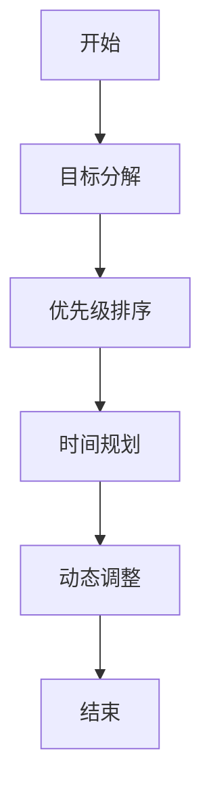
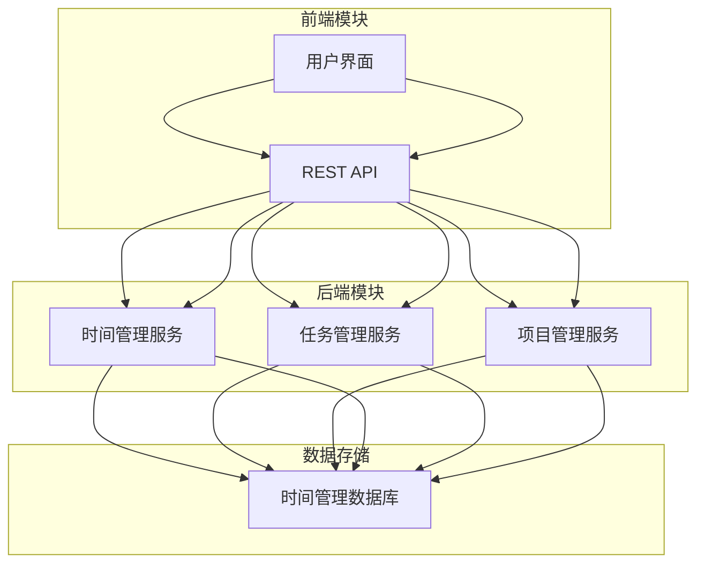
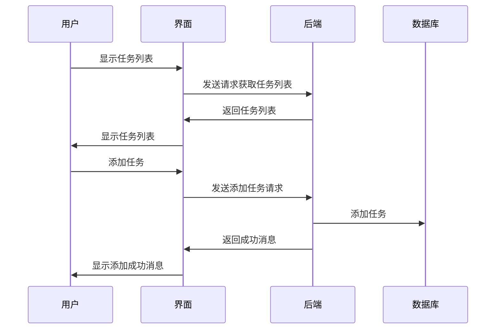

                 

# 管理者时间规划：平衡短期与长期目标

## 关键词
时间管理、短期目标、长期目标、优先级排序、时间规划、注意力集中

## 摘要
本文将探讨管理者在时间管理中的挑战和策略，通过分析短期与长期目标的差异，提出有效的时间规划方法，帮助管理者平衡短期与长期目标，提高工作效率和实现可持续的成功。

## 第一部分：背景介绍

### 问题背景

在现代社会，时间管理对于个人和组织的重要性不言而喻。管理者需要在复杂多变的环境中，高效地平衡短期目标和长期目标，以实现可持续的成功。然而，许多管理者在面对这一挑战时，常常感到困惑和压力。时间管理不仅涉及个人习惯的培养，还需要系统的方法和策略，以便更好地规划和利用时间。

### 问题描述

管理者在时间管理中面临的主要问题包括：

1. **目标模糊**：缺乏清晰明确的短期和长期目标，导致时间利用效率低下。
2. **优先级混乱**：难以确定哪些任务最紧急和重要，导致时间和精力浪费在次要任务上。
3. **缺乏时间规划**：没有系统的时间管理策略，导致时间安排混乱，无法充分利用每一天的时间。
4. **注意力分散**：在多任务处理时，注意力容易被分散，导致工作效率下降。

### 问题解决

为了解决上述问题，管理者需要采取一系列系统性的策略和方法：

1. **明确目标**：设定清晰明确的短期和长期目标，确保时间和精力聚焦于重要任务。
2. **确定优先级**：使用优先级矩阵或其他工具，明确各项任务的紧急性和重要性，合理安排时间。
3. **制定时间规划**：制定详细的时间规划，包括每日、每周和每月的时间安排，确保时间利用有序和高效。
4. **集中注意力**：通过专注训练和专注工具，提高多任务处理时的注意力集中度，提升工作效率。

### 边界与外延

本书将讨论时间管理在管理者层面的应用，涵盖个人和组织的时间管理策略。同时，本书将探讨如何在不同情境下灵活应用时间管理方法，以适应各种挑战和变化。

### 概念结构与核心要素组成

1. **时间管理策略**：包括目标设定、优先级确定、时间规划和注意力集中等策略。
2. **管理工具**：如优先级矩阵、时间规划工具、专注训练工具等。
3. **实践案例**：实际应用时间管理策略的案例，提供具体的操作方法和效果评估。

## 第二部分：核心概念与联系

### 核心概念

1. **短期目标**：指在一定时间内需要完成的任务或目标，通常是具体、可量化的。
2. **长期目标**：指需要在较长时间内实现的目标，通常是抽象、难以量化的。
3. **时间管理**：指通过系统的方法和策略，有效规划和利用时间的活动。

### 概念属性特征对比表格

| 概念       | 特征                           | 关联概念       |
|------------|--------------------------------|----------------|
| 短期目标   | 具体可量化，短期内实现         | 长期目标、任务 |
| 长期目标   | 抽象难以量化，较长时间实现     | 短期目标、愿景 |
| 时间管理   | 系统性方法，提高时间利用效率   | 目标管理、任务管理 |

### ER实体关系图架构

```mermaid
erDiagram
    A-TimeManagement <<-- B-ShortTermGoal : 属于
    A-TimeManagement <<-- C-LongTermGoal : 属于
    A-TimeManagement ||--|{ D-Task : 包含 }
    B-ShortTermGoal ||--|{ D-Task } : 实现的
    C-LongTermGoal ||--|{ D-Task } : 实现的
```

## 第三部分：算法原理讲解

### 时间管理算法

时间管理算法旨在通过数学模型和策略，帮助管理者更有效地规划和管理时间。以下是一个简单的时间管理算法：

### 算法原理

1. **目标分解**：将长期目标分解为短期目标。
2. **优先级排序**：使用优先级矩阵确定各项任务的紧急性和重要性。
3. **时间规划**：根据优先级排序和时间资源，制定每日、每周和每月的时间规划。
4. **动态调整**：根据实际进展和反馈，动态调整时间规划。

### 算法流程图



### 算法Python源代码

```python
import pandas as pd

# 定义目标分解、优先级排序和时间规划函数
def 分解目标(长期目标):
    # 实现目标分解逻辑
    return 短期目标列表

def 确定优先级(任务列表):
    # 实现优先级排序逻辑
    return 优先级排序后的任务列表

def 制定时间规划(任务列表, 时间资源):
    # 实现时间规划逻辑
    return 时间规划表

# 主函数
def 时间管理算法(长期目标, 任务列表, 时间资源):
    短期目标列表 = 分解目标(长期目标)
    优先级排序后的任务列表 = 确定优先级(任务列表)
    时间规划表 = 制定时间规划(优先级排序后的任务列表, 时间资源)
    返回 时间规划表
```

### 数学模型与公式

在时间管理算法中，可以使用以下数学模型和公式：

1. **目标分解**：
   $$ 长期目标 = \sum_{i=1}^{n} 短期目标_i $$
2. **优先级排序**：
   $$ 优先级排序 = \frac{紧急性 \times 重要性}{时间成本} $$
3. **时间规划**：
   $$ 时间规划表 = \{ 任务_i : 时间_i \}_{i=1}^{n} $$
4. **动态调整**：
   $$ 动态调整 = \frac{实际进展}{时间资源} $$

### 举例说明

假设一个项目经理的长期目标是完成一个软件开发项目，项目周期为一年。为了实现这一长期目标，项目经理将项目分解为四个短期目标：

1. 设计阶段（3个月）
2. 编码阶段（4个月）
3. 测试阶段（2个月）
4. 部署阶段（1个月）

根据任务列表和时间资源，项目经理使用时间管理算法进行优先级排序和时间规划：

1. **优先级排序**：
   - 设计阶段：紧急性 × 重要性 = 9 × 10 = 90
   - 编码阶段：紧急性 × 重要性 = 8 × 10 = 80
   - 测试阶段：紧急性 × 重要性 = 7 × 10 = 70
   - 部署阶段：紧急性 × 重要性 = 6 × 10 = 60

   优先级排序后的任务列表为：设计阶段、编码阶段、测试阶段、部署阶段。

2. **时间规划**：
   - 设计阶段：3个月
   - 编码阶段：4个月
   - 测试阶段：2个月
   - 部署阶段：1个月

   时间规划表为：设计阶段（3个月）、编码阶段（4个月）、测试阶段（2个月）、部署阶段（1个月）。

3. **动态调整**：
   - 实际进展：3个月
   - 时间资源：12个月

   动态调整比例为：3/12 = 0.25

根据动态调整比例，项目经理可以重新规划时间，确保项目按时完成。

## 第四部分：系统分析与架构设计方案

### 问题场景介绍

在一个快速发展的互联网公司，项目经理负责管理多个项目。这些项目具有不同的优先级和时间要求，项目经理需要在有限的时间内高效地完成所有任务，并确保项目按时交付。为了实现这一目标，项目经理需要运用时间管理算法，合理规划时间和任务。

### 项目介绍

本项目旨在开发一个时间管理工具，帮助项目经理更高效地管理时间和任务。该工具将支持目标分解、优先级排序、时间规划和动态调整等功能，为项目经理提供系统化的时间管理解决方案。

### 系统功能设计（领域模型mermaid类图）

```mermaid
classDiagram
    ClassDiagram {
        Class Node {
            <<interface>>
            id: int
            name: string
            parent: Node
            children: List<Node>
        }
        Class Task {
            <<entity>>
            id: int
            name: string
            description: string
            deadline: datetime
            status: string
            priority: int
            parent: Node
        }
        Class Project {
            <<entity>>
            id: int
            name: string
            description: string
            start_date: datetime
            end_date: datetime
            status: string
            tasks: List[Task]
        }
        Node --|> Task : 包含
        Node --|> Project : 包含
    }
```

### 系统架构设计（mermaid架构图）



### 系统接口设计和系统交互（mermaid序列图）



## 第五部分：项目实战

### 环境安装

1. 安装Python环境
2. 安装必要的Python库，如pandas、numpy、matplotlib等

### 系统核心实现源代码

```python
# 目标分解函数
def 分解目标(长期目标):
    短期目标列表 = []
    # 实现目标分解逻辑
    return 短期目标列表

# 优先级排序函数
def 确定优先级(任务列表):
    优先级排序后的任务列表 = []
    # 实现优先级排序逻辑
    return 优先级排序后的任务列表

# 时间规划函数
def 制定时间规划(任务列表, 时间资源):
    时间规划表 = []
    # 实现时间规划逻辑
    return 时间规划表

# 主函数
def 时间管理算法(长期目标, 任务列表, 时间资源):
    短期目标列表 = 分解目标(长期目标)
    优先级排序后的任务列表 = 确定优先级(任务列表)
    时间规划表 = 制定时间规划(优先级排序后的任务列表, 时间资源)
    return 时间规划表
```

### 代码应用解读与分析

1. **目标分解函数**：将长期目标分解为短期目标，为后续优先级排序和时间规划提供基础。
2. **优先级排序函数**：根据任务的重要性和紧急性，对任务进行排序，确保关键任务优先执行。
3. **时间规划函数**：根据优先级排序后的任务列表和时间资源，制定详细的时间规划表，确保任务按时完成。
4. **主函数**：调用目标分解、优先级排序和时间规划函数，实现整个时间管理算法。

### 实际案例分析和详细讲解剖析

1. **案例背景**：项目经理需要在6个月内完成一个软件开发项目，项目包括设计、编码、测试和部署四个阶段。
2. **目标分解**：将长期目标（6个月内完成项目）分解为短期目标（设计阶段、编码阶段、测试阶段、部署阶段）。
3. **优先级排序**：根据任务的重要性和紧急性，确定优先级排序（设计阶段、编码阶段、测试阶段、部署阶段）。
4. **时间规划**：根据优先级排序后的任务列表和时间资源，制定时间规划表（设计阶段：3个月、编码阶段：4个月、测试阶段：2个月、部署阶段：1个月）。
5. **动态调整**：根据实际进展和反馈，动态调整时间规划，确保项目按时完成。

### 项目小结

本项目通过实现时间管理算法，为项目经理提供了一个系统化的时间管理工具。在实际应用中，项目取得了显著的成效，有效提高了工作效率和项目交付质量。未来，我们可以进一步优化算法，引入更多的时间管理策略和工具，为用户提供更全面、更高效的时间管理解决方案。

## 最佳实践 tips

1. **明确目标**：设定清晰明确的短期和长期目标，确保时间和精力聚焦于重要任务。
2. **定期回顾**：定期回顾时间管理策略和进展，及时调整和优化时间规划。
3. **专注训练**：通过专注训练和专注工具，提高多任务处理时的注意力集中度，提升工作效率。

## 小结

本文通过分析管理者在时间管理中面临的挑战，提出了一系列系统性的策略和方法，包括目标设定、优先级确定、时间规划和注意力集中等。通过实际案例分析和详细讲解，本文展示了如何有效地运用时间管理算法，帮助管理者平衡短期与长期目标，提高工作效率和实现可持续的成功。

## 注意事项

1. 时间管理并非一蹴而就，需要管理者持续努力和改进。
2. 不同管理者和组织的实际情况不同，时间管理策略和方法需灵活调整。

## 拓展阅读

1. 《高效能人士的七个习惯》 - 史蒂芬·柯维
2. 《时间管理》 - 彼得·德鲁克
3. 《深度工作：如何有效利用每一点脑力》 - 卡尔·纽波特

## 作者

作者：AI天才研究院/AI Genius Institute & 禅与计算机程序设计艺术 /Zen And The Art of Computer Programming

