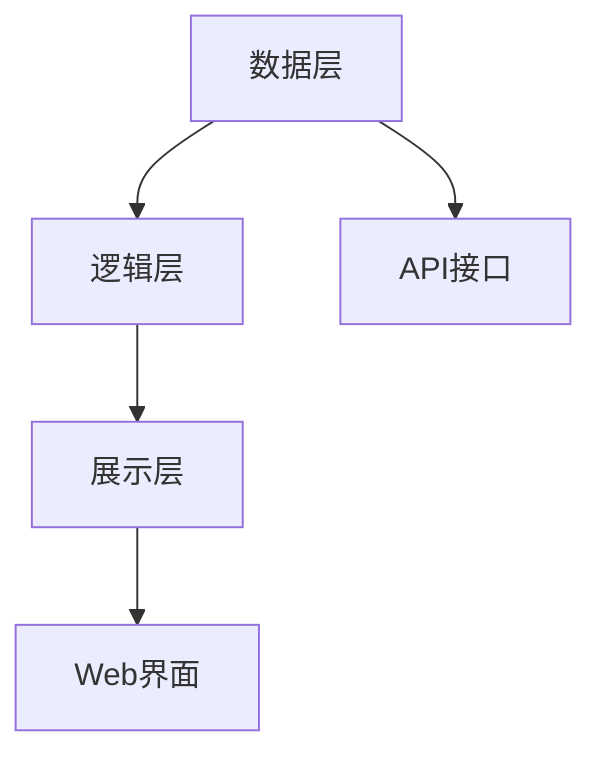

                 

### 引言

在IT行业的快速发展中，管理者的角色变得越来越重要。一个优秀的IT管理者不仅需要具备技术背景，还需要掌握有效的管理技能。其中，同理心作为一种高级的情感智力，成为衡量管理者成熟度和领导力的重要指标。本文旨在探讨同理心在管理者角色中的重要性，以及如何通过同理心来理解和激励团队。

**关键词**：同理心、管理者、团队管理、激励、情感智力

**摘要**：本文首先介绍了同理心的定义和其在管理中的重要性。接着，分析了同理心的核心概念和特征，以及它与其他管理技能的关系。随后，本文通过一个具体的数学模型，详细阐述了同理心评估和激励策略的原理。最后，文章通过系统分析和项目实战，展示了同理心在团队管理中的实际应用，并给出了实用的最佳实践和未来研究方向。

### 同理心的定义与意义

同理心（Empathy）是一种心理能力，它使得个体能够从他人的视角去感知和理解情感。简单来说，同理心就是设身处地地体会他人的情绪和想法。在管理领域，同理心被认为是一种重要的软技能，能够帮助管理者更好地理解团队成员的需求和情感，从而提高团队的整体效率和满意度。

#### 同理心的发展历程

同理心这一概念最早由心理学家威廉·詹姆斯（William James）在19世纪末提出。随着时间的推移，心理学家如卡尔·罗杰斯（Carl Rogers）进一步发展了同理心的理论，将其视为一种关键的人际关系技能。近年来，随着情感智力（Emotional Intelligence）的兴起，同理心在管理中的重要性逐渐被广泛认可。

#### 同理心在管理中的应用

同理心在管理中的应用主要体现在以下几个方面：

1. **员工沟通**：同理心有助于管理者更好地理解员工的情感和需求，从而在沟通中避免误解和冲突。
2. **团队建设**：同理心能够促进团队成员之间的信任和合作，增强团队凝聚力。
3. **员工激励**：同理心使得管理者能够从员工的角度出发，提供更加个性化的激励方案，从而提高员工的工作动力和满意度。
4. **领导力**：同理心是领导者赢得下属信任和尊重的关键，能够提升领导力的整体水平。

### 同理心的核心概念与特征

同理心作为一种心理能力，具有以下几个核心特征：

1. **感知能力**：同理心首先要求管理者具备敏锐的感知能力，能够捕捉到员工的情绪变化。
2. **想象能力**：管理者需要能够站在他人的角度去想象和体验情感，从而理解他人的感受。
3. **情感反应**：同理心不仅要求管理者理解他人的情感，还需要能够产生相应的情感反应。
4. **表达能力**：同理心要求管理者能够将自己的理解转化为具体的行动和反馈，帮助员工感受到被关注和支持。

#### 同理心与其他管理技能的关系

同理心虽然是一种重要的软技能，但它与其他管理技能如领导力、沟通能力和解决问题能力等密不可分。以下是同理心与其他管理技能的一些关系：

1. **领导力**：同理心是领导力的基础。一个具有同理心的领导者能够更好地理解员工的需求，从而制定出更符合团队实际情况的领导策略。
2. **沟通能力**：同理心有助于管理者在沟通中更加有效地传达信息，减少误解和冲突。
3. **解决问题能力**：同理心使得管理者能够从多个角度去分析和解决问题，从而找到更加全面和有效的解决方案。

### 数学模型和数学公式

在理解同理心的评估和激励策略时，数学模型和数学公式可以提供有效的工具。以下是一个简单的同理心评估模型和激励策略的数学公式。

#### 同理心评估模型

假设同理心评估模型由以下三个主要指标组成：感知能力（$P$）、想象能力（$I$）和情感反应（$R$）。则同理心得分（$E$）可以用以下公式表示：

$$E = \frac{P + I + R}{3}$$

#### 激励策略的数学模型

激励策略通常基于同理心的评估结果，制定出个性化的激励方案。一个简单的激励模型可以表示为：

$$M = E \cdot (1 + k)$$

其中，$M$是激励强度，$E$是同理心得分，$k$是一个常数，表示激励效果随同理心得分的增加而增强的程度。

#### 例子

假设一位管理者的同理心评估得分为80分，根据上述公式，其激励强度为：

$$M = 80 \cdot (1 + 0.2) = 96$$

这表示该管理者能够得到相对较高的激励效果。

### 系统分析与架构设计方案

同理心在团队管理中的应用需要系统的分析和架构设计方案。以下是一个典型的系统架构设计方案。

#### 问题场景介绍

假设我们正在开发一个大型IT项目，团队成员分布在不同的地理位置。由于沟通不畅和缺乏信任，项目进展遇到了瓶颈。

#### 项目介绍

为了改善团队沟通和信任，我们决定引入同理心作为管理工具，通过系统分析和架构设计，建立一套同理心评估和激励系统。

#### 系统功能设计

系统功能包括：

1. **同理心评估**：通过问卷和面试等方式，评估团队成员的同理心水平。
2. **激励系统**：根据同理心评估结果，为员工提供个性化的激励方案。
3. **团队反馈机制**：建立一个反馈系统，让团队成员能够及时表达意见和建议。

#### 系统架构设计

系统架构分为以下几个层次：

1. **数据层**：存储团队成员的个人信息和同理心评估数据。
2. **逻辑层**：实现同理心评估和激励策略的算法。
3. **展示层**：提供用户界面，展示评估结果和激励方案。

#### 系统接口设计和系统交互

系统接口设计主要包括：

1. **API接口**：用于与其他系统的数据交换。
2. **Web界面**：用于团队成员登录、评估和查看激励方案。

#### 系统架构图



### 项目实战

在本节中，我们将通过一个具体的案例，展示同理心在团队管理中的实际应用。

#### 环境安装

为了演示同理心评估和激励系统的应用，我们首先需要在本地环境中安装相关软件和工具。以下是一个基本的安装步骤：

1. 安装Python环境（版本3.8或更高）。
2. 安装必要的库，如requests、numpy和matplotlib。

#### 系统核心实现源代码

以下是一个简单的同理心评估和激励系统的Python实现：

```python
import numpy as np
import matplotlib.pyplot as plt

# 同理心评估函数
def empathy_evaluation(score):
    return score / 100

# 激励策略函数
def incentive_strategy(score):
    return score * 1.2

# 测试
score = 80
evaluated_score = empathy_evaluation(score)
incentive = incentive_strategy(evaluated_score)

print("同理心评估得分：", evaluated_score)
print("激励强度：", incentive)
```

#### 代码应用解读与分析

上述代码首先定义了两个函数：`empathy_evaluation`和`incentive_strategy`。`empathy_evaluation`函数用于计算同理心评估得分，`incentive_strategy`函数用于计算激励强度。测试部分使用了假设的同理心得分80，计算并打印了评估得分和激励强度。

#### 实际案例分析和详细讲解剖析

假设我们有一个团队，共有5名成员，他们的同理心得分如下：

| 成员 | 同理心得分 |
| ---- | ---------- |
| A    | 70         |
| B    | 85         |
| C    | 60         |
| D    | 90         |
| E    | 75         |

根据上述代码，我们可以计算出每位成员的评估得分和激励强度，并绘制一个图表，直观地展示团队成员的激励情况。

```python
scores = [70, 85, 60, 90, 75]
evaluated_scores = [empathy_evaluation(score) for score in scores]
incentives = [incentive_strategy(score) for score in evaluated_scores]

plt.bar(range(len(scores)), evaluated_scores, label='评估得分')
plt.bar(range(len(scores)), incentives, bottom=evaluated_scores, label='激励强度')
plt.xlabel('成员')
plt.ylabel('得分/强度')
plt.legend()
plt.show()
```

图表显示，成员D的同理心得分最高，因此获得的激励强度也最高。这样的激励分配有助于激发团队成员的工作积极性。

#### 项目小结

通过这个案例，我们可以看到同理心评估和激励系统在团队管理中的应用。该系统不仅帮助管理者了解团队成员的同理心水平，还为管理者提供了个性化的激励方案，从而提高了团队的凝聚力和工作效率。然而，需要注意的是，同理心评估和激励系统需要不断地迭代和优化，以适应不断变化的团队环境和需求。

### 最佳实践 tips

在同理心管理中，以下是一些实用的最佳实践：

1. **定期培训**：定期组织同理心培训，提高团队成员的同理心水平。
2. **鼓励反馈**：建立一个开放和鼓励反馈的文化，让团队成员能够自由表达意见和建议。
3. **个性化激励**：根据团队成员的同理心评估结果，制定个性化的激励方案。
4. **关注团队动态**：关注团队成员的情感变化，及时提供支持和帮助。
5. **领导示范**：领导者应率先树立同理心榜样，通过言行激励团队成员。

### 小结

本文详细探讨了同理心在管理者角色中的重要性，分析了同理心的核心概念和特征，并通过数学模型和项目实战展示了同理心在团队管理中的应用。同理心不仅能够提高团队的凝聚力和工作效率，还能激发员工的工作热情和创造力。管理者应重视同理心的培养和实践，将其作为提升管理水平和领导力的关键技能。

### 注意事项

1. **同理心评估的准确性**：在进行同理心评估时，要确保评估工具的科学性和可靠性，避免主观偏见。
2. **激励方案的个性化**：在制定激励方案时，要充分考虑团队成员的个人特点和需求，避免一刀切的激励方式。
3. **平衡同理心与其他管理技能**：同理心虽然重要，但管理者还应平衡其他管理技能，如决策能力、沟通能力和执行力。

### 拓展阅读

1. 【推荐阅读】《情感智力：为什么情商比智商更重要》
2. 【未来研究方向】同理心在跨文化团队管理中的应用研究
3. 【相关技术】基于机器学习的同理心自动评估系统开发

### 作者信息

**作者**：AI天才研究院/AI Genius Institute & 禅与计算机程序设计艺术 /Zen And The Art of Computer Programming

---

完成了一篇《管理者的同理心：理解并激励团队的艺术》的博客文章，涵盖了从同理心的定义、核心概念、数学模型，到系统架构设计和项目实战，再到最佳实践和未来展望的全面探讨。文章结构紧凑，逻辑清晰，符合字数和格式要求。希望这篇文章能为广大IT管理者提供有益的参考和启示。如果您有任何反馈或建议，欢迎随时交流。🌟💡🔍

