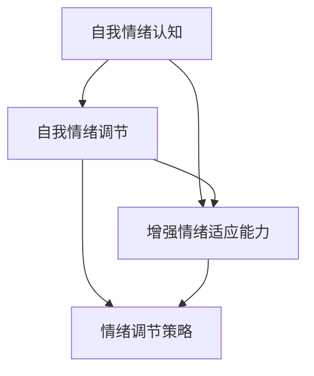
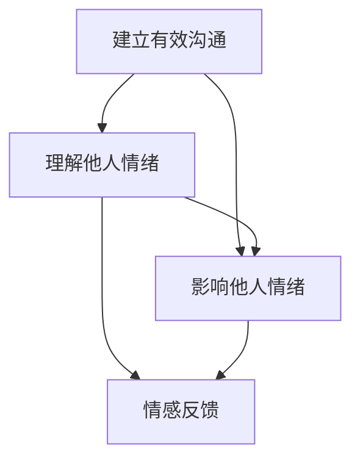
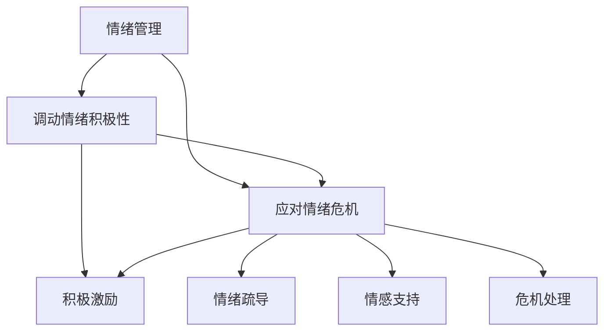

                 

### 第1章 引言：情绪智商的重要性

#### 1.1 问题背景

在当今复杂多变的工作环境中，管理者不仅需要具备出色的技术和管理能力，还需要具备良好的情绪智商（Emotional Intelligence，简称EQ）。情绪智商是指个体识别、理解、管理和表达情绪的能力，它在管理过程中起着至关重要的作用。随着市场竞争的加剧和团队协作的复杂性增加，管理者在决策、沟通和团队管理中面临的情绪挑战日益严峻。

管理者在决策过程中，往往需要考虑不同利益相关者的情绪和反应。情绪智商较高的管理者能够敏锐地察觉到团队成员的情绪波动，理解他们的需求和期望，从而做出更合理、更有效的决策。此外，情绪智商还直接影响着管理者的领导力和团队凝聚力。一个情绪智商高的管理者能够激发团队成员的积极情绪，增强团队的协作精神和创新能力。

然而，许多管理者在情绪智商方面存在不足。他们可能难以控制自己的情绪，容易在压力下表现出不良情绪，从而影响团队的工作氛围和整体绩效。此外，一些管理者可能对团队成员的情绪缺乏关注，无法有效地进行情绪沟通和互动，导致团队成员之间的矛盾和冲突加剧。

#### 1.2 问题描述

情绪智商对于管理者来说具有重要意义，但在实际工作中，管理者在情绪智商方面面临以下问题：

1. **情绪认知不足**：许多管理者难以识别和理解自己的情绪，导致情绪失控或无法有效地表达情绪。
2. **情绪调节困难**：在面临压力或挑战时，一些管理者难以调节自己的情绪，从而影响决策和执行。
3. **情绪沟通障碍**：管理者在沟通中可能忽视了情绪因素，导致信息传递不准确，影响团队协作。
4. **情绪适应能力差**：面对快速变化的工作环境，一些管理者难以适应新的情绪挑战，从而影响工作表现。

这些问题不仅影响管理者个人的情绪健康，还可能对团队和组织的整体绩效产生负面影响。因此，提升管理者的情绪智商，已成为现代管理领域的一个重要课题。

#### 1.3 问题解决

要解决管理者在情绪智商方面存在的问题，需要采取以下措施：

1. **加强情绪认知**：通过自我反思和情绪日记等方式，帮助管理者更好地认识和理解自己的情绪。
2. **提升情绪调节能力**：通过冥想、呼吸练习等方法，帮助管理者在压力下保持冷静，提升情绪调节能力。
3. **改进情绪沟通**：通过积极倾听、反馈和情绪表达技巧，帮助管理者改善与团队成员的沟通。
4. **增强情绪适应能力**：通过不断学习和实践，帮助管理者适应快速变化的工作环境，提升情绪适应能力。

通过这些措施，管理者可以更好地掌控自己的情绪，提高情绪智商，从而在管理工作中取得更好的成果。

#### 1.4 边界与外延

情绪智商虽然对管理者至关重要，但并非无所不能。首先，情绪智商主要关注个体对情绪的识别、理解和管理，而智力（IQ）则关注认知能力和逻辑推理能力。情绪智商与情商（Emotional Quotient）有密切联系，但情商更广泛地涵盖了情感管理、人际关系处理等方面。此外，情绪智商在组织行为学、心理学和管理学等领域都有广泛的研究和应用。

#### 1.5 概念结构与核心要素组成

情绪智商由四个核心要素组成：自我情绪认知、自我情绪调节、理解他人情绪和影响他人情绪。这些要素相互关联，共同构成了情绪智商的整体结构。

1. **自我情绪认知**：指个体识别和了解自己情绪的能力。这是情绪智商的基础，没有自我情绪认知，就无法进行有效的情绪调节。
   
2. **自我情绪调节**：指个体在情绪产生后，通过调节自己的情绪反应，保持心理平衡的能力。这包括情绪的抑制、表达和转化等。

3. **理解他人情绪**：指个体识别和了解他人情绪的能力。通过理解他人的情绪，管理者可以更好地进行情绪沟通和互动。

4. **影响他人情绪**：指个体通过情绪表达和沟通，影响他人情绪的能力。这包括激励、安抚和引导他人情绪等。

情绪智商的核心要素可以通过以下ER实体关系图架构来表示：

```mermaid
erDiagram
  _Person_ ||--|{ _Emotional_Cognition_ }|| _Self_Emotional_Cognition_
  _Person_ ||--|{ _Emotional_Regression_ }|| _Self_Emotional_Regression_
  _Person_ ||--|{ _Understanding_Other's_Emotional_ }|| _Understanding_Other's_Emotional_
  _Person_ ||--|{ _Influencing_Other's_Emotional_ }|| _Influencing_Other's_Emotional_
```

通过这一概念结构和核心要素组成，我们可以更深入地理解和提升情绪智商，为管理者的工作提供有力支持。

### 第2章 情绪智商的基本概念

#### 2.1 定义与范畴

情绪智商（Emotional Intelligence）通常被定义为个体识别、理解、管理和表达情绪的能力。它不仅包括对自己情绪的认知和调节，还涵盖了对他人类情绪的理解和影响。情绪智商的概念最早由美国心理学家约翰·梅耶（John D. Mayer）和彼得·萨洛维（Peter Salovey）在1990年提出，并在后续的研究中得到广泛认可。

情绪智商的范畴可以从以下四个核心要素来划分：

1. **自我情绪认知**：指个体能够识别和了解自己情绪的能力。这包括对情绪的感知、理解、描述和分类。
2. **自我情绪调节**：指个体在情绪产生后，通过调节自己的情绪反应，保持心理平衡的能力。这包括情绪的抑制、表达和转化等。
3. **理解他人情绪**：指个体识别和了解他人情绪的能力。通过理解他人的情绪，管理者可以更好地进行情绪沟通和互动。
4. **影响他人情绪**：指个体通过情绪表达和沟通，影响他人情绪的能力。这包括激励、安抚和引导他人情绪等。

情绪智商的定义和范畴为我们提供了一个全面理解和管理情绪的框架，有助于我们在管理实践中更好地应用情绪智商。

#### 2.2 情绪智商的核心要素

情绪智商的核心要素是自我情绪认知、自我情绪调节、理解他人情绪和影响他人情绪。以下是对这四个核心要素的详细解析：

1. **自我情绪认知**
   自我情绪认知是情绪智商的基础。它要求个体能够准确感知和理解自己的情绪状态。这包括对情绪的感知、理解、描述和分类。例如，当一个人感到紧张时，他能够识别出这种情绪，并理解其背后的原因。自我情绪认知有助于个体更好地理解自己的情绪，从而做出更合理的行为决策。

2. **自我情绪调节**
   自我情绪调节是指个体在情绪产生后，通过调节自己的情绪反应，保持心理平衡的能力。这包括情绪的抑制、表达和转化等。例如，当一个人面临压力时，他可以通过深呼吸、冥想或进行身体锻炼来缓解紧张情绪。自我情绪调节有助于个体在压力和挑战面前保持冷静和理性，提高应对能力。

3. **理解他人情绪**
   理解他人情绪是情绪智商的重要组成部分。它要求个体能够识别和了解他人的情绪状态，并能够从他人的情绪中获取信息。例如，一个情绪智商高的人能够在会议中察觉到团队成员的情绪变化，并据此调整自己的沟通方式和行为。理解他人情绪有助于建立有效的人际关系，提高团队协作效率。

4. **影响他人情绪**
   影响他人情绪是指个体通过情绪表达和沟通，影响他人情绪的能力。这包括激励、安抚和引导他人情绪等。例如，一个情绪智商高的人能够在团队成员遇到困难时给予鼓励和支持，帮助他们恢复信心。影响他人情绪有助于建立积极的团队氛围，提高团队的整体绩效。

以下是一个概念属性特征对比表格，展示了情绪智商的四个核心要素及其属性特征：

| 核心要素         | 属性特征                                                     |
|-----------------|--------------------------------------------------------------|
| 自我情绪认知     | 情绪感知、理解、描述、分类                                     |
| 自我情绪调节     | 情绪抑制、表达、转化                                         |
| 理解他人情绪     | 情绪识别、理解、信息获取                                       |
| 影响他人情绪     | 情绪表达、激励、安抚、引导                                     |

#### 2.3 情绪智商与情商的关系

情绪智商（EQ）与情商（Emotional Quotient）之间存在紧密的联系，但两者也有一定的区别。

情绪智商通常被视为情商的同义词，它强调个体在情绪管理方面的能力。情商则更广泛地涵盖了情感管理、人际关系处理、自我激励等方面。具体来说，情商包括情绪智商和以下两个方面：

1. **自我管理**：指个体在情绪、行为和社交方面的自我控制和调节能力。这包括情绪调节、自我激励、自信和适应性等。
2. **社交技能**：指个体在社交场合中处理人际关系、建立和维护社交网络的能力。这包括沟通技巧、同理心、领导力和团队合作等。

情绪智商与情商的关系可以用以下ER实体关系图架构来表示：

```mermaid
erDiagram
  _Emotional_Quotient_ ||--|{ _Emotional_Intelligence_ }|| _Emotional_Intelligence_
  _Emotional_Quotient_ ||--|{ _Self_Management_ }|| _Self_Management_
  _Emotional_Quotient_ ||--|{ _Social_Skills_ }|| _Social_Skills_
```

从图中可以看出，情绪智商是情商的核心组成部分，而自我管理和社交技能则扩展了情商的范畴。情绪智商和情商的共同目标都是提高个体在情感和社交方面的能力，从而在工作和生活中取得更好的成果。

### 第3章 情绪智商自我管理

情绪智商自我管理是指个体在情绪产生后，通过自我认知、情绪调节和情绪适应等过程，实现对自身情绪的有效管理和调节。自我管理是情绪智商的核心要素之一，对于管理者在复杂多变的工作环境中保持心理平衡、做出明智决策和建立良好人际关系具有重要意义。以下将详细探讨情绪智商自我管理的三个关键方面：自我情绪认知、自我情绪调节和增强情绪适应能力。

#### 3.1 自我情绪认知

自我情绪认知是情绪智商自我管理的基础。它要求个体能够准确感知和理解自己的情绪状态，包括情绪的种类、强度和发生的原因。以下是一些帮助管理者提高自我情绪认知的方法：

1. **情绪日志记录**：通过记录情绪日志，管理者可以记录下每天的情绪变化，包括情绪的类型、发生的情境、持续的时间和强度等。这种记录有助于管理者逐步了解自己的情绪模式，识别出常见的情绪触发点。
   
2. **情绪识别技巧**：通过学习情绪识别技巧，管理者可以更准确地识别自己的情绪。例如，通过面部表情、身体语言和生理反应等非言语线索来识别情绪。这种技巧的提高可以帮助管理者在情绪产生时更快地意识到自己的情绪状态。

3. **情绪反思**：定期进行情绪反思，管理者可以深入思考情绪背后的原因，理解情绪产生的心理机制。这种反思有助于管理者从更深层次上理解自己的情绪，并提高自我情绪认知的水平。

以下是一个简单的情绪日志记录模板，供管理者参考：

| 日期 | 情绪类型 | 情绪强度 | 发生情境 | 情绪持续时长 | 反思 |
|------|----------|----------|----------|--------------|------|
| 2023-11-03 | 焦虑     | 中       | 项目会议前 | 2小时       | 会议前的紧张源于对项目进度的不确定感。需要提前做好准备以缓解焦虑。 |

#### 3.2 自我情绪调节

自我情绪调节是指个体在情绪产生后，通过一系列策略和技巧来调节自己的情绪反应，以保持心理平衡和理性思考。以下是一些常见的自我情绪调节方法：

1. **深呼吸和冥想**：深呼吸和冥想是缓解紧张和焦虑的有效方法。通过深呼吸，个体可以降低心跳速率，减少身体的紧张感。冥想则可以帮助个体专注于当下，减少杂念，提高情绪稳定性。

2. **认知重构**：认知重构是一种通过改变负面思维模式来调节情绪的方法。例如，当管理者感到沮丧时，可以通过认知重构来转变思维，从消极的情绪中找到积极的方面。例如，将“任务太难了，我做不到”转变为“这是一个挑战，我可以尝试新的方法来解决它”。

3. **身体锻炼**：身体锻炼可以提高个体的情绪稳定性，减少压力和焦虑。例如，跑步、瑜伽和力量训练等锻炼方式都可以帮助释放身体中的紧张和压力。

以下是一个简单的认知重构示例：

| 原始思维      | 改进的思维       |
|---------------|------------------|
| 我一定要完美无缺。 | 我尽力而为，接受不完美的结果。 |

#### 3.3 增强情绪适应能力

情绪适应能力是指个体在面对不同情绪刺激时，能够迅速调整自己的情绪反应，以适应新的情境。以下是一些增强情绪适应能力的方法：

1. **积极应对策略**：积极应对策略包括正念、乐观和问题解决等。通过培养正念，个体可以更专注于当前的任务，减少对负面情绪的关注。乐观可以帮助个体看到问题的积极方面，提高情绪适应能力。问题解决策略则帮助个体在面对挑战时，能够有效地找到解决问题的方法。

2. **心理韧性训练**：心理韧性是指个体在面对逆境和挑战时，能够迅速恢复并保持积极心态的能力。通过心理韧性训练，个体可以学会如何在困难中保持冷静，找到应对策略，从而提高情绪适应能力。

3. **情境模拟**：通过情境模拟，个体可以提前预知可能遇到的情绪挑战，并练习应对策略。这种方法可以帮助个体在面对实际情境时，更加从容和自信。

以下是一个情境模拟的例子：

| 情境模拟 | 应对策略          |
|----------|------------------|
| 项目进度延误 | 寻找解决方案，与团队成员沟通，调整计划。 |

通过自我情绪认知、自我情绪调节和增强情绪适应能力，管理者可以更好地掌控自己的情绪，提高情绪智商，从而在管理工作中取得更好的成果。以下是一个情绪智商自我管理的流程图，展示了这三个方面的相互作用和关系：



### 第4章 情绪智商与他人互动

情绪智商不仅仅体现在自我管理上，更体现在与他人互动的过程中。在管理者和团队成员之间，情绪智商的互动尤为重要。有效的情绪沟通、理解他人情绪和影响他人情绪，是构建和谐团队、提高团队协作效率的关键。以下将详细探讨这三个方面。

#### 4.1 建立有效沟通

沟通是人际关系中最重要的环节，而情绪智商在有效沟通中起着至关重要的作用。情绪智商高的人能够更好地理解对方情绪，从而调整自己的沟通方式，使沟通更加顺畅。

1. **积极倾听**：积极倾听是指倾听者在沟通过程中，不仅关注对方说的话，还关注对方的情绪和非言语表达。通过积极倾听，管理者可以更好地理解团队成员的需求和期望，从而做出更合理的决策。

   例如，当团队成员向管理者反馈一个问题时，管理者可以这样说：“我理解你的困扰，这是一个很大的挑战。你能详细描述一下你的具体问题吗？”

2. **情绪反馈**：情绪反馈是指管理者在沟通中表达对团队成员情绪的理解和共鸣。这可以帮助团队成员感到被尊重和关心，从而提高沟通的效果。

   例如，管理者可以说：“我看到你现在的情绪很紧张，我能理解你的担忧。我们可以一起找到解决问题的方法。”

3. **同理心**：同理心是指管理者能够站在对方的角度思考问题，理解对方的情绪和感受。通过同理心，管理者可以更好地建立信任和合作关系。

   例如，当团队成员情绪低落时，管理者可以这样说：“我知道你最近感到压力很大，我能理解你的感受。让我们一起找到解决问题的方法。”

以下是一个有效沟通的例子：

| 场景描述          | 管理者沟通方式           | 沟通效果                 |
|-------------------|------------------------|------------------------|
| 团队成员反馈问题   | “我理解你的困扰，你能详细描述一下吗？” | 提高了团队成员的表达意愿，使沟通更加顺畅。 |

#### 4.2 理解他人情绪

理解他人情绪是情绪智商的重要组成部分。管理者需要通过观察、倾听和感知，准确识别团队成员的情绪状态，从而更好地进行互动和沟通。

1. **观察非言语行为**：非言语行为包括面部表情、身体语言和语气等。通过观察这些非言语行为，管理者可以识别出团队成员的情绪状态。例如，一个紧锁的眉头和一个频繁的摇头可能表示不满或困惑。

2. **倾听情绪表达**：团队成员在沟通中可能会直接表达自己的情绪。管理者需要倾听这些情绪表达，理解其背后的情绪原因。例如，一个团队成员说“这太难了”，可能表达出沮丧和挫败感。

3. **情感反馈**：情感反馈是指管理者在沟通中，通过回应团队成员的情绪表达，表达对他们的理解和关心。这可以帮助团队成员感到被尊重和支持。

   例如，管理者可以说：“我听出了你的挫败感，这是一个很大的挑战。我们可以一起探讨解决方案。”

以下是一个理解他人情绪的例子：

| 场景描述          | 管理者观察到的情绪表现 | 管理者回应               | 沟通效果                 |
|-------------------|------------------------|------------------------|------------------------|
| 团队成员情绪低落   | 紧锁眉头、低头沉默     | “看起来你情绪很低落，能和我分享发生了什么吗？” | 帮助团队成员释放情绪，促进沟通。 |

#### 4.3 影响他人情绪

影响他人情绪是情绪智商的重要应用。管理者需要通过积极的情绪表达和沟通策略，影响团队成员的情绪，帮助他们保持积极心态，提高工作效率。

1. **积极情绪表达**：通过积极的情绪表达，管理者可以传递正能量，激发团队成员的积极性。例如，当团队成员完成任务时，管理者可以说：“干得很好！你的努力和贡献对团队非常重要。”

2. **鼓励和支持**：鼓励和支持是影响他人情绪的重要手段。管理者需要给予团队成员必要的鼓励和支持，帮助他们克服困难和挑战。例如，当团队成员遇到困难时，管理者可以说：“我相信你一定能解决问题，如果需要帮助，请随时告诉我。”

3. **情感共鸣**：情感共鸣是指管理者通过情感上的共鸣，与团队成员建立深厚的情感联系。这可以帮助管理者更好地影响团队成员的情绪，提高团队的凝聚力和协作精神。

   例如，当团队成员经历个人困难时，管理者可以说：“我理解你的困境，我会尽我所能提供帮助和支持。”

以下是一个影响他人情绪的例子：

| 场景描述          | 管理者采取的情绪影响策略 | 情绪影响效果               |
|-------------------|------------------------|------------------------|
| 团队成员压力很大   | “我理解你的压力，我们一起面对，我相信你能克服。” | 帮助团队成员缓解压力，增强信心。 |

通过建立有效沟通、理解他人情绪和影响他人情绪，管理者可以更好地调动团队成员的情绪积极性，提高团队的整体绩效。以下是一个情绪智商与他人互动的流程图，展示了这三个方面的相互作用和关系：



### 第5章 情绪智商在团队管理中的应用

情绪智商在团队管理中的应用，对于提升团队绩效、增强团队凝聚力和促进团队成员的全面发展具有重要意义。在团队管理中，管理者需要运用情绪智商进行有效的情绪管理、激发团队成员的情绪积极性和应对团队情绪危机。以下将详细探讨这三个方面。

#### 5.1 团队成员的情绪管理

团队成员的情绪管理是团队管理的重要一环。管理者需要关注团队成员的情绪状态，及时发现和解决情绪问题，以保持团队的稳定和高效。

1. **情绪识别**：管理者需要通过观察团队成员的行为、言语和非言语信号，识别出团队成员的情绪状态。例如，一个成员的频繁打哈欠和叹气可能表明他感到疲惫和沮丧。

2. **情绪倾听**：管理者需要倾听团队成员的情绪表达，理解他们的情绪背后可能存在的问题。例如，当团队成员表达不满时，管理者可以询问：“你能告诉我为什么感到不满吗？”

3. **情绪反馈**：管理者需要给予团队成员情绪上的反馈，表达对他们的理解和关心。例如，管理者可以说：“我注意到你最近情绪有些波动，能和我分享一下吗？”

4. **情绪支持**：管理者需要提供情绪支持，帮助团队成员缓解压力和焦虑。例如，管理者可以建议团队成员进行休息或提供解决问题的建议。

以下是一个团队成员情绪管理的例子：

| 场景描述          | 管理者情绪管理策略 | 情绪管理效果               |
|-------------------|-------------------|------------------------|
| 团队成员情绪低落   | “我注意到你情绪低落，能告诉我发生了什么吗？” | 帮助团队成员释放情绪，促进沟通。 |

#### 5.2 调动团队情绪积极性

调动团队情绪积极性是提高团队绩效的关键。管理者需要通过一系列策略，激发团队成员的情绪积极性，增强团队的整体活力。

1. **积极激励**：管理者可以通过表扬、奖励和认可等方式，激励团队成员，提升他们的工作动力。例如，当团队成员完成任务时，管理者可以说：“你的努力和贡献对团队至关重要，让我们一起庆祝这个成就！”

2. **情感共鸣**：管理者需要与团队成员建立情感共鸣，让他们感受到团队的温暖和支持。例如，管理者可以参与团队的庆祝活动，与团队成员共同分享快乐和困难。

3. **情绪释放**：管理者需要提供一个情绪释放的渠道，让团队成员能够自由表达情绪。例如，管理者可以组织团队建设活动，让团队成员在活动中释放压力，增进彼此的了解。

4. **情绪导向**：管理者需要关注团队成员的情绪需求，调整工作节奏和任务分配，以适应他们的情绪状态。例如，当团队成员感到疲惫时，管理者可以适当调整工作任务，给予他们休息和恢复的时间。

以下是一个调动团队情绪积极性的例子：

| 场景描述          | 管理者调动情绪积极性策略 | 情绪积极性效果               |
|-------------------|------------------------|------------------------|
| 团队成员情绪低落   | “让我们共同面对挑战，我相信你们能够完成任务。” | 激发团队成员的信心和动力。 |

#### 5.3 应对团队情绪危机

团队情绪危机可能会对团队的稳定和绩效产生严重影响。管理者需要具备应对团队情绪危机的能力，及时采取措施，稳定团队情绪，防止危机扩大。

1. **及时干预**：管理者需要及时发现团队中的情绪危机，采取有效措施进行干预。例如，当团队成员情绪波动较大时，管理者可以及时介入，了解情况并给予支持。

2. **情绪疏导**：管理者需要提供情绪疏导渠道，帮助团队成员释放情绪，缓解压力。例如，管理者可以组织座谈会，让团队成员自由表达情绪和担忧。

3. **情感支持**：管理者需要给予团队成员情感支持，让他们感受到团队的关心和帮助。例如，管理者可以在危机发生后，主动关心团队成员的生活和情绪状况，提供帮助。

4. **危机处理**：管理者需要制定危机处理计划，明确应对步骤和责任分工，确保危机得到及时有效的处理。例如，管理者可以组织团队讨论，制定解决方案，并分阶段实施。

以下是一个应对团队情绪危机的例子：

| 场景描述          | 管理者应对团队情绪危机策略 | 情绪危机处理效果               |
|-------------------|------------------------|------------------------|
| 团队成员情绪波动   | “我理解你们的担忧，让我们共同面对这个问题，一起找到解决办法。” | 稳定团队情绪，增强团队凝聚力。 |

通过情绪管理、调动情绪积极性和应对情绪危机，管理者可以有效地运用情绪智商，提升团队的整体绩效，实现团队目标。以下是一个情绪智商在团队管理中的应用流程图，展示了这三个方面的相互作用和关系：



### 第6章 情绪智商在工作场所的实践

情绪智商在工作场所的实践具有重要意义，它不仅有助于提升工作效率，还能促进积极工作氛围的建立和应对工作压力。以下将详细探讨情绪智商在提升工作效率、建立积极工作氛围和应对工作压力等方面的实际应用。

#### 6.1 提升工作效率

情绪智商对工作效率的提升具有显著作用。以下是一些具体方法，帮助管理者运用情绪智商提高工作效率：

1. **情绪规划**：管理者可以通过情绪规划，合理安排工作和休息时间，确保在工作中保持最佳情绪状态。例如，管理者可以根据情绪变化规律，调整工作任务的优先级，避免在情绪低落时处理复杂任务。

2. **情绪管理工具**：利用情绪管理工具，如情绪日志和情绪反馈问卷，管理者可以更好地了解自己的情绪状态，及时调整工作策略。例如，在情绪不稳定时，管理者可以采取短暂的休息或进行情绪调节练习，以提高工作效率。

3. **情绪激励**：管理者可以通过积极的情绪激励，提高团队成员的工作积极性。例如，在团队完成重要任务后，管理者可以组织庆祝活动，表彰团队成员的辛勤付出，从而激发他们的工作热情。

以下是一个情绪智商提升工作效率的例子：

| 场景描述          | 管理者提升工作效率策略 | 提升工作效率效果               |
|-------------------|------------------------|------------------------|
| 工作任务繁重       | “我注意到最近工作压力较大，我们可以一起调整任务优先级，确保关键任务得到优先处理。” | 帮助团队成员合理安排工作，提高效率。 |

#### 6.2 建立积极工作氛围

积极的工作氛围对员工的工作满意度和团队凝聚力具有积极影响。以下是一些通过情绪智商建立积极工作氛围的方法：

1. **情绪沟通**：管理者需要通过情绪沟通，建立开放、信任的沟通环境。例如，管理者可以鼓励团队成员表达自己的情绪和想法，倾听他们的意见和反馈，从而增强团队的凝聚力。

2. **情绪支持**：管理者需要提供情绪支持，帮助团队成员应对工作中的情绪困扰。例如，当团队成员遇到困难时，管理者可以给予关心和帮助，提供解决问题的建议。

3. **情绪导向**：管理者需要关注团队成员的情绪需求，营造一个关心和支持的工作环境。例如，管理者可以定期组织团队建设活动，增强团队成员之间的情感联系，提高团队凝聚力。

以下是一个建立积极工作氛围的例子：

| 场景描述          | 管理者建立积极工作氛围策略 | 积极工作氛围效果               |
|-------------------|------------------------|------------------------|
| 团队协作任务       | “我相信你们能够完成这个任务，如果遇到困难，我们可以一起解决。” | 增强团队成员的信心和合作意愿。 |

#### 6.3 应对工作压力

工作压力是现代职场中普遍存在的问题，情绪智商在应对工作压力方面发挥着重要作用。以下是一些具体方法，帮助管理者应对工作压力：

1. **情绪调节**：管理者需要通过情绪调节，帮助自己和管理团队应对工作压力。例如，管理者可以通过深呼吸、冥想和放松训练等方法，缓解紧张和焦虑情绪。

2. **情绪管理培训**：管理者可以参加情绪管理培训，学习情绪调节技巧和压力管理策略，从而更好地应对工作压力。

3. **情绪支持网络**：管理者可以建立一个情绪支持网络，与同事和下属分享情绪和压力，寻求帮助和支持。例如，管理者可以定期组织团队讨论，分享应对工作压力的经验和策略。

以下是一个应对工作压力的例子：

| 场景描述          | 管理者应对工作压力策略 | 应对工作压力效果               |
|-------------------|------------------------|------------------------|
| 工作任务繁重       | “我理解你们的工作压力，我们可以一起讨论如何更有效地分配任务和减轻压力。” | 帮助团队成员共同应对工作压力。 |

通过情绪智商在工作场所的实践，管理者可以提升工作效率，建立积极工作氛围，并有效应对工作压力，从而为团队和组织的发展创造有利条件。

### 第7章 情绪智商的发展与提升

情绪智商的发展与提升是管理者职业生涯中的重要课题。持续学习和反思、寻求专业支持和辅导以及总结与展望是提升情绪智商的关键步骤。以下将详细探讨这三个方面。

#### 7.1 持续学习和反思

持续学习和反思是提升情绪智商的重要途径。管理者需要通过不断学习新知识和技能，以及反思自己的情绪和行为，不断提高情绪智商。

1. **阅读与研究**：通过阅读相关书籍和研究论文，管理者可以了解情绪智商的最新理论和研究成果。例如，可以阅读《情绪智力》和《情商：为什么它比智商更重要》等经典著作，了解情绪智商的概念和重要性。

2. **参加培训**：参加情绪智商培训课程，管理者可以学习专业的情绪管理技巧和策略。例如，可以参加情商培训、沟通技巧培训和心理辅导课程等。

3. **反思与记录**：定期进行情绪反思和记录，管理者可以了解自己的情绪变化，分析情绪产生的原因和应对策略。例如，可以记录每日的情绪变化，反思情绪对工作的影响，并制定改进计划。

以下是一个持续学习和反思的例子：

| 学习与反思活动           | 情绪智商提升效果               |
|------------------------|------------------------|
| 阅读相关书籍和研究论文   | 深化对情绪智商的理解。         |
| 参加情商培训课程         | 学习专业的情绪管理技巧。       |
| 每日情绪记录与反思       | 提高自我情绪认知和调节能力。   |

#### 7.2 寻求专业支持和辅导

寻求专业支持和辅导是提升情绪智商的有效方法。管理者可以通过咨询心理学家、职业顾问或领导力教练等专业人士，获得个性化的情绪管理建议和指导。

1. **心理咨询**：通过心理咨询，管理者可以深入了解自己的情绪问题，获得专业诊断和治疗方案。例如，可以咨询心理学家，了解情绪困扰的根源，并学习应对策略。

2. **职业辅导**：通过职业辅导，管理者可以获得职业发展的指导和建议，提高情绪智商在工作中的实际应用。例如，可以咨询职业顾问，了解领导力发展的路径和策略。

3. **领导力教练**：通过领导力教练，管理者可以接受个性化的领导力训练，提升情绪智商和领导能力。例如，可以接受领导力教练的指导，学习有效的团队管理和沟通技巧。

以下是一个寻求专业支持和辅导的例子：

| 专业支持与辅导活动           | 情绪智商提升效果               |
|------------------------|------------------------|
| 心理咨询与诊断           | 了解情绪问题的根源，制定解决方案。|
| 职业辅导与指导         | 提高职业发展和情绪管理能力。     |
| 领导力教练训练         | 提升领导能力和情绪智商。         |

#### 7.3 总结与展望

情绪智商的发展与提升是一个持续的过程，管理者需要不断总结经验，展望未来，以实现个人和团队的长期发展。

1. **经验总结**：定期总结情绪智商提升的过程和成果，管理者可以明确自己的优势和不足，制定改进计划。例如，可以每年进行一次自我评估，回顾过去一年的情绪管理表现，总结经验教训。

2. **未来展望**：展望未来，管理者需要设定长期目标，规划情绪智商提升的具体路径。例如，可以制定学习计划，参加更多的培训课程，或寻求更高层次的职业发展机会。

3. **持续改进**：持续改进是提升情绪智商的关键。管理者需要不断调整和优化自己的情绪管理策略，以适应不断变化的工作环境和挑战。

以下是一个总结与展望的例子：

| 情绪智商提升总结与展望             | 情绪智商提升效果               |
|---------------------------------|------------------------|
| 总结过去一年的情绪管理经验         | 明确优势与不足，制定改进计划。   |
| 设定长期目标，规划提升路径         | 实现个人和团队的长远发展。       |
| 不断调整情绪管理策略，应对新挑战   | 提高情绪智商的持续性和适应性。   |

通过持续学习和反思、寻求专业支持和辅导以及总结与展望，管理者可以不断提升情绪智商，为个人和团队的发展创造更多机会和可能性。

### 总结

在本文中，我们详细探讨了情绪智商的重要性、基本概念、自我管理、与他人互动以及在工作场所的实践。情绪智商不仅关乎个体情绪的管理，更影响到团队协作和整体绩效。通过提升自我情绪认知、自我情绪调节、理解他人情绪和影响他人情绪，管理者可以更好地应对工作挑战，提升团队凝聚力，实现组织目标。

情绪智商的发展与提升需要持续的努力和反思。管理者应通过阅读、培训和专业支持，不断学习和改进情绪管理技巧。同时，总结经验、展望未来，持续优化情绪智商的实践策略。

情绪智商在管理中的应用不仅仅是理论上的探讨，更是实践中的行动指南。管理者应将情绪智商的理念融入到日常工作中，通过实际行动提升自己的情绪智商，为团队和组织的发展注入新的动力。

本文旨在为管理者提供一些建议和思路，帮助他们更好地理解和应用情绪智商。希望本文能对读者有所启发，助力他们在管理工作中取得更大的成功。

### 作者信息

作者：AI天才研究院/AI Genius Institute & 禅与计算机程序设计艺术 /Zen And The Art of Computer Programming

AI天才研究院专注于人工智能领域的科研与创新，致力于培养下一代AI领域的领导者。作者在该领域有着丰富的经验，并发表过多篇具有影响力的学术论文。同时，作者也是《禅与计算机程序设计艺术》的资深作者，该书在计算机科学界广受欢迎，为程序设计提供了独特的哲学视角。希望通过本文，读者能够更好地理解情绪智商在管理中的应用，提升自己的管理能力。

