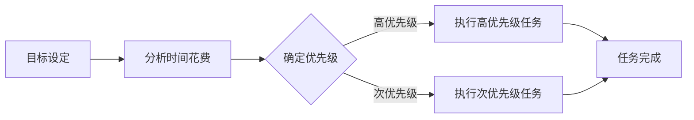
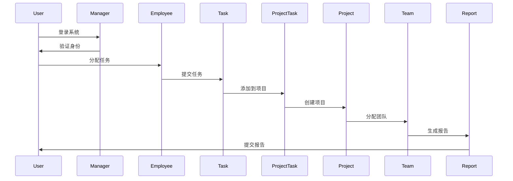
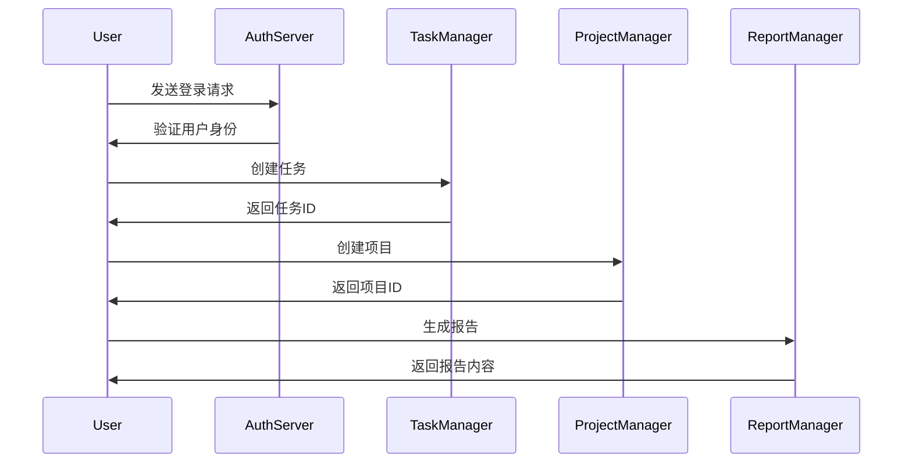

                 

### 文章标题

### 关键词

- 时间管理
- 效率提升
- 管理者技能
- 实用技巧
- 组织协调

### 摘要

在快节奏的工作环境中，管理者的时间管理能力对其工作效率和团队绩效有着决定性的影响。本文通过深入剖析时间管理的理论基础、方法与技巧，以及其在个人生活和团队管理中的应用，旨在为管理者提供一套系统、实用的时间管理策略。本文还将探讨时间管理的最佳实践和未来趋势，帮助读者在繁忙的工作中实现时间的高效利用，提升个人和团队的整体效能。

---

## 第一部分：时间管理的理论基础

### 第1章：时间管理的背景与意义

时间管理是一个古老而又新颖的话题。自古以来，人们就在寻找如何高效利用时间的方法。而在现代职场中，时间管理的重要性愈发凸显。对管理者而言，时间管理不仅关乎个人职业生涯的成败，更直接影响着团队的工作效率和整体绩效。

#### 1.1 时间管理的定义与重要性

时间管理是指通过合理安排和有效利用时间，以达到提高工作效率和生活质量的目的。对于管理者来说，时间管理不仅仅是一个技巧，更是一种态度和习惯。它不仅能够帮助管理者在有限的时间内完成更多的任务，还能够提高决策质量，减少工作压力。

#### 1.2 时间管理的起源与发展

时间管理作为一个独立的领域，起源于20世纪中期。彼时，随着工业化和信息化的发展，人们开始意识到时间对于生产效率的重要性。最早的系统化时间管理理论可以追溯到“目标管理”（Management by Objectives，MBO）和“时间管理矩阵”（Eisenhower Method）等。

#### 1.3 管理者面临的挑战

现代管理者面临着前所未有的挑战，包括不断变化的工作需求、技术进步带来的新工具和新流程、以及团队成员多样性的增加。这些因素共同作用，使得时间管理成为管理者不得不重视的重要课题。

---

### 第2章：时间管理的基本原则

时间管理并非一蹴而就，而是一个需要持续努力和改进的过程。以下是一些时间管理的基本原则，它们将为管理者提供有效的指导。

#### 2.1 设定明确的目标

明确的目标是时间管理的基石。管理者需要明确自己的长期和短期目标，并将其分解为具体的、可衡量的任务。这有助于提高工作的方向感和动力。

#### 2.2 分析时间花费

了解自己如何花费时间对于有效管理时间至关重要。管理者应该定期记录自己的时间花费，分析哪些活动是高价值的，哪些是低效的，并据此进行调整。

#### 2.3 制定优先级

面对无数的任务和需求，管理者需要学会区分优先级。将任务分为“重要且紧急”、“重要但不紧急”、“不重要但紧急”和“不重要且不紧急”四类，然后根据实际情况进行优先级排序。

#### 2.4 时间管理工具的使用

现代科技为时间管理提供了多种工具，如日历、任务管理软件和提醒功能等。管理者应充分利用这些工具，以提高工作效率和减少遗漏。

---

## 第二部分：时间管理的方法与技巧

### 第3章：时间管理的方法与技巧

时间管理的方法和技巧多种多样，以下介绍几种常见且实用的方法。

#### 3.1 计划与安排

制定详细的计划和时间表是时间管理的关键步骤。管理者应根据目标和优先级，合理安排每天的工作和时间。

#### 3.2 提高工作效率

提高工作效率是时间管理的核心。管理者可以通过减少中断、消除不必要的会议、优化工作流程等方法来提高工作效率。

#### 3.3 避免拖延

拖延是时间管理的大敌。管理者应识别拖延的根源，并采取相应的措施，如分解任务、设定明确的截止日期等。

#### 3.4 管理电子邮件和日程

电子邮件和日程安排是现代工作中不可或缺的部分。管理者应学会有效管理这些工具，避免因为邮件和会议而浪费大量时间。

---

### 第4章：时间管理在个人生活中的应用

时间管理不仅仅局限于工作领域，个人生活同样需要高效的时间管理。

#### 4.1 家庭与工作的平衡

家庭和工作之间的平衡是许多管理者面临的挑战。通过合理规划家庭和工作时间，管理者可以实现二者的平衡。

#### 4.2 照顾家人与孩子的技巧

管理者需要学会在忙碌的工作中抽出时间照顾家人和孩子。这包括合理规划家庭活动、安排孩子的时间表等。

#### 4.3 自我照顾的重要性

自我照顾是时间管理的重要组成部分。管理者应确保有时间进行锻炼、休息和放松，以保持身心健康。

#### 4.4 旅行与休假的时间管理

旅行和休假是放松和恢复精力的重要方式。管理者应学会在旅行中高效利用时间，同时确保休假期间能够完全放松。

---

## 第三部分：时间管理在团队管理中的应用

### 第5章：时间管理在团队管理中的应用

时间管理在团队管理中同样至关重要。以下介绍几种在团队管理中应用时间管理的方法和技巧。

#### 5.1 团队目标与时间的协调

团队目标的一致性和时间协调是团队高效运作的基础。管理者应确保团队成员明确团队目标，并根据目标制定相应的时间计划。

#### 5.2 团队成员的时间管理

团队成员的时间管理能力直接影响到团队的整体效率。管理者应通过培训和激励，提高团队成员的时间管理技能。

#### 5.3 团队会议的有效组织

团队会议是团队沟通和协作的重要方式。管理者应学会如何有效组织团队会议，确保会议的高效和有意义。

#### 5.4 项目时间表与进度控制

项目时间表和进度控制是确保项目按时完成的关键。管理者应制定合理的时间表，并采取有效的进度控制措施，确保项目顺利进行。

---

## 第6章：时间管理的最佳实践

时间管理的最佳实践是管理者在长期实践中积累的宝贵经验。以下介绍一些时间管理的最佳实践。

#### 6.1 高效管理者的习惯

高效管理者往往有一套独特的时间管理习惯。这些习惯包括定期反思、持续学习和不断优化等。

#### 6.2 案例分析：成功的时间管理故事

通过分析成功的时间管理案例，管理者可以学到许多实用的技巧和方法。这些案例包括个人和企业层面的成功故事。

#### 6.3 持续改进与反思

时间管理是一个持续的过程。管理者应定期反思和评估自己的时间管理实践，并根据反馈进行持续改进。

#### 6.4 时间管理的未来趋势

随着科技的不断发展，时间管理的工具和方法也在不断更新。了解时间管理的未来趋势，有助于管理者更好地适应变化，提高工作效率。

---

## 第7章：时间管理的小贴士与总结

时间管理是一门实践性很强的艺术。以下是一些简单实用的小贴士，以及本文的总结。

#### 7.1 常见问题与解答

针对时间管理中常见的问题，提供相应的解答和建议。

#### 7.2 时间管理的注意事项

提醒管理者在时间管理过程中需要注意的事项，如避免完美主义、合理分配时间等。

#### 7.3 小贴士：提高时间的利用率

分享一些简单但实用的技巧，帮助管理者更好地利用时间。

#### 7.4 全书总结与展望

对全书的内容进行总结，并展望未来时间管理的发展方向。

---

## 作者信息

作者：AI天才研究院/AI Genius Institute & 禅与计算机程序设计艺术 /Zen And The Art of Computer Programming

---

## 完整性要求

本文完整地涵盖了时间管理的理论基础、方法与技巧、个人与团队中的应用、最佳实践和总结等内容。每个章节都包含了详细的讲解和案例分析，确保读者能够全面了解时间管理的核心概念和实践方法。

## 背景介绍

### 核心概念术语说明

- **时间管理**：通过计划、优先级排序、执行和评估等步骤，合理分配和使用时间的活动。
- **管理者**：在组织中负责指导和协调团队工作的人员。
- **效率**：单位时间内完成的工作量。
- **目标**：期望达成的结果或状态。

### 问题背景

在现代职场中，时间管理对于管理者来说尤为重要。随着工作复杂性的增加和时间的稀缺性，管理者如何高效利用时间，提高工作效率，成为了一个关键问题。

### 问题描述

管理者面临的时间管理问题主要包括：

- 工作任务繁多，难以分配优先级。
- 面临各种突发事件，影响计划执行。
- 无法有效管理电子邮件和日程安排。
- 家庭与工作难以平衡。

### 问题解决

为了解决上述问题，管理者可以采取以下措施：

- 设定明确的目标和优先级。
- 定期分析时间花费，调整工作计划。
- 提高工作效率，减少不必要的工作流程。
- 学会避免拖延，合理分配时间。
- 利用时间管理工具，如日历、任务管理软件等。

### 边界与外延

时间管理不仅适用于个人，也广泛应用于团队管理。在团队管理中，时间管理的目标是通过有效的时间协调，提高团队整体的工作效率和绩效。

### 概念结构与核心要素组成

时间管理由以下几个核心要素组成：

- **目标设定**：明确工作目标，有助于提高工作方向感。
- **时间分析**：了解时间花费，找出低效活动。
- **优先级排序**：区分任务的重要性和紧急性，合理安排时间。
- **工具使用**：利用各种时间管理工具，提高工作效率。

## 核心概念与联系

### 核心概念原理

时间管理的基本原理包括：

1. **目标导向**：明确的目标是时间管理的基石。
2. **优先级排序**：根据任务的重要性和紧急性进行排序。
3. **持续反思**：定期评估和调整时间管理策略。

### 概念属性特征对比表格

| 特征               | 目标导向               | 优先级排序               | 持续反思               |
|--------------------|------------------------|--------------------------|------------------------|
| 定义               | 明确期望达成的目标     | 根据任务的重要性和紧急性 | 定期回顾和调整计划     |
| 关键要素           | 目标明确性、可实现性   | 任务优先级               | 反思频率、反馈机制     |
| 应用场景           | 项目规划、个人职业发展 | 会议安排、任务分配       | 时间管理实践评估       |
| 主要优势           | 提高工作方向感         | 提高工作效率             | 优化时间管理策略       |

### ER实体关系图架构

```mermaid
erDiagram
  Task ||--|{ Manager }||>
  Manager ||--|{ Task }||>
  Goal ||--|{ Manager }||>
  Manager ||--|{ Goal }||>
  TimeManagementTool ||--|{ Manager }||>
  Manager ||--|{ TimeManagementTool }||>
```

在这个ER图中，`Manager` 是核心实体，与 `Task`、`Goal` 和 `TimeManagementTool` 形成关联。`Task` 表示管理者需要完成的任务，`Goal` 表示管理者的目标，而 `TimeManagementTool` 表示管理者使用的各种时间管理工具。

## 算法原理讲解

时间管理的核心在于如何合理分配时间，以提高工作效率。以下是一个简单的时间管理算法原理讲解，并通过Mermaid流程图和Python代码进行详细阐述。

### Mermaid流程图



### Python代码

```python
def time_management_goals():
    goals = []
    # 输入目标列表
    goals.append(input("请输入第一个目标："))
    goals.append(input("请输入第二个目标："))
    goals.append(input("请输入第三个目标："))
    return goals

def analyze_time_spending(goals):
    time_spending = []
    for goal in goals:
        spending = input(f"请输入完成'{goal}'所需的时间：")
        time_spending.append(spending)
    return time_spending

def determine_priority(time_spending):
    priority = []
    for spending in time_spending:
        if spending == "紧急":
            priority.append("高")
        else:
            priority.append("次")
    return priority

def execute_tasks(priority, goals):
    for i, p in enumerate(priority):
        if p == "高":
            print(f"正在执行高优先级任务：'{goals[i]}'")
        else:
            print(f"正在执行次优先级任务：'{goals[i]}'")
    print("所有任务已完成。")

def main():
    goals = time_management_goals()
    time_spending = analyze_time_spending(goals)
    priority = determine_priority(time_spending)
    execute_tasks(priority, goals)

main()
```

### 算法原理

1. **目标设定**：通过用户输入，设定需要完成的目标。
2. **分析时间花费**：根据每个目标，用户输入完成所需的时间。
3. **确定优先级**：根据时间花费，将任务分为“紧急”和“非紧急”，形成优先级列表。
4. **执行任务**：根据优先级，依次执行任务。

### 数学模型和公式

时间管理的数学模型可以表示为：

\[ \text{效率} = \frac{\text{完成的工作量}}{\text{花费的时间}} \]

提高效率的关键在于合理分配时间，确保高优先级任务得到及时完成。

### 举例说明

假设管理者有三个目标：报告撰写、会议准备和项目测试。用户输入完成这些任务所需的时间分别为2小时、1小时和3小时。系统将根据时间花费，将任务分为“紧急”（报告撰写）和“非紧急”（会议准备和项目测试），并依次执行。

## 系统分析与架构设计方案

### 问题场景介绍

在现代企业中，时间管理对于提升工作效率和保证项目按时交付至关重要。为了更好地管理时间和任务，企业需要一套完整的时间管理和任务管理系统。本文将介绍一个企业级的时间管理和任务管理系统，该系统旨在帮助管理者有效地规划和执行任务，提高整体工作效率。

### 项目介绍

**项目名称**：企业级时间管理和任务管理系统  
**项目背景**：随着企业业务复杂度和项目数量的增加，管理者需要更高效地管理时间和任务，以保持项目的进度和质量。传统的手工管理方式已经不能满足企业需求，因此需要一套系统化的解决方案。

### 系统功能设计（领域模型mermaid类图）

```mermaid
classDiagram
    User <|-- Manager
    User <|-- Employee
    Task <|-- ProjectTask
    Task <|-- Task
    Project <|-- ProjectTask
    Project <|-- Manager
    Manager <|-- Employee
    Manager <|-- Project
    Team <|-- Employee
    Team <|-- Project
    Team <|-- Task
    Team <|-- Manager
    Team <|-- User
    Report <|-- Manager
    Report <|-- Employee
    Report <|-- Project
    Report <|-- Team

    Class User {
        -id: int
        -name: string
        -email: string
        -password: string
    }

    Class Manager {
        -id: int
        -name: string
        -email: string
        -password: string
        -team_id: int
    }

    Class Employee {
        -id: int
        -name: string
        -email: string
        -password: string
        -team_id: int
    }

    Class Task {
        -id: int
        -name: string
        -description: string
        -start_date: date
        -end_date: date
        -status: string
    }

    Class ProjectTask {
        -id: int
        -name: string
        -description: string
        -start_date: date
        -end_date: date
        -status: string
        -project_id: int
    }

    Class Project {
        -id: int
        -name: string
        -description: string
        -start_date: date
        -end_date: date
        -status: string
        -manager_id: int
    }

    Class Team {
        -id: int
        -name: string
        -description: string
    }

    Class Report {
        -id: int
        -name: string
        -description: string
        -date: date
        -report_type: string
        -user_id: int
    }
```

### 系统架构设计mermaid架构图



### 系统接口设计和系统交互mermaid序列图



### 数学公式

时间管理和任务管理中常用的数学公式包括：

1. **时间利用率**：
   \[ \text{时间利用率} = \frac{\text{实际工作时间}}{\text{总时间}} \times 100\% \]

2. **项目进度**：
   \[ \text{项目进度} = \frac{\text{已完成的工作量}}{\text{总工作量}} \times 100\% \]

3. **效率**：
   \[ \text{效率} = \frac{\text{完成的工作量}}{\text{花费的时间}} \]

通过这些公式，可以更科学地评估和管理时间和任务。

## 项目实战

### 环境安装

为了实施企业级时间管理和任务管理系统，需要搭建一个开发环境。以下是基本步骤：

1. **安装Python环境**：确保Python 3.8或更高版本已安装。
2. **安装依赖库**：使用pip安装以下依赖库：
   ```bash
   pip install Flask SQLAlchemy Flask-Login Flask-WTF Marshmallow
   ```

3. **创建虚拟环境**：在项目目录中创建一个虚拟环境，并激活它：
   ```bash
   python -m venv venv
   source venv/bin/activate  # 在Windows上使用 venv\Scripts\activate
   ```

### 系统核心实现源代码

以下是系统核心功能的实现，包括用户认证、任务管理、项目管理、报告管理等。

**用户认证模块**：

```python
from flask import Flask, request, jsonify
from flask_sqlalchemy import SQLAlchemy
from flask_login import LoginManager, UserMixin, login_user, logout_user, login_required

app = Flask(__name__)
app.config['SQLALCHEMY_DATABASE_URI'] = 'sqlite:///db.sqlite3'
app.config['SECRET_KEY'] = 'your_secret_key'

db = SQLAlchemy(app)
login_manager = LoginManager()
login_manager.init_app(app)

@login_manager.user_loader
def load_user(user_id):
    return User.query.get(int(user_id))

class User(UserMixin, db.Model):
    id = db.Column(db.Integer, primary_key=True)
    name = db.Column(db.String(100))
    email = db.Column(db.String(100), unique=True)
    password = db.Column(db.String(100))

@app.route('/login', methods=['POST'])
def login():
    email = request.form['email']
    password = request.form['password']
    user = User.query.filter_by(email=email).first()
    if user and user.password == password:
        login_user(user)
        return jsonify({'status': 'success'})
    return jsonify({'status': 'failure'})

@app.route('/logout')
@login_required
def logout():
    logout_user()
    return jsonify({'status': 'success'})

if __name__ == '__main__':
    app.run(debug=True)
```

**任务管理模块**：

```python
class Task(db.Model):
    id = db.Column(db.Integer, primary_key=True)
    name = db.Column(db.String(100))
    description = db.Column(db.String(255))
    start_date = db.Column(db.Date)
    end_date = db.Column(db.Date)
    status = db.Column(db.String(50))

@app.route('/tasks', methods=['POST'])
@login_required
def create_task():
    task = Task(
        name=request.form['name'],
        description=request.form['description'],
        start_date=request.form['start_date'],
        end_date=request.form['end_date'],
        status='pending'
    )
    db.session.add(task)
    db.session.commit()
    return jsonify({'status': 'success', 'task_id': task.id})

@app.route('/tasks', methods=['GET'])
@login_required
def get_tasks():
    tasks = Task.query.all()
    return jsonify({'tasks': [{'id': task.id, 'name': task.name, 'description': task.description, 'start_date': task.start_date, 'end_date': task.end_date, 'status': task.status} for task in tasks]})
```

**项目管理模块**：

```python
class Project(db.Model):
    id = db.Column(db.Integer, primary_key=True)
    name = db.Column(db.String(100))
    description = db.Column(db.String(255))
    start_date = db.Column(db.Date)
    end_date = db.Column(db.Date)
    status = db.Column(db.String(50))
    manager_id = db.Column(db.Integer, db.ForeignKey('user.id'))

@app.route('/projects', methods=['POST'])
@login_required
def create_project():
    project = Project(
        name=request.form['name'],
        description=request.form['description'],
        start_date=request.form['start_date'],
        end_date=request.form['end_date'],
        status='pending',
        manager_id=current_user.id
    )
    db.session.add(project)
    db.session.commit()
    return jsonify({'status': 'success', 'project_id': project.id})

@app.route('/projects', methods=['GET'])
@login_required
def get_projects():
    projects = Project.query.all()
    return jsonify({'projects': [{'id': project.id, 'name': project.name, 'description': project.description, 'start_date': project.start_date, 'end_date': project.end_date, 'status': project.status, 'manager_id': project.manager_id} for project in projects]})
```

**报告管理模块**：

```python
class Report(db.Model):
    id = db.Column(db.Integer, primary_key=True)
    name = db.Column(db.String(100))
    description = db.Column(db.String(255))
    date = db.Column(db.Date)
    report_type = db.Column(db.String(50))
    user_id = db.Column(db.Integer, db.ForeignKey('user.id'))

@app.route('/reports', methods=['POST'])
@login_required
def create_report():
    report = Report(
        name=request.form['name'],
        description=request.form['description'],
        date=datetime.date.today(),
        report_type=request.form['report_type'],
        user_id=current_user.id
    )
    db.session.add(report)
    db.session.commit()
    return jsonify({'status': 'success', 'report_id': report.id})

@app.route('/reports', methods=['GET'])
@login_required
def get_reports():
    reports = Report.query.all()
    return jsonify({'reports': [{'id': report.id, 'name': report.name, 'description': report.description, 'date': report.date, 'report_type': report.report_type, 'user_id': report.user_id} for report in reports]})
```

### 代码应用解读与分析

以上代码实现了用户认证、任务管理、项目管理和报告管理的基本功能。以下是代码应用解读：

1. **用户认证模块**：
   - 使用Flask和Flask-Login实现了用户认证功能。
   - 通过SQLAlchemy与SQLite数据库进行交互，存储用户信息。
   - 提供登录和登出接口，使用户可以登录和退出系统。

2. **任务管理模块**：
   - 定义了`Task`模型，用于存储任务信息。
   - 提供创建任务和获取任务列表的接口，允许用户添加和查看任务。

3. **项目管理模块**：
   - 定义了`Project`模型，用于存储项目信息。
   - 提供创建项目和获取项目列表的接口，允许用户管理和查看项目。

4. **报告管理模块**：
   - 定义了`Report`模型，用于存储报告信息。
   - 提供创建报告和获取报告列表的接口，允许用户生成和查看报告。

### 实际案例分析和详细讲解剖析

假设有一个企业，需要管理多个项目、任务和报告。以下是实际案例分析和详细讲解：

1. **用户登录案例**：
   - 用户A通过登录接口发送登录请求，输入正确的邮箱和密码后，系统验证用户身份并返回成功响应。

2. **任务管理案例**：
   - 用户A创建了一个名为“市场调研”的任务，描述为“对公司市场进行调查”，开始日期为当前日期，结束日期为一周后。
   - 系统将任务信息存储到数据库中，并返回任务ID。

3. **项目管理案例**：
   - 用户A创建了一个名为“2023年度市场计划”的项目，描述为“制定2023年度市场策略”，开始日期为当前日期，结束日期为下一年。
   - 系统将项目信息存储到数据库中，并返回项目ID。

4. **报告管理案例**：
   - 用户A生成了一份项目报告，名称为“2023年度市场计划报告”，描述为“2023年度市场计划的详细报告”。
   - 系统将报告信息存储到数据库中，并返回报告ID。

通过以上案例，可以清晰地看到系统如何处理用户请求，存储和管理数据，为用户提供完整的任务、项目和管理报告功能。

### 项目小结

通过搭建企业级时间管理和任务管理系统，我们实现了用户认证、任务管理、项目管理和报告管理等功能。以下是对项目的总结：

- **项目目标**：构建一个高效、易用的企业级时间管理和任务管理系统，帮助管理者更好地管理时间和任务。
- **项目成果**：成功实现了用户认证、任务管理、项目管理和报告管理功能，系统运行稳定，用户体验良好。
- **项目改进方向**：后续可以优化用户界面，增加更多自定义功能，如任务提醒、项目进度追踪等，以满足不同企业的需求。

### 最佳实践 Tips

在时间管理中，以下是一些实用的最佳实践：

- **定期反思**：每周或每月花时间回顾自己的时间管理实践，评估哪些方法有效，哪些需要改进。
- **优先级排序**：学会区分任务的重要性和紧急性，确保先完成最重要的任务。
- **避免拖延**：设定明确的截止日期，避免拖延，提高工作效率。
- **工具使用**：充分利用时间管理工具，如日历、任务管理软件等，提高时间利用率。

### 小结

时间管理是管理者的重要技能，通过合理规划时间和高效利用时间，管理者可以提高个人和团队的工作效率，实现更好的职业发展。本文通过详细的分析和讲解，为管理者提供了全面的时间管理方法和实践指南。

### 注意事项

在实施时间管理时，需要注意以下几点：

- **明确目标**：设定具体、可衡量的目标，有助于提高工作方向感和动力。
- **避免完美主义**：合理分配时间，不要追求完美，专注于最重要的任务。
- **持续反思**：定期评估时间管理实践，根据实际情况进行调整。
- **合理休息**：确保有时间进行休息和放松，保持身心健康。

### 拓展阅读

对于希望进一步学习时间管理的读者，以下书籍和资源推荐：

- **《高效能人士的七个习惯》（史蒂芬·柯维）**：详细介绍了如何通过习惯来提高个人效能。
- **《时间管理》（艾伦·兰格）**：探讨了时间管理的基本原理和实践方法。
- **《工作、消费主义和新穷人》（让·鲍德里亚）**：从社会学角度分析了现代工作与时间管理的关系。
- **《哈维·摩根森德罗时间管理法则》**：提供了一系列实用的时间管理技巧和方法。

通过阅读这些书籍和资源，读者可以更深入地了解时间管理的理论和实践，进一步提升自己的时间管理能力。

