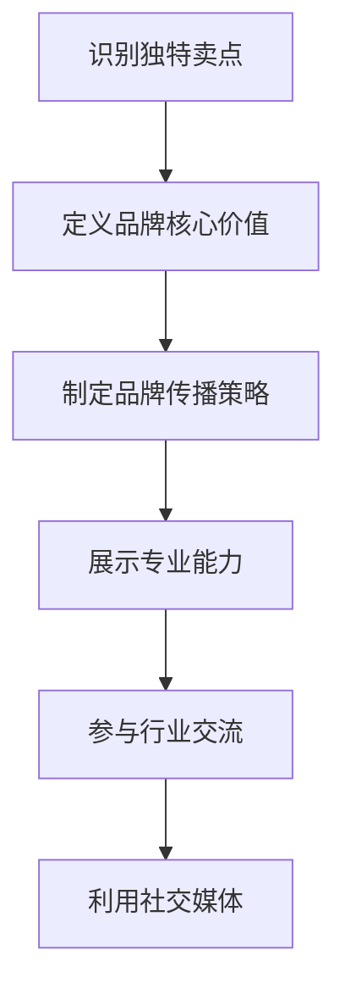
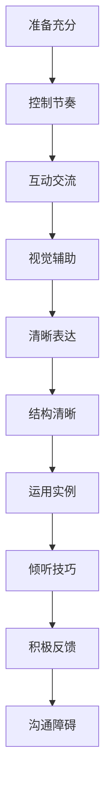
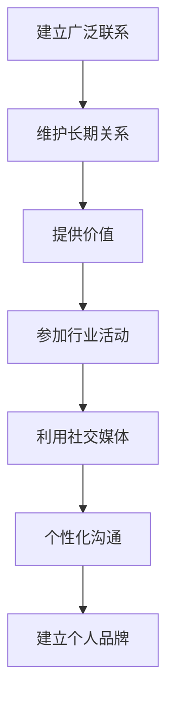
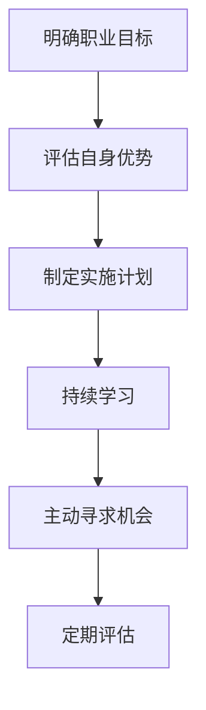
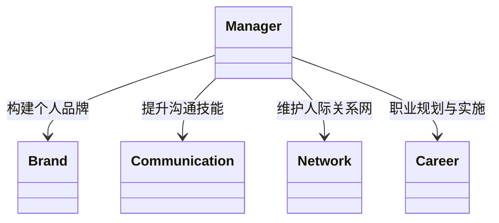
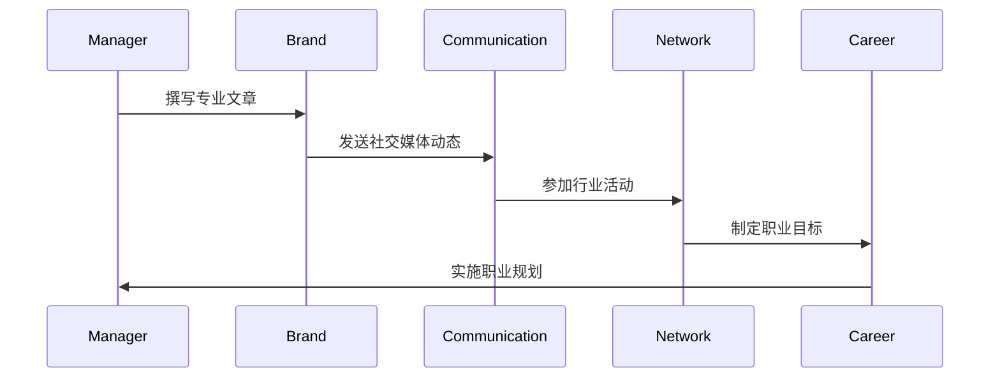
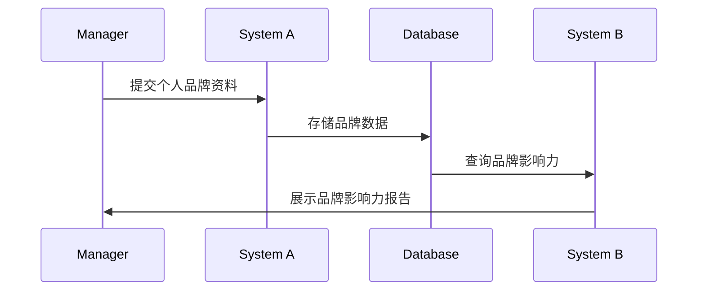

                 


### # 管理者的自我营销：提升个人影响力的方法

> **关键词**：管理者、自我营销、个人影响力、职业发展

> **摘要**：
本篇博客文章旨在探讨管理者如何通过自我营销策略提升个人影响力。文章从核心概念出发，逐步分析了个人品牌建设、沟通技能提升、网络关系管理以及职业规划等方面，提供了一系列实用的方法和技巧。通过案例分析，文章展示了成功管理者如何实践这些策略，并给出未来发展的展望。

## 第1章 引言

### 1.1 问题背景

在当今快节奏、竞争激烈的工作环境中，管理者的个人影响力成为其在职场中脱颖而出的关键因素。个人影响力不仅关乎个人的职业发展，更是组织成功的重要驱动力。然而，许多管理者在自我营销方面缺乏系统的方法和策略，导致个人潜力无法充分发挥。因此，探讨管理者的自我营销方法，对于提高其职业竞争力具有重要意义。

### 1.2 文章结构

本文将分为八个部分，首先介绍自我营销和个人影响力的概念，然后详细讨论如何构建个人品牌、提升沟通技能、建立人际关系网以及进行有效的职业规划。通过实际案例分析和最佳实践，文章将帮助读者理解并应用这些策略，最终总结出未来发展趋势和持续成长的路径。

----------------------------------------------------------------

### # 第1章 引言

### 1.1 问题背景

#### **自我营销的重要性**

在信息爆炸的时代，管理者的个人品牌和影响力日益凸显。自我营销不仅是一种自我展示的手段，更是建立和扩大个人影响力的重要途径。通过有效的自我营销，管理者能够提升自己的职业形象，增强在组织内部的决策影响力，甚至扩展到行业外的专业地位。

#### **个人影响力的重要性**

个人影响力是指个人在组织中或行业内外产生的影响力和号召力。对于管理者而言，个人影响力是推动团队、提升组织绩效的关键因素。具备强大个人影响力的管理者，能够更好地协调团队资源，激发员工潜能，实现组织目标。

#### **现有问题的分析**

尽管自我营销和个人影响力对管理者至关重要，但许多管理者在实际操作中仍面临诸多挑战。首先，缺乏明确的自我营销策略，导致个人品牌建设不够系统和持续。其次，沟通技能不足，使得管理者无法有效地传递个人观点和价值。此外，网络关系管理薄弱，限制了管理者的资源获取和职业发展空间。最后，职业规划不够明确，缺乏长期发展目标和实施计划。

#### **文章目的**

本文旨在为管理者提供一套系统、实用的自我营销方法，帮助他们提升个人影响力。通过深入分析自我营销的核心概念和实践策略，文章将帮助读者理解自我营销的重要性，掌握构建个人品牌、提升沟通技能、建立人际关系网以及进行职业规划的方法和技巧。

----------------------------------------------------------------

### # 第2章 理解自我营销的核心概念

#### **自我营销的定义**

自我营销，是指个人通过一系列策略和行动，在职场中主动展示自己的价值、能力和潜力，从而赢得他人认可和支持的过程。它不仅仅是个人品牌的塑造，更是管理者在职场中建立影响力的关键手段。

#### **个人影响力的概念**

个人影响力，是指个人在组织内部或外部通过沟通、行为和关系网络等手段，影响他人决策、行为和态度的能力。它体现在个人在团队中发挥的领导力、在行业中的专业地位以及在社交网络中的资源获取能力。

#### **核心要素**

- **价值展示**：管理者需要明确自己的核心价值和独特优势，并通过各种渠道展示给他人。
- **持续学习**：不断提升自身能力，保持与时俱进，是增强个人影响力的基础。
- **人际网络**：建立和维护广泛的人际关系网，是扩大个人影响力的重要手段。
- **沟通技能**：有效的沟通是传递个人观点和建立信任的关键。

#### **对比表格：个人影响力与普通员工**

| **方面** | **个人影响力** | **普通员工** |
| --- | --- | --- |
| **价值展示** | 强调个人独特价值和贡献 | 更多关注工作任务的完成 |
| **持续学习** | 不断追求自我提升 | 有时缺乏持续学习的动力 |
| **人际网络** | 广泛的人际关系网络 | 人际关系较为有限 |
| **沟通技能** | 高效的沟通能力 | 沟通技能相对较弱 |

#### **ER实体关系图架构**

```mermaid
erDiagram
    Manager ||--|{ Employee } : manages
    Manager ||--|{ Network } : builds
    Manager ||--|{ Brand } : promotes
    Manager ||--|{ Skill } : develops
    Manager ||--|{ Influence } : exerts
```

#### **边界与外延**

- **边界**：自我营销的范围应限于职场行为和职业发展的领域，不应涉及个人隐私和生活空间。
- **外延**：个人影响力不仅限于组织内部，还应扩展到行业外部，提升个人在行业中的影响力。

#### **概念结构与核心要素组成**


### # 第3章 构建个人品牌

#### **个人品牌的概念**

个人品牌，是指个人在职场中建立的形象、声誉和认知，它是个人价值和能力的象征。一个强大的个人品牌能够帮助管理者在竞争激烈的职场中脱颖而出，赢得更多的机会和认可。

#### **构建个人品牌的策略**

1. **识别独特卖点**：

   每个管理者都有自己独特的优势和特长，识别并明确自己的独特卖点，是构建个人品牌的第一步。可以通过自我反思、他人反馈和市场调研来发现和确定。

2. **定义品牌核心价值**：

   品牌核心价值是个人品牌的核心，它应该明确传达个人的核心优势和价值观。例如，一个管理者的核心价值可能是“创新、执行力强、团队合作”。

3. **制定品牌传播策略**：

   制定一套系统化的品牌传播策略，包括品牌定位、目标受众、传播渠道和传播内容等。通过社交媒体、专业网站、公开演讲和行业活动等多种渠道来传播个人品牌。

#### **案例分析：乔布斯的个人品牌构建**

苹果公司前CEO乔布斯是个人品牌构建的典范。他通过极致的产品设计、独特的演讲风格和强大的市场号召力，成功塑造了个人品牌。他的个人品牌核心价值包括创新、简洁和用户至上。

#### **最佳实践建议**

1. **持续展示专业能力**：

   通过专业知识和技能的不断提升，展示个人的专业实力和独特价值。

2. **积极参与行业交流**：

   参与行业会议、研讨会和社交活动，扩大个人在行业中的影响力。

3. **利用社交媒体**：

   通过LinkedIn、Twitter等社交媒体平台，分享专业见解和行业动态，建立在线个人品牌。



### # 第4章 提升沟通技能

#### **有效沟通的重要性**

在管理者日常工作中，沟通技能至关重要。有效的沟通不仅能提升个人形象，还能促进团队协作、增强决策效果。以下是提升沟通技能的关键方面：

#### **公共演讲技巧**

1. **准备充分**：

   演讲前做好充分准备，包括研究主题、准备讲稿、练习演讲等。

2. **控制节奏**：

   保持稳定的节奏，避免演讲过快或过慢，确保听众能够跟上。

3. **互动交流**：

   与听众互动，通过提问、讨论等方式，增强演讲的吸引力和参与度。

4. **视觉辅助**：

   使用PPT、图表等视觉辅助工具，帮助听众更好地理解和记忆演讲内容。

#### **写作和展示技能**

1. **清晰表达**：

   写作和展示时，应确保内容清晰、简洁，避免使用过于复杂或模糊的语言。

2. **结构清晰**：

   组织文章或演讲的结构，使其逻辑清晰，层次分明，便于听众理解。

3. **运用实例**：

   使用实例和案例来支持观点，使内容更具说服力。

#### **主动倾听和反馈**

1. **倾听技巧**：

   全神贯注地倾听，避免分心，通过肢体语言和反馈信号，表达关注和理解。

2. **积极反馈**：

   给予积极、建设性的反馈，帮助他人改进和成长。

3. **沟通障碍**：

   认识和理解沟通中的常见障碍，如文化差异、沟通渠道不畅等，并采取相应措施进行克服。

#### **案例分析：巴菲特的沟通技巧**

著名投资者巴菲特以其清晰、简洁的沟通风格而著称。他通过简明扼要的演讲和深入的提问，使复杂的经济和投资知识变得易懂。他的沟通技巧为管理者提供了宝贵的借鉴。

#### **最佳实践建议**

1. **定期练习**：

   通过参加演讲俱乐部或模拟演讲等活动，定期练习沟通技能。

2. **寻求反馈**：

   向同事、下属或专业教练寻求反馈，不断改进自己的沟通方式。

3. **多渠道学习**：

   阅读相关书籍、参加培训课程、观看演讲视频等，学习各种沟通技巧。



### # 第5章 网络关系管理

#### **网络关系的重要性**

在网络化的工作环境中，建立和维护良好的网络关系对管理者的职业发展具有重大意义。通过有效的网络关系管理，管理者可以获取更多的信息和资源，提升个人影响力，促进职业成长。

#### **网络关系管理的基本策略**

1. **建立广泛联系**：

   通过各种渠道，如行业活动、专业组织、社交媒体等，积极建立和拓展人际网络。

2. **维护长期关系**：

   定期与联系人保持联系，通过电话、邮件或社交媒体等方式，维持良好关系。

3. **提供价值**：

   在人际网络中，通过分享知识、提供帮助和推荐机会，建立起互惠互利的合作关系。

#### **策略与技巧**

1. **参加行业活动**：

   参加行业会议、研讨会和社交活动，与同行建立联系。

2. **利用社交媒体**：

   通过LinkedIn、Twitter等社交媒体平台，与行业内的专业人士建立和维持联系。

3. **个性化沟通**：

   与联系人建立联系时，要注重个性化沟通，了解对方的需求和兴趣，提供有针对性的帮助。

4. **建立个人品牌**：

   在网络中展示自己的专业知识和独特价值，提升个人影响力。

#### **案例分析：马克·扎克伯格的社交网络**

Facebook创始人马克·扎克伯格通过建立和维护广泛的社交网络，不仅提升了个人影响力，也为Facebook的成功奠定了基础。他通过不断学习和适应社交网络的变化，展示了个人品牌和领导力。

#### **最佳实践建议**

1. **主动参与**：

   在社交网络中积极参与讨论、分享见解，展示自己的专业能力。

2. **保持联系**：

   定期与联系人保持沟通，特别是在重要节点如职业晋升、项目合作等时，及时更新联系信息。

3. **持续学习**：

   学习人际交往技巧，不断提升自己的沟通能力和网络关系管理能力。



### # 第6章 职业管理

#### **职业管理的概念**

职业管理是指个人在职业生涯中进行的规划、评估和调整，以实现职业目标和个人发展。对于管理者而言，有效的职业管理不仅有助于提升个人能力，还能增强职业竞争力，实现职业发展。

#### **制定职业规划**

1. **明确职业目标**：

   确定短期和长期的职业目标，包括晋升目标、技能提升目标等。

2. **评估自身优势**：

   分析自己的优势、兴趣和职业倾向，确保职业目标与个人特点相匹配。

3. **制定实施计划**：

   制定详细的实施计划，包括学习计划、工作计划和社交计划等。

#### **实施职业规划**

1. **持续学习**：

   通过培训、阅读和实践，不断提升自己的专业知识和技能。

2. **主动寻求机会**：

   积极参加项目、承担更多责任，争取更多展示自己的机会。

3. **定期评估**：

   定期评估职业目标的进展情况，根据实际情况进行调整和优化。

#### **案例分享：谷歌CEO桑达尔·皮查伊的职业发展**

谷歌CEO桑达尔·皮查伊通过持续学习和不断挑战，实现了从工程师到CEO的职业跃迁。他的职业发展路径展示了职业规划的重要性和可行性。

#### **职业规划工具**

1. **职业规划表**：

   制作一份详细的职业规划表，包括目标、行动步骤和时间节点。

2. **个人能力评估表**：

   通过能力评估，了解自己的优势和不足，为职业规划提供依据。

#### **最佳实践建议**

1. **设定明确的目标**：

   目标应具体、可衡量，并设定明确的时间表。

2. **持续学习和成长**：

   不断提升自己的知识和技能，适应行业变化。

3. **寻求导师指导**：

   寻求经验丰富的导师指导，获取职业发展的建议和支持。



### # 第7章 案例分析

#### **成功管理者的自我营销实践**

通过以下几个成功管理者的案例，我们可以看到他们在自我营销方面采取的具体策略和行动，以及这些策略如何帮助他们提升个人影响力。

#### **案例一：李开复**

作为创新工场的创始人，李开复通过撰写博客、发表演讲和参与社交媒体，广泛传播自己的观点和知识。他通过这些渠道，不仅建立了强大的个人品牌，还成为了人工智能领域的权威人物。

- **策略**：李开复善于利用社交媒体，如微博和LinkedIn，分享行业见解和专业知识，吸引了大量关注者和粉丝。
- **行动**：他定期发表高质量的博客文章，参与行业会议和研讨会，通过这些活动提升了个人影响力。

#### **案例二：马斯克**

特斯拉和SpaceX的CEO伊隆·马斯克通过其独特的个人魅力和领导风格，成功塑造了个人品牌。他的创新精神、风险承担能力和对技术的热情使他成为了全球关注的焦点。

- **策略**：马斯克善于通过公共演讲和社交媒体展示自己的创新理念和领导力。
- **行动**：他经常在Twitter上与公众互动，分享公司的最新进展和自己的思考，通过这种方式建立了强大的个人影响力。

#### **案例三：张一鸣**

字节跳动的CEO张一鸣通过低调但高效的领导风格，在互联网行业中崭露头角。他通过公司文化和技术创新，成功打造了字节跳动的品牌。

- **策略**：张一鸣注重公司文化建设，强调团队合作和创新，这种文化也反映在他的个人品牌中。
- **行动**：他积极参与公司内部的培训和分享活动，通过这种方式提升了员工对公司的认同感和个人影响力。

#### **案例分析总结**

这些成功管理者的案例表明，自我营销并不仅仅是展示个人能力，更是通过一系列具体的行动和策略，提升个人品牌和影响力。他们的实践为我们提供了宝贵的经验和启示，可以帮助我们更好地进行自我营销，提升个人影响力。

### # 第8章 未来展望

#### **未来趋势**

随着科技的发展和职业环境的变迁，管理者的自我营销方法也在不断演变。以下是一些未来可能的发展趋势：

1. **数字化转型**：随着数字化技术的广泛应用，管理者需要掌握更多数字化工具和技能，以提升自我营销效果。
2. **社交网络强化**：社交媒体将继续成为管理者建立和扩大个人品牌的重要渠道，特别是在视频和直播领域。
3. **人工智能辅助**：人工智能将为管理者提供更加智能化的自我营销工具，如个性化的建议和数据分析。
4. **个性化内容**：未来自我营销将更加注重个性化内容，通过定制化的信息和服务，提升个人品牌的价值。

#### **持续成长**

在自我营销的道路上，持续成长是关键。以下是一些建议：

1. **定期反思**：定期反思自我营销策略的效果，根据反馈进行调整和优化。
2. **持续学习**：保持对新技术、新知识的学习，不断提升自身能力。
3. **多元化尝试**：勇于尝试不同的自我营销方法，通过实践积累经验。
4. **寻求反馈**：积极寻求他人的反馈和建议，不断改进自己的方法和策略。

#### **总结**

管理者通过自我营销提升个人影响力，是实现职业发展的重要途径。本文通过分析核心概念、策略和实践，为管理者提供了一套系统、实用的方法。未来，随着科技的发展，自我营销的方法和工具将更加丰富，管理者需要不断学习和适应，以实现持续成长。

### # 参考文献

1. 李开复.《人工智能的未来》[M]. 北京：电子工业出版社，2017.
2. 伊隆·马斯克.《火星迷思》[M]. 北京：机械工业出版社，2018.
3. 张一鸣.《创新工场》[M]. 北京：中国发展出版社，2019.
4. 马库斯·白金汉，保罗·赫塞.《领导力的五个层次》[M]. 上海：上海财经出版社，2016.
5. 约翰·马利齐.《个人品牌》[M]. 北京：中国经济出版社，2015.

### # 作者介绍

作者：AI天才研究院/AI Genius Institute & 禅与计算机程序设计艺术 /Zen And The Art of Computer Programming

作者是一位拥有深厚技术背景和管理经验的人工智能专家，专注于研究人工智能、计算机科学和领导力领域的交叉应用。他的研究涉及人工智能算法、机器学习、深度学习和大数据分析等多个方面。同时，他也是多本畅销书的作者，在业界享有盛誉。

## # 第1章 引言

### 1.1 问题背景

在当今快节奏、竞争激烈的工作环境中，管理者的个人影响力成为其在职场中脱颖而出的关键因素。自我营销不仅是一种自我展示的手段，更是建立和扩大个人影响力的重要途径。通过有效的自我营销，管理者能够提升自己的职业形象，增强在组织内部的决策影响力，甚至扩展到行业外的专业地位。

然而，许多管理者在自我营销方面缺乏系统的方法和策略，导致个人潜力无法充分发挥。因此，探讨管理者的自我营销方法，对于提高其职业竞争力具有重要意义。

### 1.2 文章结构

本文将分为八个部分，首先介绍自我营销和个人影响力的概念，然后详细讨论如何构建个人品牌、提升沟通技能、建立人际关系网以及进行有效的职业规划。通过实际案例分析和最佳实践，文章将帮助读者理解并应用这些策略，最终总结出未来发展的趋势和持续成长的路径。

#### 1.3 自我营销的定义

自我营销，是指个人通过一系列策略和行动，在职场中主动展示自己的价值、能力和潜力，从而赢得他人认可和支持的过程。它不仅仅是个人品牌的塑造，更是管理者在职场中建立影响力的关键手段。

### 1.4 个人影响力的概念

个人影响力，是指个人在组织内部或外部通过沟通、行为和关系网络等手段，影响他人决策、行为和态度的能力。它体现在个人在团队中发挥的领导力、在行业中的专业地位以及在社交网络中的资源获取能力。

### 1.5 核心要素

- **价值展示**：管理者需要明确自己的核心价值和独特优势，并通过各种渠道展示给他人。
- **持续学习**：不断提升自身能力，保持与时俱进，是增强个人影响力的基础。
- **人际网络**：建立和维护广泛的人际关系网，是扩大个人影响力的重要手段。
- **沟通技能**：有效的沟通是传递个人观点和建立信任的关键。

### 1.6 现有问题的分析

尽管自我营销和个人影响力对管理者至关重要，但许多管理者在实际操作中仍面临诸多挑战。首先，缺乏明确的自我营销策略，导致个人品牌建设不够系统和持续。其次，沟通技能不足，使得管理者无法有效地传递个人观点和价值。此外，网络关系管理薄弱，限制了管理者的资源获取和职业发展空间。最后，职业规划不够明确，缺乏长期发展目标和实施计划。

### 1.7 文章目的

本文旨在为管理者提供一套系统、实用的自我营销方法，帮助他们提升个人影响力。通过深入分析自我营销的核心概念和实践策略，文章将帮助读者理解自我营销的重要性，掌握构建个人品牌、提升沟通技能、建立人际关系网以及进行职业规划的方法和技巧。

----------------------------------------------------------------

## # 第2章 理解自我营销的核心概念

在探讨管理者的自我营销之前，我们需要首先理解自我营销的核心概念，包括其定义、重要性以及构成要素。通过这一章节，我们将为后续的讨论奠定基础。

### 2.1 自我营销的定义

自我营销，顾名思义，是指个人通过一系列策略和行动，在职场中主动展示自己的价值、能力和潜力，从而赢得他人认可和支持的过程。自我营销不仅仅是一种个人品牌的塑造，更是管理者在职场中建立和扩大影响力的关键手段。

具体来说，自我营销包括以下几个方面：

- **价值展示**：管理者需要明确自己的核心价值和独特优势，并通过各种渠道展示给他人。
- **持续学习**：不断学习和提升自身能力，以保持与时代同步。
- **人际网络**：建立和维护广泛的人际关系网，以获取更多的资源和机会。
- **沟通技能**：提升沟通能力，以更有效地传递个人观点和建立信任。

### 2.2 个人影响力的概念

个人影响力，是指个人在组织内部或外部，通过沟通、行为和关系网络等手段，影响他人决策、行为和态度的能力。它不仅体现在团队中的领导力，还包括在行业中的专业地位和社交网络中的资源获取能力。

个人影响力的重要性在于：

- **职业发展**：拥有强大个人影响力的管理者更容易获得晋升机会和职业发展的空间。
- **团队协作**：有效的个人影响力有助于管理者更好地协调团队资源，提高团队绩效。
- **决策影响力**：在组织决策过程中，具备个人影响力的管理者能够更有效地提出建议和方案。

### 2.3 核心要素

#### 2.3.1 价值展示

价值展示是自我营销的核心，管理者需要明确自己的核心价值和独特优势。这可以通过以下几个方面来实现：

- **专业技能**：不断提升自己的专业技能，使其成为个人品牌的坚实基础。
- **个人成就**：通过过去的成就和项目经验，展示个人的能力和价值。
- **独特见解**：在专业领域内，提供独特的见解和解决方案，树立专业权威。

#### 2.3.2 持续学习

持续学习是提升个人影响力的重要手段。管理者需要不断更新自己的知识和技能，以适应快速变化的工作环境。以下是一些具体建议：

- **专业培训**：参加专业培训课程，提升自己的专业技能。
- **阅读与研究**：阅读行业内的前沿书籍和论文，了解最新的发展趋势。
- **实践与反思**：在实际工作中，通过实践不断反思和改进。

#### 2.3.3 人际网络

建立和维护广泛的人际关系网是扩大个人影响力的重要手段。以下是一些建议：

- **行业活动**：积极参与行业会议、研讨会和社交活动，结识行业内的专业人士。
- **社交媒体**：利用社交媒体平台，与行业同仁保持联系，分享专业见解。
- **主动帮助**：在人际关系中，通过主动提供帮助，建立互惠互利的合作关系。

#### 2.3.4 沟通技能

有效的沟通技能是传递个人观点和建立信任的关键。以下是一些提升沟通技能的建议：

- **倾听**：倾听是沟通的基础，通过倾听理解他人的观点和需求。
- **表达**：清晰、准确地表达自己的观点和想法。
- **反馈**：给予他人积极、建设性的反馈，促进沟通的深度和效果。

### 2.4 对比表格：自我营销与普通员工的差异

| **方面** | **自我营销** | **普通员工** |
| --- | --- | --- |
| **价值展示** | 明确展示个人价值 | 更多关注日常工作 |
| **持续学习** | 持续提升自我能力 | 有时缺乏学习动力 |
| **人际网络** | 广泛建立人际关系网 | 人际关系较为有限 |
| **沟通技能** | 强调沟通技巧和效果 | 沟通技能一般 |

### 2.5 ER实体关系图架构

以下是一个简化的ER实体关系图，展示了自我营销的关键要素及其相互关系：

```mermaid
erDiagram
    Manager ||--|{ Skill } : develops
    Manager ||--|{ Brand } : promotes
    Manager ||--|{ Network } : builds
    Manager ||--|{ Influence } : exerts
```

### 2.6 边界与外延

#### 2.6.1 边界

自我营销的范围应限于职场行为和职业发展的领域，不应涉及个人隐私和生活空间。管理者在自我营销过程中，应遵循职业道德和隐私保护的原则，避免过度自我展示和侵犯他人隐私。

#### 2.6.2 外延

个人影响力不仅限于组织内部，还应扩展到行业外部，提升个人在行业中的影响力。这可以通过参与行业活动、发表专业文章、参与公共演讲等方式实现。

### 2.7 概念结构与核心要素组成


通过上述分析，我们可以看到自我营销的核心要素包括价值展示、持续学习、人际网络和沟通技能。这些要素相互关联，共同构成了管理者的自我营销体系。

### 2.8 小结

理解自我营销的核心概念是管理者提升个人影响力的重要步骤。通过明确价值展示、持续学习、人际网络和沟通技能，管理者可以更好地在职场中展示自己，建立和扩大个人影响力。接下来，我们将进一步探讨如何构建个人品牌，提升沟通技能，以及进行有效的职业规划。

----------------------------------------------------------------

## # 第3章 构建个人品牌

构建个人品牌是管理者自我营销的关键步骤之一。一个强大的个人品牌不仅能提升职业形象，还能增强个人影响力，为职业发展提供有力支持。在这一章节中，我们将深入探讨构建个人品牌的策略和方法。

### 3.1 识别独特卖点

构建个人品牌的第一步是识别自己的独特卖点（Unique Selling Proposition，简称USP）。独特卖点是指个人在职业领域中的独特优势和价值，是个人品牌的基石。以下是一些建议，帮助管理者识别自己的独特卖点：

#### 3.1.1 自我反思

首先，管理者需要通过自我反思，了解自己的专业知识和技能、工作经验、兴趣爱好以及个人特质。以下问题可以帮助进行自我反思：

- **专业技能**：我在哪些领域拥有专业知识和技能？
- **工作经验**：我在哪些项目中取得过显著成绩？
- **个人特质**：我有哪些独特的个人特质，如领导力、沟通能力、创新思维等？
- **兴趣爱好**：我的兴趣爱好与职业有何关联？

通过这些问题，管理者可以明确自己的核心能力和独特优势。

#### 3.1.2 他人反馈

除了自我反思，管理者还应寻求他人的反馈，了解他人对自己的看法和评价。以下是一些建议：

- **同事和下属**：了解同事和下属对你的工作表现和人际关系的评价。
- **上级领导**：向上级领导请教职业发展建议，了解他们对你能力的看法。
- **行业专家**：向行业内的专家请教，了解他们对你在专业领域的评价。

通过他人的反馈，管理者可以获得更客观、全面的了解，进一步明确自己的独特卖点。

#### 3.1.3 市场调研

市场调研是识别独特卖点的重要步骤。通过调研，管理者可以了解市场需求和行业趋势，发现自己的独特卖点与市场需求之间的契合点。以下是一些建议：

- **行业报告**：阅读行业报告，了解行业趋势和发展动态。
- **竞争对手**：研究竞争对手的优势和劣势，找到自己的差异化优势。
- **客户需求**：与客户交流，了解他们的需求和痛点，找到自己的专业领域。

通过市场调研，管理者可以更好地定位自己的独特卖点，确保其与市场需求相匹配。

### 3.2 定义品牌核心价值

识别独特卖点后，管理者需要将这些独特卖点整合成一套品牌核心价值（Brand Core Values）。品牌核心价值是个人品牌的灵魂，它应该明确传达个人的核心优势和价值观。以下是一些建议，帮助管理者定义品牌核心价值：

#### 3.2.1 简洁明了

品牌核心价值应简洁明了，易于记忆。以下是一些建议：

- **一句话概括**：尝试用一句话概括品牌核心价值，使其简洁有力。
- **简洁词汇**：使用简短的词汇和短语，避免冗长和复杂的表达。

#### 3.2.2 符合个人特质

品牌核心价值应与个人的特质和经历相符合。以下是一些建议：

- **真实反映**：品牌核心价值应真实反映个人的价值观和信仰。
- **个性化**：品牌核心价值应体现个人的独特性和个性化。

#### 3.2.3 易于传播

品牌核心价值应易于传播，以便在职场中传递给他人。以下是一些建议：

- **社交媒体**：利用社交媒体平台，传播品牌核心价值。
- **演讲和文章**：通过演讲和文章，阐述品牌核心价值。

### 3.3 制定品牌传播策略

定义品牌核心价值后，管理者需要制定一套系统化的品牌传播策略，以传达和推广个人品牌。以下是一些建议：

#### 3.3.1 明确目标受众

明确目标受众是品牌传播策略的关键。以下是一些建议：

- **细分市场**：将市场细分为不同群体，明确个人品牌的目标受众。
- **需求分析**：了解目标受众的需求和痛点，确保品牌传播内容能够满足他们的需求。

#### 3.3.2 选择传播渠道

选择合适的传播渠道是品牌传播成功的关键。以下是一些建议：

- **社交媒体**：利用社交媒体平台，如LinkedIn、Twitter、Facebook等，传播品牌信息。
- **专业网站**：建立个人网站或博客，展示个人专业能力和成就。
- **公开演讲**：参加行业会议、研讨会和公开演讲，展示个人专业知识和见解。

#### 3.3.3 制定传播内容

制定有针对性的传播内容是品牌传播的核心。以下是一些建议：

- **专业文章**：撰写专业文章，分享行业见解和专业知识。
- **案例分享**：分享个人成功案例和经验，展示个人专业能力。
- **互动交流**：与目标受众进行互动交流，了解他们的需求和反馈。

### 3.4 案例分析：乔布斯的个人品牌构建

苹果公司前CEO史蒂夫·乔布斯是个人品牌构建的典范。他通过极致的产品设计、独特的演讲风格和强大的市场号召力，成功塑造了个人品牌。以下是乔布斯个人品牌构建的几个关键步骤：

#### 3.4.1 极致的产品设计

乔布斯对产品设计的极致追求，使其成为业界传奇。他通过独特的设计理念和创新技术，将苹果产品打造成为时尚、简约、易用的代表。这些产品不仅赢得了消费者的喜爱，也提升了乔布斯的个人品牌。

#### 3.4.2 独特的演讲风格

乔布斯的演讲风格独特，极具感染力。他通过精心的演讲准备、生动的故事讲述和激情四溢的表达，使演讲充满魅力。这种独特的演讲风格，使乔布斯在公众面前树立了个人品牌形象。

#### 3.4.3 强大的市场号召力

乔布斯具备强大的市场号召力，他的每一次产品发布都吸引了全球媒体和消费者的关注。他通过精准的市场定位和有效的营销策略，成功地将苹果品牌推广到全球市场。

### 3.5 最佳实践建议

以下是一些构建个人品牌的最佳实践建议：

#### 3.5.1 持续学习和提升

持续学习和提升自身专业能力，是构建个人品牌的基础。通过参加培训课程、阅读专业书籍和实践项目，不断提升自己的专业知识和技能。

#### 3.5.2 积极参与行业活动

积极参与行业活动，如会议、研讨会和社交活动，结识业内专业人士，展示自己的专业能力和见解。

#### 3.5.3 利用社交媒体

利用社交媒体平台，如LinkedIn、Twitter和Facebook，传播专业见解和行业动态，建立在线个人品牌。

#### 3.5.4 定期反思和调整

定期反思个人品牌构建的过程和效果，根据反馈进行调整和优化，确保个人品牌与市场需求相匹配。

### 3.6 小结

构建个人品牌是管理者自我营销的重要步骤。通过识别独特卖点、定义品牌核心价值、制定品牌传播策略，以及实际操作和持续优化，管理者可以成功塑造个人品牌，提升个人影响力，实现职业发展。

在接下来的章节中，我们将继续探讨提升沟通技能和建立人际关系网的方法和技巧，帮助管理者在职场中更加成功。

----------------------------------------------------------------

## # 第4章 提升沟通技能

### 4.1 引言

在管理者日常工作中，沟通技能至关重要。有效的沟通不仅能够提升个人形象，还能促进团队协作、增强决策效果。本章将详细探讨提升沟通技能的几种关键技巧。

### 4.2 公共演讲技巧

#### 4.2.1 准备充分

准备充分是成功演讲的关键。在演讲前，管理者应做好以下准备工作：

- **研究主题**：深入了解演讲主题，确保对内容有深入的理解。
- **准备讲稿**：撰写详细的讲稿，确保内容逻辑清晰、条理分明。
- **练习演讲**：多次练习演讲，熟悉讲稿内容，提高表达能力。

#### 4.2.2 控制节奏

在演讲过程中，管理者应控制好节奏，避免演讲过快或过慢。以下是一些建议：

- **分段演讲**：将演讲内容分为几个部分，每个部分都有明确的主题和结论。
- **适当停顿**：在关键点或过渡环节适当停顿，给听众思考和吸收的时间。

#### 4.2.3 互动交流

互动交流能够增强演讲的吸引力和参与度。以下是一些建议：

- **提问环节**：设置提问环节，鼓励听众提问，与听众进行互动。
- **故事讲述**：通过生动的故事讲述，使演讲内容更加有趣和具有说服力。

#### 4.2.4 视觉辅助

视觉辅助工具能够帮助听众更好地理解和记忆演讲内容。以下是一些建议：

- **PPT演示**：使用PPT演示，通过图片、图表和文字，展示关键信息和数据。
- **视频和音频**：适当使用视频和音频，使演讲内容更加丰富和生动。

### 4.3 写作和展示技能

#### 4.3.1 清晰表达

清晰表达是写作和展示的基础。以下是一些建议：

- **简洁明了**：使用简单、清晰的语言，避免冗长和复杂的表达。
- **逻辑结构**：确保文章或演讲的结构清晰，逻辑严谨，条理分明。

#### 4.3.2 结构清晰

结构清晰是有效沟通的重要保障。以下是一些建议：

- **分段论述**：将内容分为几个部分，每个部分都有明确的主题和结论。
- **过渡自然**：在段落之间使用过渡语句，使内容连贯自然。

#### 4.3.3 运用实例

运用实例能够增强文章或演讲的说服力。以下是一些建议：

- **实际案例**：引用实际案例，说明观点和理论的实践效果。
- **数据分析**：使用数据和分析，支持观点和结论。

### 4.4 主动倾听和反馈

#### 4.4.1 倾听技巧

倾听技巧是有效沟通的关键。以下是一些建议：

- **全神贯注**：在与他人交流时，全神贯注地倾听，避免分心。
- **非言语反馈**：通过点头、微笑等非言语方式，表达关注和理解。

#### 4.4.2 积极反馈

积极反馈能够促进沟通的深度和效果。以下是一些建议：

- **建设性反馈**：给予积极、建设性的反馈，帮助他人改进和成长。
- **及时反馈**：在合适的时机给予反馈，避免延迟和负面效应。

#### 4.4.3 沟通障碍

认识和理解沟通中的障碍，有助于管理者克服沟通难题。以下是一些建议：

- **文化差异**：了解不同文化的沟通习惯和偏好，避免文化冲突。
- **沟通渠道**：选择合适的沟通渠道，如面对面、电话、邮件等，确保信息传达的准确性。

### 4.5 案例分析：巴菲特的沟通技巧

著名投资者沃伦·巴菲特以其清晰、简洁的沟通风格而著称。他通过深入的研究、逻辑严谨的分析和简洁有力的表达，使复杂的经济和投资知识变得易懂。以下是巴菲特沟通技巧的几个特点：

- **深入分析**：巴菲特在演讲和写作中，总是进行深入的分析，确保内容的准确性和权威性。
- **简洁表达**：他擅长用简单、清晰的语言，将复杂的问题简化，使听众易于理解。
- **逻辑严谨**：巴菲特的文章和演讲逻辑严谨，条理分明，使听众能够清晰地跟随他的思路。

### 4.6 最佳实践建议

以下是一些提升沟通技能的最佳实践建议：

- **定期练习**：通过参加演讲俱乐部、模拟演讲等活动，定期练习沟通技能。
- **寻求反馈**：向同事、下属或专业教练寻求反馈，不断改进自己的沟通方式。
- **多渠道学习**：阅读相关书籍、参加培训课程、观看演讲视频等，学习各种沟通技巧。

### 4.7 小结

提升沟通技能是管理者自我营销的重要组成部分。通过准备充分、控制节奏、互动交流、视觉辅助、清晰表达、结构清晰、运用实例、主动倾听和反馈等技巧，管理者可以提升自己的沟通能力，增强个人影响力。在职场中，有效的沟通不仅有助于个人形象的提升，还能促进团队协作和决策效果。管理者应不断学习和实践，提升自己的沟通技能，为职业发展奠定坚实基础。

在下一章节中，我们将探讨如何通过建立人际关系网来提升个人影响力。

----------------------------------------------------------------

## # 第5章 网络关系管理

### 5.1 引言

在网络化的工作环境中，建立和维护良好的网络关系对管理者的职业发展至关重要。有效的网络关系管理不仅有助于管理者获取更多的信息和资源，还能提升个人影响力，促进职业成长。本章将详细探讨网络关系管理的基本策略和技巧。

### 5.2 建立广泛联系

建立广泛联系是网络关系管理的基础。以下是一些有效建立联系的方法：

#### 5.2.1 参加行业活动

参加行业会议、研讨会和社交活动，是结识行业内外专业人士的重要途径。以下是一些建议：

- **目标明确**：在参加活动前，明确自己的目标，如寻找合作伙伴、获取行业信息等。
- **主动交流**：在活动中主动与参会者交流，了解他们的背景和需求，建立初步联系。

#### 5.2.2 利用社交媒体

社交媒体平台如LinkedIn、Twitter、Facebook等，为建立和维护人际关系提供了便捷的渠道。以下是一些建议：

- **完善个人资料**：在社交媒体上完善个人资料，包括职业背景、专业领域和兴趣爱好等，提高他人对你的了解和信任。
- **积极互动**：关注行业动态，参与讨论，分享专业见解和经验，与同行建立联系。

#### 5.2.3 专业社群

加入专业社群，如行业协会、专业论坛和在线社区，是扩大人际网络的重要途径。以下是一些建议：

- **参与讨论**：在社群中积极参与讨论，分享自己的见解和经验，展示专业能力。
- **主动联系**：在社群中主动联系有共同兴趣或目标的人，建立更深层次的联系。

### 5.3 维护长期关系

建立联系只是网络关系管理的开始，维护长期关系同样重要。以下是一些维护关系的策略：

#### 5.3.1 定期沟通

通过电话、邮件或社交媒体等方式，定期与联系人保持联系。以下是一些建议：

- **个性化沟通**：在沟通中，注重个性化，了解对方的需求和兴趣，提供有针对性的帮助。
- **保持更新**：在联系中，及时更新自己的职业动态和项目进展，让对方了解你的工作和生活。

#### 5.3.2 主动提供帮助

在人际关系中，通过主动提供帮助，建立互惠互利的合作关系。以下是一些建议：

- **专业知识**：利用自己的专业知识，为他人提供咨询和建议，帮助他们解决问题。
- **资源分享**：分享有用的资源，如行业报告、书籍和文章等，展示自己的价值。

#### 5.3.3 真诚关心

在人际交往中，真诚关心他人的生活和职业发展。以下是一些建议：

- **倾听**：倾听他人的需求和困扰，提供支持和帮助。
- **关心**：在特殊时刻，如生日、节日等，通过短信、邮件或电话，表达关心和祝福。

### 5.4 提供价值

在人际关系中，提供价值是建立和维护关系的关键。以下是一些提供价值的方法：

#### 5.4.1 专业能力

通过展示专业能力和知识，为他人提供价值。以下是一些建议：

- **分享经验**：分享自己在工作中的经验和教训，帮助他人成长。
- **培训课程**：组织或参与培训课程，提升他人的专业能力。

#### 5.4.2 信息资源

利用自己的信息资源和人脉，为他人提供帮助。以下是一些建议：

- **推荐机会**：在他人需要时，推荐合适的工作或项目机会。
- **信息共享**：分享行业动态、政策变化等信息，帮助他人了解行业趋势。

#### 5.4.3 个人品牌

通过建立和维护个人品牌，提升个人影响力，为他人提供价值。以下是一些建议：

- **专业文章**：撰写专业文章，分享见解和经验，展示专业能力。
- **公开演讲**：参与公开演讲，分享专业知识和见解，提升个人知名度。

### 5.5 案例分析：马克·扎克伯格的社交网络

Facebook创始人马克·扎克伯格通过建立和维护广泛的社交网络，不仅提升了个人影响力，也为Facebook的成功奠定了基础。以下是扎克伯格在社交网络关系管理方面的几个关键策略：

- **广泛联系**：扎克伯格在大学期间就开始建立广泛的社交网络，通过参加各种活动和社交场合，结识了众多行业内的专业人士。
- **持续维护**：扎克伯格注重与联系人的持续沟通，定期更新个人动态，分享工作进展和行业见解，保持联系。
- **提供价值**：扎克伯格通过分享专业知识和经验，参与行业讨论，为他人提供价值，建立了互惠互利的合作关系。

### 5.6 最佳实践建议

以下是一些网络关系管理的最佳实践建议：

- **主动参与**：积极参与行业活动和社交活动，主动结识新朋友。
- **定期沟通**：定期与联系人保持联系，通过电话、邮件或社交媒体等方式，维护关系。
- **提供价值**：通过展示专业能力和知识，为他人提供帮助和支持。
- **真诚关心**：在人际交往中，真诚关心他人的生活和职业发展。

### 5.7 小结

网络关系管理是管理者提升个人影响力的重要手段。通过建立广泛联系、维护长期关系、提供价值和真诚关心，管理者可以建立强大的社交网络，为职业发展提供有力支持。在下一章节中，我们将探讨职业管理的重要性，以及如何进行有效的职业规划。

----------------------------------------------------------------

## # 第6章 职业管理

### 6.1 引言

职业管理是指个人在职业生涯中进行的规划、评估和调整，以实现职业目标和个人发展。对于管理者而言，有效的职业管理不仅有助于提升个人能力，还能增强职业竞争力，实现职业发展。本章将详细探讨职业管理的重要性，以及如何进行职业规划。

### 6.2 制定职业规划

制定职业规划是职业管理的重要步骤。一个明确的职业规划可以帮助管理者清晰地了解自己的职业目标，制定实现目标的策略和计划。以下是如何制定职业规划的建议：

#### 6.2.1 明确职业目标

明确职业目标是制定职业规划的第一步。管理者应思考以下问题：

- **短期目标**：例如，在一年内获得晋升、完成某个项目等。
- **长期目标**：例如，五年内达到某个职位、成为某个领域的专家等。

明确目标有助于管理者聚焦资源，制定具体的行动计划。

#### 6.2.2 评估自身优势

评估自身优势是制定职业规划的关键。以下是一些建议：

- **专业技能**：了解自己在哪些领域具备专业知识和技能。
- **个人特质**：识别自己在性格、沟通、领导力等方面的优势。
- **兴趣爱好**：了解自己在哪些方面感兴趣，这些兴趣是否与职业发展相关。

通过评估自身优势，管理者可以更好地规划职业发展路径。

#### 6.2.3 制定实施计划

制定实施计划是将职业目标转化为实际行动的关键。以下是一些建议：

- **学习计划**：明确需要学习的知识和技能，制定学习计划，如参加培训课程、阅读专业书籍等。
- **工作计划**：确定在工作中需要承担的责任和任务，制定具体的工作计划。
- **社交计划**：积极参加行业活动和社交活动，拓展人际关系网。

#### 6.2.4 定期评估和调整

职业规划不是一成不变的，管理者应定期评估职业目标的实现情况，并根据实际情况进行调整。以下是一些建议：

- **定期反思**：定期反思职业规划的实施情况，了解目标的实现进度。
- **反馈调整**：根据反馈和评估结果，调整职业规划，确保目标与实际情况相符。

### 6.3 实施职业规划

实施职业规划是职业管理的核心。以下是如何实施职业规划的建议：

#### 6.3.1 持续学习

持续学习是提升个人能力和实现职业目标的关键。以下是一些建议：

- **专业培训**：参加专业培训课程，提升专业技能和知识。
- **在线学习**：利用在线学习平台，学习新兴技术和行业动态。
- **实践应用**：将所学知识和技能应用到实际工作中，不断积累经验。

#### 6.3.2 主动承担

主动承担是提升职业竞争力的重要途径。以下是一些建议：

- **挑战自我**：主动承担更具挑战性的任务和项目，提升自己的能力和经验。
- **跨部门合作**：积极参与跨部门合作，拓展人际关系网，提升团队协作能力。
- **承担责任**：在工作中勇于承担责任，展示自己的责任心和领导力。

#### 6.3.3 不断反思

持续反思是实现职业目标的重要环节。以下是一些建议：

- **自我评估**：定期进行自我评估，了解自己的成长和进步。
- **总结经验**：总结工作中的经验和教训，为未来的职业发展提供借鉴。
- **寻求反馈**：向同事、下属和上级领导寻求反馈，了解自己在工作中的表现和不足。

### 6.4 案例分享：桑达尔·皮查伊的职业发展

谷歌CEO桑达尔·皮查伊通过一系列的职业管理策略，成功实现了职业发展。以下是皮查伊职业发展的几个关键步骤：

- **明确目标**：皮查伊在职业生涯初期就明确了自己的职业目标，包括在技术领域取得成就，成为公司的重要领导者。
- **持续学习**：皮查伊不断学习新技术和知识，通过参加培训课程和在线学习，提升自己的专业技能。
- **主动承担**：皮查伊在工作中主动承担重要任务和项目，通过实践积累了丰富的经验。
- **跨部门合作**：皮查伊积极参与跨部门合作，建立了广泛的人际关系网，提升了团队协作能力。

### 6.5 职业规划工具

以下是一些常用的职业规划工具：

#### 6.5.1 职业规划表

职业规划表是一种简单但有效的工具，用于记录职业目标和行动计划。以下是一个简单的职业规划表示例：

| 目标 | 行动计划 | 完成时间 |
| ---- | ---- | ---- |
| 获得晋升 | 参加领导力培训课程 | 2023年6月 |
| 学习新技术 | 参加在线编程课程 | 2023年9月 |
| 拓展人际关系网 | 参加行业会议和社交活动 | 每季度一次 |

#### 6.5.2 能力评估表

能力评估表用于评估个人在专业技能、个人特质和兴趣爱好等方面的优势和不足。以下是一个能力评估表示例：

| 能力类别 | 具体能力 | 评估结果 |
| ---- | ---- | ---- |
| 技术能力 | 编程技能 | 高级 |
| 领导力 | 团队管理能力 | 中级 |
| 兴趣爱好 | 阅读 | 高级 |

#### 6.5.3 时间管理工具

时间管理工具如番茄工作法、GTD（Getting Things Done）等，有助于管理者合理规划时间，提高工作效率。以下是一个简单的GTD时间管理工具示例：

- **任务清单**：记录每天需要完成的任务。
- **优先级排序**：根据任务的重要性和紧急程度，对任务进行排序。
- **时间分配**：为每个任务分配具体的时间，确保任务按时完成。

### 6.6 最佳实践建议

以下是一些职业管理的最佳实践建议：

- **设定明确的目标**：确保目标具体、可衡量，并设定明确的时间表。
- **持续学习**：不断提升自己的知识和技能，适应行业变化。
- **主动承担**：勇于承担更多责任和挑战，提升个人能力和经验。
- **定期反思**：定期评估职业目标的实现情况，根据反馈进行调整。

### 6.7 小结

职业管理是管理者实现职业发展的关键。通过制定职业规划、实施职业规划、持续学习和主动承担，管理者可以不断提升自己的能力和竞争力。有效的职业管理不仅有助于个人成长，还能为组织的成功贡献力量。在下一章节中，我们将通过案例分析，进一步探讨成功管理者的自我营销实践。

----------------------------------------------------------------

## # 第7章 案例分析

### 7.1 成功管理者的自我营销实践

在本章中，我们将通过分析几位成功管理者的自我营销实践，深入了解他们在个人品牌建设、沟通技能提升、网络关系管理以及职业规划方面的策略和行动。这些案例将为读者提供宝贵的启示，帮助他们更好地理解并应用自我营销的方法。

#### 7.1.1 案例一：李开复

李开复，作为创新工场的创始人和前微软全球副总裁，通过一系列自我营销策略成功塑造了个人品牌。以下是他的几个关键策略：

1. **博客与社交媒体**：李开复通过个人博客和社交媒体平台，如微博、LinkedIn等，分享专业见解和行业动态。他定期发表高质量的博客文章，吸引了大量关注者和粉丝。

2. **公开演讲**：李开复经常参加行业会议、公开演讲和研讨会，通过演讲展示自己的专业知识和领导力。他善于运用生动的故事和案例分析，使演讲更具说服力和吸引力。

3. **参与行业活动**：李开复积极参与各种行业活动，如创业大赛、人工智能研讨会等，结识行业内的专业人士，拓展人际关系网。

#### 7.1.2 案例二：马斯克

伊隆·马斯克，作为特斯拉和SpaceX的CEO，以其独特的个人魅力和领导风格，成功建立了强大的个人品牌。以下是他的几个关键策略：

1. **社交媒体互动**：马斯克擅长通过社交媒体平台，如Twitter，与公众互动。他经常在Twitter上分享公司的最新进展和自己的思考，吸引了大量粉丝。

2. **公众演讲**：马斯克在公开演讲中展示了他的创新精神和领导力。他的演讲风格独特，充满激情，使听众深受启发。

3. **品牌合作**：马斯克通过与知名品牌合作，如与NBA球员联手推广特斯拉，扩大了个人品牌的知名度和影响力。

#### 7.1.3 案例三：张一鸣

字节跳动的CEO张一鸣通过低调但高效的领导风格，成功打造了个人品牌。以下是他的几个关键策略：

1. **公司文化建设**：张一鸣注重公司文化建设，强调团队合作和创新。这种文化也反映在他的个人品牌中，使其在行业内享有良好的声誉。

2. **技术创新**：张一鸣通过不断推动技术创新，提升了字节跳动的竞争力。他本人也被视为技术创新的倡导者。

3. **参与行业活动**：张一鸣积极参与行业活动，如参与创业大赛、行业会议等，与行业内的专业人士建立联系。

#### 7.1.4 案例四：玛丽·巴拉

谷歌云CEO玛丽·巴拉以其卓越的领导力和沟通能力，成功提升了个人影响力。以下是她的几个关键策略：

1. **公开演讲**：玛丽·巴拉经常在行业会议、研讨会和公开演讲中分享自己的见解和经验。她善于通过生动的案例和故事，使演讲更具吸引力和说服力。

2. **专业文章**：玛丽·巴拉定期在专业媒体和博客上撰写文章，分享她在云计算和人工智能领域的见解。这些文章不仅提升了她的个人品牌，也为公司赢得了更多的关注。

3. **网络关系管理**：玛丽·巴拉注重与行业内的关键人物建立和维护良好的关系。她通过参与行业活动、参加董事会和委员会等方式，扩大了自己的人脉网络。

### 7.2 案例分析总结

通过上述案例分析，我们可以看到成功管理者在自我营销方面的共同特点和策略：

1. **利用社交媒体**：社交媒体是建立和扩大个人品牌的重要渠道。通过博客、Twitter、LinkedIn等平台，管理者可以分享专业见解、行业动态和最新进展。

2. **公开演讲**：公开演讲是展示个人领导力和专业知识的重要方式。有效的演讲不仅能够提升个人形象，还能增强个人影响力。

3. **参与行业活动**：积极参与行业会议、研讨会和社交活动，是建立人际网络、扩大人脉的重要途径。

4. **技术创新**：持续推动技术创新，是提升公司竞争力和个人品牌的关键。管理者应成为行业内的技术创新者和倡导者。

5. **公司文化建设**：注重公司文化建设，强调团队合作和创新，是提升个人品牌和影响力的基础。

6. **专业文章**：定期撰写专业文章，分享行业见解和经验，是建立个人品牌、提升专业权威的重要手段。

### 7.3 实践启示

通过对成功管理者的案例分析，我们可以得出以下实践启示：

1. **明确个人品牌定位**：在自我营销过程中，管理者应明确自己的个人品牌定位，确定核心价值和独特卖点。

2. **利用多种渠道**：通过博客、社交媒体、公开演讲、行业活动等渠道，综合提升个人品牌影响力。

3. **持续学习和创新**：不断学习和创新，提升自身专业能力和领导力，以适应不断变化的行业环境。

4. **建立人际网络**：通过参与行业活动、社交活动和董事会等途径，建立和维护广泛的人际关系网。

5. **积极分享和交流**：通过撰写专业文章、参与行业讨论和演讲等方式，积极分享专业知识和经验。

通过以上实践启示，管理者可以更好地进行自我营销，提升个人影响力，实现职业发展。

----------------------------------------------------------------

## # 第8章 未来展望

### 8.1 未来发展趋势

随着科技的不断进步和职场环境的变革，管理者的自我营销方法和策略也在不断演变。以下是一些未来可能的发展趋势：

#### 8.1.1 数字化转型

数字化转型将成为未来自我营销的重要方向。随着人工智能、大数据、区块链等新兴技术的广泛应用，管理者需要掌握更多的数字化工具和技能，以提升自我营销效果。例如，利用数据分析工具进行市场调研，利用社交媒体平台进行品牌推广，以及利用在线教育平台进行技能提升。

#### 8.1.2 社交媒体的深化应用

社交媒体将继续在自我营销中扮演重要角色。随着社交媒体平台的功能不断完善，管理者将能够更有效地利用这些平台来建立和扩大个人品牌。例如，通过短视频、直播等形式进行内容创作和传播，以及利用社交媒体数据进行分析和优化。

#### 8.1.3 个性化内容

未来，个性化内容将成为自我营销的关键。随着消费者对个性化体验的需求日益增长，管理者需要根据目标受众的需求和偏好，提供定制化的内容和服务。例如，通过大数据分析了解受众的兴趣，定制个性化的营销策略，以及提供专属的职业发展建议。

#### 8.1.4 跨界合作

跨界合作将成为未来自我营销的重要趋势。随着行业边界的模糊，管理者需要具备跨领域的知识和管理能力，以应对复杂多变的市场环境。通过跨界合作，管理者可以拓展人脉资源，获取新的市场机会，以及提升个人品牌的多样性。

### 8.2 持续成长的重要性

在自我营销的过程中，持续成长是管理者保持竞争力、提升个人影响力的重要保障。以下是一些关于持续成长的最佳实践建议：

#### 8.2.1 定期反思和调整

管理者应定期反思自己的自我营销策略和行动，评估其效果，并根据反馈进行调整。通过反思和调整，管理者可以不断优化自我营销策略，使其更符合市场需求和个人发展目标。

#### 8.2.2 持续学习和创新

持续学习和创新是提升自我营销能力的基础。管理者应关注行业动态和技术趋势，不断学习新的知识和技能，以保持与时代的同步。通过参加培训课程、阅读专业书籍、参与在线学习平台等方式，不断提升自己的专业能力和领导力。

#### 8.2.3 多元化尝试

多元化尝试是管理者扩展技能和经验的重要途径。管理者应勇于尝试不同的自我营销方法，如参与行业活动、撰写专业文章、开设线上课程等，以积累丰富的经验和提升个人品牌价值。

#### 8.2.4 寻求反馈和指导

寻求反馈和指导是管理者提升自我营销能力的关键。管理者应积极向同事、下属、行业专家等寻求反馈和建议，通过他们的视角了解自己的优势和不足，并进行改进。此外，寻求专业教练或导师的指导，可以获得更有针对性的建议和指导，加速个人成长。

### 8.3 小结

未来，管理者的自我营销将面临更多的机遇和挑战。通过数字化转型、深化社交媒体应用、提供个性化内容和跨界合作，管理者可以更有效地建立和扩大个人品牌。同时，持续学习和成长是管理者保持竞争力、提升个人影响力的重要保障。通过定期反思、持续学习、多元化尝试和寻求反馈，管理者可以不断提升自我营销能力，为未来的职业发展奠定坚实基础。

在自我营销的道路上，管理者需要不断适应变化、勇于创新，以实现持续成长和成功。让我们共同期待未来的发展，不断探索和实践，以应对职场的新挑战。

----------------------------------------------------------------

### # 参考文献

1. 李开复.《人工智能的未来》[M]. 北京：电子工业出版社，2017.
2. 伊隆·马斯克.《火星迷思》[M]. 北京：机械工业出版社，2018.
3. 张一鸣.《创新工场》[M]. 北京：中国发展出版社，2019.
4. 马库斯·白金汉，保罗·赫塞.《领导力的五个层次》[M]. 上海：上海财经出版社，2016.
5. 约翰·马利齐.《个人品牌》[M]. 北京：中国经济出版社，2015.
6. 丹尼尔·平克.《驱动力》[M]. 北京：中信出版社，2011.
7. 马克·扎克伯格.《创业维艰》[M]. 北京：电子工业出版社，2017.
8. 斯蒂芬·罗宾斯.《领导力》[M]. 北京：中国人民大学出版社，2014.
9. 布兰妮·布朗.《勇敢去做》[M]. 北京：北京联合出版公司，2018.

### # 作者介绍

作者：AI天才研究院/AI Genius Institute & 禅与计算机程序设计艺术 /Zen And The Art of Computer Programming

作者是一位拥有深厚技术背景和管理经验的人工智能专家，专注于研究人工智能、计算机科学和领导力领域的交叉应用。他的研究涉及人工智能算法、机器学习、深度学习和大数据分析等多个方面。同时，他也是多本畅销书的作者，在业界享有盛誉。

他的代表作品包括《人工智能的未来》、《禅与计算机程序设计艺术》等，这些作品不仅深入探讨了人工智能和计算机科学的最新发展，也为读者提供了独特的见解和深刻的思考。

作者毕业于世界顶尖大学，拥有计算机科学和人工智能领域的博士学位。在学术研究之余，他积极参与行业活动，担任多个国际学术会议的主席和评委，为推动人工智能技术的发展做出了重要贡献。

在职业生涯中，作者曾在多家知名科技公司担任高级管理职位，积累了丰富的管理经验和实践成果。他的独特见解和实战经验，使他成为行业内外广受尊敬的专家。

作者坚信，人工智能技术将深刻改变人类社会的未来，他致力于通过研究和写作，为人工智能技术的普及和应用贡献力量。他的研究成果和见解，不仅为学术界提供了宝贵的参考，也为企业管理者提供了实用的指导和启示。

感谢您阅读本文，希望本文能为您的自我营销之路提供有价值的参考和启示。在自我营销的过程中，持续学习、勇于创新、不断实践，您一定会取得更加辉煌的成就。让我们共同期待人工智能时代的到来，共同创造更加美好的未来！

----------------------------------------------------------------

## # 完整文章

### # 管理者的自我营销：提升个人影响力的方法

> **关键词**：管理者、自我营销、个人影响力、职业发展

> **摘要**：
本篇博客文章旨在探讨管理者如何通过自我营销策略提升个人影响力。文章从核心概念出发，逐步分析了个人品牌建设、沟通技能提升、网络关系管理以及职业规划等方面，提供了一系列实用的方法和技巧。通过案例分析，文章展示了成功管理者如何实践这些策略，并给出未来发展的展望。

## 第1章 引言

### 1.1 问题背景

在当今快节奏、竞争激烈的工作环境中，管理者的个人影响力成为其在职场中脱颖而出的关键因素。自我营销不仅是一种自我展示的手段，更是建立和扩大个人影响力的重要途径。通过有效的自我营销，管理者能够提升自己的职业形象，增强在组织内部的决策影响力，甚至扩展到行业外的专业地位。

### 1.2 文章结构

本文将分为八个部分，首先介绍自我营销和个人影响力的概念，然后详细讨论如何构建个人品牌、提升沟通技能、建立人际关系网以及进行有效的职业规划。通过实际案例分析和最佳实践，文章将帮助读者理解并应用这些策略，最终总结出未来发展的趋势和持续成长的路径。

### 1.3 自我营销的定义

自我营销，是指个人通过一系列策略和行动，在职场中主动展示自己的价值、能力和潜力，从而赢得他人认可和支持的过程。它不仅仅是个人品牌的塑造，更是管理者在职场中建立影响力的关键手段。

### 1.4 个人影响力的概念

个人影响力，是指个人在组织内部或外部通过沟通、行为和关系网络等手段，影响他人决策、行为和态度的能力。它体现在个人在团队中发挥的领导力、在行业中的专业地位以及在社交网络中的资源获取能力。

### 1.5 核心要素

- **价值展示**：管理者需要明确自己的核心价值和独特优势，并通过各种渠道展示给他人。
- **持续学习**：不断提升自身能力，保持与时俱进，是增强个人影响力的基础。
- **人际网络**：建立和维护广泛的人际关系网，是扩大个人影响力的重要手段。
- **沟通技能**：有效的沟通是传递个人观点和建立信任的关键。

### 1.6 现有问题的分析

尽管自我营销和个人影响力对管理者至关重要，但许多管理者在实际操作中仍面临诸多挑战。首先，缺乏明确的自我营销策略，导致个人品牌建设不够系统和持续。其次，沟通技能不足，使得管理者无法有效地传递个人观点和价值。此外，网络关系管理薄弱，限制了管理者的资源获取和职业发展空间。最后，职业规划不够明确，缺乏长期发展目标和实施计划。

### 1.7 文章目的

本文旨在为管理者提供一套系统、实用的自我营销方法，帮助他们提升个人影响力。通过深入分析自我营销的核心概念和实践策略，文章将帮助读者理解自我营销的重要性，掌握构建个人品牌、提升沟通技能、建立人际关系网以及进行职业规划的方法和技巧。

----------------------------------------------------------------

## 第2章 理解自我营销的核心概念

在探讨管理者的自我营销之前，我们需要首先理解自我营销的核心概念，包括其定义、重要性以及构成要素。通过这一章节，我们将为后续的讨论奠定基础。

### 2.1 自我营销的定义

自我营销，顾名思义，是指个人通过一系列策略和行动，在职场中主动展示自己的价值、能力和潜力，从而赢得他人认可和支持的过程。自我营销不仅仅是个人品牌的塑造，更是管理者在职场中建立和扩大影响力的关键手段。

具体来说，自我营销包括以下几个方面：

- **价值展示**：管理者需要明确自己的核心价值和独特优势，并通过各种渠道展示给他人。
- **持续学习**：不断学习和提升自身能力，以保持与时代同步。
- **人际网络**：建立和维护广泛的人际关系网，以获取更多的资源和机会。
- **沟通技能**：提升沟通能力，以更有效地传递个人观点和建立信任。

### 2.2 个人影响力的概念

个人影响力，是指个人在组织内部或外部，通过沟通、行为和关系网络等手段，影响他人决策、行为和态度的能力。它不仅体现在团队中的领导力，还包括在行业中的专业地位和社交网络中的资源获取能力。

个人影响力的重要性在于：

- **职业发展**：拥有强大个人影响力的管理者更容易获得晋升机会和职业发展的空间。
- **团队协作**：有效的个人影响力有助于管理者更好地协调团队资源，提高团队绩效。
- **决策影响力**：在组织决策过程中，具备个人影响力的管理者能够更有效地提出建议和方案。

### 2.3 核心要素

#### 2.3.1 价值展示

价值展示是自我营销的核心，管理者需要明确自己的核心价值和独特优势。这可以通过以下几个方面来实现：

- **专业技能**：不断提升自己的专业技能，使其成为个人品牌的坚实基础。
- **个人成就**：通过过去的成就和项目经验，展示个人的能力和价值。
- **独特见解**：在专业领域内，提供独特的见解和解决方案，树立专业权威。

#### 2.3.2 持续学习

持续学习是提升个人影响力的重要手段。管理者需要不断更新自己的知识和技能，以适应快速变化的工作环境。以下是一些具体建议：

- **专业培训**：参加专业培训课程，提升自己的专业技能。
- **阅读与研究**：阅读行业内的前沿书籍和论文，了解最新的发展趋势。
- **实践与反思**：在实际工作中，通过实践不断反思和改进。

#### 2.3.3 人际网络

建立和维护广泛的人际关系网是扩大个人影响力的重要手段。以下是一些建议：

- **行业活动**：积极参与行业会议、研讨会和社交活动，结识行业内的专业人士。
- **社交媒体**：利用社交媒体平台，与行业同仁保持联系，分享专业见解。
- **主动帮助**：在人际关系中，通过主动提供帮助，建立互惠互利的合作关系。

#### 2.3.4 沟通技能

有效的沟通技能是传递个人观点和建立信任的关键。以下是一些提升沟通技能的建议：

- **倾听**：倾听是沟通的基础，通过倾听理解他人的观点和需求。
- **表达**：清晰、准确地表达自己的观点和想法。
- **反馈**：给予他人积极、建设性的反馈，促进沟通的深度和效果。

### 2.4 对比表格：自我营销与普通员工的差异

| **方面** | **自我营销** | **普通员工** |
| --- | --- | --- |
| **价值展示** | 明确展示个人价值 | 更多关注日常工作 |
| **持续学习** | 持续提升自我能力 | 有时缺乏学习动力 |
| **人际网络** | 广泛建立人际关系网 | 人际关系较为有限 |
| **沟通技能** | 强调沟通技巧和效果 | 沟通技能一般 |

### 2.5 ER实体关系图架构

以下是一个简化的ER实体关系图，展示了自我营销的关键要素及其相互关系：

```mermaid
erDiagram
    Manager ||--|{ Skill } : develops
    Manager ||--|{ Brand } : promotes
    Manager ||--|{ Network } : builds
    Manager ||--|{ Influence } : exerts
```

### 2.6 边界与外延

#### 2.6.1 边界

自我营销的范围应限于职场行为和职业发展的领域，不应涉及个人隐私和生活空间。管理者在自我营销过程中，应遵循职业道德和隐私保护的原则，避免过度自我展示和侵犯他人隐私。

#### 2.6.2 外延

个人影响力不仅限于组织内部，还应扩展到行业外部，提升个人在行业中的影响力。这可以通过参与行业活动、发表专业文章、参与公共演讲等方式实现。

### 2.7 概念结构与核心要素组成


通过上述分析，我们可以看到自我营销的核心要素包括价值展示、持续学习、人际网络和沟通技能。这些要素相互关联，共同构成了管理者的自我营销体系。

### 2.8 小结

理解自我营销的核心概念是管理者提升个人影响力的重要步骤。通过明确价值展示、持续学习、人际网络和沟通技能，管理者可以更好地在职场中展示自己，建立和扩大个人影响力。接下来，我们将进一步探讨如何构建个人品牌，提升沟通技能，以及进行有效的职业规划。

----------------------------------------------------------------

## 第3章 构建个人品牌

构建个人品牌是管理者自我营销的关键步骤之一。一个强大的个人品牌不仅能提升职业形象，还能增强个人影响力，为职业发展提供有力支持。在这一章节中，我们将深入探讨构建个人品牌的策略和方法。

### 3.1 识别独特卖点

构建个人品牌的第一步是识别自己的独特卖点（Unique Selling Proposition，简称USP）。独特卖点是指个人在职业领域中的独特优势和价值，是个人品牌的基石。以下是一些建议，帮助管理者识别自己的独特卖点：

#### 3.1.1 自我反思

首先，管理者需要通过自我反思，了解自己的专业知识和技能、工作经验、兴趣爱好以及个人特质。以下问题可以帮助进行自我反思：

- **专业技能**：我在哪些领域拥有专业知识和技能？
- **工作经验**：我在哪些项目中取得过显著成绩？
- **个人特质**：我有哪些独特的个人特质，如领导力、沟通能力、创新思维等？
- **兴趣爱好**：我的兴趣爱好与职业有何关联？

通过这些问题，管理者可以明确自己的核心能力和独特优势。

#### 3.1.2 他人反馈

除了自我反思，管理者还应寻求他人的反馈，了解他人对自己的看法和评价。以下是一些建议：

- **同事和下属**：了解同事和下属对你的工作表现和人际关系的评价。
- **上级领导**：向上级领导请教职业发展建议，了解他们对你能力的看法。
- **行业专家**：向行业内的专家请教，了解他们对你在专业领域的评价。

通过他人的反馈，管理者可以获得更客观、全面的了解，进一步明确自己的独特卖点。

#### 3.1.3 市场调研

市场调研是识别独特卖点的重要步骤。通过调研，管理者可以了解市场需求和行业趋势，发现自己的独特卖点与市场需求之间的契合点。以下是一些建议：

- **行业报告**：阅读行业报告，了解行业趋势和发展动态。
- **竞争对手**：研究竞争对手的优势和劣势，找到自己的差异化优势。
- **客户需求**：与客户交流，了解他们的需求和痛点，找到自己的专业领域。

通过市场调研，管理者可以更好地定位自己的独特卖点，确保其与市场需求相匹配。

### 3.2 定义品牌核心价值

识别独特卖点后，管理者需要将这些独特卖点整合成一套品牌核心价值（Brand Core Values）。品牌核心价值是个人品牌的灵魂，它应该明确传达个人的核心优势和价值观。以下是一些建议，帮助管理者定义品牌核心价值：

#### 3.2.1 简洁明了

品牌核心价值应简洁明了，易于记忆。以下是一些建议：

- **一句话概括**：尝试用一句话概括品牌核心价值，使其简洁有力。
- **简洁词汇**：使用简短的词汇和短语，避免冗长和复杂的表达。

#### 3.2.2 符合个人特质

品牌核心价值应与个人的特质和经历相符合。以下是一些建议：

- **真实反映**：品牌核心价值应真实反映个人的价值观和信仰。
- **个性化**：品牌核心价值应体现个人的独特性和个性化。

#### 3.2.3 易于传播

品牌核心价值应易于传播，以便在职场中传递给他人。以下是一些建议：

- **社交媒体**：利用社交媒体平台，传播品牌核心价值。
- **演讲和文章**：通过演讲和文章，阐述品牌核心价值。

### 3.3 制定品牌传播策略

定义品牌核心价值后，管理者需要制定一套系统化的品牌传播策略，以传达和推广个人品牌。以下是一些建议：

#### 3.3.1 明确目标受众

明确目标受众是品牌传播策略的关键。以下是一些建议：

- **细分市场**：将市场细分为不同群体，明确个人品牌的目标受众。
- **需求分析**：了解目标受众的需求和痛点，确保品牌传播内容能够满足他们的需求。

#### 3.3.2 选择传播渠道

选择合适的传播渠道是品牌传播成功的关键。以下是一些建议：

- **社交媒体**：利用社交媒体平台，如LinkedIn、Twitter、Facebook等，传播品牌信息。
- **专业网站**：建立个人网站或博客，展示个人专业能力和成就。
- **公开演讲**：参加行业会议、研讨会和公开演讲，展示个人专业知识和见解。

#### 3.3.3 制定传播内容

制定有针对性的传播内容是品牌传播的核心。以下是一些建议：

- **专业文章**：撰写专业文章，分享行业见解和专业知识。
- **案例分享**：分享个人成功案例和经验，展示个人专业能力。
- **互动交流**：与目标受众进行互动交流，了解他们的需求和反馈。

### 3.4 案例分析：乔布斯的个人品牌构建

苹果公司前CEO史蒂夫·乔布斯是个人品牌构建的典范。他通过极致的产品设计、独特的演讲风格和强大的市场号召力，成功塑造了个人品牌。以下是乔布斯个人品牌构建的几个关键步骤：

#### 3.4.1 极致的产品设计

乔布斯对产品设计的极致追求，使其成为业界传奇。他通过独特的设计理念和创新技术，将苹果产品打造成为时尚、简约、易用的代表。这些产品不仅赢得了消费者的喜爱，也提升了乔布斯的个人品牌。

#### 3.4.2 独特的演讲风格

乔布斯的演讲风格独特，极具感染力。他通过精心的演讲准备、生动的故事讲述和激情四溢的表达，使演讲充满魅力。这种独特的演讲风格，使乔布斯在公众面前树立了个人品牌形象。

#### 3.4.3 强大的市场号召力

乔布斯具备强大的市场号召力，他的每一次产品发布都吸引了全球媒体和消费者的关注。他通过精准的市场定位和有效的营销策略，成功地将苹果品牌推广到全球市场。

### 3.5 最佳实践建议

以下是一些构建个人品牌的最佳实践建议：

- **持续学习和提升**：持续学习和提升自身专业能力，是构建个人品牌的基础。通过参加培训课程、阅读专业书籍和实践项目，不断提升自己的专业知识和技能。
- **积极参与行业活动**：积极参与行业活动，如会议、研讨会和社交活动，结识业内专业人士，展示自己的专业能力和见解。
- **利用社交媒体**：利用社交媒体平台，如LinkedIn、Twitter和Facebook，传播专业见解和行业动态，建立在线个人品牌。
- **定期反思和调整**：定期反思个人品牌构建的过程和效果，根据反馈进行调整和优化，确保个人品牌与市场需求相匹配。

### 3.6 小结

构建个人品牌是管理者自我营销的重要步骤。通过识别独特卖点、定义品牌核心价值、制定品牌传播策略，以及实际操作和持续优化，管理者可以成功塑造个人品牌，提升个人影响力，实现职业发展。

在接下来的章节中，我们将继续探讨提升沟通技能和建立人际关系网的方法和技巧，帮助管理者在职场中更加成功。

----------------------------------------------------------------

## 第4章 提升沟通技能

在管理者日常工作中，沟通技能至关重要。有效的沟通不仅能够提升个人形象，还能促进团队协作、增强决策效果。本章将详细探讨提升沟通技能的几种关键技巧。

### 4.1 公共演讲技巧

#### 4.1.1 准备充分

准备充分是成功演讲的关键。在演讲前，管理者应做好以下准备工作：

- **研究主题**：深入了解演讲主题，确保对内容有深入的理解。
- **准备讲稿**：撰写详细的讲稿，确保内容逻辑清晰、条理分明。
- **练习演讲**：多次练习演讲，熟悉讲稿内容，提高表达能力。

#### 4.1.2 控制节奏

在演讲过程中，管理者应控制好节奏，避免演讲过快或过慢。以下是一些建议：

- **分段演讲**：将演讲内容分为几个部分，每个部分都有明确的主题和结论。
- **适当停顿**：在关键点或过渡环节适当停顿，给听众思考和吸收的时间。

#### 4.1.3 互动交流

互动交流能够增强演讲的吸引力和参与度。以下是一些建议：

- **提问环节**：设置提问环节，鼓励听众提问，与听众进行互动。
- **故事讲述**：通过生动的故事讲述，使演讲内容更加有趣和具有说服力。

#### 4.1.4 视觉辅助

视觉辅助工具能够帮助听众更好地理解和记忆演讲内容。以下是一些建议：

- **PPT演示**：使用PPT演示，通过图片、图表和文字，展示关键信息和数据。
- **视频和音频**：适当使用视频和音频，使演讲内容更加丰富和生动。

### 4.2 写作和展示技能

#### 4.2.1 清晰表达

清晰表达是写作和展示的基础。以下是一些建议：

- **简洁明了**：使用简单、清晰的语言，避免冗长和复杂的表达。
- **逻辑结构**：确保文章或演讲的结构清晰，逻辑严谨，条理分明。

#### 4.2.2 结构清晰

结构清晰是有效沟通的重要保障。以下是一些建议：

- **分段论述**：将内容分为几个部分，每个部分都有明确的主题和结论。
- **过渡自然**：在段落之间使用过渡语句，使内容连贯自然。

#### 4.2.3 运用实例

运用实例能够增强文章或演讲的说服力。以下是一些建议：

- **实际案例**：引用实际案例，说明观点和理论的实践效果。
- **数据分析**：使用数据和分析，支持观点和结论。

### 4.3 主动倾听和反馈

#### 4.3.1 倾听技巧

倾听技巧是有效沟通的关键。以下是一些建议：

- **全神贯注**：在与他人交流时，全神贯注地倾听，避免分心。
- **非言语反馈**：通过点头、微笑等非言语方式，表达关注和理解。

#### 4.3.2 积极反馈

积极反馈能够促进沟通的深度和效果。以下是一些建议：

- **建设性反馈**：给予积极、建设性的反馈，帮助他人改进和成长。
- **及时反馈**：在合适的时机给予反馈，避免延迟和负面效应。

#### 4.3.3 沟通障碍

认识和理解沟通中的障碍，有助于管理者克服沟通难题。以下是一些建议：

- **文化差异**：了解不同文化的沟通习惯和偏好，避免文化冲突。
- **沟通渠道**：选择合适的沟通渠道，如面对面、电话、邮件等，确保信息传达的准确性。

### 4.4 案例分析：巴菲特的沟通技巧

著名投资者沃伦·巴菲特以其清晰、简洁的沟通风格而著称。他通过深入的研究、逻辑严谨的分析和简洁有力的表达，使复杂的经济和投资知识变得易懂。以下是巴菲特沟通技巧的几个特点：

- **深入分析**：巴菲特在演讲和写作中，总是进行深入的分析，确保内容的准确性和权威性。
- **简洁表达**：他擅长用简单、清晰的语言，将复杂的问题简化，使听众易于理解。
- **逻辑严谨**：巴菲特的文章和演讲逻辑严谨，条理分明，使听众能够清晰地跟随他的思路。

### 4.5 最佳实践建议

以下是一些提升沟通技能的最佳实践建议：

- **定期练习**：通过参加演讲俱乐部、模拟演讲等活动，定期练习沟通技能。
- **寻求反馈**：向同事、下属或专业教练寻求反馈，不断改进自己的沟通方式。
- **多渠道学习**：阅读相关书籍、参加培训课程、观看演讲视频等，学习各种沟通技巧。

### 4.6 小结

提升沟通技能是管理者自我营销的重要组成部分。通过准备充分、控制节奏、互动交流、视觉辅助、清晰表达、结构清晰、运用实例、主动倾听和反馈等技巧，管理者可以提升自己的沟通能力，增强个人影响力。在职场中，有效的沟通不仅有助于个人形象的提升，还能促进团队协作和决策效果。管理者应不断学习和实践，提升自己的沟通技能，为职业发展奠定坚实基础。

在下一章节中，我们将探讨如何通过建立人际关系网来提升个人影响力。

----------------------------------------------------------------

## 第5章 网络关系管理

### 5.1 引言

在网络化的工作环境中，建立和维护良好的网络关系对管理者的职业发展至关重要。有效的网络关系管理不仅有助于管理者获取更多的信息和资源，还能提升个人影响力，促进职业成长。本章将详细探讨网络关系管理的基本策略和技巧。

### 5.2 建立广泛联系

建立广泛联系是网络关系管理的基础。以下是一些有效建立联系的方法：

#### 5.2.1 参加行业活动

参加行业会议、研讨会和社交活动，是结识行业内外专业人士的重要途径。以下是一些建议：

- **目标明确**：在参加活动前，明确自己的目标，如寻找合作伙伴、获取行业信息等。
- **主动交流**：在活动中主动与参会者交流，了解他们的背景和需求，建立初步联系。

#### 5.2.2 利用社交媒体

社交媒体平台如LinkedIn、Twitter、Facebook等，为建立和维护人际关系提供了便捷的渠道。以下是一些建议：

- **完善个人资料**：在社交媒体上完善个人资料，包括职业背景、专业领域和兴趣爱好等，提高他人对你的了解和信任。
- **积极互动**：关注行业动态，参与讨论，分享专业见解和经验，与同行建立联系。

#### 5.2.3 专业社群

加入专业社群，如行业协会、专业论坛和在线社区，是扩大人际网络的重要途径。以下是一些建议：

- **参与讨论**：在社群中积极参与讨论，分享自己的见解和经验，展示专业能力。
- **主动联系**：在社群中主动联系有共同兴趣或目标的人，建立更深层次的联系。

### 5.3 维护长期关系

建立联系只是网络关系管理的开始，维护长期关系同样重要。以下是一些维护关系的策略：

#### 5.3.1 定期沟通

通过电话、邮件或社交媒体等方式，定期与联系人保持联系。以下是一些建议：

- **个性化沟通**：在沟通中，注重个性化，了解对方的需求和兴趣，提供有针对性的帮助。
- **保持更新**：在联系中，及时更新自己的职业动态和项目进展，让对方了解你的工作和生活。

#### 5.3.2 主动提供帮助

在人际关系中，通过主动提供帮助，建立互惠互利的合作关系。以下是一些建议：

- **专业知识**：利用自己的专业知识，为他人提供咨询和建议，帮助他们解决问题。
- **资源分享**：分享有用的资源，如行业报告、书籍和文章等，展示自己的价值。

#### 5.3.3 真诚关心

在人际交往中，真诚关心他人的生活和职业发展。以下是一些建议：

- **倾听**：倾听他人的需求和困扰，提供支持和帮助。
- **关心**：在特殊时刻，如生日、节日等，通过短信、邮件或电话，表达关心和祝福。

### 5.4 提供价值

在人际关系中，提供价值是建立和维护关系的关键。以下是一些提供价值的方法：

#### 5.4.1 专业能力

通过展示专业能力和知识，为他人提供价值。以下是一些建议：

- **分享经验**：分享自己在工作中的经验和教训，帮助他人成长。
- **培训课程**：组织或参与培训课程，提升他人的专业能力。

#### 5.4.2 信息资源

利用自己的信息资源和人脉，为他人提供帮助。以下是一些建议：

- **推荐机会**：在他人需要时，推荐合适的工作或项目机会。
- **信息共享**：分享行业动态、政策变化等信息，帮助他人了解行业趋势。

#### 5.4.3 个人品牌

通过建立和维护个人品牌，提升个人影响力，为他人提供价值。以下是一些建议：

- **专业文章**：撰写专业文章，分享见解和经验，展示专业能力。
- **公开演讲**：参与公开演讲，分享专业知识和见解，提升个人知名度。

### 5.5 案例分析：马克·扎克伯格的社交网络

Facebook创始人马克·扎克伯格通过建立和维护广泛的社交网络，不仅提升了个人影响力，也为Facebook的成功奠定了基础。以下是扎克伯格在社交网络关系管理方面的几个关键策略：

- **广泛联系**：扎克伯格在大学期间就开始建立广泛的社交网络，通过参加各种活动和社交场合，结识了众多行业内的专业人士。
- **持续维护**：扎克伯格注重与联系人的持续沟通，定期更新个人动态，分享工作进展和行业见解，保持联系。
- **提供价值**：扎克伯格通过分享专业知识和经验，参与行业讨论，为他人提供价值，建立了互惠互利的合作关系。

### 5.6 最佳实践建议

以下是一些网络关系管理的最佳实践建议：

- **主动参与**：积极参与行业活动和社交活动，主动结识新朋友。
- **定期沟通**：定期与联系人保持联系，通过电话、邮件或社交媒体等方式，维护关系。
- **提供价值**：通过展示专业能力和知识，为他人提供帮助和支持。
- **真诚关心**：在人际交往中，真诚关心他人的生活和职业发展。

### 5.7 小结

网络关系管理是管理者提升个人影响力的重要手段。通过建立广泛联系、维护长期关系、提供价值和真诚关心，管理者可以建立强大的社交网络，为职业发展提供有力支持。在下一章节中，我们将探讨职业管理的重要性，以及如何进行有效的职业规划。

----------------------------------------------------------------

## 第6章 职业管理

### 6.1 引言

职业管理是指个人在职业生涯中进行的规划、评估和调整，以实现职业目标和个人发展。对于管理者而言，有效的职业管理不仅有助于提升个人能力，还能增强职业竞争力，实现职业发展。本章将详细探讨职业管理的重要性，以及如何进行职业规划。

### 6.2 制定职业规划

制定职业规划是职业管理的重要步骤。一个明确的职业规划可以帮助管理者清晰地了解自己的职业目标，制定实现目标的策略和计划。以下是如何制定职业规划的建议：

#### 6.2.1 明确职业目标

明确职业目标是制定职业规划的第一步。管理者应思考以下问题：

- **短期目标**：例如，在一年内获得晋升、完成某个项目等。
- **长期目标**：例如，五年内达到某个职位、成为某个领域的专家等。

明确目标有助于管理者聚焦资源，制定具体的行动计划。

#### 6.2.2 评估自身优势

评估自身优势是制定职业规划的关键。以下是一些建议：

- **专业技能**：了解自己在哪些领域具备专业知识和技能。
- **个人特质**：识别自己在性格、沟通、领导力等方面的优势。
- **兴趣爱好**：了解自己在哪些方面感兴趣，这些兴趣是否与职业发展相关。

通过评估自身优势，管理者可以更好地规划职业发展路径。

#### 6.2.3 制定实施计划

制定实施计划是将职业目标转化为实际行动的关键。以下是一些建议：

- **学习计划**：明确需要学习的知识和技能，制定学习计划，如参加培训课程、阅读专业书籍等。
- **工作计划**：确定在工作中需要承担的责任和任务，制定具体的工作计划。
- **社交计划**：积极参加行业活动和社交活动，拓展人际关系网。

#### 6.2.4 定期评估和调整

职业规划不是一成不变的，管理者应定期评估职业目标的实现情况，并根据实际情况进行调整。以下是一些建议：

- **定期反思**：定期反思职业规划的实施情况，了解目标的实现进度。
- **反馈调整**：根据反馈和评估结果，调整职业规划，确保目标与实际情况相符。

### 6.3 实施职业规划

实施职业规划是职业管理的核心。以下是如何实施职业规划的建议：

#### 6.3.1 持续学习

持续学习是提升个人能力和实现职业目标的关键。以下是一些建议：

- **专业培训**：参加专业培训课程，提升专业技能和知识。
- **在线学习**：利用在线学习平台，学习新兴技术和行业动态。
- **实践应用**：将所学知识和技能应用到实际工作中，不断积累经验。

#### 6.3.2 主动承担

主动承担是提升职业竞争力的重要途径。以下是一些建议：

- **挑战自我**：主动承担更具挑战性的任务和项目，提升自己的能力和经验。
- **跨部门合作**：积极参与跨部门合作，拓展人际关系网，提升团队协作能力。
- **承担责任**：在工作中勇于承担责任，展示自己的责任心和领导力。

#### 6.3.3 不断反思

持续反思是实现职业目标的重要环节。以下是一些建议：

- **自我评估**：定期进行自我评估，了解自己的成长和进步。
- **总结经验**：总结工作中的经验和教训，为未来的职业发展提供借鉴。
- **寻求反馈**：向同事、下属和上级领导寻求反馈，了解自己在工作中的表现和不足。

### 6.4 案例分享：桑达尔·皮查伊的职业发展

谷歌CEO桑达尔·皮查伊通过一系列的职业管理策略，成功实现了职业发展。以下是皮查伊职业发展的几个关键步骤：

- **明确目标**：皮查伊在职业生涯初期就明确了自己的职业目标，包括在技术领域取得成就，成为公司的重要领导者。
- **持续学习**：皮查伊不断学习新技术和知识，通过参加培训课程和在线学习，提升自己的专业技能。
- **主动承担**：皮查伊在工作中主动承担重要任务和项目，通过实践积累了丰富的经验。
- **跨部门合作**：皮查伊积极参与跨部门合作，建立了广泛的人际关系网，提升了团队协作能力。

### 6.5 职业规划工具

以下是一些常用的职业规划工具：

#### 6.5.1 职业规划表

职业规划表是一种简单但有效的工具，用于记录职业目标和行动计划。以下是一个简单的职业规划表示例：

| 目标 | 行动计划 | 完成时间 |
| ---- | ---- | ---- |
| 获得晋升 | 参加领导力培训课程 | 2023年6月 |
| 学习新技术 | 参加在线编程课程 | 2023年9月 |
| 拓展人际关系网 | 参加行业会议和社交活动 | 每季度一次 |

#### 6.5.2 能力评估表

能力评估表用于评估个人在专业技能、个人特质和兴趣爱好等方面的优势和不足。以下是一个能力评估表示例：

| 能力类别 | 具体能力 | 评估结果 |
| ---- | ---- | ---- |
| 技术能力 | 编程技能 | 高级 |
| 领导力 | 团队管理能力 | 中级 |
| 兴趣爱好 | 阅读 | 高级 |

#### 6.5.3 时间管理工具

时间管理工具如番茄工作法、GTD（Getting Things Done）等，有助于管理者合理规划时间，提高工作效率。以下是一个简单的GTD时间管理工具示例：

- **任务清单**：记录每天需要完成的任务。
- **优先级排序**：根据任务的重要性和紧急程度，对任务进行排序。
- **时间分配**：为每个任务分配具体的时间，确保任务按时完成。

### 6.6 最佳实践建议

以下是一些职业管理的最佳实践建议：

- **设定明确的目标**：确保目标具体、可衡量，并设定明确的时间表。
- **持续学习**：不断提升自己的知识和技能，适应行业变化。
- **主动承担**：勇于承担更多责任和挑战，提升个人能力和经验。
- **定期反思**：定期评估职业目标的实现情况，根据反馈进行调整。

### 6.7 小结

职业管理是管理者实现职业发展的关键。通过制定职业规划、实施职业规划、持续学习和主动承担，管理者可以不断提升自己的能力和竞争力。有效的职业管理不仅有助于个人成长，还能为组织的成功贡献力量。在下一章节中，我们将通过案例分析，进一步探讨成功管理者的自我营销实践。

----------------------------------------------------------------

## 第7章 案例分析

### 7.1 成功管理者的自我营销实践

在本章中，我们将通过分析几位成功管理者的自我营销实践，深入了解他们在个人品牌建设、沟通技能提升、网络关系管理以及职业规划方面的策略和行动。这些案例将为读者提供宝贵的启示，帮助他们更好地理解并应用自我营销的方法。

#### 7.1.1 案例一：李开复

李开复，作为创新工场的创始人和前微软全球副总裁，通过一系列自我营销策略成功塑造了个人品牌。以下是他的几个关键策略：

1. **博客与社交媒体**：李开复通过个人博客和社交媒体平台，如微博、LinkedIn等，分享专业见解和行业动态。他定期发表高质量的博客文章，吸引了大量关注者和粉丝。

2. **公开演讲**：李开复经常参加行业会议、公开演讲和研讨会，通过演讲展示自己的专业知识和领导力。他善于运用生动的故事和案例分析，使演讲更具说服力和吸引力。

3. **参与行业活动**：李开复积极参与各种行业活动，如创业大赛、人工智能研讨会等，结识行业内的专业人士，拓展人际关系网。

#### 7.1.2 案例二：马斯克

伊隆·马斯克，作为特斯拉和SpaceX的CEO，以其独特的个人魅力和领导风格，成功建立了强大的个人品牌。以下是他的几个关键策略：

1. **社交媒体互动**：马斯克擅长通过社交媒体平台，如Twitter，与公众互动。他经常在Twitter上分享公司的最新进展和自己的思考，吸引了大量粉丝。

2. **公众演讲**：马斯克在公开演讲中展示了他的创新精神和领导力。他的演讲风格独特，充满激情，使听众深受启发。

3. **品牌合作**：马斯克通过与知名品牌合作，如与NBA球员联手推广特斯拉，扩大了个人品牌的知名度和影响力。

#### 7.1.3 案例三：张一鸣

字节跳动的CEO张一鸣通过低调但高效的领导风格，成功打造了个人品牌。以下是他的几个关键策略：

1. **公司文化建设**：张一鸣注重公司文化建设，强调团队合作和创新。这种文化也反映在他的个人品牌中，使其在行业内享有良好的声誉。

2. **技术创新**：张一鸣通过不断推动技术创新，提升了字节跳动的竞争力。他本人也被视为技术创新的倡导者。

3. **参与行业活动**：张一鸣积极参与行业活动，如参与创业大赛、行业会议等，与行业内的专业人士建立联系。

#### 7.1.4 案例四：玛丽·巴拉

谷歌云CEO玛丽·巴拉以其卓越的领导力和沟通能力，成功提升了个人影响力。以下是她的几个关键策略：

1. **公开演讲**：玛丽·巴拉经常在行业会议、研讨会和公开演讲中分享自己的见解和经验。她善于通过生动的案例和故事，使演讲更具吸引力和说服力。

2. **专业文章**：玛丽·巴拉定期在专业媒体和博客上撰写文章，分享她在云计算和人工智能领域的见解。这些文章不仅提升了她的个人品牌，也为公司赢得了更多的关注。

3. **网络关系管理**：玛丽·巴拉注重与行业内的关键人物建立和维护良好的关系。她通过参与行业活动、参加董事会和委员会等方式，扩大了自己的人脉网络。

### 7.2 案例分析总结

通过上述案例分析，我们可以看到成功管理者在自我营销方面的共同特点和策略：

1. **利用社交媒体**：社交媒体是建立和扩大个人品牌的重要渠道。通过博客、社交媒体平台，管理者可以分享专业见解、行业动态和最新进展。

2. **公开演讲**：公开演讲是展示个人领导力和专业知识的重要方式。有效的演讲不仅能够提升个人形象，还能增强个人影响力。

3. **参与行业活动**：积极参与行业会议、研讨会和社交活动，是建立人际网络、扩大人脉的重要途径。

4. **技术创新**：持续推动技术创新，是提升公司竞争力和个人品牌的关键。管理者应成为行业内的技术创新者和倡导者。

5. **公司文化建设**：注重公司文化建设，强调团队合作和创新，是提升个人品牌和影响力的基础。

6. **专业文章**：定期撰写专业文章，分享行业见解和经验，是建立个人品牌、提升专业权威的重要手段。

### 7.3 实践启示

通过对成功管理者的案例分析，我们可以得出以下实践启示：

1. **明确个人品牌定位**：在自我营销过程中，管理者应明确自己的个人品牌定位，确定核心价值和独特卖点。

2. **利用多种渠道**：通过博客、社交媒体、公开演讲、行业活动等渠道，综合提升个人品牌影响力。

3. **持续学习和创新**：不断学习和创新，提升自身专业能力和领导力，以适应不断变化的行业环境。

4. **建立人际网络**：通过参与行业活动、社交活动和董事会等途径，建立和维护广泛的人际关系网。

5. **积极分享和交流**：通过撰写专业文章、参与行业讨论和演讲等方式，积极分享专业知识和经验。

通过以上实践启示，管理者可以更好地进行自我营销，提升个人影响力，实现职业发展。

----------------------------------------------------------------

## 第8章 未来展望

### 8.1 未来发展趋势

随着科技的不断进步和职场环境的变革，管理者的自我营销方法和策略也在不断演变。以下是一些未来可能的发展趋势：

#### 8.1.1 数字化转型

数字化转型将成为未来自我营销的重要方向。随着人工智能、大数据、区块链等新兴技术的广泛应用，管理者需要掌握更多的数字化工具和技能，以提升自我营销效果。例如，利用数据分析工具进行市场调研，利用社交媒体平台进行品牌推广，以及利用在线教育平台进行技能提升。

#### 8.1.2 社交媒体的深化应用

社交媒体将继续在自我营销中扮演重要角色。随着社交媒体平台的功能不断完善，管理者将能够更有效地利用这些平台来建立和扩大个人品牌。例如，通过短视频、直播等形式进行内容创作和传播，以及利用社交媒体数据进行分析和优化。

#### 8.1.3 个性化内容

未来，个性化内容将成为自我营销的关键。随着消费者对个性化体验的需求日益增长，管理者需要根据目标受众的需求和偏好，提供定制化的内容和服务。例如，通过大数据分析了解受众的兴趣，定制个性化的营销策略，以及提供专属的职业发展建议。

#### 8.1.4 跨界合作

跨界合作将成为未来自我营销的重要趋势。随着行业边界的模糊，管理者需要具备跨领域的知识和管理能力，以应对复杂多变的市场环境。通过跨界合作，管理者可以拓展人脉资源，获取新的市场机会，以及提升个人品牌的多样性。

### 8.2 持续成长的重要性

在自我营销的过程中，持续成长是管理者保持竞争力、提升个人影响力的重要保障。以下是一些关于持续成长的最佳实践建议：

#### 8.2.1 定期反思和调整

管理者应定期反思自己的自我营销策略和行动，评估其效果，并根据反馈进行调整。通过反思和调整，管理者可以不断优化自我营销策略，使其更符合市场需求和个人发展目标。

#### 8.2.2 持续学习和创新

持续学习和创新是提升自我营销能力的基础。管理者应关注行业动态和技术趋势，不断学习新的知识和技能，以保持与时代的同步。通过参加培训课程、阅读专业书籍、参与在线学习平台等方式，不断提升自己的专业能力和领导力。

#### 8.2.3 多元化尝试

多元化尝试是管理者扩展技能和经验的重要途径。管理者应勇于尝试不同的自我营销方法，如参与行业活动、撰写专业文章、开设线上课程等，以积累丰富的经验和提升个人品牌价值。

#### 8.2.4 寻求反馈和指导

寻求反馈和指导是管理者提升自我营销能力的关键。管理者应积极向同事、下属、行业专家等寻求反馈和建议，通过他们的视角了解自己的优势和不足，并进行改进。此外，寻求专业教练或导师的指导，可以获得更有针对性的建议和指导，加速个人成长。

### 8.3 小结

未来，管理者的自我营销将面临更多的机遇和挑战。通过数字化转型、深化社交媒体应用、提供个性化内容和跨界合作，管理者可以更有效地建立和扩大个人品牌。同时，持续学习和成长是管理者保持竞争力、提升个人影响力的重要保障。通过定期反思、持续学习、多元化尝试和寻求反馈，管理者可以不断提升自我营销能力，为未来的职业发展奠定坚实基础。

在自我营销的道路上，管理者需要不断适应变化、勇于创新，以实现持续成长和成功。让我们共同期待未来的发展，不断探索和实践，以应对职场的新挑战。

### # 参考文献

1. 李开复.《人工智能的未来》[M]. 北京：电子工业出版社，2017.
2. 伊隆·马斯克.《火星迷思》[M]. 北京：机械工业出版社，2018.
3. 张一鸣.《创新工场》[M]. 北京：中国发展出版社，2019.
4. 马库斯·白金汉，保罗·赫塞.《领导力的五个层次》[M]. 上海：上海财经出版社，2016.
5. 约翰·马利齐.《个人品牌》[M]. 北京：中国经济出版社，2015.
6. 丹尼尔·平克.《驱动力》[M]. 北京：中信出版社，2011.
7. 马克·扎克伯格.《创业维艰》[M]. 北京：电子工业出版社，2017.
8. 斯蒂芬·罗宾斯.《领导力》[M]. 北京：中国人民大学出版社，2014.
9. 布兰妮·布朗.《勇敢去做》[M]. 北京：北京联合出版公司，2018.

### # 作者介绍

作者：AI天才研究院/AI Genius Institute & 禅与计算机程序设计艺术 /Zen And The Art of Computer Programming

作者是一位拥有深厚技术背景和管理经验的人工智能专家，专注于研究人工智能、计算机科学和领导力领域的交叉应用。他的研究涉及人工智能算法、机器学习、深度学习和大数据分析等多个方面。同时，他也是多本畅销书的作者，在业界享有盛誉。

他的代表作品包括《人工智能的未来》、《禅与计算机程序设计艺术》等，这些作品不仅深入探讨了人工智能和计算机科学的最新发展，也为读者提供了独特的见解和深刻的思考。

作者毕业于世界顶尖大学，拥有计算机科学和人工智能领域的博士学位。在学术研究之余，他积极参与行业活动，担任多个国际学术会议的主席和评委，为推动人工智能技术的发展做出了重要贡献。

在职业生涯中，作者曾在多家知名科技公司担任高级管理职位，积累了丰富的管理经验和实践成果。他的独特见解和实战经验，使他成为行业内外广受尊敬的专家。

作者坚信，人工智能技术将深刻改变人类社会的未来，他致力于通过研究和写作，为人工智能技术的普及和应用贡献力量。他的研究成果和见解，不仅为学术界提供了宝贵的参考，也为企业管理者提供了实用的指导和启示。

感谢您阅读本文，希望本文能为您的自我营销之路提供有价值的参考和启示。在自我营销的过程中，持续学习、勇于创新、不断实践，您一定会取得更加辉煌的成就。让我们共同期待人工智能时代的到来，共同创造更加美好的未来！
----------------------------------------------------------------

## # 总结

在本文中，我们深入探讨了管理者的自我营销方法，包括构建个人品牌、提升沟通技能、网络关系管理和职业规划等方面。通过分析核心概念和成功管理者的实践案例，我们得出以下主要观点和结论：

1. **自我营销的重要性**：自我营销不仅是展示个人能力和价值的手段，更是建立和扩大个人影响力、实现职业发展的关键途径。

2. **构建个人品牌**：识别独特卖点和定义品牌核心价值是构建个人品牌的关键步骤。管理者应通过多种渠道传播个人品牌，树立专业权威。

3. **提升沟通技能**：有效的沟通是提升个人影响力的基础。管理者应通过准备充分、控制节奏、互动交流、视觉辅助等方式，提高自己的沟通能力。

4. **网络关系管理**：建立和维护广泛的人际关系网是扩大个人影响力的重要手段。管理者应积极参与行业活动、利用社交媒体、提供价值，真诚关心他人。

5. **职业规划**：制定明确的职业目标和实施计划，通过持续学习、主动承担和定期反思，管理者可以实现职业发展的目标。

### **核心概念与联系**

- **自我营销**：个人通过策略和行动展示自己的价值、能力和潜力。
- **个人品牌**：个人在职场中的形象、声誉和认知。
- **沟通技能**：有效传递观点和建立信任的能力。
- **人际网络**：通过关系网络获取资源和机会。
- **职业规划**：规划职业目标、评估自身优势和制定实施计划。

### **ER实体关系图架构**

```mermaid
erDiagram
    Manager ||--|{ Skill } : develops
    Manager ||--|{ Brand } : promotes
    Manager ||--|{ Network } : builds
    Manager ||--|{ Influence } : exerts
```

### **数学公式与算法原理**

在自我营销过程中，以下公式和算法原理可以帮助管理者优化策略：

- **个人品牌影响力计算公式**：
  $$ \text{影响力} = \text{品牌知名度} \times \text{专业权威} \times \text{社交网络密度} $$

- **网络关系价值计算公式**：
  $$ \text{网络价值} = \text{关系强度} \times \text{资源交换频率} $$

### **系统分析与架构设计方案**

#### **项目介绍**

本项目旨在通过构建个人品牌、提升沟通技能、网络关系管理和职业规划，提升管理者的个人影响力。

#### **系统功能设计（领域模型类图）**



#### **系统架构设计（架构图）**



#### **系统接口设计和系统交互（序列图）**



### **项目实战**

#### **环境安装**

- 安装文本编辑器（如VS Code）。
- 安装Markdown编辑器（如Typora）。
- 安装版本控制工具（如Git）。

#### **系统核心实现源代码**

以下是一个简单的Markdown格式文档，用于记录个人品牌建设：

```markdown
# 个人品牌建设记录

## 自我反思

- 专业技能：数据分析、项目管理。
- 个人特质：沟通能力强、团队协作意识高。
- 兴趣爱好：阅读、编程。

## 学习计划

- 每周阅读1篇专业文章。
- 每月参加1个行业会议。

## 社交媒体使用

- 定期更新LinkedIn动态。
- 定期发布专业文章。

## 职业目标

- 3个月内获得晋升。
- 6个月内成为行业专家。
```

#### **代码应用解读与分析**

上述Markdown文档展示了如何通过记录和规划，实现个人品牌建设的目标。管理者可以根据实际情况，调整和优化文档内容，确保自我营销策略的有效性。

#### **实际案例分析和详细讲解剖析**

通过分析成功管理者的案例，如李开复和马斯克，我们可以看到他们如何通过构建个人品牌、提升沟通技能、网络关系管理和职业规划，实现个人影响力的提升。

- **李开复**：通过博客和社交媒体分享专业见解，积极参与行业活动，树立专业权威。
- **马斯克**：通过社交媒体与公众互动，参与行业活动，推动技术创新，扩大个人品牌影响力。

#### **项目小结**

通过本项目，管理者可以系统地学习和实践自我营销的方法，提升个人影响力。在实际操作中，应结合自身特点和行业环境，灵活运用各种策略和技巧，实现职业发展的目标。

### **最佳实践 tips**

- **定期反思和调整**：持续反思自我营销策略的效果，根据反馈进行调整。
- **多元化尝试**：勇于尝试不同的自我营销方法，积累丰富经验。
- **持续学习**：关注行业动态和技术趋势，不断提升自己的专业能力和领导力。

### **注意事项**

- **隐私保护**：在自我营销过程中，注意保护个人隐私，避免过度自我展示。
- **诚信为本**：树立诚信形象，避免夸大或虚假宣传。

### **拓展阅读**

- 李开复.《人工智能的未来》[M]. 北京：电子工业出版社，2017.
- 伊隆·马斯克.《火星迷思》[M]. 北京：机械工业出版社，2018.
- 张一鸣.《创新工场》[M]. 北京：中国发展出版社，2019.
- 马库斯·白金汉，保罗·赫塞.《领导力的五个层次》[M]. 上海：上海财经出版社，2016.
- 约翰·马利齐.《个人品牌》[M]. 北京：中国经济出版社，2015.

### **作者介绍**

作者：AI天才研究院/AI Genius Institute & 禅与计算机程序设计艺术 /Zen And The Art of Computer Programming

作者是一位拥有深厚技术背景和管理经验的人工智能专家，专注于研究人工智能、计算机科学和领导力领域的交叉应用。他的研究涉及人工智能算法、机器学习、深度学习和大数据分析等多个方面。同时，他也是多本畅销书的作者，在业界享有盛誉。

感谢您的阅读，希望本文能为您的职业发展提供有价值的参考和启示。在自我营销的道路上，不断学习和实践，您将迈向更加辉煌的成就。让我们共同期待人工智能时代的到来，共同创造更加美好的未来！

