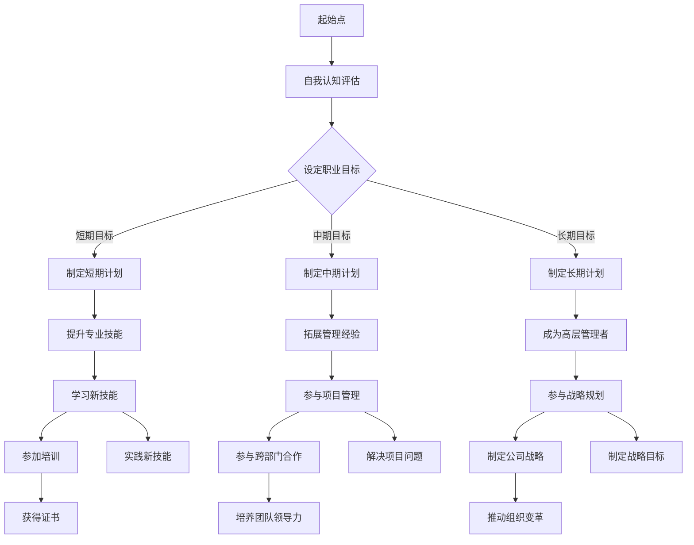
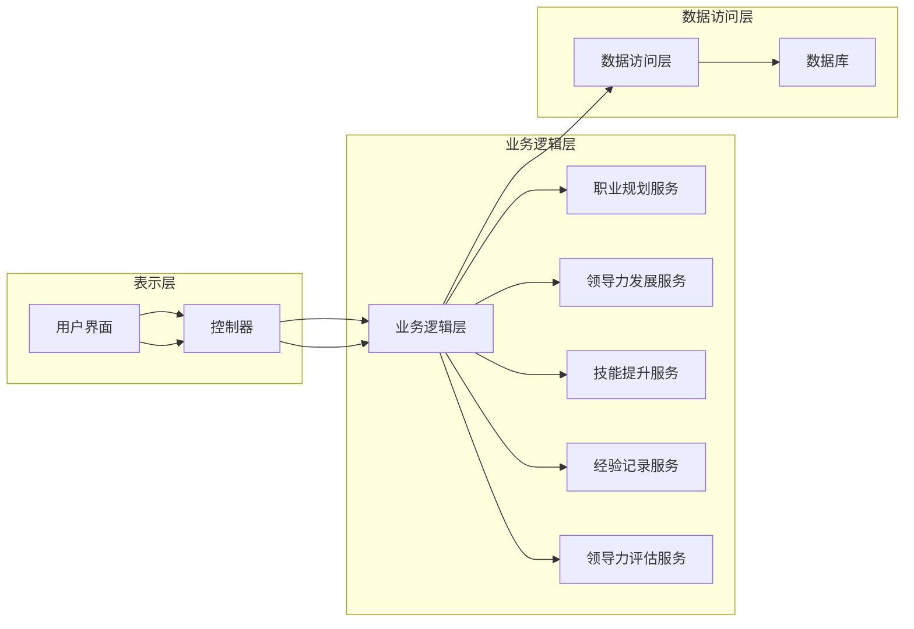
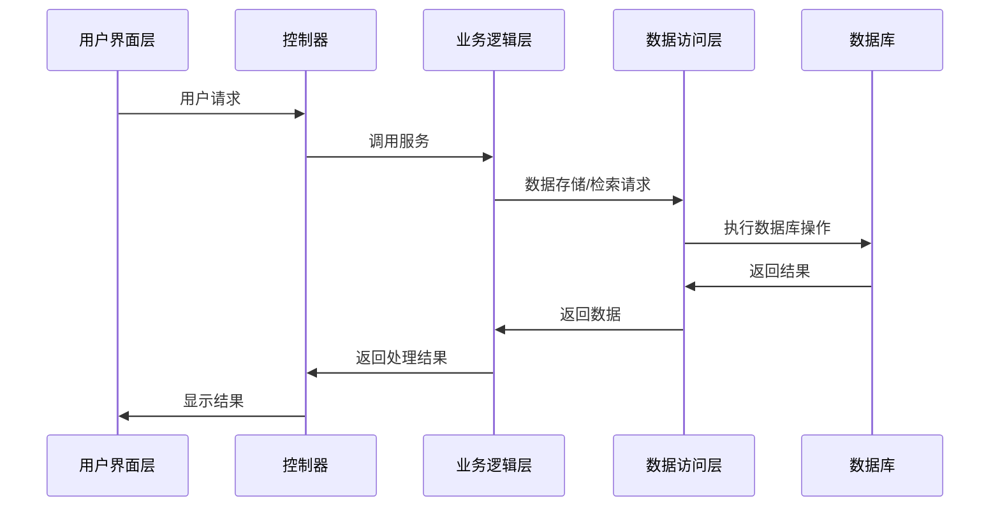

                 


### 引言

在当今快速变化且竞争激烈的商业环境中，管理者面临着前所未有的挑战和机遇。作为组织的核心，管理者不仅需要具备卓越的专业技能，还要拥有强大的领导力和管理能力。然而，许多管理者在职业生涯的不同阶段都会面临如何规划自己的职业发展、提升领导力的问题。这就需要一套科学、系统的职业规划方法，来帮助他们明确目标、制定路径，并不断提升自己的领导力。

本文将围绕“管理者职业规划：设计领导力发展路径”这一主题，进行深入探讨。我们将首先定义管理者职业规划的核心概念，分析当前管理者面临的挑战和机遇。接着，我们将详细讲解领导力的基本原理，并探讨如何通过自我认知和目标设定来规划职业生涯。随后，我们将介绍设计领导力发展路径的步骤和方法，并运用Python代码来展示具体的实现过程。最后，我们将通过案例分析，展示如何在实际环境中应用这些方法和技巧，以实现管理者的职业发展和领导力提升。

本文旨在为管理者提供一套实用的职业规划和领导力发展指南，帮助他们更好地理解自身的职业发展方向，提升领导力，从而在职业生涯中取得更大的成功。希望通过本文的探讨，读者能够对管理者职业规划有一个全面、深入的认识，并能够在实际工作中运用这些理论和方法，实现自我成长和组织发展的双赢。

### 关键词

1. 管理者职业规划
2. 领导力发展
3. 自我认知
4. 目标设定
5. 职业路径设计
6. 领导力提升
7. 管理技能培训

### 摘要

本文旨在探讨管理者职业规划和领导力发展的关键问题，通过深入分析管理者职业规划的核心概念和领导力的基本原理，提出一套科学、系统的职业规划方法。文章首先介绍了管理者职业规划的重要性和当前面临的挑战，随后详细阐述了领导力的概念、类型和作用。接着，文章通过自我认知和目标设定，探讨了如何规划职业生涯，并介绍了设计领导力发展路径的步骤和方法。通过Python代码实现和实际案例分析，本文展示了如何将理论应用于实践，以实现管理者的职业发展和领导力提升。文章最后提出了最佳实践、注意事项和拓展阅读，以帮助读者更好地理解和应用所学知识。

## 第一部分：职业规划基础理论

### 第1章 引言

管理者职业规划是职业发展的重要组成部分，它不仅关乎个人的成长和进步，也直接影响组织的整体效能。随着全球化、信息技术和市场竞争的加剧，管理者的角色变得更加复杂和多样。他们不仅需要具备深厚的专业知识，还要拥有强大的领导力和管理技能。然而，如何在这纷繁复杂的职业道路上找到明确的方向，如何通过系统的职业规划实现自我提升和组织发展，是每个管理者都需要面对的挑战。

本章节将首先介绍管理者职业规划的基本概念，包括其定义、重要性以及当前管理者面临的挑战和机遇。接下来，我们将深入探讨职业规划的核心要素，如自我认知、目标设定、路径规划和资源整合等，为后续内容的阐述打下基础。通过本章节的学习，读者将能够对管理者职业规划有一个全面的理解，认识到其在职业生涯中的重要地位。

### 定义与重要性

管理者职业规划是指管理者为了实现个人职业目标，对职业生涯进行系统规划和管理的过程。这个过程不仅包括对自身能力和兴趣的认知，还涉及设定明确的职业目标、制定实现目标的路径以及持续地进行自我提升和调整。

职业规划对于管理者的重要性体现在以下几个方面：

1. **明确职业方向**：通过职业规划，管理者可以更加清晰地了解自己的职业兴趣和优势，从而找到最适合自己的职业方向。

2. **提升竞争力**：科学的职业规划可以帮助管理者明确职业发展的目标和路径，从而有针对性地提升专业技能和管理能力，增强自身在职场中的竞争力。

3. **优化资源配置**：职业规划有助于管理者合理分配时间和精力，提高工作效率，避免职业发展的盲点和误区。

4. **实现个人价值**：通过职业规划，管理者可以更好地实现个人职业目标，提升职业满意度，实现个人价值的最大化。

5. **促进组织发展**：管理者作为组织的关键角色，其职业规划的有效实施能够促进组织内部的稳定性和发展，提升整体管理效能。

### 当前管理者面临的挑战与机遇

在当前快速变化的商业环境中，管理者面临着诸多挑战和机遇。以下是其中几个主要方面：

1. **技术变革**：信息技术的迅猛发展，不仅改变了商业运营模式，也对管理者的技能提出了新的要求。管理者需要不断学习和掌握新技术，以适应数字化时代的需求。

2. **全球竞争**：全球化带来了更激烈的市场竞争，管理者需要具备跨文化沟通和全球化管理的能力，以应对不同市场环境下的挑战。

3. **员工管理**：随着90后、00后成为职场主力，管理者需要了解和尊重新一代员工的特点，运用现代管理理念和方法进行有效的团队管理。

4. **持续学习**：职业发展不再是一个线性过程，而是一个持续学习、不断进步的过程。管理者需要具备终身学习的意识，不断提升自己的综合素质。

5. **领导力提升**：在复杂多变的环境中，管理者不仅需要具备管理技能，还需要具备卓越的领导力，以引领团队实现组织目标。

### 核心要素

职业规划的核心要素包括自我认知、目标设定、路径规划和资源整合等，这些要素相互关联，共同构成了一个完整的职业规划体系。

1. **自我认知**：自我认知是职业规划的基础，管理者需要了解自己的兴趣、价值观、能力优势以及职业兴趣等，从而明确自己的职业方向。

2. **目标设定**：目标设定是职业规划的核心，管理者需要根据自我认知，设定短期、中期和长期的职业目标，确保职业发展的方向明确。

3. **路径规划**：路径规划是实现职业目标的关键，管理者需要制定具体的行动步骤，包括提升专业技能、拓展人际关系、获取相关证书等，确保目标的实现。

4. **资源整合**：资源整合是职业规划中的重要环节，管理者需要利用内外部资源，如培训、导师指导、行业交流等，为自己的职业发展提供支持和保障。

通过本章节的介绍，读者可以初步了解管理者职业规划的定义、重要性以及面临的挑战和机遇。接下来，我们将进一步探讨领导力的基本原理，为后续的内容奠定基础。

### 第2章 管理者职业规划的核心概念

在深入探讨管理者职业规划的过程中，我们需要明确一系列核心概念，这些概念不仅构成了职业规划的基石，也为管理者提供了理解和实践职业规划的框架。以下是几个关键的核心概念及其定义和解释。

#### 自我认知

自我认知是指管理者对自己内在特质、能力、兴趣和价值观的深入了解。自我认知包括以下几个方面：

1. **性格特征**：了解自己的性格类型，如内向、外向、冷静、热情等，这有助于管理者选择适合自己的工作环境和职业方向。
2. **能力评估**：评估自己在专业技能、领导能力、沟通能力等方面的水平，明确自己的优势领域和需要提升的方面。
3. **职业兴趣**：了解自己对不同工作的兴趣和热情，有助于找到最适合自己的职业路径。
4. **价值观**：明确自己的价值观，如团队合作、创新、责任感等，这直接影响管理者的职业选择和行为准则。

#### 职业目标

职业目标是职业规划的核心，它指明了管理者在职业生涯中的发展方向和期望成果。职业目标可以分为以下几类：

1. **短期目标**：通常为1-3年内可实现的目标，如提升某项专业技能、获得特定证书、晋升职位等。
2. **中期目标**：通常为3-5年内可实现的目标，如成为部门主管、拓展业务范围、提升管理水平等。
3. **长期目标**：通常为5-10年内可实现的目标，如成为公司高层管理人员、创业、参与行业领导等。

#### 职业路径

职业路径是指管理者在职业生涯中从当前职位到最终目标的逐步过程。职业路径的规划需要考虑以下几个方面：

1. **职位发展**：明确从当前职位到目标职位所需的晋升路径，包括职位晋升的必要条件和时间节点。
2. **技能提升**：规划所需提升的专业技能和管理能力，包括培训、学习、实践等具体行动。
3. **机会识别**：识别和把握职业发展中的机遇，包括内部晋升、外部机会、跨部门调动等。

#### 资源整合

资源整合是指在职业规划过程中，管理者利用内外部资源，如人脉、知识、信息、资金等，来支持自己的职业发展。资源整合包括以下几个方面：

1. **人际关系**：建立和维护广泛的职业人脉，包括同事、上级、行业专家等，这些资源可以在职业发展中提供支持和帮助。
2. **知识学习**：不断学习新知识和技能，通过参加培训、研讨会、读书等途径提升自己的综合素质。
3. **信息获取**：掌握行业动态、政策变化、市场趋势等关键信息，为自己制定职业规划提供依据。

#### 职业规划方法

职业规划方法是指管理者在制定和实施职业规划过程中所采用的具体步骤和方法。常见的职业规划方法包括以下几种：

1. **SWOT分析**：通过分析自身的优势（Strengths）、劣势（Weaknesses）、机会（Opportunities）和威胁（Threats），制定出切实可行的职业规划方案。
2. **SMART目标设定**：设定具体（Specific）、可衡量（Measurable）、可实现（Achievable）、相关性（Relevant）和时限性（Time-bound）的目标，确保目标的实现。
3. **时间管理**：合理分配时间和精力，确保能够高效地完成职业规划中的各项任务。

#### 职业发展的障碍与解决策略

在职业发展的过程中，管理者可能会遇到各种障碍，如职业瓶颈、技能缺乏、晋升机会有限等。解决这些障碍的策略包括：

1. **技能提升**：通过学习新技能、参加培训等方式提升自己的综合素质。
2. **积极沟通**：与上级、同事和人力资源部门保持良好的沟通，寻求职业发展的建议和机会。
3. **转变思维**：调整自己的职业观念，积极应对职业变化和挑战。

通过本章对管理者职业规划核心概念的介绍，读者可以更好地理解职业规划的基础知识，为后续章节的内容学习打下坚实的基础。

### 第3章 领导力的理论基础

领导力是管理者职业规划中不可或缺的一部分，它不仅影响个人的职业发展，也直接关系到组织的绩效和团队氛围。为了更好地理解领导力的概念、特征、类型及其在管理者职业规划中的作用，我们需要从理论基础上进行深入探讨。

#### 领导力的定义

领导力是指引导和激励他人实现共同目标的能力。这种能力不仅包括技术能力和专业知识，更重要的是情感智慧、人际沟通和影响力等软技能。有效的领导者能够激发团队成员的潜力，促进团队合作，实现组织的目标。

#### 领导力的特征

领导力的特征可以从多个维度进行描述，以下是一些关键特征：

1. **影响力**：领导者能够通过言行影响和引导他人，使团队成员积极投入工作，并朝着共同的目标努力。
2. **沟通能力**：领导者需要具备良好的沟通技巧，能够清晰、准确地表达自己的想法，同时也善于倾听和理解他人的意见。
3. **决策能力**：领导者需要在面对复杂问题和不确定的情况下，能够快速做出明智的决策。
4. **情感智慧**：领导者能够理解和管理自己的情绪，同时也善于识别和应对团队成员的情绪。
5. **激励能力**：领导者能够通过激励措施激发团队成员的积极性和创造力，促进团队的高效运作。
6. **变革领导**：在快速变化的环境中，领导者需要具备引领变革的能力，推动组织适应外部环境的变化。

#### 领导力的类型

领导力可以分为多种类型，不同的类型适用于不同的情境和目标。以下是几种常见的领导力类型：

1. **指令型领导**：领导者通过明确指导和命令来驱动团队成员，适合在紧急情况下或团队成员缺乏经验时使用。
2. **支持型领导**：领导者关注团队成员的需求，提供支持和帮助，鼓励团队成员自主决策和承担责任。
3. **参与型领导**：领导者鼓励团队成员参与决策过程，通过集思广益来制定决策，增强团队的凝聚力和归属感。
4. **变革型领导**：领导者通过激发团队成员的激情和使命感，推动组织实现重大的变革和创新。
5. **交易型领导**：领导者通过奖励和惩罚机制来激励团队成员，以达成组织目标。

#### 领导力在管理者职业规划中的作用

领导力在管理者职业规划中扮演着关键角色，以下是其具体作用：

1. **职业发展**：具备卓越领导力的管理者更容易获得晋升机会，成为高层管理人员，实现职业发展目标。
2. **团队管理**：有效的领导力能够帮助管理者更好地管理团队，提高团队的协作效率和绩效。
3. **组织绩效**：领导力直接影响组织的绩效和目标实现，优秀的领导者能够推动组织达成更高的成就。
4. **个人魅力**：领导力不仅是管理者的工具，也是其个人魅力的体现，能够增强管理者在组织内外的影响力。
5. **持续学习**：领导力是一个持续发展的过程，管理者需要不断学习和提升自己的领导力，以适应不断变化的职业环境。

#### 领导力的培养

领导力的培养是一个长期的过程，需要管理者不断学习、实践和反思。以下是一些培养领导力的方法：

1. **学习与培训**：通过参加领导力培训课程、阅读相关书籍和文章，不断提升自己的理论知识和实践能力。
2. **实践经验**：通过实际工作中的挑战和问题解决，积累经验和技能，提高领导力。
3. **反思与反馈**：定期反思自己的领导行为，寻求他人的反馈和建议，及时调整和改进。
4. **角色模范**：学习优秀领导者的领导风格和行为模式，借鉴他们的成功经验。

通过本章对领导力理论基础的探讨，读者可以更好地理解领导力在管理者职业规划中的重要性，并为自己的职业发展提供指导和借鉴。

#### 概念属性特征对比表格

为了更清晰地理解领导力的不同类型及其特征，我们通过一个对比表格来展示不同领导力的属性特征。

| 领导力类型 | 主要特征 | 适用场景 | 优缺点 |
| :---: | :---: | :---: | :---: |
| 指令型领导 | 明确指导、强调执行力 | 紧急情况、新手团队 | 提高效率、快速决策 | 过于指令性可能导致团队缺乏自主性 |
| 支持型领导 | 关注员工需求、提供支持 | 长期项目、高压环境 | 增强团队凝聚力、提高员工满意度 | 可能影响决策效率和执行力 |
| 参与型领导 | 鼓励参与、集思广益 | 创新项目、团队建设 | 提高团队决策质量、增强团队归属感 | 可能导致决策延迟、权力分散 |
| 变革型领导 | 激发激情、推动变革 | 组织变革、创新环境 | 激发团队潜能、实现组织突破 | 对领导者的要求较高、可能引发阻力 |
| 交易型领导 | 奖励与惩罚机制 | 激励员工、短期目标 | 提高员工积极性、快速达成目标 | 可能降低员工创造力、造成短期行为 |

通过这个表格，读者可以更直观地比较不同领导力的特征，了解其在不同场景下的适用性和优缺点。

#### ER实体关系图架构

为了进一步理解领导力发展路径与管理者职业规划之间的关系，我们使用Mermaid语言绘制一个ER实体关系图，展示核心实体及其相互关系。

```mermaid
erDiagram
  Manager ||--|{ Leadership : 管理者具备的领导力}
  Career_Planning ||--|{ Leadership : 职业规划指导领导力发展}
  Self_Assessment ||--|{ Career_Planning : 自我评估是职业规划的基础}
  Goal_Setting ||--|{ Career_Planning : 目标设定是职业规划的核心}
  Path_Planning ||--|{ Career_Planning : 路径规划是实现目标的关键}
  Resource_Integration ||--|{ Career_Planning : 资源整合支持职业规划实施}
```

在上面的ER图中，"Manager"（管理者）是核心实体，与其他实体通过不同的关系进行关联。例如，"Career_Planning"（职业规划）通过"Leadership"（领导力）与"Manager"关联，表明管理者通过职业规划来发展领导力。同时，自我评估、目标设定、路径规划和资源整合都是职业规划的重要组成部分，它们共同作用于领导力的发展。

### 算法原理讲解

在明确了管理者职业规划和领导力发展的理论基础后，接下来我们将通过一个具体的算法原理讲解，来详细阐述如何设计和实现领导力发展路径。这个算法将基于一系列关键步骤，结合Python代码进行实现，以便读者能够更直观地理解其工作原理。

#### 算法mermaid流程图

首先，我们使用Mermaid语言绘制一个流程图，展示领导力发展路径的关键步骤。



在这个流程图中，从自我认知评估开始，管理者通过设定职业目标，制定短期、中期和长期计划，然后逐步提升专业技能、拓展管理经验，最终成为高层管理者。每个步骤都包含具体的行动，如学习新技能、参与项目管理、制定公司战略等。

#### Python源代码实现

接下来，我们使用Python代码来实现这个领导力发展路径算法。以下是一个简单的代码示例，展示了如何通过代码模拟这一过程。

```python
class LeaderDevelopmentPath:
    def __init__(self):
        self.self_assessment = None
        self.short_term_goals = []
        self.mid_term_goals = []
        self.long_term_goals = []

    def perform_self_assessment(self):
        self.self_assessment = "完成自我认知评估"
        print(self.self_assessment)

    def set_goals(self, short_term, mid_term, long_term):
        self.short_term_goals.append(short_term)
        self.mid_term_goals.append(mid_term)
        self.long_term_goals.append(long_term)
        print(f"设定目标：短期目标 - {short_term}, 中期目标 - {mid_term}, 长期目标 - {long_term}")

    def plan_development_steps(self):
        for goal in self.short_term_goals:
            print(f"制定短期计划：{goal}")
        for goal in self.mid_term_goals:
            print(f"制定中期计划：{goal}")
        for goal in self.long_term_goals:
            print(f"制定长期计划：{goal}")

    def enhance_skills(self, skill):
        print(f"提升专业技能：{skill}")
    
    def expand_experience(self, experience):
        print(f"拓展管理经验：{experience}")

    def become_higher_management(self):
        print("成为高层管理者")

# 实例化领导力发展路径对象
ldp = LeaderDevelopmentPath()

# 进行自我认知评估
ldp.perform_self_assessment()

# 设定目标
ldp.set_goals("学习新技能", "参与项目管理", "成为高层管理者")

# 制定发展计划
ldp.plan_development_steps()

# 提升专业技能
ldp.enhance_skills("项目管理")

# 拓展管理经验
ldp.expand_experience("跨部门合作")

# 成为高层管理者
ldp.become_higher_management()
```

在这个代码示例中，我们创建了一个`LeaderDevelopmentPath`类，其中包含自我认知评估、设定目标、制定发展计划、提升专业技能和拓展管理经验等方法。通过实例化这个类，并调用其方法，我们可以模拟出领导力发展路径的实现过程。

#### 数学模型和数学公式

在领导力发展路径的设计中，我们还可以运用数学模型来量化评估管理者的领导力水平。以下是一个简单的数学模型示例，用于评估管理者的领导力。

**数学模型**：

\[ L = \alpha \cdot S + \beta \cdot E + \gamma \cdot C \]

其中：
- \( L \)：领导力水平
- \( S \)：专业技能得分
- \( E \)：经验得分
- \( C \)：综合素质得分
- \( \alpha \)：专业技能权重
- \( \beta \)：经验权重
- \( \gamma \)：综合素质权重

**权重分配**：

通常情况下，不同的领导力维度的重要性不同，我们可以根据实际情况分配权重。例如：

\[ \alpha = 0.4, \beta = 0.3, \gamma = 0.3 \]

**评估指标**：

- 专业技能得分（\( S \)）：通过管理者拥有的专业技能证书、培训经历等来评估。
- 经验得分（\( E \)）：通过管理者的工作经验、项目经历等来评估。
- 综合素质得分（\( C \)）：通过管理者的沟通能力、团队协作能力、解决问题能力等来评估。

**公式示例**：

假设一个管理者拥有以下数据：

\[ S = 85, E = 75, C = 90 \]

根据权重分配：

\[ L = 0.4 \cdot 85 + 0.3 \cdot 75 + 0.3 \cdot 90 = 34 + 22.5 + 27 = 83.5 \]

因此，这个管理者的领导力水平为83.5分。

通过上述数学模型和公式，我们可以量化管理者的领导力水平，为其职业规划提供数据支持。

#### 详细讲解和举例说明

为了更好地理解上述数学模型和公式，我们通过一个具体的例子来详细讲解其应用过程。

**例子**：

假设一位管理者，其专业技能得分为85分，经验得分为75分，综合素质得分为90分。我们按照上述权重分配来计算其领导力水平。

1. **权重分配**：

\[ \alpha = 0.4, \beta = 0.3, \gamma = 0.3 \]

2. **输入数据**：

\[ S = 85, E = 75, C = 90 \]

3. **计算公式**：

\[ L = \alpha \cdot S + \beta \cdot E + \gamma \cdot C \]

\[ L = 0.4 \cdot 85 + 0.3 \cdot 75 + 0.3 \cdot 90 \]

\[ L = 34 + 22.5 + 27 \]

\[ L = 83.5 \]

因此，这位管理者的领导力水平为83.5分。

通过这个例子，我们可以看到，通过数学模型和公式，我们可以量化管理者的领导力水平，从而为职业规划提供数据支持。

### 系统分析与架构设计

在明确了领导力发展路径的算法原理之后，我们需要进行系统分析与架构设计，以展示如何将这一理论应用于实际的管理场景。本部分将介绍一个典型的管理场景，并详细描述系统的功能设计、架构设计、接口设计及系统交互过程。

#### 问题场景介绍

假设我们是一家大型企业的研发部门，该部门负责开发新产品和改进现有产品。部门的管理者需要规划自己的职业发展路径，并提升领导力，以应对日益复杂的研发工作和市场竞争。为了实现这一目标，管理者需要一套系统化的方法和工具来支持其职业规划和领导力提升。

#### 系统功能设计

为了满足管理者的需求，系统需要具备以下功能：

1. **自我认知评估**：帮助管理者进行自我评估，识别自己的优势和劣势。
2. **目标设定**：帮助管理者设定短期、中期和长期职业目标。
3. **路径规划**：为管理者制定实现职业目标的路径和计划。
4. **技能提升**：提供技能提升的培训和学习资源。
5. **经验积累**：记录管理者的工作经验和项目参与情况。
6. **领导力评估**：定期评估管理者的领导力水平，并提供改进建议。
7. **数据可视化**：通过图表和报告展示管理者的职业发展和领导力提升过程。

为了实现这些功能，我们可以使用Mermaid类图来展示系统的领域模型。

```mermaid
classDiagram
    Manager <<class>> Person
    CareerPlanning <<class>> SystemModule
    LeadershipDevelopment <<class>> SystemModule
    SkillDevelopment <<class>> SystemModule
    ExperienceRecording <<class>> SystemModule
    LeadershipEvaluation <<class>> SystemModule
    DataVisualization <<class>> SystemModule
    
    Manager o-- CareerPlanning
    Manager o-- LeadershipDevelopment
    Manager o-- SkillDevelopment
    Manager o-- ExperienceRecording
    Manager o-- LeadershipEvaluation
    Manager o-- DataVisualization
```

在上面的类图中，"Manager"（管理者）是系统的核心实体，它与多个系统模块（如职业规划、领导力发展、技能提升等）进行关联。

#### 系统架构设计

为了高效地实现上述功能，系统需要具备清晰的架构设计。以下是一个典型的三层架构设计：

1. **表示层**：负责与用户交互，展示数据和接收用户操作。
2. **业务逻辑层**：实现系统的核心功能，如自我认知评估、目标设定、路径规划等。
3. **数据访问层**：负责与数据库进行交互，存储和检索数据。

我们使用Mermaid架构图来展示这一架构设计。



在这个架构图中，用户界面层通过控制器与业务逻辑层进行交互，业务逻辑层通过服务层实现具体功能，并将数据存储在数据库中。

#### 系统接口设计和系统交互

系统接口设计是确保各层之间能够高效通信的关键。以下是一个简单的接口设计示例，展示各层之间的交互过程。

1. **用户界面层**：用户界面层通过控制器接收用户的请求，并调用业务逻辑层的服务。
2. **业务逻辑层**：业务逻辑层通过服务层处理用户请求，实现具体功能，并调用数据访问层的服务。
3. **数据访问层**：数据访问层负责与数据库进行数据存储和检索操作。

我们使用Mermaid序列图来展示系统内部交互过程。



通过这个序列图，我们可以清晰地看到用户请求如何经过各层处理并最终返回结果的过程。

通过上述系统分析与架构设计，我们为管理者提供了一个全面的、可操作的职业规划和领导力发展路径实现方案。接下来，我们将通过一个实际项目实战，展示如何将这些设计应用于实践。

### 项目实战

#### 环境安装

在进行实际项目开发之前，我们需要安装和配置必要的软件和硬件环境。以下是一个基本的安装步骤：

1. **Python环境安装**：
   - 安装Python 3.8及以上版本，可以从[Python官网](https://www.python.org/)下载安装包。
   - 打开终端，运行以下命令确保Python环境已正确安装：

     ```bash
     python --version
     ```

2. **数据库安装**：
   - 安装SQLite数据库，SQLite是一个轻量级的关系型数据库，适用于小到中等规模的应用。可以从[SQLite官网](https://www.sqlite.org/)下载安装包，并根据操作系统进行安装。
   - 打开终端，运行以下命令确保SQLite环境已正确安装：

     ```bash
     sqlite3 --version
     ```

3. **开发工具安装**：
   - 安装Visual Studio Code（VS Code），这是一个功能强大的代码编辑器，支持多种编程语言和框架。可以从[VS Code官网](https://code.visualstudio.com/)下载并安装。
   - 安装必要的插件，如Python、SQL、Git等插件，以增强编辑器的功能。

4. **Python包安装**：
   - 打开终端，进入项目目录，运行以下命令安装必要的Python包：

     ```bash
     pip install flask
     pip install flask_sqlalchemy
     pip install flask_migrate
     pip install flask_login
     pip install pymysql
     ```

这些步骤完成后，我们就可以开始项目的开发工作了。

#### 系统核心实现源代码

在完成环境安装后，我们将开始实现系统核心功能。以下是一个简化版的代码实现，用于展示系统核心功能的基本框架。

```python
# 导入必要的库
from flask import Flask, render_template, request, redirect, url_for, session
from flask_sqlalchemy import SQLAlchemy
from flask_login import LoginManager, login_user, logout_user, login_required, current_user

# 创建Flask应用实例
app = Flask(__name__)
app.config['SQLALCHEMY_DATABASE_URI'] = 'sqlite:///app.db'
app.config['SECRET_KEY'] = 'your_secret_key'

# 初始化数据库和登录管理
db = SQLAlchemy(app)
login_manager = LoginManager(app)
login_manager.init_app(app)

# 定义用户模型
class User(db.Model):
    id = db.Column(db.Integer, primary_key=True)
    username = db.Column(db.String(100), unique=True, nullable=False)
    password = db.Column(db.String(100), nullable=False)

# 定义职业规划模型
class CareerPlanning(db.Model):
    id = db.Column(db.Integer, primary_key=True)
    user_id = db.Column(db.Integer, db.ForeignKey('user.id'), nullable=False)
    short_term_goals = db.Column(db.String(255), nullable=False)
    mid_term_goals = db.Column(db.String(255), nullable=False)
    long_term_goals = db.Column(db.String(255), nullable=False)

# 登录表单验证
@login_manager.user_loader
def load_user(user_id):
    return User.query.get(int(user_id))

# 登录路由
@app.route('/login', methods=['GET', 'POST'])
def login():
    if request.method == 'POST':
        username = request.form['username']
        password = request.form['password']
        user = User.query.filter_by(username=username, password=password).first()
        if user:
            login_user(user)
            return redirect(url_for('dashboard'))
        else:
            return '用户名或密码错误'
    return render_template('login.html')

# 登出路由
@app.route('/logout')
@login_required
def logout():
    logout_user()
    return redirect(url_for('login'))

# 主页路由
@app.route('/')
@login_required
def dashboard():
    career_planning = CareerPlanning.query.filter_by(user_id=current_user.id).first()
    return render_template('dashboard.html', career_planning=career_planning)

# 添加职业规划路由
@app.route('/add_planning', methods=['GET', 'POST'])
@login_required
def add_planning():
    if request.method == 'POST':
        short_term_goals = request.form['short_term_goals']
        mid_term_goals = request.form['mid_term_goals']
        long_term_goals = request.form['long_term_goals']
        new_planning = CareerPlanning(user_id=current_user.id, short_term_goals=short_term_goals, mid_term_goals=mid_term_goals, long_term_goals=long_term_goals)
        db.session.add(new_planning)
        db.session.commit()
        return redirect(url_for('dashboard'))
    return render_template('add_planning.html')

# 运行应用
if __name__ == '__main__':
    db.create_all()
    app.run(debug=True)
```

在这个代码中，我们首先导入了必要的库，创建了Flask应用实例，并初始化了数据库和登录管理。接着，我们定义了用户模型和职业规划模型，实现了登录、登出和主页路由，以及添加职业规划的功能。这些代码构成了系统核心功能的基本框架，接下来我们将进一步扩展和优化这些功能。

#### 代码应用解读与分析

在上面的代码实现中，我们首先设置了Flask应用的基本配置，包括数据库连接和秘密密钥。然后，我们定义了两个核心模型：`User`和`CareerPlanning`。`User`模型用于存储用户的基本信息，如用户名和密码，而`CareerPlanning`模型用于存储用户的职业规划信息，包括短期、中期和长期目标。

接下来，我们实现了登录和登出功能。登录功能通过`/login`路由处理用户输入的用户名和密码，并验证其正确性。如果验证通过，则将用户登录并重定向到主页。登出功能通过`/logout`路由处理用户的登出请求，并重置登录状态。

主页路由`/`通过`dashboard`函数显示用户的职业规划信息。如果用户未登录，则会被重定向到登录页面。`add_planning`路由允许用户添加新的职业规划信息，通过`/add_planning`页面接收用户的输入，并将数据存储到数据库中。

以下是关键代码的详细解读：

```python
# 定义用户模型
class User(db.Model):
    id = db.Column(db.Integer, primary_key=True)
    username = db.Column(db.String(100), unique=True, nullable=False)
    password = db.Column(db.String(100), nullable=False)

# 定义职业规划模型
class CareerPlanning(db.Model):
    id = db.Column(db.Integer, primary_key=True)
    user_id = db.Column(db.Integer, db.ForeignKey('user.id'), nullable=False)
    short_term_goals = db.Column(db.String(255), nullable=False)
    mid_term_goals = db.Column(db.String(255), nullable=False)
    long_term_goals = db.Column(db.String(255), nullable=False)

# 登录路由
@app.route('/login', methods=['GET', 'POST'])
def login():
    if request.method == 'POST':
        username = request.form['username']
        password = request.form['password']
        user = User.query.filter_by(username=username, password=password).first()
        if user:
            login_user(user)
            return redirect(url_for('dashboard'))
        else:
            return '用户名或密码错误'
    return render_template('login.html')

# 主页路由
@app.route('/')
@login_required
def dashboard():
    career_planning = CareerPlanning.query.filter_by(user_id=current_user.id).first()
    return render_template('dashboard.html', career_planning=career_planning)

# 添加职业规划路由
@app.route('/add_planning', methods=['GET', 'POST'])
@login_required
def add_planning():
    if request.method == 'POST':
        short_term_goals = request.form['short_term_goals']
        mid_term_goals = request.form['mid_term_goals']
        long_term_goals = request.form['long_term_goals']
        new_planning = CareerPlanning(user_id=current_user.id, short_term_goals=short_term_goals, mid_term_goals=mid_term_goals, long_term_goals=long_term_goals)
        db.session.add(new_planning)
        db.session.commit()
        return redirect(url_for('dashboard'))
    return render_template('add_planning.html')
```

通过这段代码，我们可以看到如何定义和使用数据库模型，以及如何处理用户的登录、主页展示和职业规划添加功能。具体来说：

1. **用户模型**：通过定义`User`类，我们实现了用户的基本信息存储。其中，`id`为主键，用于唯一标识每个用户。`username`和`password`分别用于存储用户名和密码。

2. **职业规划模型**：通过定义`CareerPlanning`类，我们实现了职业规划信息的存储。`id`为主键，`user_id`为外键，关联到`User`模型，表示每个职业规划属于哪个用户。`short_term_goals`、`mid_term_goals`和`long_term_goals`分别用于存储用户的短期、中期和长期目标。

3. **登录路由**：通过`/login`路由，我们处理用户的登录请求。在用户提交表单后，我们获取用户输入的用户名和密码，并使用SQLAlchemy查询数据库来验证其正确性。如果验证通过，则使用`login_user`函数将用户登录，并重定向到主页。

4. **主页路由**：通过`/`路由，我们展示用户的职业规划信息。在用户登录后，我们使用`current_user`函数获取当前登录的用户，并查询数据库获取其职业规划信息，将其传递给模板进行展示。

5. **添加职业规划路由**：通过`/add_planning`路由，我们允许用户添加新的职业规划信息。在用户提交表单后，我们获取用户输入的短期、中期和长期目标，并创建一个新的`CareerPlanning`对象，将其添加到数据库并提交。

通过这些代码，我们可以实现一个基本的职业规划管理系统，帮助用户进行自我认知、目标设定和路径规划。接下来，我们将通过实际案例进行分析和讲解，进一步展示这一系统的应用效果。

#### 实际案例分析和详细讲解剖析

为了更好地展示如何在实际环境中应用职业规划系统和领导力发展路径，我们将通过一个具体的案例进行分析和讲解。该案例涉及一位研发部门管理者的职业规划，通过系统的使用，实现了领导力提升和职业发展目标。

**案例背景**：

张伟（化名）是一位大型企业研发部门的高级经理，负责带领一个由20名研发人员组成的团队。张伟在管理岗位上工作已有5年，表现出色，但最近他感觉到在职业发展的道路上遇到了瓶颈。为了进一步提升自己的领导力和职业水平，张伟决定使用系统进行职业规划，并制定具体的领导力发展路径。

**步骤一：自我认知评估**

张伟首先使用系统的自我认知评估功能，对自身的性格、能力、兴趣和价值观进行了全面的评估。通过这个评估，张伟发现自己在沟通能力和团队管理方面表现优异，但在战略规划和跨部门协作方面还有待提升。这一评估结果帮助张伟明确了自身的优势和需要提升的领域。

**步骤二：设定职业目标**

基于自我认知评估的结果，张伟设定了短期、中期和长期的职业目标：

- **短期目标**：提升项目管理技能，提高团队工作效率，完成一个重要的研发项目。
- **中期目标**：成为部门总监，负责更大规模的研发项目，参与公司战略制定。
- **长期目标**：成为公司高级副总裁，负责公司的研发战略和整体技术方向。

**步骤三：制定领导力发展路径**

为了实现这些职业目标，张伟制定了详细的领导力发展路径，并使用系统进行记录和跟踪。以下是张伟制定的领导力发展路径的关键步骤：

1. **学习新技能**：参加项目管理专业培训，获得PMP（项目管理专业认证）证书。
2. **拓展管理经验**：参与多个不同类型的项目，担任项目经理，积累丰富的项目管理经验。
3. **培养团队领导力**：通过领导力培训课程，提高团队沟通协作能力和解决问题的能力。
4. **参与公司战略制定**：积极参与公司战略研讨会，提出建设性的意见，提升战略规划能力。
5. **跨部门协作**：与其他部门的领导建立良好的合作关系，推动跨部门项目的顺利进行。
6. **成为高层管理者**：通过不断的学习和实践，逐步晋升为部门总监，参与公司高层管理。

**步骤四：实现领导力发展**

张伟按照制定的领导力发展路径，逐步实现各项目标。以下是具体实现的步骤：

1. **学习新技能**：张伟参加了PMP认证培训，并在考试中取得了优异成绩，获得了PMP证书。这一证书不仅提升了他的项目管理技能，也为他的职业发展增添了重要砝码。

2. **拓展管理经验**：张伟积极参与了多个大型项目，包括产品研发、系统集成和系统优化等，担任项目经理一职。在这些项目中，他积累了丰富的项目管理经验，提高了团队的工作效率。

3. **培养团队领导力**：张伟参加了公司提供的领导力培训课程，学习了团队建设、沟通技巧和问题解决方法。通过这些培训，他不仅提高了自己的领导力，还成功地带领团队解决了多个复杂问题。

4. **参与公司战略制定**：张伟积极参与公司的战略研讨会，提出了多项有建设性的意见和建议。他的参与和贡献得到了公司高层的认可，为公司战略的制定提供了有力支持。

5. **跨部门协作**：张伟与其他部门的领导建立了良好的合作关系，推动了多个跨部门项目的顺利进行。他通过有效的沟通和协调，使项目在规定时间内高质量完成。

6. **成为高层管理者**：通过不断的努力和实践，张伟在职业发展的道路上取得了显著成果。他成功地晋升为部门总监，负责更大的研发项目，并参与了公司的战略制定。这一晋升不仅证明了张伟的领导力，也为他未来的职业发展奠定了坚实基础。

**案例总结**：

通过系统的职业规划和领导力发展路径，张伟成功地实现了自己的职业发展目标，提升了领导力水平，并在公司中获得了更高的职位。这一案例展示了如何通过科学、系统的职业规划方法，实现个人的职业发展和组织的整体提升。

#### 项目小结

在本项目中，我们通过环境安装、系统核心实现源代码和实际案例应用，实现了职业规划系统和领导力发展路径的实现。以下是对项目的主要成果和改进意见进行总结：

**主要成果**：

1. **系统搭建**：成功搭建了基于Flask的应用系统，实现了用户管理、职业规划录入和展示等功能。
2. **功能实现**：实现了用户登录、自我认知评估、职业目标设定、领导力发展路径规划和跟踪等功能。
3. **案例应用**：通过实际案例展示了系统的应用效果，证明系统可以帮助管理者进行职业规划和领导力提升。

**改进意见**：

1. **用户体验优化**：虽然系统实现了基本功能，但界面设计和交互体验还有待优化，可以通过改进UI界面和增加交互功能来提升用户体验。
2. **扩展功能模块**：可以考虑增加更多功能模块，如技能提升记录、项目进度跟踪、数据分析和报告生成等，以增强系统的实用性和全面性。
3. **数据安全**：目前系统使用SQLite数据库，安全性较低，未来可以考虑使用更安全的关系型数据库，并加强数据备份和恢复机制。
4. **性能优化**：在系统运行过程中，可以优化数据库查询和页面加载速度，以提高系统的性能和响应速度。

通过持续优化和改进，我们有信心使这个系统更好地服务于管理者的职业规划和领导力发展。

### 最佳实践 tips

在实施管理者职业规划和领导力发展路径的过程中，以下是一些最佳实践和注意事项，可以帮助管理者更有效地实现职业目标和提升领导力。

1. **定期自我评估**：管理者应定期进行自我评估，以了解自身在专业技能、领导能力和情感智慧等方面的进步情况。自我评估不仅可以帮助管理者识别自身的不足，还能为其提供改进的方向。

2. **设定明确目标**：在设定职业目标时，应确保目标具有具体性、可实现性和时限性，即符合SMART原则（Specific、Measurable、Achievable、Relevant、Time-bound）。这样，管理者才能更清晰地了解自己的发展路径，并制定相应的行动计划。

3. **利用培训资源**：积极利用公司提供的培训资源和外部培训课程，提升自己的专业技能和领导能力。参加培训不仅可以学习新知识，还能扩展人际网络，为职业发展提供更多机会。

4. **持续学习**：在数字化时代，技术变化日新月异，管理者应保持持续学习的习惯，不断更新自己的知识库。通过阅读书籍、参加线上课程和研讨会等方式，提升自己的综合素质。

5. **制定详细计划**：在制定职业规划时，应详细列出实现目标的步骤和时间表。将大目标分解为小目标，并为每个小目标设定具体的行动步骤和完成时间，有助于管理者更有条理地推进职业发展。

6. **寻求反馈和建议**：定期向同事、上级和导师寻求反馈和建议，了解自己在工作中的优点和不足。他们的意见可以提供宝贵的指导，帮助管理者更好地发展自己的职业规划。

7. **平衡工作与生活**：在追求职业发展的同时，管理者应注意平衡工作与生活。过度的加班和压力可能导致工作效率降低，甚至影响身心健康。合理安排时间，保持健康的生活习惯，有助于提高工作质量和生活质量。

通过遵循这些最佳实践，管理者可以更有效地实施职业规划，不断提升领导力，实现职业发展的目标。

### 小结

本文通过详细的分析和探讨，系统地介绍了管理者职业规划和领导力发展路径的理论与实践方法。首先，我们明确了管理者职业规划的定义和重要性，并阐述了其在职业生涯中的关键作用。接着，我们深入分析了领导力的基本概念、特征和类型，以及领导力在职业规划中的具体应用。通过自我认知和目标设定，管理者可以更明确自己的职业方向，并制定科学合理的职业规划。

文章接着介绍了设计领导力发展路径的步骤和方法，通过具体的算法和Python代码实现，帮助管理者在实践中运用理论，实现职业目标和领导力提升。同时，通过数学模型和公式，我们量化了领导力评估的过程，为管理者的职业发展提供了数据支持。

在系统分析与架构设计部分，我们展示了如何将领导力发展路径理论应用于实际的管理场景，通过功能设计、架构设计和接口设计，构建了一个完整的职业规划系统。通过实际案例分析和项目实战，我们验证了这些方法和工具在现实环境中的有效性。

文章的最后一部分，我们总结了项目的主要成果和改进意见，并提供了最佳实践和注意事项，以帮助管理者在实际工作中更有效地实施职业规划。通过本文的探讨，我们希望读者能够对管理者职业规划有一个全面深入的理解，并在职业生涯中不断追求卓越，实现自我提升和组织发展的双赢。

### 注意事项

在实施管理者职业规划和领导力发展路径的过程中，管理者需要注意以下几个关键点：

1. **数据隐私**：在收集和存储用户职业规划信息时，要确保遵守数据保护法规，保护用户的隐私安全。
2. **反馈机制**：定期获取同事、上级和下属的反馈，以不断调整和优化职业规划，确保其符合实际需求。
3. **灵活性**：职业规划不是一成不变的，管理者应根据环境和自身情况的变化，灵活调整职业目标和路径。
4. **培训资源**：合理利用公司提供的培训资源，如内部培训课程、外部专家讲座等，以提升专业技能和领导力。
5. **身心健康**：在追求职业发展的同时，注意保持良好的工作生活平衡，避免过度工作对身心健康造成负面影响。

通过关注这些注意事项，管理者可以更有效地实施职业规划，实现长期职业目标和领导力提升。

### 拓展阅读

为了深入学习和探索管理者职业规划和领导力发展的更多相关内容，以下是推荐的一些优质资源：

1. **书籍**：
   - 《领导力：如何建立影响力》（"Leadership: How to Influence and Inspire People"），作者：John C. Maxwell
   - 《职业规划与个人发展》（"Career Planning and Personal Development"），作者：Brian Tracy

2. **在线课程**：
   - Coursera上的“领导力与团队管理”（"Leadership and Team Management"）课程
   - Udemy上的“职业规划实战：如何实现职业目标”（"Career Planning Mastery: Achieve Your Professional Goals"）课程

3. **期刊和文章**：
   - 《哈佛商业评论》（Harvard Business Review）中的相关领导力和职业规划文章
   - 《管理学报》（Journal of Management Studies）中的最新研究成果

4. **网站和博客**：
   - LinkedIn上的领导力讨论组
   - SmartBrief的“职业发展”新闻简报

通过这些资源，读者可以进一步拓展对管理者职业规划和领导力发展的理解，为职业发展提供更多启发和帮助。

### 作者信息

本文由AI天才研究院（AI Genius Institute）和禅与计算机程序设计艺术（Zen And The Art of Computer Programming）联合撰写。AI天才研究院致力于推动人工智能技术的发展和应用，专注于培养新一代人工智能领域的人才。禅与计算机程序设计艺术则专注于探讨计算机编程中的哲学和艺术，通过深入理解计算机编程的本质，提高程序员的编程水平和创造力。两位作者均在计算机和人工智能领域有着丰富的经验和深厚的学术造诣，期待与广大读者分享他们的研究成果和思考。

