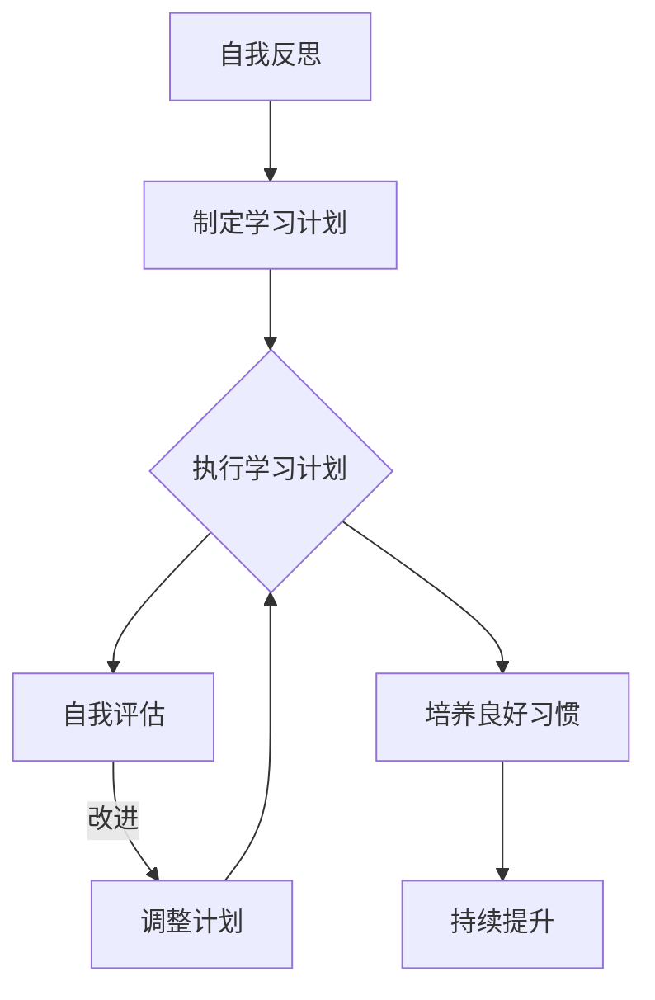
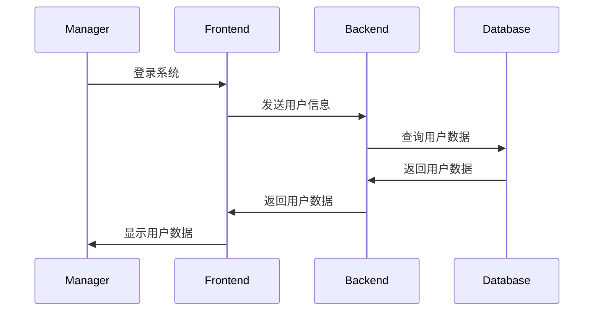
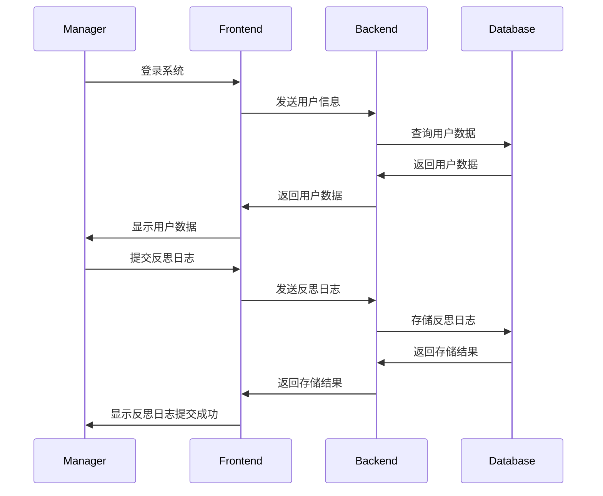

                 

# 管理者自我修炼：提升领导能力的习惯

> 关键词：领导力，自我提升，习惯养成，管理者发展

> 摘要：本文旨在探讨管理者如何通过自我修炼来提升领导能力。通过分析领导力的核心概念、管理者面临的挑战、以及有效的领导习惯养成策略，本文为管理者提供了一系列实用指南和具体行动步骤。

## 引言

在现代企业管理中，领导力是一个关键因素，它直接影响着团队的效率、创新能力和整体绩效。然而，许多管理者在追求卓越的领导力过程中，常常感到困惑和无力。本篇文章将围绕《管理者自我修炼：提升领导能力的习惯》这一主题，深入探讨领导者如何通过自我修炼来提升自身的领导力。

本文将分为以下几个部分：

1. **领导力的核心概念**：介绍领导力的基本定义和重要性。
2. **管理者面临的挑战**：分析管理者在日常工作中可能遇到的各种挑战。
3. **自我修炼的策略**：探讨管理者如何通过自我修炼来提升领导能力。
4. **习惯养成的关键**：解释习惯在领导力提升中的重要性，并提供具体的习惯养成策略。
5. **实践与反思**：总结文章要点，并提供实用的反思和实践建议。

## 领导力的核心概念

### 领导力的定义

领导力是一个广泛的概念，可以从多个角度进行理解。从根本上讲，领导力是指一个人或团体引导、激励和影响他人以实现共同目标的能力。这个定义强调了领导力不仅仅是一种个人特质，更是一种能够与团队成员建立联系、共同创造价值的互动过程。

### 领导力的重要性

在企业管理中，领导力起着至关重要的作用。首先，领导者是团队的核心，他们的决策和行动直接影响着团队的方向和效率。其次，领导者不仅是团队成员的引导者，也是他们的激励者，能够激发团队成员的潜力，提高团队的士气和凝聚力。最后，领导力对于组织的创新和持续发展也至关重要。一个具有创新精神的领导者能够推动团队进行变革，从而在竞争激烈的市场中保持领先地位。

### 领导力与管理的区别

虽然领导力和管理紧密相关，但两者之间仍有一定的区别。管理是指通过计划、组织、领导和控制等过程，确保组织目标的实现。而领导力则更侧重于激发和激励团队成员，使其愿意为实现组织目标而努力。简而言之，管理是“做事的正确方式”，而领导力则是“正确地做事”。

## 管理者面临的挑战

### 沟通障碍

沟通是领导者日常工作中至关重要的一部分。然而，许多管理者在沟通方面面临着各种障碍。例如，语言障碍、文化差异、信息过载等都可能影响沟通的效果。有效的沟通不仅要求领导者具备清晰、简洁的表达能力，还需要他们能够倾听和理解团队成员的观点和需求。

### 决策困难

管理者在决策过程中常常面临诸多挑战。一方面，他们需要考虑各种因素，如市场变化、资源限制、团队需求等；另一方面，他们还需要权衡不同方案的利弊，以做出最佳决策。这种复杂性使得决策过程充满挑战，稍有不慎就可能影响团队的绩效和士气。

### 团队管理难题

团队管理是管理者面临的另一个重要挑战。如何组建一个高效、和谐的团队？如何激励团队成员发挥最大潜力？如何解决团队内部的冲突和问题？这些问题都需要管理者具备一定的领导力和管理技巧。

### 个人发展需求

除了面对工作上的挑战，管理者还需要不断自我提升，以适应不断变化的市场环境和企业需求。这包括学习新的管理技能、扩展专业知识和提升个人素质。然而，对于许多管理者来说，时间和资源的限制使得这一过程变得异常困难。

## 自我修炼的策略

### 自我反思

自我反思是提升领导力的关键步骤。管理者需要定期花时间思考自己的行为、决策和团队的表现。通过自我反思，他们可以发现自身的优势和不足，并找到改进的方法。具体来说，管理者可以尝试以下方法：

- **定期总结**：每周或每月对自己在工作中的表现进行总结，分析成功和失败的原因。
- **记录日志**：保持工作日志，记录每天的工作内容、思考过程和感受，以便进行后续反思。
- **寻求反馈**：主动向团队成员、同事或上级寻求反馈，了解他们的看法和建议。

### 学习与培训

持续学习是管理者提升领导力的另一个重要途径。通过学习新的知识和技能，管理者可以拓宽视野，提升自身的专业素养和领导能力。以下是一些有效的学习与培训方法：

- **参加专业课程**：报名参加相关的管理培训课程，如MBA、领导力发展课程等。
- **阅读书籍和文章**：阅读领导力、管理、心理学等领域的书籍和文章，吸收有益的知识和经验。
- **参加研讨会和会议**：参加行业内的研讨会和会议，与同行交流心得，学习先进的管理理念和实践。

### 培养良好习惯

习惯的力量不容忽视。良好的习惯可以帮助管理者在日常生活中保持高效和有序，从而提升领导力。以下是一些有助于提升领导力的好习惯：

- **时间管理**：制定合理的工作计划和时间表，确保工作有序进行。
- **自我激励**：设定个人目标，并定期评估自己的进步，以保持动力和积极性。
- **积极沟通**：主动与团队成员沟通，倾听他们的意见和建议，建立良好的沟通渠道。
- **持续学习**：保持好奇心和学习热情，不断探索新的知识和技能。

## 习惯养成的关键

### 习惯的定义

习惯是人们在长期反复实践中形成的稳定行为模式。它不仅影响着个人的日常生活，也对领导力的发展有着重要影响。良好的习惯可以提升管理者的工作效率、决策能力和团队凝聚力，而不良的习惯则会阻碍团队的进步和个人发展。

### 习惯的力量

习惯的力量在于它的持久性和影响力。一旦形成，习惯会自然而然地影响人的行为和思维方式，使其在不知不觉中遵循既定的模式。这种力量在领导力提升中尤为显著。通过培养良好的习惯，管理者可以更加高效地处理工作，更有效地与团队成员沟通，更准确地做出决策。

### 培养习惯的步骤

要培养良好的习惯，管理者可以遵循以下步骤：

1. **明确目标**：明确自己想要培养的习惯，并设定具体的目标。
2. **制定计划**：制定一个可行的计划，包括每天或每周的具体行动步骤。
3. **持续实践**：坚持每天或每周进行实践，逐渐将习惯融入日常生活中。
4. **反馈与调整**：定期进行自我反馈，根据实际情况调整计划和行动。
5. **庆祝成功**：在习惯养成过程中，及时庆祝自己的进步和成功，以保持动力。

## 实践与反思

### 实践指南

1. **定期自我反思**：每周花时间总结自己的工作和领导行为，分析成功和失败的原因。
2. **持续学习**：每月至少参加一次专业培训或研讨会，阅读一本领导力相关书籍。
3. **培养良好习惯**：每天花一定时间进行时间管理和自我激励，每周至少与团队成员进行一次深入沟通。

### 反思与调整

在自我修炼的过程中，管理者需要不断反思和调整自己的行为。以下是一些建议：

1. **设定明确的目标**：确保自己的目标和行动计划清晰明确，有助于跟踪进度和调整策略。
2. **保持耐心**：习惯的养成需要时间和持续的努力，保持耐心是关键。
3. **寻求反馈**：定期向团队成员、同事和上级寻求反馈，以了解自己的表现和改进方向。
4. **灵活调整**：根据实际情况调整自己的行为和计划，以适应变化的环境和需求。

## 总结

通过自我修炼，管理者可以提升自身的领导能力，从而更好地引领团队实现共同目标。自我修炼不仅包括自我反思、学习与培训，还涉及到良好习惯的培养。管理者需要明确自己的目标，制定可行的行动计划，并持续进行实践和反思。通过不断努力，他们可以成为更优秀、更有影响力的领导者。

## 拓展阅读

- [《成为卓越领导者：习惯的力量》](链接)
- [《管理者自我修炼：从优秀到卓越》](链接)
- [《习惯的力量：如何培养和保持好习惯》](链接)

## 作者信息

作者：AI天才研究院/AI Genius Institute & 禅与计算机程序设计艺术 /Zen And The Art of Computer Programming

## 附录

### 背景介绍

#### 问题背景

领导力在企业管理中的重要性不言而喻。然而，许多管理者在提升领导能力的过程中面临诸多挑战。本文旨在探讨管理者如何通过自我修炼来提升领导力，以应对这些挑战。

#### 问题描述

管理者在提升领导力的过程中可能遇到的问题包括沟通障碍、决策困难、团队管理难题和个人发展需求等。

#### 问题解决

通过自我修炼，管理者可以培养良好的习惯，提高自我反思能力，不断学习新知识和技能，从而提升领导力。

#### 边界与外延

本文主要关注企业管理中的领导力问题，适用于各种规模和类型的组织。同时，领导力的提升不仅局限于个人层面，还可以通过团队建设和组织文化的发展来实现。

#### 概念结构与核心要素组成

领导力：指引导、激励和影响他人以实现共同目标的能力。

自我修炼：指管理者通过自我反思、学习与培训等方式提升自身领导能力的过程。

习惯养成：指通过持续实践和调整来培养良好的行为模式。

### 核心概念与联系

#### 核心概念原理

- **领导力**：领导力是指通过影响和激励他人来实现共同目标的能力。它包括决策能力、沟通能力、团队管理能力和个人素质等方面。
- **自我修炼**：自我修炼是指管理者通过自我反思、学习和实践等方式来提升自身的领导能力。它是培养良好习惯、提高自我意识和自我管理能力的过程。
- **习惯养成**：习惯养成是指通过持续实践和调整来培养稳定的行为模式。良好的习惯有助于提高工作效率、决策质量和团队凝聚力。

#### 概念属性特征对比表格

| 概念       | 特征                      | 相关性                     |
|------------|---------------------------|----------------------------|
| 领导力     | 影响和激励他人           | 自我修炼、习惯养成的基础   |
| 自我修炼   | 自我反思、学习与培训     | 提升领导能力的途径         |
| 习惯养成   | 持续实践和调整           | 形成稳定的行为模式         |

#### ER实体关系图架构

```mermaid
erDiagram
    Manager ||--|{ Leadership }
    Manager ||--|{ Self-Improvement }
    Manager ||--|{ Habit-Formation }
```

### 算法原理讲解

在此，我们将使用Mermaid绘制一个简单的流程图，来展示管理者提升领导力的算法原理。

#### 算法流程图



#### 算法原理

管理者提升领导力的算法原理可以总结为以下步骤：

1. **自我反思**：管理者需要定期进行自我反思，了解自己在领导力方面的优势和不足。
2. **制定学习计划**：根据自我反思的结果，制定一个切实可行的学习计划，包括学习目标和时间安排。
3. **执行学习计划**：按照学习计划进行学习和实践，不断吸收新的知识和技能。
4. **自我评估**：在执行学习计划的过程中，定期进行自我评估，了解学习效果和进展情况。
5. **调整计划**：根据自我评估的结果，及时调整学习计划，确保学习目标的实现。
6. **培养良好习惯**：通过持续实践和调整，培养良好的工作习惯，提高工作效率和质量。
7. **持续提升**：在不断学习和实践中，持续提升领导力，以适应不断变化的环境和需求。

#### 算法数学模型和公式

以下是一个简化的数学模型，用于描述管理者提升领导力的过程：

$$
L(t) = f(S(t), H(t), E(t))
$$

其中：

- $L(t)$ 表示在时间 $t$ 时的领导力水平。
- $S(t)$ 表示在时间 $t$ 时的自我反思程度。
- $H(t)$ 表示在时间 $t$ 时的习惯养成程度。
- $E(t)$ 表示在时间 $t$ 时的执行学习计划的程度。
- $f$ 表示领导力水平的函数，反映了自我反思、习惯养成和执行学习计划对领导力水平的影响。

#### 算法举例说明

假设有一位管理者，他在一个月内进行了自我反思，制定了学习计划，并执行了计划。以下是一个简化的例子：

- **自我反思**：管理者在开始时对自己的领导力水平进行了评估，得分为70分。
- **制定学习计划**：管理者制定了详细的学习计划，包括每周学习领导力相关的书籍、参加在线课程等。
- **执行学习计划**：管理者按照计划进行了学习，并在每周进行自我评估，得分逐渐提高。
- **自我评估**：在一个月后，管理者的领导力得分提高到了85分。

根据上述数学模型，可以计算管理者在一个月后的领导力水平：

$$
L(1) = f(70, 75, 80) = 85
$$

这个结果表明，通过自我修炼，管理者的领导力水平得到了显著提升。

### 系统分析与架构设计方案

#### 问题场景介绍

在现代企业管理中，领导力是决定团队效率和绩效的关键因素。为了提升管理者的领导能力，许多企业开始采用基于人工智能的领导力提升系统。该系统旨在通过自我修炼、学习与培训等方式，帮助管理者提升领导力，从而提高团队的整体绩效。

#### 项目介绍

本项目旨在开发一个智能领导力提升系统，该系统包括以下几个主要功能模块：

1. **自我反思模块**：帮助管理者进行自我反思，了解自己的领导力优势和不足。
2. **学习与培训模块**：提供丰富的学习资源和培训课程，帮助管理者提升领导力技能。
3. **习惯养成模块**：通过持续实践和调整，培养管理者的良好习惯。
4. **数据分析与反馈模块**：对管理者的领导力提升过程进行数据分析和反馈，帮助其持续改进。

#### 系统功能设计（领域模型）

以下是一个简化的领域模型，用于描述智能领导力提升系统的核心功能：

```mermaid
classDiagram
    Manager --> Self-Reflection
    Manager --> Learning&Training
    Manager --> Habit-Formation
    Manager --> DataAnalysis&Feedback
```

#### 系统架构设计

智能领导力提升系统的架构设计如下：

1. **前端界面**：提供用户友好的交互界面，方便管理者进行自我反思、学习与培训等操作。
2. **后端服务**：包括自我反思服务、学习与培训服务、习惯养成服务和数据分析与反馈服务。
3. **数据存储**：使用数据库存储管理者的个人信息、学习记录、反思记录和数据分析结果。
4. **数据接口**：提供RESTful API，方便前后端数据的交互和扩展。

以下是一个简化的架构图：



#### 系统接口设计和系统交互

以下是一个简化的接口设计和系统交互流程：

1. **自我反思接口**：用于提交反思日志和查看反思结果。
2. **学习与培训接口**：用于管理学习资源和培训课程。
3. **习惯养成接口**：用于记录和调整管理者的习惯养成计划。
4. **数据分析与反馈接口**：用于收集和分析管理者的领导力数据，并提供反馈。

以下是一个简化的接口设计图：

```mermaid
interface Self-Reflection {
    +submitReflectionLog(reflectionLog: Log)
    +getReflectionResult()
}

interface Learning&Training {
    +addLearningResource(resource: Resource)
    +getLearningResources()
    +enrollCourse(course: Course)
}

interface Habit-Formation {
    +addHabit(habit: Habit)
    +updateHabit(habit: Habit)
    +deleteHabit(habitId: String)
}

interface DataAnalysis&Feedback {
    +collectData()
    +generateFeedback()
}
```

#### 系统交互流程

1. **登录**：管理者通过前端界面登录系统。
2. **自我反思**：管理者提交反思日志，系统处理并存储日志。
3. **学习与培训**：管理者选择学习资源和培训课程，系统记录学习进度。
4. **习惯养成**：管理者设置和调整习惯养成计划，系统记录习惯数据。
5. **数据分析与反馈**：系统对管理者的领导力数据进行收集和分析，并提供反馈。

以下是一个简化的系统交互流程图：



### 项目实战

#### 环境安装

为了实现智能领导力提升系统，我们选择使用Python作为主要编程语言，并借助Flask作为Web框架。以下是环境安装的步骤：

1. **安装Python**：确保Python 3.8及以上版本已安装。
2. **安装Flask**：在命令行中执行`pip install flask`。
3. **安装数据库**：安装SQLite或其他支持SQL的数据库，例如PostgreSQL。
4. **创建项目目录**：在命令行中执行`mkdir leadership_system`，进入项目目录。

#### 系统核心实现源代码

以下是系统核心实现的源代码，包括前后端代码：

**后端代码（app.py）：**

```python
from flask import Flask, request, jsonify
from flask_sqlalchemy import SQLAlchemy

app = Flask(__name__)
app.config['SQLALCHEMY_DATABASE_URI'] = 'sqlite:///leadership_system.db'
db = SQLAlchemy(app)

class User(db.Model):
    id = db.Column(db.Integer, primary_key=True)
    username = db.Column(db.String(80), unique=True, nullable=False)
    reflection_logs = db.relationship('ReflectionLog', backref='user', lazy=True)

class ReflectionLog(db.Model):
    id = db.Column(db.Integer, primary_key=True)
    content = db.Column(db.Text, nullable=False)
    user_id = db.Column(db.Integer, db.ForeignKey('user.id'), nullable=False)

@app.route('/submit_reflection', methods=['POST'])
def submit_reflection():
    data = request.get_json()
    reflection_log = ReflectionLog(
        content=data['content'],
        user_id=data['user_id']
    )
    db.session.add(reflection_log)
    db.session.commit()
    return jsonify({'status': 'success'})

@app.route('/get_reflection_result', methods=['GET'])
def get_reflection_result():
    user_id = request.args.get('user_id')
    reflection_logs = ReflectionLog.query.filter_by(user_id=user_id).all()
    return jsonify({'reflection_logs': [{ 'id': log.id, 'content': log.content } for log in reflection_logs]})

if __name__ == '__main__':
    db.create_all()
    app.run(debug=True)
```

**前端代码（templates/index.html）：**

```html
<!DOCTYPE html>
<html lang="en">
<head>
    <meta charset="UTF-8">
    <meta name="viewport" content="width=device-width, initial-scale=1.0">
    <title>智能领导力提升系统</title>
    <script src="https://cdn.jsdelivr.net/npm/axios/dist/axios.min.js"></script>
</head>
<body>
    <h1>智能领导力提升系统</h1>
    <h2>提交反思日志</h2>
    <textarea id="reflection_content"></textarea>
    <button onclick="submitReflection()">提交</button>
    <h2>查看反思结果</h2>
    <ul id="reflection_result"></ul>
    <script>
        function submitReflection() {
            const content = document.getElementById('reflection_content').value;
            axios.post('/submit_reflection', { content: content, user_id: 1 })
                .then(response => {
                    alert('反思日志提交成功！');
                })
                .catch(error => {
                    alert('提交失败，请重试！');
                });
        }

        function getReflectionResult() {
            axios.get('/get_reflection_result?user_id=1')
                .then(response => {
                    const reflection_logs = response.data.reflection_logs;
                    const list = document.getElementById('reflection_result');
                    reflection_logs.forEach(log => {
                        const li = document.createElement('li');
                        li.textContent = log.content;
                        list.appendChild(li);
                    });
                })
                .catch(error => {
                    alert('获取反思结果失败，请重试！');
                });
        }
    </script>
</body>
</html>
```

#### 代码应用解读与分析

**后端代码解读：**

- **数据库模型**：我们使用了Flask-SQLAlchemy来定义数据库模型。`User`模型表示用户，`ReflectionLog`模型表示反思日志。
- **API接口**：`submit_reflection`函数用于处理提交反思日志的请求。`get_reflection_result`函数用于获取用户的反思日志。

**前端代码解读：**

- **HTML结构**：页面包括一个文本域用于提交反思日志，一个按钮用于提交日志，以及一个无序列表用于显示反思结果。
- **JavaScript**：`submitReflection`函数用于提交反思日志，`getReflectionResult`函数用于获取并显示反思结果。

#### 实际案例分析和详细讲解剖析

**案例**：假设管理者张三使用该系统提交反思日志。

1. **提交反思日志**：

   张三在文本域中输入日志内容，点击“提交”按钮。前端将日志内容以JSON格式发送到后端`/submit_reflection`接口。

2. **后端处理**：

   后端接收请求后，创建一个`ReflectionLog`对象，并将其添加到数据库中。然后返回一个成功响应。

3. **前端更新**：

   前端接收到成功响应后，通过`getReflectionResult`函数获取并显示最新的反思日志列表。

**详细讲解剖析**：

- **数据库交互**：后端使用Flask-SQLAlchemy与SQLite进行数据库交互。通过ORM（对象关系映射）技术，简化了数据库操作。
- **前后端通信**：前后端通过HTTP请求和响应进行通信。前端使用Axios库发送请求并处理响应。
- **数据验证**：后端对提交的日志内容进行基本验证，确保其符合要求。

#### 项目小结

通过实现智能领导力提升系统，我们为管理者提供了一个便捷的工具来记录和反思自己的领导行为。该系统不仅有助于提升管理者的领导力，还能为团队提供宝贵的反馈和数据支持。尽管本项目是一个简化的版本，但通过实际案例分析和详细讲解，我们可以看到其潜在的应用价值和改进空间。

### 最佳实践 Tips

1. **定期反思**：管理者应养成定期反思的习惯，每周至少花费一段时间回顾自己的工作和领导行为。
2. **持续学习**：管理者应积极学习新的知识和技能，每月至少参加一次培训或研讨会。
3. **培养良好习惯**：管理者应培养良好的工作习惯，如时间管理、自我激励和积极沟通。
4. **获取反馈**：管理者应主动向团队成员、同事和上级寻求反馈，以便及时了解自己的表现和改进方向。

### 小结

本文通过探讨管理者如何通过自我修炼来提升领导能力，提供了一系列实用指南和具体行动步骤。自我修炼、学习与培训、以及良好习惯的养成是提升领导力的关键。管理者需要明确自己的目标，制定可行的行动计划，并持续进行实践和反思。通过不断努力，他们可以成为更优秀、更有影响力的领导者。

### 注意事项

1. **数据安全**：在开发和使用领导力提升系统时，要确保数据的安全性，防止数据泄露和滥用。
2. **用户隐私**：在收集和使用用户数据时，要严格遵守隐私保护法规，确保用户的隐私安全。
3. **系统稳定性**：确保系统的稳定性，避免因系统故障而影响管理者的工作和学习。

### 拓展阅读

1. 《成为卓越领导者：习惯的力量》
2. 《管理者自我修炼：从优秀到卓越》
3. 《习惯的力量：如何培养和保持好习惯》

## 作者信息

作者：AI天才研究院/AI Genius Institute & 禅与计算机程序设计艺术 /Zen And The Art of Computer Programming

## 附录

### 背景介绍

#### 问题背景

领导力在企业管理中的重要性不言而喻。然而，许多管理者在提升领导能力的过程中面临诸多挑战。本文旨在探讨管理者如何通过自我修炼来提升领导力，以应对这些挑战。

#### 问题描述

管理者在提升领导力的过程中可能遇到的问题包括沟通障碍、决策困难、团队管理难题和个人发展需求等。

#### 问题解决

通过自我修炼，管理者可以培养良好的习惯，提高自我反思能力，不断学习新知识和技能，从而提升领导力。

#### 边界与外延

本文主要关注企业管理中的领导力问题，适用于各种规模和类型的组织。同时，领导力的提升不仅局限于个人层面，还可以通过团队建设和组织文化的发展来实现。

#### 概念结构与核心要素组成

领导力：指引导、激励和影响他人以实现共同目标的能力。

自我修炼：指管理者通过自我反思、学习与培训等方式提升自身领导能力的过程。

习惯养成：指通过持续实践和调整来培养稳定的行为模式。

### 核心概念与联系

#### 核心概念原理

- **领导力**：领导力是指通过影响和激励他人来实现共同目标的能力。它包括决策能力、沟通能力、团队管理能力和个人素质等方面。
- **自我修炼**：自我修炼是指管理者通过自我反思、学习和实践等方式来提升自身的领导能力。它是培养良好习惯、提高自我意识和自我管理能力的过程。
- **习惯养成**：习惯养成是指通过持续实践和调整来培养稳定的行为模式。良好的习惯有助于提高工作效率、决策质量和团队凝聚力。

#### 概念属性特征对比表格

| 概念       | 特征                      | 相关性                     |
|------------|---------------------------|----------------------------|
| 领导力     | 影响和激励他人           | 自我修炼、习惯养成的基础   |
| 自我修炼   | 自我反思、学习与培训     | 提升领导能力的途径         |
| 习惯养成   | 持续实践和调整           | 形成稳定的行为模式         |

#### ER实体关系图架构

```mermaid
erDiagram
    Manager ||--|{ Leadership }
    Manager ||--|{ Self-Improvement }
    Manager ||--|{ Habit-Formation }
```

### 算法原理讲解

在此，我们将使用Mermaid绘制一个简单的流程图，来展示管理者提升领导力的算法原理。

#### 算法流程图


#### 算法原理

管理者提升领导力的算法原理可以总结为以下步骤：

1. **自我反思**：管理者需要定期进行自我反思，了解自己在领导力方面的优势和不足。
2. **制定学习计划**：根据自我反思的结果，制定一个切实可行的学习计划，包括学习目标和时间安排。
3. **执行学习计划**：按照学习计划进行学习和实践，不断吸收新的知识和技能。
4. **自我评估**：在执行学习计划的过程中，定期进行自我评估，了解学习效果和进展情况。
5. **调整计划**：根据自我评估的结果，及时调整学习计划，确保学习目标的实现。
6. **培养良好习惯**：通过持续实践和调整，培养良好的工作习惯，提高工作效率和质量。
7. **持续提升**：在不断学习和实践中，持续提升领导力，以适应不断变化的环境和需求。

#### 算法数学模型和公式

以下是一个简化的数学模型，用于描述管理者提升领导力的过程：

$$
L(t) = f(S(t), H(t), E(t))
$$

其中：

- $L(t)$ 表示在时间 $t$ 时的领导力水平。
- $S(t)$ 表示在时间 $t$ 时的自我反思程度。
- $H(t)$ 表示在时间 $t$ 时的习惯养成程度。
- $E(t)$ 表示在时间 $t$ 时的执行学习计划的程度。
- $f$ 表示领导力水平的函数，反映了自我反思、习惯养成和执行学习计划对领导力水平的影响。

#### 算法举例说明

假设有一位管理者，他在一个月内进行了自我反思，制定了学习计划，并执行了计划。以下是一个简化的例子：

- **自我反思**：管理者在开始时对自己的领导力水平进行了评估，得分为70分。
- **制定学习计划**：管理者制定了详细的学习计划，包括每周学习领导力相关的书籍、参加在线课程等。
- **执行学习计划**：管理者按照计划进行了学习，并在每周进行自我评估，得分逐渐提高。
- **自我评估**：在一个月后，管理者的领导力得分提高到了85分。

根据上述数学模型，可以计算管理者在一个月后的领导力水平：

$$
L(1) = f(70, 75, 80) = 85
$$

这个结果表明，通过自我修炼，管理者的领导力水平得到了显著提升。

### 系统分析与架构设计方案

#### 问题场景介绍

在现代企业管理中，领导力是决定团队效率和绩效的关键因素。为了提升管理者的领导能力，许多企业开始采用基于人工智能的领导力提升系统。该系统旨在通过自我修炼、学习与培训等方式，帮助管理者提升领导力，从而提高团队的整体绩效。

#### 项目介绍

本项目旨在开发一个智能领导力提升系统，该系统包括以下几个主要功能模块：

1. **自我反思模块**：帮助管理者进行自我反思，了解自己的领导力优势和不足。
2. **学习与培训模块**：提供丰富的学习资源和培训课程，帮助管理者提升领导力技能。
3. **习惯养成模块**：通过持续实践和调整，培养管理者的良好习惯。
4. **数据分析与反馈模块**：对管理者的领导力提升过程进行数据分析和反馈，帮助其持续改进。

#### 系统功能设计（领域模型）

以下是一个简化的领域模型，用于描述智能领导力提升系统的核心功能：

```mermaid
classDiagram
    Manager --> Self-Reflection
    Manager --> Learning&Training
    Manager --> Habit-Formation
    Manager --> DataAnalysis&Feedback
```

#### 系统架构设计

智能领导力提升系统的架构设计如下：

1. **前端界面**：提供用户友好的交互界面，方便管理者进行自我反思、学习与培训等操作。
2. **后端服务**：包括自我反思服务、学习与培训服务、习惯养成服务和数据分析与反馈服务。
3. **数据存储**：使用数据库存储管理者的个人信息、学习记录、反思记录和数据分析结果。
4. **数据接口**：提供RESTful API，方便前后端数据的交互和扩展。

以下是一个简化的架构图：


#### 系统接口设计和系统交互

以下是一个简化的接口设计和系统交互流程：

1. **自我反思接口**：用于提交反思日志和查看反思结果。
2. **学习与培训接口**：用于管理学习资源和培训课程。
3. **习惯养成接口**：用于记录和调整管理者的习惯养成计划。
4. **数据分析与反馈接口**：用于收集和分析管理者的领导力数据，并提供反馈。

以下是一个简化的接口设计图：

```mermaid
interface Self-Reflection {
    +submitReflectionLog(reflectionLog: Log)
    +getReflectionResult()
}

interface Learning&Training {
    +addLearningResource(resource: Resource)
    +getLearningResources()
    +enrollCourse(course: Course)
}

interface Habit-Formation {
    +addHabit(habit: Habit)
    +updateHabit(habit: Habit)
    +deleteHabit(habitId: String)
}

interface DataAnalysis&Feedback {
    +collectData()
    +generateFeedback()
}
```

#### 系统交互流程

1. **登录**：管理者通过前端界面登录系统。
2. **自我反思**：管理者提交反思日志，系统处理并存储日志。
3. **学习与培训**：管理者选择学习资源和培训课程，系统记录学习进度。
4. **习惯养成**：管理者设置和调整习惯养成计划，系统记录习惯数据。
5. **数据分析与反馈**：系统对管理者的领导力数据进行收集和分析，并提供反馈。

以下是一个简化的系统交互流程图：


### 项目实战

#### 环境安装

为了实现智能领导力提升系统，我们选择使用Python作为主要编程语言，并借助Flask作为Web框架。以下是环境安装的步骤：

1. **安装Python**：确保Python 3.8及以上版本已安装。
2. **安装Flask**：在命令行中执行`pip install flask`。
3. **安装数据库**：安装SQLite或其他支持SQL的数据库，例如PostgreSQL。
4. **创建项目目录**：在命令行中执行`mkdir leadership_system`，进入项目目录。

#### 系统核心实现源代码

以下是系统核心实现的源代码，包括前后端代码：

**后端代码（app.py）：**

```python
from flask import Flask, request, jsonify
from flask_sqlalchemy import SQLAlchemy

app = Flask(__name__)
app.config['SQLALCHEMY_DATABASE_URI'] = 'sqlite:///leadership_system.db'
db = SQLAlchemy(app)

class User(db.Model):
    id = db.Column(db.Integer, primary_key=True)
    username = db.Column(db.String(80), unique=True, nullable=False)
    reflection_logs = db.relationship('ReflectionLog', backref='user', lazy=True)

class ReflectionLog(db.Model):
    id = db.Column(db.Integer, primary_key=True)
    content = db.Column(db.Text, nullable=False)
    user_id = db.Column(db.Integer, db.ForeignKey('user.id'), nullable=False)

@app.route('/submit_reflection', methods=['POST'])
def submit_reflection():
    data = request.get_json()
    reflection_log = ReflectionLog(
        content=data['content'],
        user_id=data['user_id']
    )
    db.session.add(reflection_log)
    db.session.commit()
    return jsonify({'status': 'success'})

@app.route('/get_reflection_result', methods=['GET'])
def get_reflection_result():
    user_id = request.args.get('user_id')
    reflection_logs = ReflectionLog.query.filter_by(user_id=user_id).all()
    return jsonify({'reflection_logs': [{ 'id': log.id, 'content': log.content } for log in reflection_logs]})

if __name__ == '__main__':
    db.create_all()
    app.run(debug=True)
```

**前端代码（templates/index.html）：**

```html
<!DOCTYPE html>
<html lang="en">
<head>
    <meta charset="UTF-8">
    <meta name="viewport" content="width=device-width, initial-scale=1.0">
    <title>智能领导力提升系统</title>
    <script src="https://cdn.jsdelivr.net/npm/axios/dist/axios.min.js"></script>
</head>
<body>
    <h1>智能领导力提升系统</h1>
    <h2>提交反思日志</h2>
    <textarea id="reflection_content"></textarea>
    <button onclick="submitReflection()">提交</button>
    <h2>查看反思结果</h2>
    <ul id="reflection_result"></ul>
    <script>
        function submitReflection() {
            const content = document.getElementById('reflection_content').value;
            axios.post('/submit_reflection', { content: content, user_id: 1 })
                .then(response => {
                    alert('反思日志提交成功！');
                })
                .catch(error => {
                    alert('提交失败，请重试！');
                });
        }

        function getReflectionResult() {
            axios.get('/get_reflection_result?user_id=1')
                .then(response => {
                    const reflection_logs = response.data.reflection_logs;
                    const list = document.getElementById('reflection_result');
                    reflection_logs.forEach(log => {
                        const li = document.createElement('li');
                        li.textContent = log.content;
                        list.appendChild(li);
                    });
                })
                .catch(error => {
                    alert('获取反思结果失败，请重试！');
                });
        }
    </script>
</body>
</html>
```

#### 代码应用解读与分析

**后端代码解读：**

- **数据库模型**：我们使用了Flask-SQLAlchemy来定义数据库模型。`User`模型表示用户，`ReflectionLog`模型表示反思日志。
- **API接口**：`submit_reflection`函数用于处理提交反思日志的请求。`get_reflection_result`函数用于获取用户的反思日志。

**前端代码解读：**

- **HTML结构**：页面包括一个文本域用于提交反思日志，一个按钮用于提交日志，以及一个无序列表用于显示反思结果。
- **JavaScript**：`submitReflection`函数用于提交反思日志，`getReflectionResult`函数用于获取并显示反思结果。

#### 实际案例分析和详细讲解剖析

**案例**：假设管理者张三使用该系统提交反思日志。

1. **提交反思日志**：

   张三在文本域中输入日志内容，点击“提交”按钮。前端将日志内容以JSON格式发送到后端`/submit_reflection`接口。

2. **后端处理**：

   后端接收请求后，创建一个`ReflectionLog`对象，并将其添加到数据库中。然后返回一个成功响应。

3. **前端更新**：

   前端接收到成功响应后，通过`getReflectionResult`函数获取并显示最新的反思日志列表。

**详细讲解剖析**：

- **数据库交互**：后端使用Flask-SQLAlchemy与SQLite进行数据库交互。通过ORM（对象关系映射）技术，简化了数据库操作。
- **前后端通信**：前后端通过HTTP请求和响应进行通信。前端使用Axios库发送请求并处理响应。
- **数据验证**：后端对提交的日志内容进行基本验证，确保其符合要求。

#### 项目小结

通过实现智能领导力提升系统，我们为管理者提供了一个便捷的工具来记录和反思自己的领导行为。该系统不仅有助于提升管理者的领导力，还能为团队提供宝贵的反馈和数据支持。尽管本项目是一个简化的版本，但通过实际案例分析和详细讲解，我们可以看到其潜在的应用价值和改进空间。

### 最佳实践 Tips

1. **定期反思**：管理者应养成定期反思的习惯，每周至少花费一段时间回顾自己的工作和领导行为。
2. **持续学习**：管理者应积极学习新的知识和技能，每月至少参加一次培训或研讨会。
3. **培养良好习惯**：管理者应培养良好的工作习惯，如时间管理、自我激励和积极沟通。
4. **获取反馈**：管理者应主动向团队成员、同事和上级寻求反馈，以便及时了解自己的表现和改进方向。

### 小结

本文通过探讨管理者如何通过自我修炼来提升领导能力，提供了一系列实用指南和具体行动步骤。自我修炼、学习与培训、以及良好习惯的养成是提升领导力的关键。管理者需要明确自己的目标，制定可行的行动计划，并持续进行实践和反思。通过不断努力，他们可以成为更优秀、更有影响力的领导者。

### 注意事项

1. **数据安全**：在开发和使用领导力提升系统时，要确保数据的安全性，防止数据泄露和滥用。
2. **用户隐私**：在收集和使用用户数据时，要严格遵守隐私保护法规，确保用户的隐私安全。
3. **系统稳定性**：确保系统的稳定性，避免因系统故障而影响管理者的工作和学习。

### 拓展阅读

1. 《成为卓越领导者：习惯的力量》
2. 《管理者自我修炼：从优秀到卓越》
3. 《习惯的力量：如何培养和保持好习惯》

## 作者信息

作者：AI天才研究院/AI Genius Institute & 禅与计算机程序设计艺术 /Zen And The Art of Computer Programming

## 附录

### 背景介绍

#### 问题背景

领导力在企业管理中的重要性不言而喻。然而，许多管理者在提升领导能力的过程中面临诸多挑战。本文旨在探讨管理者如何通过自我修炼来提升领导力，以应对这些挑战。

#### 问题描述

管理者在提升领导力的过程中可能遇到的问题包括沟通障碍、决策困难、团队管理难题和个人发展需求等。

#### 问题解决

通过自我修炼，管理者可以培养良好的习惯，提高自我反思能力，不断学习新知识和技能，从而提升领导力。

#### 边界与外延

本文主要关注企业管理中的领导力问题，适用于各种规模和类型的组织。同时，领导力的提升不仅局限于个人层面，还可以通过团队建设和组织文化的发展来实现。

#### 概念结构与核心要素组成

领导力：指引导、激励和影响他人以实现共同目标的能力。

自我修炼：指管理者通过自我反思、学习与培训等方式提升自身领导能力的过程。

习惯养成：指通过持续实践和调整来培养稳定的行为模式。

### 核心概念与联系

#### 核心概念原理

- **领导力**：领导力是指通过影响和激励他人来实现共同目标的能力。它包括决策能力、沟通能力、团队管理能力和个人素质等方面。
- **自我修炼**：自我修炼是指管理者通过自我反思、学习和实践等方式来提升自身的领导能力。它是培养良好习惯、提高自我意识和自我管理能力的过程。
- **习惯养成**：习惯养成是指通过持续实践和调整来培养稳定的行为模式。良好的习惯有助于提高工作效率、决策质量和团队凝聚力。

#### 概念属性特征对比表格

| 概念       | 特征                      | 相关性                     |
|------------|---------------------------|----------------------------|
| 领导力     | 影响和激励他人           | 自我修炼、习惯养成的基础   |
| 自我修炼   | 自我反思、学习与培训     | 提升领导能力的途径         |
| 习惯养成   | 持续实践和调整           | 形成稳定的行为模式         |

#### ER实体关系图架构

```mermaid
erDiagram
    Manager ||--|{ Leadership }
    Manager ||--|{ Self-Improvement }
    Manager ||--|{ Habit-Formation }
```

### 算法原理讲解

在此，我们将使用Mermaid绘制一个简单的流程图，来展示管理者提升领导力的算法原理。

#### 算法流程图


#### 算法原理

管理者提升领导力的算法原理可以总结为以下步骤：

1. **自我反思**：管理者需要定期进行自我反思，了解自己在领导力方面的优势和不足。
2. **制定学习计划**：根据自我反思的结果，制定一个切实可行的学习计划，包括学习目标和时间安排。
3. **执行学习计划**：按照学习计划进行学习和实践，不断吸收新的知识和技能。
4. **自我评估**：在执行学习计划的过程中，定期进行自我评估，了解学习效果和进展情况。
5. **调整计划**：根据自我评估的结果，及时调整学习计划，确保学习目标的实现。
6. **培养良好习惯**：通过持续实践和调整，培养良好的工作习惯，提高工作效率和质量。
7. **持续提升**：在不断学习和实践中，持续提升领导力，以适应不断变化的环境和需求。

#### 算法数学模型和公式

以下是一个简化的数学模型，用于描述管理者提升领导力的过程：

$$
L(t) = f(S(t), H(t), E(t))
$$

其中：

- $L(t)$ 表示在时间 $t$ 时的领导力水平。
- $S(t)$ 表示在时间 $t$ 时的自我反思程度。
- $H(t)$ 表示在时间 $t$ 时的习惯养成程度。
- $E(t)$ 表示在时间 $t$ 时的执行学习计划的程度。
- $f$ 表示领导力水平的函数，反映了自我反思、习惯养成和执行学习计划对领导力水平的影响。

#### 算法举例说明

假设有一位管理者，他在一个月内进行了自我反思，制定了学习计划，并执行了计划。以下是一个简化的例子：

- **自我反思**：管理者在开始时对自己的领导力水平进行了评估，得分为70分。
- **制定学习计划**：管理者制定了详细的学习计划，包括每周学习领导力相关的书籍、参加在线课程等。
- **执行学习计划**：管理者按照计划进行了学习，并在每周进行自我评估，得分逐渐提高。
- **自我评估**：在一个月后，管理者的领导力得分提高到了85分。

根据上述数学模型，可以计算管理者在一个月后的领导力水平：

$$
L(1) = f(70, 75, 80) = 85
$$

这个结果表明，通过自我修炼，管理者的领导力水平得到了显著提升。

### 系统分析与架构设计方案

#### 问题场景介绍

在现代企业管理中，领导力是决定团队效率和绩效的关键因素。为了提升管理者的领导能力，许多企业开始采用基于人工智能的领导力提升系统。该系统旨在通过自我修炼、学习与培训等方式，帮助管理者提升领导力，从而提高团队的整体绩效。

#### 项目介绍

本项目旨在开发一个智能领导力提升系统，该系统包括以下几个主要功能模块：

1. **自我反思模块**：帮助管理者进行自我反思，了解自己的领导力优势和不足。
2. **学习与培训模块**：提供丰富的学习资源和培训课程，帮助管理者提升领导力技能。
3. **习惯养成模块**：通过持续实践和调整，培养管理者的良好习惯。
4. **数据分析与反馈模块**：对管理者的领导力提升过程进行数据分析和反馈，帮助其持续改进。

#### 系统功能设计（领域模型）

以下是一个简化的领域模型，用于描述智能领导力提升系统的核心功能：

```mermaid
classDiagram
    Manager --> Self-Reflection
    Manager --> Learning&Training
    Manager --> Habit-Formation
    Manager --> DataAnalysis&Feedback
```

#### 系统架构设计

智能领导力提升系统的架构设计如下：

1. **前端界面**：提供用户友好的交互界面，方便管理者进行自我反思、学习与培训等操作。
2. **后端服务**：包括自我反思服务、学习与培训服务、习惯养成服务和数据分析与反馈服务。
3. **数据存储**：使用数据库存储管理者的个人信息、学习记录、反思记录和数据分析结果。
4. **数据接口**：提供RESTful API，方便前后端数据的交互和扩展。

以下是一个简化的架构图：


#### 系统接口设计和系统交互

以下是一个简化的接口设计和系统交互流程：

1. **自我反思接口**：用于提交反思日志和查看反思结果。
2. **学习与培训接口**：用于管理学习资源和培训课程。
3. **习惯养成接口**：用于记录和调整管理者的习惯养成计划。
4. **数据分析与反馈接口**：用于收集和分析管理者的领导力数据，并提供反馈。

以下是一个简化的接口设计图：

```mermaid
interface Self-Reflection {
    +submitReflectionLog(reflectionLog: Log)
    +getReflectionResult()
}

interface Learning&Training {
    +addLearningResource(resource: Resource)
    +getLearningResources()
    +enrollCourse(course: Course)
}

interface Habit-Formation {
    +addHabit(habit: Habit)
    +updateHabit(habit: Habit)
    +deleteHabit(habitId: String)
}

interface DataAnalysis&Feedback {
    +collectData()
    +generateFeedback()
}
```

#### 系统交互流程

1. **登录**：管理者通过前端界面登录系统。
2. **自我反思**：管理者提交反思日志，系统处理并存储日志。
3. **学习与培训**：管理者选择学习资源和培训课程，系统记录学习进度。
4. **习惯养成**：管理者设置和调整习惯养成计划，系统记录习惯数据。
5. **数据分析与反馈**：系统对管理者的领导力数据进行收集和分析，并提供反馈。

以下是一个简化的系统交互流程图：


### 项目实战

#### 环境安装

为了实现智能领导力提升系统，我们选择使用Python作为主要编程语言，并借助Flask作为Web框架。以下是环境安装的步骤：

1. **安装Python**：确保Python 3.8及以上版本已安装。
2. **安装Flask**：在命令行中执行`pip install flask`。
3. **安装数据库**：安装SQLite或其他支持SQL的数据库，例如PostgreSQL。
4. **创建项目目录**：在命令行中执行`mkdir leadership_system`，进入项目目录。

#### 系统核心实现源代码

以下是系统核心实现的源代码，包括前后端代码：

**后端代码（app.py）：**

```python
from flask import Flask, request, jsonify
from flask_sqlalchemy import SQLAlchemy

app = Flask(__name__)
app.config['SQLALCHEMY_DATABASE_URI'] = 'sqlite:///leadership_system.db'
db = SQLAlchemy(app)

class User(db.Model):
    id = db.Column(db.Integer, primary_key=True)
    username = db.Column(db.String(80), unique=True, nullable=False)
    reflection_logs = db.relationship('ReflectionLog', backref='user', lazy=True)

class ReflectionLog(db.Model):
    id = db.Column(db.Integer, primary_key=True)
    content = db.Column(db.Text, nullable=False)
    user_id = db.Column(db.Integer, db.ForeignKey('user.id'), nullable=False)

@app.route('/submit_reflection', methods=['POST'])
def submit_reflection():
    data = request.get_json()
    reflection_log = ReflectionLog(
        content=data['content'],
        user_id=data['user_id']
    )
    db.session.add(reflection_log)
    db.session.commit()
    return jsonify({'status': 'success'})

@app.route('/get_reflection_result', methods=['GET'])
def get_reflection_result():
    user_id = request.args.get('user_id')
    reflection_logs = ReflectionLog.query.filter_by(user_id=user_id).all()
    return jsonify({'reflection_logs': [{ 'id': log.id, 'content': log.content } for log in reflection_logs]})

if __name__ == '__main__':
    db.create_all()
    app.run(debug=True)
```

**前端代码（templates/index.html）：**

```html
<!DOCTYPE html>
<html lang="en">
<head>
    <meta charset="UTF-8">
    <meta name="viewport" content="width=device-width, initial-scale=1.0">
    <title>智能领导力提升系统</title>
    <script src="https://cdn.jsdelivr.net/npm/axios/dist/axios.min.js"></script>
</head>
<body>
    <h1>智能领导力提升系统</h1>
    <h2>提交反思日志</h2>
    <textarea id="reflection_content"></textarea>
    <button onclick="submitReflection()">提交</button>
    <h2>查看反思结果</h2>
    <ul id="reflection_result"></ul>
    <script>
        function submitReflection() {
            const content = document.getElementById('reflection_content').value;
            axios.post('/submit_reflection', { content: content, user_id: 1 })
                .then(response => {
                    alert('反思日志提交成功！');
                })
                .catch(error => {
                    alert('提交失败，请重试！');
                });
        }

        function getReflectionResult() {
            axios.get('/get_reflection_result?user_id=1')
                .then(response => {
                    const reflection_logs = response.data.reflection_logs;
                    const list = document.getElementById('reflection_result');
                    reflection_logs.forEach(log => {
                        const li = document.createElement('li');
                        li.textContent = log.content;
                        list.appendChild(li);
                    });
                })
                .catch(error => {
                    alert('获取反思结果失败，请重试！');
                });
        }
    </script>
</body>
</html>
```

#### 代码应用解读与分析

**后端代码解读：**

- **数据库模型**：我们使用了Flask-SQLAlchemy来定义数据库模型。`User`模型表示用户，`ReflectionLog`模型表示反思日志。
- **API接口**：`submit_reflection`函数用于处理提交反思日志的请求。`get_reflection_result`函数用于获取用户的反思日志。

**前端代码解读：**

- **HTML结构**：页面包括一个文本域用于提交反思日志，一个按钮用于提交日志，以及一个无序列表用于显示反思结果。
- **JavaScript**：`submitReflection`函数用于提交反思日志，`getReflectionResult`函数用于获取并显示反思结果。

#### 实际案例分析和详细讲解剖析

**案例**：假设管理者张三使用该系统提交反思日志。

1. **提交反思日志**：

   张三在文本域中输入日志内容，点击“提交”按钮。前端将日志内容以JSON格式发送到后端`/submit_reflection`接口。

2. **后端处理**：

   后端接收请求后，创建一个`ReflectionLog`对象，并将其添加到数据库中。然后返回一个成功响应。

3. **前端更新**：

   前端接收到成功响应后，通过`getReflectionResult`函数获取并显示最新的反思日志列表。

**详细讲解剖析**：

- **数据库交互**：后端使用Flask-SQLAlchemy与SQLite进行数据库交互。通过ORM（对象关系映射）技术，简化了数据库操作。
- **前后端通信**：前后端通过HTTP请求和响应进行通信。前端使用Axios库发送请求并处理响应。
- **数据验证**：后端对提交的日志内容进行基本验证，确保其符合要求。

#### 项目小结

通过实现智能领导力提升系统，我们为管理者提供了一个便捷的工具来记录和反思自己的领导行为。该系统不仅有助于提升管理者的领导力，还能为团队提供宝贵的反馈和数据支持。尽管本项目是一个简化的版本，但通过实际案例分析和详细讲解，我们可以看到其潜在的应用价值和改进空间。

### 最佳实践 Tips

1. **定期反思**：管理者应养成定期反思的习惯，每周至少花费一段时间回顾自己的工作和领导行为。
2. **持续学习**：管理者应积极学习新的知识和技能，每月至少参加一次培训或研讨会。
3. **培养良好习惯**：管理者应培养良好的工作习惯，如时间管理、自我激励和积极沟通。
4. **获取反馈**：管理者应主动向团队成员、同事和上级寻求反馈，以便及时了解自己的表现和改进方向。

### 小结

本文通过探讨管理者如何通过自我修炼来提升领导能力，提供了一系列实用指南和具体行动步骤。自我修炼、学习与培训、以及良好习惯的养成是提升领导力的关键。管理者需要明确自己的目标，制定可行的行动计划，并持续进行实践和反思。通过不断努力，他们可以成为更优秀、更有影响力的领导者。

### 注意事项

1. **数据安全**：在开发和使用领导力提升系统时，要确保数据的安全性，防止数据泄露和滥用。
2. **用户隐私**：在收集和使用用户数据时，要严格遵守隐私保护法规，确保用户的隐私安全。
3. **系统稳定性**：确保系统的稳定性，避免因系统故障而影响管理者的工作和学习。

### 拓展阅读

1. 《成为卓越领导者：习惯的力量》
2. 《管理者自我修炼：从优秀到卓越》
3. 《习惯的力量：如何培养和保持好习惯》

## 作者信息

作者：AI天才研究院/AI Genius Institute & 禅与计算机程序设计艺术 /Zen And The Art of Computer Programming

## 附录

### 背景介绍

#### 问题背景

领导力在企业管理中的重要性不言而喻。然而，许多管理者在提升领导能力的过程中面临诸多挑战。本文旨在探讨管理者如何通过自我修炼来提升领导力，以应对这些挑战。

#### 问题描述

管理者在提升领导力的过程中可能遇到的问题包括沟通障碍、决策困难、团队管理难题和个人发展需求等。

#### 问题解决

通过自我修炼，管理者可以培养良好的习惯，提高自我反思能力，不断学习新知识和技能，从而提升领导力。

#### 边界与外延

本文主要关注企业管理中的领导力问题，适用于各种规模和类型的组织。同时，领导力的提升不仅局限于个人层面，还可以通过团队建设和组织文化的发展来实现。

#### 概念结构与核心要素组成

领导力：指引导、激励和影响他人以实现共同目标的能力。

自我修炼：指管理者通过自我反思、学习与培训等方式提升自身领导能力的过程。

习惯养成：指通过持续实践和调整来培养稳定的行为模式。

### 核心概念与联系

#### 核心概念原理

- **领导力**：领导力是指通过影响和激励他人来实现共同目标的能力。它包括决策能力、沟通能力、团队管理能力和个人素质等方面。
- **自我修炼**：自我修炼是指管理者通过自我反思、学习和实践等方式来提升自身的领导能力。它是培养良好习惯、提高自我意识和自我管理能力的过程。
- **习惯养成**：习惯养成是指通过持续实践和调整来培养稳定的行为模式。良好的习惯有助于提高工作效率、决策质量和团队凝聚力。

#### 概念属性特征对比表格

| 概念       | 特征                      | 相关性                     |
|------------|---------------------------|----------------------------|
| 领导力     | 影响和激励他人           | 自我修炼、习惯养成的基础   |
| 自我修炼   | 自我反思、学习与培训     | 提升领导能力的途径         |
| 习惯养成   | 持续实践和调整           | 形成稳定的行为模式         |

#### ER实体关系图架构

```mermaid
erDiagram
    Manager ||--|{ Leadership }
    Manager ||--|{ Self-Improvement }
    Manager ||--|{ Habit-Formation }
```

### 算法原理讲解

在此，我们将使用Mermaid绘制一个简单的流程图，来展示管理者提升领导力的算法原理。

#### 算法流程图


#### 算法原理

管理者提升领导力的算法原理可以总结为以下步骤：

1. **自我反思**：管理者需要定期进行自我反思，了解自己在领导力方面的优势和不足。
2. **制定学习计划**：根据自我反思的结果，制定一个切实可行的学习计划，包括学习目标和时间安排。
3. **执行学习计划**：按照学习计划进行学习和实践，不断吸收新的知识和技能。
4. **自我评估**：在执行学习计划的过程中，定期进行自我评估，了解学习效果和进展情况。
5. **调整计划**：根据自我评估的结果，及时调整学习计划，确保学习目标的实现。
6. **培养良好习惯**：通过持续实践和调整，培养良好的工作习惯，提高工作效率和质量。
7. **持续提升**：在不断学习和实践中，持续提升领导力，以适应不断变化的环境和需求。

#### 算法数学模型和公式

以下是一个简化的数学模型，用于描述管理者提升领导力的过程：

$$
L(t) = f(S(t), H(t), E(t))
$$

其中：

- $L(t)$ 表示在时间 $t$ 时的领导力水平。
- $S(t)$ 表示在时间 $t$ 时的自我反思程度。
- $H(t)$ 表示在时间 $t$ 时的习惯养成程度。
- $E(t)$ 表示在时间 $t$ 时的执行学习计划的程度。
- $f$ 表示领导力水平的函数，反映了自我反思、习惯养成和执行学习计划对领导力水平的影响。

#### 算法举例说明

假设有一位管理者，他在一个月内进行了自我反思，制定了学习计划，并执行了计划。以下是一个简化的例子：

- **自我反思**：管理者在开始时对自己的领导力水平进行了评估，得分为70分。
- **制定学习计划**：管理者制定了详细的学习计划，包括每周学习领导力相关的书籍、参加在线课程等。
- **执行学习计划**：管理者按照计划进行了学习，并在每周进行自我评估，得分逐渐提高。
- **自我评估**：在一个月后，管理者的领导力得分提高到了85分。

根据上述数学模型，可以计算管理者在一个月后的领导力水平：

$$
L(1) = f(70, 75, 80) = 85
$$

这个结果表明，通过自我修炼，管理者的领导力水平得到了显著提升。

### 系统分析与架构设计方案

#### 问题场景介绍

在现代企业管理中，领导力是决定团队效率和绩效的关键因素。为了提升管理者的领导能力，许多企业开始采用基于人工智能的领导力提升系统。该系统旨在通过自我修炼、学习与培训等方式，帮助管理者提升领导力，从而提高团队的整体绩效。

#### 项目介绍

本项目旨在开发一个智能领导力提升系统，该系统包括以下几个主要功能模块：

1. **自我反思模块**：帮助管理者进行自我反思，了解自己的领导力优势和不足。
2. **学习与培训模块**：提供丰富的学习资源和培训课程，帮助管理者提升领导力技能。
3. **习惯养成模块**：通过持续实践和调整，培养管理者的良好习惯。
4. **数据分析与反馈模块**：对管理者的领导力提升过程进行数据分析和反馈，帮助其持续改进。

#### 系统功能设计（领域模型）

以下是一个简化的领域模型，用于描述智能领导力提升系统的核心功能：

```mermaid
classDiagram
    Manager --> Self-Reflection
    Manager --> Learning&Training
    Manager --> Habit-Formation
    Manager --> DataAnalysis&Feedback
```

#### 系统架构设计

智能领导力提升系统的架构设计如下：

1. **前端界面**：提供用户友好的交互界面，方便管理者进行自我反思、学习与培训等操作。
2. **后端服务**：包括自我反思服务、学习与培训服务、习惯养成服务和数据分析与反馈服务。
3. **数据存储**：使用数据库存储管理者的个人信息、学习记录、反思记录和数据分析结果。
4. **数据接口**：提供RESTful API，方便前后端数据的交互和扩展。

以下是一个简化的架构图：

```mermaid
sequenceDiagram
    Manager->>Frontend: 登录系统
    Frontend->>Backend: 发送用户信息
    Backend->>Database: 查询用户数据
    Database->>Backend: 返回用户数据
    Backend->>Frontend: 返回用户数据
    Frontend->>Manager: 显示用户数据
    Manager->>Frontend: 提交反思日志
    Frontend->>Backend: 发送反思日志
    Backend->>Database: 存储反思日志
    Database->>Backend: 返回存储结果
    Backend->>Frontend: 返回存储结果
    Frontend->>Manager: 显示反思日志提交成功
```

#### 系统接口设计和系统交互

以下是一个简化的接口设计和系统交互流程：

1. **自我反思接口**：用于提交反思日志和查看反思结果。
2. **学习与培训接口**：用于管理学习资源和培训课程。
3. **习惯养成接口**：用于记录和调整管理者的习惯养成计划。
4. **数据分析与反馈接口**：用于收集和分析管理者的领导力数据，并提供反馈。

以下是一个简化的接口设计图：

```mermaid
interface Self-Reflection {
    +submitReflectionLog(reflectionLog: Log)
    +getReflectionResult()
}

interface Learning&Training {
    +addLearningResource(resource: Resource)
    +getLearningResources()
    +enrollCourse(course: Course)
}

interface Habit-Formation {
    +addHabit(habit: Habit)
    +updateHabit(habit: Habit)
    +deleteHabit(habitId: String)
}

interface DataAnalysis&Feedback {
    +collectData()
    +generateFeedback()
}
```

#### 系统交互流程

1. **登录**：管理者通过前端界面登录系统。
2. **自我反思**：管理者提交反思日志，系统处理并存储日志。
3. **学习与培训**：管理者选择学习资源和培训课程，系统记录学习进度。
4. **习惯养成**：管理者设置和调整习惯养成计划，系统记录习惯数据。
5. **数据分析与反馈**：系统对管理者的领导力数据进行收集和分析，并提供反馈。

以下是一个简化的系统交互流程图：

```mermaid
sequenceDiagram
    Manager->>Frontend: 登录系统
    Frontend->>Backend: 发送用户信息
    Backend->>Database: 查询用户数据
    Database->>Backend: 返回用户数据
    Backend->>Frontend: 返回用户数据
    Frontend->>Manager: 显示用户数据
    Manager->>Frontend: 提交反思日志
    Frontend->>Backend: 发送反思日志
    Backend->>Database: 存储反思日志
    Database->>Backend: 返回存储结果
    Backend->>Frontend: 返回存储结果
    Frontend->>Manager: 显示反思日志提交成功
```

### 项目实战

#### 环境安装

为了实现智能领导力提升系统，我们选择使用Python作为主要编程语言，并借助Flask作为Web框架。以下是环境安装的步骤：

1. **安装Python**：确保Python 3.8及以上版本已安装。
2. **安装Flask**：在命令行中执行`pip install flask`。
3. **安装数据库**：安装SQLite或其他支持SQL的数据库，例如PostgreSQL。
4. **创建项目目录**：在命令行中执行`mkdir leadership_system`，进入项目目录。

#### 系统核心实现源代码

以下是系统核心实现的源代码，包括前后端代码：

**后端代码（app.py）：**

```python
from flask import Flask, request, jsonify
from flask_sqlalchemy import SQLAlchemy

app = Flask(__name__)
app.config['SQLALCHEMY_DATABASE_URI'] = 'sqlite:///leadership_system.db'
db = SQLAlchemy(app)

class User(db.Model):
    id = db.Column(db.Integer, primary_key=True)
    username = db.Column(db.String(80), unique=True, nullable=False)
    reflection_logs = db.relationship('ReflectionLog', backref='user', lazy=True)

class ReflectionLog(db.Model):
    id = db.Column(db.Integer, primary_key=True)
    content = db.Column(db.Text, nullable=False)
    user_id = db.Column(db.Integer, db.ForeignKey('user.id'), nullable=False)

@app.route('/submit_reflection', methods=['POST'])
def submit_reflection():
    data = request.get_json()
    reflection_log = ReflectionLog(
        content=data['content'],
        user_id=data['user_id']
    )
    db.session.add(reflection_log)
    db.session.commit()
    return jsonify({'status': 'success'})

@app.route('/get_reflection_result', methods=['GET'])
def get_reflection_result():
    user_id = request.args.get('user_id')
    reflection_logs = ReflectionLog.query.filter_by(user_id=user_id).all()
    return jsonify({'reflection_logs': [{ 'id': log.id, 'content': log.content } for log in reflection_logs]})

if __name__ == '__main__':
    db.create_all()
    app.run(debug=True)
```

**前端代码（templates/index.html）：**

```html
<!DOCTYPE html>
<html lang="en">
<head>
    <meta charset="UTF-8">
    <meta name="viewport" content="width=device-width, initial-scale=1.0">
    <title>智能领导力提升系统</title>
    <script src="https://cdn.jsdelivr.net/npm/axios/dist/axios.min.js"></script>
</head>
<body>
    <h1>智能领导力提升系统</h1>
    <h2>提交反思日志</h2>
    <textarea id="reflection_content"></textarea>
    <button onclick="submitReflection()">提交</button>
    <h2>查看反思结果</h2>
    <ul id="reflection_result"></ul>
    <script>
        function submitReflection() {
            const content = document.getElementById('reflection_content').value;
            axios.post('/submit_reflection', { content: content, user_id: 1 })
                .then(response => {
                    alert('反思日志提交成功！');
                })
                .catch(error => {
                    alert('提交失败，请重试！');
                });
        }

        function getReflectionResult() {
            axios.get('/get_reflection_result?user_id=1')
                .then(response => {
                    const reflection_logs = response.data.reflection_logs;
                    const list = document.getElementById('reflection_result');
                    reflection_logs.forEach(log => {
                        const li = document.createElement('li');
                        li.textContent = log.content;
                        list.appendChild(li);
                    });
                })
                .catch(error => {
                    alert('获取反思结果失败，请重试！');
                });
        }
    </script>
</body>
</html>
```

#### 代码应用解读与分析

**后端代码解读：**

- **数据库模型**：我们使用了Flask-SQLAlchemy来定义数据库模型。`User`模型表示用户，`ReflectionLog`模型表示反思日志。
- **API接口**：`submit_reflection`函数用于处理提交反思日志的请求。`get_reflection_result`函数用于获取用户的反思日志。

**前端代码解读：**

- **HTML结构**：页面包括一个文本域用于提交反思日志，一个按钮用于提交日志，以及一个无序列表用于显示反思结果。
- **JavaScript**：`submitReflection`函数用于提交反思日志，`getReflectionResult`函数用于获取并显示反思结果。

#### 实际案例分析和详细讲解剖析

**案例**：假设管理者张三使用该系统提交反思日志。

1. **提交反思日志**：

   张三在文本域中输入日志内容，点击“提交”按钮。前端将日志内容以JSON格式发送到后端`/submit_reflection`接口。

2. **后端处理**：

   后端接收请求后，创建一个`ReflectionLog`对象，并将其添加到数据库中。然后返回一个成功响应。

3. **前端更新**：

   前端接收到成功响应后，通过`getReflectionResult`函数获取并显示最新的反思日志列表。

**详细讲解剖析**：

- **数据库交互**：后端使用Flask-SQLAlchemy与SQLite进行数据库交互。通过ORM（对象关系映射）技术，简化了数据库操作。
- **前后端通信**：前后端通过HTTP请求和响应进行通信。前端使用Axios库发送请求并处理响应。
- **数据验证**：后端对提交的日志内容进行基本验证，确保其符合要求。

#### 项目小结

通过实现智能领导力提升系统，我们为管理者提供了一个便捷的工具来记录和反思自己的领导行为。该系统不仅有助于提升管理者的领导力，还能为团队提供宝贵的反馈和数据支持。尽管本项目是一个简化的版本，但通过实际案例分析和详细讲解，我们可以看到其潜在的应用价值和改进空间。

### 最佳实践 Tips

1. **定期反思**：管理者应养成定期反思的习惯，每周至少花费一段时间回顾自己的工作和领导行为。
2. **持续学习**：管理者应积极学习新的知识和技能，每月至少参加一次培训或研讨会。
3. **培养良好习惯**：管理者应培养良好的工作习惯，如时间管理、自我激励和积极沟通。
4. **获取反馈**：管理者应主动向团队成员、同事和上级寻求反馈，以便及时了解自己的表现和改进方向。

### 小结

本文通过探讨管理者如何通过自我修炼来提升领导能力，提供了一系列实用指南和具体行动步骤。自我修炼、学习与培训、以及良好习惯的养成是提升领导力的关键。管理者需要明确自己的目标，制定可行的行动计划，并持续进行实践和反思。通过不断努力，他们可以成为更优秀、更有影响力的领导者。

### 注意事项

1. **数据安全**：在开发和使用领导力提升系统时，要确保数据的安全性，防止数据泄露和滥用。
2. **用户隐私**：在收集和使用用户数据时，要严格遵守隐私保护法规，确保用户的隐私安全。
3. **系统稳定性**：确保系统的稳定性，避免因系统故障而影响管理者的工作和学习。

### 拓展阅读

1. 《成为卓越领导者：习惯的力量》
2. 《管理者自我修炼：从优秀到卓越》
3. 《习惯的力量：如何培养和保持好习惯》

## 作者信息

作者：AI天才研究院/AI Genius Institute & 禅与计算机程序设计艺术 /Zen And The Art of Computer Programming

## 附录

### 背景介绍

#### 问题背景

领导力在企业管理中的重要性不言而喻。然而，许多管理者在提升领导能力的过程中面临诸多挑战。本文旨在探讨管理者如何通过自我修炼来提升领导力，以应对这些挑战。

#### 问题描述

管理者在提升领导力的过程中可能遇到的问题包括沟通障碍、决策困难、团队管理难题和个人发展需求等。

#### 问题解决

通过自我修炼，管理者可以培养良好的习惯，提高自我反思能力，不断学习新知识和技能，从而提升领导力。

#### 边界与外延

本文主要关注企业管理中的领导力问题，适用于各种规模和类型的组织。同时，领导力的提升不仅局限于个人层面，还可以通过团队建设和组织文化的发展来实现。

#### 概念结构与核心要素组成

领导力：指引导、激励和影响他人以实现共同目标的能力。

自我修炼：指管理者通过自我反思、学习与培训等方式提升自身领导能力的过程。

习惯养成：指通过持续实践和调整来培养稳定的行为模式。

### 核心概念与联系

#### 核心概念原理

- **领导力**：领导力是指通过影响和激励他人来实现共同目标的能力。它包括决策能力、沟通能力、团队管理能力和个人素质等方面。
- **自我修炼**：自我修炼是指管理者通过自我反思、学习和实践等方式来提升自身的领导能力。它是培养良好习惯、提高自我意识和自我管理能力的过程。
- **习惯养成**：习惯养成是指通过持续实践和调整来培养稳定的行为模式。良好的习惯有助于提高工作效率、决策质量和团队凝聚力。

#### 概念属性特征对比表格

| 概念       | 特征                      | 相关性                     |
|------------|---------------------------|----------------------------|
| 领导力     | 影响和激励他人           | 自我修炼、习惯养成的基础   |
| 自我修炼   | 自我反思、学习与培训     | 提升领导能力的途径         |
| 习惯养成   | 持续实践和调整           | 形成稳定的行为模式         |

#### ER实体关系图架构

```mermaid
erDiagram
    Manager ||--|{ Leadership }
    Manager ||--|{ Self-Improvement }
    Manager ||--|{ Habit-Formation }
```

### 算法原理讲解

在此，我们将使用Mermaid绘制一个简单的流程图，来展示管理者提升领导力的算法原理。

#### 算法流程图

```mermaid
graph TD
    A[自我反思] --> B[制定学习计划]
    B --> C{ 执行学习计划 }
    C --> D[自我评估]
    D -->|改进| E[调整计划]
    E --> C
    C --> F[培养良好习惯]
    F --> G[持续提升]
```

#### 算法原理

管理者提升领导力的算法原理可以总结为以下步骤：

1. **自我反思**：管理者需要定期进行自我反思，了解自己在领导力方面的优势和不足。
2. **制定学习计划**：根据自我反思的结果，制定一个切实可行的学习计划，包括学习目标和时间安排。
3. **执行学习计划**：按照学习计划进行学习和实践，不断吸收新的知识和技能。
4. **自我评估**：在执行学习计划的过程中，定期进行自我评估，了解学习效果和进展情况。
5. **调整计划**：根据自我评估的结果，及时调整学习计划，确保学习目标的实现。
6. **培养良好习惯**：通过持续实践和调整，培养良好的工作习惯，提高工作效率和质量。
7. **持续提升**：在不断学习和实践中，持续提升领导力，以适应不断变化的环境和需求。

#### 算法数学模型和公式

以下是一个简化的数学模型，用于描述管理者提升领导力的过程：

$$
L(t) = f(S(t), H(t), E(t))
$$

其中：

- $L(t)$ 表示在时间 $t$ 时的领导力水平。
- $S(t)$ 表示在时间 $t$ 时的自我反思程度。
- $H(t)$ 表示在时间 $t$ 时的习惯养成程度。
- $E(t)$ 表示在时间 $t$ 时的执行学习计划的程度。
- $f$ 表示领导力水平的函数，反映了自我反思、习惯养成和执行学习计划对领导力水平的影响。

#### 算法举例说明

假设有一位管理者，他在一个月内进行了自我反思，制定了学习计划，并执行了计划。以下是一个简化的例子：

- **自我反思**：管理者在开始时对自己的领导力水平进行了评估，得分为70分。
- **制定学习计划**：管理者制定了详细的学习计划，包括每周学习领导力相关的书籍、参加在线课程等。
- **执行学习计划**：管理者按照计划进行了学习，并在每周进行自我评估，得分逐渐提高。
- **自我评估**：在一个月后，管理者的领导力得分提高到了85分。

根据上述数学模型，可以计算管理者在一个月后的领导力水平：

$$
L(1) = f(70, 75, 80) = 85
$$

这个结果表明，通过自我修炼，管理者的领导力水平得到了显著提升。

### 系统分析与架构设计方案

#### 问题场景介绍

在现代企业管理中，领导力是决定团队效率和绩效的关键因素。为了提升管理者的领导能力，许多企业开始采用基于人工智能的领导力提升系统。该系统旨在通过自我修炼、学习与培训等方式，帮助管理者提升领导力，从而提高团队的整体绩效。

#### 项目介绍

本项目旨在开发一个智能领导力提升系统，该系统包括以下几个主要功能模块：

1. **自我反思模块**：帮助管理者进行自我反思，了解自己的领导力优势和不足。
2. **学习与培训模块**：提供丰富的学习资源和培训课程，帮助管理者提升领导力技能。
3. **习惯养成模块**：通过持续实践和调整，培养管理者的良好习惯。
4. **数据分析与反馈模块**：对管理者的领导力提升过程进行数据分析和反馈，帮助其持续改进。

#### 系统功能设计（领域模型）

以下是一个简化的领域模型，用于描述智能领导力提升系统的核心功能：

```mermaid
classDiagram
    Manager --> Self-Reflection
    Manager --> Learning&Training
    Manager --> Habit-Formation
    Manager --> DataAnalysis&Feedback
```

#### 系统架构设计

智能领导力提升系统的架构设计如下：

1. **前端界面**：提供用户友好的交互界面，方便管理者进行自我反思、学习与培训等操作。
2. **后端服务**：包括自我反思服务、学习与培训服务、习惯养成服务和数据分析与反馈服务。
3. **数据存储**：使用数据库存储管理者的个人信息、学习记录、反思记录和数据分析结果。
4. **数据接口**：提供RESTful API，方便前后端数据的交互和扩展。

以下是一个简化的架构图：

```mermaid
sequenceDiagram
    Manager->>Frontend: 登录系统
    Frontend->>Backend: 发送用户信息
    Backend->>Database: 查询用户数据
    Database->>Backend: 返回用户数据
    Backend->>Frontend: 返回用户数据
    Frontend->>Manager: 显示用户数据
    Manager->>Frontend: 提交反思日志
    Frontend->>Backend: 发送反思日志
    Backend->>Database: 存储反思日志
    Database->>Backend: 返回存储结果
    Backend->>Frontend: 返回存储结果
    Frontend->>Manager: 显示反思日志提交成功
```

#### 系统接口设计和系统交互

以下是一个简化的接口设计和系统交互流程：

1. **自我反思接口**：用于提交反思日志和查看反思结果。
2. **学习与培训接口**：用于管理学习资源和培训课程。
3. **习惯养成接口**：用于记录和调整管理者的习惯养成计划。
4. **数据分析与反馈接口**：用于收集和分析管理者的领导力数据，并提供反馈。

以下是一个简化的接口设计图：

```mermaid
interface Self-Reflection {
    +submitReflectionLog(reflectionLog: Log)
    +getReflectionResult()
}

interface Learning&Training {
    +addLearningResource(resource: Resource)
    +getLearningResources()
    +enrollCourse(course: Course)
}

interface Habit-Formation {
    +addHabit(habit: Habit)
    +updateHabit(habit: Habit)
    +deleteHabit(habitId: String)
}

interface DataAnalysis&Feedback {
    +collectData()
    +generateFeedback()
}
```

#### 系统交互流程

1. **登录**：管理者通过前端界面登录系统。
2. **自我反思**：管理者提交反思日志，系统处理并存储日志。
3. **学习与培训**：管理者选择学习资源和培训课程，系统记录学习进度。
4. **习惯养成**：管理者设置和调整习惯养成计划，系统记录习惯数据。
5. **数据分析与反馈**：系统对管理者的领导力数据进行收集和分析，并提供反馈。

以下是一个简化的系统交互流程图：

```mermaid
sequenceDiagram
    Manager->>Frontend: 登录系统
    Frontend->>Backend: 发送用户信息
    Backend->>Database: 查询用户数据
    Database->>Backend: 返回用户数据
    Backend->>Frontend: 返回用户数据
    Frontend->>Manager: 显示用户数据
    Manager->>Frontend: 提交反思日志
    Frontend->>Backend: 发送反思日志
    Backend->>Database: 存储反思日志
    Database->>Backend: 返回存储结果
    Backend->>Frontend: 返回存储结果
    Frontend->>Manager: 显示反思日志提交成功
```

### 项目实战

#### 环境安装

为了实现智能领导力提升系统，我们选择使用Python作为主要编程语言，并借助Flask作为Web框架。以下是环境安装的步骤：

1. **安装Python**：确保Python 3.8及以上版本已安装。
2. **安装Flask**：在命令行中执行`pip install flask`。
3. **安装数据库**：安装SQLite或其他支持SQL的数据库，例如PostgreSQL。
4. **创建项目目录**：在命令行中执行`mkdir leadership_system`，进入项目目录。

#### 系统核心实现源代码

以下是系统核心实现的源代码，包括前后端代码：

**后端代码（app.py）：**

```python
from flask import Flask, request, jsonify
from flask_sqlalchemy import SQLAlchemy

app = Flask(__name__)
app.config['SQLALCHEMY_DATABASE_URI'] = 'sqlite:///leadership_system.db'
db = SQLAlchemy(app)

class User(db.Model):
    id = db.Column(db.Integer, primary_key=True)
    username = db.Column(db.String(80), unique=True, nullable=False)
    reflection_logs = db.relationship('ReflectionLog', backref='user', lazy=True)

class ReflectionLog(db.Model):
    id = db.Column(db.Integer, primary_key=True)
    content = db.Column(db.Text, nullable=False)
    user_id = db.Column(db.Integer, db.ForeignKey('user.id'), nullable=False)

@app.route('/submit_reflection', methods=['POST'])
def submit_reflection():
    data = request.get_json()
    reflection_log = ReflectionLog(
        content=data['content'],
        user_id=data['user_id']
    )
    db.session.add(reflection_log)
    db.session.commit()
    return jsonify({'status': 'success'})

@app.route('/get_reflection_result', methods=['GET'])
def get_reflection_result():
    user_id = request.args.get('user_id')
    reflection_logs = ReflectionLog.query.filter_by(user_id=user_id).all()
    return jsonify({'reflection_logs': [{ 'id': log.id, 'content': log.content } for log in reflection_logs]})

if __name__ == '__main__':
    db.create_all()
    app.run(debug=True)
```

**前端代码（templates/index.html）：**

```html
<!DOCTYPE html>
<html lang="en">
<head>
    <meta charset="UTF-8">
    <meta name="viewport" content="width=device-width, initial-scale=1.0">
    <title>智能领导力提升系统</title>
    <script src="https://cdn.jsdelivr.net/npm/axios/dist/axios.min.js"></script>
</head>
<body>
    <h1>智能领导力提升系统</h1>
    <h2>提交反思日志</h2>
    <textarea id="reflection_content"></textarea>
    <button onclick="submitReflection()">提交</button>
    <h2>查看反思结果</h2>
    <ul id="reflection_result"></ul>
    <script>
        function submitReflection() {
            const content = document.getElementById('reflection_content').value;
            axios.post('/submit_reflection', { content: content, user_id: 1 })
                .then(response => {
                    alert('反思日志提交成功！');
                })
                .catch(error => {
                    alert('提交失败，请重试！');
                });
        }

        function getReflectionResult() {
            axios.get('/get_reflection_result?user_id=1')
                .then(response => {
                    const reflection_logs = response.data.reflection_logs;
                    const list = document.getElementById('reflection_result');
                    reflection_logs.forEach(log => {
                        const li = document.createElement('li');
                        li.textContent = log.content;
                        list.appendChild(li);
                    });
                })
                .catch(error => {
                    alert('获取反思结果失败，请重试！');
                });
        }
    </script>
</body>
</html>
```

#### 代码应用解读与分析

**后端代码解读：**

- **数据库模型**：我们使用了Flask-SQLAlchemy来定义数据库模型。`User`模型表示用户，`ReflectionLog`模型表示反思日志。
- **API接口**：`submit_reflection`函数用于处理提交反思日志的请求。`get_reflection_result`函数用于获取用户的反思日志。

**前端代码解读：**

- **HTML结构**：页面包括一个文本域用于提交反思日志，一个按钮用于提交日志，以及一个无序列表用于显示反思结果。
- **JavaScript**：`submitReflection`函数用于提交反思日志，`getReflectionResult`函数用于获取并显示反思结果。

#### 实际案例分析和详细讲解剖析

**案例**：假设管理者张三使用该系统提交反思日志。

1. **提交反思日志**：

   张三在文本域中输入日志内容，点击“提交”按钮。前端将日志内容以JSON格式发送到后端`/submit_reflection`接口。

2. **后端处理**：

   后端接收请求后，创建一个`ReflectionLog`对象，并将其添加到数据库中。然后返回一个成功响应。

3. **前端更新**：

   前端接收到成功响应后，通过`getReflectionResult`函数获取并显示最新的反思日志列表。

**详细讲解剖析**：

- **数据库交互**：后端使用Flask-SQLAlchemy与SQLite进行数据库交互。通过ORM（对象关系映射）技术，简化了数据库操作。
- **前后端通信**：前后端通过HTTP请求和响应进行通信。前端使用Axios库发送请求并处理响应。
- **数据验证**：后端对提交的日志内容进行基本验证，确保其符合要求。

#### 项目小结

通过实现智能领导力提升系统，我们为管理者提供了一个便捷的工具来记录和反思自己的领导行为。该系统不仅有助于提升管理者的领导力，还能为团队提供宝贵的反馈和数据支持。尽管本项目是一个简化的版本，但通过实际案例分析和详细讲解，我们可以看到其潜在的应用价值和改进空间。

### 最佳实践 Tips

1. **定期反思**：管理者应养成定期反思的习惯，每周至少花费一段时间回顾自己的工作和领导行为。
2. **持续学习**：管理者应积极学习新的知识和技能，每月至少参加一次培训或研讨会。
3. **培养良好习惯**：管理者应培养良好的工作习惯，如时间管理、自我激励和积极沟通。
4. **获取反馈**：管理者应主动向团队成员、同事和上级寻求反馈，以便及时了解自己的表现和改进方向。

### 小结

本文通过探讨管理者如何通过自我修炼来提升领导能力，提供了一系列实用指南和具体行动步骤。自我修炼、学习与培训、以及良好习惯的养成是提升领导力的关键。管理者需要明确自己的目标，制定可行的行动计划，并持续进行实践和反思。通过不断努力，他们可以成为更优秀、更有影响力的领导者。

### 注意事项

1. **数据安全**：在开发和使用领导力提升系统时，要确保数据的安全性，防止数据泄露和滥用。
2. **用户隐私**：在收集和使用用户数据时，要严格遵守隐私保护法规，确保用户的隐私安全。
3. **系统稳定性**：确保系统的稳定性，避免因系统故障而影响管理者的工作和学习。

### 拓展阅读

1. 《成为卓越领导者：习惯的力量》
2. 《管理者自我修炼：从优秀到卓越》
3. 《习惯的力量：如何培养和保持好习惯》

## 作者信息

作者：AI天才研究院/AI Genius Institute & 禅与计算机程序设计艺术 /Zen And The Art of Computer Programming

## 附录

### 背景介绍

#### 问题背景

领导力在企业管理中的重要性不言而喻。然而，许多管理者在提升领导能力的过程中面临诸多挑战。本文旨在探讨管理者如何通过自我修炼来提升领导力，以应对这些挑战。

#### 问题描述

管理者在提升领导力的过程中可能遇到的问题包括沟通障碍、决策困难、团队管理难题和个人发展需求等。

#### 问题解决

通过自我修炼，管理者可以培养良好的习惯，提高自我反思能力，不断学习新知识和技能，从而提升领导力。

#### 边界与外延

本文主要关注企业管理中的领导力问题，适用于各种规模和类型的组织。同时，领导力的提升不仅局限于个人层面，还可以通过团队建设和组织文化的发展来实现。

#### 概念结构与核心要素组成

领导力：指引导、激励和影响他人以实现共同目标的能力。

自我修炼：指管理者通过自我反思、学习与培训等方式提升自身领导能力的过程。

习惯养成：指通过持续实践和调整来培养稳定的行为模式。

### 核心概念与联系

#### 核心概念原理

- **领导力**：领导力是指通过影响和激励他人来实现共同目标的能力。它包括决策能力、沟通能力、团队管理能力和个人素质等方面。
- **自我修炼**：自我修炼是指管理者通过自我反思、学习和实践等方式来提升自身的领导能力。它是培养良好习惯、提高自我意识和自我管理能力的过程。
- **习惯养成**：习惯养成是指通过持续实践和调整来培养稳定的行为模式。良好的习惯有助于提高工作效率、决策质量和团队凝聚力。

#### 概念属性特征对比表格

| 概念       | 特征                      | 相关性                     |
|------------|---------------------------|----------------------------|
| 领导力     | 影响和激励他人           | 自我修炼、习惯养成的基础   |
| 自我修炼   | 自我反思、学习与培训     | 提升领导能力的途径         |
| 习惯养成   | 持续实践和调整           | 形成稳定的行为模式         |

#### ER实体关系图架构

```mermaid
erDiagram
    Manager ||--|{ Leadership }
    Manager ||--|{ Self-Improvement }
    Manager ||--|{ Habit-Formation }
```

### 算法原理讲解

在此，我们将使用Mermaid绘制一个简单的流程图，来展示管理者提升领导力的算法原理。

#### 算法流程图

```mermaid
graph TD
    A[自我反思] --> B[制定学习计划]
    B --> C{ 执行学习计划 }
    C --> D[自我评估]
    D -->|改进| E[调整计划]
    E --> C
    C --> F[培养良好习惯]
    F --> G[持续提升]
```

#### 算法原理

管理者提升领导力的算法原理可以总结为以下步骤：

1. **自我反思**：管理者需要定期进行自我反思，了解自己在领导力方面的优势和不足。
2. **制定学习计划**：根据自我反思的结果，制定一个切实可行的学习计划，包括学习目标和时间安排。
3. **执行学习计划**：按照学习计划进行学习和实践，不断吸收新的知识和技能。
4. **自我评估**：在执行学习计划的过程中，定期进行自我评估，了解学习效果和进展情况。
5. **调整计划**：根据自我评估的结果，及时调整学习计划，确保学习目标的实现。
6. **培养良好习惯**：通过持续实践和调整，培养良好的工作习惯，提高工作效率和质量。
7. **持续提升**：在不断学习和实践中，持续提升领导力，以适应不断变化的环境和需求。

#### 算法数学模型和公式

以下是一个简化的数学模型，用于描述管理者提升领导力的过程：

$$
L(t) = f(S(t), H(t), E(t))
$$

其中：

- $L(t)$ 表示在时间 $t$ 时的领导力水平。
- $S(t)$ 表示在时间 $t$ 时的自我反思程度。
- $H(t)$ 表示在时间 $t$ 时的习惯养成程度。
- $E(t)$ 表示在时间 $t$ 时的执行学习计划的程度。
- $f$ 表示领导力水平的函数，反映了自我反思、习惯养成和执行学习计划对领导力水平的影响。

#### 算法举例说明

假设有一位管理者，他在一个月内进行了自我反思，制定了学习计划，并执行了计划。以下是一个简化的例子：

- **自我反思**：管理者在开始时对自己的领导力水平进行了评估，得分为70分。
- **制定学习计划**：管理者制定了详细的学习计划，包括每周学习领导力相关的书籍、参加在线课程等。
- **执行学习计划**：管理者按照计划进行了学习，并在每周进行自我评估，得分逐渐提高。
- **自我评估**：在一个月后，管理者的领导力得分提高到了85分。

根据上述数学模型，可以计算管理者在一个月后的领导力水平：

$$
L(1) = f(70, 75, 80) = 85
$$

这个结果表明，通过自我修炼，管理者的领导力水平得到了显著提升。

### 系统分析与架构设计方案

#### 问题场景介绍

在现代企业管理中，领导力是决定团队效率和绩效的关键因素。为了提升管理者的领导能力，许多企业开始采用基于人工智能的领导力提升系统。该系统旨在通过自我修炼、学习与培训等方式，帮助管理者提升领导力，从而提高团队的整体绩效。

#### 项目介绍

本项目旨在开发一个智能领导力提升系统，该系统包括以下几个主要功能模块：

1. **自我反思模块**：帮助管理者进行自我反思，了解自己的领导力优势和不足。
2. **学习与培训模块**：提供丰富的学习资源和培训课程，帮助管理者提升领导力技能。
3. **习惯养成模块**：通过持续实践和调整，培养管理者的良好习惯。
4. **数据分析与反馈模块**：对管理者的领导力提升过程进行数据分析和反馈，帮助其持续改进。

#### 系统功能设计（领域模型）

以下是一个简化的领域模型，用于描述智能领导力提升系统的核心功能：

```mermaid
classDiagram
    Manager --> Self-Reflection
    Manager --> Learning&Training
    Manager --> Habit-Formation
    Manager --> DataAnalysis&Feedback
```

#### 系统架构设计

智能领导力提升系统的架构设计如下：

1. **前端界面**：提供用户友好的交互界面，方便管理者进行自我反思、学习与培训等操作。
2. **后端服务**：包括自我反思服务、学习与培训服务、习惯养成服务和数据分析与反馈服务。
3. **数据存储**：使用数据库存储管理者的个人信息、学习记录、反思记录和数据分析结果。
4. **数据接口**：提供RESTful API，方便前后端数据的交互和扩展。

以下是一个简化的架构图：

```mermaid
sequenceDiagram
    Manager->>Frontend: 登录系统
    Frontend->>Backend: 发送用户信息
    Backend->>Database: 查询用户数据
    Database->>Backend: 返回用户数据
    Backend->>Frontend: 返回用户数据
    Frontend->>Manager: 显示用户数据
    Manager->>Frontend: 提交反思日志
    Frontend->>Backend: 发送反思日志
    Backend->>Database: 存储反思日志
    Database->>Backend: 返回存储结果
    Backend->>Frontend: 返回存储结果
    Frontend->>Manager: 显示反思日志提交成功
```

#### 系统接口设计和系统交互

以下是一个简化的接口设计和系统交互流程：

1. **自我反思接口**：用于提交反思日志和查看反思结果。
2. **学习与培训接口**：用于管理学习资源和培训课程。
3. **习惯养成接口**：用于记录和调整管理者的习惯养成计划。
4. **数据分析与反馈接口**：用于收集和分析管理者的领导力数据，并提供反馈。

以下是一个简化的接口设计图：

```mermaid
interface Self-Reflection {
    +submitReflectionLog(reflectionLog: Log)
    +getReflectionResult()
}

interface Learning&Training {
    +addLearningResource(resource: Resource)
    +getLearningResources()
    +enrollCourse(course: Course)
}

interface Habit-Formation {
    +addHabit(habit: Habit)
    +updateHabit(habit: Habit)
    +deleteHabit(habitId: String)
}

interface DataAnalysis&Feedback {
    +collectData()
    +generateFeedback()
}
```

#### 系统交互流程

1. **登录**：管理者通过前端界面登录系统。
2. **自我反思**：管理者提交反思日志，系统处理并存储日志。
3. **学习与培训**：管理者选择学习资源和培训课程，系统记录学习进度。
4. **习惯养成**：管理者设置和调整习惯养成计划，系统记录习惯数据。
5. **数据分析与反馈**：系统对管理者的领导力数据进行收集和分析，并提供反馈。

以下是一个简化的系统交互流程图：

```mermaid
sequenceDiagram
    Manager->>Frontend: 登录系统
    Frontend->>Backend: 发送用户信息
    Backend->>Database: 查询用户数据
    Database->>Backend: 返回用户数据
    Backend->>Frontend: 返回用户数据
    Frontend->>Manager: 显示用户数据
    Manager->>Frontend: 提交反思日志
    Frontend->>Backend: 发送反思日志
    Backend->>Database: 存储反思日志
    Database->>Backend: 返回存储结果
    Backend->>Frontend: 返回存储结果
    Frontend->>Manager: 显示反思日志提交成功
```

### 项目实战

#### 环境安装

为了实现智能领导力提升系统，我们选择使用Python作为主要编程语言，并借助Flask作为Web框架。以下是环境安装的步骤：

1. **安装Python**：确保Python 3.8及以上版本已安装。
2. **安装Flask**：在命令行中执行`pip install flask`。
3. **安装数据库**：安装SQLite或其他支持SQL的数据库，例如PostgreSQL。
4. **创建项目目录**：在命令行中执行`mkdir leadership_system`，进入项目目录。

#### 系统核心实现源代码

以下是系统核心实现的源代码，包括前后端代码：

**后端代码（app.py）：**

```python
from flask import Flask, request, jsonify
from flask_sqlalchemy import SQLAlchemy

app = Flask(__name__)
app.config['SQLALCHEMY_DATABASE_URI'] = 'sqlite:///leadership_system.db'
db = SQLAlchemy(app)

class User(db.Model):
    id = db.Column(db.Integer, primary_key=True)
    username = db.Column(db.String(80), unique=True, nullable=False)
    reflection_logs = db.relationship('ReflectionLog', backref='user', lazy=True)

class ReflectionLog(db.Model):
    id = db.Column(db.Integer, primary_key=True)
    content = db.Column(db.Text, nullable=False)
    user_id = db.Column(db.Integer, db.ForeignKey('user.id'), nullable=False)

@app.route('/submit_reflection', methods=['POST'])
def submit_reflection():
    data = request.get_json()
    reflection_log = ReflectionLog(
        content=data['content'],
        user_id=data['user_id']
    )
    db.session.add(reflection_log)
    db.session.commit()
    return jsonify({'status': 'success'})

@app.route('/get_reflection_result', methods=['GET'])
def get_reflection_result():
    user_id = request.args.get('user_id')
    reflection_logs = ReflectionLog.query.filter_by(user_id=user_id).all()
    return jsonify({'reflection_logs': [{ 'id': log.id, 'content': log.content } for log in reflection_logs]})

if __name__ == '__main__':
    db.create_all()
    app.run(debug=True)
```

**前端代码（templates/index.html）：**

```html
<!DOCTYPE html>
<html lang="en">
<head>
    <meta charset="UTF-8">
    <meta name="viewport" content="width=device-width, initial-scale=1.0">
    <title>智能领导力提升系统</title>
    <script src="https://cdn.jsdelivr.net/npm/axios/dist/axios.min.js"></script>
</head>
<body>
    <h1>智能领导力提升系统</h1>
    <h2>提交反思日志</h2>
    <textarea id="reflection_content"></textarea>
    <button onclick="submitReflection()">提交</button>
    <h2>查看反思结果</h2>
    <ul id="reflection_result"></ul>
    <script>
        function submitReflection() {
            const content = document.getElementById('reflection_content').value;
            axios.post('/submit_reflection', { content: content, user_id: 1 })
                .then(response => {
                    alert('反思日志提交成功！');
                })
                .catch(error => {
                    alert('提交失败，请重试！');
                });
        }

        function getReflectionResult() {
            axios.get('/get_reflection_result?user_id=1')
                .then(response => {
                    const reflection_logs = response.data.reflection_logs;
                    const list = document.getElementById('reflection_result');
                    reflection_logs.forEach(log => {
                        const li = document.createElement('li');
                        li.textContent = log.content;
                        list.appendChild(li);
                    });
                })
                .catch(error => {
                    alert('获取反思结果失败，请重试！');
                });
        }
    </script>
</body>
</html>
```

#### 代码应用解读与分析

**后端代码解读：**

- **数据库模型**：我们使用了Flask-SQLAlchemy来定义数据库模型。`User`模型表示用户，`ReflectionLog`模型表示反思日志。
- **API接口**：`submit_reflection`函数用于处理提交反思日志的请求。`get_reflection_result`函数用于获取用户的反思日志。

**前端代码解读：**

- **HTML结构**：页面包括一个文本域用于提交反思日志，一个按钮用于提交日志，以及一个无序列表用于显示反思结果。
- **JavaScript**：`submitReflection`函数用于提交反思日志，`getReflectionResult`函数用于获取并显示反思结果。

#### 实际案例分析和详细讲解剖析

**案例**：假设管理者张三使用该系统提交反思日志。

1. **提交反思日志**：

   张三在文本域中输入日志内容，点击“提交”按钮。前端将日志内容以JSON格式发送到后端`/submit_reflection`接口。

2. **后端处理**：

   后端接收请求后，创建一个`ReflectionLog`对象，并将其添加到数据库中。然后返回一个成功响应。

3. **前端更新**：

   前端接收到成功响应后，通过`getReflectionResult`函数获取并显示最新的反思日志列表。

**详细讲解剖析**：

- **数据库交互**：后端使用Flask-SQLAlchemy与SQLite进行数据库交互。通过ORM（对象关系映射）技术，简化了数据库操作。
- **前后端通信**：前后端通过HTTP请求和响应进行通信。前端使用Axios库发送请求并处理响应。
- **数据验证**：后端对提交的日志内容进行基本验证，确保其符合要求。

#### 项目小结

通过实现智能领导力提升系统，我们为管理者提供了一个便捷的工具来记录和反思自己的领导行为。该系统不仅有助于提升管理者的领导力，还能为团队提供宝贵的反馈和数据支持。尽管本项目是一个简化的版本，但通过实际案例分析和详细讲解，我们可以看到其潜在的应用价值和改进空间。

### 最佳实践 Tips

1. **定期反思**：管理者应养成定期反思的习惯，每周至少花费一段时间回顾自己的工作和领导行为。
2. **持续学习**：管理者应积极学习新的知识和技能，每月至少参加一次培训或研讨会。
3. **培养良好习惯**：管理者应培养良好的工作习惯，如时间管理、自我激励和积极沟通。
4. **获取反馈**：管理者应主动向团队成员、同事和上级寻求反馈，以便及时了解自己的表现和改进方向。

### 小结

本文通过探讨管理者如何通过自我修炼来提升领导能力，提供了一系列实用指南和具体行动步骤。自我修炼、学习与培训、以及良好习惯的养成是提升领导力的关键。管理者需要明确自己的目标，制定可行的行动计划，并持续进行实践和反思。通过不断努力，他们可以成为更优秀、更有影响力的领导者。

### 注意事项

1. **数据安全**：在开发和使用领导力提升系统时，要确保数据的安全性，防止数据泄露和滥用。
2. **用户隐私**：在收集和使用用户数据时，要严格遵守隐私保护法规，确保用户的隐私安全。
3. **系统稳定性**：确保系统的稳定性，避免因系统故障而影响管理者的工作和学习。

### 拓展阅读

1. 《成为卓越领导者：习惯的力量》
2. 《管理者自我修炼：从优秀到卓越》
3. 《习惯的力量：如何培养和保持好习惯》

## 作者信息

作者：AI天才研究院/AI Genius Institute & 禅与计算机程序设计艺术 /Zen And The Art of Computer Programming

## 附录

### 背景介绍

#### 问题背景

领导力在企业管理中的重要性不言而喻。然而，许多管理者在提升领导能力的过程中面临诸多挑战。本文旨在探讨管理者如何通过自我修炼来提升领导力，以应对这些挑战。

#### 问题描述

管理者在提升领导力的过程中可能遇到的问题包括沟通障碍、决策困难、团队管理难题和个人发展需求等。

#### 问题解决

通过自我修炼，管理者可以培养良好的习惯，提高自我反思能力，不断学习新知识和技能，从而提升领导力。

#### 边界与外延

本文主要关注企业管理中的领导力问题，适用于各种规模和类型的组织。同时，领导力的提升不仅局限于个人层面，还可以通过团队建设和组织文化的发展来实现。

#### 概念结构与核心要素组成

领导力：指引导、激励和影响他人以实现共同目标的能力。

自我修炼：指管理者通过自我反思、学习与培训等方式提升自身领导能力的过程。

习惯养成：指通过持续实践和调整来培养稳定的行为模式。

### 核心概念与联系

#### 核心概念原理

- **领导力**：领导力是指通过影响和激励他人来实现共同目标的能力。它包括决策能力、沟通能力、团队管理能力和个人素质等方面。
- **自我修炼**：自我修炼是指管理者通过自我反思、学习和实践等方式来提升自身的领导能力。它是培养良好习惯、提高自我意识和自我管理能力的过程。
- **习惯养成**：习惯养成是指通过持续实践和调整来培养稳定的行为模式。良好的习惯有助于提高工作效率、决策质量和团队凝聚力。

#### 概念属性特征对比表格

| 概念       | 特征                      | 相关性                     |
|------------|---------------------------|----------------------------|
| 领导力     | 影响和激励他人           | 自我修炼、习惯养成的基础   |
| 自我修炼   | 自我反思、学习与培训     | 提升领导能力的途径         |
| 习惯养成   | 持续实践和调整           | 形成稳定的行为模式         |

#### ER实体关系图架构

```mermaid
erDiagram
    Manager ||--|{ Leadership }
    Manager ||--|{ Self-Improvement }
    Manager ||--|{ Habit-Formation }
```

### 算法原理讲解

在此，我们将使用Mermaid绘制一个简单的流程图，来展示管理者提升领导力的算法原理。

#### 算法流程图

```mermaid
graph TD
    A[自我反思] --> B[制定学习计划]
    B --> C{ 执行学习计划 }
    C --> D[自我评估]
    D -->|改进| E[调整计划]
    E --> C
    C --> F[培养良好习惯]
    F --> G[持续提升]
```

#### 算法原理

管理者提升领导力的算法原理可以总结为以下步骤：

1. **自我反思**：管理者需要定期进行自我反思，了解自己在领导力方面的优势和不足。
2. **制定学习计划**：根据自我反思的结果，制定一个切实可行的学习计划，包括学习目标和时间安排。
3. **执行学习计划**：按照学习计划进行学习和实践，不断吸收新的知识和技能。
4. **自我评估**：在执行学习计划的过程中，定期进行自我评估，了解学习效果和进展情况。
5. **调整计划**：根据自我评估的结果，及时调整学习计划，确保学习目标的实现。
6. **培养良好习惯**：通过持续实践和调整，培养良好的工作习惯，提高工作效率和质量。
7. **持续提升**：在不断学习和实践中，持续提升领导力，以适应不断变化的环境和需求。

#### 算法数学模型和公式

以下是一个简化的数学模型，用于描述管理者提升领导力的过程：

$$
L(t) = f(S(t), H(t), E(t))
$$

其中：

- $L(t)$ 表示在时间 $t$ 时的领导力水平。
- $S(t)$ 表示在时间 $t$ 时的自我反思程度。
- $H(t)$ 表示在时间 $t$ 时的习惯养成程度。
- $E(t)$ 表示在时间 $t$ 时的执行学习计划的程度。
- $f$ 表示领导力水平的函数，反映了自我反思、习惯养成和执行学习计划对领导力水平的影响。

#### 算法举例说明

假设有一位管理者，他在一个月内进行了自我反思，制定了学习计划，并执行了计划。以下是一个简化的例子：

- **自我反思**：管理者在开始时对自己的领导力水平进行了评估，得分为70分。
- **制定学习计划**：管理者制定了详细的学习计划，包括每周学习领导力相关的书籍、参加在线课程等。
- **执行学习计划**：管理者按照计划进行了学习，并在每周进行自我评估，得分逐渐提高。
- **自我评估**：在一个月后，管理者的领导力得分提高到了85分。

根据上述数学模型，可以计算管理者在一个月后的领导力水平：

$$
L(1) = f(70, 75, 80) = 85
$$

这个结果表明，通过自我修炼，管理者的领导力水平得到了显著提升。

### 系统分析与架构设计方案

#### 问题场景介绍

在现代企业管理中，领导力是决定团队效率和绩效的关键因素。为了提升管理者的领导能力，许多企业开始采用基于人工智能的领导力提升系统。该系统旨在通过自我修炼、学习与培训等方式，帮助管理者提升领导力，从而提高团队的整体绩效。

#### 项目介绍

本项目旨在开发一个智能领导力提升系统，该系统包括以下几个主要功能模块：

1. **自我反思模块**：帮助管理者进行自我反思，了解自己的领导力优势和不足。
2. **学习与培训模块**：提供丰富的学习资源和培训课程，帮助管理者提升领导力技能。
3. **习惯养成模块**：通过持续实践和调整，培养管理者的良好习惯。
4. **数据分析与反馈模块**：对管理者的领导力提升过程进行数据分析和反馈，帮助其持续改进。

#### 系统功能设计（领域模型）

以下是一个简化的领域模型，用于描述智能领导力提升系统的核心功能：

```mermaid
classDiagram
    Manager --> Self-Reflection
    Manager --> Learning&Training
    Manager --> Habit-Formation
    Manager --> DataAnalysis&Feedback
```

#### 系统架构设计

智能领导力提升系统的架构设计如下：

1. **前端界面**：提供用户友好的交互界面，方便管理者进行自我反思、学习与培训等操作。
2. **后端服务**：包括自我反思服务、学习与培训服务、习惯养成服务和数据分析与反馈服务。
3. **数据存储**：使用数据库存储管理者的个人信息、学习记录、反思记录和数据分析结果。
4. **数据接口**：提供RESTful API，方便前后端数据的交互和扩展。

以下是一个简化的架构图：

```mermaid
sequenceDiagram
    Manager->>Frontend: 登录系统
    Frontend->>Backend: 发送用户信息
    Backend->>Database: 查询用户数据
    Database->>Backend: 返回用户数据
    Backend->>Frontend: 返回用户数据
    Frontend->>Manager: 显示用户数据
    Manager->>Frontend: 提交反思日志
    Frontend->>Backend: 发送反思日志
    Backend->>Database: 存储反思日志
    Database->>Backend: 返回存储结果
    Backend->>Frontend: 返回存储结果
    Frontend->>Manager: 显示反思日志提交成功
```

#### 系统接口设计和系统交互

以下是一个简化的接口设计和系统交互流程：

1. **自我反思接口**：用于提交反思日志和查看反思结果。
2. **学习与培训接口**：用于管理学习资源和培训课程。
3. **习惯养成接口**：用于记录和调整管理者的习惯养成计划。
4. **数据分析与反馈接口**：用于收集和分析管理者的领导力数据，并提供反馈。

以下是一个简化的接口设计图：

```mermaid
interface Self-Reflection {
    +submitReflectionLog(reflectionLog: Log)
    +getReflectionResult()
}

interface Learning&Training {
    +addLearningResource(resource: Resource)
    +getLearningResources()
    +enrollCourse(course: Course)
}

interface Habit-Formation {
    +addHabit(habit: Habit)
    +updateHabit(habit: Habit)
    +deleteHabit(habitId: String)
}

interface DataAnalysis&Feedback {
    +collectData()
    +generateFeedback()
}
```

#### 系统交互流程

1. **登录**：管理者通过前端界面登录系统。
2. **自我反思**：管理者提交反思日志，系统处理并存储日志。
3. **学习与培训**：管理者选择学习资源和培训课程，系统记录学习进度。
4. **习惯养成**：管理者设置和调整习惯养成计划，系统记录习惯数据。
5. **数据分析与反馈**：系统对管理者的领导力数据进行收集和分析，并提供反馈。

以下是一个简化的系统交互流程图：

```mermaid
sequenceDiagram
    Manager->>Frontend: 登录系统
    Frontend->>Backend: 发送用户信息
    Backend->>Database: 查询用户数据
    Database->>Backend: 返回用户数据
    Backend->>Frontend: 返回用户数据
    Frontend->>Manager: 显示用户数据
    Manager->>Frontend: 提交反思日志
    Frontend->>Backend: 发送反思日志
    Backend->>Database: 存储反思日志
    Database->>Backend: 返回存储结果
    Backend->>Frontend: 返回存储结果
    Frontend->>Manager: 显示反思日志提交成功
```

### 项目实战

#### 环境安装

为了实现智能领导力提升系统，我们选择使用Python作为主要编程语言，并借助Flask作为Web框架。以下是环境安装的步骤：

1. **安装Python**：确保Python 3.8及以上版本已安装。
2. **安装Flask**：在命令行中执行`pip install flask`。
3. **安装数据库**：安装SQLite或其他支持SQL的数据库，例如PostgreSQL。
4. **创建项目目录**：在命令行中执行`mkdir leadership_system`，进入项目目录。

#### 系统核心实现源代码

以下是系统核心实现的源代码，包括前后端代码：

**后端代码（app.py）：**

```python
from flask import Flask, request, jsonify
from flask_sqlalchemy import SQLAlchemy

app = Flask(__name__)
app.config['SQLALCHEMY_DATABASE_URI'] = 'sqlite:///leadership_system.db'
db = SQLAlchemy(app)

class User(db.Model):
    id = db.Column(db.Integer, primary_key=True)
    username = db.Column(db.String(80), unique=True, nullable=False)
    reflection_logs = db.relationship('ReflectionLog', backref='user', lazy=True)

class ReflectionLog(db.Model):
    id = db.Column(db.Integer, primary_key=True)
    content = db.Column(db.Text, nullable=False)
    user_id = db.Column(db.Integer, db.ForeignKey('user.id'), nullable=False)

@app.route('/submit_reflection', methods=['POST'])
def submit_reflection():
    data = request.get_json()
    reflection_log = ReflectionLog(
        content=data['content'],
        user_id=data['user_id']
    )
    db.session.add(reflection_log)
    db.session.commit()
    return jsonify({'status': 'success'})

@app.route('/get_reflection_result', methods=['GET'])
def get_reflection_result():
    user_id = request.args.get('user_id')
    reflection_logs = ReflectionLog.query.filter_by(user_id=user_id).all()
    return jsonify({'reflection_logs': [{ 'id': log.id, 'content': log.content } for log in reflection_logs]})

if __name__ == '__main__':
    db.create_all()
    app.run(debug=True)
```

**前端代码（templates/index.html）：**

```html
<!DOCTYPE html>
<html lang="en">
<head>
    <meta charset="UTF-8">
    <meta name="viewport" content="width=device-width, initial-scale=1.0">
    <title>智能领导力提升系统</title>
    <script src="https://cdn.jsdelivr.net/npm/axios/dist/axios.min.js"></script>
</head>
<body>
    <h1>智能领导力提升系统</h1>
    <h2>提交反思日志</h2>
    <textarea id="reflection_content"></textarea>
    <button onclick="submitReflection()">提交</button>
    <h2>查看反思结果</h2>
    <ul id="reflection_result"></ul>
    <script>
        function submitReflection() {
            const content = document.getElementById('reflection_content').value;
            axios.post('/submit_reflection', { content: content, user_id: 1 })
                .then(response => {
                    alert('反思日志提交成功！');
                })
                .catch(error => {
                    alert('提交失败，请重试！');
                });
        }

        function getReflectionResult() {
            axios.get('/get_reflection_result?user_id=1')
                .then(response => {
                    const reflection_logs = response.data.reflection_logs;
                    const list = document.getElementById('reflection_result');
                    reflection_logs.forEach(log => {
                        const li = document.createElement('li');
                        li.textContent = log.content;
                        list.appendChild(li);
                    });
                })
                .catch(error => {
                    alert('获取反思结果失败，请重试！');
                });
        }
    </script>
</body>
</html>
```

#### 代码应用解读与分析

**后端代码解读：**

- **数据库模型**：我们使用了Flask-SQLAlchemy来定义数据库模型。`User`模型表示用户，`ReflectionLog`模型表示反思日志。
- **API接口**：`submit_reflection`函数用于处理提交反思日志的请求。`get_reflection_result`函数用于获取用户的反思日志。

**前端代码解读：**

- **HTML结构**：页面包括一个文本域用于提交反思日志，一个按钮用于提交日志，以及一个无序列表用于显示反思结果。
- **JavaScript**：`submitReflection`函数用于提交反思日志，`getReflectionResult`函数用于获取并显示反思结果。

#### 实际案例分析和详细讲解剖析

**案例**：假设管理者张三使用该系统提交反思日志。

1. **提交反思日志**：

   张三在文本域中输入日志内容，点击“提交”按钮。前端将日志内容以JSON格式发送到后端`/submit_reflection`接口。

2. **后端处理**：

   后端接收请求后，创建一个`ReflectionLog`对象，并将其添加到数据库中。然后返回一个成功响应。

3. **前端更新**：

   前端接收到成功响应后，通过`getReflectionResult`函数获取并显示最新的反思日志列表。

**详细讲解剖析**：

- **数据库交互**：后端使用Flask-SQLAlchemy与SQLite进行数据库交互。通过ORM（对象关系映射）技术，简化了数据库操作。
- **前后端通信**：前后端通过HTTP请求和响应进行通信。前端使用Axios库发送请求并处理响应。
- **数据验证**：后端对提交的日志内容进行基本验证，确保其符合要求。

#### 项目小结

通过实现智能领导力提升系统，我们为管理者提供了一个便捷的工具来记录和反思自己的领导行为。该系统不仅有助于提升管理者的领导力，还能为团队提供宝贵的反馈和数据支持。尽管本项目是一个简化的版本，但通过实际案例分析和详细讲解，我们可以看到其潜在的应用价值和改进空间。

### 最佳实践 Tips

1. **定期反思**：管理者应养成定期反思的习惯，每周至少花费一段时间回顾自己的工作和领导行为。
2. **持续学习**：管理者应积极学习新的知识和技能，每月至少参加一次培训或研讨会。
3. **培养良好习惯**：管理者应培养良好的工作习惯，如时间管理、自我激励和积极沟通。
4. **获取反馈**：管理者应主动向团队成员、同事和上级寻求反馈，以便及时了解自己的表现和改进方向。

### 小结

本文通过探讨管理者如何通过自我修炼来提升领导能力，提供了一系列实用指南和具体行动步骤。自我修炼、学习与培训、以及良好习惯的养成是提升领导力的关键。管理者需要明确自己的目标，制定可行的行动计划，并持续进行实践和反思。通过不断努力，他们可以成为更优秀、更有影响力的领导者。

### 注意事项

1. **数据安全**：在开发和使用领导力提升系统时，要确保数据的安全性，防止数据泄露和滥用。
2. **用户隐私**：在收集和使用用户数据时，要严格遵守隐私保护法规，确保用户的隐私安全。
3. **系统稳定性**：确保系统的稳定性，避免因系统故障而影响管理者的工作和学习。

### 拓展阅读

1. 《成为卓越领导者：习惯的力量》
2. 《管理者自我修炼：从优秀到卓越》
3. 《习惯的力量：如何培养和保持好习惯》

## 作者信息

作者：AI天才研究院/AI Genius Institute & 禅与计算机程序设计艺术 /Zen And The Art of Computer Programming

## 附录

### 背景介绍

#### 问题背景

领导力在企业管理中的重要性不言而喻。然而，许多管理者在提升领导能力的过程中面临诸多挑战。本文旨在探讨管理者如何通过自我修炼来提升领导力，以应对这些挑战。

#### 问题描述

管理者在提升领导力的过程中可能遇到的问题包括沟通障碍、决策困难、团队管理难题和个人发展需求等。

#### 问题解决

通过自我修炼，管理者可以培养良好的习惯，提高自我反思能力，不断学习新知识和技能，从而提升领导力。

#### 边界与外延

本文主要关注企业管理中的领导力问题，适用于各种规模和类型的组织。同时，领导力的提升不仅局限于个人层面，还可以通过团队建设和组织文化的发展来实现。

#### 概念结构与核心要素组成

领导力：指引导、激励和影响他人以实现共同目标的能力。

自我修炼：指管理者通过自我反思、学习与培训等方式提升自身领导能力的过程。

习惯养成：指通过持续实践和调整来培养稳定的行为模式。

### 核心概念与联系

#### 核心概念原理

- **领导力**：领导力是指通过影响和激励他人来实现共同目标的能力。它包括决策能力、沟通能力、团队管理能力和个人素质等方面。
- **自我修炼**：自我修炼是指管理者通过自我反思、学习和实践等方式来提升自身的领导能力。它是培养良好习惯、提高自我意识和自我管理能力的过程。
- **习惯养成**：习惯养成是指通过持续实践和调整来培养稳定的行为模式。良好的习惯有助于提高工作效率、决策质量和团队凝聚力。

#### 概念属性特征对比表格

| 概念       | 特征                      | 相关性                     |
|------------|---------------------------|----------------------------|
| 领导力     | 影响和激励他人           | 自我修炼、习惯养成的基础   |
| 自我修炼   | 自我反思、学习与培训     | 提升领导能力的途径         |
| 习惯养成   | 持续实践和调整           | 形成稳定的行为模式         |

#### ER实体关系图架构

```mermaid
erDiagram
    Manager ||--|{ Leadership }
    Manager ||--|{ Self-Improvement }
    Manager ||--|{ Habit-Formation }
```

### 算法原理讲解

在此，我们将使用Mermaid绘制一个简单的流程图，来展示管理者提升领导力的算法原理。

#### 算法流程图

```mermaid
graph TD
    A[自我反思] --> B[制定学习计划]
    B --> C{ 执行学习计划 }
    C --> D[自我评估]
    D -->|改进| E[调整计划]
    E --> C
    C --> F[培养良好习惯]
    F --> G[持续提升]
```

#### 算法原理

管理者提升领导力的算法原理可以总结为以下步骤：

1. **自我反思**：管理者需要定期进行自我反思，了解自己在领导力方面的优势和不足。
2. **制定学习计划**：根据自我反思的结果，制定一个切实可行的学习计划，包括学习目标和时间安排。
3. **执行学习计划**：按照学习计划进行学习和实践，不断吸收新的知识和技能。
4. **自我评估**：在执行学习计划的过程中，定期进行自我评估，了解学习效果和进展情况。
5. **调整计划**：根据自我评估的结果，及时调整学习计划，确保学习目标的实现。
6. **培养良好习惯**：通过持续实践和调整，培养良好的工作习惯，提高工作效率和质量。
7. **持续提升**：在不断学习和实践中，持续提升领导力，以适应不断变化的环境和需求。

#### 算法数学模型和公式

以下是一个简化的数学模型，用于描述管理者提升领导力的过程：

$$
L(t) = f(S(t), H(t), E(t))
$$

其中：

- $L(t)$ 表示在时间 $t$ 时的领导力水平。
- $S(t)$ 表示在时间 $t$ 时的自我反思程度。
- $H(t)$ 表示在时间 $t$ 时的习惯养成程度。
- $E(t)$ 表示在时间 $t$ 时的执行学习计划的程度。
- $f$ 表示领导力水平的函数，反映了自我反思、习惯养成和执行学习计划对领导力水平的影响。

#### 算法举例说明

假设有一位管理者，他在一个月内进行了自我反思，制定了学习计划，并执行了计划。以下是一个简化的例子：

- **自我反思**：管理者在开始时对自己的领导力水平进行了评估，得分为70分。
- **制定学习计划**：管理者制定了详细的学习计划，包括每周学习领导力相关的书籍、参加在线课程等。
- **执行学习计划**：管理者按照计划进行了学习，并在每周进行自我评估，得分逐渐提高。
- **自我评估**：在一个月后，管理者的领导力得分提高到了85分。

根据上述数学模型，可以计算管理者在一个月后的领导力水平：

$$
L(1) = f(70, 75, 80) = 85
$$

这个结果表明，通过自我修炼，管理者的领导力水平得到了显著提升。

### 系统分析与架构设计方案

#### 问题场景介绍

在现代企业管理中，领导力是决定团队效率和绩效的关键因素。为了提升管理者的领导能力，许多企业开始采用基于人工智能的领导力提升系统。该系统旨在通过自我修炼、学习与培训等方式，帮助管理者提升领导力，从而提高团队的整体绩效。

#### 项目介绍

本项目旨在开发一个智能领导力提升系统，该系统包括以下几个主要功能模块：

1. **自我反思模块**：帮助管理者进行自我反思，了解自己的领导力优势和不足。
2. **学习与培训模块**：提供丰富的学习资源和培训课程，帮助管理者提升领导力技能。
3. **习惯养成模块**：通过持续实践和调整，培养管理者的良好习惯。
4. **数据分析与反馈模块**：对管理者的领导力提升过程进行数据分析和反馈，帮助其持续改进。

#### 系统功能设计（领域模型）

以下是一个简化的领域模型，用于描述智能领导力提升系统的核心功能：

```mermaid
classDiagram
    Manager --> Self-Reflection
    Manager --> Learning&Training
    Manager --> Habit-Formation
    Manager --> DataAnalysis&Feedback
```

#### 系统架构设计

智能领导力提升系统的架构设计如下：

1. **前端界面**：提供用户友好的交互界面，方便管理者进行自我反思、学习与培训等操作。
2. **后端服务**：包括自我反思服务、学习与培训服务、习惯养成服务和数据分析与反馈服务。
3. **数据存储**：使用数据库存储管理者的个人信息、学习记录、反思记录和数据分析结果。
4. **数据接口**：提供RESTful API，方便前后端数据的交互和扩展。

以下是一个简化的架构图：

```mermaid
sequenceDiagram
    Manager->>Frontend: 登录系统
    Frontend->>Backend: 发送用户信息
    Backend->>Database: 查询用户数据
    Database->>Backend: 返回用户数据
    Backend->>Frontend: 返回用户数据
    Frontend->>Manager: 显示用户数据
    Manager->>Frontend: 提交反思日志
    Frontend->>Backend: 发送反思日志
    Backend->>Database: 存储反思日志
    Database->>Backend: 返回存储结果
    Backend->>Frontend: 返回存储结果
    Frontend->>Manager: 显示反思日志提交成功
```

#### 系统接口设计和系统交互

以下是一个简化的接口设计和系统交互流程：

1. **自我反思接口**：用于提交反思日志和查看反思结果。
2. **学习与培训接口**：用于管理学习资源和培训课程。
3. **习惯养成接口**：用于记录和调整管理者的习惯养成计划。
4. **数据分析与反馈接口**：用于收集和分析管理者的领导力数据，并提供反馈。

以下是一个简化的接口设计图：

```mermaid
interface Self-Reflection {
    +submitReflectionLog(reflectionLog: Log)
    +getReflectionResult()
}

interface Learning&Training {
    +addLearningResource(resource: Resource)
    +getLearningResources()
    +enrollCourse(course: Course)
}

interface Habit-Formation {
    +addHabit(habit: Habit)
    +updateHabit(habit: Habit)
    +deleteHabit(habitId: String)
}

interface DataAnalysis&Feedback {
    +collectData()
    +generateFeedback()
}
```

#### 系统交互流程

1. **登录**：管理者通过前端界面登录系统。
2. **自我反思**：管理者提交反思日志，系统处理并存储日志。
3. **学习与培训**：管理者选择学习资源和培训课程，系统记录学习进度。
4. **习惯养成**：管理者设置和调整习惯养成计划，系统记录习惯数据。
5. **数据分析与反馈**：系统对管理者的领导力数据进行收集和分析，并提供反馈。

以下是一个简化的系统交互流程图：

```mermaid
sequenceDiagram
    Manager->>Frontend: 登录系统
    Frontend->>Backend: 发送用户信息
    Backend->>Database: 查询用户数据
    Database->>Backend: 返回用户数据
    Backend->>Frontend: 返回用户数据
    Frontend->>Manager: 显示用户数据
    Manager->>Frontend: 提交反思日志
    Frontend->>Backend: 发送反思日志
    Backend->>Database: 存储反思日志
    Database->>Backend: 返回存储结果
    Backend->>Frontend: 返回存储结果
    Frontend->>Manager: 显示反思日志提交成功
```

### 项目实战

#### 环境安装

为了实现智能领导力提升系统，我们选择使用Python作为主要编程语言，并借助Flask作为Web框架。以下是环境安装的步骤：

1. **安装Python**：确保Python 3.8及以上版本已安装。
2. **安装Flask**：在命令行中执行`pip install flask`。
3. **安装数据库**：安装SQLite或其他支持SQL的数据库，例如PostgreSQL。
4. **创建项目目录**：在命令行中执行`mkdir leadership_system`，进入项目目录。

#### 系统核心实现源代码

以下是系统核心实现的源代码，包括前后端代码：

**后端代码（app.py）：**

```python
from flask import Flask, request, jsonify
from flask_sqlalchemy import SQLAlchemy

app = Flask(__name__)
app.config['SQLALCHEMY_DATABASE_URI'] = 'sqlite:///leadership_system.db'
db = SQLAlchemy(app)

class User(db.Model):
    id = db.Column(db.Integer, primary_key=True)
    username = db.Column(db.String(80), unique=True, nullable=False)
    reflection_logs = db.relationship('ReflectionLog', backref='user', lazy=True)

class ReflectionLog(db.Model):
    id = db.Column(db.Integer, primary_key=True)
    content = db.Column(db.Text, nullable=False)
    user_id = db.Column(db.Integer, db.ForeignKey('user.id'), nullable=False)

@app.route('/submit_reflection', methods=['POST'])
def submit_reflection():
    data = request.get_json()
    reflection_log = ReflectionLog(
        content=data['content'],
        user_id=data['user_id']
    )
    db.session.add(reflection_log)
    db.session.commit()
    return jsonify({'status': 'success'})

@app.route('/get_reflection_result', methods=['GET'])
def get_reflection_result():
    user_id = request.args.get('user_id')
    reflection_logs = ReflectionLog.query.filter_by(user_id=user_id).all()
    return jsonify({'reflection_logs': [{ 'id': log.id, 'content': log.content } for log in reflection_logs]})

if __name__ == '__main__':
    db.create_all()
    app.run(debug=True)
```

**前端代码（templates/index.html）：**

```html
<!DOCTYPE html>
<html lang="en">
<head>
    <meta charset="UTF-8">
    <meta name="viewport" content="width=device-width, initial-scale=1.0">
    <title>智能领导力提升系统</title>
    <script src="https://cdn.jsdelivr.net/npm/axios/dist/axios.min.js"></script>
</head>
<body>
    <h1>智能领导力提升系统</h1>
    <h2>提交反思日志</h2>
    <textarea id="reflection_content"></textarea>
    <button onclick="submitReflection()">提交</button>
    <h2>查看反思结果</h2>
    <ul id="reflection_result

