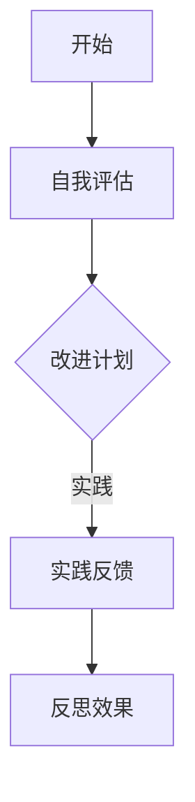
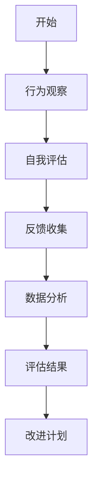
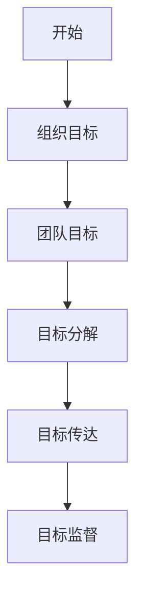
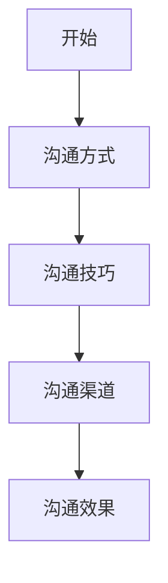
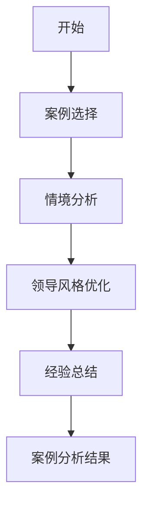
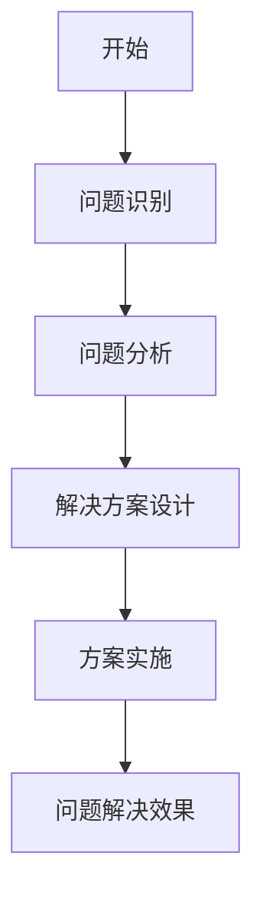
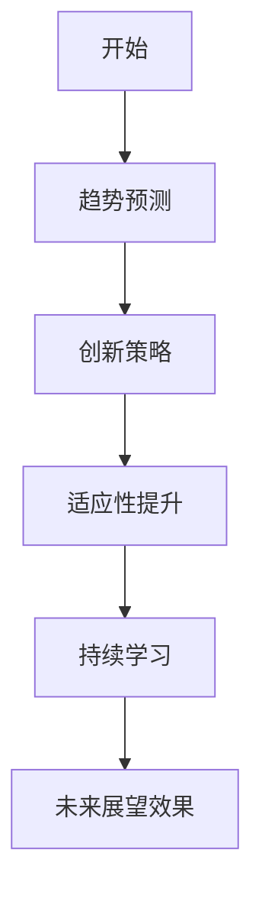

                 

### # 第一部分: 引言

#### 第1章: 管理者自我反思的重要性

**背景介绍**

在现代企业中，管理者作为核心角色，其领导风格和能力对组织的成功和团队的凝聚力起着至关重要的作用。然而，随着市场的变化和技术的进步，管理者面临着越来越复杂的挑战。因此，管理者自我反思成为一种不可或缺的技能，帮助他们更好地理解自己的优势和不足，从而优化领导风格。

**问题背景**

随着企业的不断发展，管理者需要具备更广泛的技能和更深入的业务理解。然而，很多管理者在实际工作中可能缺乏对自己领导方式的深刻反思，导致领导效果不佳，甚至影响团队的士气和效率。因此，如何进行有效的自我反思，成为管理者亟待解决的问题。

**问题描述**

管理者自我反思涉及多个方面，包括自我评估、目标设定、沟通技巧、团队建设等。然而，如何在实际工作中应用这些技巧，并且持续优化自己的领导风格，是管理者需要解决的问题。

**问题解决**

通过自我反思，管理者可以识别自身的优点和不足，从而有针对性地进行改进。此外，通过不断学习和实践，管理者可以提升自己的领导能力，更好地应对各种挑战。

**边界与外延**

管理者自我反思不仅涉及个人能力的提升，还包括对组织文化和团队氛围的反思。通过自我反思，管理者可以识别组织内部的问题，并提出改进建议，从而提升组织的整体效能。

**概念结构与核心要素组成**

管理者自我反思的核心要素包括：

- **自我评估**：通过评估自身的领导风格和能力，了解自己的优势和不足。
- **目标设定**：明确自己的职业目标和发展方向，为自我反思提供指导。
- **沟通技巧**：提升沟通能力，改善与团队成员的互动。
- **团队建设**：通过团队建设活动，提升团队的凝聚力和合作效率。

**核心概念与联系**

领导风格的理论框架包括：

- **行为领导理论**：关注领导者的行为和表现。
- **魅力型领导理论**：强调领导者的个人魅力和影响力。
- **情境领导理论**：认为领导风格应该根据具体情境进行灵活调整。

**算法原理讲解**

管理者自我反思的过程可以看作是一个自我评估和改进的循环。首先，管理者进行自我评估，识别自身的优势和不足；然后，根据评估结果，制定改进计划；最后，通过实践和反馈，不断优化领导风格。

**数学公式**

管理者自我反思的数学模型可以表示为：

$$
\text{反思效果} = f(\text{自我评估}, \text{改进计划}, \text{实践反馈})
$$

其中，反思效果取决于自我评估的准确性、改进计划的合理性和实践反馈的有效性。

**Mermaid 流程图**

#### 第2章: 领导风格评估与理解

**背景介绍**

领导风格是管理者在领导过程中表现出来的行为和态度。不同的领导风格会对团队产生不同的影响。因此，了解并评估自己的领导风格，对于管理者来说至关重要。

**问题背景**

很多管理者可能对自己的领导风格缺乏认识，或者过于依赖某种风格，导致在处理不同情况时表现不佳。因此，如何进行有效的领导风格评估，成为管理者需要解决的问题。

**问题描述**

领导风格评估涉及多个方面，包括行为、态度和结果。然而，如何准确地评估自己的领导风格，以及如何根据评估结果进行调整，是管理者需要解决的问题。

**问题解决**

通过使用科学的评估工具和方法，管理者可以全面了解自己的领导风格，并识别需要改进的方面。此外，通过不断实践和反思，管理者可以逐步优化自己的领导风格。

**边界与外延**

领导风格评估不仅涉及个人能力，还包括对组织文化和团队氛围的反思。通过评估，管理者可以识别组织内部的问题，并提出改进建议，从而提升组织的整体效能。

**概念结构与核心要素组成**

领导风格评估的核心要素包括：

- **行为观察**：通过观察管理者的行为，评估其领导风格。
- **自我评估**：管理者自我评估自己的领导风格。
- **反馈收集**：通过团队成员和同事的反馈，了解领导风格的影响。

**核心概念与联系**

领导风格的理论框架包括：

- **行为领导理论**：关注领导者的行为和表现。
- **魅力型领导理论**：强调领导者的个人魅力和影响力。
- **情境领导理论**：认为领导风格应该根据具体情境进行灵活调整。

**算法原理讲解**

领导风格评估的过程可以看作是一个数据收集和分析的循环。首先，管理者通过行为观察和自我评估，收集关于自己领导风格的数据；然后，通过数据分析，评估领导风格的特点和影响；最后，根据评估结果，制定改进计划。

**数学公式**

领导风格评估的数学模型可以表示为：

$$
\text{领导风格评估} = f(\text{行为观察}, \text{自我评估}, \text{反馈收集})
$$

其中，领导风格评估取决于行为观察的准确性、自我评估的全面性和反馈收集的有效性。

**Mermaid 流程图**

### # 第二部分: 领导风格优化技巧

#### 第4章: 明确目标与愿景

**背景介绍**

明确的目标和愿景是管理者领导团队的重要基础。只有明确的目标和愿景，才能让团队朝着正确的方向努力，并激发团队成员的积极性和创造力。

**问题背景**

在现实工作中，很多管理者可能缺乏明确的目标和愿景，导致团队在执行过程中缺乏方向感，甚至出现执行力不足的问题。因此，如何设定明确的目标和愿景，成为管理者需要解决的问题。

**问题描述**

管理者需要明确团队的目标和愿景，并将其传达给团队成员。然而，如何确保目标和愿景的明确性，以及如何激发团队成员的积极性，是管理者需要解决的问题。

**问题解决**

通过设定明确的目标和愿景，管理者可以确保团队在执行过程中有清晰的方向。此外，通过激励和沟通，管理者可以激发团队成员的积极性和创造力，从而提高团队的执行力。

**边界与外延**

明确目标和愿景不仅涉及团队内部，还包括对组织整体目标的认同。通过明确目标和愿景，管理者可以确保团队的工作与组织的目标保持一致。

**概念结构与核心要素组成**

明确目标和愿景的核心要素包括：

- **目标设定**：明确团队的目标，确保团队成员对目标有共同的理解。
- **愿景规划**：制定长期的愿景，为团队的发展指明方向。
- **目标传达**：将目标和愿景传达给团队成员，确保团队成员对目标和愿景的认同。
- **目标监督**：对目标的执行情况进行监督，确保团队按照预定计划推进。

**核心概念与联系**

目标设定的理论框架包括：

- **SMART原则**：确保目标具有明确性、可衡量性、可实现性、相关性和时限性。
- **目标分解**：将总体目标分解为具体的小目标，确保每个团队成员都有明确的工作任务。

**算法原理讲解**

目标设定的过程可以看作是一个数据分析和决策的过程。首先，管理者根据组织的整体目标，设定团队的目标；然后，通过目标分解，将总体目标分解为具体的小目标；最后，通过沟通和监督，确保团队成员按照预定计划执行。

**数学公式**

目标设定的数学模型可以表示为：

$$
\text{目标设定} = f(\text{组织目标}, \text{团队目标}, \text{目标分解})
$$

其中，目标设定取决于组织目标的明确性、团队目标的合理性和目标分解的细致性。

**Mermaid 流程图**

#### 第5章: 建立有效沟通

**背景介绍**

有效沟通是管理者领导团队的重要手段。良好的沟通能力可以确保信息的准确传递，减少误解和冲突，提高团队的协作效率。

**问题背景**

在现实工作中，很多管理者可能因为缺乏沟通技巧，导致信息传递不畅，甚至引发团队内部的矛盾和冲突。因此，如何建立有效的沟通机制，成为管理者需要解决的问题。

**问题描述**

管理者需要建立有效的沟通机制，包括沟通方式的选择、沟通技巧的运用和沟通渠道的建立。然而，如何确保沟通的效率和质量，是管理者需要解决的问题。

**问题解决**

通过建立有效的沟通机制，管理者可以确保信息的准确传递，提高团队的协作效率。此外，通过不断学习和实践，管理者可以提升自己的沟通能力，从而更好地领导团队。

**边界与外延**

有效沟通不仅涉及管理者与团队成员之间的沟通，还包括团队成员之间的沟通。通过有效沟通，管理者可以促进团队内部的协作，提升团队的整体效能。

**概念结构与核心要素组成**

有效沟通的核心要素包括：

- **沟通方式**：选择适当的沟通方式，确保信息的准确传递。
- **沟通技巧**：运用有效的沟通技巧，提高沟通的效果。
- **沟通渠道**：建立畅通的沟通渠道，确保信息能够及时传递。

**核心概念与联系**

沟通技巧的理论框架包括：

- **倾听**：积极倾听对方的意见和想法，确保理解对方的观点。
- **表达**：清晰、准确地表达自己的想法，避免误解和冲突。
- **反馈**：及时给予反馈，确保对方了解自己的想法和意见。

**算法原理讲解**

有效沟通的过程可以看作是一个信息传递和反馈的循环。首先，管理者选择适当的沟通方式，确保信息的准确传递；然后，通过倾听和表达，确保双方对信息的理解一致；最后，通过反馈，确保信息的准确性和有效性。

**数学公式**

有效沟通的数学模型可以表示为：

$$
\text{沟通效果} = f(\text{沟通方式}, \text{沟通技巧}, \text{沟通渠道})
$$

其中，沟通效果取决于沟通方式的适当性、沟通技巧的有效性和沟通渠道的畅通性。

**Mermaid 流程图**

### # 第三部分: 成功案例与实践

#### 第9章: 成功案例分析

**背景介绍**

通过分析成功案例，管理者可以了解在不同情境下，如何有效地优化领导风格。成功案例不仅提供了实际的操作经验，还揭示了成功背后的关键因素。

**问题背景**

在现实工作中，管理者往往需要面对各种复杂的情况，如何在不同情境下灵活调整领导风格，是管理者需要解决的问题。

**问题描述**

管理者需要找到成功案例，分析其领导风格的优化过程，并从中吸取经验教训。然而，如何确保案例的分析具有实用性和指导性，是管理者需要解决的问题。

**问题解决**

通过深入分析成功案例，管理者可以了解在不同情境下，如何有效地优化领导风格。此外，通过对比分析，管理者可以识别成功案例中的关键因素，从而为自己的领导实践提供参考。

**边界与外延**

成功案例不仅限于企业内部，还包括行业内的优秀实践。通过跨行业和跨领域的成功案例分析，管理者可以拓宽视野，获取更多的优化领导风格的方法。

**概念结构与核心要素组成**

成功案例分析的核心要素包括：

- **案例选择**：选择具有代表性和实用性的成功案例。
- **情境分析**：分析案例所处的具体情境和背景。
- **领导风格优化**：分析案例中领导风格的优化过程。
- **经验总结**：总结案例中的成功经验和教训。

**核心概念与联系**

成功案例分析的理论框架包括：

- **情境领导理论**：认为领导风格应该根据具体情境进行灵活调整。
- **行为领导理论**：关注领导者的行为和表现。
- **系统思维**：通过系统思维，分析案例中各个因素之间的相互作用。

**算法原理讲解**

成功案例分析的过程可以看作是一个信息处理和知识提取的过程。首先，管理者选择具有代表性和实用性的成功案例；然后，通过情境分析和领导风格优化，提取案例中的关键信息；最后，通过经验总结，形成可操作的实践指南。

**数学公式**

成功案例分析的数学模型可以表示为：

$$
\text{案例分析结果} = f(\text{案例选择}, \text{情境分析}, \text{领导风格优化}, \text{经验总结})
$$

其中，案例分析结果取决于案例选择的代表性、情境分析的准确性和领导风格优化的有效性。

**Mermaid 流程图**

### # 第10章: 实践中的问题与解决

**背景介绍**

在领导实践中，管理者难免会遇到各种问题和挑战。如何有效地解决这些问题，是管理者提升领导能力的重要环节。

**问题背景**

在实际工作中，管理者可能面临团队协作不力、员工士气低落、工作进度延误等问题。这些问题不仅影响团队的效率，还可能对组织的整体发展造成负面影响。

**问题描述**

管理者需要识别实践中遇到的问题，分析其根源，并采取有效的解决措施。然而，如何准确地诊断问题，并选择合适的解决方案，是管理者需要解决的问题。

**问题解决**

通过系统分析和实践，管理者可以识别问题的根源，并采取相应的解决措施。此外，通过持续改进，管理者可以不断提升自己的问题解决能力，从而更好地应对各种挑战。

**边界与外延**

问题解决不仅涉及技术问题，还包括管理问题和人际关系问题。通过跨领域的知识整合，管理者可以拓宽解决问题的视野，提升问题解决的综合能力。

**概念结构与核心要素组成**

问题解决的核心要素包括：

- **问题识别**：通过观察和分析，识别实践中遇到的问题。
- **问题分析**：分析问题的原因和影响，确定问题的优先级。
- **解决方案设计**：设计有效的解决方案，确保问题的解决。
- **方案实施**：实施解决方案，监控实施效果。
- **持续改进**：根据实施效果，进行持续改进和优化。

**核心概念与联系**

问题解决的理论框架包括：

- **系统思维**：通过系统思维，分析问题的全面性和关联性。
- **问题诊断**：通过问题诊断，识别问题的根源。
- **解决方案设计**：通过解决方案设计，确保问题的解决。

**算法原理讲解**

问题解决的过程可以看作是一个问题诊断和解决方案设计的循环。首先，管理者通过观察和分析，识别实践中遇到的问题；然后，通过问题诊断，分析问题的根源；最后，通过解决方案设计，设计有效的解决方案。

**数学公式**

问题解决的数学模型可以表示为：

$$
\text{问题解决效果} = f(\text{问题识别}, \text{问题分析}, \text{解决方案设计}, \text{方案实施})
$$

其中，问题解决效果取决于问题识别的准确性、问题分析的全面性和解决方案设计的有效性。

**Mermaid 流程图**

### # 第11章: 未来展望

**背景介绍**

随着社会和科技的不断进步，管理者面临的挑战也在不断变化。未来，管理者需要具备更高的适应能力和创新能力，以应对日益复杂的工作环境和市场需求。

**问题背景**

在未来的工作中，管理者可能面临更复杂的管理问题，如全球化、数字化转型等。如何在这些新环境中持续优化领导风格，成为管理者需要解决的问题。

**问题描述**

管理者需要前瞻性地考虑未来可能遇到的挑战和机遇，并提前做好准备。然而，如何准确地预测未来的趋势，并制定相应的应对策略，是管理者需要解决的问题。

**问题解决**

通过深入研究和分析，管理者可以预测未来的趋势，并制定相应的应对策略。此外，通过不断学习和实践，管理者可以提升自己的前瞻性和创新能力，从而更好地应对未来的挑战。

**边界与外延**

未来展望不仅涉及企业内部的管理，还包括行业发展和全球趋势。通过跨领域的视角，管理者可以更全面地了解未来的发展趋势，从而制定更有效的领导策略。

**概念结构与核心要素组成**

未来展望的核心要素包括：

- **趋势预测**：通过数据分析和市场研究，预测未来的发展趋势。
- **创新策略**：制定创新策略，应对未来的挑战和机遇。
- **适应性提升**：提升管理者的适应能力，确保在变化的环境中保持竞争优势。
- **持续学习**：通过持续学习，提升管理者的知识和技能，以适应未来的变化。

**核心概念与联系**

未来展望的理论框架包括：

- **趋势分析**：通过数据分析，识别未来的发展趋势。
- **创新理论**：通过创新理论，制定应对未来挑战的策略。
- **适应性理论**：通过适应性理论，提升管理者的适应能力。

**算法原理讲解**

未来展望的过程可以看作是一个趋势分析和创新决策的过程。首先，管理者通过数据分析和市场研究，预测未来的发展趋势；然后，通过创新理论和适应性理论，制定应对策略；最后，通过实践和反馈，不断调整和优化策略。

**数学公式**

未来展望的数学模型可以表示为：

$$
\text{未来展望效果} = f(\text{趋势预测}, \text{创新策略}, \text{适应性提升}, \text{持续学习})
$$

其中，未来展望效果取决于趋势预测的准确性、创新策略的可行性和适应性提升的有效性。

**Mermaid 流程图**

### 总结

通过以上章节的内容，我们可以看到，管理者自我反思和领导风格优化是一个系统性、持续性的过程。从自我反思的重要性、领导风格评估与理解，到明确目标与愿景、建立有效沟通，再到成功案例分析和实践中的问题与解决，以及未来展望，每一个环节都是优化领导风格不可或缺的部分。

管理者自我反思不仅能够帮助管理者识别自身的优势和不足，提升个人领导能力，还能促进团队的发展和组织的成长。通过不断地学习和实践，管理者可以不断提升自己的领导水平，应对日益复杂的商业环境。

我们鼓励读者在阅读本书的过程中，结合自己的实际情况，进行深入的思考和反思。同时，本书提供了丰富的案例和实践技巧，读者可以通过借鉴这些成功经验，为自己的领导实践提供指导。

最后，希望本书能够帮助每一位管理者在自我反思和领导风格优化的道路上，迈出更加坚实的步伐，成为卓越的领导者。

### 作者信息

**作者：AI天才研究院/AI Genius Institute & 禅与计算机程序设计艺术 /Zen And The Art of Computer Programming**

AI天才研究院致力于推动人工智能领域的研究和应用，打造世界一流的人工智能研究机构。研究院的核心团队由多位世界顶级的人工智能专家和计算机科学家组成，他们在人工智能和计算机科学领域拥有深厚的理论基础和丰富的实践经验。

同时，作者还著有《禅与计算机程序设计艺术》，这是一本融合了东方哲学和计算机科学智慧的经典之作。该书以深刻的洞见和简洁的语言，探讨了计算机编程中的思维方式和方法论，对计算机科学和人工智能领域产生了深远的影响。

通过这两本书，作者希望将人工智能和计算机科学的智慧传递给更多的人，帮助他们在各自的领域中取得更大的成就。感谢读者对本书的关注和支持，期待与您在更多领域进行深入交流。

