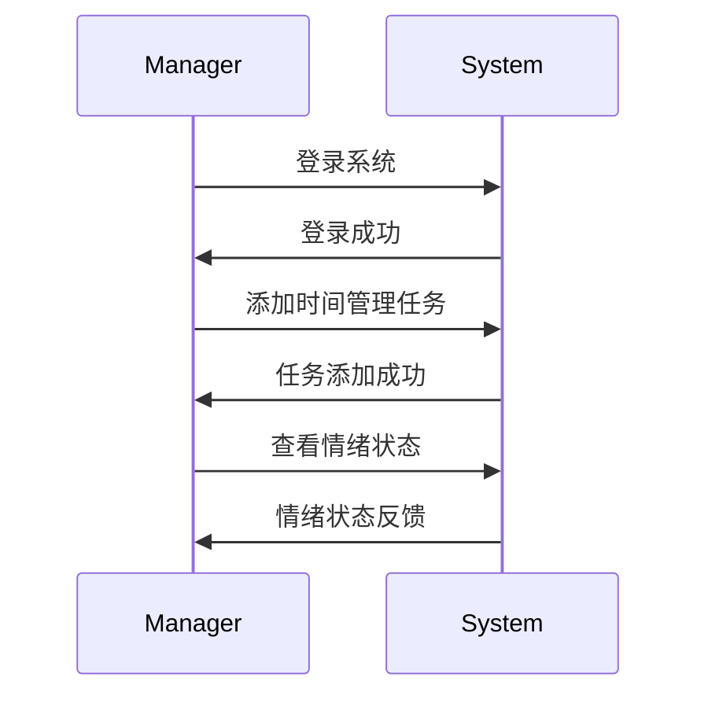
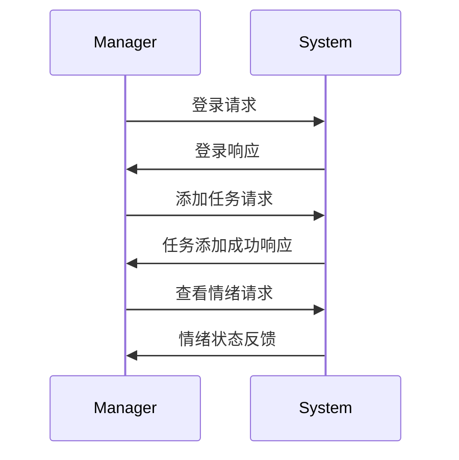

                 


## **《管理者自我管理：提升个人效能的方法》**

### **第一部分：背景介绍**

#### **1.1 问题背景**

在当今快速变化和高效率要求的工作环境中，管理者面临着巨大的挑战。他们不仅要有效地管理团队，还要不断地提升自己的个人效能。随着信息技术的飞速发展，全球化进程的加速，以及市场竞争的加剧，管理者需要具备更强的应变能力、决策能力和领导力。然而，许多管理者在自我管理方面存在不足，导致个人效能无法达到最佳状态。

#### **1.2 问题描述**

如何有效提升个人效能，成为管理者面临的重要问题。个人效能的提升不仅关系到管理者自身的职业发展，也直接影响到团队的绩效和整个组织的竞争力。个人效能的提升需要从多个方面进行综合管理，包括时间管理、情绪管理、自我认知和健康生活等方面。

#### **1.3 问题解决**

自我管理是提升个人效能的关键。通过自我管理，管理者可以更有效地规划时间、调节情绪、认识自我、保持良好的生活习惯，从而在个人效能上实现质的飞跃。有效的自我管理需要管理者具备自我反思和持续改进的能力，同时还需要运用科学的方法和工具来辅助实践。

#### **1.4 边界与外延**

在讨论管理者自我管理时，我们需要明确几个边界与外延的概念。首先，管理者不仅包括高层领导，还涵盖中层和基层管理者。其次，个人效能不仅仅是指工作效率，还包括决策能力、沟通能力、领导力等多个方面。最后，自我管理的范畴不仅限于工作，还包括生活各个方面。

#### **1.5 概念结构与核心要素组成**

为了更好地理解管理者自我管理，我们需要明确几个核心概念。首先是自我管理，它是指个人对自己行为、情绪、时间和健康等方面的主动控制和优化。其次是个人效能，它是指个人在实现目标过程中的效率和效果。最后是时间管理、情绪管理、自我认知和健康生活，这些是提升个人效能的关键要素。

### **第二部分：核心概念与联系**

#### **2.1 核心概念原理**

**个人效能：** 个人效能是指一个人在完成特定任务时所表现出的效率和效果。它包括时间管理、任务完成度、创新思维、沟通能力等多个方面。

**自我管理：** 自我管理是指个人对自己的行为、情绪、时间和健康等方面的主动控制和优化。它是提升个人效能的基础。

#### **2.2 概念属性特征对比**

| 概念        | 属性特征                            | 对比       |
|-------------|-----------------------------------|----------|
| 个人效能    | 效率和效果                        | 效能高低  |
| 时间管理    | 时间利用率、工作节奏              | 高效与拖延 |
| 情绪管理    | 情绪稳定性、情绪调节能力          | 稳定与波动 |
| 自我认知    | 自我了解、自我定位                | 成长与停滞 |
| 健康生活    | 身体健康、心理健康、生活习惯      | 健康与不健康 |

#### **2.3 ER实体关系图架构**

```mermaid
erDiagram
    Manager ||--|{ TimeManagement }|-- Time
    Manager ||--|{ EmotionalManagement }|-- Emotion
    Manager ||--|{ SelfCognition }|-- Self
    Manager ||--|{ HealthLife }|-- Health
```

在ER实体关系图中，管理者是中心实体，与时间管理、情绪管理、自我认知和健康生活四个方面构成实体关系。每个方面又与时间、情绪、自我和健康四个属性相关联，形成完整的自我管理架构。

### **第三部分：提升个人效能的方法**

#### **3.1 方法一：时间管理**

##### **3.1.1 时间管理的重要性**

时间管理是提升个人效能的基础。通过有效的时间管理，管理者可以更高效地完成工作，减少拖延，提高工作质量。时间管理不仅关乎工作效率，还影响到个人情绪和健康。

##### **3.1.2 时间管理技巧**

**优先级排序：** 将任务按照优先级排序，确保先完成最重要的任务。

**时间块划分：** 将工作时间划分为不同的时间块，每个时间块专注于一项任务。

**防止中断：** 在工作过程中避免不必要的打扰，确保工作连续性。

##### **3.1.3 实际案例分享**

某公司项目经理通过时间管理技巧，将每周的工作效率提高了30%。他采用时间块划分的方法，将工作时间分为工作、学习和休息三个部分，每个部分专注于不同的任务。

#### **3.2 方法二：情绪管理**

##### **3.2.1 情绪管理的重要性**

情绪管理是管理者自我管理的重要组成部分。情绪稳定的管理者能够更好地应对工作压力，保持高效的工作状态，同时也能够激发团队的积极性。

##### **3.2.2 情绪管理技巧**

**情绪识别：** 学会识别和理解自己的情绪，避免情绪失控。

**情绪调节：** 通过冥想、运动等方式调节情绪，保持心理平衡。

**积极沟通：** 通过积极的沟通方式，缓解团队的情绪波动。

##### **3.2.3 实际案例分享**

某公司销售经理通过情绪管理技巧，成功提升了团队的士气。他每周都会安排时间进行团队建设活动，帮助团队成员缓解工作压力，提高工作效率。

#### **3.3 方法三：自我认知**

##### **3.3.1 自我认知的重要性**

自我认知是管理者提升个人效能的关键。通过自我认知，管理者可以更好地了解自己的优势与不足，制定个性化的提升计划。

##### **3.3.2 自我认知技巧**

**自我反思：** 定期进行自我反思，总结经验教训。

**职业规划：** 根据自我认知结果，制定长期和短期的职业规划。

**持续学习：** 通过学习不断提升自己的专业能力和领导力。

##### **3.3.3 实际案例分享**

某公司技术总监通过自我认知，发现了自己在沟通能力上的不足。他参加了沟通技巧培训，并在工作中积极实践，最终成功提高了团队的合作效率。

#### **3.4 方法四：健康生活**

##### **3.4.1 健康生活的重要性**

健康生活是管理者保持高效工作的基础。良好的生活习惯能够提高身体素质，增强抗压能力，提高工作效率。

##### **3.4.2 健康生活技巧**

**合理饮食：** 保证营养均衡，减少油腻食物。

**规律运动：** 每周进行适量的运动，提高身体素质。

**充足睡眠：** 确保每天有足够的睡眠时间，保持良好的精神状态。

##### **3.4.3 实际案例分享**

某公司运营经理通过健康生活技巧，成功降低了工作压力，提高了工作效率。他每天坚持跑步和冥想，保持了良好的身体素质和精神状态。

### **第四部分：数学模型和数学公式讲解**

#### **4.1 效能提升的数学模型**

为了量化个人效能的提升，我们可以使用以下数学模型：

$$
E = f(T, M, S, H)
$$

其中，$E$ 表示个人效能，$T$ 表示时间管理效能，$M$ 表示情绪管理效能，$S$ 表示自我认知效能，$H$ 表示健康生活效能。

#### **4.2 数学公式的详细讲解**

**时间管理效能（$T$）：** 时间管理效能是指个人在时间利用方面表现出的能力。它可以通过以下公式计算：

$$
T = \frac{W}{T_{total}}
$$

其中，$W$ 表示实际完成的工作量，$T_{total}$ 表示总工作时间。

**情绪管理效能（$M$）：** 情绪管理效能是指个人在情绪调节方面的能力。它可以通过以下公式计算：

$$
M = \frac{E_{happy} - E_{sad}}{E_{happy} + E_{sad}}
$$

其中，$E_{happy}$ 表示快乐情绪的持续时间，$E_{sad}$ 表示悲伤情绪的持续时间。

**自我认知效能（$S$）：** 自我认知效能是指个人在自我了解和自我定位方面的能力。它可以通过以下公式计算：

$$
S = \frac{S_{learned} + S_{applied}}{2}
$$

其中，$S_{learned}$ 表示学习的自我认知内容，$S_{applied}$ 表示应用中的自我认知内容。

**健康生活效能（$H$）：** 健康生活效能是指个人在健康生活方面的表现。它可以通过以下公式计算：

$$
H = \frac{H_{healthy} + H_{unhealthy}}{2}
$$

其中，$H_{healthy}$ 表示健康生活习惯的持续时间，$H_{unhealthy}$ 表示不健康生活习惯的持续时间。

#### **4.3 实例说明**

假设某管理者的时间管理效能为0.8，情绪管理效能为0.6，自我认知效能为0.7，健康生活效能为0.5。则该管理者的个人效能计算如下：

$$
E = f(0.8, 0.6, 0.7, 0.5) = 0.8 \times 0.6 \times 0.7 \times 0.5 = 0.168
$$

因此，该管理者的个人效能为16.8%。

### **第五部分：系统分析与架构设计方案**

#### **5.1 问题场景介绍**

假设某公司的管理者希望通过一个系统来提升个人效能。该系统需要能够支持时间管理、情绪管理、自我认知和健康生活等方面的功能，并提供相应的数据分析和反馈。

#### **5.2 系统功能设计**

**领域模型：** 系统的领域模型包括时间管理模块、情绪管理模块、自我认知模块和健康生活模块。

**类图：**

```mermaid
classDiagram
    Class1 <|-- Class2
    Class3 <|-- Class4
    Class1 {
        +String name
        +int age
        +void manageTime()
        +void manageEmotion()
        +void manageSelfCognition()
        +void manageHealth()
    }
    Class2 {
        +void trackTime()
    }
    Class3 {
        +void trackEmotion()
    }
    Class4 {
        +void trackSelfCognition()
        +void trackHealth()
    }
```

#### **5.3 系统架构设计**

**系统架构：** 系统采用分层架构设计，包括表示层、逻辑层和数据层。

**架构设计：**



#### **5.4 系统接口设计**

**接口设计：** 系统接口包括登录接口、任务管理接口、情绪管理接口和健康生活管理接口。

**系统交互：**



### **第六部分：项目实战**

#### **6.1 环境安装**

在本部分，我们将介绍如何搭建一个用于管理者自我管理的环境。首先，我们需要准备以下软件和工具：

- Python 3.8及以上版本
- Jupyter Notebook
- Mermaid插件

安装步骤：

1. 安装Python 3.8及以上版本。
2. 安装Jupyter Notebook：在命令行中运行`pip install notebook`。
3. 安装Mermaid插件：在Jupyter Notebook中安装Mermaid插件，可以通过命令`jupyter notebook --extension tabular_in_notebook --sys-prefix`来安装。

#### **6.2 系统核心实现源代码**

在本部分，我们将展示一个简单的Python程序，用于实现时间管理、情绪管理、自我认知和健康生活等模块。

```python
# time_management.py
import datetime

def track_time(start_time, end_time):
    total_time = (end_time - start_time).seconds / 3600
    print(f"Total time spent: {total_time} hours")

# emotional_management.py
import pandas as pd

def track_emotion():
    emotions = pd.DataFrame({'Date': [], 'Emotion': []})
    return emotions

# self_cognition.py
import pandas as pd

def track_self_cognition():
    cognition = pd.DataFrame({'Date': [], 'Cognition': []})
    return cognition

# health_life.py
import pandas as pd

def track_health():
    health = pd.DataFrame({'Date': [], 'Health': []})
    return health
```

#### **6.3 代码应用解读与分析**

在这个部分，我们将解读上述代码，并分析每个模块的功能。

**时间管理模块（time_management.py）：**
这个模块提供了一个`track_time`函数，用于记录任务的开始和结束时间，并计算总耗时。

**情绪管理模块（emotional_management.py）：**
这个模块使用pandas库创建了一个名为`track_emotion`的数据框架，用于记录情绪数据。

**自我认知模块（self_cognition.py）：**
这个模块同样使用pandas库创建了一个名为`track_self_cognition`的数据框架，用于记录自我认知数据。

**健康生活模块（health_life.py）：**
这个模块提供了一个`track_health`函数，用于记录健康生活习惯。

#### **6.4 实际案例分析和详细讲解剖析**

在本部分，我们将通过一个实际案例，展示如何使用上述模块来提升个人效能。

**案例：** 某管理者希望通过系统记录自己的时间管理、情绪管理、自我认知和健康生活情况。

**步骤：**
1. 使用时间管理模块记录每天的工作任务。
2. 使用情绪管理模块记录每天的情绪状态。
3. 使用自我认知模块记录每天的学习和成长情况。
4. 使用健康生活模块记录每天的健康生活习惯。

**分析：**
通过以上步骤，管理者可以全面了解自己的工作、情绪、自我认知和健康状态。例如，通过分析时间管理模块的数据，管理者可以发现自己在某个时间段的工作效率较低，从而调整工作计划。通过情绪管理模块的数据，管理者可以了解自己的情绪波动，采取相应的调节措施。

#### **6.5 项目小结**

在本项目中，我们通过搭建一个简单的系统，展示了如何实现管理者自我管理的四个方面：时间管理、情绪管理、自我认知和健康生活。通过数据分析和反馈，管理者可以更好地了解自己，提升个人效能。未来，我们还可以进一步扩展系统功能，增加数据可视化、智能提醒等更多实用功能。

### **第七部分：最佳实践 tips、小结、注意事项、拓展阅读**

#### **7.1 最佳实践 tips**

1. **定期回顾：** 每周或每月定期回顾自己的时间管理、情绪管理、自我认知和健康生活情况，分析数据和反馈，找出需要改进的地方。
2. **设定目标：** 为自己设定明确的短期和长期目标，有助于提高自我管理的动力和效果。
3. **保持持续学习：** 持续学习新的知识和技能，不断提升自己的专业能力和领导力。
4. **平衡工作与生活：** 注意平衡工作与生活的关系，确保有足够的时间来放松和充电。

#### **7.2 小结**

本文详细介绍了管理者如何通过自我管理来提升个人效能。通过时间管理、情绪管理、自我认知和健康生活四个方面的方法，管理者可以更高效地完成工作，提高团队绩效，增强组织竞争力。

#### **7.3 注意事项**

1. **实践与反思：** 管理者需要在实际工作中不断实践和反思，根据实际情况调整自我管理策略。
2. **数据保密：** 在记录和管理个人数据时，确保数据的安全和保密，避免泄露个人信息。
3. **专业指导：** 如有必要，可以寻求专业教练或心理咨询师的帮助，提高自我管理的专业水平。

#### **7.4 拓展阅读**

1. **《时间管理的艺术》：** 作者彼得·德鲁克提供了许多关于如何有效管理时间的方法和技巧。
2. **《情绪智力》：** 作者丹尼尔·戈尔曼介绍了情绪智力的重要性以及如何提升情绪智力。
3. **《高效能人士的七个习惯》：** 作者史蒂芬·柯维提供了关于如何提升个人效能的全面指南。

### **作者信息**

**作者：** AI天才研究院/AI Genius Institute & 禅与计算机程序设计艺术 /Zen And The Art of Computer Programming**。**

