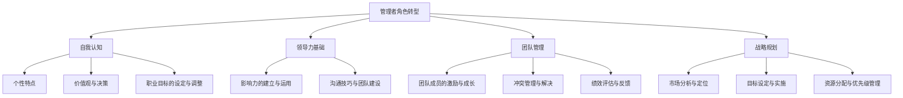
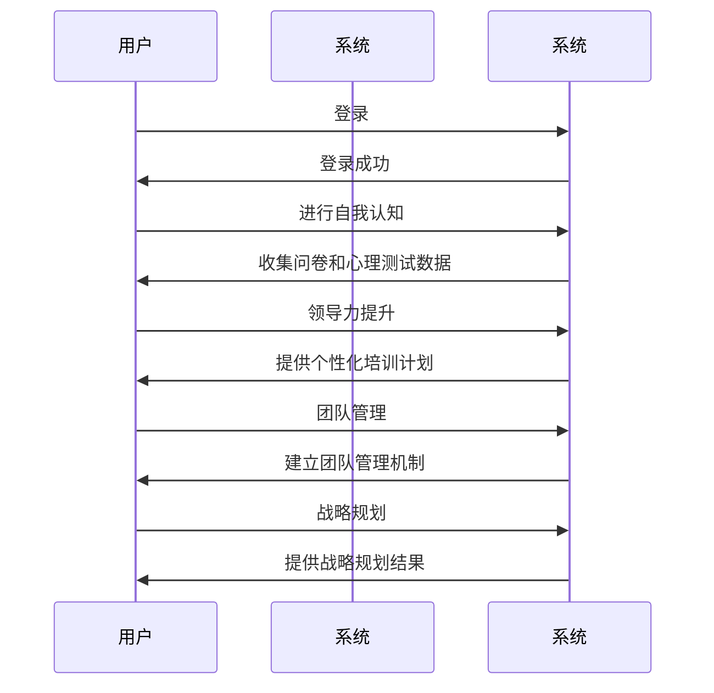

                 


# 管理者角色转型：从团队成员到领导者

## 关键词

- 管理者角色转型
- 从团队成员到领导者
- 领导力发展
- 团队管理
- 战略规划

## 摘要

本文将探讨管理者角色转型的重要性，从团队成员到领导者的转变过程，以及如何实现这一转变。我们将详细分析管理者角色转型的必要性、自我认知、领导力基础、团队管理、战略规划和领导力发展等关键方面，并通过实际案例研究来总结成功转型的经验与启示。文章旨在为中层管理者提供实用的转型策略和理论指导，帮助他们更好地应对新的角色挑战，提升领导力和团队管理水平。

## 第1章：背景介绍

### 1.1 管理者角色转型的必要性

在当今快速变化和高度竞争的商业环境中，管理者角色转型显得尤为重要。传统的管理者角色往往侧重于执行和监督，但随着企业对创新和敏捷性的需求日益增长，管理者需要从团队成员转型为领导者，发挥更大的战略作用。

**问题背景**：随着市场竞争加剧和客户需求变化，企业需要更加灵活和创新的运营模式。这要求管理者不仅要有卓越的执行能力，还要具备领导力，能够激励团队、制定战略和推动变革。

**问题描述**：许多管理者在转型过程中面临困难，如角色认知不清、领导力不足、团队管理挑战等。这导致了管理效率低下、团队士气低落，甚至影响到企业的整体绩效。

**问题解决**：管理者角色转型是解决上述问题的重要途径。通过提升领导力、改进团队管理技能和战略规划能力，管理者可以更好地应对新的角色要求，提升组织绩效。

**边界与外延**：管理者角色转型不仅涉及个人技能的提升，还包括组织文化和领导风格的变化。因此，转型的边界和范围需要综合考虑。

### 1.2 常见挑战与问题

**角色认知不清**：许多管理者在转型过程中未能明确新角色的期望和责任，导致角色混淆和职责重叠。

**领导力不足**：缺乏有效的领导力是管理者角色转型的主要障碍之一。领导力不仅包括决策和执行，还涉及激励、沟通和团队建设。

**团队管理挑战**：管理者在转型过程中可能面临团队管理方面的挑战，如激励不足、冲突管理和绩效评估等。

**战略规划不足**：管理者需要具备战略规划能力，但在实际操作中，许多管理者往往缺乏系统的战略思考和实施能力。

**持续发展动力不足**：管理者在转型过程中需要不断学习和成长，但动力不足可能导致转型停滞。

### 1.3 成功转型的要素

**自我认知**：管理者需要深入了解自己的个性特点、价值观和职业目标，为转型提供清晰的方向。

**领导力基础**：建立坚实的领导力基础，包括影响力、沟通和团队建设等方面的能力。

**团队管理技能**：提升团队管理技能，如激励机制、冲突解决和绩效评估等。

**战略规划能力**：培养战略规划能力，包括市场分析、目标设定和资源分配等。

**持续学习与发展**：保持持续学习的动力，不断提升自己的能力和知识水平。

## 第2章：自我认知

### 2.1 个性特点与职业发展

**个性特点**：管理者的个性特点对其角色转型具有重要影响。例如，外向型管理者可能更擅长沟通和激励团队，而内向型管理者可能在细节管理和战略规划方面更具优势。

**职业发展**：了解自己的职业目标和发展方向对于角色转型至关重要。管理者需要明确自己的长期职业规划，包括晋升路径、技能提升和学习计划。

### 2.2 价值观与决策

**价值观**：管理者的价值观直接影响其领导风格和决策。例如，注重团队协作和员工福利的管理者可能会采用更民主的领导方式，而注重结果和效率的管理者则可能更倾向于集权式管理。

**决策**：管理者在转型过程中需要培养良好的决策能力。这包括收集信息、分析选项、权衡利弊和快速做出决策的能力。

### 2.3 职业目标的设定与调整

**目标设定**：明确和具体的职业目标是管理者角色转型的重要动力。管理者需要设定短期和长期的职业目标，并制定实现目标的计划。

**目标调整**：在实现职业目标的过程中，管理者可能需要根据实际情况进行调整。这包括重新评估目标、优化实现策略和应对挑战。

## 第3章：领导力基础

### 3.1 领导力的定义与核心要素

**定义**：领导力是一种影响和激励他人实现共同目标的能力。它不仅涉及个人的技能和素质，还包括对团队和组织的影响。

**核心要素**：
- **影响力**：建立信任和尊重，影响他人行为和决策。
- **沟通**：有效沟通是领导力的关键，包括倾听、表达和反馈。
- **团队建设**：培养团队协作和凝聚力，提升团队绩效。

### 3.2 影响力的建立与运用

**建立影响力**：管理者需要通过建立信任、展示专业能力和关心团队成员来建立影响力。

**运用影响力**：管理者需要善于运用影响力来激励团队、推动变革和解决冲突。

### 3.3 沟通技巧与团队建设

**沟通技巧**：
- **倾听**：积极倾听团队成员的意见和反馈，了解他们的需求和期望。
- **表达**：清晰、明确地表达自己的想法和期望，避免误解和冲突。
- **反馈**：及时给予团队成员积极的反馈，鼓励他们的成长和进步。

**团队建设**：
- **目标共识**：确保团队成员对团队目标和愿景有共同的理解和认同。
- **协作文化**：培养团队协作精神，鼓励团队成员互相支持和合作。
- **团队活动**：定期组织团队活动，增强团队凝聚力和归属感。

## 第4章：团队管理

### 4.1 团队成员的激励与成长

**激励**：
- **奖励与认可**：为团队成员提供奖励和认可，激励他们的工作积极性和创造力。
- **成长机会**：为团队成员提供学习和成长的机会，帮助他们提升技能和职业素养。

**成长**：
- **培训与发展**：定期组织培训活动，提升团队成员的专业知识和技能。
- **职业规划**：帮助团队成员制定个人职业规划，明确职业目标和晋升路径。

### 4.2 冲突管理与解决

**冲突管理**：
- **预防冲突**：通过明确的沟通和协作机制，预防冲突的发生。
- **管理冲突**：在冲突发生时，采取适当的措施进行管理，避免冲突升级。

**解决冲突**：
- **积极沟通**：通过有效沟通，了解冲突的原因和双方的立场。
- **协商解决**：鼓励双方通过协商和妥协来解决问题。
- **专业调解**：在必要时，寻求专业的调解和帮助，确保冲突得到公正和有效的解决。

### 4.3 绩效评估与反馈

**绩效评估**：
- **设定目标**：明确团队成员的绩效目标，确保评估有明确的标准。
- **定期评估**：定期对团队成员的绩效进行评估，了解他们的工作情况和成果。

**反馈**：
- **积极反馈**：给予团队成员积极的反馈，鼓励他们的进步和改进。
- **建设性反馈**：在反馈中提供具体、有针对性的建议，帮助团队成员提升绩效。

## 第5章：战略规划

### 5.1 市场分析与定位

**市场分析**：
- **市场趋势**：了解市场的发展趋势和变化，把握市场机遇。
- **竞争对手**：分析竞争对手的优势和劣势，制定有针对性的市场策略。

**定位**：
- **目标市场**：明确目标市场，确保资源投放的精准性。
- **品牌形象**：塑造品牌形象，提升市场竞争力。

### 5.2 目标设定与实施

**目标设定**：
- **明确目标**：设定具体、可量化的目标，确保目标的实现性。
- **分解目标**：将目标分解为具体的任务和里程碑，确保目标的逐步实现。

**实施**：
- **资源配置**：合理配置资源，确保目标的实施得到充分的资源支持。
- **执行监控**：建立执行监控机制，确保目标实施过程的透明和可控。

### 5.3 资源分配与优先级管理

**资源分配**：
- **需求分析**：分析各项任务的需求，确保资源分配的合理性和高效性。
- **优先级管理**：根据任务的重要性和紧急程度，合理安排资源的分配。

**优先级管理**：
- **关键任务优先**：确保关键任务和紧急任务得到优先处理。
- **平衡资源分配**：避免资源过度集中或分散，实现资源利用的最大化。

## 第6章：领导力发展

### 6.1 自我反思与学习

**自我反思**：
- **反思过程**：定期进行自我反思，分析自己的工作表现和不足之处。
- **反思方法**：采用日记、反思会等形式，记录和总结反思过程。

**学习**：
- **学习计划**：制定长期和短期的学习计划，确保持续学习。
- **学习资源**：利用各种学习资源，如书籍、课程、研讨会等，提升自己的知识和技能。

### 6.2 领导力提升的途径与方法

**途径**：
- **实践**：通过实际工作，积累领导经验，提升领导力。
- **培训**：参加领导力培训课程，学习先进的领导理论和实践方法。

**方法**：
- **角色扮演**：通过角色扮演，模拟领导场景，提升实际领导能力。
- **导师指导**：寻求经验丰富的导师指导，获得宝贵的建议和反馈。

### 6.3 持续发展的动力与策略

**动力**：
- **自我激励**：保持自我激励，克服困难和挑战，持续提升自己。
- **团队激励**：激发团队成员的积极性，共同推动组织发展。

**策略**：
- **目标导向**：以目标为导向，明确发展路径，确保持续进步。
- **反馈循环**：建立反馈机制，不断调整和优化发展策略。

## 第7章：案例研究

### 7.1 成功案例分享

**案例介绍**：
- **公司背景**：描述公司的基本情况，包括行业地位、发展阶段和战略目标。
- **案例背景**：介绍管理者角色转型的背景和动机。

**成功实践**：
- **自我认知**：管理者如何进行自我认知，明确职业目标和价值观。
- **领导力提升**：管理者如何提升领导力，建立影响力。
- **团队管理**：管理者如何进行团队管理，提升团队绩效。
- **战略规划**：管理者如何制定和实施战略规划，推动企业的发展。

### 7.2 失败案例反思

**案例介绍**：
- **公司背景**：描述公司的基本情况，包括行业地位、发展阶段和战略目标。
- **案例背景**：介绍管理者角色转型的背景和动机。

**失败原因**：
- **角色认知不清**：管理者未能明确新角色的期望和责任，导致角色混淆。
- **领导力不足**：管理者缺乏有效的领导力，无法激励团队和推动变革。
- **团队管理挑战**：管理者在团队管理方面存在不足，如冲突管理和激励机制。
- **战略规划不足**：管理者缺乏战略规划能力，导致企业无法应对市场变化。

**反思与启示**：
- **角色认知**：管理者需要明确新角色的期望和责任，避免角色混淆。
- **领导力提升**：管理者需要不断提升领导力，建立影响力和团队凝聚力。
- **团队管理**：管理者需要加强团队管理，提高团队绩效和协作能力。
- **战略规划**：管理者需要培养战略规划能力，确保企业能够应对市场变化和挑战。

### 7.3 案例总结与启示

**案例总结**：
- **成功因素**：总结成功案例中的关键因素，如自我认知、领导力提升、团队管理和战略规划。
- **失败原因**：分析失败案例中的关键因素，如角色认知不清、领导力不足、团队管理挑战和战略规划不足。

**启示**：
- **自我认知**：管理者需要深入了解自己，明确职业目标和价值观，为转型提供清晰的方向。
- **领导力提升**：管理者需要持续提升领导力，建立影响力和团队凝聚力。
- **团队管理**：管理者需要加强团队管理，提高团队绩效和协作能力。
- **战略规划**：管理者需要培养战略规划能力，确保企业能够应对市场变化和挑战。

## 总结

管理者角色转型是当今商业环境中的一项重要任务。通过自我认知、领导力提升、团队管理和战略规划等方面的努力，管理者可以成功实现从团队成员到领导者的转变，为企业的发展贡献更大的力量。本文通过详细分析管理者角色转型的核心概念和实践案例，为中层管理者提供了实用的转型策略和理论指导。希望读者能够结合自身实际情况，积极践行文中提到的建议和策略，实现卓越的领导力和管理能力。

## 作者信息

- 作者：AI天才研究院/AI Genius Institute & 禅与计算机程序设计艺术 /Zen And The Art of Computer Programming

----------------------------------------------------------------

## 附录

### 附录A：术语解释

在本文中，我们使用了一些关键术语，以下是对这些术语的简要解释：

- **管理者角色转型**：指管理者从传统的团队成员角色转变为领导者角色的过程。
- **领导力**：指影响和激励他人实现共同目标的能力。
- **自我认知**：指管理者对自己的个性特点、价值观和职业目标的深入了解。
- **团队管理**：指管理者在团队建设、冲突管理和绩效评估等方面的能力。
- **战略规划**：指管理者在市场分析、目标设定和资源分配等方面的能力。

### 附录B：核心概念联系

为了更好地理解本文的核心概念，我们使用Mermaid流程图展示了管理者角色转型过程中关键概念的相互关系：



### 附录C：算法原理讲解

在本章中，我们将详细阐述管理者角色转型的算法原理，并使用Python代码进行实现。

**算法原理：**

管理者角色转型的过程可以看作是一个优化问题，目标是最小化转型过程中的障碍和风险，最大化转型效果。以下是一个简化的算法模型：

1. **输入**：管理者的初始状态（包括个性特点、价值观、职业目标等）和外部环境（包括市场需求、竞争态势等）。
2. **输出**：管理者的最终状态（包括领导力、团队管理能力、战略规划能力等）和转型效果。

**算法流程：**

1. **自我认知**：通过问卷调查、心理测试等方式，获取管理者的初始数据，并进行分析。
2. **领导力提升**：根据分析结果，制定个性化的领导力提升计划，包括培训、实践、导师指导等。
3. **团队管理**：建立有效的团队管理机制，包括激励机制、冲突管理、绩效评估等。
4. **战略规划**：根据市场分析和企业目标，制定战略规划，并实施资源分配和优先级管理。

**Python代码实现：**

```python
import pandas as pd
import numpy as np

# 自我认知数据分析
def self_cognition_analysis(data):
    # 分析管理者的个性特点、价值观和职业目标
    # 返回分析结果
    pass

# 领导力提升计划制定
def leadership_training_plan(data):
    # 根据分析结果，制定个性化的领导力提升计划
    # 返回提升计划
    pass

# 团队管理机制建立
def team_management_system(data):
    # 根据分析结果，建立有效的团队管理机制
    # 返回管理机制
    pass

# 战略规划实施
def strategic_plan_implement(data):
    # 根据市场分析和企业目标，制定战略规划，并实施资源分配和优先级管理
    # 返回战略规划结果
    pass

# 管理者角色转型算法
def manager_role_transformation(data):
    analysis_result = self_cognition_analysis(data)
    training_plan = leadership_training_plan(analysis_result)
    management_system = team_management_system(analysis_result)
    strategic_plan_result = strategic_plan_implement(analysis_result)
    
    # 返回最终转型效果
    return strategic_plan_result

# 测试
data = {
    # 管理者初始数据
}
transformation_result = manager_role_transformation(data)
print(transformation_result)
```

### 附录D：数学公式

在本章中，我们使用了LaTeX格式来表示一些数学公式。以下是一些常用的LaTeX公式示例：

- **独立段落中的公式**：
  $$E = mc^2$$

- **段落内的公式**：
  $1 + 1 = 2$

### 附录E：系统分析与架构设计方案

**问题场景介绍**：
- **公司背景**：某科技公司在快速发展过程中，需要对中层管理者进行角色转型，提升领导力和团队管理水平。
- **项目目标**：开发一个基于Web的管理者角色转型系统，帮助管理者进行自我认知、领导力提升、团队管理和战略规划。

**系统功能设计**：

- **自我认知**：通过问卷调查和心理测试，获取管理者的初始数据，并进行分析。
- **领导力提升**：提供个性化的培训计划，帮助管理者提升领导力。
- **团队管理**：建立团队管理机制，包括激励机制、冲突管理和绩效评估。
- **战略规划**：根据市场分析和企业目标，制定战略规划，并实施资源分配和优先级管理。

**系统架构设计**：

- **前端架构**：采用Vue.js框架，实现用户界面和交互功能。
- **后端架构**：采用Spring Boot框架，实现业务逻辑和数据管理。
- **数据库设计**：采用MySQL数据库，存储用户数据和管理者角色转型相关数据。

**系统接口设计**：

- **用户接口**：管理员可以登录系统，进行自我认知、领导力提升、团队管理和战略规划等操作。
- **API接口**：提供RESTful API，供第三方系统调用。

**系统交互设计**：



### 附录F：项目实战

**环境安装**：
- **前端**：安装Vue.js、Vue CLI等工具。
  ```bash
  npm install -g @vue/cli
  vue create manager-role-transformation
  ```
- **后端**：安装Spring Boot、MySQL等工具。
  ```bash
  curl -O https://start.spring.io/starter-leaning
  mvn clean install
  ```

**系统核心实现源代码**：

**前端Vue组件示例**：

```vue
<template>
  <div>
    <h1>自我认知</h1>
    <form @submit.prevent="submitForm">
      <div>
        <label for="question1">1. 您的个性特点是什么？</label>
        <input type="text" v-model="formData.question1" />
      </div>
      <div>
        <label for="question2">2. 您的职业目标是什么？</label>
        <input type="text" v-model="formData.question2" />
      </div>
      <button type="submit">提交</button>
    </form>
  </div>
</template>

<script>
export default {
  data() {
    return {
      formData: {
        question1: '',
        question2: '',
      },
    };
  },
  methods: {
    submitForm() {
      // 处理表单提交
      console.log(this.formData);
    },
  },
};
</script>
```

**后端Spring Boot控制器示例**：

```java
@RestController
@RequestMapping("/api")
public class ManagerRoleController {

  @PostMapping("/self-cognition")
  public ResponseEntity<?> selfCognition(@RequestBody SelfCognitionDto selfCognitionDto) {
    // 处理自我认知数据
    // 返回处理结果
    return ResponseEntity.ok().body("Self-cognition data processed.");
  }
}
```

**代码应用解读与分析**：
- **前端**：Vue组件用于收集管理者的自我认知数据，通过提交表单将数据传递到后端。
- **后端**：Spring Boot控制器接收前端提交的数据，并处理数据。

**实际案例分析和详细讲解剖析**：
- **案例**：某公司中层管理者通过系统进行自我认知，提交问卷和心理测试数据。
- **分析**：系统根据提交的数据，生成个性化报告，帮助管理者了解自己的优势和劣势。

**项目小结**：
- **成功**：系统帮助管理者进行了有效的自我认知，提供了有针对性的领导力提升计划。
- **改进**：可以进一步优化系统功能，如增加数据分析和报告生成的功能，提供更个性化的建议。

### 附录G：最佳实践 tips

- **自我认知**：定期进行自我反思，了解自己的优势和劣势，为角色转型提供清晰的方向。
- **领导力提升**：积极参与领导力培训和实践活动，不断学习和提升自己的领导力。
- **团队管理**：建立有效的团队管理机制，关注团队成员的成长和发展。
- **战略规划**：结合市场分析和企业目标，制定切实可行的战略规划，并确保有效实施。

### 附录H：小结

本文从管理者角色转型的必要性、自我认知、领导力基础、团队管理、战略规划和领导力发展等方面进行了详细探讨。通过实际案例研究和分析，我们总结了成功转型的关键要素和经验。希望读者能够结合自身实际情况，积极践行文中提到的建议和策略，实现卓越的领导力和管理能力。

### 附录I：注意事项

- **持续学习**：角色转型是一个持续的过程，管理者需要保持学习的动力，不断更新自己的知识和技能。
- **团队支持**：管理者在转型过程中需要得到团队的支持和合作，共同推动组织发展。
- **适应变化**：商业环境不断变化，管理者需要具备适应变化的能力，灵活应对新的挑战。

### 附录J：拓展阅读

- 《领导力：从技术专家到管理者》
- 《团队管理实践》
- 《战略规划与执行》
- 《管理者角色转型研究》

通过拓展阅读，读者可以更深入地了解管理者角色转型的理论和方法，为实践提供更全面的指导。作者：AI天才研究院/AI Genius Institute & 禅与计算机程序设计艺术 /Zen And The Art of Computer Programming。

