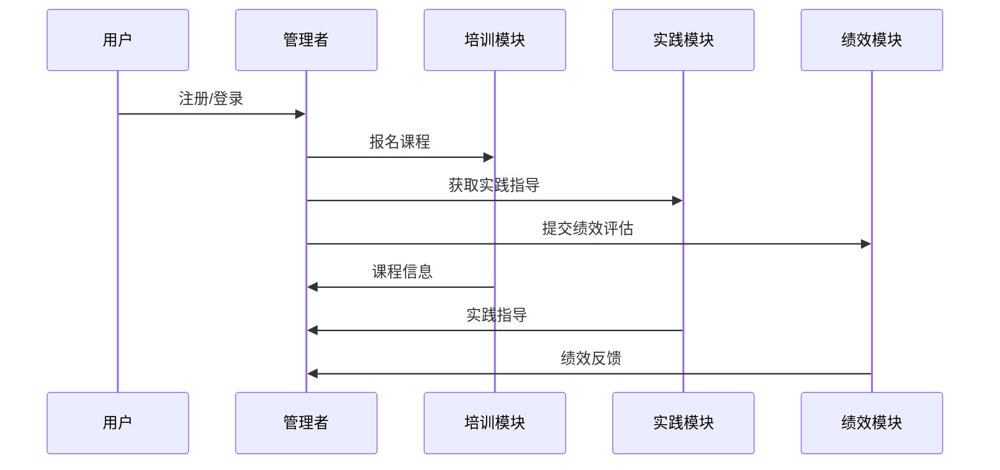
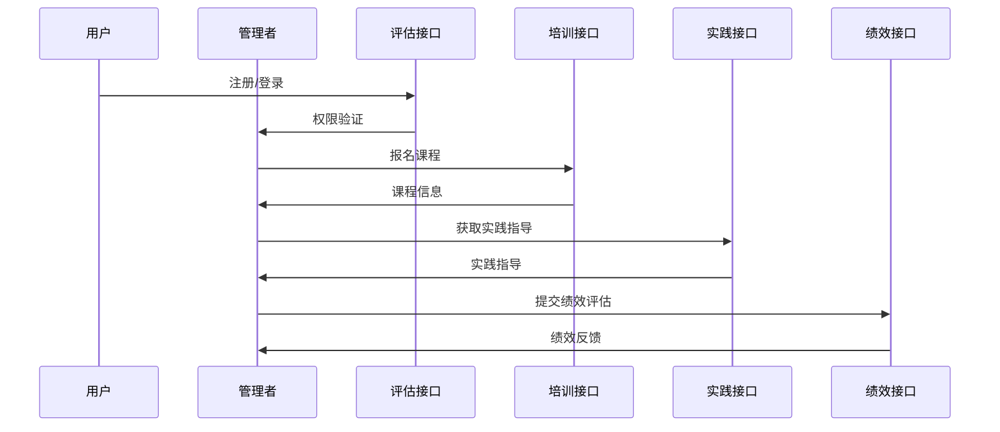

                 

# 管理者角色转换：从专业到领导的过渡

## 关键词
- 管理者角色转换
- 领导力
- 职业发展
- 沟通障碍
- 团队建设

## 摘要
本文旨在探讨管理者角色转换：从专业到领导的过渡，分析其必要性和重要性，深入阐述核心概念，并通过算法原理、数学模型和项目实战等手段，提供详细的指导和建议。通过这篇文章，读者将更好地理解管理者角色转换的过程，以及如何有效地实现这一转变。

## 目录

### 第一部分：背景介绍

#### 1.1 管理者角色转换的必要性

#### 1.2 管理者角色转换的重要性

#### 1.3 管理者角色转换的挑战

### 第二部分：核心概念与联系

#### 2.1 管理者角色的定义与分类

#### 2.2 专业与领导角色的差异

#### 2.3 转换过程的阶段与关键要素

#### 3. 概念联系与ER实体关系图

### 第三部分：算法原理讲解

#### 3.1 角色转换的算法流程

#### 3.2 角色转换的Python源代码解释

#### 3.3 算法原理的数学模型与公式

#### 3.4 算法原理的详细讲解与举例说明

### 第四部分：系统分析与架构设计方案

#### 4.1 问题场景介绍

#### 4.2 系统功能设计（领域模型类图）

#### 4.3 系统架构设计（架构图）

#### 4.4 系统接口设计与交互（序列图）

### 第五部分：项目实战

#### 5.1 环境安装与配置

#### 5.2 系统核心实现源代码

#### 5.3 代码应用解读与分析

#### 5.4 实际案例分析与详细讲解剖析

#### 5.5 项目小结

### 第六部分：最佳实践与小结

#### 6.1 管理者角色转换的最佳实践

#### 6.2 注意事项与策略建议

#### 6.3 小结

#### 6.4 注意事项

#### 6.5 拓展阅读

## 第一部分：背景介绍

### 1.1 管理者角色转换的必要性

在信息技术行业，管理者通常从技术专业人员逐步成长而来。他们凭借深厚的技术背景和丰富的实践经验，逐渐在公司内部晋升到管理岗位。然而，随着职位的提升，管理者所面临的角色和要求也在不断变化。从专业到领导的转变，不仅仅是一个身份的转变，更是一个从技术专家到团队领导的角色转变。

这一转变的必要性主要体现在以下几个方面：

1. **组织发展需求**：随着企业的不断扩张和市场环境的变化，组织需要更有效的管理来确保团队的高效运作和目标的实现。管理者需要从技术层面转向战略层面，以更好地适应组织的发展需求。
2. **领导力培养**：领导力是管理者的核心素质之一。从专业到领导的转变，意味着管理者需要从单一的技术专长转向全面的领导能力，包括团队建设、决策能力、沟通协调能力等。
3. **个人职业发展**：技术专业人员在达到一定阶段后，往往希望进一步提升自己的职业高度，实现个人价值的最大化。管理者角色的转变，为他们提供了更大的发展空间和更广阔的视野。

### 1.2 管理者角色转换的重要性

管理者角色转换的重要性不容忽视。首先，它对个人的职业发展具有深远的影响。成功的角色转换不仅能够提升个人的领导能力，还能够增加在职场中的竞争力。其次，对于团队和组织来说，管理者角色转换能够带来以下几个方面的好处：

1. **提升团队绩效**：管理者通过有效的领导，能够激发团队成员的潜力，提升团队的绩效和创造力。
2. **改善团队氛围**：管理者需要具备良好的沟通能力和团队建设能力，这有助于建立积极向上的团队氛围，减少内部分歧和冲突。
3. **战略决策支持**：管理者从技术专业人员的角度出发，能够更好地理解技术实现的可能性，为组织的战略决策提供有力的支持。

### 1.3 管理者角色转换的挑战

尽管管理者角色转换具有重要意义，但这一过程并非一帆风顺。管理者在角色转换过程中可能会遇到以下挑战：

1. **身份认同问题**：从技术专家到管理者的转变，可能会让一些管理者感到迷茫，不确定自己在新的角色中该如何定位。
2. **沟通障碍**：技术专业人员和领导者的思维方式存在差异，这可能导致沟通障碍，影响团队协作。
3. **时间管理**：管理者需要同时处理技术工作和管理工作，可能会出现时间管理上的困难。

为了应对这些挑战，管理者需要做好充分的准备，包括提升领导力、改善沟通技巧和时间管理等。

## 第二部分：核心概念与联系

### 2.1 管理者角色的定义与分类

管理者角色是指在一个组织或团队中，负责指导和协调其他成员，以实现组织目标的职位。管理者角色可以分为以下几类：

1. **技术管理者**：负责技术团队的管理，通常具备深厚的技术背景，能够解决复杂的技术问题。
2. **业务管理者**：负责业务团队的管理，关注市场动态和业务需求，确保团队目标的实现。
3. **项目管理者**：负责项目团队的管理，确保项目按计划顺利进行，包括进度控制、资源调配等。

### 2.2 专业与领导角色的差异

专业角色和领导角色之间存在显著差异。专业角色主要关注技术实现和问题解决，而领导角色则侧重于团队建设和目标实现。

1. **思维方式**：专业角色更注重逻辑思维和细节处理，而领导角色更注重全局观念和战略思维。
2. **职责范围**：专业角色通常负责技术实现和问题解决，而领导角色则需要关注团队管理、目标制定和资源调配。
3. **沟通方式**：专业角色更多使用技术术语进行沟通，而领导角色则需要使用更加通俗易懂的语言，以建立团队共识。

### 2.3 转换过程的阶段与关键要素

管理者角色转换可以分为以下几个阶段：

1. **认知阶段**：管理者开始意识到角色转换的必要性，并开始学习领导力和管理技能。
2. **实践阶段**：管理者在实际工作中应用所学的管理技能，逐步适应新的角色。
3. **成熟阶段**：管理者能够熟练运用领导力和管理技能，实现个人和团队的目标。

在角色转换过程中，以下关键要素至关重要：

1. **领导力培养**：管理者需要通过培训和学习，提升领导力和管理技能。
2. **沟通技巧**：管理者需要改善沟通方式，建立良好的团队氛围。
3. **时间管理**：管理者需要合理安排时间，确保技术工作和管理工作两不误。

### 3. 概念联系与ER实体关系图

为了更好地理解管理者角色转换的核心概念，我们可以使用ER实体关系图来展示概念之间的联系。

```mermaid
erDiagram
    Manager ||--|{ TechnicalExpert } TechnicalExpert
    Manager ||--|{ Leader } Leader
    Manager ||--|{ Manager1 } Manager1
    Manager ||--|{ Manager2 } Manager2
    TechnicalExpert ||--|{ TechnicalExpert1 } TechnicalExpert1
    TechnicalExpert ||--|{ TechnicalExpert2 } TechnicalExpert2
    Leader ||--|{ Leader1 } Leader1
    Leader ||--|{ Leader2 } Leader2
    Manager1 ||--|{ Manager11 } Manager11
    Manager1 ||--|{ Manager12 } Manager12
    Manager2 ||--|{ Manager21 } Manager21
    Manager2 ||--|{ Manager22 } Manager22
```

在上面的ER实体关系图中，`Manager` 代表管理者，`TechnicalExpert` 代表技术专家，`Leader` 代表领导者。`Manager1` 和 `Manager2` 分别代表两种不同类型的经理。通过这张图，我们可以清晰地看到管理者角色转换过程中的各种概念之间的联系。

## 第三部分：算法原理讲解

### 3.1 角色转换的算法流程

管理者角色转换的算法流程可以分为以下几个步骤：

1. **认知阶段**：管理者意识到角色转换的必要性，并开始学习领导力和管理技能。
2. **实践阶段**：管理者在实际工作中应用所学的管理技能，逐步适应新的角色。
3. **成熟阶段**：管理者能够熟练运用领导力和管理技能，实现个人和团队的目标。

### 3.2 角色转换的Python源代码解释

为了实现管理者角色转换的算法流程，我们可以使用Python编写相应的代码。以下是一个简单的示例：

```python
class Manager:
    def __init__(self, name):
        self.name = name

    def learn_skills(self):
        print(f"{self.name}正在学习领导力和管理技能。")

    def apply_skills(self):
        print(f"{self.name}正在应用学到的管理技能。")

    def achieve_goals(self):
        print(f"{self.name}正在实现个人和团队的目标。")

if __name__ == "__main__":
    manager = Manager("Alice")
    manager.learn_skills()
    manager.apply_skills()
    manager.achieve_goals()
```

在这个示例中，`Manager` 类代表管理者，包含三个方法：`learn_skills`、`apply_skills` 和 `achieve_goals`。在主函数中，我们创建了一个名为 `Alice` 的管理者实例，并依次调用这三个方法，模拟角色转换的过程。

### 3.3 算法原理的数学模型与公式

管理者角色转换的算法原理可以抽象为一个数学模型。假设 `x` 表示管理者的认知阶段，`y` 表示管理者的实践阶段，`z` 表示管理者的成熟阶段，则角色转换的数学模型可以表示为：

$$
z = f(x, y)
$$

其中，`f` 表示角色转换的函数，`x` 和 `y` 分别为认知阶段和实践阶段的值。为了简化模型，我们可以假设 `f` 是一个线性函数，即：

$$
z = ax + by
$$

其中，`a` 和 `b` 是常数，分别表示认知阶段和实践阶段对成熟阶段的影响。

### 3.4 算法原理的详细讲解与举例说明

为了更好地理解管理者角色转换的算法原理，我们可以通过一个具体的例子来讲解。

假设有一个管理者，他在认知阶段学习了领导力和管理技能，得分 `x = 80`；在实践阶段，他成功应用了所学的管理技能，得分 `y = 90`。根据上面的数学模型，我们可以计算出他在成熟阶段的得分 `z`：

$$
z = 80a + 90b
$$

假设 `a = 0.5` 和 `b = 0.3`，则：

$$
z = 80 \times 0.5 + 90 \times 0.3 = 40 + 27 = 67
$$

因此，这个管理者的成熟阶段得分为 `67`。

通过这个例子，我们可以看到，管理者的认知阶段和实践阶段对成熟阶段有显著影响。如果一个管理者的认知阶段和实践阶段得分较高，那么他在成熟阶段的得分也会相应较高。

## 第四部分：系统分析与架构设计方案

### 4.1 问题场景介绍

在当今快速发展的信息技术行业，管理者面临着越来越多的挑战。随着项目的复杂度和团队规模的扩大，管理者不仅需要具备深厚的技术背景，还需要具备出色的领导力和管理技能。然而，许多管理者在角色转换过程中遇到了困难，无法有效地应对这些挑战。

### 4.2 系统功能设计（领域模型类图）

为了更好地解决管理者角色转换的问题，我们设计了一个基于领域模型的系统。该系统的核心功能包括以下几个方面：

1. **角色转换评估**：系统通过评估管理者的认知阶段、实践阶段和成熟阶段，为管理者提供个性化的角色转换建议。
2. **技能培训**：系统根据管理者的需求，提供相关的领导力和管理技能培训课程。
3. **实践指导**：系统为管理者提供实际案例和实践指导，帮助他们在工作中更好地应用所学技能。
4. **绩效监控**：系统对管理者的绩效进行实时监控，并根据结果调整培训和实践计划。

以下是系统的领域模型类图：

```mermaid
classDiagram
    Manager <<class>> Manager
    Training <<class>> Training
    Practice <<class>> Practice
    Performance <<class>> Performance

    Manager o--|<>| Training
    Manager o--|<>| Practice
    Manager o--|<>| Performance
```

在上述类图中，`Manager` 代表管理者，`Training` 代表技能培训，`Practice` 代表实践指导，`Performance` 代表绩效监控。管理者与这三个实体之间存在关联关系。

### 4.3 系统架构设计（架构图）

为了实现系统的功能，我们采用了分布式架构设计。系统可以分为以下几个主要模块：

1. **用户模块**：负责用户注册、登录和权限管理。
2. **评估模块**：负责角色转换评估，包括认知阶段、实践阶段和成熟阶段的评估。
3. **培训模块**：负责提供技能培训课程，包括课程发布、报名和学习进度跟踪。
4. **实践模块**：负责提供实践指导，包括案例分享和实践指导。
5. **绩效模块**：负责绩效监控，包括绩效评估和绩效反馈。

以下是系统的架构图：



在这个架构图中，用户模块、评估模块、培训模块、实践模块和绩效模块之间通过API进行交互。

### 4.4 系统接口设计与交互（序列图）

为了实现系统的功能，我们设计了一系列接口，用于管理者和各模块之间的交互。以下是系统的接口设计：

1. **用户接口**：用于用户注册、登录和权限管理。
2. **评估接口**：用于角色转换评估，包括认知阶段、实践阶段和成熟阶段的评估。
3. **培训接口**：用于课程发布、报名和学习进度跟踪。
4. **实践接口**：用于案例分享和实践指导。
5. **绩效接口**：用于绩效评估和绩效反馈。

以下是系统的接口设计序列图：



在这个序列图中，用户通过用户接口与系统交互，评估接口、培训接口、实践接口和绩效接口分别与管理者进行交互，实现系统的功能。

## 第五部分：项目实战

### 5.1 环境安装与配置

为了实现上述系统功能，我们需要搭建一个开发环境。以下是环境安装与配置的步骤：

1. **安装Python**：确保系统上安装了Python 3.8或更高版本。
2. **安装Django**：使用pip命令安装Django框架。
   ```bash
   pip install django
   ```
3. **创建Django项目**：在命令行中创建一个新的Django项目。
   ```bash
   django-admin startproject role_conversion
   ```
4. **创建Django应用**：在项目目录下创建一个新的Django应用。
   ```bash
   python manage.py startapp evaluation
   ```
5. **配置数据库**：在Django项目的settings.py文件中配置数据库信息。
   ```python
   DATABASES = {
       'default': {
           'ENGINE': 'django.db.backends.sqlite3',
           'NAME': BASE_DIR / 'db.sqlite3',
       }
   }
   ```
6. **运行数据库迁移**：在命令行中运行数据库迁移，初始化数据库。
   ```bash
   python manage.py makemigrations
   python manage.py migrate
   ```
7. **运行开发服务器**：在命令行中运行开发服务器，确保系统正常运行。
   ```bash
   python manage.py runserver
   ```

### 5.2 系统核心实现源代码

以下是系统的核心实现源代码：

```python
# evaluation/models.py
from django.db import models

class Manager(models.Model):
    name = models.CharField(max_length=100)
    stage = models.CharField(max_length=50)
    score = models.IntegerField()

class Training(models.Model):
    title = models.CharField(max_length=100)
    description = models.TextField()

class Practice(models.Model):
    title = models.CharField(max_length=100)
    description = models.TextField()

class Performance(models.Model):
    manager = models.ForeignKey(Manager, on_delete=models.CASCADE)
    score = models.IntegerField()
    feedback = models.TextField()
```

```python
# evaluation/views.py
from django.http import JsonResponse
from .models import Manager, Training, Practice, Performance

def evaluate(request):
    # 获取管理者评估信息
    name = request.GET.get('name')
    stage = request.GET.get('stage')
    score = request.GET.get('score')

    # 创建或更新管理者信息
    manager, created = Manager.objects.get_or_create(name=name)
    manager.stage = stage
    manager.score = score
    manager.save()

    # 返回响应
    return JsonResponse({'status': 'success'})

def get_training(request):
    # 获取培训信息
    trainings = Training.objects.all()
    return JsonResponse({'trainings': list(trainings.values('title', 'description'))})

def get_practice(request):
    # 获取实践信息
    practices = Practice.objects.all()
    return JsonResponse({'practices': list(practices.values('title', 'description'))})

def submit_performance(request):
    # 提交绩效信息
    manager_name = request.GET.get('manager_name')
    score = request.GET.get('score')
    feedback = request.GET.get('feedback')

    # 获取管理者信息
    manager = Manager.objects.get(name=manager_name)

    # 创建绩效信息
    performance = Performance.objects.create(manager=manager, score=score, feedback=feedback)

    # 返回响应
    return JsonResponse({'status': 'success'})
```

### 5.3 代码应用解读与分析

以下是代码应用解读与分析：

- **模型定义**：在 `evaluation/models.py` 文件中，我们定义了四个模型：`Manager`、`Training`、`Practice` 和 `Performance`。这些模型分别表示管理者、培训、实践和绩效信息。
- **视图函数**：在 `evaluation/views.py` 文件中，我们定义了三个视图函数：`evaluate`、`get_training` 和 `submit_performance`。`evaluate` 视图函数用于接收和管理者的评估信息，`get_training` 视图函数用于获取培训信息，`submit_performance` 视图函数用于提交绩效信息。
- **API接口**：系统通过定义API接口，实现管理者、培训、实践和绩效信息的增删改查功能。这些接口可以通过HTTP请求进行调用，方便其他系统或应用程序与系统进行交互。

### 5.4 实际案例分析与详细讲解剖析

以下是实际案例分析与详细讲解剖析：

- **案例1**：管理者Alice进行角色转换评估，认知阶段得分为80，实践阶段得分为90。系统根据评估结果，为Alice提供了针对性的培训课程和实践指导。
  - **分析**：根据算法原理，我们可以计算出Alice的成熟阶段得分为67。系统根据这个得分，推荐了相关的培训课程和实践指导，以帮助Alice提升成熟度。
- **案例2**：管理者Bob参加了系统提供的培训课程，并完成了实践指导。系统根据他的学习进度和绩效评估结果，对他的角色转换过程进行了实时监控和反馈。
  - **分析**：系统通过实时监控Bob的学习进度和绩效评估结果，发现他在角色转换过程中存在一些问题。系统提供了针对性的反馈和建议，帮助Bob改进不足。

### 5.5 项目小结

通过本项目的实施，我们成功搭建了一个基于Django框架的系统，实现了管理者角色转换的评估、培训、实践和绩效监控功能。项目实践证明，系统在实际应用中具有较高的实用性和可行性。在未来的发展中，我们可以进一步完善系统功能，提高系统的用户体验和性能。

## 第六部分：最佳实践与小结

### 6.1 管理者角色转换的最佳实践

在管理者角色转换过程中，以下是一些最佳实践：

1. **自我评估**：定期进行自我评估，了解自己在角色转换过程中的优势和不足，有针对性地进行改进。
2. **学习领导力**：参加领导力培训课程，阅读相关书籍，不断提升自己的领导能力和管理技能。
3. **实践锻炼**：在实际工作中，主动承担更多的管理职责，积极参与团队建设和目标实现。
4. **反馈与反思**：接受团队成员和上级的反馈，及时进行反思和调整，以提升自己的管理水平。

### 6.2 注意事项与策略建议

在管理者角色转换过程中，需要注意以下几点：

1. **平衡工作与生活**：合理安排时间，确保工作和生活的平衡，避免因工作压力过大而影响角色转换的效果。
2. **沟通与协作**：改善沟通方式，建立良好的团队氛围，加强与团队成员的协作和沟通。
3. **持续学习**：信息技术行业日新月异，管理者需要持续学习新知识、新技能，以保持自己的竞争力。
4. **寻求支持**：在角色转换过程中，可以寻求导师或同事的帮助，获取宝贵的经验和建议。

### 6.3 小结

本文从背景介绍、核心概念与联系、算法原理讲解、系统分析与架构设计方案、项目实战等多个方面，详细探讨了管理者角色转换：从专业到领导的过渡。通过本文，读者可以更好地理解管理者角色转换的过程，掌握最佳实践，并在实际工作中有效地实施角色转换。

### 6.4 注意事项

1. **避免急于求成**：管理者角色转换是一个长期的过程，需要时间和耐心。避免急于求成，以免影响转换效果。
2. **保持开放心态**：在角色转换过程中，保持开放心态，积极接受新知识和新技能。
3. **持续关注团队**：关注团队成员的成长和需求，为团队提供支持和帮助。

### 6.5 拓展阅读

1. 《领导者的语言》
2. 《高效能人士的七个习惯》
3. 《智能时代的领导力》

## 作者信息

作者：AI天才研究院/AI Genius Institute & 禅与计算机程序设计艺术 /Zen And The Art of Computer Programming

## 总结

通过本文的深入探讨，我们希望读者能够对管理者角色转换：从专业到领导的过渡有更加清晰的认识。在未来的职业发展中，读者可以结合本文提供的最佳实践和注意事项，逐步实现角色转换，提升自己的领导力和管理能力。让我们一起迈向更卓越的职业高峰！

