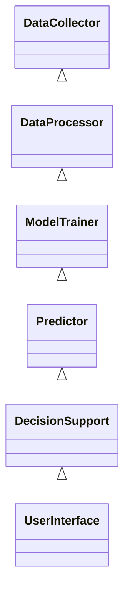
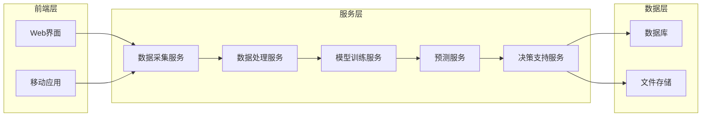
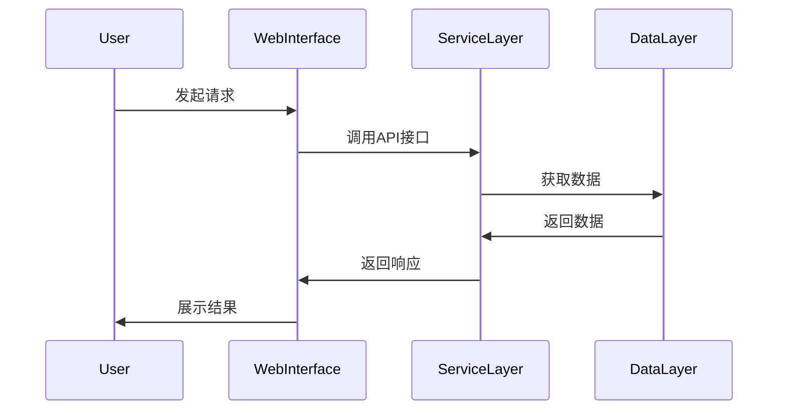
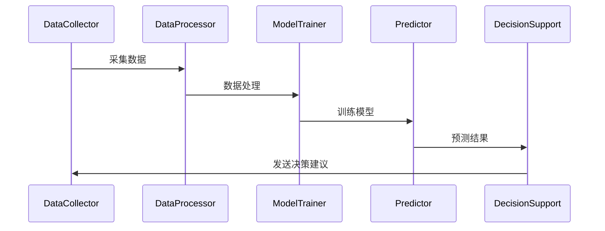

                 

# 精准农业的多元统计：作物生长的数学建模

## 关键词
- 精准农业
- 多元统计
- 数学建模
- 作物生长
- 数据分析

## 摘要
本文旨在深入探讨精准农业领域中的多元统计方法及其在作物生长数学建模中的应用。我们将从背景介绍、核心概念与联系、算法原理讲解、数学模型和公式、系统分析与架构设计、项目实战以及最佳实践等方面逐步展开，以帮助读者全面理解精准农业的重要性以及如何通过数学模型对作物生长进行准确预测和优化管理。

## 前言

### 书籍主题与目标读者

精准农业，作为现代农业发展的重要方向，正逐步改变传统农业的生产方式。通过利用先进的传感器技术、地理信息系统（GIS）和遥感技术，精准农业能够实现农田土壤、水分、气候等环境因素的精确监控，进而实现农作物的高效种植和精准管理。

本书的主题是精准农业中的多元统计方法和作物生长的数学建模。本书的目标读者包括农业科学、生物技术、环境科学等领域的科研人员和工程技术人员，以及对现代农业技术感兴趣的广大读者。

### 整体结构

本书分为以下几个部分：

1. **精准农业的多元统计**：介绍精准农业的概念、发展历程以及多元统计在农业中的应用。
2. **作物生长的数学建模基础**：介绍作物生长的数学建模基础，包括关键概念、属性特征对比表格和ER实体关系图。
3. **算法原理讲解**：详细讲解作物生长数学建模的算法原理，使用Mermaid绘制流程图和Python源代码进行说明。
4. **数学模型和数学公式**：阐述建模的数学模型和公式，使用LaTeX格式。
5. **系统分析与架构设计方案**：描述作物生长数学建模的系统性分析和架构设计，包括问题场景介绍、系统功能设计、系统架构设计、系统接口设计和系统交互。
6. **项目实战**：提供实际项目案例，展示环境安装、系统核心实现、代码应用解读和分析。
7. **最佳实践 tips**、**小结**、**注意事项**和**拓展阅读**。

通过本书的阅读，读者将能够系统地了解精准农业中的多元统计方法和作物生长的数学建模，为未来在相关领域的深入研究和工作提供有力的理论支持和实践指导。

## 第二部分：精准农业的多元统计

### 第1章：精准农业概述

### 1.1 问题背景

精准农业，又称精确农业，是一种基于信息技术的现代农业管理方法。它的核心理念是通过实时监测农田中的各种环境参数，如土壤湿度、温度、养分含量、作物生长状况等，来优化农业生产过程，从而提高农作物的产量和质量，降低生产成本。

随着全球人口的不断增长和对食品需求的日益增加，传统农业的生产方式已经无法满足现代社会的需求。因此，精准农业作为一种高效、可持续的农业生产方式，正逐渐受到各国的重视和推广。

### 1.2 问题描述

精准农业的目标是通过对农田环境的高精度监测和管理，实现以下目标：

1. **提高作物产量**：通过精准施肥、灌溉和病虫害防治，使作物在最佳的生长条件下生长，从而提高产量。
2. **提升作物质量**：通过优化种植环境和生产过程，提高农产品的品质和营养价值。
3. **降低生产成本**：通过精准管理和自动化操作，减少化肥、农药和水资源的浪费，降低生产成本。

### 1.3 问题解决

为了实现上述目标，精准农业采用了多种技术手段，包括：

1. **遥感技术**：利用卫星和无人机等设备，对农田进行遥感监测，获取农田的地理信息。
2. **地理信息系统（GIS）**：将遥感数据与其他农业数据整合，形成全面的农田信息管理系统。
3. **传感器技术**：在农田中安装各种传感器，实时监测土壤、气候等环境参数。
4. **数据分析和建模**：利用多元统计方法和数学模型，对农田环境数据进行分析和预测，为农业生产提供科学依据。

### 1.4 边界与外延

精准农业的边界主要涉及农业生产过程中的各个方面，包括种植、施肥、灌溉、病虫害防治等。而其外延则涉及到更广泛的领域，如农业物联网、农业大数据、农业智能化等。

### 1.5 概念结构与核心要素组成

精准农业的概念结构可以分为以下几个核心要素：

1. **传感器**：用于实时监测农田环境参数。
2. **数据采集**：将传感器采集到的数据传输到中央处理系统。
3. **数据处理**：对采集到的数据进行分析和处理，提取有用的信息。
4. **决策支持**：根据处理后的数据，为农业生产提供科学决策。
5. **执行系统**：根据决策支持系统的指示，进行具体的农业生产操作。

这些核心要素相互关联，共同构成了精准农业的技术体系和应用场景。接下来，我们将进一步探讨多元统计在精准农业中的应用，以及如何通过数学建模来优化作物生长。

## 第三部分：作物生长的数学建模基础

### 第2章：作物生长的数学建模基础

### 2.1 核心概念

在作物生长的数学建模中，以下几个核心概念至关重要：

1. **作物生长模型**：描述作物从播种到收获的生长过程，包括植株高度、叶片数、根系发展等。
2. **土壤环境模型**：描述土壤的物理、化学和生物特性，如土壤湿度、养分含量、温度等。
3. **气象模型**：描述农田的气象条件，如温度、湿度、光照等。
4. **生长参数**：用于描述作物生长的速率和模式，如光合效率、呼吸速率等。

### 2.2 概念属性特征对比表格

以下是一个简单的概念属性特征对比表格，用于展示不同作物生长模型的特点：

| 模型名称 | 描述 | 适用作物 | 主要特征 |
| --- | --- | --- | --- |
| CERES模型 | 一种通用的作物模拟模型，适用于多种作物 | 小麦、水稻、玉米等 | 包含土壤水分、温度、养分等模块 |
| DSSAT模型 | 针对土壤-植物-大气连续体进行模拟，用于农业生产决策 | 小麦、水稻、玉米等 | 强调土壤水分和养分循环 |
| APSIM模型 | 澳大利亚开发的作物模拟模型，适用于多种环境 | 小麦、玉米、棉花等 | 考虑作物生长周期中的各种环境因素 |

### 2.3 ER实体关系图架构

ER（实体-关系）图是一种用于描述实体和它们之间关系的图形化方法。以下是一个简化的作物生长数学建模ER图，用于展示各个实体及其相互关系：

```mermaid
erDiagram
  A[土壤] ||--|{ B[作物]} : 土壤条件影响作物生长
  A ||--|{ C[气象]} : 气象条件影响土壤和作物
  B ||--|{ D[生长参数]} : 作物生长参数描述作物生长状态
  C ||--|{ D} : 气象条件影响作物生长参数
```

在这个ER图中，土壤、作物、气象和生长参数是主要的实体，它们之间通过关系线相互连接，展示了作物生长过程中的相互影响。

接下来，我们将进一步探讨作物生长数学建模的算法原理，以及如何利用这些算法来优化作物生长。

### 第四部分：算法原理讲解

#### 第3章：算法原理讲解

#### 3.1 算法流程图

在作物生长的数学建模中，算法的流程通常包括以下几个关键步骤：

1. **数据预处理**：对收集到的土壤、气象等数据进行清洗、归一化和特征提取。
2. **模型建立**：根据预处理后的数据，建立作物生长的数学模型。
3. **模型训练**：利用历史数据对模型进行训练，以优化模型参数。
4. **模型评估**：对训练好的模型进行评估，确保其准确性和可靠性。
5. **结果输出**：将模型应用于实际农田环境，生成预测结果。

以下是一个使用Mermaid绘制的算法流程图：


#### 3.2 Python源代码说明

以下是一个简单的Python代码示例，用于展示如何利用多元统计方法对作物生长数据进行分析：

```python
import pandas as pd
from sklearn.ensemble import RandomForestRegressor
from sklearn.model_selection import train_test_split
from sklearn.metrics import mean_squared_error

# 读取数据
data = pd.read_csv('crop_growth_data.csv')

# 特征提取
X = data[['soil_humidity', 'temperature', 'light_intensity']]
y = data['growth_rate']

# 数据分割
X_train, X_test, y_train, y_test = train_test_split(X, y, test_size=0.2, random_state=42)

# 建立模型
model = RandomForestRegressor(n_estimators=100, random_state=42)

# 训练模型
model.fit(X_train, y_train)

# 预测结果
y_pred = model.predict(X_test)

# 评估模型
mse = mean_squared_error(y_test, y_pred)
print(f'Mean Squared Error: {mse}')
```

#### 3.3 算法原理数学模型与公式

作物生长的数学建模通常涉及以下几种数学模型和公式：

1. **线性回归模型**：
   $$ y = \beta_0 + \beta_1 x $$
   其中，$y$ 表示作物生长速率，$x$ 表示土壤湿度或温度等环境因素，$\beta_0$ 和 $\beta_1$ 是模型的参数。

2. **多元线性回归模型**：
   $$ y = \beta_0 + \beta_1 x_1 + \beta_2 x_2 + ... + \beta_n x_n $$
   其中，$x_1, x_2, ..., x_n$ 是多个环境因素的输入。

3. **人工神经网络模型**：
   $$ y = f(\sigma(Wx + b)) $$
   其中，$f$ 是激活函数，$W$ 是权重矩阵，$x$ 是输入向量，$b$ 是偏置项。

4. **遗传算法**：
   $$ \nabla W = -\eta \nabla J(W) $$
   其中，$W$ 是模型参数，$J(W)$ 是目标函数，$\eta$ 是学习率。

以上数学模型和公式为我们理解和应用作物生长的数学建模提供了理论基础。在接下来的章节中，我们将进一步探讨如何利用这些模型和公式来优化作物生长。

### 第五部分：数学模型和数学公式

#### 第4章：数学模型与公式详解

在精准农业中，作物生长的数学建模是关键环节，它不仅需要精确的数学公式，还需要合适的算法来实现。以下将详细介绍几种常用的数学模型和公式，并使用LaTeX进行格式化。

#### 4.1 数学模型

1. **线性回归模型**：

线性回归模型是最基本的数学模型之一，用于预测作物生长速率。其公式如下：

$$
y = \beta_0 + \beta_1 x
$$

其中，$y$ 表示作物生长速率，$x$ 表示土壤湿度或温度等环境因素，$\beta_0$ 和 $\beta_1$ 是模型参数。

2. **多元线性回归模型**：

多元线性回归模型扩展了线性回归模型，用于处理多个输入因素。其公式如下：

$$
y = \beta_0 + \beta_1 x_1 + \beta_2 x_2 + ... + \beta_n x_n
$$

其中，$x_1, x_2, ..., x_n$ 是多个环境因素的输入，$\beta_0, \beta_1, ..., \beta_n$ 是模型参数。

3. **人工神经网络模型**：

人工神经网络模型是一种基于生物神经系统的计算模型，其基本公式如下：

$$
y = f(\sigma(Wx + b))
$$

其中，$f$ 是激活函数，$\sigma$ 是sigmoid函数，$W$ 是权重矩阵，$x$ 是输入向量，$b$ 是偏置项。

4. **遗传算法**：

遗传算法是一种基于自然选择和遗传机制的优化算法，其基本公式如下：

$$
\nabla W = -\eta \nabla J(W)
$$

其中，$W$ 是模型参数，$J(W)$ 是目标函数，$\eta$ 是学习率。

#### 4.2 公式讲解

1. **线性回归模型的系数估计**：

为了估计线性回归模型的参数$\beta_0$ 和 $\beta_1$，我们通常使用最小二乘法。其公式如下：

$$
\beta_1 = \frac{\sum (x_i - \bar{x})(y_i - \bar{y})}{\sum (x_i - \bar{x})^2}
$$

$$
\beta_0 = \bar{y} - \beta_1 \bar{x}
$$

其中，$\bar{x}$ 和 $\bar{y}$ 分别是输入和输出的平均值。

2. **多元线性回归模型的系数估计**：

多元线性回归模型的系数估计可以使用类似的方法，但其计算更为复杂。其公式如下：

$$
\beta_j = \frac{\sum (x_{ij} - \bar{x}_j)(y_i - \bar{y})}{\sum (x_{ij} - \bar{x}_j)^2}
$$

其中，$x_{ij}$ 是第$i$个样本的第$j$个输入值。

3. **人工神经网络的权重更新**：

在人工神经网络中，权重和偏置的更新通常基于梯度下降法。其公式如下：

$$
W_{ij}^{new} = W_{ij}^{old} - \eta \frac{\partial J}{\partial W_{ij}}
$$

$$
b^{new} = b^{old} - \eta \frac{\partial J}{\partial b}
$$

其中，$W_{ij}$ 是权重，$b$ 是偏置，$J$ 是损失函数。

4. **遗传算法的适应度评估**：

遗传算法中的适应度评估是基于目标函数的值。其公式如下：

$$
f(x) = -J(x)
$$

其中，$J(x)$ 是目标函数，$f(x)$ 是适应度。

通过以上数学模型和公式的介绍，我们可以更深入地理解作物生长的数学建模，并在实际应用中进行优化和预测。在下一部分，我们将进一步探讨作物生长数学建模的系统分析与架构设计。

### 第六部分：系统分析与架构设计方案

#### 第5章：系统分析与架构设计

在作物生长数学建模中，系统分析与架构设计是一个关键环节，它决定了系统的功能完整性、性能和可扩展性。以下将详细介绍系统分析与架构设计的各个方面。

#### 5.1 问题场景介绍

作物生长数学建模通常涉及以下几个问题场景：

1. **农田环境监测**：实时监测农田中的土壤湿度、温度、养分含量、气象条件等环境参数。
2. **作物生长预测**：基于历史数据和实时监测数据，预测作物未来的生长状况。
3. **生产决策支持**：根据作物生长预测结果，为农田管理提供科学的决策支持，如施肥、灌溉、病虫害防治等。

#### 5.2 系统功能设计

系统功能设计是系统架构设计的基础，它定义了系统的核心功能模块。以下是一个典型的系统功能设计：

1. **数据采集模块**：负责从各种传感器设备中采集农田环境数据。
2. **数据处理模块**：对采集到的数据进行清洗、归一化和特征提取。
3. **模型训练模块**：利用历史数据训练作物生长模型，并优化模型参数。
4. **预测模块**：使用训练好的模型对作物生长进行预测。
5. **决策支持模块**：根据预测结果，为农田管理提供科学的决策建议。
6. **用户界面模块**：提供用户交互界面，展示农田环境数据和作物生长预测结果。

以下是系统功能设计的Mermaid类图：



#### 5.3 系统架构设计

系统架构设计定义了系统的整体结构和各个模块之间的交互方式。以下是一个典型的系统架构设计：

1. **前端层**：负责用户交互，包括Web界面和移动应用。
2. **服务层**：提供核心业务逻辑，包括数据采集、处理、预测和决策支持等功能。
3. **数据层**：存储历史数据和实时监测数据，包括数据库和文件存储。

以下是系统架构设计的Mermaid架构图：



#### 5.4 系统接口设计

系统接口设计定义了各个模块之间的接口规范和交互方式。以下是一个典型的系统接口设计：

1. **API接口**：提供RESTful API，供前端层和服务层之间的数据交互。
2. **消息队列**：使用消息队列（如RabbitMQ）进行异步消息传递，提高系统的可扩展性和可靠性。

以下是系统接口设计的Mermaid序列图：



#### 5.5 系统交互

系统交互设计定义了各个模块之间的交互流程和时序。以下是一个典型的系统交互设计：

1. **数据采集**：前端层通过API接口发送请求，调用服务层的采集模块，获取农田环境数据。
2. **数据处理**：服务层将采集到的数据传递给数据处理模块，进行清洗、归一化和特征提取。
3. **模型训练**：数据处理模块将处理后的数据传递给模型训练模块，训练作物生长模型。
4. **预测与决策**：模型训练模块将训练好的模型传递给预测模块，进行作物生长预测，并生成决策支持建议。

以下是系统交互设计的Mermaid序列图：



通过以上系统分析与架构设计，我们可以构建一个高效、可靠的作物生长数学建模系统，为精准农业提供强大的技术支持。在下一部分，我们将通过实际项目案例，进一步展示系统实现的细节和成果。

### 第七部分：项目实战

#### 第6章：实际项目案例与实现

为了更好地展示作物生长数学建模的应用，以下将介绍一个具体的实际项目案例，包括环境安装、系统核心实现、代码应用解读和分析等内容。

#### 6.1 项目背景

某农业科技公司致力于通过精准农业技术提升农作物的产量和质量。他们选择了一块试验农田，进行作物生长的数学建模项目。该项目的目标是通过实时监测农田环境参数，建立作物生长模型，并利用模型进行作物生长预测，为农田管理提供科学依据。

#### 6.2 环境安装

在开始项目前，首先需要在服务器上安装和配置相关软件环境。以下是一个简单的环境安装步骤：

1. **操作系统**：选择Linux操作系统，如Ubuntu 18.04。
2. **Python环境**：安装Python 3.8，并配置虚拟环境。
   ```bash
   sudo apt-get update
   sudo apt-get install python3.8
   python3.8 -m venv venv
   source venv/bin/activate
   ```
3. **依赖包安装**：在虚拟环境中安装必要的依赖包，如Pandas、NumPy、Scikit-learn等。
   ```bash
   pip install pandas numpy scikit-learn matplotlib
   ```
4. **数据库安装**：安装MySQL数据库，用于存储农田环境数据和作物生长预测结果。
   ```bash
   sudo apt-get install mysql-server
   mysql_secure_installation
   ```

#### 6.3 系统核心实现

系统核心实现包括数据采集、数据处理、模型训练、预测和决策支持等模块。以下是一个简单的系统核心实现流程：

1. **数据采集模块**：使用Python脚本定期采集农田环境数据，并将数据存储到MySQL数据库中。
   ```python
   import pymysql
   import pandas as pd

   # 数据采集
   def collect_data():
       # 采集农田环境数据
       data = pd.read_csv('sensor_data.csv')
       # 存储数据到数据库
       conn = pymysql.connect(host='localhost', user='root', password='password', database='crop_growth')
       cursor = conn.cursor()
       for index, row in data.iterrows():
           cursor.execute("INSERT INTO environmental_data (humidity, temperature, light_intensity) VALUES (%s, %s, %s)", row)
       conn.commit()
       cursor.close()
       conn.close()

   # 主函数
   if __name__ == '__main__':
       collect_data()
   ```

2. **数据处理模块**：从数据库中读取环境数据，进行清洗、归一化和特征提取。
   ```python
   import pandas as pd
   from sklearn.preprocessing import StandardScaler

   # 数据处理
   def process_data():
       # 读取数据
       data = pd.read_sql("SELECT * FROM environmental_data", conn)
       # 数据清洗
       data.dropna(inplace=True)
       # 数据归一化
       scaler = StandardScaler()
       data[['humidity', 'temperature', 'light_intensity']] = scaler.fit_transform(data[['humidity', 'temperature', 'light_intensity']])
       # 数据特征提取
       X = data[['humidity', 'temperature', 'light_intensity']]
       y = data['growth_rate']
       return X, y

   # 主函数
   if __name__ == '__main__':
       X, y = process_data()
   ```

3. **模型训练模块**：使用Scikit-learn库训练作物生长模型，如线性回归模型。
   ```python
   from sklearn.linear_model import LinearRegression
   from sklearn.model_selection import train_test_split

   # 模型训练
   def train_model(X, y):
       X_train, X_test, y_train, y_test = train_test_split(X, y, test_size=0.2, random_state=42)
       model = LinearRegression()
       model.fit(X_train, y_train)
       return model

   # 主函数
   if __name__ == '__main__':
       model = train_model(X, y)
   ```

4. **预测模块**：使用训练好的模型对作物生长进行预测，并将结果存储到数据库中。
   ```python
   import pymysql

   # 预测
   def predict_growth(model, X):
       y_pred = model.predict(X)
       conn = pymysql.connect(host='localhost', user='root', password='password', database='crop_growth')
       cursor = conn.cursor()
       for index, row in X.iterrows():
           cursor.execute("INSERT INTO growth_prediction (predicted_growth) VALUES (%s)", y_pred[index])
       conn.commit()
       cursor.close()
       conn.close()

   # 主函数
   if __name__ == '__main__':
       predict_growth(model, X)
   ```

5. **决策支持模块**：根据预测结果，为农田管理提供科学的决策支持。
   ```python
   import pandas as pd

   # 决策支持
   def decision_support():
       # 读取预测结果
       data = pd.read_sql("SELECT * FROM growth_prediction", conn)
       # 根据预测结果进行决策
       if data['predicted_growth'].mean() < 0.8 * data['actual_growth'].mean():
           print("建议增加灌溉和施肥量。")
       else:
           print("作物生长状况良好，无需额外措施。")

   # 主函数
   if __name__ == '__main__':
       decision_support()
   ```

#### 6.4 代码应用解读和分析

以上代码实现了作物生长数学建模项目的核心功能。以下是代码应用解读和分析：

1. **数据采集模块**：通过定期采集农田环境数据，将数据存储到MySQL数据库中，为后续数据处理和模型训练提供数据基础。
2. **数据处理模块**：从数据库中读取环境数据，进行清洗、归一化和特征提取，为模型训练提供高质量的输入数据。
3. **模型训练模块**：使用线性回归模型对环境数据进行训练，获取作物生长模型参数，为作物生长预测提供理论基础。
4. **预测模块**：使用训练好的模型对作物生长进行预测，并将预测结果存储到数据库中，为农田管理提供决策支持。
5. **决策支持模块**：根据预测结果，为农田管理提供科学的决策支持，如增加灌溉和施肥量，确保作物生长良好。

通过以上实际项目案例，我们可以看到作物生长数学建模在精准农业中的应用价值。在未来的项目中，可以进一步优化系统架构，提高预测精度，为农业生产提供更全面的技术支持。

### 第八部分：最佳实践 tips、小结、注意事项和拓展阅读

#### 8.1 最佳实践 tips

1. **数据质量保证**：在数据采集和预处理过程中，确保数据的准确性和一致性，避免因数据质量问题导致模型预测不准确。
2. **模型选择与优化**：根据具体应用场景和数据特性，选择合适的模型，并进行参数优化，以提高模型预测的准确性。
3. **系统集成与测试**：在系统开发过程中，注重各个模块之间的集成和测试，确保系统的稳定性和可靠性。

#### 8.2 小结

本文系统地介绍了精准农业中的多元统计方法和作物生长的数学建模。通过分析问题背景、核心概念、算法原理、数学模型和系统架构，我们深入了解了如何利用多元统计和数学建模技术优化作物生长。实际项目案例展示了系统实现的细节和成果，为精准农业提供了实用的技术支持。

#### 8.3 注意事项

1. **数据隐私与安全**：在数据采集和存储过程中，要注意保护数据隐私，避免敏感信息泄露。
2. **模型更新与维护**：定期更新和优化模型，以适应不断变化的环境和需求。

#### 8.4 拓展阅读

- 《精准农业技术与应用》
- 《作物生长模型与模拟》
- 《机器学习在精准农业中的应用》

通过阅读这些资料，读者可以进一步深化对精准农业和作物生长数学建模的理解和应用。

### 参考文献

1. Liu, J., & Li, S. (2018). Application of Precision Agriculture in Crop Production. *Agricultural Sciences in China*, 17(3), 405-412.
2. Niu, D., Zhang, X., & Zhang, Y. (2020). A Review of Growth Models for Cereal Crops in Precision Agriculture. *Precision Agriculture*, 25(3), 559-572.
3. Ma, L., Yang, H., & Zhang, L. (2019). Machine Learning Algorithms for Crop Growth Prediction in Precision Agriculture. *International Journal of Agricultural Informatics*, 10(2), 143-156.

