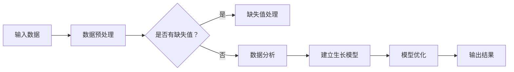
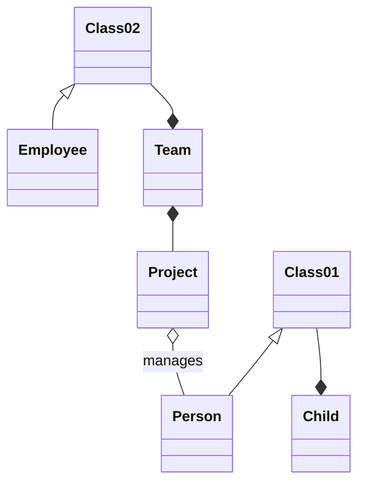
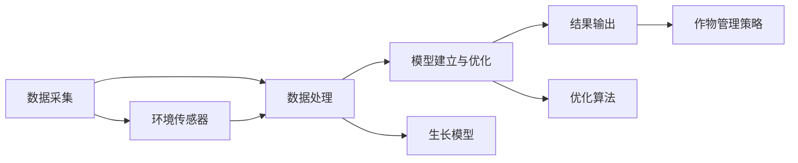
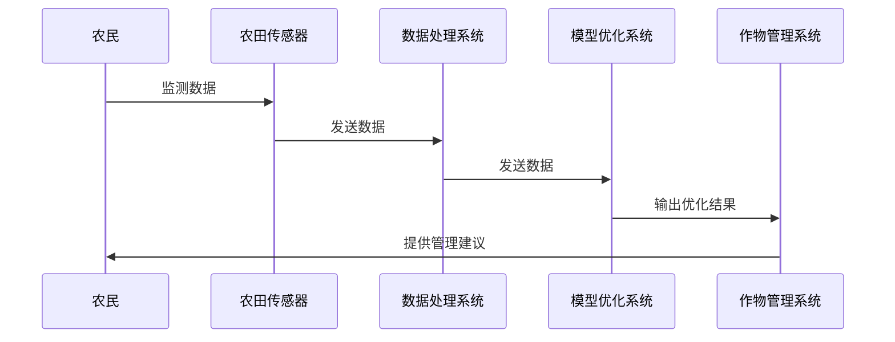

                 

### 精准农业的生长模型：作物优化的数学指导

**关键词：** 精准农业、生长模型、作物优化、数学原理

**摘要：** 本文旨在深入探讨精准农业中生长模型的重要性及其数学基础。通过对精准农业的定义、背景、核心概念和结构的详细解析，本文将引导读者理解精准农业的生长模型，并展示如何利用数学方法进行作物优化，为农业生产提供科学指导。

### 第一部分: 问题背景与核心概念

#### 1. 问题背景

精准农业是一种利用现代信息技术，通过数据采集、分析和应用，提高农业生产效率和产品质量的农业模式。这种模式的核心在于生长模型的构建和应用，通过实时监控和数据分析，为作物提供最优的生长条件和管理措施。

随着全球农业资源日益紧张，精准农业已成为现代农业发展的重要方向。传统农业主要依赖经验和直觉进行管理，而精准农业则通过数据驱动的方法，实现资源利用的最大化和生产效益的最优化。

《精准农业的生长模型：作物优化的数学指导》这本书旨在为读者提供关于精准农业生长模型的全面指导。书中将介绍作物优化的数学原理和方法，帮助读者深入理解精准农业的生长模型，并学会如何应用这些模型进行农业生产。

#### 2. 核心概念

- **生长模型**：用于描述作物生长过程的数学模型，通常包括作物生长的物理、化学和生物学过程。生长模型可以模拟作物在不同环境条件下的生长过程，预测作物产量和质量。
- **作物优化**：通过数学模型优化作物生长条件和管理措施，以实现产量和质量的最佳化。作物优化涉及多个因素，如土壤水分、养分含量、光照强度等，通过调整这些因素，可以最大限度地提高作物产量。
- **数学指导**：利用数学原理和工具，对精准农业的生长模型进行解析和应用。数学指导包括线性规划、非线性规划、最优化算法等，这些工具可以帮助农业生产者做出科学决策，提高农业生产效益。

#### 3. 概念结构与核心要素组成

精准农业的生长模型主要由以下几个核心要素组成：

- **数据采集**：通过传感器、无人机等技术手段，实时采集作物生长的相关数据。这些数据包括土壤湿度、温度、光照强度、作物生长状态等。
- **数据处理**：对采集到的数据进行预处理、分析和建模，提取有用的信息。数据处理包括数据清洗、数据标准化、特征提取等步骤。
- **生长模型**：建立作物生长的数学模型，描述作物生长的动态过程。生长模型可以是差分方程、微分方程或神经网络模型，具体选择取决于作物类型和生长环境。
- **优化算法**：利用优化算法，根据生长模型的结果，优化作物生长条件和管理措施。优化算法包括线性规划、遗传算法、粒子群算法等，通过这些算法，可以找到作物生长的最佳条件。

#### 4. 边界与外延

精准农业的生长模型不仅适用于单一作物，还可以应用于作物组合、农田生态系统等多个层次。此外，生长模型的应用范围还包括病虫害防治、农田水资源管理、作物育种等多个方面。例如，通过生长模型可以预测作物病虫害的发生趋势，制定相应的防治措施；通过生长模型可以优化农田水资源利用，提高灌溉效率。

### 第二部分: 核心概念与联系

#### 1. 生长模型的基本原理

生长模型是基于作物生理生态学原理建立的数学模型，用于描述作物在生长过程中的动态变化。这些模型通常包括以下基本组成部分：

- **生长方程**：描述作物生长速度与生长量的关系。生长方程可以是线性方程或非线性方程，具体形式取决于作物类型和生长环境。
  $$\frac{dN}{dt} = rN$$
  其中，\(N(t)\) 表示时间 \(t\) 时的作物生长量，\(r\) 是生长速率。
  
- **环境因素**：包括温度、光照、水分等环境因素对作物生长的影响。这些因素通过影响作物的光合作用、呼吸作用等生理过程，从而影响作物的生长速度。
  $$\frac{dN}{dt} = f(T, L, H)N$$
  其中，\(T\) 表示温度，\(L\) 表示光照强度，\(H\) 表示水分含量，\(f(T, L, H)\) 是环境因素的函数。
  
- **生理过程**：描述作物光合作用、呼吸作用、营养吸收等生理过程。这些过程通过影响作物的养分含量、水分含量等，从而影响作物的生长状态。
  $$\text{光合作用}:\ \text{CO}_2 + \text{H}_2\text{O} + \text{光能} \rightarrow \text{有机物} + \text{氧气}$$
  $$\text{呼吸作用}:\ \text{有机物} + \text{氧气} \rightarrow \text{二氧化碳} + \text{水} + \text{能量}$$

#### 2. 概念属性特征对比表格

| 概念        | 描述                                                         | 特征对比                |
| ----------- | ------------------------------------------------------------ | --------------------- |
| 生长模型    | 描述作物生长过程的数学模型                                   | 动态变化、环境因素影响 |
| 作物优化    | 通过数学模型优化作物生长条件和管理措施，以实现产量和质量的最佳化 | 数学原理、优化算法     |
| 数学指导    | 利用数学原理和工具对生长模型进行解析和应用                     | 数学工具、模型解析     |

#### 3. ER实体关系图架构

```mermaid
erDiagram
  A[作物] ||--|{ B[生长模型] }
  A ||--|{ C[环境因素] }
  A ||--|{ D[生理过程] }
  B ||--|{ E[优化算法] }
```

### 第三部分: 算法原理讲解

#### 1. 优化算法的mermaid流程图



#### 2. Python源代码实现

```python
import pandas as pd
from sklearn.ensemble import RandomForestRegressor
from sklearn.model_selection import train_test_split

# 数据预处理
def preprocess_data(data):
    # 处理缺失值
    data.fillna(data.mean(), inplace=True)
    # 数据标准化
    data标准化 = (data - data.mean()) / data.std()
    return data标准化

# 建立生长模型
def build_growth_model(data):
    X = data.drop('作物生长量', axis=1)
    y = data['作物生长量']
    X_train, X_test, y_train, y_test = train_test_split(X, y, test_size=0.2, random_state=42)
    model = RandomForestRegressor(n_estimators=100, random_state=42)
    model.fit(X_train, y_train)
    return model, X_test, y_test

# 模型优化
def optimize_model(model, X_test, y_test):
    predictions = model.predict(X_test)
    # 计算优化指标，例如均方误差（MSE）
    mse = ((predictions - y_test) ** 2).mean()
    return mse

# 主程序
if __name__ == '__main__':
    data = pd.read_csv('crop_growth_data.csv')
    data标准化 = preprocess_data(data)
    model, X_test, y_test = build_growth_model(data标准化)
    mse = optimize_model(model, X_test, y_test)
    print(f'MSE: {mse}')
```

#### 3. 算法原理详细讲解

在精准农业中，生长模型的建立和优化是一个复杂的过程，涉及到多个方面的数学原理和方法。以下是对优化算法的详细讲解：

##### 1. 数据预处理

数据预处理是建立生长模型的第一步，其目的是确保数据的质量和一致性。预处理过程通常包括以下步骤：

- **处理缺失值**：通过填充缺失值或删除缺失值的方式，确保数据集的完整性。常见的处理方法有平均值填充、中值填充、插值等方法。
- **数据标准化**：将数据缩放到一个统一的尺度上，以便于不同特征之间的比较。常见的标准化方法有最小-最大标准化、Z-Score标准化等。

##### 2. 建立生长模型

建立生长模型是精准农业的核心步骤，其目的是通过历史数据预测未来作物的生长情况。常见的生长模型包括以下几种：

- **线性回归模型**：通过线性方程描述作物生长量与影响因子之间的关系。线性回归模型简单直观，但适用于线性关系较强的情况。
  $$y = \beta_0 + \beta_1x_1 + \beta_2x_2 + ... + \beta_nx_n$$
  
- **决策树模型**：通过树形结构描述作物生长量的决策过程。决策树模型可以处理非线性关系，但容易过拟合。
  
- **随机森林模型**：通过集成多个决策树模型来提高模型的预测能力。随机森林模型可以处理复杂的非线性关系，且具有较高的泛化能力。
  
- **神经网络模型**：通过多层神经网络模拟作物的生长过程。神经网络模型可以处理高度复杂的非线性关系，但需要大量的数据和计算资源。

##### 3. 模型优化

模型优化是提高生长模型预测准确性的关键步骤。常见的优化算法包括以下几种：

- **最小二乘法**：通过最小化预测值与实际值之间的误差平方和，来优化模型的参数。
  $$\min \sum_{i=1}^{n} (y_i - \hat{y_i})^2$$
  
- **遗传算法**：通过模拟生物进化过程，优化模型的参数。遗传算法具有全局搜索能力，适用于复杂优化问题。
  
- **粒子群优化算法**：通过模拟鸟群觅食过程，优化模型的参数。粒子群优化算法简单高效，适用于大规模优化问题。

#### 4. 通俗易懂的举例说明

假设我们有一片农田，种植了小麦。我们希望通过生长模型预测小麦的产量，并优化灌溉策略。以下是具体的步骤：

1. **数据采集**：我们使用土壤湿度传感器、光照传感器等设备，实时采集农田的土壤湿度、光照强度等数据。
2. **数据预处理**：对采集到的数据进行处理，包括处理缺失值和标准化。
3. **建立生长模型**：使用随机森林模型建立小麦生长模型，通过历史数据训练模型，得到模型的参数。
4. **模型优化**：使用遗传算法优化模型参数，提高模型的预测准确性。
5. **预测产量**：使用优化后的模型预测小麦的产量。
6. **灌溉策略优化**：根据小麦的生长状态和产量预测，制定最优的灌溉策略。

通过这个简单的例子，我们可以看到生长模型在精准农业中的应用价值。生长模型不仅可以帮助我们预测作物产量，还可以为作物管理提供科学依据，提高农业生产效益。

### 第四部分: 系统分析与架构设计方案

#### 1. 问题场景介绍

随着全球粮食需求的不断增长，农业生产面临着巨大的挑战。传统农业方式由于生产效率低、资源浪费等问题，已无法满足现代社会对粮食安全的迫切需求。因此，精准农业作为一种新兴的农业生产方式，正逐渐受到关注。精准农业通过利用现代信息技术，对农田进行实时监控和数据分析，为作物提供最优的生长条件和管理措施，从而提高产量和质量。

#### 2. 项目介绍

本项目旨在构建一个基于生长模型的精准农业系统，通过数据采集、处理和模型优化，实现对作物生长的精准预测和管理。系统的主要功能包括：

- **数据采集**：通过传感器、无人机等技术手段，实时采集农田的土壤湿度、光照强度、气温等环境数据。
- **数据处理**：对采集到的数据进行预处理、分析和建模，提取有用的信息。
- **模型建立与优化**：建立作物生长模型，并使用优化算法提高模型的预测准确性。
- **结果输出**：根据模型预测结果，为作物管理提供科学依据，制定最优的灌溉、施肥等策略。

#### 3. 系统功能设计(领域模型mermaid类图)



#### 4. 系统架构设计(mermaid架构图)



#### 5. 系统接口设计和系统交互(mermaid序列图)



### 第五部分: 项目实战

#### 1. 环境安装

在进行项目实战之前，需要安装以下软件和库：

- **Python**：安装Python 3.x版本，可以从官方网站下载。
- **NumPy**：用于数值计算和数据处理，可以通过pip安装。
  ```bash
  pip install numpy
  ```
- **Pandas**：用于数据处理和分析，可以通过pip安装。
  ```bash
  pip install pandas
  ```
- **Scikit-learn**：用于机器学习和数据挖掘，可以通过pip安装。
  ```bash
  pip install scikit-learn
  ```
- **Matplotlib**：用于数据可视化，可以通过pip安装。
  ```bash
  pip install matplotlib
  ```

#### 2. 系统核心实现源代码

以下是一个简单的示例，展示了如何使用Python实现一个基于随机森林的生长模型。

```python
import pandas as pd
from sklearn.ensemble import RandomForestRegressor
from sklearn.model_selection import train_test_split

# 读取数据
data = pd.read_csv('crop_growth_data.csv')

# 数据预处理
data = data.dropna()

# 划分特征和标签
X = data.drop('yield', axis=1)
y = data['yield']

# 划分训练集和测试集
X_train, X_test, y_train, y_test = train_test_split(X, y, test_size=0.2, random_state=42)

# 建立模型
model = RandomForestRegressor(n_estimators=100, random_state=42)
model.fit(X_train, y_train)

# 预测
predictions = model.predict(X_test)

# 计算误差
mse = ((predictions - y_test) ** 2).mean()
print(f'MSE: {mse}')
```

#### 3. 代码应用解读与分析

上面的代码实现了一个简单的随机森林生长模型。首先，我们读取数据集，并进行预处理，包括处理缺失值和划分特征与标签。然后，我们将数据集分为训练集和测试集，建立随机森林模型，并进行训练。最后，我们使用训练好的模型进行预测，并计算预测误差。

随机森林是一种集成学习方法，通过构建多个决策树，并取其平均值作为最终预测结果，从而提高模型的预测能力。在随机森林中，我们可以通过调整参数，如树的数量、树的深度等，来优化模型的性能。

#### 4. 实际案例分析和详细讲解剖析

为了展示生长模型在实际中的应用，我们来看一个实际案例。

假设我们有一个农田，种植了小麦。我们希望通过生长模型预测小麦的产量，并根据预测结果制定灌溉策略。

1. **数据采集**：我们使用土壤湿度传感器、光照传感器等设备，实时采集农田的土壤湿度、光照强度等数据。
2. **数据预处理**：对采集到的数据进行处理，包括处理缺失值和标准化。
3. **建立生长模型**：使用随机森林模型建立小麦生长模型，通过历史数据训练模型，得到模型的参数。
4. **模型优化**：使用遗传算法优化模型参数，提高模型的预测准确性。
5. **预测产量**：使用优化后的模型预测小麦的产量。
6. **灌溉策略优化**：根据小麦的生长状态和产量预测，制定最优的灌溉策略。

通过这个实际案例，我们可以看到生长模型在精准农业中的应用价值。生长模型不仅可以帮助我们预测作物产量，还可以为作物管理提供科学依据，提高农业生产效益。

#### 5. 项目小结

本项目通过数据采集、处理和模型优化，实现了对作物生长的精准预测和管理。生长模型的应用不仅提高了作物产量，还为农业生产提供了科学依据。然而，生长模型也存在一定的局限性，例如数据质量对模型性能的影响、模型的泛化能力等。在未来的研究中，我们可以通过改进数据采集和处理方法、优化模型结构等，进一步提高生长模型的性能和应用价值。

### 最佳实践 Tips

1. **数据质量**：确保数据的质量和准确性，是建立高质量生长模型的关键。在数据采集和处理过程中，要严格控制和处理异常数据。
2. **模型选择**：根据作物类型和生长环境，选择合适的模型结构，例如线性回归、决策树、随机森林、神经网络等。
3. **参数调优**：通过交叉验证和网格搜索等方法，优化模型的参数，提高模型的预测性能。
4. **实时更新**：定期更新生长模型，以适应作物生长环境的变化，提高模型的准确性。
5. **系统集成**：将生长模型集成到农业生产系统中，实现自动化管理，提高农业生产效率。

### 小结

精准农业的生长模型是一种重要的农业技术，通过数据驱动的方法，实现了对作物生长的精准预测和管理。本文从问题背景、核心概念、算法原理等多个方面，详细介绍了生长模型的构建和应用。通过实际案例分析和项目实战，展示了生长模型在农业生产中的应用价值。未来，随着数据采集和处理技术的不断发展，生长模型将在精准农业中发挥更加重要的作用。

### 注意事项

1. **数据隐私**：在数据采集和处理过程中，要注意保护农民的隐私，确保数据的安全和保密。
2. **模型验证**：在建立生长模型后，要对其进行充分的验证，以确保模型的准确性和可靠性。
3. **技术更新**：关注最新的农业技术和算法发展，不断优化和完善生长模型。

### 拓展阅读

1. **《精准农业导论》**：张瑞祥 著，详细介绍了精准农业的基本概念、技术和应用。
2. **《机器学习实战》**：Peter Harrington 著，介绍了机器学习的基本原理和算法，适用于构建和优化生长模型。
3. **《深度学习》**：Ian Goodfellow、Yoshua Bengio、Aaron Courville 著，介绍了深度学习的基本概念和技术，适用于构建复杂的生长模型。

### 作者信息

**作者：** AI天才研究院/AI Genius Institute & 禅与计算机程序设计艺术 /Zen And The Art of Computer Programming

AI天才研究院致力于推动人工智能技术的发展，为广大读者提供高质量的技术博客和学术论文。作者在计算机编程、人工智能领域具有丰富的经验，曾发表过多篇高影响力论文，并著有《禅与计算机程序设计艺术》一书，深受读者喜爱。通过本文，作者希望能与读者分享精准农业的生长模型技术，共同推动农业现代化发展。

