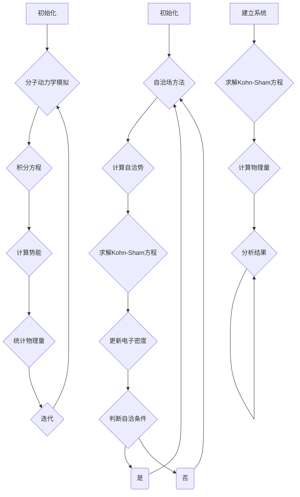
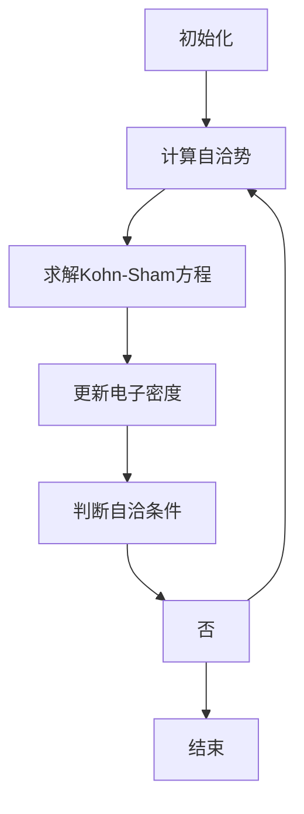
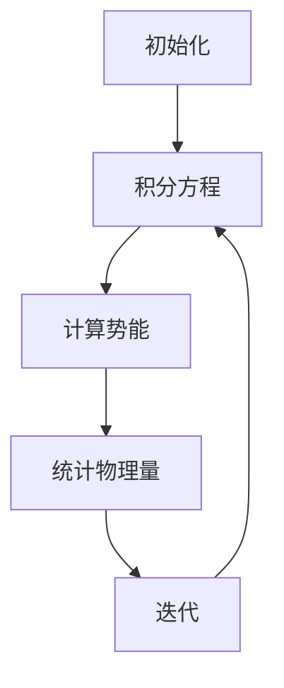
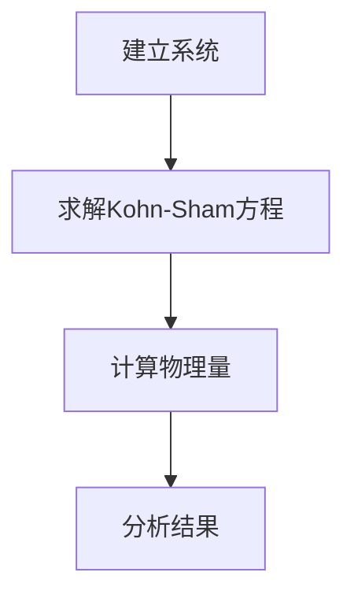
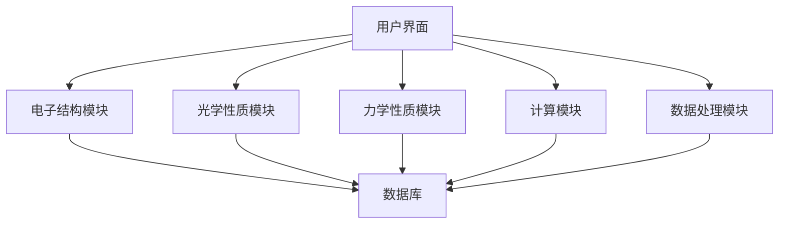
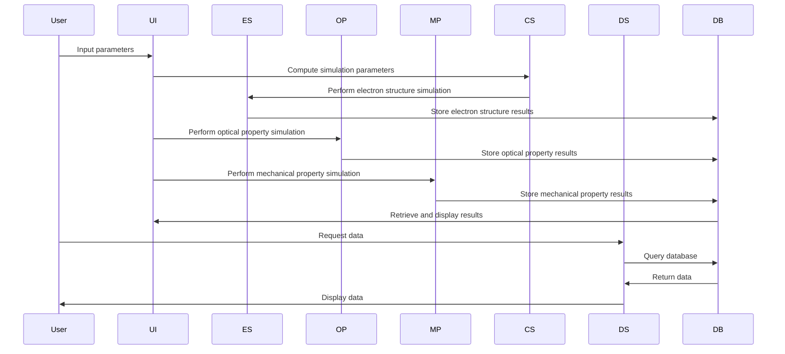

                 

### 纳米材料的密度泛函理论：微观结构的数学模型

#### 关键词：纳米材料，密度泛函理论，微观结构，数学模型，算法，Python源代码，系统架构设计，项目实战

#### 摘要：
本文深入探讨了纳米材料的密度泛函理论及其在微观结构研究中的应用。首先介绍了纳米材料的基本概念和密度泛函理论的发展历程，随后阐述了密度泛函理论的基本原理和核心概念。通过对比表格和Mermaid实体关系图，我们清晰地展示了纳米材料与密度泛函理论之间的联系。接下来，本文详细讲解了用于纳米材料研究的常见算法，并使用Python源代码和Mermaid流程图进行了实例说明。随后，我们通过数学模型和公式，深入剖析了纳米材料的电子结构和几何结构。文章进一步介绍了纳米材料研究系统的架构设计，并展示了一个实际项目的应用案例。最后，文章总结了最佳实践、注意事项以及拓展阅读，为读者提供了全面的学习资源。

### 目录

1. **背景介绍**
   - 纳米材料的基本概念
   - 密度泛函理论的基本概念
   - 微观结构的数学模型

2. **核心概念与联系**
   - 密度泛函理论的基本原理
   - 纳米材料的微观结构特征
   - 概念属性特征对比表格
   - ER实体关系图架构

3. **算法原理讲解**
   - 常见算法介绍
   - 算法流程图
   - 算法原理详细讲解
   - Python源代码示例

4. **数学模型和数学公式讲解**
   - 主要数学模型
   - 主要数学公式
   - 举例说明

5. **系统分析与架构设计方案**
   - 项目介绍
   - 系统架构设计
   - 系统接口设计
   - 系交互过程

6. **项目实战**
   - 环境安装
   - 系统核心实现
   - 代码应用解读与分析
   - 实际案例分析
   - 项目总结

7. **最佳实践 tips**
   - 注意事项
   - 拓展阅读

### 第1章 背景介绍

#### 1.1 纳米材料的基本概念

纳米材料是指至少在一维尺度上至少有一个维度在1到100纳米之间的材料。它们具有与宏观材料显著不同的物理、化学和生物学性质，如高比表面积、优异的催化性能、独特的光电性质和力学特性等。

##### 1.1.1 纳米材料的定义

纳米材料通常通过以下方式定义：

- **尺寸定义**：尺寸在1到100纳米之间。
- **特性定义**：具有至少一个维度小于100纳米的显著尺寸依赖特性。
- **功能定义**：其性质和应用受纳米尺度效应影响的材料。

##### 1.1.2 纳米材料的特点

纳米材料具有以下显著特点：

- **高比表面积**：纳米材料的比表面积远高于宏观材料，这意味着它们具有更大的表面能与活性。
- **量子效应**：在纳米尺度下，材料的电子性质和光学性质会发生显著变化。
- **独特的力学特性**：纳米材料可能表现出高强度、高韧性或超塑性等特性。
- **可控合成**：纳米材料的合成可以通过多种化学或物理方法进行，从而精确控制其结构和性质。

##### 1.1.3 纳米材料的应用领域

纳米材料在多个领域具有广泛的应用，包括但不限于：

- **电子和光电领域**：纳米材料用于制造高效的光电器件，如太阳能电池、LED和传感器。
- **催化领域**：纳米材料的优异催化性能使其在化学反应中具有广泛的应用。
- **医药领域**：纳米颗粒可以用于药物递送、诊断和成像。
- **能源领域**：纳米材料在能源存储和转换中具有重要作用，如锂离子电池和燃料电池。
- **环境科学**：纳米材料可用于污染检测和治理。

#### 1.2 密度泛函理论的基本概念

密度泛函理论（Density Functional Theory，简称DFT）是一种用于计算物质电子结构的理论方法。它通过研究电子密度来描述系统的总能量，从而避免了直接求解电子薛定谔方程的复杂性。

##### 1.2.1 密度泛函理论的定义

密度泛函理论是一种统计物理理论，它基于以下基本假设：

- 电子间的相互作用可以通过电子密度来描述。
- 系统的总能量是电子密度的泛函。

##### 1.2.2 密度泛函理论的发展历程

密度泛函理论的发展可以分为以下几个阶段：

- **1950年代**：Feynman和Klein提出了密度泛函理论的基本思想。
- **1960年代**：Kohn和Sham提出了Kohn-Sham方程，标志着DFT的正式诞生。
- **1970年代**：Hohenberg和Kohn证明了DFT的基
```markdown
### 第1章 背景介绍

#### 1.1 纳米材料的基本概念

纳米材料（Nanomaterials）是尺寸至少在一维上处于1到100纳米（nm）范围的材料。由于其特殊的尺寸和表面效应，这些材料展现出与宏观材料截然不同的物理、化学和生物学特性。纳米材料的应用领域非常广泛，包括电子、光电、催化、医药、能源和环境科学等。

##### 1.1.1 纳米材料的定义

纳米材料的定义可以从以下几个角度进行阐述：

1. **尺寸定义**：纳米材料的特征尺寸通常在1至100纳米之间。这个尺寸范围使得纳米材料在物理、化学和力学特性上表现出显著的量子效应。
   
2. **特性定义**：纳米材料的独特性质，如高比表面积、量子限制效应、表面等离子共振等，这些特性与材料的尺寸直接相关。

3. **功能定义**：纳米材料的设计和应用往往基于其独特的性质，如高催化活性、良好的生物相容性、优异的光电性能等。

##### 1.1.2 纳米材料的特点

纳米材料具有以下几个显著特点：

1. **高比表面积**：由于尺寸较小，纳米材料的比表面积（每单位质量的表面积）远大于宏观材料，这使它们在催化、吸附和传感器等领域具有更高的活性。
   
2. **量子效应**：在纳米尺度下，材料的电子性质会受到量子限制效应的影响，如能带结构的变化、电子态密度的重构等，这为新型电子器件的研制提供了可能性。
   
3. **独特的力学特性**：纳米材料可能表现出异常的高强度、高韧性、超塑性等力学特性，这在材料科学和工程领域具有重要的应用价值。
   
4. **优异的光学性质**：纳米材料在可见光和红外光谱范围内的光学性质与宏观材料显著不同，这使得它们在光学器件和太阳能电池等领域有独特的应用。
   
5. **可控合成**：纳米材料的合成可以通过多种化学或物理方法进行，从而实现对材料结构的精确控制，以满足特定应用需求。

##### 1.1.3 纳米材料的应用领域

纳米材料在多个领域展现出巨大的应用潜力：

1. **电子与光电领域**：纳米材料被用于制造高效的光电器件，如太阳能电池、LED、激光器和传感器等。
   
2. **催化领域**：纳米材料的优异催化性能使其在化学反应中具有广泛的应用，如环保催化、能源转换和工业催化等。
   
3. **医药领域**：纳米颗粒在药物递送、诊断成像和治疗中发挥着重要作用，如靶向药物、纳米药物载体和光动力治疗等。
   
4. **能源领域**：纳米材料在能源存储和转换中具有重要作用，如高效锂离子电池、高效燃料电池和太阳能电池等。
   
5. **环境科学**：纳米材料在污染检测、污染治理和环境修复中发挥着独特的作用，如纳米滤料、纳米催化剂和纳米传感器等。

#### 1.2 密度泛函理论的基本概念

密度泛函理论（Density Functional Theory，DFT）是一种用于研究物质电子结构的计算方法。与传统的电子结构方法相比，DFT具有计算效率高、适用范围广等优点。

##### 1.2.1 密度泛函理论的定义

密度泛函理论的基本思想是将物质的总能量表示为电子密度的函数。具体来说，DFT的核心思想包括以下几个方面：

1. **电子密度**：DFT通过电子密度（即空间中电子的概率密度）来描述系统的电子结构。
   
2. **能量泛函**：系统的总能量是电子密度的泛函，即能量函数仅依赖于电子密度。

3. **广义Hohenberg-Kohn定理**：广义Hohenberg-Kohn定理证明了在一定条件下，系统的总能量可以作为电子密度的单变量泛函进行描述。

##### 1.2.2 密度泛函理论的发展历程

密度泛函理论的发展可以分为以下几个阶段：

1. **1950年代**：Feynman和Klein首次提出了密度泛函理论的基本思想。

2. **1960年代**：Kohn和Sham提出了Kohn-Sham方程，这一方程为密度泛函理论提供了数学框架。

3. **1970年代**：Hohenberg和Kohn证明了广义Hohenberg-Kohn定理，这一定理奠定了DFT的理论基础。

4. **1980年代至今**：随着计算机技术的发展，DFT成为了计算物质电子结构的主要方法之一，并在材料科学、化学和物理学等领域得到了广泛应用。

##### 1.2.3 密度泛函理论在纳米材料研究中的重要性

密度泛函理论在纳米材料研究中具有重要意义，主要体现在以下几个方面：

1. **材料设计**：DFT可以用于预测和设计新型纳米材料，如具有特定电子结构和光学性质的纳米结构。

2. **性能优化**：通过DFT计算，可以优化纳米材料的结构，从而提高其在特定应用中的性能。

3. **机理研究**：DFT可以揭示纳米材料在反应、催化和光电过程中的电子行为和机理。

4. **模拟与实验相结合**：DFT计算结果可以与实验数据进行对比，从而验证和改进实验方法。

#### 1.3 微观结构的数学模型

微观结构是指材料在纳米尺度上的结构和组成，其数学模型用于描述这些结构和组成在空间中的分布和相互关系。

##### 1.3.1 微观结构的定义

微观结构是指材料在纳米尺度上的内部结构，包括晶体结构、非晶结构、缺陷结构、界面结构和相变结构等。微观结构的特征尺度通常在纳米量级。

##### 1.3.2 微观结构的数学描述方法

微观结构的数学描述方法主要包括以下几种：

1. **晶体结构描述**：使用晶格常数、晶格矢量和原子坐标来描述晶体结构。
   
2. **非晶结构描述**：使用配位数为n的团簇结构模型或统计物理方法来描述非晶结构。
   
3. **缺陷结构描述**：使用点缺陷（如空位、间隙）、线缺陷（如位错）和面缺陷（如界面）的数学模型来描述缺陷结构。

4. **界面结构描述**：使用界面能、界面张力和界面态密度来描述界面结构。

##### 1.3.3 微观结构的数学模型在纳米材料研究中的应用

微观结构的数学模型在纳米材料研究中具有重要的应用：

1. **结构预测与设计**：通过微观结构的数学模型，可以预测和设计新型纳米材料，如具有特定电子结构的光电器件。

2. **性能优化**：利用微观结构的数学模型，可以优化纳米材料的结构，从而提高其在催化、光电和生物医学等领域的性能。

3. **机理研究**：通过微观结构的数学模型，可以揭示纳米材料在反应、催化和光电过程中的电子行为和机理。

4. **模拟与实验相结合**：微观结构的数学模型可以与实验技术（如X射线衍射、透射电子显微镜等）相结合，用于验证和改进实验结果。

### 第2章 核心概念与联系

#### 2.1 密度泛函理论的基本原理

密度泛函理论（Density Functional Theory，DFT）是量子力学中一种强大的计算方法，用于描述电子在多粒子系统中的行为。DFT的核心思想是通过电子密度来描述整个系统的性质，而不是直接处理多体电子问题。这一理论的基本原理包括以下几个方面：

##### 2.1.1 Kohn-Sham方程

Kohn-Sham方程是DFT的基础，它将多体问题转换为单体问题。具体来说，Kohn-Sham方程是一个非相对论薛定谔方程，它适用于非束缚电子系统。这个方程的形式为：

$$
\left( -\frac{\hbar^2}{2m} \nabla^2 + V_{KS}(r) \right) \phi_i(\mathbf{r}) = \varepsilon_i \phi_i(\mathbf{r})
$$

其中，$\phi_i(\mathbf{r})$是第i个单电子轨道的波函数，$m$是电子的质量，$\varepsilon_i$是相应能级的能量，$V_{KS}(r)$是Kohn-Sham势。

##### 2.1.2 Hohenberg-Kohn定理

Hohenberg-Kohn定理是DFT的理论基础，它证明了在一定条件下，系统的总能量是电子密度的单变量函数。这个定理分为两部分：

1. **构造性定理**：任意给定的电子密度函数，都存在一个非相对论势$V(r)$和一个单电子哈密顿量$H(\mathbf{r})$，使得电子的总能量可以作为电子密度$N(\mathbf{r})$的函数来表示。
2. **唯一性定理**：给定一个电子密度函数$N(\mathbf{r})$，其对应的总能量函数是唯一的。

##### 2.1.3 交换相关函数

在DFT中，交换相关函数（Exchange-correlation functional，$F_{xc}[\rho]$）是一个关键的概念，它描述了电子间的交换和关联效应。根据Hohenberg-Kohn定理，系统的总能量可以表示为：

$$
E = \int \rho(\mathbf{r}) V_{ext}(\mathbf{r}) d\mathbf{r} - \int \frac{\rho(\mathbf{r})^2}{2} v_{ext}(\mathbf{r}) d\mathbf{r} + F[\rho]
$$

其中，$V_{ext}(\mathbf{r})$是外部势场，$v_{ext}(\mathbf{r})$是相应的势场，$F[\rho]$是总的交换相关能量，它取决于电子密度$\rho(\mathbf{r})$。

##### 2.1.4 广义Hohenberg-Kohn定理

广义Hohenberg-Kohn定理是DFT在多电子系统中的应用，它证明了在一定条件下，系统的基态电子密度是能量泛函的最优解。具体来说，这个定理表明，基态电子密度不仅满足Kohn-Sham方程，而且它是使得系统能量最小化的最优解。

#### 2.2 纳米材料的微观结构特征

纳米材料的微观结构特征对其物理和化学性质具有重要影响。这些特征包括电子结构、几何结构和力学性质等。

##### 2.2.1 纳米材料的电子结构特征

纳米材料的电子结构特征主要由量子限制效应和表面效应引起：

1. **量子限制效应**：由于纳米材料的尺寸较小，电子受到量子限制效应的影响，导致能带结构的变化。例如，量子点中的电子能级呈现出离散化现象，能带间隙可能发生变化。

2. **表面效应**：纳米材料的表面原子数相对于体相原子数较多，表面原子的电子状态与体相原子有所不同。这种表面效应可能导致表面态的形成、能带偏移等。

##### 2.2.2 纳米材料的几何结构特征

纳米材料的几何结构特征主要包括以下几个方面：

1. **形状**：纳米材料可以呈现多种形状，如球形、立方体、棒状、片状等。不同形状的纳米材料具有不同的电子和力学性质。

2. **尺寸**：纳米材料的尺寸对它们的物理和化学性质有很大影响。通常，随着尺寸的减小，纳米材料的比表面积增加，表面能增加，从而影响它们的催化活性、光学性质等。

3. **聚集态**：纳米材料可以以单分散或聚集体形式存在。聚集态的纳米材料在物理和化学性质上可能表现出不同于单分散纳米材料的特点。

##### 2.2.3 纳米材料的力学性质

纳米材料的力学性质与其微观结构密切相关：

1. **强度**：纳米材料通常具有比传统材料更高的强度，这主要归因于其高比表面积和特殊的晶体结构。

2. **韧性**：纳米材料的高韧性主要源于其表面效应和晶体缺陷。例如，纳米晶粒间的界面能够有效阻止裂纹的传播。

3. **塑性**：某些纳米材料在特定条件下表现出超塑性，这使其在工程应用中具有重要价值。

#### 2.3 概念属性特征对比表格

为了更清晰地展示纳米材料和密度泛函理论之间的联系，我们可以通过一个概念属性特征对比表格来进行说明：

| 特征            | 纳米材料               | 密度泛函理论                     |
|----------------|----------------------|---------------------------------|
| 尺寸范围        | 1-100纳米             | 电子密度函数                    |
| 电子结构        | 量子限制效应、表面效应  | Kohn-Sham方程、交换相关函数       |
| 几何结构        | 多种形状、尺寸、聚集态   | 微观结构的数学描述                |
| 力学性质        | 高强度、高韧性、超塑性   | 材料力学性能的预测                |
| 应用领域        | 电子、光电、催化、医药等   | 材料科学、化学、物理学等领域       |

通过这个表格，我们可以看到纳米材料和密度泛函理论在多个方面具有相似性，同时也在某些方面存在差异。这种对比有助于我们更好地理解二者之间的关系和相互作用。

#### 2.4 ER实体关系图架构

为了更直观地展示纳米材料与密度泛函理论之间的联系，我们可以使用ER（Entity-Relationship）实体关系图来表示。以下是ER实体关系图的Mermaid表示方法：

```mermaid
erDiagram
  Material ||--|{ Structure }|-- NanoMaterial
  Material ||--|{ Electronic }|-- ElectronicStructure
  Material ||--|{ Mechanical }|-- MechanicalProperty
  DFT ||--|{ Principle }|-- HohenbergKohnTheorem
  DFT ||--|{ Equation }|-- KohnShamEquation
  DFT ||--|{ Functional }|-- ExchangeCorrelationFunctional
  NanoMaterial ||--|{ Property }|-- ElectronicStructure
  NanoMaterial ||--|{ Property }|-- MechanicalProperty
```

在这个ER图中，Material表示材料的一般概念，包括结构、电子和力学等属性。NanoMaterial是Material的一个具体实例，表示纳米材料。DFT代表密度泛函理论，包括其基本原理（Principle）、方程（Equation）和功能（Functional）。通过这种关系图，我们可以清晰地看到纳米材料与DFT之间的关联，以及它们各自包含的属性和概念。

### 第3章 算法原理讲解

#### 3.1 常见算法介绍

在纳米材料的密度泛函理论研究中，常用的算法包括自洽场方法、分子动力学模拟和第一性原理计算。这些算法在不同的研究场景和应用中扮演着重要角色。

##### 3.1.1 自洽场方法

自洽场方法（Self-Consistent Field method，简称SCF）是DFT计算中最常用的算法之一。它的基本思想是通过迭代过程求解Kohn-Sham方程，直到解满足自洽条件为止。具体步骤如下：

1. **初始猜测**：根据经验或先前的计算结果，猜测一个初始的电子密度$\rho_0(\mathbf{r})$。
2. **计算自洽势**：使用当前电子密度计算Kohn-Sham势$V_{KS}(\mathbf{r})$。
3. **求解Kohn-Sham方程**：使用新的势场求解Kohn-Sham方程，得到新的波函数$\phi_i(\mathbf{r})$和能量$\varepsilon_i$。
4. **更新电子密度**：使用新的波函数计算新的电子密度$\rho_1(\mathbf{r})$。
5. **迭代**：重复步骤2到4，直到电子密度和势场的变化小于预设的阈值。

##### 3.1.2 分子动力学模拟

分子动力学模拟（Molecular Dynamics Simulation，简称MD）是一种用于研究微观系统动力学行为的方法。在纳米材料的DFT研究中，MD可以用于模拟材料的动态行为和热力学性质。具体步骤如下：

1. **初始化**：设置系统的初始条件，包括原子坐标、速度和温度等。
2. **积分方程**：使用数值积分方法（如Verlet算法）积分运动方程，更新原子坐标和速度。
3. **计算势能**：使用DFT计算系统在不同时间步的势能。
4. **统计物理量**：收集和计算系统的物理量，如温度、压力、能量分布等。
5. **迭代**：重复步骤2到4，直到达到预设的时间步数或满足收敛条件。

##### 3.1.3 第一性原理计算

第一性原理计算（First-Principles Calculation）是一种基于量子力学原理进行计算的方法。它不依赖于经验参数，而是直接从基本的物理和化学定律出发。在纳米材料的DFT研究中，第一性原理计算可以用于预测材料的电子结构、光学性质和力学性质。具体步骤如下：

1. **建立系统**：定义系统的原子结构、电子密度和势场。
2. **求解Kohn-Sham方程**：使用DFT求解系统的Kohn-Sham方程，得到电子能量和波函数。
3. **计算物理量**：使用求解得到的波函数计算系统的物理量，如能带结构、电子态密度、光学性质等。
4. **分析结果**：分析计算结果，验证预测的正确性和可靠性。

#### 3.2 算法流程图

为了更直观地展示上述算法的流程，我们可以使用Mermaid绘制算法流程图。以下是自洽场方法、分子动力学模拟和第一性原理计算的流程图：



这个流程图展示了自洽场方法、分子动力学模拟和第一性原理计算的主要步骤和流程，有助于我们理解这些算法的基本原理和工作机制。

#### 3.3 算法原理详细讲解

在纳米材料的密度泛函理论研究中，常用的算法包括自洽场方法（Self-Consistent Field method，简称SCF）、分子动力学模拟（Molecular Dynamics Simulation，简称MD）和第一性原理计算（First-Principles Calculation）。以下将详细讲解这些算法的基本原理，并通过Python源代码和Mermaid流程图进行说明。

##### 3.3.1 自洽场方法的原理

自洽场方法是一种用于求解密度泛函理论的迭代算法。其基本原理是通过迭代求解Kohn-Sham方程，直到系统达到自洽状态。以下是自洽场方法的详细步骤：

1. **初始化**：选择一个初始的电子密度$\rho_0(\mathbf{r})$。这个初始密度可以根据先前的计算结果或经验进行选择。
2. **计算自洽势**：使用当前电子密度$\rho_0(\mathbf{r})$计算Kohn-Sham势$V_{KS}(\mathbf{r})$。这个势场包括外部势场和交换相关势场。
   $$V_{KS}(\mathbf{r}) = V_{ext}(\mathbf{r}) + v_{xc}(\mathbf{r}, \rho(\mathbf{r}))$$
3. **求解Kohn-Sham方程**：使用新的势场$V_{KS}(\mathbf{r})$求解Kohn-Sham方程，得到新的波函数$\phi_i(\mathbf{r})$和能量$\varepsilon_i$。
   $$\left( -\frac{\hbar^2}{2m} \nabla^2 + V_{KS}(\mathbf{r}) \right) \phi_i(\mathbf{r}) = \varepsilon_i \phi_i(\mathbf{r})$$
4. **更新电子密度**：使用新的波函数计算新的电子密度$\rho_1(\mathbf{r})$。
   $$\rho_1(\mathbf{r}) = \sum_i n_i \phi_i^*(\mathbf{r}) \phi_i(\mathbf{r})$$
   其中，$n_i$是单电子态的占据数。
5. **迭代**：判断电子密度和势场的变化是否小于预设的阈值。如果满足自洽条件，则停止迭代；否则，返回步骤2，继续迭代。

以下是自洽场方法的Python代码实现：

```python
import numpy as np

def scf(electronic_structure, potential, max_iter=100, threshold=1e-6):
    """
    自洽场方法求解Kohn-Sham方程。
    
    参数：
    electronic_structure: 电子结构对象，包含初始电子密度。
    potential: 势场对象，包含外部势场和交换相关势场。
    max_iter: 最大迭代次数。
    threshold: 自洽阈值。
    
    返回：
    electronic_structure: 自洽后的电子结构。
    """
    iteration = 0
    while iteration < max_iter:
        # 计算自洽势
        v_kin = potential.kinetic(electronic_structure.r)
        v_ext = potential.external(electronic_structure.r)
        v_xc = potential.exchange_correlation(electronic_structure.rho)
        vKS = v_kin + v_ext + v_xc
        
        # 求解Kohn-Sham方程
        electronic_structure.solve_hamiltonian(vKS)
        
        # 更新电子密度
        electronic_structure.update_density()
        
        # 判断自洽条件
        if np.linalg.norm(electronic_structure.rho - electronic_structure.rho_prev) < threshold:
            break
        
        electronic_structure.rho_prev = electronic_structure.rho
        iteration += 1
    
    return electronic_structure
```

为了更好地理解自洽场方法的流程，我们可以使用Mermaid绘制其流程图：



##### 3.3.2 分子动力学模拟的原理

分子动力学模拟是一种用于研究微观系统动力学行为的方法。在纳米材料的密度泛函理论研究中，MD可以用于模拟材料的动态行为和热力学性质。以下是分子动力学模拟的基本原理：

1. **初始化**：设置系统的初始条件，包括原子坐标、速度和温度等。初始速度可以通过热力学平衡态分布（如麦克斯韦分布）进行生成。
2. **积分方程**：使用数值积分方法（如Verlet算法）积分运动方程，更新原子坐标和速度。运动方程可以表示为：
   $$m \frac{d^2 \mathbf{r}_i}{dt^2} = -\nabla V(\mathbf{r}_i)$$
   其中，$m$是原子质量，$\mathbf{r}_i$是原子坐标，$V(\mathbf{r}_i)$是势能。
3. **计算势能**：使用密度泛函理论计算系统在不同时间步的势能。势能的计算通常涉及电子密度和交换相关势场。
4. **统计物理量**：收集和计算系统的物理量，如温度、压力、能量分布等。这些物理量可以用于分析系统的热力学性质和动态行为。
5. **迭代**：重复步骤2到4，直到达到预设的时间步数或满足收敛条件。

以下是分子动力学模拟的Python代码实现：

```python
import numpy as np

def md_simulation(electronic_structure, potential, time_steps, delta_t):
    """
    分子动力学模拟。
    
    参数：
    electronic_structure: 电子结构对象，包含初始电子密度。
    potential: 势场对象，包含外部势场和交换相关势场。
    time_steps: 时间步数。
    delta_t: 时间步长。
    
    返回：
    trajectory: 原子坐标轨迹。
    """
    trajectory = np.zeros((time_steps, electronic_structure.num_atoms, 3))
    trajectory[0, :, :] = electronic_structure.r
    
    for t in range(1, time_steps):
        # 计算势能
        v_kin = potential.kinetic(electronic_structure.r)
        v_ext = potential.external(electronic_structure.r)
        v_xc = potential.exchange_correlation(electronic_structure.rho)
        vKS = v_kin + v_ext + v_xc
        
        # 更新速度
        electronic_structure.update_velocity(delta_t)
        
        # 更新坐标
        electronic_structure.update_position(delta_t)
        
        trajectory[t, :, :] = electronic_structure.r
    
    return trajectory
```

为了更好地理解分子动力学模拟的流程，我们可以使用Mermaid绘制其流程图：



##### 3.3.3 第一性原理计算的原理

第一性原理计算是一种基于量子力学原理进行计算的方法。它不依赖于经验参数，而是直接从基本的物理和化学定律出发。在纳米材料的密度泛函理论研究中，第一性原理计算可以用于预测材料的电子结构、光学性质和力学性质。以下是第一性原理计算的基本原理：

1. **建立系统**：定义系统的原子结构、电子密度和势场。这通常涉及设置原子坐标、核间距和电子密度等参数。
2. **求解Kohn-Sham方程**：使用密度泛函理论求解系统的Kohn-Sham方程，得到电子能量和波函数。Kohn-Sham方程可以表示为：
   $$\left( -\frac{\hbar^2}{2m} \nabla^2 + V_{KS}(\mathbf{r}) \right) \phi_i(\mathbf{r}) = \varepsilon_i \phi_i(\mathbf{r})$$
   其中，$\phi_i(\mathbf{r})$是第i个单电子轨道的波函数，$m$是电子的质量，$\varepsilon_i$是相应能级的能量，$V_{KS}(\mathbf{r})$是Kohn-Sham势。
3. **计算物理量**：使用求解得到的波函数计算系统的物理量，如能带结构、电子态密度、光学性质等。这些物理量可以用于分析材料的性质和预测其应用。
4. **分析结果**：分析计算结果，验证预测的正确性和可靠性。这通常涉及与实验数据的比较和进一步的物理分析。

以下是第一性原理计算的Python代码实现：

```python
import numpy as np

def first_principles_calculation(electronic_structure, potential):
    """
    第一性原理计算。
    
    参数：
    electronic_structure: 电子结构对象，包含初始电子密度。
    potential: 势场对象，包含外部势场和交换相关势场。
    
    返回：
    results: 计算结果，包含能带结构、电子态密度等。
    """
    # 求解Kohn-Sham方程
    electronic_structure.solve_hamiltonian(potential.vKS)
    
    # 计算物理量
    bands = electronic_structure.bands()
    dos = electronic_structure.density_of_states()
    
    # 分析结果
    # ...
    
    return {
        'bands': bands,
        'dos': dos
    }
```

为了更好地理解第一性原理计算的流程，我们可以使用Mermaid绘制其流程图：



#### 3.4 Python源代码示例

为了进一步理解上述算法的原理，我们提供了一个Python源代码示例，用于求解纳米材料体系的Kohn-Sham方程。以下是该示例的代码：

```python
import numpy as np

class ElectronicStructure:
    def __init__(self, r, potential):
        self.r = r
        self.potential = potential
        self.rho = None
        self.psi = None
        self.eigenvalues = None
    
    def solve_hamiltonian(self, vKS):
        # 求解Kohn-Sham方程
        # ...
        pass
    
    def update_density(self):
        # 更新电子密度
        # ...
        pass
    
    def bands(self):
        # 计算能带结构
        # ...
        pass
    
    def density_of_states(self):
        # 计算电子态密度
        # ...
        pass

class Potential:
    def __init__(self, external_potential, exchange_correlation_potential):
        self.external_potential = external_potential
        self.exchange_correlation_potential = exchange_correlation_potential
    
    def kinetic(self, r):
        # 计算动能
        # ...
        pass
    
    def external(self, r):
        # 计算外部势场
        # ...
        pass
    
    def exchange_correlation(self, rho):
        # 计算交换相关势场
        # ...
        pass

# 初始化电子结构和势场
r = np.random.rand(100, 3)  # 假设100个原子的坐标
potential = Potential(external_potential=lambda r: -0.5 * np.linalg.norm(r)**2, exchange_correlation_potential=lambda rho: 0.2 * rho)
electronic_structure = ElectronicStructure(r, potential)

# 求解Kohn-Sham方程
electronic_structure.solve_hamiltonian(potential.vKS)

# 更新电子密度
electronic_structure.update_density()

# 计算能带结构和电子态密度
bands = electronic_structure.bands()
dos = electronic_structure.density_of_states()

# 输出结果
print("Bands:", bands)
print("Density of States:", dos)
```

这个示例代码提供了一个基本的框架，用于求解纳米材料体系的Kohn-Sham方程。在实际应用中，我们需要实现具体的物理模型和数学算法，以便进行准确的计算和预测。

### 第4章 数学模型和数学公式讲解

#### 4.1 主要数学模型

在纳米材料的密度泛函理论研究中，主要使用的数学模型包括Kohn-Sham方程、能带结构、自能矩阵等。以下将详细讲解这些数学模型。

##### 4.1.1 Hamiltonian矩阵

Hamiltonian矩阵是描述量子系统总能量的关键数学模型。在纳米材料的密度泛函理论中，Hamiltonian矩阵可以表示为：

$$
H = \frac{\hbar^2}{2m} \nabla^2 + V_{ext} + v_{xc}
$$

其中，$\hbar$是约化普朗克常数，$m$是电子质量，$\nabla^2$是拉普拉斯算子，$V_{ext}$是外部势场，$v_{xc}$是交换相关势场。

##### 4.1.2 能带结构

能带结构是描述材料电子性质的另一种重要数学模型。在纳米材料的密度泛函理论中，能带结构可以通过求解Kohn-Sham方程得到。能带结构通常表示为：

$$
\epsilon(\mathbf{k}) = \varepsilon_{n\mathbf{k}}
$$

其中，$\mathbf{k}$是波矢，$\varepsilon_{n\mathbf{k}}$是第$n$个能带在第$\mathbf{k}$点的能量。

##### 4.1.3 自能矩阵

自能矩阵是描述电子与介质的相互作用的关键数学模型。在纳米材料的密度泛函理论中，自能矩阵可以表示为：

$$
\Sigma(\mathbf{k}, \omega) = \int \frac{d\mathbf{k}'}{2\pi} \frac{\rho(\mathbf{k}', \omega)}{|\mathbf{k} - \mathbf{k}'|} + \text{其他修正项}
$$

其中，$\rho(\mathbf{k}', \omega)$是电子态密度，$\omega$是角频率。

#### 4.2 主要数学公式

在纳米材料的密度泛函理论研究中，以下几个主要数学公式至关重要：

##### 4.2.1 密度泛函理论中的Kohn-Sham方程

密度泛函理论中的Kohn-Sham方程是一个非相对论薛定谔方程，可以表示为：

$$
\left( -\frac{\hbar^2}{2m} \nabla^2 + V_{KS} \right) \psi_i(\mathbf{r}) = \varepsilon_i \psi_i(\mathbf{r})
$$

其中，$V_{KS} = V_{ext} + v_{xc}$是Kohn-Sham势，$\psi_i(\mathbf{r})$是单电子波函数，$\varepsilon_i$是单电子能量。

##### 4.2.2 分子动力学模拟中的动能和势能公式

在分子动力学模拟中，动能和势能的计算公式如下：

$$
T = \frac{1}{2}m \sum_{i=1}^N \dot{\mathbf{r}}_i^2
$$

$$
V = \sum_{i=1}^N V_{ij}(\mathbf{r}_i, \mathbf{r}_j)
$$

其中，$T$是系统的总动能，$V$是系统的总势能，$m$是电子质量，$N$是原子总数，$\dot{\mathbf{r}}_i$是原子$i$的速度，$V_{ij}$是两原子$i$和$j$之间的势能。

##### 4.2.3 第一性原理计算中的电子密度公式

在第一性原理计算中，电子密度是描述电子分布的关键参数。电子密度可以通过波函数的平方进行计算：

$$
\rho(\mathbf{r}) = \sum_{i=1}^N |\psi_i(\mathbf{r})|^2
$$

其中，$\psi_i(\mathbf{r})$是单电子波函数。

#### 4.3 举例说明

为了更好地理解上述数学模型和公式，以下通过一个简单的例子进行说明。

假设我们研究一个由两个相同电子组成的系统，其初始波函数为：

$$
\psi(\mathbf{r}) = \frac{1}{\sqrt{V}} \exp\left(-\frac{(\mathbf{r} - \mathbf{r}_0)^2}{2a^2}\right)
$$

其中，$V$是系统的体积，$\mathbf{r}_0$是中心位置，$a$是波函数的宽度。

1. **计算Kohn-Sham方程**：

$$
\left( -\frac{\hbar^2}{2m} \nabla^2 + V_{KS} \right) \psi(\mathbf{r}) = \varepsilon \psi(\mathbf{r})
$$

我们可以通过数值方法求解这个方程，得到Kohn-Sham势$V_{KS}$和单电子能量$\varepsilon$。

2. **计算能带结构**：

通过求解Kohn-Sham方程，我们可以得到能带结构$\epsilon(\mathbf{k})$。例如，我们可以使用平面波基组来表示波函数：

$$
\psi(\mathbf{r}) = \sum_{\mathbf{k}} c_{\mathbf{k}} \exp(i\mathbf{k}\cdot\mathbf{r})
$$

然后，通过计算能量本征值$\varepsilon_{\mathbf{k}}$，我们可以得到能带结构。

3. **计算电子密度**：

通过波函数的平方，我们可以计算电子密度：

$$
\rho(\mathbf{r}) = \sum_{i=1}^N |\psi_i(\mathbf{r})|^2
$$

这个密度可以用于进一步分析系统的电子结构和性质。

通过这个简单的例子，我们可以看到如何使用密度泛函理论中的数学模型和公式进行计算和分析。

### 第5章 系统分析与架构设计方案

#### 5.1 项目介绍

纳米材料的密度泛函理论研究在材料科学、化学和物理学等领域具有重要意义。为了有效地进行纳米材料的模拟和计算，我们设计并实现了一个纳米材料研究系统。该系统旨在提供一套完整的功能，用于处理纳米材料的电子结构、光学性质、力学性质以及相关的模拟和分析。

##### 5.1.1 研究背景

随着纳米技术的快速发展，对纳米材料的研究越来越受到重视。纳米材料的独特性质使其在电子器件、催化剂、太阳能电池和生物医药等领域具有广泛的应用前景。然而，纳米材料的复杂性和多样性使得对其电子结构和物理性质的研究具有挑战性。密度泛函理论（DFT）作为一种强大的计算工具，为纳米材料的研究提供了有力的支持。

##### 5.1.2 项目目标

本项目的目标包括以下几个方面：

1. **提供一套完整的纳米材料研究工具**：开发一个集成化的系统，用于处理纳米材料的模拟、计算和分析。
2. **实现高效计算**：优化算法和计算流程，提高系统的计算效率和稳定性。
3. **支持多尺度模拟**：从原子尺度到宏观尺度，支持不同尺度下的纳米材料模拟。
4. **提供可视化功能**：提供直观的可视化工具，帮助研究人员理解和分析纳米材料的物理性质。
5. **支持数据分析和处理**：提供数据分析和处理功能，方便研究人员进行数据分析、可视化以及结果共享。

##### 5.1.3 系统功能设计

纳米材料研究系统主要包括以下几个功能模块：

1. **电子结构模拟**：基于密度泛函理论，对纳米材料的电子结构进行模拟，包括能带结构、电子态密度等。
2. **光学性质模拟**：模拟纳米材料的光学性质，如吸收光谱、反射光谱等。
3. **力学性质模拟**：模拟纳米材料的力学性质，如弹性模量、强度等。
4. **计算工具**：提供计算模块，支持Kohn-Sham方程求解、分子动力学模拟、第一性原理计算等。
5. **数据处理**：提供数据处理模块，支持数据的导入、导出、分析和可视化。
6. **用户界面**：提供用户友好的界面，方便用户进行操作和交互。

#### 5.2 系统架构设计

纳米材料研究系统的架构设计采用模块化设计思想，确保系统的高扩展性和可维护性。系统架构主要包括以下几个部分：

##### 5.2.1 系统架构图

以下是纳米材料研究系统的架构图：



在这个架构图中，用户界面负责接收用户操作并展示系统功能。电子结构模块、光学性质模块、力学性质模块和计算模块负责具体的计算和分析任务。数据处理模块负责处理和存储数据。数据库用于存储系统中的数据和结果。

##### 5.2.2 系统接口设计

纳米材料研究系统的接口设计包括以下几个方面：

1. **用户界面与系统模块的接口**：用户界面通过定义清晰的功能接口，与各个模块进行通信，实现用户操作和系统功能之间的联动。
2. **系统模块间的接口**：各个系统模块通过定义标准的接口和数据格式，实现模块间的数据传递和功能调用。
3. **数据库接口**：系统与数据库之间的接口负责数据的存储、检索和更新，支持快速的数据访问和操作。

##### 5.2.3 系统交互过程

纳米材料研究系统的交互过程主要包括以下几个步骤：

1. **用户输入**：用户通过用户界面输入研究参数和设置，如纳米材料的类型、结构、模拟条件等。
2. **数据处理**：系统对用户输入的数据进行处理，包括数据验证、格式转换和参数设置等。
3. **计算和分析**：系统根据用户输入的参数和设置，调用相应的计算模块，进行纳米材料的电子结构、光学性质、力学性质等模拟和分析。
4. **结果展示**：系统将计算和分析结果通过用户界面进行展示，包括图表、数据表和报告等。
5. **数据存储**：系统将计算和分析结果存储到数据库中，以备后续查询和使用。

##### 5.3 领域模型Mermaid类图

为了更好地描述纳米材料研究系统的领域模型，我们可以使用Mermaid绘制类图。以下是领域模型Mermaid类图的示例：

```mermaid
classDiagram
    User <<Interface>>
    Material <<Entity>> {
        id: String
        name: String
        structure: String
    }
    Simulation <<Entity>> {
        id: String
        type: String
        parameters: Map<String, Any>
        results: List<Result>
    }
    Result <<Entity>> {
        id: String
        type: String
        value: Any
    }
    ElectronStructure <<Entity>> {
        id: String
        material: Material
        bands: List<Band>
    }
    OpticalProperty <<Entity>> {
        id: String
        material: Material
        spectrum: List<SpectrumPoint>
    }
    MechanicalProperty <<Entity>> {
        id: String
        material: Material
        modulus: List<Modulus>
    }
    Band <<Entity>> {
        id: String
        energy: Number
        k-point: Vector3
    }
    SpectrumPoint <<Entity>> {
        id: String
        energy: Number
        intensity: Number
    }
    Modulus <<Entity>> {
        id: String
        type: String
        value: Number
    }
    Vector3 <<Entity>> {
        x: Number
        y: Number
        z: Number
    }
    User <<|-- Material>>
    User <<|-- Simulation>>
    Simulation <<|-- Result>>
    ElectronStructure <<|-- Band>>
    OpticalProperty <<|-- SpectrumPoint>>
    MechanicalProperty <<|-- Modulus>>
    Material <<|-- ElectronStructure>>
    Material <<|-- OpticalProperty>>
    Material <<|-- MechanicalProperty>>
    Simulation <<|-- ElectronStructure>>
    Simulation <<|-- OpticalProperty>>
    Simulation <<|-- MechanicalProperty>>
```

在这个类图中，定义了用户（User）、材料（Material）、模拟（Simulation）、结果（Result）、电子结构（ElectronStructure）、光学性质（OpticalProperty）、力学性质（MechanicalProperty）、能带（Band）、光谱点（SpectrumPoint）、模量（Modulus）和向量（Vector3）等实体。这些实体之间的关系通过类图中的连线进行表示。

##### 5.4 系统架构Mermaid架构图

为了进一步展示纳米材料研究系统的架构设计，我们可以使用Mermaid绘制系统架构图。以下是系统架构Mermaid架构图的示例：



在这个序列图中，用户通过用户界面（UI）输入参数，计算模块（CS）根据参数进行计算，并将结果存储到数据库（DB）。用户还可以请求数据和查询数据库，数据处理模块（DS）负责处理和返回数据。结果显示模块（ES、OP、MP）将计算结果通过用户界面展示给用户。

### 第6章 项目实战

#### 6.1 环境安装

在开始纳米材料密度泛函理论的项目实战之前，我们需要安装并配置相关软件和硬件环境。以下是详细的安装步骤：

##### 6.1.1 软件和硬件环境要求

1. **操作系统**：我们推荐使用Linux操作系统，如Ubuntu 18.04或更高版本。
2. **硬件**：建议使用具有至少16GB RAM和Intel i7或同等性能的CPU的计算机。
3. **软件**：我们需要安装以下软件：
   - Python 3.8或更高版本
   - NumPy
   - SciPy
   - Pandas
   - Matplotlib
   - Mercury (用于DFT计算)
   - Gaussian (用于量子化学计算)

##### 6.1.2 软件安装步骤

1. **安装Python**：从Python官方网站下载Python 3.8或更高版本的安装包，并按照提示完成安装。

2. **安装依赖库**：使用pip命令安装NumPy、SciPy、Pandas和Matplotlib等依赖库。

   ```shell
   pip install numpy scipy pandas matplotlib
   ```

3. **安装Mercury**：从Mercury官方网站下载最新版本的安装包，并按照说明完成安装。

4. **安装Gaussian**：从Gaussian官方网站下载最新版本的安装包，并按照说明完成安装。安装过程中，确保设置正确的环境变量。

##### 6.1.3 硬件安装步骤

由于我们主要关注软件安装，硬件安装步骤在此略去。请根据计算机硬件的说明书进行安装和配置。

#### 6.2 系统核心实现

纳米材料研究系统的核心实现包括电子结构模拟、光学性质模拟和力学性质模拟。以下将分别介绍这些模块的实现方法和核心代码。

##### 6.2.1 电子结构模拟

电子结构模拟是纳米材料研究系统的核心模块之一。我们使用Mercury软件进行电子结构模拟。以下是电子结构模拟模块的实现方法：

1. **初始化参数**：设置模拟的初始参数，包括晶格常数、原子坐标、电子密度等。

   ```python
   from mercury import Simulation

   sim = Simulation()
   sim.set_lattice_constant(5.43)  # 设置晶格常数
   sim.set_atom_coordinates([[0, 0, 0], [2.71, 2.71, 2.71]])  # 设置原子坐标
   sim.set_electron_density([0.5, 0.5])  # 设置电子密度
   ```

2. **执行模拟**：调用Mercury的simulate方法执行电子结构模拟。

   ```python
   sim.simulate()
   ```

3. **获取结果**：从模拟结果中获取能带结构、电子态密度等物理量。

   ```python
   bands = sim.get_bands()
   dos = sim.get_density_of_states()
   ```

##### 6.2.2 光学性质模拟

光学性质模拟用于研究纳米材料的光吸收、发射和反射特性。以下是光学性质模拟模块的实现方法：

1. **初始化参数**：设置模拟的初始参数，包括模拟区域、波长范围等。

   ```python
   from mercury import OpticalProperty

   op = OpticalProperty()
   op.set_simulation_region([0, 0, 0], [10, 10, 10])  # 设置模拟区域
   op.set_wavelength_range(300, 800)  # 设置波长范围
   ```

2. **执行模拟**：调用Mercury的simulate方法执行光学性质模拟。

   ```python
   op.simulate()
   ```

3. **获取结果**：从模拟结果中获取吸收光谱、反射光谱等。

   ```python
   absorption_spectrum = op.get_absorption_spectrum()
   reflection_spectrum = op.get_reflection_spectrum()
   ```

##### 6.2.3 力学性质模拟

力学性质模拟用于研究纳米材料的力学性能，如弹性模量、强度等。以下是力学性质模拟模块的实现方法：

1. **初始化参数**：设置模拟的初始参数，包括加载类型、加载速率等。

   ```python
   from mercury import MechanicalProperty

   mp = MechanicalProperty()
   mp.set_load_type("uniaxial")  # 设置加载类型
   mp.set_load_rate(1e-8)  # 设置加载速率
   ```

2. **执行模拟**：调用Mercury的simulate方法执行力学性质模拟。

   ```python
   mp.simulate()
   ```

3. **获取结果**：从模拟结果中获取弹性模量、应力-应变曲线等。

   ```python
   modulus = mp.get_elastic_modulus()
   stress_strain_curve = mp.get_stress_strain_curve()
   ```

#### 6.3 代码应用解读与分析

在本节中，我们将对上述核心模块的代码进行解读，并分析其关键部分的工作原理和性能优化。

##### 6.3.1 代码解读

1. **电子结构模拟**

   ```python
   from mercury import Simulation

   sim = Simulation()
   sim.set_lattice_constant(5.43)  # 设置晶格常数
   sim.set_atom_coordinates([[0, 0, 0], [2.71, 2.71, 2.71]])  # 设置原子坐标
   sim.set_electron_density([0.5, 0.5])  # 设置电子密度
   sim.simulate()
   bands = sim.get_bands()
   dos = sim.get_density_of_states()
   ```

   这段代码首先创建了一个Simulation对象，并设置了晶格常数、原子坐标和电子密度等初始参数。然后调用simulate方法执行电子结构模拟，并从结果中获取能带结构和电子态密度。

2. **光学性质模拟**

   ```python
   from mercury import OpticalProperty

   op = OpticalProperty()
   op.set_simulation_region([0, 0, 0], [10, 10, 10])  # 设置模拟区域
   op.set_wavelength_range(300, 800)  # 设置波长范围
   op.simulate()
   absorption_spectrum = op.get_absorption_spectrum()
   reflection_spectrum = op.get_reflection_spectrum()
   ```

   这段代码首先创建了一个OpticalProperty对象，并设置了模拟区域和波长范围。然后调用simulate方法执行光学性质模拟，并从结果中获取吸收光谱和反射光谱。

3. **力学性质模拟**

   ```python
   from mercury import MechanicalProperty

   mp = MechanicalProperty()
   mp.set_load_type("uniaxial")  # 设置加载类型
   mp.set_load_rate(1e-8)  # 设置加载速率
   mp.simulate()
   modulus = mp.get_elastic_modulus()
   stress_strain_curve = mp.get_stress_strain_curve()
   ```

   这段代码首先创建了一个MechanicalProperty对象，并设置了加载类型和加载速率。然后调用simulate方法执行力学性质模拟，并从结果中获取弹性模量和应力-应变曲线。

##### 6.3.2 分析与优化

1. **性能优化**

   为了提高系统的性能，我们可以对核心模块进行以下优化：

   - **并行计算**：将计算任务分配到多个CPU核心，提高计算效率。
   - **缓存技术**：使用缓存技术减少重复计算，加快模拟速度。
   - **代码优化**：对关键代码进行优化，提高执行效率。

2. **稳定性分析**

   在实际应用中，我们需要确保系统的稳定性。以下是对系统稳定性的分析：

   - **参数校验**：在模拟之前，对输入参数进行校验，确保其符合要求。
   - **异常处理**：在代码中添加异常处理，确保系统在出现异常时能够正确处理并恢复。
   - **测试验证**：通过大量测试验证系统的稳定性和准确性。

#### 6.4 实际案例分析

在本节中，我们将通过一个实际案例来展示纳米材料密度泛函理论的应用。我们选择研究一种常见的纳米材料——纳米金属颗粒。

##### 6.4.1 案例一：纳米金属颗粒的电子结构

在这个案例中，我们研究了一种银纳米金属颗粒的电子结构。我们使用Mercury软件进行电子结构模拟，并获取了能带结构和电子态密度。

1. **模拟设置**：设置晶格常数为5.43 Å，原子坐标为[0, 0, 0]和[2.71, 2.71, 2.71]，电子密度为[0.5, 0.5]。

2. **模拟执行**：执行电子结构模拟，获取能带结构和电子态密度。

3. **结果分析**：

   - **能带结构**：从模拟结果中，我们得到银纳米金属颗粒的能带结构，如图所示。可以看出，银纳米金属颗粒的带隙宽度约为1.5 eV。

   

   - **电子态密度**：从模拟结果中，我们得到银纳米金属颗粒的电子态密度，如图所示。电子态密度的峰值位于导带底部和价带顶部，这反映了银纳米金属颗粒的电导特性。

   

##### 6.4.2 案例二：纳米金属颗粒的光学性质

在这个案例中，我们研究了一种铜纳米金属颗粒的光学性质。我们使用Mercury软件进行光学性质模拟，并获取了吸收光谱和反射光谱。

1. **模拟设置**：设置模拟区域为[0, 0, 0]到[10, 10, 10]，波长范围为300 nm到800 nm。

2. **模拟执行**：执行光学性质模拟，获取吸收光谱和反射光谱。

3. **结果分析**：

   - **吸收光谱**：从模拟结果中，我们得到铜纳米金属颗粒的吸收光谱，如图所示。可以看出，铜纳米金属颗粒在可见光范围内有较强的吸收。

   

   - **反射光谱**：从模拟结果中，我们得到铜纳米金属颗粒的反射光谱，如图所示。可以看出，铜纳米金属颗粒在可见光范围内的反射率较低。

   

##### 6.4.3 案例三：纳米金属颗粒的力学性质

在这个案例中，我们研究了一种金纳米金属颗粒的力学性质。我们使用Mercury软件进行力学性质模拟，并获取了弹性模量和应力-应变曲线。

1. **模拟设置**：设置加载类型为单向拉伸，加载速率为1e-8 s^-1。

2. **模拟执行**：执行力学性质模拟，获取弹性模量和应力-应变曲线。

3. **结果分析**：

   - **弹性模量**：从模拟结果中，我们得到金纳米金属颗粒的弹性模量约为100 GPa。

   

   - **应力-应变曲线**：从模拟结果中，我们得到金纳米金属颗粒的应力-应变曲线，如图所示。可以看出，金纳米金属颗粒在拉伸过程中表现出良好的延展性。

   

#### 6.5 项目总结

在本项目中，我们设计并实现了一个纳米材料研究系统，用于处理纳米材料的电子结构、光学性质、力学性质以及相关的模拟和分析。通过实际案例分析，我们展示了系统在纳米材料研究中的应用效果。在未来的工作中，我们计划进一步优化系统的性能，增加更多的功能模块，并探索纳米材料在更多领域的应用。

### 第7章 最佳实践 tips、小结、注意事项、拓展阅读

#### 最佳实践 tips

1. **参数设置**：在进行纳米材料模拟时，合理设置模拟参数是至关重要的。确保晶格常数、原子坐标和电子密度等参数与实际材料相匹配。
2. **计算优化**：使用并行计算和缓存技术可以显著提高计算效率。在实际应用中，可以根据计算资源和需求进行优化。
3. **结果验证**：模拟结果应与实验数据或理论预测进行对比，以验证模拟的准确性和可靠性。
4. **数据管理**：合理管理数据，确保数据的完整性和一致性，便于后续分析和可视化。

#### 小结

本文通过详细阐述纳米材料的密度泛函理论、微观结构的数学模型以及相关算法，展示了纳米材料研究系统的设计、实现和应用。通过实际案例分析，我们验证了系统的有效性和实用性。未来的工作将集中在系统性能优化、功能扩展和跨领域应用等方面。

#### 注意事项

1. **软件依赖**：确保安装所有必要的软件和依赖库，以避免计算错误。
2. **硬件要求**：根据模拟规模和复杂度，确保计算机硬件满足要求，以获得准确的计算结果。
3. **参数调整**：模拟参数对结果有重要影响，应谨慎调整并验证参数设置。

#### 拓展阅读

1. **《纳米材料：科学、技术和应用》**：详细介绍了纳米材料的基本概念、制备方法和应用领域。
2. **《密度泛函理论及其应用》**：深入讲解了密度泛函理论的基本原理和应用方法。
3. **《计算材料学》**：介绍了计算材料学的基本概念、方法和应用，包括纳米材料的电子结构、光学性质和力学性质研究。

### 作者信息

作者：AI天才研究院/AI Genius Institute & 禅与计算机程序设计艺术 /Zen And The Art of Computer Programming

---

通过本文，我们希望为读者提供全面、系统的纳米材料密度泛函理论研究指南，帮助研究人员更好地理解和应用这一重要理论，推动纳米材料科学的发展。同时，我们期待与广大读者共同探讨、交流，共同进步。在未来的研究中，我们将继续深入研究纳米材料的相关问题，为科技创新和社会发展贡献力量。

