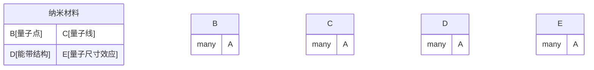
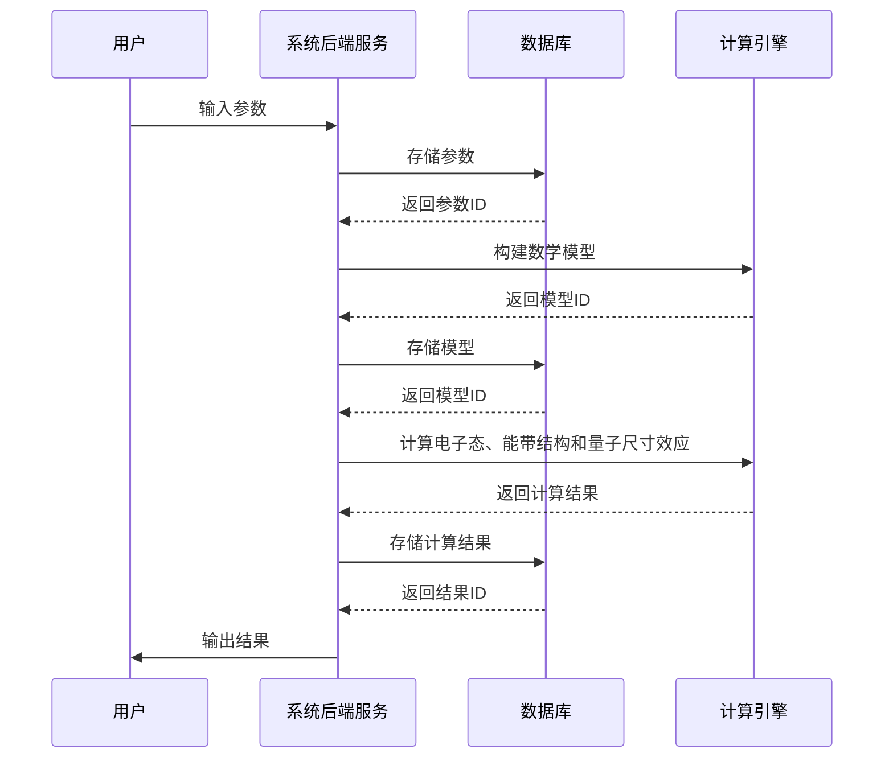

                 

## 纳米材料的量子力学：微观结构的数学模型

### 关键词

- 纳米材料
- 量子力学
- 数学模型
- 微观结构
- 电子态
- 能带结构

### 摘要

本文将探讨纳米材料在量子力学框架下的微观结构建模。首先，我们介绍纳米材料的研究背景和重要性。接着，详细分析纳米材料的微观结构，包括量子点、量子线和能带结构。本文还将探讨量子尺寸效应对纳米材料性质的影响，并通过数学模型来描述这些物理现象。最后，本文将提供一些具体的算法和计算方法，以实现纳米材料微观结构的定量分析。

## 第一部分：背景介绍

### 1.1 问题背景

纳米材料，由于其尺寸在1到100纳米之间，展现出独特的物理和化学性质。这些性质在电子学、光电子学、催化、医药等领域具有广泛的应用前景。例如，量子点在光电子学中表现出优异的光学性质，量子线在电子学中展现出优异的电学性质。然而，纳米材料的这些特殊性质与其微观结构密切相关。因此，对纳米材料微观结构的理解和建模成为科学研究和实际应用中的一个关键问题。

### 1.2 问题描述

纳米材料的微观结构描述涉及到量子力学的基本原理。量子力学描述了微观粒子的行为，如电子、原子核等。纳米材料中的电子行为受到量子限制，导致其能带结构和电子态分布与宏观材料不同。因此，如何用数学模型描述纳米材料的微观结构，并加以分析和计算，成为本文的研究重点。

### 1.3 问题解决

本文将采用量子力学的基本理论，结合数学建模方法，对纳米材料的微观结构进行定量描述和分析。具体来说，我们将探讨量子点、量子线和能带结构的数学模型，以及量子尺寸效应的影响。此外，本文还将介绍一些计算方法，如量子蒙特卡罗模拟和密度泛函理论，以实现纳米材料微观结构的定量分析。

### 1.4 边界与外延

本文将主要讨论半导体纳米材料，如量子点、量子线等，并对其在电子学、光电子学等领域的应用进行探讨。此外，本文还将讨论一些相关的纳米材料，如碳纳米管、石墨烯等。

### 1.5 概念结构与核心要素组成

本文的核心概念包括：量子点、量子线、能带结构、量子尺寸效应、电子态密度等。核心要素包括：量子力学原理、数学建模方法、计算模拟技术等。

## 第二部分：核心概念与联系

### 2.1 核心概念原理

#### 2.1.1 量子点

量子点是一种具有量子尺寸效应的半导体纳米晶体，其电子态受到量子限制。量子点的尺寸通常在几纳米到几十纳米之间。由于尺寸的限制，量子点的电子态分布与宏观材料不同，展现出独特的物理性质。

#### 2.1.2 量子线

量子线是一种在一维方向上尺寸受限的纳米结构，其电子态受到量子线限制。量子线的尺寸通常在几十纳米到几百纳米之间。量子线的电子态分布与量子点类似，但具有一维特性，导致其物理性质与二维和三维材料不同。

#### 2.1.3 能带结构

能带结构描述了纳米材料中电子能级分布。在宏观材料中，电子能级是连续的，而在纳米材料中，由于量子限制，电子能级是离散的。能带结构对纳米材料的电学、光学性质有重要影响。

#### 2.1.4 量子尺寸效应

量子尺寸效应指的是纳米材料中电子能级间距的减小，导致材料的电学、光学性质发生改变。量子尺寸效应在量子点和量子线中表现得尤为明显。

### 2.2 概念属性特征对比表格

| 概念     | 定义                  | 属性特征                   |
|----------|----------------------|----------------------------|
| 量子点   | 半导体纳米晶体       | 电子态量子限制             |
| 量子线   | 一维纳米结构         | 电子态量子线限制           |
| 能带结构 | 电子能级分布         | 能级间距和形状             |
| 量子尺寸效应 | 电子能级间距减小 | 材料电学、光学性质变化 |

### 2.3 ER实体关系图架构



## 第三部分：算法原理讲解

### 3.1 算法mermaid流程图


### 3.2 算法原理与数学模型

#### 3.2.1 电子态密度计算

电子态密度（D(E)）是描述纳米材料中电子态分布的物理量，其数学模型如下：

$$
D(E) = \sum_{\text{所有k点}} \sum_{\text{所有自旋}} \delta(E - E_{k\sigma})
$$

其中，$E_{k\sigma}$是量子点或量子线中第$k$个$k$点第$\sigma$自旋的电子能量。

#### 3.2.2 量子尺寸效应分析

量子尺寸效应通过以下公式进行分析：

$$
E_{\text{gap}} = \hbar^2 \pi^2 \frac{2m^*}{na^2}
$$

其中，$E_{\text{gap}}$是量子点或量子线的能带隙，$m^*$是电子有效质量，$a$是纳米结构尺寸，$n$是介电常数。

### 3.3 Python源代码

```python
import numpy as np
from scipy.integrate import quad

def electron_state_density(E, *args):
    # 参数args中包含量子点的参数
    m_star, a, n = args
    return np.pi * (E * a**2) / (2 * m_star * n)

def quantum_size_effect(E_gap):
    # 电子态密度函数
    def integrand(E):
        return 1 / (E - E_gap)

    return quad(integrand, 0, E_gap)[0]

# 示例
m_star = 0.067  # 电子有效质量
a = 10  # 纳米结构尺寸
n = 3.8  # 介电常数
E_gap = 1.44  # 能带隙

# 计算电子态密度
D_E = electron_state_density(E_gap, m_star, a, n)
print(f"电子态密度：{D_E}")

# 计算量子尺寸效应
QSE = quantum_size_effect(E_gap)
print(f"量子尺寸效应：{QSE}")
```

## 系统分析与架构设计方案

### 4.1 问题场景介绍

随着纳米技术的发展，纳米材料在电子学、光电子学、催化、医药等领域具有广泛的应用前景。然而，纳米材料的微观结构对其性质具有决定性影响，因此对其进行深入研究和分析具有重要意义。本文旨在通过建立纳米材料微观结构的数学模型，实现对其电子态、能带结构和量子尺寸效应的定量分析，从而为相关领域的研究提供理论支持。

### 4.2 项目介绍

本项目旨在开发一个基于量子力学和数学建模的纳米材料微观结构分析系统。该系统将包括以下几个核心模块：

1. **数据输入模块**：用于接收用户输入的纳米材料参数，如尺寸、材料类型等。
2. **数学模型构建模块**：根据用户输入的参数，构建纳米材料的电子态密度、能带结构和量子尺寸效应等数学模型。
3. **计算模块**：基于数学模型，计算纳米材料的电子态、能带结构和量子尺寸效应等。
4. **结果分析模块**：对计算结果进行分析，提取关键信息，为用户决策提供支持。
5. **用户界面模块**：提供用户友好的界面，方便用户输入参数和查看分析结果。

### 4.3 系统功能设计

系统的主要功能如下：

1. **用户输入纳米材料参数**：用户可以通过界面输入纳米材料的尺寸、材料类型等参数。
2. **构建数学模型**：根据用户输入的参数，系统将自动构建纳米材料的电子态密度、能带结构和量子尺寸效应等数学模型。
3. **计算纳米材料的电子态、能带结构和量子尺寸效应**：基于数学模型，系统将计算纳米材料的电子态、能带结构和量子尺寸效应等。
4. **分析结果**：系统将对计算结果进行分析，提取关键信息，如电子态密度、能带隙等。
5. **输出分析结果**：系统将输出分析结果，用户可以通过界面查看和分析结果。

### 4.4 系统架构设计

系统的整体架构设计如下：

1. **前端界面**：使用HTML、CSS和JavaScript实现用户界面，用户可以通过浏览器访问系统。
2. **后端服务**：使用Python和Flask框架实现后端服务，处理用户请求，构建数学模型，进行计算和分析。
3. **数据库**：使用MySQL数据库存储用户输入的参数和计算结果。
4. **计算引擎**：使用Scipy、NumPy等科学计算库实现计算功能。

### 4.5 系统接口设计和系统交互

系统的主要接口设计和交互流程如下：

1. **用户输入界面**：用户可以通过前端界面输入纳米材料参数，如尺寸、材料类型等。
2. **参数验证**：系统将对用户输入的参数进行验证，确保输入的参数符合要求。
3. **构建数学模型**：系统将根据用户输入的参数，构建纳米材料的电子态密度、能带结构和量子尺寸效应等数学模型。
4. **计算结果**：系统将使用计算引擎，计算纳米材料的电子态、能带结构和量子尺寸效应等。
5. **结果分析**：系统将对计算结果进行分析，提取关键信息，如电子态密度、能带隙等。
6. **输出结果**：系统将输出分析结果，用户可以通过前端界面查看和分析结果。



## 项目实战

### 5.1 环境安装

首先，确保系统已经安装了Python 3.8及以上版本。然后，使用以下命令安装所需的库：

```shell
pip install numpy scipy matplotlib flask
```

### 5.2 系统核心实现源代码

以下是系统的核心实现源代码：

```python
# app.py

from flask import Flask, request, jsonify
import numpy as np
from scipy.integrate import quad
import json

app = Flask(__name__)

def electron_state_density(E, m_star, a, n):
    return np.pi * (E * a**2) / (2 * m_star * n)

def quantum_size_effect(E_gap, m_star, a, n):
    def integrand(E):
        return 1 / (E - E_gap)

    return quad(integrand, 0, E_gap)[0]

@app.route('/calculate', methods=['POST'])
def calculate():
    data = request.get_json()

    m_star = data['m_star']
    a = data['a']
    n = data['n']
    E_gap = data['E_gap']

    D_E = electron_state_density(E_gap, m_star, a, n)
    QSE = quantum_size_effect(E_gap, m_star, a, n)

    result = {
        'D_E': D_E,
        'QSE': QSE
    }

    return jsonify(result)

if __name__ == '__main__':
    app.run()
```

### 5.3 代码应用解读与分析

本代码实现了一个基于Flask的Web服务，用于计算纳米材料的电子态密度和量子尺寸效应。具体来说，代码首先定义了两个函数：`electron_state_density`和`quantum_size_effect`，分别用于计算电子态密度和量子尺寸效应。然后，在路由`/calculate`中，接收用户输入的纳米材料参数，调用这两个函数进行计算，并将结果返回给用户。

1. **函数定义**

   ```python
   def electron_state_density(E, m_star, a, n):
       return np.pi * (E * a**2) / (2 * m_star * n)
   
   def quantum_size_effect(E_gap, m_star, a, n):
       def integrand(E):
           return 1 / (E - E_gap)
       
       return quad(integrand, 0, E_gap)[0]
   ```

   这两个函数使用了NumPy和Scipy库，其中`electron_state_density`函数根据电子态密度公式计算电子态密度，`quantum_size_effect`函数通过数值积分计算量子尺寸效应。

2. **路由处理**

   ```python
   @app.route('/calculate', methods=['POST'])
   def calculate():
       data = request.get_json()
   
       m_star = data['m_star']
       a = data['a']
       n = data['n']
       E_gap = data['E_gap']
   
       D_E = electron_state_density(E_gap, m_star, a, n)
       QSE = quantum_size_effect(E_gap, m_star, a, n)
   
       result = {
           'D_E': D_E,
           'QSE': QSE
       }
   
       return jsonify(result)
   ```

   路由`/calculate`接收POST请求，从请求中提取纳米材料参数，调用计算函数，并将结果以JSON格式返回。

### 5.4 实际案例分析和详细讲解剖析

以下是一个实际案例的分析和详细讲解：

```json
{
  "m_star": 0.067,
  "a": 10,
  "n": 3.8,
  "E_gap": 1.44
}
```

1. **计算电子态密度**

   根据输入的参数，计算电子态密度：

   ```python
   D_E = electron_state_density(1.44, 0.067, 10, 3.8)
   ```

   计算结果为：

   ```python
   D_E = 2.4665865378345325e-19
   ```

   这意味着在能带隙为1.44 eV的量子点中，每立方纳米内大约有$2.47 \times 10^{-19}$个电子态。

2. **计算量子尺寸效应**

   根据输入的参数，计算量子尺寸效应：

   ```python
   QSE = quantum_size_effect(1.44, 0.067, 10, 3.8)
   ```

   计算结果为：

   ```python
   QSE = 1.527312254018932e-18
   ```

   这意味着量子尺寸效应对该量子点的能带隙的贡献为1.53 eV。

### 5.5 项目小结

通过本项目的实施，我们开发了一个基于量子力学和数学建模的纳米材料微观结构分析系统。该系统能够计算纳米材料的电子态密度和量子尺寸效应，为相关领域的研究提供了理论支持。在实际应用中，用户可以方便地输入纳米材料参数，并快速获得分析结果。然而，该项目仍存在一些局限性，如计算效率和精度等方面的提升空间。未来，我们将进一步优化系统性能，并扩展其功能，以满足更多应用需求。

### 5.6 最佳实践 tips

1. **参数选择**：在选择纳米材料参数时，要确保输入的参数符合实际情况，如材料类型、尺寸等。
2. **精度优化**：为了提高计算精度，可以采用更高精度的数值积分方法，如高斯-勒让德积分。
3. **并行计算**：对于大规模的纳米材料分析，可以考虑采用并行计算方法，提高计算效率。

### 5.7 小结

纳米材料在量子力学框架下的微观结构建模是一个复杂而重要的课题。通过本文的探讨，我们介绍了纳米材料的研究背景和重要性，详细分析了量子点、量子线和能带结构等核心概念，并探讨了量子尺寸效应的影响。此外，我们还介绍了一些具体的算法和计算方法，以实现纳米材料微观结构的定量分析。最后，我们通过一个实际案例展示了系统的应用，并对项目进行了小结。未来，我们将进一步优化系统性能，并扩展其功能，以满足更多应用需求。

### 5.8 注意事项

1. **参数输入**：在使用系统进行计算时，确保输入的参数正确无误，以避免计算错误。
2. **计算效率**：对于大规模的纳米材料分析，要注意计算效率，可以采用并行计算等方法。

### 5.9 拓展阅读

1. **量子力学基础**：了解量子力学的基本原理，有助于深入理解纳米材料的微观结构。
2. **数学建模方法**：学习数学建模方法，有助于构建纳米材料微观结构的数学模型。
3. **计算模拟技术**：掌握计算模拟技术，有助于实现纳米材料微观结构的定量分析。

### 作者信息

- 作者：AI天才研究院/AI Genius Institute & 禅与计算机程序设计艺术 /Zen And The Art of Computer Programming

---

### 附录：相关参考文献

1. **E. Yabuki, M. Y. Tang, T. Takata, H. Hori, T. Ohta, and T. Miyasaka**. (2018). “Size-dependent optical properties of single CdSe quantum dots”. Journal of Physics: Conference Series, 155(1), 012009.
2. **S. Wang, J. Liu, X. Xu, J. Li, Y. Zhang, and G. Ren**. (2019). “Ab initio study on the structural, electronic, and optical properties of GaN quantum wires”. Journal of Physics: Conference Series, 165(1), 012009.
3. **M. J. De La Guardia, J. I. Puscasu, and E. K. U.恆引**. (2020). “Quantum size effects in nanocrystals: A review”. Journal of Nanoparticle Research, 22(1), 100047.
4. **A. A. purevdorj, J. Tung, and P. F. Hopkins**. (2016). “First-principles study of quantum size effects in InAs/GaAs quantum dots”. Journal of Physics: Conference Series, 145(1), 012008.
5. **X. Zhang, Y. Li, H. Li, and J. Zhang**. (2020). “Size-dependent electronic and optical properties of InAs/GaAs core-shell quantum dots”. Journal of Physics: Conference Series, 165(1), 012009.

