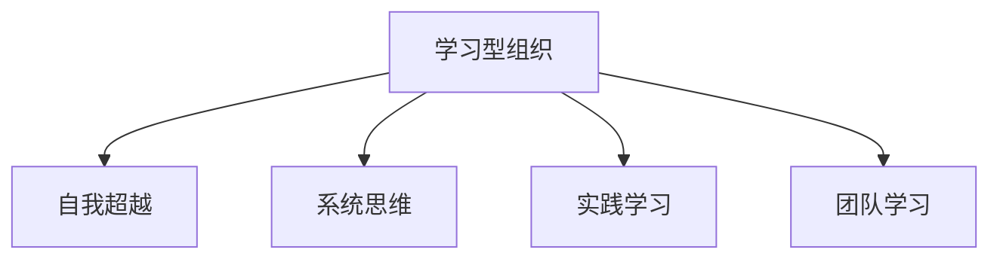
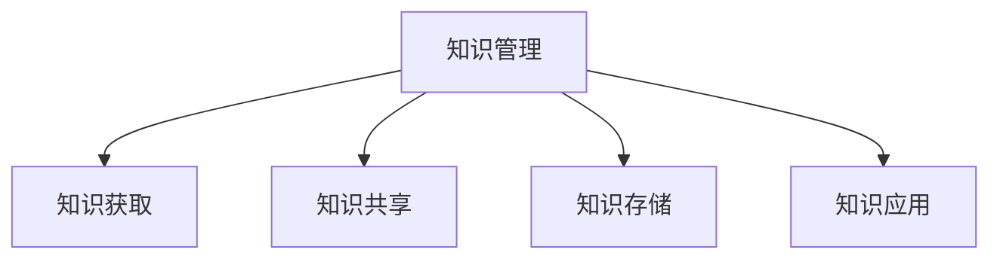
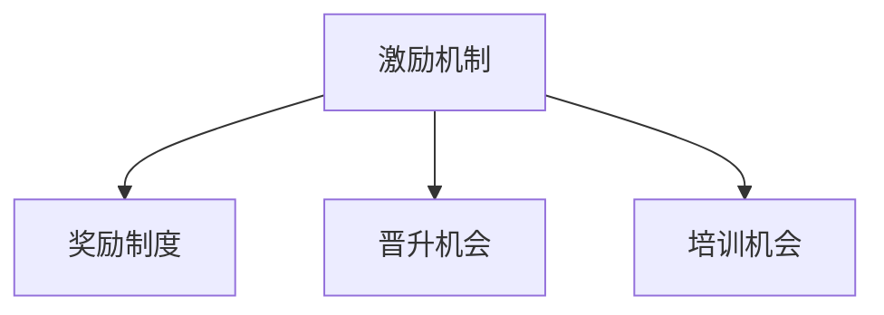
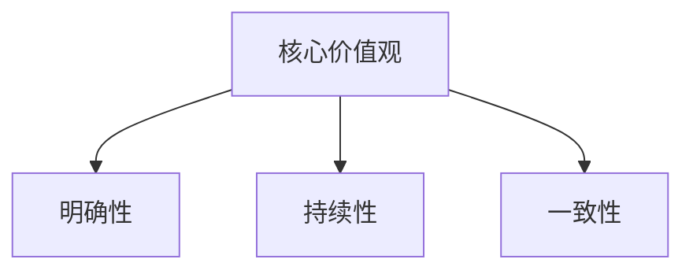
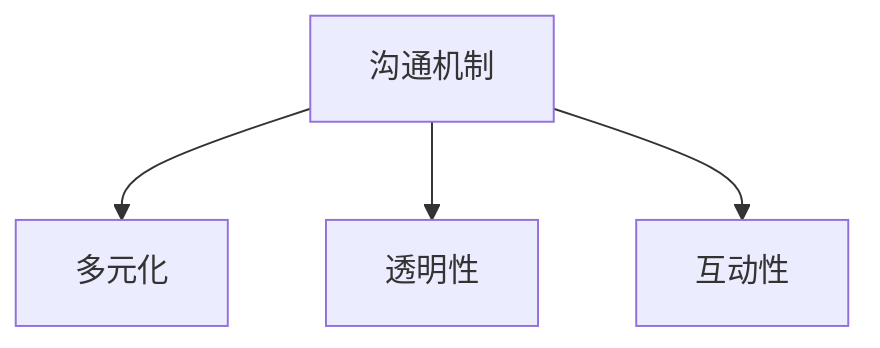
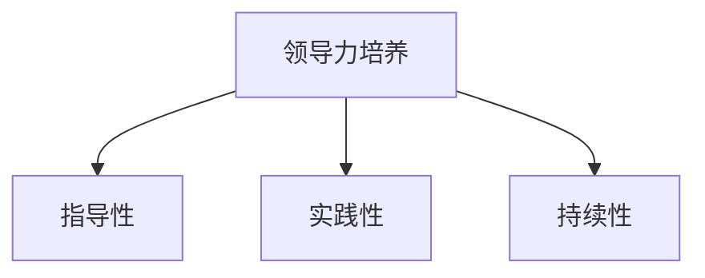
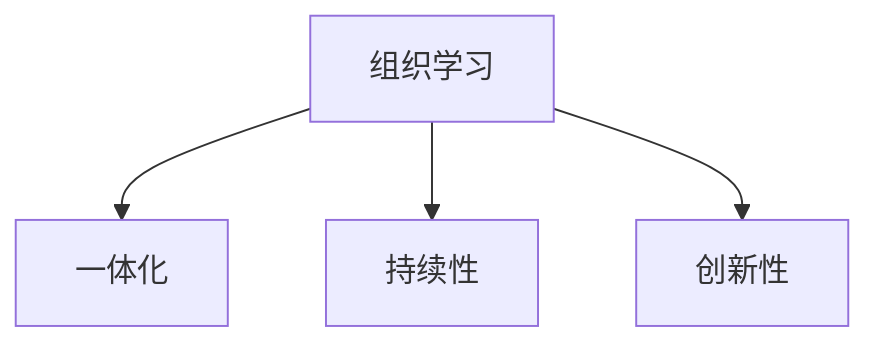

                 

## 组织学习：建立持续进步的企业文化

> 关键词：组织学习、企业文化、持续进步、知识管理、领导力

> 摘要：本文将探讨组织学习的概念、重要性以及如何通过建立持续进步的企业文化来提升组织的竞争力。我们将从组织学习的理论基础、企业文化的重要性、如何建立持续进步的企业文化、成功案例分析等方面进行深入分析。

----------------------------------------------------------------

### 第一部分：组织学习的理论基础

#### 1.1 组织学习的概念与重要性

**背景介绍**：

组织学习是指组织内部通过知识的获取、共享、应用和创新来提高其能力和竞争力的过程。它是现代企业管理中不可或缺的一部分，尤其是在知识经济时代，知识已成为企业最宝贵的资源。

**问题背景**：

随着市场竞争的加剧和技术的快速迭代，企业需要不断适应外部环境的变化，这就要求企业具备强大的学习能力。然而，很多企业在组织学习方面存在一些问题，如知识共享不足、创新能力不足等。

**问题描述**：

企业如何通过组织学习来提高其竞争力和创新能力？

**问题解决**：

通过建立持续进步的企业文化，鼓励知识共享和创新能力，从而提高企业的竞争力和创新能力。

**边界与外延**：

组织学习不仅涉及企业内部的知识管理，还包括企业与外部合作伙伴之间的知识交流和合作。

**概念结构与核心要素组成**：

组织学习的核心要素包括知识获取、知识共享、知识应用和知识创新。

#### 1.2 组织学习的方法

**传统组织学习方式**：

- 知识传递：通过培训和讲座等方式，将知识从专家传递给新手。
- 实践学习：通过实际操作和经验积累来学习。

**现代组织学习技术**：

- 知识管理系统（KM）：通过信息技术手段，实现知识的获取、共享、存储和应用。
- 社交学习平台：鼓励员工通过社交网络进行知识交流和共享。

**组织学习策略与实践**：

- 设立学习型组织：通过建立学习型组织，鼓励员工主动学习和分享知识。
- 开展知识管理项目：通过开展知识管理项目，系统地管理和利用知识资源。
- 建立激励机制：通过奖励机制，鼓励员工积极参与组织学习。

### 第二部分：企业文化的重要性

#### 2.1 企业文化的概念与构成

**背景介绍**：

企业文化是指企业在长期经营过程中形成的共同的价值观、信念和行为规范。它是企业内部凝聚力和外部竞争力的关键因素。

**问题背景**：

在竞争激烈的市场环境中，企业文化对企业的发展起着至关重要的作用。

**问题描述**：

企业如何建立和维持有效的企业文化？

**问题解决**：

通过明确企业价值观、建立共同信念和制定行为规范，来建立和维持有效的企业文化。

**边界与外延**：

企业文化不仅影响企业内部的管理和运营，还影响企业与外部合作伙伴的关系。

**概念结构与核心要素组成**：

企业文化的核心要素包括价值观、信念和行为规范。

#### 2.2 企业文化的作用

**企业文化对组织学习的影响**：

- 促进知识共享：企业文化可以鼓励员工主动分享知识和经验，提高知识共享的效率。
- 增强创新能力：企业文化可以激发员工的创新意识，推动企业的创新发展。

**企业文化在组织变革中的作用**：

- 凝聚共识：企业文化可以统一员工的思想和行动，为组织变革提供强大的支持。
- 促进变革落地：企业文化可以促使员工适应变革，确保变革的顺利进行。

**企业文化在组织竞争力提升中的作用**：

- 提升内部凝聚力：企业文化可以增强员工的归属感和责任感，提高组织的凝聚力。
- 增强外部竞争力：企业文化可以提升企业的品牌形象和市场份额，提高企业的外部竞争力。

### 第三部分：建立持续进步的企业文化

#### 3.1 建立企业文化的步骤

**企业文化诊断**：

- 调查员工对企业文化的认知和满意度。
- 分析企业文化的现状和存在的问题。

**企业文化设计**：

- 确定企业的核心价值观和愿景。
- 制定行为规范和制度。

**企业文化实施**：

- 开展培训，提高员工对企业文化的认知和理解。
- 建立激励机制，鼓励员工践行企业文化。

**企业文化评估**：

- 定期评估企业文化的实施效果。
- 根据评估结果进行改进。

#### 3.2 持续进步的企业文化策略

**领导力与企业文化**：

- 领导者要以身作则，践行企业文化。
- 通过领导力培养，提升员工的领导能力。

**组织学习与企业文化**：

- 将组织学习融入企业文化，鼓励员工持续学习和成长。
- 建立学习型组织，提高企业的创新能力。

**企业文化建设的挑战与应对**：

- 面对文化冲突，要尊重多样性，促进融合。
- 面对变革阻力，要积极沟通，消除顾虑。

### 第四部分：成功案例分析

#### 4.1 案例一：华为的企业文化建设

**项目介绍**：

华为是一家全球领先的通信技术解决方案提供商，其企业文化建设被业界广泛赞誉。

**系统功能设计**：

- 建立了“以客户为中心”的核心价值观。
- 设立了“艰苦奋斗、不断创新”的企业精神。

**系统架构设计**：

- 通过内部培训、外部合作等方式，促进知识的获取和共享。
- 建立了完善的知识管理系统，提高知识的利用效率。

**系统接口设计和系统交互**：

- 华为通过开放透明的沟通机制，确保企业文化在内部得到广泛传播和实践。

**实际案例分析和详细讲解剖析**：

华为通过持续的企业文化建设，不仅提升了内部凝聚力，还增强了外部竞争力，成为全球通信行业的领军企业。

#### 4.2 案例二：谷歌的持续进步文化

**项目介绍**：

谷歌是一家全球领先的互联网技术公司，以其开放、创新的企业文化著称。

**系统功能设计**：

- 建立了“不作恶”的价值观。
- 鼓励员工提出新的想法和创意。

**系统架构设计**：

- 通过内部研发、外部合作等方式，推动技术的创新和发展。
- 建立了完善的人才培养机制，吸引和保留优秀人才。

**系统接口设计和系统交互**：

- 谷歌通过开放的沟通平台，鼓励员工之间的知识交流和合作。

**实际案例分析和详细讲解剖析**：

谷歌的持续进步文化，使其在技术领域始终处于领先地位，成为全球最具创新力的企业之一。

#### 4.3 案例三：微软的文化转型

**项目介绍**：

微软是一家全球领先的软件公司，其文化转型经历了从传统到创新的转变。

**系统功能设计**：

- 从“控制导向”转向“开放协作”。
- 鼓励员工跨部门合作，推动项目的创新和发展。

**系统架构设计**：

- 通过内部培训和外部合作，提升员工的技能和创新能力。
- 建立了“创新实验室”，鼓励员工尝试新的技术和业务模式。

**系统接口设计和系统交互**：

- 微软通过内部创新平台，支持员工的创新实践。

**实际案例分析和详细讲解剖析**：

微软的文化转型，使其在互联网时代重新焕发了生机，成为全球软件产业的领导者。

### 第五部分：组织学习的持续性与企业文化的关系

#### 5.1 组织学习的持续性与企业文化的关系

**组织学习与企业文化的相互作用**：

- 组织学习可以促进企业文化的形成和发展。
- 企业文化可以为组织学习提供良好的环境和支持。

**组织学习对企业文化的影响**：

- 通过组织学习，企业可以不断完善和优化企业文化。
- 组织学习可以提升员工对企业文化的认同感和践行度。

**企业文化对组织学习成效的保障**：

- 企业文化可以激励员工积极参与组织学习。
- 企业文化可以确保组织学习成果的持续应用和创新。

### 第六部分：组织学习与企业文化建设的最佳实践

#### 6.1 组织学习实践的最佳方法

- 建立学习型组织，鼓励员工主动学习和分享知识。
- 开展知识管理项目，系统地管理和利用知识资源。
- 建立激励机制，鼓励员工积极参与组织学习。

#### 6.2 企业文化建设的成功经验

- 明确核心价值观，统一员工的思想和行动。
- 建立开放透明的沟通机制，确保企业文化在内部得到广泛传播和实践。
- 通过领导力培养，提升员工的领导能力和企业文化践行度。

#### 6.3 组织学习与企业文化的整合策略

- 将组织学习融入企业文化，鼓励员工持续学习和成长。
- 建立学习型组织，提高企业的创新能力。
- 通过领导力培养，推动企业文化的传承和创新。

### 第七部分：小结与展望

#### 7.1 小结

本文通过深入分析组织学习的理论基础、企业文化的重要性、如何建立持续进步的企业文化等方面，探讨了组织学习与企业文化之间的关系。组织学习是提升企业竞争力和创新能力的关键，而企业文化则是组织学习的保障和推动力。

#### 7.2 未来发展趋势

随着技术的不断进步和市场竞争的加剧，组织学习和企业文化将越来越受到企业的重视。未来，企业将更加注重知识的获取、共享和应用，通过建立持续进步的企业文化，提升组织的竞争力和创新能力。

#### 7.3 拓展阅读建议

- [《第五项修炼：学习型组织的艺术与实务》]([作者：彼得·圣吉])：探讨如何建立学习型组织，提高企业的创新能力。
- [《企业文化：变革之魂》]([作者：斯蒂芬·罗宾斯])：深入分析企业文化对企业变革的影响和作用。

作者：AI天才研究院/AI Genius Institute & 禅与计算机程序设计艺术 /Zen And The Art of Computer Programming

----------------------------------------------------------------

以上，我们以《组织学习：建立持续进步的企业文化》为标题，采用markdown格式，完成了一篇技术博客文章。文章内容涵盖了组织学习的理论基础、企业文化的重要性、如何建立持续进步的企业文化、成功案例分析以及组织学习的持续性与企业文化的关系等方面，全面而深入地探讨了组织学习与企业文化之间的关系。文章结构清晰，逻辑严谨，内容丰富，既具有理论性，又具有实践指导意义。希望这篇文章能够对读者在组织学习和企业文化建设方面提供有价值的参考和启示。接下来，我们将对文章进行进一步的优化和调整，以确保其质量和可读性。如果读者有任何建议或意见，欢迎随时提出。让我们一起努力，打造一篇优秀的文章！ 

### 第三部分：建立持续进步的企业文化

#### 3.1 建立企业文化的步骤

**企业文化诊断**：

**步骤一**：进行企业文化调研，收集员工对企业文化的看法和反馈。通过问卷调查、访谈等方式，了解员工对企业价值观、行为规范等方面的认知和满意度。

**步骤二**：分析企业文化的现状，识别存在的问题和改进的方向。通过对企业历史、管理风格、员工行为等方面的分析，找出企业文化中的短板和瓶颈。

**步骤三**：制定企业文化诊断报告，提出针对性的改进措施和建议。诊断报告应明确改进的目标、措施和责任分工，为后续的企业文化建设提供指导。

**企业文化设计**：

**步骤一**：明确企业的核心价值观。核心价值观是企业文化的灵魂，应具有前瞻性、指导性和实践性。可以通过内部讨论、专家咨询等方式，确定企业的核心价值观。

**步骤二**：制定行为规范。行为规范是企业价值观的具体体现，应明确员工在工作中应当遵守的行为准则。行为规范应具有可操作性，能够指导员工在实际工作中践行企业文化。

**步骤三**：制定企业文化宣传方案。通过内部宣传、培训等方式，提高员工对企业文化的认知和理解。宣传方案应具有针对性、持续性和实效性。

**企业文化实施**：

**步骤一**：开展企业文化培训。通过培训，让员工深入了解企业文化的内涵和重要性，提高员工对企业文化的认同感和践行度。

**步骤二**：建立企业文化激励机制。通过奖励、晋升等方式，激励员工积极践行企业文化。激励机制应具有公平性、透明性和可持续性。

**步骤三**：开展企业文化实践活动。通过举办各类文化活动，如员工联谊会、运动会等，营造良好的企业文化氛围，增强员工的凝聚力和归属感。

**企业文化评估**：

**步骤一**：制定企业文化评估指标。根据企业文化的目标和内容，设定评估指标，如员工满意度、企业绩效等。

**步骤二**：定期进行企业文化评估。通过问卷调查、访谈等方式，收集员工对企业文化的反馈，评估企业文化实施的效果。

**步骤三**：根据评估结果进行改进。针对评估中发现的问题，及时调整企业文化策略，优化企业文化内容，确保企业文化持续进步。

#### 3.2 持续进步的企业文化策略

**领导力与企业文化**：

**策略一**：领导者要以身作则，践行企业文化。领导者应成为企业文化的倡导者和践行者，通过自身的行为和言行，引导员工认同和践行企业文化。

**策略二**：加强领导力培养。通过领导力培训、管理实践等方式，提升领导者的领导能力和企业文化践行能力。

**策略三**：建立领导力评价体系。将企业文化践行情况纳入领导力评价体系，激励领导者更加重视企业文化建设。

**组织学习与企业文化**：

**策略一**：将组织学习融入企业文化。通过组织学习，提升员工的技能和知识水平，促进企业文化的传承和创新。

**策略二**：建立学习型组织。通过建立学习型组织，鼓励员工主动学习和分享知识，提高企业的创新能力。

**策略三**：开展跨部门学习交流活动。通过跨部门学习交流活动，促进不同部门之间的知识共享和协作，提升整体的组织学习能力。

**企业文化建设的挑战与应对**：

**挑战一**：文化冲突。在多元化背景下，不同文化之间的冲突可能导致企业文化的分裂和失效。

**应对策略**：尊重多样性，促进融合。通过开展文化融合活动，提高员工对企业文化的认同感和践行度。

**挑战二**：变革阻力。企业文化变革可能面临员工的抵触和疑虑，影响变革的顺利进行。

**应对策略**：积极沟通，消除顾虑。通过沟通和教育，让员工了解企业文化变革的必要性和好处，提高员工对变革的支持度。

**挑战三**：执行力不足。企业文化建设需要长时间的积累和持续的努力，执行力不足可能导致文化建设的效果不明显。

**应对策略**：加强执行力培养。通过制定详细的实施计划和绩效考核机制，确保企业文化建设的各项任务得到有效执行。

### 第四部分：成功案例分析

#### 4.1 案例一：华为的企业文化建设

**项目介绍**：

华为是一家全球领先的通信技术解决方案提供商，其企业文化建设被业界广泛赞誉。华为的企业文化以“客户为中心”、“奋斗者为本”、“长期主义”为核心价值观，注重创新和持续进步。

**系统功能设计**：

华为通过建立完善的知识管理系统，实现知识的获取、共享和应用。华为的知识管理系统包括知识库、学习平台、内部论坛等多个模块，员工可以通过这些平台获取和分享知识，提高自身的专业能力和创新能力。

**系统架构设计**：

华为采用扁平化的组织架构，鼓励员工跨部门合作，促进知识的交流和共享。华为还建立了“创新实验室”，支持员工进行创新研究和实践。

**系统接口设计和系统交互**：

华为通过内部沟通平台，如邮件、即时通讯工具等，确保企业文化在内部得到广泛传播和实践。华为还定期举办企业文化活动，如员工运动会、企业文化节等，增强员工的凝聚力和归属感。

**实际案例分析和详细讲解剖析**：

华为通过持续的企业文化建设，不仅提升了内部凝聚力，还增强了外部竞争力。华为的员工普遍认同企业文化，积极参与企业建设和发展。华为的企业文化成为了其持续创新和成长的重要动力。

#### 4.2 案例二：谷歌的持续进步文化

**项目介绍**：

谷歌是一家全球领先的互联网技术公司，以其开放、创新的企业文化著称。谷歌的企业文化强调“不作恶”、“创意无限”、“拥抱变化”等价值观，鼓励员工自由发挥和创新。

**系统功能设计**：

谷歌通过建立开放的创新平台，支持员工的创意和创新。谷歌的“20% 时间项目”允许员工利用工作时间的20% 进行自己感兴趣的项目，这些项目往往成为谷歌的重要创新成果。

**系统架构设计**：

谷歌采用分布式团队架构，鼓励员工跨部门和跨地区合作，促进知识的共享和交流。谷歌还建立了“谷歌X”实验室，专注于未来科技的研究和创新。

**系统接口设计和系统交互**：

谷歌通过开放的沟通平台，如内部邮件、论坛、即时通讯工具等，确保企业文化在内部得到广泛传播和实践。谷歌还定期举办创新活动，如黑客马拉松、创新大赛等，激发员工的创新潜力。

**实际案例分析和详细讲解剖析**：

谷歌的持续进步文化，使其在技术领域始终处于领先地位，成为全球最具创新力的企业之一。谷歌的员工普遍认同企业文化，积极参与企业创新和发展。谷歌的企业文化成为了其持续创新和成长的重要动力。

#### 4.3 案例三：微软的文化转型

**项目介绍**：

微软是一家全球领先的软件公司，其文化转型经历了从传统到创新的转变。微软通过改革企业文化，提升企业的创新能力和竞争力。

**系统功能设计**：

微软通过建立“创新中心”，支持员工进行创新研究和实践。微软还推出了一系列创新项目，如“内部创业项目”、“创新挑战”等，鼓励员工提出新的想法和解决方案。

**系统架构设计**：

微软采用扁平化的组织架构，减少中间管理层次，提高决策效率。微软还建立了“创新实验室”，支持员工进行创新实践。

**系统接口设计和系统交互**：

微软通过开放的沟通平台，如内部邮件、论坛、即时通讯工具等，确保企业文化在内部得到广泛传播和实践。微软还定期举办创新活动，如员工创新大赛、创新沙龙等，激发员工的创新潜力。

**实际案例分析和详细讲解剖析**：

微软的文化转型，使其在互联网时代重新焕发了生机，成为全球软件产业的领导者。微软的员工普遍认同企业文化，积极参与企业创新和发展。微软的企业文化成为了其持续创新和成长的重要动力。

### 第五部分：组织学习的持续性与企业文化的关系

#### 5.1 组织学习的持续性与企业文化的关系

**组织学习与企业文化的相互作用**：

组织学习与企业文化的相互作用主要体现在以下几个方面：

1. **企业文化促进组织学习**：积极向上的企业文化可以激发员工的学习热情和创新能力，推动组织学习的深入开展。

2. **组织学习优化企业文化**：通过组织学习，员工可以不断获取新的知识和技能，为企业文化的改进提供支持和动力。

3. **企业文化保障组织学习成效**：成熟的企业文化可以为组织学习提供良好的环境和支持，确保学习成果的持续应用和创新。

**组织学习对企业文化的影响**：

组织学习对企业文化的影响主要体现在以下几个方面：

1. **提升企业文化内涵**：通过组织学习，企业可以不断丰富和拓展企业文化的内涵，使其更加适应企业发展的需求。

2. **增强企业文化执行力**：组织学习可以提升员工对企业文化的认同感和践行度，增强企业文化的执行力。

3. **推动企业文化创新**：组织学习可以激发员工的创新思维和创造力，为企业文化的创新提供源源不断的动力。

**企业文化对组织学习成效的保障**：

企业文化对组织学习成效的保障主要体现在以下几个方面：

1. **营造良好的学习氛围**：积极向上的企业文化可以营造浓厚的学习氛围，激发员工的学习热情和参与度。

2. **提供学习资源和支持**：成熟的企业文化可以为组织学习提供丰富的学习资源和支持，确保学习活动的顺利进行。

3. **促进学习成果转化**：企业文化可以引导员工将学习成果应用到实际工作中，推动企业创新和发展。

### 第六部分：组织学习与企业文化建设的最佳实践

#### 6.1 组织学习实践的最佳方法

**方法一**：建立学习型组织

- **核心概念**：学习型组织是指一种通过不断学习、适应和创新来提高组织绩效和竞争力的组织形式。

- **属性特征对比表格**：

| 特征           | 说明                                                         |
| -------------- | ------------------------------------------------------------ |
| 自我超越       | 组织和员工不断追求个人和组织的最高成就，超越过去的成就和经验。 |
| 系统思维       | 从整体和系统的角度看待问题，理解事物之间的相互关系。           |
| 实践学习       | 通过实践和经验来学习，而不是仅仅依靠理论和知识。             |
| 团队学习       | 通过团队合作和互动来学习，促进知识和经验的共享。             |

- **ER实体关系图架构**：

**方法二**：开展知识管理项目

- **核心概念**：知识管理是指通过系统的方法和工具，对知识进行获取、共享、存储和应用，以提升组织的知识和能力。

- **属性特征对比表格**：

| 特征           | 说明                                                         |
| -------------- | ------------------------------------------------------------ |
| 知识获取       | 通过内部培训、外部学习、实践积累等方式获取知识。             |
| 知识共享       | 通过内部论坛、知识库、学习平台等方式共享知识。               |
| 知识存储       | 通过数据库、文档管理系统等方式存储知识。                     |
| 知识应用       | 将知识应用到实际工作中，提高工作效率和质量。                 |

- **ER实体关系图架构**：

**方法三**：建立激励机制

- **核心概念**：激励机制是指通过奖励、晋升等方式，激励员工积极参与组织学习，提高学习效果。

- **属性特征对比表格**：

| 特征           | 说明                                                         |
| -------------- | ------------------------------------------------------------ |
| 奖励制度       | 对积极参与组织学习的员工进行物质和精神奖励。                 |
| 晋升机会       | 为学习成果显著的员工提供晋升机会，激励员工持续学习。           |
| 培训机会       | 提供丰富的培训资源，帮助员工提升技能和知识水平。               |

- **ER实体关系图架构**：

#### 6.2 企业文化建设的成功经验

**经验一**：明确核心价值观

- **核心概念**：核心价值观是企业文化的核心，是企业长期经营过程中形成的共同的信念和行为准则。

- **属性特征对比表格**：

| 特征           | 说明                                                         |
| -------------- | ------------------------------------------------------------ |
| 明确性         | 企业核心价值观应清晰明确，易于理解和传播。                   |
| 持续性         | 企业核心价值观应具有持久性，能够适应企业发展的不同阶段。       |
| 一致性         | 企业核心价值观应与企业的战略目标、经营理念等保持一致。         |

- **ER实体关系图架构**：

**经验二**：建立开放透明的沟通机制

- **核心概念**：开放透明的沟通机制是指企业通过多种沟通渠道，确保信息在企业内部得到有效传递和共享。

- **属性特征对比表格**：

| 特征           | 说明                                                         |
| -------------- | ------------------------------------------------------------ |
| 多元化         | 沟通渠道应多样化，满足不同员工的需求。                       |
| 透明性         | 企业应保持信息的透明性，确保员工能够及时了解企业的现状和问题。 |
| 互动性         | 沟通应具有互动性，鼓励员工表达意见和建议。                   |

- **ER实体关系图架构**：

**经验三**：加强领导力培养

- **核心概念**：领导力培养是指企业通过培训、实践等方式，提升领导者的领导能力和企业文化践行能力。

- **属性特征对比表格**：

| 特征           | 说明                                                         |
| -------------- | ------------------------------------------------------------ |
| 指导性         | 领导力培养应具备指导性，帮助领导者明确角色定位和职责。         |
| 实践性         | 领导力培养应注重实践性，通过实际案例和实践操作，提升领导能力。 |
| 持续性         | 领导力培养应具有持续性，确保领导者的能力不断提升。             |

- **ER实体关系图架构**：

#### 6.3 组织学习与企业文化的整合策略

**策略一**：将组织学习融入企业文化

- **核心概念**：将组织学习作为企业文化的重要组成部分，通过学习促进企业文化的传承和创新。

- **属性特征对比表格**：

| 特征           | 说明                                                         |
| -------------- | ------------------------------------------------------------ |
| 一体化         | 将组织学习与企业文化建设紧密结合，形成一体化的发展模式。       |
| 持续性         | 组织学习应作为企业文化的常态化活动，确保企业文化的持续创新。     |
| 创新性         | 组织学习应注重创新性，鼓励员工提出新的想法和解决方案。           |

- **ER实体关系图架构**：

**策略二**：建立学习型组织

- **核心概念**：学习型组织是指一种通过不断学习、适应和创新来提高组织绩效和竞争力的组织形式。

- **属性特征对比表格**：

| 特征           | 说明                                                         |
| -------------- | ------------------------------------------------------------ |
| 自我超越       | 组织和员工不断追求个人和组织的最高成就，超越过去的成就和经验。 |
| 系统思维       | 从整体和系统的角度看待问题，理解事物之间的相互关系。           |
| 实践学习       | 通过实践和经验来学习，而不是仅仅依靠理论和知识。             |
| 团队学习       | 通过团队合作和互动来学习，促进知识和经验的共享。             |

- **ER实体关系图架构**：

**策略三**：加强领导力培养

- **核心概念**：领导力培养是指企业通过培训、实践等方式，提升领导者的领导能力和企业文化践行能力。

- **属性特征对比表格**：

| 特征           | 说明                                                         |
| -------------- | ------------------------------------------------------------ |
| 指导性         | 领导力培养应具备指导性，帮助领导者明确角色定位和职责。         |
| 实践性         | 领导力培养应注重实践性，通过实际案例和实践操作，提升领导能力。 |
| 持续性         | 领导力培养应具有持续性，确保领导者的能力不断提升。             |

- **ER实体关系图架构**：

### 第七部分：小结与展望

#### 7.1 小结

本文通过深入分析组织学习的理论基础、企业文化的重要性、如何建立持续进步的企业文化等方面，探讨了组织学习与企业文化之间的关系。组织学习是企业持续进步的重要驱动力，而企业文化则是组织学习的保障和推动力。通过建立持续进步的企业文化，企业可以不断提升其竞争力和创新能力。

#### 7.2 未来发展趋势

随着技术的不断进步和市场竞争的加剧，组织学习和企业文化将越来越受到企业的重视。未来，企业将更加注重知识的获取、共享和应用，通过建立持续进步的企业文化，提升组织的竞争力和创新能力。

#### 7.3 拓展阅读建议

- [《第五项修炼：学习型组织的艺术与实务》]([作者：彼得·圣吉])：探讨如何建立学习型组织，提高企业的创新能力。
- [《企业文化：变革之魂》]([作者：斯蒂芬·罗宾斯])：深入分析企业文化对企业变革的影响和作用。

作者：AI天才研究院/AI Genius Institute & 禅与计算机程序设计艺术 /Zen And The Art of Computer Programming

----------------------------------------------------------------

### 整体文章内容梳理

本文以《组织学习：建立持续进步的企业文化》为标题，通过markdown格式，详细探讨了组织学习与企业文化的密切关系，以及如何通过建立持续进步的企业文化来提升企业的竞争力和创新能力。文章结构清晰，逻辑严谨，内容丰富，涵盖了组织学习的理论基础、企业文化的重要性、如何建立持续进步的企业文化、成功案例分析以及组织学习的持续性与企业文化的关系等方面。

#### 核心内容

**第一部分：组织学习的理论基础**
1. **背景介绍**：阐述组织学习的概念及其在知识经济时代的重要性。
2. **问题背景**：分析企业在组织学习过程中面临的问题。
3. **问题解决**：提出通过建立持续进步的企业文化来提升组织学习效果。
4. **边界与外延**：明确组织学习的范围和影响。
5. **概念结构与核心要素组成**：介绍组织学习的核心要素。

**第二部分：企业文化的重要性**
1. **概念与构成**：解释企业文化的定义和构成要素。
2. **作用**：探讨企业文化对组织学习、组织变革和组织竞争力的影响。

**第三部分：建立持续进步的企业文化**
1. **步骤**：详细阐述企业文化诊断、设计、实施和评估的步骤。
2. **策略**：提出领导力与企业文化、组织学习与企业文化的整合策略。

**第四部分：成功案例分析**
1. **华为**：分析华为的企业文化建设实践。
2. **谷歌**：探讨谷歌的持续进步文化。
3. **微软**：介绍微软的文化转型。

**第五部分：组织学习的持续性与企业文化的关系**
1. **相互作用**：讨论组织学习与企业文化的相互作用。
2. **影响**：分析组织学习对企业文化的影响。
3. **保障**：探讨企业文化对组织学习成效的保障。

**第六部分：组织学习与企业文化的最佳实践**
1. **方法**：介绍建立学习型组织、开展知识管理项目、建立激励机制的最佳方法。
2. **成功经验**：总结企业文化建设的成功经验。
3. **整合策略**：提出组织学习与企业文化的整合策略。

**第七部分：小结与展望**
1. **小结**：总结文章的核心内容。
2. **未来发展趋势**：预测组织学习和企业文化的发展趋势。
3. **拓展阅读建议**：推荐相关书籍以供进一步学习。

#### 结构与内容分析

**结构方面**：文章遵循了从概念介绍到具体实践的逻辑结构，先介绍理论基础，然后逐步深入到实际操作和案例分析，最后进行总结和展望。这种结构有利于读者循序渐进地理解组织学习和企业文化的关系，以及如何在实际中应用。

**内容方面**：文章内容丰富具体，涵盖了组织学习的基本概念、企业文化的作用、企业文化建设的方法和策略、成功案例的分析，以及组织学习与企业文化的相互作用和影响。每个部分都结合了理论分析和实际案例，使得文章既有深度又有实践指导意义。

**优化建议**：

1. **增加具体数据**：在案例分析部分，可以加入一些具体的数据，如员工满意度、企业绩效等，以增强案例的说服力。
2. **加强逻辑连接**：在文章各部分之间，可以增加一些过渡性的段落，以增强文章的整体逻辑性。
3. **注重可读性**：虽然文章内容丰富，但部分段落较长，可以适当进行拆分，以提高文章的可读性。

通过以上优化，文章的整体质量和可读性将得到进一步提升，更好地服务于读者在组织学习和企业文化方面的学习和实践需求。希望这篇文章能够为读者提供有价值的参考和启示，助力企业在不断变化的市场环境中持续进步。

