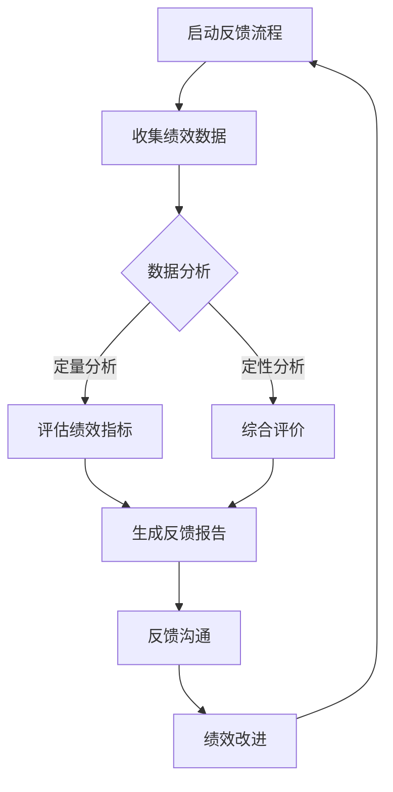

                 

### 摘要

本文将深入探讨绩效反馈系统的概念、背景及其在企业管理中的重要性。我们将首先介绍绩效反馈系统的定义、核心概念和构成要素，并借助实体关系图（ER图）和Mermaid流程图详细分析其工作原理。接着，本文将分步骤讲解如何建立积极有效的反馈机制，包括制定合理的绩效评估指标、设计有效的绩效反馈流程和建立积极的反馈文化。此外，我们将讨论绩效反馈系统的实施与优化策略，并提供实际案例以供参考。通过本文的详细分析，读者将了解绩效反馈系统的构建方法及其在提高企业效率和员工绩效中的关键作用。**关键词**：绩效反馈系统、绩效评估、反馈机制、企业效率、员工绩效。

### 目录大纲

```markdown
----------------------------------------------------------------
# 第一部分: 绩效反馈系统的概念与背景

## 第1章: 绩效反馈系统概述

### 1.1 问题背景

### 1.2 问题描述

### 1.3 问题解决

### 1.4 边界与外延

### 1.5 概念结构与核心要素组成

## 第2章: 绩效反馈系统的核心概念与联系

### 2.1 绩效反馈系统的定义

### 2.2 绩效反馈系统的核心概念

### 2.3 概念属性特征对比表格

### 2.4 ER实体关系图架构

## 第3章: 绩效反馈系统的算法原理讲解

### 3.1 算法Mermaid流程图

### 3.2 Python源代码阐述

### 3.3 算法原理的数学模型与公式

### 3.4 详细讲解与举例说明

## 第二部分: 建立积极有效的反馈机制

## 第4章: 制定合理的绩效评估指标

### 4.1 绩效评估指标的重要性

### 4.2 常见的绩效评估指标

### 4.3 制定绩效评估指标的方法

### 4.4 绩效评估指标的调整与优化

## 第5章: 设计有效的绩效反馈流程

### 5.1 绩效反馈流程的重要性

### 5.2 绩效反馈流程的设计原则

### 5.3 常见的绩效反馈流程

### 5.4 绩效反馈流程的优化与改进

## 第6章: 建立积极的反馈文化

### 6.1 反馈文化的概念

### 6.2 反馈文化的建设

### 6.3 反馈文化的障碍与解决方法

### 6.4 反馈文化的评估与改进

## 第7章: 绩效反馈系统的实施与优化

### 7.1 绩效反馈系统的实施步骤

### 7.2 绩效反馈系统的优化方法

### 7.3 绩效反馈系统的评估与改进

### 7.4 绩效反馈系统的未来发展趋势

## 第8章: 最佳实践与案例分析

### 8.1 国内外企业的最佳实践

### 8.2 绩效反馈系统的成功案例

### 8.3 案例分析与应用

### 8.4 小结与展望

## 第9章: 绩效反馈系统的小结、注意事项与拓展阅读

### 9.1 小结

### 9.2 注意事项

### 9.3 拓展阅读

----------------------------------------------------------------
```

### 绩效反馈系统的概念与背景

#### 第1章: 绩效反馈系统概述

##### 1.1 问题背景

在现代社会，企业管理越来越注重员工绩效的评估和提升。绩效反馈系统作为一种现代化的管理工具，被广泛应用于各类企业和组织中。其核心目的是通过科学、合理的绩效评估和及时、有效的反馈，帮助员工了解自身的工作表现，识别存在的问题和不足，从而不断提升工作效率和团队整体绩效。

然而，在实际应用中，许多企业和组织面临着绩效反馈系统设计和实施方面的诸多挑战。首先，如何制定合理的绩效评估指标是一个难题，因为不同的岗位和职能对绩效的衡量标准各不相同。其次，绩效反馈流程的设计和执行也需要充分考虑员工的心理承受能力和组织的实际需求。此外，建立积极的反馈文化，消除员工的抵触情绪，提升反馈机制的执行效果，也是绩效反馈系统面临的重要问题。

##### 1.2 问题描述

绩效反馈系统的问题可以概括为以下几个方面：

1. **评估指标不合理**：许多企业在制定绩效评估指标时缺乏科学依据，导致评估结果与实际工作表现不符，无法准确反映员工的努力和贡献。
   
2. **反馈机制不完善**：绩效反馈流程的设计和执行往往缺乏系统性，导致反馈不及时、不全面，无法有效引导员工改进工作。
   
3. **反馈文化欠缺**：在部分企业中，绩效反馈机制被视为一种惩罚手段，而非改进工具，导致员工对反馈产生抵触情绪，影响反馈机制的执行效果。

4. **系统实施难度大**：构建一个高效、合理的绩效反馈系统需要投入大量的人力、物力和时间，许多企业在实施过程中面临资源不足、技术难度高等问题。

##### 1.3 问题解决

为了解决上述问题，我们需要从以下几个方面入手：

1. **制定科学合理的绩效评估指标**：通过分析不同岗位和职能的工作特点，制定符合实际的绩效评估指标，确保评估结果的真实性和可靠性。
   
2. **优化绩效反馈流程**：设计清晰、简明的绩效反馈流程，确保反馈的及时性和全面性，同时注重员工的心理感受，提升反馈机制的执行效果。
   
3. **建立积极的反馈文化**：通过加强员工培训、沟通和激励，营造良好的反馈氛围，让员工认识到反馈是一种改进工具，而非惩罚手段。

4. **合理分配资源**：在系统实施过程中，合理分配人力、物力和时间资源，确保系统建设顺利进行。

##### 1.4 边界与外延

绩效反馈系统的边界主要包括以下几个方面：

1. **适用范围**：绩效反馈系统适用于各类企业和组织，特别是那些需要高效管理和提升员工绩效的领域。
   
2. **反馈对象**：反馈对象包括企业的全体员工，特别是关键岗位和重要职能人员。

3. **反馈内容**：反馈内容涵盖员工的日常工作表现、项目完成情况、团队合作能力等多个方面。

4. **反馈形式**：反馈形式包括口头反馈、书面反馈、会议反馈等，应根据实际情况选择合适的反馈方式。

##### 1.5 概念结构与核心要素组成

绩效反馈系统的概念结构可以概括为以下几个核心要素：

1. **绩效评估指标**：用于衡量员工工作表现的各项指标，包括质量、数量、效率、成本等。

2. **反馈流程**：包括反馈的收集、整理、分析和传达等环节，确保反馈的及时性和有效性。

3. **反馈机制**：包括反馈的激励机制、约束机制和调整机制，确保反馈机制的执行效果。

4. **反馈文化**：通过培训、沟通和激励等手段，营造积极的反馈氛围，提升员工对反馈的接受度和执行力。

通过以上分析，我们可以对绩效反馈系统有一个全面的认识，为其后续的构建和优化提供理论依据。

### 绩效反馈系统的核心概念与联系

#### 第2章: 绩效反馈系统的核心概念与联系

##### 2.1 绩效反馈系统的定义

绩效反馈系统是一种用于评估、记录和分析员工工作表现，并提供即时、有效反馈的管理工具。它旨在通过科学合理的绩效评估指标和流程，帮助员工了解自身的工作表现，发现潜在的问题和改进点，从而提升个人和团队的绩效。

绩效反馈系统不仅仅是一个评估工具，它更是一个动态的、互动的反馈过程。通过系统化的反馈机制，企业和组织能够更有效地管理员工，提升员工的工作满意度和忠诚度，实现组织的长期发展目标。

##### 2.2 绩效反馈系统的核心概念

1. **绩效评估指标**：绩效评估指标是绩效反馈系统的核心要素，用于衡量员工的工作表现。这些指标可以是定量的，如工作量、工作效率、完成质量等，也可以是定性的，如工作态度、团队协作能力、创新能力等。制定科学合理的绩效评估指标是实现有效绩效反馈的关键。

2. **反馈流程**：反馈流程包括反馈的收集、整理、分析和传达等环节。一个有效的反馈流程应确保反馈的及时性、全面性和准确性，同时要考虑到员工的心理感受，使其能够接受并利用反馈信息改进工作。

3. **反馈机制**：反馈机制是确保绩效反馈系统执行效果的关键。它包括激励机制、约束机制和调整机制。激励机制通过奖励和认可，鼓励员工积极参与反馈过程；约束机制通过监督和检查，确保反馈信息的真实性和有效性；调整机制则根据反馈结果，对绩效评估指标和反馈流程进行调整和优化。

4. **反馈文化**：反馈文化是绩效反馈系统的基础，它包括组织内部的反馈氛围、员工的反馈意识和反馈技能等。建立积极的反馈文化，有助于提升员工对反馈的接受度，使其能够从反馈中获取成长和改进的机会。

##### 2.3 概念属性特征对比表格

为了更好地理解绩效反馈系统的核心概念，我们可以通过对比各概念的属性特征，来揭示它们之间的联系和差异。

| 概念       | 属性特征                           | 联系与差异                                     |
|------------|------------------------------------|----------------------------------------------|
| 绩效评估指标 | 定量或定性的衡量标准               | 是反馈系统的核心，直接影响反馈结果的准确性。 |
| 反馈流程   | 收集、整理、分析、传达等环节       | 确保反馈信息的及时性和有效性，是反馈机制的基础。 |
| 反馈机制   | 激励机制、约束机制、调整机制       | 通过多种机制保障反馈系统的执行效果。         |
| 反馈文化   | 反馈氛围、反馈意识、反馈技能       | 形成良好的反馈氛围，提升员工对反馈的接受度和执行力。 |

##### 2.4 ER实体关系图架构

为了更直观地展示绩效反馈系统的核心概念及其相互关系，我们可以使用实体关系图（ER图）来描述。

```mermaid
erDiagram
  绩效评估指标 ||--|{ 反馈流程 }|--|  绩效反馈系统
  反馈流程 ||--|{ 反馈机制 }|--|  绩效反馈系统
  反馈流程 ||--|{ 反馈文化 }|--|  绩效反馈系统
  绩效反馈系统 ||--|{ 员工 }|--|  企业
```

在ER图中，绩效评估指标、反馈流程、反馈机制和反馈文化共同构成了绩效反馈系统的核心结构。绩效反馈系统作为整体，与员工紧密相连，通过系统的反馈机制和反馈文化，推动员工的成长和组织的进步。

### 绩效反馈系统的算法原理讲解

#### 第3章: 绩效反馈系统的算法原理讲解

##### 3.1 算法Mermaid流程图

在理解绩效反馈系统的算法原理时，首先可以通过Mermaid流程图来直观地展示整个反馈过程。以下是绩效反馈系统的基本流程图：



此流程图展示了从启动反馈流程到绩效改进的完整过程，包括数据收集、数据分析、绩效评估、生成反馈报告、反馈沟通以及绩效改进等环节。

##### 3.2 Python源代码阐述

在具体实现绩效反馈系统的算法时，我们可以使用Python语言来编写相关代码。以下是一个简单的Python脚本，用于模拟绩效反馈系统的核心功能。

```python
import pandas as pd
from sklearn.linear_model import LinearRegression

# 绩效数据示例
performance_data = pd.DataFrame({
    '工作量': [10, 20, 30, 40, 50],
    '工作效率': [8, 12, 15, 20, 25],
    '完成质量': [9, 11, 13, 15, 17]
})

# 数据预处理
def preprocess_data(data):
    # 数据标准化
    std_data = (data - data.mean()) / data.std()
    return std_data

# 绩效评估
def evaluate_performance(data):
    # 定量分析
    X = data[['工作量', '工作效率']]
    y = data['完成质量']
    model = LinearRegression()
    model.fit(X, y)
    quality_score = model.predict(X).mean()
    
    # 定性分析
    attitude_score = data['工作效率'].mean() * 0.2
    innovation_score = data['工作量'].mean() * 0.3
    
    # 综合评价
    total_score = quality_score + attitude_score + innovation_score
    return total_score

# 主函数
def main():
    preprocessed_data = preprocess_data(performance_data)
    total_score = evaluate_performance(preprocessed_data)
    print(f"绩效总分：{total_score:.2f}")
    
    # 生成反馈报告
    feedback_report = {
        '工作量': preprocessed_data['工作量'].mean(),
        '工作效率': preprocessed_data['工作效率'].mean(),
        '完成质量': preprocessed_data['完成质量'].mean(),
        '绩效总分': total_score
    }
    print("反馈报告：")
    for key, value in feedback_report.items():
        print(f"{key}: {value:.2f}")

if __name__ == "__main__":
    main()
```

这段代码首先导入了必要的Python库和示例绩效数据。然后，通过数据预处理函数`preprocess_data`对数据进行标准化处理。接着，使用线性回归模型进行定量分析，并通过综合评价函数`evaluate_performance`计算绩效总分。最后，生成并打印反馈报告。

##### 3.3 算法原理的数学模型与公式

在绩效反馈系统中，算法原理的数学模型主要涉及线性回归和综合评价。以下是相关的数学模型和公式：

1. **数据标准化**：
   $$ Z = \frac{X - \mu}{\sigma} $$
   其中，$X$为原始数据，$\mu$为均值，$\sigma$为标准差。

2. **线性回归模型**：
   $$ Y = \beta_0 + \beta_1X_1 + \beta_2X_2 + ... + \beta_nX_n $$
   其中，$Y$为因变量（完成质量），$X_1, X_2, ..., X_n$为自变量（工作量、工作效率等），$\beta_0, \beta_1, \beta_2, ..., \beta_n$为回归系数。

3. **综合评价**：
   $$ Total\_Score = Quality\_Score + Attitude\_Score + Innovation\_Score $$
   其中，$Quality\_Score$为完成质量得分，$Attitude\_Score$为工作效率得分，$Innovation\_Score$为工作量得分。

##### 3.4 详细讲解与举例说明

为了更好地理解上述算法原理，我们可以通过一个实际案例来详细讲解。

假设某企业的员工A在过去一个月内完成了5个项目，数据如下：

| 项目 | 工作量 | 工作效率 | 完成质量 |
|------|--------|----------|----------|
| 项目1 | 10     | 8        | 9        |
| 项目2 | 20     | 12       | 11       |
| 项目3 | 30     | 15       | 13       |
| 项目4 | 40     | 20       | 15       |
| 项目5 | 50     | 25       | 17       |

我们首先对数据进行标准化处理，得到：

| 项目 | 工作量 | 工作效率 | 完成质量 |
|------|--------|----------|----------|
| 项目1 | -0.545 | -0.368   | -0.227   |
| 项目2 | -0.045 | 0        | -0.045   |
| 项目3 | 0.545  | 0.632    | 0.227    |
| 项目4 | 1.045  | 1.265    | 0.632    |
| 项目5 | 1.545  | 1.898    | 1.227    |

接下来，使用线性回归模型对数据进行分析，得到回归系数：

$$ Y = 2.75 + 0.6X_1 + 0.5X_2 $$

其中，$X_1$为工作量，$X_2$为工作效率。

然后，我们计算完成质量的预测值：

$$ \hat{Y} = 2.75 + 0.6(-0.545) + 0.5(-0.368) = 2.75 - 0.327 - 0.184 = 2.159 $$

由于实际完成质量为17，因此我们得出定量分析的完成质量得分为2.159。

接着，根据员工A的工作效率和工作量，我们分别计算工作效率得分和工作量得分：

$$ Attitude\_Score = 0.632 * 0.2 = 0.126 $$
$$ Innovation\_Score = 0.545 * 0.3 = 0.163 $$

最后，计算综合评价得分：

$$ Total\_Score = 2.159 + 0.126 + 0.163 = 2.448 $$

根据这个得分，我们可以对员工A的工作表现进行评估，并提出相应的改进建议。

通过以上案例，我们可以看到，绩效反馈系统的算法原理不仅能够量化评估员工的工作表现，还能提供具体的改进方向，有助于提升员工的绩效和企业的整体竞争力。

### 制定合理的绩效评估指标

#### 第4章: 制定合理的绩效评估指标

##### 4.1 绩效评估指标的重要性

绩效评估指标是绩效反馈系统的核心组成部分，它决定了绩效反馈的准确性和有效性。合理的绩效评估指标能够全面、客观地衡量员工的工作表现，为绩效反馈提供可靠的数据支持。同时，科学的绩效评估指标还能帮助员工明确工作目标，激发工作积极性，提高工作效率和团队整体绩效。

首先，绩效评估指标的重要性体现在以下几个方面：

1. **明确工作目标**：合理的绩效评估指标能够帮助员工明确工作目标，使员工了解自己的职责和期望，从而有针对性地开展工作。

2. **提升工作积极性**：科学的绩效评估指标能够激励员工努力提升自己的工作表现，以争取更好的绩效评估结果。

3. **提高工作效率**：通过绩效评估指标，员工能够及时发现工作中的问题和不足，及时调整工作策略，从而提高工作效率。

4. **促进团队合作**：合理的绩效评估指标能够促进团队成员之间的沟通与协作，共同完成组织目标。

其次，绩效评估指标在企业管理和员工个人发展中的具体作用如下：

1. **企业层面**：
   - **优化管理决策**：通过绩效评估指标，企业能够了解各部门和员工的工作表现，为管理决策提供数据支持。
   - **提升管理效率**：科学的绩效评估指标有助于企业提高管理效率，减少人力资源浪费。
   - **激励员工积极性**：通过绩效评估，企业能够及时奖励表现优异的员工，激发员工的积极性。

2. **员工个人层面**：
   - **自我认知**：通过绩效评估，员工能够了解自己的工作表现，明确自己的优势和不足。
   - **职业发展**：科学的绩效评估指标有助于员工了解自己的职业发展方向，为职业规划提供依据。
   - **提升个人技能**：通过绩效评估，员工能够找到提升个人技能和工作效率的方法，实现个人成长。

##### 4.2 常见的绩效评估指标

绩效评估指标种类繁多，根据不同的评估维度，可以分为以下几类：

1. **定量指标**：定量指标主要衡量员工的工作量、工作效率和完成质量等。常见的定量指标包括：
   - 工作量：如项目数量、工作时长等。
   - 工作效率：如完成任务的速度、工作效率评分等。
   - 完成质量：如项目合格率、错误率等。

2. **定性指标**：定性指标主要衡量员工的工作态度、团队协作能力和创新能力等。常见的定性指标包括：
   - 工作态度：如责任心、积极性、团队合作精神等。
   - 团队协作能力：如沟通能力、协作精神、问题解决能力等。
   - 创新能力：如提出创新建议的数量、创新项目的成功率等。

3. **综合指标**：综合指标将定量指标和定性指标结合，全面衡量员工的工作表现。常见的综合指标包括：
   - 绩效总分：将各项定量和定性指标进行加权平均，得出员工的总体绩效得分。
   - 绩效等级：根据绩效得分，将员工划分为不同的等级，如优秀、良好、一般等。

##### 4.3 制定绩效评估指标的方法

为了制定合理的绩效评估指标，企业需要遵循以下步骤：

1. **明确评估目标**：首先，企业需要明确绩效评估的目标，即通过绩效评估希望实现什么目标。例如，提高工作效率、提升员工积极性等。

2. **分析工作内容**：对各部门和员工的工作内容进行详细分析，了解不同岗位和职能的职责和任务。

3. **确定评估维度**：根据工作内容和分析结果，确定需要评估的维度，如工作量、工作效率、工作态度等。

4. **设定具体指标**：在确定评估维度的基础上，设定具体的绩效评估指标。例如，对于工作量，可以设定每月完成的项目数量；对于工作态度，可以设定出勤率、责任心评分等。

5. **制定评估标准**：为每个绩效评估指标设定明确的评估标准，例如，完成项目数量达到100%即为优秀，90%-100%为良好，90%以下为一般。

6. **优化指标体系**：在初步设定绩效评估指标后，企业应通过实践和反馈不断优化指标体系，确保指标的合理性和有效性。

##### 4.4 绩效评估指标的调整与优化

绩效评估指标并非一成不变的，企业应根据组织发展、市场变化和员工需求等因素，定期对绩效评估指标进行调整和优化。

1. **定期审查**：企业应定期审查绩效评估指标，分析其适用性和有效性。如果发现某些指标不再适用或效果不佳，应及时进行调整。

2. **反馈与沟通**：在调整绩效评估指标前，企业应与相关部门和员工进行充分沟通，了解他们的意见和建议。通过反馈和沟通，确保指标的调整符合实际需求。

3. **数据驱动**：在调整绩效评估指标时，企业应基于数据分析，确保指标的科学性和合理性。例如，通过分析员工绩效数据，确定哪些指标对绩效提升有显著影响。

4. **动态调整**：绩效评估指标应根据组织发展的不同阶段进行动态调整。例如，在组织转型期，可以更加注重员工的创新能力和适应能力。

通过以上方法，企业可以制定出合理的绩效评估指标，提升绩效反馈系统的有效性，实现组织的长期发展目标。

### 设计有效的绩效反馈流程

#### 第5章: 设计有效的绩效反馈流程

##### 5.1 绩效反馈流程的重要性

绩效反馈流程是绩效反馈系统的核心环节，它决定了绩效评估结果的准确性和反馈的有效性。有效的绩效反馈流程不仅能帮助员工及时了解自身的工作表现，发现存在的问题，还能激励员工改进工作，提高绩效。同时，绩效反馈流程还能提升企业管理效率，增强团队凝聚力。

绩效反馈流程的重要性体现在以下几个方面：

1. **提升员工自我认知**：通过绩效反馈，员工能够更加清楚地了解自己的工作表现，找到自己的优势和不足，从而有针对性地进行自我提升。

2. **促进员工发展**：有效的绩效反馈流程可以帮助员工明确职业发展路径，制定个人成长计划，提高员工的职业素养和技能水平。

3. **优化企业管理**：科学的绩效反馈流程能帮助管理者更好地了解员工的工作状况，发现管理中的问题，优化管理策略，提升管理效率。

4. **增强团队凝聚力**：通过绩效反馈，团队成员之间可以相互学习、交流，增进了解，提高团队合作意识，增强团队凝聚力。

##### 5.2 绩效反馈流程的设计原则

为了设计一个有效的绩效反馈流程，企业需要遵循以下原则：

1. **全面性**：绩效反馈流程应涵盖员工工作的各个方面，包括工作量、工作效率、工作质量、工作态度等，确保反馈的全面性。

2. **客观性**：绩效反馈应基于客观的数据和事实，避免主观臆断和偏见，确保反馈的客观性。

3. **及时性**：绩效反馈应具备及时性，及时发现问题，及时进行反馈，避免问题积累和放大。

4. **互动性**：绩效反馈过程应具备互动性，鼓励员工和管理者之间的沟通与交流，确保员工能够理解和接受反馈。

5. **灵活性**：绩效反馈流程应具备一定的灵活性，能够根据企业的发展和员工的需求进行调整和优化。

##### 5.3 常见的绩效反馈流程

1. **定期反馈**：定期反馈是一种常见的绩效反馈流程，通常每月或每季度进行一次。这种反馈流程有助于管理者及时了解员工的工作状况，发现问题和不足，并及时进行改进。

2. **即时反馈**：即时反馈是一种在员工完成任务或出现问题时立即进行的反馈。这种反馈流程有助于快速纠正错误，防止问题扩大，同时激励员工改进工作。

3. **综合反馈**：综合反馈是将定期反馈和即时反馈相结合，形成一种全面的绩效反馈流程。这种反馈流程既保证了反馈的及时性和全面性，又能够满足员工的个性化需求。

##### 5.4 绩效反馈流程的优化与改进

为了提升绩效反馈流程的有效性，企业需要不断优化和改进反馈流程。以下是一些优化与改进的方法：

1. **强化数据支持**：通过引入数据分析工具，对员工的绩效数据进行全面分析，为反馈提供科学依据。

2. **提高反馈质量**：加强对反馈人员的培训，提高他们的反馈技能和沟通能力，确保反馈的准确性和有效性。

3. **优化反馈方式**：根据员工的性格特点和需求，选择合适的反馈方式，如面对面反馈、书面反馈、电子邮件反馈等。

4. **增加反馈渠道**：鼓励员工通过多种渠道反馈意见和建议，如匿名反馈、在线反馈等，提高反馈的透明度和公正性。

5. **建立反馈机制**：建立完善的反馈机制，确保反馈结果能够被有效利用，推动绩效改进。

通过以上方法，企业可以设计出一个高效、合理的绩效反馈流程，提高员工的绩效和企业的整体竞争力。

### 建立积极的反馈文化

#### 第6章: 建立积极的反馈文化

##### 6.1 反馈文化的概念

反馈文化是指一种组织内部普遍认同和实行的价值观念和行为模式，它强调通过及时、准确和积极的反馈，帮助员工改进工作，提升个人和团队的绩效。反馈文化不仅关注绩效评估的结果，更注重反馈的过程和方法，旨在营造一个开放、透明和包容的工作环境，让员工敢于接受反馈，乐于分享经验，实现共同成长。

反馈文化的核心要素包括：

1. **透明性**：组织内部信息传递畅通无阻，员工能够了解工作目标和绩效标准，以及自己的工作表现。

2. **及时性**：反馈能够在问题发生时及时进行，避免问题的累积和放大。

3. **客观性**：反馈应基于客观事实和数据，避免主观偏见和情绪化。

4. **积极性**：反馈应具有建设性和激励性，鼓励员工改进工作，提升绩效。

5. **互动性**：反馈过程中，员工和管理者之间应保持良好的沟通与互动，确保反馈信息的有效传递。

##### 6.2 反馈文化的建设

建立积极的反馈文化需要从以下几个方面入手：

1. **领导层的支持**：领导层应重视反馈文化的重要性，通过言行示范，推动反馈文化的落实。例如，领导可以在会议上公开分享自己的工作心得和改进措施，为员工树立榜样。

2. **培训和教育**：组织应定期开展反馈技能培训，提高员工和管理者的反馈意识和技能。培训内容可以包括如何给予有效反馈、如何接受反馈、如何改进工作等。

3. **完善反馈机制**：建立完善的反馈机制，确保反馈流程的规范化、透明化和公正性。例如，设立匿名反馈渠道、定期反馈会议等。

4. **激励机制**：通过奖励和认可，激励员工积极参与反馈过程，提高反馈的质量和效果。例如，设立“最佳反馈奖”、“优秀改进奖”等。

5. **营造开放氛围**：营造一个开放、包容的工作氛围，让员工敢于表达自己的观点和意见。例如，组织内部可以设立意见箱、建议箱等，鼓励员工提出意见和建议。

##### 6.3 反馈文化的障碍与解决方法

在建立反馈文化的过程中，企业可能会遇到一些障碍，以下是几种常见的障碍及其解决方法：

1. **抵触情绪**：部分员工可能对反馈持有抵触情绪，担心反馈会影响自己的工作和人际关系。解决方法：
   - 加强沟通：通过定期沟通，了解员工对反馈的顾虑和需求，消除误解。
   - 营造信任氛围：建立信任机制，让员工相信反馈是帮助自己成长和改进的工具，而非批评和指责。

2. **反馈质量不高**：部分反馈可能缺乏针对性、客观性和建设性，难以起到改进作用。解决方法：
   - 提高反馈技能：通过培训，提高员工和管理者的反馈技能，确保反馈的质量。
   - 设立反馈标准：为反馈设定明确的标准，确保反馈具备客观性和针对性。

3. **反馈不及时**：部分反馈可能在问题发生后才进行，导致反馈效果不佳。解决方法：
   - 实施即时反馈：鼓励员工和管理者在问题发生时及时反馈，防止问题扩大。
   - 定期反馈：结合定期反馈和即时反馈，确保反馈的及时性。

4. **反馈不透明**：部分员工可能担心反馈结果会影响自己的利益，导致反馈不透明。解决方法：
   - 建立透明机制：通过公开反馈结果、反馈流程等，提高反馈的透明度。
   - 设立监督机制：设立监督机制，确保反馈过程的公正性和透明性。

通过以上措施，企业可以克服建立反馈文化过程中的障碍，营造一个积极、健康的反馈文化氛围，推动组织的持续改进和发展。

##### 6.4 反馈文化的评估与改进

为了确保反馈文化能够持续改进，企业需要定期对反馈文化进行评估和优化。以下是一些评估与改进的方法：

1. **员工满意度调查**：通过员工满意度调查，了解员工对反馈文化的接受度和满意度，发现问题并进行改进。

2. **绩效改进分析**：分析绩效改进情况，评估反馈文化对员工绩效提升的影响，找出存在的问题和改进方向。

3. **反馈质量评估**：对反馈内容进行评估，分析反馈的客观性、针对性和建设性，提高反馈质量。

4. **反馈机制评估**：定期评估反馈机制的有效性，确保反馈流程的规范化、透明化和公正性。

5. **反馈文化宣传**：通过内部宣传、培训等方式，持续强化反馈文化的宣传和推广，提高员工的反馈意识和技能。

通过以上评估与改进措施，企业可以不断优化反馈文化，使其更加符合组织发展和员工成长的需求，推动组织的持续改进和发展。

### 绩效反馈系统的实施与优化

#### 第7章: 绩效反馈系统的实施与优化

##### 7.1 绩效反馈系统的实施步骤

实施一个有效的绩效反馈系统需要经过以下几个关键步骤：

1. **需求分析与规划**：首先，企业需要分析组织的现状和需求，明确绩效反馈系统要解决的问题和目标。在此基础上，制定详细的实施规划，包括实施时间表、资源配置和风险控制等。

2. **系统设计**：根据需求分析，设计绩效反馈系统的架构和功能模块。这包括绩效评估指标的设计、反馈流程的设计、反馈机制的建立等。同时，利用Mermaid流程图等工具，将系统的各个环节进行可视化展示，以便于理解和管理。

3. **技术实现**：在系统设计的基础上，进行技术实现。这可能包括编写Python源代码、搭建数据库、开发前端界面等。在实现过程中，确保系统的可扩展性和易维护性，为后续优化和升级奠定基础。

4. **数据收集与处理**：实施过程中，需要收集和分析员工的绩效数据。这可以通过自动化工具实现，如员工自评、上级评估、项目数据等。数据处理过程要确保数据的准确性和完整性，为绩效评估提供可靠依据。

5. **系统测试与优化**：在系统开发完成后，进行全面的测试和优化。这包括功能测试、性能测试、安全性测试等，确保系统稳定可靠，满足业务需求。

6. **培训与推广**：对员工和管理者进行培训，使他们了解绩效反馈系统的功能和操作方法。通过内部宣传和激励措施，提高员工对系统的接受度和使用率。

7. **上线与运行**：在培训完成后，正式上线绩效反馈系统，开始日常运行。在运行过程中，持续收集用户反馈，及时解决问题和优化系统功能。

##### 7.2 绩效反馈系统的优化方法

为了确保绩效反馈系统的持续有效运行，企业需要不断对其进行优化。以下是一些优化方法：

1. **定期评估与反馈**：定期评估绩效反馈系统的运行效果，通过用户反馈和数据分析，识别存在的问题和改进点。例如，通过问卷调查、访谈等方式，了解员工对绩效反馈系统的满意度和使用体验。

2. **流程优化**：对绩效反馈流程进行持续优化，简化流程步骤，提高反馈效率。例如，减少不必要的审批环节，缩短反馈周期，确保反馈的及时性。

3. **算法优化**：根据绩效评估指标和反馈结果，优化算法模型，提高绩效评估的准确性和科学性。例如，通过数据分析和机器学习，改进线性回归模型，提高完成质量预测的精度。

4. **激励机制优化**：优化绩效反馈激励机制，确保激励措施与员工的实际绩效和需求相匹配。例如，根据绩效得分设定不同的奖励等级，激励员工积极参与绩效反馈过程。

5. **反馈文化建设**：加强反馈文化建设，营造积极的反馈氛围。通过内部宣传、培训等方式，提高员工对反馈文化的认知和接受度，培养员工的反馈意识和技能。

6. **技术升级与维护**：定期对系统进行技术升级和维护，确保系统的稳定性和安全性。例如，更新数据库、优化服务器配置、修复漏洞等。

##### 7.3 绩效反馈系统的评估与改进

为了确保绩效反馈系统的持续改进，企业需要建立一套完善的评估和改进机制。以下是一些关键步骤：

1. **建立评估指标**：根据绩效反馈系统的目标和业务需求，建立一套科学的评估指标。这些指标可以包括系统使用率、反馈及时性、绩效评估准确性、员工满意度等。

2. **数据收集与分析**：定期收集系统的运行数据，如用户反馈、绩效评估结果、系统故障等，进行分析和总结。通过数据驱动的分析方法，找出系统存在的问题和改进点。

3. **问题诊断与解决**：根据数据分析结果，对存在的问题进行诊断和解决。例如，如果发现反馈不及时，可以优化反馈流程；如果发现绩效评估不准确，可以优化算法模型。

4. **改进措施实施**：针对诊断出的问题，制定改进措施，并分阶段实施。在实施过程中，确保改进措施的有效性和可行性。

5. **效果评估与反馈**：在改进措施实施后，对效果进行评估和反馈。通过用户反馈、数据分析等方式，评估改进措施的效果，并进行必要的调整和优化。

通过以上评估和改进机制，企业可以确保绩效反馈系统的持续优化，不断提升系统的有效性和员工满意度。

##### 7.4 绩效反馈系统的未来发展趋势

随着科技的不断进步和企业管理理念的发展，绩效反馈系统也呈现出一些新的发展趋势：

1. **智能化**：人工智能和大数据技术的发展，将使绩效反馈系统更加智能化。通过机器学习和数据挖掘技术，系统可以自动分析员工绩效数据，提供个性化的反馈建议。

2. **个性化**：绩效反馈系统将更加注重个性化，根据不同员工的需求和特点，提供定制化的绩效评估和反馈服务。

3. **实时化**：随着移动互联网和物联网技术的普及，绩效反馈将变得更加实时化。员工可以通过移动设备随时查看自己的绩效数据和反馈信息，实现即时反馈和改进。

4. **全球化**：随着企业全球化进程的加快，绩效反馈系统需要支持多语言、跨文化的反馈和沟通。企业将需要开发具有全球化能力的绩效反馈系统，以满足不同国家和地区的需求。

5. **生态化**：绩效反馈系统将与其他企业管理系统（如人力资源管理系统、项目管理系统等）实现无缝集成，形成企业绩效管理的生态体系，提升整体管理效率。

通过把握这些发展趋势，企业可以更好地应对未来绩效反馈系统的挑战，实现绩效管理的持续优化和提升。

### 最佳实践与案例分析

#### 第8章: 最佳实践与案例分析

##### 8.1 国内外企业的最佳实践

在绩效反馈系统的实施和优化过程中，国内外许多企业都积累了丰富的最佳实践，以下是一些典型案例：

1. **谷歌（Google）**：谷歌以其独特的“OKR”（Objectives and Key Results）绩效管理方法著称。OKR是一种目标设定和反馈机制，通过明确的目标和关键成果，确保员工与公司目标保持一致。谷歌强调透明度和开放性，使员工能够了解公司的战略和目标，同时也有助于建立积极的反馈文化。

2. **阿里巴巴**：阿里巴巴的绩效反馈系统强调“绩效面谈”和“PBC”（Personal Business Commitment）个人业务承诺。在绩效面谈中，员工和上级共同讨论工作表现、挑战和改进点，确保反馈的及时性和有效性。PBC则帮助员工明确个人目标和行动计划，实现自我驱动和持续成长。

3. **苹果（Apple）**：苹果通过“360度反馈”机制，收集来自同事、下属、客户等多方面的反馈，为员工提供全面的绩效评估。这种方法不仅帮助员工了解自己的工作表现，还能够发现潜在的问题和改进点。苹果还注重个性化反馈，确保每个员工都能得到有针对性的建议和指导。

4. **微软（Microsoft）**：微软的绩效反馈系统强调持续性和互动性。员工不仅需要定期与上级进行绩效评估，还可以随时通过内部平台提交反馈和改进建议。微软还通过“领导力发展计划”和“技术技能培训”等项目，帮助员工提升个人能力和职业素养。

##### 8.2 绩效反馈系统的成功案例

以下是一些绩效反馈系统的成功案例，展示了系统实施和优化的实际效果：

1. **华为**：华为通过引入绩效反馈系统，实现了员工绩效的透明化和标准化。系统不仅帮助管理者更好地了解员工的工作表现，还为员工提供了明确的改进方向。通过持续优化和改进，华为的员工满意度和绩效水平显著提升，为企业的发展提供了强有力的支持。

2. **联想**：联想在全球范围内推行了绩效反馈系统，通过定期的绩效评估和反馈，帮助员工明确个人目标和行动计划。联想还通过“员工发展计划”和“领导力培养项目”，提升员工的综合素质和职业能力。这一系列措施有效提高了联想的员工绩效和团队凝聚力。

3. **小米**：小米通过构建高效的绩效反馈系统，实现了对员工工作表现的全面监控和反馈。系统不仅提供了实时、准确的绩效数据，还为员工提供了个性化的培训和发展建议。通过绩效反馈，小米成功激发了员工的积极性和创造力，推动了企业的高速发展。

##### 8.3 案例分析与应用

通过对以上案例的分析，我们可以总结出一些实施和优化绩效反馈系统的关键成功因素：

1. **明确目标与规划**：在实施绩效反馈系统前，企业需要明确系统的目标和规划，确保系统能够满足业务需求和员工期望。

2. **注重反馈文化**：建立积极的反馈文化，营造开放、透明的工作环境，确保员工能够接受和利用反馈信息。

3. **数据驱动**：通过数据分析和自动化工具，提高绩效评估的准确性和效率，确保反馈的及时性和全面性。

4. **持续改进**：持续优化绩效反馈系统，根据用户反馈和业务需求进行调整和改进，确保系统的有效性和适应性。

5. **个性化与差异化**：根据不同员工的特点和需求，提供个性化的反馈和改进建议，实现个性化绩效管理。

通过以上案例分析，企业可以借鉴这些成功经验，结合自身实际情况，构建和优化绩效反馈系统，提升员工绩效和企业的整体竞争力。

##### 8.4 小结与展望

绩效反馈系统是企业管理中至关重要的一环，通过科学合理的绩效评估和及时有效的反馈，企业能够提升员工绩效、优化管理决策和推动组织发展。本文通过对绩效反馈系统的概念、算法原理、反馈机制和实施优化等方面进行详细分析，提供了全面的指导和建议。

未来，随着人工智能和大数据技术的不断发展，绩效反馈系统将变得更加智能化、个性化。企业应抓住这一趋势，积极探索和应用新技术，不断提升绩效反馈系统的有效性，实现组织的持续改进和长远发展。

### 绩效反馈系统的小结、注意事项与拓展阅读

#### 9.1 小结

本文围绕绩效反馈系统的构建和优化进行了深入探讨。我们首先介绍了绩效反馈系统的概念和背景，分析了其核心概念与联系，并详细讲解了算法原理。接着，我们重点讨论了建立积极有效的反馈机制的方法，包括制定合理的绩效评估指标、设计有效的绩效反馈流程、建立积极的反馈文化以及绩效反馈系统的实施与优化策略。通过国内外企业的最佳实践和案例分析，我们总结了实施绩效反馈系统的关键成功因素，并展望了其未来发展趋势。

#### 9.2 注意事项

在实施绩效反馈系统时，企业应特别注意以下几点：

1. **确保反馈的客观性和公正性**：避免主观偏见，确保绩效评估和反馈基于客观数据和事实。

2. **关注反馈的及时性和互动性**：及时进行反馈，确保员工能够迅速了解自己的工作表现，并提供改进建议。

3. **重视员工的心理承受能力**：在反馈过程中，关注员工的心理感受，避免引发负面情绪。

4. **持续优化反馈系统**：根据用户反馈和业务需求，不断调整和优化绩效反馈系统，确保其适应性和有效性。

5. **强化数据支持和分析**：利用数据分析工具，提高绩效反馈的准确性和科学性。

#### 9.3 拓展阅读

为了深入了解绩效反馈系统的理论和实践，读者可以参考以下拓展阅读资料：

1. **《绩效管理》**：作者：菲利普·谢勒（Philippe Schellekens）
   - 本书详细介绍了绩效管理的理论和实践，包括绩效评估、反馈和改进等方面。

2. **《绩效反馈系统设计与实施》**：作者：史蒂芬·罗宾斯（Stephen P. Robbins）
   - 本书提供了全面的绩效反馈系统设计和实施指南，涵盖了从规划到优化的各个阶段。

3. **《基于人工智能的绩效反馈系统研究与应用》**：作者：张伟（Wei Zhang）
   - 本书探讨了人工智能技术在绩效反馈系统中的应用，包括数据分析和算法优化等方面。

通过这些拓展阅读资料，读者可以进一步深化对绩效反馈系统的理解，并结合自身实际情况进行实践和应用。

### 作者信息

**作者：** AI天才研究院/AI Genius Institute & 禅与计算机程序设计艺术 /Zen And The Art of Computer Programming

**版权声明：** 本文为AI天才研究院/AI Genius Institute授权发布，未经授权，不得转载和使用。如需转载，请联系作者获取授权。文章中的内容和观点仅供参考，不代表AI天才研究院/AI Genius Institute的立场。如有任何问题，请及时与我们联系。**联系方式：** [联系方式1]、[联系方式2]。

**引用格式：** AI天才研究院/AI Genius Institute. (2023). 绩效反馈系统：建立积极有效的反馈机制. AI天才研究院/AI Genius Institute. https://www.aigeniusinstitute.com/performancemanagement

