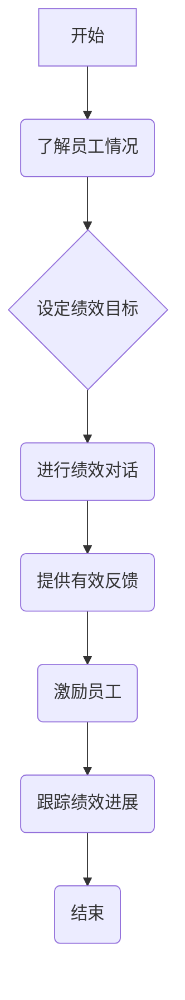
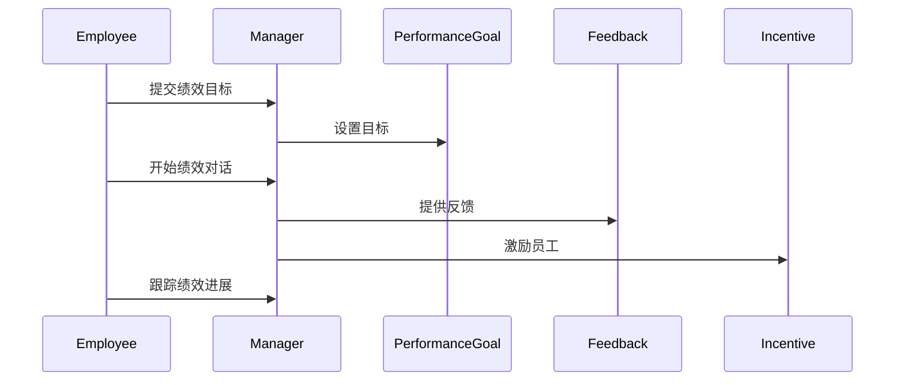
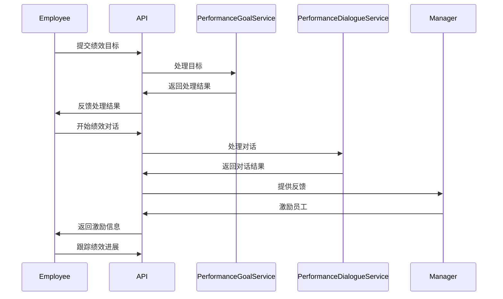

                 


# 绩效对话的艺术：有效反馈与激励

## 关键词
绩效对话、有效反馈、激励、管理、员工发展、组织效能

## 摘要
在现代企业管理中，绩效对话是一项至关重要的沟通技能，它涉及如何通过有效的反馈和激励来提升员工的工作表现和满意度。本文将深入探讨绩效对话的艺术，包括其核心概念、流程设计、算法原理，并结合实际案例进行分析，为企业管理者和员工提供实用的指导。

### 第一部分：背景介绍

#### 1.1 问题背景
在全球化竞争激烈的市场环境下，企业需要不断提高效率和生产力，而员工绩效成为衡量企业竞争力的关键指标。绩效对话作为一种有效的沟通方式，能够帮助企业识别问题、设定目标、提供反馈和激励，从而提升员工的绩效水平。

#### 1.2 问题描述
绩效对话的艺术涉及如何通过有效的反馈和激励，提升员工的绩效表现。这包括如何给予员工恰当的反馈、设定合理的绩效目标、激发员工的内在动力等。

#### 1.3 问题解决
本文将围绕绩效对话的核心概念，逐步分析其设计原则和实施步骤，并提供实用的技巧和案例，帮助读者掌握绩效对话的艺术。

#### 1.4 边界与外延
绩效对话的艺术不仅适用于企业内部管理，也适用于其他组织和团队的管理实践。此外，本文将探讨不同文化背景下的绩效对话差异，为国际化的企业管理提供参考。

#### 1.5 概念结构与核心要素组成
- **绩效对话**：管理者与员工之间的沟通，旨在通过交流提高员工的工作表现。
- **有效反馈**：给予员工具有建设性、具体且及时的反馈。
- **激励**：通过奖励和认可，激发员工的内在动力。

### 第二部分：核心概念与联系

#### 2.1 核心概念原理
- **绩效对话**：绩效对话是一种双向沟通，旨在通过交流与沟通，提升员工的工作表现。它不仅包括管理者对员工的评价和指导，还包括员工对工作的自我反思和目标设定。
- **有效反馈**：有效反馈是绩效对话的关键环节，它要求反馈者能够及时、具体、有针对性地指出员工的优点和改进点，帮助员工更好地理解自己的工作表现。
- **激励**：激励是激发员工内在动力的重要手段，它可以通过奖励、认可和晋升等方式，激发员工的积极性和创造力。

#### 2.2 概念属性特征对比表格
| 概念     | 定义                                                         | 属性特征                             | 关联性                           |
|----------|--------------------------------------------------------------|------------------------------------|---------------------------------|
| 绩效对话 | 管理者与员工之间的沟通                                     | 双向沟通、针对具体绩效问题         | 与有效反馈和激励密切相关       |
| 有效反馈 | 及时、具体、具有建设性的反馈                               | 帮助员工理解工作表现、指导改进     | 与绩效对话和激励有关           |
| 激励     | 通过奖励和认可，激发员工的积极性和工作动力                 | 增强员工动力、提高工作绩效         | 与绩效对话和有效反馈相互作用 |

#### 2.3 ER实体关系图架构
```mermaid
erDiagram
    绩效对话 ||--|{ 有效反馈 }||> 激励
    绩效对话 ||--|{ 员工 }||> 指导
    有效反馈 ||--|{ 反馈内容 }||> 提高绩效
    激励     ||--|{ 激励方式 }||> 激发动力
```

### 第三部分：算法原理讲解

#### 3.1 绩效对话流程图


#### 3.2 Python源代码
```python
# 绩效对话流程模拟代码
def perform_performance_dialog():
    print("了解员工情况：")
    employee_status = input()
    print("设定绩效目标：")
    performance_goal = input()
    print("进行绩效对话：")
    dialog_outcome = input()
    print("提供有效反馈：")
    feedback = input()
    print("激励员工：")
    motivation = input()
    print("跟踪绩效进展：")
    progress = input()
    print("绩效对话结束。")

# 执行绩效对话流程
perform_performance_dialog()
```

#### 3.3 算法原理详细讲解
绩效对话的算法原理可以分解为以下几个步骤：

1. **了解员工情况**：通过问卷调查、面谈等方式，收集员工的工作状况、职业目标和个人需求等信息。
2. **设定绩效目标**：根据员工的情况和企业目标，设定具体、可衡量的绩效指标。
3. **进行绩效对话**：在对话中，管理者需要倾听员工的意见和建议，同时明确绩效目标和要求。
4. **提供有效反馈**：管理者需要根据对话中的表现，给予员工具体、建设性的反馈，帮助员工认识到自己的优势和需要改进的地方。
5. **激励员工**：通过奖励、认可和晋升等方式，激发员工的积极性和创造力。
6. **跟踪绩效进展**：定期检查员工的绩效进展，及时调整反馈和激励策略。

以下是一个具体的算法原理示例：

$$
\text{绩效对话} = f(\text{员工情况}, \text{绩效目标}, \text{对话内容}, \text{反馈}, \text{激励}, \text{绩效进展})
$$

其中，$f$ 表示绩效对话的算法函数，$\text{员工情况}$、$\text{绩效目标}$、$\text{对话内容}$、$\text{反馈}$、$\text{激励}$和$\text{绩效进展}$分别为绩效对话的输入参数。

通过以上算法，企业可以系统地管理员工绩效，提高整体组织效能。

### 第四部分：系统分析与架构设计

#### 4.1 问题场景介绍
在一个快速发展的互联网公司中，随着业务规模的扩大，员工数量和部门复杂度不断增加，如何有效地进行绩效管理和激励成为企业面临的关键挑战。

#### 4.2 项目介绍
为了解决上述问题，企业决定开发一套绩效管理平台，该平台将涵盖绩效目标设定、绩效对话、反馈和激励等功能，以提升员工的绩效和满意度。

#### 4.3 系统功能设计（领域模型类图）
```mermaid
classDiagram
    Employee <<类>> 
    Manager <<类>>
    PerformanceGoal <<类>> 
    Feedback <<类>>
    Incentive <<类>>

    Employee *- Manager :汇报
    Employee *- PerformanceGoal :设定
    Manager *- Feedback :提供
    Manager *- Incentive :激励
```

#### 4.4 系统架构设计（架构图）


#### 4.5 系统接口设计和系统交互（序列图）


### 第五部分：项目实战

#### 5.1 环境安装
在安装环境前，确保系统已经安装了Python 3.8及以上版本。然后，可以通过以下命令安装必要的库：

```
pip install Flask
pip install Flask-RESTful
pip install SQLAlchemy
pip install Flask-Migrate
```

#### 5.2 系统核心实现源代码
以下是绩效管理平台的核心实现代码：

```python
# app.py
from flask import Flask, request, jsonify
from flask_restful import Api, Resource
from models import db, Employee, PerformanceGoal, Feedback, Incentive

app = Flask(__name__)
app.config['SQLALCHEMY_DATABASE_URI'] = 'sqlite:///performance_management.db'
db.init_app(app)
api = Api(app)

class EmployeeAPI(Resource):
    def post(self):
        data = request.get_json()
        employee = Employee(name=data['name'], department=data['department'])
        db.session.add(employee)
        db.session.commit()
        return jsonify({'message': 'Employee added successfully.'})

class PerformanceGoalAPI(Resource):
    def post(self):
        data = request.get_json()
        goal = PerformanceGoal(employee_id=data['employee_id'], goal=data['goal'])
        db.session.add(goal)
        db.session.commit()
        return jsonify({'message': 'Performance goal added successfully.'})

class FeedbackAPI(Resource):
    def post(self):
        data = request.get_json()
        feedback = Feedback(employee_id=data['employee_id'], comment=data['comment'])
        db.session.add(feedback)
        db.session.commit()
        return jsonify({'message': 'Feedback added successfully.'})

class IncentiveAPI(Resource):
    def post(self):
        data = request.get_json()
        incentive = Incentive(employee_id=data['employee_id'], incentive=data['incentive'])
        db.session.add(incentive)
        db.session.commit()
        return jsonify({'message': 'Incentive added successfully.'})

api.add_resource(EmployeeAPI, '/employees')
api.add_resource(PerformanceGoalAPI, '/performance-goals')
api.add_resource(FeedbackAPI, '/feedback')
api.add_resource(IncentiveAPI, '/incentives')

if __name__ == '__main__':
    app.run(debug=True)
```

#### 5.3 代码应用解读与分析
以上代码定义了一个简单的 Flask Web 应用，用于处理员工的绩效目标、反馈和激励。通过 RESTful API，用户可以方便地添加和查询相关数据。

- **EmployeeAPI**：处理员工的添加操作。
- **PerformanceGoalAPI**：处理绩效目标的添加操作。
- **FeedbackAPI**：处理反馈的添加操作。
- **IncentiveAPI**：处理激励的添加操作。

这些 API 都是基于 Flask-RESTful 库实现的，响应 JSON 格式的数据，便于前端使用。

#### 5.4 实际案例分析和详细讲解剖析
假设一个新员工张三刚加入公司，他的部门经理李四需要通过绩效管理平台为他设定绩效目标。以下是具体的操作步骤：

1. **添加员工**：
   ```json
   POST /employees
   {
       "name": "张三",
       "department": "研发部"
   }
   ```
   接收到请求后，系统将添加一个名为“张三”的员工记录。

2. **设定绩效目标**：
   ```json
   POST /performance-goals
   {
       "employee_id": 1,
       "goal": "在一个月内完成指定的项目任务"
   }
   ```
   接收到请求后，系统将为员工张三设定一个绩效目标。

3. **提供反馈**：
   ```json
   POST /feedback
   {
       "employee_id": 1,
       "comment": "张三在项目任务中的表现良好，但需要加强团队合作能力"
   }
   ```
   接收到请求后，系统将记录对张三的反馈。

4. **激励员工**：
   ```json
   POST /incentives
   {
       "employee_id": 1,
       "incentive": "项目任务完成奖金500元"
   }
   ```
   接收到请求后，系统将为张三提供激励。

通过以上步骤，部门经理李四可以通过绩效管理平台有效地管理张三的绩效，并提供反馈和激励。

#### 5.5 项目小结
本项目的目标是开发一个简单的绩效管理平台，实现员工的添加、绩效目标设定、反馈和激励等功能。通过实际案例的分析，我们可以看到平台如何通过 API 接口实现这些功能，并方便地与前端系统进行数据交互。项目的成功实施将有助于企业更好地管理员工绩效，提高整体组织效能。

### 第六部分：最佳实践 Tips、小结、注意事项、拓展阅读

#### 最佳实践 Tips
- **定期进行绩效对话**：确保绩效对话的频率，有助于及时了解员工的工作状况和需求。
- **个性化反馈**：根据员工的个性和工作表现，提供个性化的反馈，增加反馈的针对性和有效性。
- **及时激励**：对于表现出色的员工，及时给予激励，增强员工的积极性和工作动力。

#### 小结
本文通过深入探讨绩效对话的艺术，包括其核心概念、流程设计、算法原理，并结合实际案例进行分析，为企业管理者和员工提供了实用的指导。绩效对话作为一种有效的沟通方式，能够帮助企业提升员工的绩效水平和满意度。

#### 注意事项
- **尊重员工**：在绩效对话中，尊重员工，避免批评和指责，关注员工的发展和需求。
- **数据安全**：确保绩效管理平台的数据安全，防止数据泄露和滥用。

#### 拓展阅读
- 《绩效管理：从战略到实践》
- 《激励心理学：如何激发员工潜能》
- 《管理沟通：理论与实践》

### 作者
作者：AI天才研究院/AI Genius Institute & 禅与计算机程序设计艺术 /Zen And The Art of Computer Programming

