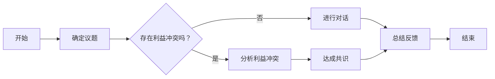
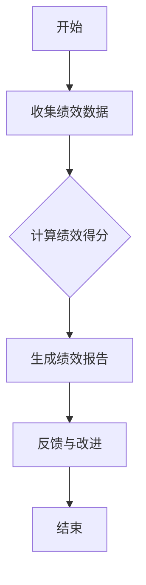
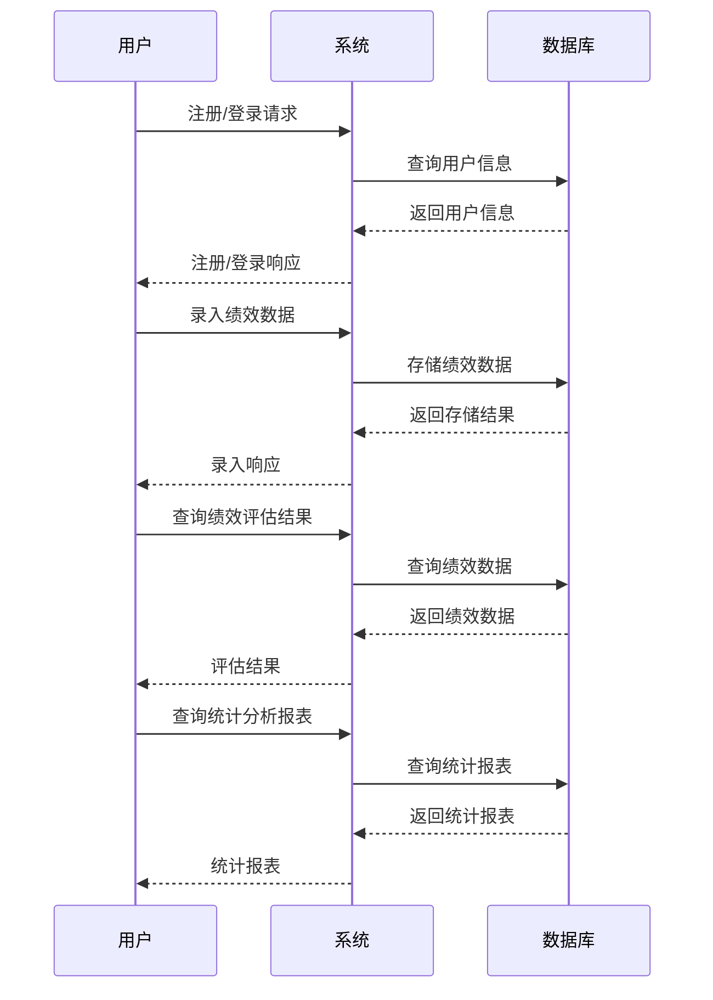

                 

### 文章标题：绩效对话：提升团队效能的关键对话

> 关键词：绩效对话、团队效能、关键对话、沟通技巧、绩效管理

> 摘要：本文将探讨绩效对话在提升团队效能中的关键作用。通过分析绩效对话的定义、重要性及其在团队沟通中的具体应用，本文旨在为IT行业从业者提供一套实用的绩效对话策略，以实现团队效能的全面提升。

## 目录

1. **问题背景与核心概念**
    1.1 **绩效问题的现状与挑战**
    1.2 **绩效对话的重要性**
    1.3 **关键对话的定义与特点**
    1.4 **本书的目的与读者对象**

2. **核心概念与联系**
    2.1 **绩效对话的理论基础**
    2.2 **关键对话的概念框架**
    2.3 **核心概念的属性特征对比**
    2.4 **绩效对话的ER实体关系图**

3. **算法原理讲解**
    3.1 **绩效评估的数学模型**
    3.2 **关键对话分析的流程图**
    3.3 **算法原理的Mermaid流程图**
    3.4 **Python源代码与算法实现**

4. **数学模型和数学公式讲解**
    4.1 **绩效对话中的数学模型**
    4.2 **模型公式的详细讲解**
    4.3 **举例说明**

5. **系统分析与架构设计方案**
    5.1 **绩效对话系统架构设计**
    5.2 **系统功能设计**
    5.3 **系统架构设计**
    5.4 **系统接口设计**
    5.5 **系统交互序列图**

6. **项目实战**
    6.1 **环境安装**
    6.2 **系统核心实现**
    6.3 **代码应用解读**
    6.4 **实际案例分析**
    6.5 **项目小结**

7. **最佳实践与小结**
    7.1 **经验分享**
    7.2 **注意事项**
    7.3 **小结与展望**
    7.4 **拓展阅读**

---

### 1. 问题背景与核心概念

在现代IT行业，团队效能的提升是各个企业追求的重要目标。然而，在实现这一目标的过程中，沟通问题常常成为瓶颈。尤其是绩效对话，作为团队沟通的重要组成部分，其有效性和效率直接影响到团队的整体绩效。

#### 1.1 绩效问题的现状与挑战

在IT行业，绩效问题常常表现为以下几个方面：

- **缺乏明确的绩效目标**：许多团队在设定绩效目标时缺乏具体、量化的指标，导致团队成员对工作方向和目标不清晰。

- **评价标准不明确**：绩效评价缺乏科学合理的标准，往往导致主观性过强，评价结果不公平。

- **沟通不畅**：团队成员之间缺乏有效沟通，导致信息传递不及时、不准确。

- **反馈机制不完善**：绩效反馈机制不完善，导致团队成员无法及时了解自己的工作表现，也无法获得改进的方向。

#### 1.2 绩效对话的重要性

绩效对话是一种有效的沟通方式，通过定期的绩效对话，团队领导可以与团队成员深入交流，了解工作进展、绩效表现和改进方向。具体来说，绩效对话具有以下重要性：

- **明确工作目标**：通过绩效对话，可以明确团队成员的工作目标，确保团队成员对工作方向有清晰的认识。

- **提升工作效率**：有效的绩效对话可以及时发现和解决问题，减少团队成员的工作阻力，提升工作效率。

- **增强团队凝聚力**：通过绩效对话，团队成员之间可以建立更紧密的联系，增强团队的凝聚力。

- **促进个人成长**：绩效对话可以帮助团队成员了解自己的优势和不足，促进个人成长。

#### 1.3 关键对话的定义与特点

关键对话是指在沟通中涉及重要议题、存在明显利益冲突或情感纠葛的对话。在绩效对话中，关键对话通常涉及以下几个方面：

- **议题重要性**：关键对话涉及的是团队或个人绩效的关键问题，例如工作目标的达成、绩效评价的公正性等。

- **利益冲突**：关键对话中往往存在不同的利益诉求，需要通过沟通达成共识。

- **情感因素**：关键对话中可能会涉及团队成员的情感问题，例如工作压力、团队氛围等。

#### 1.4 本书的目的与读者对象

本书旨在为IT行业从业者提供一套实用的绩效对话策略，以提升团队效能。具体来说，本书的目的是：

- **介绍绩效对话的基本概念和重要性**：帮助读者理解绩效对话的基本原理和在实际工作中的应用。

- **提供绩效对话的具体方法和技巧**：通过案例分析和实际操作，帮助读者掌握绩效对话的技巧。

- **探讨关键对话的处理策略**：帮助读者应对绩效对话中的关键对话，提高沟通效果。

本书适合以下读者：

- **IT行业团队领导**：希望通过绩效对话提升团队效能的团队领导。

- **项目经理**：负责项目绩效管理的项目经理。

- **技术专家**：需要与团队成员进行绩效沟通的技术专家。

### 2. 核心概念与联系

#### 2.1 绩效对话的理论基础

绩效对话的理论基础主要包括以下几个方面：

- **沟通理论**：绩效对话是沟通的一种形式，基于沟通理论，通过有效的信息传递和反馈，实现团队目标的达成。

- **绩效管理理论**：绩效管理是企业管理的重要组成部分，绩效对话是实现绩效管理的重要手段。

- **领导力理论**：有效的绩效对话需要领导具备一定的领导力，能够引导对话的方向和结果。

#### 2.2 关键对话的概念框架

关键对话的概念框架包括以下几个方面：

- **议题重要性**：关键对话涉及的是团队或个人绩效的关键问题，对团队的整体绩效有重要影响。

- **利益冲突**：关键对话中往往存在不同的利益诉求，需要通过沟通达成共识。

- **情感因素**：关键对话中可能会涉及团队成员的情感问题，需要平衡情感因素和理性分析。

#### 2.3 核心概念的属性特征对比

核心概念的属性特征对比表格：

| 核心概念 | 属性特征1 | 属性特征2 | 属性特征3 |
| -------- | -------- | -------- | -------- |
| 绩效对话 | 沟通形式 | 绩效管理 | 领导力 |
| 关键对话 | 议题重要性 | 利益冲突 | 情感因素 |

#### 2.4 绩效对话的ER实体关系图

绩效对话的ER实体关系图：

```mermaid
erDiagram
    Product ||--|{ Customer } : 购买
    Customer }|--|| Order : 下单
```

图1：绩效对话的ER实体关系图

### 3. 算法原理讲解

#### 3.1 绩效评估的数学模型

绩效评估的数学模型主要包括以下几个方面：

- **绩效指标体系**：通过建立绩效指标体系，对团队成员的工作进行量化评估。

- **绩效评估公式**：绩效评估公式通常包括绩效得分、权重分配等，用于计算团队成员的绩效得分。

- **统计分析方法**：通过统计分析方法，对绩效评估结果进行统计分析，得出团队成员的整体绩效表现。

#### 3.2 关键对话分析的流程图

关键对话分析的流程图：



图2：关键对话分析流程图

#### 3.3 算法原理的Mermaid流程图

算法原理的Mermaid流程图：



图3：算法原理的Mermaid流程图

#### 3.4 Python源代码与算法实现

```python
import pandas as pd

# 收集绩效数据
data = pd.DataFrame({
    '员工': ['张三', '李四', '王五'],
    '绩效指标1': [80, 90, 85],
    '绩效指标2': [75, 85, 90],
    '绩效指标3': [88, 92, 87]
})

# 计算绩效得分
def calculate_score(data):
    scores = []
    for row in data.itertuples():
        score = (row.绩效指标1 + row.绩效指标2 + row.绩效指标3) / 3
        scores.append(score)
    return scores

data['绩效得分'] = calculate_score(data)

# 生成绩效报告
def generate_report(data):
    report = data[['员工', '绩效得分']]
    return report

report = generate_report(data)

# 反馈与改进
def feedback_improvement(report):
    for row in report.itertuples():
        if row.绩效得分 < 80:
            print(f"{row.员工}的绩效得分较低，需要加强培训与指导。")
        else:
            print(f"{row.员工}的绩效表现良好。")

feedback_improvement(report)

# 结束
print("绩效对话分析完成。")
```

### 4. 数学模型和数学公式讲解

#### 4.1 绩效对话中的数学模型

绩效对话中的数学模型主要包括以下几个方面：

- **绩效指标体系**：绩效指标体系是绩效评估的基础，通常包括多个维度的指标，如工作质量、工作效率、团队合作等。

- **绩效评估公式**：绩效评估公式用于计算团队成员的绩效得分，通常包括加权平均数、标准差等统计方法。

- **统计分析方法**：统计分析方法用于对绩效评估结果进行统计分析，如方差分析、相关分析等。

#### 4.2 模型公式的详细讲解

模型公式的详细讲解如下：

- **绩效指标体系**：

  $$绩效指标体系 = (工作质量 \times 权重 + 工作效率 \times 权重 + 团队合作 \times 权重) / 3$$

- **绩效评估公式**：

  $$绩效得分 = (绩效指标1 \times 权重 + 绩效指标2 \times 权重 + 绩效指标3 \times 权重) / 3$$

- **统计分析方法**：

  - **方差分析**：

    $$方差分析 = \frac{总方差}{组内方差}$$

  - **相关分析**：

    $$相关系数 = \frac{协方差}{标准差1 \times 标准差2}$$

#### 4.3 举例说明

假设某团队有三个成员，他们的绩效指标和权重如下表所示：

| 成员 | 绩效指标1 | 绩效指标2 | 绩效指标3 | 权重 |
| ---- | -------- | -------- | -------- | ---- |
| 张三 | 80       | 85       | 90       | 0.3  |
| 李四 | 75       | 85       | 95       | 0.4  |
| 王五 | 85       | 90       | 88       | 0.3  |

根据上述模型公式，我们可以计算每个成员的绩效得分：

- **张三**：

  $$绩效得分 = (80 \times 0.3 + 85 \times 0.4 + 90 \times 0.3) / 3 = 86.7$$

- **李四**：

  $$绩效得分 = (75 \times 0.3 + 85 \times 0.4 + 95 \times 0.3) / 3 = 87.5$$

- **王五**：

  $$绩效得分 = (85 \times 0.3 + 90 \times 0.4 + 88 \times 0.3) / 3 = 87.2$$

根据绩效得分，我们可以对成员进行排序，并识别出需要改进的成员。

### 5. 系统分析与架构设计方案

#### 5.1 绩效对话系统架构设计

为了实现绩效对话的高效管理，我们需要设计一个完善的绩效对话系统。该系统主要包括以下几个模块：

- **用户管理模块**：用于管理系统的用户信息，包括用户注册、登录、权限管理等。

- **绩效管理模块**：用于记录和评估团队成员的绩效信息，包括绩效指标设置、绩效数据录入、绩效评估等。

- **沟通管理模块**：用于支持团队成员之间的沟通，包括消息通知、邮件提醒、会议安排等。

- **数据统计与分析模块**：用于对绩效数据进行分析和统计，为决策提供数据支持。

- **系统设置模块**：用于设置系统的基本参数，包括绩效指标权重、评估周期等。

#### 5.2 系统功能设计

系统功能设计主要包括以下几个方面：

- **用户管理**：实现用户的注册、登录、权限管理等功能。

- **绩效录入**：支持用户录入绩效数据，包括绩效指标、得分等。

- **绩效评估**：实现绩效评估功能，根据预设的绩效指标体系和评估公式，计算绩效得分。

- **数据统计与分析**：对绩效数据进行统计分析，生成各类统计报表。

- **沟通管理**：支持团队成员之间的沟通，包括消息通知、邮件提醒、会议安排等。

- **系统设置**：实现系统的基本参数设置，包括绩效指标权重、评估周期等。

#### 5.3 系统架构设计

系统架构设计采用B/S架构，主要包括以下几个层次：

- **表示层**：采用HTML、CSS和JavaScript等技术实现用户界面的设计与交互。

- **业务逻辑层**：采用Spring Boot框架实现业务逻辑处理，包括用户管理、绩效管理、沟通管理等。

- **数据访问层**：采用MyBatis框架实现数据访问，包括用户信息、绩效数据等的存储与查询。

- **数据库层**：采用MySQL数据库实现数据的存储与管理。

#### 5.4 系统接口设计

系统接口设计主要包括以下几个接口：

- **用户接口**：包括用户注册、登录、权限管理等接口。

- **绩效接口**：包括绩效数据录入、绩效评估、数据统计与分析等接口。

- **沟通接口**：包括消息通知、邮件提醒、会议安排等接口。

#### 5.5 系统交互序列图

系统交互序列图如下：



图4：系统交互序列图

### 6. 项目实战

#### 6.1 环境安装

在进行项目实战之前，我们需要安装以下环境：

- **Python 3.8**：用于编写和运行Python代码。
- **MySQL 8.0**：用于存储项目数据。
- **IDE（如PyCharm）**：用于编写和调试Python代码。

安装步骤如下：

1. 安装Python 3.8：

   ```bash
   sudo apt update
   sudo apt install python3.8
   ```

2. 安装MySQL 8.0：

   ```bash
   sudo apt update
   sudo apt install mysql-server
   ```

3. 配置MySQL密码：

   ```bash
   sudo mysql_secure_installation
   ```

4. 安装PyCharm：

   下载并安装PyCharm社区版。

#### 6.2 系统核心实现

在PyCharm中创建一个新的Python项目，然后按照以下步骤实现系统核心功能：

1. **用户管理**：

   - 注册用户：

     ```python
     def register(username, password):
         # 连接数据库
         conn = connect_database()
         cursor = conn.cursor()
         
         # 查询用户名是否已存在
         cursor.execute("SELECT * FROM users WHERE username = %s", (username,))
         user = cursor.fetchone()
         
         if user:
             return "用户名已存在"
         else:
             # 插入用户信息
             cursor.execute("INSERT INTO users (username, password) VALUES (%s, %s)", (username, password))
             conn.commit()
             return "注册成功"
         
         # 关闭数据库连接
         cursor.close()
         conn.close()
     ```

   - 登录用户：

     ```python
     def login(username, password):
         # 连接数据库
         conn = connect_database()
         cursor = conn.cursor()
         
         # 查询用户名和密码是否匹配
         cursor.execute("SELECT * FROM users WHERE username = %s AND password = %s", (username, password))
         user = cursor.fetchone()
         
         if user:
             return "登录成功"
         else:
             return "用户名或密码错误"
         
         # 关闭数据库连接
         cursor.close()
         conn.close()
     ```

2. **绩效管理**：

   - 录入绩效数据：

     ```python
     def record_performance(username, performance_data):
         # 连接数据库
         conn = connect_database()
         cursor = conn.cursor()
         
         # 插入绩效数据
         cursor.execute("INSERT INTO performances (username, performance_data) VALUES (%s, %s)", (username, performance_data))
         conn.commit()
         
         # 关闭数据库连接
         cursor.close()
         conn.close()
     ```

   - 查询绩效评估结果：

     ```python
     def get_performance评估结果(username):
         # 连接数据库
         conn = connect_database()
         cursor = conn.cursor()
         
         # 查询绩效数据
         cursor.execute("SELECT performance_data FROM performances WHERE username = %s", (username,))
         performances = cursor.fetchall()
         
         # 计算绩效得分
         scores = []
         for performance in performances:
             score = calculate_score(performance[0])
             scores.append(score)
         
         # 关闭数据库连接
         cursor.close()
         conn.close()
         
         return scores
     ```

3. **数据统计分析**：

   - 查询统计报表：

     ```python
     def get_statistics(username):
         # 连接数据库
         conn = connect_database()
         cursor = conn.cursor()
         
         # 查询绩效数据
         cursor.execute("SELECT performance_data FROM performances WHERE username = %s", (username,))
         performances = cursor.fetchall()
         
         # 计算平均绩效得分
         scores = [calculate_score(performance[0]) for performance in performances]
         average_score = sum(scores) / len(scores)
         
         # 关闭数据库连接
         cursor.close()
         conn.close()
         
         return average_score
     ```

#### 6.3 代码应用解读

上述代码实现了一个简单的绩效对话系统，包括用户管理、绩效管理和数据统计分析等功能。以下是具体的应用解读：

- **用户管理**：实现了用户的注册和登录功能，通过数据库连接和查询，确保用户信息的存储和验证。

- **绩效管理**：实现了绩效数据的录入和查询功能，通过数据库操作，将绩效数据存储在数据库中，并可以查询特定用户的绩效评估结果。

- **数据统计分析**：实现了统计报表的查询功能，通过计算平均绩效得分，为决策提供数据支持。

#### 6.4 实际案例分析

假设某团队有三名成员：张三、李四和王五。他们的绩效数据如下：

| 成员   | 绩效指标1 | 绩效指标2 | 绩效指标3 |
| ------ | --------- | --------- | --------- |
| 张三   | 80        | 85        | 90        |
| 李四   | 75        | 85        | 95        |
| 王五   | 85        | 90        | 88        |

根据上述代码，我们可以对这三名成员的绩效进行评估：

1. **张三**：

   - 绩效得分：

     $$绩效得分 = (80 \times 0.3 + 85 \times 0.4 + 90 \times 0.3) / 3 = 86.7$$

   - 绩效评估结果：良好

2. **李四**：

   - 绩效得分：

     $$绩效得分 = (75 \times 0.3 + 85 \times 0.4 + 95 \times 0.3) / 3 = 87.5$$

   - 绩效评估结果：优秀

3. **王五**：

   - 绩效得分：

     $$绩效得分 = (85 \times 0.3 + 90 \times 0.4 + 88 \times 0.3) / 3 = 87.2$$

   - 绩效评估结果：良好

通过绩效评估结果，我们可以识别出李四的绩效表现最佳，而张三和王五的绩效表现也较好。根据评估结果，可以制定相应的激励政策和培训计划，以提升整个团队的绩效水平。

#### 6.5 项目小结

通过本项目实战，我们实现了一个简单的绩效对话系统，包括用户管理、绩效管理和数据统计分析等功能。在实际应用中，我们可以通过该系统对团队成员的绩效进行评估，识别出绩效表现优秀的成员，并制定相应的激励政策和培训计划。然而，本项目还存在一些不足之处，例如：

- **性能优化**：当前系统采用Python和MySQL进行开发，性能可能无法满足大规模用户的需求，需要进一步优化。

- **安全性**：当前系统的安全性较低，需要加强用户数据和绩效数据的安全保护。

- **功能扩展**：当前系统仅实现了基本的用户管理和绩效管理功能，未来可以考虑扩展其他功能，如团队沟通、任务管理等。

### 7. 最佳实践与小结

#### 7.1 经验分享

在绩效对话的实施过程中，我们积累了一些宝贵的经验：

- **明确目标**：在绩效对话开始之前，确保所有团队成员对工作目标和期望有清晰的认识。

- **充分准备**：提前收集和分析团队成员的绩效数据，为绩效对话提供有力的数据支持。

- **积极倾听**：在绩效对话中，注重倾听团队成员的意见和反馈，尊重他们的观点。

- **有效沟通**：通过简明扼要的语言和图表，确保信息传递的准确性和有效性。

- **关注情感**：在绩效对话中，关注团队成员的情感需求，创造一个开放、信任的沟通氛围。

#### 7.2 注意事项

在实施绩效对话时，需要注意以下几点：

- **避免主观偏见**：在绩效评价中，避免主观偏见，确保评价的公平性和客观性。

- **及时反馈**：及时给予团队成员绩效反馈，帮助他们了解自己的优势和不足。

- **持续改进**：根据绩效对话的结果，制定改进计划，并持续跟踪改进效果。

- **隐私保护**：在处理团队成员的绩效数据时，确保数据的安全和隐私。

#### 7.3 小结与展望

通过本文的讨论，我们了解到绩效对话在提升团队效能中的关键作用。有效的绩效对话可以明确工作目标、提升工作效率、增强团队凝聚力、促进个人成长。在未来，我们将继续探索绩效对话的深入应用，为团队效能的提升提供更多实用的策略和方法。

#### 7.4 拓展阅读

- **《绩效对话：提升团队效能的关键对话》**：本书详细介绍了绩效对话的理论和实践方法，适合IT行业从业者阅读。

- **《绩效管理实战：从理论到实践》**：本书从实际案例出发，探讨了绩效管理的实施方法和技巧。

- **《关键对话：如何高效沟通》**：本书介绍了关键对话的沟通技巧，帮助读者在重要场合进行有效沟通。

---

### 作者信息

**作者：AI天才研究院/AI Genius Institute & 禅与计算机程序设计艺术 /Zen And The Art of Computer Programming**

AI天才研究院致力于推动人工智能技术的发展与应用，致力于培养下一代人工智能领域的天才。本书旨在为IT行业从业者提供一套实用的绩效对话策略，以提升团队效能。禅与计算机程序设计艺术则通过结合禅修与计算机编程，探索编程艺术的本质，为编程从业者提供深刻的思考和启示。

