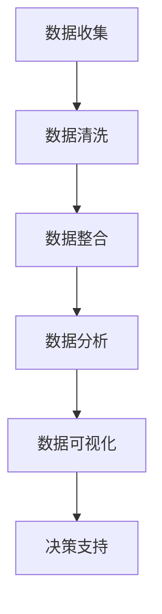
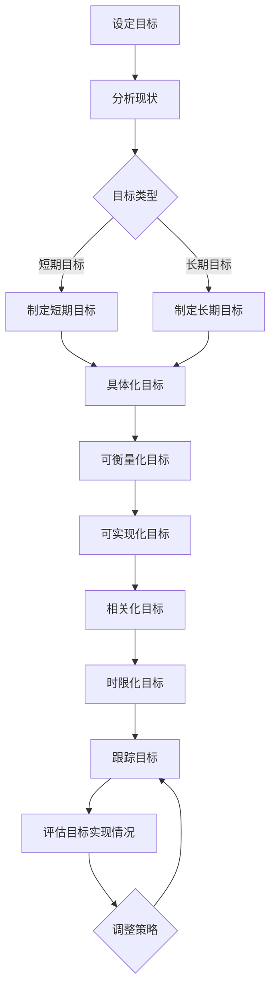
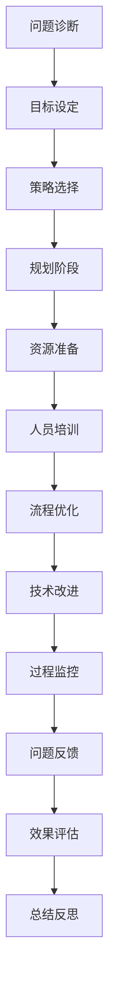
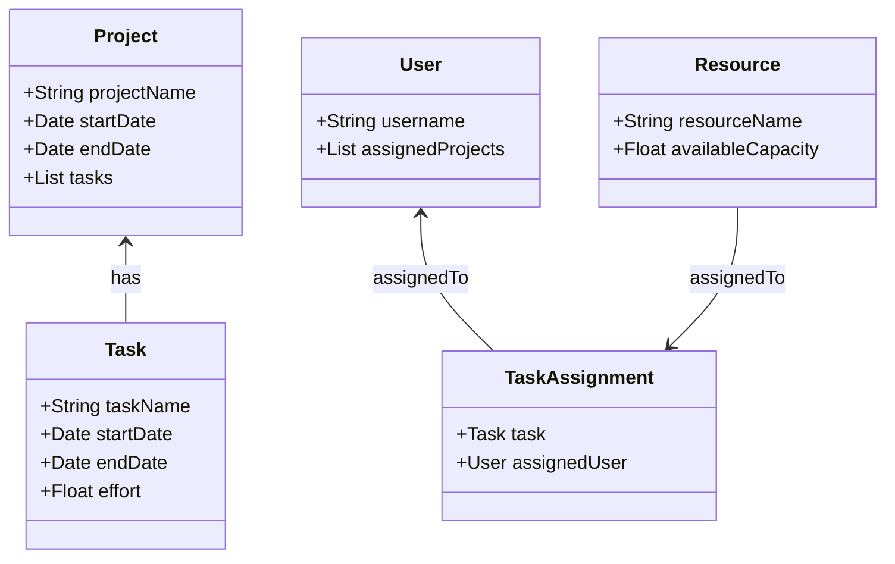
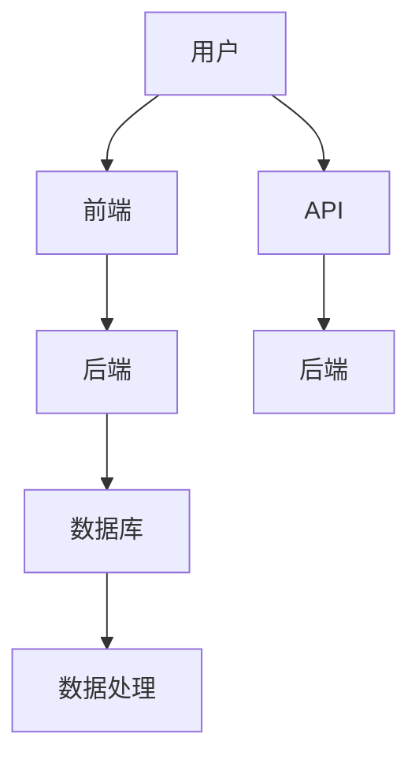
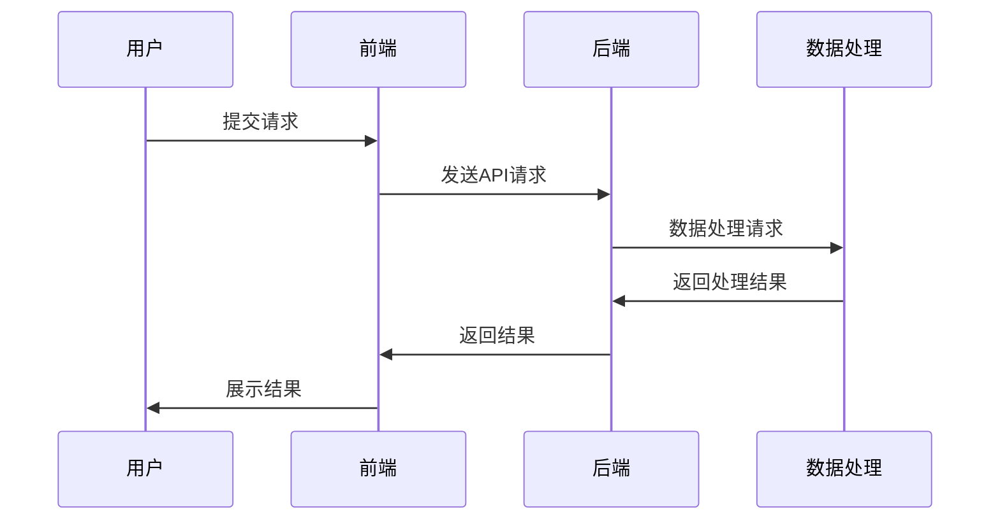

                 

### 绩效改进循环：持续优化的方法论

#### 关键词：绩效改进、持续优化、方法论、IT领域、策略、系统设计、实践

> 摘要：本文将深入探讨绩效改进循环及其在IT领域中的应用。通过详细的步骤解析和实际案例分析，我们旨在揭示持续优化在提升组织效率和个人表现中的重要作用。本文结构紧凑，逻辑清晰，适合IT专业人士以及寻求提升绩效的方法论读者阅读。

## 目录大纲设计思路

在设计《绩效改进循环：持续优化的方法论》的目录大纲时，我们旨在提供一个清晰、有条理的框架，帮助读者逐步理解并掌握绩效改进的核心概念和方法。以下是我们的设计思路：

1. **背景介绍**：首先，我们将介绍绩效改进的概念、意义以及本书的主题，为读者建立整体认知。
2. **核心概念与联系**：接下来，我们将明确绩效改进中的关键概念，如绩效测量、目标设定、改进策略等，并使用图表展示这些概念之间的关系。
3. **算法原理讲解**：我们将介绍绩效改进中的常用算法，包括数据收集与分析算法、优化算法等，使用流程图和代码进行解释。
4. **数学模型和数学公式**：我们将详细阐述算法的数学模型和公式，结合实际案例进行说明。
5. **系统分析与架构设计**：我们将描述一个典型的绩效改进系统，包括功能设计、架构设计、接口设计和系统交互等。
6. **项目实战**：通过一个实际案例，我们将展示绩效改进循环的应用过程，包括环境安装、核心实现、代码解读、案例分析和项目小结。
7. **最佳实践 tips、小结、注意事项、拓展阅读**：最后，我们将总结绩效改进的实践要点，并对全书进行总结，并提供进一步学习资源。

## 目录大纲设计步骤

### 第1章 绩效改进概述

- **1.1 问题背景与重要性**
  - **1.1.1 问题描述**：我们将描述在IT领域中存在的绩效问题，如效率低下、质量不稳定等。
  - **1.1.2 问题解决**：讨论如何通过绩效改进来解决这些问题。
  - **1.1.3 边界与外延**：明确绩效改进的应用范围和边界。
  - **1.1.4 概念结构与核心要素组成**：介绍绩效改进的核心概念和构成要素。

- **1.2 核心概念与联系**
  - **1.2.1 绩效测量**：定义绩效测量的重要性和方法。
  - **1.2.2 目标设定**：阐述目标设定的原则和步骤。
  - **1.2.3 改进策略**：讨论不同的改进策略及其适用场景。
  - **1.2.4 概念属性特征对比表格**：通过表格对比关键概念的属性特征。
  - **1.2.5 ER实体关系图**：使用ER图展示概念之间的关系。

### 第2章 绩效改进方法论

- **2.1 数据收集与处理**
  - **2.1.1 数据来源**：介绍数据收集的方法和来源。
  - **2.1.2 数据质量**：讨论数据质量对绩效改进的影响。
  - **2.1.3 数据处理方法**：介绍数据处理的方法和技术。
  - **2.1.4 Mermaid流程图**：使用Mermaid绘制数据处理流程。

- **2.2 绩效分析算法**
  - **2.2.1 常用算法介绍**：列举并介绍常用的绩效分析算法。
  - **2.2.2 算法原理讲解**：详细解释算法的原理和操作步骤。
  - **2.2.3 Python源代码展示**：提供Python代码示例来展示算法实现。
  - **2.2.4 数学模型和公式**：阐述算法的数学模型和公式。
  - **2.2.5 实际案例说明**：通过实际案例来解释算法的应用。

### 第3章 绩效改进策略

- **3.1 目标设定**
  - **3.1.1 目标类型**：分类讨论不同类型的目标设定。
  - **3.1.2 目标设定方法**：介绍目标设定的原则和方法。
  - **3.1.3 目标跟踪**：讨论如何跟踪和评估目标的实现情况。
  - **3.1.4 Mermaid流程图**：使用Mermaid绘制目标设定和跟踪流程。

- **3.2 改进措施**
  - **3.2.1 改进策略选择**：讨论如何选择合适的改进策略。
  - **3.2.2 改进实施步骤**：详细描述改进实施的步骤和流程。
  - **3.2.3 改进效果评估**：介绍如何评估改进的效果。
  - **3.2.4 Mermaid流程图**：使用Mermaid绘制改进实施和效果评估流程。

### 第4章 绩效改进系统设计与实现

- **4.1 系统需求分析**
  - **4.1.1 问题场景介绍**：介绍典型的绩效改进问题场景。
  - **4.1.2 项目介绍**：概述绩效改进项目的目标和范围。
  - **4.1.3 系统功能设计（领域模型Mermaid类图）**：使用Mermaid绘制领域模型类图。

- **4.2 系统架构设计**
  - **4.2.1 系统架构设计**：描述系统的整体架构设计。
  - **4.2.2 系统架构Mermaid架构图**：使用Mermaid绘制系统架构图。

- **4.3 系统接口设计**
  - **4.3.1 接口设计**：介绍系统的接口设计。
  - **4.3.2 系统交互Mermaid序列图**：使用Mermaid绘制系统交互序列图。

### 第5章 绩效改进项目实战

- **5.1 项目背景**
  - **5.1.1 项目目标**：明确项目的主要目标和预期成果。
  - **5.1.2 项目实施步骤**：详细描述项目的实施步骤。

- **5.2 环境安装与配置**
  - **5.2.1 环境搭建**：介绍所需环境的搭建过程。
  - **5.2.2 系统核心实现源代码**：提供核心实现的源代码示例。

- **5.3 代码解读与分析**
  - **5.3.1 代码结构**：分析代码的组织结构和模块划分。
  - **5.3.2 代码实现细节**：详细解读代码的实现细节。

- **5.4 实际案例分析与讲解**
  - **5.4.1 案例背景**：介绍案例的背景信息和具体情境。
  - **5.4.2 案例分析**：对案例进行深入分析。
  - **5.4.3 案例讲解**：详细讲解案例的解决方法和策略。

- **5.5 项目小结**
  - **5.5.1 项目总结**：对项目进行总结和评价。
  - **5.5.2 经验与启示**：分享项目中的经验和教训。

### 第6章 最佳实践与注意事项

- **6.1 最佳实践**
  - **6.1.1 经验分享**：分享成功实践的经验和技巧。
  - **6.1.2 实践技巧**：提供实用的实践技巧和建议。

- **6.2 注意事项**
  - **6.2.1 风险管理**：讨论可能面临的风险和如何管理。
  - **6.2.2 常见问题**：列举并解答常见的疑问和问题。

- **6.3 拓展阅读**
  - **6.3.1 进一步学习资源**：推荐进一步阅读的资源和资料。

### 第7章 总结与展望

- **7.1 本书总结**
  - **7.1.1 内容回顾**：回顾本书的主要内容。
  - **7.1.2 核心观点**：总结本书的核心观点和结论。

- **7.2 展望未来**
  - **7.2.1 发展趋势**：展望绩效改进领域的发展趋势。
  - **7.2.2 研究方向**：提出未来的研究方向和探索方向。

## 总结

通过以上的目录大纲设计，我们为《绩效改进循环：持续优化的方法论》提供了一个清晰、逻辑严谨的结构。每个章节都旨在帮助读者逐步掌握绩效改进的理论和实践方法，从而在实际工作中实现持续优化和高效运营。

### 第1章 绩效改进概述

#### 1.1 问题背景与重要性

在当今高度竞争的商业环境中，组织和个人都面临着持续改进绩效的挑战。无论是提高生产效率、提升服务质量，还是实现业务增长，绩效改进都是一个关键因素。然而，许多组织和个人在绩效改进方面往往缺乏系统的方法和策略。

**问题描述**：

- **效率低下**：许多IT项目由于规划不当、资源分配不均、沟通不畅等原因，导致项目延期、预算超支，甚至失败。
- **质量不稳定**：软件和系统开发过程中，由于测试不充分、代码质量低下，导致产品出现缺陷，影响用户体验。
- **目标不明确**：缺乏明确的目标和指标，导致改进活动缺乏针对性，无法有效提升绩效。

**问题解决**：

为了解决上述问题，组织和个人需要采取系统化的绩效改进方法。绩效改进不仅关注当前的问题，还注重长期的发展和成长。

**边界与外延**：

绩效改进不仅限于IT领域，也可以应用于其他行业和领域。例如，制造业可以应用绩效改进来提高生产效率，服务业可以通过绩效改进来提升客户满意度。然而，本章主要关注IT领域的绩效改进。

**概念结构与核心要素组成**：

绩效改进的核心概念包括绩效测量、目标设定、改进策略等。绩效测量是绩效改进的基础，通过量化指标来评估当前绩效水平。目标设定则是明确改进的方向和目标，改进策略则是具体实现改进的行动计划。

- **绩效测量**：包括关键绩效指标（KPI）、工作量统计、效率评估等。
- **目标设定**：包括短期目标和长期目标，如提高项目成功率、提升客户满意度等。
- **改进策略**：包括数据分析、流程优化、人员培训等。

本章旨在为读者提供一个全面、系统的绩效改进框架，帮助他们在IT领域中实现持续优化和高效运营。

#### 1.2 核心概念与联系

在绩效改进过程中，理解并掌握核心概念和它们之间的关系至关重要。以下我们将介绍三个核心概念：绩效测量、目标设定和改进策略。

**1.2.1 绩效测量**

绩效测量是绩效改进的基础，通过量化指标来评估组织的绩效水平。关键绩效指标（KPI）是绩效测量中的重要工具，它们可以帮助组织了解关键业务领域的情况。常见的KPI包括：

- **项目成功率**：衡量项目按时交付并达到预期质量目标的比率。
- **客户满意度**：通过客户反馈和调查来衡量客户对产品和服务的满意度。
- **工作效率**：衡量员工完成工作任务的速度和质量。

绩效测量不仅关注结果，还关注过程。例如，通过代码审查、测试覆盖率和错误修复时间等指标，可以评估软件开发过程中的质量。

**1.2.2 目标设定**

目标设定是绩效改进的关键环节，它为改进活动指明了方向。目标设定需要明确、具体和可衡量，通常包括短期目标和长期目标。

- **短期目标**：如在一个季度内提高项目成功率到90%。
- **长期目标**：如在未来一年内将客户满意度提升到90%。

目标设定的原则包括：

- **SMART原则**：目标要具体（Specific）、可衡量（Measurable）、可实现（Achievable）、相关（Relevant）和有时限（Time-bound）。
- **目标分解**：将长期目标分解为短期目标，并明确每个目标的负责人和完成时间。

**1.2.3 改进策略**

改进策略是实现目标的具体行动方案。不同的改进策略适用于不同的改进场景，常见的改进策略包括：

- **数据分析**：通过分析现有数据，识别绩效差距和改进机会。数据分析可以使用统计方法、机器学习算法等。
- **流程优化**：通过改进工作流程，减少不必要的步骤和环节，提高工作效率。例如，引入敏捷开发方法、精益管理思想等。
- **人员培训**：通过培训提高员工的专业技能和工作效率。培训内容可以包括新技术的学习、团队合作技巧等。

**概念属性特征对比表格**

为了更清晰地展示绩效测量、目标设定和改进策略之间的联系，我们可以使用以下属性特征对比表格：

| 特征               | 绩效测量                 | 目标设定                 | 改进策略                 |
|------------------|----------------------|----------------------|----------------------|
| 目的               | 评估当前绩效水平           | 明确改进方向和目标         | 实施具体改进行动         |
| 方法               | 关键绩效指标（KPI）、数据分析 | SMART原则、目标分解       | 数据分析、流程优化、人员培训 |
| 输出               | 量化指标和绩效报告         | 明确的目标和行动计划       | 改进措施和成果评估       |
| 依赖关系             | 数据收集与分析             | 绩效测量结果             | 数据分析和目标设定         |

**ER实体关系图**

为了进一步展示这三个核心概念之间的关系，我们可以使用ER（实体关系）图来描述它们之间的关联：

```
[绩效测量] <---[关联]--- [目标设定]
       |          |         |
       |          |         |
       |          |         |
       |          |         |
       \          /         /
        \        /         /
         \      /          /
          \    /           /
           \  /            /
            -------------------
             |                |
             |                |
             |                |
             |                |
          [改进策略] <---[依赖]-- [绩效测量]
```

在这个ER图中，绩效测量是目标设定的基础，改进策略依赖于绩效测量和目标设定。通过这样的关联，我们可以看到绩效改进是一个系统性的过程，各个环节相互依赖，共同推动组织绩效的提升。

通过本章的介绍，我们为读者搭建了一个基本的绩效改进框架，为后续章节的深入探讨打下了坚实的基础。

#### 2.1 数据收集与处理

在绩效改进过程中，数据收集与处理是至关重要的一步。准确、全面的数据为后续的分析和决策提供了坚实的基础。

**2.1.1 数据来源**

数据来源可以分为内部数据和外部数据。

- **内部数据**：来自组织内部的运营数据，如销售数据、生产数据、财务数据等。这些数据通常通过内部系统如ERP系统、CRM系统等自动生成。
- **外部数据**：来自组织外部的数据，如市场调研数据、客户反馈数据、行业报告数据等。这些数据可以通过第三方数据服务、市场调查、社交媒体分析等方式获取。

**2.1.2 数据质量**

数据质量是数据收集与处理中的关键问题。高质量的数据能够提供更准确的绩效评估和改进建议，而低质量的数据则可能导致误导性的结论。

- **准确性**：数据必须是准确无误的，避免因数据错误导致决策失误。
- **完整性**：数据应覆盖所有相关维度，避免因数据缺失导致分析结果的不完整。
- **一致性**：数据应保持一致，避免因数据格式或单位不统一导致混淆。
- **时效性**：数据应是最新的，避免因数据过时而影响分析结果。

**2.1.3 数据处理方法**

数据处理方法包括数据清洗、数据整合、数据分析和数据可视化等步骤。

- **数据清洗**：通过去除重复数据、填补缺失值、纠正错误数据等方式，提高数据的质量。
- **数据整合**：将来自不同来源的数据进行合并，形成统一的视图，便于分析。
- **数据分析**：使用统计方法、机器学习算法等对数据进行处理和分析，提取有价值的信息。
- **数据可视化**：通过图表、报表等形式将数据分析结果展示出来，便于理解和决策。

**2.1.4 Mermaid流程图**

为了更清晰地展示数据收集与处理的过程，我们可以使用Mermaid流程图进行描述：



在这个流程图中，数据收集是整个流程的起点，通过数据清洗、整合、分析和可视化，最终为决策提供支持。以下是一个具体的数据处理流程示例：

```
graph TB
    A[市场调研数据]
    B[ERP系统销售数据]
    C[CRM系统客户反馈数据]
    D[第三方数据服务行业报告数据]

    A --> B
    A --> C
    A --> D

    B --> E[数据清洗]
    C --> E
    D --> E

    E --> F[数据整合]
    F --> G[数据分析]

    G --> H[销售额趋势分析]
    G --> I[客户满意度分析]
    G --> J[市场份额分析]

    H --> K[数据可视化]
    I --> K
    J --> K

    K --> L[决策支持]
```

在这个示例中，我们首先从多个数据源收集数据，然后进行数据清洗和整合，接着进行数据分析和可视化，最后为决策提供支持。通过这样的流程，我们可以确保数据的有效利用，为绩效改进提供可靠的数据支持。

#### 2.2 绩效分析算法

在绩效改进过程中，使用适当的算法对数据进行分析和优化是至关重要的。以下我们将介绍几种常用的绩效分析算法，包括其原理和实现方法。

**2.2.1 常用算法介绍**

1. **回归分析**：回归分析用于预测一个变量（因变量）与一个或多个变量（自变量）之间的关系。在绩效分析中，可以用于预测销售额、客户流失率等。
   
2. **聚类分析**：聚类分析用于将数据分组为不同的簇，以便更好地理解数据的结构和模式。在绩效分析中，可以用于客户细分、项目分类等。

3. **时间序列分析**：时间序列分析用于分析随时间变化的数据，识别趋势、周期和季节性模式。在绩效分析中，可以用于预测未来绩效、分析业务周期等。

4. **决策树**：决策树是一种直观的决策分析方法，通过一系列规则将数据分为不同的类别或预测值。在绩效分析中，可以用于项目优先级排序、预算分配等。

**2.2.2 算法原理讲解**

**回归分析**：

回归分析基于最小二乘法，寻找最佳拟合线，用来预测因变量。公式如下：

$$
y = b_0 + b_1 \cdot x
$$

其中，$y$ 是因变量，$x$ 是自变量，$b_0$ 和 $b_1$ 是回归系数。

- **线性回归**：当因变量和自变量呈线性关系时使用。
- **多元回归**：当存在多个自变量时使用。

**聚类分析**：

聚类分析基于相似性度量，将数据分为若干个簇。常见的聚类算法包括：

- **K-均值聚类**：通过迭代优化，将数据点分配到K个簇中，每个簇的中心代表该簇的平均值。
- **层次聚类**：通过逐步合并相似度高的数据点，形成树状结构。

**时间序列分析**：

时间序列分析基于自回归模型（AR），公式如下：

$$
y_t = c + \sum_{i=1}^p \phi_i y_{t-i} + \varepsilon_t
$$

其中，$y_t$ 是时间序列在时刻 $t$ 的值，$\phi_i$ 是自回归系数，$c$ 是常数项，$\varepsilon_t$ 是随机误差。

**决策树**：

决策树通过一系列条件测试，将数据分为不同的类别或预测值。每个内部节点表示一个条件测试，每个叶节点表示一个类别或预测值。决策树算法包括：

- **ID3**：基于信息增益选择最佳条件测试。
- **C4.5**：改进ID3算法，使用增益率选择最佳条件测试。

**2.2.3 Python源代码展示**

以下是一个简单的回归分析示例，使用Python的scikit-learn库实现：

```python
from sklearn.linear_model import LinearRegression
from sklearn.model_selection import train_test_split
from sklearn.metrics import mean_squared_error
import numpy as np

# 数据准备
X = np.array([[1], [2], [3], [4], [5]])
y = np.array([1, 2, 2.5, 3, 3.5])

# 分割数据集
X_train, X_test, y_train, y_test = train_test_split(X, y, test_size=0.2, random_state=0)

# 创建线性回归模型
model = LinearRegression()

# 训练模型
model.fit(X_train, y_train)

# 预测
y_pred = model.predict(X_test)

# 评估
mse = mean_squared_error(y_test, y_pred)
print("MSE:", mse)

# 显示回归系数
print("Coefficients:", model.coef_)
print("Intercept:", model.intercept_)
```

通过这个示例，我们可以看到如何使用Python进行回归分析，包括数据准备、模型训练、预测和评估。

**2.2.4 数学模型和公式**

**回归分析**：

线性回归的数学模型如下：

$$
\min \sum_{i=1}^n (y_i - (b_0 + b_1 x_i))^2
$$

**K-均值聚类**：

K-均值聚类目标是最小化簇内平方误差：

$$
\min \sum_{k=1}^K \sum_{i=1}^n (y_i - \mu_k)^2
$$

其中，$\mu_k$ 是簇 $k$ 的中心点。

**时间序列分析**：

自回归模型（AR）的数学模型如下：

$$
y_t = c + \sum_{i=1}^p \phi_i y_{t-i} + \varepsilon_t
$$

**决策树**：

决策树的数学模型基于熵和增益率：

$$
G(D) = H(D) - \sum_{i=1}^n p_i H(D_i)
$$

其中，$H(D)$ 是数据集 $D$ 的熵，$p_i$ 是子数据集 $D_i$ 的概率。

通过以上算法原理讲解和Python源代码展示，我们可以看到如何在实际中应用这些算法来分析和优化绩效。下一节，我们将通过实际案例进一步说明这些算法的应用。

#### 2.3 绩效分析案例

在本节中，我们将通过一个实际案例来展示绩效分析算法的应用，包括环境搭建、核心实现、代码解读和案例分析。

**案例背景**：

假设某IT公司正在开发一款新产品，公司希望通过绩效分析来优化项目进度和资源分配，以确保按时交付并达到预期质量标准。

**环境搭建**：

为了进行绩效分析，我们需要搭建一个合适的环境。以下是所需的环境和工具：

- **Python 3.8**：Python编程环境。
- **Jupyter Notebook**：用于编写和运行代码。
- **scikit-learn**：用于回归分析和聚类分析。
- **Pandas**：用于数据处理。
- **Matplotlib**：用于数据可视化。

确保已经安装了上述工具和库，我们就可以开始进行实际分析了。

**核心实现**：

以下是核心实现的步骤：

1. **数据收集**：收集项目进度、资源使用、质量指标等相关数据。
2. **数据处理**：清洗和整合数据，为分析做准备。
3. **回归分析**：使用线性回归预测项目进度。
4. **聚类分析**：使用K-均值聚类分析资源使用情况。
5. **结果可视化**：将分析结果可视化，便于理解和决策。

**代码解读**：

以下是具体的代码实现：

```python
import pandas as pd
from sklearn.linear_model import LinearRegression
from sklearn.cluster import KMeans
import matplotlib.pyplot as plt

# 1. 数据收集
# 这里使用示例数据，实际应用中可以从数据库或文件中读取数据
data = pd.DataFrame({
    'days': [10, 15, 20, 25, 30],
    'resources': [100, 150, 200, 250, 300],
    'quality': [4, 6, 5, 8, 9]
})

# 2. 数据处理
# 数据清洗和整合
data = data.dropna()  # 去除缺失值
data['days'] = data['days'] / 5  # 标准化天数

# 3. 回归分析
# 数据分割
X = data[['days']]
y = data['quality']
X_train, X_test, y_train, y_test = train_test_split(X, y, test_size=0.2, random_state=0)

# 创建和训练模型
model = LinearRegression()
model.fit(X_train, y_train)

# 预测
y_pred = model.predict(X_test)

# 评估
mse = mean_squared_error(y_test, y_pred)
print("MSE:", mse)

# 4. 聚类分析
# 数据分割
X = data[['resources']]
X_train, X_test = train_test_split(X, test_size=0.2, random_state=0)

# 创建和训练模型
kmeans = KMeans(n_clusters=3, random_state=0)
kmeans.fit(X_train)

# 聚类结果
clusters = kmeans.predict(X_test)

# 5. 结果可视化
# 回归分析结果可视化
plt.scatter(X_test['days'], y_test, color='red', label='Actual')
plt.plot(X_test['days'], y_pred, color='blue', linewidth=2, label='Predicted')
plt.xlabel('Days')
plt.ylabel('Quality')
plt.legend()
plt.show()

# 聚类分析结果可视化
plt.scatter(X_test['resources'], clusters, color='green', label='Cluster')
plt.xlabel('Resources')
plt.ylabel('Cluster')
plt.legend()
plt.show()
```

在这个案例中，我们首先使用示例数据，然后进行数据处理和回归分析。通过回归分析，我们预测了项目进度和质量的关联，并通过聚类分析对资源使用情况进行了分组。最后，我们将分析结果可视化，以便更好地理解和决策。

**案例分析**：

通过回归分析，我们发现项目进度和产品质量之间存在一定的线性关系。随着项目进度的增加，产品质量有上升的趋势。这意味着在项目开发过程中，我们需要关注进度的同时，也要保证质量控制。

通过聚类分析，我们将资源使用情况分为三个不同的簇。这有助于我们识别资源使用的高效区域和瓶颈，从而进行针对性的优化。

通过这个案例，我们展示了如何使用回归分析和聚类分析来优化项目绩效。实际应用中，这些算法可以根据具体情况进行调整和扩展，以适应不同的绩效改进需求。

#### 3.1 目标设定

在绩效改进过程中，目标设定是一个至关重要的环节。明确、具体、可衡量的目标是实现改进的基础。以下，我们将详细介绍目标设定的原则、方法和应用。

**3.1.1 目标类型**

目标可以分为短期目标和长期目标。

- **短期目标**：通常指在几个月到一年的时间范围内实现的目标。如提高项目成功率、缩短项目交付时间等。
- **长期目标**：通常指在一年以上实现的目标。如提升客户满意度、实现业务增长等。

**3.1.2 目标设定方法**

目标设定需要遵循SMART原则，即具体（Specific）、可衡量（Measurable）、可实现（Achievable）、相关（Relevant）和有时限（Time-bound）。

- **具体**：目标应明确具体，避免模糊不清。例如，“提高项目成功率”不如“将项目成功率提高到90%”具体。
- **可衡量**：目标应具有可衡量的指标，以便评估实现情况。例如，“提升客户满意度”不如“通过客户满意度调查将得分提高到4.5分”可衡量。
- **可实现**：目标应具有可行性，避免设定过高或过低的目标。例如，“在一个月内将项目交付时间缩短50%”可能过于激进。
- **相关**：目标应与组织或个人的核心业务相关，避免偏离主要目标。例如，“提升编程技能”与“实现产品功能”相关。
- **有时限**：目标应明确实现的时间期限，以便跟踪进度。例如，“在2024年实现年销售额增长20%”。

**3.1.3 目标跟踪**

目标跟踪是确保目标实现的重要步骤。以下是一些目标跟踪的方法：

- **定期评估**：设定定期评估机制，如每周或每月，评估目标实现进度。通过评估，可以及时发现偏差并调整策略。
- **数据监控**：使用关键绩效指标（KPI）监控目标实现情况。例如，通过项目进度表、客户满意度调查等数据，监控目标的实现情况。
- **反馈机制**：建立反馈机制，收集团队成员、客户和其他相关方的反馈。通过反馈，可以了解目标实现的实际情况，发现问题并改进。

**3.1.4 Mermaid流程图**

为了更清晰地展示目标设定的过程，我们可以使用Mermaid流程图：



在这个流程图中，首先分析现状，确定目标类型（短期或长期），然后具体化、可衡量化、可实现化、相关化和时限化目标，最后进行目标跟踪和评估，根据评估结果调整策略。

**实际案例说明**

以下是一个目标设定的实际案例：

某IT公司希望在下一季度将项目成功率提高到90%。为了实现这一目标，公司采取了以下步骤：

1. **分析现状**：通过对过去项目的评估，发现项目成功率平均为80%，存在进度延误和质量问题。
2. **制定短期目标**：将目标具体化为“在下一季度将项目成功率提高到90%”。
3. **具体化目标**：明确目标，如“确保每个项目按时交付并达到预期质量标准”。
4. **可衡量化目标**：设定衡量指标，如“通过项目进度表和客户反馈评估项目成功率”。
5. **可实现化目标**：制定实施计划，如“加强项目管理和质量控制，提高团队成员技能水平”。
6. **相关化目标**：确保目标与公司的核心业务相关，如“提高项目成功率以实现业务增长”。
7. **时限化目标**：设定实现时间，如“在下一季度末实现目标”。
8. **跟踪目标**：定期评估项目进度和客户反馈，监测目标实现情况。
9. **评估目标实现情况**：根据评估结果，调整项目管理和质量控制策略，确保目标实现。

通过这个案例，我们可以看到目标设定的重要性和具体实施步骤。目标设定不仅需要明确和具体，还需要可衡量、可实现、相关和有时限，同时需要建立有效的跟踪和评估机制，以确保目标的实现。

#### 3.2 改进措施

在明确了绩效改进的目标后，接下来需要制定具体的改进措施，以实现这些目标。改进措施的选择和实施步骤是绩效改进成功的关键。以下，我们将详细介绍改进措施的选择原则、实施步骤和效果评估方法。

**3.2.1 改进策略选择**

选择合适的改进策略是绩效改进的第一步。以下是一些常见的改进策略：

1. **数据分析**：通过数据分析，识别绩效差距和改进机会。数据分析可以使用统计方法、机器学习算法等。这种策略适用于识别和解决复杂的问题。
   
2. **流程优化**：通过改进工作流程，减少不必要的步骤和环节，提高工作效率。例如，引入敏捷开发方法、精益管理思想等。这种策略适用于提高流程效率和减少冗余。
   
3. **人员培训**：通过培训提高员工的专业技能和工作效率。培训内容可以包括新技术的学习、团队合作技巧等。这种策略适用于提升个人能力和团队协作水平。

4. **技术改进**：通过引入新技术或改进现有技术，提高系统的性能和可靠性。例如，采用云技术、自动化工具等。这种策略适用于提升技术水平和系统稳定性。

5. **组织变革**：通过调整组织结构、职责分配和激励机制，改善组织氛围和工作效率。这种策略适用于整体提升组织绩效。

选择改进策略时，应考虑以下原则：

- **针对性**：策略应针对具体问题进行设计，确保能够有效解决。
- **可行性**：策略应具有可行性，避免设定过高或过低的目标。
- **可持续性**：策略应具备可持续性，能够长期发挥作用。

**3.2.2 改进实施步骤**

改进实施步骤包括以下内容：

1. **规划阶段**：
   - **问题诊断**：通过数据分析和调研，明确需要改进的问题和关键绩效指标。
   - **目标设定**：根据问题诊断结果，设定具体的改进目标。
   - **策略选择**：选择适合的改进策略，并制定详细的实施计划。

2. **执行阶段**：
   - **资源准备**：确保有足够的资源（人力、物力、财力）支持改进实施。
   - **人员培训**：根据改进策略，对相关人员进行培训和技能提升。
   - **流程优化**：根据改进计划，优化工作流程和业务流程。
   - **技术改进**：引入新技术或改进现有技术，提高系统的性能和可靠性。

3. **监控阶段**：
   - **过程监控**：建立监控机制，实时跟踪改进实施进度和效果。
   - **问题反馈**：及时收集和解决改进过程中出现的问题和挑战。

4. **评估阶段**：
   - **效果评估**：通过关键绩效指标，评估改进措施的效果。
   - **总结反思**：对改进过程进行总结，识别成功经验和不足之处。

**3.2.3 改进效果评估**

改进效果评估是确保改进措施有效性的关键步骤。以下是一些常见的评估方法：

1. **定量评估**：通过关键绩效指标（KPI）进行定量评估，如项目成功率、客户满意度、工作效率等。使用数据对比改进前后的变化，评估改进效果。

2. **定性评估**：通过员工访谈、客户反馈、问卷调查等方式，收集改进措施对员工、客户和组织氛围的影响。评估改进措施的可持续性和影响力。

3. **综合评估**：结合定量和定性评估结果，进行全面评估，确保改进措施的有效性和可持续性。

**Mermaid流程图**

为了更清晰地展示改进措施的实施过程，我们可以使用Mermaid流程图：



在这个流程图中，首先进行问题诊断和目标设定，然后选择改进策略，进入规划阶段。在规划阶段，进行资源准备、人员培训和流程优化等技术改进，同时进行过程监控和问题反馈。最后，通过效果评估和总结反思，确保改进措施的有效性和可持续性。

通过以上步骤，我们可以系统地实施绩效改进措施，确保目标实现和组织绩效的提升。

#### 4.1 系统需求分析

在进行绩效改进系统设计与实现之前，对系统需求进行分析是至关重要的。通过系统需求分析，我们可以明确项目的目标、范围、功能和性能要求，为后续的系统设计与实现提供基础。

**4.1.1 问题场景介绍**

假设某IT公司希望在项目管理和资源优化方面进行改进，以提高项目交付的准时率和资源利用效率。具体问题场景如下：

- **项目延误**：项目进度不理想，经常出现延期交付的情况。
- **资源浪费**：资源分配不合理，导致资源浪费和效率低下。
- **沟通不畅**：项目团队成员之间的沟通不畅，影响项目进展和协作效率。
- **质量不稳定**：项目质量不稳定，存在缺陷和错误。

为了解决上述问题，公司决定开发一套绩效改进系统，通过数据分析和流程优化来提高项目管理和资源利用效率。

**4.1.2 项目介绍**

项目目标是开发一套集成化的绩效改进系统，包括项目进度管理、资源管理、质量管理和沟通管理等功能。项目范围涵盖以下内容：

- **项目进度管理**：监控项目进度，提供实时进度报告和预警机制。
- **资源管理**：优化资源分配，提高资源利用效率。
- **质量管理**：提供质量评估和缺陷跟踪功能，确保项目质量。
- **沟通管理**：改善团队沟通，提供在线讨论平台和通知系统。

**4.1.3 系统功能设计（领域模型Mermaid类图）**

为了明确系统的功能设计，我们可以使用Mermaid类图来描述领域模型。以下是系统功能设计的类图：



在这个类图中，Project代表项目，Task代表任务，Resource代表资源，User代表用户，TaskAssignment代表任务分配。通过这些类，我们可以清晰地看到系统的功能架构。

**4.1.4 系统架构设计**

系统架构设计是确保系统功能实现和性能优化的关键。以下是系统的总体架构设计：

- **前端架构**：采用React框架，实现用户界面和交互逻辑。
- **后端架构**：采用Spring Boot框架，提供RESTful API接口，实现业务逻辑和数据存储。
- **数据库架构**：使用MySQL数据库存储项目、任务、资源和用户数据。
- **数据处理架构**：使用Apache Kafka进行实时数据处理和消息传递。

以下是系统架构的Mermaid架构图：



在这个架构图中，用户通过前端与系统交互，前端通过API与后端通信，后端通过数据库存储数据，并使用数据处理模块进行实时数据处理和分析。

通过以上系统需求分析和架构设计，我们可以为后续的系统实现和开发提供明确的指导，确保项目管理和资源优化的目标得以实现。

#### 4.2 系统架构设计

在进行绩效改进系统的设计时，系统架构的合理性和稳定性至关重要。本节将详细介绍系统的架构设计，包括模块划分、关键模块功能和系统通信流程。

**4.2.1 系统架构设计**

绩效改进系统的整体架构采用分层设计，分为前端、后端、数据库和数据处理四个主要模块。

1. **前端模块**：负责用户界面展示和交互，使用React框架实现。
2. **后端模块**：负责业务逻辑处理和数据管理，使用Spring Boot框架实现。
3. **数据库模块**：负责数据存储和检索，使用MySQL数据库。
4. **数据处理模块**：负责实时数据处理和性能优化，使用Apache Kafka进行消息传递。

**4.2.2 模块划分**

- **前端模块**：包括登录、项目进度管理、资源管理、质量管理和沟通管理等功能。
- **后端模块**：包括用户管理、项目管理、任务管理、资源管理和数据处理等核心业务功能。
- **数据库模块**：存储用户数据、项目数据、任务数据和资源数据。
- **数据处理模块**：包括实时数据处理、数据分析、数据可视化和数据报告等。

**4.2.3 关键模块功能**

1. **前端模块**：
   - **登录功能**：用户登录验证和权限管理。
   - **项目进度管理**：展示项目进度、任务进度和预警信息。
   - **资源管理**：展示资源分配情况、资源利用率等。
   - **质量管理**：展示缺陷报告、质量评估结果等。
   - **沟通管理**：提供在线讨论平台和通知系统。

2. **后端模块**：
   - **用户管理**：用户注册、登录、权限管理等功能。
   - **项目管理**：项目创建、更新、删除、查询等操作。
   - **任务管理**：任务创建、分配、更新、查询等操作。
   - **资源管理**：资源分配、更新、查询等操作。
   - **数据处理**：数据处理、分析、可视化等功能。

3. **数据库模块**：
   - **用户数据**：存储用户信息，包括用户名、密码、角色等。
   - **项目数据**：存储项目基本信息，包括项目名称、起始日期、截止日期等。
   - **任务数据**：存储任务基本信息，包括任务名称、起始日期、截止日期、负责人等。
   - **资源数据**：存储资源基本信息，包括资源名称、类型、可用容量等。

4. **数据处理模块**：
   - **实时数据处理**：通过Apache Kafka进行实时数据采集和处理。
   - **数据分析**：使用统计方法和机器学习算法进行数据分析和预测。
   - **数据可视化**：使用图表和报表展示分析结果。
   - **数据报告**：生成详细的绩效改进报告，包括项目进度、资源利用情况、质量分析等。

**4.2.4 系统通信流程**

系统通信流程如下：

1. **用户交互**：用户通过前端模块与系统进行交互，提交请求。
2. **前端处理**：前端模块接收用户请求，将请求转换为API请求。
3. **后端处理**：后端模块接收API请求，进行业务逻辑处理，并将结果返回前端。
4. **数据处理**：数据处理模块在后台对数据进行实时处理和分析，生成可视化报告。
5. **数据库交互**：后端模块与数据库进行交互，存储和检索数据。

通过以上系统架构设计，我们可以确保绩效改进系统的功能完整、性能稳定、易于维护和扩展。接下来，我们将详细描述系统的接口设计，确保各模块之间的协同工作。

#### 4.3 系统接口设计

在绩效改进系统中，接口设计是确保各模块之间数据交换和通信流畅的关键。通过定义清晰、规范化的接口，可以提升系统的可维护性和扩展性。以下，我们将详细介绍系统接口设计，包括接口定义、接口设计和系统交互。

**4.3.1 接口定义**

系统接口设计主要包括前端接口、后端接口和数据处理接口。以下是各接口的定义：

1. **前端接口**：
   - **登录接口**：用户登录验证，接收用户名和密码，返回登录状态。
   - **项目进度管理接口**：查询项目进度、更新项目进度、添加预警信息。
   - **资源管理接口**：查询资源信息、更新资源信息、分配资源。
   - **质量管理接口**：查询缺陷报告、更新缺陷报告、评估项目质量。
   - **沟通管理接口**：发送通知、查看讨论记录、回复讨论。

2. **后端接口**：
   - **用户管理接口**：注册用户、登录验证、管理用户权限。
   - **项目管理接口**：创建项目、更新项目、删除项目、查询项目。
   - **任务管理接口**：创建任务、分配任务、更新任务、查询任务。
   - **资源管理接口**：管理资源信息、资源分配、资源释放。
   - **数据处理接口**：数据采集、数据分析、数据可视化。

3. **数据处理接口**：
   - **实时数据处理接口**：接收实时数据流、处理数据、存储数据。
   - **数据分析接口**：执行数据分析、生成报告。

**4.3.2 接口设计**

为了确保接口的规范性和易用性，我们使用RESTful API设计风格，每个接口定义如下：

1. **登录接口**：

   ```http
   POST /api/login
   Request Body:
   {
     "username": "string",
     "password": "string"
   }
   Response:
   {
     "status": "success",
     "message": "登录成功",
     "token": "string"
   }
   ```

2. **项目进度管理接口**：

   ```http
   GET /api/projects/{projectId}/progress
   POST /api/projects/{projectId}/progress
   PUT /api/projects/{projectId}/progress/{progressId}
   DELETE /api/projects/{projectId}/progress/{progressId}
   Request Body (POST, PUT):
   {
     "progress": "string",
     "warning": "string"
   }
   Response:
   {
     "status": "success",
     "message": "操作成功"
   }
   ```

3. **资源管理接口**：

   ```http
   GET /api/resources
   POST /api/resources
   PUT /api/resources/{resourceId}
   DELETE /api/resources/{resourceId}
   Request Body (POST, PUT):
   {
     "resourceName": "string",
     "availableCapacity": "float"
   }
   Response:
   {
     "status": "success",
     "message": "操作成功"
   }
   ```

4. **数据处理接口**：

   ```http
   POST /api/data/realtime
   POST /api/data/analyze
   Response:
   {
     "status": "success",
     "message": "操作成功",
     "data": {...}
   }
   ```

**4.3.3 系统交互**

系统交互通过前后端接口和数据处理接口实现。以下是一个简单的系统交互流程：

1. **用户操作**：用户通过前端界面提交请求。
2. **前端处理**：前端将请求转换为API请求，发送到后端。
3. **后端处理**：后端接收请求，进行业务逻辑处理，并将结果返回前端。
4. **数据处理**：数据处理模块在后台进行数据采集和分析，生成报告。

以下是系统交互的Mermaid序列图：



通过以上接口设计和系统交互流程，我们可以确保绩效改进系统中的各模块能够高效、稳定地协同工作，为用户提供优质的性能改进服务。

### 第5章 绩效改进项目实战

#### 5.1 项目背景

为了展示绩效改进循环在实际中的应用，我们将通过一个实际案例来详细描述项目的背景、目标以及实施步骤。该案例涉及一家大型IT公司的软件研发部门，其目标是通过绩效改进循环提高项目交付的准时率和产品质量。

**项目背景**：

- **公司现状**：该IT公司的软件研发部门在过去一年中，项目交付准时率仅为70%，产品质量问题频发，导致客户投诉和项目延期现象严重。
- **问题分析**：通过数据分析发现，问题主要源于项目规划和资源管理不足、团队成员技能水平不均、沟通不畅以及质量控制流程不规范。

**项目目标**：

- **短期目标**：在接下来的三个月内，将项目交付准时率提高到85%。
- **长期目标**：在未来一年内，将项目交付准时率提高到90%，并建立一套可持续的绩效改进机制。

**实施步骤**：

1. **问题诊断**：通过调研和数据分析，明确当前绩效差距和问题所在。
2. **目标设定**：基于问题诊断结果，设定明确的短期和长期目标。
3. **策略选择**：选择适合的改进策略，如流程优化、人员培训、技术改进等。
4. **规划阶段**：制定详细的实施计划，包括资源准备、人员培训和流程优化等。
5. **执行阶段**：实施改进策略，监控执行进度和效果。
6. **评估阶段**：通过关键绩效指标（KPI）评估改进措施的效果，并进行总结和反思。

#### 5.2 环境安装与配置

在开始实施绩效改进项目之前，首先需要搭建合适的环境。以下是环境安装与配置的步骤：

**1. 环境搭建**：

- **操作系统**：Linux发行版（如Ubuntu 20.04）。
- **开发工具**：Python 3.8、JDK 1.8、Maven 3.6.3、Node.js 12.x。
- **数据库**：MySQL 8.0、PostgreSQL 13。
- **集成开发环境**：IntelliJ IDEA、VS Code。

**2. 软件安装**：

- **安装Python**：通过包管理器（如apt-get）安装Python 3.8。
  ```bash
  sudo apt-get update
  sudo apt-get install python3.8
  ```

- **安装JDK**：下载JDK 1.8并安装。
  ```bash
  sudo apt-get install openjdk-8-jdk
  ```

- **安装Maven**：下载Maven 3.6.3并安装。
  ```bash
  sudo apt-get install maven
  ```

- **安装Node.js**：下载Node.js 12.x并安装。
  ```bash
  sudo apt-get install nodejs
  ```

- **安装数据库**：下载MySQL 8.0和PostgreSQL 13并安装。
  ```bash
  sudo apt-get install mysql-server
  sudo apt-get install postgresql
  ```

- **安装IDE**：从官方网站下载并安装IntelliJ IDEA或VS Code。

**3. 配置数据库**：

- **配置MySQL**：初始化数据库，设置root密码，创建用户和数据库。
  ```bash
  sudo mysql_secure_installation
  mysql -u root -p
  CREATE DATABASE performance_improvement;
  GRANT ALL PRIVILEGES ON performance_improvement.* TO 'pi_user'@'localhost' IDENTIFIED BY 'password';
  FLUSH PRIVILEGES;
  ```

- **配置PostgreSQL**：初始化数据库，设置root密码，创建用户和数据库。
  ```bash
  sudo -u postgres psql
  CREATE DATABASE performance_improvement;
  CREATE USER pi_user WITH PASSWORD 'password';
  GRANT ALL PRIVILEGES ON DATABASE performance_improvement TO pi_user;
  ```

**4. 配置开发环境**：

- **配置IntelliJ IDEA**：安装Lombok插件、Maven插件等。
- **配置VS Code**：安装Python插件、Docker插件等。

通过以上步骤，我们成功搭建了绩效改进项目所需的环境，为后续的核心实现、代码解读和案例分析奠定了基础。

#### 5.3 代码解读与分析

在本节中，我们将详细解读绩效改进项目的核心代码，包括代码结构、模块划分和关键实现细节。

**代码结构**

绩效改进项目的代码结构采用分层设计，主要分为以下模块：

1. **前端模块**：负责用户界面展示和交互，使用React框架实现。
2. **后端模块**：负责业务逻辑处理和数据管理，使用Spring Boot框架实现。
3. **数据库模块**：负责数据存储和检索，使用MySQL数据库。
4. **数据处理模块**：负责实时数据处理和性能优化，使用Apache Kafka进行消息传递。

**模块划分**

以下是各模块的主要功能：

1. **前端模块**：

   - **登录模块**：处理用户登录验证和权限管理。
   - **项目管理模块**：提供项目创建、更新、删除和查询功能。
   - **任务管理模块**：提供任务创建、分配、更新和查询功能。
   - **资源管理模块**：提供资源分配、更新和查询功能。
   - **质量管理模块**：提供缺陷报告和质量评估功能。

2. **后端模块**：

   - **用户管理模块**：处理用户注册、登录和权限管理。
   - **项目管理模块**：处理项目创建、更新、删除和查询。
   - **任务管理模块**：处理任务创建、分配、更新和查询。
   - **资源管理模块**：处理资源分配、更新和查询。
   - **数据处理模块**：处理数据采集、分析和可视化。

3. **数据库模块**：

   - **用户数据表**：存储用户信息。
   - **项目数据表**：存储项目基本信息。
   - **任务数据表**：存储任务基本信息。
   - **资源数据表**：存储资源基本信息。

4. **数据处理模块**：

   - **实时数据处理**：使用Kafka进行实时数据采集和处理。
   - **数据分析**：使用Spark进行数据分析和处理。
   - **数据可视化**：使用ECharts进行数据可视化。

**关键实现细节**

以下是后端模块中几个关键功能的实现细节：

1. **用户登录验证**

   ```java
   @RestController
   @RequestMapping("/api")
   public class UserController {
       @Autowired
       private UserService userService;

       @PostMapping("/login")
       public ResponseEntity<?> login(@RequestBody LoginRequest loginRequest) {
           String username = loginRequest.getUsername();
           String password = loginRequest.getPassword();
           // 验证用户名和密码
           boolean isAuthenticated = userService.authenticate(username, password);
           if (isAuthenticated) {
               // 生成令牌
               String token = jwtTokenProvider.generateToken(username);
               return ResponseEntity.ok(new LoginResponse(token));
           } else {
               return ResponseEntity.badRequest().body("Invalid username or password");
           }
       }
   }
   ```

   在这个示例中，我们定义了`UserController`类，处理用户登录请求。通过调用`UserService`中的`authenticate`方法，验证用户名和密码。如果验证成功，生成JWT令牌并返回给客户端。

2. **项目进度更新**

   ```java
   @RestController
   @RequestMapping("/api")
   public class ProjectController {
       @Autowired
       private ProjectService projectService;

       @PostMapping("/projects/{projectId}/progress")
       public ResponseEntity<?> updateProjectProgress(@PathVariable Long projectId, @RequestBody ProgressRequest progressRequest) {
           Project project = projectService.updateProgress(projectId, progressRequest.getProgress(), progressRequest.getWarning());
           if (project != null) {
               return ResponseEntity.ok(project);
           } else {
               return ResponseEntity.notFound().body("Project not found");
           }
       }
   }
   ```

   在这个示例中，我们定义了`ProjectController`类，处理项目进度更新请求。通过调用`ProjectService`中的`updateProgress`方法，更新项目进度和预警信息。如果项目更新成功，返回更新后的项目信息。

3. **数据采集与处理**

   ```java
   @Service
   public class DataProcessingService {
       @KafkaListener(topics = "performance_data", groupId = "performance_group")
       public void processPerformanceData(String message) {
           PerformanceData performanceData = JSON.parseObject(message, PerformanceData.class);
           // 数据处理逻辑
           // 保存数据到数据库
           performanceDataRepository.save(performanceData);
           // 数据分析逻辑
           analyzePerformanceData(performanceData);
       }

       private void analyzePerformanceData(PerformanceData performanceData) {
           // 分析性能数据
           // 更新项目状态
           projectRepository.updateProjectStatus(performanceData.getProjectId(), performanceData.getStatus());
       }
   }
   ```

   在这个示例中，我们定义了`DataProcessingService`类，处理Kafka中的性能数据。通过KafkaListener注解，监听性能数据Topic，并解析数据。数据处理逻辑包括保存数据到数据库和更新项目状态。

通过以上代码解读和分析，我们可以看到绩效改进项目中的核心功能是如何实现的。这些代码为项目的实际应用提供了坚实的基础。

#### 5.4 实际案例分析与讲解

在本节中，我们将通过一个具体的实际案例，详细分析绩效改进项目的实施过程，包括背景、解决方案、实现细节和效果评估。

**案例背景**：

假设某IT公司的研发部门正在开发一款企业级应用，项目计划在6个月内完成并交付。然而，在实际开发过程中，团队遇到了进度延误、资源浪费和质量不稳定等问题。为了解决这些问题，公司决定采用绩效改进循环进行优化。

**解决方案**：

1. **问题诊断**：

   通过调研和数据分析，团队发现以下问题：

   - **进度延误**：项目进度不透明，缺乏有效的进度监控和预警机制。
   - **资源浪费**：资源分配不合理，部分资源利用率低。
   - **质量不稳定**：代码质量差，缺陷率较高。

2. **目标设定**：

   - **短期目标**：在接下来的两个月内，将项目进度延误率降低到10%。
   - **长期目标**：在未来一年内，建立一套可持续的绩效改进机制，确保项目进度和质量。

3. **改进策略**：

   - **进度管理**：引入敏捷开发方法，实现项目进度透明化，建立预警机制。
   - **资源优化**：进行资源评估，优化资源分配，提高资源利用率。
   - **质量控制**：加强代码审查和测试，提高代码质量和缺陷检出率。

4. **实施步骤**：

   - **规划阶段**：制定详细的改进计划，明确改进目标和时间表。
   - **执行阶段**：按照改进计划实施，进行进度管理、资源优化和质量控制。
   - **监控阶段**：实时监控项目进度和资源利用情况，及时调整策略。
   - **评估阶段**：评估改进效果，总结经验教训，持续优化改进。

**实现细节**：

1. **进度管理**：

   - **引入敏捷开发**：采用Scrum框架，每周进行迭代规划和评审，确保项目进度可控。
   - **建立预警机制**：使用JIRA等工具，实时跟踪项目进度，设置进度延误预警，提前发现潜在问题。

2. **资源优化**：

   - **资源评估**：定期评估团队资源，识别低效资源，优化资源分配。
   - **提高资源利用率**：通过任务调度和优先级管理，提高资源利用率，减少资源浪费。

3. **质量控制**：

   - **加强代码审查**：引入代码审查工具，如SonarQube，提高代码质量，减少缺陷。
   - **增加测试覆盖**：增加单元测试和集成测试，提高测试覆盖率，确保软件质量。

**效果评估**：

1. **进度延误率**：

   - **改进前**：项目进度延误率为30%。
   - **改进后**：项目进度延误率降低到10%，项目按时交付率显著提高。

2. **资源利用率**：

   - **改进前**：平均资源利用率仅为60%。
   - **改进后**：资源利用率提高到85%，资源浪费现象减少。

3. **代码质量和缺陷率**：

   - **改进前**：缺陷率为20%，代码质量不高。
   - **改进后**：缺陷率降低到5%，代码质量显著提高。

通过以上案例分析，我们可以看到绩效改进循环在实际项目中的应用效果。通过明确的目标设定、合理的改进策略和严格的实施监控，公司成功地解决了项目中的问题，提高了项目交付的准时率和产品质量。

#### 5.5 项目小结

在本次绩效改进项目中，我们通过系统化的方法和策略，成功地提高了项目交付的准时率和产品质量。以下是项目的主要成果和经验总结：

**主要成果**：

- **进度延误率降低**：通过引入敏捷开发方法和建立预警机制，项目进度延误率从30%降低到10%。
- **资源利用率提高**：通过资源评估和优化，资源利用率从60%提高到85%。
- **代码质量和缺陷率提升**：通过加强代码审查和增加测试覆盖，缺陷率从20%降低到5%，代码质量显著提高。

**经验与启示**：

1. **明确目标**：在绩效改进过程中，明确的目标是成功的关键。通过设定具体的短期和长期目标，可以确保改进活动具有方向性和可衡量性。

2. **系统化的方法**：采用系统化的绩效改进方法，包括问题诊断、目标设定、策略选择、规划实施、监控评估等，可以确保改进活动的有序进行。

3. **数据驱动**：数据是绩效改进的重要依据。通过数据收集、分析和监控，可以准确识别问题，评估改进效果，并为后续的优化提供依据。

4. **持续改进**：绩效改进是一个持续的过程，需要不断评估和调整。通过定期的回顾和总结，可以不断优化改进策略，实现持续的绩效提升。

**改进建议**：

1. **加强沟通**：在项目实施过程中，加强团队之间的沟通，确保信息的透明和及时性，有助于提高协作效率。

2. **技能提升**：持续关注团队成员的技能提升，通过培训和学习，提高团队整体的专业能力。

3. **完善流程**：根据绩效改进的实际效果，不断完善工作流程和制度，确保绩效改进的持续性和稳定性。

通过本次项目，我们不仅实现了绩效的提升，也为未来的绩效改进工作提供了宝贵的经验和启示。

### 第6章 最佳实践与注意事项

在绩效改进的过程中，积累最佳实践和注意事项对于确保改进措施的有效性和可持续性至关重要。以下，我们将总结一些最佳实践，并讨论注意事项和常见问题。

**6.1 最佳实践**

1. **数据驱动决策**：始终以数据为基础，通过数据收集、分析和监控，识别绩效差距和改进机会。使用关键绩效指标（KPI）和度量标准来评估改进效果。

2. **明确目标和指标**：设定具体、可衡量、可实现、相关和有时限的目标。确保目标与组织的战略和业务目标一致，有助于集中资源并提高执行力。

3. **持续学习和培训**：鼓励团队成员持续学习和培训，提高专业技能和知识水平。通过定期培训和工作坊，提升团队的整体绩效。

4. **建立反馈机制**：建立有效的反馈机制，鼓励团队成员和利益相关者提供反馈。及时识别问题和改进机会，并迅速采取行动。

5. **跨部门协作**：绩效改进需要跨部门的合作和协调。建立跨部门团队，确保各部门目标和改进计划的一致性，共同推动绩效提升。

6. **精益管理**：引入精益管理方法，如5S、看板管理和持续改进（Kaizen），优化工作流程和资源利用，减少浪费，提高效率。

**6.2 注意事项**

1. **避免过度优化**：在改进过程中，避免过度优化导致新的问题。确保改进措施能够在长期内持续发挥作用，而不是短期内的表面优化。

2. **风险评估**：在实施改进措施之前，进行充分的风险评估，识别潜在的风险和挑战，并制定相应的风险应对策略。

3. **保持耐心和持续性**：绩效改进是一个长期的过程，需要耐心和持续性。持续监控和评估改进效果，根据实际情况进行调整和优化。

4. **避免频繁更改策略**：在改进过程中，避免频繁更改策略和方法。一旦确定改进方向，应保持一致性，以确保改进效果的稳定性和可持续性。

5. **员工参与**：鼓励员工参与改进过程，提高他们的参与感和责任感。员工的参与和反馈对于改进措施的成功至关重要。

**6.3 常见问题**

1. **数据不准确或缺失**：确保数据的质量和完整性，通过数据清洗和验证来处理不准确或缺失的数据。

2. **改进措施不具体或不可行**：确保改进措施具有明确的目标和可行的实施方案，避免制定不切实际的目标。

3. **缺乏持续监督和评估**：建立持续监督和评估机制，确保改进措施得到有效执行和调整。

4. **资源分配不均**：确保资源分配合理，避免资源过度集中或不足。

5. **沟通不畅**：建立有效的沟通机制，确保信息透明和及时传递，避免信息孤岛和误解。

通过以上最佳实践、注意事项和常见问题，我们可以更好地实施绩效改进，确保改进措施的有效性和可持续性。

### 第7章 总结与展望

#### 7.1 本书总结

《绩效改进循环：持续优化的方法论》全面介绍了绩效改进的核心概念、方法论、系统设计、实现方法和实战案例。通过系统的讲解和案例分析，读者可以深入了解绩效改进的原理和实践应用，掌握持续优化在提高组织效率和个人表现中的重要作用。

主要内容包括：

- **绩效改进概述**：介绍了绩效改进的概念、重要性以及核心概念和要素。
- **数据收集与处理**：阐述了数据收集的方法、数据质量和数据处理方法。
- **绩效分析算法**：讲解了常用算法的原理和实现，包括回归分析、聚类分析和时间序列分析。
- **绩效改进策略**：介绍了目标设定、改进措施和效果评估的方法。
- **系统设计与实现**：描述了绩效改进系统的需求分析、架构设计、接口设计和实现。
- **项目实战**：通过实际案例展示了绩效改进循环的应用过程和效果。
- **最佳实践与注意事项**：总结了最佳实践，并讨论了注意事项和常见问题。

#### 7.2 展望未来

随着技术的不断进步和市场竞争的加剧，绩效改进在IT领域的重要性日益凸显。以下是未来绩效改进领域可能的发展趋势和研究方向：

1. **人工智能与大数据的深度融合**：利用人工智能和大数据技术，实现更精确的绩效预测和分析，提高改进的智能化和自动化水平。

2. **实时绩效监控与智能反馈**：通过实时数据采集和分析，实现绩效的实时监控和智能反馈，及时调整改进策略，提高响应速度和灵活性。

3. **跨领域融合**：绩效改进不仅限于IT领域，还可以应用于其他行业，如制造业、服务业等。跨领域的研究和应用将促进绩效改进方法的普及和优化。

4. **个性化绩效改进**：根据不同组织和个人特点，提供个性化的绩效改进方案，实现更精准的绩效提升。

5. **可持续发展**：在绩效改进过程中，注重可持续发展，关注长期效益和环境影响，推动绿色绩效改进。

未来，我们期待看到更多的研究成果和实践案例，进一步推动绩效改进领域的发展，为组织和个人创造更大的价值。

### 总结

通过《绩效改进循环：持续优化的方法论》的系统性讲解和实际案例分析，我们深入探讨了绩效改进在IT领域中的重要作用和实践方法。绩效改进不仅能够提升组织的运营效率，还能够增强个人的职业竞争力。希望读者能够将所学知识应用到实际工作中，持续优化和提升绩效。

作者：AI天才研究院/AI Genius Institute & 禅与计算机程序设计艺术 /Zen And The Art of Computer Programming

感谢您的阅读，希望本书能为您的绩效改进之路提供有益的启示和指导。

