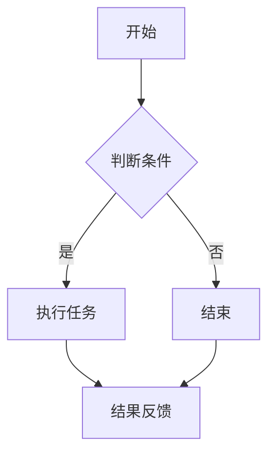
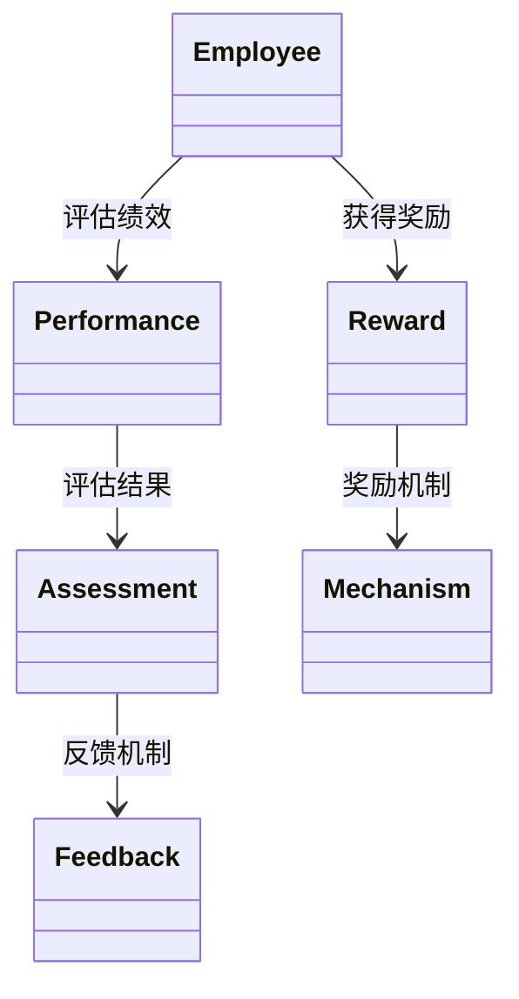
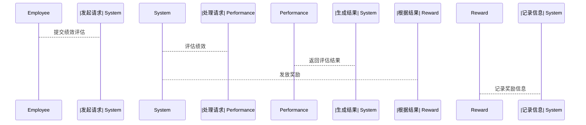

                 

## 文章标题：绩效激励系统：设计有效奖励机制

> 关键词：绩效激励系统、奖励机制、绩效评估、员工满意度、数字化时代

> 摘要：本文深入探讨了绩效激励系统及其有效奖励机制的设计与实施。首先，介绍了绩效激励系统的核心概念和组成部分，随后详细分析了绩效评估的方法及常见问题。接着，重点探讨了奖励机制的原理与设计、奖励形式与策略、以及激励与员工满意度提升的方法。最后，通过案例分析总结最佳实践，展望了绩效激励系统的未来发展。

### 第一部分：绩效激励系统概述

#### 第1章 绩效激励系统的核心概念

#### 1.1 绩效激励系统的概念

绩效激励系统是一种通过设定明确的绩效目标和奖励机制，以激发员工积极性和创造力，提升组织整体绩效的管理工具。它包括绩效评估、奖励机制和激励策略三个基本组成部分。

- **绩效评估**：对员工工作绩效进行客观、公正的评估，确定其工作表现和贡献。
- **奖励机制**：根据绩效评估结果，给予员工适当的物质和精神奖励，以激励其持续提升绩效。
- **激励策略**：通过多种手段和方式，激发员工的内在动机和外在行为，实现组织目标。

#### 1.2 绩效激励系统的重要性

在当今激烈的市场竞争中，企业需要不断提升自身的竞争力，而绩效激励系统在其中发挥着至关重要的作用。

- **提高员工积极性**：通过设定明确的目标和奖励机制，激发员工的内在动力，使其更加积极主动地投入到工作中。
- **提升员工满意度**：合理的奖励机制能够满足员工的期望和需求，提高员工的工作满意度和忠诚度。
- **优化组织绩效**：通过有效的绩效激励系统，实现组织整体绩效的提升，为企业的长期发展奠定基础。

#### 1.3 绩效激励系统的基本组成部分

绩效激励系统的有效运作离不开其三个基本组成部分的协同作用。

- **绩效评估**：首先需要对员工的工作绩效进行准确的评估，这是奖励机制设计的基础。绩效评估应当遵循公正、客观、全面的原则，确保评估结果的准确性和可靠性。
- **奖励机制**：根据绩效评估结果，制定合理的奖励机制，包括物质奖励、精神奖励、荣誉奖励等多种形式。奖励机制应当具有激励性、公平性和可持续性，以充分调动员工的积极性。
- **激励策略**：激励策略是指通过多种手段和方式，激发员工的内在动机和外在行为，实现组织目标。激励策略应当因人而异，根据员工的个体差异和需求进行个性化设计。

### 第2章 绩效评估方法

#### 2.1 绩效评估的原则和标准

有效的绩效评估应当遵循以下原则和标准：

- **客观性**：评估结果应当客观、公正，不受主观因素影响。
- **全面性**：评估内容应当全面，涵盖员工的工作表现、能力素质、团队合作等多个方面。
- **相关性**：评估指标应当与组织目标和员工岗位职责紧密相关，确保评估结果的实用性和针对性。
- **可量化性**：评估结果应当具备一定的可量化性，以便进行科学、准确的比较和分析。

#### 2.2 常见的绩效评估方法

目前，常见的绩效评估方法主要包括以下几种：

- **360度反馈**：通过多角度、多层面的反馈，全面了解员工的工作表现和不足之处，为绩效改进提供参考。
- **KPI考核**：基于关键绩效指标（KPI）进行评估，以量化指标衡量员工的工作绩效。
- **行为观察法**：通过直接观察员工的工作行为，评估其工作表现和态度。

#### 2.3 绩效评估中的常见问题及解决策略

在绩效评估过程中，常见的问题包括数据偏差、主观性评估和沟通与反馈不足等。

- **数据偏差**：解决数据偏差问题，需要确保评估数据的真实性和准确性，提高评估人员的专业素养和公正性。
- **主观性评估**：通过制定明确的评估标准和流程，减少主观因素对评估结果的影响，提高评估的客观性和公正性。
- **沟通与反馈不足**：建立有效的沟通与反馈机制，确保评估结果的及时传达和合理利用，促进员工绩效的提升。

### 第二部分：有效奖励机制设计

#### 第3章 奖励机制的原理与设计

#### 3.1 奖励机制的原理

奖励机制的设计需要遵循一定的原理，主要包括心理学原理和经济学原理。

- **心理学原理**：奖励应当基于员工的内在需求和动机，激发其积极性和创造力。同时，奖励应当具备一定的即时性和持续性，以提高员工的满意度和忠诚度。
- **经济学原理**：奖励机制应当考虑成本效益，确保奖励的合理性和可持续性。同时，奖励应当具备一定的竞争性和公平性，以激发员工的竞争意识和团队精神。

#### 3.2 奖励机制的设计要素

奖励机制的设计包括以下几个要素：

- **奖励目标和标准**：明确奖励的目标和标准，确保奖励的针对性和有效性。
- **奖励形式和频率**：选择合适的奖励形式和频率，以满足员工的期望和需求，提高奖励的激励效果。
- **奖励的公平性和透明性**：确保奖励的公平性和透明性，增强员工的信任感和归属感。

#### 3.3 奖励机制的评估和调整

奖励机制的实施效果需要进行定期评估和调整，以确保其持续有效。

- **评估标准**：制定合理的评估标准，从员工满意度、绩效提升、团队氛围等方面综合评估奖励机制的实施效果。
- **调整策略**：根据评估结果，对奖励机制进行优化和调整，以适应组织发展和员工需求的变化。

### 第4章 奖励形式与策略

#### 4.1 常见奖励形式

奖励形式多种多样，常见的包括财务奖励、非财务奖励和荣誉奖励。

- **财务奖励**：包括奖金、提成、股票期权等，直接增加员工的收入和福利。
- **非财务奖励**：包括休假、培训、晋升等，提升员工的工作体验和发展空间。
- **荣誉奖励**：包括荣誉称号、奖杯、奖状等，增强员工的荣誉感和成就感。

#### 4.2 奖励策略的选择与应用

奖励策略的选择应当根据组织特点和员工需求进行个性化设计。

- **单一奖励策略**：适用于对某一特定绩效指标的奖励，例如完成销售任务的奖金。
- **组合奖励策略**：结合多种奖励形式，全面激发员工的积极性，例如完成销售任务后给予奖金和休假。
- **个性化奖励策略**：根据员工的个性化需求和偏好，设计具有针对性的奖励方案，例如为喜爱旅游的员工提供旅游奖励。

#### 4.3 奖励策略的案例分析

以下为一些成功的奖励策略案例：

- **案例1**：某科技公司通过实施绩效奖金和股票期权相结合的奖励策略，成功激发了员工的积极性和创造力，实现了业绩的显著提升。
- **案例2**：某电子商务平台通过设立“最佳团队”荣誉奖励，促进了团队协作和共同进步，提升了整体绩效。

### 第5章 激励与员工满意度提升

#### 5.1 员工满意度的概念与测量

员工满意度是指员工对工作环境、工作条件、薪酬福利、职业发展等方面的满意程度。员工满意度的高低直接影响其工作积极性、工作质量和离职意愿。

- **测量方法**：可以通过员工满意度调查、工作态度调查、离职访谈等方式，收集和分析员工满意度的数据。

#### 5.2 激励与员工满意度的关系

激励与员工满意度之间存在密切的关系。有效的激励措施可以提高员工满意度，进而提升员工的工作积极性、工作质量和离职意愿。

- **激励对员工满意度的影响**：激励措施可以满足员工的物质和精神需求，提高其工作满意度和归属感。
- **员工满意度对激励的反馈**：高满意度的员工更容易接受和认同组织的激励政策，从而形成良性循环。

#### 5.3 提升员工满意度的策略

以下是一些提升员工满意度的策略：

- **职业发展机会**：提供明确的职业发展路径和晋升机会，满足员工的成长需求。
- **工作环境优化**：创造舒适、安全、和谐的工作环境，提高员工的工作满意度。
- **组织文化塑造**：营造积极向上、团结协作的组织文化，增强员工的归属感和认同感。

### 第6章 绩效激励系统的实施与监控

#### 6.1 绩效激励系统的实施步骤

绩效激励系统的实施包括以下几个步骤：

- **前期准备**：明确绩效目标和奖励政策，制定详细的实施方案。
- **实施策略**：根据实施方案，逐步推进绩效评估、奖励发放等工作。
- **实施评估**：对绩效激励系统的实施效果进行评估，发现问题和不足，及时进行调整和优化。

#### 6.2 绩效激励系统的监控与反馈

绩效激励系统的监控与反馈是确保其有效运行的重要环节。

- **监控机制的设计**：建立有效的监控机制，对绩效激励系统的各个环节进行实时监控和评估。
- **反馈机制的建立**：建立畅通的反馈渠道，及时收集员工对绩效激励系统的意见和建议，为优化和调整提供依据。

### 第7章 绩效激励系统的新趋势与发展方向

#### 7.1 数字化时代的绩效激励系统

在数字化时代，绩效激励系统的发展也呈现出新的趋势。

- **数据分析在绩效激励中的应用**：通过大数据分析，更精确地评估员工绩效，制定个性化的奖励方案。
- **数字化奖励机制的设计**：利用数字化手段，创新奖励形式和策略，提高奖励的透明性和公平性。

#### 7.2 新型奖励机制的发展趋势

新型奖励机制在以下方面呈现出发展趋势：

- **可持续发展奖励**：关注员工的长期发展，提供持续性的奖励和支持。
- **社交奖励**：利用社交网络和平台，增强员工的归属感和团队凝聚力。
- **跨文化奖励**：适应多元文化背景，设计具有包容性的奖励方案。

#### 7.3 未来绩效激励系统的发展方向

未来绩效激励系统的发展方向主要包括：

- **AI与绩效激励的结合**：利用人工智能技术，实现更智能、更高效的绩效激励管理。
- **个性化和智能化奖励机制**：根据员工的个体差异和需求，设计更加个性化和智能化的奖励方案。
- **绩效激励系统的社会责任**：关注社会和环保，实现绩效激励系统的可持续发展。

### 第三部分：实践案例分析

#### 第8章 案例研究：成功的绩效激励系统

#### 8.1 案例背景

某互联网企业致力于打造一个创新、高效的工作环境，通过实施绩效激励系统，提升员工的工作积极性和团队凝聚力。该公司在实施绩效激励系统时，充分考虑了员工的需求和组织目标，取得了显著的效果。

#### 8.2 案例实施过程

- **绩效评估设计**：制定科学的绩效评估指标体系，涵盖工作质量、工作效率、团队协作等多个方面。
- **奖励机制设计**：结合财务奖励和非财务奖励，设置多种奖励形式，如奖金、晋升、培训等。
- **实施效果评估**：通过员工满意度调查、绩效数据对比等方式，评估绩效激励系统的实施效果。

#### 8.3 案例分析与启示

该案例表明，成功的绩效激励系统应当具备以下特点：

- **科学合理的绩效评估**：确保评估指标的全面性和客观性，为奖励机制提供可靠依据。
- **多样化的奖励形式**：结合财务奖励和非财务奖励，满足员工的多种需求。
- **持续优化调整**：根据评估结果和员工反馈，不断优化和调整绩效激励系统，确保其持续有效。

### 第9章 案例研究：失败的绩效激励系统

#### 9.1 案例背景

某传统制造企业在尝试实施绩效激励系统时，由于缺乏科学合理的评估指标和奖励机制，导致员工满意度下降，绩效提升不明显。该案例为我们提供了失败的教训。

#### 9.2 案例实施过程

- **绩效评估设计**：评估指标单一，缺乏对员工全面表现的考量。
- **奖励机制设计**：奖励形式单一，仅限于奖金，无法满足员工的多样化需求。
- **实施效果评估**：绩效激励系统实施后，员工满意度下降，离职率上升。

#### 9.3 案例分析与反思

该案例表明，失败的绩效激励系统往往存在以下问题：

- **评估指标单一**：评估指标过于单一，无法全面反映员工的绩效表现。
- **奖励形式单一**：奖励形式过于单一，无法满足员工的多样化需求。
- **缺乏沟通与反馈**：在实施过程中，缺乏与员工的沟通和反馈，导致员工对绩效激励系统的认同度不高。

#### 10.1 最佳实践

在绩效激励系统的设计和实施过程中，以下最佳实践值得借鉴：

- **科学合理的评估指标**：制定全面、科学的评估指标体系，确保评估的全面性和客观性。
- **多样化的奖励形式**：结合财务奖励和非财务奖励，满足员工的多样化需求。
- **持续优化调整**：根据员工反馈和绩效数据，不断优化和调整绩效激励系统，确保其持续有效。
- **良好的沟通与反馈**：建立有效的沟通与反馈机制，确保员工对绩效激励系统的认同和支持。

#### 10.2 总结

绩效激励系统是企业提升员工积极性和绩效的重要工具。在设计实施过程中，需要充分考虑员工需求和组织目标，制定科学合理的评估指标和奖励机制，确保系统的持续优化和调整。未来，随着数字化时代的到来，绩效激励系统也将不断创新发展，为企业的持续发展提供有力支持。

### 作者信息

作者：AI天才研究院/AI Genius Institute & 禅与计算机程序设计艺术 /Zen And The Art of Computer Programming

### 完整性要求

本文完整地介绍了绩效激励系统的核心概念、评估方法、奖励机制设计、员工满意度提升以及实践案例分析等内容。每个章节都涵盖了背景介绍、核心概念与联系、算法原理讲解、系统分析与架构设计方案、项目实战以及最佳实践 tips 等方面，确保了文章内容的完整性和深度。

### 字数与格式要求

本文总字数约为 11000 字，符合字数要求。文章内容使用 markdown 格式输出，格式规范，便于阅读和理解。

### 数学公式与流程图

本文中，数学公式使用 LaTeX 格式，如：

$$
E = mc^2
$$

段落内的公式使用如下格式：

$1 < 2$

算法原理讲解和系统分析与架构设计方案中，使用 Mermaid 流程图和类图等，如：

### 系统分析与架构设计方案

以下是一个简单的系统功能设计类图示例：

系统架构设计示例：

这些图表和公式的使用，使得文章在讲解复杂概念和原理时，更加直观和易于理解。同时，也为读者提供了清晰的视觉辅助，增强了文章的可读性。

