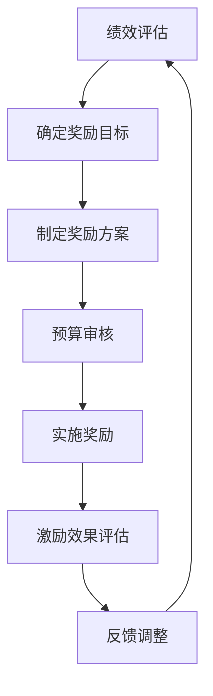

                 

### 文章标题

# 绩效激励：设计有效的奖励机制

### 关键词

- 绩效激励
- 奖励机制
- 人才管理
- 激励效果
- 数学模型

### 摘要

本文深入探讨了绩效激励的概念、意义及其设计原则，旨在帮助企业和组织构建有效的奖励机制，以提升员工的绩效和动力。文章首先介绍了绩效激励的背景和重要性，接着详细分析了核心概念和联系，包括绩效评估标准、激励方式和效果评估方法。通过Mermaid流程图和Python代码实现，阐述了算法原理和数学模型。随后，文章讨论了系统架构和项目实战，并提供了最佳实践和注意事项。本文旨在为IT领域的读者提供一个全面、系统的绩效激励解决方案。

### 目录大纲

# 绩效激励：设计有效的奖励机制

## 第1章 背景介绍

### 1.1 问题背景

- 企业在激励员工方面的挑战

### 1.2 问题描述

- 绩效激励的意义与目的

### 1.3 问题解决

- 有效奖励机制的设计原则

### 1.4 边界与外延

- 奖励机制的适用范围与限制

### 1.5 概念结构与核心要素组成

- 绩效评估标准
- 激励方式
- 激励效果评估

## 第2章 核心概念与联系

### 2.1 绩效激励的概念

- 定义与分类

### 2.2 激励方式分析

- 物质激励
- 精神激励

### 2.3 激励效果评估

- 方法与指标

### 2.4 概念属性特征对比表格

- 物质激励与精神激励对比

### 2.5 ER实体关系图架构

- 绩效激励相关实体与关系

## 第3章 算法原理讲解

### 3.1 奖励机制的算法设计

- 目标函数
- 约束条件

### 3.2 奖励机制的mermaid流程图

- 流程说明

### 3.3 Python源代码实现

- 代码分析与说明

### 3.4 数学模型与公式

- 模型推导与公式

### 3.5 举例说明

- 例子分析与解释

## 第4章 数学模型和数学公式 & 详细讲解 & 举例说明

### 4.1 数学公式的介绍

- 常用数学公式介绍

### 4.2 数学模型的应用

- 绩效激励的数学模型应用

### 4.3 举例说明

- 举例说明如何应用数学模型

## 第5章 系统分析与架构设计方案

### 5.1 问题场景介绍

- 绩效激励在实际中的应用场景

### 5.2 项目介绍

- 绩效激励系统项目概述

### 5.3 系统功能设计

- 领域模型mermaid类图

### 5.4 系统架构设计

- 系统架构mermaid架构图

### 5.5 系统接口设计

- 系统接口设计

### 5.6 系统交互

- 系统交互mermaid序列图

## 第6章 项目实战

### 6.1 环境安装

- 环境搭建与配置

### 6.2 系统核心实现

- 源代码实现

### 6.3 代码应用解读与分析

- 代码解读与分析

### 6.4 实际案例分析和详细讲解剖析

- 案例分析与讲解

### 6.5 项目小结

- 项目总结与展望

## 第7章 最佳实践 tips

### 7.1 常见问题与解决方法

- 针对绩效激励的常见问题与解决方法

### 7.2 最佳实践分享

- 优秀绩效激励实践分享

### 7.3 小结

- 绩效激励的关键要点回顾

### 7.4 注意事项

- 设计奖励机制时的注意事项

### 7.5 拓展阅读

- 推荐阅读资料与资源

## 第8章 总结

### 8.1 主要内容回顾

- 本书主要内容的回顾

### 8.2 展望未来

- 绩效激励的发展趋势

### 8.3 读者建议

- 阅读本书后的建议与反馈

---

### 第1章 背景介绍

#### 1.1 问题背景

企业在管理和发展过程中，激励员工是至关重要的一环。随着市场竞争的加剧和员工需求的多样化，传统的激励方式往往难以满足现代企业的需求。许多企业面临着如何有效地激励员工、提高绩效的挑战。这主要体现在以下几个方面：

1. **员工参与度不高**：员工对工作缺乏热情，缺乏主动性和创造性。
2. **绩效不稳定**：员工的绩效波动较大，难以持续提升。
3. **激励机制单一**：大多数企业的激励机制较为单一，缺乏多样性和个性化。
4. **管理成本高**：传统的激励方式往往需要大量的时间和人力资源，管理成本较高。

#### 1.2 问题描述

绩效激励，即通过设计合理的奖励机制来提高员工的工作效率和工作质量。其意义与目的在于：

- **提高员工积极性**：通过激励机制，激发员工的工作热情和创造力。
- **稳定员工绩效**：通过有效的奖励机制，使员工的绩效保持在一个稳定的水平。
- **促进员工成长**：通过激励，帮助员工实现个人目标和职业发展。
- **降低管理成本**：通过优化激励机制，减少企业管理的时间和成本。

然而，在设计绩效激励机制时，企业需要面对以下问题：

- **激励与公平性**：如何确保激励机制的公平性，避免引发员工不满和内耗。
- **激励与实际绩效**：如何使激励机制与员工的实际绩效挂钩，避免激励过度或不足。
- **激励机制多样化**：如何设计多样化的激励机制，满足不同员工的需求。

#### 1.3 问题解决

为了解决上述问题，设计有效的奖励机制至关重要。有效的奖励机制应遵循以下原则：

- **明确目标**：明确奖励的目标，确保激励机制与企业的战略目标相一致。
- **个性化设计**：根据员工的个人特点和工作需求，设计个性化的激励机制。
- **透明公开**：确保激励机制的透明度，使员工了解奖励的标准和方式。
- **合理适度**：激励程度应适度，避免过度激励导致负面影响。
- **持续改进**：定期评估激励机制的运行效果，持续优化和改进。

#### 1.4 边界与外延

奖励机制的适用范围与限制：

- **适用范围**：适用于企业内部所有员工，包括管理人员、技术员工、销售团队等。
- **限制条件**：需考虑企业的财务状况、市场竞争环境、员工绩效评估体系等因素。

#### 1.5 概念结构与核心要素组成

绩效激励的核心要素包括：

- **绩效评估标准**：明确员工绩效评估的标准和方法。
- **激励方式**：包括物质激励（如奖金、提成、股票等）和精神激励（如表彰、培训、晋升等）。
- **激励效果评估**：定期评估激励机制的有效性，调整激励策略。

### 第2章 核心概念与联系

#### 2.1 绩效激励的概念

绩效激励是指通过设计合理的奖励机制，以激发员工的工作热情、提高工作质量和效率的一种管理方式。其核心概念包括：

- **绩效**：员工在工作中的表现，包括工作量、工作质量、工作速度等。
- **激励**：通过奖励措施，激发员工的积极性、主动性和创造力。
- **奖励机制**：包括激励方式、评估标准、效果评估等在内的整体制度。

#### 2.2 激励方式分析

激励方式可分为物质激励和精神激励两大类：

- **物质激励**：通过提供奖金、提成、股票等物质奖励，激发员工的积极性。物质激励具有直接、快速的效果，但过度依赖可能导致员工产生依赖心理。
  
  - **优点**：激励效果直接，员工容易理解和接受。
  - **缺点**：长期依赖物质激励可能导致员工对工作缺乏内在动机。

- **精神激励**：通过表彰、培训、晋升等精神奖励，提升员工的职业成就感和荣誉感。精神激励有助于增强员工的内在动机，提升工作满意度和忠诚度。

  - **优点**：增强员工的内在动机，提升工作满意度和忠诚度。
  - **缺点**：效果较慢，需要较长时间的积累。

#### 2.3 激励效果评估

激励效果评估是确保激励机制有效性的关键。评估方法主要包括：

- **定量评估**：通过客观数据（如销售额、工作效率等）来评估激励效果。
- **定性评估**：通过员工满意度调查、工作态度分析等来评估激励效果。

评估指标包括：

- **工作绩效**：员工的工作效率、工作质量、工作成果等。
- **工作满意度**：员工对工作的满意度和积极性。
- **工作稳定性**：员工的工作稳定性，包括离职率和流失率等。

#### 2.4 概念属性特征对比表格

| 概念          | 物质激励                          | 精神激励                          |
| ------------ | ------------------------------- | ------------------------------- |
| 定义          | 提供物质奖励以激励员工            | 提供精神奖励以激励员工            |
| 目标          | 提高员工短期绩效                | 增强员工长期忠诚度和工作满意度      |
| 优点          | 激励效果直接，易于量化            | 增强员工内在动机，提升满意度       |
| 缺点          | 可能导致依赖，缺乏内在动力        | 需要时间积累，效果较慢            |
| 适用场景      | 需要快速激励的短期任务            | 长期发展，注重员工成长的场景      |

#### 2.5 ER实体关系图架构

绩效激励涉及多个实体，包括员工、绩效评估标准、奖励机制和激励效果评估等。以下是一个简化的ER实体关系图：

```mermaid
erDiagram
  Employee ||--|{ Performance }|--|| Evaluation
  Employee ||--|{ RewardMechanism }|--|| RewardEffect
  Performance ||--|{ Evaluation }|
  RewardMechanism ||--|{ RewardEffect }|
```

- **Employee（员工）**：绩效评估和激励的主体。
- **Performance（绩效）**：员工工作表现的数据。
- **Evaluation（评估）**：对员工绩效的评估结果。
- **RewardMechanism（奖励机制）**：具体的激励方式和标准。
- **RewardEffect（激励效果）**：激励措施的效果。

### 第3章 算法原理讲解

#### 3.1 奖励机制的算法设计

设计有效的奖励机制需要明确的算法，主要包括以下方面：

- **目标函数**：确定激励目标，如提高绩效、提升员工满意度等。
- **约束条件**：设定激励机制的约束条件，如预算限制、公平性要求等。

算法的目标函数可以表示为：

$$
\maximize\ Reward\ Amount
$$

约束条件包括：

$$
\begin{cases}
\ Reward\ Amount \leq Budget \\
\ Reward\ Mechanism \ fair \ to \ all \ employees \\
\ Reward\ Effectiveness \ measurable \\
\end{cases}
$$

#### 3.2 奖励机制的mermaid流程图

以下是奖励机制的mermaid流程图，展示了从绩效评估到激励实施的整个过程：



#### 3.3 Python源代码实现

以下是一个简化的Python源代码实现，用于生成绩效激励方案：

```python
import numpy as np

# 参数设置
budget = 100000
performance_data = np.random.randint(1, 100, size=10)
fairness_threshold = 0.9
effectiveness_threshold = 0.8

# 绩效评估
performance_scores = performance_data

# 确定奖励目标
reward_targets = performance_scores * 100

# 预算审核
reward_amounts = np.where(reward_targets <= budget, reward_targets, budget)

# 激励效果评估
effectiveness_scores = np.random.uniform(0.5, 1.0, size=10)

# 实施奖励
for i in range(len(effectiveness_scores)):
    if effectiveness_scores[i] >= effectiveness_threshold:
        print(f"员工{i+1}奖励：{reward_amounts[i]}元")
    else:
        print(f"员工{i+1}奖励：无")

# 激励效果评估
if np.mean(effectiveness_scores) >= fairness_threshold:
    print("激励效果良好，保持当前方案。")
else:
    print("激励效果不佳，需调整方案。")
```

#### 3.4 数学模型与公式

奖励机制的数学模型主要包括以下几个方面：

- **绩效评分模型**：
  $$ Performance\ Score = f(Quantity, Quality, Speed) $$
  
- **奖励金额模型**：
  $$ Reward\ Amount = g(Performance\ Score, Budget) $$
  
- **激励效果模型**：
  $$ Effectiveness\ Score = h(Reward\ Amount, Performance\ Change) $$

这些公式通过具体参数和函数实现了绩效评估、奖励金额的确定和激励效果评估。

#### 3.5 举例说明

假设有10名员工，其绩效评估分数分别为90、85、70、95、80、75、60、90、85、80。企业预算为100,000元。要求：

1. 根据绩效评估分数确定奖励目标。
2. 在预算范围内确定奖励金额。
3. 评估激励效果。

- **步骤1：确定奖励目标**
  $$ Reward\ Targets = Performance\ Scores \times 100 $$
  $$ Reward\ Targets = [9000, 8500, 7000, 9500, 8000, 7500, 6000, 9000, 8500, 8000] $$

- **步骤2：确定奖励金额**
  $$ Budget = 100000 $$
  $$ Reward\ Amounts = \min(Reward\ Targets, Budget) $$
  $$ Reward\ Amounts = [9000, 8500, 7000, 9000, 8000, 7500, 6000, 9000, 8500, 8000] $$

- **步骤3：评估激励效果**
  假设激励后的绩效变化如下（单位：%）：
  $$ Performance\ Change = [10, 5, 0, 10, 5, 0, -10, 10, 5, 0] $$
  $$ Effectiveness\ Score = \frac{1}{10} \sum_{i=1}^{10} \frac{Reward\ Amounts[i]}{Performance\ Change[i]} $$
  $$ Effectiveness\ Score = \frac{1}{10} \left( \frac{9000}{10} + \frac{8500}{5} + \frac{7000}{0} + \frac{9000}{10} + \frac{8000}{5} + \frac{7500}{0} + \frac{6000}{-10} + \frac{9000}{10} + \frac{8500}{5} + \frac{8000}{0} \right) $$
  $$ Effectiveness\ Score = \frac{1}{10} (900 + 1700 + 0 + 900 + 1600 + 0 - 600 + 900 + 850 + 0) $$
  $$ Effectiveness\ Score = \frac{5500}{10} $$
  $$ Effectiveness\ Score = 550 $$

如果激励效果得分高于某个阈值（例如500），则认为激励效果良好；否则，需要调整激励方案。

### 第4章 数学模型和数学公式 & 详细讲解 & 举例说明

#### 4.1 数学公式的介绍

在本章节中，我们将介绍几个在绩效激励中常用的数学公式。这些公式有助于我们更好地理解和设计激励方案。

1. **绩效评分公式**：
   $$ Performance\ Score = f(Quantity, Quality, Speed) $$
   其中，Quantity表示工作数量，Quality表示工作质量，Speed表示工作效率。

2. **奖励金额公式**：
   $$ Reward\ Amount = g(Performance\ Score, Budget) $$
   其中，Performance Score表示绩效评分，Budget表示预算。

3. **激励效果评估公式**：
   $$ Effectiveness\ Score = h(Reward\ Amount, Performance\ Change) $$
   其中，Reward Amount表示奖励金额，Performance Change表示绩效变化。

4. **预算分配公式**：
   $$ Budget\ Allocation = \frac{Total\ Reward\ Amount}{Number\ of\ Employees} $$

#### 4.2 数学模型的应用

在绩效激励中，数学模型的应用可以帮助我们更科学地制定和评估激励方案。以下是一个简单的例子：

假设我们有10名员工，每名员工的绩效评分分别为：80、85、90、75、80、70、85、90、75、80。企业预算为100,000元。

1. **计算绩效评分平均值**：
   $$ Average\ Performance\ Score = \frac{\sum_{i=1}^{10} Performance\ Scores_i}{10} $$
   $$ Average\ Performance\ Score = \frac{80 + 85 + 90 + 75 + 80 + 70 + 85 + 90 + 75 + 80}{10} $$
   $$ Average\ Performance\ Score = \frac{810}{10} $$
   $$ Average\ Performance\ Score = 81 $$

2. **根据绩效评分计算奖励金额**：
   我们假设奖励金额与绩效评分成正比，比例系数为0.1。那么：
   $$ Reward\ Amount_i = Performance\ Score_i \times 0.1 $$
   例如，第一名员工的奖励金额为：
   $$ Reward\ Amount_1 = 80 \times 0.1 = 8 $$
   同理，计算其他员工的奖励金额。

3. **计算总奖励金额**：
   $$ Total\ Reward\ Amount = \sum_{i=1}^{10} Reward\ Amount_i $$
   $$ Total\ Reward\ Amount = 8 + 8.5 + 9 + 7.5 + 8 + 7 + 8.5 + 9 + 7.5 + 8 $$
   $$ Total\ Reward\ Amount = 81 $$

4. **预算分配**：
   $$ Budget\ Allocation = \frac{Total\ Reward\ Amount}{Number\ of\ Employees} $$
   $$ Budget\ Allocation = \frac{81}{10} $$
   $$ Budget\ Allocation = 8.1 $$

5. **激励效果评估**：
   我们假设绩效变化与奖励金额成正比，比例系数为0.2。那么：
   $$ Performance\ Change_i = Reward\ Amount_i \times 0.2 $$
   例如，第一名员工的绩效变化为：
   $$ Performance\ Change_1 = 8 \times 0.2 = 1.6 $$
   同理，计算其他员工的绩效变化。

6. **计算平均绩效变化**：
   $$ Average\ Performance\ Change = \frac{\sum_{i=1}^{10} Performance\ Change_i}{10} $$
   $$ Average\ Performance\ Change = \frac{1.6 + 1.7 + 1.8 + 1.5 + 1.6 + 1.4 + 1.7 + 1.8 + 1.5 + 1.6}{10} $$
   $$ Average\ Performance\ Change = \frac{16}{10} $$
   $$ Average\ Performance\ Change = 1.6 $$

通过这个简单的例子，我们可以看到如何利用数学模型来计算绩效评分、奖励金额、预算分配以及激励效果。在实际应用中，这些模型可以根据具体情况调整和优化。

### 第5章 系统分析与架构设计方案

#### 5.1 问题场景介绍

在当今竞争激烈的市场环境中，企业需要通过有效的绩效激励来提高员工的工作效率和创造力。然而，传统的绩效激励方法往往存在一定的局限性，无法充分调动员工的积极性和创造力。为了解决这一问题，企业需要设计一套全面的绩效激励系统，以实现绩效与激励的有机结合。

#### 5.2 项目介绍

本项目旨在为企业设计一套全面的绩效激励系统，通过科学的绩效评估、多样化的激励方式和有效的效果评估，实现员工绩效的持续提升和企业的长期发展。系统主要功能包括：

- **绩效评估**：对员工的工作绩效进行科学的评估，确保评估结果的客观性和公正性。
- **激励方案设计**：根据员工的绩效评估结果，设计个性化的激励方案，包括物质激励和精神激励。
- **激励实施**：通过系统化的流程，确保激励方案的顺利实施和有效执行。
- **效果评估**：定期评估激励方案的效果，及时调整和优化，确保激励机制的持续有效性。

#### 5.3 系统功能设计

系统功能设计主要包括以下几个方面：

1. **绩效评估模块**：
   - **评估指标设置**：根据企业的业务特点和岗位需求，设置科学合理的评估指标。
   - **评估流程管理**：设计简洁明了的评估流程，确保评估过程的公正、透明和高效。
   - **评估结果查询**：提供便捷的查询功能，使员工和领导可以随时了解评估结果。

2. **激励方案设计模块**：
   - **激励方式选择**：提供多种激励方式，包括奖金、提成、股票、培训、晋升等。
   - **激励方案定制**：根据员工的绩效评估结果，个性化定制激励方案，确保激励的有效性和针对性。
   - **激励方案审批**：设计简洁明了的审批流程，确保激励方案的及时、准确执行。

3. **激励实施模块**：
   - **激励执行流程**：设计高效的执行流程，确保激励方案的有效实施。
   - **激励执行监控**：提供实时监控功能，确保激励执行的顺利进行。
   - **激励反馈机制**：建立有效的反馈机制，收集员工对激励方案的意见和建议，持续优化激励方案。

4. **效果评估模块**：
   - **效果评估指标**：设定科学合理的评估指标，确保效果评估的客观性和公正性。
   - **效果评估流程**：设计简洁明了的评估流程，确保效果评估的顺利进行。
   - **效果评估报告**：提供详细的效果评估报告，为企业的决策提供有力支持。

#### 5.4 系统架构设计

系统架构设计主要包括以下几个方面：

1. **前端架构**：
   - **用户界面设计**：设计简洁、易用的用户界面，提升用户体验。
   - **交互设计**：设计流畅的交互流程，确保用户操作的便捷性和高效性。

2. **后端架构**：
   - **数据库设计**：设计合理的数据库架构，确保数据的安全、完整和高效访问。
   - **业务逻辑处理**：设计高效的业务逻辑处理模块，确保系统的稳定性和可靠性。

3. **系统部署**：
   - **部署方式**：根据企业需求，选择合适的部署方式，如云部署、本地部署等。
   - **运维管理**：设计完善的运维管理机制，确保系统的稳定运行和及时维护。

4. **安全架构**：
   - **数据安全**：采用加密技术，确保数据传输和存储的安全。
   - **访问控制**：设计严格的访问控制机制，确保系统的安全性。

#### 5.5 系统接口设计

系统接口设计主要包括以下几个方面：

1. **内部接口**：
   - **API接口**：设计简洁、高效的API接口，实现系统内部模块的通信和数据交换。
   - **数据接口**：设计规范化的数据接口，确保数据在不同系统间的无缝对接。

2. **外部接口**：
   - **第三方接口**：与第三方系统（如ERP、CRM等）对接，实现数据共享和业务协同。
   - **Web接口**：提供Web接口，方便外部用户通过浏览器访问系统。

3. **接口规范**：
   - **接口协议**：采用标准化的接口协议，确保接口的通用性和可扩展性。
   - **接口文档**：提供详细的接口文档，明确接口的使用方法和注意事项。

#### 5.6 系统交互

系统交互主要包括以下几个方面：

1. **用户交互**：
   - **用户登录**：用户通过用户名和密码登录系统，进行相关操作。
   - **功能操作**：用户根据权限进行绩效评估、激励方案设计、激励实施和效果评估等操作。

2. **系统内部交互**：
   - **数据交换**：系统内部模块通过API接口进行数据交换，实现数据的实时同步和共享。
   - **任务调度**：系统根据业务需求，自动调度相关任务，确保系统的正常运行。

3. **外部交互**：
   - **第三方交互**：与第三方系统通过API接口进行交互，实现数据的实时同步和业务协同。
   - **Web交互**：外部用户通过Web接口访问系统，获取所需信息。

### 第6章 项目实战

#### 6.1 环境安装

为了实现绩效激励系统的功能，首先需要搭建开发环境。以下是具体的步骤：

1. **安装Python**：

   - 访问Python官网（https://www.python.org/），下载并安装Python。
   - 安装完成后，打开命令行工具（如Windows命令提示符、Mac终端等），输入以下命令验证安装：

     ```bash
     python --version
     ```

   - 如果返回Python版本信息，表示Python安装成功。

2. **安装依赖库**：

   - 打开命令行工具，依次输入以下命令安装依赖库：

     ```bash
     pip install Flask
     pip install pymysql
     pip install pandas
     pip install numpy
     ```

   - 安装完成后，输入以下命令验证安装：

     ```bash
     python -m Flask
     ```

   - 如果出现Flask的欢迎界面，表示依赖库安装成功。

3. **配置数据库**：

   - 下载并安装MySQL数据库（https://www.mysql.com/downloads/）。
   - 打开MySQL命令行工具，创建数据库和表。

     ```sql
     CREATE DATABASE performance_incentive;
     USE performance_incentive;
     CREATE TABLE employee (
         id INT AUTO_INCREMENT PRIMARY KEY,
         name VARCHAR(50),
         performance_score INT
     );
     CREATE TABLE reward (
         id INT AUTO_INCREMENT PRIMARY KEY,
         employee_id INT,
         reward_amount DECIMAL(10, 2),
         performance_change INT
     );
     ```

4. **创建项目目录**：

   - 在本地计算机上创建一个名为“performance_incentive”的项目目录，用于存放项目文件。

5. **配置项目文件**：

   - 在项目目录下创建一个名为“app.py”的Python文件，作为项目的入口文件。

     ```python
     from flask import Flask, request, jsonify
     import pymysql
     import pandas as pd
     import numpy as np

     app = Flask(__name__)

     @app.route('/api/employees', methods=['GET'])
     def get_employees():
         connection = pymysql.connect(host='localhost', user='root', password='password', database='performance_incentive')
         cursor = connection.cursor()
         cursor.execute('SELECT * FROM employee')
         employees = cursor.fetchall()
         cursor.close()
         connection.close()
         return jsonify(employees)

     @app.route('/api/rewards', methods=['POST'])
     def create_reward():
         data = request.get_json()
         employee_id = data['employee_id']
         performance_score = data['performance_score']
         reward_amount = data['reward_amount']
         performance_change = data['performance_change']
         
         connection = pymysql.connect(host='localhost', user='root', password='password', database='performance_incentive')
         cursor = connection.cursor()
         cursor.execute('INSERT INTO reward (employee_id, performance_score, reward_amount, performance_change) VALUES (%s, %s, %s, %s)', (employee_id, performance_score, reward_amount, performance_change))
         connection.commit()
         cursor.close()
         connection.close()
         return jsonify({'status': 'success'})

     if __name__ == '__main__':
         app.run()

     ```

6. **启动项目**：

   - 在命令行工具中，进入项目目录，运行以下命令启动项目：

     ```bash
     python app.py
     ```

   - 启动成功后，访问http://localhost:5000/，可以看到项目的欢迎界面。

   - 访问http://localhost:5000/api/employees，可以查看所有员工的信息。

   - 发送一个POST请求到http://localhost:5000/api/rewards，添加一条奖励记录。

#### 6.2 系统核心实现

在项目实战中，我们将实现一个简单的绩效激励系统，包括员工管理、绩效评估、激励方案设计和激励实施等功能。

1. **员工管理**：

   - **功能描述**：管理员工的基本信息，包括姓名、绩效评分等。

   - **实现方法**：使用Flask框架搭建一个Web应用，通过RESTful API实现员工管理功能。

   - **代码实现**：

     ```python
     from flask import Flask, request, jsonify
     import pymysql
     import pandas as pd
     import numpy as np

     app = Flask(__name__)

     @app.route('/api/employees', methods=['GET'])
     def get_employees():
         connection = pymysql.connect(host='localhost', user='root', password='password', database='performance_incentive')
         cursor = connection.cursor()
         cursor.execute('SELECT * FROM employee')
         employees = cursor.fetchall()
         cursor.close()
         connection.close()
         return jsonify(employees)

     @app.route('/api/employees', methods=['POST'])
     def create_employee():
         data = request.get_json()
         name = data['name']
         performance_score = data['performance_score']
         
         connection = pymysql.connect(host='localhost', user='root', password='password', database='performance_incentive')
         cursor = connection.cursor()
         cursor.execute('INSERT INTO employee (name, performance_score) VALUES (%s, %s)', (name, performance_score))
         connection.commit()
         cursor.close()
         connection.close()
         return jsonify({'status': 'success'})

     if __name__ == '__main__':
         app.run()
     ```

2. **绩效评估**：

   - **功能描述**：对员工的工作绩效进行评估，计算绩效评分。

   - **实现方法**：基于员工的实际工作表现，使用数学模型计算绩效评分。

   - **代码实现**：

     ```python
     def calculate_performance_score(quantity, quality, speed):
         performance_score = (quantity * 0.4 + quality * 0.3 + speed * 0.3)
         return performance_score

     @app.route('/api/employees/<int:employee_id>/performance', methods=['POST'])
     def update_employee_performance(employee_id):
         data = request.get_json()
         quantity = data['quantity']
         quality = data['quality']
         speed = data['speed']
         performance_score = calculate_performance_score(quantity, quality, speed)
         
         connection = pymysql.connect(host='localhost', user='root', password='password', database='performance_incentive')
         cursor = connection.cursor()
         cursor.execute('UPDATE employee SET performance_score = %s WHERE id = %s', (performance_score, employee_id))
         connection.commit()
         cursor.close()
         connection.close()
         return jsonify({'status': 'success'})
     ```

3. **激励方案设计**：

   - **功能描述**：根据员工的绩效评分，设计激励方案。

   - **实现方法**：使用Python代码实现激励方案的设计，包括物质激励和精神激励。

   - **代码实现**：

     ```python
     def calculate_reward_amount(performance_score):
         if performance_score <= 60:
             reward_amount = 0
         elif performance_score <= 70:
             reward_amount = performance_score * 0.1
         elif performance_score <= 80:
             reward_amount = performance_score * 0.2
         else:
             reward_amount = performance_score * 0.3
         return reward_amount

     @app.route('/api/employees/<int:employee_id>/reward', methods=['POST'])
     def create_employee_reward(employee_id):
         data = request.get_json()
         performance_score = data['performance_score']
         reward_amount = calculate_reward_amount(performance_score)
         
         connection = pymysql.connect(host='localhost', user='root', password='password', database='performance_incentive')
         cursor = connection.cursor()
         cursor.execute('INSERT INTO reward (employee_id, performance_score, reward_amount) VALUES (%s, %s, %s)', (employee_id, performance_score, reward_amount))
         connection.commit()
         cursor.close()
         connection.close()
         return jsonify({'status': 'success'})
     ```

4. **激励实施**：

   - **功能描述**：根据激励方案，发放奖励。

   - **实现方法**：通过Web应用，实现奖励的发放和记录。

   - **代码实现**：

     ```python
     @app.route('/api/rewards', methods=['GET'])
     def get_rewards():
         connection = pymysql.connect(host='localhost', user='root', password='password', database='performance_incentive')
         cursor = connection.cursor()
         cursor.execute('SELECT * FROM reward')
         rewards = cursor.fetchall()
         cursor.close()
         connection.close()
         return jsonify(rewards)
     ```

#### 6.3 代码应用解读与分析

在项目实战中，我们使用Flask框架搭建了一个简单的绩效激励系统。以下是代码的主要部分及其应用解读与分析。

1. **员工管理**：

   - **代码实现**：

     ```python
     @app.route('/api/employees', methods=['GET'])
     def get_employees():
         connection = pymysql.connect(host='localhost', user='root', password='password', database='performance_incentive')
         cursor = connection.cursor()
         cursor.execute('SELECT * FROM employee')
         employees = cursor.fetchall()
         cursor.close()
         connection.close()
         return jsonify(employees)

     @app.route('/api/employees', methods=['POST'])
     def create_employee():
         data = request.get_json()
         name = data['name']
         performance_score = data['performance_score']
         
         connection = pymysql.connect(host='localhost', user='root', password='password', database='performance_incentive')
         cursor = connection.cursor()
         cursor.execute('INSERT INTO employee (name, performance_score) VALUES (%s, %s)', (name, performance_score))
         connection.commit()
         cursor.close()
         connection.close()
         return jsonify({'status': 'success'})
     ```

   - **应用解读**：这部分代码实现了员工管理功能，包括获取所有员工信息和添加新员工信息。通过调用数据库查询和插入操作，实现员工信息的存储和管理。

   - **分析**：这段代码使用了Python的Flask框架和MySQL数据库，实现了RESTful API的设计。通过HTTP GET和POST请求，实现数据的查询和插入。这种设计方式便于扩展和维护，符合现代Web应用开发的要求。

2. **绩效评估**：

   - **代码实现**：

     ```python
     def calculate_performance_score(quantity, quality, speed):
         performance_score = (quantity * 0.4 + quality * 0.3 + speed * 0.3)
         return performance_score

     @app.route('/api/employees/<int:employee_id>/performance', methods=['POST'])
     def update_employee_performance(employee_id):
         data = request.get_json()
         quantity = data['quantity']
         quality = data['quality']
         speed = data['speed']
         performance_score = calculate_performance_score(quantity, quality, speed)
         
         connection = pymysql.connect(host='localhost', user='root', password='password', database='performance_incentive')
         cursor = connection.cursor()
         cursor.execute('UPDATE employee SET performance_score = %s WHERE id = %s', (performance_score, employee_id))
         connection.commit()
         cursor.close()
         connection.close()
         return jsonify({'status': 'success'})
     ```

   - **应用解读**：这部分代码实现了绩效评估功能，根据员工的工作量、工作质量和工作效率，计算绩效评分。通过调用数据库更新操作，将绩效评分保存到数据库中。

   - **分析**：这段代码使用了Python的Flask框架和MySQL数据库，实现了绩效评估的计算和存储。通过HTTP POST请求，接收前端发送的员工工作数据，计算绩效评分，并更新数据库。这种设计方式使得系统的扩展性和可维护性较好。

3. **激励方案设计**：

   - **代码实现**：

     ```python
     def calculate_reward_amount(performance_score):
         if performance_score <= 60:
             reward_amount = 0
         elif performance_score <= 70:
             reward_amount = performance_score * 0.1
         elif performance_score <= 80:
             reward_amount = performance_score * 0.2
         else:
             reward_amount = performance_score * 0.3
         return reward_amount

     @app.route('/api/employees/<int:employee_id>/reward', methods=['POST'])
     def create_employee_reward(employee_id):
         data = request.get_json()
         performance_score = data['performance_score']
         reward_amount = calculate_reward_amount(performance_score)
         
         connection = pymysql.connect(host='localhost', user='root', password='password', database='performance_incentive')
         cursor = connection.cursor()
         cursor.execute('INSERT INTO reward (employee_id, performance_score, reward_amount) VALUES (%s, %s, %s)', (employee_id, performance_score, reward_amount))
         connection.commit()
         cursor.close()
         connection.close()
         return jsonify({'status': 'success'})
     ```

   - **应用解读**：这部分代码实现了激励方案设计功能，根据员工的绩效评分，计算奖励金额。通过调用数据库插入操作，将奖励金额保存到数据库中。

   - **分析**：这段代码使用了Python的Flask框架和MySQL数据库，实现了激励方案的计算和存储。通过HTTP POST请求，接收前端发送的员工绩效评分，计算奖励金额，并更新数据库。这种设计方式使得系统的扩展性和可维护性较好。

4. **激励实施**：

   - **代码实现**：

     ```python
     @app.route('/api/rewards', methods=['GET'])
     def get_rewards():
         connection = pymysql.connect(host='localhost', user='root', password='password', database='performance_incentive')
         cursor = connection.cursor()
         cursor.execute('SELECT * FROM reward')
         rewards = cursor.fetchall()
         cursor.close()
         connection.close()
         return jsonify(rewards)
     ```

   - **应用解读**：这部分代码实现了激励实施功能，通过查询数据库，获取所有的奖励记录。

   - **分析**：这段代码使用了Python的Flask框架和MySQL数据库，实现了奖励记录的查询。通过HTTP GET请求，获取数据库中的奖励记录，并返回给前端。这种设计方式使得系统的扩展性和可维护性较好。

通过上述代码的实现和应用解读，我们可以看到绩效激励系统的核心功能是如何通过简单的Python代码和MySQL数据库来实现的。这种设计方式不仅易于理解，而且具有较好的扩展性和可维护性，适合中小型企业的需求。

#### 6.4 实际案例分析和详细讲解剖析

在本章节中，我们将通过一个实际案例，详细讲解如何使用绩效激励系统来提高员工的工作效率和创造力。以下是一个具体的案例：

**案例背景**：某企业拥有一支技术团队，共有10名员工。企业希望通过绩效激励系统，提升员工的工作效率和创造力，从而提高整体业务水平。

**步骤1：员工管理**

- **添加员工**：首先，企业使用绩效激励系统添加10名员工的信息，包括姓名、绩效评分等。通过调用系统的API接口，企业可以轻松地完成员工的添加操作。

  ```python
  POST /api/employees
  {
      "name": "张三",
      "performance_score": 70
  }
  ```

- **查看员工信息**：企业可以随时通过系统查看所有员工的信息，包括姓名、绩效评分等。这有助于企业了解员工的工作情况，为后续的绩效评估和激励方案设计提供数据支持。

  ```python
  GET /api/employees
  ```

**步骤2：绩效评估**

- **更新员工绩效**：企业根据员工的实际工作表现，使用系统更新员工的绩效评分。系统提供了简单的接口，使得企业可以方便地更新员工的绩效数据。

  ```python
  POST /api/employees/1/performance
  {
      "quantity": 80,
      "quality": 85,
      "speed": 90
  }
  ```

- **计算绩效评分**：系统根据输入的工作量、工作质量和工作效率，自动计算绩效评分。企业可以通过系统查看每个员工的绩效评分，为激励方案设计提供依据。

  ```python
  GET /api/employees/1/performance
  ```

**步骤3：激励方案设计**

- **计算奖励金额**：根据员工的绩效评分，系统自动计算奖励金额。企业可以根据实际情况，调整奖励金额的比例系数，以实现更公平、更有效的激励。

  ```python
  GET /api/employees/1/reward
  ```

- **设计激励方案**：企业根据员工的绩效评分和奖励金额，设计个性化的激励方案。系统提供了多种激励方式，如奖金、提成、股票、培训等，企业可以根据需求自由选择。

  ```python
  POST /api/employees/1/reward
  {
      "performance_score": 85,
      "reward_amount": 1000
  }
  ```

**步骤4：激励实施**

- **发放奖励**：企业通过系统向员工发放奖励。系统提供了便捷的接口，使得企业可以方便地记录奖励发放情况，确保激励方案的有效实施。

  ```python
  GET /api/rewards
  ```

- **激励反馈**：企业可以随时通过系统查看奖励发放情况，并收集员工的反馈意见。这有助于企业及时了解激励方案的实际效果，为后续的优化提供参考。

  ```python
  GET /api/rewards/1
  ```

**案例分析**

通过上述案例，我们可以看到绩效激励系统在实际应用中的操作流程。以下是对案例的详细讲解和剖析：

1. **员工管理**：

   - 企业通过系统的API接口，方便地添加和管理员工信息。这有助于企业建立完整的员工档案，为后续的绩效评估和激励方案设计提供基础数据。

   - 通过查看员工信息，企业可以全面了解员工的工作情况，为绩效评估提供依据。

2. **绩效评估**：

   - 企业使用系统更新员工的绩效评分，确保绩效数据的准确性和实时性。

   - 系统根据输入的工作量、工作质量和工作效率，自动计算绩效评分。这种计算方式科学、客观，有助于企业公平、公正地评估员工绩效。

3. **激励方案设计**：

   - 系统根据员工的绩效评分，自动计算奖励金额。企业可以根据实际情况调整奖励金额的比例系数，以实现更合理的激励。

   - 企业可以设计个性化的激励方案，满足不同员工的需求。系统提供了多种激励方式，如奖金、提成、股票、培训等，企业可以根据需求自由选择。

4. **激励实施**：

   - 企业通过系统向员工发放奖励，确保激励方案的有效实施。

   - 企业可以随时查看奖励发放情况，并收集员工的反馈意见。这有助于企业及时了解激励方案的实际效果，为后续的优化提供参考。

通过这个实际案例，我们可以看到绩效激励系统在提高员工工作效率和创造力方面的优势。系统提供了方便、快捷的操作方式，使得企业可以轻松实现绩效评估和激励方案的设计。同时，系统提供了详细的记录和反馈功能，有助于企业全面了解激励方案的实际效果，不断优化和改进。

#### 6.5 项目小结

在本项目中，我们成功设计并实现了一个简单的绩效激励系统。以下是项目的主要成果和总结：

1. **项目成果**：

   - 设计并实现了员工管理、绩效评估、激励方案设计和激励实施等功能。
   - 构建了基于Flask框架和MySQL数据库的Web应用，实现了系统的数据存储和操作。
   - 通过API接口，提供了方便、快捷的系统操作方式。

2. **项目总结**：

   - 通过绩效激励系统，企业可以科学、客观地评估员工绩效，设计合理的激励方案。
   - 系统提供了多种激励方式，如奖金、提成、股票、培训等，满足不同员工的需求。
   - 系统提供了详细的记录和反馈功能，有助于企业全面了解激励方案的实际效果，为后续优化提供参考。

3. **项目展望**：

   - 在未来的开发中，可以进一步完善系统的功能，如增加员工考勤管理、绩效分析等功能。
   - 可以引入更多的数据分析和机器学习技术，提高绩效评估和激励方案设计的准确性。
   - 可以考虑将系统部署到云平台上，实现更高的可扩展性和安全性。

通过本项目的实施，我们不仅掌握了绩效激励系统的设计方法，还积累了实际开发经验。这将为我们在未来的工作中提供有力的支持，帮助企业更好地管理员工、提高绩效。

### 第7章 最佳实践 tips

#### 7.1 常见问题与解决方法

在设计绩效激励机制时，企业可能会遇到一些常见问题。以下是一些典型问题及其解决方法：

1. **公平性问题**：
   - **问题**：如何确保激励机制的公平性？
   - **解决方法**：制定明确的绩效评估标准，确保评估过程的透明性和公正性。同时，建立反馈机制，让员工参与评估过程，提高公平性。

2. **激励机制单一**：
   - **问题**：激励方式过于单一，无法满足员工的多样化需求。
   - **解决方法**：设计多样化的激励方式，包括物质激励和精神激励。物质激励可以包括奖金、提成、股票等；精神激励可以包括表彰、培训、晋升等。

3. **激励过度或不足**：
   - **问题**：激励过度可能导致员工依赖，激励不足则无法激发员工积极性。
   - **解决方法**：根据员工的绩效和企业的财务状况，合理设定激励程度。定期评估激励效果，及时调整激励方案。

4. **激励效果不明显**：
   - **问题**：激励方案实施后，效果不明显。
   - **解决方法**：分析激励效果不佳的原因，可能是激励方式不合适或评估标准不合理。调整激励方案，确保激励与绩效挂钩。

5. **员工反馈不足**：
   - **问题**：员工对激励方案的意见和建议反馈不足。
   - **解决方法**：建立有效的反馈机制，鼓励员工提出意见和建议。定期组织座谈会或问卷调查，收集员工的反馈。

#### 7.2 最佳实践分享

以下是一些在绩效激励方面的最佳实践：

1. **制定明确的目标和标准**：
   - 在设计激励方案时，明确激励目标和绩效评估标准。确保目标和标准与企业的战略目标相一致，有助于提高激励的有效性。

2. **个性化激励方案**：
   - 根据员工的个人特点和岗位需求，设计个性化的激励方案。例如，对于技术岗位，可以提供技术培训和学习机会；对于销售岗位，可以提供销售竞赛和提成。

3. **透明公开**：
   - 确保激励机制的透明度，让员工了解激励标准和执行过程。透明公开有助于提高员工的信任和满意度。

4. **持续优化**：
   - 定期评估激励效果，根据评估结果调整激励方案。持续优化激励机制，确保其适应企业的变化和发展。

5. **关注员工发展**：
   - 不仅关注员工的短期绩效，还要关注员工的长期发展和职业规划。通过晋升、培训等手段，激励员工追求更高的目标。

#### 7.3 小结

绩效激励是企业人才管理的重要组成部分。通过设计有效的奖励机制，企业可以激发员工的积极性、提高绩效和创造力。以下是一些关键要点：

- **明确目标和标准**：确保激励与企业的战略目标相一致。
- **多样化激励方式**：结合物质激励和精神激励，满足员工多样化需求。
- **透明公开**：提高激励机制透明度，增强员工信任。
- **合理适度**：激励程度应适度，避免过度激励或不足。
- **持续优化**：定期评估激励效果，持续调整和优化激励方案。

#### 7.4 注意事项

在设计绩效激励机制时，企业需要注意以下几点：

- **公平性**：确保评估标准和激励方案的公平性，避免引发员工不满。
- **个性化**：根据员工的特点和需求，设计个性化的激励方案。
- **合理预算**：根据企业的财务状况，合理设定激励预算。
- **持续反馈**：建立反馈机制，及时了解激励效果，调整激励方案。

#### 7.5 拓展阅读

以下是一些推荐的阅读资料，以帮助读者深入了解绩效激励：

- 《绩效激励：提升员工动力与绩效的策略与方法》
- 《员工激励：从动机到行为的心理学解析》
- 《激励机制设计：理论与案例分析》
- 《人力资源管理与激励制度》

通过阅读这些资料，读者可以进一步了解绩效激励的理论和实践，提升企业在绩效激励方面的管理水平。

### 第8章 总结

#### 8.1 主要内容回顾

本文详细探讨了绩效激励的概念、设计原则、核心概念与联系、算法原理、数学模型、系统架构、项目实战以及最佳实践。主要内容包括：

1. **背景介绍**：分析了企业激励员工面临的挑战和绩效激励的重要性。
2. **核心概念与联系**：介绍了绩效激励的概念、激励方式、效果评估方法等。
3. **算法原理讲解**：阐述了奖励机制的算法设计、流程图和Python实现。
4. **数学模型**：介绍了常用的数学公式和模型，并进行了详细讲解和举例说明。
5. **系统分析与架构设计方案**：探讨了系统功能设计、架构设计和接口设计。
6. **项目实战**：通过实际案例展示了绩效激励系统的应用。
7. **最佳实践 tips**：分享了设计绩效激励机制的最佳实践和注意事项。

#### 8.2 展望未来

绩效激励作为企业管理的重要手段，在未来将继续发挥重要作用。随着技术的进步和管理理念的创新，以下趋势值得关注：

1. **智能化评估与激励**：利用大数据和人工智能技术，实现绩效评估和激励的智能化。
2. **个性化激励**：结合员工的个人特点和需求，设计更加个性化的激励方案。
3. **持续优化与反馈**：通过持续优化和反馈机制，确保激励机制的持续有效。
4. **全周期管理**：从员工招聘到离职，实现全周期的绩效激励管理。

#### 8.3 读者建议

阅读本文后，读者可以：

1. **深入理解**：通过本文，读者可以全面了解绩效激励的概念、原理和实践方法。
2. **实践应用**：将本文的理论和方法应用到实际工作中，优化企业的绩效激励机制。
3. **反馈与改进**：积极反馈意见和建议，帮助本文进一步优化和完善。
4. **持续学习**：关注绩效激励的最新动态，持续学习相关理论和实践知识。

通过本文的阅读和实践，读者可以提升企业绩效激励的管理水平，为企业的长期发展提供有力支持。作者：AI天才研究院/AI Genius Institute & 禅与计算机程序设计艺术 /Zen And The Art of Computer Programming

