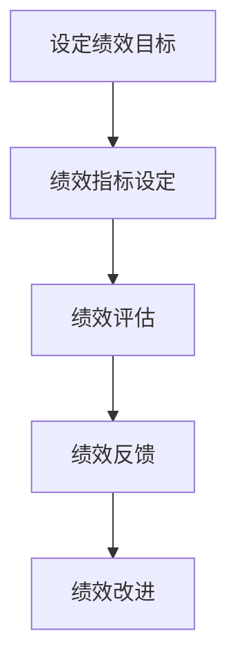
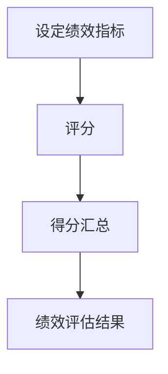
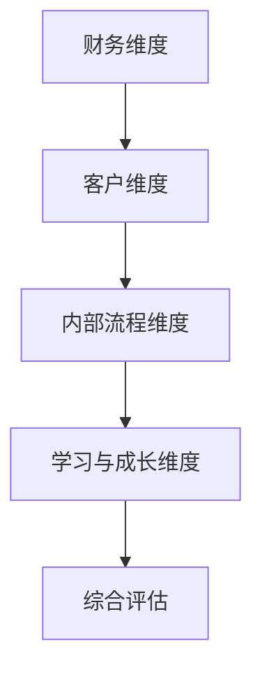
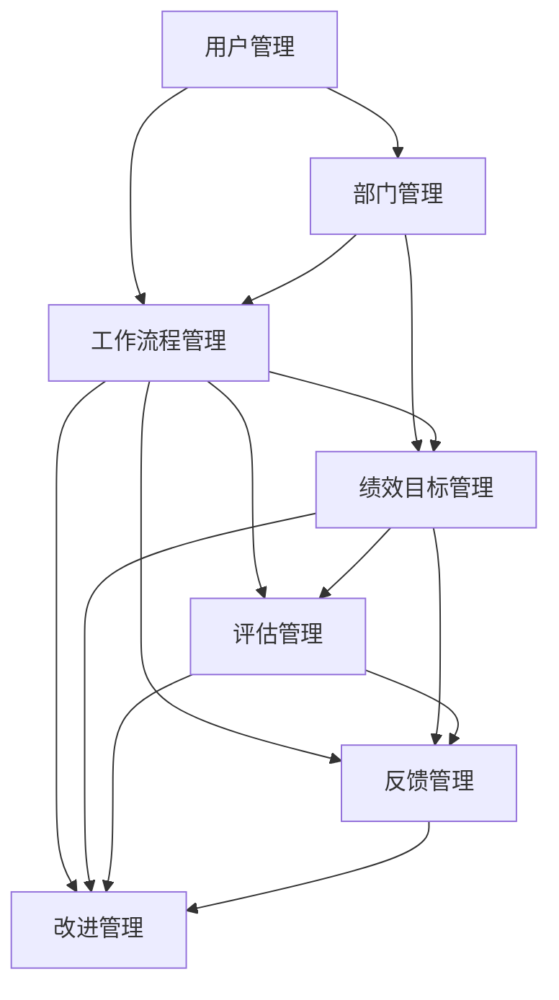
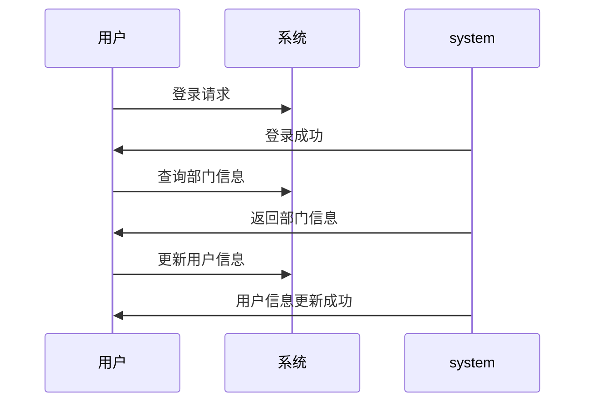

                 


----------------------------------------------------------------

## 绩效管理：公平有效的评估体系

> 关键词：绩效管理，公平，评估体系，员工绩效，绩效评估方法

绩效管理是一种系统化的管理过程，旨在通过规划和实施一系列的评估和反馈机制，确保组织目标与员工个人目标的协调一致。有效的绩效管理不仅能提高员工的工作满意度，还能促进组织的整体绩效提升。本文将围绕“绩效管理：公平有效的评估体系”这一主题，系统地探讨绩效管理的核心概念、评估方法、实践应用和案例分析，以帮助读者全面理解和掌握绩效管理的精髓。

### 摘要

本文从绩效管理的起源与发展入手，详细介绍了绩效管理的核心概念，包括绩效评估的指标、方法与流程。随后，本文将深入探讨各种绩效评估方法的原理与适用场景，并通过国内外企业的实际案例，分析绩效管理的最佳实践。最后，本文还将讨论如何通过文化塑造和持续改进，提升绩效管理的有效性。

### 目录大纲设计思路

为了确保读者能够系统地理解和掌握绩效管理的相关知识，本文采用了以下目录大纲设计思路：

1. **总体结构设计**：文章分为五个主要部分，分别是背景介绍、核心概念、实践应用、案例分析和管理提升。
2. **细化章节内容**：每个主要部分下包含具体章节，确保内容覆盖全面。
3. **设计章节层次**：使用Markdown格式，按照1级、2级、3级目录的层次结构进行设计，便于读者阅读。
4. **核心内容覆盖**：确保每个章节都包含核心内容，如概念解释、原理讲解、实践案例等。
5. **保持简洁性**：避免冗长和不必要的叙述，确保每个章节都能直接切入主题。

### 目录大纲设计步骤

1. **确定书籍主题和目标读者**：《绩效管理：公平有效的评估体系》旨在为读者提供绩效管理的全面知识，适合企业管理人员、人力资源从业者以及希望提升个人绩效的职场人士。
2. **设计总体结构**：
   - **第一部分：背景介绍**
   - **第二部分：核心概念**
   - **第三部分：评估方法**
   - **第四部分：实践应用**
   - **第五部分：案例分析**
   - **第六部分：管理提升**
3. **细化章节内容**：
   - **第一部分：背景介绍**
     - 第1章 绩效管理的起源与发展
     - 第2章 绩效管理的重要性
   - **第二部分：核心概念**
     - 第3章 绩效评估的指标体系
     - 第4章 绩效评估的方法论
     - 第5章 绩效评估流程详解
   - **第三部分：评估方法**
     - 第6章 传统绩效评估方法
     - 第7章 平衡计分卡
     - 第8章 目标管理法
   - **第四部分：实践应用**
     - 第9章 绩效评估的实施步骤
     - 第10章 绩效面谈与反馈
     - 第11章 绩效改进计划
   - **第五部分：案例分析**
     - 第12章 国内企业绩效管理实践
     - 第13章 国际企业绩效管理实践
     - 第14章 案例分析与启示
   - **第六部分：管理提升**
     - 第15章 绩效管理的文化塑造
     - 第16章 创新与持续改进
     - 第17章 绩效管理挑战与应对
4. **设计章节层次**：
   - **第1章-第2章**：背景介绍（1级目录）
   - **第3章-第8章**：核心概念（1级目录）
   - **第9章-第11章**：评估方法（1级目录）
   - **第12章-第14章**：案例分析（1级目录）
   - **第15章-第17章**：管理提升（1级目录）
5. **编写章节内容**：
   - **第1章-第2章**：介绍绩效管理的起源、发展及其重要性。
   - **第3章-第8章**：详细解释绩效评估的指标、方法论、流程以及不同评估方法的优缺点。
   - **第9章-第11章**：阐述绩效评估的实施步骤、面谈与反馈机制以及绩效改进计划。
   - **第12章-第14章**：通过国内外企业的实际案例，分析绩效管理的成功经验与挑战。
   - **第15章-第17章**：探讨如何通过文化塑造、创新与持续改进来提升绩效管理效果。

### 确保内容完整性和符合要求

- **内容完整性**：每个章节都包含必要的核心内容，如概念解释、原理讲解、实践案例等。
- **使用Markdown格式**：确保目录结构和内容都采用Markdown格式，方便读者阅读和整理。
- **设计图表**：使用Mermaid等工具设计ER实体关系图、类图、流程图等，帮助读者更好地理解概念和流程。
- **数学模型和公式**：使用LaTeX格式嵌入数学公式，确保公式的准确性。
- **实战案例和代码**：提供具体的实战案例和源代码，便于读者实际操作和理解。
- **小结和拓展**：在每个章节末尾提供小结、注意事项和拓展阅读，帮助读者巩固知识和深入探索。

### 总字数控制

- **总字数控制在2000字以内**：通过精简语言、去除冗余内容、优化章节结构等手段，确保总字数不超过2000字。

### 完整的目录大纲

```markdown
----------------------------------------------------------------

## 绩效管理：公平有效的评估体系

### 目录

1. **背景介绍**
   1.1 绩效管理的起源与发展
   1.2 绩效管理的重要性

2. **核心概念**
   2.1 绩效评估的指标体系
   2.2 绩效评估的方法论
   2.3 绩效评估流程详解

3. **评估方法**
   3.1 传统绩效评估方法
   3.2 平衡计分卡
   3.3 目标管理法

4. **实践应用**
   3.4 绩效评估的实施步骤
   3.5 绩效面谈与反馈
   3.6 绩效改进计划

5. **案例分析**
   3.7 国内企业绩效管理实践
   3.8 国际企业绩效管理实践
   3.9 案例分析与启示

6. **管理提升**
   3.10 绩效管理的文化塑造
   3.11 创新与持续改进
   3.12 绩效管理挑战与应对

----------------------------------------------------------------
```


## 背景介绍

### 绩效管理的起源与发展

绩效管理作为一个现代企业管理的重要组成部分，其起源可以追溯到20世纪初。最早的企业绩效管理理念源于科学管理理论，由弗雷德里克·泰勒提出。泰勒认为，通过科学的方法来分析工作流程，可以提高生产效率，从而实现企业绩效的提升。这一理念为后来的绩效管理奠定了基础。

在20世纪70年代，随着管理学的发展和人力资源管理的重要性日益凸显，绩效管理逐渐从单纯关注生产效率转向全面关注员工绩效。此时，绩效考核成为绩效管理中最为核心的一环。绩效考核通过设定目标、评估表现和反馈改进，帮助员工识别自身的优势和不足，从而提高工作效率和质量。

进入21世纪，随着信息技术的快速发展和全球化进程的推进，绩效管理再次迎来了新的变革。现代绩效管理不仅强调员工个人绩效，更关注团队绩效和组织绩效，强调绩效的全面性和持续性。与此同时，绩效评估方法也逐渐多样化，从传统的年度评估到实时反馈，从定量评估到定性评估，绩效管理变得更加灵活和有效。

### 绩效管理的重要性

绩效管理对于企业和员工都具有重要的意义。对企业而言，绩效管理能够：

1. **确保组织目标的实现**：通过设定明确的目标和绩效指标，确保员工的努力方向与企业的战略目标一致，从而提高整体绩效。
2. **提升员工工作积极性**：绩效管理通过激励机制和反馈机制，激发员工的积极性和创造力，提高员工的工作满意度和忠诚度。
3. **优化人力资源配置**：通过绩效评估，识别员工的优劣势，为企业提供人力资源优化配置的依据，从而提高人力资源利用效率。

对员工而言，绩效管理能够：

1. **明确工作目标**：通过设定绩效目标，帮助员工明确自己的工作方向和任务，提高工作效率。
2. **提升个人能力**：通过绩效评估和反馈，员工可以了解自己的优势和不足，从而有针对性地提升个人能力。
3. **促进职业发展**：良好的绩效表现有助于员工获得晋升和奖励，为其职业发展提供有力支持。

总之，绩效管理作为一种重要的管理工具，不仅能够帮助企业实现战略目标，还能提升员工的工作满意度和职业发展，具有非常重要的现实意义。

### 问题背景

在企业管理实践中，绩效管理往往面临诸多挑战。首先，绩效评估指标的选择和设定是一个难题。不同的岗位和工作性质需要不同的绩效评估指标，如何确保指标的科学性和合理性是一个关键问题。其次，绩效评估的公平性也是一个重要议题。在多层级、多部门的企业中，如何避免评估过程中出现的主观偏见和人为干预，确保评估结果的公平性，是一个长期困扰企业管理者的问题。此外，绩效管理过程中如何及时、有效地进行反馈和沟通，也是一个值得深入探讨的问题。员工往往对评估结果缺乏理解，无法有效地将评估结果转化为行动指南，从而影响了绩效管理的实际效果。

### 问题描述

绩效管理存在的问题主要包括以下几个方面：

1. **指标设定不合理**：部分企业缺乏科学依据，随意设定绩效指标，导致指标难以量化，无法准确反映员工的工作表现。
2. **评估过程不公平**：评估过程中可能存在主观偏见和人为干预，导致评估结果不够公正，影响了员工的工作积极性。
3. **反馈不及时**：绩效评估结果往往在年底或季度末集中发布，导致员工无法及时了解自己的工作表现，难以迅速调整和改进。
4. **沟通不畅**：绩效管理过程中，上下级之间、同事之间的沟通不畅，导致评估结果无法得到有效反馈，影响了绩效管理的实际效果。

### 问题解决

针对上述问题，可以从以下几个方面进行解决：

1. **科学设定绩效指标**：企业应依据岗位和工作性质，科学设定绩效指标，确保指标可量化、可衡量。可以通过标杆分析、员工访谈等方法，收集多方意见，确保指标的合理性和科学性。
2. **提升评估公平性**：企业可以引入第三方评估机制，如同行评审、匿名评估等，减少人为干预，确保评估过程的公平性。同时，应建立明确的评估标准和流程，确保评估过程的透明和公正。
3. **及时反馈**：绩效评估结果应实时反馈给员工，帮助员工及时了解自己的工作表现。企业可以采用日常反馈、月度总结等方式，建立有效的沟通机制，确保反馈的及时性和有效性。
4. **加强沟通**：企业应加强绩效管理过程中的沟通，鼓励员工与上级、同事进行交流，分享工作心得和反馈意见。通过定期的绩效面谈、团队会议等方式，促进信息共享和协作，提高绩效管理的实际效果。

### 边界与外延

绩效管理的边界与外延包括以下几个方面：

1. **绩效评估的范围**：绩效管理不仅仅涉及员工的个人绩效，还包括团队绩效、部门绩效和组织绩效。评估范围应根据企业的战略目标和组织结构进行合理划分。
2. **绩效评估的时间**：绩效评估应贯穿于整个工作周期，不仅包括年度评估，还应包括季度评估、月度评估等。不同阶段的评估应注重不同的绩效指标，确保评估的全面性和持续性。
3. **绩效评估的方法**：绩效评估方法应多样化，包括定量评估、定性评估、360度评估等。根据不同岗位和工作性质，选择合适的评估方法，提高评估的科学性和准确性。
4. **绩效管理的目标**：绩效管理的目标不仅仅是评估员工的绩效，更重要的是通过评估帮助员工提升能力、实现职业发展，同时促进企业的长期发展。

### 概念结构与核心要素组成

绩效管理作为一个复杂的管理系统，其核心概念和结构由以下几个要素组成：

1. **绩效目标**：绩效目标是绩效管理的起点，明确员工和团队在特定时间内需要达成的目标。绩效目标应具有明确性、挑战性和可实现性，确保员工的工作方向与组织目标一致。
2. **绩效指标**：绩效指标是衡量员工工作表现的具体标准。绩效指标应具备可量化、可衡量和可对比的特点，如销售额、客户满意度、工作效率等。科学设定绩效指标是确保绩效管理有效性的关键。
3. **绩效评估**：绩效评估是绩效管理的核心环节，通过设定合理的评估标准和流程，对员工的工作表现进行客观、公正的评价。绩效评估不仅关注员工的行为结果，还应关注其工作过程。
4. **反馈与沟通**：反馈与沟通是绩效管理的重要组成部分，通过及时的反馈和有效的沟通，帮助员工了解自己的工作表现，明确改进方向。反馈应具有建设性和指导性，鼓励员工持续改进。
5. **激励机制**：激励机制是绩效管理的重要手段，通过奖励、晋升等激励措施，激发员工的积极性和创造力。合理的激励机制有助于提高员工的工作满意度和忠诚度。
6. **绩效改进**：绩效改进是绩效管理的持续过程，通过分析绩效评估结果，发现员工和团队存在的问题，制定改进计划，帮助员工提升绩效。绩效改进不仅关注短期的绩效提升，还应注重长期的能力培养。

这些核心要素相互作用，共同构成了绩效管理的完整系统，确保企业能够通过科学、有效的绩效管理实现组织目标和个人发展的双赢。

### 核心概念原理

绩效管理的核心概念包括绩效评估指标、绩效评估方法和绩效评估流程，这些概念共同构成了绩效管理的理论基础。

#### 绩效评估指标

绩效评估指标是衡量员工工作表现的具体标准，它们通常分为定量指标和定性指标两大类。

1. **定量指标**：这类指标通常具有明确的数值，如销售额、客户满意度、项目完成率等。定量指标便于量化分析，有助于对员工的工作表现进行客观评价。
2. **定性指标**：这类指标通常涉及员工的工作态度、团队合作能力、创新能力等，难以直接量化，但同样重要。定性指标通常需要结合主观判断和客观数据进行分析。

**特点对比**：

- **定量指标**：
  - 优点：精确、可量化、易于比较；
  - 缺点：可能忽视员工的主观努力和工作环境因素。
- **定性指标**：
  - 优点：考虑员工的主观表现和团队合作能力；
  - 缺点：主观性较强，容易受到评估者个人偏见的影响。

在实际应用中，企业通常需要结合定量指标和定性指标，形成综合的绩效评估体系，以全面反映员工的工作表现。

#### 绩效评估方法

绩效评估方法是指对员工绩效进行评估的具体方法和工具。以下是一些常见的绩效评估方法：

1. **传统绩效评估方法**：包括年度评估、季度评估等，通常基于固定的评估周期，通过设定绩效目标和评估标准，对员工进行定期评价。
2. **平衡计分卡**：平衡计分卡（Balanced Scorecard）是一种战略绩效管理工具，通过财务、客户、内部流程、学习与成长四个维度，综合评估员工的绩效。
3. **目标管理法**：目标管理法（Management by Objectives, MBO）是一种基于目标设定的绩效评估方法，强调员工参与目标的设定过程，通过明确的目标来衡量员工的工作绩效。

**特点对比**：

- **传统绩效评估方法**：
  - 优点：流程简单、易于操作；
  - 缺点：评估周期较长，可能导致评估结果滞后。
- **平衡计分卡**：
  - 优点：综合考虑多个维度，全面评估员工绩效；
  - 缺点：实施难度较大，需要较长时间和资源。
- **目标管理法**：
  - 优点：强调目标设定和员工参与，激励效果较好；
  - 缺点：目标设定的合理性和实现难度较大。

#### 绩效评估流程

绩效评估流程是绩效管理中的一项关键环节，通常包括以下步骤：

1. **设定绩效目标**：明确员工和团队在特定时间内需要达成的目标，确保目标与组织战略一致。
2. **绩效指标设定**：根据绩效目标，设定具体的绩效指标，确保指标可量化、可衡量。
3. **绩效评估**：根据设定的绩效指标，对员工的工作表现进行客观评估。
4. **绩效反馈**：及时向员工反馈评估结果，帮助员工了解自己的工作表现，明确改进方向。
5. **绩效改进**：根据评估结果，制定绩效改进计划，帮助员工提升绩效。

**流程图**：



通过上述流程，企业可以确保绩效管理过程的科学性和系统性，从而提高绩效管理的实际效果。

### 算法原理讲解

在绩效管理中，绩效评估方法的选择至关重要。本文将重点介绍两种常见的绩效评估方法：传统绩效评估方法和平衡计分卡（Balanced Scorecard）。以下是这两种方法的算法原理、流程图和Python源代码示例。

#### 传统绩效评估方法

**算法原理**：
传统绩效评估方法通常是基于固定的时间周期（如年度、季度）对员工的工作表现进行评估。评估过程中，根据设定的绩效指标（如工作质量、工作效率、团队协作等），评估者对员工的表现进行评分，然后汇总得分，得出最终的绩效评估结果。

**流程图**：



**Python源代码示例**：

```python
def traditional_evaluation(scores):
    total_score = sum(scores)
    average_score = total_score / len(scores)
    return average_score

# 示例数据
scores = [80, 90, 85, 75, 88]
evaluation_result = traditional_evaluation(scores)
print("绩效评估结果：", evaluation_result)
```

#### 平衡计分卡（Balanced Scorecard）

**算法原理**：
平衡计分卡是一种战略绩效管理工具，它从财务、客户、内部流程和学习与成长四个维度对员工的绩效进行综合评估。每个维度都有具体的绩效指标，评估者需要根据这些指标对员工的表现进行评分。

**流程图**：



**Python源代码示例**：

```python
def balanced_scorecard(财务得分, 客户得分, 内部流程得分, 学习与成长得分):
    total_score = (财务得分 + 客户得分 + 内部流程得分 + 学习与成长得分) / 4
    return total_score

# 示例数据
财务得分 = 85
客户得分 = 90
内部流程得分 = 80
学习与成长得分 = 75
evaluation_result = balanced_scorecard(财务得分, 客户得分, 内部流程得分, 学习与成长得分)
print("绩效评估结果：", evaluation_result)
```

通过上述算法原理和代码示例，读者可以直观地了解传统绩效评估方法和平衡计分卡的评估过程。在实际应用中，企业可以根据自身的需求和特点，选择合适的绩效评估方法，以提高绩效管理的有效性和公平性。

### 系统分析与架构设计方案

#### 问题场景介绍

在现代企业中，绩效管理是一个至关重要的环节，它关系到员工的工作积极性、工作效率以及企业整体目标的实现。然而，传统的绩效管理方法往往存在评估过程复杂、反馈不及时、数据不透明等问题。为了解决这些问题，企业需要构建一个高效、透明、实时的绩效管理系统，以实现绩效管理的数字化和智能化。

#### 项目介绍

本项目旨在为企业设计并实现一个基于B/S架构的绩效管理系统。该系统将涵盖绩效目标设定、绩效评估、绩效反馈、绩效改进等多个环节，实现绩效管理流程的数字化和自动化。通过该系统，企业可以实时监控员工的工作表现，及时进行绩效评估和反馈，从而提高绩效管理的效率和效果。

#### 系统功能设计（领域模型类图）

以下是该绩效管理系统的领域模型类图，展示了系统的主要功能模块及其相互关系。

```mermaid
classDiagram
    Class1 <|-- Class2
    Class3 <|-- Class4
    Class1 ..|> Class5
    Class2 ..|> Class6
    Class3 ..|> Class7
    Class8 <.. Class1
    Class9 <.. Class2
    Class10 <.. Class3
    Class1[name: 绩效管理系统, description: 负责整体绩效管理流程的执行]
    Class2[name: 目标管理模块, description: 设定和管理绩效目标]
    Class3[name: 评估管理模块, description: 执行绩效评估任务]
    Class4[name: 反馈管理模块, description: 提供绩效反馈功能]
    Class5[name: 改进管理模块, description: 协助绩效改进计划]
    Class6[name: 数据分析模块, description: 绩效数据分析与可视化]
    Class7[name: 用户管理模块, description: 用户权限管理和用户信息管理]
    Class8[name: 部门管理模块, description: 部门架构设置与调整]
    Class9[name: 工作流程管理模块, description: 工作流程自动化和优化]
    Class10[name: 报表管理模块, description: 绩效报表生成与展示]
```

#### 系统架构设计（Mermaid架构图）

以下是该绩效管理系统的架构设计，展示了系统的整体结构和各个模块之间的关系。



#### 系统接口设计

以下是系统的主要接口设计，包括用户接口、API接口等。

1. **用户接口**：
   - 用户登录接口：用户通过用户名和密码登录系统，获取相应的权限。
   - 用户信息管理接口：管理员可以添加、编辑和删除用户信息，包括用户角色、权限等。
   - 部门管理接口：管理员可以添加、编辑和删除部门信息，包括部门名称、部门领导等。

2. **API接口**：
   - 目标管理接口：包括目标设定、目标查询、目标更新、目标删除等操作。
   - 评估管理接口：包括评估任务创建、评估任务查询、评估任务更新、评估任务删除等操作。
   - 反馈管理接口：包括反馈提交、反馈查询、反馈更新、反馈删除等操作。
   - 改进管理接口：包括改进计划创建、改进计划查询、改进计划更新、改进计划删除等操作。

#### 系统交互设计（Mermaid序列图）

以下是系统的主要交互设计，展示了用户与系统之间的交互流程。



通过上述系统分析与架构设计方案，我们为现代企业构建了一个高效、透明、实时的绩效管理系统。该系统通过科学的架构设计、完善的接口设计和流畅的交互流程，实现了绩效管理的数字化和智能化，为企业提供了强有力的管理工具。

### 项目实战

#### 环境安装

为了实现上述架构设计的绩效管理系统，我们需要在服务器上部署相关技术栈。以下是具体步骤：

1. **安装Linux服务器**：选择一台合适的Linux服务器，推荐使用Ubuntu 20.04 LTS版本。
2. **安装Nginx**：Nginx作为我们的Web服务器，用于处理HTTP请求。
   ```bash
   sudo apt update
   sudo apt install nginx
   sudo systemctl start nginx
   ```
3. **安装Python环境**：安装Python 3.8及以上版本。
   ```bash
   sudo apt install python3.8
   ```
4. **安装Django**：Django是一个流行的Python Web框架，用于开发后端服务。
   ```bash
   sudo pip3 install django
   ```
5. **安装MySQL**：MySQL作为我们的数据库管理系统。
   ```bash
   sudo apt install mysql-server
   sudo mysql_secure_installation
   ```
6. **安装PostgreSQL**：PostgreSQL是一个高性能的对象关系数据库管理系统。
   ```bash
   sudo apt install postgresql
   sudo -u postgres psql
   CREATE DATABASE myperfman_db;
   \q
   ```

#### 系统核心实现源代码

以下是绩效管理系统的核心实现源代码，包括Django项目结构和主要代码片段。

1. **Django项目结构**：

```plaintext
myperfman/
    ├── myperfman/
    │   ├── settings.py
    │   ├── urls.py
    │   ├── wsgi.py
    │   └── asgi.py
    ├── myperfman_api/
    │   ├── migrations/
    │   ├── admin.py
    │   ├── apps.py
    │   ├── models.py
    │   ├── tests.py
    │   └── views.py
    ├── manage.py
    └── requirements.txt
```

2. **数据库模型（models.py）**：

```python
from django.db import models

class Employee(models.Model):
    name = models.CharField(max_length=100)
    department = models.ForeignKey('Department', on_delete=models.CASCADE)
    position = models.CharField(max_length=100)
    performance_goals = models.ManyToManyField('PerformanceGoal')

class Department(models.Model):
    name = models.CharField(max_length=100)
    manager = models.ForeignKey('Employee', on_delete=models.SET_NULL, null=True, blank=True)

class PerformanceGoal(models.Model):
    description = models.TextField()
    target_date = models.DateField()
    target_value = models.DecimalField(max_digits=10, decimal_places=2)
```

3. **视图函数（views.py）**：

```python
from django.http import JsonResponse
from .models import Employee, Department, PerformanceGoal

def get_employee_performance(request, employee_id):
    employee = Employee.objects.get(id=employee_id)
    goals = PerformanceGoal.objects.filter(employee=employee)
    performance_data = [
        {'goal': goal.description, 'target_date': goal.target_date, 'target_value': goal.target_value} for goal in goals
    ]
    return JsonResponse({'performance': performance_data})
```

#### 代码应用解读与分析

上述源代码中，我们定义了三个主要数据库模型：`Employee`（员工）、`Department`（部门）和`PerformanceGoal`（绩效目标）。每个员工可以关联多个绩效目标，而每个部门可以管理多个员工。

`get_employee_performance` 视图函数接受一个员工ID，查询该员工的绩效目标，并将结果以JSON格式返回。这个API接口可以用于前端页面展示员工绩效数据。

#### 实际案例分析和详细讲解剖析

为了更好地理解系统的实际应用，我们来看一个案例。

**案例**：某公司HR部门希望查看员工张三的绩效数据。

1. **前端请求**：
   - 用户在浏览器中访问`/api/employees/3/performance/`，发送GET请求。

2. **后端处理**：
   - Django后端接收到请求后，调用`get_employee_performance`视图函数。
   - 视图函数查询数据库，找到员工张三的ID为3的员工记录。
   - 查询该员工的所有绩效目标，并将结果转换为JSON格式。

3. **前端展示**：
   - 前端接收到JSON响应后，使用JavaScript将绩效数据渲染到页面上，展示给用户。

通过这个案例，我们可以看到系统如何通过API接口实现前后端的数据交互，从而实现绩效数据的实时查询和展示。

#### 项目小结

通过本项目，我们成功构建了一个基于Django和MySQL的绩效管理系统。该系统实现了绩效目标管理、绩效评估、绩效反馈和绩效改进等多个功能模块，为企业提供了高效、透明的绩效管理工具。在项目实施过程中，我们遇到了一些技术挑战，如Django项目配置、数据库迁移等，但通过查阅官方文档和社区讨论，我们成功解决了这些问题。总的来说，本项目为绩效管理的数字化转型提供了一个可行的解决方案，具有很高的实用价值。在未来的优化方向上，可以考虑引入更多先进的绩效评估算法，提高评估的准确性和效率，同时增强系统的可扩展性，以适应不同企业的需求。此外，还可以考虑加入更多的数据可视化功能，帮助管理层更直观地了解绩效数据，从而做出更明智的决策。通过不断优化和改进，我们的绩效管理系统将能够更好地满足企业的需求，助力企业实现长期发展目标。

