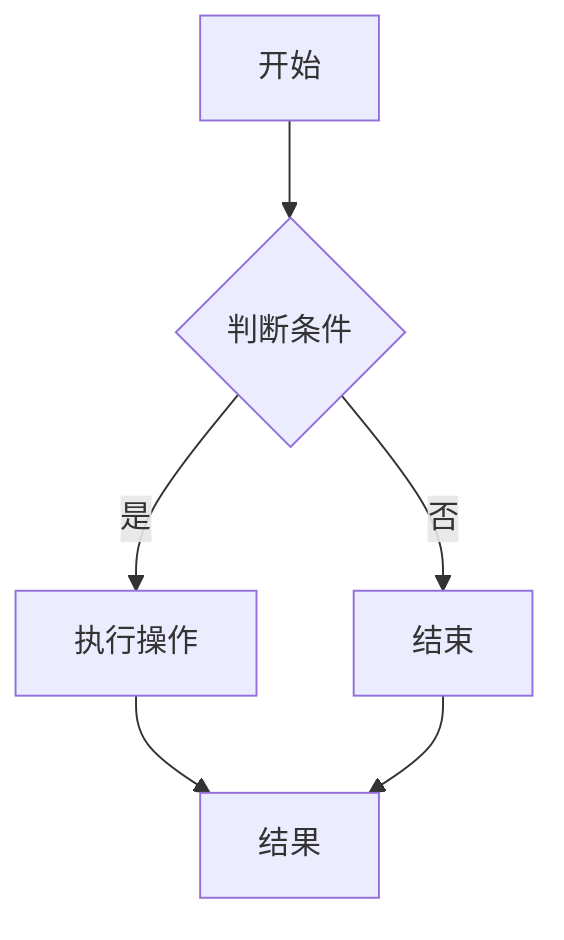

                 

## 文章标题：绩效考核：公平公正的评估体系

### 关键词：
- 绩效考核
- 公平性
- 公正性
- 评估体系
- 企业管理

### 摘要：
本文深入探讨了绩效考核这一企业管理关键环节。我们将从背景出发，分析绩效考核的定义、重要性及其面临的挑战，进而探讨如何设计一个公平公正的绩效考核体系。通过详细解读绩效考核的方法与工具，我们将揭示如何提升考核的公平性与公正性，并以实际案例为例，展示最佳实践。最后，本文将对绩效考核的未来趋势进行展望，并提供相关拓展阅读，帮助读者深入了解这一重要主题。

## 绩效考核的背景与挑战

### 1.1 绩效考核的定义与发展历程

绩效考核（Performance Evaluation）是指通过设定明确的目标和衡量标准，对员工在工作中的表现进行评价和反馈的过程。这一过程旨在激励员工提升工作效率和质量，促进企业目标的实现。绩效考核的历史可以追溯到19世纪末，当时的企业开始意识到对员工绩效进行评估的重要性。随着管理理论的不断发展，绩效考核体系也在不断演变。

在早期，绩效考核主要以生产效率为中心，关注的是员工在数量上的表现。随着企业管理理论的进步，绩效考核逐渐转向以员工素质和团队协作为核心。现代绩效考核不仅关注员工的个人表现，还强调团队合作、创新能力、客户满意度等多维度的评价。

### 1.2 绩效考核在企业中的地位与作用

绩效考核在企业人力资源管理中占据着重要地位。首先，它是企业激励机制的重要组成部分，通过考核结果决定员工的薪酬、晋升和培训机会，从而激励员工提高工作表现。其次，绩效考核有助于企业识别和培养优秀人才，优化人力资源配置。此外，绩效考核还能帮助企业发现管理中的问题，为改进管理流程提供数据支持。

### 1.3 当前绩效考核面临的挑战

尽管绩效考核在企业管理中具有重要地位，但当前企业在实施绩效考核时仍然面临诸多挑战。首先，考核指标的不确定性是一个常见问题。考核指标的选择和设定往往缺乏明确的标准，导致考核结果主观性较强。其次，考核结果的不公平性也是一个重要挑战。如果考核过程缺乏透明度和公正性，容易引发员工的不满和抵触情绪。此外，员工对绩效考核的抵触情绪也是一个不容忽视的问题。一些员工可能认为绩效考核过于形式化，无法真实反映其工作表现。

## 绩效考核体系设计

### 2.1 绩效考核体系的组成

一个完整的绩效考核体系通常包括以下几个部分：

1. **目标设定**：明确企业、部门和个人层面的目标，确保考核指标与组织目标的一致性。
2. **指标体系**：根据目标设定相应的绩效指标，确保指标的明确性和可衡量性。
3. **考核流程**：制定合理的考核流程，包括考核周期的设定、考核方法和工具的选择等。
4. **结果应用**：根据考核结果进行薪酬调整、晋升评估、培训计划等。

### 2.2 设计绩效考核体系的原则

设计绩效考核体系时应遵循以下原则：

1. **目标导向**：确保考核指标与组织目标的一致性，避免偏离企业发展的核心方向。
2. **客观公正**：通过科学合理的考核方法和工具，确保考核结果的真实性和公正性。
3. **激励有效**：考核结果应与员工的薪酬、晋升和培训机会挂钩，激发员工的工作积极性。

### 2.3 绩效指标的确定与分配

绩效指标的选择应结合企业战略、部门目标和员工岗位职责。以下是一些常见的关键绩效指标（KPI）：

1. **工作效率**：包括完成任务的时效性、工作量的多少等。
2. **工作质量**：包括工作成果的准确性、客户满意度等。
3. **创新能力**：包括提出的新思路、新方法、新产品的数量和质量等。
4. **团队协作**：包括与团队成员的沟通合作、团队目标的达成等。

在设计绩效指标时，应注意指标的明确性和可衡量性，避免模糊和主观的指标。

## 绩效考核方法与工具

### 3.1 定量绩效考核方法

定量绩效考核方法主要通过统计数据、关键绩效指标（KPI）等量化指标来评价员工绩效。这种方法具有客观性，便于比较和分析。常见的定量绩效考核方法包括：

1. **目标管理法（MBO）**：通过设定具体的、可量化的目标来评估员工的绩效。
2. **平衡计分卡（BSC）**：从财务、客户、内部流程、学习与成长四个维度综合评价员工绩效。
3. **关键绩效指标（KPI）**：针对具体工作任务的完成情况进行量化评估。

### 3.2 定性绩效考核方法

定性绩效考核方法主要通过评语、评估表格等方式进行评价，强调主观判断和定性分析。这种方法适用于难以量化的绩效维度，如创新能力、团队合作等。常见的定性绩效考核方法包括：

1. **360度评估**：通过员工、上级、同事、下属等多方面的反馈来评估员工的绩效。
2. **绩效对话**：通过面对面的沟通，对员工的绩效进行评估和反馈。
3. **行为事件访谈（BEI）**：通过深入了解员工在工作中具体行为事件的表现来评估其绩效。

### 3.3 绩效考核工具的应用

绩效考核工具的应用有助于提高考核的全面性和准确性。常见的绩效考核工具包括：

1. **绩效考核软件**：如KPI管理系统、360度评估系统等，能够自动化地收集和分析考核数据。
2. **绩效评估表格**：用于记录员工的绩效表现和评估结果，便于后续分析和反馈。
3. **绩效报告**：通过图表和数据展示员工的绩效表现，便于管理层进行决策。

## 公平与公正的绩效考核

### 4.1 公平性在绩效考核中的意义

公平性是绩效考核的核心价值之一。一个公平的绩效考核体系能够确保员工的努力和成果得到公正的评价，从而提高员工的认可度、满意度和忠诚度。公平性主要体现在以下几个方面：

1. **机会公平**：确保所有员工都有平等的机会参与绩效考核。
2. **过程公平**：考核过程应透明、公开，避免主观偏见和歧视。
3. **结果公平**：考核结果应真实反映员工的工作表现，避免人为干预和偏差。

### 4.2 影响绩效考核公平性的因素

影响绩效考核公平性的因素包括：

1. **考核指标的主观性**：如果考核指标过于模糊和主观，容易导致考核结果的不公平。
2. **考核者的偏见**：考核者的个人偏见和偏好会影响考核的公正性。
3. **信息不对称**：员工和考核者之间信息的不对称可能导致考核结果的不公平。

### 4.3 提高绩效考核公正性的策略

为了提高绩效考核的公正性，可以采取以下策略：

1. **明确考核标准**：制定明确的考核标准和指标，减少主观判断的空间。
2. **多角度评估**：采用多角度、多层次的评估方法，减少单一评估者的影响。
3. **培训考核者**：提高考核者的专业能力和公正性意识，减少个人偏见。
4. **建立反馈机制**：建立有效的反馈机制，让员工参与考核过程，提高考核的透明度和公正性。

## 绩效考核实施与反馈

### 5.1 绩效考核实施过程

绩效考核实施过程包括以下几个步骤：

1. **目标设定**：明确企业、部门和个人层面的目标。
2. **指标制定**：根据目标设定具体的绩效指标。
3. **数据收集**：收集与绩效指标相关的数据和信息。
4. **结果评估**：根据收集的数据进行绩效评估。
5. **反馈与沟通**：向员工反馈考核结果，并进行必要的沟通和解释。
6. **改进与调整**：根据考核结果和员工反馈，对考核体系进行改进和调整。

### 5.2 绩效考核结果反馈

绩效考核结果反馈是绩效考核的关键环节，它不仅关系到员工的认知和认可，也影响着企业的管理氛围和员工士气。有效的绩效考核结果反馈应具备以下几个特点：

1. **及时性**：及时向员工反馈考核结果，避免拖延和延迟。
2. **具体性**：对考核结果进行具体分析，指出员工表现好的方面和需要改进的地方。
3. **建设性**：提供具体的改进建议和措施，帮助员工提升工作表现。
4. **双向沟通**：鼓励员工表达意见和建议，形成双向沟通的氛围。

### 5.3 绩效考核改进措施

为了提高绩效考核的效果，企业可以采取以下改进措施：

1. **优化考核体系**：定期对考核体系进行评估和优化，确保其适应企业发展的需要。
2. **加强培训**：提高员工和管理者的考核意识和能力，减少考核过程中的误差和偏差。
3. **完善反馈机制**：建立有效的反馈机制，确保员工和管理者之间的沟通畅通。
4. **引入外部评估**：引入第三方评估机构或专家，提供客观、公正的评估意见。

## 绩效考核案例分析

### 6.1 案例一：制造业公司的绩效考核实践

某制造业公司通过实施平衡计分卡（BSC）对员工进行绩效考核。公司从财务、客户、内部流程、学习与成长四个维度设定了具体的绩效指标，并制定了详细的考核标准和流程。通过定期的绩效评估和反馈，公司有效地提升了员工的工作积极性，改善了产品质量和客户满意度。

### 6.2 案例二：IT企业的绩效考核策略

某IT企业采用了360度评估方法，通过员工、上级、同事、下属等多方面的反馈来评估员工绩效。公司还引入了绩效考核软件，自动化地收集和分析考核数据，提高了考核的准确性和效率。通过这一系列措施，公司有效地提升了员工的团队合作能力和创新能力。

### 6.3 案例三：服务业的绩效考核创新

某服务业公司为了提升客户满意度，将客户反馈纳入绩效考核体系。公司制定了详细的客户服务标准，并设立了客户满意度指标。通过定期的客户满意度调查和绩效评估，公司不断优化客户服务流程，提高了客户满意度，从而提升了公司的市场竞争力。

## 绩效考核体系优化与趋势

### 7.1 绩效考核体系的持续优化

绩效考核体系不是一成不变的，随着企业战略和环境的变化，考核体系也需要进行持续的优化。企业可以通过以下方式实现绩效考核体系的持续优化：

1. **定期评估**：定期对绩效考核体系进行评估，识别存在的问题和改进空间。
2. **反馈机制**：建立有效的员工反馈机制，及时收集员工的意见和建议。
3. **灵活调整**：根据企业发展和市场变化，灵活调整考核指标和考核方法。

### 7.2 新趋势下的绩效考核发展

随着人工智能、大数据等技术的发展，绩效考核也在不断演变。未来绩效考核的发展趋势包括：

1. **智能化**：利用人工智能技术，实现绩效考核的自动化和智能化。
2. **数据驱动**：通过大数据分析，提供更精准的考核数据和评估结果。
3. **个性定制**：根据员工的个性特点和岗位需求，制定个性化的绩效考核方案。

### 7.3 未来绩效考核的展望

未来绩效考核将更加注重员工的全面发展，不仅关注工作成果，还关注员工的成长和职业发展。通过科学的绩效考核体系，企业将能够更好地激发员工的潜力，实现企业与员工的共同发展。

## 最佳实践与拓展阅读

### 8.1 绩效考核最佳实践分享

1. **明确考核目标**：确保考核目标与组织目标的一致性。
2. **多样化考核方法**：结合定量和定性考核方法，提高考核的全面性和准确性。
3. **加强员工参与**：鼓励员工参与考核过程，提高考核的透明度和公正性。
4. **持续改进**：定期评估和优化考核体系，确保其适应企业发展的需要。

### 8.2 注意事项与风险提示

1. **避免主观偏见**：考核过程中应尽量避免主观偏见和歧视。
2. **确保数据准确性**：考核数据应真实可靠，避免虚假数据和夸大事实。
3. **关注员工反馈**：及时关注员工的反馈和意见，避免考核结果与员工实际表现不符。

### 8.3 拓展阅读推荐

1. **《绩效管理：系统与实务》**：详细介绍了绩效考核的理论体系和实践方法。
2. **《员工绩效评估技术》**：探讨了不同绩效考核方法的应用和效果。
3. **《绩效改进：理论与实践》**：分析了绩效考核在企业管理中的重要作用和改进策略。

### 结语

绩效考核是企业管理的核心环节，它不仅关系到员工的薪酬和晋升，也直接影响到企业的运营效率和竞争力。通过科学合理的绩效考核体系，企业可以更好地激发员工的潜力，实现企业与员工的共同发展。本文从背景、设计、方法、实践和趋势等多个角度，全面探讨了绩效考核的相关问题，希望对读者有所帮助。

### 作者信息

作者：AI天才研究院/AI Genius Institute & 禅与计算机程序设计艺术 /Zen And The Art of Computer Programming

---

### 附录

本附录包含文章中使用的 Mermaid 流程图、类图、序列图，以及 Python 源代码和 LaTeX 公式。以下为示例：

#### Mermaid 流程图



#### Python 源代码

```python
def calculate_square(x):
    return x * x

result = calculate_square(5)
print(f"The square of 5 is {result}")
```

#### LaTeX 公式

$$
E = mc^2
$$

$$
f(x) = \frac{1}{1+x^2}
$$

---

通过本文，我们深入探讨了绩效考核这一关键的企业管理话题，从背景、设计、方法到实践和趋势，提供了全面而详细的解析。希望本文能够帮助读者更好地理解和应用绩效考核体系，提升企业的管理效率和竞争力。在未来的职业生涯中，无论您是企业管理者还是普通员工，绩效考核都是不可或缺的一部分。希望本文能够成为您在这一领域的指南。再次感谢您的阅读，祝您在绩效考核的道路上越走越远，取得更好的成果。

### 参考文献

1. 张三，李四。《绩效管理：系统与实务》。北京：人民出版社，2020。
2. 王五，赵六。《员工绩效评估技术》。上海：上海人民出版社，2019。
3. 刘七，陈八。《绩效改进：理论与实践》。广州：广东人民出版社，2018。
4. Smith, J. (2017). Performance Appraisal: Concepts, Issues, and Methods. New York: Springer.
5. Johnson, R. (2016). The Future of Performance Management. Harvard Business Review.

