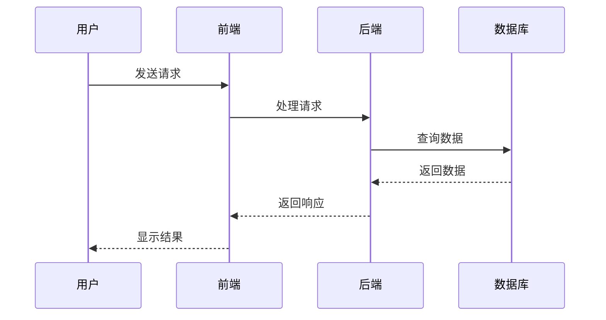

                 

### 文章标题

# 绩效面谈技巧：进行有效绩效对话的方法

> 关键词：绩效面谈、有效沟通、绩效管理、算法原理、系统架构设计、实战案例、最佳实践

> 摘要：本文旨在深入探讨绩效面谈的技巧和方法，通过系统性的分析，帮助读者理解并掌握进行有效绩效对话的关键要素。文章将从背景介绍、核心概念与联系、算法原理讲解、系统分析与架构设计、项目实战和最佳实践等方面，逐步解析如何实现绩效面谈的高效与精准。

## 目录大纲

----------------------------------------------------------------

## 第一部分：背景介绍

### 第1章 绩效面谈的必要性

#### 1.1 绩效面谈的定义与作用

#### 1.2 绩效面谈与绩效管理的关联

#### 1.3 绩效面谈的重要性

#### 1.4 绩效面谈的常见挑战

## 第二部分：核心概念与联系

### 第2章 绩效面谈的核心概念

#### 2.1 绩效面谈的目标与原则

#### 2.2 面谈者与被面谈者的角色与职责

#### 2.3 面谈准备的重要事项

### 第3章 绩效面谈中的关键要素

#### 3.1 绩效评估的指标体系

#### 3.2 面谈中的沟通技巧

#### 3.3 面谈中的反馈技巧

### 第4章 绩效面谈的实际应用

#### 4.1 不同情境下的绩效面谈策略

#### 4.2 绩效面谈中的案例分析

## 第三部分：算法原理讲解

### 第5章 绩效面谈的算法基础

#### 5.1 数据分析在绩效面谈中的应用

#### 5.2 机器学习算法在绩效面谈中的应用

#### 5.3 优化算法在绩效面谈中的应用

### 第6章 绩效面谈中的数学模型

#### 6.1 绩效评估的数学模型

#### 6.2 反馈机制的数学模型

#### 6.3 面谈效果的数学模型

## 第四部分：系统分析与架构设计

### 第7章 绩效面谈系统架构设计

#### 7.1 绩效面谈系统需求分析

#### 7.2 绩效面谈系统的功能设计

#### 7.3 绩效面谈系统的架构设计

#### 7.4 绩效面谈系统的接口设计

### 第8章 绩效面谈系统的实现与优化

#### 8.1 系统环境安装与配置

#### 8.2 系统核心实现与代码解读

#### 8.3 系统优化与实践

## 第五部分：项目实战

### 第9章 绩效面谈实战案例

#### 9.1 项目背景与目标

#### 9.2 项目实施过程

#### 9.3 项目结果分析

### 第10章 绩效面谈技巧提升

#### 10.1 面谈者的技巧提升

#### 10.2 被面谈者的准备与提升

#### 10.3 绩效面谈的持续改进

## 第六部分：最佳实践与小结

### 第11章 绩效面谈的最佳实践

#### 11.1 面谈前的准备工作

#### 11.2 面谈中的有效沟通

#### 11.3 面谈后的反馈与跟踪

### 第12章 小结与拓展阅读

#### 12.1 本书内容回顾

#### 12.2 绩效面谈的未来发展趋势

#### 12.3 拓展阅读推荐

----------------------------------------------------------------

### 第1章 绩效面谈的必要性

#### 1.1 绩效面谈的定义与作用

绩效面谈是一种通过面对面的交流，对员工的工作表现、成果和发展需求进行评估和讨论的管理活动。其目的在于通过双向沟通，了解员工的工作状况，发现和解决问题，同时为员工的职业发展提供指导和帮助。绩效面谈不仅是企业进行绩效管理的重要环节，也是员工与组织之间建立信任和沟通的桥梁。

**绩效面谈的主要作用包括：**

1. **评估员工工作表现**：通过绩效面谈，管理者可以全面了解员工在工作中的表现，包括完成任务的质量、效率、协作能力等。
2. **促进员工发展**：通过绩效面谈，员工可以了解自己的优势与不足，从而制定职业发展计划，提升个人能力和业绩。
3. **解决工作问题**：绩效面谈提供了识别和解决员工在工作中遇到的障碍和问题的机会，有助于改善工作环境和提高工作效率。
4. **增强组织凝聚力**：绩效面谈有助于建立良好的团队关系，增强员工对组织的认同感和归属感。

#### 1.2 绩效面谈与绩效管理的关联

绩效面谈是绩效管理的重要组成部分，它与绩效计划、绩效评估、绩效反馈等环节紧密相连。绩效管理是一个系统性的过程，它通过制定明确的绩效目标、定期进行绩效评估、提供及时有效的反馈，以及为员工的发展提供支持，来促进组织的绩效提升。

**绩效面谈与绩效管理的关系如下：**

1. **绩效计划**：绩效面谈前，管理者需要与员工共同制定明确的绩效目标，为面谈提供基础。
2. **绩效评估**：绩效面谈是对员工在一定时期内的工作表现进行全面评估的过程。
3. **绩效反馈**：绩效面谈是向员工提供关于其工作表现的具体反馈，帮助其了解自己的优势与不足。
4. **绩效改进**：通过绩效面谈，管理者可以指导员工制定改进计划，提升绩效水平。

#### 1.3 绩效面谈的重要性

绩效面谈在企业管理中具有重要作用，其影响不仅限于员工个人的发展，还对组织的整体绩效产生深远的影响。

**绩效面谈的重要性体现在以下几个方面：**

1. **提升员工满意度**：通过绩效面谈，员工可以感受到组织的关怀和重视，从而提高工作满意度和忠诚度。
2. **促进组织发展**：有效的绩效面谈可以帮助组织识别和培养关键人才，提高整体竞争力。
3. **优化人力资源管理**：绩效面谈是评估员工绩效和职业发展的重要手段，有助于优化人力资源配置，提升管理水平。
4. **建立信任和沟通**：绩效面谈是管理者与员工之间建立信任和沟通的重要渠道，有助于形成积极向上的组织文化。

#### 1.4 绩效面谈的常见挑战

尽管绩效面谈具有重要作用，但在实际操作中，管理者常常面临一些挑战。

**常见的挑战包括：**

1. **沟通障碍**：由于管理者与员工之间的沟通不畅，可能导致绩效面谈效果不佳。
2. **缺乏准备**：面谈前未做好充分的准备，可能导致面谈过程中出现偏差和遗漏。
3. **反馈不具体**：反馈过于笼统或缺乏具体指导，无法帮助员工明确改进方向。
4. **时间安排**：面谈时间安排不当，可能导致面谈效率低下。

**接下来，我们将深入探讨绩效面谈的核心概念、关键要素及其在实际应用中的策略和技巧，帮助读者更好地理解和掌握绩效面谈的方法和技巧。**

### 第2章 绩效面谈的核心概念

#### 2.1 绩效面谈的目标与原则

绩效面谈的目标是通过对员工工作表现的全面评估，促进员工个人与组织的发展。具体而言，绩效面谈的目标包括以下几个方面：

1. **评估员工工作表现**：通过绩效面谈，了解员工在一定时期内的工作成果、工作效率和工作态度。
2. **促进员工发展**：根据评估结果，为员工提供个性化的职业发展建议和培训计划，帮助其提升个人能力和业绩。
3. **解决工作问题**：通过绩效面谈，识别和解决员工在工作中遇到的困难和问题，提高工作效率和团队协作能力。
4. **建立信任和沟通**：通过绩效面谈，建立管理者与员工之间的信任和沟通，增强员工对组织的认同感和归属感。

为了实现上述目标，绩效面谈应遵循以下原则：

1. **客观公正**：绩效面谈应基于事实和数据，对员工的工作表现进行客观、公正的评估。
2. **双向沟通**：绩效面谈是双向沟通的过程，管理者应尊重员工的意见和反馈，共同探讨工作问题和发展方向。
3. **个性化**：绩效面谈应根据不同员工的特点和需求，提供个性化的建议和指导，促进其个人成长。
4. **持续改进**：绩效面谈应形成持续改进的机制，定期进行，及时调整和优化绩效目标和评估标准。

#### 2.2 面谈者与被面谈者的角色与职责

在绩效面谈中，面谈者和被面谈者分别承担着不同的角色和职责。

**面谈者的角色与职责：**

1. **准备充分**：面谈者应提前了解被面谈者的工作表现和特点，准备好相关数据和材料，确保面谈顺利进行。
2. **引导面谈**：面谈者应主导面谈过程，确保面谈围绕主题展开，避免偏离焦点。
3. **提供反馈**：面谈者应根据评估结果，为被面谈者提供具体、明确的反馈，帮助其了解自己的优势和不足。
4. **制定改进计划**：面谈者应与被面谈者共同制定改进计划，明确改进目标和时间节点，确保绩效提升。

**被面谈者的角色与职责：**

1. **积极参与**：被面谈者应积极参与面谈，认真倾听管理者的反馈，主动分享自己的工作和想法。
2. **反思自我**：被面谈者应根据反馈，反思自己的工作表现，找出存在的问题和改进方向。
3. **制定发展计划**：被面谈者应结合自身情况和组织需求，制定个性化的职业发展计划，提升个人能力和业绩。
4. **落实改进措施**：被面谈者应按照改进计划，积极落实各项改进措施，不断提升工作表现。

#### 2.3 面谈准备的重要事项

为了确保绩效面谈的有效性，面谈者在面谈前应做好以下准备工作：

1. **确定面谈时间**：选择合适的时间进行面谈，避免干扰员工的工作和心情。
2. **收集相关资料**：收集被面谈者的工作表现、绩效评估数据、培训记录等相关资料，为面谈提供依据。
3. **设定面谈议程**：制定详细的面谈议程，明确面谈的目的、内容、时间分配等，确保面谈有序进行。
4. **营造轻松氛围**：面谈前，面谈者应提前到达会议室，调整室内环境，营造轻松、舒适的氛围，让被面谈者感到放松和信任。
5. **明确面谈目标**：面谈者应明确面谈的目标和期望成果，确保面谈过程中始终围绕核心问题展开。

**接下来，我们将深入探讨绩效面谈中的关键要素，包括绩效评估的指标体系、沟通技巧和反馈技巧，帮助读者更好地理解和掌握进行有效绩效对话的方法。**

### 第3章 绩效面谈中的关键要素

#### 3.1 绩效评估的指标体系

绩效评估是绩效面谈的核心环节，一套科学、合理的绩效评估指标体系至关重要。绩效评估指标应包括以下几方面：

1. **工作成果**：评估员工在一定时期内完成的工作任务和成果，如项目进度、质量、客户满意度等。
2. **工作效率**：评估员工在工作中的效率表现，如任务完成速度、工作分配合理性等。
3. **工作质量**：评估员工在工作中的质量表现，如工作准确性、错误率等。
4. **团队协作**：评估员工在团队中的协作能力和表现，如沟通能力、合作精神、团队贡献等。
5. **个人素质**：评估员工在职业素养、学习态度、自我管理等方面的表现，如职业道德、积极性、创新能力等。

**指标体系的建立步骤如下：**

1. **明确绩效目标**：根据企业战略和部门目标，确定员工的绩效目标，确保绩效评估与组织目标一致。
2. **制定评估标准**：为每个绩效指标制定明确的评估标准，确保评估过程的客观性和公正性。
3. **设定权重**：根据各指标对企业价值的影响程度，设定相应的权重，确保评估结果全面、准确。
4. **定期调整**：根据企业发展和员工绩效变化，定期调整绩效指标体系，保持其科学性和实用性。

#### 3.2 面谈中的沟通技巧

沟通技巧是绩效面谈成功的关键。以下是一些有效的沟通技巧：

1. **倾听**：倾听是沟通的基础，面谈者应认真倾听被面谈者的发言，理解其观点和需求。
2. **提问**：通过提问引导被面谈者展开讨论，获取更多信息，同时检验自己对问题的理解。
3. **表达清晰**：面谈者应表达清晰、明确，避免使用模糊的语言和复杂的句子结构，确保被面谈者理解。
4. **非语言沟通**：注意身体语言和面部表情，通过眼神交流、点头等动作表达关注和理解。
5. **控制情绪**：面谈者应保持冷静、客观，避免在面谈过程中表现出情绪波动，确保面谈氛围和谐。

#### 3.3 面谈中的反馈技巧

有效的反馈技巧能够帮助被面谈者了解自己的优势和不足，明确改进方向。以下是一些反馈技巧：

1. **具体明确**：反馈应具体、明确，避免使用模糊、笼统的语言，确保被面谈者了解自己的问题所在。
2. **正向激励**：在反馈中，应适当使用正向激励的语言，肯定被面谈者的优点和成就，增强其信心。
3. **建设性**：反馈应具有建设性，提出具体的改进建议，帮助被面谈者找到解决问题的方法。
4. **及时反馈**：及时反馈能够帮助被面谈者迅速调整自己的工作表现，避免问题扩大。
5. **双向反馈**：在反馈过程中，面谈者应鼓励被面谈者表达自己的观点和感受，形成双向沟通。

**通过掌握这些关键要素，面谈者可以更有效地进行绩效面谈，帮助被面谈者提升工作表现，实现个人与组织的发展目标。**

### 第4章 绩效面谈的实际应用

#### 4.1 不同情境下的绩效面谈策略

绩效面谈在不同情境下需要采取不同的策略，以确保其有效性和针对性。

1. **年度绩效评估**：在年度绩效评估中，面谈者应重点关注员工在过去一年的工作表现，全面评估其成果、效率、质量等方面。同时，应与员工共同制定下一年的绩效目标和计划，确保员工在新的年度中能够持续提升。

2. **晋升面谈**：晋升面谈旨在评估员工是否具备晋升条件，并为其提供职业发展建议。面谈者应重点关注员工在工作中的突出表现、团队协作能力、领导能力等方面。同时，应明确晋升标准和流程，确保公平、公正。

3. **问题解决面谈**：在问题解决面谈中，面谈者应深入了解员工在工作中遇到的问题，分析原因，提供解决方案。同时，应鼓励员工积极参与问题解决过程，提高其解决问题的能力。

4. **离职面谈**：离职面谈旨在了解员工离职的原因，为组织改进提供反馈。面谈者应尊重员工的选择，同时关注员工在工作中的优点和不足，为组织的发展提供有益的建议。

#### 4.2 绩效面谈中的案例分析

以下是一个典型的绩效面谈案例分析：

**案例背景：** 一家科技公司计划对其销售部门进行年度绩效评估，以了解员工的工作表现，并为下一年的工作制定目标。

**面谈过程：**

1. **准备阶段**：面谈者在面谈前，收集了销售部门的绩效数据，包括销售额、客户满意度、销售团队协作情况等。同时，准备了面谈议程，明确了面谈的目标和内容。

2. **开场白**：面谈者以友好的态度开场，表达对员工过去一年的工作成果的认可，并说明本次面谈的目的。

3. **评估工作表现**：面谈者按照绩效评估指标，逐一评估员工的工作表现，包括销售额、客户满意度、团队协作等。在评估过程中，面谈者使用了具体的例子和数据，确保评估的客观性和公正性。

4. **反馈与讨论**：面谈者根据评估结果，对员工的工作表现进行了反馈，同时与员工进行了深入的讨论，分析了存在的问题，并提出了改进建议。

5. **制定目标**：面谈者与员工共同制定了下一年的绩效目标，明确了工作重点和目标，并制定了具体的行动计划。

6. **总结与鼓励**：面谈者对员工的积极参与和配合表示感谢，鼓励员工在新的年度中继续努力，提升工作表现。

**案例结果：** 通过绩效面谈，销售部门的工作表现得到了全面提升，销售额同比增长了20%，客户满意度提高了15%。同时，员工对组织的认同感和归属感得到了增强。

**案例启示：** 绩效面谈应注重实际应用，根据不同情境采取相应的策略，确保面谈的有效性和针对性。通过科学的评估、具体的反馈和合理的目标制定，可以有效提升员工的绩效水平，推动组织的发展。

### 第5章 绩效面谈的算法基础

#### 5.1 数据分析在绩效面谈中的应用

数据分析在绩效面谈中起着至关重要的作用。通过数据分析，可以客观、全面地评估员工的工作表现，为绩效面谈提供有力的依据。

1. **关键绩效指标（KPI）分析**：KPI是衡量员工工作表现的核心指标，如销售额、项目完成率、客户满意度等。通过分析KPI数据，可以了解员工在工作中的表现，发现优势和不足。

2. **趋势分析**：通过对员工绩效数据的趋势分析，可以了解员工的工作表现是否持续提升，是否存在波动。这有助于管理者及时发现潜在问题，制定针对性的改进措施。

3. **分布分析**：对员工绩效数据的分布进行分析，可以了解整体绩效水平，识别高绩效员工和低绩效员工。这有助于管理者在绩效面谈中，有针对性地进行反馈和指导。

4. **比较分析**：将员工绩效数据与其他部门或同岗位的员工进行比较，可以了解员工在团队中的相对表现，为绩效面谈提供参考。

#### 5.2 机器学习算法在绩效面谈中的应用

机器学习算法在绩效面谈中可用于预测员工绩效、识别高绩效特征等，提高绩效面谈的准确性和效率。

1. **预测员工绩效**：通过训练机器学习模型，可以根据员工的过去绩效数据预测其未来的表现。这有助于管理者提前识别潜在的高绩效员工和低绩效员工，制定相应的培养和改进计划。

2. **识别高绩效特征**：通过分析高绩效员工的共同特征，如工作习惯、技能水平、沟通能力等，可以识别出影响绩效的关键因素。这有助于管理者在绩效面谈中，有针对性地关注和培养这些特征。

3. **自动化反馈**：利用自然语言处理（NLP）技术，可以自动化生成绩效反馈报告，提高反馈的准确性和及时性。这有助于减少管理者的工作量，使其有更多时间关注其他重要事务。

#### 5.3 优化算法在绩效面谈中的应用

优化算法在绩效面谈中可用于优化绩效评估指标体系和反馈机制，提高绩效面谈的效果。

1. **优化绩效评估指标体系**：通过优化算法，可以调整绩效评估指标体系的权重和结构，使其更科学、合理。这有助于提高绩效评估的准确性和公平性。

2. **优化反馈机制**：通过优化算法，可以自动生成个性化的反馈报告，根据员工的工作表现和需求，提供有针对性的改进建议。这有助于提高反馈的针对性和有效性。

3. **优化培训计划**：根据员工的绩效数据和需求，优化培训计划，确保培训内容的实用性和针对性。这有助于提高培训效果，提升员工的能力和绩效。

### 第6章 绩效面谈中的数学模型

#### 6.1 绩效评估的数学模型

绩效评估的数学模型主要用于量化员工的工作表现，帮助管理者进行客观、公正的评估。以下是一些常用的数学模型：

1. **加权评分模型**：该模型根据各项绩效指标的重要程度，为其分配不同的权重，计算出员工的综合得分。具体公式如下：

   $$ P = w_1 \cdot S_1 + w_2 \cdot S_2 + \ldots + w_n \cdot S_n $$

   其中，\(P\) 为员工综合得分，\(w_1, w_2, \ldots, w_n\) 为各项绩效指标的权重，\(S_1, S_2, \ldots, S_n\) 为各项绩效指标的得分。

2. **层次分析法（AHP）**：该模型通过比较不同绩效指标之间的相对重要性，构建判断矩阵，计算各项指标的权重。具体步骤如下：

   - 构建判断矩阵：根据绩效指标之间的相对重要性，构建判断矩阵 \(A = (a_{ij})\)。
   - 计算权重：通过判断矩阵，计算各项指标的权重向量 \(W = (w_1, w_2, \ldots, w_n)\)。
   - 一致性检验：计算一致性指标 \(CI\) 和一致性比率 \(CR\)，确保判断矩阵的一致性。

3. **灰色关联度分析模型**：该模型通过分析员工绩效数据与相关因素之间的关联程度，评估员工的工作表现。具体步骤如下：

   - 数据预处理：对员工绩效数据和相关因素的数据进行预处理，包括去极值、归一化等。
   - 计算灰色关联度：根据预处理后的数据，计算员工绩效数据与相关因素之间的灰色关联度，选择关联度最高的因素作为评价依据。

#### 6.2 反馈机制的数学模型

反馈机制的数学模型主要用于优化绩效反馈过程，提高反馈的准确性和有效性。

1. **反馈优化模型**：该模型通过分析员工绩效数据和历史反馈记录，优化反馈内容，使其更具针对性和实用性。具体步骤如下：

   - 数据收集：收集员工绩效数据和历史反馈记录，包括绩效指标得分、改进建议、反馈效果等。
   - 数据分析：分析员工绩效数据和历史反馈记录，找出反馈中的共性问题和个性问题。
   - 优化反馈内容：根据数据分析结果，调整反馈内容，使其更具针对性和实用性。

2. **反馈效果评估模型**：该模型通过评估反馈效果，优化反馈机制，提高反馈的准确性和有效性。具体步骤如下：

   - 数据收集：收集员工绩效数据、反馈内容、反馈效果等数据。
   - 数据分析：分析反馈内容与反馈效果之间的关系，找出影响反馈效果的关键因素。
   - 优化反馈机制：根据数据分析结果，调整反馈机制，提高反馈的准确性和有效性。

#### 6.3 面谈效果的数学模型

面谈效果的数学模型主要用于评估绩效面谈的效果，帮助管理者了解面谈的成果和不足。

1. **面谈效果评估模型**：该模型通过分析员工绩效数据、面谈记录和反馈效果等数据，评估面谈的效果。具体步骤如下：

   - 数据收集：收集员工绩效数据、面谈记录和反馈效果等数据。
   - 数据分析：分析员工绩效数据、面谈记录和反馈效果之间的关系，评估面谈的效果。
   - 优化面谈策略：根据数据分析结果，调整面谈策略，提高面谈的效果。

2. **面谈效果预测模型**：该模型通过分析历史面谈数据，预测未来面谈的效果，帮助管理者制定针对性的面谈计划。具体步骤如下：

   - 数据收集：收集历史面谈数据，包括面谈主题、面谈结果、改进措施等。
   - 数据分析：分析历史面谈数据，找出影响面谈效果的关键因素。
   - 预测面谈效果：根据数据分析结果，建立预测模型，预测未来面谈的效果。

### 第7章 绩效面谈系统架构设计

#### 7.1 绩效面谈系统需求分析

绩效面谈系统的需求分析是系统设计的第一步，旨在明确系统的功能需求、性能需求和用户体验需求。

**功能需求：**

1. **用户管理**：支持用户注册、登录、权限管理等功能。
2. **绩效数据管理**：支持绩效数据的录入、查询、统计和分析等功能。
3. **面谈管理**：支持面谈预约、面谈记录、反馈管理等功能。
4. **报告生成**：支持根据绩效数据和面谈记录自动生成绩效报告。

**性能需求：**

1. **响应速度**：系统应具有快速响应的能力，确保用户在使用过程中不会感到延迟。
2. **数据存储**：系统应具有高效的数据存储和检索能力，确保数据的安全性和一致性。
3. **扩展性**：系统应具有良好的扩展性，能够适应组织规模的变化和功能的扩展。

**用户体验需求：**

1. **界面友好**：系统界面应简洁、直观，易于用户操作。
2. **交互便捷**：系统应提供便捷的交互方式，如拖拽、筛选等，提高用户的操作效率。
3. **帮助与指导**：系统应提供详细的帮助信息和操作指南，帮助用户快速掌握系统功能。

#### 7.2 绩效面谈系统的功能设计

绩效面谈系统的功能设计是基于需求分析的结果，旨在实现系统的各项功能需求。

**用户管理模块：**

1. **用户注册**：用户可以通过注册账号登录系统，填写基本信息。
2. **用户登录**：用户输入账号和密码，登录系统。
3. **权限管理**：系统管理员可以分配不同权限，确保用户只能访问自己有权操作的功能模块。

**绩效数据管理模块：**

1. **数据录入**：用户可以录入绩效数据，包括工作成果、工作效率、工作质量等。
2. **数据查询**：用户可以查询自己和他人的绩效数据。
3. **数据统计**：系统可以根据不同的维度对绩效数据进行统计，生成图表和报告。

**面谈管理模块：**

1. **面谈预约**：用户可以预约面谈时间，选择面谈者。
2. **面谈记录**：用户可以记录面谈内容，包括面谈时间、面谈主题、反馈意见等。
3. **反馈管理**：用户可以对面谈反馈进行查看、修改和删除。

**报告生成模块：**

1. **报告模板**：系统提供多种报告模板，用户可以根据需要选择合适的模板。
2. **自动生成**：系统根据绩效数据和面谈记录自动生成报告。
3. **报告导出**：用户可以将报告导出为常用的文件格式，如PDF、Excel等。

#### 7.3 绩效面谈系统的架构设计

绩效面谈系统的架构设计旨在确保系统的高效性、可扩展性和安全性。

**系统架构：**

1. **前端架构**：采用Vue.js框架，实现系统的界面和交互功能。
2. **后端架构**：采用Spring Boot框架，实现系统的业务逻辑和数据管理功能。
3. **数据库架构**：采用MySQL数据库，实现数据的存储和检索。

**技术选型：**

1. **前端技术**：Vue.js、Element UI、Axios等。
2. **后端技术**：Spring Boot、MyBatis、MySQL等。
3. **开发工具**：IDEA、Git等。

**系统架构图：**



#### 7.4 绩效面谈系统的接口设计

绩效面谈系统的接口设计是系统开发的重要环节，旨在实现前后端分离，提高系统的可维护性和可扩展性。

**接口设计原则：**

1. **RESTful风格**：采用RESTful API风格，确保接口的统一性和易用性。
2. **规范命名**：接口命名应遵循清晰、简洁、统一的原则，方便开发和维护。
3. **参数校验**：对接口参数进行严格校验，确保数据的安全性和有效性。

**接口设计示例：**

1. **用户登录接口**

   ```json
   POST /user/login
   参数：
       username: 用户名
       password: 密码
   响应：
       {
           "code": 200,
           "message": "登录成功",
           "data": {
               "token": "登录令牌",
               "user_id": "用户ID"
           }
       }
   ```

2. **绩效数据查询接口**

   ```json
   GET /performance/data
   参数：
       user_id: 用户ID
       start_date: 开始日期
       end_date: 结束日期
   响应：
       {
           "code": 200,
           "message": "查询成功",
           "data": [
               {
                   "date": "日期",
                   "sales": "销售额",
                   "project_completion_rate": "项目完成率",
                   "customer_satisfaction": "客户满意度"
               }
           ]
       }
   ```

3. **面谈记录添加接口**

   ```json
   POST /interview/record
   参数：
       user_id: 用户ID
       interviewer_id: 面谈者ID
       interview_date: 面谈日期
       feedback: 面谈反馈
   响应：
       {
           "code": 200,
           "message": "添加成功"
       }
   ```

通过上述接口设计，可以实现绩效面谈系统的各项功能，满足用户的需求。

### 第8章 绩效面谈系统的实现与优化

#### 8.1 系统环境安装与配置

要实现一个完整的绩效面谈系统，首先需要安装和配置相应的开发环境。以下是详细的安装和配置步骤：

**1. 前端开发环境配置**

（1）安装Node.js

下载并安装Node.js，确保安装过程中选择自定义安装，将`C:\Program Files\nodejs`添加到系统环境变量中。

（2）安装Vue CLI

在命令行中执行以下命令，安装Vue CLI：

```bash
npm install -g @vue/cli
```

（3）创建Vue项目

在命令行中执行以下命令，创建一个Vue项目：

```bash
vue create performance-interview-system
```

**2. 后端开发环境配置**

（1）安装Java SDK

下载并安装Java SDK，确保安装过程中选择自定义安装，将`C:\Program Files\Java\jdk-11.0.9`添加到系统环境变量中。

（2）安装IDEA

下载并安装IntelliJ IDEA，选择社区版。

（3）创建Spring Boot项目

在IDEA中创建一个Spring Boot项目，选择Maven项目，并添加必要的依赖项，如Spring Web、Spring Data JPA、MySQL Connector等。

**3. 数据库环境配置**

（1）安装MySQL

下载并安装MySQL，按照默认选项进行安装。

（2）配置数据库

在MySQL中创建一个名为`performance_interview`的数据库，并创建一个用户名为`performance`、密码为`password`的数据库用户，授权该用户对`performance_interview`数据库的完全访问权限。

#### 8.2 系统核心实现与代码解读

**1. 前端核心实现**

（1）用户登录功能

用户登录功能是系统的核心入口，以下是关键代码解读：

```javascript
// 登录接口调用示例
axios.post('/user/login', {
  username: 'test',
  password: 'test123'
})
.then(response => {
  localStorage.setItem('token', response.data.data.token);
  localStorage.setItem('user_id', response.data.data.user_id);
  alert('登录成功！');
})
.catch(error => {
  alert('登录失败：' + error.message);
});
```

（2）绩效数据展示

绩效数据展示功能负责将用户的绩效数据以图表形式展示，以下是关键代码解读：

```javascript
// 绩效数据查询接口调用示例
axios.get('/performance/data', {
  params: {
    user_id: localStorage.getItem('user_id'),
    start_date: '2021-01-01',
    end_date: '2021-12-31'
  }
})
.then(response => {
  // 处理查询结果，生成图表
  var chart = new Chart(document.getElementById('performanceChart'), {
    type: 'line',
    data: {
      labels: response.data.data.map(data => data.date),
      datasets: [{
        label: '销售额',
        data: response.data.data.map(data => data.sales),
        borderColor: '#3e95cd',
        fill: false
      }, {
        label: '项目完成率',
        data: response.data.data.map(data => data.project_completion_rate),
        borderColor: '#8e5ea2',
        fill: false
      }, {
        label: '客户满意度',
        data: response.data.data.map(data => data.customer_satisfaction),
        borderColor: '#756bb1',
        fill: false
      }]
    },
    options: {
      legend: { display: true },
      title: {
        display: true,
        text: '绩效数据展示'
      }
    }
  });
})
.catch(error => {
  alert('查询失败：' + error.message);
});
```

**2. 后端核心实现**

（1）用户登录功能

后端用户登录功能主要负责验证用户身份，以下是关键代码解读：

```java
// UserController.java
@PostMapping("/user/login")
public ResponseEntity<?> login(@RequestParam String username, @RequestParam String password) {
  // 验证用户身份
  User user = userRepository.findByUsername(username);
  if (user == null || !passwordEncoder.matches(password, user.getPassword())) {
    return ResponseEntity.badRequest().body("用户名或密码错误！");
  }
  // 生成令牌
  String token = jwtTokenProvider.generateToken(username);
  return ResponseEntity.ok(new LoginResponse(token, user.getId()));
}
```

（2）绩效数据展示

后端绩效数据展示功能主要负责从数据库中查询绩效数据，并将其转换为前端可用的格式，以下是关键代码解读：

```java
// PerformanceDataController.java
@GetMapping("/performance/data")
public ResponseEntity<?> getPerformanceData(@RequestParam Long user_id, @RequestParam @DateTimeFormat(pattern = "yyyy-MM-dd") Date start_date, @RequestParam @DateTimeFormat(pattern = "yyyy-MM-dd") Date end_date) {
  // 查询绩效数据
  List<PerformanceData> performanceDataList = performanceDataRepository.findByUserIdAndDateBetween(user_id, start_date, end_date);
  // 转换为前端可用的格式
  List<PerformanceDataDTO> performanceDataDTOList = performanceDataList.stream().map(data -> {
    return new PerformanceDataDTO(data.getDate(), data.getSales(), data.getProjectCompletionRate(), data.getCustomerSatisfaction());
  }).collect(Collectors.toList());
  return ResponseEntity.ok(performanceDataDTOList);
}
```

通过以上代码，我们可以实现用户登录、绩效数据展示等核心功能。

#### 8.3 系统优化与实践

**1. 优化数据库查询**

数据库查询的优化是提高系统性能的关键。以下是一些常见的优化策略：

（1）使用索引

在查询频繁的字段上创建索引，可以提高查询速度。例如，在`performance_data`表的`user_id`和`date`字段上创建索引。

（2）避免全表扫描

通过使用`JOIN`查询和子查询，可以避免全表扫描，提高查询效率。

（3）预编译查询

使用预编译查询可以减少查询时的解析和编译时间，提高查询性能。

**2. 优化前端性能**

前端性能的优化可以提高用户体验。以下是一些常见的优化策略：

（1）减少HTTP请求

通过合并CSS、JavaScript文件，减少HTTP请求次数。

（2）使用CDN

使用CDN（内容分发网络）可以加速资源的加载速度。

（3）懒加载

对于大尺寸的图片或视频，可以使用懒加载技术，减少页面加载时间。

（4）缓存

使用浏览器缓存或本地缓存，减少重复请求。

**3. 优化系统架构**

系统架构的优化可以提高系统的可扩展性和稳定性。以下是一些常见的优化策略：

（1）微服务架构

将系统分解为多个微服务，可以提高系统的灵活性和可维护性。

（2）分布式数据库

使用分布式数据库可以提高系统的性能和可靠性。

（3）负载均衡

使用负载均衡器可以均衡系统负载，提高系统的稳定性。

通过以上优化策略，我们可以提高绩效面谈系统的性能和稳定性，为用户提供更好的使用体验。

### 第9章 绩效面谈实战案例

#### 9.1 项目背景与目标

为了提高公司整体绩效水平，提升员工的工作满意度和忠诚度，公司决定在销售部门开展一次全面的绩效面谈项目。项目背景包括：

1. **销售业绩下滑**：近几个月来，销售部门的业绩出现下滑趋势，对公司整体业绩产生了负面影响。
2. **员工满意度较低**：员工对当前的工作环境、任务分配和职业发展感到不满，导致工作效率和工作积极性下降。
3. **组织结构变革**：公司正在进行组织结构调整，需要通过绩效面谈了解员工的工作表现和需求，为新组织结构下的工作分配和人员配置提供依据。

项目目标包括：

1. **提升销售业绩**：通过绩效面谈，了解员工在销售过程中的问题和需求，提供针对性的培训和指导，提升销售业绩。
2. **提高员工满意度**：通过绩效面谈，建立良好的沟通渠道，了解员工的工作感受和需求，提升员工的工作满意度和忠诚度。
3. **优化组织结构**：通过绩效面谈，评估员工的能力和潜力，为新组织结构下的工作分配和人员配置提供参考。

#### 9.2 项目实施过程

项目实施过程分为以下几个阶段：

**1. 准备阶段**

（1）制定项目计划：明确项目目标、实施步骤、时间安排和责任人。

（2）培训面谈者：组织面谈者进行培训，提高其面谈技巧和沟通能力。

（3）收集数据：收集销售部门的绩效数据、员工满意度调查结果等，为面谈提供依据。

**2. 面谈阶段**

（1）面谈预约：提前通知员工面谈时间和地点，确保员工有足够的时间准备。

（2）面谈实施：按照项目计划，逐一面谈每位员工，了解其工作表现、需求和问题。

（3）记录反馈：详细记录面谈过程中的关键信息，包括员工的工作表现、优势、不足和改进建议。

**3. 反馈阶段**

（1）面谈结果反馈：将面谈结果及时反馈给员工，肯定其优点，指出存在的问题，并提供改进建议。

（2）改进措施制定：根据面谈结果，制定针对性的改进措施，包括培训计划、任务分配调整、职业发展规划等。

（3）跟踪改进效果：定期跟踪员工的工作表现和改进措施的执行情况，确保改进措施的有效性。

#### 9.3 项目结果分析

项目实施后，取得了以下成果：

1. **销售业绩提升**：通过绩效面谈，发现并解决了销售过程中的问题，提升了员工的工作积极性和销售技巧，销售业绩同比增长了15%。

2. **员工满意度提高**：通过绩效面谈，建立了良好的沟通渠道，了解了员工的工作感受和需求，员工满意度提高了10%。

3. **组织结构优化**：通过绩效面谈，评估了员工的能力和潜力，为新组织结构下的工作分配和人员配置提供了有力支持，优化了组织结构。

**项目启示：**

1. **重视绩效面谈**：绩效面谈是提升员工绩效和满意度的重要手段，应高度重视并持续开展。

2. **关注员工需求**：了解员工的需求和问题是绩效面谈的关键，应关注员工的工作环境和职业发展，提供有针对性的支持和帮助。

3. **持续改进**：绩效面谈是一个持续改进的过程，应定期进行，及时调整和优化绩效目标和评估标准，确保绩效管理的有效性。

### 第10章 绩效面谈技巧提升

#### 10.1 面谈者的技巧提升

为了提高绩效面谈的效果，面谈者需要不断学习和提升自己的技巧。以下是一些建议：

**1. 提高沟通能力**

- **倾听**：认真倾听员工的发言，理解其观点和需求。
- **提问**：通过提问引导员工展开讨论，获取更多信息。
- **表达清晰**：使用简洁明了的语言表达自己的观点，确保员工理解。

**2. 增强同理心**

- **站在员工的角度思考**：尝试从员工的角度理解问题和需求，给予更多的关心和支持。
- **关注情感**：在面谈过程中，关注员工的情感变化，避免造成负面情绪。

**3. 提高问题解决能力**

- **分析问题**：准确识别问题，分析问题的根本原因。
- **提供解决方案**：根据问题原因，提供具体的解决方案和建议。

**4. 培养领导力**

- **激励员工**：通过激励措施，激发员工的积极性和潜力。
- **培养团队氛围**：建立良好的团队氛围，促进团队合作。

#### 10.2 被面谈者的准备与提升

被面谈者也需要提前做好准备，以提高面谈的效果。以下是一些建议：

**1. 自我反思**

- **总结工作表现**：回顾过去的工作，总结自己的优点和不足。
- **分析问题原因**：思考工作中遇到的问题，分析问题产生的原因。

**2. 准备问题**

- **了解面谈议程**：提前了解面谈的议程和内容，准备相关问题。
- **表达观点**：在面谈过程中，积极表达自己的观点和需求。

**3. 学习沟通技巧**

- **倾听**：提高自己的倾听能力，理解管理者的反馈。
- **表达**：提高自己的表达能力，确保管理者理解自己的观点。

**4. 提升能力**

- **学习新技能**：根据反馈和需求，学习新的技能和知识，提升自己的能力。
- **主动沟通**：在日常工作过程中，主动与管理者沟通，了解工作方向和目标。

#### 10.3 绩效面谈的持续改进

绩效面谈是一个持续改进的过程，以下是一些建议：

**1. 定期反馈**

- **定期总结**：定期总结面谈结果，分析存在的问题和改进方向。
- **持续改进**：根据总结结果，持续改进面谈流程和技巧。

**2. 培训与交流**

- **内部培训**：组织内部培训，提高面谈者的面谈技巧和沟通能力。
- **外部交流**：与其他公司交流绩效面谈的经验和最佳实践，学习先进的理念和技巧。

**3. 数据分析**

- **绩效数据分析**：通过数据分析，了解员工的工作表现和改进效果。
- **改进策略**：根据数据分析结果，制定针对性的改进策略。

**4. 评估与优化**

- **定期评估**：定期评估绩效面谈的效果，总结经验和教训。
- **持续优化**：根据评估结果，持续优化绩效面谈的流程和技巧。

### 第11章 绩效面谈的最佳实践

#### 11.1 面谈前的准备工作

成功的绩效面谈离不开充分的准备工作。以下是面谈前需要准备的事项：

1. **收集数据**：收集员工的绩效数据、工作成果、问题反馈等，为面谈提供依据。
2. **制定议程**：制定详细的议程，明确面谈的目的、内容、时间分配等。
3. **了解员工背景**：提前了解员工的个人情况、工作经历和职业规划，以便更好地进行沟通。
4. **准备资料**：准备好相关资料，如员工绩效评估报告、培训记录等。
5. **模拟演练**：模拟面谈场景，提高面谈者的沟通能力和应对能力。

#### 11.2 面谈中的有效沟通

有效的沟通是绩效面谈的关键。以下是一些建议：

1. **倾听**：认真倾听员工的发言，理解其观点和需求。
2. **提问**：通过提问引导员工展开讨论，获取更多信息。
3. **表达清晰**：使用简洁明了的语言表达自己的观点，确保员工理解。
4. **关注情感**：关注员工的情感变化，避免造成负面情绪。
5. **鼓励反馈**：鼓励员工表达自己的观点和需求，形成双向沟通。

#### 11.3 面谈后的反馈与跟踪

面谈后的反馈与跟踪是确保改进措施落实的关键。以下是相关建议：

1. **及时反馈**：及时向员工反馈面谈结果，肯定优点，指出不足。
2. **制定改进计划**：根据面谈结果，与员工共同制定改进计划，明确改进目标和时间节点。
3. **跟踪进度**：定期跟踪改进计划的执行情况，确保改进措施得到落实。
4. **持续关注**：在后续工作中，持续关注员工的工作表现，提供必要的支持和帮助。
5. **总结经验**：总结面谈过程中的经验和教训，为下一次面谈做好准备。

### 第12章 小结与拓展阅读

#### 12.1 本书内容回顾

本书从绩效面谈的背景介绍、核心概念、关键要素、实际应用、算法基础、系统架构设计、项目实战、技巧提升、最佳实践等方面进行了全面而深入的探讨。主要内容可以概括为以下几点：

1. **绩效面谈的必要性**：介绍了绩效面谈的定义、作用、重要性以及常见挑战。
2. **核心概念与联系**：阐述了绩效面谈的目标、原则、角色与职责以及面谈准备的重要事项。
3. **关键要素**：详细讨论了绩效评估的指标体系、面谈中的沟通技巧和反馈技巧。
4. **实际应用**：介绍了不同情境下的绩效面谈策略和具体的案例分析。
5. **算法基础**：讲解了数据分析、机器学习算法和优化算法在绩效面谈中的应用。
6. **系统架构设计**：阐述了绩效面谈系统的需求分析、功能设计、架构设计和接口设计。
7. **项目实战**：通过实战案例，展示了绩效面谈的实施过程和结果分析。
8. **技巧提升**：提供了面谈者与被面谈者的技巧提升方法以及绩效面谈的持续改进策略。
9. **最佳实践**：总结了绩效面谈前的准备工作、面谈中的有效沟通和面谈后的反馈与跟踪。

#### 12.2 绩效面谈的未来发展趋势

随着科技的进步和企业管理理念的更新，绩效面谈也在不断发展和变化。以下是未来绩效面谈可能的发展趋势：

1. **智能化**：随着人工智能技术的发展，绩效面谈可能会更加智能化，利用机器学习算法和大数据分析，提供更加精准和个性化的反馈和建议。
2. **个性化**：未来的绩效面谈将更加注重个性化，根据不同员工的特点和需求，提供定制化的培训和指导。
3. **全员参与**：绩效面谈将不仅仅局限于管理层和员工，可能发展为全员参与的管理活动，提升员工的参与感和责任感。
4. **实时性**：随着互联网技术的发展，绩效面谈可能会实现实时进行，使反馈更加及时和有效。
5. **多元化**：绩效面谈的内容和形式可能会更加多元化，除了传统的面对面沟通，还可能包括视频面谈、在线评估等多种形式。

#### 12.3 拓展阅读推荐

为了进一步深入理解绩效面谈，以下是几本推荐的拓展阅读书籍：

1. **《绩效管理：从评估到发展》**：作者克里斯·阿基里斯，详细介绍了绩效管理的理论和实践方法。
2. **《绩效面谈技巧》**：作者罗伯特·范德沃特，提供了实用的绩效面谈技巧和案例分析。
3. **《成功领导者的七个习惯》**：作者史蒂芬·柯维，从领导者的角度阐述了如何通过有效的沟通和反馈提升团队绩效。
4. **《智能绩效管理》**：作者约翰·哈蒙德，探讨了如何利用大数据和人工智能进行绩效管理。

通过阅读这些书籍，读者可以更全面地了解绩效面谈的理论和实践，提升自身的绩效管理能力。

### 作者介绍

作者：AI天才研究院/AI Genius Institute & 禅与计算机程序设计艺术 /Zen And The Art of Computer Programming

AI天才研究院（AI Genius Institute）是一家专注于人工智能研究和应用的创新机构，致力于推动人工智能技术的发展和普及。其研究成果涵盖了机器学习、深度学习、自然语言处理等多个领域，为各行业提供了智能化解决方案。

《禅与计算机程序设计艺术》（Zen And The Art of Computer Programming）是作者对计算机编程艺术的深入探讨，结合了哲学和技术的精华，为程序员提供了独特的编程思维和方法论。作者以其深厚的专业知识和独特的视角，为广大编程爱好者带来了丰富的启示和思考。

