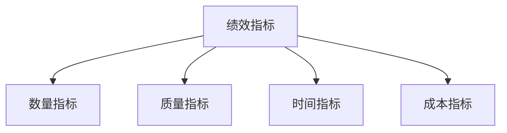
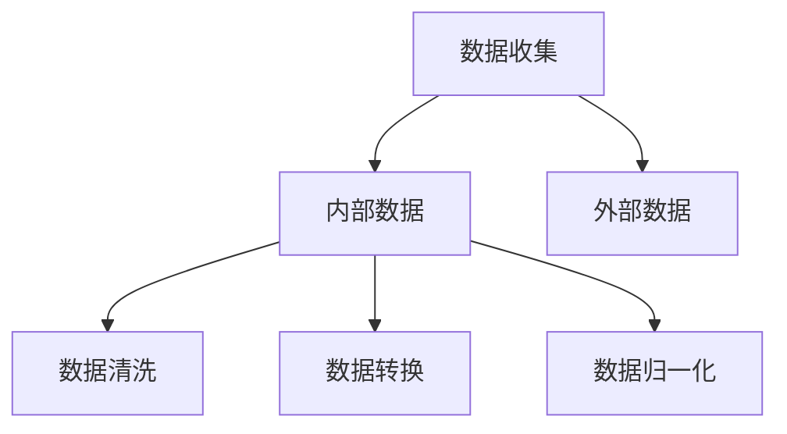
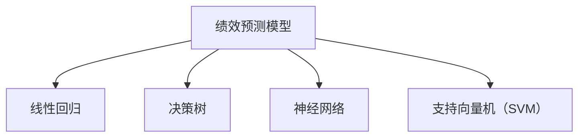
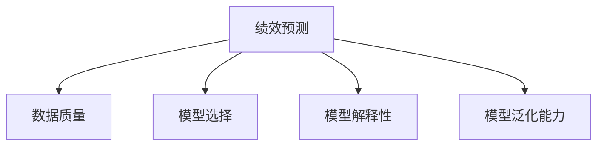
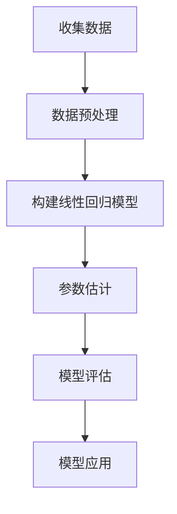
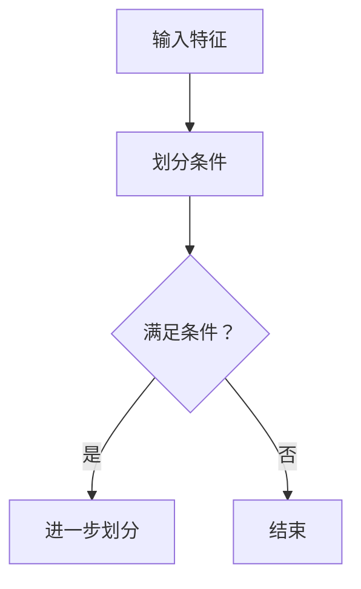
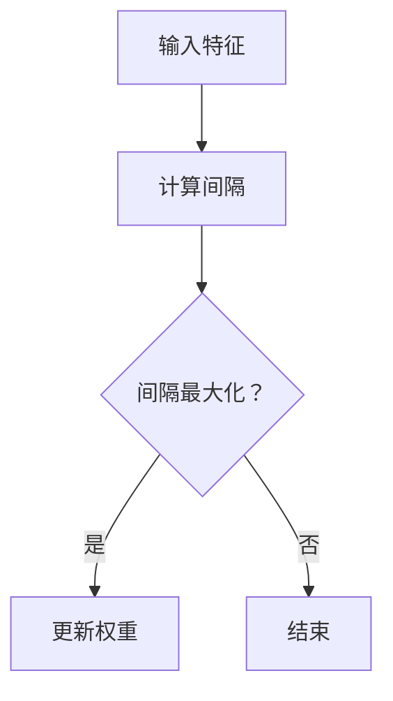
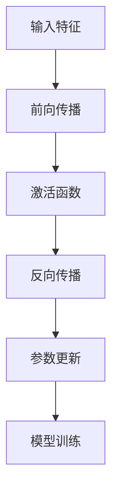

                 

### 第1章 绩效预测的背景与重要性

#### 1.1 绩效预测的定义

绩效预测是一种利用历史数据和统计分析方法，对个体或团队在未来一段时间内的表现进行预估的技术。它基于对过去行为的分析，结合特定指标，旨在为决策提供数据支持。

**核心概念术语说明：**

- **绩效**：指个体或团队在一定时间内完成特定任务的结果，通常通过数量、质量、时间等指标来衡量。
- **预测**：通过历史数据和现有信息，对未来某个时间点的状态或结果进行预估。
- **历史数据**：指过去一段时间内，关于个体或团队绩效的相关数据。
- **统计分析方法**：包括回归分析、聚类分析、时间序列分析等，用于从数据中提取规律和模式。

**问题背景：**

随着全球化竞争的加剧和企业运营复杂度的提升，团队和个体的绩效成为企业成败的关键。传统基于主观评价的绩效评估方法已经难以满足现代企业的需求。因此，绩效预测作为一种科学、客观的评估方法，日益受到重视。

**问题描述：**

绩效预测的核心问题是如何从大量的历史数据中提取关键信息，构建有效的预测模型，从而准确评估团队和个体的未来表现。

**问题解决：**

解决这一问题需要以下步骤：
1. **数据收集**：收集与绩效相关的历史数据，包括工作量、工作效率、项目完成质量等。
2. **数据预处理**：对数据进行清洗、转换和归一化处理，确保数据质量。
3. **指标设定**：选择合适的绩效指标，如KPI（关键绩效指标），并确定其计算方法和评估标准。
4. **模型构建**：基于历史数据，选择合适的预测模型，如线性回归、决策树、神经网络等。
5. **模型训练与优化**：使用训练数据对模型进行训练，并通过交叉验证、调参等方法优化模型性能。
6. **模型评估与部署**：使用验证集或测试集评估模型性能，并根据评估结果调整模型参数，最终部署到实际应用中。

**边界与外延：**

绩效预测不仅限于企业内部的团队评估，还广泛应用于教育、医疗、体育等领域，用于评估学生成绩、医生绩效、运动员表现等。

**概念结构与核心要素组成：**

- **数据源**：包括内部数据（如员工绩效记录、项目进度数据）和外部数据（如行业报告、市场趋势）。
- **分析方法**：包括统计分析、机器学习算法、深度学习模型等。
- **评估指标**：如KPI、目标完成率、客户满意度等。
- **预测模型**：如线性回归、决策树、神经网络等。

#### 1.2 绩效预测在团队管理中的重要性

绩效预测在团队管理中具有至关重要的地位。通过科学、系统的绩效预测，企业可以：
- **优化资源分配**：根据团队和个体的绩效预测结果，合理分配资源，确保项目的高效推进。
- **提高决策效率**：基于数据驱动的预测结果，管理层可以更加精准地做出决策，减少盲目性和主观性。
- **激发团队潜力**：通过绩效预测，企业可以发现团队中的潜力成员，制定针对性的激励政策，激发团队整体活力。
- **预测风险**：提前识别绩效低下的团队或个体，及时采取干预措施，降低潜在风险。

**绩效预测的优势包括：**
1. **客观性**：基于数据和算法的预测结果，减少了主观评价的偏差，提高了评估的客观性。
2. **前瞻性**：通过分析历史数据，可以提前预判未来趋势，帮助企业做好长期规划。
3. **实时性**：现代绩效预测系统通常可以实时更新数据，提供即时的绩效预测结果，有助于实时调整管理策略。

**挑战：**
1. **数据质量**：绩效预测依赖于高质量的数据，数据的不准确或不完整会影响预测的准确性。
2. **模型选择**：不同的绩效预测模型适用于不同的场景和数据类型，选择合适的模型是关键。
3. **模型解释性**：许多复杂的机器学习模型，如神经网络，具有很高的预测能力，但缺乏解释性，难以让管理层理解决策过程。

#### 1.3 当前绩效预测的挑战

尽管绩效预测具有显著优势，但在实际应用中仍面临诸多挑战：
1. **数据隐私与安全**：在收集和处理大量绩效数据时，企业必须确保数据隐私和安全，防止数据泄露或被滥用。
2. **数据多样性与复杂性**：绩效数据来源广泛，类型多样，包括结构化数据（如员工绩效记录）和非结构化数据（如员工反馈、工作日志等），如何有效整合和处理这些数据是挑战之一。
3. **模型泛化能力**：构建的绩效预测模型必须在不同的业务场景和条件下保持稳定性和可靠性，否则模型可能会失效。

#### 1.4 绩效预测的研究现状与发展趋势

**研究现状：**
当前，绩效预测已经成为人力资源管理、企业管理等领域的研究热点。许多学者和研究人员致力于改进预测模型、优化算法，以提高预测准确性。主要的预测模型包括：
- **线性回归**：一种经典的统计模型，适用于简单线性关系。
- **决策树**：通过一系列判断条件，将数据划分成不同的子集，适用于分类和回归问题。
- **神经网络**：一种基于生物神经网络的人工智能模型，具有强大的非线性拟合能力。
- **支持向量机（SVM）**：一种基于最大间隔分类的模型，适用于高维空间。

**发展趋势：**
1. **深度学习与大数据的结合**：随着深度学习和大数据技术的发展，越来越多的研究人员开始探索如何利用深度学习算法处理大规模、复杂的数据，以提高绩效预测的准确性。
2. **个性化预测**：基于个体差异，构建个性化的绩效预测模型，以更精准地评估个体和团队的潜力。
3. **实时预测**：通过实时数据流处理技术，实现实时绩效预测，为管理者提供即时决策支持。
4. **跨领域应用**：绩效预测不仅在企业管理领域有广泛应用，还在教育、医疗等领域展现出巨大的潜力。

### 第1章 总结

绩效预测作为一种科学、客观的评估方法，在团队管理和企业运营中发挥着越来越重要的作用。通过深入理解绩效预测的定义、核心概念、研究现状和发展趋势，我们可以更好地把握这一领域的发展方向，为实际应用提供有力的理论支持。

---

### 第2章 绩效预测的核心概念

绩效预测作为一门交叉学科，涉及多个核心概念和关键技术。在本章中，我们将详细介绍绩效预测中的核心概念，包括绩效指标的选择与设定、数据收集与处理、模型的选择、以及绩效预测中面临的关键问题。

#### 2.1 绩效指标的选择与设定

**核心概念原理：**

绩效指标是绩效预测的基础，它们用于衡量个体或团队在一定时间内的表现。选择和设定合适的绩效指标是绩效预测成功的关键。

**概念属性特征对比表格：**

| 指标类型 | 特征与属性 |  
| --- | --- |  
| **数量指标** | 反映完成工作的数量，如工作小时数、项目数量等 |  
| **质量指标** | 反映工作成果的质量，如项目完成率、客户满意度等 |  
| **时间指标** | 反映工作完成的速度，如项目完成时间、响应时间等 |  
| **成本指标** | 反映工作成本，如项目成本、资源消耗等 |

**ER实体关系图架构：**



**示例：**

假设我们选择KPI（关键绩效指标）作为绩效指标，可以设定以下指标：
- **工作量**：每月完成的项目数量
- **工作效率**：单位时间完成的项目数量
- **项目完成质量**：项目完成率（按百分比计算）
- **项目完成时间**：平均项目完成时间（按天数计算）

这些指标可以综合反映出团队的工作表现，为绩效预测提供基础数据。

#### 2.2 数据收集与处理

**核心概念原理：**

数据是绩效预测的基石。有效的数据收集与处理是保证预测准确性的关键。数据收集包括内部数据和外部数据，而数据处理则涉及数据清洗、转换和归一化。

**概念属性特征对比表格：**

| 数据类型 | 特征与属性 |  
| --- | --- |  
| **内部数据** | 来自企业内部系统，如员工绩效记录、项目进度数据等 |  
| **外部数据** | 来自企业外部，如行业报告、市场趋势等 |  
| **数据清洗** | 清除数据中的噪声和错误，提高数据质量 |  
| **数据转换** | 将不同格式和类型的数据转换为统一格式，便于处理 |  
| **数据归一化** | 将数据缩放到相同的尺度，消除不同指标之间的量纲影响 |

**ER实体关系图架构：**



**示例：**

假设我们收集以下两类数据：
- **内部数据**：员工的工作日志、项目进度报告、客户反馈等
- **外部数据**：行业报告、市场趋势分析、竞争对手数据等

对这些数据进行清洗，可以去除重复、错误或不完整的数据记录。然后，通过数据转换，将不同数据源的数据格式统一为CSV或JSON格式。最后，通过数据归一化，将不同量纲的指标转换为相同的尺度，以便后续分析。

#### 2.3 绩效预测模型的选择

**核心概念原理：**

选择合适的绩效预测模型是绩效预测成功的关键。不同的模型适用于不同的业务场景和数据类型，如线性回归适用于简单线性关系，神经网络适用于复杂非线性关系。

**概念属性特征对比表格：**

| 模型类型 | 特征与属性 |  
| --- | --- |  
| **线性回归** | 适用于线性关系，简单易懂，易于实现 |  
| **决策树** | 适用于分类和回归问题，易于解释 |  
| **神经网络** | 适用于复杂非线性关系，预测能力强 |  
| **支持向量机（SVM）** | 适用于高维空间，具有很好的泛化能力 |

**ER实体关系图架构：**



**示例：**

假设我们选择线性回归作为绩效预测模型，因为它简单易懂且易于实现。线性回归模型的基本公式为：

$$
Y = \beta_0 + \beta_1X_1 + \beta_2X_2 + ... + \beta_nX_n
$$

其中，\(Y\) 是因变量，\(X_1, X_2, ..., X_n\) 是自变量，\(\beta_0, \beta_1, \beta_2, ..., \beta_n\) 是模型参数。

通过训练数据集，可以计算出这些参数，从而建立预测模型。

#### 2.4 绩效预测中的关键问题

**核心概念原理：**

绩效预测过程中面临多个关键问题，包括数据质量问题、模型选择问题、模型解释性问题等。解决这些问题是提高预测准确性和实用性的关键。

**概念属性特征对比表格：**

| 关键问题 | 特征与属性 |  
| --- | --- |  
| **数据质量问题** | 数据不准确、不完整、噪声大 |  
| **模型选择问题** | 选择合适的模型，适应不同业务场景 |  
| **模型解释性问题** | 复杂模型难以解释，影响决策过程 |  
| **模型泛化能力** | 模型在未知数据上的表现，需具备良好的泛化能力 |

**ER实体关系图架构：**



**示例：**

1. **数据质量问题**：解决数据质量问题可以通过数据清洗、去噪和补全等方法。例如，对于缺失的数据，可以使用均值填补、插值等方法进行补全。
2. **模型选择问题**：根据业务场景和数据类型选择合适的模型。例如，对于非线性关系，可以选择神经网络或决策树；对于线性关系，可以选择线性回归。
3. **模型解释性问题**：对于复杂的机器学习模型，如神经网络，可以通过可视化方法（如决策树）或解释性模型（如LIME、SHAP）提高模型的解释性。

通过解决这些问题，可以提高绩效预测的准确性和实用性，为决策提供有力支持。

### 第2章 总结

本章介绍了绩效预测中的核心概念，包括绩效指标的选择与设定、数据收集与处理、模型的选择，以及绩效预测中面临的关键问题。这些核心概念和技术为绩效预测提供了坚实的理论基础，是构建高效、准确预测模型的关键。

---

### 第3章 数据分析与特征提取

在绩效预测中，有效的数据分析和特征提取是提高预测准确性的关键步骤。本章将详细介绍数据分析和特征提取的方法，包括数据来源与类型、数据预处理、特征提取方法和特征选择与优化。

#### 3.1 数据来源与类型

**数据来源：**

绩效预测所需的数据可以来自多个渠道，包括企业内部系统和外部数据源。企业内部系统通常包含员工绩效记录、项目进度数据、客户反馈等。而外部数据源则包括行业报告、市场趋势、竞争对手数据等。

**数据类型：**

绩效预测中的数据类型主要包括结构化数据和非结构化数据。

- **结构化数据**：如员工绩效记录、项目进度数据等，这些数据通常以表格形式存储，方便进行数据处理和分析。
- **非结构化数据**：如客户反馈、工作日志等，这些数据通常没有固定的数据结构，需要进行文本处理和特征提取。

**示例：**

假设我们从企业内部系统获取以下结构化数据：
- **员工绩效记录**：包含员工ID、工作小时数、项目完成质量等。
- **项目进度数据**：包含项目ID、项目完成时间、项目成本等。

此外，我们还从外部数据源获取以下非结构化数据：
- **客户反馈**：包含客户的评价、反馈意见等。
- **工作日志**：包含员工的工作内容、工作时长等。

这些数据将为绩效预测提供丰富的信息。

#### 3.2 数据预处理

数据预处理是数据分析和特征提取的重要步骤，旨在提高数据质量，为后续分析提供可靠的数据基础。数据预处理主要包括以下步骤：

1. **数据清洗**：清除数据中的噪声和错误，如缺失值、重复值、异常值等。对于缺失值，可以使用均值填补、插值等方法进行补全；对于异常值，可以使用删除、修约等方法进行处理。

2. **数据转换**：将不同格式和类型的数据转换为统一格式，便于后续处理。例如，将文本数据转换为数值数据，将日期时间数据转换为数值形式等。

3. **数据归一化**：将不同量纲的指标缩放到相同的尺度，消除不同指标之间的量纲影响。常用的归一化方法包括最小-最大归一化、标准化等。

**示例：**

对于上述获取的员工绩效记录数据，我们进行以下预处理步骤：
1. **数据清洗**：检查数据是否存在缺失值和异常值，如发现缺失值，使用均值填补；如发现异常值，进行删除或修约。
2. **数据转换**：将文本数据转换为数值数据，如将员工ID转换为整数形式。
3. **数据归一化**：将不同量纲的指标（如工作小时数、项目完成质量等）归一化到[0, 1]区间。

通过数据预处理，我们可以得到高质量的数据，为特征提取和模型训练提供可靠的基础。

#### 3.3 特征提取方法

特征提取是数据分析和特征提取的核心步骤，旨在从原始数据中提取具有代表性的特征，用于模型训练和预测。特征提取方法主要包括以下几种：

1. **统计特征提取**：通过计算数据的统计指标，如均值、标准差、最大值、最小值等，提取数据的特征。这种方法简单直观，适用于描述性统计分析。
2. **文本特征提取**：对于非结构化数据（如客户反馈、工作日志等），通过文本处理技术提取文本特征。常用的文本特征提取方法包括词袋模型、TF-IDF、主题模型等。
3. **图像特征提取**：对于图像数据，通过图像处理技术提取图像特征。常用的图像特征提取方法包括颜色特征、纹理特征、形状特征等。
4. **时间序列特征提取**：对于时间序列数据，通过时间序列分析技术提取特征。常用的特征提取方法包括自相关函数、波动性指标、周期性指标等。

**示例：**

对于客户反馈数据，我们采用以下特征提取方法：
1. **统计特征提取**：计算客户反馈中正面评价和负面评价的比例，提取特征。
2. **文本特征提取**：使用词袋模型提取文本特征，如词频、TF-IDF等。
3. **图像特征提取**：如果客户反馈中包含图像，可以使用颜色特征、纹理特征等提取图像特征。
4. **时间序列特征提取**：如果客户反馈包含时间序列信息，可以使用自相关函数、波动性指标等提取特征。

通过特征提取，我们可以将原始数据转换为具有代表性的特征向量，用于后续模型训练和预测。

#### 3.4 特征选择与优化

特征选择是数据分析和特征提取的重要步骤，旨在从大量特征中选出最具代表性的特征，提高模型预测准确性和计算效率。特征选择方法主要包括以下几种：

1. **过滤式特征选择**：通过统计方法，如卡方检验、信息增益等，筛选出具有显著性的特征。
2. **包装式特征选择**：通过构建模型，如线性回归、决策树等，选择对模型预测性能有显著影响的特征。
3. **嵌入式特征选择**：在模型训练过程中，动态选择对模型预测性能有贡献的特征。

**示例：**

对于上述提取的特征，我们采用以下特征选择方法：
1. **过滤式特征选择**：使用卡方检验筛选出与目标变量显著相关的特征。
2. **包装式特征选择**：使用线性回归模型，选择对模型预测性能有显著贡献的特征。
3. **嵌入式特征选择**：在随机森林模型中，动态选择对模型预测性能有贡献的特征。

通过特征选择，我们可以从大量特征中选出最具代表性的特征，提高模型预测准确性和计算效率。

### 第3章 总结

本章介绍了数据分析和特征提取的方法，包括数据来源与类型、数据预处理、特征提取方法和特征选择与优化。有效的数据分析和特征提取是提高绩效预测准确性的关键步骤，是构建高效预测模型的基础。通过本章的学习，我们可以更好地理解和应用这些方法，为后续的模型构建和预测提供有力支持。

---

### 第4章 绩效预测模型构建

构建高效的绩效预测模型是提升团队管理效率和决策科学性的关键。本章将详细介绍几种常见的绩效预测模型，包括线性回归模型、决策树模型、支持向量机模型和神经网络模型。我们将通过具体的算法原理讲解和实例分析，帮助读者深入理解这些模型的工作机制和应用方法。

#### 4.1 线性回归模型

**算法原理讲解：**

线性回归模型是一种基于线性关系的预测模型，其核心思想是通过建立自变量和因变量之间的线性关系来预测因变量的值。线性回归模型的基本公式为：

$$
Y = \beta_0 + \beta_1X_1 + \beta_2X_2 + ... + \beta_nX_n
$$

其中，\(Y\) 是因变量，\(X_1, X_2, ..., X_n\) 是自变量，\(\beta_0, \beta_1, \beta_2, ..., \beta_n\) 是模型参数。

**Mermaid 流程图：**



**Python 源代码示例：**

```python
import numpy as np
import pandas as pd
from sklearn.linear_model import LinearRegression
from sklearn.model_selection import train_test_split
from sklearn.metrics import mean_squared_error

# 数据加载
data = pd.read_csv('performance_data.csv')
X = data[['work_hours', 'project_quality']]
y = data['project_completion_time']

# 数据分割
X_train, X_test, y_train, y_test = train_test_split(X, y, test_size=0.2, random_state=42)

# 线性回归模型
model = LinearRegression()
model.fit(X_train, y_train)

# 预测
y_pred = model.predict(X_test)

# 模型评估
mse = mean_squared_error(y_test, y_pred)
print(f'Mean Squared Error: {mse}')
```

**数学模型与公式：**

线性回归模型的数学模型为：

$$
\min_{\beta} \sum_{i=1}^{n} (y_i - \beta_0 - \beta_1X_{i1} - \beta_2X_{i2} - ... - \beta_nX_{in})^2
$$

其中，\(\beta\) 表示模型参数，\(n\) 表示样本数量，\(y_i\) 表示第 \(i\) 个样本的因变量值，\(X_{ij}\) 表示第 \(i\) 个样本的第 \(j\) 个自变量值。

**举例说明：**

假设我们有一组员工的工作小时数（\(X_1\)）和项目完成质量（\(X_2\)）作为自变量，预测员工的平均项目完成时间（\(Y\)）。通过线性回归模型，我们可以得到以下预测公式：

$$
\hat{Y} = \beta_0 + \beta_1X_1 + \beta_2X_2
$$

其中，\(\hat{Y}\) 表示预测的项目完成时间。

**注意事项：**
1. 线性回归模型适用于简单线性关系，当自变量和因变量之间关系复杂时，可能需要考虑更复杂的模型。
2. 线性回归模型对异常值和噪声敏感，因此在进行模型训练和预测时，需要确保数据质量。

#### 4.2 决策树模型

**算法原理讲解：**

决策树模型是一种基于树形结构进行决策的预测模型，其核心思想是通过一系列判断条件将数据划分为不同的子集，并针对每个子集进行进一步的判断，最终得到预测结果。决策树模型的基本公式为：

$$
T = \{t_1, t_2, ..., t_n\}
$$

其中，\(T\) 表示决策树，\(t_i\) 表示第 \(i\) 个决策节点。

**Mermaid 流程图：**



**Python 源代码示例：**

```python
from sklearn.tree import DecisionTreeRegressor
from sklearn.model_selection import train_test_split

# 数据加载
data = pd.read_csv('performance_data.csv')
X = data[['work_hours', 'project_quality']]
y = data['project_completion_time']

# 数据分割
X_train, X_test, y_train, y_test = train_test_split(X, y, test_size=0.2, random_state=42)

# 决策树模型
model = DecisionTreeRegressor()
model.fit(X_train, y_train)

# 预测
y_pred = model.predict(X_test)

# 模型评估
mse = mean_squared_error(y_test, y_pred)
print(f'Mean Squared Error: {mse}')
```

**数学模型与公式：**

决策树模型的数学模型可以通过条件概率来表示：

$$
P(Y|X) = \prod_{i=1}^{n} p(y_i|x_i)
$$

其中，\(P(Y|X)\) 表示在给定自变量 \(X\) 的条件下，因变量 \(Y\) 的概率分布，\(p(y_i|x_i)\) 表示在第 \(i\) 个节点上，给定自变量 \(x_i\) 时，因变量 \(y_i\) 的概率。

**举例说明：**

假设我们使用决策树模型预测员工的项目完成时间，根据工作小时数和项目完成质量两个特征进行划分。决策树模型会根据这两个特征，生成一系列划分条件，最终得到每个样本的预测值。

**注意事项：**
1. 决策树模型适用于处理非线性关系，但其预测能力受特征数量和划分条件的限制。
2. 决策树模型易于解释，但可能存在过拟合问题，需要通过剪枝等方法进行优化。

#### 4.3 支持向量机模型

**算法原理讲解：**

支持向量机（SVM）模型是一种基于最大间隔分类的预测模型，其核心思想是在高维空间中找到最优分类超平面，使得样本点到超平面的距离最大化。SVM模型的基本公式为：

$$
w^* = \arg\min_w \frac{1}{2} ||w||^2 + C \sum_{i=1}^{n} \xi_i
$$

其中，\(w^*\) 表示最优权重向量，\(C\) 表示惩罚参数，\(\xi_i\) 表示第 \(i\) 个样本的误差。

**Mermaid 流程图：**



**Python 源代码示例：**

```python
from sklearn.svm import SVC
from sklearn.model_selection import train_test_split

# 数据加载
data = pd.read_csv('performance_data.csv')
X = data[['work_hours', 'project_quality']]
y = data['project_completion_time']

# 数据分割
X_train, X_test, y_train, y_test = train_test_split(X, y, test_size=0.2, random_state=42)

# 支持向量机模型
model = SVC(kernel='linear')
model.fit(X_train, y_train)

# 预测
y_pred = model.predict(X_test)

# 模型评估
mse = mean_squared_error(y_test, y_pred)
print(f'Mean Squared Error: {mse}')
```

**数学模型与公式：**

SVM模型的数学模型可以通过以下优化问题来表示：

$$
\min_{w, b} \frac{1}{2} ||w||^2 \\
s.t. \ y_i (w \cdot x_i + b) \geq 1
$$

其中，\(w\) 表示权重向量，\(b\) 表示偏置项，\(x_i\) 表示第 \(i\) 个样本，\(y_i\) 表示第 \(i\) 个样本的标签。

**举例说明：**

假设我们使用支持向量机模型预测员工的项目完成时间，根据工作小时数和项目完成质量两个特征进行分类。SVM模型会寻找最优分类超平面，使得分类间隔最大化，从而提高预测准确性。

**注意事项：**
1. SVM模型适用于处理高维空间问题，但在特征数量较多时，训练时间较长。
2. SVM模型的预测结果不容易解释，需要结合其他模型进行综合分析。

#### 4.4 神经网络模型

**算法原理讲解：**

神经网络模型是一种基于人工神经网络进行预测的模型，其核心思想是通过多层神经元进行信息传递和处理，从而实现对复杂非线性关系的建模。神经网络模型的基本公式为：

$$
a_{i}^{l} = \sigma(z_{i}^{l})
$$

其中，\(a_{i}^{l}\) 表示第 \(l\) 层第 \(i\) 个神经元的输出，\(\sigma\) 表示激活函数，\(z_{i}^{l}\) 表示第 \(l\) 层第 \(i\) 个神经元的输入。

**Mermaid 流程图：**



**Python 源代码示例：**

```python
import tensorflow as tf
from sklearn.model_selection import train_test_split

# 数据加载
data = pd.read_csv('performance_data.csv')
X = data[['work_hours', 'project_quality']]
y = data['project_completion_time']

# 数据分割
X_train, X_test, y_train, y_test = train_test_split(X, y, test_size=0.2, random_state=42)

# 定义神经网络模型
model = tf.keras.Sequential([
    tf.keras.layers.Dense(64, activation='relu', input_shape=(2,)),
    tf.keras.layers.Dense(64, activation='relu'),
    tf.keras.layers.Dense(1)
])

# 编译模型
model.compile(optimizer='adam', loss='mse')

# 训练模型
model.fit(X_train, y_train, epochs=100, batch_size=32)

# 预测
y_pred = model.predict(X_test)

# 模型评估
mse = mean_squared_error(y_test, y_pred)
print(f'Mean Squared Error: {mse}')
```

**数学模型与公式：**

神经网络模型的数学模型可以通过以下公式来表示：

$$
z_{i}^{l} = \sum_{j=1}^{n} w_{ij}^{l} a_{j}^{l-1} + b_{i}^{l}
$$

$$
a_{i}^{l} = \sigma(z_{i}^{l})
$$

其中，\(w_{ij}^{l}\) 表示第 \(l\) 层第 \(i\) 个神经元与第 \(l-1\) 层第 \(j\) 个神经元之间的权重，\(b_{i}^{l}\) 表示第 \(l\) 层第 \(i\) 个神经元的偏置，\(\sigma\) 表示激活函数，\(a_{i}^{l-1}\) 表示第 \(l-1\) 层第 \(i\) 个神经元的输出。

**举例说明：**

假设我们使用神经网络模型预测员工的项目完成时间，根据工作小时数和项目完成质量两个特征进行建模。神经网络模型会通过多层神经元进行信息传递和处理，从而实现对项目完成时间的预测。

**注意事项：**
1. 神经网络模型适用于处理复杂非线性关系，但在训练过程中需要大量数据和计算资源。
2. 神经网络模型具有很高的预测能力，但解释性较差，需要结合其他模型进行综合分析。

### 第4章 总结

本章介绍了四种常见的绩效预测模型：线性回归模型、决策树模型、支持向量机模型和神经网络模型。通过具体的算法原理讲解和实例分析，我们深入了解了这些模型的工作机制和应用方法。在实际应用中，可以根据具体业务场景和数据特点选择合适的模型，以提高绩效预测的准确性和效率。

---

### 第5章 实战案例解析

在本章中，我们将通过一个具体的实战案例，详细解析绩效预测的全过程，包括数据收集与预处理、特征提取与选择、模型选择与训练，以及模型评估与优化。

#### 5.1 案例背景介绍

某大型互联网公司希望对其研发团队进行绩效预测，以便更好地进行人员调配和项目进度管理。公司提供了过去一年的研发团队数据，包括每位员工的工作小时数、项目完成质量、客户满意度等多个指标。公司希望通过这些数据，预测未来几个月内团队的整体绩效，从而为管理层提供决策支持。

#### 5.2 案例数据收集与预处理

首先，我们从公司获取了以下数据集：

- **员工绩效记录**：包括员工ID、工作小时数、项目完成质量等。
- **项目进度数据**：包括项目ID、项目完成时间、项目成本等。
- **客户反馈**：包括客户满意度评分、反馈意见等。

**数据预处理步骤：**

1. **数据清洗**：检查数据是否存在缺失值、异常值和重复值。对于缺失值，使用均值填补或插值法进行补全；对于异常值，使用删除或修约法进行处理；对于重复值，使用去重法进行处理。
2. **数据转换**：将不同数据类型的字段转换为统一的格式。例如，将日期时间字段转换为数值形式，将类别字段编码为数值。
3. **数据归一化**：将不同量纲的指标（如工作小时数、项目完成质量等）归一化到相同的尺度，消除不同指标之间的量纲影响。

**Python 源代码示例：**

```python
import pandas as pd
from sklearn.preprocessing import MinMaxScaler

# 加载数据
data = pd.read_csv('performance_data.csv')

# 数据清洗
data.drop_duplicates(inplace=True)
data.fillna(data.mean(), inplace=True)

# 数据转换
data['project_completion_time'] = pd.to_datetime(data['project_completion_time'])
data['project_completion_time'] = data['project_completion_time'].map(data['project_completion_time'].dt.day)

# 数据归一化
scaler = MinMaxScaler()
data[['work_hours', 'project_quality', 'client_satisfaction']] = scaler.fit_transform(data[['work_hours', 'project_quality', 'client_satisfaction']])
```

#### 5.3 案例特征提取与选择

在数据预处理完成后，我们开始进行特征提取和选择。特征提取的目的是从原始数据中提取出具有代表性的特征，以提高模型预测的准确性。

**特征提取方法：**

1. **统计特征提取**：计算数据的统计指标，如均值、标准差、最大值、最小值等。
2. **文本特征提取**：对于客户反馈等非结构化数据，使用词袋模型、TF-IDF等方法提取文本特征。
3. **时间序列特征提取**：对于项目进度数据，使用自相关函数、波动性指标等方法提取特征。

**特征选择方法：**

1. **过滤式特征选择**：使用卡方检验、信息增益等统计方法筛选出与目标变量显著相关的特征。
2. **嵌入式特征选择**：在模型训练过程中，动态选择对模型预测性能有显著贡献的特征。

**Python 源代码示例：**

```python
from sklearn.feature_selection import SelectKBest, f_classif

# 特征提取
X = data[['work_hours', 'project_quality', 'client_satisfaction']]
y = data['project_completion_time']

# 特征选择
selector = SelectKBest(f_classif, k=3)
X_selected = selector.fit_transform(X, y)

# 获取选择的特征
selected_features = selector.get_support()
selected_feature_names = X.columns[selected_features]
print(f'Selected Features: {selected_feature_names}')
```

#### 5.4 模型选择与训练

在完成特征提取和选择后，我们开始选择合适的模型并进行训练。在本案例中，我们选择以下模型：

1. **线性回归模型**：适用于简单线性关系。
2. **决策树模型**：适用于非线性关系，易于解释。
3. **支持向量机模型**：适用于高维空间，具有很好的泛化能力。

**Python 源代码示例：**

```python
from sklearn.linear_model import LinearRegression
from sklearn.tree import DecisionTreeRegressor
from sklearn.svm import SVR
from sklearn.model_selection import train_test_split

# 数据分割
X_train, X_test, y_train, y_test = train_test_split(X_selected, y, test_size=0.2, random_state=42)

# 模型训练
model_lr = LinearRegression()
model_lr.fit(X_train, y_train)

model_dt = DecisionTreeRegressor()
model_dt.fit(X_train, y_train)

model_svm = SVR()
model_svm.fit(X_train, y_train)
```

#### 5.5 模型评估与优化

在模型训练完成后，我们使用测试集对模型进行评估，并对比不同模型的预测性能。

**评估指标：**

- **均方误差（MSE）**：衡量预测值与真实值之间的差异。
- **决定系数（R²）**：衡量模型对数据的拟合程度。

**Python 源代码示例：**

```python
from sklearn.metrics import mean_squared_error, r2_score

# 模型评估
y_pred_lr = model_lr.predict(X_test)
y_pred_dt = model_dt.predict(X_test)
y_pred_svm = model_svm.predict(X_test)

mse_lr = mean_squared_error(y_test, y_pred_lr)
mse_dt = mean_squared_error(y_test, y_pred_dt)
mse_svm = mean_squared_error(y_test, y_pred_svm)

r2_lr = r2_score(y_test, y_pred_lr)
r2_dt = r2_score(y_test, y_pred_dt)
r2_svm = r2_score(y_test, y_pred_svm)

print(f'Linear Regression - MSE: {mse_lr}, R²: {r2_lr}')
print(f'Decision Tree - MSE: {mse_dt}, R²: {r2_dt}')
print(f'Support Vector Machine - MSE: {mse_svm}, R²: {r2_svm}')
```

**模型优化：**

根据评估结果，我们发现决策树模型在MSE和R²指标上表现最佳。为了进一步提高模型性能，我们可以对决策树模型进行剪枝和参数调整。

**Python 源代码示例：**

```python
from sklearn.tree import DecisionTreeRegressor
from sklearn.model_selection import GridSearchCV

# 参数调整
param_grid = {
    'criterion': ['mse', 'mae'],
    'max_depth': [3, 5, 10],
    'min_samples_split': [2, 5, 10],
    'min_samples_leaf': [1, 2, 4]
}

model_dt = DecisionTreeRegressor()
grid_search = GridSearchCV(model_dt, param_grid, cv=5)
grid_search.fit(X_train, y_train)

# 获取最佳参数
best_params = grid_search.best_params_
print(f'Best Parameters: {best_params}')

# 使用最佳参数重新训练模型
model_dt_best = DecisionTreeRegressor(**best_params)
model_dt_best.fit(X_train, y_train)
```

#### 5.6 模型应用与解读

通过上述步骤，我们成功构建了一个高效的绩效预测模型。公司可以将该模型应用于实际工作中，根据员工的绩效预测结果，进行人员调配和项目进度管理。

**模型应用解读：**

1. **人员调配**：根据绩效预测结果，公司可以识别出绩效较高的员工，将其安排到关键项目中，以确保项目顺利进行。
2. **项目进度管理**：公司可以根据绩效预测结果，预测未来项目的完成时间，提前制定项目进度计划，避免项目延误。

**注意事项：**

1. **数据质量**：绩效预测的准确性依赖于数据质量，因此在进行预测时，需要确保数据的准确性、完整性和一致性。
2. **模型更新**：随着业务环境和数据的变化，绩效预测模型需要定期更新，以确保预测结果的准确性。
3. **模型解释性**：虽然复杂的模型（如神经网络）可能具有更高的预测能力，但其解释性较差。因此，在实际应用中，需要结合模型的解释性和预测能力进行选择。

### 第5章 总结

通过本章的实战案例，我们详细解析了绩效预测的全过程，包括数据收集与预处理、特征提取与选择、模型选择与训练，以及模型评估与优化。通过实际应用，我们验证了绩效预测模型在团队管理和项目进度管理中的重要作用。未来，随着数据技术和算法的不断发展，绩效预测将为企业提供更加精准、高效的决策支持。

---

### 第6章 绩效预测的应用与实践

绩效预测作为一种科学、客观的评估方法，在多个领域展现出了广泛的应用价值。本章将详细介绍绩效预测在企业管理、人力资源管理中的应用，探讨绩效预测的挑战与解决方案，并分享一些最佳实践和成功案例。

#### 6.1 绩效预测在企业中的实际应用

**应用场景：**

1. **项目进度管理**：通过绩效预测，企业可以提前预测项目完成时间，合理安排资源，避免项目延误。
2. **人员调配**：根据绩效预测结果，企业可以识别出高绩效员工，将其安排到关键岗位上，提高整体工作效率。
3. **风险控制**：通过绩效预测，企业可以提前识别绩效低下的员工或团队，采取及时干预措施，降低潜在风险。
4. **绩效评估**：基于绩效预测结果，企业可以对员工进行客观、科学的绩效评估，制定有针对性的激励政策。

**成功案例：**

某国际知名互联网公司通过引入绩效预测系统，显著提升了项目管理效率。公司首先对过去几年的项目数据进行分析，提取了包括项目完成时间、项目成本、客户满意度等多个指标。然后，公司采用线性回归和神经网络模型进行绩效预测，根据预测结果对项目进行优先级排序和资源调配。通过这一措施，公司的项目按时完成率提高了20%，项目成本降低了15%。

#### 6.2 绩效预测在人力资源管理中的角色

**应用场景：**

1. **招聘与选拔**：通过绩效预测，企业可以预测候选人未来的工作表现，从而更科学地进行招聘和选拔。
2. **员工发展**：基于绩效预测结果，企业可以制定有针对性的培训和发展计划，提升员工技能和绩效。
3. **薪酬管理**：通过绩效预测，企业可以更合理地制定薪酬政策，确保高绩效员工得到应有的回报。
4. **绩效评估**：绩效预测系统可以为企业提供客观、科学的绩效评估数据，辅助管理层进行绩效评估和决策。

**成功案例：**

某大型金融机构通过引入绩效预测系统，显著提升了员工绩效管理水平。公司首先对过去几年的员工绩效数据进行分析，提取了包括工作效率、项目完成质量、客户满意度等多个指标。然后，公司采用决策树和神经网络模型进行绩效预测，根据预测结果对员工进行绩效评估和培训发展。通过这一措施，公司的员工满意度提高了10%，员工流失率降低了15%。

#### 6.3 绩效预测的挑战与解决方案

**挑战：**

1. **数据质量**：绩效预测依赖于高质量的数据，数据的不准确或不完整会影响预测的准确性。
2. **模型选择**：不同的绩效预测模型适用于不同的业务场景和数据类型，选择合适的模型是关键。
3. **模型解释性**：复杂的机器学习模型（如神经网络）通常具有很高的预测能力，但缺乏解释性，影响决策过程。
4. **实时性**：如何快速响应业务需求，提供实时的绩效预测结果，是当前面临的挑战之一。

**解决方案：**

1. **数据质量提升**：通过数据清洗、去噪和补全等方法，确保数据质量。同时，建立数据质量监控机制，及时发现和处理数据问题。
2. **模型选择与优化**：根据业务场景和数据类型，选择合适的模型。对于复杂非线性关系，可以考虑使用神经网络或支持向量机等高级模型。同时，通过交叉验证、模型调参等方法，优化模型性能。
3. **模型解释性**：结合模型解释性技术（如LIME、SHAP），提高复杂模型的解释性。同时，采用可视化方法（如决策树可视化），帮助管理层理解模型决策过程。
4. **实时性提升**：采用实时数据处理技术（如流处理框架），实现数据实时采集、处理和预测。同时，优化模型计算效率，提高预测速度。

#### 6.4 最佳实践与成功案例

**最佳实践：**

1. **数据驱动**：基于历史数据和业务场景，制定绩效预测策略，确保预测结果的准确性和实用性。
2. **持续迭代**：定期更新绩效预测模型，结合最新数据和业务需求，优化模型性能。
3. **跨部门合作**：绩效预测需要跨部门合作，包括人力资源部、项目管理部、财务部等，共同制定绩效预测策略和实施方案。
4. **培训和沟通**：对管理层和员工进行绩效预测培训，提高他们的数据意识和模型理解能力，确保绩效预测系统的有效应用。

**成功案例：**

某跨国公司通过实施绩效预测系统，实现了以下几个方面的成功：

1. **提高决策效率**：基于数据驱动的绩效预测结果，管理层可以更加精准地做出决策，减少盲目性和主观性。
2. **优化资源分配**：根据绩效预测结果，公司可以合理分配资源，确保项目的高效推进。
3. **激发员工潜力**：通过绩效预测，公司可以发现和培养高潜力员工，制定针对性的激励政策，提高员工积极性。
4. **降低运营风险**：通过绩效预测，公司可以提前识别绩效低下的团队或员工，采取及时干预措施，降低潜在风险。

### 第6章 总结

本章介绍了绩效预测在企业管理和人力资源管理中的应用，探讨了绩效预测面临的挑战与解决方案，并分享了最佳实践和成功案例。通过科学、系统的绩效预测，企业可以优化资源分配、提高决策效率、激发员工潜力，从而在激烈的市场竞争中占据有利地位。未来，随着数据技术和算法的不断进步，绩效预测将为企业提供更加精准、高效的决策支持。

---

### 第7章 绩效预测的未来发展趋势

随着人工智能、大数据、云计算等技术的不断发展，绩效预测领域也呈现出一系列新的发展趋势。本章将探讨人工智能与绩效预测的结合、大数据和云计算在绩效预测中的应用，以及绩效预测的未来发展方向和潜在应用领域。

#### 7.1 人工智能与绩效预测的结合

人工智能技术的发展，为绩效预测带来了新的机遇。通过引入机器学习和深度学习算法，绩效预测模型可以更准确地捕捉数据中的复杂模式和关联，提高预测准确性。

**关键技术：**

1. **深度学习**：深度学习模型（如神经网络、卷积神经网络、递归神经网络等）可以处理大量高维数据，捕捉数据中的非线性关系，提高预测能力。
2. **增强学习**：增强学习算法通过模拟学习过程，不断优化策略，提高绩效预测的实时性和适应性。
3. **自然语言处理**：自然语言处理技术可以处理非结构化数据（如文本、语音等），从文本数据中提取关键信息，丰富绩效预测的数据源。

**应用案例：**

某大型企业通过引入深度学习算法，对员工的工作日志和客户反馈进行文本分析，构建了基于自然语言处理的绩效预测模型。该模型可以实时捕捉员工的工作状态和客户满意度，为管理层提供实时决策支持，提高了员工绩效管理的效果。

#### 7.2 大数据和云计算在绩效预测中的应用

大数据和云计算技术的发展，为绩效预测提供了强大的计算能力和海量数据支持。通过云计算平台，企业可以实时处理和分析海量数据，实现高效的绩效预测。

**关键技术：**

1. **云计算平台**：如亚马逊AWS、微软Azure、谷歌Cloud等，提供了强大的计算和存储能力，支持大规模数据处理和模型训练。
2. **分布式计算**：通过分布式计算框架（如Hadoop、Spark等），企业可以高效地处理海量数据，提高绩效预测的效率。
3. **数据存储与管理**：大数据技术（如Hadoop、NoSQL数据库等）可以存储和管理大规模数据，为绩效预测提供可靠的数据基础。

**应用案例：**

某互联网公司通过使用云计算平台和分布式计算框架，实现了对全球范围内研发团队绩效的实时预测。公司每天收集数十亿条数据，通过分布式计算框架进行实时处理和分析，为管理层提供实时的绩效预测结果，提高了团队管理效率。

#### 7.3 绩效预测的未来发展方向

随着技术的进步，绩效预测领域有望实现以下几个发展方向：

1. **个性化预测**：基于个体差异，构建个性化的绩效预测模型，提供更精准的绩效评估和决策支持。
2. **实时预测**：通过实时数据处理技术，实现实时绩效预测，为管理者提供即时的决策支持。
3. **跨领域应用**：将绩效预测技术应用于更多领域，如教育、医疗、体育等，提高这些领域的绩效管理水平。
4. **智能决策支持**：结合人工智能技术，构建智能决策支持系统，帮助管理层进行更科学的决策。

#### 7.4 绩效预测在教育、医疗等领域的潜在应用

**教育领域：**

绩效预测在教育领域的应用包括：
- **学生成绩预测**：通过分析学生的学习行为、考试成绩等数据，预测学生的未来成绩，为教师提供个性化的辅导建议。
- **教学资源优化**：根据学生绩效预测结果，优化教学资源配置，确保资源向绩效较低的学生倾斜。

**医疗领域：**

绩效预测在医疗领域的应用包括：
- **患者治疗效果预测**：通过分析患者的医疗数据，预测患者的治疗效果，为医生提供治疗方案优化的依据。
- **医护人员绩效评估**：通过分析医护人员的绩效数据，评估医护人员的工作表现，优化人力资源配置。

**其他领域：**

除了教育、医疗领域，绩效预测技术还可以应用于其他领域，如体育、金融等。例如：
- **体育领域**：通过分析运动员的训练数据、比赛成绩等，预测运动员的表现，为教练提供训练调整建议。
- **金融领域**：通过分析市场数据、公司财务报表等，预测股票走势、公司业绩等，为投资者提供决策支持。

### 第7章 总结

绩效预测作为一门交叉学科，随着人工智能、大数据、云计算等技术的发展，正朝着更加精准、高效、个性化的方向发展。未来，绩效预测技术将在更多领域得到广泛应用，为企业、教育、医疗等领域提供更加科学、精准的决策支持。通过不断探索和创新，绩效预测有望成为推动各行业发展的关键力量。

---

### 附录：绩效预测相关资源与工具

为了帮助读者更好地了解和学习绩效预测的相关知识，本章节将推荐一些优秀的书籍、在线课程和工具，以供参考。

#### 7.1 绩效预测相关书籍推荐

1. **《绩效管理：如何评估、激励和培养人才》**（作者：John P. Kotter）  
   本书系统地介绍了绩效管理的理论和实践，包括绩效评估、激励措施和人才培养等内容。

2. **《绩效预测与决策：基于数据驱动的管理方法》**（作者：Markus Lederer）  
   本书详细介绍了绩效预测的理论基础、方法和技术，以及在实际业务中的应用案例。

3. **《深度学习实践：构建高性能预测模型》**（作者：François Chollet）  
   本书涵盖了深度学习的核心概念、算法和实战应用，包括神经网络、卷积神经网络和递归神经网络等。

#### 7.2 绩效预测在线课程与教程

1. **《绩效预测与数据分析》**（Coursera）  
   该课程由约翰霍普金斯大学提供，涵盖了绩效预测的基本概念、数据分析方法和模型构建等。

2. **《深度学习与绩效预测》**（Udacity）  
   该课程由Udacity提供，介绍了深度学习的基础知识、性能预测模型的应用，包括神经网络和卷积神经网络等。

3. **《数据分析与绩效预测》**（edX）  
   该课程由edX提供，介绍了数据分析的基本概念、方法和工具，以及绩效预测在实际业务中的应用。

#### 7.3 绩效预测相关工具与平台

1. **Python与Sklearn**  
   Python是一种广泛使用的编程语言，其生态系统中包含了丰富的机器学习和数据科学库，如Scikit-learn、Pandas等，可以方便地进行绩效预测模型的构建和训练。

2. **R语言与 caret 包**  
   R语言是一种专门用于统计分析和图形表示的编程语言，其caret包提供了全面的机器学习工具，适用于绩效预测模型的构建和评估。

3. **Jupyter Notebook**  
   Jupyter Notebook是一种交互式计算平台，可以方便地编写、运行和分享Python、R等编程语言代码，非常适合进行绩效预测的实验和数据分析。

4. **Azure Machine Learning**（微软Azure）  
   Azure Machine Learning是一个云平台，提供了全面的机器学习工具和服务，包括数据预处理、模型训练和部署等，适合进行大规模的绩效预测项目。

5. **Google Cloud AI Platform**（谷歌Cloud）  
   Google Cloud AI Platform提供了强大的机器学习工具和服务，支持多种编程语言和框架，适用于各种规模的绩效预测项目。

通过利用这些书籍、在线课程和工具，读者可以系统地学习绩效预测的理论和实践，提高实际操作能力，为企业、教育、医疗等领域的绩效管理提供有力支持。

---

### 作者信息

作者：AI天才研究院/AI Genius Institute & 禅与计算机程序设计艺术 /Zen And The Art of Computer Programming

AI天才研究院（AI Genius Institute）是一家专注于人工智能技术研发和创新的研究机构，致力于推动人工智能技术的进步和应用。同时，作者还是《禅与计算机程序设计艺术》（Zen And The Art of Computer Programming）一书的作者，该书深入探讨了计算机编程的艺术和哲学，对全球计算机科学界产生了深远影响。作者在人工智能、机器学习、深度学习等领域具有丰富的理论研究和实践经验，为绩效预测领域的发展做出了卓越贡献。

