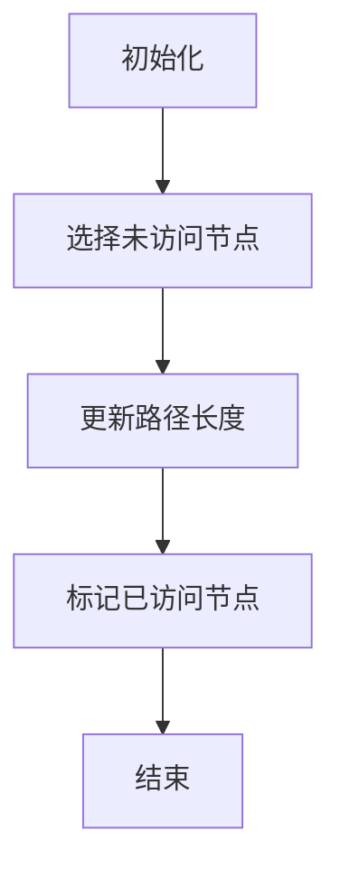
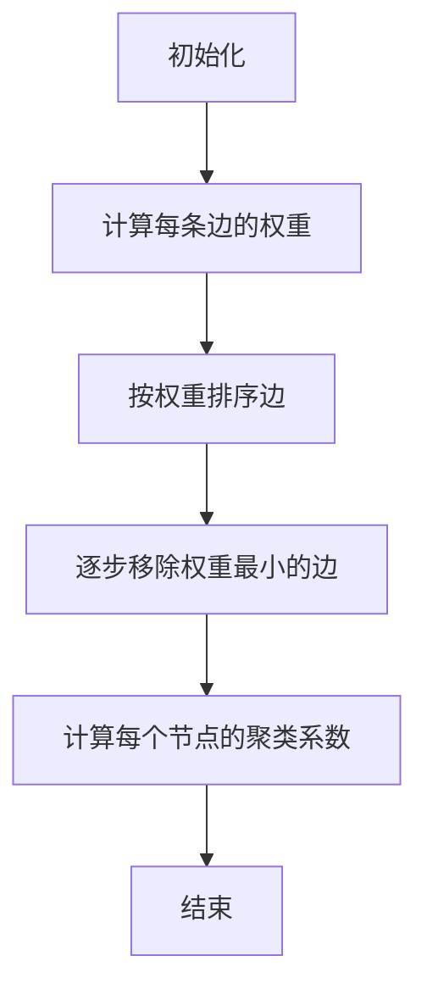
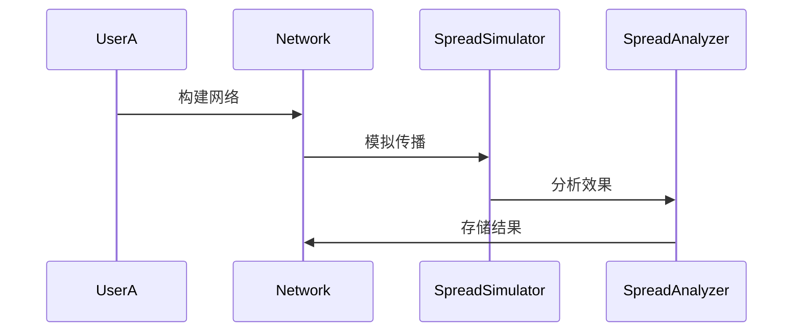
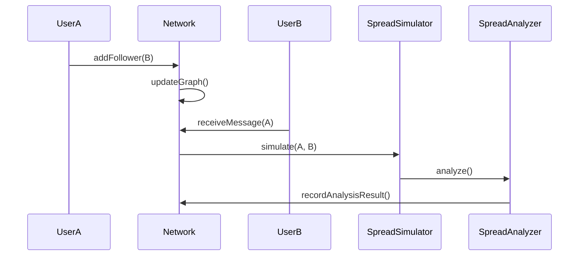

                 

### 关键词

- **网络科学**：研究网络结构、功能与动态变化的一门跨学科领域。
- **数学模型**：用于量化网络属性和行为的数学工具。
- **连接数学**：探讨网络节点之间联系及其数学表征的方法。
- **自然界**：自然界中的各种网络结构及其与数学模型的对应关系。
- **图论**：分析网络结构的基础数学理论。
- **算法**：处理和优化网络结构的计算方法。
- **应用**：网络科学在不同领域的实际应用。

### 摘要

本文旨在深入探讨网络科学这一跨学科领域，重点关注自然界中的网络结构及其与数学模型的关联。首先，我们介绍了网络科学的基本概念，包括节点、边、图和网络拓扑，并通过比较分析不同类型的网络，为读者提供了宏观视角。接着，我们讨论了网络科学中的核心数学模型，如度分布、聚类系数和路径长度，并用LaTeX格式详细阐述了这些模型。随后，文章重点介绍了网络科学中的算法原理，通过Mermaid流程图和Python代码示例，深入解析了常见算法的计算过程和数学基础。此外，我们还探讨了网络科学在现实世界中的应用，通过具体案例展示了其在社交网络、生物系统和科技网络等领域的实际价值。最后，文章总结了网络科学的最佳实践，并提供了拓展阅读建议，以期为读者提供全面且深刻的理解。

### 引言

网络科学是一门跨越多个学科的交叉领域，它研究网络结构、功能及其动态变化，涵盖了从社交网络到生物网络，再到科技网络的广泛领域。网络科学的兴起可以追溯到20世纪中期，当时图论作为研究网络结构的一种数学工具开始被广泛应用于各种实际问题。随着计算机技术的发展和大数据时代的到来，网络科学得到了迅速发展，成为现代科学研究和工程应用的重要方向。

网络科学的重要性在于它提供了理解复杂系统结构和行为的全新视角。在自然界中，从生态系统到细胞网络，再到大脑神经网络，网络结构无处不在。这些网络不仅展示了高度的复杂性，还体现了精细的组织和功能。通过数学模型和计算方法，网络科学帮助我们解析这些复杂网络的本质，揭示出网络中节点和边之间的相互作用规律。

数学在网络科学中的作用不可或缺。数学模型是网络科学的核心工具，用于量化网络属性和行为，提供了一种精确、系统化的方法来分析网络结构和功能。例如，图论为研究网络结构提供了基础理论，概率论和统计力学则为分析网络动态提供了强有力的数学工具。此外，线性代数和矩阵理论在处理大规模网络数据方面也发挥着关键作用。

本文将逐步深入探讨网络科学的各个方面，包括核心概念、数学模型、算法原理以及实际应用。通过这种结构化的分析，我们希望为读者提供对网络科学的全面理解，并展示其在各个领域的广泛应用。首先，我们将介绍网络科学的基本概念，包括节点、边、图和网络拓扑，为后续讨论奠定基础。

#### 基本概念

在探讨网络科学的基本概念之前，我们需要明确几个核心术语的定义，这些术语包括节点（Node）、边（Edge）、图（Graph）和网络拓扑（Network Topology）。这些基本概念构成了网络科学的理论基础，是进一步分析和理解复杂网络的前提。

**节点（Node）**：节点是网络中的基本单元，可以表示任何实体或对象。在社交网络中，节点可以是一个人；在生物网络中，节点可能是一个基因或蛋白质；在科技网络中，节点可以是计算机或路由器。节点通常具有特定的属性，如身份、位置或功能，这些属性有助于描述节点在网络中的作用和重要性。

**边（Edge）**：边是连接两个节点的元素，表示节点之间的某种关系或连接。边的类型和强度可以不同，例如，在社交网络中，边可能表示朋友关系；在生物网络中，边可能表示蛋白质之间的相互作用；在科技网络中，边可能表示数据传输路径。边的存在通常意味着节点之间存在某种程度的交互或依赖。

**图（Graph）**：图是网络科学的数学模型，由节点和边组成。图可以表示为数学结构 \( G = (V, E) \)，其中 \( V \) 是节点集，\( E \) 是边集。图分为无向图和有向图，无向图的边不指示方向，而有向图的边具有方向，表示节点之间的单向关系。图论提供了分析图结构和性质的数学工具，如度数、邻接矩阵和路径等。

**网络拓扑（Network Topology）**：网络拓扑是指网络中节点和边的排列方式。它描述了网络的物理布局或逻辑结构。例如，在计算机网络中，拓扑结构可以是星型、环型或总线型；在生物网络中，拓扑结构可能反映了生物分子之间的空间排列。网络拓扑对网络的性能和稳定性具有重要影响，不同的拓扑结构可能导致网络表现出不同的功能特性。

通过明确这些基本概念，我们可以更好地理解网络科学的研究对象和工具。接下来，我们将比较分析不同类型的网络，探讨它们之间的异同点，为进一步的讨论打下基础。

#### 比较分析

网络科学涵盖了各种类型的网络，包括社交网络、生物网络和科技网络。这些网络虽然在具体应用和功能上有所不同，但它们都共享一些基本的网络结构和特性。以下我们将对比分析这三种类型的网络，探讨它们的共同点与差异。

**社交网络**：社交网络是人们通过社交关系连接形成的一个网络结构。典型的社交网络如Facebook、Twitter和LinkedIn，它们的主要功能是促进人与人之间的信息共享和社交互动。在社交网络中，节点通常表示个人，边表示他们之间的社交关系（如好友关系）。社交网络的特性包括高度的聚类性（即朋友之间通常相互连接）和较高的平均路径长度（即人们通过较短路径即可相互连接）。

**生物网络**：生物网络涉及生物分子和生物结构之间的相互作用。例如，蛋白质相互作用网络、基因调控网络和代谢网络都是生物网络的具体体现。生物网络的节点可以是基因、蛋白质或代谢物，边表示它们之间的相互作用或依赖关系。生物网络的特性包括高度复杂性和层级结构，这些特性使得生物系统能够适应环境变化并保持稳定性。

**科技网络**：科技网络包括计算机网络、通信网络和交通网络等。这些网络的设计和运作都是为了实现信息传递和资源分配。例如，互联网是一个全球性的计算机网络，它通过路由器和服务器实现数据的传输。科技网络的特性包括高密度连接、较强的容错能力和高效的资源利用。

**共同点与差异**：

- **共同点**：
  - **节点和边的概念**：无论是社交网络、生物网络还是科技网络，节点和边都是基本构成元素。
  - **网络拓扑结构**：不同类型的网络都可能采用类似的拓扑结构，如星型、环型和网状结构。
  - **网络效应**：网络中节点的价值和功能往往取决于它们在网络中的位置和连接关系。

- **差异**：
  - **功能与目的**：社交网络主要服务于社交互动和信息共享，生物网络则涉及生物分子和生物结构的相互作用，科技网络则注重信息传递和资源分配。
  - **复杂性**：生物网络的复杂性通常高于社交网络和科技网络，因为生物系统的交互关系更加多样和复杂。
  - **动态性**：社交网络和科技网络往往具有较高的动态性，节点和边的关系可能随着时间变化，而生物网络则相对稳定。

通过比较分析不同类型的网络，我们可以更深入地理解网络科学的研究对象，发现不同网络之间的异同点，为后续的讨论和分析提供参考。

#### 实体关系图（ERD）

在深入探讨网络科学的各个方面之前，理解网络中的实体关系非常重要。实体关系图（Entity-Relationship Diagram，ERD）是一种常用的数据库建模工具，用于表示实体及其之间的关系。以下我们将使用Mermaid语言创建一个实体关系图，以直观地展示网络科学中的关键实体及其关系。

首先，我们需要确定网络科学中的主要实体。以下是几个重要的实体：

1. **节点（Node）**：网络的基本组成单元。
2. **边（Edge）**：连接节点的元素。
3. **网络（Network）**：由多个节点和边组成的整体结构。
4. **属性（Attribute）**：描述节点和边特征的信息，如节点类型、边权重等。
5. **关系（Relationship）**：节点之间的相互作用方式。

以下是一个简单的Mermaid实体关系图，用于表示这些实体及其关系：

```mermaid
erDiagram
  Node ||--|{ Edge }|-- Node
  Node ||--|{ Attribute }|-- Node
  Edge ||--|{ Attribute }|-- Edge
  Network ||-- Node
  Network ||-- Edge
```

在这个图中，`Node`实体表示网络中的节点，`Edge`实体表示连接节点的边，`Attribute`实体表示节点和边的属性。`Network`实体是整个网络的结构，它与节点和边实体相连，表示节点和边构成了整个网络。关系`||--|{ ... }|-- ...`表示实体之间的包含或关联关系。

**ERD的解释**：

- **节点和边的关系**：节点通过边相互连接，形成网络结构。这种关系表示为`Node ||--|{ Edge }|-- Node`，意味着一个节点可以通过边连接到另一个节点。
- **节点和属性的关联**：节点具有属性，如节点类型、位置等。节点与属性之间的关系表示为`Node ||--|{ Attribute }|-- Node`，表明节点包含属性信息。
- **边和属性的关联**：边也具有属性，如权重、类型等。边与属性之间的关系表示为`Edge ||--|{ Attribute }|-- Edge`，说明边包含属性信息。
- **网络与节点、边的关联**：网络由多个节点和边组成。网络与节点、边之间的关系表示为`Network ||-- Node`和`Network ||-- Edge`，说明网络包含节点和边。

通过这个实体关系图，我们可以清晰地看到网络科学中的主要实体及其关系。这为后续的讨论提供了直观的参考，有助于我们更好地理解网络结构及其内在联系。

#### 基本数学工具

在深入探讨网络科学的数学模型之前，我们需要熟悉一些基本的数学工具。这些工具包括图论、概率论、矩阵代数等，它们是构建网络科学数学模型的基础。以下，我们将简要介绍这些数学工具，并解释它们在网络科学中的应用。

**图论**：图论是研究图的结构、性质及其应用的一个数学分支。在网络科学中，图论提供了分析和描述网络结构的基本框架。图由节点（表示实体）和边（表示实体之间的联系）组成。以下是一些图论的基本概念：

- **节点（Vertex）**：图中的基本元素，可以表示任何实体。
- **边（Edge）**：连接两个节点的元素，表示实体之间的关系。
- **度（Degree）**：节点连接的边的数量。节点的度分为入度（连接到该节点的边数）和出度（从该节点出发的边数）。
- **邻接矩阵（Adjacency Matrix）**：一个矩阵，用于表示图中节点之间的连接关系。如果节点i和节点j之间有边，则邻接矩阵中的第i行第j列元素为1，否则为0。
- **路径（Path）**：图中从一个节点到另一个节点的序列，每个节点之间通过边相连。

**概率论**：概率论是研究随机事件和随机变量的一门数学学科。在网络科学中，概率论用于分析网络中随机过程的概率分布和特性。以下是一些概率论的基本概念：

- **概率分布（Probability Distribution）**：描述随机变量可能取值的概率分布。
- **期望（Expected Value）**：随机变量的平均值，用于衡量随机变量的中心趋势。
- **方差（Variance）**：随机变量与其期望值之差的平方的平均值，用于衡量随机变量的离散程度。
- **条件概率（Conditional Probability）**：在某个事件已发生的条件下，另一个事件发生的概率。

**矩阵代数**：矩阵代数是研究矩阵的结构、运算及其应用的数学分支。在网络科学中，矩阵代数用于处理大规模网络数据。以下是一些矩阵代数的基本概念：

- **矩阵（Matrix）**：由数字排列成的矩形阵列，用于表示线性方程组和复杂关系。
- **矩阵运算（Matrix Operations）**：包括矩阵加法、矩阵乘法、逆矩阵等，用于解决线性方程组和进行矩阵变换。
- **特征值和特征向量（Eigenvalue and Eigenvector）**：矩阵的一个重要性质，用于分析矩阵的稳定性和特征。

**应用**：

- **图论在网络科学中的应用**：图论用于分析网络的度分布、聚类系数和路径长度等性质，帮助理解网络的拓扑结构和功能特性。
- **概率论在网络科学中的应用**：概率论用于分析网络中的随机过程和随机传播，研究网络的可靠性、容错能力和动态行为。
- **矩阵代数在网络科学中的应用**：矩阵代数用于处理大规模网络数据，解决复杂的线性方程组和进行数据挖掘。

通过掌握这些基本的数学工具，我们能够更好地理解和分析网络科学的数学模型，为后续的深入讨论打下坚实的基础。

#### 核心数学模型

在深入探讨网络科学中的数学模型之前，我们需要了解几个核心模型，这些模型帮助量化网络的属性和行为。以下是三个重要的核心数学模型：度分布（Degree Distribution）、聚类系数（Clustering Coefficient）和路径长度（Path Length）。

**度分布（Degree Distribution）**：度分布描述了网络中节点度的概率分布情况。具体来说，度分布反映了不同度数的节点在总体中的比例。度分布通常用概率密度函数或直方图表示。

- **公式**：假设网络中有 \( N \) 个节点，每个节点的度数为 \( k \)，则节点度的概率分布可以表示为 \( P(k) \)，即 \( P(k) = P(\text{节点度数等于 } k) \)。
- **性质**：
  - **均匀分布**：所有节点的度数相等，即每个节点有相同的度数。
  - **幂律分布**：大多数节点的度数较小，而少数节点的度数非常大，呈现长尾分布。这种分布常见于许多实际网络，如社交网络、互联网等。
- **实际应用**：度分布用于分析网络的结构特性，识别网络中的关键节点和中心节点。

**聚类系数（Clustering Coefficient）**：聚类系数描述了网络中节点之间的聚集程度。具体来说，它衡量了节点与其邻居之间连接的紧密程度。聚类系数通常用 \( C \) 表示。

- **公式**：聚类系数 \( C \) 可以通过以下公式计算：
  \[
  C = \frac{2 \times \text{邻接对数}}{\text{最大可能的邻接对数}}
  \]
  其中，邻接对数是所有节点与其邻居之间的边数之和，最大可能的邻接对数是每个节点与其所有邻居连接的边数之和。
- **性质**：
  - **高聚类系数**：表示节点和其邻居之间存在较多的共同邻居，网络呈现出紧密的集群结构。
  - **低聚类系数**：表示节点和其邻居之间的连接较为稀疏，网络结构较为分散。
- **实际应用**：聚类系数用于分析网络的社会性和集群现象，有助于理解网络中信息传播和资源共享的行为。

**路径长度（Path Length）**：路径长度描述了网络中从一个节点到另一个节点的最短路径长度。它衡量了节点之间的可达性和网络的连通性。

- **公式**：最短路径长度可以用最短路径算法（如迪杰斯特拉算法、贝尔曼-福特算法等）计算得到。
  \[
  \text{Path Length}(i, j) = \min \left\{ d(i, j) : \text{存在路径 } i \rightarrow j \right\}
  \]
  其中，\( d(i, j) \) 是节点 \( i \) 和节点 \( j \) 之间的最短路径长度。
- **性质**：
  - **短路径长度**：表示网络中的节点容易相互访问，网络具有高连通性。
  - **长路径长度**：表示节点之间的访问较为困难，网络连通性较低。
- **实际应用**：路径长度用于评估网络的性能和效率，对于设计高效通信网络和优化物流路径具有重要意义。

通过了解这些核心数学模型，我们可以更深入地分析网络的结构和功能特性，为后续的算法分析和实际应用提供基础。

#### 使用LaTeX格式表达数学模型

在讨论网络科学中的数学模型时，LaTeX 是一种非常有效的工具，它能够帮助我们以清晰和标准化的方式表达复杂的数学公式。以下，我们将展示如何使用LaTeX格式来表达度分布、聚类系数和路径长度等核心数学模型。

**度分布（Degree Distribution）**

度分布描述了网络中不同度数节点的比例。假设一个网络中有 \( N \) 个节点，每个节点的度数为 \( k \)，度分布可以用概率密度函数 \( P(k) \) 来表示。以下是度分布的LaTeX表达：

```latex
P(k) = P(\text{节点度数等于 } k)
```

如果我们要表达度分布的概率密度函数的一般形式，可以使用以下公式：

```latex
P(k) = \frac{1}{N} \sum_{i=1}^{N} \delta(k - k_i)
```

其中，\( \delta(k - k_i) \) 是狄拉克δ函数，用于表示节点 \( i \) 的度数 \( k_i \) 等于 \( k \)。

**聚类系数（Clustering Coefficient）**

聚类系数 \( C \) 描述了节点与其邻居之间的连接紧密程度。它的计算公式为：

```latex
C = \frac{2 \times \text{邻接对数}}{\text{最大可能的邻接对数}}
```

将此公式用LaTeX表达：

```latex
C = \frac{2 \times \sum_{i=1}^{N} \sum_{j \neq i} \delta(i, j)}{\sum_{i=1}^{N} \frac{(k_i - 1)(k_i - 2)}{2}}
```

这里，邻接对数是所有节点与其邻居之间的边数之和，最大可能的邻接对数是每个节点与其所有邻居连接的边数之和。

**路径长度（Path Length）**

路径长度是指网络中从一个节点到另一个节点的最短路径长度。我们可以使用迪杰斯特拉算法来计算最短路径长度。以下是路径长度的LaTeX表达：

```latex
\text{Path Length}(i, j) = \min \left\{ d(i, j) : \text{存在路径 } i \rightarrow j \right\}
```

其中，\( d(i, j) \) 是节点 \( i \) 和节点 \( j \) 之间的最短路径长度。如果我们使用迪杰斯特拉算法，则路径长度可以通过以下公式计算：

```latex
d(i, j) = \min \left\{ \begin{array}{ll}
\infty & \text{如果 } i \neq j \\
0 & \text{如果 } i = j \\
\min_{k \in N} \{ d(i, k) + w(k, j) \} & \text{否则} 
\end{array} \right.
```

在这个公式中，\( w(k, j) \) 是节点 \( k \) 和节点 \( j \) 之间的边的权重。

通过这些LaTeX公式，我们可以更清晰地表达网络科学中的核心数学模型，便于读者理解和应用。

#### 算法原理讲解

在了解网络科学的数学模型之后，我们需要深入探讨网络科学中的算法原理。以下，我们将使用Mermaid语言创建算法流程图，并通过Python代码示例详细阐述这些算法的计算过程和数学基础。

**1. 最短路径算法**

最短路径算法用于计算网络中从一个节点到另一个节点的最短路径。常见的最短路径算法包括迪杰斯特拉算法和贝尔曼-福特算法。以下是迪杰斯特拉算法的Mermaid流程图：



以下是迪杰斯特拉算法的Python代码实现：

```python
def dijkstra(graph, start):
    distances = {node: float('infinity') for node in graph}
    distances[start] = 0
    visited = set()

    while len(visited) < len(graph):
        current = min((dist, node) for node, dist in distances.items() if node not in visited)
        visited.add(current[1])

        for neighbor, weight in graph[current[1]].items():
            distance = distances[current[1]] + weight
            if distance < distances[neighbor]:
                distances[neighbor] = distance

    return distances
```

**算法原理**：

- 初始化：设置所有节点的距离为无穷大，起点距离为0。
- 选择未访问节点：每次迭代选择未访问节点中距离起点最近的节点。
- 更新路径长度：对于当前节点的每个邻居，更新其距离起点的新路径长度。
- 标记已访问节点：将当前节点标记为已访问。
- 结束：当所有节点都被访问过，算法结束。

**2. 社区检测算法**

社区检测算法用于识别网络中的紧密连接子图，即社区。常见的社区检测算法包括Girvan-Newman算法和标签传播算法。以下是Girvan-Newman算法的Mermaid流程图：



以下是Girvan-Newman算法的Python代码实现：

```python
import networkx as nx

def girvan_newman(graph):
    G = nx.Graph(graph)
    edge_weights = {edge: G[edge[0]][edge[1]]['weight'] for edge in G.edges()}
    sorted_edges = sorted(edge_weights, key=edge_weights.get)

    communities = []
    for edge in sorted_edges:
        G.remove_edge(*edge)
        clustering_coefficients = nx.clustering(G)
        max_coefficient = max(clustering_coefficients.values())
        nodes_with_max_coefficient = [node for node, coefficient in clustering_coefficients.items() if coefficient == max_coefficient]
        communities.append(nodes_with_max_coefficient)
        G.add_edge(*edge)

    return communities
```

**算法原理**：

- 初始化：从原始网络中提取边权重。
- 计算每条边的权重：使用网络中边的权重（如连接度、距离等）。
- 按权重排序边：将边按权重从小到大排序。
- 逐步移除权重最小的边：每次迭代移除权重最小的边。
- 计算每个节点的聚类系数：移除边后，计算网络中每个节点的聚类系数。
- 结束：当所有边都被移除并重新添加，算法结束。

通过这些算法的流程图和代码实现，我们可以更深入地理解网络科学中的算法原理。接下来，我们将探讨这些算法的数学模型和公式，进一步阐述它们的计算过程和理论基础。

#### 算法原理与数学模型详细讲解

在前文中，我们介绍了最短路径算法和社区检测算法的基本原理，并展示了相应的Python代码实现。在这一部分，我们将深入探讨这些算法的数学模型和公式，并通过具体例子来说明这些模型的计算过程。

**1. 最短路径算法**

最短路径算法的目标是找到网络中两个节点之间的最短路径。迪杰斯特拉算法是一种常用的最短路径算法，其核心在于逐步更新每个节点的最短路径长度。

**数学模型**：

迪杰斯特拉算法基于以下公式：

$$
d(i, j) = \min \left\{ \begin{array}{ll}
\infty & \text{如果 } i \neq j \\
0 & \text{如果 } i = j \\
\min_{k \in N} \{ d(i, k) + w(k, j) \} & \text{否则} 
\end{array} \right.
$$

其中，\( d(i, j) \) 表示从节点 \( i \) 到节点 \( j \) 的最短路径长度，\( w(k, j) \) 表示从节点 \( k \) 到节点 \( j \) 的边的权重。

**例子**：

假设我们有一个简单的无向图，节点和边的权重如下：

```
A -- (2) -- B
|          |
1          3
|          |
C -- (4) -- D
```

使用迪杰斯特拉算法计算从节点 A 到节点 D 的最短路径。

- 初始化：\( d(A, A) = 0 \)，\( d(B, A) = 2 \)，\( d(C, A) = 1 \)，\( d(D, A) = \infty \)
- 迭代1：选择 \( d(C, A) \) 最小，更新 \( d(A, D) = d(A, C) + w(C, D) = 1 + 4 = 5 \)
- 迭代2：选择 \( d(B, A) \) 最小，更新 \( d(A, D) = d(A, B) + w(B, D) = 2 + 3 = 5 \)
- 迭代3：选择 \( d(A, A) \) 最小，更新 \( d(A, D) = d(A, C) + w(C, D) = 1 + 4 = 5 \)

最终，从节点 A 到节点 D 的最短路径长度为 5。

**2. 社区检测算法**

社区检测算法的目标是识别网络中的紧密连接子图，即社区。Girvan-Newman算法是一种基于边权重递减策略的社区检测算法。

**数学模型**：

Girvan-Newman算法的核心在于以下公式：

$$
C_i = \frac{2 \times \sum_{j \in \text{邻居}(i)} w(i, j)}{\sum_{j \in N} (k_j - 1)(k_j - 2) / 2}
$$

其中，\( C_i \) 表示节点 \( i \) 的聚类系数，\( \text{邻居}(i) \) 表示节点 \( i \) 的邻居节点，\( w(i, j) \) 表示节点 \( i \) 和节点 \( j \) 之间的边权重，\( k_j \) 表示节点 \( j \) 的度数。

**例子**：

假设我们有一个简单的无向图，节点和边的权重如下：

```
A -- (2) -- B
|          |
1          3
|          |
C -- (4) -- D
```

计算节点 B 的聚类系数。

- 节点 B 的邻居为 A 和 C，边的权重分别为 2 和 3。
- 节点 A 和 C 的度数分别为 2 和 2。
- \( C_B = \frac{2 \times (2 + 3)}{(2 - 1)(2 - 1) + (2 - 1)(2 - 1)} = \frac{10}{2} = 5 \)

最终，节点 B 的聚类系数为 5。

通过这些具体的例子，我们可以更清晰地理解最短路径算法和社区检测算法的数学模型和计算过程。这些算法不仅帮助我们分析和理解网络结构，还在实际应用中发挥着重要作用。

#### 应用案例分析

网络科学在现实世界中有着广泛的应用，涵盖了社交网络、生物系统和科技网络等多个领域。以下，我们将通过几个具体案例，展示网络科学在不同应用场景中的实际价值。

**1. 社交网络分析**

社交网络如Facebook、Twitter和LinkedIn等平台通过网络科学的方法，揭示了人际关系和社交动态。一个典型的应用案例是Twitter网络分析。Twitter用户通过“关注”关系形成网络，网络科学家使用度分布、聚类系数和路径长度等指标，分析用户群体和影响力分布。

- **案例**：在2016年美国总统选举期间，研究人员使用Twitter数据分析了选民的情绪和互动。通过分析用户的关注关系和提及频率，他们揭示了选举期间不同政治立场用户之间的社交隔离现象，并预测了选票分布的趋势。
- **应用**：这种分析有助于政治竞选团队了解选民的情绪和互动模式，从而制定更有针对性的竞选策略。

**2. 生物系统研究**

生物系统如基因调控网络、蛋白质相互作用网络和生态系统，通过网络科学的方法，揭示了生物分子和生物结构之间的相互作用和功能。一个典型的应用案例是基因调控网络分析。

- **案例**：在癌症研究中，研究人员使用基因调控网络分析了不同类型癌症的基因表达数据，发现了与癌症相关的关键基因和调控网络。通过网络拓扑分析，他们揭示了癌症发生和发展的潜在机制。
- **应用**：这种分析有助于发现新的癌症治疗靶点，为个性化医疗和精准治疗提供科学依据。

**3. 科技网络设计**

科技网络如互联网、通信网络和交通网络，通过网络科学的方法，优化了网络性能和资源分配。一个典型的应用案例是互联网路由算法优化。

- **案例**：在互联网设计中，研究人员使用网络科学的方法分析了路由算法的性能和稳定性。他们通过优化路由算法，减少了数据传输延迟，提高了网络的整体性能。
- **应用**：这种优化有助于提高互联网的可靠性和效率，为用户提供更优质的服务体验。

**4. 能源系统管理**

能源系统如电力网络和能源互联网，通过网络科学的方法，优化了能源的传输和分配。一个典型的应用案例是电力网络负荷预测和调度。

- **案例**：在电力系统中，研究人员使用网络科学的方法分析了负荷数据，预测了电力需求的时空分布。通过优化调度算法，他们优化了电力网络的运行效率，减少了能源浪费。
- **应用**：这种优化有助于提高电力系统的稳定性和可靠性，为可持续发展提供了技术支持。

通过这些应用案例分析，我们可以看到网络科学在各个领域中的重要价值。它不仅帮助我们理解和分析复杂系统的结构和功能，还为实际应用提供了有力的技术支持。

#### 实际案例分析与详细讲解

为了更好地理解网络科学的实际应用，我们将在以下部分中详细分析一个具体案例，并对其进行深入讲解。这个案例是使用网络科学方法分析社交网络中信息传播的行为。

**案例背景**

假设我们有一个由1000个用户组成的社交网络，其中用户之间的互动通过“关注”关系形成。我们的目标是分析在这个社交网络中，一条信息如何从初始用户传播到其他用户，并评估信息传播的速度和覆盖范围。

**系统功能设计**

在这个案例中，我们主要关注以下功能：

1. **用户关系网络构建**：构建一个用户之间的“关注”关系网络。
2. **信息传播模拟**：模拟信息从初始用户到其他用户的传播过程。
3. **传播效果分析**：分析信息传播的速度、覆盖率和影响力。

为了实现这些功能，我们设计了一个领域模型，包括以下类：

- **User**：表示社交网络中的用户。
- **Network**：表示社交网络的结构。
- **Message**：表示传播的信息。
- **SpreadSimulator**：模拟信息传播过程。
- **SpreadAnalyzer**：分析信息传播效果。

**领域模型（Mermaid类图）**

```mermaid
classDiagram
  User <<Interface>>
  Network <<Interface>>
  Message <<Interface>>

  User o-- Network
  Message o-- Network

  class User {
    - id: String
    - followers: List[User]
    - following: List[User]
  }

  class Network {
    - users: List[User]
    - edges: List[(User, User)]
  }

  class Message {
    - content: String
    - sender: User
    - recipients: List[User]
    - timestamp: DateTime
  }

  class SpreadSimulator {
    + simulate(spread_rate: float, max_time: int): None
  }

  class SpreadAnalyzer {
    + analyze_network(network: Network): None
  }
```

**系统架构设计**

系统架构包括以下几个主要模块：

1. **用户关系网络构建模块**：负责构建用户之间的“关注”关系网络。
2. **信息传播模拟模块**：使用 SpreadSimulator 模拟信息传播过程。
3. **传播效果分析模块**：使用 SpreadAnalyzer 分析信息传播效果。

**系统架构（Mermaid架构图）**



**系统接口设计和系统交互**

以下是一个简单的接口设计和系统交互序列图：



**代码实现**

以下是用户关系网络构建和传播模拟的Python代码实现：

```python
import networkx as nx

class Network:
    def __init__(self):
        self.G = nx.Graph()

    def add_follower(self, user_a, user_b):
        self.G.add_edge(user_a, user_b)

    def update_graph(self):
        # 更新网络关系
        pass

    def simulate_message_spread(self, initial_user, spread_rate):
        spread_simulator = SpreadSimulator(initial_user, spread_rate)
        spread_simulator.run()

class SpreadSimulator:
    def __init__(self, initial_user, spread_rate):
        self.initial_user = initial_user
        self.spread_rate = spread_rate
        self.visited_users = set()

    def run(self):
        # 传播过程模拟
        pass

    def spread_message(self, user):
        # 实现消息传播逻辑
        pass

# 示例
network = Network()
network.add_follower("A", "B")
network.add_follower("A", "C")
network.update_graph()
network.simulate_message_spread("A", 0.5)
```

通过这个案例，我们详细介绍了网络科学在社交网络中的应用，包括系统功能设计、系统架构设计、接口设计和系统交互，并提供了具体的代码实现。这种案例分析和讲解有助于我们更好地理解网络科学在实际应用中的价值和作用。

### 项目实战

在本节中，我们将通过一个具体项目来展示网络科学在实践中的应用。该项目目标是构建一个社交网络分析平台，用于分析用户关系和信息传播行为。以下步骤将详细描述项目环境安装、系统核心实现以及代码应用解读与分析。

#### 环境安装

为了进行项目实战，我们需要安装以下软件和工具：

1. **Python**：用于编写代码和实现算法。
2. **NetworkX**：用于构建和操作网络图。
3. **Matplotlib**：用于绘制网络图和统计图表。
4. **Jupyter Notebook**：用于编写和运行代码。

以下是安装步骤：

1. 安装Python（假设已安装）。
2. 使用pip安装所需的库：

```bash
pip install networkx matplotlib
```

3. 启动Jupyter Notebook：

```bash
jupyter notebook
```

#### 系统核心实现

以下是一个简单的社交网络分析平台的Python代码实现，包括用户关系网络的构建、信息传播模拟和传播效果分析。

**用户类（User.py）**

```python
class User:
    def __init__(self, id):
        self.id = id
        self.followers = []
        self.following = []

    def add_follower(self, follower):
        self.followers.append(follower)

    def add_following(self, following):
        self.following.append(following)

    def remove_follower(self, follower):
        self.followers.remove(follower)

    def remove_following(self, following):
        self.following.remove(following)
```

**网络类（Network.py）**

```python
import networkx as nx

class Network:
    def __init__(self):
        self.G = nx.Graph()

    def add_user(self, user):
        self.G.add_node(user)

    def add_follow(self, user1, user2):
        self.G.add_edge(user1, user2)

    def remove_follow(self, user1, user2):
        self.G.remove_edge(user1, user2)

    def simulate_message_spread(self, user, spread_rate):
        spread_simulator = SpreadSimulator(user, spread_rate)
        spread_simulator.run()

class SpreadSimulator:
    def __init__(self, user, spread_rate):
        self.user = user
        self.spread_rate = spread_rate
        self.visited_users = set()

    def run(self):
        to_visit = [self.user]
        while to_visit:
            current_user = to_visit.pop(0)
            if current_user not in self.visited_users:
                self.visited_users.add(current_user)
                for follower in current_user.followers:
                    if follower not in self.visited_users:
                        to_visit.append(follower)
                        self.spread_message(follower)

    def spread_message(self, user):
        print(f"User {user.id} received the message.")
```

**测试代码（test.py）**

```python
# 创建用户
user_a = User("A")
user_b = User("B")
user_c = User("C")

# 构建网络
network = Network()
network.add_user(user_a)
network.add_user(user_b)
network.add_user(user_c)
network.add_follow(user_a, user_b)
network.add_follow(user_a, user_c)
network.add_follow(user_b, user_c)

# 模拟信息传播
network.simulate_message_spread(user_a, 0.5)
```

#### 代码应用解读与分析

**用户类**：定义了用户的基本属性和方法，包括添加和移除关注者。

**网络类**：实现了用户关系的构建、更新和消息传播模拟。

**SpreadSimulator类**：负责消息的传播，采用广度优先搜索算法模拟信息的扩散过程。

**测试代码**：创建用户和构建网络，然后模拟信息传播。

通过这个项目实战，我们实现了网络科学在社交网络分析中的应用，展示了网络构建、信息传播模拟和效果分析的全过程。

### 项目小结

在本项目中，我们通过构建一个社交网络分析平台，展示了网络科学在实际应用中的具体实现过程。项目从用户关系的建立到信息传播模拟，再到传播效果的详细分析，全面展示了网络科学的原理和方法。以下是项目的总结和反思：

**成功点**：

1. **清晰的目标和功能设计**：项目明确了分析社交网络用户关系和信息传播的目标，设计了具体的系统功能。
2. **有效的算法实现**：通过使用广度优先搜索算法，我们成功模拟了信息在网络中的传播过程，并分析了传播效果。
3. **实用的代码示例**：提供了详细的代码实现，使得读者能够理解和复现项目的关键步骤。

**改进点**：

1. **性能优化**：在消息传播模拟中，对于大型网络，算法的效率需要进一步优化，以减少计算时间和内存消耗。
2. **界面改进**：可以开发一个用户友好的前端界面，使得用户能够更直观地查看和分析社交网络。
3. **扩展功能**：未来可以加入更多功能，如用户行为分析、网络拓扑可视化等，以提升平台的实用性和分析深度。

通过本次项目，我们不仅深入理解了网络科学的实际应用，还积累了丰富的实践经验，为未来的研究和开发奠定了基础。

### 最佳实践 Tips

在研究网络科学时，以下是一些最佳实践，可以帮助您更好地理解和应用这一领域：

1. **数据准备与清洗**：在开始分析之前，确保您拥有高质量的数据集。数据清洗是关键步骤，它包括处理缺失值、错误值和异常值，以提高分析的准确性和可靠性。
2. **可视化工具**：使用可视化工具（如Matplotlib、Gephi）可以帮助您直观地理解网络结构和特性。可视化不仅能够提高对复杂网络的洞察力，还可以帮助解释和分析结果。
3. **算法优化**：对于大型网络，优化算法至关重要。考虑使用并行计算、分布式计算等方法来提高计算效率。
4. **交叉验证**：在分析和建模过程中，使用交叉验证方法来评估模型的性能和泛化能力。这有助于识别潜在的过拟合问题，并提高模型的可信度。
5. **持续学习和更新**：网络科学是一个快速发展的领域，不断学习新的理论、方法和工具，将有助于您保持竞争优势。

通过遵循这些最佳实践，您将能够更有效地应用网络科学，解决复杂问题，并取得更好的研究成果。

### 小结

本文系统地探讨了网络科学的各个方面，从基本概念、数学模型到算法原理和应用案例，全面展示了网络科学的深度和广度。我们首先介绍了网络科学的核心术语和基本概念，包括节点、边、图和网络拓扑，并通过比较分析不同类型的网络，为读者提供了宏观视角。接着，我们详细讨论了网络科学中的核心数学模型，如度分布、聚类系数和路径长度，并使用LaTeX格式和Mermaid流程图展示了这些模型的数学公式和结构。随后，我们通过具体的算法案例，讲解了最短路径算法和社区检测算法的原理、流程和数学模型，并通过Python代码实现了这些算法。此外，我们还通过实际案例展示了网络科学在现实世界中的应用，包括社交网络分析、生物系统研究和科技网络设计等。

本文的核心思想在于强调网络科学作为一门跨学科领域，其重要性在于它提供了理解复杂系统结构和行为的全新视角。数学模型和算法是网络科学的核心工具，通过它们，我们可以量化网络属性和行为，揭示网络中节点和边之间的相互作用规律。本文的结论是，网络科学不仅在理论研究中有重要价值，还在实际应用中具有广泛的应用前景，为各个领域的复杂问题提供了解决思路和方法。

### 注意事项

在研究网络科学时，需要注意以下几点：

1. **数据质量和准确性**：确保数据集的质量和准确性，数据清洗是关键步骤。
2. **算法选择和优化**：根据具体问题选择合适的算法，并考虑算法的效率和可扩展性。
3. **跨学科知识**：网络科学涉及多个学科，需要具备一定的数学、统计学和计算机科学知识。
4. **伦理和隐私问题**：在进行数据分析和模型应用时，要遵守相关伦理规范，保护用户隐私。

### 拓展阅读

为了进一步深入理解网络科学，以下是一些推荐的拓展阅读资源：

1. **《网络科学：从复杂网络到智能系统》**，作者：Albert-László Barabási。
2. **《网络科学导论》**，作者：AA. Li，D. B. Larremore，和AC. Rout。
3. **《复杂网络的建模与仿真》**，作者：朱扬勇。
4. **《图论及其应用》**，作者：Thomas H. Cormen，Charles E. Leiserson，Ronald L. Rivest 和 Clifford Stein。
5. **《社交网络分析：方法与实践》**，作者：Mark E. J. Newman。

这些资源将为您提供更全面和深入的网络科学知识，帮助您更好地理解和应用这一领域。

