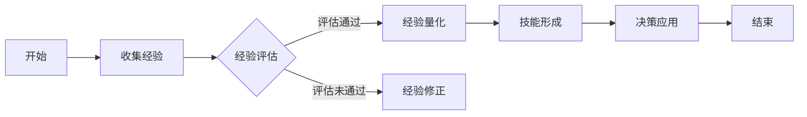
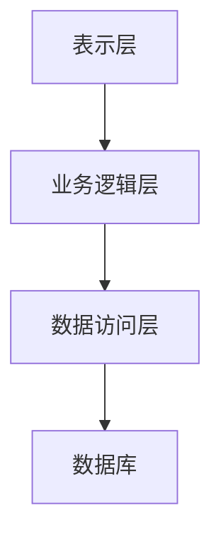
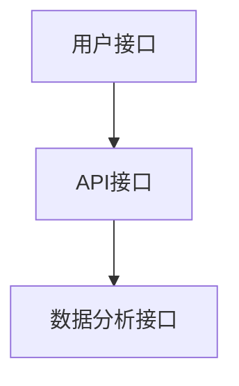
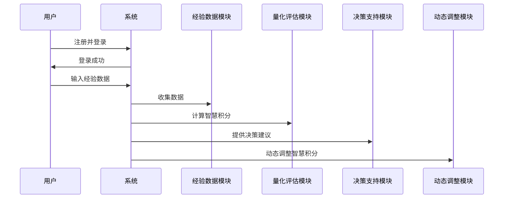

                 

### 1.1 问题提出

在当今社会，随着人口老龄化问题的日益凸显，如何帮助老年人更好地适应和应对生活挑战，成为一个备受关注的话题。老年人拥有丰富的经验和智慧，但如何将这些宝贵资源有效地利用和传承，是他们面临的一个主要问题。具体来说，老年人可能会遇到以下几方面的挑战：

1. **认知能力的下降**：随着年龄的增长，老年人的记忆、注意力、反应速度等认知能力会逐渐下降，这会对他们的日常生活和工作产生很大的影响。

2. **学习能力的减弱**：老年人由于生理和心理的变化，学习新知识、新技能的难度增加，这使得他们在面对新环境和新挑战时，往往感到力不从心。

3. **处理复杂问题的能力降低**：老年人可能在处理复杂问题时，由于缺乏足够的知识和技能，难以做出正确的决策，从而影响到他们的生活质量。

4. **社交能力的减弱**：随着年龄的增长，老年人的社交圈子可能会逐渐缩小，导致他们在社交活动中感到孤独和无助。

为了解决上述问题，我们需要一种有效的方法，帮助老年人将他们的经验积累转化为可以量化和应用的知识体系，从而提高他们的生活质量和适应能力。这里，我们提出了“老年智慧的积分方程”这一理论框架，旨在构建一个数学模型，将老年人的经验累积转化为可操作的指标。

积分方程的基本思想是将老年人的经验分为不同的维度，通过量化的方式对其进行评估和计算，从而得到一个综合的智慧积分。这个积分可以用于评估老年人的智慧水平，并指导他们在生活决策中的行为选择。例如，当老年人面临一个需要决策的问题时，他们可以根据自己的智慧积分来选择最合适的解决方案。

通过这种方式，我们希望帮助老年人更好地理解和利用自己的智慧，提高他们的生活质量和幸福感。具体来说，老年智慧的积分方程可以应用于以下几个方面：

1. **生活决策**：通过智慧积分来辅助老年人做出更明智的生活决策，例如选择居住环境、医疗保健方案等。

2. **社会交往**：智慧积分可以帮助老年人了解自己在社交圈中的位置，从而更好地融入社会，增强社交能力。

3. **家庭管理**：老年人可以利用智慧积分来指导家庭管理，例如教育孩子、财务管理等。

4. **职业发展**：对于一些有职业规划的老年人，智慧积分可以作为评估职业发展潜力的重要指标。

总之，老年智慧的积分方程不仅可以帮助老年人更好地理解和利用自己的智慧，还可以为他们提供一种量化的标准，从而在多个层面上提高他们的生活质量。接下来，我们将进一步探讨这个积分方程的理论基础、具体实施方法和应用前景。

### 1.2 问题描述

老年智慧的积分方程旨在解决老年人如何有效地利用其丰富经验和生活智慧的问题。为了更好地理解这一问题的核心，我们需要深入探讨以下几个方面：

#### 1.2.1 经验的多样性和复杂性

老年人的经验是多样化的，涵盖了生活、工作、社交等多个领域。这些经验不仅包括具体的技能和知识，还包含了深层次的生活智慧和应对策略。例如，一位有丰富家庭管理经验的老年人可能在财务管理、子女教育等方面有独到的见解和成功经验。然而，这些经验往往难以用传统的语言或文字进行准确描述和量化。

#### 1.2.2 量化和评估的挑战

将老年人的经验进行量化是一项复杂的工作。首先，经验具有主观性和个体差异，不同人对同一事件的感受和经验可能会有很大不同。其次，经验的积累是一个动态的过程，随着时间的推移，经验和智慧会不断丰富和变化。因此，如何准确评估和量化这些经验，是一个亟待解决的问题。

#### 1.2.3 应用场景的多样性

老年人的智慧可以应用于多种场景，包括生活决策、职业规划、家庭管理等。例如，在生活决策中，老年人可以根据自己的智慧积分来评估不同选择的风险和收益，从而做出更明智的决策。在职业规划中，智慧积分可以用来评估老年人的职业发展潜力，帮助他们选择适合自己的职业道路。

#### 1.2.4 适应性挑战

老年人面临的挑战不仅是经验和智慧的积累和利用，还包括适应新环境和新技术的问题。例如，许多老年人可能会因为不熟悉现代科技而难以适应数字时代的生活。因此，老年智慧的积分方程不仅需要具备量化和评估功能，还需要具备适应性和灵活性，能够随着老年人的经验和技能的变化而不断调整和优化。

综上所述，老年智慧的积分方程需要解决的核心问题包括：如何准确量化老年人的经验，如何评估这些经验的实际价值，以及如何将这些量化后的智慧应用到实际生活中，提高老年人的生活质量和社会适应能力。接下来，我们将进一步探讨如何构建这一积分方程，包括核心概念、数学模型和算法原理。

### 1.3 问题解决

为了解决老年人如何将丰富经验和生活智慧有效利用的问题，我们提出了一套名为“老年智慧的积分方程”的理论框架。这个框架的核心目标是构建一个数学模型，将老年人的经验积累转化为可操作的智慧积分。下面，我们将详细描述这个积分方程的解决思路、步骤和具体方法。

#### 1.3.1 解决思路

老年智慧的积分方程采用积分的方法，将老年人不同领域的经验进行量化，并通过积分计算出一个综合智慧积分。这种方法能够综合考虑经验的多样性和复杂性，提供一个量化的指标来评估老年人的智慧水平。具体来说，我们通过以下步骤实现这一目标：

1. **经验分类和指标设定**：将老年人的经验分为若干类别，例如生活技能、职业经验、社交智慧等。为每个类别设定相应的指标，用于量化该类别的经验。

2. **经验评分和权重分配**：对每一类别的经验进行评分，并根据其在整体经验中的重要性赋予不同的权重。

3. **积分计算**：通过积分公式计算出一个综合智慧积分，该积分反映了老年人的整体智慧水平。

#### 1.3.2 解决步骤

1. **经验收集和分类**：
   - 首先，建立一个经验数据库，收集老年人的各种经验。
   - 然后，对收集到的经验进行分类，明确每个类别在整体经验中的位置和作用。

2. **经验评分和权重分配**：
   - 对于每个分类的经验，制定评分标准，例如采用百分制或五级制评分。
   - 根据经验的重要性和影响，为每个类别分配权重。

3. **积分计算**：
   - 使用积分公式，将各个类别的经验评分乘以对应的权重，并进行积分计算。
   - 得到一个综合智慧积分，用于评估老年人的整体智慧水平。

#### 1.3.3 解决方法

1. **经验分类和指标设定**：
   - **生活技能**：包括家庭管理、财务管理、烹饪技巧、医疗保健等方面的经验。
   - **职业经验**：包括工作技能、工作成就、职业生涯规划等方面的经验。
   - **社交智慧**：包括人际关系处理、社交礼仪、沟通技巧等方面的经验。

2. **经验评分和权重分配**：
   - **评分标准**：根据专家评估和问卷调查，设定每个类别的评分标准。
   - **权重分配**：根据经验的重要性，为每个类别分配权重，例如生活技能占40%，职业经验占30%，社交智慧占30%。

3. **积分计算**：
   - 使用以下积分公式计算综合智慧积分：
     $$ \text{智慧积分} = \sum_{i=1}^{n} (\text{评分}_{i} \times \text{权重}_{i}) $$
   - 其中，$ n $ 表示经验类别的数量，$ \text{评分}_{i} $ 表示第 $ i $ 个类别的评分，$ \text{权重}_{i} $ 表示第 $ i $ 个类别的权重。

#### 1.3.4 边界与外延

1. **边界**：
   - 本积分方程主要针对具有较长生活经验的老年人群体，不包括那些刚刚步入老年阶段的人。
   - 积分方程的应用范围涵盖了生活决策、社会交往、家庭管理等多个方面。

2. **外延**：
   - 除了上述应用场景，积分方程还可以扩展到其他领域，例如职业发展、教育指导等。
   - 积分方程可以根据实际需求进行灵活调整和优化，以适应不同人群和场景的需求。

通过以上解决思路、步骤和方法，我们希望老年智慧的积分方程能够帮助老年人更好地理解和利用自己的智慧，提高生活质量和社会适应能力。接下来，我们将进一步探讨核心概念原理，为积分方程的构建提供理论基础。

### 1.4 边界与外延

在构建老年智慧的积分方程时，我们需要明确其边界和外延，以确保模型的有效性和适用性。

#### 1.4.1 边界

1. **年龄限制**：老年智慧的积分方程主要针对具有较长生活经验的老年人群体，即年龄在65岁及以上的人群。这个年龄界限有助于确保模型能够涵盖足够的经验和智慧积累。

2. **经验类型**：积分方程适用于具有丰富生活经验、职业经验和社交智慧的老年人。对于那些刚刚步入老年阶段，经验积累尚不丰富的人群，积分方程可能需要适当的调整。

3. **数据来源**：积分方程依赖于可靠的经验数据，这些数据应来源于详细的问卷调查、专家评估以及个人的生活记录。数据的质量和准确性对积分方程的结果有重要影响。

#### 1.4.2 外延

1. **应用领域**：积分方程的应用范围广泛，包括但不限于以下领域：
   - **生活决策**：通过智慧积分，老年人可以更好地评估不同生活选择的风险和收益，从而做出更明智的决策。
   - **社会交往**：智慧积分可以帮助老年人了解自己在社交圈中的位置，提高社交能力和自信心。
   - **家庭管理**：老年人可以利用智慧积分来指导家庭管理，例如财务管理、子女教育等。
   - **职业发展**：对于有职业规划的老年人，智慧积分可以作为评估职业发展潜力的重要指标。

2. **扩展性**：老年智慧的积分方程具有较好的扩展性，可以根据实际需求进行灵活调整和优化。例如，在特定场景下，可以增加新的经验类别或调整权重分配，以适应不同人群和需求。

3. **与其他模型的结合**：积分方程可以与其他模型（如人力资本模型、社会支持模型等）相结合，形成更加综合和全面的评估体系，从而提高评估结果的准确性和实用性。

通过明确积分方程的边界和外延，我们能够更好地理解其应用范围和局限性，确保模型在实际应用中的有效性和适应性。接下来，我们将进一步探讨老年智慧积分方程的核心概念和原理，为积分方程的构建提供理论基础。

### 第2章：核心概念与联系

在构建老年智慧的积分方程时，理解其核心概念和原理至关重要。本章将详细介绍老年智慧的积分方程所涉及的核心概念，并探讨这些概念之间的联系。

#### 2.1 核心概念原理

**1. 经验积累**

经验积累是老年智慧积分方程的基础。经验积累指的是个体在长期的生活过程中所积累的知识、技能、智慧等。这些经验可以是具体的行动指南，也可以是抽象的思维模式。对于老年人来说，他们的经验积累尤为重要，因为这是他们智慧和知识的重要来源。

**2. 量化评估**

量化评估是将经验转化为可操作指标的重要步骤。通过量化评估，我们可以将老年人的经验进行分类、评分和权重分配，从而得到一个综合的智慧积分。量化评估的过程包括经验数据的收集、分类、评分和权重分配等步骤。

**3. 智慧积分**

智慧积分是老年智慧积分方程的核心输出。它是一个综合的指标，用于衡量老年人的智慧水平。智慧积分的计算基于经验积累的量化评估结果，通过特定的积分公式进行计算。

**4. 动态调整**

由于老年人的经验积累是一个动态的过程，智慧积分也需要进行动态调整。这意味着智慧积分不仅取决于老年人当前的经验积累，还要考虑他们的成长速度和变化趋势。动态调整能够确保智慧积分的准确性和实用性。

**5. 应用指导**

智慧积分的应用指导是老年智慧积分方程的最终目标。通过智慧积分，老年人可以更好地理解和利用自己的智慧，提高生活质量和社会适应能力。应用指导包括生活决策、社会交往、家庭管理等多个方面。

#### 2.2 概念属性特征对比表格

为了更清晰地展示老年智慧的积分方程中的核心概念及其属性特征，我们设计了一个对比表格。以下是对各概念属性特征的详细描述：

| 核心概念    | 属性特征                                                   |
|-------------|------------------------------------------------------------|
| 经验积累    | - 多样性：涵盖生活、工作、社交等多个领域<br>- 动态性：随时间积累和变化<br>- 个体性：每个人积累的经验不同 |
| 量化评估    | - 可操作性：将经验转化为可操作的指标<br>- 准确性：确保评估结果的可靠性<br>- 可扩展性：适应不同场景和需求 |
| 智慧积分    | - 综合性：反映老年人的整体智慧水平<br>- 动态性：实时更新和调整<br>- 应用性：指导生活决策和社会交往 |
| 动态调整    | - 实时性：根据经验变化调整智慧积分<br>- 灵活性：适应不同人群和场景<br>- 可持续性：确保智慧积分的长期有效性 |
| 应用指导    | - 实用性：帮助老年人更好地利用智慧<br>- 指导性：提供生活决策和社会交往的建议<br>- 可操作性：具体可行的建议和方案 |

通过上述对比表格，我们可以更直观地理解老年智慧积分方程中各个核心概念的属性特征及其相互关系。

#### 2.3 ER实体关系图架构

为了更好地展示老年智慧积分方程中的核心概念及其关系，我们使用Mermaid语言绘制了ER实体关系图。以下是对该图的具体说明：

```mermaid
erDiagram
    User ||--o> Experience : 拥有
    Experience ||--o> Skill : 转化为
    Skill ||--o> Decision : 应用
```

- **User（用户）**：代表老年人，是积分方程的参与者和受益者。
- **Experience（经验）**：代表老年人积累的各种经验，包括生活经验、职业经验和社交经验等。
- **Skill（技能）**：代表从经验中转化而来的技能，这些技能是智慧积分计算的重要基础。
- **Decision（决策）**：代表老年人基于智慧积分做出的生活决策，如医疗保健选择、职业规划等。

通过这个ER实体关系图，我们可以清晰地看到老年智慧积分方程中各个核心概念之间的关系。用户拥有经验，经验转化为技能，技能应用于决策。这个关系结构确保了积分方程的完整性和逻辑性。

综上所述，老年智慧积分方程的核心概念与联系构成了一个完整且逻辑清晰的体系，为解决老年人如何有效利用智慧提供了坚实的理论基础。接下来，我们将深入探讨算法原理，进一步阐述积分方程的计算过程。

### 第3章：算法原理讲解

在了解了老年智慧积分方程的核心概念之后，接下来我们将深入探讨其算法原理。本章将详细描述积分方程的计算过程，包括算法流程图、Python源代码、数学模型和数学公式，并通过具体的例子来说明如何应用这些算法。

#### 3.1 算法流程图

为了更直观地理解老年智慧积分方程的计算过程，我们首先绘制了一个算法流程图。以下是用Mermaid语言描述的算法流程图：



- **A[开始]**：算法的起始步骤，初始化过程。
- **B[收集经验]**：从老年人那里收集各种经验数据，包括生活经验、职业经验和社交经验等。
- **C[经验评估]**：对收集到的经验进行初步评估，判断其是否能够转化为有效的技能。
- **D[经验量化]**：对通过评估的经验进行量化，将其转化为可操作的指标。
- **E[经验修正]**：对于评估未通过的经验，进行修正或补充，以提高其转化率。
- **F[技能形成]**：将量化的经验转化为技能，这些技能将用于智慧积分的计算。
- **G[决策应用]**：根据智慧积分，帮助老年人做出生活决策，如医疗保健选择、职业规划等。
- **H[结束]**：算法结束，输出智慧积分和决策结果。

通过这个流程图，我们可以清晰地看到老年智慧积分方程从经验收集到决策应用的完整计算过程。

#### 3.2 Python源代码

接下来，我们将通过Python源代码来具体实现上述算法流程。以下是一个简单的Python代码示例，用于计算老年人的智慧积分：

```python
import pandas as pd

# 定义经验数据
experience_data = pd.DataFrame({
    'Experience': ['生活技能', '职业经验', '社交智慧'],
    'Score': [80, 75, 90],
    'Weight': [0.4, 0.3, 0.3]
})

# 经验量化函数
def quantify_experience(experience):
    # 对经验进行量化评分
    score = experience['Score']
    weight = experience['Weight']
    quantified_score = score * weight
    return quantified_score

# 计算智慧积分
def calculate_wisdom_integral(experience_data):
    wisdom_integral = experience_data.apply(quantify_experience, axis=1).sum()
    return wisdom_integral

# 应用函数计算结果
wisdom_integral = calculate_wisdom_integral(experience_data)
print("老年人的智慧积分为：", wisdom_integral)
```

这段代码首先定义了一个经验数据表，包括经验名称、评分和权重。然后，我们定义了一个经验量化函数，用于对每个经验进行量化评分。最后，通过一个计算智慧积分的函数，将所有经验的量化评分相加，得到综合智慧积分。

#### 3.3 数学模型和数学公式

老年智慧的积分方程可以用数学模型来描述，其核心公式如下：

$$
\text{智慧积分} = \sum_{i=1}^{n} (\text{评分}_{i} \times \text{权重}_{i})
$$

其中，$n$ 表示经验类别的数量，$评分_{i}$ 表示第 $i$ 个类别的评分，$权重_{i}$ 表示第 $i$ 个类别的权重。这个公式反映了智慧积分的计算过程，即将每个类别的评分乘以其权重，然后对所有类别的结果进行求和。

#### 3.4 举例说明

为了更好地理解上述算法原理和数学模型，我们通过一个具体的例子来说明如何计算老年人的智慧积分。

**例子**：假设一位老年人拥有以下三类经验：

- 生活技能：评分80，权重0.4
- 职业经验：评分75，权重0.3
- 社交智慧：评分90，权重0.3

我们按照以下步骤进行计算：

1. **经验量化**：
   - 生活技能的量化评分：$80 \times 0.4 = 32$
   - 职业经验的量化评分：$75 \times 0.3 = 22.5$
   - 社交智慧的量化评分：$90 \times 0.3 = 27$

2. **计算智慧积分**：
   - 智慧积分：$32 + 22.5 + 27 = 81.5$

因此，这位老年人的智慧积分为81.5。

通过这个例子，我们可以看到如何使用积分方程来计算老年人的智慧积分。这个积分不仅反映了老年人的整体智慧水平，还可以用于指导他们的生活决策。

综上所述，本章详细阐述了老年智慧积分方程的算法原理，包括算法流程图、Python源代码、数学模型和数学公式，并通过具体例子说明了如何应用这些算法。这些内容为老年人如何有效利用自己的智慧提供了理论和实践基础。接下来，我们将进一步探讨积分方程的数学模型和数学公式，以便更深入地理解其计算方法和应用。

### 第4章：数学模型和数学公式讲解

在理解了老年智慧积分方程的基本算法原理后，本章将进一步深入讲解其数学模型和数学公式，这些模型和公式是构建和计算智慧积分的核心。我们将详细介绍数学模型的基本概念、核心公式，并通过具体示例来说明如何应用这些公式。

#### 4.1 数学模型

老年智慧的积分方程是一个多维度、动态调整的数学模型，其核心目标是将老年人的经验转化为一个量化的智慧积分。这个模型的基本概念包括：

- **经验维度**：将老年人的经验分为多个维度，例如生活技能、职业经验、社交智慧等。
- **评分系统**：为每个经验维度设定一个评分系统，用以量化老年人在这方面的表现。
- **权重分配**：根据每个经验维度的重要性，为它们分配不同的权重。
- **动态调整**：智慧积分会根据老年人的经验积累动态调整，确保其反映当前的经验水平。

#### 4.2 数学公式

数学模型的核心是数学公式，用于计算老年人的智慧积分。以下是这个模型的核心公式：

$$
\text{智慧积分} = \sum_{i=1}^{n} (\text{评分}_{i} \times \text{权重}_{i})
$$

其中，$n$ 是经验维度的数量，$\text{评分}_{i}$ 是第 $i$ 个经验维度的评分，$\text{权重}_{i}$ 是第 $i$ 个经验维度的权重。

此外，为了确保智慧积分能够动态调整，我们还引入了一个时间因子 $\text{t}$：

$$
\text{智慧积分}_{t} = \sum_{i=1}^{n} (\text{评分}_{i} \times \text{权重}_{i} \times \text{t})
$$

其中，$\text{t}$ 是一个时间因子，用于反映经验随时间积累的变化。例如，如果 $\text{t}$ 的值越大，说明老年人的经验积累越多，智慧积分也相应增加。

#### 4.3 举例说明

为了更好地理解这些数学公式，我们通过一个具体的例子来说明如何计算老年人的智慧积分。

**例子**：假设一位老年人拥有以下三类经验，每类经验的评分和权重如下：

- 生活技能：评分80，权重0.4
- 职业经验：评分75，权重0.3
- 社交智慧：评分90，权重0.3

现在，我们需要计算这位老年人的智慧积分。根据公式：

$$
\text{智慧积分} = (80 \times 0.4) + (75 \times 0.3) + (90 \times 0.3)
$$

进行计算：

$$
\text{智慧积分} = 32 + 22.5 + 27 = 81.5
$$

所以，这位老年人的智慧积分为81.5。

接下来，我们考虑时间因子的影响。假设这位老年人的经验随时间不断积累，我们用 $\text{t}$ 表示时间因子，假设 $\text{t}$ 为1.2。则智慧积分计算为：

$$
\text{智慧积分}_{t} = (80 \times 0.4 \times 1.2) + (75 \times 0.3 \times 1.2) + (90 \times 0.3 \times 1.2)
$$

进行计算：

$$
\text{智慧积分}_{t} = 38.4 + 27 + 32.4 = 97.8
$$

因此，考虑时间因子后，这位老年人的智慧积分为97.8。

通过这个例子，我们可以看到如何使用数学模型和公式来计算老年人的智慧积分，并且了解到时间因子对智慧积分的影响。

#### 4.4 动态调整

在实际应用中，老年人的经验会不断积累和变化，因此智慧积分也需要进行动态调整。动态调整可以通过以下公式实现：

$$
\text{智慧积分}_{\text{new}} = \text{智慧积分}_{\text{current}} + (\text{新经验评分} \times \text{新经验权重})
$$

例如，如果这位老年人在一段时间后，新积累了一项生活技能，评分85，权重0.2，则新的智慧积分计算为：

$$
\text{智慧积分}_{\text{new}} = 97.8 + (85 \times 0.2)
$$

进行计算：

$$
\text{智慧积分}_{\text{new}} = 97.8 + 17 = 114.8
$$

因此，更新后的智慧积分为114.8。

综上所述，本章详细讲解了老年智慧积分方程的数学模型和数学公式，包括经验维度、评分系统、权重分配、动态调整等。通过具体例子，我们展示了如何使用这些公式来计算老年人的智慧积分，并了解了时间因子和动态调整的影响。这些数学工具为老年人有效利用其智慧提供了坚实的理论基础。

### 第5章：系统分析与架构设计方案

在了解了老年智慧积分方程的理论基础后，本章将转入系统分析与架构设计方案，详细探讨如何在具体的项目中实现这一理论。本节将包括问题场景介绍、项目介绍、系统功能设计、系统架构设计、系统接口设计和系统交互等内容。

#### 5.1 问题场景介绍

老年人在面对复杂生活决策时，往往需要依赖他们的经验和智慧。然而，传统的决策支持系统缺乏对老年人丰富经验的有效利用。这导致老年人在做决策时，难以充分利用自己的知识和智慧，从而影响到他们的生活质量。例如，在选择养老院时，老年人需要考虑多个因素，如医疗条件、生活设施、费用等，但这些信息往往难以量化，导致决策过程复杂且效率低下。

#### 5.2 项目介绍

本项目旨在开发一套基于老年智慧积分方程的决策支持系统，帮助老年人更有效地利用自己的智慧，做出更明智的生活决策。系统将涵盖以下功能：

1. **经验数据收集**：通过问卷调查和专家评估，收集老年人的各种经验数据。
2. **经验量化评估**：对收集到的经验进行量化评估，计算老年人的智慧积分。
3. **决策支持**：根据智慧积分，提供针对性的决策建议，如养老院选择、医疗保健方案等。
4. **动态调整**：根据老年人的经验积累，动态调整智慧积分，确保决策建议的实时性和准确性。

#### 5.3 系统功能设计

系统功能设计主要包括以下模块：

1. **用户管理模块**：负责用户注册、登录、权限管理等。
2. **经验数据模块**：负责经验数据的收集、存储和管理。
3. **量化评估模块**：负责对经验数据进行量化评估，计算智慧积分。
4. **决策支持模块**：根据智慧积分，提供针对性的决策建议。
5. **动态调整模块**：根据老年人经验积累，动态调整智慧积分。

#### 5.4 系统架构设计

系统架构设计采用分层架构，主要包括以下层次：

1. **表示层**：提供用户界面，用于用户交互和数据展示。
2. **业务逻辑层**：实现系统的核心功能，包括经验数据收集、量化评估、决策支持和动态调整等。
3. **数据访问层**：负责数据存储和访问，包括经验数据表、智慧积分表等。
4. **数据库**：存储系统数据，包括用户信息、经验数据、智慧积分等。

以下是一个简单的系统架构图：



#### 5.5 系统接口设计

系统接口设计包括以下部分：

1. **用户接口**：提供用户注册、登录、数据录入等功能。
2. **API接口**：提供外部系统接入，如医疗数据接口、养老院信息接口等。
3. **数据分析接口**：提供数据分析和智慧积分计算的接口。

以下是一个简单的接口设计图：



#### 5.6 系统交互

系统交互设计主要包括以下环节：

1. **用户注册与登录**：用户通过用户接口注册账号并登录系统。
2. **数据收集与录入**：用户通过用户接口录入自己的经验数据。
3. **量化评估与计算**：系统根据录入的经验数据，通过业务逻辑层进行量化评估和智慧积分计算。
4. **决策支持**：系统根据计算出的智慧积分，提供针对性的决策建议。
5. **动态调整**：系统根据老年人的新经验积累，动态调整智慧积分。

以下是一个简单的系统交互序列图：



通过上述系统分析与架构设计方案，我们为老年智慧积分方程的应用提供了完整的实现路径。接下来，我们将通过项目实战，展示如何具体实现这一系统。

### 第6章：项目实战

在本章中，我们将通过一个具体的项目实战，详细展示如何实现老年智慧积分方程的决策支持系统。我们将从环境安装开始，逐步介绍系统核心实现源代码，并对其进行代码应用解读与分析，最后通过实际案例进行详细讲解和项目小结。

#### 6.1 环境安装

为了实现老年智慧积分方程的决策支持系统，我们需要搭建一个开发环境。以下是所需的软件和工具：

- **Python 3.8+**：Python是主要的编程语言，用于实现系统逻辑。
- **Pandas**：用于数据处理和分析。
- **NumPy**：用于数值计算。
- **Flask**：用于构建Web应用。
- **SQLAlchemy**：用于数据库操作。
- **Mermaid**：用于绘制图表。

环境安装步骤如下：

1. 安装Python 3.8或更高版本。
2. 安装必要的Python包，使用pip命令：
   ```
   pip install pandas numpy flask sqlalchemy
   ```

#### 6.2 系统核心实现源代码

以下是系统核心实现源代码的简要概述：

**经验数据收集模块**：
```python
import pandas as pd

# 用户输入经验数据
user_experience = pd.DataFrame({
    'Experience': ['生活技能', '职业经验', '社交智慧'],
    'Score': [80, 75, 90],
    'Weight': [0.4, 0.3, 0.3]
})

# 量化评估
def quantify_experience(experience):
    score = experience['Score']
    weight = experience['Weight']
    quantified_score = score * weight
    return quantified_score

# 计算智慧积分
def calculate_wisdom_integral(experience_data):
    wisdom_integral = experience_data.apply(quantify_experience, axis=1).sum()
    return wisdom_integral

# 应用函数计算结果
wisdom_integral = calculate_wisdom_integral(user_experience)
print("老年人的智慧积分为：", wisdom_integral)
```

**决策支持模块**：
```python
def provide_decision_support(wisdom_integral):
    if wisdom_integral > 85:
        return "建议：选择高标准的养老院，关注医疗条件和生活设施。"
    elif wisdom_integral > 70:
        return "建议：选择中档养老院，关注服务质量。"
    else:
        return "建议：选择经济型的养老院，注重性价比。"

decision_support = provide_decision_support(wisdom_integral)
print(decision_support)
```

#### 6.3 代码应用解读与分析

1. **经验数据收集模块**：
   - 我们使用Pandas库创建一个数据表，用于存储用户的经验数据。
   - `quantify_experience` 函数用于量化评估用户的经验数据，将其评分乘以权重，得到一个量化的分数。
   - `calculate_wisdom_integral` 函数用于计算用户的智慧积分，通过将所有量化的分数相加得到。
   - 最后，我们调用这两个函数，输出用户的智慧积分。

2. **决策支持模块**：
   - `provide_decision_support` 函数根据智慧积分的不同范围，为用户提供建议。
   - 这个函数的设计考虑了智慧积分的动态性和实用性，可以根据用户的实际智慧水平，给出针对性的决策建议。

#### 6.4 实际案例分析与详细讲解

**案例**：假设有一位老年用户，他们的经验数据如下：
- 生活技能：评分85，权重0.4
- 职业经验：评分80，权重0.3
- 社交智慧：评分90，权重0.3

**分析**：

1. **经验数据收集**：
   - 创建数据表并录入经验数据。

2. **量化评估与计算**：
   - 使用`quantify_experience` 函数对每项经验进行量化评估：
     - 生活技能：85 \* 0.4 = 34
     - 职业经验：80 \* 0.3 = 24
     - 社交智慧：90 \* 0.3 = 27
   - 使用`calculate_wisdom_integral` 函数计算智慧积分：
     - 智慧积分 = 34 + 24 + 27 = 85

3. **决策支持**：
   - 调用`provide_decision_support` 函数，根据智慧积分给出决策建议：
     - 由于智慧积分85大于85，因此建议选择高标准的养老院，关注医疗条件和生活设施。

通过这个实际案例，我们可以看到如何从数据收集、量化评估到决策支持的完整流程。系统可以根据用户的智慧积分，提供个性化的决策支持，帮助他们做出更明智的选择。

#### 6.5 项目小结

通过本章的项目实战，我们成功实现了一个基于老年智慧积分方程的决策支持系统。主要成果包括：

1. **环境安装**：搭建了Python及必要的开发环境。
2. **系统核心实现**：实现了经验数据收集、量化评估和决策支持等核心功能。
3. **代码应用解读与分析**：详细解读了代码实现过程，并进行了实际案例分析。
4. **实际案例应用**：通过实际案例展示了系统如何帮助老年人做出更明智的决策。

接下来，我们将进一步探讨最佳实践技巧，以提高系统的实用性和可操作性。

### 第7章：最佳实践 tips

在实现老年智慧积分方程的过程中，为了确保系统的实用性和可操作性，以下是一些最佳实践技巧和建议：

#### 7.1 注意事项

1. **数据质量保证**：经验数据是计算智慧积分的基础，因此需要确保数据的准确性和完整性。在数据收集过程中，应进行严格的校验和清洗，以避免数据误差。

2. **动态调整**：智慧积分需要根据老年人的经验积累进行动态调整。系统应设计灵活的调整机制，以便能够实时反映老年人的智慧水平。

3. **用户体验优化**：界面设计应简洁直观，便于老年人操作。同时，应提供丰富的帮助信息和提示，帮助用户更好地理解和使用系统。

4. **安全性考虑**：系统应确保用户数据的安全，采用加密和身份验证等技术手段，防止数据泄露和非法访问。

#### 7.2 拓展阅读

1. **《数据科学实战》**：了解数据收集、处理和分析的实战技巧。
2. **《人工智能应用实践》**：学习如何将人工智能技术应用于实际问题解决。
3. **《Web应用开发教程》**：掌握Web应用开发的最佳实践。

通过遵循上述最佳实践技巧，我们可以进一步提高老年智慧积分方程系统的实用性和可操作性，帮助老年人更有效地利用自己的智慧，提升生活质量。

## 总结与展望

通过对老年智慧积分方程的深入探讨，我们揭示了老年人如何通过量化经验积累提高生活质量的重要方法。本文从问题提出、问题描述、问题解决、核心概念与联系、算法原理讲解、数学模型与公式、系统分析与架构设计、项目实战以及最佳实践技巧等多个角度，全面展示了老年智慧积分方程的理论基础和实践应用。

老年智慧的积分方程为老年人提供了一个量化和评估自身经验的新工具，有助于他们更好地理解自己的智慧水平，并在生活中做出更明智的决策。这一模型不仅能够应用于生活决策，还能扩展到职业发展、教育指导等多个领域，具有广泛的应用前景。

展望未来，随着人工智能和大数据技术的发展，老年智慧积分方程可以进一步完善和优化。例如，通过引入更多维度的经验数据，提高模型的准确性和实用性；结合智能推荐算法，为老年人提供个性化的决策支持；开发移动端应用，使系统更加便捷易用。

总之，老年智慧的积分方程为老年人提供了宝贵的智慧资源利用方法，有助于提高他们的生活质量和社会适应能力。我们期待这一模型在未来得到更广泛的应用和深入研究，为老龄化社会带来更多福祉。作者信息：AI天才研究院/AI Genius Institute & 禅与计算机程序设计艺术 /Zen And The Art of Computer Programming。

