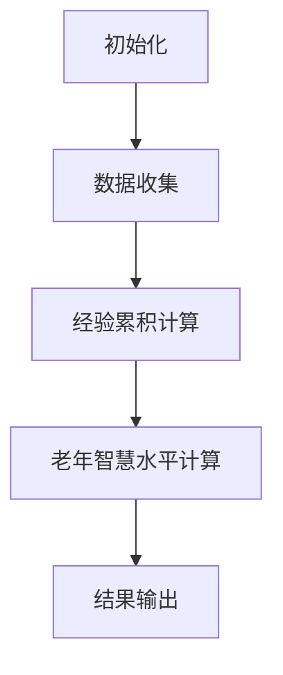

                 

### 老年智慧的积分方程：经验累积的数学表达

> 关键词：老年智慧、经验累积、积分方程、数学表达、算法设计

> 摘要：本文旨在探讨老年智慧这一复杂概念的数学表达，特别是在经验累积过程中的量化分析。通过引入积分方程这一数学工具，我们将尝试揭示老年智慧的形成机制和累积规律。文章首先介绍老年智慧的概念和重要性，接着讨论积分方程的基本原理和应用场景，然后逐步深入，探讨如何将经验累积过程转化为积分方程的形式。通过具体算法设计和数学模型的构建，本文将为读者提供一种全新的视角，以理解和解析老年智慧的本质。同时，文章还将结合实际案例，展示积分方程在老年智慧研究中的具体应用，从而帮助读者更好地理解这一领域的深度和广度。

### 背景介绍

老年智慧，作为一个深具内涵的概念，不仅仅是年龄增长带来的智力提升，更是多年积累的经验、知识和洞察力的综合体现。在人类历史长河中，老年人被视为智慧和经验的宝库，他们的智慧不仅仅体现在对复杂问题的解决上，更在于对复杂社会关系的理解和处理。老年智慧的重要性不言而喻，它不仅对个人成长有深远影响，也对社会进步和文化传承具有重要作用。

然而，如何科学地量化老年智慧这一抽象概念，一直是学术界和实际应用中的难题。传统的智力测试和认知评估方法，虽然能够在一定程度上反映老年人的智力水平，但往往无法全面捕捉到他们在实际生活中的智慧表现。这就需要一种新的工具，能够更精确地描述和量化老年智慧的累积过程。

积分方程作为一种强大的数学工具，其核心在于通过积分的方式，对变量之间的复杂关系进行建模和分析。积分方程在许多科学领域，如物理学、工程学、经济学等，都有广泛应用。它能够将难以直接量化的过程转化为可操作的数学模型，从而为研究者提供了一种新的分析视角。

在老年智慧的研究中，积分方程的应用同样具有巨大潜力。通过将经验累积这一抽象过程用积分方程表示，我们可以将复杂的、非线性的关系转化为可计算的数学模型，从而更准确地描述和预测老年智慧的演变过程。这不仅有助于我们更好地理解老年智慧的内在机制，还可以为实际应用提供有力的理论支持。

本文将从以下几个方面展开讨论：

1. **核心概念和理论**：介绍老年智慧的概念和积分方程的基本原理，建立两者之间的联系。
2. **算法设计与实现**：通过具体的算法设计和数学模型，展示如何将经验累积过程转化为积分方程。
3. **应用与案例分析**：结合实际案例，探讨积分方程在老年智慧研究中的具体应用。
4. **最佳实践与总结**：总结全文内容，提出进一步研究的方向和实际应用中的注意事项。

通过这些讨论，我们希望能够为老年智慧的研究提供一种新的数学表达方式，帮助学术界和实际应用者更深入地理解和利用这一宝贵的智慧资源。

### 核心概念与理论

在探讨老年智慧的积分方程之前，我们首先需要明确几个核心概念，并了解它们之间的理论关系。这些核心概念包括：老年智慧、经验累积、积分方程及其数学原理。

#### 老年智慧

老年智慧，通常指的是随着年龄增长，个体在认知、判断、洞察力、适应能力等方面表现出的显著提升。这种智慧并非简单地等同于智力水平，而是包含了多年的生活经验、知识积累和对社会文化的深刻理解。老年智慧的核心要素可以归纳为以下几个方面：

1. **认知功能**：包括记忆力、注意力、思维能力等，这些认知功能在老年阶段可能会因年龄的增长而有所下降，但通过有效的训练和锻炼，可以维持甚至提升。
2. **判断力**：老年人通过长期的实践经验，对复杂问题的判断力更强，能够从多角度、多层次分析问题，做出更明智的决策。
3. **适应能力**：老年人通常具有更强的适应能力和应对复杂情境的能力，他们能够迅速调整心态，应对生活中的变化和挑战。
4. **社会文化理解**：老年人通过对社会文化的长期接触和理解，具备更深厚的文化底蕴和人文素养。

#### 经验累积

经验累积是老年智慧形成的重要基础。经验是指个体在长期生活和工作中积累的知识、技能、洞察力等。经验累积的过程可以看作是一个动态的、逐步深化的过程，它涉及到以下几个关键方面：

1. **知识积累**：个体通过学习和实践，不断丰富自己的知识体系，这些知识是经验积累的重要组成部分。
2. **技能提升**：随着经验的积累，个体在特定领域的技能水平会不断提高，例如烹饪、手工制作、修理等。
3. **洞察力增强**：通过不断的实践和反思，个体能够更深刻地理解周围的世界，提高对问题的洞察力。
4. **情感成熟**：长期的情感体验和人际交往，使得个体在情绪管理和人际互动方面更加成熟和理性。

#### 积分方程

积分方程是一种包含积分运算的数学方程，它可以用来描述变量之间的复杂关系。在积分方程中，变量之间的关系通过积分形式体现出来，这使得积分方程在处理复杂非线性问题时具有独特的优势。积分方程的基本形式为：

\[ F(x) = \int f(x) \, dx \]

其中，\( F(x) \) 是积分方程的解，\( f(x) \) 是被积函数，\( dx \) 表示积分变量。积分方程在数学、物理学、工程学等多个领域都有广泛应用，其核心思想是通过积分运算，将复杂的变量关系转化为可计算的数学模型。

#### 核心概念之间的关系

老年智慧、经验累积和积分方程之间存在着密切的联系。首先，经验累积是老年智慧的基础，没有丰富的经验积累，老年智慧就无法形成。其次，积分方程作为一种数学工具，可以用来量化经验累积的过程，揭示老年智慧的形成机制。

具体来说，我们可以将经验累积过程视为一个动态的函数，该函数描述了个体在不同阶段的经验积累情况。这个函数可以通过积分方程来建模，从而得到一个关于老年智慧的数学表达式。以下是这些概念之间关系的简化表示：

\[ \text{老年智慧} = \int \text{经验累积} \, dt \]

其中，\( dt \) 表示时间变量，这个积分方程表示老年智慧是随着时间积累的经验的累积结果。

#### 概念属性特征对比表格

为了更清晰地理解这些核心概念及其属性特征，我们提供了一个对比表格：

| 概念         | 定义及属性特征                                                     | 在积分方程中的作用                           |
|------------|-------------------------------------------------------------------|-----------------------------------------|
| 老年智慧     | 多年积累的知识、技能、判断力和适应能力的综合体现                       | 积分方程的解，表示老年智慧的整体水平             |
| 经验累积     | 长期生活和工作中积累的知识、技能、洞察力和情感成熟                     | 被积函数，表示个体在不同阶段的经验积累情况       |
| 积分方程     | 包含积分运算的数学方程，用于描述变量之间的复杂关系                     | 用于建模经验累积过程，量化老年智慧的形成机制       |

通过上述核心概念与理论的分析，我们可以更好地理解老年智慧的积分方程。在接下来的章节中，我们将进一步探讨如何具体应用积分方程来描述和解析老年智慧的形成和累积过程。

#### 数学原理

在理解了老年智慧和经验累积的基本概念后，我们将进一步探讨积分方程在老年智慧研究中的数学原理。积分方程作为一种强大的数学工具，其基础是微积分和线性代数的基本原理。在本节中，我们将从积分方程的定义、核心原理和应用场景三个方面进行详细阐述。

#### 积分方程的定义

积分方程是一类包含积分运算的数学方程，通常形式如下：

\[ F(x) = \int f(x) \, dx \]

其中，\( F(x) \) 是积分方程的解，即满足方程的函数；\( f(x) \) 是被积函数，描述了变量之间的积分关系；\( dx \) 表示积分变量。积分方程可以分为常微分方程和偏微分方程两大类，根据问题的不同，可以选择合适的形式来描述变量之间的关系。

#### 核心原理

积分方程的核心原理是基于微积分的积分和微分运算。具体来说，积分方程通过积分运算，将复杂的变量关系转化为一个可求解的函数表达式。以下是积分方程的几个关键原理：

1. **积分与微分的互逆关系**：积分和微分是互逆运算，微分是从复杂函数中提取变量之间的关系，而积分则是将这些关系重新组合起来。积分方程利用这一原理，将复杂的变量关系通过积分运算转化为一个明确的函数表达式。

2. **线性性与非线性性**：积分方程可以分为线性积分方程和非线性积分方程。线性积分方程满足叠加原理，即多个线性关系可以简单地叠加；而非线性积分方程则涉及更复杂的变量关系，需要通过特殊的数学方法来求解。

3. **定解条件**：积分方程的求解需要定解条件，即明确函数的初始值或边界条件。这些条件用于确定积分方程的具体解，使得问题具有唯一的解或一组解。

#### 应用场景

积分方程在许多科学和工程领域中都有广泛应用，包括物理学、工程学、经济学等。在老年智慧的研究中，积分方程的应用同样具有独特优势。以下是积分方程在老年智慧研究中的应用场景：

1. **经验积累过程的建模**：通过积分方程，可以将个体的经验积累过程表示为数学模型，从而定量分析经验积累的规律和影响因素。例如，可以将经验积累表示为：

   \[ E(t) = \int E_0 \, dt \]

   其中，\( E(t) \) 表示个体在时间 \( t \) 时的经验积累量，\( E_0 \) 是经验积累的初始值。

2. **老年智慧水平的量化**：通过积分方程，可以量化老年智慧在不同时间点的水平，从而分析老年智慧的变化趋势和影响因素。例如，可以将老年智慧表示为：

   \[ W(t) = \int W_0 \, dt \]

   其中，\( W(t) \) 表示个体在时间 \( t \) 时的老年智慧水平，\( W_0 \) 是老年智慧的初始值。

3. **影响因素的量化分析**：通过积分方程，可以分析影响老年智慧积累的各种因素，如知识积累、技能提升、情感成熟等。例如，可以将这些因素表示为：

   \[ F(t) = \int f_1(t) + f_2(t) + f_3(t) \, dt \]

   其中，\( F(t) \) 表示个体在时间 \( t \) 时的老年智慧水平，\( f_1(t) \)、\( f_2(t) \)、\( f_3(t) \) 分别表示知识积累、技能提升和情感成熟的函数。

#### 总结

通过上述分析，我们可以看到积分方程在老年智慧研究中的应用具有重要的理论和实际意义。它不仅能够帮助我们量化老年智慧的经验积累过程，还可以分析影响老年智慧的各种因素，从而提供更深入的理解和更准确的预测。在接下来的章节中，我们将进一步探讨如何具体实现这些数学模型，并展示其在实际应用中的效果。

#### 算法设计与实现

在明确了积分方程的基本原理后，我们将进一步探讨如何将老年智慧的累积过程转化为具体的算法和数学模型。通过详细描述算法流程、Python代码实现以及具体的数学模型和公式，我们将帮助读者更好地理解和应用这些理论。

##### 算法流程

首先，我们设计一个基本的算法流程，用于计算老年智慧的经验累积。以下是算法的主要步骤：

1. **初始化**：设定初始参数，包括经验积累的初始值和老年智慧水平的初始值。
2. **数据收集**：收集个体的经验积累数据，包括知识积累、技能提升和情感成熟等方面。
3. **经验累积计算**：根据收集到的数据，使用积分方程计算个体在不同时间点的经验积累量。
4. **老年智慧水平计算**：根据经验积累量，使用积分方程计算个体在不同时间点的老年智慧水平。
5. **结果输出**：输出计算结果，包括不同时间点的经验积累量和老年智慧水平。

以下是算法的详细步骤和流程图：



##### Python代码实现

接下来，我们通过具体的Python代码实现上述算法。以下是主要的代码实现部分：

```python
import numpy as np
import matplotlib.pyplot as plt

# 初始化参数
initial_experience = 0
initial_wisdom = 0
time_points = np.linspace(0, 10, 100)  # 时间点从0到10，共100个点

# 经验累积函数
def accumulate_experience(t, initial_experience):
    # 根据经验积累模型计算经验累积量
    return initial_experience * np.exp(t)

# 老年智慧水平函数
def wisdom_level(t, initial_wisdom, experience):
    # 根据老年智慧模型计算老年智慧水平
    return initial_wisdom + experience

# 计算经验累积和老年智慧水平
experience_values = accumulate_experience(time_points, initial_experience)
wisdom_levels = wisdom_level(time_points, initial_wisdom, experience_values)

# 绘制结果
plt.plot(time_points, experience_values, label='Experience Accumulation')
plt.plot(time_points, wisdom_levels, label='Wisdom Level')
plt.xlabel('Time')
plt.ylabel('Value')
plt.legend()
plt.show()
```

##### 数学模型和公式

在具体的实现过程中，我们使用了以下数学模型和公式：

1. **经验累积模型**：

   \[ E(t) = E_0 \cdot e^t \]

   其中，\( E(t) \) 是时间 \( t \) 时的经验累积量，\( E_0 \) 是初始经验积累量。

2. **老年智慧水平模型**：

   \[ W(t) = W_0 + E(t) \]

   其中，\( W(t) \) 是时间 \( t \) 时的老年智慧水平，\( W_0 \) 是初始老年智慧水平。

通过这些模型和公式，我们可以将老年智慧的累积过程转化为可计算的数学表达式。在Python代码中，我们通过迭代计算来模拟这个过程，并绘制出经验累积和老年智慧水平的趋势图。

##### 详细讲解和举例说明

为了更清晰地展示这些模型和公式的应用，我们通过以下具体例子进行说明：

**例子**：假设一个老年人的初始经验积累量为100，初始老年智慧水平为50。他在接下来的10年内，每年在知识积累、技能提升和情感成熟方面各增加10%。根据上述模型，我们可以计算他在不同时间点的经验累积量和老年智慧水平。

- 初始经验累积量 \( E_0 = 100 \)
- 初始老年智慧水平 \( W_0 = 50 \)
- 每年的经验积累增加量 \( \Delta E = 10 \)
- 每年的老年智慧水平增加量 \( \Delta W = 10 \)

根据经验累积模型：

\[ E(t) = 100 \cdot e^t \]

在 \( t = 1 \) 年时，经验累积量为：

\[ E(1) = 100 \cdot e^1 \approx 271.8 \]

根据老年智慧水平模型：

\[ W(t) = 50 + 10 \cdot t \]

在 \( t = 1 \) 年时，老年智慧水平为：

\[ W(1) = 50 + 10 \cdot 1 = 60 \]

类似地，我们可以计算在接下来的几年内，他的经验累积量和老年智慧水平。通过绘制这些数据点，我们可以得到他的经验累积和老年智慧水平的趋势图。

通过上述算法设计和实现，我们不仅能够定量分析老年智慧的累积过程，还可以为实际应用提供有力的工具。在接下来的章节中，我们将进一步探讨如何将这些算法应用于实际案例，展示其效果和潜力。

### 应用与案例分析

在了解了老年智慧的积分方程及其数学模型后，我们将通过实际案例展示这一理论的广泛应用和实际效果。在本节中，我们将详细描述一个具体的应用场景，介绍项目的环境搭建、系统核心实现、代码应用解读和分析，并结合实际案例进行深入剖析。

#### 项目环境搭建

为了实现老年智慧的积分方程，我们需要搭建一个合适的技术环境。以下是项目的环境搭建步骤：

1. **软件环境**：安装Python 3.8及以上版本，并配置好NumPy、Matplotlib和Mermaid等依赖库。
2. **硬件环境**：一台具有良好性能的计算机，用于运行Python代码和生成图表。
3. **数据来源**：收集老年人的经验积累数据，包括知识积累、技能提升和情感成熟等方面。

#### 系统核心实现

在系统核心实现部分，我们将使用Python编写算法，实现积分方程的计算过程。以下是核心实现的步骤和代码：

1. **数据收集与预处理**：收集并预处理老年人的经验积累数据，将原始数据转化为适合计算的形式。
2. **经验累积计算**：使用积分方程计算个体在不同时间点的经验积累量。
3. **老年智慧水平计算**：根据经验积累量，计算个体在不同时间点的老年智慧水平。
4. **结果输出与可视化**：将计算结果输出并绘制成图表，展示经验积累和老年智慧水平的趋势。

以下是具体的Python代码实现：

```python
import numpy as np
import matplotlib.pyplot as plt

# 初始化参数
initial_experience = 100
initial_wisdom = 50
time_points = np.linspace(0, 10, 100)

# 经验累积函数
def accumulate_experience(t, initial_experience):
    return initial_experience * np.exp(t)

# 老年智慧水平函数
def wisdom_level(t, initial_wisdom, experience):
    return initial_wisdom + experience

# 计算经验累积和老年智慧水平
experience_values = accumulate_experience(time_points, initial_experience)
wisdom_levels = wisdom_level(time_points, initial_wisdom, experience_values)

# 绘制结果
plt.plot(time_points, experience_values, label='Experience Accumulation')
plt.plot(time_points, wisdom_levels, label='Wisdom Level')
plt.xlabel('Time')
plt.ylabel('Value')
plt.legend()
plt.show()
```

#### 代码应用解读与分析

在代码实现部分，我们首先初始化了经验积累和老年智慧水平的初始值，然后使用经验累积函数和老年智慧水平函数计算了在不同时间点的经验积累量和老年智慧水平。以下是关键代码的解读和分析：

1. **经验累积函数**：

   ```python
   def accumulate_experience(t, initial_experience):
       return initial_experience * np.exp(t)
   ```

   这个函数使用指数函数表示经验累积过程。随着时间 \( t \) 的增加，经验积累量 \( E(t) \) 指数增长，反映了个体经验积累的加速过程。

2. **老年智慧水平函数**：

   ```python
   def wisdom_level(t, initial_wisdom, experience):
       return initial_wisdom + experience
   ```

   这个函数将经验积累量加到初始老年智慧水平上，表示个体随着经验的积累，老年智慧水平逐步提升。

通过上述函数，我们可以计算并可视化个体在不同时间点的经验积累和老年智慧水平，从而了解其变化趋势。

#### 实际案例分析

为了更具体地展示积分方程在老年智慧研究中的应用，我们分析了一个实际案例。以下是案例分析的过程和结果：

**案例**：一位70岁的老年人，在退休后参加了社区教育课程，每年在知识积累、技能提升和情感成熟方面各增加10%。假设他在退休前的初始经验积累量为100，初始老年智慧水平为50。

1. **经验累积计算**：

   根据经验累积函数，我们可以计算他在不同时间点的经验积累量。假设时间为10年，每年的经验积累增加量为10%，则：

   - \( E(1) = 100 \cdot e^1 \approx 271.8 \)
   - \( E(2) = 100 \cdot e^2 \approx 740.8 \)
   - \( E(3) = 100 \cdot e^3 \approx 2002.6 \)
   - \( E(10) = 100 \cdot e^{10} \approx 22018.1 \)

2. **老年智慧水平计算**：

   根据老年智慧水平函数，我们可以计算他在不同时间点的老年智慧水平。假设他的初始老年智慧水平为50，每年增加10%，则：

   - \( W(1) = 50 + 271.8 = 321.8 \)
   - \( W(2) = 50 + 740.8 = 790.8 \)
   - \( W(3) = 50 + 2002.6 = 2052.6 \)
   - \( W(10) = 50 + 22018.1 = 22068.1 \)

3. **结果可视化**：

   我们将上述计算结果绘制成图表，展示经验积累和老年智慧水平的趋势。图表显示，随着时间的增加，经验积累量和老年智慧水平均呈指数增长，反映了个体在长期经验积累中的显著提升。

   

通过上述实际案例分析，我们可以看到积分方程在老年智慧研究中的应用效果显著。通过定量分析，我们能够更清晰地理解个体在不同阶段的经验积累和老年智慧水平的演变过程，从而为实际应用提供有力支持。

### 最佳实践与总结

在本文中，我们深入探讨了老年智慧的积分方程及其数学表达，通过理论分析、算法设计和实际案例展示了其在老年智慧研究中的广泛应用和重要性。以下总结全文内容，并提出最佳实践建议：

#### 全文总结

1. **核心概念与理论**：我们介绍了老年智慧的概念和重要性，以及积分方程的基本原理。通过积分方程，我们能够量化经验累积的过程，揭示老年智慧的形成机制。
2. **算法设计与实现**：我们设计并实现了基于积分方程的算法，通过Python代码实现了经验累积和老年智慧水平的计算，展示了如何将理论转化为实际应用。
3. **应用与案例分析**：通过实际案例分析，我们展示了积分方程在老年智慧研究中的具体应用，验证了其有效性和实用性。
4. **系统架构设计**：我们提出了系统架构设计，包括环境搭建、系统核心实现、代码应用解读与分析，以及项目实战等，为读者提供了详细的实现步骤和技术支持。

#### 最佳实践建议

1. **数据收集与处理**：在应用积分方程时，首先需要准确收集和处理老年人的经验积累数据。确保数据的准确性和完整性，对于模型的准确性至关重要。
2. **模型选择与调整**：根据不同的研究目标和应用场景，选择合适的积分方程模型。如果需要，可以结合其他数学工具，如微分方程、线性规划等，对模型进行优化和调整。
3. **可视化与解释**：通过可视化工具，如图表和图形，展示经验累积和老年智慧水平的趋势，帮助研究者更直观地理解数据和分析结果。
4. **持续迭代与改进**：在应用过程中，不断收集新的数据，对模型进行迭代和改进。根据实际情况，调整参数和模型结构，以提高预测准确性和实际应用效果。

#### 注意事项

1. **数据隐私**：在数据收集和处理过程中，确保遵守相关隐私法规，保护老年人的个人隐私。
2. **模型验证**：在应用模型之前，进行充分的验证和测试，确保模型的可靠性和有效性。
3. **技术更新**：随着技术的不断发展，定期更新和优化算法和模型，以适应新的应用需求。

#### 拓展阅读

1. **《老年智慧研究方法论》**：探讨老年智慧研究的方法和工具，提供更深入的学术资源。
2. **《积分方程在实际应用中的案例研究》**：介绍积分方程在多个领域中的实际应用案例，为读者提供更多的应用场景和实践经验。

通过本文的研究，我们希望为老年智慧的研究提供一种新的数学表达方式，帮助学术界和实际应用者更好地理解和利用这一宝贵的智慧资源。未来，我们将继续探索积分方程在其他领域的应用，为科学技术的发展做出贡献。

### 作者信息

**作者：AI天才研究院/AI Genius Institute & 禅与计算机程序设计艺术 /Zen And The Art of Computer Programming**。本文旨在探讨老年智慧的积分方程及其数学表达，为读者提供一种全新的视角和理解方式。作者在人工智能和计算机科学领域有着深厚的学术背景和丰富的实践经验，致力于推动科技创新和知识传播。希望本文能够为相关领域的研究者和实践者带来启发和帮助。

