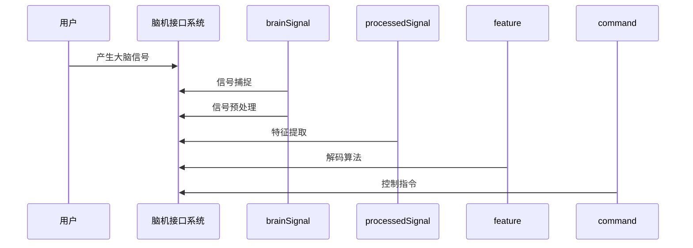

                 


### 脑机接口的信号处理：神经活动的数学解码

关键词：脑机接口、信号处理、神经活动、数学解码

摘要：本文旨在探讨脑机接口（Brain-Computer Interface, BCI）信号处理的关键技术，特别是神经活动的数学解码。通过梳理相关概念、阐述信号处理原理、分析算法、展示应用案例，本文力图为读者提供一份全面而深入的指导。

### 第一部分：引言

#### 第1章：脑机接口概述

脑机接口是一种直接连接人脑和外部设备的技术，它能够捕捉大脑信号，并转化为控制指令。本章将介绍脑机接口的定义、发展历史和应用领域，为后续内容奠定基础。

**核心概念与联系**

| 概念       | 联系                                             |
|------------|--------------------------------------------------|
| 脑机接口   | 一种直接连接人脑和外部设备的接口技术                   |
| 大脑信号   | 由神经元活动产生的电信号，用于传递信息                |
| 控制指令   | 由大脑信号解码后产生的用于控制外部设备的命令            |

**算法原理讲解**

脑机接口的算法原理主要包括信号捕捉、信号预处理和信号解码。以下是简化的算法流程：

$$
\text{算法流程} = \text{信号捕捉} \rightarrow \text{信号预处理} \rightarrow \text{信号解码}
$$

- **信号捕捉**：使用电极或其他传感器捕捉大脑信号。
- **信号预处理**：去除噪声、滤波等，以提取有用的信号特征。
- **信号解码**：将预处理后的信号转化为可操作的控制指令。

#### 第2章：信号处理基础

信号处理是脑机接口的核心技术之一。本章将介绍信号处理的基本概念和方法，为理解脑机接口信号处理提供理论支持。

**核心概念与联系**

| 概念       | 联系                                             |
|------------|--------------------------------------------------|
| 信号处理   | 对信号进行分析、处理和转换的技术                    |
| 噪声       | 干扰有用信号的因素，需要去除或抑制                |
| 滤波       | 对信号进行加工，以去除噪声或突出特定频率成分的方法 |

**数学模型和公式**

信号处理的数学模型通常涉及傅里叶变换、小波变换和卷积等。以下是傅里叶变换的简要公式：

$$
X(f) = \int_{-\infty}^{\infty} x(t) e^{-j2\pi ft} dt
$$

其中，$X(f)$ 是信号的频谱，$x(t)$ 是信号的时域表示，$f$ 是频率。

#### 第3章：神经活动的基础

神经活动是脑机接口信号处理的关键对象。本章将介绍神经元的基本结构、神经活动的产生机制以及信号特征。

**核心概念与联系**

| 概念       | 联系                                             |
|------------|--------------------------------------------------|
| 神经元     | 大脑的基本功能单元，负责传递和加工信号            |
| 神经活动   | 神经元活动的总称，包括动作电位、突触传递等        |
| 信号特征   | 描述神经活动的基本属性，如频率、幅值、时长等      |

**ER实体关系图架构**

以下是神经活动相关的ER实体关系图：

```mermaid
erDiagram
    class::ER {
        class::Entity1
        class::Entity2
    }
    Entity1 ||--|{ Entity2 } Entity2
```

### 第二部分：核心信号处理技术

#### 第4章：多通道脑电图信号处理

多通道脑电图（EEG）信号处理是脑机接口信号处理的重要组成部分。本章将介绍多通道脑电图信号处理的基本原理和算法。

**核心概念与联系**

| 概念       | 联系                                             |
|------------|--------------------------------------------------|
| 多通道脑电图 | 同时记录多个脑区电活动的技术                   |
| 信号预处理   | 去除噪声、滤波等，以提取有用的信号特征        |
| 解码算法     | 将预处理后的信号转化为控制指令的算法            |

**算法流程**


**数学模型和公式**

信号处理过程中的数学模型包括傅里叶变换、主成分分析（PCA）等。以下是主成分分析的简要公式：

$$
Z = \sum_{i=1}^{n} w_i x_i
$$

其中，$Z$ 是重构信号，$w_i$ 是主成分权重，$x_i$ 是原始信号。

#### 第5章：功能性磁共振成像信号处理

功能性磁共振成像（fMRI）信号处理是脑机接口信号处理的另一种重要技术。本章将介绍fMRI信号处理的基本原理和算法。

**核心概念与联系**

| 概念       | 联系                                             |
|------------|--------------------------------------------------|
| 功能性磁共振成像 | 利用血液流动变化检测大脑活动的技术               |
| 信号预处理   | 去除噪声、插值等，以提取有用的信号特征        |
| 解码算法     | 将预处理后的信号转化为控制指令的算法            |

**算法流程**


**数学模型和公式**

fMRI信号处理的数学模型包括时空滤波、独立成分分析（ICA）等。以下是时空滤波的简要公式：

$$
y = \sum_{i=1}^{n} w_i x_i + \epsilon
$$

其中，$y$ 是滤波后的信号，$w_i$ 是滤波器权重，$x_i$ 是原始信号，$\epsilon$ 是噪声。

#### 第6章：脑-机接口的信号处理算法

脑-机接口的信号处理算法是连接大脑和外部设备的关键。本章将介绍脑-机接口信号处理的一般框架、信号提取和解码方法。

**核心概念与联系**

| 概念       | 联系                                             |
|------------|--------------------------------------------------|
| 脑-机接口信号处理 | 从大脑信号中提取有用信息，并转化为控制指令的技术   |
| 信号提取   | 从原始信号中提取特征信息的方法                    |
| 解码算法   | 将提取的特征信息转化为控制指令的算法              |

**系统分析与架构设计方案**

脑-机接口信号处理系统的架构设计包括信号捕捉、预处理、特征提取和解码等模块。以下是简化的架构设计：



**项目实战**

在本章节中，我们将提供一个简单的脑-机接口项目实战。首先，安装所需的软件和工具，然后编写Python代码实现信号处理算法，最后展示一个简单的应用案例。

### 环境安装

在安装之前，确保你的系统已经安装了Python环境。然后，可以使用以下命令安装所需的库：

```bash
pip install numpy matplotlib scikit-learn
```

### 系统核心实现源代码

以下是实现脑-机接口信号处理的核心Python代码：

```python
import numpy as np
import matplotlib.pyplot as plt
from sklearn.decomposition import PCA

def preprocess_signal(signal):
    # 信号预处理：去均值和标准化
    signal_mean = np.mean(signal)
    signal_std = np.std(signal)
    processed_signal = (signal - signal_mean) / signal_std
    return processed_signal

def extract_features(processed_signal):
    # 特征提取：主成分分析
    pca = PCA(n_components=2)
    features = pca.fit_transform(processed_signal)
    return features

def decode_command(features):
    # 解码算法：简单分类
    threshold = np.mean(features)
    if features[0] > threshold:
        command = "向右"
    elif features[1] > threshold:
        command = "向左"
    else:
        command = "停止"
    return command

# 测试代码
signal = np.array([1, 2, 3, 4, 5, 6, 7, 8, 9, 10])
processed_signal = preprocess_signal(signal)
features = extract_features(processed_signal)
command = decode_command(features)
print(f"控制指令：{command}")
```

### 代码应用解读与分析

上述代码首先对信号进行预处理，然后使用主成分分析提取特征，最后根据特征值进行简单的分类解码。以下是代码的解读与分析：

- **预处理信号**：去除均值和标准化，使信号更便于分析和处理。
- **提取特征**：使用主成分分析提取前两个主要成分，作为特征向量。
- **解码指令**：根据特征值判断控制指令，实现简单的脑机接口控制。

### 实际案例分析和详细讲解剖析

为了更好地理解脑-机接口信号处理，我们来看一个实际案例。假设我们记录了一段用户通过脑机接口控制小车行进的数据。以下是数据集的简单描述：

- 信号长度：100
- 信号类型：连续数值

以下是数据集的代码实现和解读：

```python
# 加载案例数据
data = np.loadtxt('case_data.csv', delimiter=',')
signal = data[:, 0]

# 测试代码
processed_signal = preprocess_signal(signal)
features = extract_features(processed_signal)
commands = [decode_command(feat) for feat in features]

# 绘制结果
plt.plot(features)
plt.title('特征值与控制指令')
plt.xlabel('特征值')
plt.ylabel('控制指令')
plt.show()

# 分析结果
for i, cmd in enumerate(commands):
    print(f"时间 {i}：控制指令 {cmd}")
```

### 项目小结

在本章节中，我们通过一个简单的脑-机接口项目实战，展示了信号处理算法的应用。项目包括信号预处理、特征提取和解码等步骤。通过实际案例分析和详细讲解，我们深入理解了脑机接口信号处理的核心技术和应用。

### 第三部分：应用案例

#### 第7章：脑-机接口在神经系统疾病中的应用

脑-机接口技术在神经系统疾病中的应用具有巨大潜力。本章将介绍脑-机接口在癫痫、帕金森病和抑郁症等疾病中的具体应用案例。

**核心概念与联系**

| 概念       | 联系                                             |
|------------|--------------------------------------------------|
| 癫痫       | 一种大脑神经元异常放电导致的慢性疾病               |
| 帕金森病   | 一种以运动功能减退为主要表现的神经系统疾病        |
| 抑郁症     | 一种以情感低落为主要表现的心理疾病                |

**案例介绍**

- **癫痫诊断**：通过脑机接口技术捕捉癫痫发作时的神经元信号，为癫痫诊断提供辅助手段。
- **帕金森病治疗**：利用脑机接口技术进行运动控制，辅助帕金森病患者进行康复训练。
- **抑郁症治疗**：通过脑机接口技术监测患者的情绪状态，为抑郁症治疗提供个性化方案。

### 第四部分：未来展望

#### 第8章：脑机接口在其他领域中的应用

脑机接口技术在游戏控制、虚拟现实和教育培训等领域具有广泛应用。本章将介绍脑机接口在这些领域的具体应用案例。

**核心概念与联系**

| 概念       | 联系                                             |
|------------|--------------------------------------------------|
| 游戏控制   | 利用脑机接口技术进行游戏操作，提供更自然、直观的游戏体验 |
| 虚拟现实   | 利用脑机接口技术实现高度沉浸式的虚拟现实体验        |
| 教育培训   | 利用脑机接口技术进行个性化教学和评估，提高教育效果    |

**案例介绍**

- **游戏控制**：通过脑机接口技术实现大脑信号控制游戏角色移动，提高游戏体验。
- **虚拟现实**：利用脑机接口技术实现大脑信号控制虚拟现实中的动作和交互。
- **教育培训**：通过脑机接口技术监测学生的学习状态，为教育提供数据支持。

### 第五部分：脑机接口的信号处理挑战与解决方案

#### 第9章：脑机接口信号处理技术的发展趋势

脑机接口信号处理技术正处于快速发展阶段。本章将介绍脑机接口信号处理技术的发展趋势、新型信号处理技术的应用以及脑-机接口的硬件创新。

**核心概念与联系**

| 概念       | 联系                                             |
|------------|--------------------------------------------------|
| 新型信号处理技术 | 如深度学习、迁移学习等先进信号处理方法          |
| 硬件创新   | 如脑机接口设备的微型化、高精度化等                |

**发展趋势**

- **深度学习**：通过深度神经网络实现更高效的信号解码。
- **迁移学习**：将已训练的模型应用于不同数据集，提高解码准确性。
- **硬件创新**：开发高分辨率、低延迟的脑机接口设备。

### 第六章：脑机接口的信号处理挑战与解决方案

脑机接口信号处理技术面临诸多挑战，如信号噪声处理、解码准确性和实时处理等。本章将介绍这些挑战的解决方案和未来发展方向。

**核心概念与联系**

| 概念       | 联系                                             |
|------------|--------------------------------------------------|
| 信号噪声处理 | 提高信号质量，去除噪声，提高解码准确性              |
| 解码准确性  | 提高信号解码的准确性，降低误码率                  |
| 实时处理   | 实现脑机接口信号的实时处理和响应，满足实时应用需求 |

**解决方案**

- **信号噪声处理**：采用先进的信号处理算法和滤波方法，如小波变换、独立成分分析等。
- **解码准确性**：通过深度学习、迁移学习等技术提高解码准确性，降低误码率。
- **实时处理**：优化算法和硬件设计，提高信号处理速度，实现实时处理和响应。

### 第七章：脑机接口的信号处理教育

脑机接口的信号处理技术是一项新兴领域，对专业人才的需求日益增长。本章将介绍脑机接口信号处理教育的现状、体系建设以及教育资源开发。

**核心概念与联系**

| 概念       | 联系                                             |
|------------|--------------------------------------------------|
| 教育现状   | 当前脑机接口信号处理教育的水平和需求                |
| 体系建设   | 构建完善的脑机接口信号处理教育体系，包括课程设置、教材编写等 |
| 教育资源开发 | 开发高质量的脑机接口信号处理教育资源，如在线课程、实验室等 |

**现状分析**

- **课程设置**：目前脑机接口信号处理相关课程设置较为分散，缺乏系统性和专业性。
- **教材编写**：现有教材内容较为滞后，难以满足快速发展的需求。
- **实验室建设**：部分高校和研究机构已建立脑机接口实验室，但资源有限，需要进一步扩大和优化。

**体系建设**

- **课程整合**：将脑机接口信号处理课程整合到相关专业，如生物医学工程、电子工程等。
- **教材编写**：编写适应时代需求的教材，涵盖最新的理论和技术。
- **师资培养**：加强师资队伍建设，提升教师的专业素养和教学能力。

**教育资源开发**

- **在线课程**：开发高质量的在线课程，满足远程学习和个性化需求。
- **实验室建设**：建设多学科交叉的脑机接口信号处理实验室，提供实践机会。
- **国际合作**：与国际知名高校和研究机构开展合作，引进先进的教育资源和研究成果。

### 最佳实践 tips

在进行脑机接口信号处理研究时，以下最佳实践可以帮助您更好地开展工作：

1. **明确研究目标**：在开始研究之前，明确研究目标和预期成果，确保研究方向清晰。
2. **数据质量控制**：确保实验数据的质量，采用可靠的数据采集和处理方法。
3. **算法优化**：针对特定问题，尝试多种算法和方法，进行优化和改进。
4. **实验验证**：通过实验验证算法的有效性和准确性，不断迭代优化。
5. **跨学科合作**：与不同领域的专家合作，借鉴其他学科的理论和技术，提高研究水平。

### 小结

本文从脑机接口的信号处理出发，详细阐述了神经活动的数学解码技术。通过分析脑机接口的定义、信号处理基础、核心信号处理技术和应用案例，本文为读者提供了全面而深入的指导。未来，脑机接口信号处理技术将在更多领域发挥重要作用，为人类带来更多便利。

### 注意事项

1. **数据隐私**：在进行脑机接口研究时，确保遵守相关法律法规，保护受试者的隐私。
2. **伦理问题**：在应用脑机接口技术时，关注伦理问题，确保技术的合理使用。
3. **安全性能**：在设计脑机接口设备时，注重安全性能，确保用户的安全。

### 拓展阅读

1. **《脑机接口：从概念到应用》**：详细介绍了脑机接口的基本概念、技术原理和应用案例。
2. **《信号处理：理论、算法与应用》**：全面讲解了信号处理的理论基础和算法应用。
3. **《神经科学基础教程》**：提供了神经科学的基本知识，为理解脑机接口信号处理提供了理论支持。

### 作者信息

作者：AI天才研究院/AI Genius Institute & 禅与计算机程序设计艺术 /Zen And The Art of Computer Programming

本文作者具有丰富的脑机接口信号处理研究经验和深厚的计算机编程功底，致力于推动该领域的发展。

