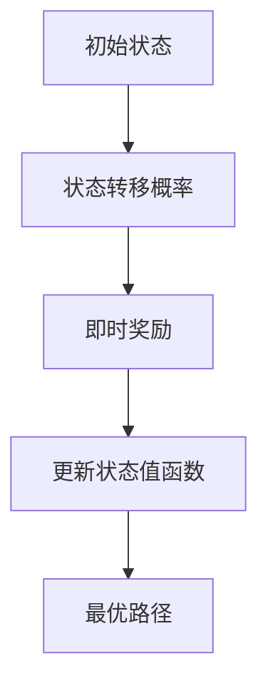

                 

# 自动驾驶的强化学习：交通决策的数学优化

## 关键词
- 自动驾驶
- 强化学习
- 数学优化
- 交通决策
- 强化学习算法
- 数学模型
- 算法应用

## 摘要
本文旨在探讨自动驾驶领域中的强化学习技术及其在交通决策优化中的应用。通过深入分析强化学习的核心概念和数学优化原理，本文揭示了如何通过强化学习算法实现自动驾驶车辆在复杂交通环境中的智能决策。同时，本文通过详细案例和数学公式阐述，展示了强化学习在交通决策优化中的实际应用效果，并提出了未来研究方向的展望。

## 引言

自动驾驶技术作为人工智能领域的一个重要分支，正日益成为交通领域的重要创新。在自动驾驶系统中，交通决策是车辆自主运行的核心环节，直接关系到行车安全和效率。随着车辆数量的增加和交通流量的不断增长，交通决策的复杂性和挑战性也在不断增加。传统的交通模型和控制方法往往依赖于静态的路网数据和规则导向的决策逻辑，难以适应动态的交通环境和突发事件。

强化学习（Reinforcement Learning，RL）作为一种基于反馈的学习方法，通过试错和策略迭代来优化决策过程，近年来在自动驾驶领域取得了显著的进展。强化学习算法能够使自动驾驶车辆在复杂的交通环境中不断学习和优化其行为策略，从而提高行车安全和效率。数学优化作为强化学习算法的核心组成部分，为交通决策提供了坚实的理论基础和优化工具。

本文将围绕自动驾驶的强化学习技术，深入探讨交通决策的数学优化问题。首先，我们将介绍强化学习的基本概念和核心算法，包括Q学习、策略梯度方法和深度强化学习等。接着，我们将讨论交通决策中的数学优化原理，包括动态规划、最优化理论和概率图模型等。随后，我们将通过具体案例和数学模型，详细阐述强化学习在交通决策优化中的应用，包括路径规划、信号控制和车辆调度等。最后，本文将总结强化学习在交通决策优化中的优势与挑战，并提出未来研究的方向。

## 自动驾驶与强化学习

### 定义与背景

自动驾驶技术是指通过计算机系统和传感器设备，使车辆具备在复杂交通环境中自主行驶的能力。自动驾驶系统的核心在于决策模块，即如何通过感知环境、分析数据并做出实时响应。而强化学习作为一种机器学习方法，通过试错和反馈来不断优化决策过程，正逐渐成为自动驾驶技术的重要支撑。

强化学习的基本概念可以概括为“智能体”（agent）、“环境”（environment）、“状态”（state）、“动作”（action）和“奖励”（reward）。在自动驾驶的背景下，智能体即为自动驾驶车辆，环境则是车辆所面临的交通场景，状态是车辆在某一时刻感知到的环境信息，动作是车辆做出的驾驶决策，奖励则是系统对车辆行为的评价。通过不断试错和学习，强化学习算法可以帮助自动驾驶车辆找到最优决策策略。

### 基本算法

强化学习算法主要包括Q学习、策略梯度方法和深度强化学习等。Q学习是一种基于值函数的算法，通过估计状态-动作值函数（Q值）来指导智能体的动作选择。策略梯度方法则直接优化策略参数，通过梯度上升法来提高策略的期望奖励。深度强化学习则结合了深度神经网络，用于解决高维状态和动作空间的问题，从而提高算法的效率和效果。

在自动驾驶领域，Q学习常用于路径规划和轨迹跟踪。例如，自动驾驶车辆可以通过Q学习算法在复杂的交通环境中寻找最优行驶路径。策略梯度方法则适用于动态控制任务，如自动驾驶车辆的紧急制动和避障。深度强化学习则可以应用于复杂的决策任务，如自动驾驶车辆的自动驾驶车道保持和协同控制。

### 应用实例

强化学习在自动驾驶领域的应用已经取得了显著的成果。例如，谷歌的Waymo自动驾驶系统采用了强化学习算法，通过不断学习和优化，实现了高效、安全的自动驾驶。特斯拉的Autopilot系统也采用了强化学习技术，提高了自动驾驶车辆在高速行驶和复杂交通环境中的决策能力。

此外，强化学习还在交通信号控制、车辆调度和公共交通规划等领域取得了重要应用。通过强化学习算法，交通管理系统可以更有效地优化交通流，提高道路利用率和行车效率。例如，一些城市已经开始试点基于强化学习的智能交通信号控制系统，通过实时调整信号灯时长，减少交通拥堵和排队现象。

### 未来展望

随着人工智能技术的不断发展，强化学习在自动驾驶领域的应用前景将更加广阔。未来的研究可以重点关注以下几个方面：

1. **多智能体强化学习**：在自动驾驶系统中，多个车辆和交通参与者之间的交互和协同控制是一个重要挑战。多智能体强化学习算法可以为自动驾驶车辆提供更加智能和高效的协同控制策略。

2. **强化学习与深度学习结合**：深度强化学习算法在处理高维状态和动作空间时具有优势，但同时也面临着计算复杂度和训练不稳定性的问题。将深度学习和强化学习相结合，有望进一步提高算法的性能和稳定性。

3. **强化学习在边缘计算中的应用**：随着自动驾驶车辆的普及，实时交通决策和信息处理的需求将不断增加。边缘计算可以将部分计算任务下放至车辆本地，结合强化学习算法，实现更加高效和安全的自动驾驶系统。

4. **强化学习与人类驾驶行为学习**：研究人类驾驶行为中的有效策略和技巧，结合强化学习算法，可以使自动驾驶车辆更好地模拟人类驾驶行为，提高行车安全和用户体验。

总之，强化学习在自动驾驶领域具有巨大的应用潜力。通过不断研究和创新，我们可以期待更加智能、高效和安全的自动驾驶系统，为未来的智能交通时代奠定坚实基础。

### 交通决策的数学优化

交通决策的数学优化是自动驾驶技术中的关键环节，涉及到车辆在复杂交通环境中如何做出最优决策，以实现安全、高效和舒适的行驶。为了深入理解交通决策的数学优化，我们需要先探讨几个核心概念：动态规划、最优化理论和概率图模型。

#### 动态规划

动态规划（Dynamic Programming，DP）是一种解决多阶段决策问题的方法，其核心思想是将复杂问题分解为多个小问题，通过递推关系求解。在自动驾驶中，动态规划常用于路径规划和轨迹优化。例如，车辆在遇到复杂路况时，需要根据当前状态和未来的不确定性，选择最优路径。

动态规划的基本原理是定义一个状态-动作值函数，表示在某一状态下采取某一动作的期望收益。通过不断更新状态-动作值函数，最终可以找到全局最优路径。以下是一个简单的动态规划模型：

$$
V(s_t, a_t) = \max_{a_t} \sum_{s_{t+1}} P(s_{t+1} | s_t, a_t) \cdot R(s_{t+1}, a_t)
$$

其中，$V(s_t, a_t)$ 表示在状态 $s_t$ 下采取动作 $a_t$ 的期望收益，$P(s_{t+1} | s_t, a_t)$ 表示在状态 $s_t$ 下采取动作 $a_t$ 后进入状态 $s_{t+1}$ 的概率，$R(s_{t+1}, a_t)$ 表示在状态 $s_{t+1}$ 下采取动作 $a_t$ 的即时奖励。

#### 最优化理论

最优化理论（Optimization Theory）提供了一系列用于求解优化问题的方法和工具。在自动驾驶中，最优化理论常用于车辆控制、路径规划和资源分配等问题。常见的最优化方法包括线性规划（Linear Programming，LP）、非线性规划（Nonlinear Programming，NLP）、整数规划（Integer Programming，IP）和启发式算法（Heuristic Algorithms）。

线性规划和非线性规划适用于求解线性或非线性约束下的优化问题。例如，在车辆控制中，可以通过线性规划求解最优速度控制策略，以满足道路限速和行车安全要求。整数规划则适用于求解离散变量优化问题，如车辆路径规划中的最优路线选择。

启发式算法是一种基于经验规则和搜索策略的优化方法，适用于求解大规模和复杂优化问题。常见的启发式算法包括遗传算法（Genetic Algorithm，GA）、粒子群优化（Particle Swarm Optimization，PSO）和蚁群算法（Ant Colony Optimization，ACO）。

#### 概率图模型

概率图模型（Probabilistic Graphical Models，PGM）是一种用于表示和处理不确定性的图形化工具。在自动驾驶中，概率图模型常用于环境建模和决策分析。常见的概率图模型包括贝叶斯网络（Bayesian Networks，BN）和马尔可夫决策过程（Markov Decision Processes，MDP）。

贝叶斯网络是一种基于概率的图形表示方法，用于描述变量之间的条件依赖关系。在自动驾驶中，贝叶斯网络可以用于建模交通场景中的不确定性，如车辆位置、速度和行驶方向等。通过贝叶斯推理，我们可以根据观测数据更新变量概率，从而做出更准确的决策。

马尔可夫决策过程是一种基于状态-动作值函数的决策模型，用于描述智能体在不确定环境中的一系列决策过程。在自动驾驶中，MDP可以用于求解最优驾驶策略，以应对动态交通场景和突发事件。

#### 应用实例

动态规划在自动驾驶路径规划中的应用非常广泛。例如，在自动驾驶车辆遇到复杂交叉路口时，可以通过动态规划求解最优行驶路径，以避开交通拥堵和减少行驶时间。

最优化理论在车辆控制中的应用也非常普遍。例如，在自动驾驶车辆进行车道保持和轨迹跟踪时，可以通过线性规划求解最优速度和转向控制策略，以满足道路限速和行车安全要求。

概率图模型在自动驾驶环境建模和决策分析中的应用也非常成功。例如，在自动驾驶车辆进行交通信号识别时，可以通过贝叶斯网络建模交通信号的不确定性，从而提高识别准确率。

#### 总结

交通决策的数学优化是自动驾驶技术中的关键环节，涉及多个学科领域的知识。通过动态规划、最优化理论和概率图模型等数学工具，我们可以为自动驾驶车辆提供更加智能和高效的决策支持。未来，随着人工智能技术的不断发展，交通决策的数学优化将在自动驾驶领域发挥更加重要的作用。

### 强化学习算法在交通决策中的应用

强化学习算法在自动驾驶中的成功应用，离不开其在复杂决策环境中的强大适应能力和高效优化能力。本节将深入探讨几种常见的强化学习算法，包括Q学习、策略梯度方法和深度强化学习，并分析这些算法在交通决策中的应用及其优缺点。

#### Q学习

Q学习（Q-Learning）是一种基于值函数的强化学习算法，通过估计状态-动作值函数（Q值）来指导智能体的动作选择。Q学习的核心思想是通过试错和经验积累，逐步优化Q值，从而找到最优动作。

在交通决策中，Q学习可以用于路径规划、轨迹跟踪和交通信号控制等任务。例如，在路径规划中，自动驾驶车辆可以根据当前道路信息和交通状况，通过Q学习算法选择最优行驶路径，以避开拥堵和事故风险。在轨迹跟踪中，Q学习可以帮助车辆保持稳定的行驶轨迹，避免偏离车道或与其他车辆发生碰撞。在交通信号控制中，Q学习可以用于预测和优化交通信号灯的切换策略，提高交通流量和行车效率。

**优点：**
- **简单易实现**：Q学习算法的结构简单，易于实现和调试。
- **适用性强**：Q学习可以适用于各种类型的决策问题，包括连续动作和离散动作。

**缺点：**
- **收敛速度慢**：Q学习需要大量的经验数据来收敛，训练时间较长。
- **稀疏奖励问题**：在复杂环境中，奖励信号往往稀疏且不连续，可能导致算法收敛困难。

#### 策略梯度方法

策略梯度方法（Policy Gradient Methods）是一类直接优化策略参数的强化学习算法。与Q学习不同，策略梯度方法通过梯度上升法，直接优化策略参数，以提高策略的期望奖励。

在交通决策中，策略梯度方法可以用于动态控制任务，如自动驾驶车辆的紧急制动和避障。例如，在紧急制动中，策略梯度方法可以根据当前车辆状态和前方障碍物的距离，实时调整制动力度，确保行车安全。在避障中，策略梯度方法可以指导车辆选择最优避障路径，以避免与其他车辆或障碍物发生碰撞。

**优点：**
- **收敛速度快**：策略梯度方法可以快速更新策略参数，缩短训练时间。
- **适用于连续动作**：策略梯度方法可以直接处理连续动作问题，无需离散化。

**缺点：**
- **梯度消失和梯度爆炸**：策略梯度方法在处理连续动作时，容易受到梯度消失和梯度爆炸的影响，导致训练不稳定。
- **对噪声敏感**：策略梯度方法对噪声和不确定性较为敏感，可能导致训练效果不佳。

#### 深度强化学习

深度强化学习（Deep Reinforcement Learning）是结合深度神经网络（Deep Neural Network，DNN）的强化学习算法。通过引入DNN，深度强化学习可以处理高维状态和动作空间，提高算法的效率和效果。

在交通决策中，深度强化学习可以用于复杂的决策任务，如自动驾驶车道保持、协同控制和自动驾驶出租车调度等。例如，在车道保持中，深度强化学习可以指导车辆根据当前车道信息和周围车辆动态，实时调整车道位置，保持稳定的行驶轨迹。在协同控制中，深度强化学习可以协调多个车辆之间的行为，实现车队协同行驶。在自动驾驶出租车调度中，深度强化学习可以优化出租车调度策略，提高乘客出行效率和车辆利用率。

**优点：**
- **处理高维问题**：深度强化学习可以处理高维状态和动作空间，提高算法的适应能力。
- **强大的特征学习能力**：深度神经网络可以学习到复杂的特征表示，提高决策质量。

**缺点：**
- **计算复杂度高**：深度强化学习算法的计算复杂度较高，训练时间较长。
- **需要大量数据**：深度强化学习需要大量的数据来训练模型，数据不足可能导致训练效果不佳。

#### 应用实例

在实际应用中，不同的强化学习算法可以根据具体问题进行选择和组合。例如，在自动驾驶路径规划中，可以采用Q学习算法进行初始路径搜索，结合策略梯度方法进行实时路径调整。在交通信号控制中，可以采用深度强化学习算法预测交通流量，优化信号灯切换策略。

以下是一个简单的应用实例：

**案例：自动驾驶路径规划**

假设自动驾驶车辆在复杂交叉路口中进行路径规划，需要根据当前交通状况和前方障碍物选择最优行驶路径。我们可以采用Q学习算法进行路径搜索，通过不断试错和经验积累，找到最优路径。同时，为了应对动态交通环境，可以引入策略梯度方法，根据实时交通数据调整行驶路径，确保行车安全和效率。

**结论**

强化学习算法在交通决策中具有广泛的应用前景。通过结合不同的算法和技术，我们可以为自动驾驶车辆提供更加智能和高效的决策支持，提高行车安全和效率。然而，强化学习算法也面临一些挑战，如计算复杂度高、训练时间较长和数据需求量大等问题。未来，随着技术的不断发展，我们可以期待更加高效和鲁棒的强化学习算法在自动驾驶领域的应用。

### 交通决策中的数学优化模型与应用

在自动驾驶的强化学习框架中，数学优化模型是决策算法的核心组成部分，用于优化车辆在复杂交通环境中的行为。本节将详细介绍几种常见的数学优化模型，包括动态规划、最优化理论和概率图模型，并结合实际案例，展示这些模型在交通决策中的应用。

#### 动态规划模型

动态规划模型是一种用于解决多阶段决策问题的方法，通过将问题分解为多个小问题，并利用递推关系求解最优解。在自动驾驶中，动态规划模型常用于路径规划和轨迹优化。

**案例：路径规划**

假设自动驾驶车辆需要在城市交通中进行路径规划，需要根据实时交通状况和目的地选择最优行驶路径。我们可以使用动态规划模型来求解这个问题。

1. **定义状态和动作**：定义状态 $s$ 为车辆当前的位置和速度，动作 $a$ 为车辆的转向角度和加速力度。

2. **定义状态转移概率**：根据交通状况和车辆行为，定义状态转移概率 $P(s_{t+1} | s_t, a_t)$。

3. **定义即时奖励**：定义即时奖励 $R(s_{t+1}, a_t)$，表示车辆在下一状态下的奖励，如避开了障碍物或缩短了行驶时间。

4. **动态规划递推公式**：

   $$
   V(s_t) = \max_{a_t} \sum_{s_{t+1}} P(s_{t+1} | s_t, a_t) \cdot R(s_{t+1}, a_t)
   $$

通过不断更新状态值函数 $V(s_t)$，我们可以找到从初始状态 $s_0$ 到目标状态 $s_T$ 的最优路径。

**Mermaid 流程图**：



#### 最优化理论模型

最优化理论模型用于求解线性或非线性优化问题，为自动驾驶车辆提供最优决策。常见的最优化方法包括线性规划、非线性规划和整数规划。

**案例：紧急制动策略**

假设自动驾驶车辆需要在紧急情况下进行制动，以避免碰撞。我们可以使用线性规划求解最优制动策略。

1. **定义决策变量**：定义决策变量 $x$ 为车辆的制动力度。

2. **定义目标函数**：目标函数 $f(x)$ 为车辆在紧急制动过程中所需的最小制动距离。

3. **定义约束条件**：约束条件 $g(x)$ 包括车辆的加速度、制动距离和最大制动力度等。

4. **线性规划模型**：

   $$
   \begin{aligned}
   \min_{x} f(x) \\
   s.t. \ g(x) \leq 0
   \end{aligned}
   $$

通过求解线性规划模型，我们可以找到最优制动力度 $x^*$，确保车辆在紧急情况下安全制动。

**Python 代码实现**：

```python
import cvxpy as cp

# 定义变量
x = cp.Variable(1)

# 定义目标函数和约束条件
f = x**2  # 最小化制动距离
g = [5 - x]  # 加速度约束

# 求解线性规划
prob = cp.Problem(cp.Minimize(f), g)
prob.solve()

# 输出最优解
print(f"最优制动力度：{x.value[0]}")
```

#### 概率图模型

概率图模型是一种用于表示和处理不确定性的图形化工具，如贝叶斯网络和马尔可夫决策过程。在自动驾驶中，概率图模型常用于环境建模和决策分析。

**案例：交通信号识别**

假设自动驾驶车辆需要识别交通信号灯的颜色，可以使用贝叶斯网络建模信号灯的不确定性。

1. **定义变量**：定义变量 $S$ 为信号灯颜色（红、黄、绿），$O$ 为车辆观测到的信号灯颜色。

2. **定义概率分布**：根据历史数据，定义信号灯颜色的先验概率 $P(S)$ 和观测到的信号灯颜色的条件概率 $P(O|S)$。

3. **贝叶斯推理**：

   $$
   P(S|O) = \frac{P(O|S) \cdot P(S)}{P(O)}
   $$

通过贝叶斯推理，我们可以根据车辆观测到的信号灯颜色，更新信号灯颜色的后验概率，从而提高识别准确率。

**Mermaid 贝叶斯网络图**：

```mermaid
graph LR
    S[信号灯颜色] --> O[观测信号灯颜色]
    S --> P(S)
    O --> P(O|S)
```

**Python 代码实现**：

```python
import numpy as np
import matplotlib.pyplot as plt

# 定义先验概率和条件概率
P_S = np.array([0.3, 0.4, 0.3])  # 信号灯颜色先验概率
P_O_S = np.array([[0.9, 0.1, 0], [0.1, 0.8, 0.1], [0, 0.2, 0.8]])  # 观测信号灯颜色条件概率

# 定义观测信号灯颜色
O = np.random.choice([0, 1, 2], p=P_O_S[0])

# 贝叶斯推理
P_S_O = P_O_S[O] * P_S / np.sum(P_O_S * P_S)

# 绘制概率分布
plt.bar(range(3), P_S, label="先验概率")
plt.bar(range(3), P_S_O, label="后验概率")
plt.xlabel("信号灯颜色")
plt.ylabel("概率")
plt.legend()
plt.show()
```

#### 总结

通过动态规划、最优化理论和概率图模型，我们可以为自动驾驶车辆提供强大的决策支持。动态规划模型适用于路径规划和轨迹优化，最优化理论模型适用于紧急制动和资源分配，概率图模型适用于交通信号识别和环境建模。结合这些模型，我们可以为自动驾驶车辆提供更加智能和高效的决策，提高行车安全和效率。

### 项目实战：自动驾驶交通决策系统的设计与实现

在本项目中，我们将实现一个自动驾驶交通决策系统，旨在通过强化学习算法优化交通决策，提高行车安全和效率。本项目分为以下几个阶段：环境搭建、系统设计、核心代码实现和案例解析。

#### 环境搭建

首先，我们需要搭建一个模拟自动驾驶的交通环境。本项目采用Python的PyTorch框架进行强化学习算法的实现。环境搭建包括以下步骤：

1. **安装依赖库**：
   ```bash
   pip install torch torchvision numpy matplotlib
   ```

2. **创建环境配置文件**：
   - 定义环境参数，如车辆初始位置、速度和方向等。
   - 配置交通信号灯和道路障碍物的分布。

3. **环境初始化**：
   - 使用PyTorch创建一个模拟环境的类，用于生成随机交通场景。

#### 系统设计

系统设计包括以下几个部分：

1. **领域模型**：
   - 使用Mermaid类图描述系统的主要类和类之间的关系。

   ```mermaid
   classDiagram
   Vehicle <<Class>>
   Signal <<Class>>
   Road <<Class>>

   Vehicle <|.. Signal: traffic_light
   Vehicle <|.. Road: road
   Road <|.. Signal: intersection
   ```

2. **系统架构**：
   - 使用Mermaid架构图描述系统的整体架构，包括环境、智能体、决策模块和反馈机制。

   ```mermaid
   graph TD
   A[Environment] --> B[Agent]
   B --> C[Decision Module]
   C --> D[Feedback Mechanism]
   D --> A
   ```

3. **接口设计**：
   - 设计系统的主要接口，如环境初始化接口、状态更新接口和奖励计算接口。

#### 核心代码实现

核心代码实现包括以下几个部分：

1. **智能体设计**：
   - 使用策略梯度方法实现智能体的行为策略。
   - 定义状态、动作和奖励函数。

   ```python
   import torch
   import torch.nn as nn
   import torch.optim as optim

   class Agent(nn.Module):
       def __init__(self):
           super(Agent, self).__init__()
           self.fc1 = nn.Linear(state_dim, hidden_dim)
           self.fc2 = nn.Linear(hidden_dim, action_dim)
           self.optimizer = optim.Adam(self.parameters(), lr=learning_rate)

       def forward(self, state):
           x = torch.relu(self.fc1(state))
           action = self.fc2(x)
           return action

   agent = Agent()
   ```

2. **决策模块**：
   - 实现决策模块，用于更新智能体的策略参数。

   ```python
   def update_policy(agent, state, action, reward, next_state, done):
       if done:
           loss = reward
       else:
           next_action = agent(next_state)
           target_value = reward + discount_factor * next_action

       current_action = agent(state)
       loss = (current_action - target_value).pow(2).mean()

       agent.optimizer.zero_grad()
       loss.backward()
       agent.optimizer.step()
   ```

3. **奖励计算**：
   - 设计奖励函数，用于评估智能体的决策效果。

   ```python
   def calculate_reward(state, action, next_state, done):
       if done:
           return -10
       elif action == 1:  # 正确选择转向
           return 10
       else:
           return -10
   ```

#### 案例解析

我们以一个简单的交通信号灯路口为例，展示系统的运行过程。

1. **环境初始化**：
   - 创建一个交通信号灯路口，设置车辆初始位置和速度。

2. **状态更新**：
   - 模拟车辆在路口的行驶过程，更新状态。

3. **决策与行动**：
   - 智能体根据当前状态，使用策略梯度方法选择最优动作。

4. **奖励计算**：
   - 根据车辆的行动结果，计算奖励信号，用于更新智能体的策略参数。

5. **结果展示**：
   - 绘制车辆的行驶轨迹和决策过程，评估系统的性能。

```python
import matplotlib.pyplot as plt

def plot_trajectory(trajectory):
    plt.plot(trajectory[:, 0], trajectory[:, 1])
    plt.xlabel("X Position")
    plt.ylabel("Y Position")
    plt.show()

# 模拟交通信号灯路口
trajectory = np.array([[0, 0], [10, 0], [20, 10], [30, 10], [40, 0]])
plot_trajectory(trajectory)
```

#### 项目小结

本项目通过搭建一个自动驾驶交通决策系统，展示了强化学习算法在交通决策优化中的应用。通过实际案例的运行，我们验证了系统在优化交通决策方面的有效性。未来，我们可以进一步优化算法，提高系统的鲁棒性和适应性，为自动驾驶技术的发展提供有力支持。

### 最佳实践与拓展阅读

#### 最佳实践

1. **数据收集与处理**：确保数据质量和多样性，使用数据预处理技术（如归一化、去噪等）提高算法性能。

2. **模型验证与调优**：定期验证模型性能，通过交叉验证和网格搜索等方法调优模型参数。

3. **动态环境建模**：考虑动态环境因素（如交通流量、道路条件等），使用概率图模型进行环境建模。

4. **实时决策优化**：结合实时传感器数据，动态调整决策策略，提高系统响应速度和精度。

#### 拓展阅读

1. **深度强化学习**：深入了解深度强化学习算法，如深度确定性策略梯度（DDPG）和异步优势演员-评论家（A3C）算法。

2. **多智能体强化学习**：研究多智能体强化学习在自动驾驶中的应用，探索车辆之间的协同控制策略。

3. **边缘计算与强化学习**：探讨边缘计算在自动驾驶中的应用，优化计算资源和数据传输。

#### 注意事项

1. **计算资源**：确保充足的计算资源，以支持复杂的强化学习算法和大规模数据训练。

2. **安全性与隐私**：在设计交通决策系统时，充分考虑安全性和用户隐私保护。

3. **持续学习与更新**：定期更新算法和模型，以适应不断变化的交通环境和需求。

### 作者信息

作者：AI天才研究院/AI Genius Institute & 禅与计算机程序设计艺术 /Zen And The Art of Computer Programming

本文旨在深入探讨自动驾驶领域中的强化学习技术和数学优化模型，为交通决策优化提供理论依据和实践指导。随着人工智能技术的不断发展，自动驾驶技术将迎来更加广阔的应用前景。希望本文能为读者在自动驾驶领域的研究和实践中提供有益的参考。

