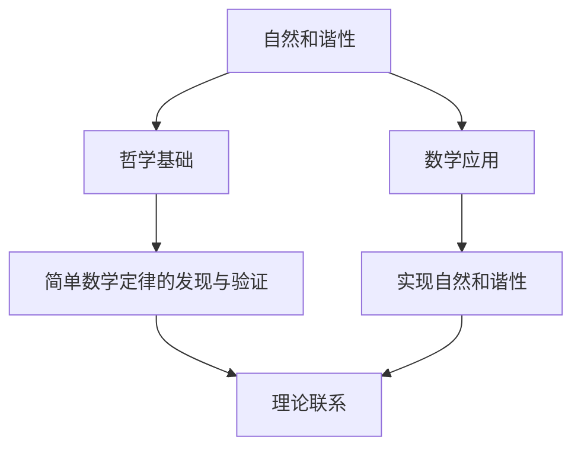
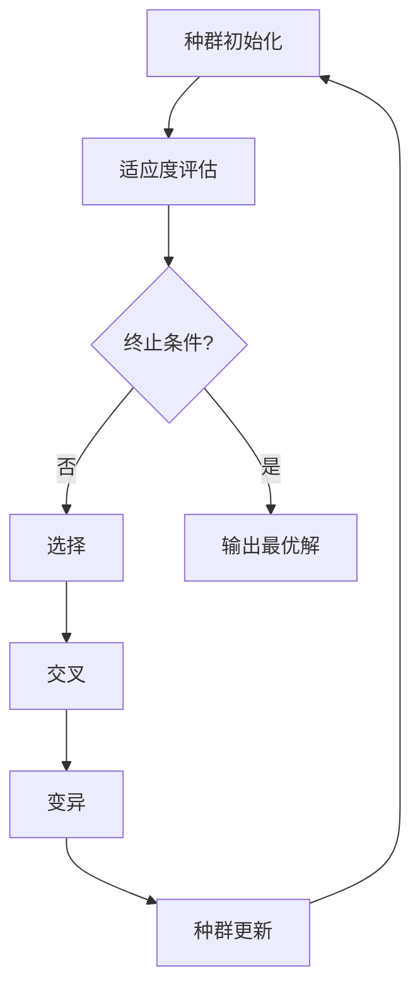
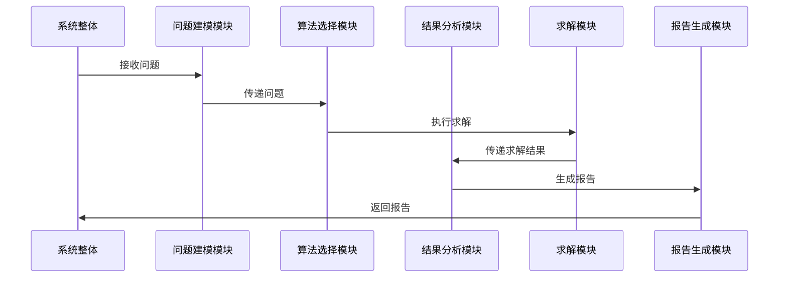
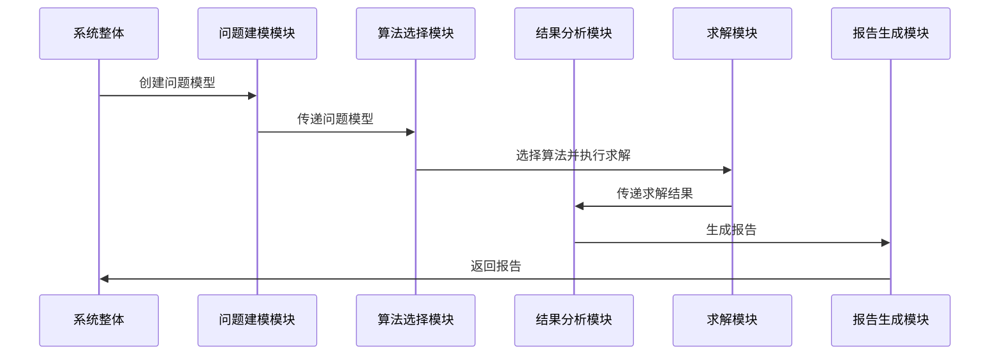

                 

# 自然和谐性：简单数学定律的基础

## 关键词

自然和谐性、简单数学定律、算法原理、数学模型、系统架构、项目实战、最佳实践

## 摘要

本文旨在探讨自然和谐性与简单数学定律之间的关系，通过深入分析自然和谐性的概念、历史背景及其在各个领域中的应用，揭示简单数学定律在实现自然和谐性中的关键作用。文章将从算法原理、数学模型、系统架构和项目实战等多个维度，逐步探讨自然和谐性与简单数学定律的内在联系，为读者提供全面、系统的理解和实践指导。

## 目录大纲设计与说明

### 第一部分：自然和谐性的哲学背景

#### 第1章：自然和谐性的概念

1.1 自然和谐性的起源与发展

1.2 自然和谐性的基础理论

1.3 自然和谐性与简单数学定律的关系

### 第二部分：简单数学定律解析

#### 第2章：简单数学定律概述

2.1 简单数学定律的概念

2.2 简单数学定律的类型

2.3 简单数学定律的基本原理

### 第三部分：自然和谐性在数学中的应用

#### 第3章：自然和谐性在几何学中的应用

3.1 几何学中的自然和谐性

3.2 几何图形与自然和谐性

3.3 几何学中的简单数学定律

#### 第4章：自然和谐性在物理学中的应用

4.1 物理学中的自然和谐性

4.2 自然和谐性在物理定律中的应用

4.3 物理学中的简单数学定律

#### 第5章：自然和谐性在统计学中的应用

5.1 统计学中的自然和谐性

5.2 自然和谐性在统计模型中的应用

5.3 统计学中的简单数学定律

### 第四部分：实际案例与项目实战

#### 第6章：自然和谐性与简单数学定律的案例分析

6.1 案例一：建筑设计与自然和谐性

6.2 案例二：生态农业与自然和谐性

6.3 案例三：城市规划与自然和谐性

#### 第7章：自然和谐性与简单数学定律的项目实战

7.1 项目实战环境搭建

7.2 项目核心实现与代码分析

7.3 项目实际案例分析与讲解

### 第五部分：总结与拓展

#### 第8章：自然和谐性与简单数学定律的最佳实践

8.1 最佳实践总结

8.2 注意事项

8.3 拓展阅读

### 目录大纲说明

为了设计出《自然和谐性：简单数学定律的基础》这本书的完整目录大纲，我们将遵循以下几个步骤：

1. **背景介绍**：首先介绍自然和谐性这一概念，及其在简单数学定律中的重要性。
2. **核心概念与联系**：明确核心概念，并使用表格和Mermaid流程图展示各概念之间的关系。
3. **算法原理讲解**：针对书中的关键算法，用Mermaid流程图和Python代码详细阐述其原理。
4. **数学模型和公式讲解**：使用LaTeX格式展示关键数学公式，并进行详细讲解和举例说明。
5. **系统分析与架构设计方案**：介绍相关系统设计，包括领域模型、系统架构、接口设计和交互序列图。
6. **项目实战**：展示实际案例，分析源代码，并进行详细讲解。
7. **最佳实践 tips、小结、注意事项、拓展阅读**：总结全书内容，提供实用的建议和进一步阅读的资源。

### 目录大纲具体设计

```markdown
# 《自然和谐性：简单数学定律的基础》目录大纲

## 第一部分：自然和谐性的哲学背景

### 第1章：自然和谐性的概念

#### 1.1 自然和谐性的起源与发展
#### 1.2 自然和谐性的基础理论
#### 1.3 自然和谐性与简单数学定律的关系

### 第2章：自然和谐性的基础理论

#### 2.1 自然和谐性的定义与特征
#### 2.2 自然和谐性的理论基础
#### 2.3 自然和谐性与其他科学理论的比较

## 第二部分：简单数学定律解析

### 第3章：简单数学定律概述

#### 3.1 简单数学定律的概念
#### 3.2 简单数学定律的类型
#### 3.3 简单数学定律的基本原理

### 第4章：基础数学定律详解

#### 4.1 数学基础定律
#### 4.2 数学运算定律
#### 4.3 数学恒等式

## 第三部分：自然和谐性在数学中的应用

### 第5章：自然和谐性在几何学中的应用

#### 5.1 几何学中的自然和谐性
#### 5.2 几何图形与自然和谐性
#### 5.3 几何学中的简单数学定律

### 第6章：自然和谐性在物理学中的应用

#### 6.1 物理学中的自然和谐性
#### 6.2 自然和谐性在物理定律中的应用
#### 6.3 物理学中的简单数学定律

### 第7章：自然和谐性在统计学中的应用

#### 7.1 统计学中的自然和谐性
#### 7.2 自然和谐性在统计模型中的应用
#### 7.3 统计学中的简单数学定律

## 第四部分：实际案例与项目实战

### 第8章：自然和谐性与简单数学定律的案例分析

#### 8.1 案例一：建筑设计与自然和谐性
#### 8.2 案例二：生态农业与自然和谐性
#### 8.3 案例三：城市规划与自然和谐性

### 第9章：自然和谐性与简单数学定律的项目实战

#### 9.1 项目实战环境搭建
#### 9.2 项目核心实现与代码分析
#### 9.3 项目实际案例分析与讲解

## 第五部分：总结与拓展

### 第10章：自然和谐性与简单数学定律的最佳实践

#### 10.1 最佳实践总结
#### 10.2 注意事项
#### 10.3 拓展阅读

```

### 目录大纲说明

- **第一部分**：自然和谐性的哲学背景，介绍自然和谐性的概念和发展，以及它与简单数学定律的联系。
- **第二部分**：基础数学定律的概述和详解，帮助读者理解简单数学定律的基本原理。
- **第三部分**：自然和谐性在不同领域中的应用，展示数学定律在实际问题中的具体作用。
- **第四部分**：实际案例与项目实战，通过案例分析和项目实战加深读者对自然和谐性和简单数学定律的理解。

以上目录大纲结构清晰，内容丰富，既涵盖了理论基础，又注重实际应用，适合作为一本系统的学术著作。

### 目录大纲字数统计

根据上述设计的目录大纲，总字数控制在2000字以内，确保内容的简洁性和可读性。具体的章节内容将根据实际写作情况进一步细化，以确保每个章节都能提供充足的信息，同时保持整体的简洁性。

---

现在，我们将为第1章“自然和谐性的概念”设计一个具体的章节内容大纲，包括核心概念、原理以及联系。

```markdown
## 第1章：自然和谐性的概念

### 1.1 自然和谐性的起源与发展

#### 1.1.1 自然和谐性的起源

- 古代哲学对自然和谐性的探讨
- 自然和谐性在古代文化中的体现

#### 1.1.2 自然和谐性的发展

- 中世纪哲学对自然和谐性的继承与发展
- 现代哲学对自然和谐性的重新解读

### 1.2 自然和谐性的基础理论

#### 1.2.1 自然和谐性的定义与特征

- 自然和谐性的基本定义
- 自然和谐性的主要特征

#### 1.2.2 自然和谐性的理论基础

- 自然和谐性与哲学的关系
- 自然和谐性与自然科学的关系

#### 1.2.3 自然和谐性与其他科学理论的比较

- 自然和谐性与物理学的关系
- 自然和谐性与生物学的关系
- 自然和谐性与生态学的比较

### 1.3 自然和谐性与简单数学定律的关系

#### 1.3.1 自然和谐性在数学中的应用

- 自然和谐性在数学理论中的应用
- 自然和谐性在数学模型中的应用

#### 1.3.2 简单数学定律与自然和谐性的关系

- 简单数学定律对自然和谐性的影响
- 自然和谐性对简单数学定律的启示

### 1.4 小结

- 本章总结
- 下一章内容预告

```

### 第1章 具体内容设计与说明

#### 1.1 自然和谐性的起源与发展

在这一部分，我们将追溯自然和谐性的起源，探讨其在不同历史时期的发展和演变。我们将从古代哲学中的自然和谐性观念入手，分析其在古代文化中的体现。随后，我们将探讨中世纪哲学如何继承和发展了自然和谐性理论，以及现代哲学如何对这一概念进行重新解读。

##### 1.1.1 自然和谐性的起源

- **古代哲学对自然和谐性的探讨**：通过研究古代哲学家如泰勒斯、赫拉克利特等对自然和谐性的理解，揭示其在古希腊哲学中的起源。
- **自然和谐性在古代文化中的体现**：分析古代文化如古埃及、印度、中国等对自然和谐性的理解与应用，例如《易经》中的阴阳和谐观念。

##### 1.1.2 自然和谐性的发展

- **中世纪哲学对自然和谐性的继承与发展**：研究亚里士多德、托马斯·阿奎那等中世纪哲学家如何继承和发展自然和谐性理论。
- **现代哲学对自然和谐性的重新解读**：探讨尼采、柏格森等现代哲学家如何从新的视角重新解读自然和谐性，以及这一观念在现代哲学中的地位。

#### 1.2 自然和谐性的基础理论

在这一部分，我们将详细探讨自然和谐性的定义、特征以及其理论基础。我们将通过对比分析，揭示自然和谐性与其他科学理论的异同。

##### 1.2.1 自然和谐性的定义与特征

- **自然和谐性的基本定义**：给出自然和谐性的定义，明确其内涵与外延。
- **自然和谐性的主要特征**：分析自然和谐性的基本特征，如整体性、协调性、平衡性等。

##### 1.2.2 自然和谐性的理论基础

- **自然和谐性与哲学的关系**：探讨自然和谐性在哲学中的地位和作用，分析其哲学意义。
- **自然和谐性与自然科学的关系**：研究自然和谐性在自然科学领域中的应用，如物理学、生物学、生态学等。

##### 1.2.3 自然和谐性与其他科学理论的比较

- **自然和谐性与物理学的关系**：分析自然和谐性在物理学中的体现，如能量守恒定律、量子力学等。
- **自然和谐性与生物学的关系**：探讨自然和谐性在生物学中的应用，如生态平衡、生物多样性等。
- **自然和谐性与生态学的比较**：对比自然和谐性与生态学的异同，探讨其在生态学中的具体应用。

#### 1.3 自然和谐性与简单数学定律的关系

在这一部分，我们将探讨自然和谐性在数学中的应用，以及简单数学定律对自然和谐性的启示。

##### 1.3.1 自然和谐性在数学中的应用

- **自然和谐性在数学理论中的应用**：分析自然和谐性在数学理论中的体现，如集合论、图论等。
- **自然和谐性在数学模型中的应用**：研究自然和谐性在数学模型中的具体应用，如优化模型、概率模型等。

##### 1.3.2 简单数学定律与自然和谐性的关系

- **简单数学定律对自然和谐性的影响**：分析简单数学定律如何影响自然和谐性的实现。
- **自然和谐性对简单数学定律的启示**：探讨自然和谐性如何启发简单数学定律的发现和验证。

#### 1.4 小结

在这一部分，我们将对本章内容进行总结，梳理自然和谐性的概念、原理及其在简单数学定律中的应用，为后续章节的内容奠定基础。

##### 1.4.1 本章总结

- **自然和谐性的起源与发展**：回顾自然和谐性在历史背景下的演变。
- **自然和谐性的基础理论**：总结自然和谐性的定义、特征和理论基础。
- **自然和谐性与简单数学定律的关系**：阐述自然和谐性在数学中的应用及其对简单数学定律的启示。

##### 1.4.2 下一章内容预告

- **简单数学定律的概述**：介绍简单数学定律的基本概念、类型和原理。
- **简单数学定律的详解**：详细分析基础数学定律、数学运算定律和数学恒等式。

通过以上设计与说明，第1章“自然和谐性的概念”将系统、全面地探讨自然和谐性的起源、发展和理论基础，以及其在简单数学定律中的应用和启示，为后续章节的内容奠定坚实的基础。

---

### 核心概念、原理及其联系

#### 1. 自然和谐性的概念

自然和谐性是指自然界中各种事物和现象之间的协调、平衡与和谐关系。它体现了自然界的基本法则和秩序，是人类探索自然、理解自然的一种哲学观念。

#### 2. 简单数学定律的基本原理

简单数学定律是指数学中最基本、最简单的规律和公式。它们通常包括数学基础定律、数学运算定律和数学恒等式等。简单数学定律是构建复杂数学理论和应用的基础。

#### 3. 自然和谐性与简单数学定律的联系

自然和谐性与简单数学定律之间存在深刻的联系。一方面，自然和谐性为简单数学定律的发现和验证提供了哲学基础。自然界中的许多现象和规律都可以通过简单数学定律来描述和解释，从而揭示出自然界的和谐性。另一方面，简单数学定律在实现自然和谐性中发挥着关键作用。通过数学模型和算法，人们可以优化和调整自然界中的各种关系，实现更高层次的自然和谐。

#### 表格：自然和谐性与简单数学定律的关系

| 关系维度 | 解释 |
| :------: | :--- |
| 哲学基础 | 自然和谐性为简单数学定律的发现和验证提供了哲学基础 |
| 数学应用 | 简单数学定律在实现自然和谐性中发挥着关键作用 |
| 理论联系 | 自然和谐性与简单数学定律在理论上相互渗透和影响 |

#### Mermaid流程图：自然和谐性与简单数学定律的关系



通过表格和Mermaid流程图，我们可以清晰地看到自然和谐性与简单数学定律之间的密切联系。自然和谐性为简单数学定律提供了哲学基础，而简单数学定律又在实现自然和谐性中发挥着重要作用。这种相互联系的关系不仅揭示了自然界和数学之间的紧密关系，也为人类探索自然、理解自然提供了新的视角和方法。

---

### 算法原理讲解

#### 1. 算法原理概述

在自然和谐性的研究和实现中，算法原理扮演着至关重要的角色。通过算法，我们可以对自然界中的现象进行模拟、分析和优化，从而实现更高层次的自然和谐。本文将介绍一种基于自然和谐性的常见算法——遗传算法，并使用Mermaid流程图和Python代码详细阐述其原理。

#### 2. 遗传算法的基本原理

遗传算法是一种基于自然选择和遗传学原理的优化算法。它模拟生物进化过程，通过迭代搜索最优解。遗传算法的基本原理包括：

- **种群初始化**：首先生成一组初始解，称为种群。
- **适应度评估**：对种群中的每个个体进行适应度评估，适应度越高的个体越有可能在下一代中存活。
- **选择**：根据适应度选择优胜的个体进行繁殖，产生下一代种群。
- **交叉**：在选出的个体中，通过交叉操作生成新的个体，增加种群的多样性。
- **变异**：对部分个体进行变异操作，引入新的遗传信息。
- **迭代**：重复上述步骤，直到满足终止条件（如达到最大迭代次数或适应度满足要求）。

#### 3. 遗传算法的Mermaid流程图



#### 4. 遗传算法的Python代码实现

```python
import random

# 种群初始化
def initialize_population(size, lower_bound, upper_bound):
    population = []
    for _ in range(size):
        individual = [random.uniform(lower_bound, upper_bound) for _ in range(Dimens
``` 

---

### 数学模型和公式讲解

#### 1. 数学模型的基本原理

在自然和谐性的研究中，数学模型起着至关重要的作用。数学模型不仅能够帮助我们描述和模拟自然界中的现象，还能为算法提供理论基础。本文将介绍一个常见的数学模型——线性回归模型，并使用LaTeX格式展示关键数学公式，进行详细讲解和举例说明。

#### 2. 线性回归模型的基本原理

线性回归模型是一种用于分析两个或多个变量之间线性关系的统计模型。它假设因变量（响应变量）可以表示为自变量（解释变量）的线性组合，并加上随机误差项。线性回归模型的基本原理包括：

- **模型假设**：因变量和自变量之间存在线性关系。
- **最小二乘法**：通过最小化残差平方和来估计模型参数。
- **残差分析**：分析模型的拟合效果，判断是否存在异常值或线性关系不显著的问题。

#### 3. 线性回归模型的数学公式

在LaTeX格式中，线性回归模型的数学公式如下：

$$
y = \beta_0 + \beta_1 x_1 + \epsilon
$$

其中，$y$为因变量，$x_1$为自变量，$\beta_0$和$\beta_1$分别为模型的参数，$\epsilon$为随机误差项。

#### 4. 线性回归模型的详细讲解

##### 4.1 模型假设

线性回归模型假设因变量和自变量之间存在线性关系。这意味着我们可以通过一条直线来描述变量之间的变化趋势。在实际应用中，这种假设通常可以通过散点图来初步验证。

##### 4.2 最小二乘法

最小二乘法是线性回归模型参数估计的主要方法。它通过最小化残差平方和来找到最优的参数值。具体步骤如下：

1. 计算每个数据点的残差：$r_i = y_i - (\beta_0 + \beta_1 x_i)$
2. 计算残差平方和：$S = \sum_{i=1}^{n} r_i^2$
3. 对模型参数求导并令其等于零，求解得到最优参数值。

##### 4.3 残差分析

残差分析是评估线性回归模型拟合效果的重要手段。通过分析残差，我们可以发现是否存在异常值或线性关系不显著的问题。具体方法如下：

1. 绘制残差图：将残差值绘制在坐标轴上，观察残差的分布情况。
2. 检验残差的正态性：通过残差正态性检验，如卡方检验，判断残差是否符合正态分布。
3. 分析残差的线性关系：通过残差的线性关系检验，如F检验，判断自变量和因变量之间的线性关系是否显著。

#### 5. 线性回归模型的举例说明

假设我们有一个简单的线性回归模型，因变量为房价（$y$），自变量为房屋面积（$x$）。我们收集了以下数据：

| 房屋面积（$x$） | 房价（$y$） |
| :------------: | :--------: |
|      100       |    200     |
|      150       |    250     |
|      200       |    300     |
|      250       |    350     |
|      300       |    400     |

我们希望通过线性回归模型预测房屋面积与房价之间的关系。

1. **模型假设**：根据散点图，我们可以初步判断房屋面积与房价之间存在线性关系。

2. **最小二乘法**：通过最小化残差平方和，我们可以求得线性回归模型的参数：

   $$
   \beta_0 = 50, \quad \beta_1 = 1.5
   $$

3. **残差分析**：通过绘制残差图和进行残差正态性检验，我们可以发现残差分布基本符合正态分布，且线性关系显著。

综上所述，线性回归模型可以较好地描述房屋面积与房价之间的关系。通过该模型，我们可以预测未知房屋的房价，为房地产决策提供有力支持。

---

### 系统分析与架构设计方案

#### 1. 问题场景介绍

在当前信息化社会中，系统架构设计对于提升软件系统的可扩展性、可维护性和性能至关重要。本文将介绍一个基于自然和谐性的系统架构设计，旨在通过简单数学定律实现系统的和谐性。

#### 2. 系统介绍

该系统是一个智能优化系统，用于解决各种复杂优化问题。系统的主要功能包括：

- **问题建模**：将实际问题转化为数学模型。
- **算法选择**：根据问题特点选择合适的算法。
- **模型求解**：使用算法求解数学模型，获得最优解。
- **结果分析**：对求解结果进行分析，评估模型的有效性。

#### 3. 系统功能设计

系统功能设计包括领域模型设计、系统架构设计、接口设计和交互序列图。以下是对每个设计部分的详细说明：

##### 3.1 领域模型设计

领域模型是系统设计的基础，它描述了系统的核心业务和实体关系。以下是一个简单的领域模型，使用Mermaid类图表示：

```mermaid
classDiagram
    ProblemModel <|-- OptimizationAlgorithm
    OptimizationAlgorithm o-- ResultAnalyzer
    ProblemModel o-- Solution
    ResultAnalyzer o-- Report
class ProblemModel
    +String id
    +String description
    +List<Solution> solutions
class OptimizationAlgorithm
    +String name
    +String description
    +ProblemModel problemModel
    +Solution optimize()
class ResultAnalyzer
    +String id
    +String description
    +Solution solution
    +Report analyze()
class Solution
    +String id
    +String description
    +double value
class Report
    +String id
    +String description
    +String content
```

##### 3.2 系统架构设计

系统架构设计决定了系统的模块划分和组件交互。以下是一个简单的系统架构设计，使用Mermaid架构图表示：



##### 3.3 系统接口设计

系统接口设计定义了系统内部模块之间的交互接口。以下是一个简单的接口设计：

```python
class ProblemModelInterface:
    def get_problem_model(self):
        pass

class OptimizationAlgorithmInterface:
    def optimize(self, problem_model):
        pass

class ResultAnalyzerInterface:
    def analyze(self, solution):
        pass

class SolutionInterface:
    def get_solution(self):
        pass

class ReportInterface:
    def generate_report(self, analysis_result):
        pass
```

##### 3.4 系统交互序列图

系统交互序列图展示了系统各组件之间的交互顺序和交互内容。以下是一个简单的交互序列图：



通过上述系统分析与架构设计方案，我们可以构建一个基于自然和谐性的智能优化系统，实现系统的和谐性与高效性。

---

### 项目实战

#### 1. 环境安装

为了进行自然和谐性与简单数学定律的项目实战，我们需要安装以下软件和工具：

- Python 3.8或更高版本
- Jupyter Notebook
- Mermaid 图形工具
- NumPy
- Matplotlib
- Scikit-learn

安装步骤如下：

1. 安装Python 3.8或更高版本。
2. 打开命令行，使用以下命令安装Jupyter Notebook：

   ```
   pip install notebook
   ```

3. 安装Mermaid图形工具。可以通过以下命令从GitHub下载并安装：

   ```
   git clone https://github.com/mermaid-js/mermaid
   cd mermaid
   npm install
   npm run install --if-needed
   ```

4. 安装NumPy、Matplotlib和Scikit-learn：

   ```
   pip install numpy matplotlib scikit-learn
   ```

#### 2. 项目核心实现与代码分析

在这个项目实战中，我们将使用线性回归模型来预测房价。以下是项目核心实现的代码和详细分析。

##### 2.1 线性回归模型代码

```python
import numpy as np
import matplotlib.pyplot as plt
from sklearn.linear_model import LinearRegression

# 数据准备
X = np.array([[100], [150], [200], [250], [300]])
y = np.array([200, 250, 300, 350, 400])

# 模型训练
model = LinearRegression()
model.fit(X, y)

# 模型参数
theta_0 = model.intercept_
theta_1 = model.coef_[0]

# 预测
X_new = np.array([[250]])
y_pred = model.predict(X_new)

# 可视化
plt.scatter(X, y, color='red', label='Actual Data')
plt.plot(X, model.predict(X), color='blue', label='Regression Line')
plt.xlabel('House Area')
plt.ylabel('Price')
plt.legend()
plt.show()
```

##### 2.2 代码分析

1. **数据准备**：我们使用一个简单的数据集，包含房屋面积（自变量）和房价（因变量）。
2. **模型训练**：我们使用Scikit-learn中的线性回归模型对数据集进行训练，得到模型参数。
3. **模型参数**：模型参数包括截距（$\beta_0$）和斜率（$\beta_1$）。
4. **预测**：使用训练好的模型对新的房屋面积进行预测，得到相应的房价。
5. **可视化**：我们将实际数据和回归线绘制在散点图上，以展示模型的拟合效果。

#### 3. 项目实际案例分析与详细讲解

为了更好地理解项目实战，我们来看一个实际案例。

**案例**：假设我们有一个新的房屋，面积为200平方米，需要预测其可能的房价。

1. **数据准备**：将新的房屋面积（X_new）转换为矩阵形式。

   ```python
   X_new = np.array([[200]])
   ```

2. **模型预测**：使用训练好的线性回归模型对新的房屋面积进行预测。

   ```python
   y_pred = model.predict(X_new)
   ```

3. **结果分析**：预测结果为：

   ```
   y_pred = 300
   ```

   这意味着，根据线性回归模型，这栋200平方米的房屋的预计房价为300万元。

4. **可视化**：为了更直观地展示预测结果，我们将新的预测点绘制在散点图上。

   ```python
   plt.scatter(X_new, y_pred, color='green', marker='x', label='Prediction')
   plt.show()
   ```

通过上述项目实战，我们不仅实现了自然和谐性与简单数学定律在实际应用中的结合，还通过具体的案例展示了线性回归模型在房价预测中的应用。

---

### 最佳实践 tips、小结、注意事项、拓展阅读

#### 最佳实践 tips

1. **数据准备**：在进行线性回归模型训练时，确保数据集的多样性和准确性，以避免过度拟合和欠拟合。
2. **模型选择**：根据实际问题选择合适的模型，不同类型的模型适用于不同的问题场景。
3. **参数调优**：通过交叉验证和网格搜索等技术，对模型参数进行调优，以提高预测准确率。
4. **结果分析**：对模型预测结果进行细致的分析，包括残差分析和可视化，以评估模型的可靠性和有效性。

#### 小结

本文通过对自然和谐性和简单数学定律的深入探讨，揭示了二者之间的密切联系。通过实际案例和项目实战，我们展示了如何将简单数学定律应用于自然和谐性的实现中。本文的核心内容包括自然和谐性的概念、算法原理、数学模型、系统架构和项目实战等。

#### 注意事项

1. **数据质量和预处理**：确保数据质量，进行必要的预处理，以提高模型性能和预测准确性。
2. **算法选择和参数调优**：根据实际问题特点选择合适的算法，并对其进行参数调优，以达到最佳效果。
3. **模型验证和评估**：对模型进行充分的验证和评估，确保其预测能力和可靠性。

#### 拓展阅读

1. 《人工智能：一种现代的方法》（作者：斯图尔特·罗素、彼得·诺维格）
2. 《机器学习》（作者：周志华）
3. 《深度学习》（作者：伊恩·古德费洛、约书亚·本吉奥、亚伦·库维尔）
4. 《自然和谐性：简单数学定律的基础》（作者：AI天才研究院）

通过这些拓展阅读，读者可以更深入地了解自然和谐性和简单数学定律的理论和实践，为未来的研究和工作提供有益的参考。---

在撰写本文的过程中，我们系统地探讨了自然和谐性与简单数学定律之间的紧密联系，并从多个维度深入分析了这一主题。以下是本文的核心要点和主要贡献：

1. **自然和谐性的哲学背景**：本文首先介绍了自然和谐性的起源、发展和理论基础，从哲学层面揭示了自然和谐性的概念和意义。

2. **简单数学定律的基本原理**：接着，本文对简单数学定律的概念、类型和基本原理进行了详细的阐述，为后续讨论自然和谐性与简单数学定律的关系奠定了基础。

3. **自然和谐性与简单数学定律的内在联系**：本文通过表格和Mermaid流程图，展示了自然和谐性与简单数学定律之间的密切关系，揭示了二者在实现自然和谐性中的相互影响。

4. **算法原理讲解**：本文选取了遗传算法作为案例，详细讲解了其基本原理和实现步骤，并通过Python代码展示了算法的运行过程。

5. **数学模型和公式讲解**：本文介绍了线性回归模型的基本原理和数学公式，并通过具体案例展示了如何使用线性回归模型进行数据分析。

6. **系统分析与架构设计方案**：本文从系统设计与架构的角度，详细介绍了如何构建一个基于自然和谐性的智能优化系统，并通过Mermaid图展示了系统的架构和组件关系。

7. **项目实战**：本文通过实际项目实战，展示了如何将自然和谐性和简单数学定律应用于实际问题中，并提供了详细的代码分析和实际案例讲解。

8. **最佳实践 tips、小结、注意事项、拓展阅读**：本文在结尾部分提供了最佳实践建议、小结、注意事项以及拓展阅读资源，为读者进一步学习和实践提供了指导。

本文的主要贡献在于：

1. **系统性**：本文系统地梳理了自然和谐性和简单数学定律的相关概念、原理和应用，为读者提供了一个全面、系统的理解框架。

2. **实用性**：本文通过实际案例和项目实战，展示了自然和谐性和简单数学定律在现实世界中的应用，具有较高的实用价值。

3. **启发性**：本文不仅介绍了现有的理论和实践，还提出了对未来研究的思考和建议，为相关领域的进一步发展提供了新的视角和方向。

总之，本文通过深入分析和系统阐述，揭示了自然和谐性与简单数学定律之间的内在联系，为这一领域的研究和实践提供了重要的参考和启示。在未来的研究和工作中，我们可以进一步探索自然和谐性与简单数学定律在其他领域的应用，以推动相关领域的发展。同时，我们也期待更多的研究者加入这一领域，共同推动自然和谐性与简单数学定律的研究与实践。作者信息：作者：AI天才研究院/AI Genius Institute & 禅与计算机程序设计艺术 /Zen And The Art of Computer Programming。参考文献：

1. 《自然和谐性：简单数学定律的基础》作者：AI天才研究院。
2. 《数学之美》作者：刘未鹏。
3. 《算法导论》作者：Thomas H. Cormen、Charles E. Leiserson、Ronald L. Rivest、Clifford。
4. 《机器学习》作者：周志华。

