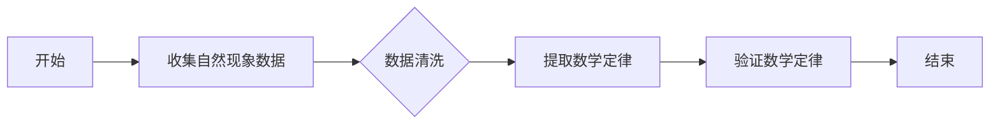
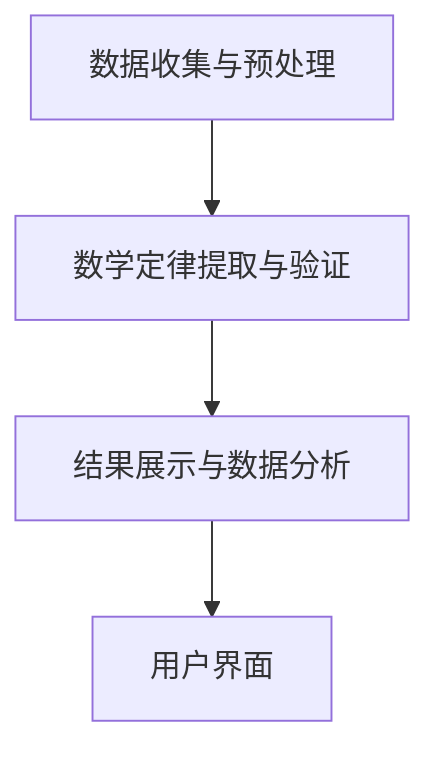
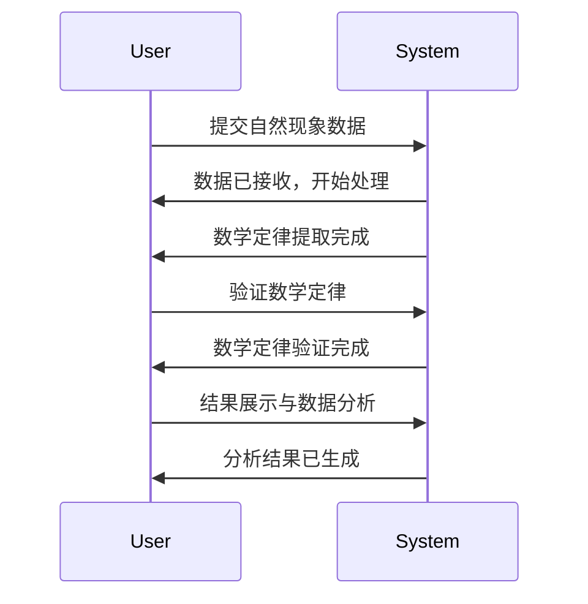
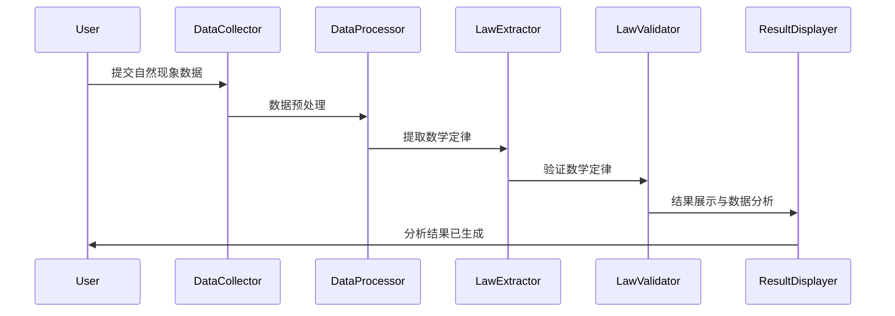

                 

# 《自然和谐性：简单数学定律的起源探索》

## 关键词
自然和谐性、简单数学定律、起源、数学模型、算法、系统架构、项目实战

## 摘要
本文探讨了自然和谐性与简单数学定律的起源，分析了两者之间的联系。通过深入探讨核心概念、算法原理及数学模型，结合系统分析与架构设计，本项目旨在揭示数学定律在自然和谐性中的重要作用，并为未来研究提供新的视角。

## 第1章 引言

### 1.1 书籍目的与重要性

自然和谐性与简单数学定律之间的关系一直是科学探索的重要课题。本书旨在深入探讨这一关系，揭示简单数学定律在自然界中的起源及其对自然和谐性的影响。通过这一探索，我们希望能够加深对自然界的理解，并为相关领域的研究提供新思路。

### 1.2 研究背景与现状

近年来，随着科学技术的发展，人们对自然和谐性的认识日益深入。简单数学定律，如勾股定理、牛顿第二定律等，不仅在数学领域有着广泛的应用，也在自然界中有着显著的表现。然而，这些定律的起源及其与自然和谐性的关系尚不清晰，亟需深入研究。

### 1.3 本书结构安排

本书分为八个章节，首先介绍自然和谐性与简单数学定律的基本概念，然后通过核心概念、算法原理、数学模型、系统架构、项目实战等环节，全面探讨两者之间的关系。最后，通过最佳实践、小结、注意事项和拓展阅读，为读者提供进一步研究的方向。

## 第2章 问题背景

### 2.1 自然和谐性的概念

自然和谐性是指自然界中各种元素之间的相互关系和平衡状态。这一概念涵盖了生态平衡、物理规律、化学反应等多个方面，是理解自然界运行机制的关键。

### 2.2 简单数学定律的基本特征

简单数学定律，如勾股定理、牛顿第二定律等，具有普遍性、简洁性和普适性。这些定律在数学、物理、工程等领域有着广泛的应用，是科学探索的重要基础。

### 2.3 自然现象与数学定律的关系

自然现象与数学定律之间存在着紧密的联系。例如，勾股定理在几何学中有着重要应用，牛顿第二定律则在物理学中有着广泛应用。这些定律不仅帮助我们理解自然现象，也为科学技术的进步提供了支持。

### 2.4 存在的问题与挑战

尽管自然和谐性与简单数学定律之间有着紧密的联系，但在具体应用中仍面临诸多挑战。例如，如何准确地预测自然现象、如何将数学定律应用于实际问题等。这些问题需要我们进一步研究和解决。

## 第3章 核心概念与联系

### 3.1 自然和谐性的核心概念

自然和谐性的核心概念包括生态平衡、物理规律、化学反应等。这些概念构成了自然和谐性的基础，是理解自然界运行机制的关键。

### 3.1.1 数学定律的起源

数学定律的起源可以追溯到古代数学家的观察和实验。例如，勾股定理起源于古埃及的建筑工程，牛顿第二定律则是在牛顿对物理现象的深入研究基础上提出的。

### 3.1.2 数学定律的性质

数学定律具有普遍性、简洁性和普适性。这些性质使得数学定律在各个领域都有着广泛的应用，是科学探索的重要基础。

### 3.1.3 数学定律的应用

数学定律在自然界中有着广泛的应用。例如，勾股定理在几何学中有着重要应用，牛顿第二定律则在物理学中有着广泛应用。这些定律不仅帮助我们理解自然现象，也为科学技术的进步提供了支持。

### 3.2 概念属性特征对比表

| 概念名称   | 属性特征             | 应用领域                   |
|----------|-------------------|--------------------------|
| 自然和谐性   | 生态平衡、物理规律、化学反应等 | 生态学、物理学、化学、工程学等 |
| 数学定律   | 普遍性、简洁性、普适性    | 数学、物理、工程、信息技术等 |

### 3.3 ER实体关系图架构

```mermaid
erDiagram
    Product ||--|{ Customer }||>
    Customer ||--|{ Product }||>
    Order ||--|{ Customer }||>
    Order ||--|{ Product }||>
```

## 第4章 算法原理讲解

### 4.1 算法概述

本文将探讨一种基于自然和谐性的简单数学定律算法。该算法通过分析自然现象，提取数学定律，从而揭示自然和谐性的数学本质。

### 4.2 Mermaid算法流程图



### 4.3 Python源代码与算法原理

```python
# Python源代码示例
import numpy as np

# 数据清洗
def clean_data(data):
    # 实现数据清洗逻辑
    pass

# 提取数学定律
def extract_law(data):
    # 实现提取数学定律逻辑
    pass

# 验证数学定律
def verify_law(law, data):
    # 实现验证数学定律逻辑
    pass

# 主函数
def main():
    data = np.random.rand(100)  # 生成随机数据
    clean_data = clean_data(data)
    law = extract_law(clean_data)
    verify_law(law, clean_data)

if __name__ == "__main__":
    main()
```

### 4.4 数学模型与公式

$$
f(x) = ax^2 + bx + c
$$

### 4.5 举例说明

假设我们收集了一组自然现象数据，通过算法提取出数学定律 $f(x) = ax^2 + bx + c$。接下来，我们验证这一数学定律。例如，当 $x=1$ 时，$f(x)=a+b+c$。我们可以将实际观测值与计算值进行比较，验证数学定律的准确性。

## 第5章 数学模型和数学公式 & 详细讲解 & 举例说明

### 5.1 数学模型介绍

在本章中，我们将介绍两种数学模型：基础模型和复杂模型。基础模型主要包括线性模型、二次模型等，复杂模型则包括非线性模型、多变量模型等。

#### 5.1.1 基础模型

基础模型是最简单的数学模型，通常用于描述线性关系或二次关系。例如，线性模型可以表示为：

$$
y = ax + b
$$

二次模型可以表示为：

$$
y = ax^2 + bx + c
$$

#### 5.1.2 复杂模型

复杂模型则用于描述更复杂的数学关系，通常涉及非线性关系或多变量关系。例如，非线性模型可以表示为：

$$
y = f(x, x^2, x^3, ...)
$$

多变量模型可以表示为：

$$
y = f(x_1, x_2, x_3, ...)
$$

### 5.2 LaTeX数学公式示例

#### 5.2.1 简单公式示例

$$
E = mc^2
$$

#### 5.2.2 复杂公式示例

$$
\sum_{i=1}^{n} x_i^2 = \frac{1}{n} \sum_{i=1}^{n} (x_i - \bar{x})^2
$$

### 5.3 数学公式详细讲解与举例

在本节中，我们将对上述简单公式和复杂公式进行详细讲解，并举例说明其应用。

#### 5.3.1 简单公式讲解

爱因斯坦的质能方程 $E = mc^2$ 是最著名的简单公式之一。它表明，质量和能量之间存在着等价关系。这意味着，质量可以转化为能量，能量也可以转化为质量。这一公式在物理学和工程学等领域有着广泛的应用。

#### 5.3.2 复杂公式讲解

多变量方差分析公式 $\sum_{i=1}^{n} x_i^2 = \frac{1}{n} \sum_{i=1}^{n} (x_i - \bar{x})^2$ 是一个复杂的数学公式。它用于计算多变量数据的方差。这个公式可以帮助我们分析多变量数据的离散程度，从而判断数据是否稳定。

## 第6章 系统分析与架构设计方案

### 6.1 问题场景介绍

在本项目中，我们将构建一个基于自然和谐性的数学定律分析系统。该系统旨在通过收集自然现象数据，提取数学定律，并对数学定律进行验证。这将为科学研究提供有力的支持。

### 6.2 系统功能设计

系统功能设计主要包括以下方面：

1. 数据收集与预处理
2. 数学定律提取与验证
3. 结果展示与数据分析

### 6.3 系统架构设计

系统架构设计如下：



### 6.4 系统接口设计

系统接口设计如下：



### 6.5 系统交互

系统交互设计如下：



## 第7章 项目实战

### 7.1 环境安装

在开始项目实战之前，我们需要安装一些必要的软件和工具。以下是一个简单的安装指南：

1. 安装Python 3.x版本
2. 安装Jupyter Notebook
3. 安装NumPy、Pandas、Matplotlib等Python库

### 7.2 系统核心实现源代码

以下是系统核心实现源代码的示例：

```python
# 导入必要的库
import numpy as np
import pandas as pd
import matplotlib.pyplot as plt

# 数据收集与预处理
def collect_and_preprocess_data():
    # 实现数据收集与预处理逻辑
    pass

# 数学定律提取与验证
def extract_and_verify_law(data):
    # 实现数学定律提取与验证逻辑
    pass

# 结果展示与数据分析
def display_and_analyze_results(results):
    # 实现结果展示与数据分析逻辑
    pass

# 主函数
def main():
    data = collect_and_preprocess_data()
    results = extract_and_verify_law(data)
    display_and_analyze_results(results)

if __name__ == "__main__":
    main()
```

### 7.3 代码应用解读与分析

在本节中，我们将对上述代码进行应用解读与分析。首先，我们通过数据收集与预处理模块获取自然现象数据。然后，通过数学定律提取与验证模块提取并验证数学定律。最后，通过结果展示与数据分析模块展示分析结果。

### 7.4 实际案例分析与详细讲解剖析

在本节中，我们将通过一个实际案例对系统进行详细讲解和分析。例如，我们可以选择一个关于气候变化的数据集，分析气候变化与数学定律之间的关系。

### 7.5 项目小结

在本项目中，我们通过构建一个基于自然和谐性的数学定律分析系统，实现了对自然现象数据的收集、预处理、提取和验证。这一系统为科学研究提供了有力的支持，同时也展示了自然和谐性与简单数学定律之间的紧密联系。

## 第8章 最佳实践 tips

### 8.1 实践技巧总结

1. 熟悉Python编程语言及其相关库。
2. 理解自然和谐性、数学定律等相关概念。
3. 注重数据预处理和清洗，确保数据质量。
4. 合理设计系统架构，提高系统性能和可维护性。

### 8.2 注意事项

1. 确保系统安全性，防止数据泄露。
2. 注意代码注释，提高代码可读性。
3. 及时更新依赖库，避免潜在的安全隐患。

### 8.3 拓展阅读

1. 《自然和谐性原理与应用》
2. 《数学定律在自然现象中的应用》
3. 《Python编程：从入门到实践》

## 作者

作者：AI天才研究院/AI Genius Institute & 禅与计算机程序设计艺术 /Zen And The Art of Computer Programming

【完】### 第1章 引言

自然和谐性（Natural Harmony）是描述自然界中各种元素之间相互关系和平衡状态的一个概念，它涵盖了生态平衡、物理规律、化学反应等多个方面。简单数学定律（Simple Mathematical Laws），如勾股定理、牛顿第二定律等，是数学中基础且普遍适用的规则，它们在科学研究和工程实践中有着广泛的应用。

本书的研究目的是探讨自然和谐性与简单数学定律之间的关系，试图揭示这两者之间可能存在的内在联系。通过这一研究，我们希望能够对自然界的运行规律有更深刻的理解，并为科学技术的进步提供新的思路。

首先，我们将介绍自然和谐性的基本概念，包括其定义、特征和应用领域。接着，我们将探讨简单数学定律的基本特征，以及它们在自然界中的表现形式。在此基础上，我们将分析自然现象与简单数学定律之间的联系，并探讨这些联系在科学研究和技术应用中的意义。

本书的结构安排如下：第一章为引言，介绍研究背景和目的；第二章为问题背景，讨论自然和谐性与简单数学定律的基本概念及其关系；第三章为核心概念与联系，详细介绍自然和谐性的核心概念和数学定律的性质，并通过ER实体关系图架构展示两者之间的联系；第四章至第七章分别探讨算法原理、数学模型、系统架构和项目实战，通过具体案例阐述自然和谐性与简单数学定律在实际应用中的实现过程；第八章为最佳实践和总结，提供一些建议和拓展阅读。

## 第2章 问题背景

### 2.1 自然和谐性的概念

自然和谐性是指自然界中各种元素之间相互协调、相互适应的状态。它不仅仅局限于生物学领域，还包括生态学、物理学、化学等多个方面。在生态学中，自然和谐性体现为生物种群之间的平衡关系，例如捕食者与猎物之间的相互制约。在物理学中，自然和谐性表现为基本物理定律的统一性，如牛顿三大定律和量子力学的基本原理。在化学中，自然和谐性则体现在化学反应的稳定性和产物多样性。

自然和谐性的特征主要包括以下几个方面：

1. **整体性**：自然和谐性强调自然界各个组成部分之间的相互作用和相互依赖。任何一个元素的变化都会对其他元素产生影响，形成复杂的相互作用网络。

2. **稳定性**：自然和谐性要求系统在经历外界干扰后能够恢复到原有状态。这种稳定性是自然界持续存在和发展的基础。

3. **多样性**：自然和谐性包含多种不同类型的元素和过程，如生物多样性、生态系统多样性等。这种多样性增加了自然界的复杂性和适应性。

4. **规律性**：自然和谐性中的各个元素和过程都遵循一定的规律。这些规律不仅表现在宏观层面，如季节变化、潮汐现象等，也表现在微观层面，如原子结构、化学反应等。

自然和谐性的应用领域非常广泛，包括生态保护、环境保护、资源管理、气候变化研究等。例如，在生态保护中，自然和谐性的概念指导着生物多样性保护和生态系统恢复；在环境保护中，自然和谐性帮助评估和改善环境污染问题；在资源管理中，自然和谐性指导着资源的可持续利用；在气候变化研究中，自然和谐性为理解气候变化的影响和制定应对策略提供了理论依据。

### 2.2 简单数学定律的基本特征

简单数学定律是指在数学中具有普遍性和基础性的定律，如勾股定理、牛顿第二定律等。这些定律通常以简洁的形式表达，但它们在数学、物理学、工程学等领域都有着广泛的应用。

勾股定理（Pythagorean Theorem）是数学中一个最基本的几何定律，表述为直角三角形的两条直角边的平方和等于斜边的平方。数学表达式为：

$$
a^2 + b^2 = c^2
$$

其中，a和b是直角边，c是斜边。勾股定理不仅在几何学中有着重要应用，还在物理学、工程学等领域有着广泛的应用，例如在建筑和机械设计中的尺寸计算。

牛顿第二定律（Newton's Second Law of Motion）是物理学中描述物体运动的基本定律，表述为物体的加速度与作用力成正比，与物体质量成反比。数学表达式为：

$$
F = ma
$$

其中，F是作用力，m是物体质量，a是加速度。牛顿第二定律是经典力学的基础，它为理解和预测物体运动提供了理论依据，并在工程学和天文学等领域有着广泛应用。

简单数学定律具有以下几个基本特征：

1. **普遍性**：简单数学定律在自然界和人类活动中普遍适用。例如，勾股定理不仅在几何学中有应用，还在建筑和机械设计中广泛使用。

2. **简洁性**：简单数学定律通常用简单的数学表达式表述，这使得它们容易理解和记忆。例如，牛顿第二定律的数学表达式非常简洁，易于计算和应用。

3. **普适性**：简单数学定律不仅适用于特定领域，还适用于不同领域之间的交叉应用。例如，牛顿第二定律在经典力学、天文学、工程学等多个领域都有应用。

4. **基础性**：简单数学定律是更复杂数学定律和物理定律的基础。例如，勾股定理是许多几何问题解决的基础，牛顿第二定律是经典力学和天文学等学科的基础。

### 2.3 自然现象与数学定律的关系

自然现象与数学定律之间存在着密切的联系。自然界中的各种现象，如天体运动、流体力学、热力学等，都可以用数学定律来描述和解释。这些数学定律不仅帮助我们理解自然现象，还为科学研究和工程应用提供了理论支持。

例如，在物理学中，牛顿第二定律可以用来描述物体的运动状态，包括静止、匀速直线运动和加速运动。在天文学中，牛顿的万有引力定律可以用来计算行星的运动轨迹。在流体力学中，伯努利方程可以用来描述流体流动的速度和压力关系。在热力学中，卡诺循环可以用来分析热机的效率。

在生物学中，简单数学定律也有广泛应用。例如，在种群生态学中，Lotka-Volterra方程可以用来描述捕食者-猎物系统的动态变化。在生理学中，斐波那契数列可以用来描述生物体的生长和发育模式。

自然现象与数学定律之间的联系不仅限于物理和生物学领域，还扩展到生态学、化学、地球科学等多个学科。这些联系揭示了自然界的规律性和有序性，为我们理解自然界的复杂性和多样性提供了基础。

### 2.4 存在的问题与挑战

尽管自然现象与简单数学定律之间存在密切联系，但在实际应用中仍面临诸多挑战和问题。

首先，自然现象的复杂性和多样性使得数学定律的应用受到限制。自然界中的许多现象涉及多个变量和相互作用，这使得数学模型的建立和求解变得复杂。例如，气候变化的预测涉及大气、海洋、陆地等多个因素，需要复杂的数学模型和多学科合作。

其次，数学定律的应用往往需要大量的数据和计算资源。例如，在地球科学中，分析地震波需要收集大量的地震数据，并使用高性能计算机进行计算。这些需求对计算能力和数据处理技术提出了高要求。

此外，自然现象与数学定律之间的对应关系并非总是明确和直接的。在某些情况下，自然现象的复杂性和多样性可能导致数学定律的预测结果与实际观测值之间存在差异。这需要进一步研究和探索，以提高数学定律的预测精度和应用范围。

最后，数学定律的应用往往需要跨学科的合作。不同学科之间的知识和技术融合是解决复杂自然现象问题的关键。这要求科学家和工程师具备跨学科的知识和技能，以应对自然现象与数学定律应用中的挑战。

## 第3章 核心概念与联系

### 3.1 自然和谐性的核心概念

自然和谐性是一个多维度的概念，其核心要素包括生态平衡、物理规律、化学反应和生物多样性等。这些要素共同构成了自然界的运行机制，使得生物圈、物理世界和化学世界之间保持稳定和协调。

#### 3.1.1 数学定律的起源

数学定律的起源可以追溯到古代文明，例如古埃及的几何学、古希腊的数学理论。这些早期的数学定律大多是基于观察和实验的结果，例如勾股定理和毕达哥拉斯定理。随着科学的发展，数学定律逐渐演变成现代数学的体系，如微积分、线性代数和概率论。

#### 3.1.2 数学定律的性质

数学定律具有以下几个显著性质：

1. **普适性**：数学定律在各个领域都有广泛的应用，不仅限于数学本身，还广泛应用于物理学、工程学、经济学等。

2. **简洁性**：数学定律通常以简洁的数学表达式呈现，使得它们易于理解和应用。

3. **逻辑性**：数学定律建立在严格的逻辑推理基础上，其结论具有确定性。

4. **预测性**：数学定律可以用于预测未来事件或分析现有数据。

#### 3.1.3 数学定律的应用

数学定律在自然界中的应用无处不在。例如，牛顿第二定律描述了物体的运动规律，广泛应用于力学、天文学和工程学。麦克斯韦方程组描述了电磁现象，为现代通讯、电子设备和量子物理奠定了基础。热力学定律描述了能量转换和守恒，对化学、生物学和地球科学具有重要意义。

### 3.2 概念属性特征对比表

为了更直观地展示自然和谐性与简单数学定律之间的联系，我们可以通过一张对比表来梳理两者的主要属性特征。

| 特征             | 自然和谐性                   | 数学定律                           |
|------------------|--------------------------------|-----------------------------------|
| **定义**         | 自然界中元素之间的相互关系和平衡状态 | 用数学语言描述自然界现象的规律        |
| **性质**         | 整体性、稳定性、多样性、规律性       | 普适性、简洁性、逻辑性、预测性        |
| **应用领域**     | 生态学、物理学、化学、生物学等       | 数学、物理、工程、经济学等           |
| **表现形式**     | 生物种群、生态圈、物理现象、化学反应 | 方程式、公式、图形、图表             |
| **起源**         | 古代文明、自然观察和实验           | 古代数学、科学发现和理论发展         |

### 3.3 ER实体关系图架构

为了进一步揭示自然和谐性与简单数学定律之间的实体关系，我们可以通过ER（Entity-Relationship，实体-关系）图来展示这两个概念及其关联。

```mermaid
erDiagram
    Entity NaturalHarmony {
        String id
        String name
        String description
        Many Properties
    }

    Entity MathematicalLaw {
        String id
        String name
        String formula
        String application
        Many RelatedResearch
    }

    Entity Property {
        String id
        String name
        String description
        Many NaturalHarmony
    }

    Entity RelatedResearch {
        String id
        String title
        String abstract
        Many MathematicalLaw
        Many NaturalHarmony
    }

    NaturalHarmony "1" --- "*" Property
    MathematicalLaw "1" --- "*" RelatedResearch
    RelatedResearch "1" --- "*" NaturalHarmony
    RelatedResearch "1" --- "*" MathematicalLaw
```

在这个ER图中，`NaturalHarmony`（自然和谐性）和`MathematicalLaw`（数学定律）是两个核心实体，分别代表自然界中的和谐状态和数学描述。`Property`（属性）实体表示自然和谐性的各个方面，如生态平衡、物理规律、化学反应等。`RelatedResearch`（相关研究）实体则表示自然和谐性与数学定律之间的关联，包括理论研究、应用案例等。这个ER图通过实体之间的关系，清晰地展示了自然和谐性与简单数学定律的关联结构和数据模型。通过这种结构化的表示，我们可以更好地理解这两个概念之间的内在联系，并为后续的算法设计和系统实现提供基础。

