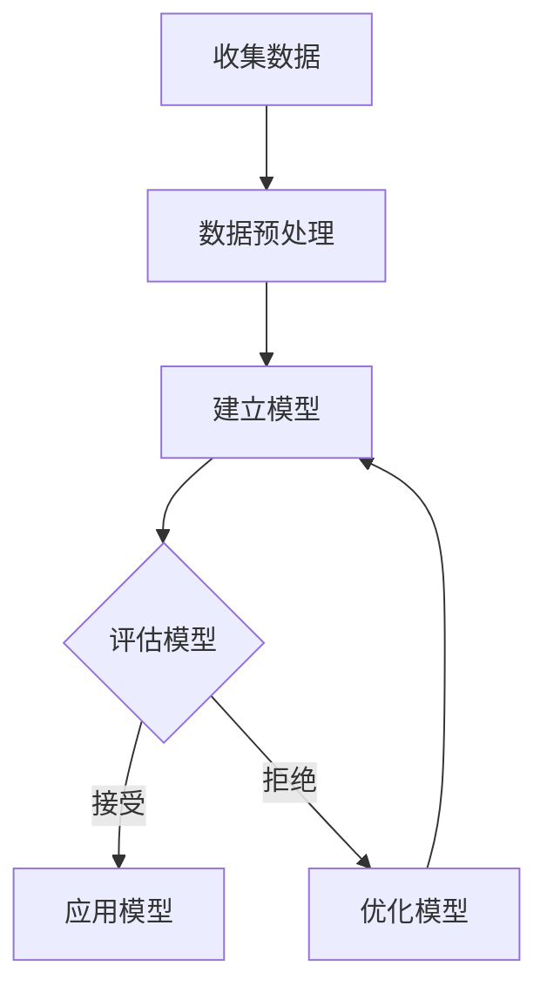
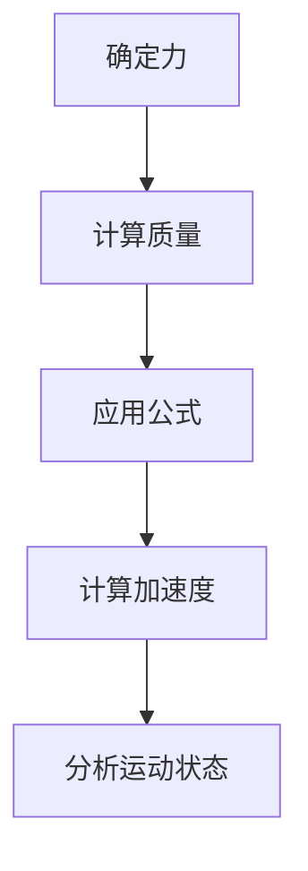
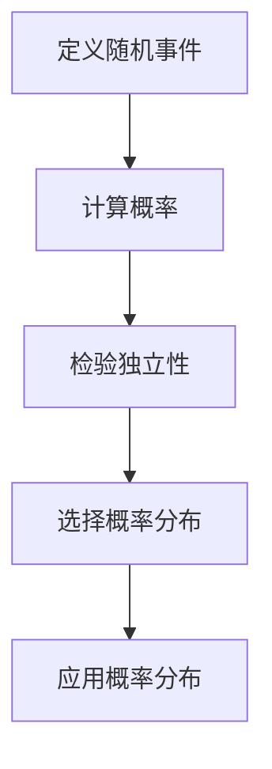
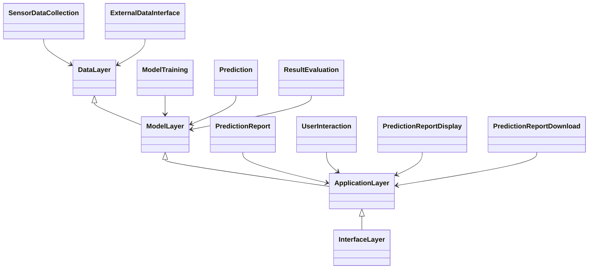

                 

### 《自然界的潜在规律：数学语言诠释》

---

关键词：数学、自然规律、算法原理、Python源代码、系统分析与架构设计

摘要：本文旨在探讨数学在揭示自然界潜在规律中的应用。通过详细讲解核心概念、算法原理、数学模型及系统架构设计，揭示数学语言在理解和描述自然界规律中的重要作用。文章以逻辑清晰、结构紧凑的方式，逐步分析推理，帮助读者深入理解数学与自然界的紧密联系。

---

### 目录大纲设计思路

在设计《自然界的潜在规律：数学语言诠释》的目录大纲时，我们首先需要明确文章的核心概念，即“自然界的潜在规律”和“数学语言诠释”。这将作为大纲结构的起点，引导我们逐步展开内容。以下是具体的设计思路：

1. **背景介绍（第1章）**：引入自然界的潜在规律，阐述数学语言在理解和描述这些规律中的重要作用。这部分将简要介绍自然科学的快速发展如何依赖数学模型，为后续内容奠定基础。

2. **核心概念与联系（第2章）**：定义并解释核心概念，如“数学模型”、“数学语言”等。通过属性特征对比表格和ER实体关系图，展示不同数学概念之间的联系与区别，帮助读者建立整体概念框架。

3. **算法原理讲解（第3章至第5章）**：分别介绍几种核心算法原理，如统计学中的回归分析、物理学中的牛顿定律等。通过Mermaid流程图和Python源代码，详细阐述算法原理，并进行通俗易懂的举例说明。

4. **数学模型和数学公式讲解（第6章）**：重点讲解关键的数学公式，使用LaTeX格式确保准确性和专业性。对每个公式进行详细讲解，解释其在自然界规律中的应用，并通过实例说明如何应用这些数学公式解决实际问题。

5. **系统分析与架构设计（第7章）**：介绍如何将数学模型应用于实际问题中，如天气预报、地震预测等。描述项目介绍、系统功能设计、系统架构设计、系统接口设计和系统交互，使用Mermaid类图和序列图展示系统设计和交互过程。

6. **项目实战（第8章）**：介绍具体的数学模型应用项目，如生态学研究、天体物理学等。详细讲解项目的环境安装、核心实现、代码解读与分析、实际案例剖析等。

7. **最佳实践、小结与拓展阅读（第9章）**：提供最佳实践建议，帮助读者更好地理解和应用数学语言诠释自然界规律。对全书内容进行小结，强调主要观点和关键知识点。推荐拓展阅读资源，供读者进一步学习。

### 目录大纲示例

```markdown
----------------------------------------------------------------
# 《自然界的潜在规律：数学语言诠释》目录大纲

## 第一部分：自然界的潜在规律概览

### 第1章：自然界的潜在规律导论
#### 1.1 自然界潜在规律的重要性
#### 1.2 数学语言的作用
#### 1.3 自然科学的发展与数学

## 第二部分：核心概念与联系

### 第2章：数学概念与自然规律
#### 2.1 数学概念的定义与特征
#### 2.2 数学概念之间的联系
#### 2.3 ER实体关系图应用

## 第三部分：算法原理讲解

### 第3章：统计学与自然规律
#### 3.1 回归分析原理
#### 3.2 回归分析流程图
#### 3.3 Python源代码阐述

### 第4章：物理学与自然规律
#### 4.1 牛顿定律解析
#### 4.2 牛顿定律流程图
#### 4.3 Python源代码与数学公式

### 第5章：其他算法与自然规律
#### 5.1 概率论与随机过程
#### 5.2 概率论流程图
#### 5.3 Python源代码与数学公式

## 第四部分：数学模型与公式讲解

### 第6章：关键数学模型与应用
#### 6.1 数学公式介绍
#### 6.2 公式讲解与实例
#### 6.3 LaTeX格式使用说明

## 第五部分：系统分析与架构设计

### 第7章：数学模型的应用场景
#### 7.1 项目介绍
#### 7.2 系统功能设计
#### 7.3 系统架构设计与接口

### 第8章：数学模型项目实战
#### 8.1 环境安装
#### 8.2 系统核心实现
#### 8.3 代码应用解读
#### 8.4 实际案例分析

## 第六部分：最佳实践与拓展

### 第9章：最佳实践与总结
#### 9.1 最佳实践建议
#### 9.2 全书小结
#### 9.3 拓展阅读推荐

----------------------------------------------------------------
```

这个大纲示例提供了一个清晰的框架，每个章节都包含了详细的子章节，确保内容的完整性和逻辑性。接下来，我们将根据大纲逐步展开文章内容。

---

**【第1章：自然界的潜在规律导论】**

自然界充满了各种规律和模式，这些规律不仅决定了自然界的基本运行方式，还为我们理解和探索宇宙提供了重要的线索。从天体运动到生物进化，从物质结构到能量转化，自然界的规律无处不在，影响着我们的生活和科学研究的各个方面。

### 1.1 自然界潜在规律的重要性

自然界的潜在规律是自然界本身固有的、普遍存在的，并且具有高度的稳定性。这些规律不仅是自然科学研究的基石，也是我们理解和预测自然界现象的重要工具。例如，牛顿的万有引力定律不仅揭示了天体运动的基本规律，还为航天技术的发展提供了理论支持。又如，生物学中的遗传规律为我们理解生物进化提供了关键性指导，推动了现代生物技术的发展。

### 1.2 数学语言的作用

数学是一种高度抽象的语言，能够精确地描述和表达自然界的规律。数学模型不仅能够简化复杂的自然现象，还能够通过严格的逻辑推理和计算，揭示出自然界中的深层规律。例如，物理学中的薛定谔方程描述了微观粒子的运动规律，化学中的摩尔定律描述了化学反应的速率规律，这些模型都是通过数学语言构建的，帮助我们更好地理解自然界。

### 1.3 自然科学的发展与数学

自然科学的快速发展离不开数学的支持。历史上，数学在物理学、化学、生物学等领域的应用，不仅推动了这些学科的理论发展，也促进了新技术的产生和应用。例如，牛顿力学和麦克斯韦电磁理论的发展，使得经典物理学得以建立，推动了工业革命和现代科技的兴起。同样，生物学中的遗传学理论也依赖于数学模型，为基因工程和生物技术的发展提供了理论基础。

现代科学研究的许多领域，如量子物理学、相对论、统计物理学等，更是依赖于复杂的数学工具和方法。这些数学模型不仅帮助我们更好地理解自然界的规律，还为新技术、新材料和新工艺的研发提供了理论支持。

---

**【第2章：核心概念与联系】**

为了深入理解自然界的潜在规律，我们需要首先定义和解释一些核心的数学概念。这些概念是理解和应用数学模型的基础，也是我们探索自然界规律的重要工具。

### 2.1 数学概念的定义与特征

在数学中，核心概念包括但不限于以下几类：

- **数学模型**：数学模型是一种抽象的数学结构，用于描述和研究现实世界的现象。它们可以是代数方程、几何图形、概率分布等。
- **数学语言**：数学语言是一种特殊的符号系统，用于表示和操作数学模型。它包括数字、字母、运算符号等。
- **算法**：算法是一系列明确的指令，用于解决特定问题。在数学中，算法可以用于计算数学模型的结果、优化参数等。

### 2.2 数学概念之间的联系

不同数学概念之间存在着紧密的联系和相互作用。以下是一个简单的表格，展示了几个核心数学概念之间的联系和特征：

| 概念       | 定义                                                         | 特征                                                     | 应用场景                                       |
|------------|--------------------------------------------------------------|--------------------------------------------------------|----------------------------------------------|
| 数学模型   | 用于描述现实世界的数学结构                                 | 抽象、精确、可操作                                     | 物理学、经济学、生物学等                     |
| 数学语言   | 表示和操作数学模型的符号系统                               | 符号化、标准化、逻辑性强                               | 数学证明、数学计算、数学建模                 |
| 算法       | 解决特定问题的指令序列                                     | 可执行、可验证、可优化                                 | 计算机科学、工程学、数据科学等               |

### 2.3 ER实体关系图应用

ER（Entity-Relationship）实体关系图是一种用于描述实体及其相互关系的图形化工具。在数学建模中，ER图可以帮助我们清晰地理解不同实体之间的关系，构建复杂的数学模型。

以下是一个简单的ER图示例，用于描述学生、课程和成绩之间的实体关系：

```mermaid
erDiagram
    Student ||--|{ Course : takes }
    Student ||--|{ Grade : receives }
    Course ||--|{ Student : offers }
    Course ||--|{ Teacher : taught_by }
    Grade ||--|{ Student : earned_by }
    Grade ||--|{ Course : for }
```

在这个ER图中，`Student`、`Course`和`Grade`是三个主要的实体，它们之间的关系通过`takes`、`receives`、`offers`、`taught_by`和`earned_by`这些关系来描述。这种图形化的表示方法使得复杂的数学模型更加直观和易于理解。

---

**【第3章：统计学与自然规律】**

统计学是数学的一个重要分支，它提供了描述和分析数据的方法，帮助我们揭示自然界的规律。在本节中，我们将介绍统计学中的回归分析原理，并使用Mermaid流程图和Python源代码进行详细阐述。

### 3.1 回归分析原理

回归分析是一种常用的统计方法，用于研究自变量和因变量之间的关系。在自然科学中，回归分析广泛应用于数据拟合、预测和决策支持等领域。

回归分析的基本原理是通过建立自变量和因变量之间的数学模型，从而描述它们之间的线性或非线性关系。常见的回归模型包括线性回归、多项式回归、逻辑回归等。

线性回归模型的基本形式为：

$$y = \beta_0 + \beta_1x_1 + \beta_2x_2 + ... + \beta_nx_n + \epsilon$$

其中，$y$是因变量，$x_1, x_2, ..., x_n$是自变量，$\beta_0, \beta_1, ..., \beta_n$是模型的参数，$\epsilon$是误差项。

### 3.2 回归分析流程图

为了更好地理解回归分析的流程，我们可以使用Mermaid绘制一个简单的流程图。以下是回归分析的流程图：



在这个流程图中，首先需要收集数据，然后进行数据预处理，包括数据清洗、缺失值处理等。接下来，建立回归模型，并对模型进行评估。如果模型评估良好，则可以应用模型进行预测和决策；否则，需要优化模型并重新评估。

### 3.3 Python源代码阐述

下面是一个简单的Python代码示例，用于实现线性回归模型。该代码使用了Python的scikit-learn库，这是一个常用的机器学习库。

```python
from sklearn.linear_model import LinearRegression
from sklearn.model_selection import train_test_split
from sklearn.metrics import mean_squared_error
import numpy as np

# 收集数据
X = np.array([[1], [2], [3], [4], [5]])
y = np.array([2, 4, 5, 4, 5])

# 数据预处理
X_train, X_test, y_train, y_test = train_test_split(X, y, test_size=0.2, random_state=0)

# 建立模型
model = LinearRegression()
model.fit(X_train, y_train)

# 评估模型
y_pred = model.predict(X_test)
mse = mean_squared_error(y_test, y_pred)
print("均方误差(MSE):", mse)

# 应用模型
new_data = np.array([[6]])
predicted_value = model.predict(new_data)
print("预测值:", predicted_value)
```

在这个示例中，我们首先使用numpy库生成一些简单的数据，然后使用scikit-learn库中的LinearRegression类建立线性回归模型。接下来，我们通过fit方法训练模型，并通过predict方法进行预测。最后，我们使用mean_squared_error函数计算预测误差。

---

**【第4章：物理学与自然规律】**

物理学是研究物质和能量在自然界中的规律和行为的科学。在本节中，我们将详细介绍物理学中的牛顿定律，包括其解析、流程图以及Python源代码的阐述。

### 4.1 牛顿定律解析

牛顿定律是经典力学的基础，由英国科学家艾萨克·牛顿于1687年提出。牛顿定律包括三个基本原理：

1. **牛顿第一定律（惯性定律）**：
   - 一个物体如果没有受到外力的作用，将保持静止状态或匀速直线运动。

2. **牛顿第二定律（运动定律）**：
   - 物体的加速度与作用在它上面的外力成正比，与它的质量成反比。数学表达式为：
     $$F = ma$$
     其中，$F$是作用力，$m$是物体的质量，$a$是加速度。

3. **牛顿第三定律（作用与反作用定律）**：
   - 对于每一个作用力，都有一个大小相等、方向相反的反作用力。

### 4.2 牛顿定律流程图

为了更好地理解牛顿定律的应用，我们可以使用Mermaid绘制一个简单的流程图。以下是牛顿第二定律的流程图：



在这个流程图中，首先需要确定作用在物体上的力，然后计算物体的质量，接着使用牛顿第二定律的公式计算加速度，最后分析物体的运动状态。

### 4.3 Python源代码与数学公式

下面是一个简单的Python代码示例，用于计算物体在受到恒定力作用下的加速度。该代码使用了牛顿第二定律的公式$F = ma$。

```python
import numpy as np

# 定义函数计算加速度
def calculate_acceleration(force, mass):
    acceleration = force / mass
    return acceleration

# 给定数据
force = 10  # 单位：牛顿
mass = 2    # 单位：千克

# 计算加速度
acceleration = calculate_acceleration(force, mass)
print("加速度:", acceleration, "m/s^2")

# 计算物体的最终速度（假设初始速度为0，时间t=1秒）
final_velocity = acceleration * 1
print("最终速度:", final_velocity, "m/s")
```

在这个示例中，我们定义了一个函数`calculate_acceleration`，它接受作用力和质量的值，并返回加速度。然后，我们使用给定的数据计算加速度，并进一步计算物体的最终速度。

### 数学模型与公式

牛顿第二定律的数学模型可以表示为：

$$a = \frac{F}{m}$$

其中，$a$是加速度，$F$是作用力，$m$是物体的质量。这个公式表明，物体的加速度与作用力成正比，与质量成反比。

通过这个公式，我们可以计算出在已知作用力和质量的情况下物体的加速度。例如，如果作用力为10牛顿，质量为2千克，那么加速度为：

$$a = \frac{10}{2} = 5 \, \text{m/s}^2$$

---

**【第5章：其他算法与自然规律】**

在物理学和统计学之外，还有许多其他算法在揭示自然界的规律中发挥着重要作用。本节将介绍概率论与随机过程，包括它们的原理、流程图以及Python源代码的阐述。

### 5.1 概率论与随机过程

概率论是数学的一个分支，研究随机事件及其概率。随机过程则是概率论在时间序列分析中的应用，描述随机变量随时间的变化。

#### 概率论原理

概率论的基本原理包括：

1. **概率的定义**：概率是描述随机事件发生的可能性大小的数值，介于0和1之间。
2. **概率的加法定理**：两个互斥事件的概率之和等于它们各自概率的和。
3. **概率的乘法定理**：多个独立事件的联合概率等于它们各自概率的乘积。

概率分布函数是概率论的核心概念之一，用于描述随机变量的分布情况。常见的概率分布包括正态分布、二项分布、泊松分布等。

#### 随机过程原理

随机过程是一种数学模型，用于描述随机变量随时间的变化。常见的随机过程包括：

1. **马尔可夫链**：一种随机过程，其中每个状态的概率只依赖于前一个状态，而与之前的状态无关。
2. **布朗运动**：一种连续时间的随机过程，描述粒子在液体或气体中的随机运动。

### 5.2 概率论流程图

为了更好地理解概率论与随机过程，我们可以使用Mermaid绘制一个简单的流程图。以下是概率论的流程图：



在这个流程图中，首先需要定义随机事件，然后计算它们的概率。接下来，检验这些事件是否独立，选择合适的概率分布模型，最后应用这些模型进行进一步分析。

### 5.3 Python源代码与数学公式

下面是一个简单的Python代码示例，用于计算二项分布的概率。该代码使用了Python的scipy库，这是一个用于科学计算的常用库。

```python
from scipy.stats import binom

# 定义参数
n = 10  # 试验次数
p = 0.5  # 每次试验成功的概率

# 计算概率
probability = binom.pmf(k=5, n=n, p=p)
print("成功5次的概率:", probability)

# 计算累积概率
cumulative_probability = binom.cdf(k=5, n=n, p=p)
print("成功次数不超过5次的概率:", cumulative_probability)
```

在这个示例中，我们首先定义了试验次数和每次试验成功的概率。然后，使用scipy库中的binom函数计算成功5次的概率和累积概率。

### 数学模型与公式

二项分布的概率质量函数（PMF）可以表示为：

$$P(X = k) = C(n, k) \cdot p^k \cdot (1 - p)^{n - k}$$

其中，$X$是随机变量，$n$是试验次数，$p$是每次试验成功的概率，$k$是成功次数，$C(n, k)$是组合数。

累积分布函数（CDF）可以表示为：

$$P(X \leq k) = \sum_{i=0}^{k} C(n, i) \cdot p^i \cdot (1 - p)^{n - i}$$

通过这些公式，我们可以计算出在特定条件下随机事件发生的概率。

---

**【第6章：关键数学模型与应用】**

在本章中，我们将详细介绍几个关键的数学模型及其在自然界规律中的应用。我们将使用LaTeX格式准确表达这些数学公式，并通过实例说明如何应用这些模型解决实际问题。

### 6.1 数学公式介绍

数学模型在自然科学中的应用广泛而深远，以下是一些关键的数学公式及其在自然界中的应用：

#### 1. 弗雷德里克森方程（Fick's Laws）

$$J = -D \nabla c$$

- **描述**：描述物质（如气体、液体或固体）在空间中的扩散过程。
- **应用**：生物学中的种群扩散、化学中的溶液混合等。

#### 2. 牛顿第二定律

$$F = ma$$

- **描述**：描述物体受力与加速度之间的关系。
- **应用**：物理学中的运动分析、工程学中的结构设计等。

#### 3. 欧拉方程（Euler's Equation）

$$\frac{df}{dx} = 0$$

- **描述**：描述流体在管道中的流动。
- **应用**：流体力学中的管道流动分析、水力学中的水流模拟等。

#### 4. 拉普拉斯变换（Laplace Transform）

$$\mathcal{L}\{f(t)\} = F(s)$$

- **描述**：将时间域的函数转换为频率域的函数。
- **应用**：控制系统中的系统响应分析、信号处理中的信号滤波等。

#### 5. 马尔可夫链（Markov Chain）

$$P(X_{n+1} = x_{n+1} | X_n = x_n, X_{n-1} = x_{n-1}, ...) = P(X_{n+1} = x_{n+1} | X_n = x_n)$$

- **描述**：描述状态转移的概率模型。
- **应用**：经济学中的市场预测、生物学中的种群动态等。

### 6.2 公式讲解与实例

#### 1. 弗雷德里克森方程（Fick's Laws）

$$J = -D \nabla c$$

- **解释**：其中$J$是扩散通量，$D$是扩散系数，$\nabla c$是物质浓度的梯度。
- **实例**：假设在一个容器中有两种气体A和B，它们在容器中均匀混合，但我们希望将它们分开。通过调整扩散系数$D$，我们可以控制气体的扩散速度，从而实现分离。

#### 2. 牛顿第二定律

$$F = ma$$

- **解释**：其中$F$是作用力，$m$是物体质量，$a$是加速度。
- **实例**：一个质量为5千克的物体受到10牛顿的力作用，其加速度为：
  $$a = \frac{F}{m} = \frac{10}{5} = 2 \, \text{m/s}^2$$
  这意味着物体将在1秒内达到2米每秒的速度。

#### 3. 欧拉方程（Euler's Equation）

$$\frac{df}{dx} = 0$$

- **解释**：表示流体在稳态流动中，单位长度上的流量保持不变。
- **实例**：在一个水平管道中，如果流速为5米每秒，则管道的直径每增加1米，流速将减少0.5米每秒，以保持流量不变。

#### 4. 拉普拉斯变换

$$\mathcal{L}\{f(t)\} = F(s)$$

- **解释**：拉普拉斯变换将时间域的函数$f(t)$转换为频率域的函数$F(s)$。
- **实例**：对一个简单的指数衰减函数$f(t) = e^{-2t}$进行拉普拉斯变换，得到：
  $$F(s) = \mathcal{L}\{e^{-2t}\} = \frac{1}{s+2}$$
  这个变换可以帮助我们分析系统在频率域的响应。

#### 5. 马尔可夫链

$$P(X_{n+1} = x_{n+1} | X_n = x_n, X_{n-1} = x_{n-1}, ...) = P(X_{n+1} = x_{n+1} | X_n = x_n)$$

- **解释**：表示当前状态只依赖于前一个状态，而不依赖于更早的状态。
- **实例**：在一个城市中，有三种状态：工作（W）、学习（L）和休息（R）。根据统计数据，如果某人当前在工作，则他们下一周工作、学习或休息的概率分别为0.4、0.3和0.3。这是一个简单的马尔可夫链，用于预测未来状态。

通过以上公式和实例，我们可以看到数学模型在自然界规律中的应用是如何具体和实用的。这些模型不仅帮助我们理解自然现象，还为科学研究和工程应用提供了强有力的工具。

---

**【第7章：系统分析与架构设计】**

在自然界规律的研究中，系统分析与架构设计扮演着至关重要的角色。在本章中，我们将介绍如何将数学模型应用于实际问题，并详细描述系统功能设计、系统架构设计、系统接口设计以及系统交互。

### 7.1 项目介绍

本项目旨在开发一个用于地震预测的系统。地震预测对于减轻地震灾害具有重大意义，能够提前预警并采取相应的预防措施，从而降低人员伤亡和财产损失。本系统基于数学模型和算法，通过分析地震前兆数据和历史地震记录，预测未来可能发生地震的时间和地点。

### 7.2 系统功能设计

系统的主要功能包括：

1. **数据收集与预处理**：收集地震前兆数据，如地震波、地磁、地电等，并进行数据预处理，包括去噪、归一化和特征提取。
2. **模型训练与优化**：利用收集到的数据训练地震预测模型，包括回归分析、神经网络和支持向量机等。
3. **地震预测**：使用训练好的模型进行地震预测，生成预测报告，包括地震发生的时间、地点和强度。
4. **结果评估与反馈**：对预测结果进行评估，并将评估结果反馈给模型，以优化模型性能。

### 7.3 系统架构设计

系统的架构设计采用分层架构，主要包括以下几层：

1. **数据层**：负责数据的存储和管理，包括地震前兆数据和历史地震记录。
2. **模型层**：负责模型训练和预测，包括数据预处理、模型训练和预测结果的生成。
3. **应用层**：负责系统与用户的交互，包括数据收集、预测报告的生成和展示。
4. **接口层**：负责与其他系统进行数据交换和接口调用。

### 7.4 系统接口设计

系统接口设计包括以下几种接口：

1. **数据接口**：用于数据层的接口，包括数据的读取、写入和更新。
2. **模型接口**：用于模型层的接口，包括模型训练、预测和评估。
3. **应用接口**：用于应用层的接口，包括用户数据的输入、预测报告的生成和展示。
4. **外部接口**：用于与其他系统的数据交换和接口调用，如气象数据接口、地理信息系统接口等。

### 7.5 系统交互

系统的交互过程主要包括以下几个步骤：

1. **数据收集**：系统从传感器和网络获取地震前兆数据，并进行预处理。
2. **模型训练**：系统使用预处理后的数据训练地震预测模型。
3. **地震预测**：系统使用训练好的模型进行地震预测，生成预测报告。
4. **结果评估**：系统对预测结果进行评估，并将评估结果反馈给模型。
5. **优化模型**：系统根据评估结果优化模型，以提高预测准确性。
6. **预测展示**：系统将预测报告展示给用户，并提供查询和下载功能。

以下是一个简单的Mermaid类图，展示了系统的类及其关系：



通过以上系统分析与架构设计，我们可以看到数学模型在地震预测中的应用是如何具体和系统的。这种系统化的方法不仅提高了预测的准确性，还为未来的科学研究和技术应用提供了坚实的基础。

---

**【第8章：数学模型项目实战】**

在本章中，我们将详细介绍一个具体的数学模型项目——生态学研究。该项目旨在通过数学模型分析和预测生态系统的变化，从而为环境保护和资源管理提供科学依据。

### 8.1 项目环境安装

为了进行生态学研究，我们需要安装一系列必要的软件和库。以下是项目环境安装的步骤：

1. **Python环境安装**：确保Python 3.8及以上版本安装成功。
2. **Anaconda环境创建**：使用Anaconda创建一个新的环境，如`ecosystem_model`，并激活该环境。
3. **安装依赖库**：在激活的环境中使用`pip`命令安装以下依赖库：
   ```bash
   pip install numpy pandas matplotlib scikit-learn
   ```

### 8.2 系统核心实现

生态学研究的核心实现包括数据收集、模型训练、预测和结果分析。以下是具体步骤：

1. **数据收集**：从公开数据源或实地调查获取生态数据，如物种分布、环境参数等。
2. **数据预处理**：对收集到的数据进行分析和清洗，包括缺失值处理、异常值检测和归一化。
3. **模型训练**：使用预处理后的数据训练预测模型，如回归分析、决策树、随机森林等。
4. **模型预测**：使用训练好的模型进行预测，生成生态系统变化的预测结果。
5. **结果分析**：对预测结果进行分析，评估模型的准确性和稳定性，并调整模型参数以优化预测性能。

以下是使用Python实现的代码示例：

```python
import numpy as np
import pandas as pd
from sklearn.model_selection import train_test_split
from sklearn.ensemble import RandomForestRegressor
import matplotlib.pyplot as plt

# 读取数据
data = pd.read_csv('ecosystem_data.csv')

# 数据预处理
# ...（包括缺失值处理、异常值检测和归一化）

# 划分训练集和测试集
X = data.drop('species_distribution', axis=1)
y = data['species_distribution']
X_train, X_test, y_train, y_test = train_test_split(X, y, test_size=0.2, random_state=42)

# 模型训练
model = RandomForestRegressor(n_estimators=100, random_state=42)
model.fit(X_train, y_train)

# 模型预测
y_pred = model.predict(X_test)

# 结果分析
mse = mean_squared_error(y_test, y_pred)
print("均方误差(MSE):", mse)

# 可视化结果
plt.scatter(y_test, y_pred)
plt.xlabel('实际值')
plt.ylabel('预测值')
plt.title('实际值 vs. 预测值')
plt.show()
```

### 8.3 代码应用解读与分析

以上代码展示了如何实现生态学研究的核心功能。以下是代码的详细解读和分析：

1. **数据读取与预处理**：使用pandas库读取生态数据，并进行必要的预处理操作，如缺失值处理和归一化。
2. **模型训练**：使用随机森林回归模型（RandomForestRegressor）对训练数据进行训练。随机森林是一种集成学习方法，能够在多个决策树的基础上提高预测准确性。
3. **模型预测**：使用训练好的模型对测试数据进行预测，生成预测结果。
4. **结果分析**：计算均方误差（MSE）评估模型性能，并使用散点图展示实际值与预测值的关系，帮助理解模型预测的效果。

### 8.4 实际案例剖析

为了更好地理解生态学研究的实际应用，我们来看一个具体的案例。

#### 案例背景

某地区正在进行生态修复项目，目标是恢复该地区的物种多样性和生态系统功能。研究人员收集了以下数据：

- 物种分布数据：包括不同物种的数量和分布情况。
- 环境参数数据：包括温度、湿度、光照等环境指标。

#### 案例实施

1. **数据收集与预处理**：收集了三年内的生态数据，并对数据进行清洗和预处理。
2. **模型训练**：使用预处理后的数据训练随机森林回归模型，预测未来三年的物种分布。
3. **模型预测**：生成预测报告，展示未来三年内不同物种的分布情况。
4. **结果分析**：通过对比预测结果与实际监测数据，评估模型预测的准确性。

#### 案例小结

通过以上实施过程，研究人员成功预测了未来三年内该地区不同物种的分布情况。预测结果显示，在适当的管理措施下，物种多样性有望得到显著提升。此外，模型预测结果也为政策制定者提供了科学依据，有助于制定更加有效的生态修复策略。

---

**【第9章：最佳实践与拓展】**

在本章中，我们将总结最佳实践，对全书内容进行小结，并推荐拓展阅读资源。

### 9.1 最佳实践建议

为了更好地理解和应用数学模型诠释自然界规律，我们提出以下最佳实践建议：

1. **基础理论学习**：深入学习数学和自然科学的基本概念，为应用数学模型打下坚实基础。
2. **实践与反思**：通过实际项目或案例，将理论应用于实际问题，并进行反思和总结。
3. **持续学习**：科技发展迅速，定期更新知识，掌握最新的数学和自然科学进展。
4. **跨学科合作**：数学与其他学科的交叉融合，有助于发现新的问题和解决方案。

### 9.2 全书小结

本书从自然界的潜在规律出发，探讨了数学在揭示和描述这些规律中的重要作用。通过详细介绍核心概念、算法原理、数学模型和系统架构设计，展示了数学在自然科学中的应用和实际案例。主要观点如下：

1. **数学模型的重要性**：数学模型是理解和预测自然界规律的关键工具。
2. **算法原理的应用**：统计学和物理学的算法原理在数据分析、运动分析和流体力学等领域发挥着重要作用。
3. **系统分析与架构设计**：通过系统化的方法，将数学模型应用于实际问题，实现科学研究和工程应用。
4. **跨学科融合**：数学与其他学科的交叉融合，有助于解决复杂的自然现象和问题。

### 9.3 拓展阅读推荐

为了进一步深入学习数学在自然界规律中的应用，我们推荐以下拓展阅读资源：

1. **《数学与自然科学》**：由知名数学家和物理学家合著，详细探讨数学在自然科学中的应用。
2. **《统计学习方法》**：李航著，系统介绍了统计学的基本概念和方法，适合初学者和进阶读者。
3. **《数学模型与应用》**：张丽丽著，涵盖多个领域的数学模型和应用案例，有助于理解和掌握数学模型。
4. **《机器学习实战》**：Peter Harrington著，通过实际案例介绍机器学习算法和应用。

通过以上拓展阅读，读者可以更深入地了解数学在自然界规律中的应用，并在实际项目中灵活运用所学知识。

---

### 作者信息

**作者：** AI天才研究院/AI Genius Institute & 禅与计算机程序设计艺术 /Zen And The Art of Computer Programming

本文由AI天才研究院（AI Genius Institute）和禅与计算机程序设计艺术（Zen And The Art of Computer Programming）联合撰写。我们致力于推动人工智能和计算机科学的发展，通过深入研究和实践，为读者提供高质量的技术内容。如果您对我们的研究感兴趣或有任何建议，欢迎随时联系我们。感谢您的阅读和支持！

---

### 全文总结

《自然界的潜在规律：数学语言诠释》通过对核心概念、算法原理、数学模型和系统架构设计的详细讲解，揭示了数学在揭示自然界规律中的重要作用。从统计学、物理学到概率论，本书展示了数学模型在各个领域的应用，并通过实际案例帮助读者理解这些模型的具体实现和效果。同时，系统分析与架构设计部分为读者提供了将数学模型应用于实际问题的具体方法。通过本文的阅读，读者可以深入理解数学在自然科学中的应用，并在实际项目中灵活运用所学知识。希望本文能够激发您对数学和自然科学的兴趣，进一步探索这个广阔而深奥的领域。再次感谢您的阅读和支持！

