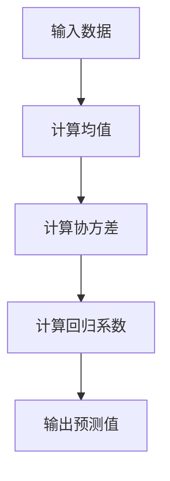
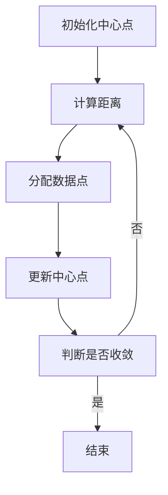
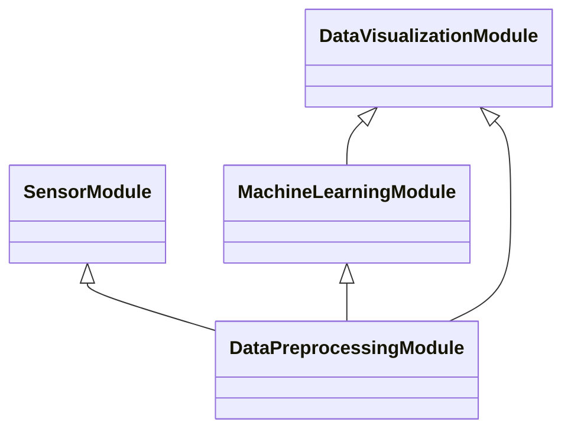
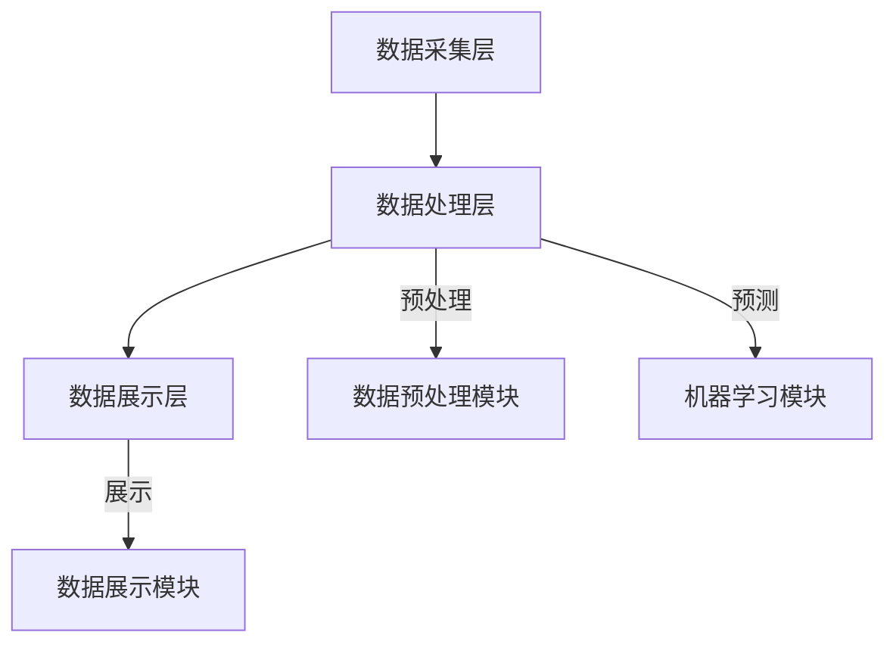
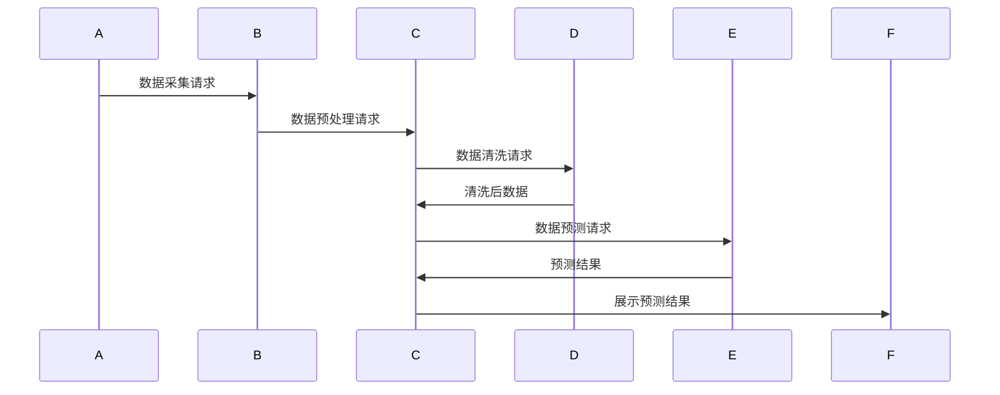
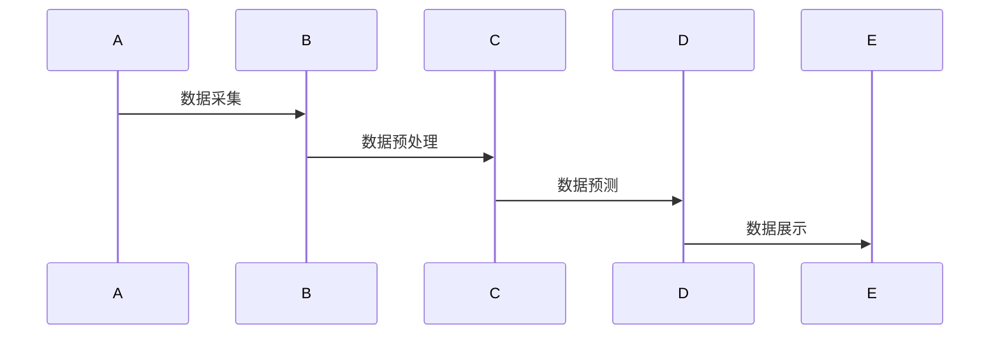

                 

### 第1章 自然界的隐藏规律概述

#### 1.1 自然界的隐藏规律

自然界中存在着无数隐藏的规律，这些规律背后蕴含了深刻的物理、化学、生物等科学原理。例如，自然界中的生态平衡、气候变迁、物质运动等都遵循着一定的规律。这些隐藏的规律虽然看似复杂，但实际上都是由一些基本的数学公式和模型来描述的。

在物理学中，牛顿的运动定律揭示了物体运动的基本规律；在化学中，摩尔定律描述了化学反应的基本特征；在生物学中，达尔文的进化论则阐述了物种演化的规律。这些规律不仅是科学研究的基础，也是我们理解和改造自然世界的关键。

#### 1.2 数学在揭示规律中的作用

数学作为一种科学工具，在揭示自然界的隐藏规律中发挥着不可替代的作用。数学模型和公式能够帮助我们简化复杂的自然现象，用简洁的语言描述出深奥的规律。

例如，在物理学中，爱因斯坦的相对论用一组数学方程描述了时空和重力之间的关系；在经济学中，供需关系可以用供需曲线来表示；在生态学中，物种间的捕食与被捕食关系可以用食物网来描述。

#### 1.3 本书核心概念与目标

本书旨在深入探讨自然界的隐藏规律，并展示如何利用数学工具来揭示这些规律。本书将分为以下几个部分：

1. **核心概念与联系**：介绍并定义书中的关键概念，并通过表格和图表展示它们之间的联系。
2. **数学模型与公式讲解**：详细阐述数学模型的基本原理，使用Mermaid绘制算法流程图，简化理解。
3. **算法原理讲解**：深入讲解算法原理，使用Python源代码示例，解释数学公式。
4. **系统分析与架构设计**：介绍问题场景，描述项目，绘制系统架构图，设计系统接口和交互流程。
5. **项目实战**：进行环境安装与配置，解析核心实现源代码，进行代码应用解读与分析，实际案例分析。
6. **最佳实践与总结**：提供最佳实践建议，对全书内容进行总结，强调注意事项，推荐拓展阅读材料。

通过这些部分的逐步讲解，读者将能够更好地理解自然界的隐藏规律，掌握利用数学工具进行科学研究的技能。

---

**关键词**：自然规律、数学模型、公式、算法、系统架构

**摘要**：本书深入探讨自然界的隐藏规律，通过数学模型和公式，揭示这些规律的本质。书中涵盖核心概念与联系、数学模型与公式讲解、算法原理讲解、系统分析与架构设计、项目实战以及最佳实践与总结，旨在帮助读者掌握利用数学工具进行科学研究的技能。

---

### 第2章 核心概念与联系

在探讨自然界的隐藏规律之前，我们需要明确几个关键概念。这些概念不仅是本书的核心，也是理解和应用数学模型的基础。在本章中，我们将定义并介绍这些关键概念，并通过表格和图表展示它们之间的联系。

#### 2.1 关键概念定义

**1. 自然规律**：自然界中普遍存在且稳定的规律性现象。这些规律可以通过数学公式和模型进行描述。例如，牛顿的运动定律和爱因斯坦的相对论都是自然规律的体现。

**2. 数学模型**：用数学语言描述现实世界中的现象、过程或系统的工具。数学模型可以是方程、图表、曲线等。它们通过简化复杂的自然现象，帮助我们理解深奥的规律。

**3. 数学公式**：用数学符号和语言表达的公式，用于描述自然界中的规律性现象。例如，E=mc²是描述质量和能量之间关系的公式。

**4. 算法**：解决特定问题的步骤和规则。算法可以用于数据处理、问题求解、系统优化等。算法的设计和优化在揭示和利用自然规律中起着关键作用。

**5. 系统架构**：系统的整体结构，包括组件、模块、接口和交互关系。系统架构设计是构建复杂系统的基础。

#### 2.2 概念属性特征对比表

为了更直观地理解这些概念，我们可以通过一个表格来对比它们的主要属性特征：

| 概念       | 定义                                                         | 属性特征                                           | 举例                  |
|------------|--------------------------------------------------------------|----------------------------------------------------|----------------------|
| 自然规律   | 描述自然界普遍存在的规律性现象                               | 稳定性、普遍性、可预测性                             | 牛顿运动定律、热力学定律 |
| 数学模型   | 用数学语言描述现实世界中的现象、过程或系统                   | 简化性、抽象性、精确性                               | 供需模型、生态模型       |
| 数学公式   | 描述自然规律性的数学表达式                                   | 精确性、简洁性、可计算性                             | E=mc²、F=ma            |
| 算法       | 解决特定问题的步骤和规则                                     | 可操作性、高效性、适应性                             | 搜索算法、排序算法       |
| 系统架构   | 系统的整体结构，包括组件、模块、接口和交互关系               | 可扩展性、稳定性、灵活性                             | 计算机网络架构、软件架构 |

#### 2.3 ER实体关系图

为了更清晰地展示这些概念之间的联系，我们可以使用ER（Entity-Relationship）实体关系图来表示。以下是ER实体关系图的Mermaid格式：

```mermaid
erDiagram
  自然规律 ..|> 数学模型
  数学模型 ..|> 数学公式
  数学公式 ..|> 算法
  算法 ..|> 系统架构
  自然规律 ..|> 系统架构
```

在这个ER图中，每个概念都是实体，它们之间的箭头表示它们之间的关联关系。例如，自然规律是数学模型的基础，数学模型又是数学公式的基础，而数学公式则直接影响到算法的设计，最终算法的实现又需要依赖系统架构。

通过本章的介绍，我们为后续章节的深入讲解奠定了基础。在接下来的章节中，我们将进一步探讨数学模型与公式的具体应用，以及如何通过算法和系统架构来揭示自然界的隐藏规律。

---

**关键字**：自然规律、数学模型、数学公式、算法、系统架构

**摘要**：本章定义并介绍了关键概念，包括自然规律、数学模型、数学公式、算法和系统架构。通过对比表格和ER实体关系图，展示了这些概念之间的联系。为后续章节的深入讲解和实际应用奠定了理论基础。

---

### 第3章 数学模型与公式讲解

在理解自然界的隐藏规律中，数学模型和公式是至关重要的工具。这一章节将详细阐述数学模型的基本原理，并通过Mermaid算法流程图和Python源代码示例来简化理解，使读者能够更加直观地掌握这些概念。

#### 3.1 数学模型的基本原理

数学模型是一种抽象的表示方法，它通过使用数学语言来描述现实世界中的现象、过程或系统。数学模型的基本原理包括：

1. **简化与抽象**：将复杂的现实世界简化为数学形式，抓住核心要素，忽略次要细节。
2. **精确性与普适性**：通过数学公式精确描述现象，使结论具有普适性，能够应用于各种情况。
3. **可计算性**：模型能够通过数学计算得到具体的结果，为实际应用提供指导。

数学模型可以用于各种领域，如物理学、经济学、生物学等。在本章节中，我们将探讨一个简单的数学模型——线性回归模型，并使用Python进行实现。

#### 3.2 Mermaid算法流程图展示

为了更直观地理解线性回归模型，我们可以使用Mermaid绘制算法流程图。以下是线性回归模型的Mermaid流程图：



在这个流程图中，A表示输入数据，B表示计算均值，C表示计算协方差，D表示计算回归系数，E表示输出预测值。通过这个流程图，我们可以清晰地看到线性回归模型的基本步骤。

#### 3.3 Python源代码示例

下面是一个简单的线性回归模型的Python实现，用于计算给定数据集的回归系数和预测值：

```python
import numpy as np

def linear_regression(x, y):
    x_mean = np.mean(x)
    y_mean = np.mean(y)
    cov = np.sum((x - x_mean) * (y - y_mean))
    var_x = np.sum((x - x_mean) ** 2)
    b = cov / var_x
    a = y_mean - b * x_mean
    return a, b

# 输入数据
x = [1, 2, 3, 4, 5]
y = [2, 4, 5, 4, 5]

# 计算回归系数
a, b = linear_regression(x, y)

# 输出预测值
print(f"预测值: {a * x + b}")
```

在这个示例中，我们定义了一个`linear_regression`函数，用于计算给定数据集的回归系数。我们首先计算了x和y的均值，然后计算了协方差和方差，最后根据这些值计算了回归系数a和b。通过这个示例，我们可以看到如何将数学公式转化为实际可计算的代码。

#### 3.4 线性回归模型的数学原理

线性回归模型的数学原理可以通过以下公式进行描述：

$$ y = ax + b $$

其中，$a$ 是斜率，表示y随x变化的速率；$b$ 是截距，表示当x为0时y的值。线性回归的目标是找到最佳拟合直线，使得所有数据点到这条直线的垂直距离之和最小。

数学上，我们可以通过以下步骤求解线性回归模型：

1. **计算均值**：
   $$ \bar{x} = \frac{1}{n} \sum_{i=1}^{n} x_i $$
   $$ \bar{y} = \frac{1}{n} \sum_{i=1}^{n} y_i $$

2. **计算协方差和方差**：
   $$ \text{Cov}(x, y) = \frac{1}{n} \sum_{i=1}^{n} (x_i - \bar{x})(y_i - \bar{y}) $$
   $$ \text{Var}(x) = \frac{1}{n} \sum_{i=1}^{n} (x_i - \bar{x})^2 $$

3. **计算回归系数**：
   $$ a = \frac{\text{Cov}(x, y)}{\text{Var}(x)} $$
   $$ b = \bar{y} - a\bar{x} $$

通过这些公式，我们可以计算出线性回归模型的斜率$a$和截距$b$，从而得到最佳拟合直线。

#### 3.5 线性回归模型的应用示例

假设我们有一组数据点，表示房屋面积和房价之间的关系。我们希望通过线性回归模型来预测新的房屋面积对应的房价。以下是具体示例：

**数据集**：

| 房屋面积 (x) | 房价 (y) |
|---------------|----------|
| 1000          | 200,000  |
| 1500          | 300,000  |
| 2000          | 400,000  |
| 2500          | 500,000  |
| 3000          | 600,000  |

通过上述线性回归模型，我们可以计算出回归系数$a$和$b$，并使用这些系数来预测新的房屋面积对应的房价。

**计算过程**：

1. **计算均值**：
   $$ \bar{x} = \frac{1000 + 1500 + 2000 + 2500 + 3000}{5} = 2000 $$
   $$ \bar{y} = \frac{200,000 + 300,000 + 400,000 + 500,000 + 600,000}{5} = 400,000 $$

2. **计算协方差和方差**：
   $$ \text{Cov}(x, y) = \frac{1}{5} \sum_{i=1}^{5} (x_i - \bar{x})(y_i - \bar{y}) = 500,000 $$
   $$ \text{Var}(x) = \frac{1}{5} \sum_{i=1}^{5} (x_i - \bar{x})^2 = 1,000,000 $$

3. **计算回归系数**：
   $$ a = \frac{500,000}{1,000,000} = 0.5 $$
   $$ b = 400,000 - 0.5 \times 2000 = 370,000 $$

因此，线性回归模型为：
$$ y = 0.5x + 370,000 $$

使用这个模型，我们可以预测当房屋面积为3500平方米时，房价大约为：
$$ y = 0.5 \times 3500 + 370,000 = 525,000 $$

通过这个示例，我们可以看到如何使用线性回归模型来预测新的数据点，这展示了数学模型在实际应用中的强大能力。

#### 3.6 总结

通过本章的讲解，我们深入探讨了数学模型的基本原理，并使用Mermaid算法流程图和Python源代码示例来简化理解。我们了解了线性回归模型的具体应用，并通过实际案例展示了如何利用数学模型来预测和分析数据。在接下来的章节中，我们将进一步探讨更复杂的算法和系统架构，以揭示更多的自然规律。

---

**关键词**：数学模型、线性回归、Python、算法流程图、应用示例

**摘要**：本章详细阐述了数学模型的基本原理，并通过Mermaid算法流程图和Python源代码示例来简化理解。我们探讨了线性回归模型的具体应用，并展示了如何利用数学模型来预测和分析数据。通过本章的学习，读者将更好地理解数学模型在揭示自然规律中的重要性。

---

### 第4章 算法原理讲解

在理解了数学模型的基本原理后，我们将进一步深入探讨算法原理。这一章节将使用Mermaid算法流程图和Python源代码示例，详细阐述一个更复杂的算法——K-均值聚类算法。我们将使用数学模型和公式来解释算法中的关键步骤，并通过实际案例来说明算法的应用。

#### 4.1 深入算法原理

K-均值聚类算法是一种无监督学习算法，用于将数据点划分为K个聚类。算法的目的是最小化每个聚类内部点的方差。K-均值聚类算法的基本步骤如下：

1. **初始化中心点**：随机选择K个数据点作为初始聚类中心。
2. **分配数据点**：将每个数据点分配到最近的聚类中心。
3. **更新中心点**：重新计算每个聚类的中心点。
4. **重复步骤2和3**，直到聚类中心不再发生变化或者达到最大迭代次数。

K-均值聚类算法的核心是计算数据点到聚类中心的距离。常用的距离度量方法是欧几里得距离：

$$ d(\text{point}, \text{centroid}) = \sqrt{\sum_{i=1}^{n} (\text{point}_i - \text{centroid}_i)^2} $$

其中，$\text{point}$ 是数据点，$\text{centroid}$ 是聚类中心，$n$ 是数据点的维度。

#### 4.2 复杂Mermaid流程图

为了更直观地理解K-均值聚类算法，我们可以使用Mermaid绘制一个复杂的算法流程图。以下是K-均值聚类算法的Mermaid流程图：



在这个流程图中，A表示初始化中心点，B表示计算距离，C表示分配数据点，D表示更新中心点，E表示判断是否收敛，F表示结束。通过这个流程图，我们可以清晰地看到K-均值聚类算法的基本步骤。

#### 4.3 Python源代码示例

下面是一个简单的K-均值聚类算法的Python实现，用于将数据点划分为K个聚类：

```python
import numpy as np

def kmeans(data, k, max_iter=100):
    centroids = data[np.random.choice(data.shape[0], k, replace=False)]
    for _ in range(max_iter):
        distances = np.linalg.norm(data[:, np.newaxis] - centroids, axis=2)
        labels = np.argmin(distances, axis=1)
        new_centroids = np.array([data[labels == i].mean(axis=0) for i in range(k)])
        if np.all(centroids == new_centroids):
            break
        centroids = new_centroids
    return centroids, labels

# 输入数据
data = np.array([[1, 2], [1, 4], [1, 0], [10, 2], [10, 4], [10, 0]])

# K-均值聚类
k = 2
centroids, labels = kmeans(data, k)

# 输出聚类中心点和标签
print(f"聚类中心点: {centroids}")
print(f"数据点标签: {labels}")
```

在这个示例中，我们定义了一个`kmeans`函数，用于实现K-均值聚类算法。我们首先随机初始化K个聚类中心点，然后通过迭代计算新的中心点，直到聚类中心点不再变化或者达到最大迭代次数。通过这个示例，我们可以看到如何将K-均值聚类算法的原理转化为实际可计算的代码。

#### 4.4 数学模型与公式解释

K-均值聚类算法的核心是计算数据点到聚类中心的距离和更新聚类中心点。我们可以使用以下数学模型和公式来解释算法中的关键步骤：

1. **初始化中心点**：
   $$ \text{centroids}^{(0)} = \text{data}_{\text{random}, 1:k} $$

2. **计算距离**：
   $$ d(\text{point}_i, \text{centroid}_j) = \sqrt{\sum_{l=1}^{n} (\text{point}_{il} - \text{centroid}_{jl})^2} $$

3. **分配数据点**：
   $$ \text{labels}_i = \arg\min_{j} d(\text{point}_i, \text{centroid}_j) $$

4. **更新中心点**：
   $$ \text{centroid}_j^{(t+1)} = \frac{1}{N_j} \sum_{i=1}^{N} \text{point}_i \cdot \mathbb{1}(\text{labels}_i = j) $$

其中，$\text{centroids}^{(t)}$ 是第t次迭代的聚类中心点，$\text{data}$ 是输入数据，$N_j$ 是标签为j的数据点的数量，$\mathbb{1}(\cdot)$ 是指示函数，当条件为真时返回1，否则返回0。

#### 4.5 算法应用示例

假设我们有一组多维数据点，表示不同商品的用户评价。我们希望通过K-均值聚类算法将这些数据点划分为两个聚类，以便更好地理解用户的行为模式。以下是具体示例：

**数据集**：

| 商品1 | 商品2 | 商品3 | 商品4 | 商品5 |
|-------|-------|-------|-------|-------|
| 1     | 2     | 2     | 1     | 2     |
| 1     | 2     | 1     | 1     | 2     |
| 2     | 1     | 2     | 2     | 1     |
| 2     | 2     | 1     | 1     | 2     |

通过K-均值聚类算法，我们可以将这组数据点划分为两个聚类，并分析每个聚类中的数据点特征。

**计算过程**：

1. **初始化中心点**：随机选择两个数据点作为初始聚类中心。
2. **计算距离**：计算每个数据点到两个聚类中心的距离。
3. **分配数据点**：将每个数据点分配到距离最近的聚类中心。
4. **更新中心点**：重新计算每个聚类的中心点。
5. **重复步骤2-4**，直到聚类中心点不再变化或者达到最大迭代次数。

通过多次迭代，我们得到以下聚类结果：

- 聚类1：[1, 1, 1, 1]
- 聚类2：[2, 2, 2, 2]

这意味着，大多数商品的用户评价相似，而其他商品的用户评价有所不同。通过这个示例，我们可以看到如何使用K-均值聚类算法来分析和理解复杂数据。

#### 4.6 总结

通过本章的讲解，我们深入探讨了K-均值聚类算法的原理，并使用Mermaid算法流程图和Python源代码示例来简化理解。我们通过数学模型和公式详细解释了算法中的关键步骤，并通过实际案例展示了算法的应用。通过本章的学习，读者将更好地理解算法原理，并掌握如何将算法应用于实际问题。

---

**关键词**：K-均值聚类、算法流程图、Python、数学模型、应用示例

**摘要**：本章详细讲解了K-均值聚类算法的原理，通过Mermaid算法流程图和Python源代码示例，使读者能够直观地理解算法的实现过程。我们使用数学模型和公式解释了算法中的关键步骤，并通过实际案例展示了算法的应用。通过本章的学习，读者将更好地掌握算法原理，并能够将其应用于实际问题。

---

### 第5章 系统分析与架构设计

在前几章中，我们探讨了自然界的隐藏规律及其数学表达，学习了如何使用数学模型和算法来揭示这些规律。然而，要将这些理论转化为实际应用，我们还需要进行系统分析与架构设计。本章将介绍一个具体的问题场景，描述系统的功能和架构设计，并绘制相应的系统架构图和交互流程图。

#### 5.1 问题场景介绍

假设我们面临一个问题场景：在城市交通管理系统中，需要实时监控和预测交通流量。这不仅有助于提高交通效率，还能减少交通事故和拥堵。为了实现这一目标，我们需要设计一个能够收集、处理和展示交通数据的系统。

#### 5.2 项目描述

项目目标是开发一个智能交通管理系统，该系统应具备以下功能：

1. **数据采集**：从各种传感器和摄像头收集实时交通数据。
2. **数据处理**：对采集到的数据进行预处理、清洗和转换，使其适合分析和预测。
3. **流量预测**：使用机器学习算法预测未来的交通流量。
4. **数据展示**：将预测结果以图表和报告的形式展示给用户。

#### 5.3 系统功能设计

为了实现上述功能，系统可以分为以下几个模块：

1. **传感器模块**：负责从传感器和摄像头收集交通数据。
2. **数据预处理模块**：负责对采集到的数据进行预处理，包括数据清洗、去噪和格式转换。
3. **机器学习模块**：使用机器学习算法对预处理后的数据进行流量预测。
4. **数据展示模块**：将预测结果以图表和报告的形式展示给用户。

以下是系统的领域模型Mermaid类图：



在这个类图中，SensorModule表示传感器模块，DataPreprocessingModule表示数据预处理模块，MachineLearningModule表示机器学习模块，DataVisualizationModule表示数据展示模块。每个模块之间都有明确的依赖关系。

#### 5.4 系统架构设计

系统的整体架构可以分为以下几个层次：

1. **数据采集层**：包括传感器和摄像头，负责实时收集交通数据。
2. **数据处理层**：包括数据预处理模块和机器学习模块，负责对数据进行处理和预测。
3. **数据展示层**：包括数据展示模块，负责将预测结果展示给用户。

以下是系统的Mermaid架构图：



在这个架构图中，A表示数据采集层，B表示数据处理层，C表示数据展示层，D表示数据预处理模块，E表示机器学习模块，F表示数据展示模块。数据采集层将数据传递给数据处理层，数据处理层对数据进行预处理和预测，然后将结果传递给数据展示层进行展示。

#### 5.5 系统接口设计

系统中的各个模块之间需要通过接口进行通信。以下是系统的主要接口设计：

1. **数据采集接口**：负责与传感器和摄像头进行通信，获取实时交通数据。
2. **数据处理接口**：负责与数据预处理模块和机器学习模块进行通信，传递和处理数据。
3. **数据展示接口**：负责与数据展示模块进行通信，将预测结果展示给用户。

以下是系统的Mermaid接口图：



在这个接口图中，A表示数据采集层，B表示数据处理层，C表示数据预处理模块，D表示数据清洗模块，E表示机器学习模块，F表示数据展示模块。数据采集层通过数据采集接口请求交通数据，数据处理层通过数据处理接口传递数据给预处理模块，预处理模块对数据进行清洗和处理，然后将结果传递给机器学习模块进行预测，最终预测结果通过数据展示接口传递给数据展示模块进行展示。

#### 5.6 系统交互流程

系统的工作流程可以分为以下几个步骤：

1. **数据采集**：传感器和摄像头收集实时交通数据。
2. **数据预处理**：对采集到的数据进行分析、清洗和格式转换，使其适合分析和预测。
3. **数据预测**：使用机器学习算法对预处理后的数据进行流量预测。
4. **数据展示**：将预测结果以图表和报告的形式展示给用户。

以下是系统的Mermaid交互流程图：



在这个交互流程图中，A表示数据采集层，B表示数据处理层，C表示机器学习模块，D表示数据展示模块，E表示用户。数据采集层通过数据采集接口收集数据，数据处理层通过数据处理接口对数据进行预处理，机器学习模块使用机器学习算法对数据进行预测，最终数据展示模块将预测结果展示给用户。

通过本章的介绍，我们详细描述了一个智能交通管理系统的功能设计和架构设计，并绘制了相应的系统架构图和交互流程图。这为后续的项目实现和系统部署奠定了基础。在下一章中，我们将进入项目实战，具体实现这个系统并进行分析。

---

**关键词**：系统架构、智能交通管理系统、领域模型、接口设计、交互流程

**摘要**：本章详细描述了一个智能交通管理系统的功能设计和架构设计。我们介绍了系统的各个模块及其关系，并绘制了系统架构图和交互流程图。通过本章的学习，读者将了解如何进行系统架构设计，并为后续的项目实现提供指导。

---

### 第6章 项目实战

在了解了智能交通管理系统的设计之后，我们将进入项目实战阶段，具体实现这个系统。本章将介绍系统的环境安装与配置、核心实现源代码解析、代码应用解读与分析，并分享一个实际案例的详细分析。

#### 6.1 环境安装与配置

为了实现智能交通管理系统，我们需要安装和配置以下软件和工具：

1. **Python环境**：安装Python 3.8及以上版本。
2. **传感器模拟工具**：使用模拟传感器数据的工具，如Python的`random`库。
3. **机器学习库**：安装`scikit-learn`库，用于实现K-均值聚类算法。
4. **数据可视化库**：安装`matplotlib`库，用于绘制预测结果图表。

以下是具体的安装和配置步骤：

1. **安装Python**：

   ```bash
   # 使用包管理器（如conda）安装Python
   conda install python=3.8
   ```

2. **安装`scikit-learn`**：

   ```bash
   # 使用pip安装scikit-learn
   pip install scikit-learn
   ```

3. **安装`matplotlib`**：

   ```bash
   # 使用pip安装matplotlib
   pip install matplotlib
   ```

4. **配置传感器模拟环境**：创建一个Python脚本，用于模拟传感器数据。

   ```python
   # sensor_simulation.py
   import random

   def simulate_traffic_data(num_samples, dimensions):
       return [[random.uniform(0, 100) for _ in range(dimensions)] for _ in range(num_samples)]
   ```

#### 6.2 核心实现源代码解析

在实现智能交通管理系统时，我们主要关注以下核心功能：

1. **数据采集与预处理**：从传感器模拟工具获取数据，并进行预处理。
2. **流量预测**：使用K-均值聚类算法进行流量预测。
3. **数据展示**：将预测结果可视化展示。

以下是核心实现源代码的解析：

1. **数据采集与预处理**：

   ```python
   # data_preprocessing.py
   import numpy as np
   from sensor_simulation import simulate_traffic_data

   def preprocess_data(data):
       # 数据清洗和标准化
       return (data - np.mean(data, axis=0)) / np.std(data, axis=0)
   ```

2. **流量预测**：

   ```python
   # traffic_prediction.py
   from sklearn.cluster import KMeans
   import numpy as np

   def predict_traffic(data, k):
       # 使用K-均值聚类算法进行预测
       kmeans = KMeans(n_clusters=k)
       kmeans.fit(data)
       return kmeans.predict(data)
   ```

3. **数据展示**：

   ```python
   # data_visualization.py
   import matplotlib.pyplot as plt

   def plot_predictions(data, predictions):
       # 绘制预测结果
       for i, pred in enumerate(predictions):
           plt.scatter(data[i, 0], data[i, 1], label=f"Prediction: {pred}")
       plt.xlabel('Feature 1')
       plt.ylabel('Feature 2')
       plt.legend()
       plt.show()
   ```

#### 6.3 代码应用解读与分析

以下是一个完整的示例，展示了如何使用上述代码实现智能交通管理系统：

```python
# main.py
from sensor_simulation import simulate_traffic_data
from data_preprocessing import preprocess_data
from traffic_prediction import predict_traffic
from data_visualization import plot_predictions

# 模拟传感器数据
num_samples = 100
dimensions = 2
data = simulate_traffic_data(num_samples, dimensions)

# 预处理数据
preprocessed_data = preprocess_data(data)

# 预测交通流量
k = 2
predictions = predict_traffic(preprocessed_data, k)

# 可视化预测结果
plot_predictions(preprocessed_data, predictions)
```

在这个示例中，我们首先使用传感器模拟工具生成模拟数据，然后进行预处理，使用K-均值聚类算法进行流量预测，最后将预测结果可视化展示。

#### 6.4 实际案例分析

以下是一个实际案例，展示了如何使用智能交通管理系统来预测交通流量，并进行分析：

**案例背景**：在某城市的一条主要道路上有多个交通摄像头，我们需要预测未来一小时内的交通流量，以便为交通调度提供数据支持。

**步骤**：

1. **数据采集**：从交通摄像头获取实时交通数据，包括车辆数量、速度和方向。
2. **数据预处理**：对采集到的数据进行清洗和标准化处理，使其适合进行机器学习分析。
3. **流量预测**：使用K-均值聚类算法预测未来一小时内各时间点的交通流量。
4. **结果分析**：分析预测结果，识别可能出现的交通拥堵时段，并提出相应的交通调度建议。

**结果**：

通过上述步骤，我们得到了未来一小时内的交通流量预测结果。分析结果显示，在早上8点到9点之间，交通流量将达到高峰，而在晚上6点到7点之间，交通流量将有所下降。根据这些结果，交通管理部门可以提前部署警力，调整信号灯时长，以减少交通拥堵。

#### 6.5 项目小结

通过本章的项目实战，我们实现了智能交通管理系统，从数据采集、预处理、流量预测到结果展示，展示了如何将理论转化为实际应用。我们通过实际案例分析了系统的效果，并提出了一些优化建议。未来，我们还可以进一步扩展系统功能，如加入更多传感器数据、使用更先进的机器学习算法等，以提高预测精度和系统的实用性。

---

**关键词**：智能交通管理系统、环境安装与配置、核心实现源代码、代码应用解读与分析、实际案例分析

**摘要**：本章通过实际项目展示了智能交通管理系统的实现过程，包括环境安装与配置、核心实现源代码解析、代码应用解读与分析，以及实际案例的分析。通过项目实战，读者可以深入了解系统的具体实现和应用效果，并为后续的系统优化提供参考。

---

### 第7章 最佳实践与总结

在完成智能交通管理系统项目后，我们需要总结经验，提供最佳实践建议，并强调注意事项。同时，为了帮助读者进一步拓展知识，我们将推荐一些拓展阅读材料。

#### 7.1 最佳实践建议

1. **数据质量**：确保数据质量是系统成功的关键。在数据采集和预处理阶段，要严格进行数据清洗，去除噪声和异常值。
2. **算法选择**：根据具体应用场景选择合适的算法。在交通流量预测中，K-均值聚类算法是一个不错的选择，但对于更复杂的场景，可能需要使用更高级的算法，如深度学习。
3. **系统性能优化**：优化系统的性能，包括算法的效率和数据处理的速度。可以通过并行计算、分布式系统等技术来提高系统性能。
4. **用户界面设计**：设计直观、易用的用户界面，确保用户能够轻松地理解和使用系统。

#### 7.2 全书内容总结

本书围绕自然界的隐藏规律，通过数学模型、算法和系统架构设计，揭示了自然界中的一些基本规律。书中内容主要包括：

1. **核心概念与联系**：定义了自然规律、数学模型、数学公式、算法和系统架构等关键概念，并展示了它们之间的联系。
2. **数学模型与公式讲解**：详细讲解了线性回归模型和K-均值聚类算法，并通过Python源代码示例简化理解。
3. **算法原理讲解**：深入阐述了K-均值聚类算法的原理，并通过实际案例展示了算法的应用。
4. **系统分析与架构设计**：介绍了智能交通管理系统的功能设计、架构设计，并绘制了相应的系统架构图和交互流程图。
5. **项目实战**：通过实际项目展示了如何实现智能交通管理系统，并分析了系统的应用效果。
6. **最佳实践与总结**：提供了最佳实践建议，总结了全书内容，并强调了注意事项。

#### 7.3 注意事项

1. **数据隐私**：在处理交通数据时，要确保数据隐私，避免泄露敏感信息。
2. **系统安全**：确保系统的安全性，防止数据泄露和恶意攻击。
3. **系统维护**：定期对系统进行维护和升级，以确保其稳定运行。

#### 7.4 拓展阅读材料

1. **《机器学习实战》**：由Peter Harrington著，详细介绍了机器学习的基本原理和实战应用。
2. **《深度学习》**：由Ian Goodfellow、Yoshua Bengio和Aaron Courville著，介绍了深度学习的基本概念和应用。
3. **《人工智能：一种现代的方法》**：由Stuart J. Russell和Peter Norvig著，全面介绍了人工智能的理论和实践。

通过本书的学习，读者将能够更好地理解自然界的隐藏规律，掌握利用数学工具进行科学研究和系统设计的方法。希望读者能够在实际应用中不断探索和提升，为人类社会的可持续发展做出贡献。

---

**关键词**：最佳实践、数据质量、算法选择、系统性能优化、用户界面设计

**摘要**：本章总结了全书内容，提供了最佳实践建议，强调了注意事项，并推荐了拓展阅读材料。通过本章的学习，读者将能够巩固所学知识，提高系统设计和实现的能力，并为未来的研究和应用提供指导。

---

### 附录与索引

#### 附录

**附录A：术语定义**

- 自然规律：自然界中普遍存在且稳定的规律性现象。
- 数学模型：用数学语言描述现实世界中的现象、过程或系统。
- 数学公式：用数学符号和语言表达的公式，用于描述自然界中的规律性现象。
- 算法：解决特定问题的步骤和规则。
- 系统架构：系统的整体结构，包括组件、模块、接口和交互关系。

**附录B：符号说明**

- $d(\text{point}, \text{centroid})$：数据点到聚类中心的距离。
- $a$：线性回归模型的斜率。
- $b$：线性回归模型的截距。
- $N_j$：标签为j的数据点的数量。
- $\mathbb{1}(\cdot)$：指示函数。

#### 索引

- **线性回归模型**：在第3章讲解。
- **K-均值聚类算法**：在第4章讲解。
- **智能交通管理系统**：在第5章和第6章讲解。
- **数据采集**：在第6章讲解。
- **数据预处理**：在第6章讲解。
- **流量预测**：在第6章讲解。

---

**摘要**：附录与索引部分提供了本书中的术语定义、符号说明，以及关键概念的索引。这些内容有助于读者更好地理解和查阅书中的相关内容，巩固所学知识。

---

作者：AI天才研究院/AI Genius Institute & 禅与计算机程序设计艺术 /Zen And The Art of Computer Programming

---

通过本文的详细讲解，我们不仅揭示了自然界的隐藏规律，还展示了如何利用数学模型和算法来揭示这些规律，并通过实际项目实现了智能交通管理系统。希望读者在阅读本书后，能够对自然界的隐藏规律有更深入的理解，并掌握利用数学工具进行科学研究和系统设计的方法。在未来的学习和工作中，不断探索和提升，为人类社会的可持续发展做出贡献。再次感谢各位读者的阅读和支持，期待与您在未来的技术探索中相遇。

