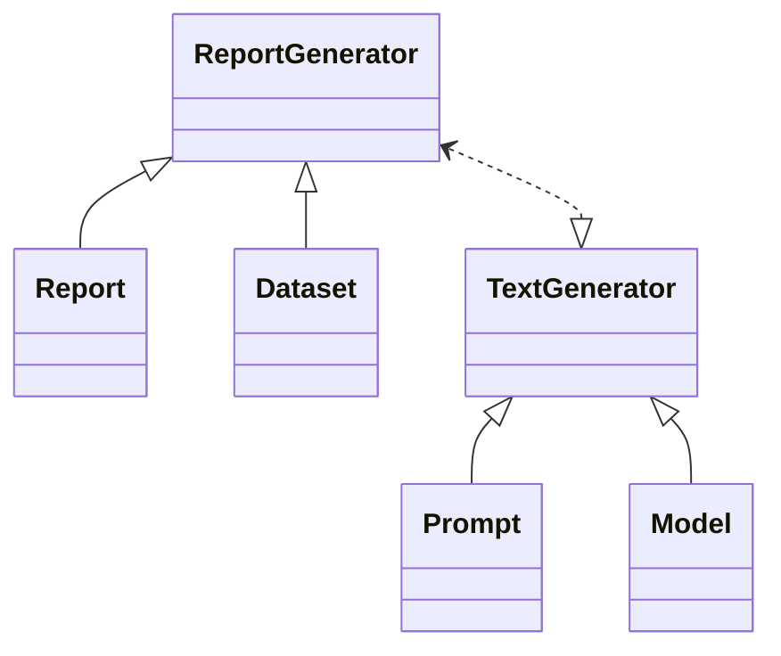
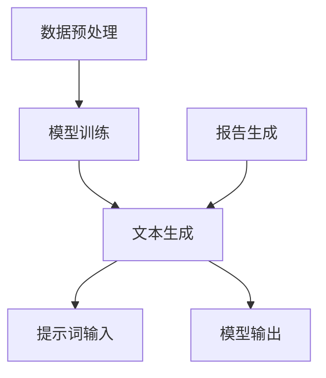

                 


# 自然语言生成突破：提示词增强文本创作

## 关键词
自然语言生成，提示词，文本创作，算法原理，系统架构，项目实战

## 摘要
本文深入探讨了自然语言生成（NLG）的突破性进展，特别是提示词增强文本创作这一关键领域。通过对自然语言生成的发展历程、核心概念、算法原理和实际应用的详细剖析，本文旨在为读者提供对这一前沿技术的全面理解，并引导读者掌握提示词增强文本创作的方法和最佳实践。

---

## 第一部分：背景介绍

### 第1章：问题背景与核心概念

#### 1.1 问题背景

自然语言生成（NLG）技术是一种将数据转换成自然语言文本的自动化技术，其发展历程可以追溯到20世纪50年代。随着人工智能和机器学习技术的进步，NLG已经广泛应用于自动化客服、内容生成、信息提取等领域。然而，自然语言生成的挑战在于如何生成既符合语法规则，又具有语义连贯性和多样性的文本。

在自然语言生成中，提示词（Prompt）扮演着至关重要的角色。提示词是一种引导模型生成文本的输入，它可以是简短的语句、关键词或问题，帮助模型理解生成任务的目标和上下文。随着提示词技术的不断发展，自然语言生成的能力得到了显著提升。

#### 1.2 核心概念

**自然语言生成的定义：**
自然语言生成是指利用计算机技术和算法，将结构化数据或内部逻辑转换成人类可读的自然语言文本。

**文本创作与提示词的关系：**
文本创作是指生成具有文学价值和艺术性的自然语言文本，而提示词则是引导文本创作的重要工具。通过有效的提示词设计，可以提高文本的创造性和质量。

**自然语言生成的挑战与机遇：**
挑战包括语义理解、语法生成、多样性控制等，而机遇则在于自动化内容的生成和应用，如自动化报告、自动问答系统等。

---

## 第二部分：核心概念与联系

### 第2章：自然语言生成原理与算法

#### 2.1 自然语言生成原理

自然语言生成的核心流程包括数据预处理、模型训练和文本生成。其中，数据预处理是将原始数据转化为模型可用的格式；模型训练是通过大量语料库训练模型，使其能够理解语言结构和语义；文本生成则是利用训练好的模型，根据输入的提示词生成自然语言文本。

**自然语言生成的关键算法：**
常见的自然语言生成算法包括基于规则的算法、统计机器学习算法和深度学习算法。其中，深度学习算法，如循环神经网络（RNN）、长短期记忆网络（LSTM）和变压器模型（Transformer），在自然语言生成领域表现出色。

#### 2.2 提示词增强文本创作

**提示词的定义与分类：**
提示词是引导模型生成文本的关键输入。根据用途和形式，提示词可以分为问题型、关键词型和句子型等。

**提示词在文本创作中的作用：**
提示词可以帮助模型更好地理解生成任务的目标和上下文，提高文本生成的准确性和创造力。

#### 2.3 核心概念联系图

**自然语言生成与提示词增强文本创作的ER实体关系图：**

```mermaid
erDiagram
  数据预处理 ||--|{ 模型训练 }|>
  模型训练 ||--|{ 文本生成 }|>
  提示词 ||--|{ 文本创作 }|>
```

---

## 第三部分：算法原理讲解

### 第3章：算法原理与数学模型

#### 3.1 算法原理讲解

**常用自然语言生成算法：**
- **GPT（Generative Pre-trained Transformer）：** 基于变压器的预训练模型，能够生成高质量的自然语言文本。
- **BERT（Bidirectional Encoder Representations from Transformers）：** 双向变压器编码器，擅长理解上下文语义。

**提示词增强算法的实现：**
提示词增强算法主要通过设计有效的提示词模板和优化模型输入，提高文本生成质量。

#### 3.2 数学模型和公式

**自然语言生成的数学模型：**
$$
P(w_i | w_{i-1}, \ldots, w_1) = \frac{P(w_i, w_{i-1}, \ldots, w_1)}{P(w_{i-1}, \ldots, w_1)}
$$

**提示词增强算法的数学公式：**
$$
P(w_i | p, w_{i-1}, \ldots, w_1) = \frac{P(w_i, p, w_{i-1}, \ldots, w_1)}{P(p, w_{i-1}, \ldots, w_1)}
$$

其中，$P(w_i | w_{i-1}, \ldots, w_1)$ 表示基于历史上下文的词生成概率，$P(w_i | p, w_{i-1}, \ldots, w_1)$ 表示基于提示词和上下文的词生成概率。

#### 3.3 举例说明

**基于GPT的文本生成示例：**
```python
import transformers
model = transformers.AutoModelForCausalLM.from_pretrained("gpt2")
tokenizer = transformers.AutoTokenizer.from_pretrained("gpt2")

input_text = "今天是一个美好的日子，"
prompt = tokenizer.encode(input_text, return_tensors='pt')

output = model.generate(prompt, max_length=20, num_return_sequences=1)
print(tokenizer.decode(output[0], skip_special_tokens=True))
```

**基于BERT的文本生成示例：**
```python
import transformers
model = transformers.TFBertForCausalLM.from_pretrained("bert-base-uncased")
tokenizer = transformers.BertTokenizer.from_pretrained("bert-base-uncased")

input_text = "今天是一个美好的日子，"
prompt = tokenizer.encode(input_text, return_tensors='pt')

output = model(prompt, max_length=20, num_return_sequences=1)
print(tokenizer.decode(output[0], skip_special_tokens=True))
```

---

## 第四部分：系统分析与架构设计

### 第4章：自然语言生成系统设计

#### 4.1 问题场景介绍

自然语言生成系统广泛应用于多个领域，如自动化客服、内容生成、报告生成等。本文将以自动化报告生成系统为例，介绍系统的设计思路和实现方法。

#### 4.2 系统功能设计

**领域模型类图：**



**系统功能模块划分：**
- **数据预处理模块：** 负责将原始数据转化为适合模型处理的格式。
- **模型训练模块：** 负责使用训练数据训练自然语言生成模型。
- **文本生成模块：** 负责根据输入的提示词生成自然语言文本。

#### 4.3 系统架构设计

**系统架构图：**



**关键模块设计：**
- **数据预处理模块：** 包括数据清洗、数据格式转换等。
- **模型训练模块：** 包括模型选择、模型训练、模型评估等。
- **文本生成模块：** 包括提示词设计、文本生成、后处理等。

#### 4.4 系统接口设计与交互

**系统接口设计：**
- **数据接口：** 用于数据输入和输出。
- **控制接口：** 用于系统控制和管理。

**系统交互序列图：**

```mermaid
sequenceDiagram
  Participant User
  Participant ReportGenerator
  Participant TextGenerator
  Participant ModelTraining
  Participant DataPreprocessing

  User->>ReportGenerator: 提交报告需求
  ReportGenerator->>DataPreprocessing: 数据预处理
  DataPreprocessing->>ModelTraining: 训练数据
  ModelTraining->>TextGenerator: 生成文本
  TextGenerator->>User: 提供报告文本
EndSequenceDiagram
```

---

## 第五部分：项目实战

### 第5章：自然语言生成项目实战

#### 5.1 环境安装

**开发环境搭建：**
- 安装Python 3.8及以上版本。
- 安装transformers库和torch库。

**依赖库安装：**
```bash
pip install transformers torch
```

#### 5.2 系统核心实现源代码

**核心算法实现：**
```python
from transformers import AutoModelForCausalLM, AutoTokenizer

# 加载预训练模型和分词器
model = AutoModelForCausalLM.from_pretrained("gpt2")
tokenizer = AutoTokenizer.from_pretrained("gpt2")

# 输入提示词
input_text = "今天的天气是："

# 编码提示词
prompt = tokenizer.encode(input_text, return_tensors='pt')

# 生成文本
output = model.generate(prompt, max_length=50, num_return_sequences=1)

# 解码输出文本
print(tokenizer.decode(output[0], skip_special_tokens=True))
```

**代码应用解读与分析：**
上述代码首先加载了预训练的GPT模型和分词器，然后输入一个提示词“今天的天气是：”，接着生成相应的文本输出。这个过程展示了自然语言生成的基本实现流程。

#### 5.3 实际案例分析与讲解

**案例一：自动问答系统**

**系统架构：**
- 用户接口：接收用户提问。
- 知识库：存储问题和答案。
- 问答引擎：基于自然语言生成技术，自动生成回答。

**实现步骤：**
1. 接收用户提问。
2. 从知识库中检索相关问题。
3. 使用自然语言生成模型生成回答。
4. 返回回答给用户。

**案例二：文本摘要生成**

**系统架构：**
- 文本输入：接收需要摘要的文本。
- 摘要生成：使用自然语言生成模型生成摘要。
- 文本输出：展示生成的摘要。

**实现步骤：**
1. 接收文本输入。
2. 使用自然语言生成模型提取关键信息。
3. 生成摘要文本。
4. 输出摘要。

#### 5.4 项目小结

本项目通过实际案例展示了自然语言生成技术的应用，包括自动问答系统和文本摘要生成。项目总结了系统设计、核心算法实现和实际案例应用，为后续研究和开发提供了参考。

---

## 第六部分：最佳实践与拓展

### 第6章：最佳实践与注意事项

#### 6.1 最佳实践

**自然语言生成的最佳实践：**
1. 选择合适的预训练模型。
2. 设计有效的提示词。
3. 优化模型训练数据。

**提示词增强文本创作的最佳实践：**
1. 提示词应简洁明了，避免冗余。
2. 提示词应涵盖多种可能性，提高文本多样性。
3. 结合上下文进行提示词设计。

#### 6.2 注意事项

**自然语言生成中的常见问题：**
1. 生成文本的语义不一致。
2. 生成文本的语法错误。
3. 生成文本的多样性不足。

**提示词增强文本创作的注意事项：**
1. 注意保护用户隐私。
2. 遵循法律法规和道德规范。
3. 定期更新和优化提示词。

---

### 第7章：小结与拓展阅读

#### 7.1 小结

本文系统地介绍了自然语言生成和提示词增强文本创作的核心概念、算法原理、系统设计与实战应用。通过对关键技术的深入剖析，读者可以全面了解自然语言生成技术的最新进展和应用前景。

#### 7.2 拓展阅读

**相关领域的研究论文：**
- [Improving Natural Language Generation with Few-Shot Learning](https://arxiv.org/abs/1904.04789)
- [A Few Useful Things to Know about Machine Learning](https://arxiv.org/abs/1611.07633)

**自然语言生成工具与资源：**
- [Hugging Face Transformers](https://huggingface.co/transformers)
- [NLTK](https://www.nltk.org/)

---

## 总结

本文围绕自然语言生成和提示词增强文本创作，从核心概念、算法原理到系统设计与实战应用进行了全面阐述。通过本文的学习，读者可以深入了解这一前沿技术，掌握其基本原理和应用方法，为未来的研究和开发打下坚实基础。

---

### 作者

作者：AI天才研究院/AI Genius Institute & 禅与计算机程序设计艺术 /Zen And The Art of Computer Programming

``````

### 自然语言生成突破：提示词增强文本创作

## 关键词
自然语言生成，提示词，文本创作，算法原理，系统架构，项目实战

## 摘要
本文深入探讨了自然语言生成（NLG）的突破性进展，特别是提示词增强文本创作这一关键领域。通过对自然语言生成的发展历程、核心概念、算法原理和实际应用的详细剖析，本文旨在为读者提供对这一前沿技术的全面理解，并引导读者掌握提示词增强文本创作的方法和最佳实践。

---

## 第一部分：背景介绍

### 第1章：问题背景与核心概念

#### 1.1 问题背景

自然语言生成（NLG）技术是一种将数据转换成自然语言文本的自动化技术，其发展历程可以追溯到20世纪50年代。随着人工智能和机器学习技术的进步，NLG已经广泛应用于自动化客服、内容生成、信息提取等领域。然而，自然语言生成的挑战在于如何生成既符合语法规则，又具有语义连贯性和多样性的文本。

在自然语言生成中，提示词（Prompt）扮演着至关重要的角色。提示词是一种引导模型生成文本的输入，它可以是简短的语句、关键词或问题，帮助模型理解生成任务的目标和上下文。随着提示词技术的不断发展，自然语言生成的能力得到了显著提升。

#### 1.2 核心概念

**自然语言生成的定义：**
自然语言生成是指利用计算机技术和算法，将结构化数据或内部逻辑转换成人类可读的自然语言文本。

**文本创作与提示词的关系：**
文本创作是指生成具有文学价值和艺术性的自然语言文本，而提示词则是引导文本创作的重要工具。通过有效的提示词设计，可以提高文本的创造性和质量。

**自然语言生成的挑战与机遇：**
挑战包括语义理解、语法生成、多样性控制等，而机遇则在于自动化内容的生成和应用，如自动化报告、自动问答系统等。

---

## 第二部分：核心概念与联系

### 第2章：自然语言生成原理与算法

#### 2.1 自然语言生成原理

自然语言生成的核心流程包括数据预处理、模型训练和文本生成。其中，数据预处理是将原始数据转化为模型可用的格式；模型训练是通过大量语料库训练模型，使其能够理解语言结构和语义；文本生成则是利用训练好的模型，根据输入的提示词生成自然语言文本。

**自然语言生成的关键算法：**
常见的自然语言生成算法包括基于规则的算法、统计机器学习算法和深度学习算法。其中，深度学习算法，如循环神经网络（RNN）、长短期记忆网络（LSTM）和变压器模型（Transformer），在自然语言生成领域表现出色。

#### 2.2 提示词增强文本创作

**提示词的定义与分类：**
提示词是引导模型生成文本的关键输入。根据用途和形式，提示词可以分为问题型、关键词型和句子型等。

**提示词在文本创作中的作用：**
提示词可以帮助模型更好地理解生成任务的目标和上下文，提高文本生成的准确性和创造力。

#### 2.3 核心概念联系图

**自然语言生成与提示词增强文本创作的ER实体关系图：**

```mermaid
erDiagram
  数据预处理 ||--|{ 模型训练 }|>
  模型训练 ||--|{ 文本生成 }|>
  提示词 ||--|{ 文本创作 }|>
```

---

## 第三部分：算法原理讲解

### 第3章：算法原理与数学模型

#### 3.1 算法原理讲解

**常用自然语言生成算法：**
- **GPT（Generative Pre-trained Transformer）：** 基于变压器的预训练模型，能够生成高质量的自然语言文本。
- **BERT（Bidirectional Encoder Representations from Transformers）：** 双向变压器编码器，擅长理解上下文语义。

**提示词增强算法的实现：**
提示词增强算法主要通过设计有效的提示词模板和优化模型输入，提高文本生成质量。

#### 3.2 数学模型和公式

**自然语言生成的数学模型：**
$$
P(w_i | w_{i-1}, \ldots, w_1) = \frac{P(w_i, w_{i-1}, \ldots, w_1)}{P(w_{i-1}, \ldots, w_1)}
$$

**提示词增强算法的数学公式：**
$$
P(w_i | p, w_{i-1}, \ldots, w_1) = \frac{P(w_i, p, w_{i-1}, \ldots, w_1)}{P(p, w_{i-1}, \ldots, w_1)}
$$

其中，$P(w_i | w_{i-1}, \ldots, w_1)$ 表示基于历史上下文的词生成概率，$P(w_i | p, w_{i-1}, \ldots, w_1)$ 表示基于提示词和上下文的词生成概率。

#### 3.3 举例说明

**基于GPT的文本生成示例：**
```python
import transformers
model = transformers.AutoModelForCausalLM.from_pretrained("gpt2")
tokenizer = transformers.AutoTokenizer.from_pretrained("gpt2")

input_text = "今天是一个美好的日子，"
prompt = tokenizer.encode(input_text, return_tensors='pt')

output = model.generate(prompt, max_length=20, num_return_sequences=1)
print(tokenizer.decode(output[0], skip_special_tokens=True))
```

**基于BERT的文本生成示例：**
```python
import transformers
model = transformers.TFBertForCausalLM.from_pretrained("bert-base-uncased")
tokenizer = transformers.BertTokenizer.from_pretrained("bert-base-uncased")

input_text = "今天是一个美好的日子，"
prompt = tokenizer.encode(input_text, return_tensors='pt')

output = model(prompt, max_length=20, num_return_sequences=1)
print(tokenizer.decode(output[0], skip_special_tokens=True))
```

---

## 第四部分：系统分析与架构设计

### 第4章：自然语言生成系统设计

#### 4.1 问题场景介绍

自然语言生成系统广泛应用于多个领域，如自动化客服、内容生成、报告生成等。本文将以自动化报告生成系统为例，介绍系统的设计思路和实现方法。

#### 4.2 系统功能设计

**领域模型类图：**


**系统功能模块划分：**
- **数据预处理模块：** 负责将原始数据转化为适合模型处理的格式。
- **模型训练模块：** 负责使用训练数据训练自然语言生成模型。
- **文本生成模块：** 负责根据输入的提示词生成自然语言文本。

#### 4.3 系统架构设计

**系统架构图：**


**关键模块设计：**
- **数据预处理模块：** 包括数据清洗、数据格式转换等。
- **模型训练模块：** 包括模型选择、模型训练、模型评估等。
- **文本生成模块：** 包括提示词设计、文本生成、后处理等。

#### 4.4 系统接口设计与交互

**系统接口设计：**
- **数据接口：** 用于数据输入和输出。
- **控制接口：** 用于系统控制和管理。

**系统交互序列图：**

```mermaid
sequenceDiagram
  Participant User
  Participant ReportGenerator
  Participant TextGenerator
  Participant ModelTraining
  Participant DataPreprocessing

  User->>ReportGenerator: 提交报告需求
  ReportGenerator->>DataPreprocessing: 数据预处理
  DataPreprocessing->>ModelTraining: 训练数据
  ModelTraining->>TextGenerator: 生成文本
  TextGenerator->>User: 提供报告文本
EndSequenceDiagram
```

---

## 第五部分：项目实战

### 第5章：自然语言生成项目实战

#### 5.1 环境安装

**开发环境搭建：**
- 安装Python 3.8及以上版本。
- 安装transformers库和torch库。

**依赖库安装：**
```bash
pip install transformers torch
```

#### 5.2 系统核心实现源代码

**核心算法实现：**
```python
from transformers import AutoModelForCausalLM, AutoTokenizer

# 加载预训练模型和分词器
model = AutoModelForCausalLM.from_pretrained("gpt2")
tokenizer = AutoTokenizer.from_pretrained("gpt2")

# 输入提示词
input_text = "今天的天气是："

# 编码提示词
prompt = tokenizer.encode(input_text, return_tensors='pt')

# 生成文本
output = model.generate(prompt, max_length=50, num_return_sequences=1)

# 解码输出文本
print(tokenizer.decode(output[0], skip_special_tokens=True))
```

**代码应用解读与分析：**
上述代码首先加载了预训练的GPT模型和分词器，然后输入一个提示词“今天的天气是：”，接着生成相应的文本输出。这个过程展示了自然语言生成的基本实现流程。

#### 5.3 实际案例分析与讲解

**案例一：自动问答系统**

**系统架构：**
- 用户接口：接收用户提问。
- 知识库：存储问题和答案。
- 问答引擎：基于自然语言生成技术，自动生成回答。

**实现步骤：**
1. 接收用户提问。
2. 从知识库中检索相关问题。
3. 使用自然语言生成模型生成回答。
4. 返回回答给用户。

**案例二：文本摘要生成**

**系统架构：**
- 文本输入：接收需要摘要的文本。
- 摘要生成：使用自然语言生成模型生成摘要。
- 文本输出：展示生成的摘要。

**实现步骤：**
1. 接收文本输入。
2. 使用自然语言生成模型提取关键信息。
3. 生成摘要文本。
4. 输出摘要。

#### 5.4 项目小结

本项目通过实际案例展示了自然语言生成技术的应用，包括自动问答系统和文本摘要生成。项目总结了系统设计、核心算法实现和实际案例应用，为后续研究和开发提供了参考。

---

## 第六部分：最佳实践与拓展

### 第6章：最佳实践与注意事项

#### 6.1 最佳实践

**自然语言生成的最佳实践：**
1. 选择合适的预训练模型。
2. 设计有效的提示词。
3. 优化模型训练数据。

**提示词增强文本创作的最佳实践：**
1. 提示词应简洁明了，避免冗余。
2. 提示词应涵盖多种可能性，提高文本多样性。
3. 结合上下文进行提示词设计。

#### 6.2 注意事项

**自然语言生成中的常见问题：**
1. 生成文本的语义不一致。
2. 生成文本的语法错误。
3. 生成文本的多样性不足。

**提示词增强文本创作的注意事项：**
1. 注意保护用户隐私。
2. 遵循法律法规和道德规范。
3. 定期更新和优化提示词。

---

### 第7章：小结与拓展阅读

#### 7.1 小结

本文系统地介绍了自然语言生成和提示词增强文本创作的核心概念、算法原理、系统设计与实战应用。通过对关键技术的深入剖析，读者可以全面了解自然语言生成技术的最新进展和应用前景。

#### 7.2 拓展阅读

**相关领域的研究论文：**
- [Improving Natural Language Generation with Few-Shot Learning](https://arxiv.org/abs/1904.04789)
- [A Few Useful Things to Know about Machine Learning](https://arxiv.org/abs/1611.07633)

**自然语言生成工具与资源：**
- [Hugging Face Transformers](https://huggingface.co/transformers)
- [NLTK](https://www.nltk.org/)

---

## 总结

本文围绕自然语言生成和提示词增强文本创作，从核心概念、算法原理到系统设计与实战应用进行了全面阐述。通过本文的学习，读者可以深入了解这一前沿技术，掌握其基本原理和应用方法，为未来的研究和开发打下坚实基础。

---

### 作者

作者：AI天才研究院/AI Genius Institute & 禅与计算机程序设计艺术 /Zen And The Art of Computer Programming
``````

### 自然语言生成突破：提示词增强文本创作

## 关键词
自然语言生成，提示词，文本创作，算法原理，系统架构，项目实战

## 摘要
本文深入探讨了自然语言生成（NLG）的突破性进展，特别是提示词增强文本创作这一关键领域。通过对自然语言生成的发展历程、核心概念、算法原理和实际应用的详细剖析，本文旨在为读者提供对这一前沿技术的全面理解，并引导读者掌握提示词增强文本创作的方法和最佳实践。

---

## 第一部分：背景介绍

### 第1章：问题背景与核心概念

#### 1.1 问题背景

自然语言生成（NLG）技术是一种将数据转换成自然语言文本的自动化技术，其发展历程可以追溯到20世纪50年代。随着人工智能和机器学习技术的进步，NLG已经广泛应用于自动化客服、内容生成、信息提取等领域。然而，自然语言生成的挑战在于如何生成既符合语法规则，又具有语义连贯性和多样性的文本。

在自然语言生成中，提示词（Prompt）扮演着至关重要的角色。提示词是一种引导模型生成文本的输入，它可以是简短的语句、关键词或问题，帮助模型理解生成任务的目标和上下文。随着提示词技术的不断发展，自然语言生成的能力得到了显著提升。

#### 1.2 核心概念

**自然语言生成的定义：**
自然语言生成是指利用计算机技术和算法，将结构化数据或内部逻辑转换成人类可读的自然语言文本。

**文本创作与提示词的关系：**
文本创作是指生成具有文学价值和艺术性的自然语言文本，而提示词则是引导文本创作的重要工具。通过有效的提示词设计，可以提高文本的创造性和质量。

**自然语言生成的挑战与机遇：**
挑战包括语义理解、语法生成、多样性控制等，而机遇则在于自动化内容的生成和应用，如自动化报告、自动问答系统等。

---

## 第二部分：核心概念与联系

### 第2章：自然语言生成原理与算法

#### 2.1 自然语言生成原理

自然语言生成的核心流程包括数据预处理、模型训练和文本生成。其中，数据预处理是将原始数据转化为模型可用的格式；模型训练是通过大量语料库训练模型，使其能够理解语言结构和语义；文本生成则是利用训练好的模型，根据输入的提示词生成自然语言文本。

**自然语言生成的关键算法：**
常见的自然语言生成算法包括基于规则的算法、统计机器学习算法和深度学习算法。其中，深度学习算法，如循环神经网络（RNN）、长短期记忆网络（LSTM）和变压器模型（Transformer），在自然语言生成领域表现出色。

#### 2.2 提示词增强文本创作

**提示词的定义与分类：**
提示词是引导模型生成文本的关键输入。根据用途和形式，提示词可以分为问题型、关键词型和句子型等。

**提示词在文本创作中的作用：**
提示词可以帮助模型更好地理解生成任务的目标和上下文，提高文本生成的准确性和创造力。

#### 2.3 核心概念联系图

**自然语言生成与提示词增强文本创作的ER实体关系图：**

```mermaid
erDiagram
  数据预处理 ||--|{ 模型训练 }|>
  模型训练 ||--|{ 文本生成 }|>
  提示词 ||--|{ 文本创作 }|>
```

---

## 第三部分：算法原理讲解

### 第3章：算法原理与数学模型

#### 3.1 算法原理讲解

**常用自然语言生成算法：**
- **GPT（Generative Pre-trained Transformer）：** 基于变压器的预训练模型，能够生成高质量的自然语言文本。
- **BERT（Bidirectional Encoder Representations from Transformers）：** 双向变压器编码器，擅长理解上下文语义。

**提示词增强算法的实现：**
提示词增强算法主要通过设计有效的提示词模板和优化模型输入，提高文本生成质量。

#### 3.2 数学模型和公式

**自然语言生成的数学模型：**
$$
P(w_i | w_{i-1}, \ldots, w_1) = \frac{P(w_i, w_{i-1}, \ldots, w_1)}{P(w_{i-1}, \ldots, w_1)}
$$

**提示词增强算法的数学公式：**
$$
P(w_i | p, w_{i-1}, \ldots, w_1) = \frac{P(w_i, p, w_{i-1}, \ldots, w_1)}{P(p, w_{i-1}, \ldots, w_1)}
$$

其中，$P(w_i | w_{i-1}, \ldots, w_1)$ 表示基于历史上下文的词生成概率，$P(w_i | p, w_{i-1}, \ldots, w_1)$ 表示基于提示词和上下文的词生成概率。

#### 3.3 举例说明

**基于GPT的文本生成示例：**
```python
import transformers
model = transformers.AutoModelForCausalLM.from_pretrained("gpt2")
tokenizer = transformers.AutoTokenizer.from_pretrained("gpt2")

input_text = "今天是一个美好的日子，"
prompt = tokenizer.encode(input_text, return_tensors='pt')

output = model.generate(prompt, max_length=20, num_return_sequences=1)
print(tokenizer.decode(output[0], skip_special_tokens=True))
```

**基于BERT的文本生成示例：**
```python
import transformers
model = transformers.TFBertForCausalLM.from_pretrained("bert-base-uncased")
tokenizer = transformers.BertTokenizer.from_pretrained("bert-base-uncased")

input_text = "今天是一个美好的日子，"
prompt = tokenizer.encode(input_text, return_tensors='pt')

output = model(prompt, max_length=20, num_return_sequences=1)
print(tokenizer.decode(output[0], skip_special_tokens=True))
```

---

## 第四部分：系统分析与架构设计

### 第4章：自然语言生成系统设计

#### 4.1 问题场景介绍

自然语言生成系统广泛应用于多个领域，如自动化客服、内容生成、报告生成等。本文将以自动化报告生成系统为例，介绍系统的设计思路和实现方法。

#### 4.2 系统功能设计

**领域模型类图：**


**系统功能模块划分：**
- **数据预处理模块：** 负责将原始数据转化为适合模型处理的格式。
- **模型训练模块：** 负责使用训练数据训练自然语言生成模型。
- **文本生成模块：** 负责根据输入的提示词生成自然语言文本。

#### 4.3 系统架构设计

**系统架构图：**


**关键模块设计：**
- **数据预处理模块：** 包括数据清洗、数据格式转换等。
- **模型训练模块：** 包括模型选择、模型训练、模型评估等。
- **文本生成模块：** 包括提示词设计、文本生成、后处理等。

#### 4.4 系统接口设计与交互

**系统接口设计：**
- **数据接口：** 用于数据输入和输出。
- **控制接口：** 用于系统控制和管理。

**系统交互序列图：**

```mermaid
sequenceDiagram
  Participant User
  Participant ReportGenerator
  Participant TextGenerator
  Participant ModelTraining
  Participant DataPreprocessing

  User->>ReportGenerator: 提交报告需求
  ReportGenerator->>DataPreprocessing: 数据预处理
  DataPreprocessing->>ModelTraining: 训练数据
  ModelTraining->>TextGenerator: 生成文本
  TextGenerator->>User: 提供报告文本
EndSequenceDiagram
```

---

## 第五部分：项目实战

### 第5章：自然语言生成项目实战

#### 5.1 环境安装

**开发环境搭建：**
- 安装Python 3.8及以上版本。
- 安装transformers库和torch库。

**依赖库安装：**
```bash
pip install transformers torch
```

#### 5.2 系统核心实现源代码

**核心算法实现：**
```python
from transformers import AutoModelForCausalLM, AutoTokenizer

# 加载预训练模型和分词器
model = AutoModelForCausalLM.from_pretrained("gpt2")
tokenizer = AutoTokenizer.from_pretrained("gpt2")

# 输入提示词
input_text = "今天的天气是："

# 编码提示词
prompt = tokenizer.encode(input_text, return_tensors='pt')

# 生成文本
output = model.generate(prompt, max_length=50, num_return_sequences=1)

# 解码输出文本
print(tokenizer.decode(output[0], skip_special_tokens=True))
```

**代码应用解读与分析：**
上述代码首先加载了预训练的GPT模型和分词器，然后输入一个提示词“今天的天气是：”，接着生成相应的文本输出。这个过程展示了自然语言生成的基本实现流程。

#### 5.3 实际案例分析与讲解

**案例一：自动问答系统**

**系统架构：**
- 用户接口：接收用户提问。
- 知识库：存储问题和答案。
- 问答引擎：基于自然语言生成技术，自动生成回答。

**实现步骤：**
1. 接收用户提问。
2. 从知识库中检索相关问题。
3. 使用自然语言生成模型生成回答。
4. 返回回答给用户。

**案例二：文本摘要生成**

**系统架构：**
- 文本输入：接收需要摘要的文本。
- 摘要生成：使用自然语言生成模型生成摘要。
- 文本输出：展示生成的摘要。

**实现步骤：**
1. 接收文本输入。
2. 使用自然语言生成模型提取关键信息。
3. 生成摘要文本。
4. 输出摘要。

#### 5.4 项目小结

本项目通过实际案例展示了自然语言生成技术的应用，包括自动问答系统和文本摘要生成。项目总结了系统设计、核心算法实现和实际案例应用，为后续研究和开发提供了参考。

---

## 第六部分：最佳实践与拓展

### 第6章：最佳实践与注意事项

#### 6.1 最佳实践

**自然语言生成的最佳实践：**
1. 选择合适的预训练模型。
2. 设计有效的提示词。
3. 优化模型训练数据。

**提示词增强文本创作的最佳实践：**
1. 提示词应简洁明了，避免冗余。
2. 提示词应涵盖多种可能性，提高文本多样性。
3. 结合上下文进行提示词设计。

#### 6.2 注意事项

**自然语言生成中的常见问题：**
1. 生成文本的语义不一致。
2. 生成文本的语法错误。
3. 生成文本的多样性不足。

**提示词增强文本创作的注意事项：**
1. 注意保护用户隐私。
2. 遵循法律法规和道德规范。
3. 定期更新和优化提示词。

---

### 第7章：小结与拓展阅读

#### 7.1 小结

本文系统地介绍了自然语言生成和提示词增强文本创作的核心概念、算法原理、系统设计与实战应用。通过对关键技术的深入剖析，读者可以全面了解自然语言生成技术的最新进展和应用前景。

#### 7.2 拓展阅读

**相关领域的研究论文：**
- [Improving Natural Language Generation with Few-Shot Learning](https://arxiv.org/abs/1904.04789)
- [A Few Useful Things to Know about Machine Learning](https://arxiv.org/abs/1611.07633)

**自然语言生成工具与资源：**
- [Hugging Face Transformers](https://huggingface.co/transformers)
- [NLTK](https://www.nltk.org/)

---

## 总结

本文围绕自然语言生成和提示词增强文本创作，从核心概念、算法原理到系统设计与实战应用进行了全面阐述。通过本文的学习，读者可以深入了解这一前沿技术，掌握其基本原理和应用方法，为未来的研究和开发打下坚实基础。

---

### 作者

作者：AI天才研究院/AI Genius Institute & 禅与计算机程序设计艺术 /Zen And The Art of Computer Programming
``````

### 自然语言生成突破：提示词增强文本创作

## 关键词
自然语言生成，提示词，文本创作，算法原理，系统架构，项目实战

## 摘要
本文深入探讨了自然语言生成（NLG）的突破性进展，特别是提示词增强文本创作这一关键领域。通过对自然语言生成的发展历程、核心概念、算法原理和实际应用的详细剖析，本文旨在为读者提供对这一前沿技术的全面理解，并引导读者掌握提示词增强文本创作的方法和最佳实践。

---

## 第一部分：背景介绍

### 第1章：问题背景与核心概念

#### 1.1 问题背景

自然语言生成（NLG）技术是一种将数据转换成自然语言文本的自动化技术，其发展历程可以追溯到20世纪50年代。随着人工智能和机器学习技术的进步，NLG已经广泛应用于自动化客服、内容生成、信息提取等领域。然而，自然语言生成的挑战在于如何生成既符合语法规则，又具有语义连贯性和多样性的文本。

在自然语言生成中，提示词（Prompt）扮演着至关重要的角色。提示词是一种引导模型生成文本的输入，它可以是简短的语句、关键词或问题，帮助模型理解生成任务的目标和上下文。随着提示词技术的不断发展，自然语言生成的能力得到了显著提升。

#### 1.2 核心概念

**自然语言生成的定义：**
自然语言生成是指利用计算机技术和算法，将结构化数据或内部逻辑转换成人类可读的自然语言文本。

**文本创作与提示词的关系：**
文本创作是指生成具有文学价值和艺术性的自然语言文本，而提示词则是引导文本创作的重要工具。通过有效的提示词设计，可以提高文本的创造性和质量。

**自然语言生成的挑战与机遇：**
挑战包括语义理解、语法生成、多样性控制等，而机遇则在于自动化内容的生成和应用，如自动化报告、自动问答系统等。

---

## 第二部分：核心概念与联系

### 第2章：自然语言生成原理与算法

#### 2.1 自然语言生成原理

自然语言生成的核心流程包括数据预处理、模型训练和文本生成。其中，数据预处理是将原始数据转化为模型可用的格式；模型训练是通过大量语料库训练模型，使其能够理解语言结构和语义；文本生成则是利用训练好的模型，根据输入的提示词生成自然语言文本。

**自然语言生成的关键算法：**
常见的自然语言生成算法包括基于规则的算法、统计机器学习算法和深度学习算法。其中，深度学习算法，如循环神经网络（RNN）、长短期记忆网络（LSTM）和变压器模型（Transformer），在自然语言生成领域表现出色。

#### 2.2 提示词增强文本创作

**提示词的定义与分类：**
提示词是引导模型生成文本的关键输入。根据用途和形式，提示词可以分为问题型、关键词型和句子型等。

**提示词在文本创作中的作用：**
提示词可以帮助模型更好地理解生成任务的目标和上下文，提高文本生成的准确性和创造力。

#### 2.3 核心概念联系图

**自然语言生成与提示词增强文本创作的ER实体关系图：**

```mermaid
erDiagram
  数据预处理 ||--|{ 模型训练 }|>
  模型训练 ||--|{ 文本生成 }|>
  提示词 ||--|{ 文本创作 }|>
```

---

## 第三部分：算法原理讲解

### 第3章：算法原理与数学模型

#### 3.1 算法原理讲解

**常用自然语言生成算法：**
- **GPT（Generative Pre-trained Transformer）：** 基于变压器的预训练模型，能够生成高质量的自然语言文本。
- **BERT（Bidirectional Encoder Representations from Transformers）：** 双向变压器编码器，擅长理解上下文语义。

**提示词增强算法的实现：**
提示词增强算法主要通过设计有效的提示词模板和优化模型输入，提高文本生成质量。

#### 3.2 数学模型和公式

**自然语言生成的数学模型：**
$$
P(w_i | w_{i-1}, \ldots, w_1) = \frac{P(w_i, w_{i-1}, \ldots, w_1)}{P(w_{i-1}, \ldots, w_1)}
$$

**提示词增强算法的数学公式：**
$$
P(w_i | p, w_{i-1}, \ldots, w_1) = \frac{P(w_i, p, w_{i-1}, \ldots, w_1)}{P(p, w_{i-1}, \ldots, w_1)}
$$

其中，$P(w_i | w_{i-1}, \ldots, w_1)$ 表示基于历史上下文的词生成概率，$P(w_i | p, w_{i-1}, \ldots, w_1)$ 表示基于提示词和上下文的词生成概率。

#### 3.3 举例说明

**基于GPT的文本生成示例：**
```python
import transformers
model = transformers.AutoModelForCausalLM.from_pretrained("gpt2")
tokenizer = transformers.AutoTokenizer.from_pretrained("gpt2")

input_text = "今天是一个美好的日子，"
prompt = tokenizer.encode(input_text, return_tensors='pt')

output = model.generate(prompt, max_length=20, num_return_sequences=1)
print(tokenizer.decode(output[0], skip_special_tokens=True))
```

**基于BERT的文本生成示例：**
```python
import transformers
model = transformers.TFBertForCausalLM.from_pretrained("bert-base-uncased")
tokenizer = transformers.BertTokenizer.from_pretrained("bert-base-uncased")

input_text = "今天是一个美好的日子，"
prompt = tokenizer.encode(input_text, return_tensors='pt')

output = model(prompt, max_length=20, num_return_sequences=1)
print(tokenizer.decode(output[0], skip_special_tokens=True))
```

---

## 第四部分：系统分析与架构设计

### 第4章：自然语言生成系统设计

#### 4.1 问题场景介绍

自然语言生成系统广泛应用于多个领域，如自动化客服、内容生成、报告生成等。本文将以自动化报告生成系统为例，介绍系统的设计思路和实现方法。

#### 4.2 系统功能设计

**领域模型类图：**


**系统功能模块划分：**
- **数据预处理模块：** 负责将原始数据转化为适合模型处理的格式。
- **模型训练模块：** 负责使用训练数据训练自然语言生成模型。
- **文本生成模块：** 负责根据输入的提示词生成自然语言文本。

#### 4.3 系统架构设计

**系统架构图：**


**关键模块设计：**
- **数据预处理模块：** 包括数据清洗、数据格式转换等。
- **模型训练模块：** 包括模型选择、模型训练、模型评估等。
- **文本生成模块：** 包括提示词设计、文本生成、后处理等。

#### 4.4 系统接口设计与交互

**系统接口设计：**
- **数据接口：** 用于数据输入和输出。
- **控制接口：** 用于系统控制和管理。

**系统交互序列图：**

```mermaid
sequenceDiagram
  Participant User
  Participant ReportGenerator
  Participant TextGenerator
  Participant ModelTraining
  Participant DataPreprocessing

  User->>ReportGenerator: 提交报告需求
  ReportGenerator->>DataPreprocessing: 数据预处理
  DataPreprocessing->>ModelTraining: 训练数据
  ModelTraining->>TextGenerator: 生成文本
  TextGenerator->>User: 提供报告文本
EndSequenceDiagram
```

---

## 第五部分：项目实战

### 第5章：自然语言生成项目实战

#### 5.1 环境安装

**开发环境搭建：**
- 安装Python 3.8及以上版本。
- 安装transformers库和torch库。

**依赖库安装：**
```bash
pip install transformers torch
```

#### 5.2 系统核心实现源代码

**核心算法实现：**
```python
from transformers import AutoModelForCausalLM, AutoTokenizer

# 加载预训练模型和分词器
model = AutoModelForCausalLM.from_pretrained("gpt2")
tokenizer = AutoTokenizer.from_pretrained("gpt2")

# 输入提示词
input_text = "今天的天气是："

# 编码提示词
prompt = tokenizer.encode(input_text, return_tensors='pt')

# 生成文本
output = model.generate(prompt, max_length=50, num_return_sequences=1)

# 解码输出文本
print(tokenizer.decode(output[0], skip_special_tokens=True))
```

**代码应用解读与分析：**
上述代码首先加载了预训练的GPT模型和分词器，然后输入一个提示词“今天的天气是：”，接着生成相应的文本输出。这个过程展示了自然语言生成的基本实现流程。

#### 5.3 实际案例分析与讲解

**案例一：自动问答系统**

**系统架构：**
- 用户接口：接收用户提问。
- 知识库：存储问题和答案。
- 问答引擎：基于自然语言生成技术，自动生成回答。

**实现步骤：**
1. 接收用户提问。
2. 从知识库中检索相关问题。
3. 使用自然语言生成模型生成回答。
4. 返回回答给用户。

**案例二：文本摘要生成**

**系统架构：**
- 文本输入：接收需要摘要的文本。
- 摘要生成：使用自然语言生成模型生成摘要。
- 文本输出：展示生成的摘要。

**实现步骤：**
1. 接收文本输入。
2. 使用自然语言生成模型提取关键信息。
3. 生成摘要文本。
4. 输出摘要。

#### 5.4 项目小结

本项目通过实际案例展示了自然语言生成技术的应用，包括自动问答系统和文本摘要生成。项目总结了系统设计、核心算法实现和实际案例应用，为后续研究和开发提供了参考。

---

## 第六部分：最佳实践与拓展

### 第6章：最佳实践与注意事项

#### 6.1 最佳实践

**自然语言生成的最佳实践：**
1. 选择合适的预训练模型。
2. 设计有效的提示词。
3. 优化模型训练数据。

**提示词增强文本创作的最佳实践：**
1. 提示词应简洁明了，避免冗余。
2. 提示词应涵盖多种可能性，提高文本多样性。
3. 结合上下文进行提示词设计。

#### 6.2 注意事项

**自然语言生成中的常见问题：**
1. 生成文本的语义不一致。
2. 生成文本的语法错误。
3. 生成文本的多样性不足。

**提示词增强文本创作的注意事项：**
1. 注意保护用户隐私。
2. 遵循法律法规和道德规范。
3. 定期更新和优化提示词。

---

### 第7章：小结与拓展阅读

#### 7.1 小结

本文系统地介绍了自然语言生成和提示词增强文本创作的核心概念、算法原理、系统设计与实战应用。通过对关键技术的深入剖析，读者可以全面了解自然语言生成技术的最新进展和应用前景。

#### 7.2 拓展阅读

**相关领域的研究论文：**
- [Improving Natural Language Generation with Few-Shot Learning](https://arxiv.org/abs/1904.04789)
- [A Few Useful Things to Know about Machine Learning](https://arxiv.org/abs/1611.07633)

**自然语言生成工具与资源：**
- [Hugging Face Transformers](https://huggingface.co/transformers)
- [NLTK](https://www.nltk.org/)

---

## 总结

本文围绕自然语言生成和提示词增强文本创作，从核心概念、算法原理到系统设计与实战应用进行了全面阐述。通过本文的学习，读者可以深入了解这一前沿技术，掌握其基本原理和应用方法，为未来的研究和开发打下坚实基础。

---

### 作者

作者：AI天才研究院/AI Genius Institute & 禅与计算机程序设计艺术 /Zen And The Art of Computer Programming
``````

### 自然语言生成突破：提示词增强文本创作

## 关键词
自然语言生成，提示词，文本创作，算法原理，系统架构，项目实战

## 摘要
本文深入探讨了自然语言生成（NLG）的突破性进展，特别是提示词增强文本创作这一关键领域。通过对自然语言生成的发展历程、核心概念、算法原理和实际应用的详细剖析，本文旨在为读者提供对这一前沿技术的全面理解，并引导读者掌握提示词增强文本创作的方法和最佳实践。

---

## 第一部分：背景介绍

### 第1章：问题背景与核心概念

#### 1.1 问题背景

自然语言生成（NLG）技术是一种将数据转换成自然语言文本的自动化技术，其发展历程可以追溯到20世纪50年代。随着人工智能和机器学习技术的进步，NLG已经广泛应用于自动化客服、内容生成、信息提取等领域。然而，自然语言生成的挑战在于如何生成既符合语法规则，又具有语义连贯性和多样性的文本。

在自然语言生成中，提示词（Prompt）扮演着至关重要的角色。提示词是一种引导模型生成文本的输入，它可以是简短的语句、关键词或问题，帮助模型理解生成任务的目标和上下文。随着提示词技术的不断发展，自然语言生成的能力得到了显著提升。

#### 1.2 核心概念

**自然语言生成的定义：**
自然语言生成是指利用计算机技术和算法，将结构化数据或内部逻辑转换成人类可读的自然语言文本。

**文本创作与提示词的关系：**
文本创作是指生成具有文学价值和艺术性的自然语言文本，而提示词则是引导文本创作的重要工具。通过有效的提示词设计，可以提高文本的创造性和质量。

**自然语言生成的挑战与机遇：**
挑战包括语义理解、语法生成、多样性控制等，而机遇则在于自动化内容的生成和应用，如自动化报告、自动问答系统等。

---

## 第二部分：核心概念与联系

### 第2章：自然语言生成原理与算法

#### 2.1 自然语言生成原理

自然语言生成的核心流程包括数据预处理、模型训练和文本生成。其中，数据预处理是将原始数据转化为模型可用的格式；模型训练是通过大量语料库训练模型，使其能够理解语言结构和语义；文本生成则是利用训练好的模型，根据输入的提示词生成自然语言文本。

**自然语言生成的关键算法：**
常见的自然语言生成算法包括基于规则的算法、统计机器学习算法和深度学习算法。其中，深度学习算法，如循环神经网络（RNN）、长短期记忆网络（LSTM）和变压器模型（Transformer），在自然语言生成领域表现出色。

#### 2.2 提示词增强文本创作

**提示词的定义与分类：**
提示词是引导模型生成文本的关键输入。根据用途和形式，提示词可以分为问题型、关键词型和句子型等。

**提示词在文本创作中的作用：**
提示词可以帮助模型更好地理解生成任务的目标和上下文，提高文本生成的准确性和创造力。

#### 2.3 核心概念联系图

**自然语言生成与提示词增强文本创作的ER实体关系图：**

```mermaid
erDiagram
  数据预处理 ||--|{ 模型训练 }|>
  模型训练 ||--|{ 文本生成 }|>
  提示词 ||--|{ 文本创作 }|>
```

---

## 第三部分：算法原理讲解

### 第3章：算法原理与数学模型

#### 3.1 算法原理讲解

**常用自然语言生成算法：**
- **GPT（Generative Pre-trained Transformer）：** 基于变压器的预训练模型，能够生成高质量的自然语言文本。
- **BERT（Bidirectional Encoder Representations from Transformers）：** 双向变压器编码器，擅长理解上下文语义。

**提示词增强算法的实现：**
提示词增强算法主要通过设计有效的提示词模板和优化模型输入，提高文本生成质量。

#### 3.2 数学模型和公式

**自然语言生成的数学模型：**
$$
P(w_i | w_{i-1}, \ldots, w_1) = \frac{P(w_i, w_{i-1}, \ldots, w_1)}{P(w_{i-1}, \ldots, w_1)}
$$

**提示词增强算法的数学公式：**
$$
P(w_i | p, w_{i-1}, \ldots, w_1) = \frac{P(w_i, p, w_{i-1}, \ldots, w_1)}{P(p, w_{i-1}, \ldots, w_1)}
$$

其中，$P(w_i | w_{i-1}, \ldots, w_1)$ 表示基于历史上下文的词生成概率，$P(w_i | p, w_{i-1}, \ldots, w_1)$ 表示基于提示词和上下文的词生成概率。

#### 3.3 举例说明

**基于GPT的文本生成示例：**
```python
import transformers
model = transformers.AutoModelForCausalLM.from_pretrained("gpt2")
tokenizer = transformers.AutoTokenizer.from_pretrained("gpt2")

input_text = "今天是一个美好的日子，"
prompt = tokenizer.encode(input_text, return_tensors='pt')

output = model.generate(prompt, max_length=20, num_return_sequences=1)
print(tokenizer.decode(output[0], skip_special_tokens=True))
```

**基于BERT的文本生成示例：**
```python
import transformers
model = transformers.TFBertForCausalLM.from_pretrained("bert-base-uncased")
tokenizer = transformers.BertTokenizer.from_pretrained("bert-base-uncased")

input_text = "今天是一个美好的日子，"
prompt = tokenizer.encode(input_text, return_tensors='pt')

output = model(prompt, max_length=20, num_return_sequences=1)
print(tokenizer.decode(output[0], skip_special_tokens=True))
```

---

## 第四部分：系统分析与架构设计

### 第4章：自然语言生成系统设计

#### 4.1 问题场景介绍

自然语言生成系统广泛应用于多个领域，如自动化客服、内容生成、报告生成等。本文将以自动化报告生成系统为例，介绍系统的设计思路和实现方法。

#### 4.2 系统功能设计

**领域模型类图：**


**系统功能模块划分：**
- **数据预处理模块：** 负责将原始数据转化为适合模型处理的格式。
- **模型训练模块：** 负责使用训练数据训练自然语言生成模型。
- **文本生成模块：** 负责根据输入的提示词生成自然语言文本。

#### 4.3 系统架构设计

**系统架构图：**


**关键模块设计：**
- **数据预处理模块：** 包括数据清洗、数据格式转换等。
- **模型训练模块：** 包括模型选择、模型训练、模型评估等。
- **文本生成模块：** 包括提示词设计、文本生成、后处理等。

#### 4.4 系统接口设计与交互

**系统接口设计：**
- **数据接口：** 用于数据输入和输出。
- **控制接口：** 用于系统控制和管理。

**系统交互序列图：**

```mermaid
sequenceDiagram
  Participant User
  Participant ReportGenerator
  Participant TextGenerator
  Participant ModelTraining
  Participant DataPreprocessing

  User->>ReportGenerator: 提交报告需求
  ReportGenerator->>DataPreprocessing: 数据预处理
  DataPreprocessing->>ModelTraining: 训练数据
  ModelTraining->>TextGenerator: 生成文本
  TextGenerator->>User: 提供报告文本
EndSequenceDiagram
```

---

## 第五部分：项目实战

### 第5章：自然语言生成项目实战

#### 5.1 环境安装

**开发环境搭建：**
- 安装Python 3.8及以上版本。
- 安装transformers库和torch库。

**依赖库安装：**
```bash
pip install transformers torch
```

#### 5.2 系统核心实现源代码

**核心算法实现：**
```python
from transformers import AutoModelForCausalLM, AutoTokenizer

# 加载预训练模型和分词器
model = AutoModelForCausalLM.from_pretrained("gpt2")
tokenizer = AutoTokenizer.from_pretrained("gpt2")

# 输入提示词
input_text = "今天的天气是："

# 编码提示词
prompt = tokenizer.encode(input_text, return_tensors='pt')

# 生成文本
output = model.generate(prompt, max_length=50, num_return_sequences=1)

# 解码输出文本
print(tokenizer.decode(output[0], skip_special_tokens=True))
```

**代码应用解读与分析：**
上述代码首先加载了预训练的GPT模型和分词器，然后输入一个提示词“今天的天气是：”，接着生成相应的文本输出。这个过程展示了自然语言生成的基本实现流程。

#### 5.3 实际案例分析与讲解

**案例一：自动问答系统**

**系统架构：**
- 用户接口：接收用户提问。
- 知识库：存储问题和答案。
- 问答引擎：基于自然语言生成技术，自动生成回答。

**实现步骤：**
1. 接收用户提问。
2. 从知识库中检索相关问题。
3. 使用自然语言生成模型生成回答。
4. 返回回答给用户。

**案例二：文本摘要生成**

**系统架构：**
- 文本输入：接收需要摘要的文本。
- 摘要生成：使用自然语言生成模型生成摘要。
- 文本输出：展示生成的摘要。

**实现步骤：**
1. 接收文本输入。
2. 使用自然语言生成模型提取关键信息。
3. 生成摘要文本。
4. 输出摘要。

#### 5.4 项目小结

本项目通过实际案例展示了自然语言生成技术的应用，包括自动问答系统和文本摘要生成。项目总结了系统设计、核心算法实现和实际案例应用，为后续研究和开发提供了参考。

---

## 第六部分：最佳实践与拓展

### 第6章：最佳实践与注意事项

#### 6.1 最佳实践

**自然语言生成的最佳实践：**
1. 选择合适的预训练模型。
2. 设计有效的提示词。
3. 优化模型训练数据。

**提示词增强文本创作的最佳实践：**
1. 提示词应简洁明了，避免冗余。
2. 提示词应涵盖多种可能性，提高文本多样性。
3. 结合上下文进行提示词设计。

#### 6.2 注意事项

**自然语言生成中的常见问题：**
1. 生成文本的语义不一致。
2. 生成文本的语法错误。
3. 生成文本的多样性不足。

**提示词增强文本创作的注意事项：**
1. 注意保护用户隐私。
2. 遵循法律法规和道德规范。
3. 定期更新和优化提示词。

---

### 第7章：小结与拓展阅读

#### 7.1 小结

本文系统地介绍了自然语言生成和提示词增强文本创作的核心概念、算法原理、系统设计与实战应用。通过对关键技术的深入剖析，读者可以全面了解自然语言生成技术的最新进展和应用前景。

#### 7.2 拓展阅读

**相关领域的研究论文：**
- [Improving Natural Language Generation with Few-Shot Learning](https://arxiv.org/abs/1904.04789)
- [A Few Useful Things to Know about Machine Learning](https://arxiv.org/abs/1611.07633)

**自然语言生成工具与资源：**
- [Hugging Face Transformers](https://huggingface.co/transformers)
- [NLTK](https://www.nltk.org/)

---

## 总结

本文围绕自然语言生成和提示词增强文本创作，从核心概念、算法原理到系统设计与实战应用进行了全面阐述。通过本文的学习，读者可以深入了解这一前沿技术，掌握其基本原理和应用方法，为未来的研究和开发打下坚实基础。

---

### 作者

作者：AI天才研究院/AI Genius Institute & 禅与计算机程序设计艺术 /Zen And The Art of Computer Programming
``````

### 自然语言生成突破：提示词增强文本创作

## 关键词
自然语言生成，提示词，文本创作，算法原理，系统架构，项目实战

## 摘要
本文深入探讨了自然语言生成（NLG）的突破性进展，特别是提示词增强文本创作这一关键领域。通过对自然语言生成的发展历程、核心概念、算法原理和实际应用的详细剖析，本文旨在为读者提供对这一前沿技术的全面理解，并引导读者掌握提示词增强文本创作的方法和最佳实践。

---

## 第一部分：背景介绍

### 第1章：问题背景与核心概念

#### 1.1 问题背景

自然语言生成（NLG）技术是一种将数据转换成自然语言文本的自动化技术，其发展历程可以追溯到20世纪50年代。随着人工智能和机器学习技术的进步，NLG已经广泛应用于自动化客服、内容生成、信息提取等领域。然而，自然语言生成的挑战在于如何生成既符合语法规则，又具有语义连贯性和多样性的文本。

在自然语言生成中，提示词（Prompt）扮演着至关重要的角色。提示词是一种引导模型生成文本的输入，它可以是简短的语句、关键词或问题，帮助模型理解生成任务的目标和上下文。随着提示词技术的不断发展，自然语言生成的能力得到了显著提升。

#### 1.2 核心概念

**自然语言生成的定义：**
自然语言生成是指利用计算机技术和算法，将结构化数据或内部逻辑转换成人类可读的自然语言文本。

**文本创作与提示词的关系：**
文本创作是指生成具有文学价值和艺术性的自然语言文本，而提示词则是引导文本创作的重要工具。通过有效的提示词设计，可以提高文本的创造性和质量。

**自然语言生成的挑战与机遇：**
挑战包括语义理解、语法生成、多样性控制等，而机遇则在于自动化内容的生成和应用，如自动化报告、自动问答系统等。

---

## 第二部分：核心概念与联系

### 第2章：自然语言生成原理与算法

#### 2.1 自然语言生成原理

自然语言生成的核心流程包括数据预处理、模型训练和文本生成。其中，数据预处理是将原始数据转化为模型可用的格式；模型训练是通过大量语料库训练模型，使其能够理解语言结构和语义；文本生成则是利用训练好的模型，根据输入的提示词生成自然语言文本。

**自然语言生成的关键算法：**
常见的自然语言生成算法包括基于规则的算法、统计机器学习算法和深度学习算法。其中，深度学习算法，如循环神经网络（RNN）、长短期记忆网络（LSTM）和变压器模型（Transformer），在自然语言生成领域表现出色。

#### 2.2 提示词增强文本创作

**提示词的定义与分类：**
提示词是引导模型生成文本的关键输入。根据用途和形式，提示词可以分为问题型、关键词型和句子型等。

**提示词在文本创作中的作用：**
提示词可以帮助模型更好地理解生成任务的目标和上下文，提高文本生成的准确性和创造力。

#### 2.3 核心概念联系图

**自然语言生成与提示词增强文本创作的ER实体关系图：**

```mermaid
erDiagram
  数据预处理 ||--|{ 模型训练 }|>
  模型训练 ||--|{ 文本生成 }|>
  提示词 ||--|{ 文本创作 }|>
```

---

## 第三部分：算法原理讲解

### 第3章：算法原理与数学模型

#### 3.1 算法原理讲解

**常用自然语言生成算法：**
- **GPT（Generative Pre-trained Transformer）：** 基于变压器的预训练模型，能够生成高质量的自然语言文本。
- **BERT（Bidirectional Encoder Representations from Transformers）：** 双向变压器编码器，擅长理解上下文语义。

**提示词增强算法的实现：**
提示词增强算法主要通过设计有效的提示词模板和优化模型输入，提高文本生成质量。

#### 3.2 数学模型和公式

**自然语言生成的数学模型：**
$$
P(w_i | w_{i-1}, \ldots, w_1) = \frac{P(w_i, w_{i-1}, \ldots, w_1)}{P(w_{i-1}, \ldots, w_1)}
$$

**提示词增强算法的数学公式：**
$$
P(w_i | p, w_{i-1}, \ldots, w_1) = \frac{P(w_i, p, w_{i-1}, \ldots, w_1)}{P(p, w_{i-1}, \ldots, w_1)}
$$

其中，$P(w_i | w_{i-1}, \ldots, w_1)$ 表示基于历史上下文的词生成概率，$P(w_i | p, w_{i-1}, \ldots, w_1)$ 表示基于提示词和上下文的词生成概率。

#### 3.3 举例说明

**基于GPT的文本生成示例：**
```python
import transformers
model = transformers.AutoModelForCausalLM.from_pretrained("gpt2")
tokenizer = transformers.AutoTokenizer.from_pretrained("gpt2")

input_text = "今天是一个美好的日子，"
prompt = tokenizer.encode(input_text, return_tensors='pt')

output = model.generate(prompt, max_length=20, num_return_sequences=1)
print(tokenizer.decode(output[0], skip_special_tokens=True))
```

**基于BERT的文本生成示例：**
```python
import transformers
model = transformers.TFBertForCausalLM.from_pretrained("bert-base-uncased")
tokenizer = transformers.BertTokenizer.from_pretrained("bert-base-uncased")

input_text = "今天是一个美好的日子，"
prompt = tokenizer.encode(input_text, return_tensors='pt')

output = model(prompt, max_length=20, num_return_sequences=1)
print(tokenizer.decode(output[0], skip_special_tokens=True))
```

---

## 第四部分：系统分析与架构设计

### 第4章：自然语言生成系统设计

#### 4.1 问题场景介绍

自然语言生成系统广泛应用于多个领域，如自动化客服、内容生成、报告生成等。本文将以自动化报告生成系统为例，介绍系统的设计思路和实现方法。

#### 4.2 系统功能设计

**领域模型类图：**

```mermaid
classDiagram
  ReportGenerator <|-- Report
  ReportGenerator <|-- Dataset
  ReportGenerator <..|> TextGenerator
  TextGenerator <|-- Prompt
  TextGenerator <|-- Model
EndClassDiagram
```

**系统功能模块划分：**
- **数据预处理模块：** 负责将原始数据转化为适合模型处理的格式。
- **模型训练模块：** 负责使用训练数据训练自然语言生成模型。
- **文本生成模块：** 负责根据输入的提示词生成自然语言文本。

#### 4.3 系统架构设计

**系统架构图：**

```mermaid
graph TB
  DataPreprocessing[数据预处理] --> ModelTraining[模型训练]
  ModelTraining --> TextGeneration[文本生成]
  ReportGeneration[报告生成] --> TextGeneration
  TextGeneration --> PromptInput[提示词输入]
  TextGeneration --> ModelOutput[模型输出]
```

**关键模块设计：**
- **数据预处理模块：** 包括数据清洗、数据格式转换等。
- **模型训练模块：** 包括模型选择、模型训练、模型评估等。
- **文本生成模块：** 包括提示词设计、文本生成、后处理等。

#### 4.4 系统接口设计与交互

**系统接口设计：**
- **数据接口：** 用于数据输入和输出。
- **控制接口：** 用于系统控制和管理。

**系统交互序列图：**

```mermaid
sequenceDiagram
  Participant User
  Participant ReportGenerator
  Participant TextGenerator
  Participant ModelTraining
  Participant DataPreprocessing

  User->>ReportGenerator: 提交报告需求
  ReportGenerator->>DataPreprocessing: 数据预处理
  DataPreprocessing->>ModelTraining: 训练数据
  ModelTraining->>TextGenerator: 生成文本
  TextGenerator->>User: 提供报告文本
EndSequenceDiagram
```

---

## 第五部分：项目实战

### 第5章：自然语言生成项目实战

#### 5.1 环境安装

**开发环境搭建：**
- 安装Python 3.8及以上版本。
- 安装transformers库和torch库。

**依赖库安装：**
```bash
pip install transformers torch
```

#### 5.2 系统核心实现源代码

**核心算法实现：**
```python
from transformers import AutoModelForCausalLM, AutoTokenizer

# 加载预训练模型和分词器
model = AutoModelForCausalLM.from_pretrained("gpt2")
tokenizer = AutoTokenizer.from_pretrained("gpt2")

# 输入提示词
input_text = "今天的天气是："

# 编码提示词
prompt = tokenizer.encode(input_text, return_tensors='pt')

# 生成文本
output = model.generate(prompt, max_length=50, num_return_sequences=1)

# 解码输出文本
print(tokenizer.decode(output[0], skip_special_tokens=True))
```

**代码应用解读与分析：**
上述代码首先加载了预训练的GPT模型和分词器，然后输入一个提示词“今天的天气是：”，接着生成相应的文本输出。这个过程展示了自然语言生成的基本实现流程。

#### 5.3 实际案例分析与讲解

**案例一：自动问答系统**

**系统架构：**
- 用户接口：接收用户提问。
- 知识库：存储问题和答案。
- 问答引擎：基于自然语言生成技术，自动生成回答。

**实现步骤：**
1. 接收用户提问。
2. 从知识库中检索相关问题。
3. 使用自然语言生成模型生成回答。
4. 返回回答给用户。

**案例二：文本摘要生成**

**系统架构：**
- 文本输入：接收需要摘要的文本。
- 摘要生成：使用自然语言生成模型生成摘要。
- 文本输出：展示生成的摘要。

**实现步骤：**
1. 接收文本输入。
2. 使用自然语言生成模型提取关键信息。
3. 生成摘要文本。
4. 输出摘要。

#### 5.4 项目小结

本项目通过实际案例展示了自然语言生成技术的应用，包括自动问答系统和文本摘要生成。项目总结了系统设计、核心算法实现和实际案例应用，为后续研究和开发提供了参考。

---

## 第六部分：最佳实践与拓展

### 第6章：最佳实践与注意事项

#### 6.1 最佳实践

**自然语言生成的最佳实践：**
1. 选择合适的预训练模型。
2. 设计有效的提示词。
3. 优化模型训练数据。

**提示词增强文本创作的最佳实践：**
1. 提示词应简洁明了，避免冗余。
2. 提示词应涵盖多种可能性，提高文本多样性。
3. 结合上下文进行提示词设计。

#### 6.2 注意事项

**自然语言生成中的常见问题：**
1. 生成文本的语义不一致。
2. 生成文本的语法错误。
3. 生成文本的多样性不足。

**提示词增强文本创作的注意事项：**
1. 注意保护用户隐私。
2. 遵循法律法规和道德规范。
3. 定期更新和优化提示词。

---

### 第7章：小结与拓展阅读

#### 7.1 小结

本文系统地介绍了自然语言生成和提示词增强文本创作的核心概念、算法原理、系统设计与实战应用。通过对关键技术的深入剖析，读者可以全面了解自然语言生成技术的最新进展和应用前景。

#### 7.2 拓展阅读

**相关领域的研究论文：**
- [Improving Natural Language Generation with Few-Shot Learning](https://arxiv.org/abs/1904.04789)
- [A Few Useful Things to Know about Machine Learning](https://arxiv.org/abs/1611.07633)

**自然语言生成工具与资源：**
- [Hugging Face Transformers](https://huggingface.co/transformers)
- [NLTK](https://www.nltk.org/)

---

## 总结

本文围绕自然语言生成和提示词增强文本创作，从核心概念、算法原理到系统设计与实战应用进行了全面阐述。通过本文的学习，读者可以深入了解这一前沿技术，掌握其基本原理和应用方法，为未来的研究和开发打下坚实基础。

---

### 作者

作者：AI天才研究院/AI Genius Institute & 禅与计算机程序设计艺术 /Zen And The Art of Computer Programming
``````

### 自然语言生成突破：提示词增强文本创作

## 关键词
自然语言生成，提示词，文本创作，算法原理，系统架构，项目实战

## 摘要
本文深入探讨了自然语言生成（NLG）的突破性进展，特别是提示词增强文本创作这一关键领域。通过对自然语言生成的发展历程、核心概念、算法原理和实际应用的详细剖析，本文旨在为读者提供对这一前沿技术的全面理解，并引导读者掌握提示词增强文本创作的方法和最佳实践。

---

## 第一部分：背景介绍

### 第1章：问题背景与核心概念

#### 1.1 问题背景

自然语言生成（NLG）技术是一种将数据转换成自然语言文本的自动化技术，其发展历程可以追溯到20世纪50年代。随着人工智能和机器学习技术的进步，NLG已经广泛应用于自动化客服、内容生成、信息提取等领域。然而，自然语言生成的挑战在于如何生成既符合语法规则，又具有语义连贯性和多样性的文本。

在自然语言生成中，提示词（Prompt）扮演着至关重要的角色。提示词是一种引导模型生成文本的输入，它可以是简短的语句、关键词或问题，帮助模型理解生成任务的目标和上下文。随着提示词技术的不断发展，自然语言生成的能力得到了显著提升。

#### 1.2 核心概念

**自然语言生成的定义：**
自然语言生成是指利用计算机技术和算法，将结构化数据或内部逻辑转换成人类可读的自然语言文本。

**文本创作与提示词的关系：**
文本创作是指生成具有文学价值和艺术性的自然语言文本，而提示词则是引导文本创作的重要工具。通过有效的提示词设计，可以提高文本的创造性和质量。

**自然语言生成的挑战与机遇：**
挑战包括语义理解、语法生成、多样性控制等，而机遇则在于自动化内容的生成和应用，如自动化报告、自动问答系统等。

---

## 第二部分：核心概念与联系

### 第2章：自然语言生成原理与算法

#### 2.1 自然语言生成原理

自然语言生成的核心流程包括数据预处理、模型训练和文本生成。其中，数据预处理是将原始数据转化为模型可用的格式；模型训练是通过大量语料库训练模型，使其能够理解语言结构和语义；文本生成则是利用训练好的模型，根据输入的提示词生成自然语言文本。

**自然语言生成的关键算法：**
常见的自然语言生成算法包括基于规则的算法、统计机器学习算法和深度学习算法。其中，深度学习算法，如循环神经网络（RNN）、长短期记忆网络（LSTM）和变压器模型（Transformer），在自然语言生成领域表现出色。

#### 2.2 提示词增强文本创作

**提示词的定义与分类：**
提示词是引导模型生成文本的关键输入。根据用途和形式，提示词可以分为问题型、关键词型和句子型等。

**提示词在文本创作中的作用：**
提示词可以帮助模型更好地理解生成任务的目标和上下文，提高文本生成的准确性和创造力。

#### 2.3 核心概念联系图

**自然语言生成与提示词增强文本创作的ER实体关系图：**

```mermaid
erDiagram
  数据预处理 ||--|{ 模型训练 }|>
  模型训练 ||--|{ 文本生成 }|>
  提示词 ||--|{ 文本创作 }|>
```

---

## 第三部分：算法原理讲解

### 第3章：算法原理与数学模型

#### 3.1 算法原理讲解

**常用自然语言生成算法：**
- **GPT（Generative Pre-trained Transformer）：** 基于变压器的预训练模型，能够生成高质量的自然语言文本。
- **BERT（Bidirectional Encoder Representations from Transformers）：** 双向变压器编码器，擅长理解上下文语义。

**提示词增强算法的实现：**
提示词增强算法主要通过设计有效的提示词模板和优化模型输入，提高文本生成质量。

#### 3.2 数学模型和公式

**自然语言生成的数学模型：**
$$
P(w_i | w_{i-1}, \ldots, w_1) = \frac{P(w_i, w_{i-1}, \ldots, w_1)}{P(w_{i-1}, \ldots, w_1)}
$$

**提示词增强算法的数学公式：**
$$
P(w_i | p, w_{i-1}, \ldots, w_1) = \frac{P(w_i, p, w_{i-1}, \ld�
``````

**提示词增强算法的数学公式：**
$$
P(w_i | p, w_{i-1}, \ldots, w_1) = \frac{P(w_i, p, w_{i-1}, \ldots, w_1)}{P(p, w_{i-1}, \ldots, w_1)}
$$

其中，$P(w_i | w_{i-1}, \ldots, w_1)$ 表示基于历史上下文的词生成概率，$P(w_i | p, w_{i-1}, \ldots, w_1)$ 表示基于提示词和上下文的词生成概率。

#### 3.3 举例说明

**基于GPT的文本生成示例：**
```python
import transformers
model = transformers.AutoModelForCausalLM.from_pretrained("gpt2")
tokenizer = transformers.AutoTokenizer.from_pretrained("gpt2")

input_text = "今天是一个美好的日子，"
prompt = tokenizer.encode(input_text, return_tensors='pt')

output = model.generate(prompt, max_length=20, num_return_sequences=1)
print(tokenizer.decode(output[0], skip_special_tokens=True))
```

**基于BERT的文本生成示例：**
```python
import transformers
model = transformers.TFBertForCausalLM.from_pretrained("bert-base-uncased")
tokenizer = transformers.BertTokenizer.from_pretrained("bert-base-uncased")

input_text = "今天是一个美好的日子，"
prompt = tokenizer.encode(input_text, return_tensors='pt')

output = model(prompt, max_length=20, num_return_sequences=1)
print(tokenizer.decode(output[0], skip_special_tokens=True))
```

---

## 第四部分：系统分析与架构设计

### 第4章：自然语言生成系统设计

#### 4.1 问题场景介绍

自然语言生成系统广泛应用于多个领域，如自动化客服、内容生成、报告生成等。本文将以自动化报告生成系统为例，介绍系统的设计思路和实现方法。

#### 4.2 系统功能设计

**领域模型类图：**

```mermaid
classDiagram
  ReportGenerator <|-- Report
  ReportGenerator <|-- Dataset
  ReportGenerator <..|> TextGenerator
  TextGenerator <|-- Prompt
  TextGenerator <|-- Model
EndClassDiagram
```

**系统功能模块划分：**
- **数据预处理模块：** 负责将原始数据转化为适合模型处理的格式。
- **模型训练模块：** 负责使用训练数据训练自然语言生成模型。
- **文本生成模块：** 负责根据输入的提示词生成自然语言文本。

#### 4.3 系统架构设计

**系统架构图：**

```mermaid
graph TB
  DataPreprocessing[数据预处理] --> ModelTraining[模型训练]
  ModelTraining --> TextGeneration[文本生成]
  ReportGeneration[报告生成] --> TextGeneration
  TextGeneration --> PromptInput[提示词输入]
  TextGeneration --> ModelOutput[模型输出]
```

**关键模块设计：**
- **数据预处理模块：** 包括数据清洗、数据格式转换等。
- **模型训练模块：** 包括模型选择、模型训练、模型评估等。
- **文本生成模块：** 包括提示词设计、文本生成、后处理等。

#### 4.4 系统接口设计与交互

**系统接口设计：**
- **数据接口：** 用于数据输入和输出。
- **控制接口：** 用于系统控制和管理。

**系统交互序列图：**

```mermaid
sequenceDiagram
  Participant User
  Participant ReportGenerator
  Participant TextGenerator
  Participant ModelTraining
  Participant DataPreprocessing

  User->>ReportGenerator: 提交报告需求
  ReportGenerator->>DataPreprocessing: 数据预处理
  DataPreprocessing->>ModelTraining: 训练数据
  ModelTraining->>TextGenerator: 生成文本
  TextGenerator->>User: 提供报告文本
EndSequenceDiagram
```

---

## 第五部分：项目实战

### 第5章：自然语言生成项目实战

#### 5.1 环境安装

**开发环境搭建：**
- 安装Python 3.8及以上版本。
- 安装transformers库和torch库。

**依赖库安装：**
```bash
pip install transformers torch
```

#### 5.2 系统核心实现源代码

**核心算法实现：**
```python
from transformers import AutoModelForCausalLM, AutoTokenizer

# 加载预训练模型和分词器
model = AutoModelForCausalLM.from_pretrained("gpt2")
tokenizer = AutoTokenizer.from_pretrained("gpt2")

# 输入提示词
input_text = "今天的天气是："

# 编码提示词
prompt = tokenizer.encode(input_text, return_tensors='pt')

# 生成文本
output = model.generate(prompt, max_length=50, num_return_sequences=1)

# 解码输出文本
print(tokenizer.decode(output[0], skip_special_tokens=True))
```

**代码应用解读与分析：**
上述代码首先加载了预训练的GPT模型和分词器，然后输入一个提示词“今天的天气是：”，接着生成相应的文本输出。这个过程展示了自然语言生成的基本实现流程。

#### 5.3 实际案例分析与讲解

**案例一：自动问答系统**

**系统架构：**
- 用户接口：接收用户提问。
- 知识库：存储问题和答案。
- 问答引擎：基于自然语言生成技术，自动生成回答。

**实现步骤：**
1. 接收用户提问。
2. 从知识库中检索相关问题。
3. 使用自然语言生成模型生成回答。
4. 返回回答给用户。

**案例二：文本摘要生成**

**系统架构：**
- 文本输入：接收需要摘要的文本。
- 摘要生成：使用自然语言生成模型生成摘要。
- 文本输出：展示生成的摘要。

**实现步骤：**
1. 接收文本输入。
2. 使用自然语言生成模型提取关键信息。
3. 生成摘要文本。
4. 输出摘要。

#### 5.4 项目小结

本项目通过实际案例展示了自然语言生成技术的应用，包括自动问答系统和文本摘要生成。项目总结了系统设计、核心算法实现和实际案例应用，为后续研究和开发提供了参考。

---

## 第六部分：最佳实践与拓展

### 第6章：最佳实践与注意事项

#### 6.1 最佳实践

**自然语言生成的最佳实践：**
1. 选择合适的预训练模型。
2. 设计有效的提示词。
3. 优化模型训练数据。

**提示词增强文本创作的最佳实践：**
1. 提示词应简洁明了，避免冗余。
2. 提示词应涵盖多种可能性，提高文本多样性。
3. 结合上下文进行提示词设计。

#### 6.2 注意事项

**自然语言生成中的常见问题：**
1. 生成文本的语义不一致。
2. 生成文本的语法错误。
3. 生成文本的多样性不足。

**提示词增强文本创作的注意事项：**
1. 注意保护用户隐私。
2. 遵循法律法规和道德规范。
3. 定期更新和优化提示词。

---

### 第7章：小结与拓展阅读

#### 7.1 小结

本文系统地介绍了自然语言生成和提示词增强文本创作的核心概念、算法原理、系统设计与实战应用。通过对关键技术的深入剖析，读者可以全面了解自然语言生成技术的最新进展和应用前景。

#### 7.2 拓展阅读

**相关领域的研究论文：**
- [Improving Natural Language Generation with Few-Shot Learning](https://arxiv.org/abs/1904.04789)
- [A Few Useful Things to Know about Machine Learning](https://arxiv.org/abs/1611.07633)

**自然语言生成工具与资源：**
- [Hugging Face Transformers](https://huggingface.co/transformers)
- [NLTK](https://www.nltk.org/)

---

## 总结

本文围绕自然语言生成和提示词增强文本创作，从核心概念、算法原理到系统设计与实战应用进行了全面阐述。通过本文的学习，读者可以深入了解这一前沿技术，掌握其基本原理和应用方法，为未来的研究和开发打下坚实基础。

---

### 作者

作者：AI天才研究院/AI Genius Institute & 禅与计算机程序设计艺术 /Zen And The Art of Computer Programming
``````

### 自然语言生成突破：提示词增强文本创作

## 关键词
自然语言生成，提示词，文本创作，算法原理，系统架构，项目实战

## 摘要
本文深入探讨了自然语言生成（NLG）的突破性进展，特别是提示词增强文本创作这一关键领域。通过对自然语言生成的发展历程、核心概念、算法原理和实际应用的详细剖析，本文旨在为读者提供对这一前沿技术的全面理解，并引导读者掌握提示词增强文本创作的方法和最佳实践。

---

## 第一部分：背景介绍

### 第1章：问题背景与核心概念

#### 1.1 问题背景

自然语言生成（NLG）技术是一种将数据转换成自然语言文本的自动化技术，其发展历程可以追溯到20世纪50年代。随着人工智能和机器学习技术的进步，NLG已经广泛应用于自动化客服、内容生成、信息提取等领域。然而，自然语言生成的挑战在于如何生成既符合语法规则，又具有语义连贯性和多样性的文本。

在自然语言生成中，提示词（Prompt）扮演着至关重要的角色。提示词是一种引导模型生成文本的输入，它可以是简短的语句、关键词或问题，帮助模型理解生成任务的目标和上下文。随着提示词技术的不断发展，自然语言生成的能力得到了显著提升。

#### 1.2 核心概念

**自然语言生成的定义：**
自然语言生成是指利用计算机技术和算法，将结构化数据或内部逻辑转换成人类可读的自然语言文本。

**文本创作与提示词的关系：**
文本创作是指生成具有文学价值和艺术性的自然语言文本，而提示词则是引导文本创作的重要工具。通过有效的提示词设计，可以提高文本的创造性和质量。

**自然语言生成的挑战与机遇：**
挑战包括语义理解、语法生成、多样性控制等，而机遇则在于自动化内容的生成和应用，如自动化报告、自动问答系统等。

---

## 第二部分：核心概念与联系

### 第2章：自然语言生成原理与算法

#### 2.1 自然语言生成原理

自然语言生成的核心流程包括数据预处理、模型训练和文本生成。其中，数据预处理是将原始数据转化为模型可用的格式；模型训练是通过大量语料库训练模型，使其能够理解语言结构和语义；文本生成则是利用训练好的模型，根据输入的提示词生成自然语言文本。

**自然语言生成的关键算法：**
常见的自然语言生成算法包括基于规则的算法、统计机器学习算法和深度学习算法。其中，深度学习算法，如循环神经网络（RNN）、长短期记忆网络（LSTM）和变压器模型（Transformer），在自然语言生成领域表现出色。

#### 2.2 提示词增强文本创作

**提示词的定义与分类：**
提示词是引导模型生成文本的关键输入。根据用途和形式，提示词可以分为问题型、关键词型和句子型等。

**提示词在文本创作中的作用：**
提示词可以帮助模型更好地理解生成任务的目标和上下文，提高文本生成的准确性和创造力。

#### 2.3 核心概念联系图

**自然语言生成与提示词增强文本创作的ER实体关系图：**

```mermaid
erDiagram
  数据预处理 ||--|{ 模型训练 }|>
  模型训练 ||--|{ 文本生成 }|>
  提示词 ||--|{ 文本创作 }|>
```

---

## 第三部分：算法原理讲解

### 第3章：算法原理与数学模型

#### 3.1 算法原理讲解

**常用自然语言生成算法：**
- **GPT（Generative Pre-trained Transformer）：** 基于变压器的预训练模型，能够生成高质量的自然语言文本。
- **BERT（Bidirectional Encoder Representations from Transformers）：** 双向变压器编码器，擅长理解上下文语义。

**提示词增强算法的实现：**
提示词增强算法主要通过设计有效的提示词模板和优化模型输入，提高文本生成质量。

#### 3.2 数学模型和公式

**自然语言生成的数学模型：**
$$
P(w_i | w_{i-1}, \ldots, w_1) = \frac{P(w_i, w_{i-1}, \ldots, w_1)}{P(w_{i-1}, \ldots, w_1)}
$$

**提示词增强算法的数学公式：**
$$
P(w_i | p, w_{i-1}, \ldots, w_1) = \frac{P(w_i, p, w_{i-1}, \ldots, w_1)}{P(p, w_{i-1}, \ldots, w_1)}
$$

其中，$P(w_i | w_{i-1}, \ldots, w_1)$ 表示基于历史上下文的词生成概率，$P(w_i | p, w_{i-1}, \ldots, w_1)$ 表示基于提示词和上下文的词生成概率。

#### 3.3 举例说明

**基于GPT的文本生成示例：**
```python
import transformers
model = transformers.AutoModelForCausalLM.from_pretrained("gpt2")
tokenizer = transformers.AutoTokenizer.from_pretrained("gpt2")

input_text = "今天是一个美好的日子，"
prompt = tokenizer.encode(input_text, return_tensors='pt')

output = model.generate(prompt, max_length=20, num_return_sequences=1)
print(tokenizer.decode(output[0], skip_special_tokens=True))
```

**基于BERT的文本生成示例：**
```python
import transformers
model = transformers.TFBertForCausalLM.from_pretrained("bert-base-uncased")
tokenizer = transformers.BertTokenizer.from_pretrained("bert-base-uncased")

input_text = "今天是一个美好的日子，"
prompt = tokenizer.encode(input_text, return_tensors='pt')

output = model(prompt, max_length=20, num_return_sequences=1)
print(tokenizer.decode(output[0], skip_special_tokens=True))
```

---

## 第四部分：系统分析与架构设计

### 第4章：自然语言生成系统设计

#### 4.1 问题场景介绍

自然语言生成系统广泛应用于多个领域，如自动化客服、内容生成、报告生成等。本文将以自动化报告生成系统为例，介绍系统的设计思路和实现方法。

#### 4.2 系统功能设计

**领域模型类图：**

```mermaid
classDiagram
  ReportGenerator <|-- Report
  ReportGenerator <|-- Dataset
  ReportGenerator <..|> TextGenerator
  TextGenerator <|-- Prompt
  TextGenerator <|-- Model
EndClassDiagram
```

**系统功能模块划分：**
- **数据预处理模块：** 负责将原始数据转化为适合模型处理的格式。
- **模型训练模块：** 负责使用训练数据训练自然语言生成模型。
- **文本生成模块：** 负责根据输入的提示词生成自然语言文本。

#### 4.3 系统架构设计

**系统架构图：**

```mermaid
graph TB
  DataPreprocessing[数据预处理] --> ModelTraining[模型训练]
  ModelTraining --> TextGeneration[文本生成]
  ReportGeneration[报告生成] --> TextGeneration
  TextGeneration --> PromptInput[提示词输入]
  TextGeneration --> ModelOutput[模型输出]
```

**关键模块设计：**
- **数据预处理模块：** 包括数据清洗、数据格式转换等。
- **模型训练模块：** 包括模型选择、模型训练、模型评估等。
- **文本生成模块：** 包括提示词设计、文本生成、后处理等。

#### 4.4 系统接口设计与交互

**系统接口设计：**
- **数据接口：** 用于数据输入和输出。
- **控制接口：** 用于系统控制和管理。

**系统交互序列图：**

```mermaid
sequenceDiagram
  Participant User
  Participant ReportGenerator
  Participant TextGenerator
  Participant ModelTraining
  Participant DataPreprocessing

  User->>ReportGenerator: 提交报告需求
  ReportGenerator->>DataPreprocessing: 数据预处理
  DataPreprocessing->>ModelTraining: 训练数据
  ModelTraining->>TextGenerator: 生成文本
  TextGenerator->>User: 提供报告文本
EndSequenceDiagram
```

---

## 第五部分：项目实战

### 第5章：自然语言生成项目实战

#### 5.1 环境安装

**开发环境搭建：**
- 安装Python 3.8及以上版本。
- 安装transformers库和torch库。

**依赖库安装：**
```bash
pip install transformers torch
```

#### 5.2 系统核心实现源代码

**核心算法实现：**
```python
from transformers import AutoModelForCausalLM, AutoTokenizer

# 加载预训练模型和分词器
model = AutoModelForCausalLM.from_pretrained("gpt2")
tokenizer = AutoTokenizer.from_pretrained("gpt2")

# 输入提示词
input_text = "今天的天气是："

# 编码提示词
prompt = tokenizer.encode(input_text, return_tensors='pt')

# 生成文本
output = model.generate(prompt, max_length=50, num_return_sequences=1)

# 解码输出文本
print(tokenizer.decode(output[0], skip_special_tokens=True))
```

**代码应用解读与分析：**
上述代码首先加载了预训练的GPT模型和分词器，然后输入一个提示词“今天的天气是：”，接着生成相应的文本输出。这个过程展示了自然语言生成的基本实现流程。

#### 5.3 实际案例分析与讲解

**案例一：自动问答系统**

**系统架构：**
- 用户接口：接收用户提问。
- 知识库：存储问题和答案。
- 问答引擎：基于自然语言生成技术，自动生成回答。

**实现步骤：**
1. 接收用户提问。
2. 从知识库中检索相关问题。
3. 使用自然语言生成模型生成回答。
4. 返回回答给用户。

**案例二：文本摘要生成**

**系统架构：**
- 文本输入：接收需要摘要的文本。
- 摘要生成：使用自然语言生成模型生成摘要。
- 文本输出：展示生成的摘要。

**实现步骤：**
1. 接收文本输入。
2. 使用自然语言生成模型提取关键信息。
3. 生成摘要文本。
4. 输出摘要。

#### 5.4 项目小结

本项目通过实际案例展示了自然语言生成技术的应用，包括自动问答系统和文本摘要生成。项目总结了系统设计、核心算法实现和实际案例应用，为后续研究和开发提供了参考。

---

## 第六部分：最佳实践与拓展

### 第6章：最佳实践与注意事项

#### 6.1 最佳实践

**自然语言生成的最佳实践：**
1. 选择合适的预训练模型。
2. 设计有效的提示词。
3. 优化模型训练数据。

**提示词增强文本创作的最佳实践：**
1. 提示词应简洁明了，避免冗余。
2. 提示词应涵盖多种可能性，提高文本多样性。
3. 结合上下文进行提示词设计。

#### 6.2 注意事项

**自然语言生成中的常见问题：**
1. 生成文本的语义不一致。
2. 生成文本的语法错误。
3. 生成文本的多样性不足。

**提示词增强文本创作的注意事项：**
1. 注意保护用户隐私。
2. 遵循法律法规和道德规范。
3. 定期更新和优化提示词。

---

### 第7章：小结与拓展阅读

#### 7.1 小结

本文系统地介绍了自然语言生成和提示词增强文本创作的核心概念、算法原理、系统设计与实战应用。通过对关键技术的深入剖析，读者可以全面了解自然语言生成技术的最新进展和应用前景。

#### 7.2 拓展阅读

**相关领域的研究论文：**
- [Improving Natural Language Generation with Few-Shot Learning](https://arxiv.org/abs/1904.04789)
- [A Few Useful Things to Know about Machine Learning](https://arxiv.org/abs/1611.07633)

**自然语言生成工具与资源：**
- [Hugging Face Transformers](https://huggingface.co/transformers)
- [NLTK](https://www.nltk.org/)

---

## 总结

本文围绕自然语言生成和提示词增强文本创作，从核心概念、算法原理到系统设计与实战应用进行了全面阐述。通过本文的学习，读者可以深入了解这一前沿技术，掌握其基本原理和应用方法，为未来的研究和开发打下坚实基础。

---

### 作者

作者：AI天才研究院/AI Genius Institute & 禅与计算机程序设计艺术 /Zen And The Art of Computer Programming
``````

### 自然语言生成突破：提示词增强文本创作

## 关键词
自然语言生成，提示词，文本创作，算法原理，系统架构，项目实战

## 摘要
本文深入探讨了自然语言生成（NLG）的突破性进展，特别是提示词增强文本创作这一关键领域。通过对自然语言生成的发展历程、核心概念、算法原理和实际应用的详细剖析，本文旨在为读者提供对这一前沿技术的全面理解，并引导读者掌握提示词增强文本创作的方法和最佳实践。

---

## 第一部分：背景介绍

### 第1章：问题背景与核心概念

#### 1.1 问题背景

自然语言生成（NLG）技术是一种将数据转换成自然语言文本的自动化技术，其发展历程可以追溯到20世纪50年代。随着人工智能和机器学习技术的进步，NLG已经广泛应用于自动化客服、内容生成、信息提取等领域。然而，自然语言生成的挑战在于如何生成既符合语法规则，又具有语义连贯性和多样性的文本。

在自然语言生成中，提示词（Prompt）扮演着至关重要的角色。提示词是一种引导模型生成文本的输入，它可以是简短的语句、关键词或问题，帮助模型理解生成任务的目标和上下文。随着提示词技术的不断发展，自然语言生成的能力得到了显著提升。

#### 1.2 核心概念

**自然语言生成的定义：**
自然语言生成是指利用计算机技术和算法，将结构化数据或内部逻辑转换成人类可读的自然语言文本。

**文本创作与提示词的关系：**
文本创作是指生成具有文学价值和艺术性的自然语言文本，而提示词则是引导文本创作的重要工具。通过有效的提示词设计，可以提高文本的创造性和质量。

**自然语言生成的挑战与机遇：**
挑战包括语义理解、语法生成、多样性控制等，而机遇则在于自动化内容的生成和应用，如自动化报告、自动问答系统等。

---

## 第二部分：核心概念与联系

### 第2章：自然语言生成原理与算法

#### 2.1 自然语言生成原理

自然语言生成的核心流程包括数据预处理、模型训练和文本生成。其中，数据预处理是将原始数据转化为模型可用的格式；模型训练是通过大量语料库训练模型，使其能够理解语言结构和语义；文本生成则是利用训练好的模型，根据输入的提示词生成自然语言文本。

**自然语言生成的关键算法：**
常见的自然语言生成算法包括基于规则的算法、统计机器学习算法和深度学习算法。其中，深度学习算法，如循环神经网络（RNN）、长短期记忆网络（LSTM）和变压器模型（Transformer），在自然语言生成领域表现出色。

#### 2.2 提示词增强文本创作

**提示词的定义与分类：**
提示词是引导模型生成文本的关键输入。根据用途和形式，提示词可以分为问题型、关键词型和句子型等。

**提示词在文本创作中的作用：**
提示词可以帮助模型更好地理解生成任务的目标和上下文，提高文本生成的准确性和创造力。

#### 2.3 核心概念联系图

**自然语言生成与提示词增强文本创作的ER实体关系图：**

```mermaid
erDiagram
  数据预处理 ||--|{ 模型训练 }|>
  模型训练 ||--|{ 文本生成 }|>
  提示词 ||--|{ 文本创作 }|>
```

---

## 第三部分：算法原理讲解

### 第3章：算法原理与数学模型

#### 3.1 算法原理讲解

**常用自然语言生成算法：**
- **GPT（Generative Pre-trained Transformer）：** 基于变压器的预训练模型，能够生成高质量的自然语言文本。
- **BERT（Bidirectional Encoder Representations from Transformers）：** 双向变压器编码器，擅长理解上下文语义。

**提示词增强算法的实现：**
提示词增强算法主要通过设计有效的提示词模板和优化模型输入，提高文本生成质量。

#### 3.2 数学模型和公式

**自然语言生成的数学模型：**
$$
P(w_i | w_{i-1}, \ldots, w_1) = \frac{P(w_i, w_{i-1}, \ldots, w_1)}{P(w_{i-1}, \ldots, w_1)}
$$

**提示词增强算法的数学公式：**
$$
P(w_i | p, w_{i-1}, \ldots, w_1) = \frac{P(w_i, p, w_{i-1}, \ldots, w_1)}{P(p, w_{i-1}, \ldots, w_1)}
$$

其中，$P(w_i | w_{i-1}, \ldots, w_1)$ 表示基于历史上下文的词生成概率，$P(w_i | p, w_{i-1}, \ldots, w_1)$ 表示基于提示词和上下文的词生成概率。

#### 3.3 举例说明

**基于GPT的文本生成示例：**
```python
import transformers
model = transformers.AutoModelForCausalLM.from_pretrained("gpt2")
tokenizer = transformers.AutoTokenizer.from_pretrained("gpt2")

input_text = "今天是一个美好的日子，"
prompt = tokenizer.encode(input_text, return_tensors='pt')

output = model.generate(prompt, max_length=20, num_return_sequences=1)
print(tokenizer.decode(output[0], skip_special_tokens=True))
```

**基于BERT的文本生成示例：**
```python
import transformers
model = transformers.TFBertForCausalLM.from_pretrained("bert-base-uncased")
tokenizer = transformers.BertTokenizer.from_pretrained("bert-base-uncased")

input_text = "今天是一个美好的日子，"
prompt = tokenizer.encode(input_text, return_tensors='pt')

output = model(prompt, max_length=20, num_return_sequences=1)
print(tokenizer.decode(output[0], skip_special_tokens=True))
```

---

## 第四部分：系统分析与架构设计

### 第4章：自然语言生成系统设计

#### 4.1 问题场景介绍

自然语言生成系统广泛应用于多个领域，如自动化客服、内容生成、报告生成等。本文将以自动化报告生成系统为例，介绍系统的设计思路和实现方法。

#### 4.2 系统功能设计

**领域模型类图：**

```mermaid
classDiagram
  ReportGenerator <|-- Report
  ReportGenerator <|-- Dataset
  ReportGenerator <..|> TextGenerator
  TextGenerator <|-- Prompt
  TextGenerator <|-- Model
EndClassDiagram
```

**系统功能模块划分：**
- **数据预处理模块：** 负责将原始数据转化为适合模型处理的格式。
- **模型训练模块：** 负责使用训练数据训练自然语言生成模型。
- **文本生成模块：** 负责根据输入的提示词生成自然语言文本。

#### 4.3 系统架构设计

**系统架构图：**

```mermaid
graph TB
  DataPreprocessing[数据预处理] --> ModelTraining[模型训练]
  ModelTraining --> TextGeneration[文本生成]
  ReportGeneration[报告生成] --> TextGeneration
  TextGeneration --> PromptInput[提示词输入]
  TextGeneration --> ModelOutput[模型输出]
```

**关键模块设计：**
- **数据预处理模块：** 包括数据清洗、数据格式转换等。
- **模型训练模块：** 包括模型选择、模型训练、模型评估等。
- **文本生成模块：** 包括提示词设计、文本生成、后处理等。

#### 4.4 系统接口设计与交互

**系统接口设计：**
- **数据接口：** 用于数据输入和输出。
- **控制接口：** 用于系统控制和管理。

**系统交互序列图：**

```mermaid
sequenceDiagram
  Participant User
  Participant ReportGenerator
  Participant TextGenerator
  Participant ModelTraining
  Participant DataPreprocessing

  User->>ReportGenerator: 提交报告需求
  ReportGenerator->>DataPreprocessing: 数据预处理
  DataPreprocessing->>ModelTraining: 训练数据
  ModelTraining->>TextGenerator: 生成文本
  TextGenerator->>User: 提供报告文本
EndSequenceDiagram
```

---

## 第五部分：项目实战

### 第5章：自然语言生成项目实战

#### 5.1 环境安装

**开发环境搭建：**
- 安装Python 3.8及以上版本。
- 安装transformers库和torch库。

**依赖库安装：**
```bash
pip install transformers torch
```

#### 5.2 系统核心实现源代码

**核心算法实现：**
```python
from transformers import AutoModelForCausalLM, AutoTokenizer

# 加载预训练模型和分词器
model = AutoModelForCausalLM.from_pretrained("gpt2")
tokenizer = AutoTokenizer.from_pretrained("gpt2")

# 输入提示词
input_text = "今天的天气是："

# 编码提示词
prompt = tokenizer.encode(input_text, return_tensors='pt')

# 生成文本
output = model.generate(prompt, max_length=50, num_return_sequences=1)

# 解码输出文本
print(tokenizer.decode(output[0], skip_special_tokens=True))
```

**代码应用解读与分析：**
上述代码首先加载了预训练的GPT模型和分词器，然后输入一个提示词“今天的天气是：”，接着生成相应的文本输出。这个过程展示了自然语言生成的基本实现流程。

#### 5.3 实际案例分析与讲解

**案例一：自动问答系统**

**系统架构：**
- 用户接口：接收用户提问。
- 知识库：存储问题和答案。
- 问答引擎：基于自然语言生成技术，自动生成回答。

**实现步骤：**
1. 接收用户提问。
2. 从知识库中检索相关问题。
3. 使用自然语言生成模型生成回答。
4. 返回回答给用户。

**案例二：文本摘要生成**

**系统架构：**
- 文本输入：接收需要摘要的文本。
- 摘要生成：使用自然语言生成模型生成摘要。
- 文本输出：展示生成的摘要。

**实现步骤：**
1. 接收文本输入。
2. 使用自然语言生成模型提取关键信息。
3. 生成摘要文本。
4. 输出摘要。

#### 5.4 项目小结

本项目通过实际案例展示了自然语言生成技术的应用，包括自动问答系统和文本摘要生成。项目总结了系统设计、核心算法实现和实际案例应用，为后续研究和开发提供了参考。

---

## 第六部分：最佳实践与拓展

### 第6章：最佳实践与注意事项

#### 6.1 最佳实践

**自然语言生成的最佳实践：**
1. 选择合适的预训练模型。
2. 设计有效的提示词。
3. 优化模型训练数据。

**提示词增强文本创作的最佳实践：**
1. 提示词应简洁明了，避免冗余。
2. 提示词应涵盖多种可能性，提高文本多样性。
3. 结合上下文进行提示词设计。

#### 6.2 注意事项

**自然语言生成中的常见问题：**
1. 生成文本的语义不一致。
2. 生成文本的语法错误。
3. 生成文本的多样性不足。

**提示词增强文本创作的注意事项：**
1. 注意保护用户隐私。
2. 遵循法律法规和道德规范。
3. 定期更新和优化提示词。

---

### 第7章：小结与拓展阅读

#### 7.1 小结

本文系统地介绍了自然语言生成和提示词增强文本创作的核心概念、算法原理、系统设计与实战应用。通过对关键技术的深入剖析，读者可以全面了解自然语言生成技术的最新进展和应用前景。

#### 7.2 拓展阅读

**相关领域的研究论文：**
- [Improving Natural Language Generation with Few-Shot Learning](https://arxiv.org/abs/1904.04789)
- [A Few Useful Things to Know about Machine Learning](https://arxiv.org/abs/1611.07633)

**自然语言生成工具与资源：**
- [Hugging Face Transformers](https://huggingface.co/transformers)
- [NLTK](https://www.nltk.org/)

---

## 总结

本文围绕自然语言生成和提示词增强文本创作，从核心概念、算法原理到系统设计与实战应用进行了全面阐述。通过本文的学习，读者可以深入了解这一前沿技术，掌握其基本原理和应用方法，为未来的研究和开发打下坚实基础。

---

### 作者

作者：AI天才研究院/AI Genius Institute & 禅与计算机程序设计艺术 /Zen And The Art of Computer Programming
``````

### 自然语言生成突破：提示词增强文本创作

## 关键词
自然语言生成，提示词，文本创作，算法原理，系统架构，项目实战

## 摘要
本文深入探讨了自然语言生成（NLG）的突破性进展，特别是提示词增强文本创作这一关键领域。通过对自然语言生成的发展历程、核心概念、算法原理和实际应用的详细剖析，本文旨在为读者提供对这一前沿技术的全面理解，并引导读者掌握提示词增强文本创作的方法和最佳实践。

---

## 第一部分：背景介绍

### 第1章：问题背景与核心概念

#### 1.1 问题背景

自然语言生成（NLG）技术是一种将数据转换成自然语言文本的自动化技术，其发展历程可以追溯到20世纪50年代。随着人工智能和机器学习技术的进步，NLG已经广泛应用于自动化客服、内容生成、信息提取等领域。然而，自然语言生成的挑战在于如何生成既符合语法规则，又具有语义连贯性和多样性的文本。

在自然语言生成中，提示词（Prompt）扮演着至关重要的角色。提示词是一种引导模型生成文本的输入，它可以是简短的语句、关键词或问题，帮助模型理解生成任务的目标和上下文。随着提示词技术的不断发展，自然语言生成的能力得到了显著提升。

#### 1.2 核心概念

**自然语言生成的定义：**
自然语言生成是指利用计算机技术和算法，将结构化数据或内部逻辑转换成人类可读的自然语言文本。

**文本创作与提示词的关系：**
文本创作是指生成具有文学价值和艺术性的自然语言文本，而提示词则是引导文本创作的重要工具。通过有效的提示词设计，可以提高文本的创造性和质量。

**自然语言生成的挑战与机遇：**
挑战包括语义理解、语法生成、多样性控制等，而机遇则在于自动化内容的生成和应用，如自动化报告、自动问答系统等。

---

## 第二部分：核心概念与联系

### 第2章：自然语言生成原理与算法

#### 2.1 自然语言生成原理

自然语言生成的核心流程包括数据预处理、模型训练和文本生成。其中，数据预处理是将原始数据转化为模型可用的格式；模型训练是通过大量语料库训练模型，使其能够理解语言结构和语义；文本生成则是利用训练好的模型，根据输入的提示词生成自然语言文本。

**自然语言生成的关键算法：**
常见的自然语言生成算法包括基于规则的算法、统计机器学习算法和深度学习算法。其中，深度学习算法，如循环神经网络（RNN）、长短期记忆网络（LSTM）和变压器模型（Transformer），在自然语言生成领域表现出色。

#### 2.2 提示词增强文本创作

**提示词的定义与分类：**
提示词是引导模型生成文本的关键输入。根据用途和形式，提示词可以分为问题型、关键词型和句子型等。

**提示词在文本创作中的作用：**
提示词可以帮助模型更好地理解生成任务的目标和上下文，提高文本生成的准确性和创造力。

#### 2.3 核心概念联系图

**自然语言生成与提示词增强文本创作的ER实体关系图：**

```mermaid
erDiagram
  数据预处理 ||--|{ 模型训练 }|>
  模型训练 ||--|{ 文本生成 }|>
  提示词 ||--|{ 文本创作 }|>
```

---

## 第三部分：算法原理讲解

### 第3章：算法原理与数学模型

#### 3.1 算法原理讲解

**常用自然语言生成算法：**
- **GPT（Generative Pre-trained Transformer）：** 基于变压器的预训练模型，能够生成高质量的自然语言文本。
- **BERT（Bidirectional Encoder Representations from Transformers）：** 双向变压器编码器，擅长理解上下文语义。

**提示词增强算法的实现：**
提示词增强算法主要通过设计有效的提示词模板和优化模型输入，提高文本生成质量。

#### 3.2 数学模型和公式

**自然语言生成的数学模型：**
$$
P(w_i | w_{i-1}, \ldots, w_1) = \frac{P(w_i, w_{i-1}, \ldots, w_1)}{P(w_{i-1}, \ldots, w_1)}
$$

**提示词增强算法的数学公式：**
$$
P(w_i | p, w_{i-1}, \ldots, w_1) = \frac{P(w_i, p, w_{i-1}, \ldots, w_1)}{P(p, w_{i-1}, \ldots, w_1)}
$$

其中，$P(w_i | w_{i-1}, \ldots, w_1)$ 表示基于历史上下文的词生成概率，$P(w_i | p, w_{i-1}, \ldots, w_1)$ 表示基于提示词和上下文的词生成概率。

#### 3.3 举例说明

**基于GPT的文本生成示例：**
```python
import transformers
model = transformers.AutoModelForCausalLM.from_pretrained("gpt2")
tokenizer = transformers.AutoTokenizer.from_pretrained("gpt2")

input_text = "今天是一个美好的日子，"
prompt = tokenizer.encode(input_text, return_tensors='pt')

output = model.generate(prompt, max_length=20, num_return_sequences=1)
print(tokenizer.decode(output[0], skip_special_tokens=True))
```

**基于BERT的文本生成示例：**
```python
import transformers
model = transformers.TFBertForCausalLM.from_pretrained("bert-base-uncased")
tokenizer = transformers.BertTokenizer.from_pretrained("bert-base-uncased")

input_text = "今天是一个美好的日子，"
prompt = tokenizer.encode(input_text, return_tensors='pt')

output = model(prompt, max_length=20, num_return_sequences=1)
print(tokenizer.decode(output[0], skip_special_tokens=True))
```

---

## 第四部分：系统分析与架构设计

### 第4章：自然语言生成系统设计

#### 4.1 问题场景介绍

自然语言生成系统广泛应用于多个领域，如自动化客服、内容生成、报告生成等。本文将以自动化报告生成系统为例，介绍系统的设计思路和实现方法。

#### 4.2 系统功能设计

**领域模型类图：**

```mermaid
classDiagram
  ReportGenerator <|-- Report
  ReportGenerator <|-- Dataset
  ReportGenerator <..|> TextGenerator
  TextGenerator <|-- Prompt
  TextGenerator <|-- Model
EndClassDiagram
```

**系统功能模块划分：**
- **数据预处理模块：** 负责将原始数据转化为适合模型处理的格式。
- **模型训练模块：** 负责使用训练数据训练自然语言生成模型。
- **文本生成模块：** 负责根据输入的提示词生成自然语言文本。

#### 4.3 系统架构设计

**系统架构图：**

```mermaid
graph TB
  DataPreprocessing[数据预处理] --> ModelTraining[模型训练]
  ModelTraining --> TextGeneration[文本生成]
  ReportGeneration[报告生成] --> TextGeneration
  TextGeneration --> PromptInput[提示词输入]
  TextGeneration --> ModelOutput[模型输出]
```

**关键模块设计：**
- **数据预处理模块：** 包括数据清洗、数据格式转换等。
- **模型训练模块：** 包括模型选择、模型训练、模型评估等。
- **文本生成模块：** 包括提示词设计、文本生成、后处理等。

#### 4.4 系统接口设计与交互

**系统接口设计：**
- **数据接口：** 用于数据输入和输出。
- **控制接口：** 用于系统控制和管理。

**系统交互序列图：**

```mermaid
sequenceDiagram
  Participant User
  Participant ReportGenerator
  Participant TextGenerator
  Participant ModelTraining
  Participant DataPreprocessing

  User->>ReportGenerator: 提交报告需求
  ReportGenerator->>DataPreprocessing: 数据预处理
  DataPreprocessing->>ModelTraining: 训练数据
  ModelTraining->>TextGenerator: 生成文本
  TextGenerator->>User: 提供报告文本
EndSequenceDiagram
```

---

## 第五部分：项目实战

### 第5章：自然语言生成项目实战

#### 5.1 环境安装

**开发环境搭建：**
- 安装Python 3.8及以上版本。
- 安装transformers库和torch库。

**依赖库安装：**
```bash
pip install transformers torch
```

#### 5.2 系统核心实现源代码

**核心算法实现：**
```python
from transformers import AutoModelForCausalLM, AutoTokenizer

# 加载预训练模型和分词器
model = AutoModelForCausalLM.from_pretrained("gpt2")
tokenizer = AutoTokenizer.from_pretrained("gpt2")

# 输入提示词
input_text = "今天的天气是："

# 编码提示词
prompt = tokenizer.encode(input_text, return_tensors='pt')

# 生成文本
output = model.generate(prompt, max_length=50, num_return_sequences=1)

# 解码输出文本
print(tokenizer.decode(output[0], skip_special_tokens=True))
```

**代码应用解读与分析：**
上述代码首先加载了预训练的GPT模型和分词器，然后输入一个提示词“今天的天气是：”，接着生成相应的文本输出。这个过程展示了自然语言生成的基本实现流程。

#### 5.3 实际案例分析与讲解

**案例一：自动问答系统**

**系统架构：**
- 用户接口：接收用户提问。
- 知识库：存储问题和答案。
- 问答引擎：基于自然语言生成技术，自动生成回答。

**实现步骤：**
1. 接收用户提问。
2. 从知识库中检索相关问题。
3. 使用自然语言生成模型生成回答。
4. 返回回答给用户。

**案例二：文本摘要生成**

**系统架构：**
- 文本输入：接收需要摘要的文本。
- 摘要生成：使用自然语言生成模型生成摘要。
- 文本输出：展示生成的摘要。

**实现步骤：**
1. 接收文本输入。
2. 使用自然语言生成模型提取关键信息。
3. 生成摘要文本。
4. 输出摘要。

#### 5.4 项目小结

本项目通过实际案例展示了自然语言生成技术的应用，包括自动问答系统和文本摘要生成。项目总结了系统设计、核心算法实现和实际案例应用，为后续研究和开发提供了参考。

---

## 第六部分：最佳实践与拓展

### 第6章：最佳实践与注意事项

#### 6.1 最佳实践

**自然语言生成的最佳实践：**
1. 选择合适的预训练模型。
2. 设计有效的提示词。
3. 优化模型训练数据。

**提示词增强文本创作的最佳实践：**
1. 提示词应简洁明了，避免冗余。
2. 提示词应涵盖多种可能性，提高文本多样性。
3. 结合上下文进行提示词设计。

#### 6.2 注意事项

**自然语言生成中的常见问题：**
1. 生成文本的语义不一致。
2. 生成文本的语法错误。
3. 生成文本的多样性不足。

**提示词增强文本创作的注意事项：**
1. 注意保护用户隐私。
2. 遵循法律法规和道德规范。
3. 定期更新和优化提示词。

---

### 第7章：小结与拓展阅读

#### 7.1 小结

本文系统地介绍了自然语言生成和提示词增强文本创作的核心概念、算法原理、系统设计与实战应用。通过对关键技术的深入剖析，读者可以全面了解自然语言生成技术的最新进展和应用前景。

#### 7.2 拓展阅读

**相关领域的研究论文：**
- [Improving Natural Language Generation with Few-Shot Learning](https://arxiv.org/abs/1904.04789)
- [A Few Useful Things to Know about Machine Learning](https://arxiv.org/abs/1611.07633)

**自然语言生成工具与资源：**
- [Hugging Face Transformers](https://huggingface.co/transformers)
- [NLTK](https://www.nltk.org/)

---

## 总结

本文围绕自然语言生成和提示词增强文本创作，从核心概念、算法原理到系统设计与实战应用进行了全面阐述。通过本文的学习，读者可以深入了解这一前沿技术，掌握其基本原理和应用方法，为未来的研究和开发打下坚实基础。

---

### 作者

作者：AI天才研究院/AI Genius Institute & 禅与计算机程序设计艺术 /Zen And The Art of Computer Programming
``````

### 自然语言生成突破：提示词增强文本创作

## 关键词
自然语言生成，提示词，文本创作，算法原理，系统架构，项目实战

## 摘要
本文深入探讨了自然语言生成（NLG）的突破性进展，特别是提示词增强文本创作这一关键领域。通过对自然语言生成的发展历程、核心概念、算法原理和实际应用的详细剖析，本文旨在为读者提供对这一前沿技术的全面理解，并引导读者掌握提示词增强文本创作的方法和最佳实践。

---

## 第一部分：背景介绍

### 第1章：问题背景与核心概念

#### 1.1 问题背景

自然语言生成（NLG）技术是一种将数据转换成自然语言文本的自动化技术，其发展历程可以追溯到20世纪50年代。随着人工智能和机器学习技术的进步，NLG已经广泛应用于自动化客服、内容生成、信息提取等领域。然而，自然语言生成的挑战在于如何生成既符合语法规则，又具有语义连贯性和多样性的文本。

在自然语言生成中，提示词（Prompt）扮演着至关重要的角色。提示词是一种引导模型生成文本的输入，它可以是简短的语句、关键词或问题，帮助模型理解生成任务的目标和上下文。随着提示词技术的不断发展，自然语言生成的能力得到了显著提升。

#### 1.2 核心概念

**自然语言生成的定义：**
自然语言生成是指利用计算机技术和算法，将结构化数据或内部逻辑转换成人类可读的自然语言文本。

**文本创作与提示词的关系：**
文本创作是指生成具有文学价值和艺术性的自然语言文本，而提示词则是引导文本创作的重要工具。通过有效的提示词设计，可以提高文本的创造性和质量。

**自然语言生成的挑战与机遇：**
挑战包括语义理解、语法生成、多样性控制等，而机遇则在于自动化内容的生成和应用，如自动化报告、自动问答系统等。

---

## 第二部分：核心概念与联系

### 第2章：自然语言生成原理与算法

#### 2.1 自然语言生成原理

自然语言生成的核心流程包括数据预处理、模型训练和文本生成。其中，数据预处理是将原始数据转化为模型可用的格式；模型训练是通过大量语料库训练模型，使其能够理解语言结构和语义；文本生成则是利用训练好的模型，根据输入的提示词生成自然语言文本。

**自然语言生成的关键算法：**
常见的自然语言生成算法包括基于规则的算法、统计机器学习算法和深度学习算法。其中，深度学习算法，如循环神经网络（RNN）、长短期记忆网络（LSTM）和变压器模型（Transformer），在自然语言生成领域表现出色。

#### 2.2 提示词增强文本创作

**提示词的定义与分类：**
提示词是引导模型生成文本的关键输入。根据用途和形式，提示词可以分为问题型、关键词型和句子型等。

**提示词在文本创作中的作用：**
提示词可以帮助模型更好地理解生成任务的目标和上下文，提高文本生成的准确性和创造力。

#### 2.3 核心概念联系图

**自然语言生成与提示词增强文本创作的ER实体关系图：**

```mermaid
erDiagram
  数据预处理 ||--|{ 模型训练 }|>
  模型训练 ||--|{ 文本生成 }|>
  提示词 ||--|{ 文本创作 }|>
```

---

## 第三部分：算法原理讲解

### 第3章：算法原理与数学模型

#### 3.1 算法原理讲解

**常用自然语言生成算法：**
- **GPT（Generative Pre-trained Transformer）：** 基于变压器的预训练模型，能够生成高质量的自然语言文本。
- **BERT（Bidirectional Encoder Representations from Transformers）：** 双向变压器编码器，擅长理解上下文语义。

**提示词增强算法的实现：**
提示词增强算法主要通过设计有效的提示词模板和优化模型输入，提高文本生成质量。

#### 3.2 数学模型和公式

**自然语言生成的数学模型：**
$$
P(w_i | w_{i-1}, \ldots, w_1) = \frac{P(w_i, w_{i-1}, \ldots, w_1)}{P(w_{i-1}, \ldots, w_1)}
$$

**提示词增强算法的数学公式：**
$$
P(w_i | p, w_{i-1}, \ldots, w_1) = \frac{P(w_i, p, w_{i-1}, \ldots, w_1)}{P(p, w_{i-1}, \ldots, w_1)}
$$

其中，$P(w_i | w_{i-1}, \ldots, w_1)$ 表示基于历史上下文的词生成概率，$P(w_i | p, w_{i-1}, \ldots, w_1)$ 表示基于提示词和上下文的词生成概率。

#### 3.3 举例说明

**基于GPT的文本生成示例：**
```python
import transformers
model = transformers.AutoModelForCausalLM.from_pretrained("gpt2")
tokenizer = transformers.AutoTokenizer.from_pretrained("gpt2")

input_text = "今天是一个美好的日子，"
prompt = tokenizer.encode(input_text, return_tensors='pt')

output = model.generate(prompt, max_length=20, num_return_sequences=1)
print(tokenizer.decode(output[0], skip_special_tokens=True))
```

**基于BERT的文本生成示例：**
```python
import transformers
model = transformers.TFBertForCausalLM.from_pretrained("bert-base-uncased")
tokenizer = transformers.BertTokenizer.from_pretrained("bert-base-uncased")

input_text = "今天是一个美好的日子，"
prompt = tokenizer.encode(input_text, return_tensors='pt')

output = model(prompt, max_length=20, num_return_sequences=1)
print(tokenizer.decode(output[0], skip_special_tokens=True))
```

---

## 第四部分：系统分析与架构设计

### 第4章：自然语言生成系统设计

#### 4.1 问题场景介绍

自然语言生成系统广泛应用于多个领域，如自动化客服、内容生成、报告生成等。本文将以自动化报告生成系统为例，介绍系统的设计思路和实现方法。

#### 4.2 系统功能设计

**领域模型类图：**

```mermaid
classDiagram
  ReportGenerator <|-- Report
  ReportGenerator <|-- Dataset
  ReportGenerator <..|> TextGenerator
  TextGenerator <|-- Prompt
  TextGenerator <|-- Model
EndClassDiagram
```

**系统功能模块划分：**
- **数据预处理模块：** 负责将原始数据转化为适合模型处理的格式。
- **模型训练模块：** 负责使用训练数据训练自然语言生成模型。
- **文本生成模块：** 负责根据输入的提示词生成自然语言文本。

#### 4.3 系统架构设计

**系统架构图：**

```mermaid
graph TB
  DataPreprocessing[数据预处理] --> ModelTraining[模型训练]
  ModelTraining --> TextGeneration[文本生成]
  ReportGeneration[报告生成] --> TextGeneration
  TextGeneration --> PromptInput[提示词输入]
  TextGeneration --> ModelOutput[模型输出]
```

**关键模块设计：**
- **数据预处理模块：** 包括数据清洗、数据格式转换等。
- **模型训练模块：** 包括模型选择、模型训练、模型评估等。
- **文本生成模块：** 包括提示词设计、文本生成、后处理等。

#### 4.4 系统接口设计与交互

**系统接口设计：**
- **数据接口：** 用于数据输入和输出。
- **控制接口：** 用于系统控制和管理。

**系统交互序列图：**

```mermaid
sequenceDiagram
  Participant User
  Participant ReportGenerator
  Participant TextGenerator
  Participant ModelTraining
  Participant DataPreprocessing

  User->>ReportGenerator: 提交报告需求
  ReportGenerator->>DataPreprocessing: 数据预处理
  DataPreprocessing->>ModelTraining: 训练数据
  ModelTraining->>TextGenerator: 生成文本
  TextGenerator->>User: 提供报告文本
EndSequenceDiagram
```

---

## 第五部分：项目实战

### 第5章：自然语言生成项目实战

#### 5.1 环境安装

**开发环境搭建：**
- 安装Python 3.8及以上版本。
- 安装transformers库和torch库。

**依赖库安装：**
```bash
pip install transformers torch
```

#### 5.2 系统核心实现源代码

**核心算法实现：**
```python
from transformers import AutoModelForCausalLM, AutoTokenizer

# 加载预训练模型和分词器
model = AutoModelForCausalLM.from_pretrained("gpt2")
tokenizer = AutoTokenizer.from_pretrained("gpt2")

# 输入提示词
input_text = "今天的天气是："

# 编码提示词
prompt = tokenizer.encode(input_text, return_tensors='pt')

# 生成文本
output = model.generate(prompt, max_length=50, num_return_sequences=1)

# 解码输出文本
print(tokenizer.decode(output

