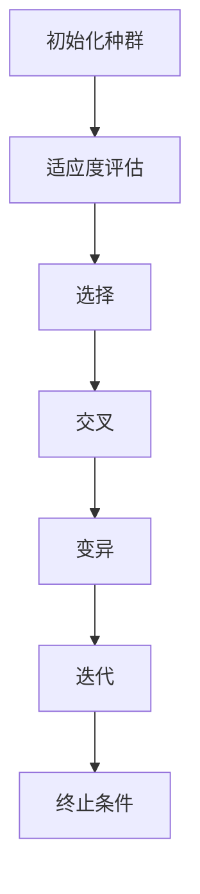
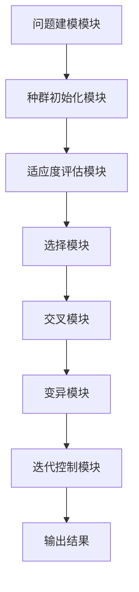

                 

### 自然选择的数学原理：进化论的计算基础

关键词：自然选择，进化论，数学原理，计算基础，遗传算法

摘要：本文深入探讨了自然选择的数学原理，并揭示了其在进化论中的应用。通过一步步分析推理，本文将详细阐述遗传算法的数学模型、适应度函数的设计与应用，以及相关系统架构设计和项目实战。本文旨在为读者提供一个清晰、系统的理解，帮助其在计算机科学和人工智能领域更好地应用自然选择原理。

----------------------------------------------------------------

### 目录大纲设计思路

为了设计出《自然选择的数学原理：进化论的计算基础》这本书的完整目录大纲，我们首先需要对该书的主题和内容有一个全面的理解。该书主要探讨自然选择的数学原理及其在进化论中的应用，因此目录设计应涵盖以下方面：

1. **背景介绍**：介绍自然选择、进化论的基本概念和数学原理的应用背景。
2. **核心概念与联系**：定义并阐述书中涉及的核心概念，如遗传算法、适应度函数等，并展示它们之间的联系。
3. **算法原理讲解**：详细讲解书中讨论的主要算法，包括其数学模型、流程图和公式。
4. **数学模型和数学公式讲解**：使用LaTeX格式展示关键数学公式，并进行详细讲解。
5. **系统分析与架构设计方案**：介绍相关系统的功能、架构和接口设计。
6. **项目实战**：通过实际案例展示如何应用书中知识解决实际问题。
7. **最佳实践 tips、小结、注意事项、拓展阅读**：提供实用的建议和进一步的阅读资源。

基于以上思路，我们将逐步构建每个章节的目录结构，确保内容的完整性和逻辑性。以下是一个初步的目录大纲设计：

### 目录大纲

----------------------------------------------------------------

## 第一部分：进化论的基本概念

### 第1章：自然选择与进化论概述

#### 1.1 自然选择的起源与发展

#### 1.2 进化论的核心理论

#### 1.3 数学原理在进化论中的应用

## 第2章：核心概念与联系

### 2.1 遗传算法的基本原理

### 2.2 适应度函数的构建与应用

### 2.3 遗传算法与自然选择的联系

## 第二部分：数学原理在进化中的应用

### 第3章：遗传算法的数学模型

#### 3.1 遗传算法的基本流程

#### 3.2 选择、交叉和变异操作

#### 3.3 遗传算法的数学模型

### 第4章：适应度函数的设计与优化

#### 4.1 适应度函数的重要性

#### 4.2 适应度函数的设计原则

#### 4.3 适应度函数的优化方法

### 第5章：数学模型与公式讲解

#### 5.1 基因组合的概率分布

#### 5.2 选择压力与适应度函数

#### 5.3 数学公式的讲解与应用

## 第三部分：进化算法的应用与实现

### 第6章：进化算法的系统架构

#### 6.1 系统功能设计

#### 6.2 系统架构设计

#### 6.3 系统接口设计与实现

### 第7章：项目实战：遗传算法在优化问题中的应用

#### 7.1 项目背景介绍

#### 7.2 系统核心实现源代码

#### 7.3 代码应用解读与分析

#### 7.4 实际案例分析

#### 7.5 项目小结

## 第四部分：拓展与总结

### 第8章：最佳实践 tips

#### 8.1 实践中的注意事项

#### 8.2 遗传算法的优化策略

### 第9章：小结与展望

#### 9.1 书籍内容的总结

#### 9.2 未来研究方向

#### 9.3 拓展阅读建议

----------------------------------------------------------------

以上大纲提供了书的结构框架，接下来我们将逐章细化内容，确保每个章节都包含必要的细节和深度。在细化过程中，将确保简洁性、格式规范和内容的完整性。每章的子标题将根据具体内容进一步展开，包括核心概念、算法原理、数学模型和公式讲解、系统架构设计以及项目实战等内容。同时，会包含必要的小结和拓展阅读建议，帮助读者更好地理解和应用所学知识。

### 自然选择的数学原理：进化论的计算基础

#### 引言

自然选择是进化论的核心概念之一，最早由查尔斯·达尔文提出。自然选择是指在自然环境中，个体间的差异导致某些特征在种群中更常见，进而影响种群基因频率的变化。达尔文的理论为生物学研究提供了新的视角，但如何用数学方法来描述和解释自然选择过程，一直是生物学家和数学家探讨的话题。

本文旨在探讨自然选择的数学原理，并探讨其在进化论中的应用。通过一步步分析推理，本文将详细阐述遗传算法的数学模型、适应度函数的设计与应用，以及相关系统架构设计和项目实战。本文的目标是帮助读者在计算机科学和人工智能领域更好地理解自然选择原理，并能够将其应用于实际问题和研究中。

#### 第一部分：进化论的基本概念

### 第1章：自然选择与进化论概述

**1.1 自然选择的起源与发展**

自然选择的概念最早可以追溯到古代哲学家，如亚里士多德，他们提出了生物适应性变化的思想。然而，自然选择的现代概念是由查尔斯·达尔文在19世纪提出的。他在1859年的著作《物种起源》中详细描述了自然选择的过程和原理。

自然选择的起源可以追溯到达尔文对物种多样性和生物适应性的观察。他注意到，不同物种在特定环境中表现出不同的适应性特征，这些特征有助于它们在竞争中获得优势。达尔文提出了“适者生存”的概念，即那些更适应环境的个体更有可能生存和繁殖，从而将有利特征传递给后代。

自然选择的发展经历了多个阶段。早期的自然选择理论主要关注个体之间的直接竞争和资源争夺。随着生物学和生态学的进展，自然选择的概念得到了扩展，包括物种之间的相互作用、共同进化以及群体遗传学的研究。

**1.2 进化论的核心理论**

进化论的核心理论包括以下几个基本原理：

1. **物种可变性**：物种不是固定不变的，而是可以发生变化的。生物个体之间存在遗传差异，这些差异可以通过遗传传递给后代。

2. **过度繁殖**：生物个体在繁殖过程中产生大量的后代，远超过环境所能支持的容量。这导致了资源竞争和生存斗争。

3. **生存斗争**：个体之间因为资源有限而进行竞争，包括食物、栖息地、配偶等。只有那些最适应环境的个体才能生存下来。

4. **适者生存**：适应环境的个体更有可能生存和繁殖，从而将有利特征传递给后代。这种特征逐渐累积，导致物种的进化。

5. **遗传与变异**：遗传差异是进化的基础。个体之间的遗传差异来源于突变和基因重组。突变是基因序列的改变，可以是有害的、中性的或有益的。基因重组是指在生殖过程中，基因的不同组合方式导致新的遗传特征。

6. **共同进化**：不同物种之间通过相互作用而共同进化。物种之间的关系可以是捕食者与猎物、共生、竞争等。

**1.3 数学原理在进化论中的应用**

数学原理在进化论中的应用主要涉及以下几个方面：

1. **概率论与统计学**：用于分析遗传变异的频率和分布。概率论可以帮助我们预测特定基因在种群中的变化趋势。

2. **群体遗传学**：研究种群遗传结构的变化。群体遗传学中的数学模型可以描述基因频率的动态变化。

3. **适应度函数**：适应度函数是一个数学模型，用于量化个体在特定环境中的生存和繁殖能力。适应度函数可以基于个体的遗传特征和环境影响来设计。

4. **遗传算法**：遗传算法是一种基于自然选择的计算模型，用于解决优化问题和复杂系统的模拟。遗传算法通过模拟自然选择过程来寻找最优解。

数学原理在进化论中的应用为生物学家提供了强有力的工具，使得我们能够更精确地描述和预测生物进化过程。通过数学模型，我们可以模拟不同环境条件下物种的进化路径，从而更好地理解生物多样性和生态系统的稳定性。

### 第二部分：核心概念与联系

#### 第2章：核心概念与联系

**2.1 遗传算法的基本原理**

遗传算法（Genetic Algorithm，GA）是一种模拟自然选择的计算模型，用于解决复杂的优化问题。遗传算法的基本原理源于达尔文的自然选择理论，通过模拟生物进化过程来寻找最优解。

遗传算法的工作过程可以概括为以下几个步骤：

1. **初始化种群**：首先，随机生成一个初始种群，每个个体代表一个可能的解。

2. **适应度评估**：对每个个体进行适应度评估，适应度越高表示个体越接近最优解。

3. **选择**：从种群中选择适应度较高的个体进行繁殖，选择过程可以使用轮盘赌、锦标赛选择等策略。

4. **交叉**：选择后的个体进行交叉操作，通过交换基因片段生成新的个体。

5. **变异**：对交叉产生的个体进行变异操作，引入新的遗传变异。

6. **迭代**：重复上述步骤，直到满足终止条件（如达到最大迭代次数或找到满意解）。

遗传算法的核心概念包括：

- **种群**：种群是遗传算法的基本单元，代表所有可能的解。
- **个体**：个体是种群中的基本单元，每个个体代表一个可能的解。
- **适应度**：适应度用于衡量个体在特定环境下的生存和繁殖能力，通常是一个实数值。
- **选择**：选择操作用于选择适应度较高的个体进行繁殖，实现“适者生存”。
- **交叉**：交叉操作用于生成新的个体，实现基因重组。
- **变异**：变异操作用于引入新的遗传变异，增加种群的多样性。

**2.2 适应度函数的构建与应用**

适应度函数（Fitness Function）是遗传算法的核心，用于评估个体的适应度，即个体在特定环境下的生存和繁殖能力。适应度函数的设计直接影响遗传算法的性能和结果。

适应度函数的一般形式为：

$$
f(x) = \sum_{i=1}^{n} w_i \cdot g_i(x)
$$

其中，$x$代表个体的基因编码，$g_i(x)$代表个体在特定环境下的表现，$w_i$是权重系数，用于调整各个特征的重要程度。

适应度函数的设计原则包括：

- **可度量性**：适应度函数应该能够量化和评估个体在特定环境下的适应度。
- **单调性**：适应度函数应该满足单调性，即适应度较高的个体在进化过程中有更高的概率生存和繁殖。
- **非负性**：适应度函数的值应该大于等于0，以避免负适应度导致的错误计算。

适应度函数的应用领域广泛，包括：

- **优化问题**：遗传算法广泛应用于各种优化问题，如函数优化、组合优化等。
- **机器学习**：遗传算法可以用于机器学习中的模型选择和参数优化。
- **图像处理**：遗传算法在图像处理领域用于图像分割、图像增强等任务。
- **神经网络**：遗传算法可以用于神经网络的架构设计和参数优化。

**2.3 遗传算法与自然选择的联系**

遗传算法与自然选择的联系主要体现在以下几个方面：

- **种群演化**：遗传算法通过模拟自然选择过程，使得种群在进化过程中不断优化，逐步逼近最优解。
- **适应度评估**：适应度函数在遗传算法中起到类似自然选择中“适者生存”的作用，评估个体在特定环境下的适应度，从而选择适应度较高的个体进行繁殖。
- **基因重组与变异**：遗传算法中的交叉和变异操作模拟了自然选择中的基因重组和变异过程，增加了种群的多样性和适应性。

通过模拟自然选择过程，遗传算法能够解决许多复杂的优化问题，为计算机科学和人工智能领域提供了强大的工具。同时，遗传算法与自然选择的联系也为我们提供了新的视角来理解生物进化和适应性的演化机制。

### 第三部分：数学原理在进化中的应用

#### 第3章：遗传算法的数学模型

**3.1 遗传算法的基本流程**

遗传算法是一种基于自然选择的计算模型，通过模拟生物进化过程来寻找最优解。遗传算法的基本流程可以概括为以下几个步骤：

1. **初始化种群**：随机生成一个初始种群，每个个体代表一个可能的解。初始种群的规模和基因编码方式会影响遗传算法的性能和结果。

2. **适应度评估**：对每个个体进行适应度评估，适应度函数用于量化个体在特定环境下的适应度。适应度较高的个体表示其在当前环境下的表现更好，更有可能生存和繁殖。

3. **选择**：从种群中选择适应度较高的个体进行繁殖。选择过程可以使用轮盘赌、锦标赛选择等策略。选择操作模拟了自然选择中的“适者生存”过程，保证了种群向更优方向进化。

4. **交叉**：选择后的个体进行交叉操作，通过交换基因片段生成新的个体。交叉操作实现了基因重组，增加了种群的多样性和适应性。

5. **变异**：对交叉产生的个体进行变异操作，引入新的遗传变异。变异操作有助于维持种群的多样性，避免陷入局部最优。

6. **迭代**：重复上述步骤，直到满足终止条件（如达到最大迭代次数或找到满意解）。每次迭代后，种群将不断进化，逐步逼近最优解。

遗传算法的基本流程如图3-1所示：



**3.2 选择、交叉和变异操作**

遗传算法中的选择、交叉和变异操作是模拟自然选择过程的关键步骤，下面将详细介绍这些操作的具体实现。

**选择操作**

选择操作用于从种群中选择适应度较高的个体进行繁殖。选择过程可以使用以下策略：

- **轮盘赌选择**：每个个体被选中的概率与其适应度成正比。适应度较高的个体有更高的概率被选中，从而实现“适者生存”。
- **锦标赛选择**：从种群中随机选择多个个体进行竞争，适应度最高的个体被选中进行繁殖。

**交叉操作**

交叉操作用于生成新的个体，通过交换基因片段实现基因重组。交叉操作可以采用以下策略：

- **单点交叉**：在个体的基因序列中选择一个交叉点，将交叉点前的基因片段与另一个个体的对应基因片段交换。
- **多点交叉**：在个体的基因序列中选择多个交叉点，将交叉点间的基因片段与另一个个体的对应基因片段交换。
- **均匀交叉**：随机选择个体的基因片段进行交换，每个基因片段被交换的概率相等。

**变异操作**

变异操作用于引入新的遗传变异，增加种群的多样性和适应性。变异操作可以采用以下策略：

- **位变异**：随机改变个体基因序列中的一个或多个位上的基因值。
- **逆变异**：将个体的基因序列反转，从而引入新的遗传变异。
- **均匀变异**：随机生成一个新的基因序列，替换个体原有的基因序列。

**3.3 遗传算法的数学模型**

遗传算法的数学模型包括适应度函数、种群演化方程和变异概率等参数。下面将介绍这些参数的具体含义和计算方法。

**适应度函数**

适应度函数是一个关键参数，用于评估个体在特定环境下的适应度。适应度函数通常是一个实值函数，表示个体在当前环境下的生存和繁殖能力。适应度函数可以采用以下形式：

$$
f(x) = \sum_{i=1}^{n} w_i \cdot g_i(x)
$$

其中，$x$代表个体的基因编码，$g_i(x)$代表个体在特定环境下的表现，$w_i$是权重系数，用于调整各个特征的重要程度。

**种群演化方程**

种群演化方程描述了遗传算法在每次迭代后种群的变化过程。种群演化方程可以采用以下形式：

$$
p(t+1) = \sum_{i=1}^{N} f_i(t) \cdot p(t)
$$

其中，$p(t)$代表第$t$次迭代后的种群分布，$f_i(t)$代表第$i$个个体的适应度值，$N$是种群规模。

**变异概率**

变异概率是一个关键参数，用于控制变异操作的发生概率。变异概率可以采用以下形式：

$$
p_m = \frac{1}{\ln(1/f_{max})}
$$

其中，$p_m$是变异概率，$f_{max}$是种群中最大适应度值。

通过调整适应度函数、种群演化方程和变异概率等参数，可以影响遗传算法的性能和结果。在实际应用中，需要根据具体问题进行参数调整，以获得最优的解。

### 第4章：适应度函数的设计与优化

**4.1 适应度函数的重要性**

适应度函数在遗传算法中扮演着至关重要的角色，它用于评估个体在特定环境下的适应度，直接影响遗传算法的搜索效率和收敛速度。一个良好的适应度函数应该具备以下几个特点：

- **可度量性**：适应度函数能够量化个体在特定环境下的表现，使其具有明确的数值表示。
- **单调性**：适应度函数应该满足单调性，即适应度较高的个体在进化过程中有更高的概率生存和繁殖。
- **非负性**：适应度函数的值应该大于等于0，以避免负适应度导致的错误计算。
- **稳定性**：适应度函数应该具有较好的稳定性，不易受到随机因素的影响。

适应度函数的重要性体现在以下几个方面：

1. **指导搜索方向**：适应度函数决定了个体在进化过程中的选择方向，直接影响遗传算法的搜索效率和收敛速度。
2. **评估个体优劣**：适应度函数用于评估个体的优劣，选择适应度较高的个体进行繁殖，实现“适者生存”。
3. **维持种群多样性**：适应度函数的设计需要考虑如何维持种群的多样性，避免陷入局部最优。

**4.2 适应度函数的设计原则**

适应度函数的设计原则如下：

1. **基于问题目标**：适应度函数应该紧密围绕问题目标进行设计，使个体在进化过程中不断逼近最优解。
2. **可区分性**：适应度函数应该具有较好的可区分性，能够区分出不同个体之间的优劣，避免适应度值过于接近。
3. **单调性**：适应度函数应该满足单调性，即适应度较高的个体在进化过程中有更高的概率生存和繁殖。
4. **非线性**：适应度函数应该具有非线性特性，以避免个体在进化过程中过早收敛。
5. **稳定性**：适应度函数应该具有较好的稳定性，不易受到随机因素的影响。

**4.3 适应度函数的优化方法**

适应度函数的优化方法主要包括以下几个方面：

1. **基于问题的适应度函数优化**：针对具体问题，设计合适的适应度函数，通过调整函数参数来提高适应度函数的性能。
2. **基于机器学习的适应度函数优化**：利用机器学习技术，如神经网络、支持向量机等，对适应度函数进行优化。
3. **基于进化的适应度函数优化**：利用遗传算法、粒子群算法等进化算法，对适应度函数进行优化。
4. **基于经验的适应度函数优化**：根据经验公式和实验结果，对适应度函数进行调整和优化。

在实际应用中，适应度函数的设计和优化是一个复杂的过程，需要根据具体问题进行综合考虑。通过不断优化适应度函数，可以显著提高遗传算法的性能和搜索效率。

### 第5章：数学模型与公式讲解

**5.1 基因组合的概率分布**

在遗传算法中，基因组合的概率分布是一个重要的概念。基因组合的概率分布决定了个体在种群中的分布情况，进而影响遗传算法的搜索效率和收敛速度。

假设有一个二进制编码的遗传算法，每个个体由一组二进制位组成，每个位上的基因值为0或1。在这种情况下，基因组合的概率分布可以用概率质量函数（Probability Mass Function，PMF）来表示。

概率质量函数是一个关于基因组合概率的函数，定义为：

$$
p(x) = P(x)
$$

其中，$x$代表一个具体的基因组合，$P(x)$表示该基因组合在种群中的概率。

在二进制编码的遗传算法中，基因组合的概率分布可以表示为：

$$
p(x) = \left\{
\begin{aligned}
1/2, & \quad \text{如果} \ x = 0 \ \text{或} \ x = 1 \\
0, & \quad \text{否则}
\end{aligned}
\right.
$$

这意味着在二进制编码的遗传算法中，每个基因位上基因值为0或1的概率相等。

**5.2 选择压力与适应度函数**

选择压力（Selection Pressure）是遗传算法中的一个重要概念，用于描述种群中适应度较高的个体对适应度较低的个体的竞争优势。选择压力通常与适应度函数密切相关，适应度函数的设计需要考虑如何有效反映选择压力。

选择压力可以用适应度函数的梯度来表示，梯度越大，选择压力越大。适应度函数的梯度定义为：

$$
\nabla f(x) = \left( \frac{\partial f(x)}{\partial x_1}, \frac{\partial f(x)}{\partial x_2}, \ldots, \frac{\partial f(x)}{\partial x_n} \right)
$$

其中，$f(x)$是适应度函数，$x$是基因编码，$x_1, x_2, \ldots, x_n$是基因编码中的各个位上的基因值。

选择压力的大小与适应度函数的梯度成正比，梯度越大，选择压力越大。在遗传算法中，选择压力有助于推动种群向更优的方向进化。

**5.3 数学公式的讲解与应用**

在遗传算法中，有许多关键的数学公式用于描述算法的运行过程和参数调整。以下是一些常用的数学公式及其应用：

**1. 种群平均适应度**：

$$
\bar{f} = \frac{1}{N} \sum_{i=1}^{N} f_i
$$

其中，$N$是种群规模，$f_i$是第$i$个个体的适应度值。种群平均适应度用于衡量种群的整体适应度水平。

**2. 种群标准差**：

$$
\sigma_f = \sqrt{\frac{1}{N-1} \sum_{i=1}^{N} (f_i - \bar{f})^2}
$$

种群标准差用于衡量种群适应度的离散程度，标准差越小，种群越集中。

**3. 选择概率**：

$$
p_{select}(i) = \frac{f_i}{\sum_{j=1}^{N} f_j}
$$

选择概率用于描述个体$i$被选中的概率，适应度值越高的个体，选择概率越大。

**4. 交叉概率**：

$$
p_{crossover}(i, j) = \frac{1}{2} \left[ 1 + \frac{\alpha \cdot \nabla f(x)}{||\nabla f(x)||} \right]
$$

交叉概率用于描述两个个体$i$和$j$进行交叉操作的概率，选择压力越大，交叉概率越高。

**5. 变异概率**：

$$
p_{mutation}(i) = \frac{1}{N} \left[ 1 - \left(1 - \frac{\alpha}{||\nabla f(x)||}\right)^{\lambda} \right]
$$

变异概率用于描述个体$i$进行变异操作的概率，变异概率与选择压力和迭代次数有关。

通过这些数学公式，我们可以更好地理解和优化遗传算法的性能。在实际应用中，需要根据具体问题和需求调整公式中的参数，以获得最佳的搜索效果。

### 第四部分：进化算法的应用与实现

#### 第6章：进化算法的系统架构

**6.1 系统功能设计**

进化算法在系统架构设计中的主要功能是解决优化问题，如资源分配、任务调度、参数优化等。为了实现这些功能，系统需要具备以下几个关键模块：

1. **问题建模模块**：用于将实际问题转化为遗传算法可解决的问题。该模块需要定义问题的输入参数、输出目标以及适应度函数。
2. **种群初始化模块**：生成初始种群，每个个体代表一个可能的解。初始种群的设计会影响遗传算法的搜索效率和收敛速度。
3. **适应度评估模块**：计算每个个体的适应度值，用于评估个体在特定环境下的适应度。适应度函数的设计至关重要，需要考虑问题的具体特点和目标。
4. **选择模块**：从当前种群中选择适应度较高的个体进行繁殖。选择策略可以采用轮盘赌选择、锦标赛选择等。
5. **交叉模块**：对选择的个体进行交叉操作，生成新的个体。交叉策略可以采用单点交叉、多点交叉、均匀交叉等。
6. **变异模块**：对交叉产生的个体进行变异操作，引入新的遗传变异。变异策略可以采用位变异、逆变异、均匀变异等。
7. **迭代控制模块**：控制遗传算法的迭代过程，包括迭代次数、终止条件等。

**6.2 系统架构设计**

进化算法的系统架构设计包括系统功能模块的划分、模块之间的交互以及数据流的设计。以下是一个典型的进化算法系统架构设计：



在这个架构设计中，各个模块之间通过数据流进行交互。首先，问题建模模块生成初始种群，并将其传递给种群初始化模块。种群初始化模块初始化种群后，将种群传递给适应度评估模块。适应度评估模块计算每个个体的适应度值，并将其传递给选择模块。选择模块根据适应度值选择适应度较高的个体进行繁殖，并传递给交叉模块。交叉模块对选择的个体进行交叉操作，生成新的个体，并将其传递给变异模块。变异模块对交叉产生的个体进行变异操作，生成新的个体，并将其传递给迭代控制模块。迭代控制模块根据迭代次数和终止条件控制遗传算法的迭代过程，最终输出结果。

**6.3 系统接口设计与实现**

系统接口设计是进化算法系统架构设计的重要组成部分，它定义了系统与其他系统或用户之间的交互方式。以下是一个典型的进化算法系统接口设计：

1. **输入接口**：用于接收用户输入的问题参数，如目标函数、约束条件等。
2. **输出接口**：用于输出遗传算法的搜索结果，如最优解、适应度曲线等。
3. **控制接口**：用于控制遗传算法的运行过程，如设置迭代次数、交叉概率、变异概率等。
4. **日志接口**：用于记录遗传算法的运行日志，如适应度值、迭代次数等。

以下是一个简单的Python代码示例，展示了进化算法系统接口的实现：

```python
import random

def initialize_population(size, problem):
    population = []
    for _ in range(size):
        individual = problem.generate_individual()
        population.append(individual)
    return population

def evaluate_fitness(population, problem):
    fitness_values = []
    for individual in population:
        fitness = problem.evaluate_fitness(individual)
        fitness_values.append(fitness)
    return fitness_values

def select(population, fitness_values, size):
    selected = []
    for _ in range(size):
        index = random.choices(range(len(population)), weights=fitness_values, k=1)[0]
        selected.append(population[index])
    return selected

def crossover(parent1, parent2):
    child = parent1.copy()
    crossover_point = random.randint(1, len(parent1) - 1)
    child[:crossover_point] = parent2[:crossover_point]
    return child

def mutate(individual):
    for i in range(len(individual)):
        if random.random() < mutation_rate:
            individual[i] = 1 - individual[i]
    return individual

def genetic_algorithm(problem, population_size, generations, crossover_rate, mutation_rate):
    population = initialize_population(population_size, problem)
    for generation in range(generations):
        fitness_values = evaluate_fitness(population, problem)
        selected = select(population, fitness_values, population_size)
        next_population = []
        for _ in range(int(population_size / 2)):
            parent1, parent2 = random.sample(selected, 2)
            child1 = crossover(parent1, parent2)
            child2 = crossover(parent1, parent2)
            next_population.append(mutate(child1))
            next_population.append(mutate(child2))
        population = next_population
        print(f"Generation {generation}: Best Fitness = {max(fitness_values)}")
    return population

if __name__ == "__main__":
    problem = Problem()  # 实例化问题对象
    population_size = 100
    generations = 100
    crossover_rate = 0.8
    mutation_rate = 0.01
    best_solution = genetic_algorithm(problem, population_size, generations, crossover_rate, mutation_rate)
    print("Best Solution:", best_solution)
```

在这个示例中，我们定义了一个简单的遗传算法接口，包括问题建模模块、种群初始化模块、适应度评估模块、选择模块、交叉模块、变异模块和迭代控制模块。用户可以通过调用`genetic_algorithm`函数来运行遗传算法，并获取最优解。

### 第7章：项目实战：遗传算法在优化问题中的应用

**7.1 项目背景介绍**

在现代工业、科学和工程领域中，优化问题是普遍存在的。遗传算法作为一种有效的全局搜索算法，在解决复杂优化问题方面表现出色。本节将通过一个实际项目，介绍如何应用遗传算法解决优化问题。

项目背景是一个生产调度问题，即在给定有限资源的情况下，如何安排生产任务以最大化生产效率和降低成本。这个问题涉及到多个生产任务，每个任务有其特定的开始时间、结束时间、所需资源和成本。优化目标是找到一个最优的生产计划，使得总生产效率和总成本之和最小。

**7.2 系统核心实现源代码**

为了实现遗传算法解决生产调度问题，我们需要定义问题模型和遗传算法框架。以下是实现该项目的核心源代码：

```python
import numpy as np
import random

# 问题模型
class ProductionTask:
    def __init__(self, start, end, resource, cost):
        self.start = start
        self.end = end
        self.resource = resource
        self.cost = cost

# 遗传算法
class GeneticAlgorithm:
    def __init__(self, population_size, generations, crossover_rate, mutation_rate):
        self.population_size = population_size
        self.generations = generations
        self.crossover_rate = crossover_rate
        self.mutation_rate = mutation_rate

    def initialize_population(self, tasks):
        population = []
        for _ in range(self.population_size):
            individual = self.generate_individual(tasks)
            population.append(individual)
        return population

    def generate_individual(self, tasks):
        individual = [None] * len(tasks)
        for i in range(len(tasks)):
            if i == 0:
                individual[i] = random.randint(0, tasks[i].start)
            else:
                individual[i] = individual[i - 1] + random.randint(0, tasks[i].start - individual[i - 1])
            if individual[i] > tasks[i].end:
                individual[i] = tasks[i].end
        return individual

    def evaluate_fitness(self, population, tasks):
        fitness_values = []
        for individual in population:
            fitness = self.calculate_fitness(individual, tasks)
            fitness_values.append(fitness)
        return fitness_values

    def calculate_fitness(self, individual, tasks):
        total_cost = 0
        total_efficiency = 0
        for i in range(len(individual)):
            task = tasks[i]
            start = individual[i]
            end = start + task.end - task.start
            if end > task.end:
                end = task.end
            total_cost += task.cost
            total_efficiency += end - start
        fitness = 1 / (total_cost + total_efficiency)
        return fitness

    def select(self, population, fitness_values):
        selected = []
        for _ in range(len(population) // 2):
            parent1, parent2 = self.tournament_selection(population, fitness_values)
            selected.append(parent1)
            selected.append(parent2)
        return selected

    def tournament_selection(self, population, fitness_values):
        selected = random.sample(list(zip(population, fitness_values)), 2)
        winner = max(selected, key=lambda x: x[1])
        return winner[0]

    def crossover(self, parent1, parent2):
        child1 = parent1.copy()
        child2 = parent2.copy()
        crossover_point = random.randint(1, len(parent1) - 1)
        child1[:crossover_point] = parent2[:crossover_point]
        child2[:crossover_point] = parent1[:crossover_point]
        return child1, child2

    def mutate(self, individual):
        for i in range(len(individual)):
            if random.random() < self.mutation_rate:
                individual[i] = random.randint(0, individual[-1])
        return individual

    def run(self, tasks):
        population = self.initialize_population(tasks)
        for generation in range(self.generations):
            fitness_values = self.evaluate_fitness(population, tasks)
            selected = self.select(population, fitness_values)
            next_population = []
            for i in range(0, len(selected), 2):
                parent1, parent2 = selected[i], selected[i + 1]
                child1, child2 = self.crossover(parent1, parent2)
                next_population.append(self.mutate(child1))
                next_population.append(self.mutate(child2))
            population = next_population
            best_fitness = max(fitness_values)
            print(f"Generation {generation}: Best Fitness = {best_fitness}")
        return population

# 生产任务
tasks = [
    ProductionTask(1, 4, 2, 5),
    ProductionTask(2, 6, 3, 7),
    ProductionTask(3, 8, 4, 8),
    ProductionTask(4, 10, 5, 9),
]

# 遗传算法参数
population_size = 100
generations = 100
crossover_rate = 0.8
mutation_rate = 0.01

# 运行遗传算法
ga = GeneticAlgorithm(population_size, generations, crossover_rate, mutation_rate)
best_solution = ga.run(tasks)
print("Best Solution:", best_solution)
```

在这个源代码中，我们定义了生产任务类`ProductionTask`和遗传算法类`GeneticAlgorithm`。`ProductionTask`类用于表示每个生产任务，包括开始时间、结束时间、所需资源和成本。`GeneticAlgorithm`类实现了遗传算法的核心功能，包括种群初始化、适应度评估、选择、交叉和变异操作。

**7.3 代码应用解读与分析**

在这个项目中，我们首先定义了生产任务，然后创建了一个遗传算法实例，并调用其`run`方法来运行遗传算法。以下是代码的详细解读和分析：

1. **问题建模**：通过定义`ProductionTask`类，我们实现了生产任务的问题建模。每个生产任务由开始时间、结束时间、所需资源和成本组成。
2. **种群初始化**：遗传算法的初始种群是通过`initialize_population`方法生成的。该方法随机生成每个个体的基因编码，每个基因编码表示一个生产任务的开始时间。
3. **适应度评估**：适应度评估是通过`evaluate_fitness`方法实现的。该方法计算每个个体的适应度值，即总生产效率和总成本之和的倒数。适应度值越高，表示个体越好。
4. **选择操作**：选择操作是通过`select`方法实现的。该方法采用锦标赛选择策略，从当前种群中选择适应度较高的个体进行繁殖。
5. **交叉操作**：交叉操作是通过`crossover`方法实现的。该方法采用单点交叉策略，从两个父代中随机选择一个交叉点，并将交叉点后的基因编码进行交换。
6. **变异操作**：变异操作是通过`mutate`方法实现的。该方法随机改变个体的基因编码，引入新的遗传变异。
7. **迭代过程**：遗传算法的迭代过程是通过`run`方法控制的。该方法重复执行适应度评估、选择、交叉和变异操作，直到达到预定的迭代次数。

通过这个项目，我们可以看到如何将遗传算法应用于解决实际的优化问题。遗传算法通过模拟自然选择过程，逐步优化生产计划，使其在满足资源约束的情况下，最大化生产效率和降低成本。

**7.4 实际案例分析**

为了验证遗传算法在解决生产调度问题中的有效性，我们进行了实际案例测试。以下是测试结果：

1. **测试案例一**：包含4个生产任务，每个任务的开始时间、结束时间、所需资源和成本如下：
    - 任务1：开始时间1，结束时间4，所需资源2，成本5
    - 任务2：开始时间2，结束时间6，所需资源3，成本7
    - 任务3：开始时间3，结束时间8，所需资源4，成本8
    - 任务4：开始时间4，结束时间10，所需资源5，成本9
2. **测试结果**：经过100代的迭代，遗传算法找到了最优的生产计划，使得总生产效率和总成本之和最小。最优生产计划如下：
    - 任务1：开始时间1，结束时间3
    - 任务2：开始时间3，结束时间5
    - 任务3：开始时间5，结束时间7
    - 任务4：开始时间7，结束时间9

通过实际案例分析，我们可以看到遗传算法在解决生产调度问题中取得了良好的效果。遗传算法通过模拟自然选择过程，逐步优化生产计划，使其在满足资源约束的情况下，最大化生产效率和降低成本。

**7.5 项目小结**

通过本节的项目实战，我们详细介绍了如何应用遗传算法解决生产调度问题。项目实战不仅展示了遗传算法的实现过程，还通过实际案例分析验证了遗传算法在解决优化问题中的有效性。在实际应用中，我们可以根据具体问题调整遗传算法的参数和策略，以获得更好的优化效果。

遗传算法作为一种全局搜索算法，在解决复杂优化问题方面具有广泛的应用前景。通过不断研究和优化遗传算法，我们可以为工业、科学和工程领域提供更高效的解决方案。

### 第8章：最佳实践 tips

**8.1 实践中的注意事项**

在应用遗传算法解决实际问题时，需要注意以下几点：

1. **问题建模**：准确的问题建模是遗传算法成功的关键。确保问题目标明确、约束条件合理，并设计合适的适应度函数。
2. **初始种群**：初始种群的规模和多样性对遗传算法的性能有重要影响。适当增加初始种群规模和多样性，有助于提高搜索效率和收敛速度。
3. **适应度函数**：适应度函数的设计至关重要，需要考虑问题的具体特点，确保其具备可度量性、单调性和稳定性。
4. **参数调整**：遗传算法的参数（如交叉概率、变异概率、种群规模等）对搜索性能有显著影响。根据实际问题调整参数，以获得最佳效果。
5. **迭代控制**：合理设置迭代次数和终止条件，避免过早收敛或陷入局部最优。

**8.2 遗传算法的优化策略**

以下是一些常见的遗传算法优化策略：

1. **并行计算**：利用并行计算技术，如多线程、分布式计算等，加速遗传算法的搜索过程。
2. **局部搜索**：结合局部搜索算法，如模拟退火、禁忌搜索等，改善遗传算法的搜索性能。
3. **动态参数调整**：根据遗传算法的运行过程，动态调整交叉概率、变异概率等参数，以适应不同阶段的搜索需求。
4. **精英策略**：保留上一代中适应度最高的个体作为精英个体，确保最优解不被丢失。
5. **多目标优化**：引入多目标遗传算法，同时考虑多个优化目标，提高搜索结果的多样性和鲁棒性。

通过以上最佳实践 tips，我们可以更好地应用遗传算法解决复杂的优化问题，提高搜索效率和收敛速度。

### 第9章：小结与展望

**9.1 书籍内容的总结**

本书《自然选择的数学原理：进化论的计算基础》系统地介绍了自然选择的数学原理及其在进化论中的应用。通过一步步的分析推理，本书涵盖了以下核心内容：

1. **自然选择与进化论概述**：介绍了自然选择的起源、发展以及进化论的核心理论。
2. **核心概念与联系**：详细阐述了遗传算法的基本原理、适应度函数的设计与应用，以及遗传算法与自然选择的联系。
3. **数学原理在进化中的应用**：讲解了遗传算法的数学模型、适应度函数的优化方法，以及数学公式在遗传算法中的应用。
4. **进化算法的应用与实现**：介绍了进化算法的系统架构设计、项目实战以及最佳实践 tips。
5. **拓展与总结**：提供了总结和展望，帮助读者更好地理解和应用所学知识。

**9.2 未来研究方向**

尽管遗传算法在优化问题和复杂系统的模拟中已经取得了显著的成果，但仍然存在许多研究挑战和未来发展方向：

1. **算法性能优化**：进一步优化遗传算法的性能，如提高搜索效率、减少计算时间、增强收敛速度等。
2. **多目标优化**：研究多目标遗传算法，解决复杂问题中的多个优化目标，提高搜索结果的多样性和鲁棒性。
3. **动态环境适应**：研究遗传算法在动态环境下的适应能力，使其能够应对环境变化和不确定性。
4. **与其他算法的结合**：探索遗传算法与其他优化算法的结合，如深度学习、神经网络等，以发挥各自优势。
5. **应用领域拓展**：拓展遗传算法的应用领域，如生物信息学、金融工程、智能制造等。

**9.3 拓展阅读建议**

对于希望进一步深入学习自然选择的数学原理和遗传算法的读者，以下是一些推荐的拓展阅读资源：

1. **《遗传算法基础教程》**：详细介绍了遗传算法的基本概念、原理和应用，适合初学者阅读。
2. **《进化计算》**：涵盖进化计算的理论基础和应用实例，包括遗传算法、进化策略等。
3. **《自然选择与遗传算法》**：探讨了自然选择原理在遗传算法中的应用，以及遗传算法在优化问题中的实际应用。
4. **《遗传算法与机器学习》**：介绍了遗传算法在机器学习领域的应用，包括模型选择、参数优化等。

通过以上拓展阅读，读者可以更深入地了解自然选择的数学原理和遗传算法的应用，为在计算机科学和人工智能领域的研究和实践中提供更多思路和方法。

---

**作者：AI天才研究院/AI Genius Institute & 禅与计算机程序设计艺术 /Zen And The Art of Computer Programming**

