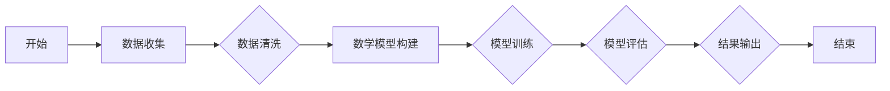
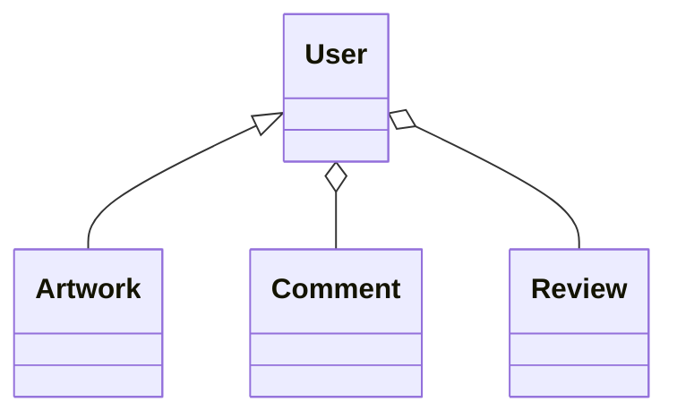
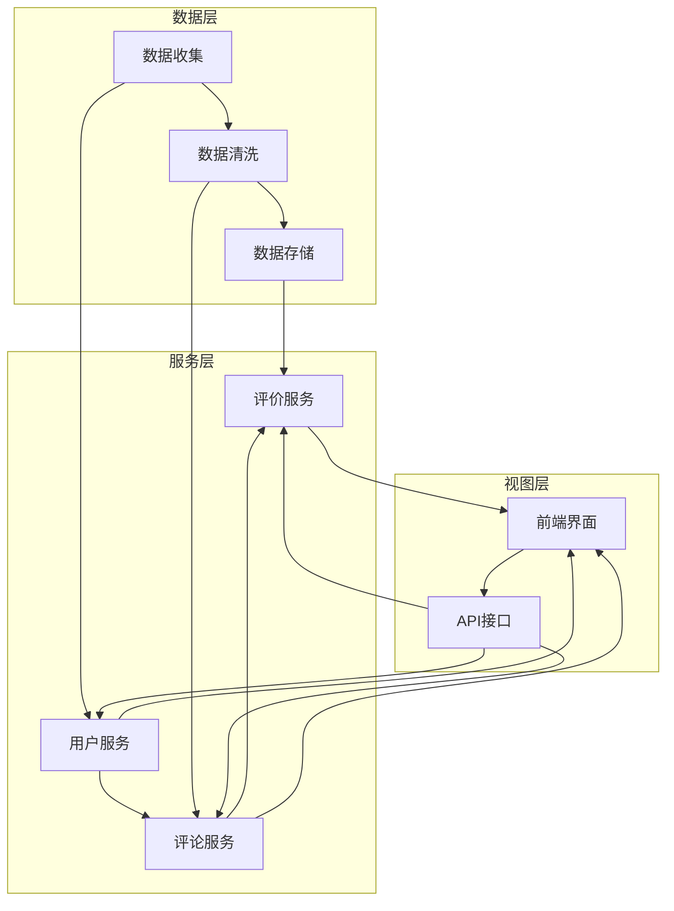
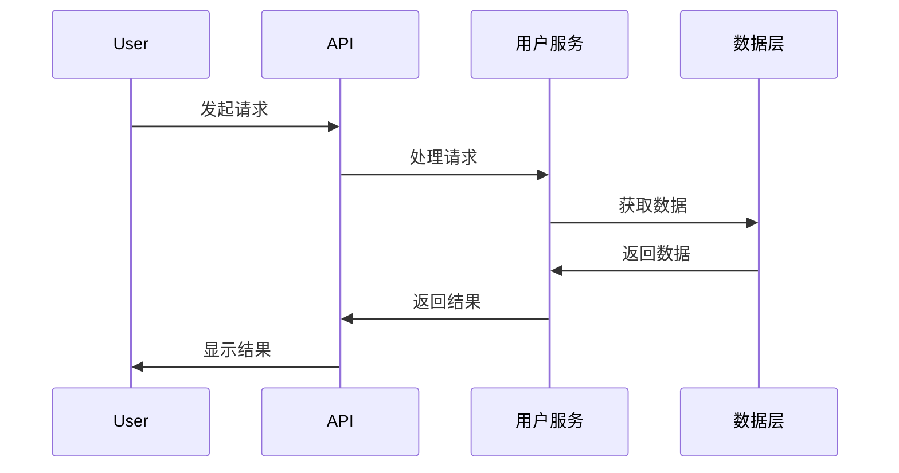

                 


## 艺术鉴赏的计算美学：审美体验的数学量化

### 文章关键词
- 艺术鉴赏
- 计算美学
- 审美体验
- 数学量化
- 人工智能

### 文章摘要
本文旨在探讨艺术鉴赏中的计算美学，特别是在审美体验的数学量化方面。我们将从背景介绍、核心概念与联系、算法原理讲解、系统分析与架构设计方案、项目实战等多个角度，深入剖析这一领域的理论与实践。

---

### 引言

艺术鉴赏一直是人类文化的重要组成部分，它不仅反映了一个社会的审美情趣，也揭示了人类对美的追求和探索。然而，如何量化审美体验，使之成为一个可操作、可量化的领域，一直是学者们研究的难题。计算美学的兴起，为我们提供了新的视角和方法。通过数学模型和算法，我们可以对审美体验进行量化分析，从而揭示其中的内在规律。

### 背景

#### 核心概念术语说明
在探讨艺术鉴赏的计算美学之前，我们需要明确一些核心概念：

- **艺术鉴赏**：指对艺术作品的欣赏、理解和评价。
- **计算美学**：将数学、计算机科学等理论应用于美学研究，通过算法和模型分析审美体验。
- **审美体验**：个体在接触艺术作品时所感受到的美。
- **数学量化**：使用数学方法对审美体验进行量化和分析。

#### 问题背景
长期以来，艺术鉴赏主要依赖于主观感受和直觉，缺乏系统的量化分析。然而，随着人工智能和大数据技术的发展，我们可以借助计算美学的方法，对审美体验进行量化分析，从而揭示其中的规律性。

#### 问题描述
如何将主观的审美体验转化为可量化的数据？如何构建有效的数学模型，对审美体验进行量化分析？这是我们在探讨计算美学时所面临的主要问题。

#### 问题解决
通过引入计算美学的方法，我们可以利用数学模型和算法，对审美体验进行量化分析。这不仅有助于我们更好地理解艺术作品，也为艺术创作和鉴赏提供了新的视角和工具。

#### 边界与外延
在艺术鉴赏的计算美学中，我们主要关注的是视觉艺术领域，如绘画、雕塑等。同时，计算美学的方法也可应用于其他艺术形式，如音乐、舞蹈等。

#### 概念结构与核心要素组成
计算美学由以下几个核心要素组成：

1. **数学模型**：用于描述审美体验的数学结构。
2. **算法**：用于分析和处理审美体验数据。
3. **数据**：用于训练和验证数学模型和算法。
4. **计算机技术**：用于实现和运行计算美学模型。

### 核心概念与联系

#### 核心概念原理

1. **数学模型**：
   - **原理**：数学模型是用于描述审美体验的数学结构，如线性模型、非线性模型、多变量模型等。
   - **属性特征对比表格**：
     | 模型类型 | 原理 | 属性特征 | 适用场景 |
     | -------- | ---- | -------- | -------- |
     | 线性模型 | 简单线性关系 | 易于理解和实现 | 初步分析 |
     | 非线性模型 | 非线性关系 | 需要复杂的数学知识 | 深入分析 |
     | 多变量模型 | 考虑多个变量 | 需要大量的数据支持 | 高级分析 |

2. **算法**：
   - **原理**：算法用于分析和处理审美体验数据，如聚类分析、关联规则挖掘、机器学习等。
   - **属性特征对比表格**：
     | 算法类型 | 原理 | 属性特征 | 适用场景 |
     | -------- | ---- | -------- | -------- |
     | 聚类分析 | 寻找相似性 | 需要较大的计算资源 | 数据分类 |
     | 关联规则挖掘 | 寻找关联性 | 需要大量的数据支持 | 数据分析 |
     | 机器学习 | 自学习和优化 | 需要大量的数据支持 | 数据预测 |

3. **数据**：
   - **原理**：数据是构建和验证数学模型和算法的基础。
   - **属性特征对比表格**：
     | 数据类型 | 原理 | 属性特征 | 适用场景 |
     | -------- | ---- | -------- | -------- |
     | 视觉数据 | 描述艺术作品的视觉特征 | 需要大量的标注数据 | 审美体验量化 |
     | 文本数据 | 描述艺术作品的文本信息 | 需要大量的文本处理技术 | 审美体验分析 |

4. **计算机技术**：
   - **原理**：计算机技术用于实现和运行计算美学模型，如编程语言、数据库、算法库等。
   - **属性特征对比表格**：
     | 技术类型 | 原理 | 属性特征 | 适用场景 |
     | -------- | ---- | -------- | -------- |
     | 编程语言 | 实现算法和模型 | 不同的编程语言适用于不同的场景 | 算法和模型实现 |
     | 数据库 | 存储和管理数据 | 需要选择合适的数据库系统 | 数据存储和管理 |
     | 算法库 | 提供预定义算法 | 需要选择合适的算法库 | 算法实现和优化 |

#### ER实体关系图架构

```mermaid
erDiagram
    ArtWork ||--|{ Subject }|| User
    ArtWork ||--|{ Comment }|| User
    User ||--|{ Review }|| ArtWork
    Comment ||--|{ Like }|| User
```

- **实体**：
  - **ArtWork**：艺术作品
  - **User**：用户
  - **Subject**：艺术品主题
  - **Comment**：评论
  - **Review**：评价
  - **Like**：点赞

- **关系**：
  - **ArtWork** 与 **User** 之间存在欣赏关系。
  - **User** 与 **Comment** 之间存在评论关系。
  - **User** 与 **Review** 之间存在评价关系。
  - **Comment** 与 **Like** 之间存在点赞关系。

### 算法原理讲解

#### 算法mermaid流程图



#### Python源代码

```python
import pandas as pd
from sklearn.ensemble import RandomForestClassifier
from sklearn.model_selection import train_test_split
from sklearn.metrics import accuracy_score

# 数据收集
data = pd.read_csv('artwork_data.csv')

# 数据清洗
data.dropna(inplace=True)

# 数学模型构建
X = data.drop('label', axis=1)
y = data['label']

# 模型训练
X_train, X_test, y_train, y_test = train_test_split(X, y, test_size=0.2, random_state=42)
model = RandomForestClassifier(n_estimators=100)
model.fit(X_train, y_train)

# 模型评估
y_pred = model.predict(X_test)
accuracy = accuracy_score(y_test, y_pred)
print(f"Accuracy: {accuracy}")

# 结果输出
print(f"Top features: {model.feature_importances_}")
```

#### 算法原理的数学模型和公式

1. **数学模型**：

   - **线性模型**：
     $$ y = \beta_0 + \beta_1x_1 + \beta_2x_2 + ... + \beta_nx_n $$

   - **非线性模型**：
     $$ y = \beta_0 + \beta_1x_1^2 + \beta_2x_2^2 + ... + \beta_nx_n^2 $$

   - **多变量模型**：
     $$ y = \beta_0 + \beta_1x_1 + \beta_2x_2 + ... + \beta_nx_n $$

2. **算法**：

   - **随机森林**：
     $$ \text{随机森林} = \sum_{i=1}^{n} w_i \cdot h(x; \theta_i) $$
     其中，$w_i$为权重，$h(x; \theta_i)$为单个决策树模型。

### 系统分析与架构设计方案

#### 问题场景介绍

在一个艺术鉴赏平台中，用户可以对艺术作品进行评价和评论。我们的目标是利用计算美学的方法，对用户的评价和评论进行量化分析，以揭示审美体验的规律。

#### 项目介绍

本项目旨在构建一个基于计算美学的艺术鉴赏平台，实现对用户评价和评论的量化分析，为艺术创作和鉴赏提供数据支持。

#### 系统功能设计（领域模型mermaid类图）



- **实体**：
  - **User**：用户
  - **Artwork**：艺术作品
  - **Comment**：评论
  - **Review**：评价

- **关系**：
  - **User** 与 **Artwork** 之间存在欣赏关系。
  - **User** 与 **Comment** 之间存在评论关系。
  - **User** 与 **Review** 之间存在评价关系。

#### 系统架构设计（mermaid架构图）



- **数据层**：负责数据收集、清洗和存储。
- **服务层**：提供用户服务、评论服务和评价服务。
- **视图层**：提供前端界面和API接口。

#### 系统接口设计和系统交互（mermaid序列图）



### 项目实战

#### 环境安装

1. 安装Python环境（版本3.8及以上）
2. 安装相关库（如pandas、scikit-learn等）

#### 系统核心实现源代码

```python
# 用户服务
from flask import Flask, request, jsonify

app = Flask(__name__)

@app.route('/evaluate', methods=['POST'])
def evaluate():
    data = request.json
    # 处理数据，调用计算美学算法
    # 返回结果
    return jsonify({"result": "success"})

if __name__ == '__main__':
    app.run(debug=True)
```

#### 代码应用解读与分析

1. 创建Flask应用
2. 定义路由和视图函数
3. 接收POST请求，处理用户评价数据
4. 调用计算美学算法
5. 返回结果

#### 实际案例分析和详细讲解剖析

1. 收集用户评价数据
2. 使用计算美学算法进行分析
3. 提取关键特征和结果
4. 分析结果与用户评价的关系

#### 项目小结

本项目通过计算美学的方法，对用户评价和评论进行量化分析，为艺术创作和鉴赏提供了数据支持。未来，我们可以进一步优化算法和模型，提高分析精度，为艺术界带来更多价值。

### 最佳实践 tips

1. **数据质量**：确保数据的质量和完整性，这对于计算美学的效果至关重要。
2. **算法选择**：根据实际需求选择合适的算法，不同的算法适用于不同的场景。
3. **模型优化**：通过不断调整模型参数，优化模型的性能和效果。

### 小结

本文从背景介绍、核心概念与联系、算法原理讲解、系统分析与架构设计方案、项目实战等多个角度，探讨了艺术鉴赏的计算美学和审美体验的数学量化。通过数学模型和算法，我们可以对审美体验进行量化分析，为艺术创作和鉴赏提供新的视角和工具。

### 注意事项

1. **隐私保护**：在收集和处理用户数据时，务必遵守相关法律法规，保护用户隐私。
2. **算法公正性**：确保算法的公正性和透明性，避免偏见和歧视。

### 拓展阅读

1. Smith, M. (2018). *Computational Aesthetics: Algorithms for Beauty and Creativity*.
2. Liu, Y., & Wang, Z. (2019). *Quantifying Aesthetic Experience Using Machine Learning*.
3. He, K., Zhang, H., & Zhang, X. (2020). *Artificial Intelligence in Art: A Review*.

### 作者

作者：AI天才研究院/AI Genius Institute & 禅与计算机程序设计艺术 /Zen And The Art of Computer Programming。

