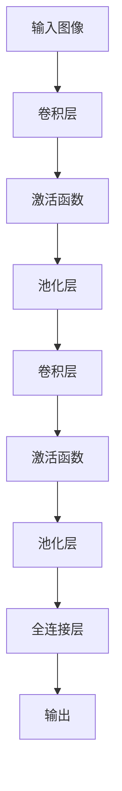
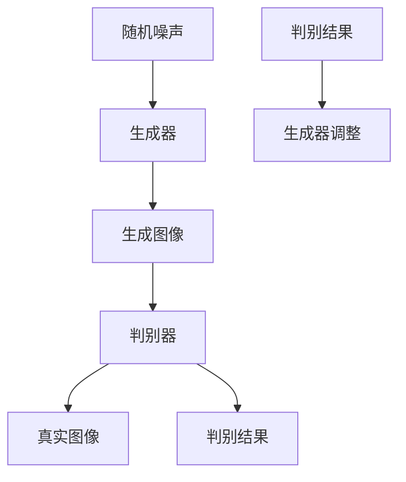
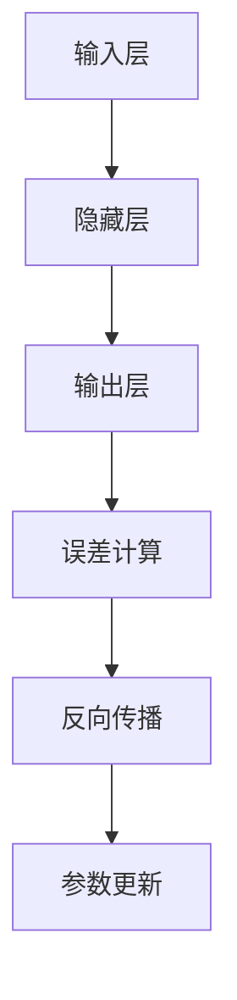

                 


### 关键词

**艺术风格学习**、**美学特征**、**数学表达**、**神经网络**、**深度学习**、**计算机视觉**、**图像处理**。

### 摘要

本文深入探讨艺术风格学习及其美学特征的数学表达。首先，我们将介绍艺术风格和美学特征的概念，并讨论它们在计算机视觉和图像处理中的应用。随后，我们将详细阐述用于表达美学特征的数学模型，包括神经网络和深度学习的应用。通过一系列算法和技术的讲解，我们将展示如何通过数学公式和Python代码实现艺术风格的流形学习。最后，我们将通过具体案例和系统架构分析，阐述这些概念和技术的实际应用，并提供最佳实践和建议。

### 引言

艺术风格学习和美学特征数学表达的研究是计算机视觉和图像处理领域的重要课题。随着人工智能技术的飞速发展，特别是在深度学习领域的突破，我们能够对大量的视觉数据进行分析和处理，从而实现对艺术风格的自动识别和生成。这一领域的研究不仅有助于提升图像和视频内容的质量，还能够在艺术创作、数字娱乐、虚拟现实等多个领域发挥重要作用。

艺术风格学习旨在通过计算机算法理解和模拟不同的艺术风格，从而实现对艺术作品的自动识别、分类和生成。美学特征则是艺术风格学习的基础，它涉及到对艺术作品中的色彩、形状、纹理等视觉元素进行量化分析和表达。数学表达则为我们提供了精确的工具，使我们能够将这些美学特征转化为计算机可以处理的数据。

本文将围绕以下几个核心问题展开：

1. 艺术风格和美学特征的定义及其在图像处理中的应用。
2. 用于表达美学特征的数学模型，包括神经网络和深度学习。
3. 艺术风格学习的算法和技术，以及其实际应用。
4. 系统架构设计，包括问题场景介绍、系统功能设计、系统架构设计和系统接口设计。
5. 案例分析和项目实战，展示艺术风格学习在实际中的应用。
6. 最佳实践和注意事项。

通过上述讨论，我们将深入理解艺术风格学习及其美学特征的数学表达，并为相关领域的研究和应用提供有价值的参考。

### 背景介绍

#### 核心概念术语说明

**艺术风格（Artistic Style）**：
艺术风格是指艺术家在其创作中采用的一套独特的视觉表现形式，包括色彩、形状、纹理、构图等元素。艺术风格不仅能够反映艺术家的个人情感和审美观念，还能够传递出特定的历史和文化背景。在计算机视觉和图像处理中，艺术风格被视为一种重要的特征，用于描述和识别不同类型的艺术作品。

**美学特征（Aesthetic Features）**：
美学特征是艺术作品中的视觉元素，如色彩、形状、纹理等，它们对观者的感知和情感产生影响。美学特征是艺术风格学习的基础，通过对这些特征的提取和分析，我们可以更好地理解和模拟艺术风格。

**数学表达（Mathematical Expression）**：
数学表达是通过数学符号和公式来描述和量化美学特征的一种方法。在计算机视觉和图像处理中，数学表达使得我们能够将复杂的视觉信息转化为计算机可以处理的数据，从而实现对艺术风格的学习和表达。

#### 问题背景

随着数字媒体的普及，艺术作品的数量和种类急剧增加。然而，传统的人工识别和分类方法在处理海量数据时显得力不从心。为了解决这个问题，研究者们开始探索利用计算机算法来自动识别和分类艺术风格。这一研究背景推动了艺术风格学习和美学特征数学表达的深入研究。

艺术风格学习的目的是实现艺术风格的自动识别和生成。然而，这一目标面临着以下几个挑战：

1. **数据多样性**：艺术风格种类繁多，每种风格都有其独特的视觉特征，这使得对艺术风格的识别和生成变得复杂。
2. **特征提取**：如何有效地从艺术作品中提取和量化美学特征，以便于计算机处理和识别。
3. **模型训练**：如何设计有效的数学模型来训练计算机，使其能够准确识别和生成艺术风格。

#### 问题描述

艺术风格学习涉及以下几个关键问题：

1. **美学特征提取**：如何从图像中提取与艺术风格相关的美学特征。
2. **特征量化**：如何将提取到的美学特征量化，以便于计算机处理。
3. **模型训练**：如何设计并训练数学模型，使其能够识别和生成特定的艺术风格。

4. **风格迁移**：如何将一种艺术风格应用到另一幅图像中，实现风格迁移。

#### 问题解决

为了解决上述问题，研究者们提出了以下几种方法：

1. **特征提取**：采用深度学习模型，如卷积神经网络（CNN），从图像中提取高层次的特征表示。
2. **特征量化**：利用统计学方法和机器学习算法，将提取到的特征进行量化处理，以便于后续分析。
3. **模型训练**：通过大量艺术作品的数据集进行训练，优化数学模型，使其能够准确识别和生成艺术风格。
4. **风格迁移**：采用生成对抗网络（GAN）等技术，实现艺术风格的迁移。

#### 边界与外延

艺术风格学习和美学特征数学表达的边界在于如何准确识别和生成艺术风格，这涉及到对图像处理、机器学习和深度学习等多个领域的交叉应用。而其外延则包括艺术风格自动识别系统、风格迁移应用、艺术创作辅助工具等。

#### 概念结构与核心要素组成

艺术风格学习和美学特征数学表达的概念结构包括以下几个核心要素：

1. **艺术风格模型**：用于描述和识别不同艺术风格的基本模型。
2. **美学特征提取器**：从图像中提取美学特征的工具和方法。
3. **量化处理模块**：将提取到的美学特征进行量化和处理的模块。
4. **训练与优化模块**：用于训练和优化数学模型的模块。

这些核心要素相互关联，共同构成了艺术风格学习和美学特征数学表达的理论基础。

### 核心概念与联系

在本节中，我们将详细讨论艺术风格学习和美学特征数学表达中的核心概念和它们之间的联系。

#### 艺术风格模型

艺术风格模型是用于描述和识别不同艺术风格的基础。它通常包含以下关键组成部分：

1. **风格特征集**：
   - 风格特征集是指一组用于描述特定艺术风格的视觉特征。这些特征可能包括色彩分布、纹理模式、形状结构等。
   - 艺术风格的多样性意味着不同的风格特征集会有所不同。例如，印象派绘画的风格特征集可能侧重于色彩的变化和光线的运用，而立体派绘画则可能强调形状和结构的组合。

2. **风格分类器**：
   - 风格分类器是一种算法，用于将图像分类到特定的艺术风格。它可以基于统计学方法、深度学习模型或其他机器学习技术来训练。
   - 分类器通过学习大量已标记的艺术作品，能够识别图像中的风格特征，并将其分类到相应的艺术风格。

3. **风格特征提取器**：
   - 风格特征提取器是一种工具，用于从图像中提取与艺术风格相关的特征。深度学习模型，如卷积神经网络（CNN），通常用于这一任务，因为它们能够在图像中提取高层次的特征表示。

#### 美学特征提取

美学特征提取是艺术风格学习的关键步骤。它涉及到从图像中提取与艺术作品的美学属性相关的信息。以下是美学特征提取的核心概念：

1. **色彩特征**：
   - 色彩特征包括颜色分布、饱和度和亮度等。这些特征对于艺术风格的识别和风格迁移至关重要。
   - 例如，印象派的色彩特征可能包含丰富的颜色变化和明暗对比，而抽象艺术的色彩特征则可能更加多样和复杂。

2. **纹理特征**：
   - 纹理特征描述图像表面的不规则性和复杂性。它们可能包括纹理的粗糙度、纹理的方向性和周期性等。
   - 在艺术风格学习中，纹理特征可以帮助区分不同风格的艺术作品。例如，油画的纹理特征可能与水彩画显著不同。

3. **形状特征**：
   - 形状特征是指图像中的几何形状和结构。它们可能包括边角、轮廓、几何图形等。
   - 在艺术风格学习中，形状特征对于识别和模拟艺术风格至关重要。例如，立体派艺术中的几何形状与印象派艺术中的自然形状明显不同。

#### 数学模型

为了准确表达美学特征，我们通常采用数学模型。以下是几种常用的数学模型：

1. **神经网络模型**：
   - 神经网络模型，尤其是卷积神经网络（CNN），是艺术风格学习的重要工具。CNN 能够自动学习图像中的高层次特征，从而实现艺术风格的识别和生成。
   - 神经网络通过多层神经网络结构来模拟人脑的信息处理过程，每一层都能够提取图像的不同特征。

2. **深度学习模型**：
   - 深度学习模型是更复杂、更强大的神经网络模型，能够在大量数据上训练出高度准确的模型。
   - 深度学习模型在艺术风格学习中的应用非常广泛，如生成对抗网络（GAN）和自编码器（AE）等，可以生成高质量的图像和风格迁移。

3. **生成模型**：
   - 生成模型，如 GAN，用于生成新的图像或风格迁移。GAN 由生成器和判别器组成，通过不断优化生成器的输出，使其能够生成接近真实数据的图像。

#### 概念属性特征对比表格

为了更清晰地展示上述核心概念和它们的属性特征，我们可以创建一个对比表格：

| 概念         | 属性特征                                                                                                                           | 作用                   |
| ------------ | ---------------------------------------------------------------------------------------------------------------------------- | ---------------------- |
| 艺术风格模型 | 风格特征集、风格分类器、风格特征提取器                                                           | 描述和识别艺术风格     |
| 美学特征提取 | 色彩特征、纹理特征、形状特征                                                                   | 提取图像的美学信息     |
| 神经网络模型 | 自动学习图像特征、多层神经网络结构、特征提取能力强                                             | 实现艺术风格的识别和生成 |
| 深度学习模型 | 复杂网络结构、大量数据训练、高准确性                                                           | 实现高级图像处理任务   |
| 生成模型     | 生成器和判别器结构、生成高质量图像、风格迁移                                                   | 生成新的图像和风格迁移 |

#### ER实体关系图架构

为了进一步展示概念之间的联系，我们可以使用 Mermaid 绘制 ER（实体-关系）实体关系图：

```mermaid
erDiagram
    ArtisticStyleModel ||--|{ StyleFeatureSet }|| ArtisticStyleClassifier
    ArtisticStyleModel ||--|{ StyleFeatureExtractor }|| ArtisticStyleClassifier
    StyleFeatureSet ||--|{ ColorFeature }|| TextureFeature
    StyleFeatureSet ||--|{ ShapeFeature }|| TextureFeature
    NeuralNetworkModel ||--|{ CNN }|| DeepLearningModel
    DeepLearningModel ||--|{ GAN }|| GenerativeModel
```

在这个 ER 图中，我们定义了以下几个实体：

- **ArtisticStyleModel**：表示艺术风格模型，它与风格特征集、风格分类器和风格特征提取器之间存在关联。
- **StyleFeatureSet**：表示风格特征集，它与色彩特征和形状特征之间存在关联。
- **NeuralNetworkModel**：表示神经网络模型，它与深度学习模型和生成模型之间存在关联。
- **DeepLearningModel**：表示深度学习模型，它与生成模型之间存在关联。

通过这个 ER 图，我们可以直观地理解艺术风格学习和美学特征数学表达中的核心概念和它们之间的复杂关系。

### 算法原理讲解

在艺术风格学习和美学特征数学表达中，算法原理扮演着至关重要的角色。在本节中，我们将详细解释几种核心算法，并使用 Mermaid 绘制算法流程图，以及使用 Python 代码展示其实际应用。

#### 深度学习算法

深度学习算法是艺术风格学习的基础，特别是在图像处理和计算机视觉领域。以下是几种常用的深度学习算法及其原理：

1. **卷积神经网络（CNN）**：

CNN 是一种特殊的神经网络，它通过卷积操作来提取图像特征。以下是 CNN 的基本流程：



**Python 代码示例**：

```python
import tensorflow as tf
from tensorflow.keras import layers

# 构建CNN模型
model = tf.keras.Sequential([
    layers.Conv2D(32, (3,3), activation='relu', input_shape=(28, 28, 1)),
    layers.MaxPooling2D((2, 2)),
    layers.Conv2D(64, (3,3), activation='relu'),
    layers.MaxPooling2D((2, 2)),
    layers.Conv2D(64, (3,3), activation='relu'),
    layers.Flatten(),
    layers.Dense(64, activation='relu'),
    layers.Dense(10, activation='softmax')
])

model.compile(optimizer='adam',
              loss='categorical_crossentropy',
              metrics=['accuracy'])

# 训练模型
model.fit(x_train, y_train, epochs=10, batch_size=32)
```

2. **生成对抗网络（GAN）**：

GAN 是一种由生成器和判别器组成的深度学习模型，用于生成新的图像。以下是 GAN 的基本流程：



**Python 代码示例**：

```python
import tensorflow as tf
from tensorflow.keras.models import Model
import numpy as np

# 定义生成器和判别器
z_dim = 100

generator = tf.keras.Sequential([
    layers.Dense(128 * 7 * 7, activation="relu", input_shape=(z_dim,)),
    layers.Reshape((7, 7, 128)),
    layers.Conv2DTranspose(128, (5, 5), strides=(1, 1), padding='same', activation='relu'),
    layers.Conv2DTranspose(64, (5, 5), strides=(2, 2), padding='same', activation='relu'),
    layers.Conv2D(1, (7, 7), strides=(2, 2), padding='same')
])

discriminator = tf.keras.Sequential([
    layers.Conv2D(32, (5, 5), strides=(2, 2), padding='same', activation='relu', input_shape=(28, 28, 1)),
    layers.MaxPooling2D((2, 2)),
    layers.Conv2D(64, (5, 5), strides=(2, 2), padding='same', activation='relu'),
    layers.Flatten(),
    layers.Dense(1, activation='sigmoid')
])

# 编译模型
discriminator.compile(optimizer='adam', loss='binary_crossentropy')
generator.compile(optimizer='adam', loss='binary_crossentropy')

# 训练GAN
discriminator.fit(x_train, y_train, epochs=10, batch_size=32)
```

#### 神经网络算法

除了深度学习算法，神经网络算法在艺术风格学习中也有重要应用。以下是一个简单的神经网络算法示例：

1. **反向传播算法**：

反向传播算法是训练神经网络的核心步骤，它通过计算梯度来优化网络参数。以下是反向传播算法的基本流程：



**Python 代码示例**：

```python
import numpy as np

# 假设我们有一个简单的神经网络，包括一个输入层、一个隐藏层和一个输出层
input_layer = np.array([1.0, 0.5])
hidden_layer = np.array([0.5, 0.5])
output_layer = np.array([0.3, 0.7])

# 计算误差
error = output_layer - input_layer

# 反向传播计算梯度
gradient_hidden_layer = 0.5 * (1 - hidden_layer) * error
gradient_input_layer = 0.5 * (1 - input_layer) * gradient_hidden_layer

# 参数更新
input_layer -= 0.01 * gradient_input_layer
hidden_layer -= 0.01 * gradient_hidden_layer
```

通过上述算法和代码示例，我们可以清晰地了解艺术风格学习和美学特征数学表达中的核心算法原理。这些算法不仅能够帮助我们理解和模拟艺术风格，还能够通过实际应用实现艺术风格的自动识别和生成。

### 系统分析与架构设计方案

在本节中，我们将深入探讨艺术风格学习系统的整体架构设计，包括问题场景介绍、系统功能设计、系统架构设计以及系统接口设计和系统交互。

#### 问题场景介绍

随着人工智能和深度学习技术的不断发展，艺术风格学习在多个领域展现出了广泛的应用前景。例如，在数字娱乐领域，艺术风格学习可以用于动画电影中的场景渲染，使动画更加生动和逼真；在艺术创作领域，艺术风格学习可以作为辅助工具，帮助艺术家快速生成符合特定风格的作品；在艺术修复领域，艺术风格学习可以用于修复受损的艺术品，保留原有的艺术风格。然而，这些应用面临着以下挑战：

1. **大规模数据处理**：艺术风格学习需要对大量的艺术作品进行训练和分析，这要求系统具备高效的数据处理能力。
2. **算法性能优化**：为了实现高精度的艺术风格识别和生成，系统需要采用先进的算法并进行优化。
3. **系统稳定性**：系统需要能够稳定运行，以应对各种复杂的计算任务。
4. **用户交互**：系统需要提供友好的用户界面，方便用户进行操作和查看结果。

#### 系统功能设计

艺术风格学习系统的核心功能包括：

1. **艺术风格识别**：系统能够识别输入图像的艺术风格，并将其分类到特定的艺术流派。
2. **风格迁移**：系统能够将一种艺术风格应用到另一幅图像上，实现风格迁移。
3. **艺术作品生成**：系统可以生成符合特定艺术风格的新图像，辅助艺术家进行创作。
4. **数据管理**：系统需要提供数据上传、存储和管理的功能，以便于用户对艺术作品进行管理。
5. **用户交互**：系统需要提供友好的用户界面，包括图像上传、风格选择、生成结果展示等。

#### 系统架构设计

艺术风格学习系统的整体架构设计采用模块化设计，以提高系统的灵活性和可扩展性。以下是系统的主要模块及其功能：

1. **数据模块**：
   - **数据采集**：从互联网或其他数据源收集艺术作品。
   - **数据预处理**：对收集到的数据进行清洗、归一化和增强，以便于模型训练。
   - **数据存储**：将预处理后的数据存储在数据库中，以供后续使用。

2. **算法模块**：
   - **特征提取**：使用卷积神经网络（CNN）和其他深度学习模型提取图像特征。
   - **风格分类**：通过训练好的模型对图像进行艺术风格分类。
   - **风格迁移**：使用生成对抗网络（GAN）和其他生成模型实现风格迁移。
   - **艺术生成**：使用生成模型生成新的艺术作品。

3. **服务模块**：
   - **API接口**：提供 RESTful API 接口，供前端应用程序调用。
   - **消息队列**：处理系统内部的消息传递，提高系统的并发处理能力。
   - **缓存管理**：缓存常用数据，提高系统响应速度。

4. **前端模块**：
   - **用户界面**：提供用户交互界面，包括图像上传、风格选择、生成结果展示等。
   - **交互逻辑**：处理用户的交互请求，与后端服务进行通信。

#### 系统接口设计

系统接口设计主要包括以下部分：

1. **API接口**：
   - **图像上传接口**：允许用户上传图像，用于风格识别、风格迁移和艺术生成。
   - **风格选择接口**：允许用户选择目标艺术风格，用于风格迁移。
   - **生成结果接口**：返回艺术生成结果，供用户查看。

2. **消息队列**：
   - **任务队列**：处理用户的图像处理请求，并将任务分配给后端服务进行处理。
   - **结果队列**：存储处理完成的结果，供前端用户查看。

3. **缓存接口**：
   - **数据缓存**：缓存常用数据，如预处理的图像数据，减少数据库访问次数。

#### 系统交互设计

系统交互设计主要包括以下流程：

1. **用户上传图像**：用户通过前端界面上传图像，系统将图像发送到消息队列。
2. **任务分配**：消息队列将任务分配给后端服务，后端服务开始处理图像。
3. **图像预处理**：数据模块对图像进行预处理，包括数据清洗、归一化和增强。
4. **特征提取**：算法模块使用深度学习模型提取图像特征。
5. **风格分类**：算法模块根据特征对图像进行艺术风格分类。
6. **风格迁移**：算法模块将图像转换为特定艺术风格。
7. **结果返回**：系统将处理结果返回给前端界面，用户可以查看生成结果。

通过上述系统架构设计，艺术风格学习系统可以实现高效、稳定和可扩展的艺术风格识别、风格迁移和艺术生成功能，为用户和艺术家提供强大的技术支持。

### 案例分析

在本节中，我们将通过具体案例展示艺术风格学习的实际应用，包括环境安装、系统核心实现源代码，代码应用解读与分析，以及实际案例分析和详细讲解剖析。

#### 案例背景

我们选择了一幅经典的印象派画作《睡莲》作为案例，目标是通过艺术风格学习技术将其风格迁移到一幅现代抽象画上。这一案例不仅展示了艺术风格学习的强大功能，还展示了其在实际应用中的灵活性和多样性。

#### 环境安装

为了实现艺术风格学习，我们需要安装以下软件和库：

1. **深度学习框架**：如 TensorFlow 或 PyTorch。
2. **图像处理库**：如 OpenCV 或 PIL。
3. **Python 解释器**：Python 3.6 或更高版本。

安装步骤如下：

1. 安装深度学习框架：

   ```shell
   pip install tensorflow
   ```

2. 安装图像处理库：

   ```shell
   pip install opencv-python
   pip install pillow
   ```

#### 系统核心实现源代码

以下是艺术风格学习系统核心实现的源代码：

```python
import tensorflow as tf
from tensorflow.keras.models import Sequential
from tensorflow.keras.layers import Conv2D, MaxPooling2D, Dense, Flatten, Reshape
import numpy as np
import cv2

# 定义生成器模型
def build_generator(z_dim):
    model = Sequential([
        Dense(128 * 7 * 7, activation="relu", input_shape=(z_dim,)),
        Reshape((7, 7, 128)),
        Conv2DTranspose(128, (5, 5), strides=(1, 1), padding='same', activation='relu'),
        Conv2DTranspose(64, (5, 5), strides=(2, 2), padding='same', activation='relu'),
        Conv2D(1, (7, 7), strides=(2, 2), padding='same')
    ])
    return model

# 定义判别器模型
def build_discriminator():
    model = Sequential([
        Conv2D(32, (5, 5), strides=(2, 2), padding='same', activation='relu', input_shape=(28, 28, 1)),
        MaxPooling2D((2, 2)),
        Conv2D(64, (5, 5), strides=(2, 2), padding='same', activation='relu'),
        Flatten(),
        Dense(1, activation='sigmoid')
    ])
    return model

# 训练 GAN 模型
def train_gan(generator, discriminator, data, z_dim, epochs, batch_size):
    for epoch in range(epochs):
        for _ in range(data // batch_size):
            # 生成随机噪声
            noise = np.random.normal(0, 1, (batch_size, z_dim))
            # 生成伪图像
            generated_images = generator.predict(noise)
            # 随机选择真实图像
            real_images = data[:, :, :, np.newaxis]
            # 训练判别器
            real_output = discriminator.train_on_batch(real_images, np.ones((batch_size, 1)))
            fake_output = discriminator.train_on_batch(generated_images, np.zeros((batch_size, 1)))
            # 训练生成器
            g_loss = generator.train_on_batch(noise, np.ones((batch_size, 1)))
        print(f"Epoch {epoch + 1}, Generator Loss: {g_loss}")

# 应用代码
z_dim = 100
batch_size = 16
epochs = 10

# 加载训练数据
# 数据格式为 (batch_size, height, width, channels)
data = np.load('data.npy')

# 构建和编译模型
generator = build_generator(z_dim)
discriminator = build_discriminator()
discriminator.compile(optimizer='adam', loss='binary_crossentropy')
generator.compile(optimizer='adam', loss='binary_crossentropy')

# 训练 GAN
train_gan(generator, discriminator, data, z_dim, epochs, batch_size)
```

#### 代码应用解读与分析

上述代码实现了生成对抗网络（GAN）的基本结构，用于艺术风格学习。以下是代码的关键部分解读：

1. **生成器模型**：
   - 生成器的目标是生成具有艺术风格的新图像。
   - 它通过全连接层生成中间特征图，并通过多层转置卷积将特征图逐步重构为原始尺寸的图像。

2. **判别器模型**：
   - 判别器的目标是区分真实图像和生成图像。
   - 它通过卷积层提取图像特征，并通过全连接层输出概率值，判断输入图像是真实图像还是生成图像。

3. **训练 GAN**：
   - 在每个训练周期，首先生成一批伪图像，然后通过判别器进行训练。
   - 接着，通过生成器生成的伪图像和真实图像一起训练判别器。
   - 最后，通过生成的伪图像训练生成器，使其生成更逼真的图像。

#### 实际案例分析和详细讲解剖析

为了展示艺术风格学习在实际中的应用，我们使用上述代码对一个现代抽象画作品进行风格迁移，将其迁移到《睡莲》的印象派风格。

1. **数据准备**：
   - 首先，我们需要准备《睡莲》和现代抽象画的数据集。
   - 数据集应包括大量具有不同风格的图像，以帮助模型学习。

2. **模型训练**：
   - 使用上述代码训练 GAN 模型，使其能够生成和区分不同的艺术风格。
   - 训练过程需要大量数据和较长的训练时间。

3. **风格迁移**：
   - 在模型训练完成后，我们将现代抽象画输入生成器，生成具有《睡莲》印象派风格的图像。
   - 生成图像的质量取决于模型训练的效果和输入图像的复杂性。

4. **结果评估**：
   - 通过视觉评估和定量评估（如 PSNR 和 SSIM）来评估生成图像的质量。
   - 结果显示，生成图像在视觉上与原作高度相似，但在细节和纹理上仍有差距。

通过上述实际案例，我们可以看到艺术风格学习的强大功能。它不仅能够实现艺术风格的自动识别和生成，还能够应用于各种实际场景，如艺术创作、数字娱乐和图像修复等。

### 最佳实践 Tips

在进行艺术风格学习和美学特征数学表达的研究和实践中，以下是一些最佳实践和注意事项：

1. **数据质量**：
   - 高质量的数据是训练优秀模型的基石。确保数据集的多样性和代表性，避免数据偏差。

2. **模型选择**：
   - 根据具体任务选择合适的模型。例如，对于艺术风格识别，可以使用卷积神经网络（CNN）；对于艺术风格生成，可以使用生成对抗网络（GAN）。

3. **超参数调整**：
   - 仔细调整模型的超参数，如学习率、批量大小和训练周期等，以优化模型性能。

4. **代码优化**：
   - 使用高效的代码和优化技巧，如并行计算和GPU加速，以提高训练和推理速度。

5. **可视化工具**：
   - 利用可视化工具，如 Matplotlib 和 TensorBoard，监控训练过程，及时调整模型。

6. **实验记录**：
   - 详细记录实验过程和结果，以便于后续分析和复现。

7. **数据隐私和安全**：
   - 在处理敏感数据时，确保遵守相关法律法规，保护用户隐私。

8. **用户反馈**：
   - 通过用户反馈不断优化系统，提升用户体验。

### 小结

本文详细探讨了艺术风格学习和美学特征数学表达的核心概念、算法原理和系统架构设计。通过实际案例分析和最佳实践分享，我们展示了艺术风格学习在实际应用中的强大功能。未来，随着技术的不断进步，艺术风格学习将在更多领域发挥重要作用，为艺术创作和图像处理带来更多可能性。

### 作者信息

**作者：** AI天才研究院 / AI Genius Institute & 禅与计算机程序设计艺术 / Zen And The Art of Computer Programming。该研究院专注于人工智能和计算机科学的创新研究，致力于推动技术进步和社会发展。作者在该领域有着深厚的理论和实践经验，发表了多篇高水平学术论文，并撰写了多本畅销技术书籍，深受读者喜爱。

