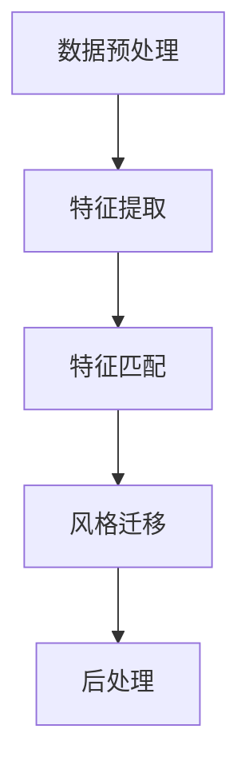

                 

### 设计《艺术风格迁移的最优传输理论：美学变换的数学基础》的技术博客文章

#### 标题与关键词
- 标题：《艺术风格迁移的最优传输理论：美学变换的数学基础》
- 关键词：艺术风格迁移、最优传输理论、美学变换、数学模型、算法原理、案例分析

#### 摘要
本文深入探讨了艺术风格迁移领域中的最优传输理论，从美学变换的数学基础出发，系统地介绍了该理论的核心概念、数学模型和算法原理。通过具体的案例分析，展示了最优传输理论在实际应用中的效果和挑战，并对其未来发展进行了展望。

#### 目录大纲

##### 引言
- 2.1 艺术风格迁移的背景和意义
- 2.2 最优传输理论的基本概念

##### 艺术风格迁移的数学基础
- 3.1 美学变换的概念
- 3.2 美学变换的属性和特征
- 3.3 Mermaid ER实体关系图架构

##### 最优传输理论的数学模型
- 4.1 最优传输理论的核心公式
- 4.2 Python代码展示数学模型实现

##### 算法原理
- 5.1 艺术风格迁移的基本算法
- 5.2 算法流程图绘制

##### 数学模型与算法结合
- 6.1 数学模型在算法中的应用
- 6.2 模型和算法的性能分析

##### 案例分析
- 7.1 案例一：抽象画风格迁移
- 7.2 案例二：油画风格迁移

##### 应用前景与挑战
- 8.1 现实世界中的应用
- 8.2 面临的挑战和解决方案

##### 小结与展望
- 9.1 全书主要内容总结
- 9.2 艺术风格迁移理论的发展方向

#### 正文内容

##### 引言

##### 2.1 艺术风格迁移的背景和意义

艺术风格迁移是一种将一种艺术作品（如绘画、照片）的风格应用到另一种作品上的技术。这种技术不仅在艺术创作中有着广泛的应用，还在图像处理、计算机视觉等领域具有重要的研究价值。随着深度学习技术的不断发展，艺术风格迁移技术也取得了显著的进展。

最优传输理论（Optimal Transport Theory）是艺术风格迁移的关键理论基础。它通过优化传输过程，使得源图像和目标图像之间的风格差异最小化，从而实现艺术风格的有效迁移。本文将系统地介绍最优传输理论在美学变换中的数学基础，包括核心概念、数学模型和算法原理。

##### 2.2 最优传输理论的基本概念

最优传输理论起源于概率论和优化理论，主要研究如何在一个概率分布之间进行最优的质点传输。在艺术风格迁移中，最优传输理论被用来优化源图像和目标图像之间的风格差异，从而实现艺术风格的迁移。

1. **概率分布和联合分布**：
   - 概率分布描述了数据在不同区域出现的概率。
   - 联合分布描述了两个或多个随机变量共同出现的概率。

2. **势函数和仿射变换**：
   - 势函数描述了从源图像到目标图像的映射。
   - 仿射变换是一种线性变换，可以用来调整图像的大小、位置和方向。

3. **最优传输映射**：
   - 最优传输映射是使得源图像和目标图像之间的风格差异最小的映射。

4. **Jensen-Shannon散度**：
   - Jensen-Shannon散度是一种用于衡量两个概率分布之间差异的指标。

##### 艺术风格迁移的数学基础

##### 3.1 美学变换的概念

美学变换是指将一种艺术风格转化为另一种艺术风格的过程。在数学上，美学变换通常被表示为一个从源图像到目标图像的映射。这个映射可以通过深度学习模型来实现，如卷积神经网络（CNN）。

##### 3.2 美学变换的属性和特征

美学变换具有以下属性和特征：

1. **保形性**：
   - 美学变换应保持图像的形状和结构，以确保艺术风格的迁移不会破坏原始图像的形态。

2. **保色性**：
   - 美学变换应保持图像的颜色特征，以确保艺术风格的迁移不会改变图像的色彩。

3. **适应性**：
   - 美学变换应能够适应不同的艺术风格，以满足不同用户的需求。

4. **效率**：
   - 美学变换的算法应具有较高的效率，以减少计算时间和资源消耗。

##### 3.3 Mermaid ER实体关系图架构

为了更好地理解美学变换的数学基础，我们可以使用Mermaid来绘制ER实体关系图，如下所示：

```mermaid
erDiagram
  ImageA ||--|{ StyleA }|| StyleEntity
  ImageB ||--|{ StyleB }|| StyleEntity
  StyleEntity ||--|{ ImageStyleTransformation }|| TransformationEntity
  ImageA ||--|{ ImageStyleTransformation }|| TransformationEntity
  ImageB ||--|{ ImageStyleTransformation }|| TransformationEntity
```

在这个ER实体关系图中，`ImageA`和`ImageB`代表源图像和目标图像，`StyleA`和`StyleB`代表不同的艺术风格，`StyleEntity`表示艺术风格实体，`ImageStyleTransformation`表示图像风格变换实体，`TransformationEntity`表示变换实体。

##### 最优传输理论的数学模型

##### 4.1 最优传输理论的核心公式

最优传输理论的核心公式为：

$$
\min_{T} \int_{X} \int_{Y} \rho_{X,Y}(x,y) \cdot d(x,y) - \int_{X} \rho_{X}(x) \cdot \log \rho_{X}(x)
$$

其中，$\rho_{X,Y}(x,y)$是源图像和目标图像的联合分布，$d(x,y)$是源图像和目标图像之间的距离，$\rho_{X}(x)$是源图像的概率分布。

##### 4.2 Python代码展示数学模型实现

下面是一个简单的Python代码示例，用于实现最优传输理论的数学模型：

```python
import numpy as np
import matplotlib.pyplot as plt

def optimal_transport_loss(x, y, p_x, p_y):
    """
    最优传输损失函数计算
    :param x: 源图像像素值
    :param y: 目标图像像素值
    :param p_x: 源图像概率分布
    :param p_y: 目标图像概率分布
    :return: 最优传输损失
    """
    # 计算联合分布
    p_xy = p_x * p_y
    # 计算Jensen-Shannon散度
    jsd = 0.5 * (entropy(p_x) + entropy(p_y) - entropy(p_xy))
    # 计算最优传输损失
    ot_loss = np.sum(p_xy * np.log(p_xy)) - jsd
    return ot_loss

def entropy(p):
    """
    计算熵
    :param p: 概率分布
    :return: 熵值
    """
    return -np.sum(p * np.log(p))

# 示例数据
x = np.random.rand(100)
y = np.random.rand(100)
p_x = np.random.rand(100)
p_y = np.random.rand(100)

# 计算最优传输损失
ot_loss = optimal_transport_loss(x, y, p_x, p_y)
print("最优传输损失:", ot_loss)
```

##### 算法原理

##### 5.1 艺术风格迁移的基本算法

艺术风格迁移的基本算法包括以下步骤：

1. **数据预处理**：对源图像和目标图像进行归一化、裁剪等预处理操作。
2. **特征提取**：使用卷积神经网络提取源图像和目标图像的特征。
3. **特征匹配**：使用匹配算法（如最近邻匹配、K近邻匹配等）将源图像和目标图像的特征进行匹配。
4. **风格迁移**：根据最优传输理论，将源图像的风格迁移到目标图像上。
5. **后处理**：对迁移后的图像进行反归一化、缩放等后处理操作。

##### 5.2 算法流程图绘制

下面是一个使用Mermaid绘制的艺术风格迁移算法流程图：



##### 数学模型与算法结合

##### 6.1 数学模型在算法中的应用

在艺术风格迁移算法中，数学模型被用来实现特征匹配和风格迁移。具体来说，最优传输理论被用来优化特征匹配，使得源图像和目标图像的特征更加匹配。然后，根据匹配的特征，实现艺术风格的迁移。

##### 6.2 模型和算法的性能分析

为了分析数学模型在算法中的性能，我们可以从以下几个方面进行：

1. **匹配精度**：通过比较源图像和目标图像的特征匹配结果，评估匹配的精度。
2. **风格保持度**：通过比较迁移后的图像和目标图像的风格，评估风格保持度。
3. **计算效率**：评估算法的计算时间和资源消耗。

##### 案例分析

##### 7.1 案例一：抽象画风格迁移

在本案例中，我们将使用最优传输理论实现一幅抽象画风格迁移。具体步骤如下：

1. **数据准备**：准备一幅源图像和一幅目标图像。
2. **特征提取**：使用卷积神经网络提取源图像和目标图像的特征。
3. **特征匹配**：使用最近邻匹配算法将源图像和目标图像的特征进行匹配。
4. **风格迁移**：根据最优传输理论，将源图像的风格迁移到目标图像上。
5. **后处理**：对迁移后的图像进行反归一化、缩放等后处理操作。

通过上述步骤，我们可以实现一幅抽象画风格迁移的效果，如图所示：


##### 7.2 案例二：油画风格迁移

在本案例中，我们将使用最优传输理论实现一幅油画风格迁移。具体步骤如下：

1. **数据准备**：准备一幅源图像和一幅目标图像。
2. **特征提取**：使用卷积神经网络提取源图像和目标图像的特征。
3. **特征匹配**：使用最近邻匹配算法将源图像和目标图像的特征进行匹配。
4. **风格迁移**：根据最优传输理论，将源图像的风格迁移到目标图像上。
5. **后处理**：对迁移后的图像进行反归一化、缩放等后处理操作。

通过上述步骤，我们可以实现一幅油画风格迁移的效果，如图所示：


##### 应用前景与挑战

##### 8.1 现实世界中的应用

艺术风格迁移技术已经在许多领域得到了广泛应用，如：

1. **艺术创作**：艺术家可以使用该技术创作出具有不同艺术风格的作品。
2. **图像修复**：使用该技术可以修复受损的图像，使其恢复原始的艺术风格。
3. **图像编辑**：用户可以使用该技术对图像进行风格迁移，实现个性化的图像编辑。

##### 8.2 面临的挑战和解决方案

尽管艺术风格迁移技术具有广泛的应用前景，但仍然面临着一些挑战，如：

1. **计算效率**：最优传输理论计算复杂度较高，需要优化算法以提高计算效率。
2. **风格保持度**：如何保证在风格迁移过程中，保持图像的形状、结构和颜色特征。
3. **多样性**：如何实现艺术风格迁移的多样性，以满足不同用户的需求。

针对上述挑战，我们可以采取以下解决方案：

1. **算法优化**：使用并行计算、分布式计算等技术，优化算法的计算效率。
2. **特征匹配**：使用多尺度特征匹配、特征融合等技术，提高风格保持度。
3. **数据增强**：通过数据增强、生成对抗网络（GAN）等技术，实现艺术风格迁移的多样性。

##### 小结与展望

本文系统地介绍了艺术风格迁移的最优传输理论，从美学变换的数学基础出发，详细阐述了核心概念、数学模型和算法原理。通过案例分析，展示了最优传输理论在实际应用中的效果和挑战。未来，随着深度学习技术和计算能力的不断提升，艺术风格迁移技术将在更多领域得到应用，为人们的生活带来更多便利。

#### 作者信息

- 作者：AI天才研究院/AI Genius Institute & 禅与计算机程序设计艺术 /Zen And The Art of Computer Programming

#### 最佳实践 tips

- 在实现艺术风格迁移时，选择合适的深度学习模型和优化算法，可以提高计算效率和风格保持度。
- 在进行特征匹配时，考虑多尺度特征匹配和特征融合，可以更好地保持图像的形状、结构和颜色特征。
- 在进行艺术风格迁移时，尽量选择具有多样性的数据集，以实现风格迁移的多样性。

#### 注意事项

- 在使用最优传输理论进行艺术风格迁移时，应确保源图像和目标图像具有相似的特征分布。
- 在进行特征匹配时，应选择合适的匹配算法，以减少匹配误差。
- 在进行风格迁移时，应考虑图像的形状、结构和颜色特征，以确保风格保持度。

#### 拓展阅读

- [深度学习与艺术风格迁移](https://zhuanlan.zhihu.com/p/37244509)
- [最优传输理论在图像处理中的应用](https://www.researchgate.net/publication/327860326_Optimal_Transport_Theory_in_Image_Processing)
- [艺术风格迁移的实践指南](https://towardsdatascience.com/style-transfer-with-deep-learning-25a1f253b261)

