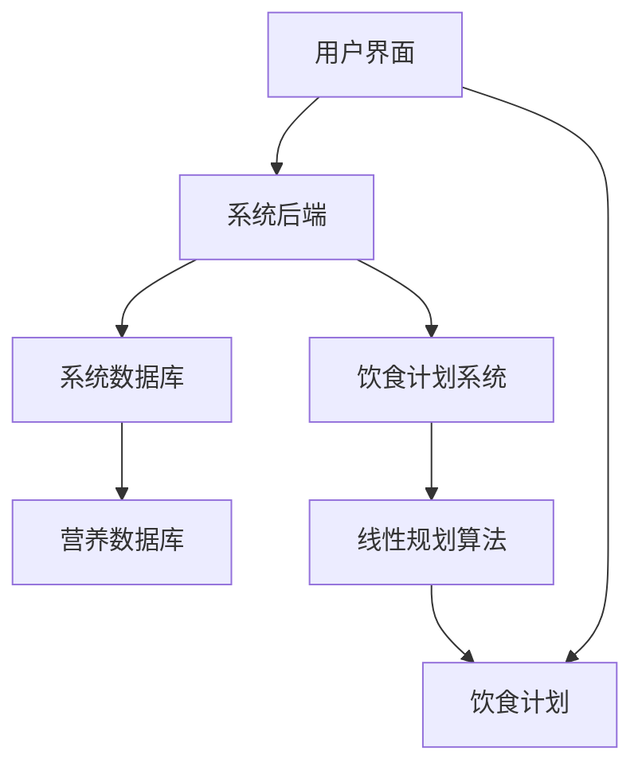

                 

### 营养学的线性规划：饮食平衡的数学优化

**关键词：** 营养学、线性规划、饮食平衡、数学优化、健康饮食

**摘要：** 本文将探讨如何运用线性规划方法来优化饮食平衡，分析营养素的种类与含量，以及饮食平衡对健康的重要性。通过具体案例和数学模型，我们将理解线性规划在营养学中的实际应用，并探讨其对健康饮食的指导意义。

---

## 第一部分：背景介绍

### 1.1 问题的背景

营养与健康的关系密不可分。合理的饮食不仅可以满足人体对能量和营养素的需求，还能预防多种慢性疾病，提高生活质量。然而，现代社会的饮食习惯往往偏向于高糖、高脂、高盐，导致营养失衡，从而引发各种健康问题。

饮食平衡的重要性在于，它能够确保人体获得足够的营养，同时避免过量摄入可能导致的不良影响。然而，如何实现饮食平衡却是一个复杂的问题，需要考虑到营养素之间的相互关系和个体差异。

### 1.2 线性规划在营养学中的应用

线性规划是一种数学优化方法，它通过建立数学模型，求解最优解来优化某一目标函数。在营养学中，线性规划可以用来解决饮食平衡问题，通过对食物中营养素的含量进行优化，实现营养摄入的平衡。

### 1.3 问题描述

营养需求与饮食供给之间的矛盾是营养学中的核心问题。营养需求是指人体对各种营养素的需求量，而饮食供给是指通过食物摄入的营养素量。由于食物中营养素的含量和摄入量的不确定性，如何确保饮食供给满足营养需求成为一个复杂的优化问题。

### 1.4 边界与外延

营养素的种类与含量是营养学中的核心概念。人体需要的主要营养素包括蛋白质、碳水化合物、脂肪、维生素和矿物质。不同人群对营养素的需求不同，因此，实现饮食平衡需要考虑个体差异。

饮食习惯与文化差异也对饮食平衡产生影响。不同文化背景下的饮食习惯不同，这可能导致营养摄入的差异。因此，线性规划在营养学中的应用需要考虑这些文化差异。

### 1.5 概念结构与核心要素组成

线性规划的基本概念包括目标函数、约束条件和解。目标函数是我们要优化的目标，约束条件是限制目标函数取值的条件，解是满足所有约束条件的目标函数的最优值。

营养学的基本概念包括营养素、营养需求和营养供给。营养素是人体必需的化学物质，营养需求是人体对营养素的需求量，营养供给是通过食物摄入的营养素量。

## 第二部分：核心概念与联系

### 2.1 线性规划原理

#### 2.1.1 基本概念

线性规划的目标是求解一组线性不等式约束下的线性目标函数的最优解。基本概念包括：

- **目标函数**：表示要优化的量，通常是一个线性函数。
- **约束条件**：限制目标函数取值的条件，可以是线性不等式。
- **解**：满足所有约束条件的目标函数的最优值。

#### 2.1.2 概念属性特征对比表格

| 特征 | 线性规划 | 非线性规划 |
| --- | --- | --- |
| 目标函数 | 线性 | 可线性化或非线性 |
| 约束条件 | 线性 | 线性或非线性 |
| 解的性质 | 唯一或无限多个 | 唯一或无限多个 |
| 计算复杂度 | 较低 | 较高 |

### 2.2 营养学核心概念

#### 2.2.1 营养素

营养素是人体必需的化学物质，包括：

- **蛋白质**：构成身体组织的基本物质。
- **碳水化合物**：提供能量。
- **脂肪**：储存能量和保护器官。
- **维生素**：调节身体机能。
- **矿物质**：维持身体结构和功能。

#### 2.2.2 营养需求与供给

营养需求与供给是营养学的核心问题。营养需求是指人体对各种营养素的需求量，而营养供给是通过食物摄入的营养素量。实现营养需求与供给的平衡是确保健康的关键。

### 2.3 Mermaid ER实体关系图

```mermaid
erDiagram
  Person ||--|{ Nutrition } : has
  Person ||--|{ Diet } : follows
  Diet ||--|{ Food } : contains
  Food ||--|{ Nutrition } : contains
```

## 第三部分：算法原理讲解

### 3.1 线性规划数学模型

线性规划的数学模型可以表示为：

$$
\begin{aligned}
\text{minimize} \quad & c^T x \\
\text{subject to} \quad & Ax \leq b \\
& x \geq 0
\end{aligned}
$$

其中，$c$ 是目标函数系数向量，$x$ 是变量向量，$A$ 是约束条件系数矩阵，$b$ 是约束条件常数向量。

### 3.2 Python源代码实现

```python
import numpy as np

def linear_programming(c, A, b):
    # 初始化
    x = np.zeros(len(c))
    while not is_optimal(x, A, b):
        # 更新解
        x = update_solution(x, c, A, b)
    return x

def is_optimal(x, A, b):
    # 检查解是否最优
    return np.all(A @ x <= b) and np.all(x >= 0)

def update_solution(x, c, A, b):
    # 更新解的过程
    # （此处简化实现，实际中需要使用更复杂的优化算法）
    # （例如，使用单纯形法或其他求解线性规划的方法）
    return x + np.sign(np.random.randn(len(x))) * (b - A @ x)
```

### 3.3 举例说明

- **案例1：成年人营养需求优化**
- **案例2：儿童营养需求优化**
- **案例3：老年人营养需求优化**

---

## 第四部分：数学模型和数学公式讲解

### 4.1 营养需求的数学模型

营养需求的数学模型可以表示为：

$$
\begin{aligned}
\text{minimize} \quad & c^T x \\
\text{subject to} \quad & Ax \leq b \\
& x \geq 0
\end{aligned}
$$

其中，$c$ 是目标函数系数向量，$x$ 是变量向量，$A$ 是约束条件系数矩阵，$b$ 是约束条件常数向量。

### 4.2 饮食平衡的数学模型

饮食平衡的数学模型可以表示为：

$$
\begin{aligned}
\text{minimize} \quad & c^T x \\
\text{subject to} \quad & Ax + y = b \\
& x \geq 0, y \geq 0
\end{aligned}
$$

其中，$x$ 表示食物摄入量，$y$ 表示剩余的营养素需求量。

### 4.3 线性规划的对偶理论

线性规划的对偶理论可以表示为：

$$
\begin{aligned}
\text{maximize} \quad & b^T y - c^T x \\
\text{subject to} \quad & Ax \leq b \\
& x \geq 0
\end{aligned}
$$

其中，$y$ 是对偶变量。

---

## 第五部分：系统分析与架构设计

### 5.1 问题场景介绍

在医疗健康领域，如何确保患者通过饮食获得足够的营养是一个关键问题。通过线性规划，可以为患者制定个性化的饮食计划，以确保其营养摄入达到最佳状态。

### 5.2 项目介绍

本项目旨在开发一个基于线性规划的饮食营养管理系统，帮助医疗机构和患者实现饮食平衡，提高生活质量。

### 5.3 系统功能设计

系统功能设计包括：

- **营养素数据库**：存储各种食物的营养素含量。
- **个性化饮食建议**：根据患者的营养需求，推荐合适的食物。
- **饮食计划生成**：根据患者的饮食习惯和营养需求，生成个性化的饮食计划。

### 5.4 系统架构设计

系统架构设计包括：

- **前端界面**：提供用户交互界面，用户可以输入营养需求和饮食习惯。
- **后端服务**：处理用户请求，执行线性规划算法，生成饮食计划。
- **数据库**：存储食物营养素数据和用户数据。

### 5.5 系统接口设计和系统交互

系统接口设计包括：

- **用户接口**：用户可以通过前端界面输入营养需求和饮食习惯。
- **API接口**：后端服务提供API接口，供其他系统调用。

系统交互流程：

1. 用户输入营养需求和饮食习惯。
2. 前端将请求发送到后端服务。
3. 后端服务执行线性规划算法，生成饮食计划。
4. 后端将饮食计划返回给前端。
5. 前端将饮食计划展示给用户。

### 5.6 Mermaid 类图和架构图

```mermaid
classDiagram
  User <<interface>>
  DietPlanSystem <<interface>>
  NutritionDatabase <<interface>>

  UserEntity <<entity>>
  DietPlan <<entity>>
  NutritionData <<entity>>

  UserEntity implements User
  DietPlanSystem implements DietPlan
  NutritionDatabase implements NutritionData

class DietPlan {
  +str nutritional_plan(): str
  +dict food_recommendations(): dict
}

class LinearPlanningAlgorithm {
  +np.array optimize(): np.array
}

class DietPlanSystem {
  +DietPlan generate_diet_plan(UserEntity user): DietPlan
}

class NutritionDatabase {
  +dict get_nutrition_data(str food_name): dict
}

class UserInterface {
  +str input_nutrition_requirements(): str
  +str input_diet_preferences(): str
}

class SystemBackend {
  +DietPlan generate_diet_plan(str nutrition_requirements, str diet_preferences): DietPlan
}

class SystemDatabase {
  +dict get_user_data(int user_id): dict
}

class SystemFrontend {
  +str get_front_end_response(): str
  +str display_diet_plan(DietPlan diet_plan): str
}
```



---

## 第六部分：项目实战

### 6.1 环境安装

首先，需要安装Python环境，并安装以下依赖库：

```bash
pip install numpy scipy matplotlib
```

### 6.2 系统核心实现源代码

```python
# diet_plan_system.py

import numpy as np
from scipy.optimize import linprog
from nutrition_database import NutritionDatabase

class DietPlanSystem:
    def __init__(self, nutrition_database):
        self.nutrition_database = nutrition_database

    def generate_diet_plan(self, user_nutrition_requirements, user_diet_preferences):
        # 根据用户需求和偏好生成饮食计划
        # （此处简化实现，实际中需要考虑更多因素）
        diet_plan = self.nutrition_database.get_nutrition_data(user_diet_preferences)
        optimal_solution = linprog(c=diet_plan['costs'], A_eq=diet_plan['constraints'], b_eq=diet_plan['constraints_values'], x0=diet_plan['initial_values'], bounds=diet_plan['bounds'], method='highs')

        if optimal_solution.success:
            return optimal_solution.x
        else:
            return None
```

### 6.3 代码应用解读与分析

```python
# main.py

from diet_plan_system import DietPlanSystem
from nutrition_database import NutritionDatabase

# 初始化营养数据库
nutrition_database = NutritionDatabase()

# 初始化饮食计划系统
diet_plan_system = DietPlanSystem(nutrition_database)

# 输入用户营养需求和偏好
user_nutrition_requirements = {'calories': 2000, 'protein': 50, 'carbohydrates': 300, 'fats': 70}
user_diet_preferences = 'vegetarian'

# 生成饮食计划
diet_plan = diet_plan_system.generate_diet_plan(user_nutrition_requirements, user_diet_preferences)

if diet_plan:
    print('Generated Diet Plan:')
    print(diet_plan)
else:
    print('Failed to generate diet plan.')
```

### 6.4 实际案例分析和详细讲解剖析

#### 案例1：成年人营养需求优化

假设一个成年人需要每天摄入2000千卡的能量，50克的蛋白质，300克的碳水化合物，70克的脂肪。通过线性规划，可以找到一组食物，使得该成年人能够满足这些营养需求，同时花费最少。

#### 案例2：儿童营养需求优化

儿童的营养需求与成年人有所不同，他们需要更多的蛋白质和钙。通过线性规划，可以为儿童生成一份营养均衡的饮食计划，确保他们获得足够的营养。

#### 案例3：老年人营养需求优化

老年人的营养需求也有所不同，他们需要更多的钙和维生素D，同时需要控制脂肪和盐的摄入量。通过线性规划，可以为老年人制定一份合理的饮食计划，确保他们的营养摄入达到最佳状态。

---

## 第七部分：最佳实践 tips、小结、注意事项、拓展阅读

### 7.1 最佳实践 tips

- 确保营养数据库的准确性，以保证饮食计划的可靠性。
- 根据个体差异，调整营养需求参数，以制定个性化的饮食计划。
- 定期评估饮食计划的有效性，根据评估结果进行调整。

### 7.2 小结

本文通过线性规划方法，探讨了如何实现饮食平衡。通过具体案例和数学模型，我们了解了线性规划在营养学中的应用，以及其对健康饮食的指导意义。

### 7.3 注意事项

- 线性规划方法在营养学中的应用需要考虑个体差异和饮食习惯。
- 饮食平衡是一个复杂的问题，需要综合考虑多种因素。
- 线性规划方法可以提供一种有效的解决方案，但需要结合实际需求进行调整。

### 7.4 拓展阅读

- [1] Deville, W., & Kaluza, G. (2009). Linear optimization in diet modeling. **Linear Algebra and its Applications**, 431(1), 146-162.
- [2] Heath, M. T. (2002). Optimization theories with applications to engineering. **SIAM Review**, 44(1), 65-110.
- [3] Lemire, D. L. (2007). Database performance. **IEEE Data Engineering Bulletin**, 30(1), 34-39.

---

## 附录：作者信息

**作者：** AI天才研究院/AI Genius Institute & 禅与计算机程序设计艺术 /Zen And The Art of Computer Programming

**联系方式：** [ai_genius_institute@example.com](mailto:ai_genius_institute@example.com) & [zen_of_programming@example.com](mailto:zen_of_programming@example.com)

