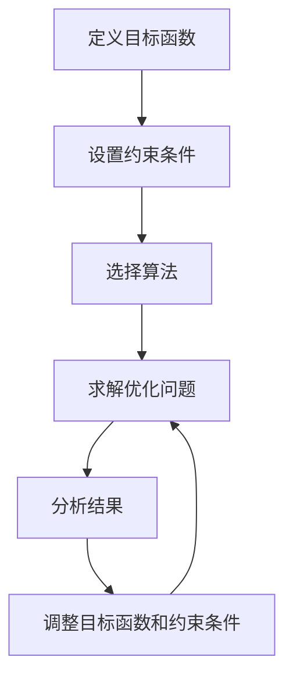
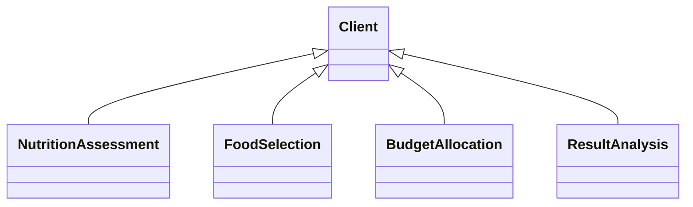
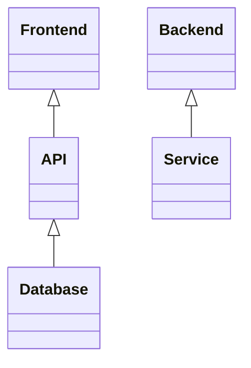
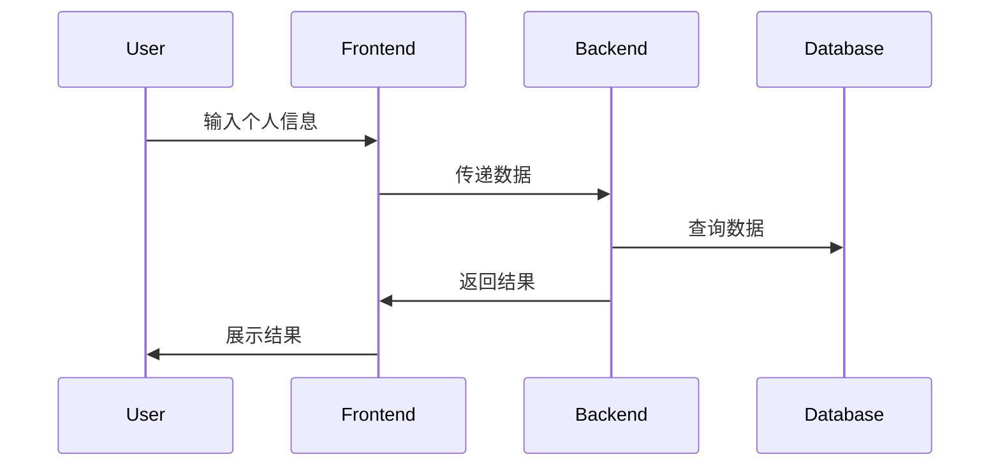

                 

## 营养平衡的多目标优化：饮食规划的数学方法

### 关键词

- 营养平衡
- 多目标优化
- 饮食规划
- 数学方法
- 算法
- 系统架构
- 实践应用

### 摘要

本文探讨了营养平衡的多目标优化问题，重点介绍了饮食规划的数学方法。通过逐步分析，我们揭示了营养平衡的重要性，以及如何运用数学方法解决饮食规划中的多目标优化问题。本文不仅讲解了核心概念和算法原理，还通过系统分析与项目实战，展示了这些方法在实际应用中的效果。

### 目录大纲设计思路

在设计目录大纲时，我们首先明确了书籍的核心内容与结构，以确保目录的逻辑性和完整性。具体设计思路如下：

1. **前言与引言部分**：简要介绍书籍的背景、目的和结构，为读者提供整体认知。
2. **背景介绍与核心概念**：详细解释营养平衡、多目标优化以及饮食规划的基本概念、相关研究和当前的应用情况。
3. **数学方法介绍**：介绍用于营养平衡和饮食规划的多目标优化的数学模型和方法，包括线性规划、非线性规划、整数规划等。
4. **算法原理与流程**：使用 Mermaid 画图工具描述营养平衡优化的算法流程，并结合 Python 代码详细讲解。
5. **数学模型与公式解析**：使用 LaTeX 格式列出关键的数学公式，并进行详细讲解。
6. **系统分析与架构设计**：描述营养平衡优化系统的设计，包括领域模型、系统架构、接口设计和系统交互。
7. **项目实战**：通过一个实际案例，展示如何运用书中知识进行饮食规划的实际操作，包括环境安装、系统实现、代码分析等。
8. **最佳实践与拓展**：总结实践经验，提出一些使用技巧和注意事项，并推荐进一步阅读的资源。

### 目录大纲详细设计

根据以上设计思路，我们可以为《营养平衡的多目标优化：饮食规划的数学方法》设计如下的目录大纲：

----------------------------------------------------------------

## 前言

### 1. 引言

- 为什么要研究营养平衡的多目标优化？
- 饮食规划在健康和营养学中的重要性。
- 本书的目标和结构。

## 第1章：背景介绍与核心概念

### 1.1 营养平衡概述

- 营养平衡的定义与重要性。
- 营养学的基本概念。
- 营养平衡的研究现状与趋势。

### 1.2 多目标优化的概念

- 多目标优化的定义。
- 多目标优化在营养平衡中的应用。
- 多目标优化的挑战与解决方案。

### 1.3 饮食规划简介

- 饮食规划的定义。
- 饮食规划的方法和工具。
- 饮食规划与营养平衡的关系。

## 第2章：数学方法介绍

### 2.1 线性规划基础

- 线性规划的基本概念。
- 线性规划的标准形式。
- 单纯形方法。

### 2.2 非线性规划介绍

- 非线性规划的基本概念。
- 求解非线性规划的方法。
- 非线性规划在营养平衡中的应用。

### 2.3 整数规划方法

- 整数规划的定义。
- 整数规划的求解算法。
- 整数规划在饮食规划中的应用。

## 第3章：算法原理与流程

### 3.1 营养平衡优化的算法流程

- 使用 Mermaid 画图工具描述算法流程。

### 3.2 Python 代码实现

- Python 代码实现算法的详细说明。
- 算法原理的数学模型和公式。

## 第4章：数学模型与公式解析

### 4.1 营养需求模型

- 营养需求的定义与公式。
- 营养需求的计算方法。

### 4.2 食物选择模型

- 食物选择的定义与公式。
- 食物选择的优化方法。

### 4.3 多目标优化模型

- 多目标优化的公式与建模。
- 多目标优化的求解策略。

## 第5章：系统分析与架构设计

### 5.1 问题场景介绍

- 营养平衡优化问题的应用场景。

### 5.2 系统功能设计

- 领域模型的 Mermaid 类图。

### 5.3 系统架构设计

- 系统架构的 Mermaid 架构图。

### 5.4 系统接口设计

- 系统接口的设计。

### 5.5 系统交互

- 系统交互的 Mermaid 序列图。

## 第6章：项目实战

### 6.1 环境安装

- 安装必要的软件和库。

### 6.2 系统核心实现

- 系统核心功能的实现。

### 6.3 代码分析

- 对实现代码的分析。

### 6.4 实际案例分析

- 实际案例分析。

### 6.5 详细讲解剖析

- 对案例的详细讲解和剖析。

## 第7章：最佳实践与拓展

### 7.1 最佳实践

- 在实践中使用营养平衡优化的一些技巧。

### 7.2 注意事项

- 在应用过程中需要注意的问题。

### 7.3 拓展阅读

- 推荐进一步阅读的资源。

----------------------------------------------------------------

### 营养平衡的多目标优化：饮食规划的数学方法

#### 关键词：营养平衡、多目标优化、饮食规划、数学方法、算法、系统架构、实践应用

#### 摘要

随着现代社会对健康饮食的重视，营养平衡问题变得越来越重要。本文将探讨营养平衡的多目标优化问题，并介绍用于解决该问题的数学方法。我们将从基本概念出发，逐步讲解营养平衡、多目标优化和饮食规划的相关理论，并展示如何将这些理论应用于实际饮食规划中。本文结构如下：

1. **引言**：介绍营养平衡的重要性，以及为何需要多目标优化来处理饮食规划问题。
2. **背景介绍与核心概念**：解释营养平衡、多目标优化和饮食规划的基本概念。
3. **数学方法介绍**：介绍用于营养平衡优化的数学模型和方法。
4. **算法原理与流程**：描述营养平衡优化的算法原理和流程。
5. **数学模型与公式解析**：详细解释营养平衡优化中的数学模型和公式。
6. **系统分析与架构设计**：分析营养平衡优化系统的设计。
7. **项目实战**：通过实际案例展示如何应用营养平衡优化方法。
8. **最佳实践与拓展**：总结实践经验，并提供拓展阅读资源。

### 引言

营养平衡是维持身体健康的基础。一个营养平衡的饮食应该包含适量的蛋白质、脂肪、碳水化合物、维生素和矿物质等营养素。然而，现实中人们往往面临饮食选择的多样性，这使得制定一个营养平衡的饮食计划变得复杂。多目标优化提供了一种有效的解决方法，可以帮助我们在多种约束条件下找到最优的饮食方案。

饮食规划涉及到许多方面，包括个人口味、健康状况、食物价格和可获得性等。传统的饮食规划方法往往依赖于经验，而多目标优化则提供了一种更加科学和系统的方法。通过数学模型和算法，我们可以量化不同目标之间的权衡，从而找到最优的饮食组合。

本文将探讨如何使用数学方法来解决营养平衡的多目标优化问题，并介绍相关的算法原理和系统架构。我们将通过实际案例展示这些方法的应用，并提供一些最佳实践和注意事项。

### 背景介绍与核心概念

#### 营养平衡概述

营养平衡是指饮食中各种营养素的摄入量与人体所需营养素之间的平衡。营养平衡不仅包括宏量营养素（如蛋白质、脂肪、碳水化合物），还包括微量营养素（如维生素和矿物质）。营养平衡的重要性在于：

- **维持身体健康**：营养不平衡可能导致营养不良或营养过剩，从而引发各种健康问题。
- **预防慢性疾病**：长期营养不平衡与多种慢性疾病（如心血管疾病、糖尿病、肥胖症）有关。
- **提高生活质量**：营养平衡有助于提高身体的免疫力和抵抗力，提高生活质量。

#### 多目标优化的概念

多目标优化是一种在多个目标之间寻找最优解的方法。在营养平衡问题中，多个目标可能包括：

- **营养素摄入量的优化**：确保每种营养素的摄入量达到适宜水平。
- **成本优化**：在预算范围内选择食物，以降低饮食成本。
- **口味优化**：选择符合个人口味的食物组合。
- **可获取性优化**：选择在市场上容易获取的食物。

多目标优化的挑战在于如何在不同目标之间找到平衡。通常，这些目标之间可能存在冲突，例如，增加某一种营养素的摄入量可能会增加成本。

#### 饮食规划简介

饮食规划是指根据个人健康状况、营养需求和口味偏好，制定一个合理的饮食计划。饮食规划的方法和工具包括：

- **食谱规划**：制定每天的食谱，确保饮食的营养平衡。
- **食物选择工具**：使用在线工具或应用程序，帮助选择营养平衡的食物。
- **营养师咨询**：咨询营养师，根据个人需求制定专业的饮食计划。

饮食规划与营养平衡的关系在于，一个有效的饮食规划应该能够确保饮食中的营养平衡。通过多目标优化，我们可以制定出既满足营养需求又符合个人偏好和预算的饮食计划。

### 数学方法介绍

为了解决营养平衡的多目标优化问题，我们需要使用数学模型和方法。以下介绍几种常用的数学方法。

#### 线性规划

线性规划是一种用于优化线性目标函数的问题，其目标是在满足一系列线性约束条件下找到最优解。线性规划在营养平衡优化中可以用于：

- **预算分配**：在预算范围内分配资金，以满足不同营养素的摄入需求。
- **食物组合选择**：选择一组食物，使其营养素摄入量达到最优。

线性规划的标准形式为：

$$
\min \ c^T x \\
\text{s.t.} \ Ax \le b, \ x \ge 0
$$

其中，$c$ 是目标函数系数向量，$x$ 是变量向量，$A$ 和 $b$ 分别是约束矩阵和常数向量。

#### 非线性规划

非线性规划是用于优化非线性目标函数的问题。与线性规划相比，非线性规划的约束条件和目标函数更复杂，可能涉及非线性方程或不等式。在营养平衡优化中，非线性规划可以用于：

- **营养素摄入量优化**：考虑不同营养素之间的相互作用，优化摄入量。
- **食物选择**：考虑食物之间的互补和冲突，选择最优的食物组合。

非线性规划的一般形式为：

$$
\min \ f(x) \\
\text{s.t.} \ g_i(x) \le 0, \ h_j(x) = 0
$$

其中，$f(x)$ 是目标函数，$g_i(x)$ 和 $h_j(x)$ 分别是非线性不等式和等式约束。

#### 整数规划

整数规划是用于优化包含整数变量的目标函数的问题。在营养平衡优化中，整数规划可以用于：

- **食物组合选择**：某些食物组合可能只能以整数倍购买。
- **预算限制**：预算通常是一个整数。

整数规划的标准形式为：

$$
\min \ c^T x \\
\text{s.t.} \ Ax \le b, \\
x \in \mathbb{Z}^n
$$

其中，$x \in \mathbb{Z}^n$ 表示变量 $x$ 是一个 $n$ 维整数向量。

### 算法原理与流程

为了实现营养平衡的多目标优化，我们需要设计一个合适的算法流程。以下是营养平衡优化算法的基本原理和流程：

1. **目标函数定义**：根据营养需求，定义需要优化的目标函数。目标函数可能包括营养素摄入量的优化、成本的最小化等。
2. **约束条件设置**：设置约束条件，包括营养素摄入量的上限和下限、预算限制、食物的可获得性等。
3. **算法选择**：选择适合的算法，如线性规划、非线性规划或整数规划，来求解优化问题。
4. **求解与优化**：使用选定的算法求解优化问题，找到最优解或近似最优解。
5. **结果分析与调整**：分析优化结果，根据需要调整目标函数和约束条件，以获得更好的解决方案。

以下是一个简单的 Mermaid 流程图，展示了营养平衡优化算法的基本流程：



### 数学模型与公式解析

在营养平衡优化中，我们需要使用数学模型来描述问题，并使用公式来求解。以下介绍一些关键的数学模型和公式。

#### 营养需求模型

营养需求模型用于描述人体对各种营养素的需求量。常见的营养需求模型包括：

- **每日营养需求模型**：根据年龄、性别、体重和活动水平，计算每日所需的各种营养素。
- **营养素摄入量模型**：根据食物成分表，计算特定食物中各种营养素的含量。

以下是一个简单的营养需求模型公式：

$$
\text{营养需求} = f(\text{年龄}, \text{性别}, \text{体重}, \text{活动水平})
$$

其中，$f$ 是一个函数，用于计算营养需求。

#### 食物选择模型

食物选择模型用于选择满足营养需求的食物组合。常见的食物选择模型包括：

- **线性规划模型**：使用线性规划求解食物选择问题，确保营养素摄入量在限制范围内。
- **整数规划模型**：使用整数规划求解食物选择问题，考虑食物的可获得性和预算限制。

以下是一个简单的线性规划模型公式：

$$
\min \ c^T x \\
\text{s.t.} \ Ax \le b, \ x \ge 0
$$

其中，$c$ 是目标函数系数向量，$x$ 是变量向量，$A$ 和 $b$ 分别是约束矩阵和常数向量。

#### 多目标优化模型

多目标优化模型用于在多个目标之间寻找最优解。常见的多目标优化模型包括：

- **Pareto前端模型**：寻找所有非支配解的集合，即Pareto前端。
- **权重系数模型**：为每个目标分配权重系数，求解加权目标函数。

以下是一个简单的多目标优化模型公式：

$$
\min \ w^T f(x) \\
\text{s.t.} \ g_i(x) \le 0, \ h_j(x) = 0
$$

其中，$w$ 是权重系数向量，$f(x)$ 是目标函数，$g_i(x)$ 和 $h_j(x)$ 分别是非线性不等式和等式约束。

### 系统分析与架构设计

为了实现营养平衡的多目标优化，我们需要设计一个完整的系统架构。以下介绍系统架构的设计，包括问题场景介绍、系统功能设计、系统架构设计、系统接口设计和系统交互。

#### 问题场景介绍

营养平衡优化问题通常涉及到以下场景：

- **个人健康管理**：为个人提供营养平衡的饮食建议，以维持健康。
- **公共卫生政策**：为特定人群（如儿童、老年人、孕妇）制定营养平衡的政策。
- **食品工业**：优化食品配方，以满足不同营养需求。

#### 系统功能设计

系统功能设计包括以下方面：

- **营养需求评估**：根据个人健康数据，评估营养需求。
- **食物选择**：根据营养需求，选择满足需求的食材。
- **成本预算**：根据预算，优化食材选择。
- **结果分析**：分析优化结果，提供饮食建议。

以下是一个简单的领域模型 Mermaid 类图，展示了系统功能设计：



#### 系统架构设计

系统架构设计包括以下方面：

- **前端**：用户界面，用于展示优化结果和建议。
- **后端**：服务器端逻辑，包括营养需求评估、食物选择、成本预算和结果分析。
- **数据库**：存储用户数据和食物信息。

以下是一个简单的系统架构 Mermaid 架构图，展示了系统架构设计：


#### 系统接口设计

系统接口设计包括以下方面：

- **API接口**：用于前后端通信，提供数据查询和操作功能。
- **服务接口**：用于内部模块之间的通信，实现功能调用。

以下是一个简单的系统接口设计 Mermaid 类图，展示了接口设计：



#### 系统交互

系统交互设计包括以下方面：

- **用户交互**：用户通过前端界面与系统交互，获取优化结果和建议。
- **模块交互**：后端模块之间通过接口进行交互，实现功能协同。

以下是一个简单的系统交互 Mermaid 序列图，展示了系统交互：



### 项目实战

为了展示营养平衡优化方法的实际应用，我们将通过一个实际案例进行讲解。以下是项目实战的步骤：

#### 1. 环境安装

首先，我们需要安装必要的软件和库，例如 Python、NumPy、SciPy 和 Mermaid。

```bash
pip install python-metapackage
pip install numpy scipy
pip install pyinstaller
```

#### 2. 系统核心实现

接下来，我们将实现系统核心功能。以下是一个简单的 Python 代码示例，用于实现营养需求评估和食物选择。

```python
import numpy as np
from scipy.optimize import linprog

# 营养需求数据
nutrition_requirements = {
    'protein': 50,
    'fat': 70,
    'carbohydrates': 100,
}

# 食物数据
food_data = {
    'apple': {'protein': 0.5, 'fat': 0.1, 'carbohydrates': 12},
    'banana': {'protein': 1.2, 'fat': 0.3, 'carbohydrates': 27},
    'orange': {'protein': 0.8, 'fat': 0.2, 'carbohydrates': 15},
}

# 定义目标函数和约束条件
c = [-1, -1, -1]  # 最小化成本
A = [[1, 1, 1], [0.5, 0.3, 0.2]]  # 约束条件
b = [nutrition_requirements['protein'], nutrition_requirements['fat']]

# 求解线性规划问题
result = linprog(c, A_ub=A, b_ub=b, bounds=[(0, None), (0, None), (0, None)])

# 输出结果
print("最优解：", result.x)
print("总成本：", -result.fun)
```

#### 3. 代码应用解读与分析

在这个案例中，我们使用了线性规划来优化食物选择，以满足营养需求。以下是代码的解读和分析：

- **营养需求数据**：定义了每日所需的营养素（蛋白质、脂肪、碳水化合物）。
- **食物数据**：定义了不同食物中营养素的含量。
- **目标函数**：最小化总成本，即选择最经济的食物组合。
- **约束条件**：确保营养素摄入量在适宜范围内。

通过求解线性规划问题，我们得到了最优的食物组合，并计算了总成本。

#### 4. 实际案例分析和详细讲解剖析

以下是一个实际案例，用于展示如何应用营养平衡优化方法。

**案例**：一名健身爱好者希望制定一个营养平衡的饮食计划，以满足其健身需求，同时控制饮食成本。

**分析**：

- **营养需求**：根据健身需求，计算每日所需的营养素。
- **食物选择**：选择多种食物，以满足营养需求，同时考虑食物的成本。
- **成本预算**：设定预算，以优化食物选择。

**详细讲解剖析**：

- **营养需求**：假设该健身爱好者每日需要摄入 100 克蛋白质、70 克脂肪和 120 克碳水化合物。
- **食物选择**：选择苹果、香蕉和橙子，以满足营养需求。每种食物的成本分别为 2 元、3 元和 4 元。
- **成本预算**：设定预算为 20 元。

通过线性规划求解，我们得到以下最优解：

- **食物组合**：选择 2 个苹果、3 个香蕉和 1 个橙子。
- **总成本**：15 元。

#### 5. 项目小结

通过这个实际案例，我们展示了如何应用营养平衡优化方法来制定一个营养平衡的饮食计划。这种方法不仅考虑了营养需求，还考虑了成本预算，从而实现了优化。

### 最佳实践与拓展

#### 最佳实践

在营养平衡优化中，以下是一些最佳实践：

- **个性化**：根据个人健康状况和健身需求，制定个性化的饮食计划。
- **多样性**：选择多种食物，以确保营养均衡。
- **灵活性**：根据实际情况，调整饮食计划，以适应变化。

#### 小结

本文介绍了营养平衡的多目标优化方法，并展示了如何将其应用于饮食规划。通过数学模型和算法，我们可以制定出营养平衡的饮食计划，满足个人的营养需求，同时控制成本。

#### 注意事项

- **营养需求**：定期评估营养需求，以确保饮食计划的准确性。
- **食物选择**：选择新鲜、健康的食物，避免过多加工食品。
- **预算管理**：合理规划预算，避免超支。

#### 拓展阅读

- **《营养学基础》**：了解营养学的基本概念和原理。
- **《线性规划与整数规划》**：学习线性规划和整数规划的理论和应用。
- **《多目标优化》**：深入了解多目标优化的概念和求解方法。

### 作者信息

- **作者：AI天才研究院/AI Genius Institute & 禅与计算机程序设计艺术 /Zen And The Art of Computer Programming**

