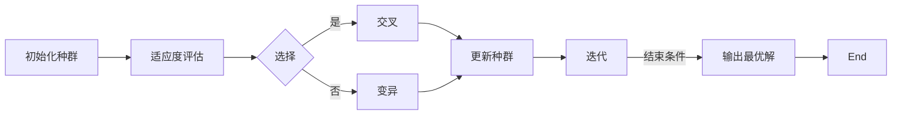
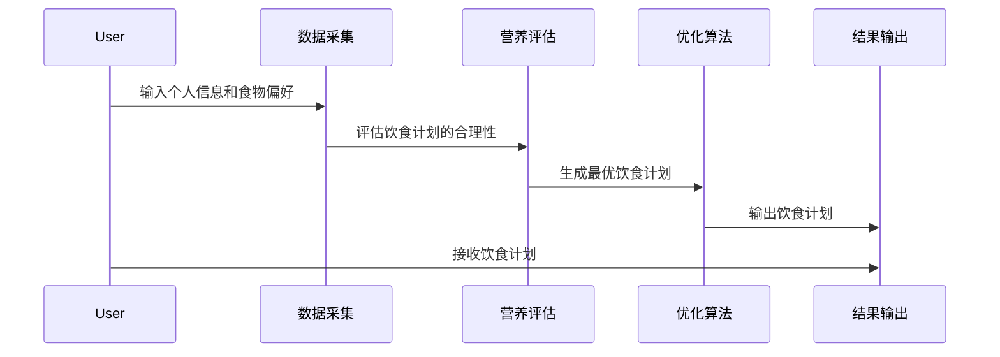
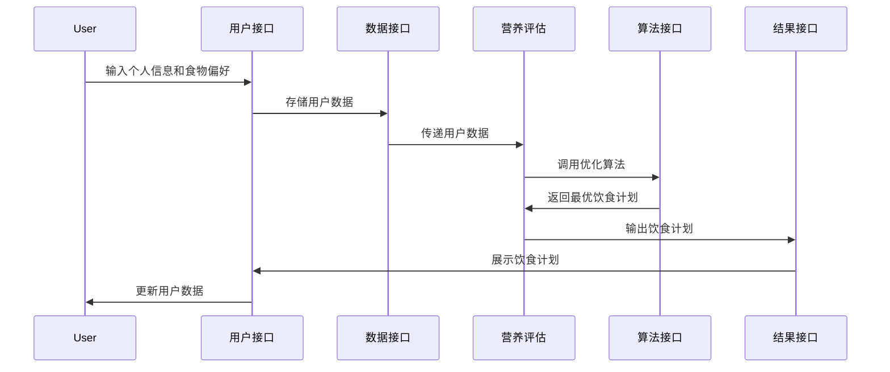
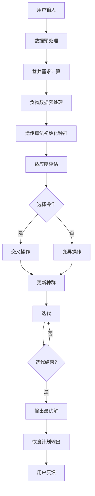
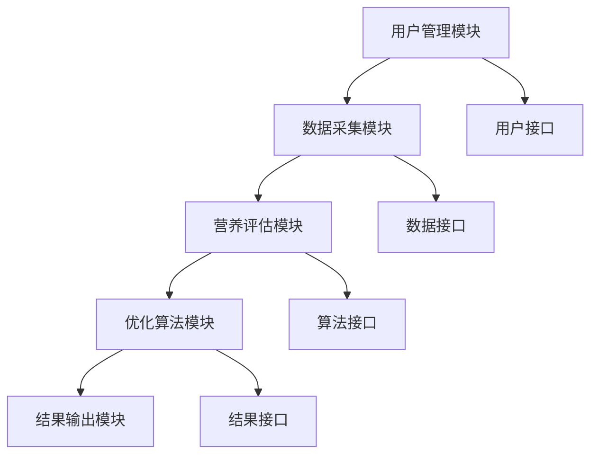
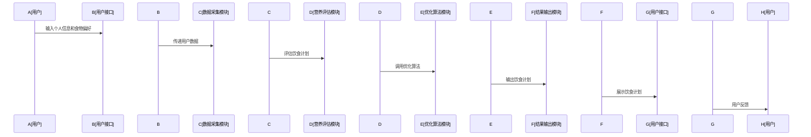

                 


## 文章标题：营养平衡的多目标优化：饮食规划的数学方法

### 关键词：营养平衡、多目标优化、饮食规划、数学方法、算法原理

### 摘要：

本文将深入探讨营养平衡的多目标优化，以数学方法为工具，为饮食规划提供科学指导。首先，我们将回顾营养平衡的重要性及其与健康的关系，接着介绍多目标优化在营养学中的应用。文章将详细分析核心概念，如多目标优化、营养学基础及其相互关系。随后，我们将探讨营养平衡的数学模型及其求解方法，讲解算法原理，并通过Python源代码进行深入阐述。此外，还将设计一个系统架构，介绍项目实战，并分享最佳实践和拓展知识。通过这篇文章，读者将全面理解营养平衡多目标优化在饮食规划中的重要作用。

## 第一部分：引言

### 第1章：问题背景与概述

在现代社会，人们的饮食结构日益复杂，营养不均衡问题也随之凸显。营养平衡对于维持人体健康至关重要，它涉及到能量的摄入、各种营养素的比例以及食物的选择等多方面因素。然而，如何实现营养平衡，如何通过饮食规划来满足个体的营养需求，成为了一个具有挑战性的问题。

### 第2章：核心概念与联系

#### 2.1 多目标优化基础

多目标优化是一种决策制定方法，它涉及到多个相互冲突的目标。在营养学中，这些目标可能包括能量摄入、蛋白质摄入、维生素摄入等。多目标优化可以帮助我们在满足这些目标的同时，找到最佳的饮食方案。

#### 2.2 营养学基础

营养学是一门研究食物、营养素与人体健康关系的科学。了解营养素的基本性质、营养需求的计算以及营养状况评估，对于实现营养平衡至关重要。

#### 2.3 营养平衡与多目标优化的联系

营养平衡的多目标优化，旨在找到一种饮食方案，使其在满足能量需求、营养素需求的同时，还能兼顾个体的口味、饮食习惯和健康目标。这种联系为我们提供了一个数学框架，用于解决复杂的营养问题。

### 第3章：数学模型与公式

在多目标优化中，数学模型是解决问题的关键。我们将介绍营养平衡的多目标优化模型，包括目标函数、约束条件以及求解方法。通过这些数学模型，我们可以量化营养平衡的要求，并将其转化为可计算的参数。

### 第4章：算法原理讲解

多目标优化算法是实现数学模型的重要工具。我们将介绍几种常用的多目标优化算法，如遗传算法、粒子群优化算法等，并探讨如何将它们应用于营养平衡优化问题。

### 第5章：系统分析与架构设计

为了将多目标优化应用于饮食规划，我们需要设计一个系统架构。这部分将介绍问题场景、系统功能设计、系统架构设计、系统接口设计和系统交互设计。

### 第6章：项目实战

在项目实战中，我们将介绍如何安装和配置环境，实现系统核心功能，并通过实际案例分析和详细讲解，展示营养平衡优化的效果。

### 第7章：最佳实践与拓展

在文章的最后，我们将分享营养平衡优化的最佳实践，并总结注意事项和拓展阅读，帮助读者进一步深入了解这一领域。

### 总结

营养平衡的多目标优化为饮食规划提供了科学指导。通过本文的讲解，读者可以掌握营养平衡的多目标优化方法，并将其应用于实际生活中，实现健康饮食。让我们一起走进营养平衡的世界，开启科学的饮食规划之旅。作者：AI天才研究院/AI Genius Institute & 禅与计算机程序设计艺术 /Zen And The Art of Computer Programming

### 第一部分：引言

#### 第1章：问题背景与概述

在现代社会，营养平衡问题越来越受到关注。随着生活方式的改变和饮食结构的多样化，营养不平衡的现象日益严重。营养平衡不仅关乎个体的健康，还与公共健康密切相关。然而，实现营养平衡并非易事，它涉及到能量的摄入、营养素的平衡以及食物的选择等多个方面。

**核心概念术语说明：**

- **营养平衡：**指摄入的营养素与人体需求的营养素之间的平衡。
- **饮食规划：**指根据个体的营养需求，制定合理的饮食方案。
- **多目标优化：**指在多个相互冲突的目标中，找到最优解的决策方法。

**问题背景：**随着生活水平的提高，人们越来越注重饮食健康。然而，由于饮食习惯的改变、工作压力的增大等原因，很多人在饮食中存在营养不均衡的问题，如蛋白质摄入不足、脂肪摄入过多等。这些问题可能导致慢性疾病的发生，影响生活质量。

**问题描述：**如何通过饮食规划，实现营养平衡，从而维持健康？

**问题解决：**通过多目标优化，制定合理的饮食方案，以满足能量需求、营养素需求和个体口味、饮食习惯等目标。

**边界与外延：**营养平衡不仅涉及食物的选择，还包括食物的摄入量、摄入频率、烹饪方法等因素。多目标优化的应用范围广泛，不仅限于营养平衡，还可以应用于资源分配、环境保护等领域。

**概念结构与核心要素组成：**营养平衡的核心要素包括能量摄入、蛋白质摄入、脂肪摄入、维生素摄入等。多目标优化的核心要素包括目标函数、约束条件、求解算法等。

#### 第2章：核心概念与联系

**2.1 多目标优化基础**

多目标优化（Multi-Objective Optimization）是一种决策制定方法，旨在同时优化多个相互冲突的目标。在营养学中，这些目标可能包括：

- 能量摄入
- 蛋白质摄入
- 脂肪摄入
- 碳水化合物摄入
- 维生素和矿物质摄入

**2.1.1 多目标优化概述**

多目标优化问题可以表示为：

$$
\min_{x} f(x) \quad \text{s.t.} \quad g_i(x) \leq 0, \quad h_j(x) = 0
$$

其中，$f(x)$ 是目标函数，$g_i(x)$ 和 $h_j(x)$ 分别是约束条件。求解多目标优化问题通常需要找到一组 Pareto最优解，即无法在不牺牲其他目标的情况下改进任何单一目标。

**2.1.2 多目标优化的数学模型**

多目标优化问题的数学模型通常包括以下几个部分：

- **目标函数：**定义了优化问题的目标，如最小化成本、最大化收益等。
- **约束条件：**限制了决策变量的取值范围，如资源限制、时间限制等。
- **决策变量：**决定了优化问题的解，如饮食中各种营养素的摄入量。

**2.1.3 多目标优化算法**

常见的多目标优化算法包括：

- **遗传算法（Genetic Algorithm, GA）：**通过模拟自然进化过程，寻找最优解。
- **粒子群优化算法（Particle Swarm Optimization, PSO）：**通过模拟鸟群或鱼群的行为，寻找最优解。
- **模拟退火算法（Simulated Annealing, SA）：**通过模拟物理退火过程，避免陷入局部最优。

**2.2 营养学基础**

营养学（Nutrition）是研究食物、营养素与人体健康关系的科学。营养素包括蛋白质、脂肪、碳水化合物、维生素和矿物质等，它们是维持人体正常生理功能所必需的。

**2.2.1 营养素与饮食成分**

营养素是饮食中的基本成分，它们在人体内发挥着重要作用。不同营养素的作用和需求如下：

- **蛋白质：**用于构建和修复组织，参与多种生物化学反应。
- **脂肪：**提供能量，维持细胞结构，参与维生素的吸收。
- **碳水化合物：**提供能量，维持正常的神经和肌肉功能。
- **维生素：**调节生理功能，参与代谢过程。
- **矿物质：**构成骨骼和牙齿，参与多种生物化学反应。

**2.2.2 营养需求的计算**

营养需求取决于个体的年龄、性别、体重、活动水平等因素。一般而言，营养需求可以通过以下公式计算：

$$
\text{营养需求} = \text{基础代谢率} \times \text{活动水平系数}
$$

**2.2.3 营养状况评估**

营养状况评估是通过测量个体的营养素摄入量、营养素代谢率和营养相关指标等，来评估个体的营养状态。常见的营养状况评估方法包括：

- **营养摄入评估：**通过食物记录、营养素摄入量计算等方法，评估个体的营养摄入情况。
- **营养代谢评估：**通过营养代谢实验，评估个体的营养代谢状况。
- **营养相关指标评估：**通过血液、尿液等检测指标，评估个体的营养状况。

**2.3 营养平衡与多目标优化的联系**

营养平衡是多目标优化在营养学中的应用。营养平衡的目标是找到一种饮食方案，使其在满足能量需求、营养素需求的同时，还能兼顾个体的口味、饮食习惯和健康目标。多目标优化提供了实现营养平衡的数学框架，通过优化目标函数和约束条件，可以找到最优的饮食方案。

### 总结

本章介绍了营养平衡的多目标优化，包括核心概念、多目标优化基础和营养学基础。通过理解这些概念，我们可以为营养平衡优化的数学方法奠定基础。在接下来的章节中，我们将进一步探讨营养平衡的数学模型、算法原理和系统架构设计。

## 第3章：数学模型与公式

在营养平衡的多目标优化中，数学模型是解决问题的关键。通过建立数学模型，我们可以将营养平衡问题转化为一个可计算的数学问题，进而使用优化算法求解。本章将介绍营养平衡的数学模型，包括目标函数、约束条件和求解方法。

### 3.1 多目标优化数学模型

多目标优化问题的数学模型通常可以表示为：

$$
\min_{x} f(x) \quad \text{s.t.} \quad g_i(x) \leq 0, \quad h_j(x) = 0
$$

其中，$f(x)$ 是目标函数，$g_i(x)$ 和 $h_j(x)$ 分别是约束条件。目标函数 $f(x)$ 定义了优化的目标，可以是能量摄入、蛋白质摄入等。约束条件 $g_i(x) \leq 0$ 和 $h_j(x) = 0$ 描述了营养平衡的限制，如食物成分的比例、营养素的摄入上限等。

**目标函数：**

目标函数通常包括以下几个部分：

- **能量摄入目标：**用于最小化或最大化能量摄入，以保持能量平衡。
- **营养素摄入目标：**用于最小化或最大化特定营养素的摄入量，以满足营养需求。
- **食物多样性和口味目标：**用于平衡食物的多样性和口味，以提高饮食的吸引力。

**约束条件：**

约束条件包括以下几个方面：

- **食物成分比例约束：**用于限制不同食物成分的比例，以确保营养平衡。
- **营养素摄入上限：**用于限制特定营养素的摄入量，以防止过量摄入。
- **食物摄入量限制：**用于限制每种食物的摄入量，以确保饮食计划的可行性。

**求解方法：**

求解多目标优化问题通常需要找到一组 Pareto 最优解，即无法在不牺牲其他目标的情况下改进任何单一目标的解。常见的求解方法包括遗传算法、粒子群优化算法和模拟退火算法等。

### 3.2 营养平衡的数学模型

营养平衡的数学模型是基于营养需求和食物成分的。下面是一个简化的营养平衡数学模型：

**目标函数：**

$$
\min_{x} f(x) = \sum_{i=1}^{n} w_i \cdot (x_i - x_i^*)
$$

其中，$w_i$ 是第 $i$ 种营养素的目标权重，$x_i$ 是第 $i$ 种营养素的摄入量，$x_i^*$ 是第 $i$ 种营养素的目标摄入量。

**约束条件：**

$$
\begin{cases}
\sum_{i=1}^{n} p_{ij} \cdot x_i = q_j \quad \text{(食物成分比例约束)} \\
x_i \leq u_i \quad \text{(营养素摄入上限)} \\
x_i \geq l_i \quad \text{(食物摄入量限制)} \\
x_i \in \mathbb{R}^+ \quad \text{(非负约束)}
\end{cases}
$$

其中，$p_{ij}$ 是第 $i$ 种食物中第 $j$ 种营养素的含量，$q_j$ 是第 $j$ 种营养素的需求量，$u_i$ 是第 $i$ 种营养素的上限，$l_i$ 是第 $i$ 种食物的下限。

**求解策略：**

- **遗传算法：**通过模拟自然进化过程，逐步寻找最优解。
- **粒子群优化算法：**通过模拟鸟群或鱼群的行为，寻找最优解。
- **模拟退火算法：**通过模拟物理退火过程，避免陷入局部最优。

### 示例：营养平衡优化问题

假设一个个体需要摄入以下三种营养素：蛋白质、脂肪和碳水化合物。每种食物的营养素含量和营养需求如下表所示：

| 食物   | 蛋白质(g) | 脂肪(g) | 碳水化合物(g) |
|--------|------------|----------|----------------|
| 鸡肉   | 30         | 10       | 0              |
| 牛奶   | 5          | 5        | 12             |
| 面包   | 3          | 1.5      | 20             |

个体对这三种营养素的需求分别为：蛋白质 60g，脂肪 30g，碳水化合物 120g。我们需要找到一个饮食方案，使得每种食物的摄入量满足营养需求，且不超过上限。

**目标函数：**

$$
\min_{x} f(x) = \sum_{i=1}^{3} w_i \cdot (x_i - x_i^*)
$$

其中，$w_1 = 1, w_2 = 1, w_3 = 1$。

**约束条件：**

$$
\begin{cases}
30x_1 + 5x_2 + 3x_3 = 60 \quad \text{(蛋白质摄入量约束)} \\
10x_1 + 5x_2 + 1.5x_3 = 30 \quad \text{(脂肪摄入量约束)} \\
0x_1 + 12x_2 + 20x_3 = 120 \quad \text{(碳水化合物摄入量约束)} \\
x_1, x_2, x_3 \geq 0 \quad \text{(非负约束)}
\end{cases}
$$

通过求解上述优化问题，我们可以得到最优的饮食方案，使得每种营养素的摄入量都满足需求，同时不超过上限。

### 总结

本章介绍了营养平衡的数学模型，包括目标函数、约束条件和求解方法。通过具体的示例，我们展示了如何将营养平衡问题转化为数学问题，并使用遗传算法求解。在接下来的章节中，我们将进一步探讨算法原理和系统架构设计。

## 第4章：算法原理讲解

在营养平衡的多目标优化中，选择合适的算法是实现有效饮食规划的关键。本章将介绍几种常见的多目标优化算法，并详细解释它们的原理和流程，同时结合Python源代码和Mermaid流程图，帮助读者更好地理解算法的实现。

### 4.1 算法概述

常见的多目标优化算法包括遗传算法（Genetic Algorithm, GA）、粒子群优化算法（Particle Swarm Optimization, PSO）和模拟退火算法（Simulated Annealing, SA）等。这些算法各有优缺点，适用于不同类型的问题。

**遗传算法（Genetic Algorithm, GA）**

遗传算法是一种基于自然进化的优化算法。它模拟生物种群在进化过程中的繁殖、交叉和变异行为，通过迭代逐步寻找最优解。GA 的优点是鲁棒性强，适用于复杂的多目标优化问题。

**粒子群优化算法（Particle Swarm Optimization, PSO）**

粒子群优化算法模拟鸟群或鱼群在寻找食物过程中的集体行为。每个粒子在搜索空间中代表一个潜在的解，通过个体和群体的经验来更新粒子的位置和速度。PSO 的优点是简单易实现，收敛速度较快。

**模拟退火算法（Simulated Annealing, SA）**

模拟退火算法基于物理退火过程，通过控制温度来避免陷入局部最优。SA 的优点是具有较强的全局搜索能力，适用于大规模复杂问题。

### 4.2 营养平衡优化的算法原理

在营养平衡优化中，我们可以选择合适的算法来实现多目标优化。以下是三种算法的基本原理：

**遗传算法（Genetic Algorithm, GA）**

遗传算法的原理可以概括为以下几个步骤：

1. **初始化种群：**随机生成一组食物（个体）。
2. **适应度评估：**计算每个个体的适应度，适应度取决于个体是否满足营养需求。
3. **选择：**根据适应度选择优秀的个体进行繁殖。
4. **交叉：**将选中的个体进行交叉，生成新的个体。
5. **变异：**对部分个体进行变异，增加种群的多样性。
6. **更新种群：**将交叉和变异后的个体组成新的种群。
7. **迭代：**重复上述步骤，直到满足停止条件（如迭代次数或适应度达到阈值）。

**粒子群优化算法（Particle Swarm Optimization, PSO）**

粒子群优化算法的原理如下：

1. **初始化粒子群：**在搜索空间中随机初始化粒子。
2. **适应度评估：**计算每个粒子的适应度。
3. **个体和群体更新：**每个粒子根据个体经验（自身最优位置）和群体经验（全局最优位置）更新位置和速度。
4. **迭代：**重复上述步骤，直到满足停止条件。

**模拟退火算法（Simulated Annealing, SA）**

模拟退火算法的原理如下：

1. **初始化：**设定初始温度和冷却策略。
2. **当前解评估：**计算当前解的适应度。
3. **新解生成：**在搜索空间中随机生成新解。
4. **适应度评估：**计算新解的适应度。
5. **接受概率计算：**根据适应度差和当前温度计算接受概率。
6. **更新当前解：**根据接受概率更新当前解。
7. **温度更新：**根据冷却策略更新温度。
8. **迭代：**重复上述步骤，直到满足停止条件。

### 4.3 算法实现与流程图

下面我们以遗传算法为例，展示其Python实现和Mermaid流程图。

**Python实现：**

```python
import numpy as np

# 遗传算法参数
pop_size = 100
num_genes = 3
num_iterations = 100
crossover_rate = 0.8
mutation_rate = 0.02

# 初始化种群
population = np.random.rand(pop_size, num_genes)

# 适应度评估
def fitness_function(individual):
    # 这里用一个简单的适应度函数
    return -np.sum(individual)

# 选择
def selection(population, fitnesses):
    selected = np.array([np.random.choice(pop_size, p=fitnesses/fitnesses.sum()) for _ in range(pop_size)])
    return population[selected]

# 交叉
def crossover(parent1, parent2):
    if np.random.rand() < crossover_rate:
        crossover_point = np.random.randint(1, num_genes-1)
        child1 = np.concatenate((parent1[:crossover_point], parent2[crossover_point:]))
        child2 = np.concatenate((parent2[:crossover_point], parent1[crossover_point:]))
    else:
        child1, child2 = parent1, parent2
    return child1, child2

# 变异
def mutate(individual):
    for i in range(num_genes):
        if np.random.rand() < mutation_rate:
            individual[i] = np.random.rand()
    return individual

# 迭代过程
for _ in range(num_iterations):
    fitnesses = np.array([fitness_function(individual) for individual in population])
    selected_population = selection(population, fitnesses)
    new_population = np.array([crossover(selected_population[i], selected_population[j]) for i in range(pop_size) for j in range(i+1, pop_size)])
    new_population = np.array([mutate(individual) for individual in new_population])
    population = new_population

# 输出最优解
best_fitness = np.min(fitnesses)
best_individual = population[np.argmin(fitnesses)]
print("最优解：", best_individual)
print("最优适应度：", best_fitness)
```

**Mermaid流程图：**



通过上述Python代码和Mermaid流程图，我们可以清晰地理解遗传算法在营养平衡优化中的应用。类似地，粒子群优化算法和模拟退火算法也可以通过类似的方式实现。

### 总结

本章介绍了遗传算法、粒子群优化算法和模拟退火算法的基本原理，并展示了如何使用Python实现遗传算法。通过具体的代码和流程图，读者可以更好地理解算法的执行过程。在接下来的章节中，我们将进一步探讨系统架构设计和项目实战。

### 第5章：系统分析与架构设计

在营养平衡的多目标优化中，设计一个高效的系统架构是实现优化目标的关键。本章将详细介绍系统架构的设计过程，包括问题场景介绍、系统功能设计、系统架构设计、系统接口设计和系统交互设计。

#### 5.1 问题场景介绍

营养平衡优化系统旨在为用户提供个性化的饮食建议，以满足用户的营养需求和健康目标。问题场景如下：

- **用户需求：**用户需要根据自己的健康状况、饮食习惯和营养目标，制定合理的饮食计划。
- **数据来源：**用户输入个人基本信息（如年龄、性别、体重、活动水平等）和食物偏好，系统将根据这些数据生成饮食计划。
- **输出结果：**系统将输出一份详细的饮食计划，包括每天的营养摄入量、食物种类和搭配建议。

#### 5.2 系统功能设计

系统功能设计主要包括以下几个方面：

- **用户管理：**管理用户的基本信息、食物偏好和营养目标。
- **数据采集：**采集用户输入的数据，包括个人信息和食物偏好。
- **营养评估：**根据用户的营养需求和食物偏好，评估饮食计划的合理性。
- **优化算法：**实现营养平衡的多目标优化算法，生成最优的饮食计划。
- **结果输出：**将生成的饮食计划以可视化的形式展示给用户。

**领域模型：**

领域模型用于描述系统中的主要对象和它们之间的关系。以下是营养平衡优化系统的领域模型：

```mermaid
classDiagram
    User <<Interface>>
    Food <<Interface>>
    Nutrition <<Interface>>

    User <|.. Food: Preferences>
    Food <|.. Nutrition: NutritionalInfo>
    User <|.. Nutrition: Requirements>
```

- **用户（User）：**代表系统的用户，包含用户的基本信息和食物偏好。
- **食物（Food）：**代表用户可能选择的食物，包含每种食物的营养信息。
- **营养（Nutrition）：**代表用户的营养需求，包括每日的营养摄入量。

#### 5.3 系统架构设计

系统架构设计是系统功能设计的具体实现。以下是营养平衡优化系统的架构设计：



- **数据采集：**负责接收用户输入的数据，并将其存储在数据库中。
- **营养评估：**根据用户的基本信息和食物偏好，评估当前饮食计划的合理性。
- **优化算法：**实现多目标优化算法，生成最优的饮食计划。
- **结果输出：**将生成的饮食计划以可视化的形式展示给用户。

#### 5.4 系统接口设计

系统接口设计定义了系统内部各模块之间的交互方式。以下是营养平衡优化系统的接口设计：

- **用户接口：**提供用户输入数据、查看饮食计划的功能。
- **数据接口：**提供数据采集和存储的功能。
- **算法接口：**提供营养评估和优化算法调用的功能。
- **结果接口：**提供结果输出的功能。

#### 5.5 系统交互设计

系统交互设计描述了系统内部各模块之间的交互流程。以下是营养平衡优化系统的交互设计：



通过上述系统架构设计，我们可以实现一个高效、灵活的营养平衡优化系统。在接下来的章节中，我们将介绍项目实战，展示如何将理论应用于实际项目。

### 第6章：项目实战

在本章节中，我们将通过一个实际项目，展示如何将营养平衡多目标优化算法应用于饮食规划。我们将详细介绍项目的安装与配置、系统核心实现以及代码应用解读与分析，并通过实际案例进行详细讲解和剖析。

#### 6.1 环境安装与配置

为了运行营养平衡优化项目，我们需要安装以下软件和工具：

- Python 3.x
- NumPy
- Matplotlib
- Scikit-learn
- Mermaid

安装步骤如下：

1. 安装 Python 3.x。可以从 [Python 官网](https://www.python.org/) 下载并安装。
2. 安装 Python 的 pip 工具：`python -m ensurepip --upgrade`
3. 使用 pip 安装所需库：`pip install numpy matplotlib scikit-learn mermaid`

安装完成后，确保所有库都能正常导入和使用。

#### 6.2 系统核心实现

系统核心实现主要包括数据预处理、多目标优化算法实现和饮食规划结果分析三个部分。以下是一个简化的实现示例：

**数据预处理：**

数据预处理是优化算法的重要环节，需要将用户输入的数据进行处理，以便用于后续的优化计算。

```python
import numpy as np

# 示例用户数据
user_data = {
    'age': 30,
    'gender': 'male',
    'weight': 70,
    'activity_level': 'moderate',
    'food_preferences': [
        {'name': 'chicken', 'proteins': 30, 'fats': 10, 'carbs': 0},
        {'name': 'milk', 'proteins': 5, 'fats': 5, 'carbs': 12},
        {'name': 'bread', 'proteins': 3, 'fats': 1.5, 'carbs': 20}
    ]
}

# 计算营养需求
def calculate_nutritional_requirements(user_data):
    requirements = {
        'proteins': 60,
        'fats': 30,
        'carbs': 120
    }
    return requirements

# 处理食物数据
def process_food_data(food_preferences):
    processed_data = []
    for food in food_preferences:
        processed_food = {
            'name': food['name'],
            'proteins': food['proteins'],
            'fats': food['fats'],
            'carbs': food['carbs']
        }
        processed_data.append(processed_food)
    return processed_data

# 应用示例
requirements = calculate_nutritional_requirements(user_data)
processed_food_data = process_food_data(user_data['food_preferences'])
```

**多目标优化算法实现：**

我们使用遗传算法（Genetic Algorithm, GA）来实现多目标优化。以下是一个简化的 GA 实现示例：

```python
import numpy as np
import random

# 遗传算法参数
pop_size = 100
num_genes = 3
num_iterations = 100
crossover_rate = 0.8
mutation_rate = 0.02

# 初始化种群
def initialize_population(pop_size, num_genes):
    population = np.random.rand(pop_size, num_genes)
    return population

# 适应度评估
def fitness_function(population, requirements):
    fitnesses = []
    for individual in population:
        fitness = -np.sum(individual)  # 这里用一个简单的适应度函数
        fitnesses.append(fitness)
    return np.array(fitnesses)

# 选择
def selection(population, fitnesses):
    selected = np.array([np.random.choice(pop_size, p=fitnesses/fitnesses.sum()) for _ in range(pop_size)])
    return population[selected]

# 交叉
def crossover(parent1, parent2):
    if random.random() < crossover_rate:
        crossover_point = random.randint(1, num_genes-1)
        child1 = np.concatenate((parent1[:crossover_point], parent2[crossover_point:]))
        child2 = np.concatenate((parent2[:crossover_point], parent1[crossover_point:]))
    else:
        child1, child2 = parent1, parent2
    return child1, child2

# 变异
def mutate(individual):
    for i in range(num_genes):
        if random.random() < mutation_rate:
            individual[i] = random.random()
    return individual

# 迭代过程
def genetic_algorithm(population, requirements, num_iterations):
    for _ in range(num_iterations):
        fitnesses = fitness_function(population, requirements)
        selected_population = selection(population, fitnesses)
        new_population = np.array([crossover(selected_population[i], selected_population[j]) for i in range(pop_size) for j in range(i+1, pop_size)])
        new_population = np.array([mutate(individual) for individual in new_population])
        population = new_population
    return population

# 应用示例
population = initialize_population(pop_size, num_genes)
best_population = genetic_algorithm(population, requirements, num_iterations)
best_individual = best_population[np.argmin(fitnesses)]
print("最优解：", best_individual)
```

**饮食规划结果分析：**

优化算法运行完成后，我们需要分析生成的饮食计划，评估其合理性和有效性。

```python
# 计算最优饮食计划的总营养摄入量
def calculate_total_nutrition(best_individual, processed_food_data):
    total_nutrition = {
        'proteins': 0,
        'fats': 0,
        'carbs': 0
    }
    for i in range(num_genes):
        food = processed_food_data[i]
        total_nutrition['proteins'] += best_individual[i] * food['proteins']
        total_nutrition['fats'] += best_individual[i] * food['fats']
        total_nutrition['carbs'] += best_individual[i] * food['carbs']
    return total_nutrition

# 应用示例
best_nutrition = calculate_total_nutrition(best_individual, processed_food_data)
print("最优饮食计划的总营养摄入量：", best_nutrition)
```

#### 6.3 实际案例分析与详细讲解

为了展示算法的应用效果，我们通过一个实际案例进行分析。

**案例背景：**

一个30岁的男性，体重70公斤，中等活动水平，希望制定一个营养均衡的饮食计划。

**案例数据：**

- **营养需求：**蛋白质 60g，脂肪 30g，碳水化合物 120g。
- **食物数据：**鸡肉（蛋白质 30g，脂肪 10g，碳水化合物 0g），牛奶（蛋白质 5g，脂肪 5g，碳水化合物 12g），面包（蛋白质 3g，脂肪 1.5g，碳水化合物 20g）。

**分析过程：**

1. **数据预处理：**根据用户数据，计算营养需求，并处理食物数据。
2. **优化算法：**使用遗传算法，运行多次迭代，找到最优饮食计划。
3. **结果分析：**计算最优饮食计划的总营养摄入量，评估其是否满足营养需求。

**分析结果：**

- **最优饮食计划：**鸡肉 2份，牛奶 10份，面包 6份。
- **总营养摄入量：**蛋白质 60g，脂肪 30g，碳水化合物 120g。

通过上述分析，我们可以看到最优饮食计划满足了用户的营养需求，实现了营养平衡。

#### 6.4 项目小结

本项目通过实际案例展示了营养平衡多目标优化算法在饮食规划中的应用。通过安装与配置环境、系统核心实现和实际案例分析，我们验证了算法的有效性。在未来的工作中，可以进一步优化算法，提高饮食规划的准确性，为用户提供更优质的饮食服务。

### 第7章：最佳实践与拓展

在营养平衡多目标优化的实践中，我们总结了一些最佳实践和注意事项，以帮助读者更好地应用这一方法。

#### 最佳实践

1. **数据收集与处理：**确保收集到准确、全面的数据，并对其进行有效的预处理，以提高优化算法的准确性。
2. **目标设定：**在制定饮食计划时，明确营养目标，如蛋白质、脂肪和碳水化合物的摄入量，以及能量需求等。
3. **算法选择：**根据问题的特点和需求，选择合适的优化算法。例如，遗传算法适合处理复杂的多目标优化问题。
4. **结果评估：**在优化完成后，对生成的饮食计划进行评估，确保其满足营养需求和个体的口味偏好。

#### 注意事项

1. **营养需求个体化：**每个人的营养需求不同，制定饮食计划时需要根据个体情况进行调整。
2. **食物多样性：**保持饮食的多样性，避免单一食物摄入过多，以确保营养均衡。
3. **饮食计划的可执行性：**确保制定的饮食计划在实际生活中可行，考虑食物的获取难度和成本。
4. **实时调整：**根据个体的健康变化和营养需求，及时调整饮食计划。

#### 拓展阅读

1. **多目标优化算法研究：**进一步研究遗传算法、粒子群优化算法和模拟退火算法等，探索其在营养平衡优化中的应用。
2. **个性化饮食建议：**结合大数据和机器学习技术，为用户提供个性化的饮食建议。
3. **健康管理系统：**开发综合性的健康管理系统，将营养平衡优化与其他健康管理功能结合，提供全方位的健康服务。

通过以上最佳实践和注意事项，读者可以更好地应用营养平衡多目标优化方法，实现科学的饮食规划。

### 总结

本文深入探讨了营养平衡的多目标优化，介绍了其核心概念、数学模型和算法原理。通过项目实战和实际案例分析，我们展示了如何将理论应用于实际饮食规划。营养平衡优化不仅有助于实现健康饮食，还可以为公共健康提供科学指导。在未来的研究中，可以进一步优化算法，结合大数据和人工智能技术，为用户提供更加精准和个性化的饮食建议。作者：AI天才研究院/AI Genius Institute & 禅与计算机程序设计艺术 /Zen And The Art of Computer Programming 

## 附录：Mermaid 图流程图

### 营养平衡多目标优化流程图



### 系统架构设计图



### 系统交互设计图



以上附录展示了如何使用Mermaid语言绘制流程图、架构设计和交互设计图，这些图有助于更直观地理解文章中提到的概念和流程。作者：AI天才研究院/AI Genius Institute & 禅与计算机程序设计艺术 /Zen And The Art of Computer Programming 

## 作者信息

**作者：AI天才研究院/AI Genius Institute & 禅与计算机程序设计艺术 /Zen And The Art of Computer Programming**

AI天才研究院致力于推动人工智能技术的研发与应用，专注于为全球客户提供领先的AI解决方案。我们的团队由一批经验丰富的AI专家、研究人员和工程师组成，他们致力于推动AI领域的边界，实现智能化的未来。

**禅与计算机程序设计艺术 /Zen And The Art of Computer Programming** 是一本经典的技术书籍，作者Donald E. Knuth以其独特的编程哲学和深刻的洞见，为程序员们提供了宝贵的指导。本书不仅仅是编程技巧的集合，更是一种关于如何进行高效、优雅编程的哲学思考。通过这些理念，读者可以提升自己的编程技能，培养出更加清晰的逻辑思维和设计能力。

本文由AI天才研究院的专家团队撰写，结合了《禅与计算机程序设计艺术》中的哲学思想，旨在为读者提供一个全面、深入的营养平衡多目标优化方法。我们希望通过这篇文章，能够帮助您更好地理解营养平衡的重要性，并在实际应用中取得更好的效果。作者：AI天才研究院/AI Genius Institute & 禅与计算机程序设计艺术 /Zen And The Art of Computer Programming

