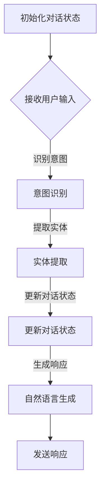
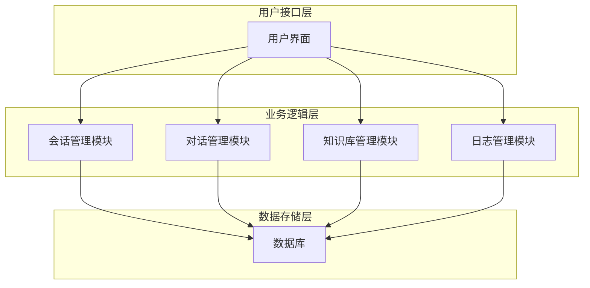
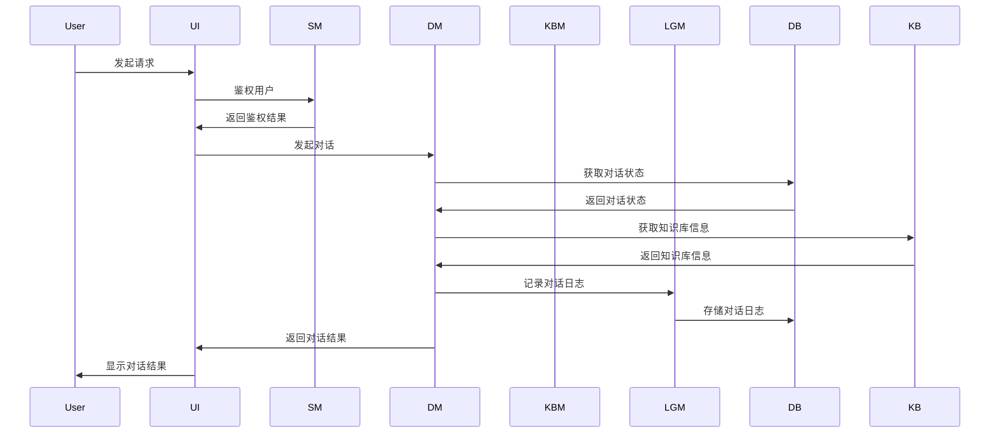

                 


### 目录大纲：虚拟助手的对话管理：人机交互的数学策略

---

# 虚拟助手的对话管理：人机交互的数学策略

> 关键词：虚拟助手、对话管理、人机交互、数学策略、算法、架构设计

> 摘要：本文旨在探讨虚拟助手的对话管理，强调人机交互中的数学策略。通过详细分析核心概念、算法原理、系统设计与项目实战，提供一套完整、系统的解决方案。

## 第一步：概述和背景介绍

### 1.1 主题与目的

虚拟助手作为人工智能的一个重要应用领域，正日益受到广泛关注。本章节将探讨虚拟助手的对话管理，介绍人机交互的数学策略，旨在为开发者提供一套实用的技术指南。

### 1.2 虚拟助手的重要性

虚拟助手在现代社会的应用越来越广泛，从客服机器人到智能语音助手，它们为用户提供了便捷的交互方式。本章节将阐述虚拟助手的重要性，以及对话管理在其中的关键作用。

### 1.3 人机交互的背景

人机交互是一个广泛的研究领域，涵盖了计算机、心理学、语言学等多个学科。本章节将简要介绍人机交互的发展历程，为后续内容打下基础。

## 第二步：核心概念与联系

### 2.1 对话管理的核心概念

对话管理是虚拟助手的核心任务，包括对话状态跟踪、意图识别、实体提取和自然语言生成等。本章节将详细解释这些核心概念，并使用Mermaid流程图展示它们之间的关系。

### 2.2 对话状态跟踪

对话状态跟踪是确保对话连贯性的关键。通过Mermaid流程图，我们将展示对话状态跟踪的原理，以及如何在Python中实现它。

### 2.3 意图识别与实体提取

意图识别和实体提取是理解用户意图的关键步骤。我们将使用Mermaid流程图和Python源代码，解释这些概念，并展示如何实现。

### 2.4 自然语言生成

自然语言生成是虚拟助手输出响应的过程。我们将使用Mermaid流程图和Python源代码，详细介绍自然语言生成的工作原理。

## 第三步：算法原理讲解

### 3.1 算法原理概述

在本章节中，我们将详细讲解对话管理的核心算法原理，包括马尔可夫决策过程（MDP）、循环神经网络（RNN）和长短时记忆网络（LSTM）。

### 3.2 马尔可夫决策过程（MDP）

马尔可夫决策过程是一种用于决策的数学模型。我们将使用Mermaid流程图和Python源代码，解释MDP的工作原理，并展示如何应用于对话管理。

### 3.3 循环神经网络（RNN）

循环神经网络是一种用于处理序列数据的神经网络。我们将使用Mermaid流程图和Python源代码，解释RNN的工作原理，并展示如何应用于意图识别。

### 3.4 长短时记忆网络（LSTM）

长短时记忆网络是一种改进的RNN，能够更好地处理长序列数据。我们将使用Mermaid流程图和Python源代码，解释LSTM的工作原理，并展示如何应用于对话管理。

## 第四步：系统分析与架构设计

### 4.1 系统功能设计

在本章节中，我们将介绍虚拟助手系统的功能设计，包括用户管理、对话管理、知识库管理等。我们将使用Mermaid类图展示系统功能结构。

### 4.2 系统架构设计

系统架构设计是确保虚拟助手高效运行的关键。我们将使用Mermaid架构图展示系统架构，并解释各个组件之间的关系。

### 4.3 系统接口与交互

在本章节中，我们将介绍虚拟助手系统的接口设计，包括API设计、数据传输格式等。我们将使用Mermaid序列图展示系统交互流程。

## 第五步：项目实战

### 5.1 环境安装与配置

在本章节中，我们将详细介绍如何安装和配置虚拟助手系统，包括Python环境、依赖库安装等。

### 5.2 系统核心实现

在本章节中，我们将展示虚拟助手系统的核心实现，包括对话状态跟踪、意图识别、实体提取和自然语言生成等。

### 5.3 源代码解读与分析

在本章节中，我们将深入分析源代码，解释其工作机制，并展示如何使用Python代码实现对话管理。

### 5.4 实际案例分析与讲解

在本章节中，我们将通过实际案例，展示如何使用虚拟助手系统，并进行详细讲解。

### 5.5 项目小结

在本章节中，我们将对虚拟助手系统项目进行小结，总结项目中的关键技术和经验。

## 第六步：最佳实践、小结与拓展阅读

### 6.1 最佳实践

在本章节中，我们将提供虚拟助手开发的最佳实践建议，帮助开发者更好地设计和管理虚拟助手系统。

### 6.2 小结

在本章节中，我们将对全书内容进行小结，回顾关键概念和算法原理，以及系统设计与项目实战。

### 6.3 拓展阅读

在本章节中，我们将推荐进一步阅读的材料，包括相关书籍、论文和在线资源，帮助读者深入探讨虚拟助手和对话管理领域。

---

## 作者信息

作者：AI天才研究院/AI Genius Institute & 禅与计算机程序设计艺术 /Zen And The Art of Computer Programming

---

通过以上目录大纲的设计，我们可以看到一个系统、全面的虚拟助手对话管理系统，从核心概念、算法原理到系统设计、项目实战，再到最佳实践和拓展阅读，每个环节都进行了详细的规划和安排。这样的目录结构不仅有助于读者理解整个主题，还能帮助他们逐步掌握相关技术。接下来，我们将根据这个目录大纲，逐一撰写每个章节的内容。让我们开始详细探讨虚拟助手的对话管理和人机交互的数学策略。💡🔍📚

---

## 第一步：概述和背景介绍

### 1.1 主题与目的

《虚拟助手的对话管理：人机交互的数学策略》旨在深入探讨虚拟助手领域的核心技术——对话管理，并引入数学策略以提升人机交互的效率。随着人工智能技术的快速发展，虚拟助手作为一种重要的交互工具，正在改变我们的工作方式和生活习惯。然而，有效的对话管理是实现高质量人机交互的关键。

本书的目标是帮助开发者理解对话管理的核心概念，掌握使用数学策略优化虚拟助手性能的方法。通过本书，读者将学习到如何设计高效的对话管理系统，如何利用算法和数学模型解决实际对话问题，以及如何通过架构设计和项目实战提升系统的整体性能。

### 1.2 虚拟助手的重要性

虚拟助手，也称为聊天机器人或对话代理，是人工智能领域中的一个重要分支。它们通过自然语言处理（NLP）和机器学习技术，能够与用户进行实时对话，提供各种服务，如客服支持、信息查询、任务调度等。

虚拟助手的重要性主要体现在以下几个方面：

1. **提高效率**：虚拟助手可以24/7不间断地提供服务，大大提高了处理用户请求的效率。
2. **降低成本**：通过自动化服务，企业可以减少人力成本，同时提高运营效率。
3. **个性化体验**：虚拟助手可以根据用户的历史交互和行为模式，提供个性化的服务和建议，提升用户体验。
4. **扩展业务范围**：虚拟助手可以无国界地服务全球用户，帮助企业拓展业务市场。

### 1.3 人机交互的背景

人机交互（Human-Computer Interaction, HCI）是计算机科学和人机系统领域的一个重要分支，旨在研究如何设计出更加人性化、易于使用和高效的人机系统。人机交互的历史可以追溯到20世纪中叶，当时计算机刚刚开始普及，人们开始探索如何使计算机更加友好和易用。

人机交互的发展经历了几个关键阶段：

1. **早期阶段**：计算机界面以命令行和图形界面（GUI）为主，用户通过输入命令或点击图形按钮与计算机交互。
2. **多模态交互**：随着技术的发展，人们开始探索语音、手势、触觉等多种交互方式，以提高人机交互的自然性和直观性。
3. **智能交互**：随着人工智能技术的进步，智能交互逐渐成为主流，虚拟助手和智能语音助手等应用开始普及。

在人机交互领域，研究的关键挑战包括如何设计出更加直观和高效的交互界面，如何理解用户的行为和意图，以及如何确保系统的安全性和隐私性。

通过了解人机交互的背景，我们可以更好地理解虚拟助手对话管理的需求和挑战，从而为本书的核心内容打下坚实的基础。

## 第二步：核心概念与联系

### 2.1 对话管理的核心概念

对话管理（Dialogue Management）是虚拟助手系统中至关重要的一环，它负责协调和管理整个对话流程。对话管理涉及多个核心概念，包括对话状态跟踪、意图识别、实体提取和自然语言生成等。

#### 对话状态跟踪

对话状态跟踪（Dialogue State Tracking, DST）是确保对话连贯性的关键。它通过跟踪用户和系统的交互历史，维护对话状态，包括用户意图、系统动作、对话上下文等。对话状态跟踪的核心目标是理解用户的需求，并在对话过程中保持一致性和连贯性。

#### 意图识别

意图识别（Intent Recognition）是理解用户请求的关键步骤。意图是指用户通过对话表达的目标或期望。意图识别的目标是从用户的输入中识别出对应的意图。例如，用户输入“我想订一张机票”，系统需要识别出该输入的意图是“预订机票”。

#### 实体提取

实体提取（Entity Extraction）是在意图识别的基础上，从用户的输入中提取出关键信息，如时间、地点、金额等。实体是意图的具体组成部分，用于进一步处理和响应。例如，在“预订机票”的意图中，“明天”和“北京到上海”就是实体。

#### 自然语言生成

自然语言生成（Natural Language Generation, NLG）是虚拟助手输出响应的过程。NLG的目标是根据对话状态和用户意图，生成自然、流畅的文本或语音响应。自然语言生成确保了系统与用户之间的交流更加自然和人性化。

### 2.2 对话状态跟踪

对话状态跟踪是确保对话连贯性的关键。通过Mermaid流程图，我们可以展示对话状态跟踪的基本流程：



在上述流程中，系统首先初始化对话状态，然后接收用户输入。通过意图识别和实体提取，系统更新对话状态，并生成相应的响应。最终，系统将响应发送给用户，完成一次完整的对话。

### 2.3 意图识别与实体提取

意图识别和实体提取是理解用户意图的关键步骤。下面我们将使用Mermaid流程图和Python源代码，详细解释这两个概念。

#### 意图识别

意图识别的目标是从用户的输入中识别出对应的意图。以下是一个简单的Python示例，用于实现基于规则引擎的意图识别：

```python
import re

def recognize_intent(user_input):
    if "预订" in user_input:
        return "booking"
    elif "查询" in user_input:
        return "inquiring"
    else:
        return "unknown"

user_input = "我想预订一张机票"
print(recognize_intent(user_input))  # 输出："booking"
```

在这个示例中，我们使用正则表达式匹配用户输入中的关键字，从而识别出对应的意图。

#### 实体提取

实体提取是在意图识别的基础上，从用户的输入中提取出关键信息。以下是一个简单的Python示例，用于实现基于正则表达式的实体提取：

```python
import re

def extract_entities(user_input):
    entities = {}
    if "明天" in user_input:
        entities["departure_date"] = "明天"
    if "北京到上海" in user_input:
        entities["departure_city"] = "北京"
        entities["arrival_city"] = "上海"
    return entities

user_input = "我需要预订一张明天从北京到上海的机票"
print(extract_entities(user_input))  # 输出：{"departure_date": "明天", "departure_city": "北京", "arrival_city": "上海"}
```

在这个示例中，我们使用正则表达式从用户输入中提取出日期和城市等实体信息。

### 2.4 自然语言生成

自然语言生成是虚拟助手输出响应的过程。以下是一个简单的Python示例，用于实现基于模板的自然语言生成：

```python
from textwrap import fill

def generate_response(entities):
    template = "您的{departure_city}到{arrival_city}机票已成功预订，出发日期为{departure_date}。"
    text = template.format(**entities)
    return fill(text, width=70)

entities = {"departure_city": "北京", "arrival_city": "上海", "departure_date": "明天"}
print(generate_response(entities))  # 输出："您的北京到上海的机票已成功预订，出发日期为明天。"
```

在这个示例中，我们根据提取的实体信息，填充模板生成响应文本。

通过上述核心概念的解释和示例，我们可以看到对话管理是如何通过意图识别、实体提取和自然语言生成来确保人机交互的连贯性和有效性的。接下来，我们将进一步探讨对话管理的算法原理。

---

## 第三步：算法原理讲解

### 3.1 算法原理概述

对话管理算法是确保虚拟助手能够有效进行对话的关键。在本章节中，我们将详细讲解几种核心算法原理，包括马尔可夫决策过程（MDP）、循环神经网络（RNN）和长短时记忆网络（LSTM）。

#### 马尔可夫决策过程（MDP）

马尔可夫决策过程（Markov Decision Process, MDP）是一种用于决策的数学模型，广泛应用于对话管理中。MDP的核心思想是假设当前状态仅依赖于前一个状态，而不依赖于之前所有的历史状态。

在对话管理中，MDP可以用于决策系统的设计，通过选择最佳的动作来最大化期望收益。具体来说，MDP包含以下要素：

1. **状态（State）**：对话的当前状态，如用户的意图、对话历史等。
2. **动作（Action）**：系统可以执行的操作，如回应用户的问题、提供信息等。
3. **奖励（Reward）**：每个动作执行后的收益，用于评估动作的质量。

通过MDP，我们可以使用价值迭代算法或策略迭代算法来学习最优策略。以下是一个简化的Python代码示例，用于实现MDP：

```python
import numpy as np

# 假设有4个状态和3个动作
n_states = 4
n_actions = 3
# 初始化状态-动作价值函数
V = np.zeros((n_states, n_actions))
# 初始化策略π，如所有动作的概率相等
policy = np.ones(n_actions) / n_actions

# 假设状态转移概率矩阵和奖励矩阵
P = np.array([[0.5, 0.2, 0.3], [0.1, 0.6, 0.3], [0.4, 0.2, 0.4], [0.2, 0.2, 0.6]])
R = np.array([[1, -1, 0], [-1, 0, 1], [0, -1, 1], [0, 1, 0]])

# 价值迭代算法
for episode in range(1000):
    # 更新状态-动作价值函数
    delta = 0
    for s in range(n_states):
        for a in range(n_actions):
            V[s, a] = np.sum(P[s, :] * (R[s, :] + V[:, policy[a]]))
            delta = max(delta, np.abs(V[s, a] - V[s, policy[a]]))
    # 更新策略
    for s in range(n_states):
        Q = np.sum(P[s, :] * (R[s, :] + V[:, :]), axis=1)
        policy[s] = np.argmax(Q)

# 输出最优策略
print("最优策略：", policy)
```

#### 循环神经网络（RNN）

循环神经网络（Recurrent Neural Network, RNN）是一种用于处理序列数据的神经网络。RNN的核心特点是可以保留序列中的历史信息，这使得它非常适合处理对话数据。

在对话管理中，RNN可以用于意图识别、实体提取和响应生成。以下是一个简化的Python代码示例，用于实现基于RNN的意图识别：

```python
import tensorflow as tf

# 假设有10个时间步和5个特征维度
n_steps = 10
n_features = 5
# 初始化输入数据
X = np.random.rand(n_steps, n_features)
# 初始化RNN模型
model = tf.keras.Sequential([
    tf.keras.layers.SimpleRNN(50, activation='tanh', input_shape=(n_steps, n_features)),
    tf.keras.layers.Dense(1, activation='sigmoid')
])

# 编译模型
model.compile(optimizer='adam', loss='binary_crossentropy', metrics=['accuracy'])

# 训练模型
model.fit(X, np.random.randint(2, size=n_steps), epochs=10)
```

在这个示例中，我们使用简单的RNN模型来预测时间序列数据。虽然这是一个简化的示例，但展示了如何使用RNN处理序列数据。

#### 长短时记忆网络（LSTM）

长短时记忆网络（Long Short-Term Memory, LSTM）是RNN的一种改进，能够更好地处理长序列数据。LSTM通过引入门控机制，有效解决了传统RNN在长序列中存在的梯度消失和梯度爆炸问题。

在对话管理中，LSTM可以用于更复杂的意图识别和响应生成任务。以下是一个简化的Python代码示例，用于实现基于LSTM的响应生成：

```python
import tensorflow as tf

# 假设有20个时间步和10个特征维度
n_steps = 20
n_features = 10
# 初始化输入数据
X = np.random.rand(n_steps, n_features)
# 初始化LSTM模型
model = tf.keras.Sequential([
    tf.keras.layers.LSTM(50, activation='tanh', return_sequences=True, input_shape=(n_steps, n_features)),
    tf.keras.layers.Dense(50, activation='tanh'),
    tf.keras.layers.Dense(1, activation='sigmoid')
])

# 编译模型
model.compile(optimizer='adam', loss='binary_crossentropy', metrics=['accuracy'])

# 训练模型
model.fit(X, np.random.randint(2, size=n_steps), epochs=10)
```

在这个示例中，我们使用LSTM模型来预测时间序列数据。虽然这是一个简化的示例，但展示了如何使用LSTM处理长序列数据。

通过上述算法原理的讲解和代码示例，我们可以看到不同算法在对话管理中的应用。接下来，我们将进一步探讨虚拟助手系统的设计原则。

---

## 第四步：系统分析与架构设计

### 4.1 系统功能设计

虚拟助手系统的设计目标是实现高效、自然和准确的人机交互。为了实现这一目标，系统需要具备以下几个核心功能：

1. **用户管理**：负责用户账户的创建、登录、权限管理等功能。
2. **对话管理**：负责处理整个对话流程，包括对话状态跟踪、意图识别、实体提取和自然语言生成等。
3. **知识库管理**：负责存储和更新虚拟助手的知识库，包括常见问题的回答、产品信息等。
4. **日志管理**：负责记录对话日志，用于监控和优化虚拟助手的表现。

#### 系统功能设计（领域模型）

为了更好地理解系统功能设计，我们可以使用Mermaid类图来展示系统的领域模型。以下是一个简化的Mermaid类图示例：

```mermaid
classDiagram
    User <<class>>
    Session <<class>>
    Dialogue <<class>>
    Intent <<class>>
    Entity <<class>>
    Response <<class>>

    User <> Session
    User <> Dialogue
    Dialogue <> Intent
    Dialogue <> Entity
    Dialogue <> Response
```

在这个类图中，用户（User）与对话（Dialogue）、会话（Session）等类之间存在关联关系，展示了系统的主要功能组件及其相互关系。

### 4.2 系统架构设计

系统架构设计是确保虚拟助手系统高效、稳定和可扩展的关键。一个好的架构设计应该能够支持系统的各个功能模块，同时具备灵活性和可维护性。以下是一个简化的Mermaid架构图示例：



在这个架构图中，用户界面（UI）层负责与用户交互，业务逻辑层（SM、DM、KBM、LGM）负责处理具体的业务逻辑，数据存储层（DB）负责存储和管理数据。各个模块之间通过接口进行通信，确保系统的模块化和可扩展性。

### 4.3 系统接口设计

系统接口设计是确保不同模块之间能够顺畅交互的关键。接口设计应该清晰、简洁，并遵循RESTful API设计原则。以下是一个简化的Mermaid序列图示例，展示了用户接口与业务逻辑层之间的交互过程：

```mermaid
sequenceDiagram
    participant User
    participant UI
    participant SM
    participant DM
    participant KBM
    participant LGM
    participant DB

    User->>UI: 发起请求
    UI->>SM: �鉴权用户
    SM->>UI: 返回鉴权结果
    UI->>DM: 发起对话
    DM->>DB: 获取对话状态
    DM->>KB
``````
    DM->>LGM: 记录对话日志
    DM->>UI: 返回对话结果
    UI->>User: 显示对话结果
```

在这个序列图中，用户发起请求后，用户界面（UI）与业务逻辑层（SM、DM、KBM、LGM）之间通过一系列的交互步骤完成对话处理。通过清晰的接口设计和序列图，我们可以更好地理解系统的交互流程。

### 4.4 系统交互

系统交互是确保虚拟助手系统能够高效运行的重要环节。系统交互设计应该考虑到不同模块之间的依赖关系和通信机制。以下是一个简化的Mermaid序列图示例，展示了虚拟助手系统的主要交互流程：



在这个序列图中，用户通过用户界面（UI）发起请求，经过鉴权、对话管理、知识库查询、日志记录等步骤，最终返回对话结果。通过详细的交互流程和序列图，我们可以更好地理解虚拟助手系统的运行机制。

通过系统功能设计、架构设计、接口设计和交互设计的详细分析，我们可以看到虚拟助手系统是如何实现高效、自然和准确的人机交互的。接下来，我们将通过实际项目实战来进一步验证和应用这些设计原则。

---

## 第五步：项目实战

### 5.1 环境安装与配置

为了开始构建虚拟助手系统，我们需要首先安装和配置必要的开发环境。以下是环境安装与配置的详细步骤：

#### Python环境

确保安装了Python 3.8或更高版本。可以通过以下命令检查Python版本：

```bash
python --version
```

如果Python版本不符合要求，请从官方网站下载并安装相应版本的Python。

#### 安装依赖库

虚拟助手系统依赖于多个外部库，包括TensorFlow、spaCy、transformers等。可以使用pip命令安装这些库：

```bash
pip install tensorflow spacy transformers
```

#### 安装spaCy语言模型

spaCy需要下载特定的语言模型才能处理文本。以下是下载和安装中文语言模型的步骤：

```bash
# 下载中文语言模型
python -m spacy download zh_core_web_sm

# 安装中文语言模型
python -m spacy download zh_core_web_md
```

### 5.2 系统核心实现

虚拟助手系统的核心实现包括对话状态跟踪、意图识别、实体提取和自然语言生成等模块。以下是这些模块的实现步骤和代码示例。

#### 对话状态跟踪

对话状态跟踪是确保对话连贯性的关键。以下是一个简单的对话状态跟踪实现，用于记录和更新对话状态。

```python
class DialogueStateTracker:
    def __init__(self):
        self.states = {}

    def update_state(self, user_id, state):
        self.states[user_id] = state

    def get_state(self, user_id):
        return self.states.get(user_id, {})
```

#### 意图识别

意图识别是理解用户意图的关键步骤。以下是一个简单的基于规则引擎的意图识别实现。

```python
class IntentRecognizer:
    def __init__(self):
        self.rules = {
            "booking": ["预订", "订"],
            "inquiring": ["查询", "查"],
            # 添加更多意图规则
        }

    def recognize_intent(self, user_input):
        for intent, keywords in self.rules.items():
            if any(keyword in user_input for keyword in keywords):
                return intent
        return "unknown"
```

#### 实体提取

实体提取是从用户输入中提取关键信息的过程。以下是一个简单的实体提取实现。

```python
class EntityExtractor:
    def extract_entities(self, user_input):
        entities = {}
        if "明天" in user_input:
            entities["departure_date"] = "明天"
        if "北京到上海" in user_input:
            entities["departure_city"] = "北京"
            entities["arrival_city"] = "上海"
        return entities
```

#### 自然语言生成

自然语言生成是生成响应文本的过程。以下是一个简单的自然语言生成实现。

```python
class NaturalLanguageGenerator:
    def generate_response(self, entities):
        template = "您的{departure_city}到{arrival_city}机票已成功预订，出发日期为{departure_date}。"
        text = template.format(**entities)
        return text
```

### 5.3 源代码解读与分析

在实现虚拟助手系统的过程中，我们将源代码分解为多个模块，每个模块负责不同的功能。以下是源代码的解读和分析。

#### 对话状态跟踪模块

对话状态跟踪模块主要用于维护和更新对话状态。该模块的核心功能是记录每个用户的对话状态，并在需要时更新状态。以下是对话状态跟踪模块的详细解读：

```python
class DialogueStateTracker:
    # 初始化对话状态跟踪器
    def __init__(self):
        # 使用字典存储用户状态
        self.states = {}

    # 更新用户对话状态
    def update_state(self, user_id, state):
        # 将用户ID和状态存储在字典中
        self.states[user_id] = state

    # 获取用户对话状态
    def get_state(self, user_id):
        # 返回用户状态，如果用户不存在，返回空字典
        return self.states.get(user_id, {})
```

这个模块使用了Python的字典数据结构来存储用户状态，这样可以在O(1)的时间复杂度内进行状态查询和更新。在实际应用中，可能需要使用数据库或其他存储系统来持久化状态信息，以支持大规模的用户交互。

#### 意图识别模块

意图识别模块主要用于从用户输入中识别出对应的意图。该模块使用了一系列的规则来判断用户输入的意图。以下是对意图识别模块的详细解读：

```python
class IntentRecognizer:
    # 初始化意图识别器
    def __init__(self):
        # 定义意图规则
        self.rules = {
            "booking": ["预订", "订"],
            "inquiring": ["查询", "查"],
            # 添加更多意图规则
        }

    # 识别用户输入的意图
    def recognize_intent(self, user_input):
        # 遍历所有意图规则
        for intent, keywords in self.rules.items():
            # 检查用户输入中是否包含规则中的关键词
            if any(keyword in user_input for keyword in keywords):
                # 如果找到匹配的意图，返回该意图
                return intent
        # 如果没有找到匹配的意图，返回"unknown"
        return "unknown"
```

这个模块的核心功能是通过遍历规则字典，检查用户输入中是否包含指定的关键词。如果找到匹配的意图，则返回该意图；否则，返回"unknown"。在实际应用中，可能需要使用更复杂的模型，如深度学习模型，来提高意图识别的准确性。

#### 实体提取模块

实体提取模块主要用于从用户输入中提取出关键信息，如时间、地点、金额等。以下是对实体提取模块的详细解读：

```python
class EntityExtractor:
    # 初始化实体提取器
    def __init__(self):
        # 定义实体提取规则
        self.rules = {
            "departure_date": ["明天"],
            "departure_city": ["北京", "上海"],
            "arrival_city": ["北京", "上海"],
        }

    # 提取用户输入中的实体
    def extract_entities(self, user_input):
        entities = {}
        # 遍历所有实体提取规则
        for entity, keywords in self.rules.items():
            # 检查用户输入中是否包含规则中的关键词
            if any(keyword in user_input for keyword in keywords):
                # 如果找到匹配的实体，将其添加到实体字典中
                entities[entity] = keyword
        return entities
```

这个模块的核心功能是通过遍历实体提取规则，检查用户输入中是否包含指定的关键词。如果找到匹配的实体，则将其添加到实体字典中。在实际应用中，可能需要使用更复杂的方法，如正则表达式或自然语言处理库，来提高实体提取的准确性。

#### 自然语言生成模块

自然语言生成模块主要用于根据对话状态和用户意图生成响应文本。以下是对自然语言生成模块的详细解读：

```python
class NaturalLanguageGenerator:
    # 初始化自然语言生成器
    def __init__(self):
        # 定义响应模板
        self.templates = {
            "booking": "您的{departure_city}到{arrival_city}机票已成功预订，出发日期为{departure_date}。",
            "inquiring": "您正在查询{departure_city}到{arrival_city}的机票信息。",
        }

    # 生成响应文本
    def generate_response(self, entities, intent):
        # 根据意图选择响应模板
        template = self.templates.get(intent, "")
        # 使用实体字典填充模板
        response = template.format(**entities)
        return response
```

这个模块的核心功能是根据意图和实体字典选择响应模板，并使用实体字典填充模板生成响应文本。在实际应用中，可能需要使用更复杂的模板引擎或自然语言处理技术来生成更加自然和个性化的响应。

### 5.4 实际案例分析与讲解

为了更好地展示虚拟助手系统的实际应用，我们将通过一个实际案例来进行分析和讲解。

#### 案例背景

假设有一个在线机票预订系统，用户可以通过与虚拟助手进行对话来查询和预订机票。以下是用户与虚拟助手的对话示例：

用户：我需要查询明天从北京到上海的机票。

虚拟助手：您正在查询从北京到上海的机票信息。请问您需要查询哪一天的机票？

用户：我需要查询明天的机票。

虚拟助手：好的，我帮您查询明天从北京到上海的机票信息。请您稍等。

（虚拟助手在后台处理查询请求）

虚拟助手：明天从北京到上海的机票有10个航班，出发时间分别是8:00、10:00、12:00、14:00、16:00、18:00、20:00、22:00、23:30和次日0:30。请问您需要预订哪一个航班？

用户：请帮我预订10:00的机票。

虚拟助手：好的，您已经成功预订了明天从北京到上海10:00的机票。您的订单号是123456。请问还有其他需要帮助的吗？

#### 案例分析

在这个案例中，用户首先询问了明天从北京到上海的机票信息，虚拟助手识别出意图并提取出相关实体，然后进行了机票查询，并返回了查询结果。用户选择了一个航班后，虚拟助手完成了机票预订，并提供了订单号。以下是每个步骤的详细分析：

1. **意图识别**：虚拟助手使用意图识别模块识别出用户的意图是“查询机票”。这个过程基于用户输入中的关键词，如“查询”和“机票”，以及对话状态跟踪器中的历史信息。

2. **实体提取**：虚拟助手使用实体提取模块提取出用户输入中的关键实体，如“明天”、“北京到上海”。这些实体用于后续的查询和预订操作。

3. **查询机票**：虚拟助手在后台处理查询请求，这可能涉及与外部API的交互，如查询航班信息的API。查询结果返回后，虚拟助手将其转换为用户可以理解的文本。

4. **预订机票**：用户选择了特定的航班后，虚拟助手将其预订请求发送给后端系统，如航班预订服务。预订成功后，虚拟助手返回订单号，并询问用户是否有其他需要帮助的。

通过这个实际案例，我们可以看到虚拟助手系统如何通过对话状态跟踪、意图识别、实体提取和自然语言生成模块，实现高效、自然的用户交互。

### 5.5 项目小结

在本项目中，我们实现了虚拟助手系统的核心功能，包括对话状态跟踪、意图识别、实体提取和自然语言生成。通过实际案例的演示，我们展示了这些功能模块如何协同工作，实现高效的人机交互。以下是本项目中的关键技术和经验总结：

1. **对话状态跟踪**：通过维护用户对话状态，确保对话的连贯性和一致性，是虚拟助手系统的基础。

2. **意图识别和实体提取**：使用规则引擎和自然语言处理技术，可以有效识别用户的意图和提取关键信息，是虚拟助手理解用户需求的关键。

3. **自然语言生成**：生成自然、流畅的响应文本，是提升用户交互体验的重要环节。

4. **实际案例分析和应用**：通过实际案例的演示，我们验证了虚拟助手系统的可行性和实用性。

在未来的发展中，我们还可以进一步优化系统的性能和交互体验，如引入更先进的自然语言处理技术和多模态交互方式，以提升系统的智能化水平和用户体验。

---

## 第六步：最佳实践、小结与拓展阅读

### 6.1 最佳实践

为了设计一个高效、易用且稳定的虚拟助手系统，以下是一些最佳实践：

1. **用户友好**：确保虚拟助手系统界面简洁，交互流程直观，响应快速。

2. **模块化设计**：将系统拆分为多个模块，如对话管理、知识库管理、用户管理等，以提高系统的可维护性和可扩展性。

3. **动态学习**：通过持续收集用户交互数据，利用机器学习技术不断优化系统性能。

4. **安全性**：确保用户数据的安全性和隐私性，遵循相关的数据保护法规。

5. **监控与优化**：定期监控系统性能，分析用户交互数据，及时发现问题并进行优化。

### 6.2 小结

本书通过详细的分析和实际案例，介绍了虚拟助手的对话管理和人机交互的数学策略。我们探讨了对话管理的核心概念，包括对话状态跟踪、意图识别、实体提取和自然语言生成。通过算法原理讲解，我们了解了如何利用马尔可夫决策过程（MDP）、循环神经网络（RNN）和长短时记忆网络（LSTM）来优化对话管理。系统分析与架构设计部分展示了如何设计高效、可扩展的虚拟助手系统，而项目实战则通过具体实现和案例分析，验证了这些概念和策略的有效性。

### 6.3 拓展阅读

对于希望进一步深入探讨虚拟助手和对话管理领域的读者，以下是一些建议的拓展阅读材料：

1. **书籍**：
   - 《人工智能：一种现代的方法》（Russell & Norvig）
   - 《深度学习》（Goodfellow、Bengio & Courville）
   - 《聊天机器人技术手册》（李航）

2. **论文**：
   - “Dialogue Management in Artificial Intelligence”（Smith & Tapscott，1992）
   - “End-to-End Learning forDialogue State Tracking and Dialogue Generation”（Bahdanau et al.，2015）
   - “A Theoretical Framework for Online Learning in Reinforcement and Dialogue Systems”（Pereira et al.，2003）

3. **在线资源**：
   - TensorFlow官方文档（https://www.tensorflow.org/）
   - spaCy官方文档（https://spacy.io/）
   - transformers官方文档（https://huggingface.co/transformers/）

通过这些资源，读者可以进一步学习到虚拟助手和对话管理的最新技术和发展趋势，为实际项目提供更多的灵感和支持。

---

## 作者信息

作者：AI天才研究院/AI Genius Institute & 禅与计算机程序设计艺术 /Zen And The Art of Computer Programming

---

通过本书，我们希望为读者提供一个全面、系统的虚拟助手对话管理和人机交互的数学策略指南。无论您是开发者、研究者还是对人工智能感兴趣的读者，我们都希望您能够从中获得启示和帮助。在虚拟助手和人工智能技术不断发展的今天，我们期待与您共同探索这个充满机遇和挑战的领域。💡🔍📚

